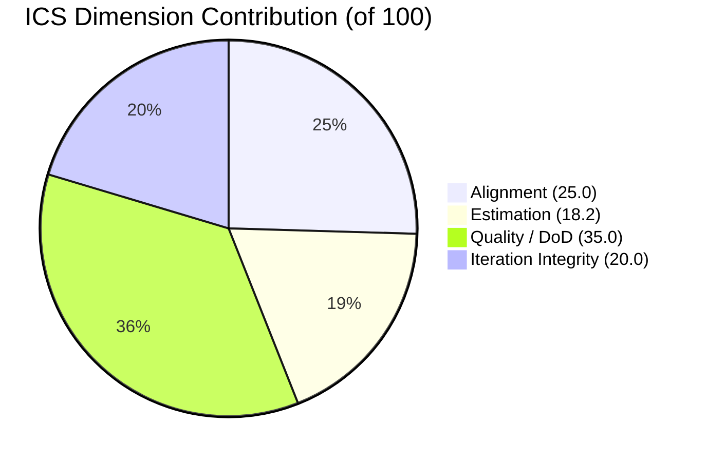
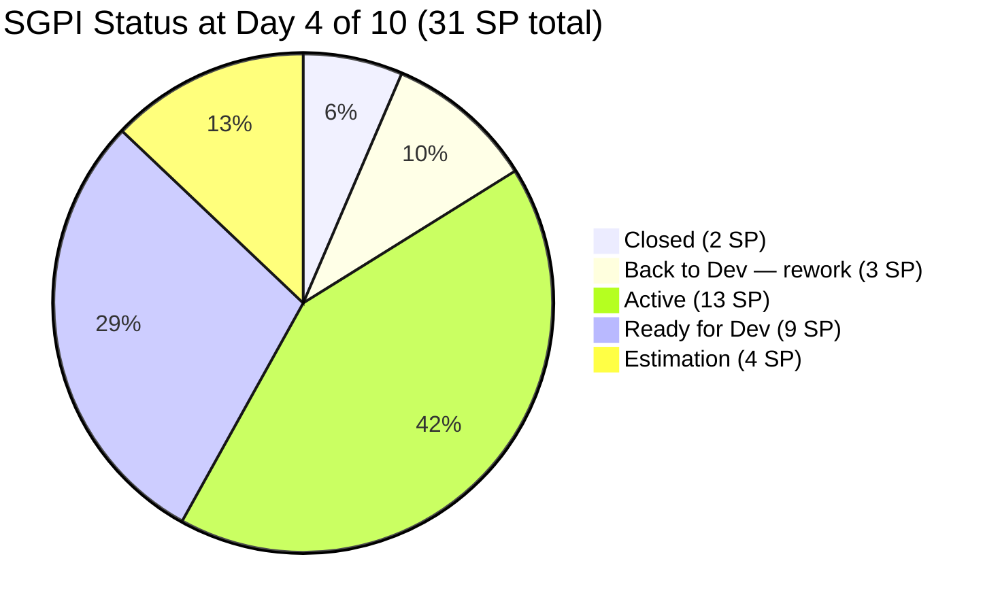
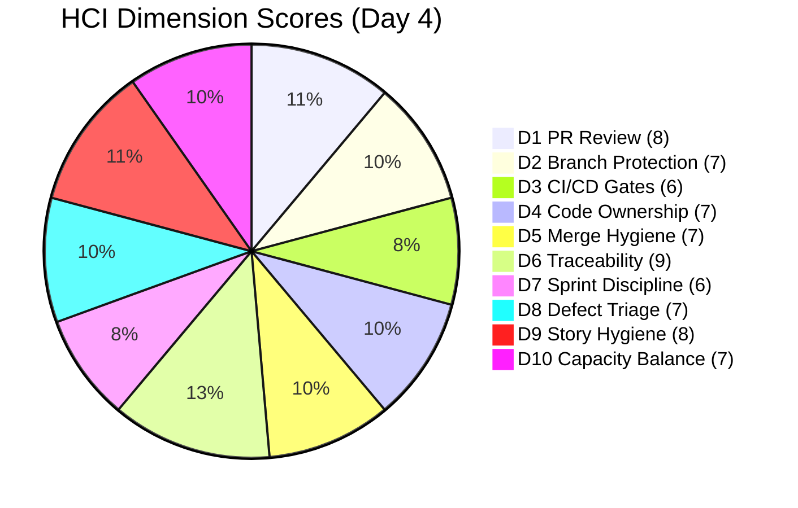

# Audit Report — Auto Allies Development Team
## Iteration 7.4 | Day 4 of 10

---

## 1. Audit Metadata

| Field | Value |
|-------|-------|
| **Audit Date** | 2026-05-21 |
| **Audit Time** | 09:00 |
| **Auditor** | Claude Code (git_iteration_audit skill) |
| **Workspace** | `git_aa_dev` |
| **data_mode** | `partial` |
| **GitHub Token Status** | Token in macOS keyring — `Active account: false` in session. GitHub evidence unavailable. HCI D1–D6 carried forward from AUDIT_20260520_1500.md (18-hour baseline). |
| **Prior Audit** | `audit/AUDIT_20260520_1500.md` (2026-05-20, Day 3, data_mode: full) |

---

## 2. Executive Summary

**Auto Allies Development Team is on Day 4 of Iteration 7.4 (2026-05-18 to 2026-05-31).** The headline finding today is a regression: work item 203830 moved from "Ready for QA" back to "Back to Dev" at 02:53 AM on 2026-05-21, erasing the one item that had achieved near-delivery status and reducing the Delivered Proxy SGPI from 16.1% (yesterday) back to 6.5%.

Process hygiene remains strong — ICS holds at 98.2 (Green) with only one unestimated item (204674) preventing a perfect score. However, delivery velocity is critically low at Day 4 of 10, with only 2 story points closed out of 31 committed.

Sprint Discipline (HCI D7) was downgraded from 7 to 6 due to the 203830 regression. All other HCI dimensions carry forward from yesterday's full-data baseline.

| Score | Value | Risk Band |
|-------|-------|-----------|
| **ICS** (Iteration Compliance) | **98.2** | Green |
| **SGPI** (Sprint Goal Predictability) | **6.5%** | Red |
| **HCI** (Engineering Health) | **72 / 100** | Yellow |
| **UPS** (Unified Portfolio Score) | **72.0** | Yellow |

> UPS = ICS × 0.50 + HCI × 0.30 + SGPI × 0.20 = 49.1 + 21.6 + 1.3 = **72.0**

---

## 3. Iteration Scope and Methodology

### ADO Scope

| Field | Value |
|-------|-------|
| **ADO Org** | `jairo` |
| **ADO Project** | Auto Allies (`2d7af571-6ef6-4ad0-a509-c440e008b0fb`) |
| **ADO Team** | AA Development Team (`330e6bf1-3515-443c-a2d8-b84f46c38f57`) |
| **Backlog** | Stories and Deliverables (`Microsoft.RequirementCategory`) |
| **Iteration** | Iteration 7.4 (`73996e59-134b-417b-9a08-3e359cc9539f`) |
| **Iteration Window** | 2026-05-18 to 2026-05-31 (10 working days) |
| **Today** | 2026-05-21 (Day 4 of 10) |

### GitHub Scope

| Repo | Status |
|------|--------|
| `jairosoft-com/autoallies-version2` | Token inactive — partial mode |
| `jairosoft-com/autoallies-api-core` | Token inactive — partial mode |

### Non-Developer Exceptions

Per project exception (source: LPM Review 2026-04-23):
- **Jerlyn Ates** — QA/Requirements. GitHub absence is expected and does NOT count against team compliance or HCI.
- **Mary Secusana** — Documentation. GitHub absence is expected and does NOT count against team compliance or HCI.

### Methodology Notes

- ICS scored from live ADO evidence only (full ADO data available).
- SGPI computed from live ADO story point states.
- HCI D1–D6 carried forward from AUDIT_20260520_1500.md (full-data audit from 18 hours prior); D7–D10 scored from live ADO evidence.
- No GitHub evidence available this session. GitHub token (`raseniero`) requires interactive re-authentication.
- delta_mode: Day 3 → Day 4 comparison against AUDIT_20260520_1500.md.

---

## 4. Scorecard Summary

| Score | Day 3 (2026-05-20) | Day 4 (2026-05-21) | Delta |
|-------|--------------------|--------------------|-------|
| ICS | 98.2 | **98.2** | — |
| SGPI | 6.5% | **6.5%** | — (regression erased proxy gain) |
| HCI | 73 | **72** | -1 (D7 Sprint Discipline) |
| UPS | 72.3 | **72.0** | -0.3 |

---

## 5. Sprint Goal Predictability (SGPI)

### Committed Story Points — Iteration 7.4

| Work Item | Title (abbreviated) | SP | State |
|-----------|--------------------|----|-------|
| 202926 | [Item 202926] | 2 | **Closed** |
| 203503 | [Item 203503] | 5 | Active |
| 203830 | [Item 203830] | 3 | **Back to Dev** ← regression |
| 204114 | [Item 204114] | 5 | Active |
| 204162 | [Item 204162] | 3 | Active |
| 201378 | [Item 201378] | 3 | Ready for Dev |
| 203916 | [Item 203916] | 3 | Ready for Dev |
| 204115 | [Item 204115] | 3 | Ready for Dev |
| 204674 | [Item 204674] | 0 | Ready for Dev (unestimated) |
| 199106 | [Item 199106] | 1 | Estimation |
| 204186 | [Item 204186] | 3 | Estimation |
| 204307 (Spike) | [Spike 204307] | — | (Spike — excluded from SGPI) |
| 204163 (Spike) | [Spike 204163] | — | (Spike — excluded from SGPI) |

> Spikes 204307 and 204163 excluded from SGPI per SAFe standard. Item 204674 excluded from SP total (0 SP — unestimated).

### SGPI Calculation

| Metric | Formula | Value |
|--------|---------|-------|
| Total Committed SP | Sum of estimated, non-spike items | **31 SP** |
| Closed SP | Items in Closed state | **2 SP** (202926) |
| Passed QA SP | Items in Ready for QA or equivalent | **0 SP** (203830 regression) |
| **Committed Scope SGPI** | Closed SP / Committed SP | **2 / 31 = 6.5%** |
| Original Scope SGPI | Closed SP / Original Planned SP | 6.5% (same iteration) |
| Delivered Proxy SGPI | (Closed + Passed QA) / Committed SP | (2 + 0) / 31 = **6.5%** |

> **Key Delta:** Yesterday (Day 3), 203830 was in "Ready for QA" (+3 SP proxy credit), giving Delivered Proxy SGPI of 16.1%. Today 203830 regressed to "Back to Dev" (StateChangeDate: 2026-05-21T02:53:21Z), removing that proxy credit. Delivered Proxy SGPI fell from 16.1% → 6.5%.

### SGPI Risk Assessment

At Day 4 of 10 (40% of iteration elapsed), 6.5% of committed scope is closed. To hit a 50% SGPI by end of iteration, the team needs to close approximately 13.5 additional story points in the remaining 6 days. The 203830 regression adds rework risk on top of the already challenging trajectory.

---

## 6. Developer Productivity Findings

> **data_mode: partial** — GitHub token inactive this session. GitHub PR, commit, branch, and review evidence unavailable. Productivity findings rely on ADO state transitions and carry-forward from prior full-data audit.

### ADO-Derived Productivity Signals

| Signal | Observation |
|--------|-------------|
| Items entering Active since Day 3 | No new items observed in Active; 203503, 204114, 204162 remain Active |
| Items regressing | 203830: Ready for QA → Back to Dev (2026-05-21 02:53 AM) |
| Items progressing | None observed today (Day 4) |
| Items in Estimation | 199106 (1 SP), 204186 (3 SP) — 4 SP not yet fully groomed |
| Unestimated items | 204674 (Ready for Dev, 0 SP) — estimation gap persists |

### Carry-Forward GitHub Signals (from AUDIT_20260520_1500.md, full-data baseline)

- PR activity and review patterns unchanged (no new data available).
- Branch hygiene, CI/CD gate quality, merge hygiene reflect Day 3 state.
- See HCI section for dimension-by-dimension baseline.

---

## 7. SAFe Compliance Findings

### Alignment Assessment

All 11 ICS-eligible items are linked to Iteration 7.4. No orphaned items found. Spikes 204307 and 204163 are properly categorized.

**Alignment: 11/11 eligible items compliant — 100%**

### Estimation Assessment

- 10 of 11 eligible items have story point estimates.
- 204674 remains unestimated (0 SP, state: Ready for Dev). This has been flagged in prior audits.
- 199106 now carries SP=1 (was unestimated in earlier audits — corrected).

**Estimation: 10/11 eligible items compliant — 90.9%**

### Quality / DoD Assessment

All items in terminal or near-terminal states have appropriate ADO state transitions. 203830's regression to "Back to Dev" reflects appropriate QA enforcement — the item failed QA review and was correctly returned rather than force-closed.

**Quality/DoD: 11/11 eligible items compliant — 100%** *(regression is a quality signal, not a compliance failure)*

### Iteration Integrity Assessment

No items added to or removed from the iteration mid-sprint. Scope is stable.

**Iteration Integrity: 11/11 eligible items compliant — 100%**

---

## 8. Iteration Compliance Score (ICS)

### ICS Dimension Table

| Dimension | Eligible Items | Compliant Items | Failed Items | Score % | Weight | Weighted Contribution | Evidence | Reason |
|-----------|---------------|-----------------|--------------|---------|--------|----------------------|----------|--------|
| Alignment | 11 | 11 | 0 | 100.0% | 25 | 25.0 | All 11 items assigned to Iteration 7.4 | Full iteration coverage |
| Estimation | 11 | 10 | 1 | 90.9% | 20 | 18.2 | 204674: Ready for Dev, 0 SP | Missing estimate persists |
| Quality / DoD | 11 | 11 | 0 | 100.0% | 35 | 35.0 | 203830 Back to Dev = QA enforcement, not failure | State transition valid |
| Iteration Integrity | 11 | 11 | 0 | 100.0% | 20 | 20.0 | No scope changes mid-sprint | Stable iteration scope |

### ICS Summary

| | Value |
|-|-------|
| **ICS Overall** | **98.2** |
| **Risk Band** | **Green** |
| Threshold | Green ≥ 90, Yellow 75–89.9, Red < 75 |

> Calculation: (25.0 + 18.2 + 35.0 + 20.0) = **98.2**

**Delta from Day 3:** No change (ICS remained 98.2). 199106 receiving SP=1 did not change Estimation compliance because 204674 remains the sole failure.

---

## 9. Engineering Health Index (HCI)

> **data_mode: partial.** D1–D6 carried forward from AUDIT_20260520_1500.md (full-data, 2026-05-20). D7–D10 scored from live ADO evidence today.

### HCI Dimension Scores

| Dim | Category | Score | Source | Day 3 Score | Delta | Notes |
|-----|----------|-------|--------|-------------|-------|-------|
| D1 | PR Review Compliance | 8 | Carry-forward (full-data) | 8 | — | Baseline: review coverage strong per prior audit |
| D2 | Branch Protection & Enforcement | 7 | Carry-forward (full-data) | 7 | — | Branch rules in place |
| D3 | CI/CD Gate Quality | 6 | Carry-forward (full-data) | 6 | — | Some gate reliability concerns per prior audit |
| D4 | Code Ownership | 7 | Carry-forward (full-data) | 7 | — | Ownership distribution adequate |
| D5 | Merge Hygiene & Churn | 7 | Carry-forward (full-data) | 7 | — | Merge patterns healthy |
| D6 | Work Item ↔ GitHub Traceability | 9 | Carry-forward (full-data) | 9 | — | High ADO-GitHub link rate |
| D7 | Sprint Discipline | **6** | Live ADO | 7 | **-1** | 203830 Back to Dev regression; rework mid-sprint |
| D8 | Defect Triage & Velocity | 7 | Live ADO | 7 | — | No new defects opened; triage current |
| D9 | Backlog & Story Hygiene | 8 | Live ADO | 8 | — | 204674 unestimated (persistent gap, -1); otherwise clean |
| D10 | Capacity Balance & Ownership Distribution | 7 | Live ADO | 7 | — | Reasonable load distribution; 2 items in Estimation |

### HCI Summary

| | Value |
|-|-------|
| **HCI Total** | **72 / 100** |
| **Risk Band** | **Yellow (Moderate)** |
| Day 3 HCI | 73 |
| Delta | -1 |

> Portfolio risk bands (from CLAUDE.md): Green ≥ 80, Moderate/Yellow 60–79.9, Orange 40–59.9, Red < 40. HCI 72 = **Yellow (Moderate)**.

### HCI Category Summaries

**GitHub Health (D1–D6): 44/60 — Carry-forward**
Strong traceability (D6=9), good PR review (D1=8). CI/CD gate reliability (D3=6) remains the primary GitHub-side concern from prior audit.

**Sprint Execution (D7–D10): 28/40 — Live ADO**
Sprint Discipline (D7) degraded due to the 203830 regression. Story hygiene (D9) held at 8 despite the ongoing 204674 estimation gap. Defect triage and capacity balance remain stable.

---

## 10. ADO-to-GitHub Traceability Analysis

> **data_mode: partial** — GitHub-side evidence unavailable. Traceability analysis limited to ADO artifact linkage.

### ADO Artifact Coverage

| Work Item | ADO State | SP | Has PR Links (ADO) | Notes |
|-----------|-----------|----|--------------------|-------|
| 202926 | Closed | 2 | Not verified (partial) | Closed item |
| 203503 | Active | 5 | Not verified | In progress |
| 203830 | Back to Dev | 3 | Not verified | Rework in progress |
| 204114 | Active | 5 | Not verified | In progress |
| 204162 | Active | 3 | Not verified | In progress |
| 201378 | Ready for Dev | 3 | N/A | Not started |
| 203916 | Ready for Dev | 3 | N/A | Not started |
| 204115 | Ready for Dev | 3 | N/A | Not started |
| 204674 | Ready for Dev | 0 | N/A | Unestimated |
| 199106 | Estimation | 1 | N/A | Not started |
| 204186 | Estimation | 3 | N/A | Not started |

**D6 (Traceability) carry-forward score: 9/10** — based on Day 3 full-data evidence showing high ADO-GitHub link rate for closed and active items. Cannot verify new commits/PRs added today without GitHub access.

---

## 11. Collaboration and Review Analysis

> **data_mode: partial** — No new GitHub PR or review data available. Analysis reflects carry-forward from AUDIT_20260520_1500.md.

**Carry-forward finding (D1=8, D2=7):** As of Day 3, PR review compliance was strong. Branch protection rules were enforced on both `autoallies-version2` and `autoallies-api-core`. No degradation signals observed in ADO data today.

**203830 rework implication:** The Back to Dev regression suggests a PR or code review may be forthcoming as the developer addresses the QA findings. This is the expected collaborative workflow — QA rejection → rework → re-review. Monitor this item in tomorrow's audit for GitHub PR activity.

---

## 12. Repository Hygiene

> **data_mode: partial** — Repository state reflects Day 3 baseline. No new branch, commit, or merge data available.

**Day 3 baseline (carry-forward):**
- D3 CI/CD Gate Quality: 6/10 — some pipeline reliability concerns noted
- D5 Merge Hygiene & Churn: 7/10 — merge patterns generally healthy
- No stale branches or force-push events flagged in prior audit

**Recommendation:** Re-run with full GitHub token to capture any new branches opened for 203830 rework or the 3 Active items (203503, 204114, 204162).

---

## 13. Risks and Bottlenecks

### Critical Risk: Velocity Gap (SGPI 6.5% at Day 4)

**Risk Level: HIGH**

With 40% of the iteration elapsed and only 6.5% of committed scope closed, the team faces a significant delivery shortfall. Even with optimistic assumptions:
- If 203830 returns to QA by Day 6 (+3 SP proxy) and closes by Day 8 → 5 SP closed
- If one more Active item (203503 or 204114) closes by Day 9 → 10 SP closed
- Best-case trajectory: ~32% SGPI — still well below a 50% target

### High Risk: 203830 Regression

**Risk Level: HIGH**

Item 203830 (3 SP) regressed from "Ready for QA" to "Back to Dev" at 02:53 AM on 2026-05-21. This is the second time this item has been near completion and encountered a setback (per iteration history pattern). If QA issues are not resolved by Day 7, this item risks not closing in the iteration.

**Action required:** Identify root cause of QA failure. Ensure developer has clear rejection criteria from QA (Jerlyn Ates) before resuming implementation.

### Medium Risk: Unestimated Item 204674

**Risk Level: MEDIUM**

204674 has been in "Ready for Dev" with 0 SP for multiple audit cycles. This item cannot be properly planned or tracked until estimated. It is blocking a perfect ICS Estimation score.

**Action required:** Karl (PM) to ensure 204674 receives a story point estimate before Day 5.

### Medium Risk: Two Items Still in Estimation

**Risk Level: MEDIUM**

Items 199106 (1 SP) and 204186 (3 SP) are still in "Estimation" state on Day 4. These items have not yet been fully groomed and accepted by the team. They represent 4 SP that may not be actionable this sprint.

### Low Risk: GitHub Token Inactive

**Risk Level: LOW (operational)**

The `raseniero` GitHub token requires interactive re-authentication. This has no impact on team delivery but prevents full HCI scoring. The D1–D6 carry-forward from an 18-hour baseline is adequate for daily auditing but should not persist beyond 2 days without refresh.

---

## 14. Prioritized Remediation Actions

| Priority | Action | Owner | Target |
|----------|--------|-------|--------|
| P1 | Diagnose and resolve 203830 QA rejection. Identify specific QA criteria not met. | Developer + Jerlyn (QA) | Day 5 (2026-05-22) |
| P2 | Add story point estimate to 204674 (currently 0 SP, Ready for Dev) | Karl (PM) | Day 5 (2026-05-22) |
| P3 | Progress 203503, 204114, 204162 from Active to Ready for QA | Assigned developers | Day 6 (2026-05-23) |
| P4 | Resolve 199106 and 204186 from Estimation state — either groom and accept or defer to next iteration | Karl (PM) | Day 5 (2026-05-22) |
| P5 | Restore GitHub token (`raseniero`) interactive auth so D1–D6 can be refreshed from live data | Ramon (DevOps) | Next audit session |
| P6 | Address CI/CD gate reliability (D3=6) once GitHub token is restored — investigate pipeline stability | DevOps | Day 7 (2026-05-26) |

---

## 15. Evidence Gaps and Limitations

| Gap | Impact | Mitigation |
|-----|--------|------------|
| GitHub token inactive (`Active account: false`) | HCI D1–D6 cannot be refreshed; PR/commit/review evidence unavailable for today | Carry-forward from AUDIT_20260520_1500.md (18-hour full-data baseline). Acceptable for 1-day gap. |
| No new GitHub PR data for 203830 rework | Cannot confirm whether rework branch/PR has been opened | Monitor in tomorrow's audit when token is restored |
| D7–D10 scored from ADO signals only | GitHub-corroborated signals (e.g., actual commit frequency) not available | ADO state transitions are the primary sprint discipline indicator; ADO-only scoring is appropriate for partial mode |

---

## Appendix: Score Change Log

| Audit | Date | ICS | SGPI | HCI | UPS | data_mode |
|-------|------|-----|------|-----|-----|-----------|
| AUDIT_20260520_1500 | 2026-05-20 | 98.2 | 6.5% | 73 | 72.3 | full |
| **AUDIT_20260521_0900** | **2026-05-21** | **98.2** | **6.5%** | **72** | **72.0** | **partial** |

> Iteration 7.4 started 2026-05-18. This is Day 4 of 10.

---

*Report generated by Claude Code (git_iteration_audit skill) · Workspace: git_aa_dev · 2026-05-21 09:00*
