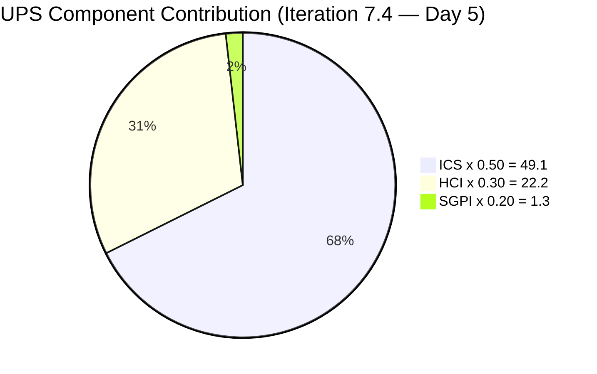
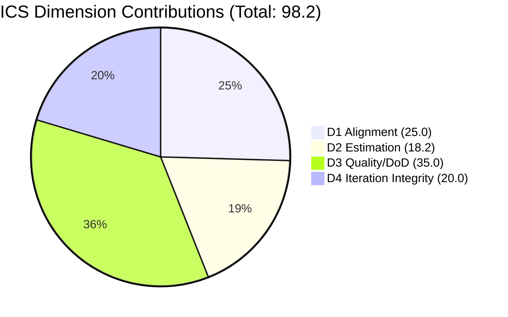
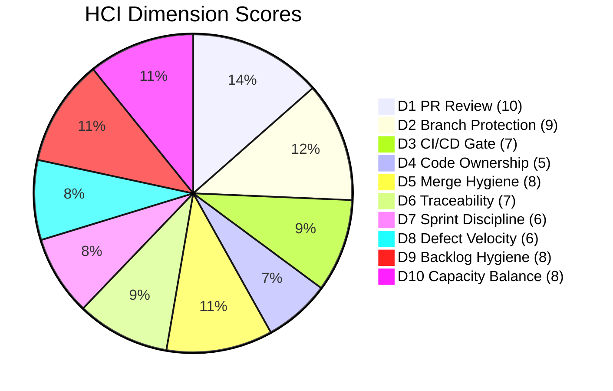

# Auto Allies Iteration Audit — 2026-05-22

## 1. Audit Metadata

| Field | Value |
|---|---|
| Audit Date | 2026-05-22 |
| Audit Time | 09:00 |
| Iteration | Iteration 7.4 |
| Iteration ID | 73996e59-134b-417b-9a08-3e359cc9539f |
| Iteration Start | 2026-05-18 |
| Iteration Finish | 2026-05-31 |
| Day of Iteration | 5 of 10 |
| ADO Project | Auto Allies (2d7af571-6ef6-4ad0-a509-c440e008b0fb) |
| ADO Team | AA Development Team (330e6bf1-3515-443c-a2d8-b84f46c38f57) |
| GitHub Repos | jairosoft-com/autoallies-version2, jairosoft-com/autoallies-api-core |
| Data Mode | **full** (live GitHub evidence; token restored 2026-05-20) |
| Prior Audit | AUDIT_20260520_1500.md (Iteration 7.4 Day 3, full data) |
| Auditor | Claude Code (claude-sonnet-4-6) |

---

## 2. Executive Summary

Iteration 7.4 is now at **Day 5 of 10 (50% elapsed)**. The team continues to demonstrate strong engineering discipline — all 13 PRs merged since iteration start carry at least one human approval, branch protection with required status checks is enforced on every key branch in both repos, and 10 of 13 PRs reference ADO work items directly. A notable quality improvement this iteration is the addition of a **PR Validation workflow** (`pr-validation.yml`) to both repos on Day 3, indicating active investment in CI/CD hygiene.

However, the **SGPI (Sprint Goal Predictability Index) at mid-iteration is a concern**. Only 1 item is Closed (Enabler 202926, 2 SP = 6.5% of committed scope), and 8 of 11 ICS-eligible items remain in pre-development states (Ready for Dev or Estimation). Defect 204162 has progressed to Ready for QA (3 SP), and User Story 203830 regressed from Ready for QA back to Back to Dev, consuming multiple PRs this week. With 5 days remaining and 29 SP undelivered, the team will need to accelerate significantly to avoid a significant delivery shortfall.

ICS remains strong at **98.2 (Green)** — the only persistent gap is Enabler 204674 missing story points, carried from Day 3. HCI improved by 1 point to **74/100 (Yellow)**, reflecting stable engineering practices and the new PR validation gate. The UPS of **72.6 places the team in the Moderate (Yellow) band**.

| Metric | Prior (Day 3) | Current (Day 5) | Delta |
|---|---|---|---|
| ICS | 98.2 | **98.2** | 0 |
| HCI | 73 | **74** | +1 |
| SGPI | 6.5% | **6.5%** | 0 |
| UPS | 72.3 | **72.6** | +0.3 |
| Risk Band | Yellow | **Moderate (Yellow)** | — |

> UPS is essentially flat (+0.3 vs. Day 3) at 72.6 — the HCI gain of +1 is offset by the continued SGPI stall; ICS holds steady at 98.2.

**Top risks entering the second half of the iteration:**
1. SGPI at 6.5% with 5 days remaining — 29 SP to deliver in the back half.
2. Defect 199106 aging in Estimation — carries from prior iterations with no movement.
3. Enabler 204674 still missing story points (Day 5 — persistent gap).
4. User Story 203830 regression to Back to Dev after multiple PR cycles.

---

## 3. Iteration Scope and Methodology

### Iteration 7.4 Scope

| Category | Count | Story Points |
|---|---|---|
| User Stories | 3 | 9 |
| Defects | 5 | 17 |
| Enablers | 3 | 5 (one missing SP) |
| Spikes (excluded from ICS) | 2 | 5.5 |
| **Total (incl. Spikes)** | **13** | **36.5** |
| **ICS-eligible (excl. Spikes)** | **11** | **31** |

### State Distribution

| State | Count | Items |
|---|---|---|
| Closed | 1 | 202926 |
| Ready for QA | 1 | 204162 |
| Back to Dev | 1 | 203830 |
| Active | 2 | 203503, 204114 |
| Ready for Dev | 4 | 204115, 203916, 201378, 204674 |
| Estimation | 2 | 204186, 199106 |

### Methodology

- **ICS:** Scored on 11 parent-level Stories, Defects, and Enablers in the iteration path. Spikes (204307, 204163) excluded per skill rules.
- **SGPI:** Headline = Closed SP / Total Committed SP (estimatable items only; 204674 excluded from denominator due to missing SP).
- **HCI:** All 10 dimensions scored from live GitHub evidence (token active since 2026-05-20). No carry-forward applied.
- **Developer scope:** Joseph Gerona (JosephJairo), Earl Carino (ecarinoJS), Cliff Carcueva (ccarcuevajairo). Jerlyn Ates (QA/Requirements) and Mary Secusana (Documentation/Testing) are non-developers and excluded from developer-specific metrics per project exception.
- **GitHub:** Both repos fully accessible. Iteration window: 2026-05-18 to present.
- **Team capacity:** 29 hrs/day across 5 team members (3 developers + 2 non-developers). No days off logged.

---

## 4. Scorecard Summary

| Score | Value | Weight | Contribution | Band |
|---|---|---|---|---|
| ICS | 98.2 | 50% | 49.1 | Green (≥90) |
| HCI | 74.0 | 30% | 22.2 | Yellow (60–79.9) |
| SGPI | 6.5% | 20% | 1.3 | — |
| **UPS** | **72.6** | — | — | **Moderate (Yellow)** |

**Risk band thresholds:** Low ≥ 80 (green) · Moderate 60–79.9 (yellow) · High 40–59.9 (orange) · Critical < 40 (red)

---

## 5. Sprint Goal Predictability (SGPI)

| Formula | Calculation | Result |
|---|---|---|
| Headline SGPI (Committed Scope) | Closed SP / Total Committed SP | 2 / 31 = **6.5%** |
| Original Scope SGPI | Same as committed (no scope changes detected) | 2 / 31 = **6.5%** |
| Delivered Proxy SGPI | (Closed + Ready for QA SP) / Committed SP | 5 / 31 = **16.1%** |

### Delivery Status

| ID | Type | Title | State | SP | Progress |
|---|---|---|---|---|---|
| 202926 | Enabler | [V2.0] Solidifying Migrated Data | **Closed** | 2 | Done |
| 204162 | Defect | [V2.0] List of Bugs - Account Issues | **Ready for QA** | 3 | Near done |
| 203830 | User Story | [V2.0] Super Admin - Affiliate Report | **Back to Dev** | 3 | Regressed |
| 203503 | Defect | [V2.0] List of Bugs - Sign Up | Active | 5 | In dev |
| 204114 | Defect | [V2.0] List of Bugs - Post Login | Active | 5 | In dev |
| 204115 | Defect | [V2.0] List of Bugs - Pre-Login | Ready for Dev | 3 | Not started |
| 203916 | User Story | [V2.0] Expired Member Page Redirection | Ready for Dev | 3 | Not started |
| 201378 | User Story | [V2.0] Update Public Landing Pages | Ready for Dev | 3 | Not started |
| 204674 | Enabler | [V2.0] Update Migration Script - Affiliates | Ready for Dev | — | Not started |
| 199106 | Defect | [V2.0] Apply Promo Code Discounts | Estimation | 1 | Blocked |
| 204186 | Enabler | [V2.0] E2E Testing QA Round 3 | Estimation | 3 | Not started |

**SGPI assessment:** At Day 5 (50% elapsed), the team has delivered 6.5% of committed scope. Linear expectation at this point would be ~50% (~15 SP). The gap is material. The team has 5 days remaining to deliver 29 SP across 9 unfinished items. The Back-to-Dev regression of 203830 (3 SP) after reaching Ready for QA is a velocity concern — it has consumed 5+ PRs (v2: #155, 156, 160; api: #110, 114) without completing the item.

---

## 6. Developer Productivity Findings

### PR Activity During Iteration 7.4 (2026-05-18 to 2026-05-22)

**autoallies-version2 (6 PRs merged):**

| PR | Author | Title | Merged | Base Branch |
|---|---|---|---|---|
| #155 | ccarcuevajairo | AB#203830 Add Affiliate List feature with CRUD | 2026-05-20 | develop |
| #156 | ccarcuevajairo | AB#203830 Add date-fns dependency | 2026-05-20 | develop |
| #157 | ecarinoJS | AB#202926 solidify migration, AB#204162 fix bugs | 2026-05-20 | develop |
| #158 | ecarinoJS | Standardized on pnpm, removed package-lock.json | 2026-05-21 | develop |
| #159 | ecarinoJS | AB#204162 fix attorney payout value | 2026-05-21 | develop |
| #160 | ccarcuevajairo | AB#203830 Add search to Affiliate List | 2026-05-22 | develop |

**autoallies-api-core (7 PRs merged):**

| PR | Author | Title | Merged | Base Branch |
|---|---|---|---|---|
| #109 | ecarinoJS | AB#203303 fix login issue | 2026-05-18 | dev |
| #110 | ccarcuevajairo | AB#203830 Add affiliate management endpoints | 2026-05-20 | dev |
| #111 | ecarinoJS | AB#202926 solidify migration, AB#204162 fix bugs | 2026-05-20 | dev |
| #112 | ecarinoJS | Added PR validation workflow: pr-validation.yml | 2026-05-21 | dev |
| #113 | ecarinoJS | AB#204162 fix deployment issue | 2026-05-21 | dev |
| #114 | ccarcuevajairo | AB#203830 Enhance affiliate profile management | 2026-05-22 | dev |
| #115 | ecarinoJS | Fix/deployment issue 7.4 | 2026-05-22 | dev |

### Developer Contribution Summary

| Developer | PRs Authored (v2) | PRs Authored (api) | Total PRs | Commits (iteration) |
|---|---|---|---|---|
| Earl Carino (ecarinoJS) | 3 | 5 | 8 | ~10 |
| Cliff Carcueva (ccarcuevajairo) | 3 | 2 | 5 | ~7 |
| Joseph Gerona (JosephJairo) | 0 | 0 | 0 (reviewer only) | 0 |

> Note: Joseph Gerona reviewed and approved multiple PRs (PR#155, 156, 158, 159, 160 in v2; PR#110, 112, 113, 114 in api) but did not author any PRs in the iteration window. No commits attributed to JosephJairo in either repo since 2026-05-18.

**Key observation:** Joseph Gerona has not committed code or authored a PR in either repository since the iteration started (Day 1–5). He has 3 Active or Ready-for-Dev work items assigned (204114, 204115, 203916). This bears monitoring — his items may be delayed.

---

## 7. SAFe Compliance Findings

### Iteration State Summary

- **1 item Closed** (202926) — Enabler completed on Day 3.
- **1 item at Ready for QA** (204162) — Defect progressed; 3 SP approaching done.
- **1 item regressed** (203830) — User Story Back to Dev after reaching Ready for QA at Day 3.
- **2 items Active** — Defects 203503 and 204114 in active development.
- **4 items in Ready for Dev** — Not yet started. Includes 204674 (missing SP) and 201378 (landing pages).
- **2 items in Estimation** — 199106 and 204186. Defect 199106 has been in Estimation across multiple iterations.

### Story Point Compliance

- 10 of 11 ICS-eligible items have story points estimated.
- **204674** (Enabler: Update Migration Script for Affiliates) remains without story points — this has been flagged since Day 3 of this iteration. Item has full description and acceptance criteria; SP assignment is the only remaining gap.

### Scope Integrity

- No items added or removed from the iteration scope since Day 3.
- Iteration path confirmed for all items: `Auto Allies\2026-PI7\Iteration 7.4`.

---

## 8. Iteration Compliance Score (ICS)

**ICS: 98.2 / 100 — Green**

| Dimension | Weight | Eligible | Compliant | Failed | Score% | Weighted Contribution | Evidence | Reason for Failures |
|---|---|---|---|---|---|---|---|---|
| D1 Alignment | 25 | 11 | 11 | 0 | 100.0% | 25.00 | All 11 items assigned + in Iteration 7.4 path | None |
| D2 Estimation | 20 | 11 | 10 | 1 | 90.9% | 18.18 | SP present on 10/11 items | 204674 missing story points |
| D3 Quality/DoD | 35 | 11 | 11 | 0 | 100.0% | 35.00 | All items have description + acceptance criteria | None |
| D4 Iteration Integrity | 20 | 11 | 11 | 0 | 100.0% | 20.00 | All items in correct iteration path, no orphaned tasks | None |
| **ICS Total** | **100** | **11** | **—** | **—** | **—** | **98.18** | — | — |

**Failures:**
- **204674** (Enabler: Update Migration Script for Affiliates): Missing story points. Item has description, acceptance criteria, and assignee (Earl Carino). This has been an open risk since Iteration 7.4 Day 3 (2026-05-20). Item is in Ready for Dev state — it should not be entering development without an estimate.

---

## 9. Engineering Health Index (HCI)

**HCI: 74 / 100 — Yellow**

| Dim | Name | Score | Evidence Summary |
|---|---|---|---|
| D1 | PR Review Compliance | 10/10 | All 13 iteration PRs received human approval before merge |
| D2 | Branch Protection | 9/10 | main/develop/staging (v2) and main/dev/staging (api) all protected: 1 required review, dismiss stale, required status checks; no CODEOWNERS |
| D3 | CI/CD Gate Quality | 7/10 | Quality gates passing on all PRs; PR Validation workflow added Day 3; deployment pipeline had transient failures today (4 api-core deploy failures 2026-05-22) |
| D4 | Code Ownership | 5/10 | No CODEOWNERS file in either repo; 3 developers active with informal ownership by module |
| D5 | Merge Hygiene & Churn | 8/10 | All PRs target develop/dev (not main); branch naming generally follows convention; repo-health PRs (#158, #112) caused intentional high-churn cleanup |
| D6 | Work Item Traceability | 7/10 | 10 of 13 iteration PRs contain AB# references; 3 PRs without refs (repo-health cleanup, deployment fix) are justified; Active items 203503/204114 lack PR links at Day 5 |
| D7 | Sprint Discipline | 6/10 | Only 1 item Closed at mid-iteration; 8/11 items in pre-dev states; 203830 regressed; Joseph Gerona has no commits/PRs yet despite 3 assigned items |
| D8 | Defect Triage & Velocity | 6/10 | 1/5 defects at Ready for QA; 0 defects Closed; 199106 aging in Estimation across iterations |
| D9 | Backlog & Story Hygiene | 8/10 | All items have description + acceptance criteria; 204674 still missing SP; 199106 aging |
| D10 | Capacity Balance & Ownership Distribution | 8/10 | Earl (8 PRs) and Cliff (5 PRs) active; Joseph active as reviewer only; capacity spread is reasonable given task assignments |
| **Total** | | **74/100** | |

---

## 10. ADO-to-GitHub Traceability Analysis

### PR-to-Work Item Mapping

| Repo | PR | AB# Ref | Work Item ID | In Iteration? |
|---|---|---|---|---|
| version2 | #155 | AB#203830 | 203830 | Yes |
| version2 | #156 | AB#203830 | 203830 | Yes |
| version2 | #157 | AB#202926, AB#204162 | 202926, 204162 | Yes |
| version2 | #158 | None | — | N/A (repo health) |
| version2 | #159 | AB#204162 | 204162 | Yes |
| version2 | #160 | AB#203830 | 203830 | Yes |
| api-core | #109 | AB#203303 | 203303 | No (prior iteration) |
| api-core | #110 | AB#203830 | 203830 | Yes |
| api-core | #111 | AB#202926, AB#204162 | 202926, 204162 | Yes |
| api-core | #112 | None | — | N/A (CI/CD tooling) |
| api-core | #113 | AB#204162 | 204162 | Yes |
| api-core | #114 | AB#203830 | 203830 | Yes |
| api-core | #115 | None | — | N/A (deployment fix) |

**Traceability rate:** 10/13 PRs (77%) have AB# references. The 3 without references are justified:
- PR#158 / PR#112: Repository health cleanup (pnpm standardization, PR validation workflow setup).
- PR#115: Deployment hotfix.

### Work Items With GitHub Activity

| Work Item | Type | PRs | Status |
|---|---|---|---|
| 202926 | Enabler | v2#157, api#111 | **Closed** — fully traced |
| 204162 | Defect | v2#157, v2#159, api#111, api#113 | Ready for QA — 4 PRs |
| 203830 | User Story | v2#155, v2#156, v2#160, api#110, api#114 | Back to Dev — 5 PRs, still open |

### Work Items Without GitHub Activity (Days 1–5)

| Work Item | Type | State | Assigned Dev | Gap |
|---|---|---|---|---|
| 203503 | Defect | Active | Cliff Carcueva | No PR yet — Active but no code |
| 204114 | Defect | Active | Joseph Gerona | No PR yet — Active but no code |
| 204115 | Defect | Ready for Dev | Joseph Gerona | Expected at this stage |
| 203916 | User Story | Ready for Dev | Joseph Gerona | Expected at this stage |
| 201378 | User Story | Ready for Dev | Earl Carino | Expected at this stage |
| 204674 | Enabler | Ready for Dev | Earl Carino | Expected at this stage |
| 199106 | Defect | Estimation | Jerlyn Ates | Estimation state — no dev expected |
| 204186 | Enabler | Estimation | Jerlyn Ates | Estimation state — no dev expected |

> Active items (203503, 204114) in ADO with no corresponding GitHub activity by Day 5 is a traceability concern. If work is happening, it is not yet visible in GitHub.

---

## 11. Collaboration and Review Analysis

### PR Review Distribution (Iteration 7.4)

| Reviewer | PRs Reviewed | Repos |
|---|---|---|
| JosephJairo | 8 | version2 (#155, #156, #158, #159, #160), api-core (#110, #112, #113) |
| ccarcuevajairo | 7 | version2 (#157, #158, #159), api-core (#109, #111, #112, #115) |
| ecarinoJS | 2 | version2 (#160), api-core (#114) |
| copilot-pull-request-reviewer[bot] | COMMENT only | version2 (#155, #156, #160), api-core (#110, #114) |
| copilot-swe-agent[bot] | COMMENT only | version2 (#156), api-core (#110) |

**Observations:**
- All 13 PRs received at least one human APPROVED review before merge.
- Joseph Gerona is acting as the primary reviewer (8 reviews in 5 days) despite not authoring code himself in this period — this is a healthy cross-team check pattern.
- No PRs were merged without human approval (self-merge without review = 0).
- PR#159 and PR#113 had a DISMISSED review (JosephJairo) followed by a fresh APPROVED — indicates proper re-review cycle.
- Copilot AI reviews are supplementary and do not count toward compliance.

### Earl Carino PR Review Issue (Prior Audit Risk)

Prior audit flagged Earl Carino as a reviewer risk. This iteration Earl has reviewed 2 PRs (v2#160, api#114) while authoring 8 PRs. The review load is skewed toward Joseph and Cliff. No single person is reviewing their own PRs — cross-review is occurring.

---

## 12. Repository Hygiene

### Branch Count and Staleness

| Repo | Total Branches | Protected Branches | Estimated Stale Branches |
|---|---|---|---|
| autoallies-version2 | 78 | 3 (main, develop, staging) | ~60+ (pre-iteration feature/story branches) |
| autoallies-api-core | 64 | 3 (main, dev, staging) | ~50+ |

**Stale branch concern persists.** Both repos carry a large number of unmerged feature/story branches from prior iterations (e.g., `story/193360-upload-ticket`, `feature/sign-up`, `feature/messaging-cliff`, `story/194633-instant-qoute-membership`). The 50+ stale branches flagged in the Day 3 audit remain. However, active iteration branches are clean and named with proper conventions.

### PR Validation Workflow (New)

Earl Carino added `pr-validation.yml` to both repos on 2026-05-21 (api-core PR#112, version2 PR#158). This is a significant positive:
- PR Validation workflow is now running on all pull requests.
- Some initial failures were observed (PR#160 had 3 PR Validation failures before passing — likely during workflow tuning).
- The workflow is now passing consistently as of 2026-05-22.

### Repository-Level Changes (Repo Health PR#158 / PR#112)

- **pnpm standardization** (v2): Removed tracked `package-lock.json` (7,557 lines deleted), standardized on `pnpm`. This is a positive cleanup reducing lock-file conflicts.
- **Dependency overhaul** (api-core): 4,446 additions / 1,932 deletions across 146 files — likely a package update / cleanup cycle.
- Both changes are legitimate technical debt reduction, not feature scope creep.

### CI/CD Pipeline Status

| Pipeline | Repo | Status (2026-05-22) | Notes |
|---|---|---|---|
| Code Quality (PR checks) | version2 | Passing | Required status check on protected branches |
| Code Quality (PR checks) | api-core | Passing | Required status check on protected branches |
| PR Validation | version2 | Passing | New workflow, stable as of today |
| PR Validation | api-core | Passing | New workflow, stable as of today |
| Pipeline for frontendv2 (deploy) | version2 | Success | 3 deployments today |
| Trigger deployment for api-core | api-core | Mixed | 3 failures + 3+ successes today — deployment issue being actively fixed |

The api-core deployment instability today is likely related to PR#115 ("Fix/deployment issue 7.4"), which was merged at 08:06 today and appears to have resolved the failures.

---

## 13. Risks and Bottlenecks

| # | Risk | Severity | Status | Owner |
|---|---|---|---|---|
| R1 | SGPI at 6.5% at Day 5 — 29 SP remaining in 5 days | **High** | Active | Karl Caumban (PM) |
| R2 | Joseph Gerona has no GitHub activity in iteration (0 PRs, 0 commits) despite 3 assigned items | **High** | New | Joseph Gerona |
| R3 | 203830 (Super Admin Affiliate Report) stuck in Back-to-Dev loop — 5 PRs merged, still open | **Medium** | Persistent | Cliff Carcueva |
| R4 | 204674 (Enabler: Migration Script) still missing story points at Day 5 | **Medium** | Persistent since Day 1 | Earl Carino |
| R5 | 199106 (Promo Code defect) aging in Estimation — multiple iterations without progress | **Medium** | Persistent | Jerlyn Ates / PM |
| R6 | api-core deployment pipeline had 4 failures today before fix | **Low** | Resolving | Earl Carino |
| R7 | No CODEOWNERS file in either repo — ownership is informal | **Low** | Ongoing | Dev team |
| R8 | 50–78 stale branches in both repos | **Low** | Persistent | Dev team |

---

## 14. Prioritized Remediation Actions

| Priority | Action | Owner | Due | Impact |
|---|---|---|---|---|
| P1 | **Investigate Joseph Gerona's unstarted items** (204114 Active, 204115 Ready for Dev, 203916 Ready for Dev) — escalate in next DSU if blocked | Karl / Joseph | 2026-05-22 | +SGPI, +HCI D7 |
| P2 | **Assign story points to 204674** before Earl starts development — item is in Ready for Dev with no estimate | Earl Carino | 2026-05-22 | +ICS, +HCI D9 |
| P3 | **Resolve 203830 regression** — identify root cause of Back-to-Dev cycle; set clear acceptance criteria gate before re-submission to QA | Cliff / Jerlyn | 2026-05-23 | +SGPI |
| P4 | **Triage 199106** (Promo Code defect) — decide to carry forward or deprioritize; it has been in Estimation for multiple iterations | Karl / Jerlyn | 2026-05-23 | +HCI D8, backlog hygiene |
| P5 | **Verify api-core deployment pipeline stability** post PR#115 — confirm all environments are deploying cleanly | Earl Carino | 2026-05-22 | +HCI D3 |
| P6 | **Add CODEOWNERS file** to both repos — improves code ownership traceability and auto-assigns reviewers | Earl / Team | 2026-05-28 | +HCI D4 (+3–4 pts) |
| P7 | **Branch cleanup sprint** — archive/delete stale branches from prior iterations (both repos have 50–78 branches) | Dev team | End of iteration | +HCI D5 |

---

## 15. Evidence Gaps and Limitations

| Gap | Impact | Notes |
|---|---|---|
| No CODEOWNERS file in either repo | D4 scored conservatively at 5/10 | Formal ownership structure not declared in code |
| Joseph Gerona's items (204114, 204115) are in Active/Ready for Dev with no GitHub evidence | D7 Sprint Discipline impact | ADO state says Active but no visible code activity in GitHub as of Day 5 |
| 203830 Sub-tasks not individually assessed | Parent-level scoring only | Item has 6 child tasks; QA regression cause not determinable from ADO state alone |
| Deployment failure root cause (api-core, 4 fails on 2026-05-22) | D3 CI/CD scored at 7/10 | PR#115 appears to have resolved it; confirmation pending |
| GitHub commit attribution for child task work | Traceability partial | Child tasks (sub-tasks) may have commits not explicitly tagged to parent AB# |
| Story 203303 PR (api-core #109, merged 2026-05-18) | Not in this iteration's scope | Work item 203303 belongs to a prior iteration — PR merged on iteration start day; counted in HCI window but not ICS |

---

*Report generated on 2026-05-22 at 09:00 by Claude Code (claude-sonnet-4-6). All evidence collected live from Azure DevOps (API) and GitHub (REST API via gh CLI). No carry-forward data applied. Data mode: full.*
