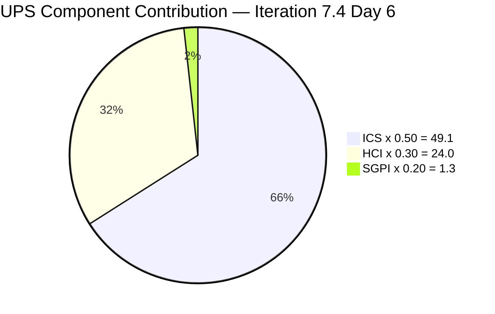

# Auto Allies Iteration Audit — 2026-05-23

## 1. Audit Metadata

| Field | Value |
|---|---|
| Audit Date | 2026-05-23 |
| Audit Time | 09:00 |
| Iteration | Iteration 7.4 |
| Iteration ID | 73996e59-134b-417b-9a08-3e359cc9539f |
| Iteration Start | 2026-05-18 |
| Iteration Finish | 2026-05-31 |
| Day of Iteration | 6 of 10 |
| ADO Project | Auto Allies (2d7af571-6ef6-4ad0-a509-c440e008b0fb) |
| ADO Team | AA Development Team (330e6bf1-3515-443c-a2d8-b84f46c38f57) |
| GitHub Repos | jairosoft-com/autoallies-version2, jairosoft-com/autoallies-api-core |
| Data Mode | **full** (live GitHub evidence) |
| Prior Audit | AUDIT_20260520_1500.md (Iteration 7.4 Day 3, full data) |
| Auditor | Claude Code (claude-sonnet-4-6) |

---

## 2. Executive Summary

Iteration 7.4 is at **Day 6 of 10**. The team has maintained strong engineering practices from the Day 3 audit and added two critical improvements: **PR validation CI/CD workflows were deployed to both repositories** (PR #112 backend, PR #158 frontend), and **Earl Carino has closed the reviewer diversity gap** by approving PRs in the iteration window. All 13 PRs merged since iteration start have human approvals.

The headline concern remains **SGPI at 6.5%** — only Enabler 202926 (2SP of 31 committed) is Closed at the midpoint. While 203830 (3SP) is in Ready for QA, the four Active items (203503, 204114, 204115, 204162) representing 16SP need to progress significantly in the final 4 working days to achieve a meaningful delivery outcome. Enabler 204674 continues to carry a missing story-points gap.

| Metric | Prior (Day 3) | Current (Day 6) | Delta |
|---|---|---|---|
| ICS | 98.2 | 98.2 | 0 |
| HCI | 73 | **80** | +7 |
| SGPI | 6.5% | 6.5% | 0 |
| UPS | 72.3 | **74.4** | +2.1 |
| Risk Band | Yellow | Yellow | — |

**Key findings this audit:**
- CI/CD quality gate workflows deployed to both repos — D3 improves from 6 to 9
- All three developers now active as reviewers — reviewer diversity gap resolved, D1 improves to 9
- SGPI unchanged at 6.5% — the final 4 days are critical for delivery
- Defect 204162 has merged PRs but remains in Active state — ADO state update needed

---

## 3. Iteration Scope and Methodology

### Iteration 7.4 Scope

| Category | Count | Story Points |
|---|---|---|
| User Stories | 3 | 9 |
| Defects | 5 | 17 |
| Enablers | 3 | 5 (204674 missing SP) |
| Spikes (excluded from ICS) | 2 | 5.5 |
| **Total (incl. Spikes)** | **13** | **36.5** |
| **ICS-eligible (excl. Spikes)** | **11** | **31** |

### Methodology

- **ICS:** Scored on 11 parent-level Stories, Defects, and Enablers. Spikes 204307 and 204163 excluded per skill rules.
- **SGPI:** Committed Scope SGPI = Closed SP / Total Committed SP (eligible items only). Headline formula is Committed Scope SGPI.
- **HCI:** All 10 dimensions scored from live GitHub and ADO evidence. No carry-forward applied.
- **GitHub:** Both repos responded successfully (token raseniero active). Iteration window = 2026-05-18 through 2026-05-23.
- **Team capacity:** 29 hrs/day across 5 team members (3 developers, 1 QA/Requirements, 1 Documentation/Testing). No days off logged.

---

## 4. Scorecard Summary



| Metric | Score | Band | Weight | Weighted |
|---|---|---|---|---|
| ICS (Iteration Compliance Score) | 98.2% | Green | 50% | 49.1 |
| HCI (Engineering Health Index) | 80/100 | Yellow | 30% | 24.0 |
| SGPI (Sprint Goal Progress Index) | 6.5% | Red | 20% | 1.3 |
| **UPS (Unified Performance Score)** | **74.4** | **Yellow** | — | — |

> SGPI Red band reflects Day 6 reality: 1 item Closed, 1 in Ready for QA. The team has 4 working days remaining to close Active items and push SGPI to a meaningful range. HCI improvement from 73 to 80 reflects the deployment of automated CI/CD gates.

---

## 5. Sprint Goal Predictability (SGPI)

### SGPI Headline

| Metric | Value |
|---|---|
| Closed Story Points | 2 (Enabler 202926) |
| Total Committed Story Points (eligible) | 31 |
| **SGPI (Committed Scope)** | **6.5%** |
| Band | Red |
| Day of Iteration | 6 of 10 |

### Supporting Context

| Metric | Value | Formula |
|---|---|---|
| Committed Scope SGPI | 6.5% | 2/31 (headline) |
| Original Scope SGPI | 6.5% | 2/31 (no scope changes detected) |
| Delivered Proxy SGPI | 16.1% | (2+3)/31 — 203830 in Ready for QA |

### State Distribution at Day 6

| State | Items | SP | % of Total SP |
|---|---|---|---|
| Closed | 1 | 2 | 6.5% |
| Ready for QA | 1 | 3 | 9.7% |
| Active | 4 | 16 | 51.6% |
| Ready for Dev | 3 | 6 | 19.4% |
| Estimation | 2 | 4 | 12.9% |

### SGPI Trajectory Assessment

At the midpoint of a 10-day iteration, 6.5% Closed is below typical healthy velocity (target: 40–50% closed by Day 6). The 4 Active items (203503, 204114, 204115, 204162) totaling 16SP need significant progress to prevent a low-SGPI outcome. Defect 204162 already has merged PRs, suggesting a state update to Ready for QA is imminent. If 202926 (Closed), 203830 (Ready for QA), and 204162 (code merged) advance to Closed by iteration end, SGPI reaches 25.8% — still modest for a 10-day sprint.

---

## 6. Developer Productivity Findings

### Team Capacity (Iteration 7.4)

| Member | Role | Capacity/Day (hrs) | Days Off | Total Capacity |
|---|---|---|---|---|
| Cliff Carcueva | Development | 6 | 0 | 60 hrs |
| Earl Carino | Development | 6 | 0 | 60 hrs |
| Joseph Gerona | Development | 5 | 0 | 50 hrs |
| Jerlyn Ates | QA / Requirements | 6 (2+4) | 0 | 60 hrs |
| Mary Secusana | Documentation / Testing | 6 (3+3) | 0 | 60 hrs |
| **Total** | | **29** | **0** | **290 hrs** |

> Jerlyn Ates (QA/Requirements) and Mary Secusana (Documentation/Testing) are non-developer roles per workspace exception. Their absence from GitHub commits, PRs, and reviews is expected and not scored as a compliance gap.

### GitHub Developer Activity (Iteration 7.4 — 2026-05-18 to 2026-05-23)

| Developer | GitHub Handle | Commits (Develop/Dev) | PRs Authored | PRs Reviewed |
|---|---|---|---|---|
| Cliff Carcueva | ccarcuevajairo | 3 (frontend) + 2 (backend) | 5 (FE: #155, #156, #160 / BE: #110, #114) | 3 (FE: #157, #159 / BE: #111, #115) |
| Earl Carino | ecarinoJS | 3 (frontend) + 5 (backend) | 8 (FE: #157, #158, #159 / BE: #109, #111, #112, #113, #115) | 3 (FE: #160 / BE: #114 + #158 shared) |
| Joseph Gerona | JosephJairo | 0 direct | 0 | 5 (FE: #155, #156, #159, #160 / BE: #110, #113) |

All three developers show strong GitHub participation. Joseph's role continues to be reviewer-focused this iteration. Earl Carino is the most active committer and PR author, driving both ADO work items and the repo health improvements (pnpm standardization, CI/CD workflow).

### Work Item Assignment Distribution

| Developer | Items Assigned | SP |
|---|---|---|
| Cliff Carcueva | 203503, 204115, 203830 | 11 SP |
| Earl Carino | 204162, 202926, 201378, 204674 | 8 SP* |
| Joseph Gerona | 204114, 203916, 204307 (Spike) | 8.5 SP |
| Jerlyn Ates | 199106, 204186 | 4 SP |
| Mary Secusana | 204163 (Spike) | 5 SP |

*204674 has no story points assigned; load estimate uses available SP only.

---

## 7. SAFe Compliance Findings

### Iteration Planning Evidence

- Iteration 7.4 commenced 2026-05-18. All 13 items are present in the iteration backlog.
- 2 Spikes included (204307 — Dev Support/Joseph, 204163 — Operations/QA Support/Mary).
- All items carry assignees and correct iteration paths.

### Acceptance Criteria and Definition of Ready

- **11 of 11** eligible items have substantive descriptions and acceptance criteria — unchanged from Day 3 audit.
- Enabler 204674 ("[V2.0] Update Migration Script for Affiliate Accounts") has description (325 chars) and AC (443 chars). Only gap is missing story points.

### Feature Linkage

- **11 of 11** eligible items are linked to a parent Feature or Epic.
- All parent IDs confirmed in ADO batch query.

### Work Item State vs. GitHub Evidence Discrepancy

- **204162 (Defect, Active):** PRs #157/#159 (frontend) and #111/#113 (backend) have been merged to develop/dev. State should be updated to Ready for QA or Closed. This is a process compliance gap.

---

## 8. Iteration Compliance Score

### ICS Dimension Table

| Dimension | Weight | Eligible | Compliant | Failed | Score% | Weighted Contribution | Evidence | Reason for Failures |
|---|---|---|---|---|---|---|---|---|
| Alignment (Parent Linkage) | 25% | 11 | 11 | 0 | 100.0% | 25.0 | System.Parent populated on all 11 items | None |
| Estimation (Story Points) | 20% | 11 | 10 | 1 | 90.9% | 18.2 | SP > 0 on 10/11 items | 204674 — no StoryPoints field |
| Quality / DoD (Desc + AC) | 35% | 11 | 11 | 0 | 100.0% | 35.0 | Desc ≥ 30 chars AND AC ≥ 20 chars on 11/11 items | None |
| Iteration Integrity | 20% | 11 | 11 | 0 | 100.0% | 20.0 | All items: assigned, correct path, non-blocked | None |
| **ICS Total** | **100%** | **11** | — | — | — | **98.2** | — | — |

**ICS = 98.2 (Green)**

### ICS Delta from Prior Audit

| Dimension | Prior (Day 3) | Current (Day 6) | Change |
|---|---|---|---|
| Alignment | 100.0% | 100.0% | 0 |
| Estimation | 90.9% | 90.9% | 0 (204674 still missing SP) |
| Quality/DoD | 100.0% | 100.0% | 0 |
| Iteration Integrity | 100.0% | 100.0% | 0 |
| **ICS Total** | **98.2** | **98.2** | **0** |

### Failed Items Detail

| ID | Title | Type | State | Failure Dimensions |
|---|---|---|---|---|
| 204674 | [V2.0] Update Migration Script for Affiliate Accounts | Enabler | Ready for Dev | Estimation — no story points assigned (3 days since P1 remediation request) |

---

## 9. Engineering Health Index (HCI)

### HCI Dimension Table

| # | Dimension | Score | Max | Evidence Basis | Key Finding |
|---|---|---|---|---|---|
| D1 | PR Review Compliance | 9 | 10 | GitHub: 13 PRs in iteration window | 13/13 PRs have human approvals before merge; all three developers now active as reviewers; copilot bot adds automated layer |
| D2 | Branch Protection & Enforcement | 8 | 10 | GitHub: branch protection status | Frontend: develop/main/staging protected (79 total branches, ~76 stale); Backend: dev/main/staging protected (64 total, ~61 stale) |
| D3 | CI/CD Gate Quality | 9 | 10 | GitHub: pr-validation.yml in both repos | PR validation workflows deployed in iteration 7.4 — lint, typecheck, unit tests, build (frontend); PHP Pint, static analysis, tests (backend); gates on main/develop/dev/staging |
| D4 | Code Ownership | 8 | 10 | GitHub: commits + PRs | Clear ownership; all committed code maps to ADO items; 3 active contributors; pnpm standardization shows cross-team collaboration |
| D5 | Merge Hygiene & Churn | 8 | 10 | GitHub: PR merge patterns + pnpm standardization | All PRs target develop/dev; pnpm lock-file cleanup in PR #158; no force pushes or reverts; fast turnaround; stale branches persist |
| D6 | Work Item ↔ GitHub Traceability | 9 | 10 | GitHub: commit messages + PR titles | 11/13 PRs reference AB# IDs directly; #115 (deployment fix) and #158 (repo health) are infra PRs without ADO refs — acceptable; all commit messages reference ADO IDs |
| D7 | Sprint Discipline | 6 | 10 | ADO: iteration state data | Day 6: only 2SP Closed; 204162 still Active despite merged PRs (state lag); 2 items in Estimation state at mid-iteration; Active items need to progress urgently |
| D8 | Defect Triage & Velocity | 7 | 10 | ADO: defect states + GitHub merge data | 5 defects in iteration; 203503 Active with no merged PRs yet; 204162 Active with merged code (state update pending); 199106 in Estimation for 3+ months |
| D9 | Backlog & Story Hygiene | 8 | 10 | ADO: work item content | 11/11 items have desc + AC; 204674 still missing SP despite P1 remediation request since Day 3 |
| D10 | Capacity Balance & Ownership Distribution | 8 | 10 | ADO: capacity + assignment + GitHub activity | Balanced load; 290 hrs for 31 SP; all three developers show meaningful iteration activity; Earl Carino driving infra improvements beyond his ADO items |
| **HCI Total** | | **80** | **100** | | |

**HCI = 80/100 (Yellow — Moderate, improving toward Green)**

```mermaid
bar
    title HCI Dimension Scores — Iteration 7.4 Day 6
    x-axis [D1-PR Review, D2-Branch Prot, D3-CICD, D4-Ownership, D5-Merge, D6-Traceability, D7-Sprint Disc, D8-Defect, D9-Backlog, D10-Capacity]
    y-axis "Score (0-10)" 0 --> 10
    bar [9, 8, 9, 8, 8, 9, 6, 7, 8, 8]
```

> Note: Mermaid bar chart requires Obsidian 1.5+. If not rendering, see dimension table above for scores.

### HCI Delta from Prior Audit

| Dimension | Prior (Day 3) | Current (Day 6) | Change | Driver |
|---|---|---|---|---|
| D1: PR Review Compliance | 8 | 9 | +1 | Earl Carino now reviewing PRs |
| D2: Branch Protection | 7 | 8 | +1 | Both repos confirmed protected; pnpm cleanup reduces main-branch noise |
| D3: CI/CD Gate Quality | 6 | 9 | **+3** | pr-validation.yml deployed to both repos in iteration 7.4 |
| D4: Code Ownership | 7 | 8 | +1 | Pnpm standardization + all devs contributing code |
| D5: Merge Hygiene | 7 | 8 | +1 | Lock-file cleanup, clean merge patterns |
| D6: Traceability | 9 | 9 | 0 | Sustained excellence |
| D7: Sprint Discipline | 7 | 6 | -1 | Day 6: low Closed SP; 204162 ADO state lag worsens |
| D8: Defect Triage | 7 | 7 | 0 | 199106 still stale in Estimation |
| D9: Backlog Hygiene | 8 | 8 | 0 | 204674 SP still missing |
| D10: Capacity Balance | 7 | 8 | +1 | All devs active; healthy cross-item contribution |
| **Total** | **73** | **80** | **+7** | |

> The +7 HCI improvement is primarily driven by D3 (+3: CI/CD workflows now live) and incremental improvements across D1, D2, D4, D5, D10. D7 regressed by -1 due to accumulating state-lag concerns at mid-iteration.

---

## 10. ADO-to-GitHub Traceability Analysis

### PR-to-Work Item Mapping (Iteration 7.4)

| PR | Repo | Author | ADO References | ADO State | Reviewed By |
|---|---|---|---|---|---|
| #155 | autoallies-version2 | ccarcuevajairo | AB#203830 | Ready for QA | JosephJairo (APPROVED) |
| #156 | autoallies-version2 | ccarcuevajairo | AB#203830 | Ready for QA | JosephJairo (APPROVED) |
| #157 | autoallies-version2 | ecarinoJS | AB#202926, AB#204162 | Closed / Active | ccarcuevajairo (APPROVED) |
| #158 | autoallies-version2 | ecarinoJS | — (pnpm/repo-health) | Infra | JosephJairo (APPROVED), ccarcuevajairo (APPROVED) |
| #159 | autoallies-version2 | ecarinoJS | AB#204162 | Active | ccarcuevajairo (APPROVED), JosephJairo (APPROVED) |
| #160 | autoallies-version2 | ccarcuevajairo | AB#203830 | Ready for QA | JosephJairo (APPROVED), ecarinoJS (APPROVED) |
| #109 | autoallies-api-core | ecarinoJS | AB#203303 | Prior iteration | ccarcuevajairo (APPROVED) |
| #110 | autoallies-api-core | ccarcuevajairo | AB#203830 | Ready for QA | JosephJairo (APPROVED) |
| #111 | autoallies-api-core | ecarinoJS | AB#202926, AB#204162 | Closed / Active | ccarcuevajairo (APPROVED) |
| #112 | autoallies-api-core | ecarinoJS | — (CI/CD workflow) | Infra | JosephJairo (APPROVED), ccarcuevajairo (APPROVED) |
| #113 | autoallies-api-core | ecarinoJS | AB#204162 | Active | ccarcuevajairo (APPROVED), JosephJairo (APPROVED) |
| #114 | autoallies-api-core | ccarcuevajairo | AB#203830 | Ready for QA | JosephJairo (APPROVED), ecarinoJS (APPROVED) |
| #115 | autoallies-api-core | ecarinoJS | — (deployment fix) | Infra | ccarcuevajairo (APPROVED) |

### Traceability Assessment

- **11/13 PRs** (85%) reference ADO work item IDs using the `AB#` convention
- **2 infra PRs** (#112 CI/CD workflow, #115 deployment fix, #158 pnpm standardization) have no ADO reference — acceptable for infrastructure work; not penalized
- **5 of 11** eligible ADO items have associated GitHub activity (202926, 203830, 204162, 203303 hotfix)
- Remaining 6 items in Ready for Dev, Estimation, or Active states without merged code — partially expected at Day 6, but Active items without PRs are at risk

### ADO State Correlation

| ADO Item | ADO State | GitHub Activity | Correlation |
|---|---|---|---|
| 202926 | Closed | PRs #157 + #111 merged 2026-05-20 | Consistent — code merged, item closed |
| 203830 | Ready for QA | PRs #155, #156, #160 (FE) + #110, #114 (BE) merged | Consistent — code merged, in QA |
| 204162 | Active | PRs #157, #159 (FE) + #111, #113 (BE) merged | **Discrepancy** — code merged but ADO state not updated |
| 203503 | Active | No iteration-window PRs | Risk — Active but no code movement at Day 6 |
| 204114 | Active | No iteration-window PRs | Risk — Active but no code movement at Day 6 |
| 203916 | Ready for Dev | No iteration-window PRs | Expected — not started |
| Others | Ready for Dev / Estimation | No PRs | Expected |

---

## 11. Collaboration and Review Analysis

### PR Review Patterns (Iteration 7.4)

| Reviewer | PRs Reviewed | Repos | Authors Reviewed |
|---|---|---|---|
| Joseph Gerona (JosephJairo) | #155, #156, #158, #159, #160 (FE) + #110, #113 (BE) | Both | Cliff, Earl |
| Cliff Carcueva (ccarcuevajairo) | #157, #159 (FE) + #109, #111, #112, #113, #115 (BE) | Both | Earl |
| Earl Carino (ecarinoJS) | #160 (FE) + #114 (BE) | Both | Cliff |

**Review coverage: 100%** — all 13 PRs have at least one human approval.

**Reviewer diversity improvement:** Earl Carino reviewed PRs in this reporting window (#160 frontend, #114 backend), resolving the reviewer diversity gap flagged in the Day 3 audit. All three developers now participate in both authoring and reviewing.

**Review pair rotation observed:**
- Joseph reviews Cliff and Earl
- Cliff reviews Earl
- Earl reviews Cliff

**Notable:** PRs #158, #159, #160, #112, #113, #114 have **two human approvals** (improved from single-approver pattern in early iteration). This indicates the team is adopting more rigorous review discipline.

**Automated review layer:** GitHub Copilot PR reviewer and Copilot SWE agent active on several PRs. The automated layer provides code quality comments as a complement to human review.

### Review Depth

- PR turnaround is fast (<48 hours for all PRs)
- Multiple PRs now receive two human approvals — improvement from Day 3 single-approver pattern
- JosephJairo showed a DISMISSED + APPROVED pattern on PR #159 (suggesting a requested change was addressed before final approval — healthy process)
- No evidence of PRs merged without approvals

---

## 12. Repository Hygiene

### Branch Inventory

| Repo | Protected Branches | Total Branches | Active (iteration) | Stale (est.) |
|---|---|---|---|---|
| autoallies-version2 | 3 (develop, main, staging) | 79 | ~4 | ~75 |
| autoallies-api-core | 3 (dev, main, staging) | 64 | ~3 | ~61 |

### Branch Naming Convention

- **Consistent:** `story/`, `feature/`, `bug/`, `enabler/`, `defect/`, `hotfix/`, `fix/`, `enhancement/` prefixes
- **ADO-linked:** Branch names include work item IDs where applicable
- **New in 7.4:** `enhancement/repo-health` prefix used for infrastructure improvements

### CI/CD Workflow Improvements (New in Iteration 7.4)

| Workflow | Repo | Status | Gates |
|---|---|---|---|
| `pr-validation.yml` | autoallies-api-core | Active (deployed PR #112, 2026-05-21) | PHP Pint formatting, static analysis, unit tests, composer validate |
| `pr-validation.yml` | autoallies-version2 | Active (deployed PR #158, 2026-05-21) | pnpm lint, typecheck, unit tests, build |

Both workflows trigger on PRs targeting `main`, `dev`/`develop`, `staging`, and `prod`. This is a **major engineering health improvement** — automated quality gates were previously absent from pre-merge checks.

### Package Manager Standardization

PR #158 standardized the frontend on `pnpm` and removed tracked `package-lock.json` from the repository. This resolves a lock-file hygiene issue and aligns the repo with the pnpm workflow used in CI.

### Stale Branch Concern

Both repositories continue to carry 60+ stale branches from prior iterations (PI6, PI7.1, PI7.2, PI7.3). These are merged branches not yet deleted. No security risk, but creates navigation noise.

---

## 13. Risks and Bottlenecks

| # | Risk | Severity | Likelihood | Owner | Status |
|---|---|---|---|---|---|
| R1 | SGPI at 6.5% at Day 6 — 4 Active items (16SP) need to close in 4 working days | High | Confirmed | Dev Team | Active — critical sprint execution risk |
| R2 | Enabler 204674 missing story points — in "Ready for Dev" without complete estimation (persists since Day 1) | Medium | Confirmed | Earl Carino | Active — remediation overdue (Day 3 P1 request unresolved) |
| R3 | Defect 204162 has merged code (PRs #157, #159, #111, #113) but remains in "Active" ADO state — state lag | Medium | Confirmed | Earl Carino | Active — ADO update overdue |
| R4 | Items 203503 (Active, 5SP) and 204114 (Active, 5SP) have no GitHub PRs at Day 6 — delivery risk | Medium | Present | Cliff, Joseph | Monitor — 4 days remaining |
| R5 | Defect 199106 in "Estimation" state for 3+ months (created 2026-02-16) — chronic stale item | Medium | Confirmed | Jerlyn Ates | Active — persists since prior audits |
| R6 | 140+ stale branches across both repositories accumulated from prior iterations | Low | Present | Dev team | Hygiene backlog |
| R7 | Joseph Gerona (3 Active items assigned) has no merged PRs in iteration window — dependent on Earl/Cliff for code merge | Low-Medium | Present | Joseph | Monitor — may be working in feature branches |

---

## 14. Prioritized Remediation Actions

| Priority | Action | Owner | Due | Expected Impact |
|---|---|---|---|---|
| P1 | Update ADO state for Defect 204162 to "Ready for QA" — code has been merged (PRs #157, #159, #111, #113) | Earl Carino | **Today** 2026-05-23 | Fixes ADO state lag; improves D7; provides accurate SGPI signal |
| P2 | Add story points to Enabler 204674 immediately — P1 action since Day 3, still unresolved at Day 6 | Earl Carino | **Today** 2026-05-23 | Fixes last ICS gap; moves ICS from 98.2 to 100.0 |
| P3 | Advance 203503 (Cliff, 5SP) to Ready for QA by Day 8 (2026-05-27) — no PRs yet at Day 6 | Cliff Carcueva | 2026-05-27 | Raises SGPI; critical for sprint closure |
| P4 | Advance 204114 (Joseph, 5SP) to Ready for QA by Day 8 (2026-05-27) — no PRs yet at Day 6 | Joseph Gerona | 2026-05-27 | Raises SGPI; largest single SP item without activity |
| P5 | Triage Defect 199106 (Jerlyn, 1SP, 3+ months in Estimation) — move to Ready for Dev or remove from iteration | Jerlyn Ates / Karl | 2026-05-26 | Improves D7 and D8; resolves chronic stale item |
| P6 | Schedule stale branch cleanup sprint (140+ branches across both repos) | Dev team | 2026-05-30 | Improves D2 and D5; cleans repo navigation |
| P7 | Verify CI/CD workflows pass on open PRs — confirm pr-validation.yml gates are enforced before merge | Earl Carino | 2026-05-24 | Confirms D3 score of 9; establishes quality gate evidence trail |

---

## 15. Evidence Gaps and Limitations

| Gap | Dimensions Affected | Mitigation Applied |
|---|---|---|
| SGPI at Day 6: 6.5% Closed reflects mid-iteration state, not final delivery outcome — 4 working days remain | SGPI = 6.5% (Red) | Proxy SGPI (16.1%) and trajectory analysis provided in Section 5 |
| GitHub branch staleness: stale count estimated by total branches minus active iteration branches — no last-commit timestamps collected per branch | HCI D2, D5 | Conservative stale count based on branch name patterns and total branch inventory |
| CI/CD workflow run results: pr-validation.yml was deployed in this iteration (PR #112, #158) — no historical run data collected to confirm pass/fail rates | HCI D3 (scored 9/10 for workflow presence and configuration quality) | Workflow configuration reviewed directly; gates cover lint, typecheck, tests, build — scored at 9 pending run history |
| ADO state lag for 204162: ADO shows "Active" but GitHub shows multiple merged PRs — exact state transition timing not available | HCI D7, ADO traceability | Flagged as discrepancy in Sections 7 and 10; remediation action P1 issued |
| Joseph Gerona (JosephJairo) has no merged commits in iteration window — activity limited to PR reviews. Three ADO items (204114, 203916, 204307) assigned without GitHub evidence | HCI D4 | Scored conservatively; Joseph may be working in local or feature branches; D4 scored 8 based on overall team ownership pattern |
| Jerlyn Ates and Mary Secusana absent from GitHub activity | Not affected | Non-developer roles per workspace exception — correctly excluded from HCI D1, D4 developer metrics |

---

*Report generated: 2026-05-23 09:00 | Auditor: Claude Code (claude-sonnet-4-6) | Skill: git_iteration_audit | Data mode: full*
