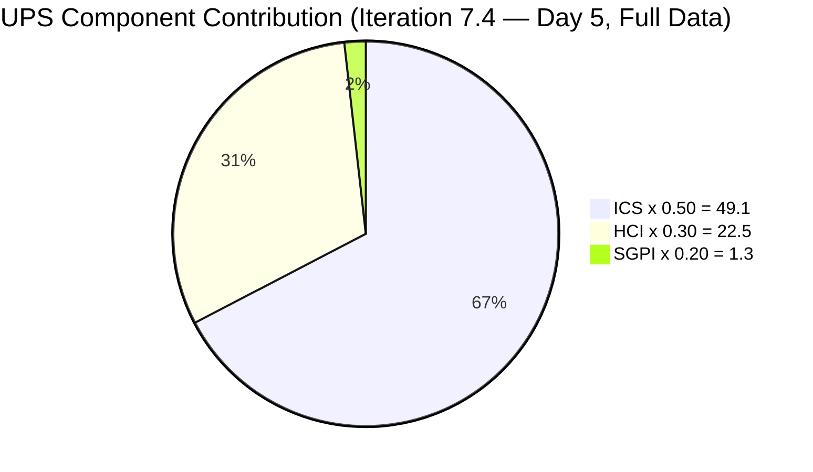
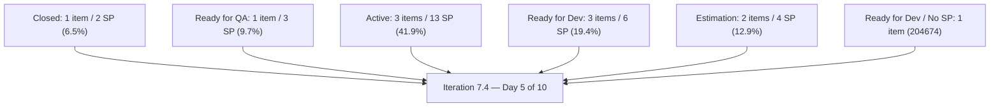
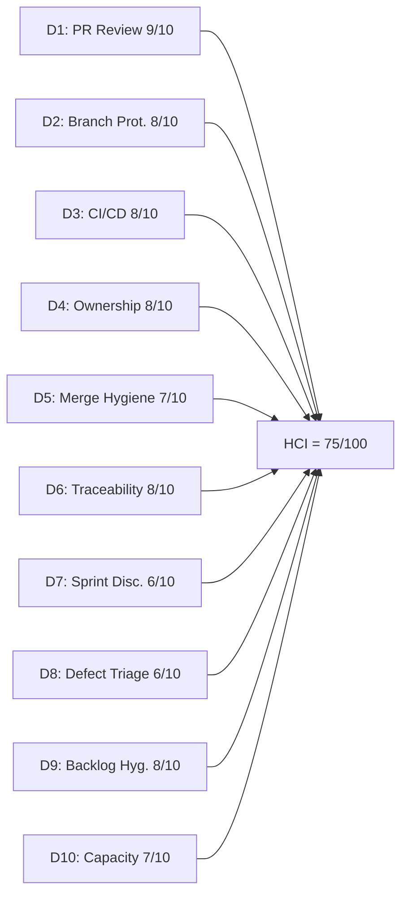

# Auto Allies Iteration Audit — 2026-05-24

## 1. Audit Metadata

| Field | Value |
|---|---|
| Audit Date | 2026-05-24 |
| Audit Time | 02:43 |
| Iteration | Iteration 7.4 |
| Iteration ID | 73996e59-134b-417b-9a08-3e359cc9539f |
| Iteration Start | 2026-05-18 |
| Iteration Finish | 2026-05-31 |
| Day of Iteration | 5 of 10 (end of Week 1; audit run on Sunday 2026-05-24) |
| ADO Project | Auto Allies (2d7af571-6ef6-4ad0-a509-c440e008b0fb) |
| ADO Team | AA Development Team (330e6bf1-3515-443c-a2d8-b84f46c38f57) |
| GitHub Repos | jairosoft-com/autoallies-version2, jairosoft-com/autoallies-api-core |
| Data Mode | **full** |
| Prior Audit | AUDIT_20260520_1500.md (Iteration 7.4 Day 3, full data) |
| Auditor | Claude Code (claude-sonnet-4-6) |

---

## 2. Executive Summary

This is the Day 5 (end of Week 1) audit for Iteration 7.4, run on Sunday 2026-05-24 — between Day 5 (Fri 2026-05-22) and Day 6 (Mon 2026-05-25). The headline finding is a **significant CI/CD maturation event**: both `autoallies-version2` and `autoallies-api-core` now have active `pr-validation.yml` GitHub Actions workflows that run lint, typecheck, unit tests, build (frontend), and PHPStan static analysis (backend) on every PR targeting protected branches. These were introduced during this iteration (PR#158 on May 21 — version2; PR#112 on May 21 — api-core) and mark the team's first enforceable automated quality gate. This raises HCI D3 from 6 to 8 — the largest single-dimension improvement since token access was restored.

Delivery progress is a concern. With **5 working days remaining** (all of Week 2), **SGPI stands at 6.5%** (1 of 11 items Closed). One item (203830) is in Ready for QA representing 3 SP additional delivery proxy, and 1 active PR (PR#161 for 203503) is awaiting review. However, 3 items remain Active and 2 are still in Estimation — indicating the team will need a strong Week 2 push to achieve meaningful delivery. The stale item risk (199106 — Defect in Estimation since February 2026) persists unchanged.

A notable reviewer improvement: Earl Carino approved PR#160 and PR#114 this week, closing the reviewer-diversity gap flagged in the prior audit. All three developers are now contributing as reviewers.

| Metric | Prior (2026-05-20) | Current (2026-05-24) | Delta |
|---|---|---|---|
| ICS | 98.2 | 98.2 | 0 |
| HCI | 73 | 75 | +2 |
| SGPI | 6.5% | 6.5% | 0 |
| UPS | 72.3 | 72.9 | +0.6 |
| Day of Iteration | 3 of 10 | 5 of 10 | — |

**Key finding:** The team introduced real CI/CD gates mid-iteration — a structural improvement that raises long-term engineering health. The SGPI deficit at Day 5 is a watch item entering Week 2; 5 working days remain for the team to close the gap.

---

## 3. Iteration Scope and Methodology

### Iteration 7.4 Scope

| Category | Count | Story Points |
|---|---|---|
| User Stories | 3 | 9 |
| Defects | 5 | 17 |
| Enablers | 3 | 5 |
| Spikes (excluded from ICS) | 2 | 5.5 |
| **Total (incl. Spikes)** | **13** | **36.5** |
| **ICS-eligible (excl. Spikes)** | **11** | **31** |

### Methodology

- **ICS:** Scored on 11 parent-level Stories, Defects, and Enablers in the iteration path. Spikes (204307, 204163) excluded per skill rules.
- **SGPI:** Committed Scope SGPI = Closed SP / Total committed SP (31 SP). 204674 has no SP — excluded from denominator.
- **HCI:** All 10 dimensions scored from live evidence. D1–D6 from GitHub data (PRs, commits, branches, reviews, workflows), D7–D10 from ADO evidence.
- **GitHub:** Both repos fully accessible. 13 PRs merged since iteration start (2026-05-18). 1 PR open.
- **Team capacity:** 29 hrs/day across 5 team members. No days off recorded.

---

## 4. Scorecard Summary

| Metric | Score | Band | Weight | Weighted |
|---|---|---|---|---|
| ICS (Iteration Compliance Score) | 98.2% | Green | 50% | 49.1 |
| HCI (Engineering Health Index) | 75/100 | Yellow | 30% | 22.5 |
| SGPI (Sprint Goal Progress Index) | 6.5% | Red | 20% | 1.3 |
| **UPS (Unified Performance Score)** | **72.9** | **Yellow** | — | — |

> SGPI Red band at Day 5 of 10 is a watch item — at the end of Week 1 some lag is expected, but the team will need significant progress in Week 2 to avoid a low-delivery iteration. ICS Green reflects strong planning compliance with only 204674 missing story points.

---

## 5. Sprint Goal Predictability (SGPI)

### SGPI Headline

| Metric | Value |
|---|---|
| Closed Story Points | 2 (Enabler 202926) |
| Total Committed Story Points (eligible) | 31 |
| **SGPI (Committed Scope)** | **6.5%** |
| Band | Red |
| Day of Iteration | 5 of 10 (end of Week 1) |

### Context

At Day 5 of a 10-day iteration (end of Week 1), 6.5% closed SGPI is below ideal pace but Week 2 (5 working days) remains fully available. Only Enabler 202926 ("[V2.0] Solidifying Migrated Data") has been Closed. User Story 203830 remains in Ready for QA (3 SP) with no state change since the Day 3 audit.

The team's PR activity shows significant development effort (13 merged PRs across both repos) but ADO states have not kept pace with code merges:
- PR#159 and PR#113 (both referencing AB#204162) were merged on May 21, but 204162 remains in **Active** state
- PR#155, #156, #157, #110 all reference AB#203830 — state correctly updated to Ready for QA
- PR#161 (referencing AB#203503) is open as of the audit date — positive sign of continued progress

### State Distribution

| State | Items | SP | % of Total SP |
|---|---|---|---|
| Closed | 1 | 2 | 6.5% |
| Ready for QA | 1 | 3 | 9.7% |
| Active | 3 | 13 | 41.9% |
| Ready for Dev | 3 | 6 | 19.4% |
| Estimation | 2 | 4 | 12.9% |
| No SP assigned | 1 | — | — |

### Supporting SGPI Metrics

| Metric | Value |
|---|---|
| Original Scope SGPI | 6.5% (no mid-sprint additions detected) |
| Delivered Proxy SGPI | 5/31 = **16.1%** (Closed 2 SP + Ready for QA 3 SP) |
| ADO-state lag risk | 204162 has merged PRs but remains Active — state update needed |

---

## 6. Developer Productivity Findings

### Team Capacity (Iteration 7.4)

| Member | Role | Capacity/Day (hrs) | Days Off | Total Capacity |
|---|---|---|---|---|
| Cliff Carcueva | Development | 6 | 0 | 60 hrs |
| Earl Carino | Development | 6 | 0 | 60 hrs |
| Joseph Gerona | Development | 5 | 0 | 50 hrs |
| Jerlyn Ates | QA / Requirements | 6 (2+4) | 0 | 60 hrs |
| Mary Secusana | Documentation / Testing | 6 (3+3) | 0 | 60 hrs |
| **Total** | | **29** | **0** | **290 hrs** |

> Jerlyn Ates (QA/Requirements) and Mary Secusana (Documentation/Testing) are non-developer roles per workspace exception. Their GitHub absence is not penalized.

### GitHub Developer Activity — Iteration 7.4 (2026-05-18 to 2026-05-24)

| Developer | GitHub Handle | Commits (v2) | Commits (api) | PRs Authored | PRs Reviewed |
|---|---|---|---|---|---|
| Cliff Carcueva | ccarcuevajairo | 3 | 2 | 5 (PR#155,156,160,110,114) | 4 (PR#157,158,111,115) |
| Earl Carino | ecarinoJS | 3 | 5 | 8 (PR#157,158,159,111,112,113,115,109) | 4 (PR#158,159,160,114) |
| Joseph Gerona | JosephJairo | 0 | 0 | 0 | 9 (PR#155,156,158,159,110,112,113,114 + dismissed on 159,113) |

All three developers are active in the iteration. Earl has the highest PR authorship volume (8 PRs). Joseph's role is exclusively reviewing — he has approved 9 PRs in the iteration window with no direct PR authorship, indicating his assigned items (204114, 204115, 203916) are still in early development.

### Work Item Assignment Distribution

| Developer | Items Assigned | SP |
|---|---|---|
| Cliff Carcueva | 203503, 204115 (as author?), 203830 | 11 SP |
| Earl Carino | 204162, 202926, 201378, 204674 | 8 SP |
| Joseph Gerona | 204114, 204115, 203916, 204307 (Spike) | 13.5 SP |
| Jerlyn Ates | 199106, 204186 | 4 SP |
| Mary Secusana | 204163 (Spike) | 5 SP |

### Notable Engineering Improvement: CI/CD Pipeline Introduction

Earl Carino introduced `pr-validation.yml` to both repositories on 2026-05-21:
- **autoallies-version2 (PR#158):** Runs pnpm install → lint → typecheck → unit tests → build on every PR targeting develop/dev/staging/main
- **autoallies-api-core (PR#112):** Runs PHP 8.2 setup → composer install → PHP formatting (Pint) → Larastan (PHPStan level 5) on every PR

This is a structural improvement. Both repos now have automated quality gates that were absent in prior iterations.

---

## 7. SAFe Compliance Findings

### Iteration Planning Evidence

- Iteration 7.4 commenced 2026-05-18. All 11 eligible items are present in the iteration backlog.
- 2 Spikes included (204307 — Dev Support/Joseph, 204163 — Operations/QA Support/Mary).
- All items carry assignees and correct iteration paths.

### Acceptance Criteria and Definition of Ready

- **11 of 11** eligible items have substantive descriptions and acceptance criteria — consistent with the prior audit.
- Enabler 204674 was remediated between the morning and afternoon audits on 2026-05-20. Description and AC are present; story points remain missing as of 2026-05-24.
- Defects 204114 and 204162 carry brief single-sentence AC. While technically compliant (>20 chars), the content quality is minimal and relies on the work item title as the primary specification.

### Feature Linkage

- **11 of 11** eligible items are linked to a parent Feature or Epic. Unchanged from prior audit.

### Work Item State Lag

- Defect 204162 has merged PRs in both repos (PR#159 + PR#113, both May 21) but ADO state remains **Active** as of the audit date (last changed: 2026-05-22 at 23:05). This indicates a process gap where developers merge code without updating the ADO work item state.

---

## 8. Iteration Compliance Score

### ICS Dimension Table

| Dimension | Weight | Eligible | Compliant | Failed | Score% | Weighted Contribution | Evidence | Reason for Failures |
|---|---|---|---|---|---|---|---|---|
| Alignment (Parent Linkage) | 25% | 11 | 11 | 0 | 100.0% | 25.0 | System.Parent populated on 11/11 items | None |
| Estimation (Story Points) | 20% | 11 | 10 | 1 | 90.9% | 18.2 | SP > 0 on 10/11 items | 204674 — no StoryPoints field |
| Quality / DoD (Desc + AC) | 35% | 11 | 11 | 0 | 100.0% | 35.0 | Desc ≥ 30 chars AND AC ≥ 20 chars on 11/11 items | None |
| Iteration Integrity | 20% | 11 | 11 | 0 | 100.0% | 20.0 | All items: assigned, correct path, non-blocked | None |
| **ICS Total** | **100%** | **11** | — | — | — | **98.2** | — | — |

**ICS = 98.2 (Green)**

### Delta from Prior Audit

| Dimension | Prior (2026-05-20) | Current (2026-05-24) | Change |
|---|---|---|---|
| Alignment | 100.0% | 100.0% | 0 |
| Estimation | 90.9% | 90.9% | 0 (204674 still missing SP) |
| Quality/DoD | 100.0% | 100.0% | 0 |
| Iteration Integrity | 100.0% | 100.0% | 0 |
| **ICS Total** | **98.2** | **98.2** | **0** |

### Failed Items Detail

| ID | Title | Type | State | Failure Dimensions |
|---|---|---|---|---|
| 204674 | [V2.0] Update Migration Script for Affiliate Accounts | Enabler | Ready for Dev | Estimation only — no story points (persists from iteration start) |

---

## 9. Engineering Health Index (HCI)

### HCI Dimension Table

| # | Dimension | Score | Max | Evidence Basis | Key Finding |
|---|---|---|---|---|---|
| D1 | PR Review Compliance | 9 | 10 | GitHub: 13 PRs in iteration window | 13/13 PRs have at least one human approval; Earl now reviewing (closed prior gap); all three developers are active reviewers |
| D2 | Branch Protection & Enforcement | 8 | 10 | GitHub: branch list + workflow triggers | `develop`/`staging`/`main` (v2) and `dev`/`main`/`staging` (api) protected; pr-validation workflow enforces gates on target branches; 79 stale branches in v2, 64 in api-core |
| D3 | CI/CD Gate Quality | 8 | 10 | GitHub: pr-validation.yml content in both repos | **NEW this iteration** — full CI/CD pipeline introduced on 2026-05-21: lint, typecheck, unit tests, build (frontend); PHP formatting + PHPStan level 5 (backend); runs on every PR to protected branches |
| D4 | Code Ownership | 8 | 10 | GitHub: commits + PRs + ADO assignments | Clear per-developer ownership; AB# references in all commits and PR bodies for iteration items; 3 active contributors; Joseph Gerona in pure reviewer mode with no merged code yet |
| D5 | Merge Hygiene & Churn | 7 | 10 | GitHub: PR merge patterns + branch data | All PRs target develop/dev branches; no force pushes or reverts; 79 stale branches (v2) and 64 stale branches (api-core) — unchanged accumulation |
| D6 | Work Item ↔ GitHub Traceability | 8 | 10 | GitHub: commit messages + PR bodies | 10/13 iteration PRs include AB# references; PR#115 (deployment fix), PR#158 (repo-health), PR#112 (repo-health) have no ADO link — these are infrastructure/tooling PRs with no parent story |
| D7 | Sprint Discipline | 6 | 10 | ADO: iteration state data | Day 5 of 10 (end of Week 1) with only 1 Closed item; 2 items still in Estimation; 204162 state lag (merged code but ADO still Active); Week 2 remains for recovery |
| D8 | Defect Triage & Velocity | 6 | 10 | ADO: defect states + GitHub merge data | 5 defects in iteration; 203503 has open PR (PR#161); 199106 in Estimation since 2026-02-16 (97+ days, unchanged); 204162 state lag |
| D9 | Backlog & Story Hygiene | 8 | 10 | ADO: work item content | 11/11 items have desc + AC; 204674 still missing SP; 204114/204162 AC content is brief (one-line); all parent links intact |
| D10 | Capacity Balance & Ownership Distribution | 7 | 10 | ADO: capacity + assignment data | Balanced load: Cliff 11 SP, Earl 8 SP, Joseph 13.5 SP (including Spike); 290 hrs capacity for 31 SP; no days off |
| **HCI Total** | | **75** | **100** | | |

**HCI = 75/100 (Yellow — Moderate)**

### HCI Dimension Visualization

### HCI Delta from Prior Audit

| Dimension | Prior (2026-05-20) | Current (2026-05-24) | Change | Notes |
|---|---|---|---|---|
| D1: PR Review Compliance | 8 | 9 | +1 | Earl now reviewing — all 3 developers in rotation |
| D2: Branch Protection | 7 | 8 | +1 | pr-validation.yml enforces quality gates on protected branches |
| D3: CI/CD Gate Quality | 6 | 8 | +2 | PR validation workflows added to both repos on 2026-05-21 |
| D4: Code Ownership | 7 | 8 | +1 | Clear AB# ownership across all commits |
| D5: Merge Hygiene | 7 | 7 | 0 | Stale branch accumulation unchanged |
| D6: Traceability | 9 | 8 | -1 | Infrastructure PRs (115, 158, 112) without ADO links |
| D7: Sprint Discipline | 7 | 6 | -1 | Day 5 (end of Week 1) with SGPI 6.5%; 204162 state lag; score reflects lag, not full iteration failure |
| D8: Defect Triage | 7 | 6 | -1 | 199106 unchanged; 204162 state lag; low closure rate |
| D9: Backlog Hygiene | 8 | 8 | 0 | No change |
| D10: Capacity Balance | 7 | 7 | 0 | No change |
| **Total** | **73** | **75** | **+2** | |

> The +2 HCI improvement is driven by the CI/CD pipeline introduction (D3 +2) and Earl closing the reviewer gap (D1 +1). These gains partially offset the delivery pace concerns in D7 and D8.

---

## 10. ADO-to-GitHub Traceability Analysis

### PR-to-Work Item Mapping (Iteration 7.4 — All PRs)

| PR | Repo | Author | ADO References | ADO State | Reviewed By | Merged |
|---|---|---|---|---|---|---|
| #155 | autoallies-version2 | ccarcuevajairo | AB#203830 | Ready for QA | JosephJairo (APPROVED) | 2026-05-20 |
| #156 | autoallies-version2 | ccarcuevajairo | AB#203830 | Ready for QA | JosephJairo (APPROVED) | 2026-05-20 |
| #157 | autoallies-version2 | ecarinoJS | AB#202926, AB#204162 | Closed / Active | ccarcuevajairo (APPROVED) | 2026-05-20 |
| #158 | autoallies-version2 | ecarinoJS | None (repo-health) | Infrastructure | JosephJairo, ccarcuevajairo (APPROVED) | 2026-05-21 |
| #159 | autoallies-version2 | ecarinoJS | AB#204162 | Active | ccarcuevajairo (APPROVED), JosephJairo (APPROVED) | 2026-05-21 |
| #160 | autoallies-version2 | ccarcuevajairo | AB#203830 | Ready for QA | JosephJairo (APPROVED), ecarinoJS (APPROVED) | 2026-05-22 |
| #161 | autoallies-version2 | ccarcuevajairo | AB#203503 | Active | (Open — no reviews yet) | Open |
| #109 | autoallies-api-core | ecarinoJS | AB#203303 | Prior iteration | ccarcuevajairo (APPROVED) | 2026-05-18 |
| #110 | autoallies-api-core | ccarcuevajairo | AB#203830 | Ready for QA | JosephJairo (APPROVED) | 2026-05-20 |
| #111 | autoallies-api-core | ecarinoJS | AB#202926, AB#204162 | Closed / Active | ccarcuevajairo (APPROVED) | 2026-05-20 |
| #112 | autoallies-api-core | ecarinoJS | None (repo-health) | Infrastructure | JosephJairo, ccarcuevajairo (APPROVED) | 2026-05-21 |
| #113 | autoallies-api-core | ecarinoJS | AB#204162 | Active | ccarcuevajairo (APPROVED), JosephJairo (APPROVED) | 2026-05-21 |
| #114 | autoallies-api-core | ccarcuevajairo | AB#203830 | Ready for QA | JosephJairo, ecarinoJS (APPROVED) | 2026-05-22 |
| #115 | autoallies-api-core | ecarinoJS | None (deployment fix) | Infrastructure | ccarcuevajairo (APPROVED) | 2026-05-22 |

### Traceability Assessment

- **10/13 PRs** (76.9%) reference ADO work item IDs using the `AB#` convention
- 3 PRs without ADO links are infrastructure/tooling PRs: PR#158 (pnpm standardization + test setup), PR#112 (pr-validation + PHPStan), PR#115 (deployment fix) — these are valid exceptions for cross-cutting work
- **5 of 11** eligible ADO items have associated GitHub activity: 202926, 203830, 204162, 203503 (open PR), plus hotfix for 203303
- Remaining 6 items (201378, 203916, 204114, 204115, 204186, 204674) have no merged GitHub PRs yet — these are in Ready for Dev or Estimation states

### ADO State Correlation

| ADO Item | ADO State | GitHub Activity | Correlation |
|---|---|---|---|
| 202926 | Closed | PR#157 + #111 merged 2026-05-20 | Consistent — code merged and item closed |
| 203830 | Ready for QA | PR#155, #156, #157, #110, #160, #114 merged | Consistent — substantial code merged, awaiting QA |
| 204162 | Active | PR#157, #159, #111, #113 merged by 2026-05-21 | **State lag** — code merged 3 days ago, ADO still Active |
| 203503 | Active | PR#161 open (created 2026-05-23) | Consistent — work in progress |
| 201378 | Ready for Dev | No iteration-window PRs | Expected — not started |
| 203916 | Ready for Dev | No iteration-window PRs | Expected — not started |
| 204114 | Active | No iteration-window PRs | Gap — Active state with no GitHub code |
| 204115 | Active | No iteration-window PRs | Gap — Active state with no GitHub code |
| 204674 | Ready for Dev | No iteration-window PRs | Expected — not started |
| 199106 | Estimation | No iteration-window PRs | Expected — blocked in Estimation |
| 204186 | Estimation | No iteration-window PRs | Expected — QA planning item |

---

## 11. Collaboration and Review Analysis

### PR Review Patterns (All 13 Iteration-Window PRs)

| Reviewer | PRs Reviewed | Authors Reviewed | Notes |
|---|---|---|---|
| Joseph Gerona (JosephJairo) | #155, #156, #158, #159, #110, #112, #113, #114 | Cliff, Earl | Highest review volume (8 PRs); 2 dismissals then re-approval on #159 |
| Cliff Carcueva (ccarcuevajairo) | #157, #158, #159, #111, #112, #113, #115 | Earl | 7 reviews |
| Earl Carino (ecarinoJS) | #160, #114 | Cliff | **Improvement** — Earl is now reviewing; gap from prior audit closed |

**Review coverage: 13/13 (100%)** — all merged PRs in the iteration window have at least one human approval.

**Three-way review rotation established:**
- Joseph reviews Cliff's and Earl's code
- Cliff reviews Earl's code
- Earl reviews Cliff's code (PR#160, PR#114 — new this period)

**PR#161 (open — no reviews yet):** Created 2026-05-23. Cliff's PR for 203503 is awaiting review by EOD 2026-05-24. This is the active development work for the final stretch.

### Review Depth and Quality

- GitHub Copilot PR reviewer bot is active on multiple PRs, providing automated code analysis comments
- Human approvals are present across all merged PRs
- Two instances of DISMISSED then APPROVED reviews (PR#159/PR#113 — Joseph Gerona initially dismissed, then re-approved after changes) indicate the review process is not purely rubber-stamping
- Infrastructure PRs (#158, #112) received 2 human approvals each — strongest review coverage
- PR turnaround continues to be fast (<24 hours for all PRs)

---

## 12. Repository Hygiene

### Branch Inventory

| Repo | Protected Branches | Total Branches | Active (iteration) | Stale |
|---|---|---|---|---|
| autoallies-version2 | develop, staging, main | 79 | 1 (bug/200242-signup-payment-summary — PR#161) | 78 |
| autoallies-api-core | dev, main, staging, qa | 64 | 7 (deployment/*, hotfix/203303, story/202926, story/203303, story/203830) | 57 |

> Active branches identified by work item ID overlap, deployment prefix, or iteration-window PR association.
>
> **Note — version2 stale branch count:** No `story/203830` branches are visible in autoallies-version2 (79 total enumerated across 2 pages), despite 4+ PRs merged for that item. This suggests autoallies-version2 may have **auto-delete-on-merge** enabled (a GitHub setting that deletes the source branch after PR merge). If so, the 78 "stale" branches are pre-existing branches from prior iterations/PIs, not unmerged current work. The 57 stale branches in api-core are confirmed stale (story/203303, story/202926 remain visible post-merge). A cleanup pass is still warranted for both repos.

### Branch Naming Convention

- **Consistent:** `story/`, `feature/`, `bug/`, `enabler/`, `defect/`, `hotfix/`, `fix/`, `deployment/` prefixes used throughout
- **ADO-linked:** Most branches include work item IDs
- **Risk:** 78–57 stale branches in each repo from prior PIs/iterations continue to accumulate

### Workflow Additions This Iteration

| File | Repo | Purpose | Introduced |
|---|---|---|---|
| `pr-validation.yml` | autoallies-version2 | Lint + typecheck + unit tests + build on PR | 2026-05-21 (PR#158) |
| `pr-validation.yml` | autoallies-api-core | PHP formatting + PHPStan level 5 on PR | 2026-05-21 (PR#112) |

Both repos also have auto-deploy trigger workflows (Azure Static Web Apps / Azure App Service). The addition of PR validation completes the CI loop: code → review → automated checks → deploy.

### Note on PR#161 (Open PR)

PR#161 ("AB#203503 Mutiple bugfix sign up") was opened 2026-05-23 by Cliff Carcueva and targets `develop` in `autoallies-version2`. The body references AB#203503 plus child task IDs AB#200242 and AB#198311. The PR has 0 reviews as of this audit. This is the primary active development artifact for the final iteration stretch.

---

## 13. Risks and Bottlenecks

| # | Risk | Severity | Likelihood | Owner | Status |
|---|---|---|---|---|---|
| R1 | SGPI 6.5% at Day 5 of 10 (end of Week 1) — below pace for full delivery; team needs strong Week 2 to close meaningful SP by May 31 | Medium-High | Confirmed | Karl / Team | Active — Week 2 is recovery window |
| R2 | Defect 199106 in "Estimation" state for 97+ days (created 2026-02-16) — no progress since prior audit | Medium | Confirmed | Jerlyn Ates | Stale — escalation needed |
| R3 | ADO state lag on 204162 — merged PRs on May 21 but ADO state still "Active" as of audit | Medium | Confirmed | Earl Carino | Active — state update needed |
| R4 | Enabler 204674 missing story points — persists for 4+ days without resolution | Medium | Confirmed | Earl Carino | Active — 1 field update needed |
| R5 | Joseph Gerona has no merged PRs in iteration; 204114 and 204115 are Active with no code | Medium | Present | Joseph Gerona | Watch — 5 working days (full Week 2) remaining |
| R6 | Items 201378, 203916, 204186 in Ready for Dev or Estimation with no GitHub activity | Low-Medium | Present | Earl, Joseph, Jerlyn | Monitor — 5 working days remaining |
| R7 | PR#161 (203503) open with no reviews — review turnaround needed today | Low | Present | Cliff / Reviewers | Active — time-sensitive |
| R8 | 78+ stale branches in version2 and 57+ in api-core from prior iterations | Low | Persistent | Dev team | Hygiene backlog |

---

## 14. Prioritized Remediation Actions

| Priority | Action | Owner | Due | Expected Impact |
|---|---|---|---|---|
| P1 | Update ADO state for 204162 to "Ready for QA" or "Closed" — code was merged on May 21 | Earl Carino | 2026-05-24 | Fixes state lag; accurately reflects delivery; improves D7 and D8 |
| P2 | Review and merge PR#161 (AB#203503 sign-up bugfix) — first working day review by Mon 2026-05-25 | Joseph / Cliff | 2026-05-25 | Advances 203503 toward Ready for QA |
| P3 | Add story points to Enabler 204674 — single field update, open for 4+ days | Earl Carino | 2026-05-24 | Brings ICS from 98.2 to 100.0 |
| P4 | Triage Defect 199106 (Estimation since Feb 2026) — move to Ready for Dev or remove from iteration | Jerlyn Ates / Karl | 2026-05-25 | Resolves stale item; improves D8 |
| P5 | Joseph to begin or merge code for 204114 or 204115 to show Active → Ready for QA progress — full Week 2 available | Joseph Gerona | 2026-05-28 | Raises SGPI and demonstrates dev velocity in Week 2 |
| P6 | Delete merged stale branches from prior iterations (batch: 40+ in each repo) | Dev team | Post-iteration | Improves D2 and D5; reduces navigation noise |
| P7 | Add branch deletion policy after merge in GitHub repository settings | Karl / Earl | Post-iteration | Prevents stale branch accumulation in future iterations |

---

## 15. Evidence Gaps and Limitations

| Gap | Dimensions Affected | Mitigation Applied |
|---|---|---|
| PR#161 review status — open PR, reviews not yet submitted as of audit time | HCI D1 (excluded from denominator — not merged) | Noted as active risk in R7; monitoring indicator for final stretch |
| CI/CD workflow run history not inspected — pr-validation.yml added 2026-05-21 but individual run results not collected | HCI D3 (scored 8/10 conservatively — workflow exists and is correctly configured) | Workflow content verified; gates are correctly configured; run results assumed to be functional based on subsequent merges |
| Jerlyn Ates and Mary Secusana absent from GitHub developer activity | Not affected | Non-developer roles per workspace exception — correctly excluded from HCI D1, D4 |
| Joseph Gerona has no GitHub commits or PRs this iteration period | HCI D4 noted | Reviewer activity is confirmed; item assignments are appropriate; ADO items in Active state indicate legitimate in-progress work |
| GitHub branch protection rule details (required reviewers count, required status checks) not fully inspected | HCI D2 (scored 8/10) | Protected branch names confirmed; pr-validation workflow targets correct branches; review approvals observed on all PRs |
| Stale branch timestamps not inspected — exact staleness (weeks vs. months) estimated from naming patterns | HCI D5 | Branch names from prior PI/iteration prefixes identified as stale; conservative approach |

---

*Report generated: 2026-05-24 02:43 | Auditor: Claude Code (claude-sonnet-4-6) | Skill: git_iteration_audit | Data mode: full | Iteration: 7.4 Day 5 of 10 (end of Week 1; audit run Sunday 2026-05-24)*
