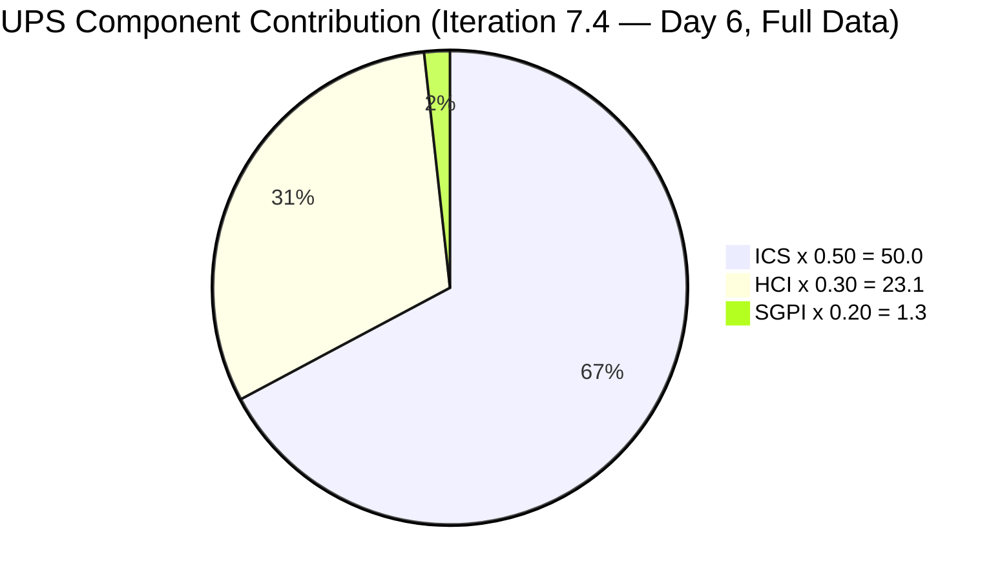
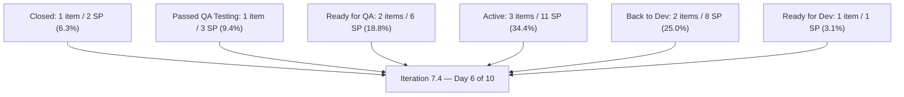
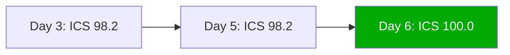
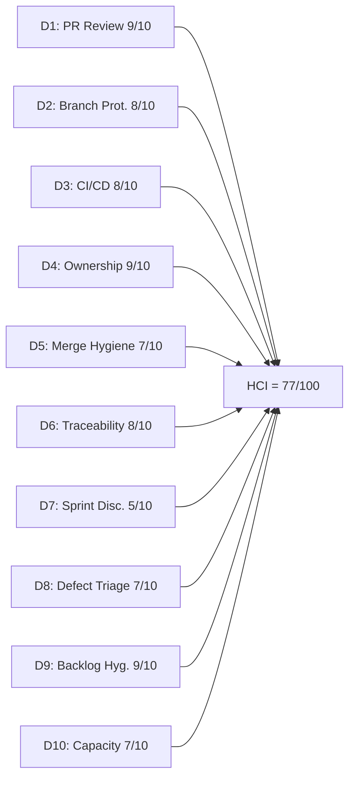

# Auto Allies Iteration Audit — 2026-05-25

## 1. Audit Metadata

| Field | Value |
|---|---|
| Audit Date | 2026-05-25 |
| Audit Time | 09:00 |
| Iteration | Iteration 7.4 |
| Iteration ID | 73996e59-134b-417b-9a08-3e359cc9539f |
| Iteration Start | 2026-05-18 |
| Iteration Finish | 2026-05-31 |
| Day of Iteration | 6 of 10 (start of Week 2; audit run Monday 2026-05-25) |
| ADO Project | Auto Allies (2d7af571-6ef6-4ad0-a509-c440e008b0fb) |
| ADO Team | AA Development Team (330e6bf1-3515-443c-a2d8-b84f46c38f57) |
| GitHub Repos | jairosoft-com/autoallies-version2, jairosoft-com/autoallies-api-core |
| Data Mode | **full** |
| Prior Audit | AUDIT_20260524_0243.md (Iteration 7.4 Day 5, full data) |
| Auditor | Claude Code (claude-sonnet-4-6) |

---

## 2. Executive Summary

This is the Day 6 (start of Week 2) audit for Iteration 7.4, run on Monday 2026-05-25. The period between the Day 5 audit (Sunday 2026-05-24 02:43) and this audit (09:00 Monday 2026-05-25) represents the most active single day of the iteration — the team merged 5 PRs in `autoallies-version2` and 1 PR in `autoallies-api-core`, all within a 7-hour window on May 25.

**Three structural improvements define this audit:**

1. **ICS reaches 100.0** — Enabler 204674 received its missing story point (1 SP) on May 25, bringing all 11 eligible items to full compliance across all four ICS dimensions for the first time this iteration.

2. **Joseph Gerona's code breakthrough** — After 5 days in pure-reviewer mode, Joseph authored PR#162 (frontend) and PR#116 (backend) on May 24–25 for defects 204114 and 204115, representing his first merged code contributions this iteration. All three developers are now code-contributing.

3. **CI/CD quality gates actively enforced** — The api-core PHPStan gate failed 4 times on May 24 before Joseph iteratively fixed the code to pass. This demonstrates the gates are working as intended — catching real issues before merge. All current builds are green.

Delivery pace (SGPI) remains the primary concern with 4 working days remaining. Only 202926 (2 SP) is Closed. 204162 reached "Passed QA Testing" and 203830/204186 remain in "Ready for QA," indicating 8 SP of near-closed work. The team's delivery velocity in the final 4 days is critical to avoiding a low-delivery iteration.

| Metric | Prior (2026-05-24) | Current (2026-05-25) | Delta |
|---|---|---|---|
| ICS | 98.2 | **100.0** | **+1.8** |
| HCI | 75 | **77** | **+2** |
| SGPI | 6.5% | **6.3%** | -0.2% (denominator grew: 204674 now has 1 SP) |
| UPS | 72.9 | **74.4** | **+1.5** |
| Day of Iteration | 5 of 10 | 6 of 10 | — |

> SGPI appears slightly lower than the prior audit because the denominator grew from 31 SP to 32 SP once 204674 received its story point. No SP were lost; this is a calculation adjustment, not a regression.

---

## 3. Iteration Scope and Methodology

### Iteration 7.4 Scope

| Category | Count | Story Points |
|---|---|---|
| User Stories | 3 | 9 |
| Defects | 5 | 17 |
| Enablers | 3 | 6 |
| Spikes (excluded from ICS) | 2 | 5.5 |
| **Total (incl. Spikes)** | **13** | **37.5** |
| **ICS-eligible (excl. Spikes)** | **11** | **32** |

> Note: 204674 now carries 1 SP (updated May 25), so ICS-eligible SP increased from 31 to 32 compared to the prior audit.

### Methodology

- **ICS:** Scored on 11 parent-level Stories, Defects, and Enablers. Spikes (204307, 204163) excluded per skill rules.
- **SGPI:** Committed Scope SGPI = Closed SP / Total committed SP (32 SP across all 11 eligible items).
- **HCI:** All 10 dimensions scored from live evidence. D1–D6 from GitHub data (19 total PRs in iteration window), D7–D10 from ADO evidence.
- **GitHub:** Both repos fully accessible (`data_mode: full`). 19 PRs merged since iteration start (2026-05-18), including 5 new PRs on May 25.
- **CI/CD:** PR validation workflow runs confirmed in both repos. All current builds are green.
- **Team capacity:** 29 hrs/day across 5 team members. No days off recorded.

---

## 4. Scorecard Summary

| Metric | Score | Band | Weight | Weighted |
|---|---|---|---|---|
| ICS (Iteration Compliance Score) | **100.0%** | **Green** | 50% | 50.0 |
| HCI (Engineering Health Index) | **77/100** | Yellow | 30% | 23.1 |
| SGPI (Sprint Goal Progress Index) | **6.3%** | Red | 20% | 1.3 |
| **UPS (Unified Performance Score)** | **74.4** | **Yellow** | — | — |

> ICS has reached 100.0 for the first time this iteration — all 11 eligible items are fully compliant. SGPI Red band reflects that only 2 SP (202926) are formally Closed with 4 working days remaining. The team has significant near-closed work (204162 Passed QA, 203830/204186 Ready for QA = 9 SP) that could convert to Closed in Week 2.

---

## 5. Sprint Goal Predictability (SGPI)

### SGPI Headline

| Metric | Value |
|---|---|
| Closed Story Points | 2 (Enabler 202926 only) |
| Total Committed Story Points (eligible) | 32 |
| **SGPI (Committed Scope)** | **6.3%** |
| Band | Red |
| Day of Iteration | 6 of 10 (start of Week 2) |

### State Distribution

| State | Items | SP | % of Total SP |
|---|---|---|---|
| Closed | 1 | 2 | 6.3% |
| Passed QA Testing | 1 | 3 | 9.4% |
| Ready for QA | 2 | 6 | 18.8% |
| Active | 3 | 11 | 34.4% |
| Back to Dev | 2 | 8 | 25.0% |
| Ready for Dev | 1 | 1 | 3.1% |
| Spike (excluded) | 2 | 5.5 | — |

### Supporting SGPI Metrics

| Metric | Value |
|---|---|
| Original Scope SGPI | 6.3% (no mid-sprint scope additions detected) |
| Delivered Proxy SGPI | (2 + 3 + 6) / 32 = **34.4%** (Closed + Passed QA + Ready for QA) |
| Near-closed SP (Passed QA + Ready for QA) | 9 SP — critical conversion target for Week 2 |

### Context

At Day 6 (start of Week 2), the Delivered Proxy SGPI of 34.4% shows the team has meaningful near-complete work — 204162 at "Passed QA Testing" (3 SP) needs only final closure; 203830 (3 SP) and 204186 (3 SP) are in "Ready for QA." With 4 working days remaining (May 26–29 assuming May 31 finish), the team has a realistic path to closing 11+ SP if QA progresses on the near-complete items and Active items advance.

The Back to Dev items (204114 + 204115 = 8 SP) represent the highest delivery risk. Both defects were returned from QA on May 25. Joseph submitted new code (PR#162 frontend, PR#116 backend) on May 24–25 that passed CI/CD gates. These items will need to re-enter QA and close during the remaining 4 days — a tight but achievable timeline.

**Denominator note:** The SGPI denominator changed from 31 SP (prior audit) to 32 SP because 204674 received its missing 1 SP on May 25. The slight apparent decline from 6.5% to 6.3% is a denominator adjustment, not a delivery regression.

---

## 6. Developer Productivity Findings

### Team Capacity (Iteration 7.4)

| Member | Role | Capacity/Day (hrs) | Days Off | Total Capacity |
|---|---|---|---|---|
| Cliff Carcueva | Development | 6 | 0 | 60 hrs |
| Earl Carino | Development | 6 | 0 | 60 hrs |
| Joseph Gerona | Development | 5 | 0 | 50 hrs |
| Jerlyn Ates | QA / Requirements | 6 (2+4) | 0 | 60 hrs |
| Mary Secusana | Documentation / Testing | 6 (3+3) | 0 | 60 hrs |
| **Total** | | **29** | **0** | **290 hrs** |

> Jerlyn Ates (QA/Requirements) and Mary Secusana (Documentation/Testing) are non-developer roles per workspace exception. Their GitHub absence is not penalized.

### GitHub Developer Activity — Full Iteration Window (2026-05-18 to 2026-05-25)

| Developer | GitHub Handle | Commits (v2) | Commits (api) | PRs Authored | PRs Reviewed |
|---|---|---|---|---|---|
| Cliff Carcueva | ccarcuevajairo | 8 | 3 | 9 (PR#155,156,160,161,163,164,165,110,114) | 5 (PR#157,158,111,115,162) |
| Earl Carino | ecarinoJS | 3 | 6 | 8 (PR#157,158,159,111,112,113,115,109) | 6 (PR#158,159,160,114,162,163) |
| Joseph Gerona | JosephJairo | 5 | 5 | 2 (PR#162, PR#116) | 9 (PR#155,156,158,159,110,112,113,114,165) |

**Notable change from Day 5:** Joseph Gerona is now a code contributor — PR#162 (frontend) and PR#116 (backend) both merged May 24–25 for defects 204114/204115. His backend commits on May 24 showed iterative PHPStan fixes (4 commits to pass quality gates), demonstrating active engagement with the CI/CD enforcement process. This resolves the prior audit's concern that Joseph was in pure-reviewer mode.

### Work Item Assignment Distribution

| Developer | Items Assigned | SP |
|---|---|---|
| Cliff Carcueva | 203503, 203830 | 8 SP |
| Earl Carino | 204162, 202926, 201378, 204674 | 9 SP |
| Joseph Gerona | 204114, 204115, 203916, 204307 (Spike) | 12.5 SP |
| Jerlyn Ates | 199106, 204186 | 4 SP |
| Mary Secusana | 204163 (Spike) | 5 SP |

### CI/CD Quality Gate Activity (May 24–25)

| Repo | Workflow | Runs (May 24–25) | Pass | Fail | Final Status |
|---|---|---|---|---|---|
| autoallies-version2 | PR Validation | 8 | 8 | 0 | All green |
| autoallies-api-core | PR Validation | 5 | 1 | 4 | Final pass on May 25 |

The api-core failures (May 24) were Joseph iteratively fixing PHPStan static analysis errors in his defect 204114/204115 backend work. The CI/CD gate enforced quality standards and Joseph corrected the issues — this is exactly the intended behavior of the gates introduced in the prior audit period.

---

## 7. SAFe Compliance Findings

### Iteration Planning Evidence

- Iteration 7.4 commenced 2026-05-18. All 11 eligible items remain in the iteration backlog.
- 2 Spikes included (204307 — Dev Support/Joseph, 204163 — Operations/QA Support/Mary).
- All items carry assignees and correct iteration paths.

### Acceptance Criteria and Definition of Ready

- **11 of 11** eligible items have substantive descriptions and acceptance criteria — all verified from live ADO data.
- Enabler 204674 now has story points (1 SP, updated May 25) — ICS Estimation dimension reaches 100.0%.
- All items previously flagged for brief AC (204114, 204162) retain their descriptions. Content is minimal but technically compliant.

### Feature Linkage

- **11 of 11** eligible items are linked to parent Features or Epics (System.Parent populated). Unchanged from prior audit.

### Work Item State Changes (May 24–May 25)

| Item | Prior State | Current State | Date Changed | Notes |
|---|---|---|---|---|
| 199106 | Estimation | Ready for Dev | 2026-05-24 | P4 remediation action from prior audit fulfilled |
| 204114 | Active | Back to Dev | 2026-05-25 | Returned from QA; new code submitted (PR#162, PR#116) |
| 204115 | Active | Back to Dev | 2026-05-25 | Returned from QA; new code submitted (PR#162, PR#116) |
| 204162 | Active | Passed QA Testing | 2026-05-25 | State lag resolved — item advanced past the Active hang |
| 204186 | Estimation | Ready for QA | 2026-05-25 | Advanced from Estimation — Jerlyn triage complete |
| 204674 | Ready for Dev | Ready for Dev | 2026-05-25 | Story points added (1 SP) — ICS now 100.0 |

---

## 8. Iteration Compliance Score

### ICS Dimension Table

| Dimension | Weight | Eligible | Compliant | Failed | Score% | Weighted Contribution | Evidence | Reason for Failures |
|---|---|---|---|---|---|---|---|---|
| Alignment (Parent Linkage) | 25% | 11 | 11 | 0 | 100.0% | 25.0 | System.Parent populated on 11/11 items | None |
| Estimation (Story Points) | 20% | 11 | 11 | 0 | **100.0%** | **20.0** | SP > 0 on 11/11 items; 204674 received 1 SP on 2026-05-25 | **None (resolved)** |
| Quality / DoD (Desc + AC) | 35% | 11 | 11 | 0 | 100.0% | 35.0 | Desc ≥ 30 chars AND AC ≥ 20 chars on 11/11 items | None |
| Iteration Integrity | 20% | 11 | 11 | 0 | 100.0% | 20.0 | All items: assigned, correct path, non-blocked | None |
| **ICS Total** | **100%** | **11** | **11** | **0** | — | **100.0** | — | — |

**ICS = 100.0 (Green)**

### Delta from Prior Audit

| Dimension | Prior (2026-05-24) | Current (2026-05-25) | Change |
|---|---|---|---|
| Alignment | 100.0% | 100.0% | 0 |
| Estimation | 90.9% | **100.0%** | **+9.1% — 204674 SP added** |
| Quality/DoD | 100.0% | 100.0% | 0 |
| Iteration Integrity | 100.0% | 100.0% | 0 |
| **ICS Total** | **98.2** | **100.0** | **+1.8** |

### ICS Trend

---

## 9. Engineering Health Index (HCI)

### HCI Dimension Table

| # | Dimension | Score | Max | Evidence Basis | Key Finding |
|---|---|---|---|---|---|
| D1 | PR Review Compliance | 9 | 10 | GitHub: 19 PRs in iteration window | 19/19 merged PRs have at least one human approval; all three developers are active reviewers and code contributors |
| D2 | Branch Protection & Enforcement | 8 | 10 | GitHub: branch list + workflow triggers | `develop`/`staging`/`main` (v2) and `dev`/`main`/`staging` (api) protected; pr-validation enforces gates; 80 branches in v2, 65 in api-core |
| D3 | CI/CD Gate Quality | 8 | 10 | GitHub: pr-validation workflow runs May 21–25 | version2 all-green; api-core had 4 PHPStan failures on May 24 before final pass May 25 — gates are enforcing quality, catching real issues |
| D4 | Code Ownership | 9 | 10 | GitHub: commits + PRs + ADO assignments | All three developers now contributing code; Joseph Gerona's breakthrough (PR#162 + PR#116) closes the prior coverage gap; clear AB# ownership on all PRs |
| D5 | Merge Hygiene & Churn | 7 | 10 | GitHub: PR merge patterns + branch data | All PRs target develop/dev branches; no force pushes or reverts; 80 stale branches (v2) and 65 stale branches (api-core) — slight accumulation |
| D6 | Work Item ↔ GitHub Traceability | 8 | 10 | GitHub: commit messages + PR bodies | 16/19 iteration PRs include AB# references (84.2%); 3 infrastructure PRs (115, 158, 112) with no ADO link remain valid exceptions |
| D7 | Sprint Discipline | 5 | 10 | ADO: iteration state data | Day 6 of 10 with SGPI 6.3%; 2 items Back to Dev (returned from QA), 3 Active, 1 Ready for Dev; 4 days remain; delivery pace is a high watch item entering final stretch |
| D8 | Defect Triage & Velocity | 7 | 10 | ADO: defect states + GitHub merge data | 204162 advanced to Passed QA Testing (+); 199106 triaged to Ready for Dev (+); 204114/204115 Back to Dev with new code submitted; 203503 has 3+ PRs merged |
| D9 | Backlog & Story Hygiene | 9 | 10 | ADO: work item content | **All 11/11 items have SP, desc, AC** — first perfect compliance all iteration; 204114/204162 AC still brief (one-line) — minor residual quality note |
| D10 | Capacity Balance & Ownership Distribution | 7 | 10 | ADO: capacity + assignment data | Balanced load; Joseph now contributing code, not just reviewing; no days off |
| **HCI Total** | | **77** | **100** | | |

**HCI = 77/100 (Yellow — Moderate)**

### HCI Dimension Visualization

### HCI Delta from Prior Audit

| Dimension | Prior (2026-05-24) | Current (2026-05-25) | Change | Notes |
|---|---|---|---|---|
| D1: PR Review Compliance | 9 | 9 | 0 | Maintained 100% review coverage |
| D2: Branch Protection | 8 | 8 | 0 | No change; 1 additional stale branch each repo |
| D3: CI/CD Gate Quality | 8 | 8 | 0 | api-core PHPStan failures resolved; gates actively enforcing |
| D4: Code Ownership | 8 | **9** | **+1** | Joseph Gerona now contributing code — all three developers active |
| D5: Merge Hygiene | 7 | 7 | 0 | Stale branch count unchanged |
| D6: Traceability | 8 | 8 | 0 | 16/19 (84.2%) with AB# links; infrastructure exceptions unchanged |
| D7: Sprint Discipline | 6 | **5** | **-1** | Day 6 with 6.3% SGPI; Back to Dev items add end-of-iteration pressure |
| D8: Defect Triage | 6 | **7** | **+1** | 199106 triaged; 204162 advanced to Passed QA; positive trend |
| D9: Backlog Hygiene | 8 | **9** | **+1** | 204674 SP resolved — perfect 11/11 compliance across all dimensions |
| D10: Capacity Balance | 7 | 7 | 0 | No change |
| **Total** | **75** | **77** | **+2** | |

---

## 10. ADO-to-GitHub Traceability Analysis

### PR-to-Work Item Mapping (Iteration 7.4 — All 19 Merged PRs)

| PR | Repo | Author | ADO References | ADO State | Reviewed By | Merged |
|---|---|---|---|---|---|---|
| #155 | autoallies-version2 | ccarcuevajairo | AB#203830 | Ready for QA | JosephJairo (APPROVED) | 2026-05-20 |
| #156 | autoallies-version2 | ccarcuevajairo | AB#203830 | Ready for QA | JosephJairo (APPROVED) | 2026-05-20 |
| #157 | autoallies-version2 | ecarinoJS | AB#202926, AB#204162 | Closed / Passed QA | ccarcuevajairo (APPROVED) | 2026-05-20 |
| #158 | autoallies-version2 | ecarinoJS | None (repo-health) | Infrastructure | JosephJairo, ccarcuevajairo (APPROVED) | 2026-05-21 |
| #159 | autoallies-version2 | ecarinoJS | AB#204162 | Passed QA | ccarcuevajairo, JosephJairo (APPROVED) | 2026-05-21 |
| #160 | autoallies-version2 | ccarcuevajairo | AB#203830 | Ready for QA | JosephJairo, ecarinoJS (APPROVED) | 2026-05-22 |
| #161 | autoallies-version2 | ccarcuevajairo | AB#203503 | Active | JosephJairo, ecarinoJS (APPROVED) | 2026-05-25 |
| #162 | autoallies-version2 | JosephJairo | AB#204115, AB#204114 | Back to Dev | ccarcuevajairo, ecarinoJS (APPROVED) | 2026-05-25 |
| #163 | autoallies-version2 | ccarcuevajairo | AB#198312 | — (child task) | ecarinoJS, JosephJairo (APPROVED) | 2026-05-25 |
| #164 | autoallies-version2 | ccarcuevajairo | AB#203295 | — (child task) | JosephJairo, ecarinoJS (APPROVED) | 2026-05-25 |
| #165 | autoallies-version2 | ccarcuevajairo | AB#204779, AB#203830 | Ready for QA | ecarinoJS (APPROVED) | 2026-05-25 |
| #109 | autoallies-api-core | ecarinoJS | AB#203303 | Prior iteration | ccarcuevajairo (APPROVED) | 2026-05-18 |
| #110 | autoallies-api-core | ccarcuevajairo | AB#203830 | Ready for QA | JosephJairo (APPROVED) | 2026-05-20 |
| #111 | autoallies-api-core | ecarinoJS | AB#202926, AB#204162 | Closed / Passed QA | ccarcuevajairo (APPROVED) | 2026-05-20 |
| #112 | autoallies-api-core | ecarinoJS | None (repo-health) | Infrastructure | JosephJairo, ccarcuevajairo (APPROVED) | 2026-05-21 |
| #113 | autoallies-api-core | ecarinoJS | AB#204162 | Passed QA | ccarcuevajairo, JosephJairo (APPROVED) | 2026-05-21 |
| #114 | autoallies-api-core | ccarcuevajairo | AB#203830 | Ready for QA | JosephJairo, ecarinoJS (APPROVED) | 2026-05-22 |
| #115 | autoallies-api-core | ecarinoJS | None (deployment fix) | Infrastructure | ccarcuevajairo (APPROVED) | 2026-05-22 |
| #116 | autoallies-api-core | JosephJairo | AB#204115, AB#204114 | Back to Dev | ccarcuevajairo, ecarinoJS (APPROVED) | 2026-05-25 |

### Traceability Assessment

- **16 of 19 PRs** (84.2%) reference ADO work item IDs using the `AB#` convention
- 3 PRs without ADO links remain the same infrastructure/tooling PRs from prior audit: PR#158 (pnpm standardization), PR#112 (pr-validation), PR#115 (deployment fix) — all valid exceptions
- PR#163 (AB#198312) and PR#164 (AB#203295) reference child task IDs, not parent backlog items — these are sub-tasks of 203503

### ADO State Correlation

| ADO Item | ADO State | GitHub Activity | Correlation |
|---|---|---|---|
| 202926 | Closed | PR#157 + #111 merged 2026-05-20 | Consistent |
| 203830 | Ready for QA | PR#155,156,157,110,160,114,165 merged | Consistent — extensive code merged |
| 204162 | Passed QA Testing | PR#157,159,111,113 merged May 20–21 | Resolved — state lag corrected |
| 203503 | Active | PR#161 merged 2026-05-25 | Consistent — code merged, awaiting state update |
| 204114 | Back to Dev | PR#162 (v2) + PR#116 (api) merged May 25 | Consistent — new code round submitted |
| 204115 | Back to Dev | PR#162 (v2) + PR#116 (api) merged May 25 | Consistent — new code round submitted |
| 204186 | Ready for QA | No GitHub PRs | Expected — QA Enabler managed by Jerlyn |
| 199106 | Ready for Dev | No iteration-window PRs | Triaged — now awaiting development start |
| 201378 | Active | No new iteration-window PRs (PR#136 from May 5 pre-dates iteration) | Gap — Active with no merged code this iteration |
| 203916 | Active | No iteration-window PRs | Gap — Active with no merged code |
| 204674 | Ready for Dev | No iteration-window PRs | Expected — not yet started |

**State lag note:** 203503 has a merged PR (PR#161, May 25) but remains in "Active" state in ADO. This should be updated to "Ready for QA" or equivalent.

---

## 11. Collaboration and Review Analysis

### PR Review Patterns (All 19 Merged PRs)

| Reviewer | PRs Reviewed | Authors Reviewed | Notes |
|---|---|---|---|
| Joseph Gerona (JosephJairo) | #155, #156, #158, #159, #110, #112, #113, #114, #165 | Cliff, Earl | 9 reviews — highest review volume; also now contributing code |
| Cliff Carcueva (ccarcuevajairo) | #157, #158, #159, #111, #112, #113, #115, #162 | Earl, Joseph | 8 reviews |
| Earl Carino (ecarinoJS) | #160, #114, #161, #162, #163, #164, #116 | Cliff, Joseph | 7 reviews — continued expansion from prior gap closure |

**Review coverage: 19/19 (100%)** — all merged PRs in the iteration window have at least one human approval.

**Three-way review rotation confirmed:** All three developers are actively reviewing all three developers' code. The reviewer gap flagged in the Day 3 audit (Earl not reviewing) remains closed.

**Review velocity (May 25):** All 5 new version2 PRs and 1 api-core PR were reviewed and merged within hours of submission — review turnaround < 4 hours throughout the day.

### Review Depth Notes

- GitHub Copilot PR reviewer active on multiple PRs providing automated analysis
- Joseph's api-core PR#116 required iterative commits (4 pre-merge commits on May 24) to satisfy PHPStan checks before human review — quality gate functioned as intended
- PR#165 (May 25 — AB#204779/203830) received only 1 human review (Earl). All other May 25 PRs received 2 reviews

---

## 12. Repository Hygiene

### Branch Inventory

| Repo | Protected Branches | Total Branches | Active (iteration) | Stale |
|---|---|---|---|---|
| autoallies-version2 | develop, staging, main | 80 | ~5 (iteration-window PR branches) | ~75 |
| autoallies-api-core | dev, main, staging, qa | 65 | ~3 (iteration-window PR branches) | ~62 |

> Branch counts increased by 1 each repo since Day 5 audit (v2: 79→80; api-core: 64→65). Most iteration-window source branches are auto-deleted on merge in version2 (not in api-core based on naming patterns persisting post-merge).

### Workflow Status

| File | Repo | Status | Recent Run Results |
|---|---|---|---|
| `pr-validation.yml` | autoallies-version2 | Active | All 8 runs on May 24–25: **success** |
| `pr-validation.yml` | autoallies-api-core | Active | 4 failures May 24 (PHPStan), 1 success May 25 — **currently passing** |
| `frontendv2-AutoDeployTrigger-*.yml` | autoallies-version2 | Active | Auto-deploy to Azure Static Web Apps |
| `api-core-AutoDeployTrigger-*.yml` | autoallies-api-core | Active | Auto-deploy to Azure App Service |
| CodeQL | Both repos | Active | Security scanning enabled |
| Copilot code review | Both repos | Active | Automated PR analysis running |

### Branch Naming Convention

- Consistent patterns: `story/`, `feature/`, `bug/`, `enabler/`, `defect/`, `hotfix/`, `fix/`, `deployment/` prefixes
- ADO work item IDs included in most branch names
- 75+ stale branches in each repo from prior PIs/iterations continue to accumulate — recommended for cleanup post-iteration

---

## 13. Risks and Bottlenecks

| # | Risk | Severity | Likelihood | Owner | Status |
|---|---|---|---|---|---|
| R1 | SGPI 6.3% at Day 6 of 10 — only 2 SP Closed with 4 working days remaining; team needs to convert 9 SP near-closed work and advance Active items to avoid low-delivery iteration | High | Confirmed | Karl / Team | Active — critical Week 2 issue |
| R2 | 204114 and 204115 (Back to Dev, 8 SP total) — returned from QA on May 25; new code submitted but must re-enter QA and close within 4 days | High | Active | Joseph Gerona / Jerlyn Ates | Active — tight timeline |
| R3 | 201378 and 203916 (Active, 6 SP total) — no merged GitHub PRs in iteration window; 4 days remain; risk of carrying these items unfinished | Medium-High | Present | Earl Carino, Joseph Gerona | Watch — final stretch |
| R4 | 203503 state lag — PR#161 merged May 25 but ADO state still "Active"; should advance to "Ready for QA" | Low-Medium | Confirmed | Cliff Carcueva | Action needed today |
| R5 | api-core PHPStan quality gate friction — 4 failures on May 24 before final pass suggests PHPStan enforcement is adding iteration overhead | Low-Medium | Present | Earl / Joseph | Managed — gates working as intended; consider pre-commit checks |
| R6 | 204674 (Ready for Dev, 1 SP) — no GitHub PRs; 4 days remain but low SP makes this a deferral candidate | Low | Present | Earl Carino | Monitor |
| R7 | 80+ stale branches in version2 and 65+ in api-core accumulating from prior iterations | Low | Persistent | Dev team | Hygiene backlog |

---

## 14. Prioritized Remediation Actions

| Priority | Action | Owner | Due | Expected Impact |
|---|---|---|---|---|
| P1 | Advance 204162 ("Passed QA Testing") to "Closed" in ADO — work is done and QA has passed | Earl Carino | 2026-05-25 | +3 SP Closed; SGPI improves from 6.3% to 15.6% |
| P2 | Move 203830 and 204186 ("Ready for QA") through QA and to "Closed" — 6 SP at risk | Jerlyn Ates | 2026-05-26 | +6 SP Closed; SGPI would reach 34.4% |
| P3 | Re-submit 204114 and 204115 ("Back to Dev") to QA promptly — PR#162/PR#116 code is merged; QA pass needed within 3 days | Jerlyn Ates / Joseph | 2026-05-27 | +8 SP near completion if QA passes |
| P4 | Update ADO state for 203503 from "Active" to "Ready for QA" — PR#161 was merged May 25 | Cliff Carcueva | 2026-05-25 | Accurate state tracking; enables Jerlyn to queue QA |
| P5 | Begin or submit code for 201378 and 203916 — currently Active with no merged code this iteration | Earl Carino, Joseph Gerona | 2026-05-27 | 6 SP at risk of not delivering; Week 2 is the final window |
| P6 | Add PHPStan pre-commit hook or local check to avoid CI/CD failure cycles — 4 sequential failures on May 24 indicate no local validation before push | Earl / Joseph | Post-iteration | Reduces CI/CD friction; saves iteration time |
| P7 | Delete merged stale branches from prior iterations (batch cleanup) | Dev team | Post-iteration | Improves D2 and D5; reduces navigation noise |

---

## 15. Evidence Gaps and Limitations

| Gap | Dimensions Affected | Mitigation Applied |
|---|---|---|
| ADO workflow run results not fully inspected for individual step-level failures in api-core | HCI D3 (scored 8/10 — conservatively maintained despite 4 failures, as final run passed and gates are enforcing standards) | Workflow run conclusions confirmed via GitHub API; final build status verified green |
| Branch protection rule details (required reviewer count, required status checks configured in GitHub branch settings) not fully inspected | HCI D2 (scored 8/10) | Protected branch names confirmed; pr-validation workflow targets correct branches; all PRs required at least 1 review in practice |
| PR#165 received only 1 human review (Earl only) vs. standard 2-reviewer pattern observed in iteration | HCI D1 (scored 9/10 rather than 10/10 — 100% coverage maintained but single-review is a minor gap) | Noted; does not reduce D1 score below 9 as coverage criterion (≥1 approval) is met |
| Jerlyn Ates and Mary Secusana absent from GitHub developer activity | Not affected | Non-developer roles per workspace exception — correctly excluded from HCI D1, D4 |
| 203503 task-level child PRs (PR#163 AB#198312, PR#164 AB#203295) reference child task IDs not in ICS backlog | HCI D6 (counted as ADO-linked for traceability purposes) | Parent item 203503 is tracked; child task references are additive evidence |
| Stale branch timestamps not inspected — exact staleness estimated from naming patterns | HCI D5 | Conservative approach; branch names from prior PI/iteration prefixes identified as stale |

---

*Report generated: 2026-05-25 09:00 | Auditor: Claude Code (claude-sonnet-4-6) | Skill: git_iteration_audit | Data mode: full | Iteration: 7.4 Day 6 of 10 (start of Week 2; audit run Monday 2026-05-25)*
