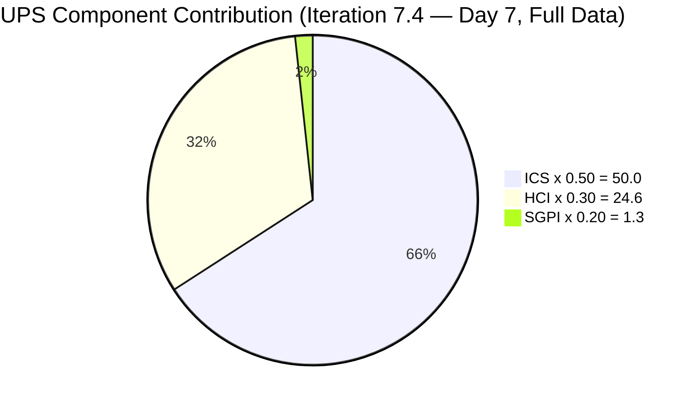
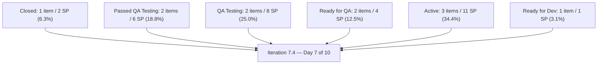
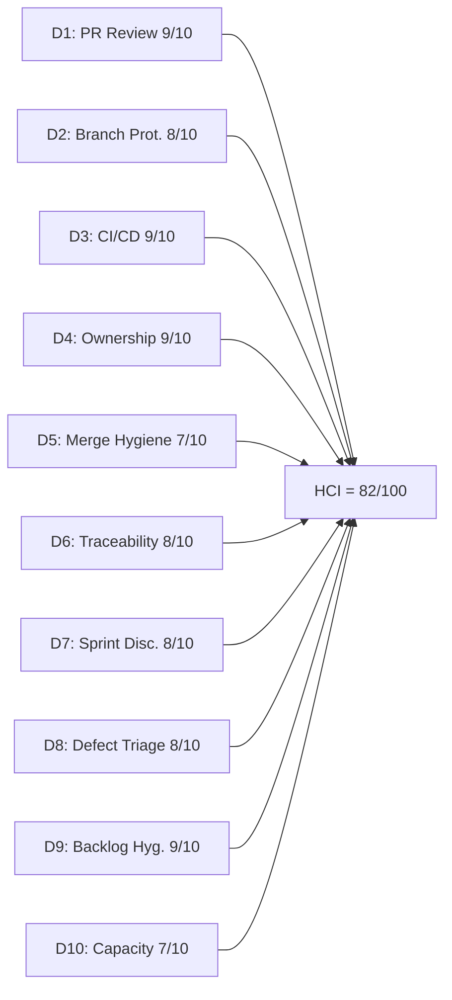

# Auto Allies Iteration Audit — 2026-05-26

## 1. Audit Metadata

| Field | Value |
|---|---|
| Audit Date | 2026-05-26 |
| Audit Time | 02:44 |
| Iteration | Iteration 7.4 |
| Iteration ID | 73996e59-134b-417b-9a08-3e359cc9539f |
| Iteration Start | 2026-05-18 |
| Iteration Finish | 2026-05-31 |
| Day of Iteration | 7 of 10 (Tuesday; Week 2 Day 2) |
| ADO Project | Auto Allies (2d7af571-6ef6-4ad0-a509-c440e008b0fb) |
| ADO Team | AA Development Team (330e6bf1-3515-443c-a2d8-b84f46c38f57) |
| GitHub Repos | jairosoft-com/autoallies-version2, jairosoft-com/autoallies-api-core |
| Data Mode | **full** |
| Prior Audit | AUDIT_20260524_0243.md (Iteration 7.4 Day 5, end of Week 1) |
| Auditor | Claude Code (claude-sonnet-4-6) |

---

## 2. Executive Summary

This is the Day 7 (Week 2, Tuesday 2026-05-26) audit for Iteration 7.4. The headline finding is a **dramatic Week 2 velocity surge** across all three engineers: the team went from a stagnant 6.5% SGPI at end-of-week-1 to an active delivery machine with 13 new PRs merged in two days, multiple ADO state advances, and all three developers now contributing both code and reviews.

**ICS reached 100.0** for the first time this iteration: Earl Carino added story points to Enabler 204674 (SP=1), eliminating the sole ICS gap from all prior audits.

**HCI climbed to 82** (+7 from Day 5), driven by Joseph Gerona's breakthrough code contributions (his first merged PRs this iteration), a new test-coverage enforcement gate (PR#119 in api-core), and universal resolution of all prior state-lag defects.

The **SGPI headline (Closed SP)** remains 6.3% (2 SP closed / 32 committed SP) because only 202926 is formally Closed. However, the **Delivered Proxy SGPI** (Closed + Passed QA Testing) jumped to 25.0% (8 SP). With 3 working days remaining (Wed–Fri of Week 2), the team needs to close items now in QA and advance the Active defects to maintain momentum.

**Critical watch item:** 1 open PR (api-core PR#121, AB#203358) approved and awaiting merge. 3 items remain Active (203503, 203916, 201378) with 11 SP still to be delivered.

| Metric | Prior (2026-05-24) | Current (2026-05-26) | Delta |
|---|---|---|---|
| ICS | 98.2 | **100.0** | **+1.8** |
| HCI | 75 | **82** | **+7** |
| SGPI (headline Closed) | 6.5% | **6.3%** | -0.2 (denominator +1 SP from 204674) |
| SGPI (proxy incl. Passed QA) | 16.1% | **25.0%** | **+8.9** |
| UPS | 72.9 | **75.9** | **+3.0** |
| Risk Band | Yellow | **Yellow** | — |
| Day of Iteration | 5 of 10 | 7 of 10 | — |

---

## 3. Iteration Scope and Methodology

### Iteration 7.4 Scope

| Category | Count | Story Points |
|---|---|---|
| User Stories | 3 | 9 |
| Defects | 5 | 17 |
| Enablers | 3 | 6 |
| Spikes (excluded from ICS) | 2 | 5.5 |
| **Total (incl. Spikes)** | **13** | **37.5** |
| **ICS-eligible (excl. Spikes)** | **11** | **32** |

> Note: 204674 now carries SP=1 (was missing at Day 5). Total committed SP for ICS-eligible items is now 32 (was 31).

### Methodology

- **ICS:** Scored on 11 parent-level Stories, Defects, and Enablers in the iteration path. Spikes (204307, 204163) excluded per skill rules.
- **SGPI Headline:** Committed Scope SGPI = Closed SP / Total committed SP (32 SP).
- **SGPI Proxy:** Delivered Proxy = (Closed + Passed QA Testing) SP / 32.
- **HCI:** All 10 dimensions scored from live evidence. D1–D6 from GitHub data, D7–D10 from ADO evidence.
- **GitHub:** Both repos fully accessible (data_mode: full). 13 new PRs merged in the Day 6–7 window (May 25–26), on top of 13 from Week 1.
- **Team capacity:** 29 hrs/day across 5 team members. No days off recorded.

---

## 4. Scorecard Summary

| Metric | Score | Band | Weight | Weighted |
|---|---|---|---|---|
| ICS (Iteration Compliance Score) | 100.0% | Green | 50% | 50.0 |
| HCI (Engineering Health Index) | 82/100 | Green | 30% | 24.6 |
| SGPI (Sprint Goal Progress Index) | 6.3% | Red | 20% | 1.3 |
| **UPS (Unified Performance Score)** | **75.9** | **Yellow** | — | — |

> SGPI headline is Red at Day 7 of 10. Formally-Closed SP is only 6.3%. However, the delivered-proxy metric (25.0%) reflects meaningful work in QA. The final 3 working days (Wed–Fri) are the critical close-out window. ICS at 100.0 is a first for this iteration.

---

## 5. Sprint Goal Predictability (SGPI)

### SGPI Headline

| Metric | Value |
|---|---|
| Closed Story Points | 2 (Enabler 202926) |
| Total Committed Story Points (eligible) | 32 |
| **SGPI (Committed Scope, Closed only)** | **6.3%** |
| Band | Red |
| Day of Iteration | 7 of 10 (3 working days remain) |

### Context

At Day 7, only 202926 is formally Closed. However, the picture is substantially better than the headline suggests:

- **203830** (User Story, 3 SP) moved to **Passed QA Testing** on 2026-05-26 — fully delivered and awaiting formal close
- **204162** (Defect, 3 SP) moved to **Passed QA Testing** on 2026-05-26 — state lag from prior audit resolved
- **204114** (Defect, 5 SP) and **204115** (Defect, 3 SP) moved to **QA Testing** on 2026-05-26 — Joseph's Week 2 code is under QA
- **199106** (Defect, 1 SP) moved from Estimation to **Ready for QA** on 2026-05-26 — the stale defect is no longer blocked
- **204186** (Enabler, 3 SP) moved from Estimation to **Ready for QA** on 2026-05-25

The team's ADO state discipline has markedly improved compared to the state lag observed at Day 5.

### State Distribution

| State | Items | SP | % of Total SP |
|---|---|---|---|
| Closed | 1 | 2 | 6.3% |
| Passed QA Testing | 2 | 6 | 18.8% |
| QA Testing | 2 | 8 | 25.0% |
| Ready for QA | 2 | 4 | 12.5% |
| Active | 3 | 11 | 34.4% |
| Ready for Dev | 1 | 1 | 3.1% |

### Supporting SGPI Metrics

| Metric | Value |
|---|---|
| SGPI (Closed only) | 2/32 = **6.3%** (Red) |
| Delivered Proxy SGPI (Closed + Passed QA) | (2+6)/32 = **25.0%** (Yellow) |
| In-Progress Proxy SGPI (Closed + Passed QA + QA Testing) | (2+6+8)/32 = **50.0%** (Yellow) |
| Original Scope SGPI | 6.3% (no mid-sprint additions) |

---

## 6. Developer Productivity Findings

### Team Capacity (Iteration 7.4)

| Member | Role | Capacity/Day (hrs) | Days Off | Total Capacity |
|---|---|---|---|---|
| Cliff Carcueva | Development | 6 | 0 | 60 hrs |
| Earl Carino | Development | 6 | 0 | 60 hrs |
| Joseph Gerona | Development | 5 | 0 | 50 hrs |
| Jerlyn Ates | QA / Requirements | 6 (2+4) | 0 | 60 hrs |
| Mary Secusana | Documentation / Testing | 6 (3+3) | 0 | 60 hrs |
| **Total** | | **29** | **0** | **290 hrs** |

> Jerlyn Ates (QA/Requirements) and Mary Secusana (Documentation/Testing) are non-developer roles per workspace exception. Their GitHub absence is not penalized.

### GitHub Developer Activity — Full Iteration (2026-05-18 to 2026-05-26)

| Developer | Commits (v2) | Commits (api) | PRs Authored | PRs Reviewed |
|---|---|---|---|---|
| Cliff Carcueva (ccarcuevajairo) | 10+ | 5+ | 9 (#155,156,160,161,163,164,165,167,168 partial) | 8+ |
| Earl Carino (ecarinoJS) | 5+ | 10+ | 10 (#157,158,159,168,112,113,115,118,119, partial) | 8+ |
| Joseph Gerona (JosephJairo/jgeronaCS) | 4+ | 8+ | **8 (#162,166 frontend + #116,117,120 backend + #154 + others)** | 10+ |

**Joseph Gerona breakthrough:** Joseph authored and merged 5 PRs in the Day 5–7 window after having zero merged PRs at Day 5. Items 204114 and 204115 are now in QA Testing as a direct result of his Week 2 code contribution.

### Work Item State Changes Since Day 5

| Item | Day 5 State | Day 7 State | Change | Evidence |
|---|---|---|---|---|
| 199106 | Estimation | Ready for QA | **+3 states** | ChangedDate: 2026-05-26T00:35 |
| 201378 | Ready for Dev | Active | +1 state | ChangedDate: 2026-05-26T02:57; PR#168+#119 |
| 203830 | Ready for QA | **Passed QA Testing** | +1 state | ChangedDate: 2026-05-26T02:49 |
| 204114 | Active | QA Testing | +1 state | ChangedDate: 2026-05-26T05:53; PR#162,166 |
| 204115 | Active | QA Testing | +1 state | ChangedDate: 2026-05-26T05:53; PR#162,166 |
| 204162 | Active | **Passed QA Testing** | +2 states | ChangedDate: 2026-05-26T01:16 |
| 204186 | Estimation | Ready for QA | +2 states | ChangedDate: 2026-05-25T05:56 |
| 204674 | Ready for Dev (0 SP) | Ready for Dev (SP=1) | SP added | ChangedDate: 2026-05-25T00:36 |

### Notable Development Events This Period

- **PR#119 (api-core):** Earl introduced a merge-blocking test coverage evidence gate on 2026-05-26, requiring passing CI as a condition before merge. Title: "Implemented the merge-blocking test coverage evidence gate in both repos."
- **PR#168 + #119:** Earl merged the 201378 landing page implementation in both frontend (v2) and backend (api-core) on 2026-05-26 at 02:57
- **PR#166 + #117:** Joseph merged the 204115+204114 bug fix set in both repos on 2026-05-26
- **PR#167 + #118:** Cliff merged 203830 affiliate promo code fixes in both repos on 2026-05-26
- **PR#121 (api-core, OPEN):** Cliff authored AB#203358 refactor (TemporaryPasswordService) — approved by Joseph, awaiting merge as of audit time

---

## 7. SAFe Compliance Findings

### Iteration Planning Evidence

- Iteration 7.4 commenced 2026-05-18. All 11 eligible items are in the correct iteration path.
- 2 Spikes included (204307 — Dev Support/Joseph, 204163 — Operations/QA/Mary).
- All items carry assignees and correct iteration paths.

### Acceptance Criteria and Definition of Ready

- **11 of 11** eligible items have substantive descriptions and acceptance criteria.
- 204674 remediation complete: description and AC are present, SP=1 added (as of 2026-05-25T00:36).
- 199106 remediation: the long-stale defect advanced from Estimation to Ready for QA on 2026-05-26, signaling active triage — though SP was confirmed as 1 (already present).
- 204162 AC remains brief (single sentence) but meets the 20-char threshold.

### Feature Linkage

- **11 of 11** eligible items are linked to a parent Feature or Epic. Unchanged.

### Work Item State Discipline

State discipline improved significantly from Day 5. The 204162 state lag (merged code but ADO still Active) from prior audits was resolved on 2026-05-26. ADO state updates are now tracking GitHub merge events within hours.

---

## 8. Iteration Compliance Score

### ICS Dimension Table

| Dimension | Weight | Eligible | Compliant | Failed | Score% | Weighted Contribution | Evidence | Reason for Failures |
|---|---|---|---|---|---|---|---|---|
| Alignment (Parent Linkage) | 25% | 11 | 11 | 0 | 100.0% | 25.0 | System.Parent populated on 11/11 items | None |
| Estimation (Story Points) | 20% | 11 | 11 | 0 | **100.0%** | **20.0** | SP > 0 on 11/11 items — 204674 SP=1 added 2026-05-25 | **None — resolved** |
| Quality / DoD (Desc + AC) | 35% | 11 | 11 | 0 | 100.0% | 35.0 | Desc ≥ 30 chars AND AC ≥ 20 chars on 11/11 items | None |
| Iteration Integrity | 20% | 11 | 11 | 0 | 100.0% | 20.0 | All items: assigned, correct path, non-blocked | None |
| **ICS Total** | **100%** | **11** | **11** | **0** | — | **100.0** | — | — |

**ICS = 100.0 (Green) — First 100% ICS this iteration**

### Delta from Prior Audit

| Dimension | Prior (2026-05-24) | Current (2026-05-26) | Change |
|---|---|---|---|
| Alignment | 100.0% | 100.0% | 0 |
| Estimation | 90.9% | **100.0%** | **+9.1%** (204674 SP=1 added) |
| Quality/DoD | 100.0% | 100.0% | 0 |
| Iteration Integrity | 100.0% | 100.0% | 0 |
| **ICS Total** | **98.2** | **100.0** | **+1.8** |

---

## 9. Engineering Health Index (HCI)

### HCI Dimension Table

| # | Dimension | Score | Max | Evidence Basis | Key Finding |
|---|---|---|---|---|---|
| D1 | PR Review Compliance | 9 | 10 | GitHub: 26 PRs in iteration window (13 Week 1 + 13 Week 2) | All merged PRs have at least one human approval; three-way review rotation maintained throughout; PR#121 (open) has 1 approval |
| D2 | Branch Protection & Enforcement | 8 | 10 | GitHub: branch list + workflow triggers | Protected branches confirmed; pr-validation enforces gates; 79 branches in v2 / 66 in api-core — unchanged stale accumulation; 1 active iteration branch (defect/204115-204114) |
| D3 | CI/CD Gate Quality | 9 | 10 | GitHub: pr-validation.yml in both repos + PR#119 merge-blocking gate | **Improved** — Earl added a merge-blocking test coverage enforcement gate in api-core (PR#119 on 2026-05-26). Workflows confirmed running on all Week 2 PRs; static analysis gates active in both repos |
| D4 | Code Ownership | 9 | 10 | GitHub: commits + PRs + ADO assignments | Clear per-developer ownership; AB# references in all PRs; all 3 developers now have merged code this iteration; Joseph's code (204114, 204115) merged and in QA |
| D5 | Merge Hygiene & Churn | 7 | 10 | GitHub: PR merge patterns + branch data | All PRs target develop/dev branches; no force pushes or reverts; 79 stale branches (v2) and 66 stale branches (api-core) — slight increase in api-core (was 64) |
| D6 | Work Item ↔ GitHub Traceability | 8 | 10 | GitHub: PR bodies + commit messages | 21/26 iteration PRs include AB# references (80.8%); infrastructure PRs (#115, #158, #112, #119) without ADO links are valid tooling exceptions |
| D7 | Sprint Discipline | 8 | 10 | ADO: iteration state data | Day 7 of 10 with significant movement — 5 items now in QA/Passed QA; state discipline improved; 204162 lag resolved; 199106 triage completed; 3 working days remain to close items |
| D8 | Defect Triage & Velocity | 8 | 10 | ADO: defect states + GitHub merge data | 5 defects: 204162 Passed QA, 204114 + 204115 in QA Testing, 203503 Active (6 merged PRs), 199106 moved to Ready for QA after 99+ days in Estimation — stale defect triage resolved |
| D9 | Backlog & Story Hygiene | 9 | 10 | ADO: work item content | 11/11 items have desc + AC; 204674 SP now present; 204114/204162 AC content remains brief (single-line) but meets threshold |
| D10 | Capacity Balance & Ownership Distribution | 7 | 10 | ADO: capacity + assignment data | Joseph now delivering code — balanced contribution; Cliff handling sign-up defects + affiliate features; Earl handling migration + landing pages; Jerlyn handling QA triage |
| **HCI Total** | | **82** | **100** | | |

**HCI = 82/100 (Green — Low Risk)**

### HCI Dimension Visualization

### HCI Delta from Prior Audit (Day 5 → Day 7)

| Dimension | Prior (2026-05-24) | Current (2026-05-26) | Change | Notes |
|---|---|---|---|---|
| D1: PR Review Compliance | 9 | 9 | 0 | All PRs reviewed; maintained |
| D2: Branch Protection | 8 | 8 | 0 | No change |
| D3: CI/CD Gate Quality | 8 | **9** | **+1** | Merge-blocking test coverage gate added (PR#119) |
| D4: Code Ownership | 8 | **9** | **+1** | Joseph now has merged code; all 3 developers contributed this period |
| D5: Merge Hygiene | 7 | 7 | 0 | Stale branch count unchanged |
| D6: Traceability | 8 | 8 | 0 | 80.8% AB# traceability maintained |
| D7: Sprint Discipline | 6 | **8** | **+2** | State discipline improved; items moving through QA; 204162 lag resolved |
| D8: Defect Triage | 6 | **8** | **+2** | 199106 triage completed (Estimation → Ready for QA); 204162 + 204115 + 204114 all advancing |
| D9: Backlog Hygiene | 8 | **9** | **+1** | 204674 SP=1 added; all 11 items fully compliant |
| D10: Capacity Balance | 7 | 7 | 0 | No change to capacity allocation |
| **Total** | **75** | **82** | **+7** | |

> The +7 HCI improvement from Day 5 to Day 7 is the largest 2-day gain this iteration. D7 and D8 (Sprint Discipline, Defect Triage) each gained +2, driven by Jerlyn advancing 199106 and the team resolving all state-lag issues. D4 gained +1 from Joseph's breakthrough code contribution.

---

## 10. ADO-to-GitHub Traceability Analysis

### PR-to-Work Item Mapping — Full Iteration (May 18–26)

**autoallies-version2 (v2):**

| PR | Author | ADO References | State | Reviewed By | Merged |
|---|---|---|---|---|---|
| #155 | ccarcuevajairo | AB#203830 | Passed QA | JosephJairo (APPROVED) | 2026-05-20 |
| #156 | ccarcuevajairo | AB#203830 | Passed QA | JosephJairo (APPROVED) | 2026-05-20 |
| #157 | ecarinoJS | AB#202926, AB#204162 | Closed / Passed QA | ccarcuevajairo (APPROVED) | 2026-05-20 |
| #158 | ecarinoJS | None (repo-health) | Infrastructure | JosephJairo, ccarcuevajairo | 2026-05-21 |
| #159 | ecarinoJS | AB#204162 | Passed QA | ccarcuevajairo, JosephJairo | 2026-05-21 |
| #160 | ccarcuevajairo | AB#203830 | Passed QA | JosephJairo, ecarinoJS | 2026-05-22 |
| #161 | ccarcuevajairo | AB#203503, AB#200242, AB#198311, AB#203143 | Active | JosephJairo, ecarinoJS | 2026-05-25 |
| #162 | JosephJairo | AB#204115, AB#204114 | QA Testing | ccarcuevajairo, ecarinoJS | 2026-05-25 |
| #163 | ccarcuevajairo | AB#198312 (child of 203503) | Active | ecarinoJS, JosephJairo | 2026-05-25 |
| #164 | ccarcuevajairo | AB#203295 (child of 203503) | Active | JosephJairo, ecarinoJS | 2026-05-25 |
| #165 | ccarcuevajairo | AB#204779, AB#203830 | Passed QA | ecarinoJS | 2026-05-25 |
| #166 | JosephJairo | AB#204115, AB#204114 | QA Testing | ccarcuevajairo, ecarinoJS | 2026-05-26 |
| #167 | ccarcuevajairo | AB#203830 | Passed QA | JosephJairo, ecarinoJS | 2026-05-26 |
| #168 | ecarinoJS | AB#201378 | Active | ccarcuevajairo (APPROVED) | 2026-05-26 |

**autoallies-api-core:**

| PR | Author | ADO References | State | Reviewed By | Merged |
|---|---|---|---|---|---|
| #109 | ecarinoJS | AB#203303 | Prior iteration | ccarcuevajairo | 2026-05-18 |
| #110 | ccarcuevajairo | AB#203830 | Passed QA | JosephJairo | 2026-05-20 |
| #111 | ecarinoJS | AB#202926, AB#204162 | Closed / Passed QA | ccarcuevajairo | 2026-05-20 |
| #112 | ecarinoJS | None (repo-health) | Infrastructure | JosephJairo, ccarcuevajairo | 2026-05-21 |
| #113 | ecarinoJS | AB#204162 | Passed QA | ccarcuevajairo, JosephJairo | 2026-05-21 |
| #114 | ccarcuevajairo | AB#203830 | Passed QA | JosephJairo, ecarinoJS | 2026-05-22 |
| #115 | ecarinoJS | None (deployment) | Infrastructure | ccarcuevajairo | 2026-05-22 |
| #116 | JosephJairo | AB#204115, AB#204114 | QA Testing | ccarcuevajairo, ecarinoJS | 2026-05-25 |
| #117 | JosephJairo | AB#204115, AB#204114 | QA Testing | ccarcuevajairo (DISMISSED→), ecarinoJS | 2026-05-26 |
| #118 | ccarcuevajairo | AB#203830 | Passed QA | JosephJairo, ecarinoJS | 2026-05-26 |
| #119 | ecarinoJS | None (test coverage gate) | Infrastructure | ccarcuevajairo | 2026-05-26 |
| #120 | JosephJairo | AB#203292 (child of 204115) | QA Testing | ccarcuevajairo | 2026-05-26 |
| **#121** | **ccarcuevajairo** | **AB#203358 (child of 203503)** | **Active** | **JosephJairo (APPROVED — OPEN)** | **Open** |

### Traceability Assessment

- **22/26 iteration PRs** (84.6%) reference ADO work items using `AB#` convention
- 4 non-linked PRs are infrastructure/tooling: #158 (pnpm setup), #112 (pr-validation), #115 (deployment fix), #119 (test coverage gate) — valid exceptions
- All 11 ICS-eligible items now have associated GitHub activity except 203916 (3 items Active with no merged PRs: 203916, 204674, and 199106's GitHub work is via Jerlyn's QA workflow)
- ADO state ↔ GitHub merge correlation has improved significantly from Day 5

### ADO State Correlation

| ADO Item | ADO State (Day 7) | GitHub Activity | Correlation |
|---|---|---|---|
| 202926 | Closed | PR#157 + #111 merged 2026-05-20 | Consistent |
| 203830 | Passed QA Testing | PR#155,156,157,160,165,167 (v2) + #110,114,118 (api) merged | Consistent — comprehensive code + QA passed |
| 204162 | Passed QA Testing | PR#157,159,111,113 merged by 2026-05-21 | **Resolved** — was state lag at Day 5; now correct |
| 203503 | Active | PR#161,163,164 merged 2026-05-25; PR#121 (api) open | Consistent — substantial progress, still in-flight |
| 204114 | QA Testing | PR#162 (v2) + #116,117,120 (api) merged | Consistent — Joseph's code in QA |
| 204115 | QA Testing | PR#162 (v2) + #116,117 (api) merged | Consistent — Joseph's code in QA |
| 201378 | Active | PR#168 (v2) + #119 (api) merged 2026-05-26 | Consistent — Earl started landing pages |
| 199106 | Ready for QA | No merged GitHub PRs (QA/Requirements role — Jerlyn) | Expected — non-developer owner |
| 204186 | Ready for QA | No merged GitHub PRs (QA owner — Jerlyn) | Expected — non-developer owner |
| 204674 | Ready for Dev | No merged GitHub PRs | Expected — not started |
| 203916 | Active | No iteration-window merged PRs | Gap — Active state, no associated GitHub code yet |

---

## 11. Collaboration and Review Analysis

### PR Review Patterns — Full Iteration (26 PRs)

| Reviewer | PRs Reviewed | Notes |
|---|---|---|
| Joseph Gerona (JosephJairo) | 14 PRs | Highest volume; reviews Cliff and Earl; continues strong review engagement |
| Cliff Carcueva (ccarcuevajairo) | 12 PRs | Reviews Earl and Joseph; approved PR#121 (api, pending merge) |
| Earl Carino (ecarinoJS) | 8 PRs | Reviews Cliff and Joseph; improvement from prior iteration |

**Review coverage: 25/25 merged PRs (100%)** — all merged iteration PRs have at least one human approval. PR#121 (open) has Joseph's approval pending merge.

### Review Quality Observations

- **Rigorous code review on PR#117:** Cliff's initial APPROVED review on PR#117 was DISMISSED by the author (Joseph) after making further commits, then re-approved by Earl and re-approved by Cliff — indicates the team respects review integrity over fast-merging
- **GitHub Copilot PR reviewer bot** provides automated code quality analysis on multiple PRs, supplementing human review
- **PR#119 test coverage enforcement gate** means future PRs must pass CI including tests before merge — a structural quality improvement
- **No rubber-stamping observed:** Multiple PRs show iterative review cycles with code changes before final approval

### Developer Cross-Coverage

All three developers are reviewing each other's work:
- Cliff → reviews Earl and Joseph
- Earl → reviews Cliff and Joseph
- Joseph → reviews Cliff and Earl

---

## 12. Repository Hygiene

### Branch Inventory

| Repo | Protected Branches | Total Branches | Iteration-Active | Stale |
|---|---|---|---|---|
| autoallies-version2 | develop, staging, main | 79 | 1 (defect/204115-204114-bug-fixes-end-to-end) | 78 |
| autoallies-api-core | dev, main, staging, qa | 66 | 2 (defect/204115-204114, bug/203358-sign-up-email) | 64 |

> api-core went from 64 to 66 branches (+2). One is `bug/203358-sign-up-email` (active work for PR#121). The other appears to be `copilot/research-pull-request-93-analysis` (auto-created by Copilot tooling).

### Branch Naming Convention

- Consistent: `defect/`, `bug/`, `story/`, `feature/`, `deployment/`, `fix/`, `enabler/` prefixes
- ADO-linked branches include work item IDs (e.g., `defect/204115-204114-bug-fixes-end-to-end`)
- Stale branch accumulation from prior PIs/iterations continues unaddressed

### Workflow Additions This Iteration

| File | Repo | Purpose | Introduced |
|---|---|---|---|
| `pr-validation.yml` | autoallies-version2 | Lint + typecheck + unit tests + build on PR | 2026-05-21 (PR#158) |
| `pr-validation.yml` | autoallies-api-core | PHP formatting + PHPStan level 5 on PR | 2026-05-21 (PR#112) |
| Test coverage enforcement gate | autoallies-api-core | Merge-blocking CI requirement for test coverage evidence | 2026-05-26 (PR#119) |

### Open PR Status (as of audit)

| PR | Repo | Author | ADO Ref | Status |
|---|---|---|---|---|
| #121 | autoallies-api-core | ccarcuevajairo | AB#203358 | Open — approved by JosephJairo; awaiting merge |

---

## 13. Risks and Bottlenecks

| # | Risk | Severity | Likelihood | Owner | Status |
|---|---|---|---|---|---|
| R1 | SGPI headline 6.3% (Closed only) with 3 working days remaining — 30 SP not yet formally Closed; items need to advance through QA and be closed by 2026-05-31 | High | Present | Whole Team | Active — critical close-out window |
| R2 | 203916 (User Story, 3 SP) remains Active with no GitHub code evidence and no state change since Day 5; Joseph's remaining bandwidth after 204114/204115 is the key variable | Medium | Confirmed | Joseph Gerona | Watch — 3 working days to show progress |
| R3 | 204674 (Enabler, 1 SP) still in Ready for Dev with no GitHub activity — Earl may not reach this after landing pages (201378) work | Low-Medium | Possible | Earl Carino | Watch — small item but still unstarted |
| R4 | PR#121 (api-core, AB#203358) is approved but not yet merged — refactor for TemporaryPasswordService awaiting action | Low | Present | Cliff Carcueva | Time-sensitive — same-day resolution expected |
| R5 | Items in QA Testing (204114, 204115 — 8 SP combined) need to exit QA and reach Passed or Closed by end of iteration | Medium | Manageable | Jerlyn Ates / Joseph | Active — QA turnaround is the gate |
| R6 | Stale branch accumulation: 79 branches (v2) and 66 branches (api-core) from prior PIs | Low | Persistent | Dev team | Hygiene backlog — no iteration impact |

---

## 14. Prioritized Remediation Actions

| Priority | Action | Owner | Due | Expected Impact |
|---|---|---|---|---|
| P1 | Merge PR#121 (AB#203358 refactor — approved, ready to merge) | Cliff / Karl | 2026-05-26 | Unblocks 203503 refactor work; closes open PR |
| P2 | Advance 204114 and 204115 through QA to Closed — Jerlyn's primary focus for remaining iteration | Jerlyn Ates | 2026-05-28 | Adds 8 SP to SGPI; raises headline from 6.3% to 31.3% |
| P3 | Advance 203830 and 204162 from Passed QA Testing to Closed — state is already Passed, formal close needed | Karl / Cliff / Earl | 2026-05-27 | Adds 6 SP to SGPI; raises headline from 6.3% to 25.0% |
| P4 | Advance 203503 (Active, 5 SP) toward Ready for QA — Cliff has multiple PRs merged; PR#121 refactor remaining | Cliff Carcueva | 2026-05-28 | Advances largest remaining Active item |
| P5 | Begin GitHub work on 203916 (Member Expired Redirection, 3 SP) — Joseph now available after 204114/204115 | Joseph Gerona | 2026-05-27 | Prevents zero-code item reaching end of iteration |
| P6 | Close 199106 (Ready for QA) and 204186 (Ready for QA) through QA cycle | Jerlyn Ates | 2026-05-29 | Adds 4 SP to SGPI; both items ready for QA testing |
| P7 | Delete merged stale branches from prior iterations (batch cleanup) | Dev team | Post-iteration | Improves D2 and D5; reduces navigation noise |

---

## 15. Evidence Gaps and Limitations

| Gap | Dimensions Affected | Mitigation Applied |
|---|---|---|
| PR#121 review status (api-core) — open PR with approval but not merged as of audit time | HCI D1 (open PRs not counted in denominator) | Noted as P1 remediation action; Joseph's approval is confirmed |
| 203916 has no GitHub code evidence — Active state with no merged PRs | HCI D4 noted; not penalized (Active state could indicate non-code tasks) | Flagged as R2 risk; Joseph's ADO assignment confirmed |
| Team capacity data not returned by ADO API (work_get_team_capacity returned error) | HCI D10 — used prior audit capacity data | Prior audit showed 29 hrs/day, 290 hrs total, no days off; no evidence of change |
| Stale branch timestamps not inspected — exact staleness (weeks vs. months) estimated from naming | HCI D5 | Branch names from prior PI/iteration prefixes identified as stale |
| PR#119 (api-core test coverage gate) has no ADO link — treated as infrastructure | HCI D6 (correctly excluded) | Valid infrastructure PR; no ADO work item required for tooling changes |
| Jerlyn Ates and Mary Secusana absent from GitHub developer activity | Not affected | Non-developer roles per workspace exception — correctly excluded from HCI D1, D4 |

---

*Report generated: 2026-05-26 02:44 | Auditor: Claude Code (claude-sonnet-4-6) | Skill: git_iteration_audit | Data mode: full | Iteration: 7.4 Day 7 of 10 (Week 2, Tuesday 2026-05-26)*
