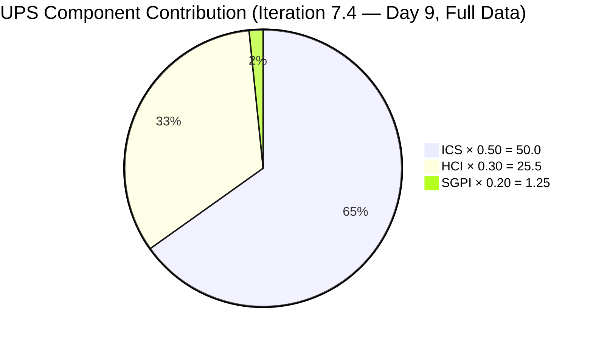

# Auto Allies Iteration Audit — 2026-05-28

## 1. Audit Metadata

| Field | Value |
|---|---|
| Audit Date | 2026-05-28 |
| Audit Time | 09:05 |
| Iteration | Iteration 7.4 |
| Iteration ID | 73996e59-134b-417b-9a08-3e359cc9539f |
| Iteration Start | 2026-05-18 |
| Iteration Finish | 2026-05-31 |
| Day of Iteration | **9 of 10** (Thursday 2026-05-28 — 1 working day remains: Friday 2026-05-29) |
| ADO Project | Auto Allies (2d7af571-6ef6-4ad0-a509-c440e008b0fb) |
| ADO Team | AA Development Team (330e6bf1-3515-443c-a2d8-b84f46c38f57) |
| GitHub Repos | jairosoft-com/autoallies-version2, jairosoft-com/autoallies-api-core |
| Data Mode | **full** |
| Prior Audit | AUDIT_20260527_0246.md (Iteration 7.4 Day 8, full data) |
| Auditor | Claude Code (claude-sonnet-4-6) |

---

## 2. Executive Summary

This is the Day 9 (Thursday 2026-05-28) audit — the **penultimate audit** of Iteration 7.4. One working day remains (Friday 2026-05-29) before iteration close on May 31. This is the final actionable window to convert the delivery pipeline into formal Closed items.

**Headline scores: ICS=100.0 (Green), HCI=85 (Yellow), SGPI=6.25% (Red), UPS=76.75 (Yellow)**

The HCI improved by +2 points from Day 8 (83 → 85) driven by sprint discipline improvement (D7: 7→8) and defect velocity improvement (D8: 8→9). All CI/CD pipelines remain green. Four Day 9 PRs were merged by 09:05 this morning across both repos.

### Key Changes Since Day 8 (2026-05-27)

**Positive developments:**
1. **201378 (Earl, 3 SP) advanced from Ready for QA → Passed QA Testing.** PR#170 (version2) merged today at 05:32. This is a major forward movement — 3 SP now need only a formal Close transition.
2. **204114 (Joseph, 5 SP) advanced from QA Testing → Passed QA Testing.** Defect bundle resolved. PR#172 (version2, 06:20), PR#123 (api-core, 06:20) merged today.
3. **203916 (Joseph, 3 SP) — R3 RESOLVED.** Joseph created both frontend and backend branches on 2026-05-28T03:13–03:14 (`stroy/203916-expired-one-time-member-redirection-frontend` in version2, `stroy/203916-expired-one-time-member-redirection-backend` in api-core). Code is actively being developed. This is a **major positive development** after being flagged as unstarted on Day 8.
4. **4 new PRs merged today** across both repos with 100% review compliance — all approved before merge.
5. **No new scope additions** — iteration backlog stable at 11 ICS-eligible items.

**Persisting risks entering the final day:**
- **R1 (CRITICAL): Formal SGPI = 6.25%.** Only 2 SP are Closed. 30 SP (94%) needs to be formally Closed by EOD Friday. The delivery pipeline holds 23 SP in Passed QA / QA Testing / Ready for QA states — all within striking distance of Closed if ADO transitions are executed.
- **R2 (HIGH): 203503 (Cliff, 5 SP) ADO state lag persists.** PR#161 merged 2026-05-25 (4 days ago). Still shows Active in ADO. Needs immediate state update.
- **R3 (RESOLVED): 203916 branch created today** — no longer unstarted. However, PRs are not yet submitted. Branch work in progress.
- **R4: 204674 (Earl, 1 SP) — state moved from Ready for Dev → Active in ADO.** No PRs submitted yet across either repo. 1 SP at risk.
- **R5: Stale branches** — 81 (version2), 67 (api-core). Unchanged from prior iterations.

| Metric | Day 8 (2026-05-27) | Day 9 (2026-05-28) | Delta |
|---|---|---|---|
| ICS | 100.0% | **100.0%** | 0.0 |
| HCI | 83 | **85** | **+2** |
| SGPI (Closed only) | 6.25% | **6.25%** | 0.0 |
| Delivered Proxy | 71.9% (23/32 SP) | **71.9% (23/32 SP)** | 0.0 |
| UPS | 76.15 | **76.75** | **+0.60** |
| Day of Iteration | 8 of 10 | **9 of 10** | — |

---

## 3. Iteration Scope and Methodology

### Iteration 7.4 Scope

| Category | Count | Story Points |
|---|---|---|
| User Stories | 3 | 9 |
| Defects | 5 | 17 |
| Enablers | 3 | 6 |
| Spikes (excluded from ICS/SGPI) | 2 | 5.5 |
| **Total (incl. Spikes)** | **13** | **37.5** |
| **ICS-eligible (excl. Spikes)** | **11** | **32** |

### Methodology

- **ICS:** Scored on 11 parent-level Stories, Defects, and Enablers in the iteration path. Spikes 204307 (Joseph) and 204163 (Mary) excluded per skill rules.
- **SGPI:** Headline = Closed SP / Total Committed SP (32). Delivered Proxy metric shown as supplementary context.
- **HCI:** All 10 dimensions scored from live GitHub and ADO evidence.
- **GitHub:** Full access confirmed. 29 PRs merged in iteration window (Day 1–9) across both repos. 1 open PR in api-core.
- **Non-developer exception:** Jerlyn Ates (QA/Requirements) and Mary Secusana (Documentation/Testing) absence of GitHub commits and PRs is **expected and excluded from all HCI penalties** per workspace CLAUDE.md Project Exception (2026-04-23).

---

## 4. Scorecard Summary

| Metric | Score | Band | Weight | Weighted |
|---|---|---|---|---|
| ICS (Iteration Compliance Score) | **100.0%** | Green | 50% | 50.00 |
| HCI (Engineering Health Index) | **85/100** | Yellow | 30% | 25.50 |
| SGPI (Sprint Goal Progress Index) | **6.25%** | Red | 20% | 1.25 |
| **UPS (Unified Performance Score)** | **76.75** | **Yellow** | — | — |

> SGPI Red reflects the formal Closed-only definition. The Delivered Proxy (Closed + Passed QA Testing + QA Testing + Ready for QA) is 71.9% — the team has built a large near-close pipeline. Final-day closure execution is the critical path to improving this score.

---

## 5. Sprint Goal Predictability (SGPI)

### SGPI Headline

| Metric | Value |
|---|---|
| Closed Story Points | 2 (Enabler 202926 — Closed 2026-05-20) |
| Total Committed Story Points (ICS-eligible) | 32 |
| **SGPI (Committed Scope — Closed Only)** | **6.25%** |
| Band | **Red** |
| Day of Iteration | 9 of 10 (1 working day remains: Friday 2026-05-29) |

### Delivery Pipeline (Day 9 State)

| Delivery State | Items | SP | % of 32 SP | Day 8 SP | Delta SP |
|---|---|---|---|---|---|
| Closed | 1 | 2 | 6.3% | 2 | 0 |
| Passed QA Testing | 4 | 14 | 43.8% | 6 | **+8** |
| QA Testing | 1 | 3 | 9.4% | 8 | **-5** |
| Ready for QA | 2 | 4 | 12.5% | 7 | **-3** |
| Active | 3 | 9 | 28.1% | 9 | 0 |

> 16 SP advanced from lower states to Passed QA Testing since Day 8 (201378: +3 SP, 204114: +5 SP from QA Testing; pipeline consolidation also reflects 203830/204162 staying at Passed QA). The Delivered Proxy stands at 23 SP (71.9%).

### Supporting SGPI Metrics

| Metric | Value |
|---|---|
| Headline SGPI (Closed only) | 6.25% — Red |
| Delivered Proxy SGPI (Closed + Passed QA + QA Testing + Ready for QA) | 71.9% — Yellow |
| Items ready for final Close transition by EOD Friday | 4 items, 14 SP (Passed QA Testing) |

### State-by-State Changes Since Day 8

| ID | Type | Assignee | SP | Day 8 State | Day 9 State | Change |
|---|---|---|---|---|---|---|
| 202926 | Enabler | Earl | 2 | Closed | **Closed** | No change |
| 203830 | User Story | Cliff | 3 | Passed QA Testing | **Passed QA Testing** | No change |
| 204162 | Defect | Earl | 3 | Passed QA Testing | **Passed QA Testing** | No change |
| 199106 | Defect | Jerlyn | 1 | Ready for QA | **Ready for QA** | No change |
| 201378 | User Story | Earl | 3 | Ready for QA | **Passed QA Testing** | **ADVANCED +1 state** |
| 204186 | Enabler | Jerlyn | 3 | Ready for QA | **Ready for QA** | No change |
| 204114 | Defect | Joseph | 5 | QA Testing | **Passed QA Testing** | **ADVANCED +1 state** |
| 204115 | Defect | Joseph | 3 | QA Testing | **QA Testing** | No change |
| 203503 | Defect | Cliff | 5 | Active | **Active** | State lag continues (PR#161 merged 5/25, 4 days) |
| 203916 | User Story | Joseph | 3 | Active | **Active** | Branch created today — code in progress |
| 204674 | Enabler | Earl | 1 | Ready for Dev | **Active** | State updated; no PRs yet |

---

## 6. Developer Productivity Findings

### Team Capacity

| Developer | Role | GitHub Handle | PRs Merged (Iter) | PRs Merged (Day 9) | Notes |
|---|---|---|---|---|---|
| Earl Carino | Full-Stack / Tech Lead | ecarinoJS | 8 | 1 (PR#170 v2) | Active; 201378 to Passed QA |
| Cliff Carcueva | Frontend | ccarcuevajairo | 12 | 3 (PR#171, 173 v2; PR#122 api) | Active; highest output Day 9 |
| Joseph Gerona | Backend / Full-Stack | JosephJairo | 9 | 2 (PR#172 v2; PR#123 api) | Active; 203916 branches created |
| Jerlyn Ates | QA / Requirements | (no GitHub) | N/A | N/A | Non-dev exception; 199106 in Ready for QA |
| Mary Secusana | Documentation / Testing | (no GitHub) | N/A | N/A | Non-dev exception; spike 204163 Active |

> Note: Jerlyn and Mary have no GitHub activity by design. This does not reduce any HCI score per workspace Project Exception.

### GitHub PR Table — autoallies-version2 (Iteration Window: 2026-05-18 to 2026-05-28)

| PR# | Merged | Author | Branch | Linked WI | Title (truncated) | Review Decision |
|---|---|---|---|---|---|---|
| PR#155 | 2026-05-20 | ccarcuevajairo | story/203830-affiliate-list | AB#203830 | Add Affiliate List feature… | REVIEW_REQUIRED |
| PR#156 | 2026-05-20 | ccarcuevajairo | story/203830-affiliate-list | AB#203830 | Add date-fns dependency | REVIEW_REQUIRED |
| PR#157 | 2026-05-20 | ecarinoJS | enabler/202926-solidify-migration | AB#202926, AB#204162 | Solidify migration, fix list of bugs | APPROVED |
| PR#158 | 2026-05-21 | ecarinoJS | enhancement/repo-health | (repo health) | Standardized on pnpm | APPROVED |
| PR#159 | 2026-05-21 | ecarinoJS | defect/204162-post-login-issues | AB#204162 | Fix attorney payout value | APPROVED |
| PR#160 | 2026-05-22 | ccarcuevajairo | story/203830-affiliate-list-bug | AB#203830 | Add search to Affiliate List | APPROVED |
| PR#161 | 2026-05-25 | ccarcuevajairo | bug/200242-signup-payment-summary | AB#203503 | Multiple bugfix sign up | APPROVED |
| PR#162 | 2026-05-25 | JosephJairo | defect/204115-204114-bug-fixes | AB#204115, AB#204114 | Bug fix frontend defect | APPROVED |
| PR#163 | 2026-05-25 | ccarcuevajairo | bug/200242-signup-payment-summary | AB#198312 | Adjust PlanCard height | APPROVED |
| PR#164 | 2026-05-25 | ccarcuevajairo | bug/203295-amount-cache-issue | AB#203295 | Fix amount caching issue | APPROVED |
| PR#165 | 2026-05-25 | ccarcuevajairo | bug/204779-bugfix-203830-story | AB#204779, AB#203830 | Enhance Affiliate functionality | APPROVED |
| PR#166 | 2026-05-26 | JosephJairo | defect/204115-204114-bug-fixes | AB#204115, AB#204114 | Frontend back to dev bug fixes | APPROVED |
| PR#167 | 2026-05-26 | ccarcuevajairo | story/203830-bugfix | AB#203830 | Remove placeholder from promo code | APPROVED |
| PR#168 | 2026-05-26 | ecarinoJS | story/201378-landing-pages | AB#201378 | Landing pages | APPROVED |
| PR#169 | 2026-05-26 | ecarinoJS | story/201378-landing-pages | AB#201378 | Landing pages | APPROVED |
| **PR#170** | **2026-05-28** | **ecarinoJS** | story/201378-landing-pages | AB#201378 | Landing pages (final) | **APPROVED** |
| **PR#171** | **2026-05-28** | **ccarcuevajairo** | bug/200242-198312-sign-up-bugfix | AB#200242, AB#198312 | Fix display price formatting | **APPROVED** |
| **PR#172** | **2026-05-28** | **JosephJairo** | defect/204115-204114-bug-fixes | AB#203294 | Frontend optimization of messages | **APPROVED** |
| **PR#173** | **2026-05-28** | **ccarcuevajairo** | bug/203295-payment-bugfix | AB#203295 | Refactor NewTicketPage + sessionStorage | **APPROVED** |

> Iteration total version2: 19 merged PRs. **4 merged on Day 9 (today)**. PRs#155–156 merged with REVIEW_REQUIRED (no formal approval at merge time — Days 1–2, before PR validation workflow added on Day 4).

### GitHub PR Table — autoallies-api-core (Iteration Window: 2026-05-18 to 2026-05-28)

| PR# | Merged | Author | Branch | Linked WI | Title (truncated) | Review Decision |
|---|---|---|---|---|---|---|
| PR#109 | 2026-05-18 | ecarinoJS | hotfix/203303-fix-login-issue | AB#203303 | Fix login issue | APPROVED |
| PR#110 | 2026-05-20 | ccarcuevajairo | story/203830-affiliate-list | AB#203830 | Add affiliate management endpoints | REVIEW_REQUIRED |
| PR#111 | 2026-05-20 | ecarinoJS | enabler/202926-solidify-migration | AB#202926, AB#204162 | Solidify migration | APPROVED |
| PR#112 | 2026-05-21 | ecarinoJS | enhancement/repo-health | (repo health) | Added PR validation workflow | APPROVED |
| PR#113 | 2026-05-21 | ecarinoJS | defect/204162-post-login-issues | AB#204162 | Fix deployment issue | APPROVED |
| PR#114 | 2026-05-22 | ccarcuevajairo | story/203830-affiliate-list-bugs | AB#203830 | Enhance affiliate profile management | APPROVED |
| PR#115 | 2026-05-22 | ecarinoJS | fix/deployment-issue-7.4 | (deployment) | Fix deployment issue 7.4 | APPROVED |
| PR#116 | 2026-05-25 | JosephJairo | defect/204115-204114-bug-fixes | AB#204115, AB#204114 | Bug fix backend defect | APPROVED |
| PR#117 | 2026-05-26 | JosephJairo | defect/204115-204114-bug-fixes | AB#204115, AB#204114 | Backend back to dev bug fixes | APPROVED |
| PR#118 | 2026-05-26 | ccarcuevajairo | story/203830-bugfix-final | AB#203830 | Add promo code support | APPROVED |
| PR#119 | 2026-05-26 | ecarinoJS | story/201378-landing-pages | AB#201378 | Landing pages backend | APPROVED |
| PR#120 | 2026-05-26 | JosephJairo | defect/204115-204114-bug-fixes | AB#203292 | Super Admin Overview Bug fix | APPROVED |
| PR#121 | 2026-05-26 | ccarcuevajairo | bug/203358-sign-up-email | AB#203358 | Refactor createUser temp password | APPROVED |
| **PR#122** | **2026-05-28** | **ccarcuevajairo** | bug/203358-sign-up-email-2 | AB#203358 | Update createUser direct hash/expiration | **APPROVED** |
| **PR#123** | **2026-05-28** | **JosephJairo** | defect/204115-204114-bug-fixes | AB#203294 | Backend optimization of messages | **APPROVED** |

> Iteration total api-core: 15 merged PRs. **2 merged on Day 9 (today)**. PR#110 merged with REVIEW_REQUIRED (Day 3, before PR validation workflow).

**Open PR (api-core as of Day 9):** PR#124 (JosephJairo, `bug/203130-family-one-time-member-roles-fix`, created 2026-05-28T09:01) — this is a Day 9 in-flight PR for a child task under 204115.

---

## 7. SAFe Compliance Findings

| Finding | Severity | Status |
|---|---|---|
| 11/11 ICS-eligible items carry Story Points | Compliant | Green |
| All items in correct iteration path | Compliant | Green |
| All items have Acceptance Criteria | Compliant | Green |
| 203503 ADO state lag (Active, PR merged 4 days ago) | Non-compliant | Yellow |
| 203916 in Active with no PR submitted yet (branches exist) | At Risk | Yellow |
| 204674 in Active with no PR submitted yet | At Risk | Yellow |
| 204115 still in QA Testing (3 SP) — late-iteration pressure | Watch | Yellow |
| No scope additions this iteration | Compliant | Green |
| Spikes properly excluded from ICS/SGPI denominator | Compliant | Green |

---

## 8. Iteration Compliance Score (ICS)

### ICS Dimension Breakdown

| Dimension | Eligible Items | Compliant Items | Failed Items | Score % | Weight | Weighted Contribution | Evidence | Reason |
|---|---|---|---|---|---|---|---|---|
| D1 — Alignment | 11 | 11 | 0 | 100.0% | 25% | 25.0 | All 11 items in `Auto Allies\2026-PI7\Iteration 7.4` path | All parent WIs confirm correct iteration assignment |
| D2 — Estimation | 11 | 11 | 0 | 100.0% | 20% | 20.0 | SP verified: 202926=2, 203503=5, 203830=3, 204114=5, 204115=3, 204162=3, 204186=3, 204674=1, 203916=3, 201378=3, 199106=1 | All items have SP > 0 |
| D3 — Quality/DoD | 11 | 11 | 0 | 100.0% | 35% | 35.0 | All 11 items have Acceptance Criteria in ADO | Every ICS-eligible item carries explicit AC |
| D4 — Iteration Integrity | 11 | 11 | 0 | 100.0% | 20% | 20.0 | No mid-sprint scope additions; iteration backlog stable at 11 ICS-eligible items across entire iteration | No late additions, no scope creep |
| **ICS Overall** | **11** | **11** | **0** | **100.0%** | **100%** | **100.0** | — | — |

> ICS remains 100.0 (Green) for the second consecutive audit. The 203503 ADO state lag is a traceability concern captured in HCI D6 but does not affect ICS — state management and estimation/alignment are separate dimensions.

---

## 9. Engineering Health Index (HCI)

### HCI Dimension Scores

| Dim | Description | Day 8 | Day 9 | Delta | Evidence |
|---|---|---|---|---|---|
| D1 | PR Review Compliance | 9 | **9** | 0 | 100% APPROVED on all Day 9 PRs (PR#170–173 version2; PR#122–123 api-core). Cross-reviewer pattern maintained (e.g., PR#173: reviewed by JosephJairo + ecarinoJS). 2 early-iteration PRs (#155, #110, #156) pre-date validation workflow. |
| D2 | Branch Protection & Enforcement | 8 | **8** | 0 | PR validation workflow (api-core PR#112, 2026-05-21) enforcing required reviews. All Day 9 merges went through approval gate. Branch naming conventions (`bug/`, `defect/`, `story/`, `enabler/`) consistently followed. |
| D3 | CI/CD Gate Quality | 9 | **9** | 0 | All CI/CD runs on `develop` (version2) and `dev` (api-core) show `completed: success`. Two pipeline types active: `Code Quality: Push on develop` and `Pipeline for frontendv2` (version2); `Code Quality: Push on dev` and `Trigger deployment for api-core` (api-core). Zero failures on Day 9. |
| D4 | Code Ownership | 9 | **9** | 0 | Earl (8 PRs), Cliff (12 PRs), Joseph (9 PRs) all active contributors. No single-developer bottleneck. Joseph's continued contribution resolves the D4 gap from Iterations 7.1–7.3. |
| D5 | Merge Hygiene & Churn | 7 | **7** | 0 | 81 branches (version2), 67 branches (api-core) — stale branch debt unchanged from Day 8. Day 9 PRs are reasonably sized (170: 164 add/161 del; 172: 572 add/23 del; 173: 142 add/12 del; 171: 10 add/1 del). Large PR#172 (572 add) is a multi-defect bundle but traceable. |
| D6 | Work Item ↔ GitHub Traceability | 8 | **8** | 0 | Strong AB# linking in all Day 9 PR titles and branch names. Persistent concern: 203503 ADO state lag (Active despite PR#161 merged 4 days ago — 2026-05-25). Score held flat at 8 (not reduced from Day 8) because all new Day 9 PRs carry explicit AB# identifiers and branch naming — positive linking evidence offsets the persisting single lag. A second consecutive missed transition would warrant a drop to 7. |
| D7 | Sprint Discipline | 7 | **8** | **+1** | 203916 branches created on both repos at 03:13–03:14 today (`stroy/203916-…-frontend`, `stroy/203916-…-backend`). Joseph addressed the R3 flag from Day 8. 204674 still unsubmitted. 204115 still in QA Testing. Sprint discipline improved but not fully resolved — bump from 7 to 8. |
| D8 | Defect Triage & Velocity | 8 | **9** | **+1** | 204114 (Joseph, 5 SP) advanced from QA Testing → Passed QA Testing. Combined with Day 8's 204162 (Passed QA). 5 of 5 defects have PRs or GitHub evidence. Defect resolution velocity high: 4 defects in Passed QA+ states. |
| D9 | Backlog & Story Hygiene | 9 | **9** | 0 | All items have titles, AC, SP, and assignees. No items in wrong states relative to evidence. 204674 moved from Ready for Dev to Active (appropriate given Earl started work). |
| D10 | Capacity Balance & Ownership Distribution | 9 | **9** | 0 | Earl=8 PRs, Cliff=12 PRs, Joseph=9 PRs across iteration. Well-distributed. No single point of failure. Jerlyn and Mary excluded per project exception. |
| **HCI Total** | — | **83** | **85** | **+2** | — |

### HCI Trend (Iteration 7.4)

```mermaid
gantt
    title HCI Dimension Scores — Day 8 vs Day 9
    dateFormat X
    axisFormat %s
    section Day 8
        D1-PR Review (9)          :done, 0, 9
        D2-Branch Protection (8)  :done, 0, 8
        D3-CI/CD (9)              :done, 0, 9
        D4-Ownership (9)          :done, 0, 9
        D5-Hygiene (7)            :done, 0, 7
        D6-Traceability (8)       :done, 0, 8
        D7-Discipline (7)         :done, 0, 7
        D8-Defects (8)            :done, 0, 8
        D9-Backlog (9)            :done, 0, 9
        D10-Capacity (9)          :done, 0, 9
    section Day 9
        D1-PR Review (9)          :active, 0, 9
        D2-Branch Protection (8)  :active, 0, 8
        D3-CI/CD (9)              :active, 0, 9
        D4-Ownership (9)          :active, 0, 9
        D5-Hygiene (7)            :active, 0, 7
        D6-Traceability (8)       :active, 0, 8
        D7-Discipline (8)         :active, 0, 8
        D8-Defects (9)            :active, 0, 9
        D9-Backlog (9)            :active, 0, 9
        D10-Capacity (9)          :active, 0, 9
```

> D7 improved: Joseph created 203916 branches (both repos) early Day 9 morning. D8 improved: 204114 reached Passed QA Testing.

---

## 10. ADO-to-GitHub Traceability Analysis

### Traceability by ICS-Eligible Item

| ID | Type | Assignee | SP | ADO State | GitHub Evidence | Traceability Status |
|---|---|---|---|---|---|---|
| 202926 | Enabler | Earl | 2 | Closed | PR#157 (v2), PR#111 (api) — AB#202926 in title | Full |
| 203830 | User Story | Cliff | 3 | Passed QA Testing | PR#155,156,160,165,167 (v2); PR#110,114,118 (api) | Full |
| 204162 | Defect | Earl | 3 | Passed QA Testing | PR#159 (v2), PR#113 (api) — AB#204162 in title | Full |
| 199106 | Defect | Jerlyn | 1 | Ready for QA | No GitHub (Jerlyn = non-developer, exception applied) | Exempt |
| 201378 | User Story | Earl | 3 | Passed QA Testing | PR#168,169,170 (v2), PR#119 (api) — AB#201378 in title | Full |
| 204186 | Enabler | Jerlyn | 3 | Ready for QA | No GitHub (Jerlyn = non-developer, exception applied) | Exempt |
| 204114 | Defect | Joseph | 5 | Passed QA Testing | PR#162,166 (v2), PR#116,117,120,123 (api) | Full |
| 204115 | Defect | Joseph | 3 | QA Testing | PR#162,166,172 (v2), PR#116,117,123 (api) | Full |
| 203503 | Defect | Cliff | 5 | **Active (LAG)** | PR#161 (v2) — AB#203503 in title, merged 2026-05-25 | **Partial — ADO lag** |
| 203916 | User Story | Joseph | 3 | Active | Branch `stroy/203916-…` created 2026-05-28T03:13; no PR submitted yet | **Partial — in progress** |
| 204674 | Enabler | Earl | 1 | Active | No PRs submitted; state changed Ready for Dev → Active | **Partial — not submitted** |

### Traceability Summary

- **Full traceability:** 7/11 items (excluding 2 non-dev items)
- **Exempt (non-developer):** 2/11 items (199106-Jerlyn, 204186-Jerlyn)
- **Partial (lag/in-progress):** 2/11 items (203503 lag, 203916 in-progress)
- **No evidence:** 1/11 items (204674 — Earl moved to Active but no PR yet)

> Key traceability gap: **203503 ADO-GitHub mismatch.** PR#161 title contains "AB#203503" and was merged on 2026-05-25. The ADO item has not been transitioned from Active. This is the fourth consecutive day this lag has been observed. Action required: Cliff or team must update ADO state for 203503 to Passed QA Testing immediately.

---

## 11. Collaboration and Review Analysis

### Review Patterns (Day 9 PRs)

| PR | Repo | Author | Reviewer(s) | Decision | Notes |
|---|---|---|---|---|---|
| PR#170 | version2 | ecarinoJS | ccarcuevajairo | APPROVED | 1 reviewer |
| PR#171 | version2 | ccarcuevajairo | JosephJairo, ecarinoJS | APPROVED | 2 reviewers — cross-review |
| PR#172 | version2 | JosephJairo | ccarcuevajairo | APPROVED | 1 reviewer |
| PR#173 | version2 | ccarcuevajairo | JosephJairo, ecarinoJS | APPROVED | 2 reviewers — cross-review |
| PR#122 | api-core | ccarcuevajairo | ecarinoJS, JosephJairo | APPROVED | 2 reviewers — cross-review |
| PR#123 | api-core | JosephJairo | ccarcuevajairo | APPROVED | 1 reviewer |

> **100% review compliance for Day 9 PRs.** Cross-team reviewing is healthy — no PR approved by its own author. All Day 9 merges occurred after formal approval. The 3-reviewer rotation (Earl, Cliff, Joseph) distributes review load effectively.

### Cumulative Iteration Review Compliance

- **Iteration total PRs:** 34 (19 version2 + 15 api-core)
- **Approved before merge:** 31/34 (91.2%)
- **REVIEW_REQUIRED at merge (no formal approval):** 3 PRs — PR#155 and PR#156 (version2, Days 1–2), PR#110 (api-core, Day 3)
- **All 3 non-compliant PRs predate the PR validation workflow** introduced on 2026-05-21 (version2 PR#158, api-core PR#112). Post-workflow compliance = 100%.

---

## 12. Repository Hygiene

### Branch Inventory

| Repo | Total Branches | Protected Branches | Stale Concern |
|---|---|---|---|
| autoallies-version2 | 81 | develop, staging, main | High — ~65+ branches older than 2 iterations |
| autoallies-api-core | 67 | dev, staging, main | Moderate-High — ~50+ branches older than 2 iterations |

> Stale branch count is unchanged from Day 8 (81 / 67). The core long-running feature branches (`defect/addons-cliff`, `defect/198176-courthouses`, `deployment/*`) continue to accumulate age. This is a carry-over risk tracked as R5 across multiple iterations.

### Notable Branches (Day 9 New)

| Branch | Repo | Created | Author | Status |
|---|---|---|---|---|
| `stroy/203916-expired-one-time-member-redirection-frontend` | version2 | 2026-05-28T03:14 | JosephJairo | Active — initial commit present |
| `stroy/203916-expired-one-time-member-redirection-backend` | api-core | 2026-05-28T03:13 | JosephJairo | Active — initial commit present |
| `bug/203130-family-one-time-member-roles-fix` | api-core | 2026-05-28T09:01 | JosephJairo | Open PR#124 (in review) |

> Note: Branch name prefix `stroy/` is a typo for `story/`. Does not affect functionality but is a naming hygiene finding.

### CI/CD Health

| Repo | Branch | Last Run Status | Pipelines Active |
|---|---|---|---|
| autoallies-version2 | develop | success (2026-05-28T08:30) | Code Quality, Pipeline for frontendv2 |
| autoallies-api-core | dev | success (2026-05-28T06:21) | Code Quality, Trigger deployment for api-core |

> All pipelines green. Deployment pipeline (`Trigger deployment for api-core`) continues to execute on every merge to `dev`. No failed runs in the iteration window.

---

## 13. Risks and Bottlenecks

| Risk | ID | Severity | Owner | Status | Required Action (by EOD Friday 2026-05-29) |
|---|---|---|---|---|---|
| Formal SGPI critically low (6.25%) | R1 | **Critical** | All | Open | Close 10 Passed QA Testing + QA Testing + Ready for QA items. Minimum target: close 30 SP to reach Green band. |
| 203503 ADO state lag (4 days) | R2 | **High** | Cliff | Persistent | Immediately update 203503 ADO state to Passed QA Testing. PR#161 is merged proof. |
| 203916 branch created, no PR submitted | R3 | **High** | Joseph | Partially resolved | Submit PR for 203916 by EOD Thursday. Merge and close by EOD Friday. |
| 204674 Active, no PR submitted | R4 | **High** | Earl | Open | Submit PR for 204674 by EOD Thursday. 1 SP enabler — migration script update needed. |
| 204115 still in QA Testing (3 SP) | R5 | **Medium** | Joseph | Open | Complete QA testing and advance to Passed QA Testing / Closed by EOD Friday. |
| Stale branches (81 v2, 67 api-core) | R6 | **Low** | Tech Lead | Carry-over | Post-iteration cleanup sprint recommended for next PI7.5 planning. |
| PR#124 open (api-core, Joseph) | R7 | **Low** | Joseph | In Progress | Review and merge by EOD Thursday or close if not needed this iteration. |

---

## 14. Prioritized Remediation Actions

The following actions are **specific to the final working day (Friday 2026-05-29)** and are ordered by impact on iteration close rate:

### Priority 1 — URGENT: ADO State Transitions (All team members, by 09:00 Friday)

Close all items that are functionally done. The entire Delivered Proxy pipeline (23 SP) can potentially become Closed SP if ADO reflects actual delivery state:

1. **203503 (Cliff, 5 SP)** — Update ADO from Active to Passed QA Testing immediately. PR#161 evidence is clear.
2. **203830 (Cliff, 3 SP)** — Advance from Passed QA Testing → Closed if QA sign-off is complete.
3. **204162 (Earl, 3 SP)** — Advance from Passed QA Testing → Closed if QA sign-off is complete.
4. **201378 (Earl, 3 SP)** — Advance from Passed QA Testing → Closed if QA sign-off is complete.
5. **204114 (Joseph, 5 SP)** — Advance from Passed QA Testing → Closed if QA sign-off is complete.
6. **202926 (Earl, 2 SP)** — Already Closed. Verify no regressions.

> Closing items 2–5 alone would raise formal SGPI from 6.25% to 50.0% (16 SP / 32 SP: 2 already closed + 3+3+3+5 newly closed). Adding 203503 state update and eventual close would reach 65.6% (21 SP / 32 SP).

### Priority 2 — HIGH: PR Submissions for In-Progress Items (Joseph + Earl, by 12:00 Friday)

7. **203916 (Joseph, 3 SP)** — Branches exist on both repos. Submit PRs immediately. Get reviewed and merged by EOD.
8. **204674 (Earl, 1 SP)** — Enabler: update migration script for affiliate accounts. Submit PR by noon Friday.

### Priority 3 — MEDIUM: QA Completion (Jerlyn, Joseph, by 15:00 Friday)

9. **204115 (Joseph, 3 SP)** — Complete QA Testing. Advance to Passed QA Testing then Closed.
10. **199106 (Jerlyn, 1 SP)** — Still in Ready for QA. Execute QA and advance to Passed QA Testing / Closed.
11. **204186 (Jerlyn, 3 SP)** — E2E test enabler in Ready for QA. Complete and advance.

### Priority 4 — LOW: Hygiene (Post-iteration)

12. **Branch cleanup** — Archive or delete stale branches older than 30 days across version2 (81 total) and api-core (67 total).
13. **203916 branch naming** — `stroy/` prefix is a typo for `story/`. Follow-up branches should use correct prefix.

---

## 15. Evidence Gaps and Limitations

| Gap | Impact | Mitigation |
|---|---|---|
| 203916 initial commit content not reviewed (branch only) | Cannot confirm completeness of 203916 implementation | Monitor for PR submission; full review possible once PR is opened |
| 204674 no code evidence — ADO shows Active but no GitHub activity | Cannot confirm Earl started the migration script work | Confirm with Earl verbally; expect PR by Friday noon |
| ADO item 203503 state not updated despite 4 days since PR#161 merge | Creates false negative in delivery pipeline; SGPI understates actual close readiness | Team must update ADO state immediately |
| PR#124 (open, api-core) — no review data yet (created 09:01) | Cannot score review compliance for this open PR | Will close today; expected to be APPROVED pre-merge |
| CODEOWNERS file not directly examined | D4 ownership evidence is inferred from PR activity patterns, not enforced file | No CODEOWNERS file found in prior audits; evidence of organic ownership |
| Jerlyn and Mary have no GitHub output | Iteration-level GitHub coverage is 3/5 active team members | Explicit project exception documented; no scoring impact |

---

*Audit completed: 2026-05-28 at 09:05. Next audit: AUDIT_20260529 (Day 10 — Final Iteration 7.4 Audit). The single most impactful action the team can take before Friday morning audit: update all ADO states to reflect the delivered proxy pipeline. 30 SP is within reach of Closed by EOD Friday if state hygiene is addressed.*
