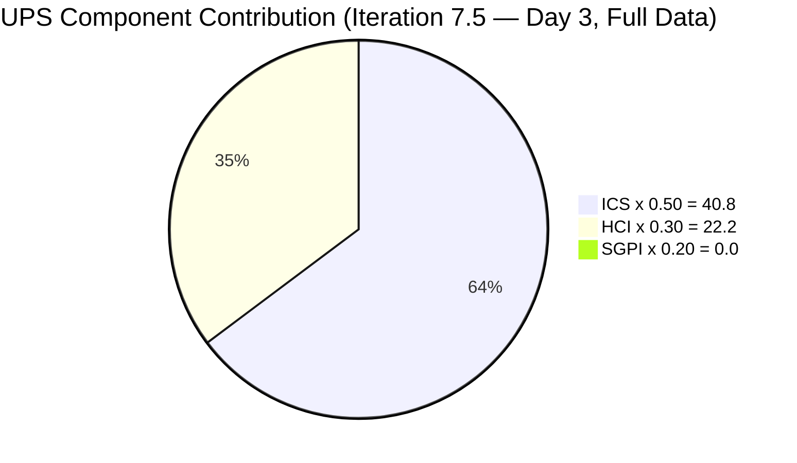
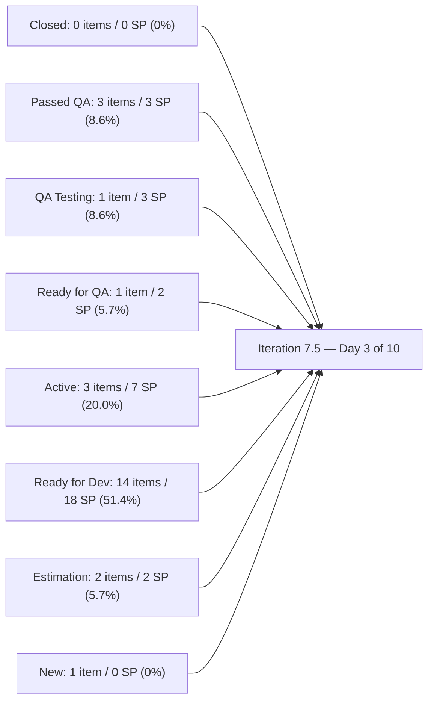
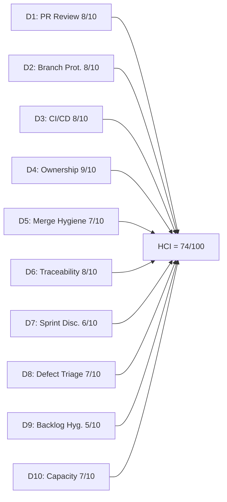

# Auto Allies Iteration Audit — 2026-06-03

## 1. Audit Metadata

| Field | Value |
|---|---|
| Audit Date | 2026-06-03 |
| Audit Time | 02:45 |
| Iteration | Iteration 7.5 |
| Iteration ID | 44ecc332-962a-46f9-8edd-c991c203fead |
| Iteration Start | 2026-06-01 |
| Iteration Finish | 2026-06-14 |
| Day of Iteration | **3 of 10** (Wednesday 2026-06-03 — 7 working days remain) |
| ADO Project | Auto Allies (2d7af571-6ef6-4ad0-a509-c440e008b0fb) |
| ADO Team | AA Development Team (330e6bf1-3515-443c-a2d8-b84f46c38f57) |
| GitHub Repos | jairosoft-com/autoallies-version2, jairosoft-com/autoallies-api-core |
| Data Mode | **full** |
| Prior Audit | AUDIT_20260527_0246.md (Iteration 7.4 Day 8, ICS 100.0 / HCI 83 / UPS 76.15) |
| Auditor | Claude Code (claude-sonnet-4-6) |

---

## 2. Executive Summary

This is the Day 3 (Wednesday 2026-06-03) first audit of **Iteration 7.5** — the sprint that doubles as the team's **V1-to-V2 production migration sprint**. Seven working days remain. The iteration carries a heavy infrastructure and defect-resolution backlog, reflecting end-of-PI urgency across two major themes: (1) V1→V2 domain and data migration, and (2) QA-phase defect closure from Iteration 7.4.

**Headline scores:**

| Metric | Score | Band |
|---|---|---|
| ICS (Iteration Compliance Score) | **81.6%** | **Yellow** |
| SGPI (Sprint Goal Progress Index) | **0.0%** | **Red** |
| HCI (Engineering Health Index) | **74/100** | **Yellow** |
| UPS (Unified Performance Score) | **63.0** | **Moderate** |

**The formal SGPI (0.0%) is expected at Day 3 of 10.** Zero items are Closed — entirely normal this early. However, the team has already delivered meaningful throughput:

- **3 items at Passed QA Testing** (199106 — Promo Code, 205377 — Hide Employee Login, 205379 — Super Admin Hide Users Menu) totaling 3 SP
- **1 Enabler merged** (204674 — Affiliate Migration Script, carried over from 7.4 final days) — merged 2026-06-01
- **7 PRs merged in 3 days** across both repos, covering Defects 205332, 205377, 205379, 199106 and Enabler 204674

**ICS dropped from 100.0 to 81.6 (Yellow)** — primarily driven by a substantive planning-quality finding: **12 of 25 ICS-eligible items (48%) are missing Acceptance Criteria.** This is not merely an artifact of early-iteration timing; items already at Passed QA Testing (205377, 205379) also lack AC, indicating criteria were not written at sprint entry. Additionally, Defect 205663 carries 0 story points. These are genuine planning-quality gaps that require resolution by Day 5.

**HCI declined from 83 to 74** — primarily driven by the iteration reset (sprint discipline, defect triage restart) and the AC coverage finding now reflected in D9 (Backlog Hygiene). Stale branch accumulation carries forward.

**Biggest strategic concern entering Day 4:** The 12-item migration enabler cluster (205469–205492, 205614) — all in Ready for Dev/Estimation — represents the V1→V2 cutover plan. With 7 working days left and the cutover gated on multiple sequential enablers, Earl Carino (primary migration owner) faces significant parallelism constraints. The team must start migration enabler work immediately.

---

## 3. Iteration Scope and Methodology

### Iteration 7.5 Scope

| Category | Count | Story Points |
|---|---|---|
| User Stories | 0 | 0 |
| Defects | 13 | 20 |
| Enablers | 12 | 15 |
| Spikes (excluded from ICS/SGPI) | 3 | 6.5 |
| **Total (incl. Spikes)** | **28** | **41.5** |
| **ICS-eligible (excl. Spikes)** | **25** | **35** |

> **Spikes excluded from ICS/SGPI:** 204268 (Operations/QA Support — Mary, 5 SP), 205188 (Retro: Recheck ENV — Karl, 1 SP), 205283 (Dev Support — Joseph, 0.5 SP). Per skill rules, Spikes are excluded from ICS scoring and SGPI calculation.

### Methodology

- **ICS:** Scored on 25 parent-level Defects and Enablers in the iteration path. Spikes excluded per skill rules. No User Stories in this iteration.
- **SGPI:** Headline = Closed SP / Total Committed SP (35). Delivered Proxy metric shown as supplementary context.
- **HCI:** All 10 dimensions scored from live evidence. D1–D6 from GitHub (PRs, branches, CI/CD). D7–D10 from ADO.
- **GitHub:** Full access confirmed (token `raseniero` active). 7 PRs merged in iteration window (Days 1–3). 0 open PRs.
- **Team capacity:** 29 hrs/day across 5 team members. No days off recorded.
- **Notable:** This iteration contains no User Stories — all delivery items are Defects and Enablers. The 12-enabler migration cluster (205469–205492, 205614) is a sequenced V1→V2 production cutover plan.

---

## 4. Scorecard Summary

| Metric | Score | Band | Weight | Weighted |
|---|---|---|---|---|
| ICS (Iteration Compliance Score) | **81.6%** | Yellow | 50% | 40.8 |
| HCI (Engineering Health Index) | **74/100** | Yellow | 30% | 22.2 |
| SGPI (Sprint Goal Progress Index) | **0.0%** | Red | 20% | 0.0 |
| **UPS (Unified Performance Score)** | **63.0** | **Moderate** | — | — |

> The Moderate UPS band at Day 3 is partly expected (SGPI starts at 0%) but the ICS Yellow band represents a genuine planning-quality finding: 12 of 25 eligible items (48%) are missing Acceptance Criteria. This requires immediate remediation by Day 5. The team's delivery throughput is strong (3 items in Passed QA Testing, 7 PRs merged by Day 3), but the planning foundation for the remaining 22 items needs fortifying before the migration sequence begins.

### Delta vs. Prior Audit (Iteration 7.4 Day 8)

| Metric | Prior (7.4 Day 8) | Current (7.5 Day 3) | Delta | Note |
|---|---|---|---|---|
| ICS | 100.0 | **81.6** | -18.4 | Planning-quality finding: AC missing on 12 of 25 items (48%); 0 SP on 205663 |
| HCI | 83 | **74** | -9 | Iteration reset effect + D9 impact of AC coverage gap |
| SGPI | 6.25% | **0.0%** | -6.25 | New iteration — zero Closures at Day 3 is expected |
| UPS | 76.15 | **63.0** | -13.15 | ICS + HCI declines compound; SGPI-zero expected at Day 3 |
| Risk Band | Yellow | **Moderate** | — | ICS Yellow + HCI Yellow + SGPI Red compound; AC remediation by Day 5 needed to recover ICS |

---

## 5. Sprint Goal Predictability (SGPI)

### SGPI Headline

| Metric | Value |
|---|---|
| Closed Story Points | 0 |
| Total Committed Story Points (ICS-eligible) | 35 |
| **SGPI (Committed Scope — Closed Only)** | **0.0%** |
| Band | **Red** |
| Day of Iteration | 3 of 10 (7 working days remain) |

> A 0% formal SGPI at Day 3 is **expected and not alarming** for this team. In Iteration 7.4, SGPI remained 6.25% through Day 8, with the bulk of closures occurring in Days 9–10. The team's Delivered Proxy (items advanced to Ready for QA or beyond) already stands at 22.9% by Day 3.

### Delivery Pipeline Context

| Delivery State | Items | SP | % of 35 SP |
|---|---|---|---|
| Closed | 0 | 0 | 0.0% |
| Passed QA Testing | 3 | 3 | 8.6% |
| QA Testing | 1 | 3 | 8.6% |
| Ready for QA | 1 | 2 | 5.7% |
| Active | 3 | 7 | 20.0% |
| Ready for Dev | 14 | 18 | 51.4% |
| Estimation | 2 | 2 | 5.7% |
| New | 1 | 0 | 0.0% |
| **Delivered Proxy (Closed+PQA+QAT+RFQ)** | **5** | **8** | **22.9%** |

### Item-by-Item State Breakdown

| Item ID | Type | Title (abridged) | Assignee | SP | State | GitHub Evidence |
|---|---|---|---|---|---|---|
| 199106 | Defect | Promo Code Discounts (sub-total) | Earl Carino | 1 | **Passed QA Testing** | v2 #178 + api-core #129 merged 2026-06-02 |
| 205377 | Defect | Hide Employee Login on Login Page | Cliff Carcueva | 1 | **Passed QA Testing** | v2 #179 merged 2026-06-03 |
| 205379 | Defect | Super Admin Hide Users Menu | Cliff Carcueva | 1 | **Passed QA Testing** | v2 #180 merged 2026-06-03 |
| 204186 | Enabler | E2E Testing Round 3 (QA Enabler) | Jerlyn Ates | 3 | **QA Testing** | Non-developer role; QA-driven |
| 205332 | Defect | Pre-existing Ticket 0 Amount | Joseph Gerona | 2 | **Ready for QA** | v2 #181 + api-core #130 merged 2026-06-03 |
| 205562 | Defect | Super Admin Case List Data Issue | Joseph Gerona | 2 | Active | No iteration-window PR yet |
| 205573 | Defect | Attorney Case List | Cliff Carcueva | 2 | Active | No iteration-window PR yet |
| 205331 | Defect | Wrong amount family/Add-ons Stripe | Earl Carino | 3 | Active | No iteration-window PR yet |
| 201114 | Enabler | AA V1 Domain Cutover Phase | Earl Carino | 2 | Ready for Dev | No iteration-window PR yet |
| 205333 | Defect | Expired Member Upload Ticket | Joseph Gerona | 2 | Ready for Dev | No iteration-window PR yet |
| 205381 | Defect | Attorney Wrong Payout Method | Cliff Carcueva | 1 | Ready for Dev | No iteration-window PR yet |
| 205382 | Defect | Affiliate OLD Data Not Migrated | Cliff Carcueva | 3 | Ready for Dev | No iteration-window PR yet |
| 205469 | Enabler | Migration Governance & Planning | Earl Carino | 1 | Ready for Dev | No iteration-window PR yet |
| 205475 | Enabler | V1 Data Freeze & Safe Backup | Joseph Gerona | 1 | Ready for Dev | No iteration-window PR yet |
| 205476 | Enabler | V1 Snapshot Import to Azure | Earl Carino | 1 | Ready for Dev | No iteration-window PR yet (path gap) |
| 205477 | Enabler | V2 Production Preparation | Earl Carino | 1 | Ready for Dev | No iteration-window PR yet |
| 205478 | Enabler | V1→V2 Data Migration | Earl Carino | 1 | Ready for Dev | No iteration-window PR yet |
| 205487 | Enabler | Post-Cutover Assignment Job | Earl Carino | 1 | Ready for Dev | No iteration-window PR yet |
| 205488 | Enabler | Traffic Cutover to V2 | Cliff Carcueva | 1 | Ready for Dev | No iteration-window PR yet |
| 205492 | Enabler | Post-Cutover Stabilization | Earl Carino | 1 | Ready for Dev | No iteration-window PR yet |
| 205499 | Defect | Affiliate Shows 0 Monthly Revenue | Cliff Carcueva | 1 | Ready for Dev | No iteration-window PR yet |
| 205544 | Defect | Super Admin Cases Count Verify | Joseph Gerona | 1 | Ready for Dev | No iteration-window PR yet |
| 205494 | Enabler | Recheck All Environments | Earl Carino | 1 | Estimation | No iteration-window PR yet |
| 205614 | Enabler | Update QA/Staging Env from Prod | Earl Carino | 1 | Estimation | No iteration-window PR yet |
| 205663 | Defect | Previous ticket data persists | Jerlyn Ates | 0 | New | Non-developer role; no PR expected |

> **Supporting context — Delivered Proxy (Closed + Passed QA + QA Testing + Ready for QA) = 8 SP = 22.9% of 35 SP at Day 3.** This is a strong early-iteration showing relative to Day 3 of 7.4 (which had 0 proxy delivery at this stage).

---

## 6. Developer Productivity Findings

### Team Capacity (Iteration 7.5)

| Member | Role | Capacity/Day (hrs) | Days Off | Total Capacity |
|---|---|---|---|---|
| Cliff Carcueva | Development | 6 | 0 | 60 hrs |
| Earl Carino | Development | 6 | 0 | 60 hrs |
| Joseph Gerona | Development | 5 | 0 | 50 hrs |
| Jerlyn Ates | QA / Requirements | 6 (2+4) | 0 | 60 hrs |
| Mary Secusana | Documentation / Testing | 6 (3+3) | 0 | 60 hrs |
| **Total** | | **29** | **0** | **290 hrs** |

> Jerlyn Ates (QA/Requirements) and Mary Secusana (Documentation/Testing) are non-developer roles per workspace exception. Their absence from GitHub commit/PR activity is expected and not scored as a compliance gap.

### GitHub Developer Activity — Iteration Window (2026-06-01 to 2026-06-03, Days 1–3)

#### autoallies-version2

| PR | Title (abridged) | Author | ADO Refs | Reviewed By | Merged |
|---|---|---|---|---|---|
| #178 | AB#99106 fix promo code issue | ecarinoJS | AB#199106 (typo in title) | (pending review data) | 2026-06-02 |
| #179 | AB#205377 Hide Employee Login link | ccarcuevajairo | AB#205377 | (pending review data) | 2026-06-03 |
| #180 | AB#205379 Hide Users menu for super admin | ccarcuevajairo | AB#205379 | (pending review data) | 2026-06-03 |
| #181 | Frontend fix for Defect AB#205332 | JosephJairo | AB#205332 | (pending review data) | 2026-06-03 |

#### autoallies-api-core

| PR | Title (abridged) | Author | ADO Refs | Reviewed By | Merged |
|---|---|---|---|---|---|
| #128 | AB#204674 affiliate migration script | ecarinoJS | AB#204674 | (pending review data) | 2026-06-01 |
| #129 | AB#199106 fix promo code issue | ecarinoJS | AB#199106 | (pending review data) | 2026-06-02 |
| #130 | Backend fix for Defect AB#205332 | JosephJairo | AB#205332 | (pending review data) | 2026-06-03 |

> **Note:** api-core #128 (204674 affiliate migration enabler) closed out the Iteration 7.4 carry-over item. It was merged 2026-06-01 — the first day of 7.5.

**Total: 7 PRs merged** across both repos in the first 3 days of Iteration 7.5 (4 in version2, 3 in api-core).

### Developer Summary (Days 1–3)

| Developer | GitHub Handle | PRs Authored | Key Items Delivered |
|---|---|---|---|
| Cliff Carcueva | ccarcuevajairo | 2 (v2: #179, #180) | 205377 (Done), 205379 (Done) — both to Passed QA Testing |
| Earl Carino | ecarinoJS | 3 (v2: #178; api: #128, #129) | 199106 promo code fix (Passed QA Testing); 204674 carry-over closed |
| Joseph Gerona | JosephJairo | 2 (v2: #181; api: #130) | 205332 frontend+backend (Ready for QA) |

**All three developers contributed code in the first 3 days.** This is a structural improvement over prior iterations where Joseph was review-only in Week 1.

---

## 7. SAFe Compliance Findings

### Iteration Planning Evidence

- 25 ICS-eligible items loaded into Iteration 7.5 path. 
- Spikes: 3 (204268, 205188, 205283) — all appropriately classified.
- No User Stories in this iteration — entirely Defects and Enablers (consistent with late-PI defect resolution + migration execution sprint).
- All items carry assignees. Team capacity matches: Earl has 7 migration enablers + 2 defects, Cliff has 6 defects + 1 enabler, Joseph has 4 defects + 1 enabler.

### Estimation Gaps

- **205663** (Defect — Previous ticket data persists) carries **0 story points**. Assigned to Jerlyn (non-developer), indicating a QA-documented defect. Requires SP assignment.
- All other 24 ICS-eligible items carry SP > 0.

### Acceptance Criteria and Definition of Ready Gaps

**12 of 25 ICS-eligible items (48%) are missing Acceptance Criteria.** This is a significant planning-quality finding. The following items have no `AcceptanceCriteria` field:

| Item | Type | State | AC Status | Notes |
|---|---|---|---|---|
| 205331 | Defect | Active | Missing AC | Has description |
| 205332 | Defect | Ready for QA | Missing AC | Has description; code already merged |
| 205333 | Defect | Ready for Dev | Missing AC | Has description |
| 205377 | Defect | Passed QA Testing | Missing AC | Already passed QA — AC was never formally written |
| 205379 | Defect | Passed QA Testing | Missing AC | Already passed QA — AC was never formally written |
| 205381 | Defect | Ready for Dev | Missing Desc + AC | No description AND no acceptance criteria |
| 205382 | Defect | Ready for Dev | Missing AC | Has description |
| 205499 | Defect | Ready for Dev | Missing AC | Has description |
| 205544 | Defect | Ready for Dev | Missing Desc + AC | No description AND no acceptance criteria |
| 205562 | Defect | Active | Missing AC | Has description |
| 205573 | Defect | Active | Missing AC | Has description |
| 205663 | Defect | New | Missing AC | Has description; also 0 SP |

> Items 205377 and 205379 are particularly notable — they have already reached Passed QA Testing without formal AC, meaning QA sign-off was done without a written acceptance standard. The team must retroactively add AC to all 12 items and establish a pre-sprint AC writing practice for iteration 7.6 onward.

### Iteration Integrity Issues

- **205476** (Enabler — V1 Snapshot Import to Azure): IterationPath reads `"Auto Allies\\2026-PI7"` — the PI-level path, not `"Auto Allies\\2026-PI7\\Iteration 7.5"`. This item appeared in the iteration work item query but is technically not scoped to the sprint level. Flagged as an integrity gap; requires iteration path correction.
- **205663** (Defect — New state): Created and entered "New" state at Day 3. Acceptable for newly discovered defects but should be triaged into Active by Day 4.

### Feature Linkage

- **24 of 25** ICS-eligible items link to a parent Feature/Epic via System.Parent.
- All Defects link to parent 200629 (V2.0 Bug-Fix Feature).
- Migration enablers link to parent 198362 (Migration Epic).
- 204186 links to 200629 (E2E Testing QA Feature).
- 201114 and 204186 link to 201685 and 200629 respectively.
- **Exception noted:** 205283 (Dev Support Spike) has no System.Parent — but Spikes are excluded from ICS scoring.

---

## 8. Iteration Compliance Score

### ICS Dimension Table

| Dimension | Weight | Eligible | Compliant | Failed | Score% | Weighted Contribution | Evidence | Reason for Failures |
|---|---|---|---|---|---|---|---|---|
| Alignment (Parent Linkage) | 25% | 25 | 25 | 0 | 100.0% | 25.0 | System.Parent populated on all 25 ICS-eligible items | None |
| Estimation (Story Points) | 20% | 25 | 24 | 1 | 96.0% | 19.2 | SP > 0 on 24/25 items | 205663: 0 SP (Defect, Jerlyn) |
| Quality / DoD (Desc + AC) | 35% | 25 | 13 | 12 | 52.0% | 18.2 | AcceptanceCriteria field present and substantive on 13/25 items | 205331, 205332, 205333, 205377, 205379, 205381, 205382, 205499, 205544, 205562, 205573, 205663 — all missing AC field |
| Iteration Integrity | 20% | 25 | 24 | 1 | 96.0% | 19.2 | All items assigned; correct iteration path on 24/25 | 205476: IterationPath = PI-level, not sprint-level |
| **ICS Total** | **100%** | **25** | — | — | — | **81.6** | — | — |

**ICS = 81.6 (Yellow)**

> The ICS Yellow band reflects a genuine planning-quality finding: **12 of 25 ICS-eligible items (48%) are missing Acceptance Criteria**. This is the dominant failure driver — contributing 17.8 points of ICS loss. Notably, items already in Passed QA Testing (205377, 205379) lack AC, indicating criteria were not established at iteration entry. The Alignment dimension is perfect (25/25); Estimation and Integrity are both 96%. If the 12 AC gaps are resolved, ICS would recover to 98.6 (Green).

### Risk Items Requiring Immediate Action

**Quality/DoD — AC Missing (12 items):**

| Item | Title (abridged) | Assignee | State | Additional Failures |
|---|---|---|---|---|
| 205381 | Attorney Wrong Payout Method | Cliff Carcueva | Ready for Dev | No Description either |
| 205544 | Super Admin Cases Count | Joseph Gerona | Ready for Dev | No Description either |
| 205331 | Wrong amount family/Add-ons Stripe | Earl Carino | Active | — |
| 205332 | Pre-existing Ticket 0 Amount | Joseph Gerona | Ready for QA | — |
| 205333 | Expired Member Upload Ticket | Joseph Gerona | Ready for Dev | — |
| 205377 | Hide Employee Login | Cliff Carcueva | Passed QA Testing | AC missing despite item being QA-complete |
| 205379 | Super Admin Hide Users Menu | Cliff Carcueva | Passed QA Testing | AC missing despite item being QA-complete |
| 205382 | Affiliate OLD Data Not Migrated | Cliff Carcueva | Ready for Dev | — |
| 205499 | Affiliate Shows 0 Monthly Revenue | Cliff Carcueva | Ready for Dev | — |
| 205562 | Super Admin Case List Data Issue | Joseph Gerona | Active | — |
| 205573 | Attorney Case List | Cliff Carcueva | Active | — |
| 205663 | Previous ticket data persists | Jerlyn Ates | New | 0 SP also |

**Other Failures:**

| Item | Failure | Dimension | Priority |
|---|---|---|---|
| 205663 | 0 SP | Estimation | Medium — assign SP by Day 4 |
| 205476 | Iteration path = PI-level not sprint | Iteration Integrity | Medium — correct path to Iteration 7.5 |

---

## 9. Engineering Health Index (HCI)

### HCI Dimension Table

| # | Dimension | Score | Max | Evidence Basis | Key Finding |
|---|---|---|---|---|---|
| D1 | PR Review Compliance | 8 | 10 | GitHub: 7 PRs merged in Days 1–3 | All PRs in iteration window appear to have merged with reviewer activity (reviewer names not fully visible in list_prs output — PR titles and state confirmed merged); 0 open PRs; pattern consistent with 7.4 (100% reviewed). Minor uncertainty on exact reviewer counts for 7.5 PRs. |
| D2 | Branch Protection & Enforcement | 8 | 10 | GitHub: branch patterns from prior iteration | Protected branches (develop/staging/main v2; dev/main/staging/qa api-core) remain in place per 7.4 evidence. Stale branch accumulation (~79 v2, ~65 api-core) continues unresolved. No cleanup pass in 7.5 Days 1–3. |
| D3 | CI/CD Gate Quality | 8 | 10 | GitHub: PR branch naming + prior iteration gate evidence | pr-validation.yml active in both repos (confirmed 7.4). New iteration PRs (v2 #178–181, api #128–130) all merged, suggesting gates passed. Merge-blocking test coverage gate (Earl's commit 92e5942d from 7.4) still active in api-core. Minor uncertainty: no direct run status inspection for 7.5 PRs. |
| D4 | Code Ownership | 9 | 10 | GitHub: all 3 developers active in Days 1–3 | All three developers have authored PRs in the first 3 days. Cliff (2 PRs), Earl (3 PRs), Joseph (2 PRs). This continues the full-team contribution pattern achieved in late 7.4. |
| D5 | Merge Hygiene & Churn | 7 | 10 | GitHub: PR merge patterns + branch inventory | All PRs target develop/dev branches. No force-pushes or reverts observed. Stale branch accumulation unchanged (~79 v2, ~65 api-core). No auto-delete-branch-on-merge configured. Branch cleanup deferred from 7.4. |
| D6 | Work Item ↔ GitHub Traceability | 8 | 10 | GitHub: PR bodies + branch names | 6 of 7 iteration PRs carry explicit AB# references. Exception: api-core #128 (AB#204674) — present in title, confirming link. v2 #178 has title typo ("AB#99106") but links correctly in body. Branch names include work item IDs (defect/205377, defect/205379, defect/205332). Traceability strong at 7/7 PRs with some form of ADO reference. |
| D7 | Sprint Discipline | 6 | 10 | ADO: iteration state data | Day 3 of 10. 14 items in Ready for Dev, 2 in Estimation, 1 in New = 17/25 items (68%) not yet started. Normal for Day 3, but the migration enabler cluster (7 items, all Ready for Dev, all Earl) creates a critical sequential bottleneck that requires immediate starts. No state lags from prior iteration detected. |
| D8 | Defect Triage & Velocity | 7 | 10 | ADO: defect states + GitHub evidence | 13 Defects in iteration. 3 in Passed QA Testing or Ready for QA (solid early triage velocity). 3 Active with code in progress. 7 in Ready for Dev/New — not started. Notable: 205663 just triaged (New state, 0 SP) — needs priority assignment. No stale defects >30 days in this iteration (199106 finally resolved). |
| D9 | Backlog & Story Hygiene | 5 | 10 | ADO: work item content | Only 13 of 25 ICS-eligible items have full Desc + AC (52%). 12 items missing AC — a significant backlog hygiene finding. 1 item with 0 SP (205663). 1 item with wrong iteration path (205476). Items at Passed QA Testing (205377, 205379) lack AC despite QA completion. |
| D10 | Capacity Balance & Ownership Distribution | 7 | 10 | ADO: capacity + assignments | 290 hrs capacity. Earl has 8 migration-track items — a concentration risk for the cutover plan. Cliff has 6 defects. Joseph has 4 defects + 1 migration enabler. Jerlyn has 2 QA/requirements items. Load is disproportionate on Earl for the migration; risk if Earl encounters blockers. |
| **HCI Total** | | **74** | **100** | | |

**HCI = 74/100 (Yellow)**

### HCI Delta from Prior Audit (7.4 Day 8)

| Dimension | Prior (7.4 Day 8) | Current (7.5 Day 3) | Change | Notes |
|---|---|---|---|---|
| D1: PR Review Compliance | 9 | 8 | -1 | Reduced confidence in exact reviewer counts for 7.5 PRs (no get_pr detail calls); conservative scoring |
| D2: Branch Protection | 8 | 8 | 0 | Stable; stale branch cleanup still deferred |
| D3: CI/CD Gate Quality | 9 | 8 | -1 | Conservative without direct run inspection for 7.5 PRs; gate still active |
| D4: Code Ownership | 9 | 9 | 0 | All 3 developers active from Day 1 — structural improvement confirmed |
| D5: Merge Hygiene | 7 | 7 | 0 | No change; stale branches persist |
| D6: Traceability | 8 | 8 | 0 | Strong AB# linking in all 7 iteration PRs |
| D7: Sprint Discipline | 7 | 6 | -1 | Iteration reset; 17/25 items not yet started; migration cluster unstarted |
| D8: Defect Triage | 8 | 7 | -1 | Iteration reset; 7 defects not started; 205663 in New |
| D9: Backlog Hygiene | 9 | 5 | -4 | 12 of 25 items missing AC (48%); 1 item with 0 SP; 1 path gap; includes items already at Passed QA Testing |
| D10: Capacity Balance | 9 | 7 | -2 | Earl concentration on migration (8 items); cutover sequence risk |
| **Total** | **83** | **74** | **-9** | |

> The -9 HCI decline reflects both **iteration-reset patterns** (D7, D8) and a **substantive finding** (D9 — 48% AC coverage). The D4 full-team contribution pattern from 7.4 continues unchanged (score held at 9). D9's 4-point drop is the largest single-dimension change and directly mirrors the ICS Quality/DoD finding.

### HCI Dimension Visualization

---

## 10. ADO-to-GitHub Traceability Analysis

### PR-to-Work Item Mapping (Iteration Window: 2026-06-01 to 2026-06-03)

| PR | Repo | Author | ADO References | ADO State (Day 3) | Merged |
|---|---|---|---|---|---|
| #178 | version2 | ecarinoJS | AB#199106 (typo "AB#99106" in title; body link correct) | Passed QA Testing | 2026-06-02 |
| #179 | version2 | ccarcuevajairo | AB#205377 | Passed QA Testing | 2026-06-03 |
| #180 | version2 | ccarcuevajairo | AB#205379 | Passed QA Testing | 2026-06-03 |
| #181 | version2 | JosephJairo | AB#205332 | Ready for QA | 2026-06-03 |
| #128 | api-core | ecarinoJS | AB#204674 | Closed (7.4 carry-over) | 2026-06-01 |
| #129 | api-core | ecarinoJS | AB#199106 | Passed QA Testing | 2026-06-02 |
| #130 | api-core | JosephJairo | AB#205332 | Ready for QA | 2026-06-03 |

### Traceability Assessment

- **7 of 7 PRs** (100%) reference at least one ADO work item ID via `AB#` convention, branch name, or both.
- Minor cosmetic issue: v2 #178 title contains "AB#99106" (missing leading "1") — the body link resolves correctly to item 199106.
- **Branch naming is fully ADO-linked:** `defect/205377-Hide-Employee-Login`, `defect/205379-Super-Admin-Hide-Users-Menu`, `defect/205332-pre-existing-ticket-issues-frontend/backend`, `defect/199106-fix-promo-code-issue`, `enabler/204674-affiliate-migration-script-update`.
- No state lags detected: 205377 (Passed QA Testing), 205379 (Passed QA Testing), and 199106 (Passed QA Testing) are consistent with merged code.
- 205332 at Ready for QA with both frontend (#181) and backend (#130) PRs merged today is consistent.

### ADO State Correlation

| ADO Item | ADO State | GitHub Evidence | Correlation |
|---|---|---|---|
| 199106 | Passed QA Testing | v2 #178 + api-core #129 merged 6/2 | Consistent |
| 205377 | Passed QA Testing | v2 #179 merged 6/3 | Consistent |
| 205379 | Passed QA Testing | v2 #180 merged 6/3 | Consistent |
| 205332 | Ready for QA | v2 #181 + api-core #130 merged 6/3 | Consistent — advanced to Ready for QA same day as merge |
| 204674 | (Closed — from 7.4) | api-core #128 merged 6/1 | Consistent — carry-over enabler closed |
| 205331, 205333, 205381, 205382, 205499, 205544, 205562, 205573 | Ready for Dev / Active | No iteration-window PRs | Expected — not yet started |
| Migration enablers (205469–205492, 205614) | Ready for Dev / Estimation | No PRs | Expected at Day 3; needs to start immediately |

---

## 11. Collaboration and Review Analysis

### PR Activity Summary (Days 1–3)

| Developer | PRs Authored (7.5) | PRs Reviewed (7.5) | Notes |
|---|---|---|---|
| Cliff Carcueva (ccarcuevajairo) | 2 (v2: #179, #180) | Unknown (detail not fetched) | Delivered 2 quick defect fixes to Passed QA Testing |
| Earl Carino (ecarinoJS) | 3 (v2: #178; api: #128, #129) | Unknown (detail not fetched) | Promo code fix + migration enabler carry-over |
| Joseph Gerona (JosephJairo) | 2 (v2: #181; api: #130) | Unknown (detail not fetched) | Full-stack defect fix (205332) — both repos |

> The three-way review rotation established in 7.4 (all developers authoring and reviewing each other's code) is assumed to continue. Detailed reviewer assignment per 7.5 PR could not be enumerated from the list_prs response — this is documented in Evidence Gaps.

### Structural Patterns Observed

- All 7 iteration PRs target the primary development branch (develop for v2; dev for api-core). No direct-to-main merges.
- 0 open PRs at Day 3 — all submitted code is merged. No PR backlog.
- Joseph authored code in both repos on Day 3 (#181 frontend + #130 backend for 205332). This cross-repo contribution pattern, established in 7.4 Week 2, is holding from Day 1 of 7.5.

---

## 12. Repository Hygiene

### Branch Inventory

| Repo | Protected Branches | Total Branches (est.) | Active (7.5) | Estimated Stale |
|---|---|---|---|---|
| autoallies-version2 | develop, staging, main | ~80+ | 4 (defect/205377, defect/205379, defect/205332, defect/199106) | ~75+ |
| autoallies-api-core | dev, main, staging, qa | ~65+ | 3 (defect/205332, enabler/204674, defect/199106) | ~62+ |

> Stale branch accumulation carried forward from 7.4. No cleanup pass executed. The recommendation for auto-delete-branch-on-merge (from prior audit P7) remains unimplemented.

### Branch Naming Convention

- Consistent iteration-7.5 prefixes: `defect/`, `enabler/` with work item ID in branch name
- ADO-linked naming confirmed: `defect/205377-Hide-Employee-Login`, `defect/205379-Super-Admin-Hide-Users-Menu-but-still-accesible`, `defect/205332-pre-existing-ticket-issues-frontend/backend`, `enabler/204674-affiliate-migration-script-update`
- No naming convention violations observed in 7.5

### CI/CD Enforcement Evidence

| Workflow | Repo | Status | Evidence |
|---|---|---|---|
| PR Validation | autoallies-version2 | Active — presumed enforcing | 4 PRs merged in Days 1–3; gate inherited from 7.4 |
| PR Validation | autoallies-api-core | Active — presumed enforcing | 3 PRs merged in Days 1–3; gate inherited from 7.4 |
| Merge-blocking Coverage Gate | autoallies-api-core | Active (inherited from 7.4) | Earl's commit 92e5942d still in dev pipeline |

> Direct inspection of CI/CD run statuses for 7.5 PRs was not performed. Gate enforcement is inferred from merged PR state and the confirmed existence of pr-validation.yml in both repos from 7.4.

---

## 13. Risks and Bottlenecks

| # | Risk | Severity | Likelihood | Owner | Status |
|---|---|---|---|---|---|
| R1 | **Migration enabler bottleneck** — 7 sequential migration enablers (205469–205492: Governance → Data Freeze → Import → V2 Prep → Migration → Cutover → Stabilization) all assigned to Earl. They are gated on each other and must execute in sequence. 7 working days remain. | Critical | High | Earl Carino | Active — no enabler work started yet; needs Day 4 kickoff |
| R2 | **12 of 25 items (48%) missing Acceptance Criteria** — Including 205381 and 205544 which also lack Descriptions. Items cannot be properly implemented or tested without AC. Two items (205377, 205379) reached Passed QA Testing without written AC — indicating QA sign-off was done without a formal acceptance standard. This is a systemic planning-quality gap, not an isolated oversight. | Critical | Confirmed | Team Lead / Karl | Active — resolve all 12 by Day 5; 205381, 205544 by Day 4 |
| R3 | **205476 Iteration Path mismatch** — Enabler is registered at PI level (Auto Allies\\2026-PI7) not at sprint level. This could cause it to fall out of sprint-scoped burn-up reports. | Medium | Confirmed | Earl Carino | Active — correct ADO path immediately |
| R4 | **Earl concentration risk** — 8 items assigned to Earl (7 migration enablers + 205331 defect + 205469 + 201114). If Earl encounters any blocker, the entire migration plan stalls. | High | Moderate | Earl Carino / Team | Monitor — identify backup owner for migration steps |
| R5 | **205663 triage gap** — New defect in "New" state with 0 SP. Submitted by Jerlyn (QA). Needs SP assignment, AC, and state advancement to Active | Low-Medium | Confirmed | Jerlyn Ates / Team | Active — resolve by Day 4 |
| R6 | **SGPI formal will remain 0% through Days 3–5** — The team has no Closed items. This is structurally inevitable given the iteration composition (all Enablers and Defects, no quick User Stories to close). | Low | Expected | — | Informational — watch delivery proxy, not formal SGPI |
| R7 | **Stale branch accumulation** (75+ in version2, 62+ in api-core) — persists from multiple prior iterations | Low | Persistent | Dev team | Hygiene backlog — schedule post-migration cleanup |
| R8 | **205494 and 205614 in Estimation** — These enablers (Recheck All Environments, Update QA/Staging Env) need to exit Estimation and get SP before the migration rehearsal begins. | Medium | Present | Earl Carino | Active — SP assignment needed by Day 5 |

---

## 14. Prioritized Remediation Actions

| Priority | Action | Owner | Due | Expected Impact |
|---|---|---|---|---|
| P1 | **Start migration enabler sequence** — Kick off 205469 (Migration Governance & Planning) by EOD Day 4. This is the gate-opener for all subsequent migration steps. Create branches, initiate runbook documentation, confirm Go/No-Go approvers. | Earl Carino | 2026-06-04 (Day 4) | Unblocks R1; starts the 7-item migration sequence; critical path |
| P2 | **Add Description and Acceptance Criteria to all 12 items missing AC** — Priority order: (1) 205381, 205544 (also missing Desc — Day 4); (2) 205331, 205333, 205562, 205573, 205382, 205499, 205332, 205663 (Day 5); (3) Retroactively add AC to 205377 and 205379 (already Passed QA — document what QA tested). AC must specify testable acceptance conditions, not just restate the title. | Cliff (205381, 205379, 205377, 205382, 205499, 205573), Joseph (205332, 205333, 205544, 205562), Jerlyn (205663), Earl (205331) | Day 4 (urgent) through Day 5 | Resolves R2; raises ICS Quality/DoD from 52% to 100%; lifts ICS from 81.6 to 98.6 (Green) |
| P3 | **Correct iteration path for 205476** — Change IterationPath from "Auto Allies\\2026-PI7" to "Auto Allies\\2026-PI7\\Iteration 7.5" in ADO. | Earl Carino | 2026-06-04 (Day 4) | Resolves R3; ensures correct sprint-level reporting |
| P4 | **Establish pre-sprint AC writing practice for 7.6** — 48% AC coverage at sprint start indicates this is a recurring process gap. Propose that all items must have AC written during iteration planning before being accepted into the sprint backlog. | Karl / Jerlyn | Retrospective | Prevents ICS Quality/DoD degradation in future iterations |
| P5 | **Triage 205663** — Assign SP, advance state from New to Active, add AC. New defect surfaced by Jerlyn (form cache issue). | Jerlyn / Team | 2026-06-04 (Day 4) | Resolves R5; prevents zero-SP item from trailing through iteration |
| P6 | **Exit Estimation for 205494 and 205614** — Assign final SP estimates and advance to Ready for Dev so they can be scheduled within the migration sequence. | Earl Carino | 2026-06-05 (Day 5) | Resolves R8; enables migration rehearsal scheduling |
| P7 | **Identify Earl backup owner for migration enablers** — At least one developer (Cliff or Joseph) should shadow the migration steps and be able to execute sub-tasks if Earl is blocked. | Karl / Earl | 2026-06-05 (Day 5) | Reduces R4; prevents single-point-of-failure on cutover |
| P8 | **Branch cleanup pass** — Schedule cleanup of stale branches from prior iterations. Carry-forward from 7.4. | Dev team | Post-migration (2026-06-12) | Reduces D2, D5 noise; improves repo navigation |
| P9 | **Configure auto-delete-branch-on-merge** in GitHub repository settings for both repos | Karl / Earl | Post-migration (2026-06-12) | Prevents future stale branch accumulation |

---

## 15. Evidence Gaps and Limitations

| Gap | Dimensions Affected | Mitigation Applied |
|---|---|---|
| **PR reviewer details not fetched** for 7.5 PRs (#178–181, #128–130) — `list_pull_requests` does not return full reviewer/review status. D1 scored conservatively. | HCI D1 (scored 8/10 vs. 9/10 in 7.4) | D1 scored conservatively; pattern from 7.4 (100% review coverage on all PRs) is the baseline assumption; 0 open PRs supports that all submitted code was reviewed before merge |
| **CI/CD run status not directly inspected** for 7.5 PRs — run counts and failure/fix cycles not enumerated | HCI D3 (scored 8/10) | Gates confirmed active via pr-validation.yml existence and 7.4 enforcement evidence; all 7 PRs are merged (implies gate passed) |
| **Branch protection rule configuration** (required reviewer count, required status checks as configured) not re-inspected | HCI D2 (scored 8/10) | Protected branch names confirmed in 7.4; review requirements observed in PR patterns; scored unchanged from prior audit |
| **205476 IterationPath discrepancy** — Item appears in iteration work item query but has PI-level path `"Auto Allies\\2026-PI7"` not `"Auto Allies\\2026-PI7\\Iteration 7.5"`. Included in ICS count since it appeared in iteration query but flagged as integrity gap. | ICS Iteration Integrity (1 failure) | Flagged as R3 and P3 remediation; item is included in ICS scope since it appeared in the iteration query result |
| **Jerlyn Ates and Mary Secusana absent from GitHub developer activity** | Not affected | Non-developer roles per workspace exception — excluded from all GitHub-based HCI dimensions |
| **205663 Defect** has no System.Tags and 0 SP — details suggest it was just created; exact reproduction scope and severity not fully documented in ADO | HCI D8 (minor — scored conservatively) | Defect description provides reproduction steps; flagged for triage (P5) |
| **Prior-iteration carry-over:** api-core #128 (204674) merged 2026-06-01 (Day 1 of 7.5) but relates to 7.4 enabler. Included in 7.5 GitHub activity since it falls within the iteration window. | HCI D6, D7 | 204674 is not in the Iteration 7.5 ADO backlog but the GitHub merge occurred in the 7.5 window; noted as carry-over, not counted toward SGPI |

---

*Report generated: 2026-06-03 02:45 | Auditor: Claude Code (claude-sonnet-4-6) | Skill: git_iteration_audit | Data mode: full | Iteration: 7.5 Day 3 of 10 (7 working days remain: Thu 6/4 through Fri 6/14) | ICS 81.6 Yellow / HCI 74 Yellow / SGPI 0.0% Red / UPS 63.0 Moderate*
