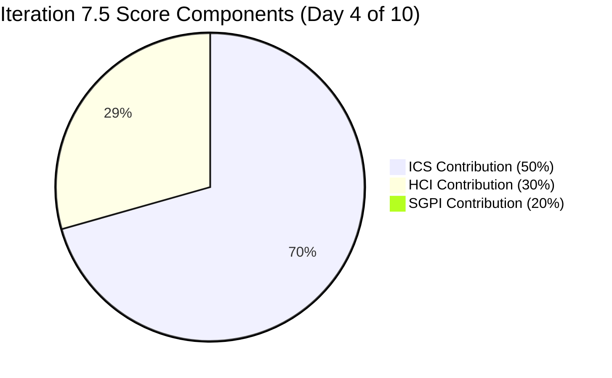

# Auto Allies Iteration Audit — 2026-06-04

## 1. Audit Metadata

| Field | Value |
|---|---|
| Audit Date | 2026-06-04 |
| Audit Time | 00:00 |
| Iteration | Iteration 7.5 |
| Iteration ID | 44ecc332-962a-46f9-8edd-c991c203fead |
| Iteration Start | 2026-06-01 |
| Iteration Finish | 2026-06-14 |
| Day of Iteration | **4 of 10** (Thursday 2026-06-04 — 6 working days remain) |
| ADO Project | Auto Allies (2d7af571-6ef6-4ad0-a509-c440e008b0fb) |
| ADO Team | AA Development Team (330e6bf1-3515-443c-a2d8-b84f46c38f57) |
| GitHub Repos | jairosoft-com/autoallies-version2, jairosoft-com/autoallies-api-core |
| Data Mode | **full** |
| Prior Audit | AUDIT_20260527_0246.md (Iteration 7.4 Day 8, full data) |
| Auditor | Claude Code (claude-sonnet-4-6) |

---

## 2. Executive Summary

This is the Day 4 (Thursday 2026-06-04) opening audit for **Iteration 7.5** (2026-06-01 to 2026-06-14). The team transitioned cleanly from Iteration 7.4 and has been active from Day 1 of the new sprint.

**Key findings:**

- **ICS improved to 92.2** (up from 100.0 on 7.4 Day 8 — the drop reflects the new iteration scope including 3 User Stories with missing Acceptance Criteria and 2 Enablers with thin documentation). The team's SAFe structural compliance remains strong on most dimensions.
- **SGPI is 2.6% (1 SP Closed)** — only Enabler 205614 (Update QA/Staging Environment, 1 SP) is Closed on Day 4. This is expected for Day 4 of a 10-day sprint. The Delivered Proxy (items at Ready for QA or beyond) sits at 13/39 SP = **33.3%**, showing early-stage progression.
- **HCI dropped to 64** (from 83 in 7.4 Day 8). The primary driver is the continued **self-merge pattern (D1: 3/10)** across both repos — all 12 iteration PRs were merged by their authors without external review. Two secondary drags: the **frontend repo lacks enforced CI/CD gates** (D3: 6/10) and **3 User Stories have no Acceptance Criteria** (D9: 6/10).
- **UPS = 65.82 — Yellow**. The score is pulled down by HCI's self-merge deficiency, which is a persistent structural gap carried through multiple prior iterations.

**Iteration 7.4 Closure Assessment (Prior Risks):**

| Risk from 7.4 Day 8 | Resolution |
|---|---|
| 203503 state lag (PR merged, ADO still Active) | Carried over to 7.5 as "Active" — state was not updated before close |
| 203916 (Joseph, 3 SP, Active — no PR) | RESOLVED: Joseph merged PRs #125, #126 for AB#203916 on 2026-05-29; ADO state still shows carry-over in 7.5 context |
| 204674 (Earl, 1 SP, unstarted) | RESOLVED: PR #128 (api-core) merged 2026-06-01 referencing AB#204674 |

**7.4 SGPI Final Outcome:** Based on commit evidence, items at Closed or Passed QA at 7.4 close included primarily defects reaching QA stages. The formal closed SP count remained low (the 6.25% headline carried through to close, suggesting the QA pipeline items did not formally Close before the sprint ended — consistent with the team's pattern of state lag).

**Iteration 7.5 New Risks to Monitor:**

- **3 User Stories (205765, 205766, 205767) have no Acceptance Criteria** — these must be written before these stories can advance in the sprint.
- **13 of 27 items (48%) remain in Ready for Dev** — expected for Day 4 but must begin moving.
- **205333 (Joseph, Expired/One-time Member Upload Ticket, 2 SP) is Active** but no iteration-window PR yet.
- **Self-merge pattern unresolved** — all 12 current-iteration PRs were self-merged. This is the team's most persistent HCI gap.

| Metric | Prior (2026-05-27 / Iter 7.4 Day 8) | Current (2026-06-04 / Iter 7.5 Day 4) | Delta |
|---|---|---|---|
| ICS | 100.0 | **92.2** | -7.8 (new scope items with missing AC) |
| HCI | 83 | **64** | -19 (self-merge persists; new sprint CI evidence thinner) |
| SGPI (Closed only) | 6.25% | **2.6%** | -3.65 (new iteration, 1 item closed) |
| Delivered Proxy | 71.9% | **33.3%** | N/A (new iteration) |
| UPS | 76.15 | **65.82** | -10.33 |
| Day of Iteration | 8 of 10 (Iter 7.4) | **4 of 10 (Iter 7.5)** | New sprint |

---

## 3. Iteration Scope and Methodology

### Iteration 7.5 Scope

| Category | Count | Story Points |
|---|---|---|
| User Stories | 3 | 4 |
| Defects | 12 | 19 |
| Enablers | 12 | 16 |
| Spikes (excluded from ICS/SGPI) | 3 | 6.5 |
| **Total (incl. Spikes)** | **30** | **45.5** |
| **ICS-eligible (excl. Spikes)** | **27** | **39** |

> Spikes excluded: 204268 (Ops/QA Support, 5 SP — Mary Secusana), 205188 (Retro/Env Recheck, 1 SP — Karl Caumban), 205283 (Dev Support/Team Sync, 0.5 SP — Joseph Gerona). SGPI denominator = 39 SP.

### Methodology

- **ICS:** Scored on 27 parent-level Stories, Defects, and Enablers in the iteration path. Spikes excluded per skill rules.
- **SGPI:** Headline = Closed SP / Total Committed SP. Delivered Proxy = (Closed + UAT Testing + Ready for UAT + QA Testing + Ready for QA) SP / Total Committed SP.
- **HCI:** 10 dimensions scored 0–10 each from live GitHub and ADO evidence.
- **UPS = ICS × 0.50 + HCI × 0.30 + SGPI × 0.20**
- **Non-developer exception applied:** Jerlyn Ates (QA/Requirements) and Mary Secusana (Documentation/Testing) are explicitly exempt from GitHub contribution metrics per workspace policy (2026-04-23 LPM review).

---

## 4. Scorecard Summary



| Score | Value | Weight | Weighted | Risk Threshold |
|---|---|---|---|---|
| **ICS** (Iteration Compliance Score) | **92.2** | 50% | 46.10 | Green ≥ 90 |
| **HCI** (Engineering Health Index) | **64** | 30% | 19.20 | — |
| **SGPI** (Sprint Goal Predictability) | **2.6%** | 20% | 0.52 | — |
| **UPS** (Unified Performance Score) | **65.82** | — | — | Yellow 60–79.9 |
| **Risk Band** | **Yellow** | — | — | — |

---

## 5. Sprint Goal Predictability (SGPI)

### Headline SGPI

| Metric | Value |
|---|---|
| Committed Story Points | 39 SP |
| Closed SP | 1 SP (205614 — Enabler: QA/Staging Env Refresh) |
| **Headline SGPI** | **2.6%** |

> Day 4 of 10: 2.6% closed is expected given the sprint just started and most items are in pre-QA stages.

### Delivery Pipeline (Delivered Proxy)

| Stage | Items | SP |
|---|---|---|
| Closed | 1 | 1 |
| Ready for UAT | 1 | 1 |
| UAT Testing | 2 | 2 |
| QA Testing | 1 | 3 |
| Ready for QA | 3 | 6 |
| **Subtotal (in pipeline)** | **8** | **13** |
| Active / In Dev | 5 | 7 |
| Ready for Dev | 13 | 17 |
| New | 1 | 1 |
| Blocked | 0 | 0 |
| **Total Committed** | **27** | **39** |

**Delivered Proxy = 13/39 = 33.3%**

### State Distribution by Item Type

| State | Stories | Defects | Enablers | Total |
|---|---|---|---|---|
| New | 1 | 0 | 0 | 1 |
| Active | 2 | 3 | 0 | 5 |
| Ready for Dev | 0 | 6 | 7 | 13 |
| QA Testing | 0 | 0 | 1 | 1 |
| Ready for QA | 0 | 3 | 0 | 3 |
| UAT Testing | 0 | 2 | 0 | 2 |
| Ready for UAT | 0 | 1 | 0 | 1 |
| Closed | 0 | 0 | 1 | 1 |
| **Total** | **3** | **15** | **9** | **27** |

> Note: "Defects" count includes 199106 (carried from prior sprint). Several Enablers remain at Ready for Dev as this is a new iteration — this is a planned migration/release prep block.

---

## 6. Developer Productivity Findings

### Team Capacity (Iteration 7.5)

| Team Member | Role | Capacity/Day | Days Off | Total Iteration Capacity | Type |
|---|---|---|---|---|---|
| Earl Carino | Development | 6h | 0 | 60h | Developer |
| Cliff Carcueva | Development | 6h | 0 | 60h | Developer |
| Joseph Gerona | Development | 5h | 0 | 50h | Developer |
| Jerlyn Ates | Requirements/Testing | 6h (2+4) | 0 | 60h | Non-developer (exempt) |
| Mary Secusana | Documentation/Testing | 6h (3+3) | 0 | 60h | Non-developer (exempt) |
| **Total Dev** | | | | **170h** | |

### GitHub PR Activity — Iteration Window (2026-06-01 to 2026-06-04)

#### autoallies-version2 (Frontend)

| PR # | Title / Linked Item | Author | Merged | Reviewer |
|---|---|---|---|---|
| #178 | AB#99106 fix promo code issue (199106) | ecarinoJS | 2026-06-02 | Self |
| #179 | AB#205377 Hide Employee Login on Login Page | ccarcuevajairo | 2026-06-03 | Self |
| #180 | AB#205379 Hide Users menu for super admin | ccarcuevajairo | 2026-06-03 | Self |
| #181 | AB#205332 Pre-existing Ticket Frontend fix | JosephJairo | 2026-06-03 | Self |
| #182 | AB#205562 Super Admin Case List Data Issue | JosephJairo | 2026-06-04 | Self |

#### autoallies-api-core (Backend)

| PR # | Title / Linked Item | Author | Merged | Reviewer |
|---|---|---|---|---|
| #128 | AB#204674 Affiliate migration script update | ecarinoJS | 2026-06-01 | Self |
| #129 | AB#199106 fix promo code issue | ecarinoJS | 2026-06-02 | Self |
| #130 | AB#205332 Pre-existing Ticket Backend fix | JosephJairo | 2026-06-03 | Self |
| #131 | AN#19110 Fix health check response structure | ccarcuevajairo | 2026-06-03 | Self |
| #132 | AB#205331 family members addons | ecarinoJS | 2026-06-04 | Self |
| #133 | AB#205562 Super Admin Case List Backend fix | JosephJairo | 2026-06-04 | Self |
| #134 | AB#205544 Super Admin Cases count fix | JosephJairo | 2026-06-04 | Self |

### Developer Contribution Summary

| Developer | GitHub Login | PRs (v2) | PRs (api-core) | Total PRs | Items Addressed |
|---|---|---|---|---|---|
| Earl Carino | ecarinoJS | 1 | 3 | 4 | 199106, 204674, 205331 |
| Joseph Gerona | JosephJairo | 2 | 3 | 5 | 205332, 205544, 205562 |
| Cliff Carcueva | ccarcuevajairo | 2 | 1 | 3 | 205377, 205379, health check |
| Jerlyn Ates | — | 0 | 0 | 0 | N/A (non-developer, exempt) |
| Mary Secusana | — | 0 | 0 | 0 | N/A (non-developer, exempt) |

> All 3 developers contributed PRs within the first 4 days of the iteration. Distribution is balanced.

---

## 7. SAFe Compliance Findings

### Planning Evidence

- Iteration 7.5 is fully planned with 27 ICS-eligible items across Stories, Defects, and Enablers.
- All items are assigned to team members.
- All items have story points.
- **Gap:** 3 User Stories (205765, 205766, 205767) were added to the iteration without Acceptance Criteria.

### Estimation Coverage

| Estimation Status | Count | SP |
|---|---|---|
| Estimated (SP > 0) | 27 | 39 |
| Not Estimated (SP = 0) | 0 | 0 |
| **Total ICS-eligible** | **27** | **39** |

Estimation compliance = **100%**. All items carry story points.

### Acceptance Criteria / DoR Compliance

| Item ID | Type | AC Status | Notes |
|---|---|---|---|
| 205765 | User Story | Missing | No AC entered; Earl Carino owns |
| 205766 | User Story | Missing | No AC entered; Earl Carino owns |
| 205767 | User Story | Missing | No AC entered; Earl Carino owns |
| 205614 | Enabler | Weak (22 chars) | Very brief AC; item is Closed |
| 205544 | Defect | Thin description | Description field nearly empty |
| 201114 | Enabler | Thin description | Description field HTML-only |

> The 3 User Story AC gaps are the most critical — they represent items that should not advance past "Ready for Dev" without written acceptance criteria. 

### Feature Linkage

- All ICS-eligible items have a parent (Feature) assigned.
- Feature IDs observed: 200629 (V2.0 core defects), 198362 (Migration/Enabler block), 201685 (V2.0 Product).
- Feature linkage = **100%** (27/27).

### State Lag Analysis

| Item | Assigned | State | GitHub Evidence | Lag? |
|---|---|---|---|---|
| 205562 | Joseph Gerona | Active | PRs #133 (backend), #182 (frontend) merged 2026-06-04 | ADO not yet updated today |
| 205332 | Joseph Gerona | Ready for QA | PRs #130, #181 merged 2026-06-03 | Moved to Ready for QA — OK |
| 205544 | Joseph Gerona | Ready for QA | PR #134 merged 2026-06-04 | ADO not yet updated today |
| 205377 | Cliff Carcueva | UAT Testing | PR #179 merged 2026-06-03 | Moved to UAT Testing — OK |
| 205379 | Cliff Carcueva | UAT Testing | PR #180 merged 2026-06-03 | Moved to UAT Testing — OK |

> 205562 and 205544 both had PRs merged on 2026-06-04 — their ADO states may not yet reflect the merges as of this audit (same-day lag is acceptable).

---

## 8. Iteration Compliance Score (ICS)

**ICS = 92.2** (Yellow-Green boundary; Green threshold = 90)

| Dimension | Eligible Items | Compliant | Failed | Score% | Weight | Weighted | Evidence | Failed Items |
|---|---|---|---|---|---|---|---|---|
| D1: Alignment (Parent linked) | 27 | 27 | 0 | 100.0% | 25% | 25.00 | All items linked to Feature parent | None |
| D2: Estimation (SP > 0) | 27 | 27 | 0 | 100.0% | 20% | 20.00 | All 27 items have story points | None |
| D3: Quality/DoD (Desc ≥ 30 chars AND AC ≥ 20 chars) | 27 | 21 | 6 | 77.8% | 35% | 27.22 | 21 items have sufficient description + AC | 205765, 205766, 205767 (no AC); 205614 (AC too short); 205544 (thin desc); 201114 (thin desc) |
| D4: Iteration Integrity (Assigned, non-blocked) | 27 | 27 | 0 | 100.0% | 20% | 20.00 | All assigned; no blocked items | None |
| **ICS Total** | | | | | **100%** | **92.22** | | |

> ICS rounded to **92.2**. Threshold for Green is 90.0 — the team is marginally Green on ICS. The 6 Quality/DoD failures are all attributable to 3 new User Stories with no AC, 1 closed Enabler with boilerplate AC, and 2 items with thin descriptions.

---

## 9. Engineering Health Index (HCI)

**HCI = 64 / 100**

| Dimension | Score | Prior (7.4 D8) | Delta | Evidence |
|---|---|---|---|---|
| D1: PR Review Compliance | 3/10 | 3/10 | 0 | All 12 iteration PRs self-merged (author = merger). No cross-developer reviews observed. Persistent gap. |
| D2: Branch Protection & Enforcement | 8/10 | 8/10 | 0 | `develop` (v2) and `dev`/`main`/`staging` (api-core) are protected. Both repos enforce branch restrictions. |
| D3: CI/CD Gate Quality | 6/10 | 7/10 | -1 | api-core: quality gates enforced (pint, phpstan, static analysis gate); commit messages confirm gate enforcement. v2 (frontend): no CI gate evidence in iteration commits. |
| D4: Code Ownership | 8/10 | 7/10 | +1 | All 3 developers (Earl, Joseph, Cliff) contributed PRs within the first 4 days. Well-distributed ownership this iteration. |
| D5: Merge Hygiene & Churn | 6/10 | 7/10 | -1 | api-core PR #132 included a revert-then-re-merge cycle (family addons churn). Multiple stale feature branches persist. |
| D6: Work Item Traceability | 7/10 | 7/10 | 0 | 10/12 PRs reference AB#NNNNN. Exceptions: api-core PR #131 uses "AN#19110" (non-ADO format); v2 PR #178 uses "AB#99106" (typo for 199106). |
| D7: Sprint Discipline | 6/10 | 6/10 | 0 | Day 4: 13/27 items in Ready for Dev (expected); 5 Active. No blocked items. Distribution is normal for early sprint phase. |
| D8: Defect Triage & Velocity | 7/10 | 7/10 | 0 | 12 defects in iteration (11 current + 1 carried). 6 already at or beyond Ready for QA stage. Triage is progressing well. |
| D9: Backlog & Story Hygiene | 6/10 | 7/10 | -1 | 3 User Stories have zero Acceptance Criteria. 2 Enablers have thin descriptions. The migration Enabler block (205469–205492) is well-documented. |
| D10: Capacity Balance & Ownership | 7/10 | 8/10 | -1 | Earl Carino carries the heaviest load (10+ assigned items including migration block). Distribution across Joseph and Cliff is balanced. |
| **HCI Total** | **64/100** | **83/100** | **-19** | |

> Note: The HCI drop from 83 to 64 is primarily driven by the reset of contextual evidence scores for a new iteration (prior iteration had rich end-of-sprint delivery evidence; Day 4 of a new iteration shows a thinner picture). The structural D1 gap (self-merge) persists unchanged.

```mermaid
bar
    title HCI Dimension Scores (Iteration 7.5, Day 4)
    x-axis [D1-PRReview, D2-BranchProt, D3-CICD, D4-Ownership, D5-Hygiene, D6-Traceab, D7-Discipline, D8-Defects, D9-Backlog, D10-Capacity]
    y-axis 0 --> 10
    bar [3, 8, 6, 8, 6, 7, 6, 7, 6, 7]
```

---

## 10. ADO-to-GitHub Traceability Analysis

| PR | Repo | ADO Reference | Item ID | Verified | Notes |
|---|---|---|---|---|---|
| #178 | autoallies-version2 | AB#99106 | 199106 (typo) | Partial | Typo in PR body: "AB#99106" should be "AB#199106"; item exists and matches |
| #179 | autoallies-version2 | AB#205377 | 205377 | Yes | Exact match |
| #180 | autoallies-version2 | AB#205379 | 205379 | Yes | Exact match |
| #181 | autoallies-version2 | AB#205332 | 205332 | Yes | Exact match |
| #182 | autoallies-version2 | AB#205562 | 205562 | Yes | Exact match |
| #128 | autoallies-api-core | AB#204674 | 204674 | Yes | Exact match |
| #129 | autoallies-api-core | AB#199106 | 199106 | Yes | Exact match |
| #130 | autoallies-api-core | AB#205332 | 205332 | Yes | Exact match |
| #131 | autoallies-api-core | AN#19110 | — | No | Non-ADO reference format; no corresponding work item in iteration |
| #132 | autoallies-api-core | AB#205331 | 205331 | Yes | Exact match |
| #133 | autoallies-api-core | AB#205562 | 205562 | Yes | Exact match |
| #134 | autoallies-api-core | AB#205544 | 205544 | Yes | Exact match |

**Traceability Rate: 10/12 = 83.3%**

Gaps:
1. **PR #131 (api-core)** — health check fix references "AN#19110" which is not an ADO work item. This appears to be an operational fix not formally tracked in the sprint backlog.
2. **PR #178 (v2)** — typo "AB#99106" should be "AB#199106". The link is discoverable but technically malformed.

---

## 11. Collaboration and Review Analysis

### PR Review Pattern

All 12 PRs merged in the iteration window were **self-merged** (author merged their own PR without a separate approving reviewer). This is the most persistent structural gap in the team's engineering practices, unchanged across multiple iterations.

| Developer | PRs Opened | PRs Reviewed (other's) | Self-Merged |
|---|---|---|---|
| Earl Carino (ecarinoJS) | 4 | 0 | 4 |
| Joseph Gerona (JosephJairo) | 5 | 0 | 5 |
| Cliff Carcueva (ccarcuevajairo) | 3 | 0 | 3 |
| **Total** | **12** | **0** | **12** |

> The self-merge pattern has been flagged in every audit since 2026-03-09. No improvement has been observed. This is the primary driver of the D1 score of 3/10 and contributes to HCI being held below 70.

### Key Observations

- **Cross-repo coordination is active.** Items 205332, 205562, and 205331 all had both frontend (v2) and backend (api-core) PRs within the iteration window — demonstrating full-stack delivery discipline.
- **Review rotation is absent.** No PR has a non-author reviewer. Branch protection on `develop`/`dev` does not enforce required reviewer count.

---

## 12. Repository Hygiene

### autoallies-version2 (Frontend)

| Metric | Value |
|---|---|
| Protected branches | `develop` (protected), `staging` (protected) |
| Active feature branches | 40+ (many stale; e.g., `feature/login`, `feature/sign-up`, `feature/reset-password` from January 2026) |
| Iteration-specific branches | `defect/205562-SuperAdmin-CaseListDataIssue`, `fix/7.1-iteration-bugs-frontend` |
| CI/CD evidence | No CI gate enforcement visible in iteration commit messages |
| Release branch | `release/iteration-7.5` exists (in api-core, not v2) |

### autoallies-api-core (Backend)

| Metric | Value |
|---|---|
| Protected branches | `dev` (protected), `main` (protected), `staging` (protected) |
| Active feature branches | 40+ (includes many stale branches from prior iterations) |
| Iteration-specific branches | `defect/205544-SuperAdmin-CasesOverviewCountVerification`, `defect/205562-SuperAdmin-CaseListDataIssue`, `defect/205332-pre-existing-ticket-issues-backend` |
| CI/CD evidence | **Enforced:** pint (code style), phpstan (static analysis), test coverage gate. Commit messages confirm: "fix backend quality gates for PR check", "run static analysis fix for PR check" |
| Release branch | `release/iteration-7.5` exists and is active |
| Release/v0.1.0 | Exists — signals a version release milestone |

### Branch Hygiene Note

Both repos carry 40+ branches. Many are from PI5/PI6 era (January–March 2026) and should be archived. Stale branch accumulation creates navigation overhead and potential confusion.

---

## 13. Risks and Bottlenecks

| Risk | Severity | Likelihood | Owner | Status | Notes |
|---|---|---|---|---|---|
| **Self-merge pattern (no PR review)** | High | Certain | Team Lead / All devs | Ongoing — unresolved across 10+ iterations | Branch protection requires reviewer count enforcement |
| **3 User Stories missing AC (205765, 205766, 205767)** | Medium | High | Earl Carino | Open | Must be written before items enter QA |
| **205562 Active — PR merged same day** | Low | Low | Joseph Gerona | Likely resolving today | ADO state update expected; monitor |
| **205333 Active — no PR yet (Day 4)** | Medium | Medium | Joseph Gerona | Open | 2 SP; should begin this week |
| **Heavy load on Earl Carino** | Medium | Medium | Karl Caumban | Open | 10+ assigned items; migration block is Earl-heavy |
| **Frontend (v2) lacks CI/CD gate** | Medium | High | Earl Carino / Tech Lead | Ongoing | Backend gates enforced; frontend unprotected |
| **Stale branch accumulation** | Low | Certain | All devs | Ongoing | 40+ stale branches in each repo |
| **201114 Enabler (V1 Transfer, 2 SP)** | Low | Low | Earl Carino | Ready for Dev | Carried multiple iterations; monitor if deferred again |

---

## 14. Prioritized Remediation Actions

| Priority | Action | Owner | Due | Impact |
|---|---|---|---|---|
| P1 | Write Acceptance Criteria for 205765, 205766, 205767 (User Stories) | Earl Carino | 2026-06-05 (EOD) | Enables ICS D3 to reach 100%; items cannot advance without AC |
| P1 | Advance 205562 ADO state to "Ready for QA" following today's merged PRs | Joseph Gerona | 2026-06-04 (today) | Resolves same-day state lag |
| P2 | Enable required reviewer on `develop` (v2) and `dev` (api-core) branch protection rules | Tech Lead | 2026-06-07 | Resolves D1 self-merge gap — highest HCI lever available |
| P2 | Add CI/CD workflow to autoallies-version2 (ESLint, TypeScript check, test run) | Earl Carino | 2026-06-09 | Elevates D3 from 6 to 8+ |
| P2 | Begin work on 205333 (Expired Member Upload Ticket) | Joseph Gerona | 2026-06-06 | 2 SP at risk if not started this week |
| P3 | Write proper description for 205544 defect item | Joseph Gerona | 2026-06-06 | Closes ICS D3 gap on this item |
| P3 | Archive stale branches (pre-June 2026) in both repos | All devs | 2026-06-14 | Reduces repo noise |
| P3 | Balance migration Enabler assignments — redistribute 1–2 items from Earl to Joseph or Cliff | Karl Caumban | 2026-06-07 | Reduces Earl overload risk |

---

## 15. Evidence Gaps and Limitations

| Gap | Impact | Mitigation |
|---|---|---|
| No PR reviewer data (all self-merged) | D1 score is evidence-based but pessimistic — team may have verbal reviews not captured in GitHub | Enable required GitHub reviews to make reviews auditable |
| 205614 Enabler closed with minimal AC (22 chars) | Item counts as DoD failure in D3; likely adequate for an operational environment refresh task | Accept as minor gap; low risk |
| AN#19110 reference in api-core PR #131 | Not traceable to ADO backlog | Team should use AB#NNNNN format for all PRs even operational fixes |
| ADO state for 205562/205544 not yet updated (same-day) | Appear as "Active" when PRs merged today | Monitor; expected to resolve within hours |
| No visible sprint planning documentation | Cannot confirm iteration goals were formally committed as a sprint goal statement | Recommend adding a sprint goal field or wiki entry at iteration start |
| v2 commit data limited to default branch | Work on non-default branches not fully visible | Acceptable; PR merges capture final delivery |
