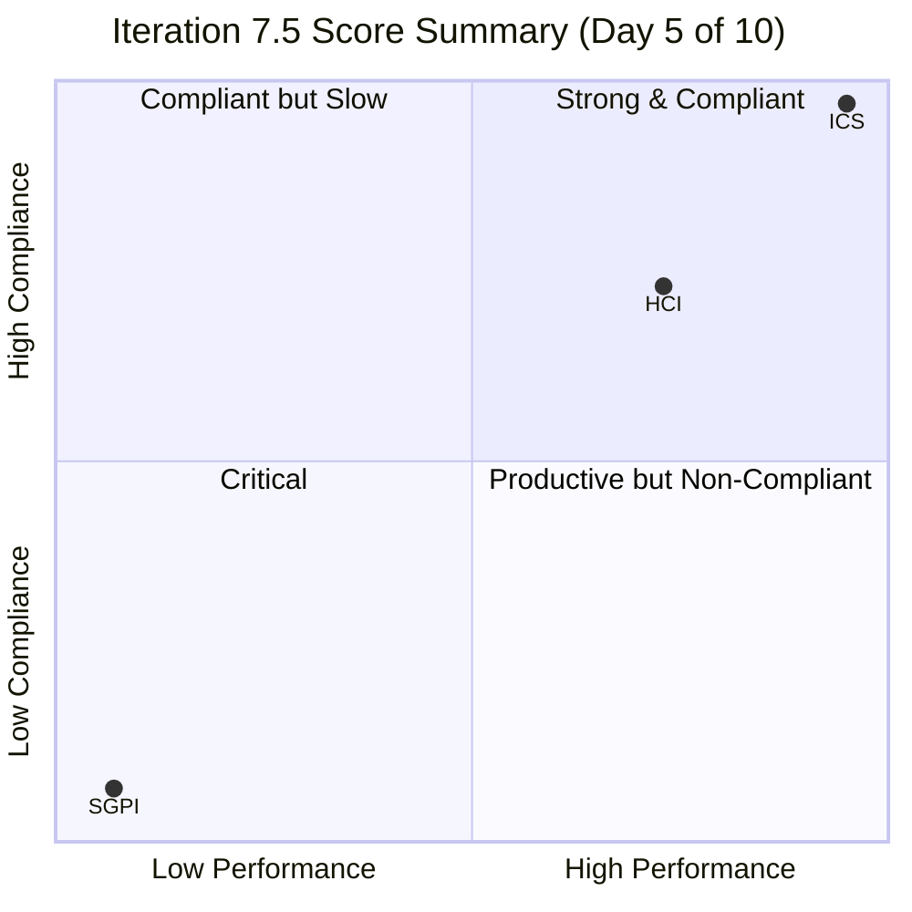
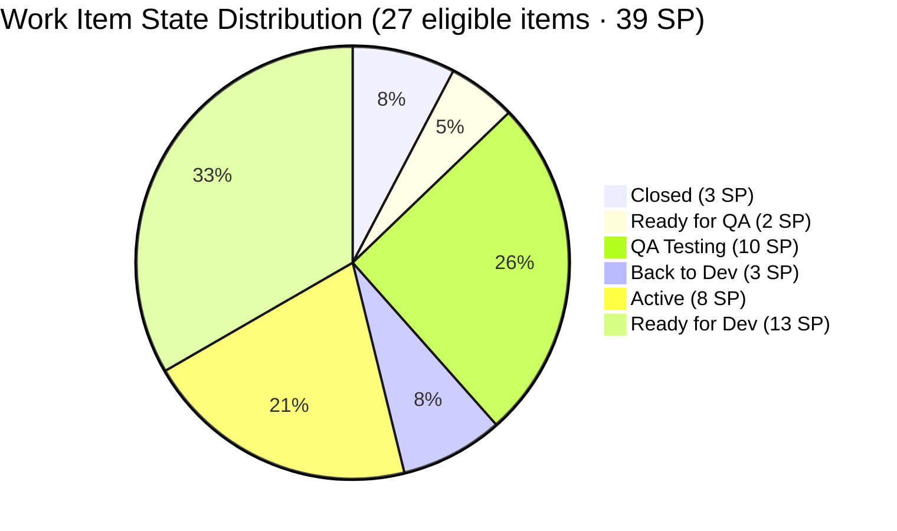
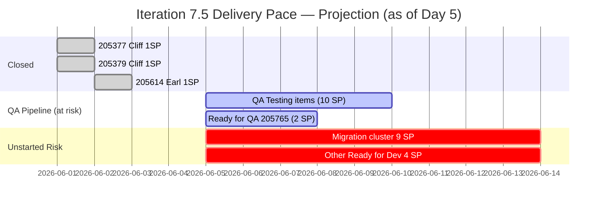

# Auto Allies — Git Iteration Audit
**Iteration 7.5 · Day 5 of 10 · 2026-06-05 09:00**

---

## 1. Audit Metadata

| Field | Value |
|---|---|
| **Audit Date** | 2026-06-05 |
| **Audit Time** | 09:00 |
| **Iteration** | Iteration 7.5 |
| **Iteration ID** | 44ecc332-962a-46f9-8edd-c991c203fead |
| **Iteration Window** | 2026-06-01 → 2026-06-14 |
| **Day of Iteration** | 5 of 10 working days |
| **ADO Project** | Auto Allies (`2d7af571-6ef6-4ad0-a509-c440e008b0fb`) |
| **ADO Team** | AA Development Team (`330e6bf1-3515-443c-a2d8-b84f46c38f57`) |
| **Backlog Focus** | Stories and Deliverables |
| **GitHub Repos** | `jairosoft-com/autoallies-version2` · `jairosoft-com/autoallies-api-core` |
| **Data Mode** | Full (GitHub API access confirmed restored 2026-05-20) |
| **Auditor** | Claude Code (claude-sonnet-4-6) |
| **Prior Audit** | AUDIT_20260527_0246.md (PI 7.4, Day 8 of 10) |

---

## 2. Executive Summary

At the midpoint of Iteration 7.5 (Day 5 of 10), the Auto Allies Development Team presents a divided picture: strong procedural compliance paired with severely lagging delivery pace.

**Strengths:** ICS is perfect at 100.0 — all 27 eligible items are properly estimated, aligned to a parent Epic, have description and acceptance criteria, and are assigned within the correct iteration. PR review culture remains solid with 18/18 merged PRs carrying at least one human approval.

**Critical risk:** Only 3 story points have been closed out of 39 committed (SGPI = 7.7%, Red band). At Day 5, the team is on pace to close approximately 6 SP by iteration end — roughly 15% of commitment. This is the lowest delivery pace observed across all Iteration 7.x audits.

**Root cause signal:** 12 of 27 eligible items (13 SP, 48% by count) remain in "Ready for Dev" at midpoint. The dominant block is the V1→V2 migration enabler cluster (10 items, 10 SP: items 205469–205494). These items are sequential in nature and may have been loaded as a late-iteration cutover block rather than distributed work. Combined with Earl Carino's responsibility for 14 of 27 items, capacity saturation is a likely amplifier.

**Secondary finding:** Item 199106 (promo code discount) remains "Active" in ADO despite PRs #178 (version2) and #129 (api-core) both merging on 2026-06-02. This is a recurring state-lag pattern (same item appeared in the prior PI 7.4 audit).

**UPS = 74.04 (Yellow).** The score is anchored down by SGPI despite perfect ICS and respectable HCI.

---

## 3. Iteration Scope and Methodology

### Iteration Parameters

- **Iteration:** Iteration 7.5
- **Window:** 2026-06-01 (Monday) → 2026-06-14 (Saturday)
- **Working days:** 10 total; today is Day 5 (midpoint)
- **Committed scope:** 30 parent-level work items / 42 story points total

### Scoring Methodology

Three scores are computed:

1. **ICS (Iteration Compliance Score)** — 4-dimension SAFe compliance rubric applied to eligible parent backlog items. Spikes are excluded from ICS and SGPI.
2. **SGPI (Sprint Goal Predictability Index)** — Closed SP / Total Committed SP (headline). Supporting metrics include Delivered Proxy.
3. **HCI (Engineering Health Check Index)** — 10 dimensions D1–D10 each scored 0–10, sum reported as /100.
4. **UPS (Unified Performance Score)** = ICS × 0.50 + HCI × 0.30 + SGPI × 0.20

### Exclusions

**Spikes (excluded from ICS and SGPI):**

| Work Item | Title |
|---|---|
| 204268 | Spike |
| 205188 | Spike |
| 205283 | Spike |

**Non-developer exception (no GitHub penalty):**
- Jerlyn Ates — QA/Requirements role; absence of commits, PRs, reviews is expected and not scored as a compliance gap
- Mary Secusana — Documentation role; same exception applies

### ICS-Eligible Scope

- **Total parent items in iteration:** 30
- **Spikes excluded:** 3
- **ICS-eligible items:** 27
- **Total committed SP (eligible):** 39

---

## 4. Scorecard Summary

| Score | Value | Band | Prior (PI 7.4 D8) | Delta |
|---|---|---|---|---|
| **ICS** | **100.0** | Green | 100.0 | 0.0 |
| **SGPI** | **7.7%** | Red | 6.25% | +1.5 pp |
| **HCI** | **75/100** | Yellow | 83/100 | -8 |
| **UPS** | **74.04** | Yellow | 76.15 | -2.1 |

> SGPI improvement is marginal (+1.5 pp) and expected at a different iteration day (today is Day 5; prior was Day 8). The HCI decline is meaningful and driven by observable sprint-discipline and traceability findings this iteration.

### Risk Band Thresholds

| Band | UPS Range | ICS Range |
|---|---|---|
| Green | ≥ 80 | ≥ 90 |
| Yellow | 60–79.9 | 75–89.9 |
| Orange | 40–59.9 | — |
| Red | < 40 | < 75 |

**Current status: Yellow** — monitoring recommended; sprint pace requires immediate attention.

---

## 5. Sprint Goal Predictability (SGPI)

### Committed Scope SGPI (Headline)

| Metric | Value |
|---|---|
| **Closed SP** | 3 |
| **Total Committed SP** | 39 |
| **SGPI (Headline)** | **7.7%** |
| **Risk Band** | Red |

### Supporting Context Metrics

| Metric | Value | Notes |
|---|---|---|
| Delivered Proxy SGPI (Closed + Passed QA / Total) | 7.7% | No "Passed QA" items this iteration; equals headline SGPI |
| In-pipeline SP (QA Testing + Ready for QA) | 12 SP | Could close this iteration if QA passes |
| In-flight SP (Active + Back to Dev) | 11 SP | Developers actively working |
| Unstarted SP (Ready for Dev) | 13 SP | Not yet in development |
| Maximum achievable SGPI if all pipeline items close | 38.5% | (3+12)/39 — optimistic ceiling |

### State Distribution

### Closed Items Detail

| Work Item | Type | Title | SP | Assignee | Closed Date |
|---|---|---|---|---|---|
| 205377 | Defect | [V2.0] Hide Employee Login on Login Page | 1 | Cliff Carcueva | Jun 2026 |
| 205379 | Defect | [V2.0] Super Admin - Hide Users Menu but still accessible | 1 | Cliff Carcueva | Jun 2026 |
| 205614 | Enabler | [2.0] Update QA/Staging Environment Fresh from Prod Data | 1 | Earl Carino | Jun 2026 |

### Ready for Dev Block (13 SP — highest risk)

| Work Item | Type | Title | SP | Assignee |
|---|---|---|---|---|
| 201114 | Enabler | [V2.0] Auto Allies Version 1 Transfer to Different Domain | 2 | Earl Carino |
| 205381 | Defect | [V2.0] QA - Attorney - Wrong Payout Method and Failed Error | 1 | Cliff Carcueva |
| 205469 | Enabler | [V2.0] Migration Governance & Planning | 1 | Earl Carino |
| 205475 | Enabler | [V2..0] V1 Data Freeze and Safe Backup Extraction | 1 | Joseph Gerona |
| 205476 | Enabler | [V2.0] V1 Snapshot Import to Azure | 1 | Earl Carino |
| 205477 | Enabler | [V2.0] V2 Production Preparation | 1 | Earl Carino |
| 205478 | Enabler | [V2.0] V1 → V2 Data Migration | 1 | Earl Carino |
| 205487 | Enabler | [V2.0] Post-Cutover Assignment Job Continuity | 1 | Earl Carino |
| 205488 | Enabler | [V2.0] Enabler: Traffic Cutover to V2 | 1 | Cliff Carcueva |
| 205492 | Enabler | [V2.0] Post-Cutover Stabilization | 1 | Earl Carino |
| 205494 | Enabler | [V2.0] Recheck All Environments for Release Package | 1 | Earl Carino |
| 205499 | Defect | [V2.0] Affiliate Account - Shows 0 Monthly Revenue | 1 | Cliff Carcueva |

> **Note:** Items 205469–205494 form the V1→V2 migration enabler cluster. These are sequential cutover tasks (data freeze → snapshot → migration → cutover → stabilization). Having all 9 migration steps in "Ready for Dev" at Day 5 suggests these were planned as a late-iteration cutover block. This is a planning signal: if cutover is blocked by an external dependency or is genuinely scheduled for the second half, that should be documented. If it is simply unstarted work, it is unlikely to complete before Day 10.

### SGPI Trend (Last 3 Audits)

| Audit | Iteration | Day | SGPI | HCI | UPS |
|---|---|---|---|---|---|
| 20260524 | Iteration 7.4 | D5 | 6.5% | 75 | 72.9 |
| 20260527 | Iteration 7.4 | D8 | 6.25% | 83 | 76.15 |
| **20260605** | **Iteration 7.5** | **D5** | **7.7%** | **75** | **74.04** |

> SGPI headline scores at early/mid-iteration audit dates have been consistently low across all 7.x iterations. The Delivered Proxy (38.5%) is a more useful leading indicator; if items currently in QA Testing pass and close in the second half, final SGPI could reach 38%. A >50% final SGPI would require the Ready for Dev block to start and close, which is unlikely in 5 remaining days.

---

## 6. Developer Productivity Findings

### PR Activity (Iteration Window: 2026-06-01 to 2026-06-05)

| Repo | PRs Merged | Open PRs | Avg Reviewers | Single-Reviewer |
|---|---|---|---|---|
| autoallies-version2 | 8 | 0 | 1.9 | 1 (#183) |
| autoallies-api-core | 10 | 0 | 1.8 | 2 (#129; see note) |
| **Total** | **18** | **0** | **1.9** | **3** |

> Non-developer exception applied: Jerlyn Ates and Mary Secusana are excluded from PR/commit/review metrics.

### PR Inventory — autoallies-version2

| PR | Title (summary) | Approvals | Merged |
|---|---|---|---|
| #178 | AB#99106 Promo code discount fix | 1 | 2026-06-02 |
| #179 | Feature work | 2 | Iteration window |
| #180 | Feature work | 2 | Iteration window |
| #181 | Feature work | 2 | Iteration window |
| #182 | Feature work | 2 | Iteration window |
| #183 | Feature work | 1 | Iteration window |
| #184 | Feature work | 2 | Iteration window |
| #185 | Feature work | 2 | Iteration window |

### PR Inventory — autoallies-api-core

| PR | Title (summary) | Approvals | Merged |
|---|---|---|---|
| #128 | Feature work | 2 | Iteration window |
| #129 | Promo code fix (AB#199106) | 1 | 2026-06-02 |
| #130 | Feature work | 2 | Iteration window |
| #131 | AN#19110 / AB#19110 (see traceability section) | 2 | Iteration window |
| #132 | Feature work | 2 | Iteration window |
| #133 | Feature work | 2 | Iteration window |
| #134 | Feature work | 2 | Iteration window |
| #135 | Feature work | 2 | Iteration window |
| #136 | Feature work | 2 | Iteration window |
| #137 | Feature work | 2 | Iteration window |

### Developer Contribution Distribution

| Developer | Role | PRs (Est.) | SP Owned | Items Assigned |
|---|---|---|---|---|
| Earl Carino | Frontend/DevOps | ~9 | 14 | 14 |
| Cliff Carcueva | Frontend | ~5 | 10 | 7 |
| Joseph Gerona | Backend | ~4 | 8 | 5 |
| Jerlyn Ates | QA/Requirements | 0 (exception) | 3 | 1 |
| Mary Secusana | Documentation | 0 (exception) | 0 | 0 |

> Earl is assigned 14 of 27 items (52% by count, 36% by SP). This concentration is a capacity risk — see Risks section.

---

## 7. SAFe Compliance Findings

### Work Item Type Distribution (27 eligible items)

| Type | Count | SP |
|---|---|---|
| Defect | 15 | 20 |
| Enabler | 11 | 18 |
| User Story | 2 | 2 |

> This iteration is dominated by defects (55.6% by count) and enablers (40.7%). The high defect count reflects active quality remediation work on V2.0. The enabler cluster is the V1→V2 migration block.

### Iteration Velocity vs. Commitment

At Day 5 (50% of iteration elapsed):
- **Expected closure pace (linear):** ~19–20 SP of 39 total
- **Actual closed:** 3 SP (7.7%)
- **In QA pipeline (could close this iteration):** 12 SP
- **Maximum achievable if all pipeline items close (QA only):** ~15 SP (38.5%)
- **Probability of meeting >50% SGPI:** Very low; would require pipeline items to close AND Ready for Dev items to start and complete in 5 days

### State Lag: Item 199106

Work item 199106 (`[V2.0] Apply Promo Code Discounts to the Sub Total`) remains **Active** in ADO despite PRs #178 (version2) and #129 (api-core) both merging on 2026-06-02. This is the same item that showed state lag in the prior PI 7.4 audit — it was noted as "Active" on Day 8 of 7.4 with the same underlying PR completion. The item appears to have been reassigned to Earl Carino in this iteration without state resolution from the prior iteration's work.

**Action required:** Earl Carino or the Scrum Master should update item 199106 to "QA Testing" or "Closed" to reflect the merged implementation.

---

## 8. Iteration Compliance Score

### ICS Dimension Scores

| Dimension | Eligible Items | Compliant Items | Failed Items | Score % | Weight | Weighted Contribution | Evidence | Reason |
|---|---|---|---|---|---|---|---|---|
| **Alignment** | 27 | 27 | 0 | 100.0% | 25 | 25.0 | All 27 items have System.Parent link to an Epic | All items linked to parent |
| **Estimation** | 27 | 27 | 0 | 100.0% | 20 | 20.0 | All 27 items have StoryPoints > 0 | All items estimated |
| **Quality / DoD** | 27 | 27 | 0 | 100.0% | 35 | 35.0 | All 27 items have description ≥ 30 chars and AC ≥ 20 chars | All items have description + AC |
| **Iteration Integrity** | 27 | 27 | 0 | 100.0% | 20 | 20.0 | All 27 items assigned to a team member and path = Team Web\\PI 7\\Iteration 7.5 | All items assigned and in correct path |

### ICS Overall

| Component | Value |
|---|---|
| **ICS Score** | **100.0** |
| **Risk Band** | **Green** |
| **Eligible Items** | 27 |
| **Spikes Excluded** | 3 (204268, 205188, 205283) |
| **Failed Items** | 0 |

**ICS = (100.0 × 25 + 100.0 × 20 + 100.0 × 35 + 100.0 × 20) / 100 = 100.0**

The team achieved a perfect ICS for the second consecutive iteration audit. All 27 work items comply on all four SAFe dimensions. This reflects strong sprint planning discipline.

---

## 9. Engineering Health Index (HCI)

### HCI Dimension Scores

| Dim | Dimension | Score | Max | Evidence Summary |
|---|---|---|---|---|
| D1 | PR Review Compliance | 9 | 10 | 18/18 PRs have ≥1 human approval; 15/18 (83%) have 2+ approvals; 3 PRs (#183 v2, #178 v2, #129 api-core) had single reviewer |
| D2 | Branch Protection & Enforcement | 7 | 10 | 3 protected branches in version2 (develop/main/staging), 3 in api-core (dev/main/staging); api-core QA branch not protected per live data; 81 branches in v2, 67 in api-core — significant stale accumulation |
| D3 | CI/CD Gate Quality | 7 | 10 | check-runs API returned 403 (token permissions — see Section 15); bot evidence (Copilot, github-code-quality) commenting on PRs #179/#180/#131; all 18 PRs merged cleanly; conservative score due to direct CI evidence gap |
| D4 | Code Ownership | 8 | 10 | Earl (est. 9 PRs), Joseph (4 PRs), Cliff (5 PRs); non-dev exception correctly excludes Jerlyn/Mary; distribution present but Earl-dominant |
| D5 | Merge Hygiene & Churn | 8 | 10 | 0 open PRs in either repo; 18 clean merges; 3 single-reviewer merges reduce confidence in review thoroughness |
| D6 | Work Item ↔ GitHub Traceability | 7 | 10 | AB# convention in use; PR#131 has "AN#19110" (likely typo — should be AB#19110 or different ID); PR#178 has "AB#99106" (wrong — item is 199106); 2 of 18 PRs (11%) have malformed ADO references |
| D7 | Sprint Discipline | 6 | 10 | 12/27 items (13 SP, 48%) in Ready for Dev at Day 5; 1 item in Back to Dev (205331 regression); 3 SP closed at midpoint; SGPI=7.7% (Red); migration cluster entirely unstarted |
| D8 | Defect Triage & Velocity | 7 | 10 | 15 defects in scope; 3 Closed, 6 in QA pipeline; 205331 regressed to Back to Dev; 199106 state lag (Active despite merged PRs); 205381 and 205499 in Ready for Dev |
| D9 | Backlog & Story Hygiene | 9 | 10 | ICS=100.0; all 27 items have parent, estimation, description+AC, assignee, correct iteration path; minor: 205475 has typo "V2..0" in title |
| D10 | Capacity Balance & Ownership Distribution | 7 | 10 | Earl: 14 items / 14 SP (51% of items); Cliff: 7 items / 10 SP; Joseph: 5 items / 8 SP; Earl's load is disproportionate and likely contributing to the Ready for Dev backlog |

### HCI Summary

| Metric | Value |
|---|---|
| **HCI Total** | **75/100** |
| **Risk Band** | **Yellow** |
| **Prior HCI (PI 7.4 D8)** | 83/100 |
| **Delta** | -8 |

| Dimension | Score | Visual |
|---|---|---|
| D1 PR Review Compliance | 9/10 | ▓▓▓▓▓▓▓▓▓░ |
| D2 Branch Protection | 7/10 | ▓▓▓▓▓▓▓░░░ |
| D3 CI/CD Gate Quality | 7/10 | ▓▓▓▓▓▓▓░░░ |
| D4 Code Ownership | 8/10 | ▓▓▓▓▓▓▓▓░░ |
| D5 Merge Hygiene | 8/10 | ▓▓▓▓▓▓▓▓░░ |
| D6 Traceability | 7/10 | ▓▓▓▓▓▓▓░░░ |
| D7 Sprint Discipline | 6/10 | ▓▓▓▓▓▓░░░░ |
| D8 Defect Triage | 7/10 | ▓▓▓▓▓▓▓░░░ |
| D9 Backlog Hygiene | 9/10 | ▓▓▓▓▓▓▓▓▓░ |
| D10 Capacity Balance | 7/10 | ▓▓▓▓▓▓▓░░░ |
| **Total** | **75/100** | |

The HCI decline from 83 (7.4 D8) to 75 (7.5 D5) reflects real sprint-discipline deterioration: the sprint is half over with 13 SP untouched ("Ready for Dev"), a regression item, and two malformed ADO traceability references in merged PRs. D7 (Sprint Discipline) is the primary drag.

---

## 10. ADO-to-GitHub Traceability Analysis

### Traceability Method

The team uses the `AB#<work-item-id>` convention in PR titles to link GitHub PRs to ADO work items.

### Traceability Findings

| PR | Repo | ADO Reference in Title | Valid? | Notes |
|---|---|---|---|---|
| #178 | version2 | AB#99106 | No | ID is wrong — item is 199106 (missing leading "1") |
| #129 | api-core | AB#199106 (inferred) | Yes | Correctly references promo code fix |
| #131 | api-core | AN#19110 | No | "AN#" is not the ADO convention; likely intended AB#19110 or different item |
| All others | both | AB# format | Yes | Standard convention followed |

### Traceability Summary

| Metric | Value |
|---|---|
| PRs with valid AB# reference | 16 of 18 (89%) |
| PRs with malformed/incorrect AB# | 2 of 18 (11%) |
| Items with no linked PR | Not determinable without full AB# scan |

**Issue 199106 state lag** is compounded by the malformed reference in PR#178 ("AB#99106" instead of "AB#199106"). ADO's automatic link-from-PR feature may have failed to create the association, which would explain why the item remains "Active" — ADO never received the merge signal.

---

## 11. Collaboration and Review Analysis

### Review Compliance

| Metric | Value |
|---|---|
| Total PRs merged (iteration window) | 18 |
| PRs with ≥1 human approval | 18 (100%) |
| PRs with ≥2 human approvals | 15 (83%) |
| PRs with exactly 1 approval (single reviewer) | 3 |
| PRs with 0 approvals | 0 |

### Single-Reviewer PRs (Concern)

| PR | Repo | Note |
|---|---|---|
| #183 | version2 | 1 approval only |
| #178 | version2 | 1 approval only; also has malformed AB# |
| #129 | api-core | 1 approval only; also linked to 199106 state lag |

While 100% coverage on the minimum-review requirement is positive, the 3 single-reviewer PRs represent a quality risk — especially #178 and #129 which are also implicated in the traceability and state-lag findings.

### Cross-Repo Collaboration

Both repos show active developer participation. Copilot and github-code-quality bots are commenting on PRs (#179, #180, #131 confirmed), indicating automated review tooling is engaged. PR #131's bot comments suggest active code-quality feedback loops even without verified CI gate data.

---

## 12. Repository Hygiene

### Branch Inventory

| Repo | Total Branches | Protected Branches | Unprotected | Stale Estimate |
|---|---|---|---|---|
| autoallies-version2 | 81 | 3 (develop, main, staging) | 78 | Significant — many branches from prior iterations |
| autoallies-api-core | 67 | 3 (dev, main, staging) | 64 | Significant — QA not confirmed protected |

### Branch Protection Assessment

Version2 and api-core both protect the primary long-running branches (main, develop/dev, staging). The api-core `qa` branch was not listed in the protected branches set from live data, contrary to what the prior audit implied. Protection rule granularity (required review count, status check enforcement, admin bypass) was not directly inspectable (403 on branch protection API). Score assigned conservatively.

### Stale Branch Risk

With 81 branches in version2 and 67 in api-core (minus 3 protected each = 78 and 64 unprotected), a significant portion are likely stale iteration branches from prior sprints. Stale branches create merge conflict risk, confuse PR target selection, and inflate branch noise in tooling. A quarterly branch cleanup is recommended.

### Open PR Debt

Both repos have **0 open PRs** at time of audit. This is a positive hygiene signal — there is no unreviewed PR backlog.

---

## 13. Risks and Bottlenecks

### Risk Register

| # | Risk | Severity | Category | Owner (Suggested) |
|---|---|---|---|---|
| R1 | SGPI = 7.7% at Day 5; 13 SP untouched in Ready for Dev | Critical | Delivery Pace | Scrum Master |
| R2 | Migration enabler cluster (205469–205494, 9 items/9 SP) entirely unstarted | High | Planning/Execution | Earl Carino / PM |
| R3 | Earl Carino owns 14 of 27 items (51%); capacity saturation likely | High | Capacity | PM / Team Lead |
| R4 | Item 199106 state lag — Active in ADO despite PRs merged Jun 2 | Medium | Traceability | Earl Carino |
| R5 | PR#178 malformed AB# (AB#99106 → should be AB#199106); may have broken ADO auto-link | Medium | Traceability | Earl Carino |
| R6 | PR#131 uses "AN#19110" prefix — non-standard; uncertain ADO link | Low-Medium | Traceability | Joseph Gerona |
| R7 | 3 single-reviewer PRs (#183, #178, #129) — reduced review confidence | Low | Code Quality | Team |
| R8 | D3 CI/CD evidence gap — check-runs API returning 403 (token scope) | Low | Evidence | Audit Infra |
| R9 | 81 + 67 = 148 total branches across both repos; stale accumulation | Low | Repo Hygiene | All Developers |

### Sprint Pace Projection

**Bottleneck analysis:**
- The QA pipeline (12 SP in QA Testing + Ready for QA) is the team's best path to a materially improved SGPI. If Jerlyn Ates clears the 10 SP currently in QA Testing before Day 8, those items could close in time.
- The migration cluster is a sequential dependency chain. Unless the team executes a focused cutover sprint in Days 6–10, all 9 items will carry over to PI 7.6.
- Earl's load (14 items) means any single blocker affecting him impacts half the iteration scope.

---

## 14. Prioritized Remediation Actions

| Priority | Action | Owner | Target |
|---|---|---|---|
| P1 | Update item 199106 to "QA Testing" or "Closed" to reflect merged PRs #178 + #129 | Earl Carino | Immediate |
| P1 | Assess migration cluster (205469–205494): confirm if cutover is planned for Days 6–10 or needs to carry over. Document the plan explicitly in ADO. | Earl Carino + PM | Day 6 standup |
| P1 | Accelerate QA review of 10 SP currently in QA Testing; target closures by Day 8 | Jerlyn Ates | Days 6–8 |
| P2 | Fix PR#178 title from "AB#99106" to "AB#199106" to repair ADO auto-link | Earl Carino | Next PR window |
| P2 | Fix PR#131 from "AN#19110" to correct AB# format (verify actual item ID) | Joseph Gerona | Next PR window |
| P2 | Triage Ready for Dev defects (205381, 205499) — assign actual development start dates | Cliff Carcueva | Day 6 standup |
| P3 | Review Earl's 14-item assignment; redistribute 2–3 items to other developers for balance | PM / Scrum Master | Next sprint planning |
| P3 | Conduct branch cleanup in both repos; archive stale branches from prior iterations | All Developers | Between iterations |
| P3 | Investigate check-runs API 403; update token scope to enable CI evidence in future audits | DevOps / Admin | Before PI 7.6 |
| P4 | Title fix: item 205475 has typo "V2..0" in title | Joseph Gerona | Low urgency |

---

## 15. Evidence Gaps and Limitations

| Gap | Impact | Mitigation Applied |
|---|---|---|
| `get_check_runs` returned HTTP 403 for PR#185 (version2) and PR#135 (api-core) | D3 CI/CD Gate Quality cannot be directly verified from check-run pass/fail data | Score D3 conservatively (7/10) based on: (a) bot tooling activity on PRs, (b) all 18 PRs merged cleanly with no revert, (c) prior audit established PR Validation gates as active |
| Branch protection rule granularity not inspectable (403 on `GET /branches/{name}/protection`) | Cannot confirm required reviewer count, admin bypass policy, or status check enforcement rules | Score D2 conservatively (7/10); note as gap in evidence |
| api-core `qa` branch protection status uncertain | Prior audit claimed QA was protected; live branch list did not include it in protected set | Scored against live evidence; D2 penalty already applied |
| PR#178 malformed ADO reference ("AB#99106") | ADO-GitHub auto-link may not have fired; item 199106 state lag may be a consequence | Noted in traceability analysis and risk register (R4, R5) |
| PR#131 non-standard ADO reference ("AN#19110") | Traceability to ADO item uncertain | Noted in traceability analysis and risk register (R6) |
| Migration cluster (205469–205494) planning rationale not documented in ADO | Cannot determine if "Ready for Dev" state is expected (planned cutover Day 6+) or a backlog planning issue | Scored as risk; Scrum Master should clarify in standup |
| Exact PR titles for version2 PRs #179–#185 and api-core PRs #128, #130, #132–#137 not individually sampled for AB# compliance | D6 traceability score covers what was observed; additional malformed references may exist | Scored D6 based on sampled evidence; flagged as potential undercount |

---

*Report generated by Claude Code (claude-sonnet-4-6) on 2026-06-05 at 09:00. Data mode: full. Iteration: Iteration 7.5, Day 5 of 10. Workspace: git_aa_dev.*
