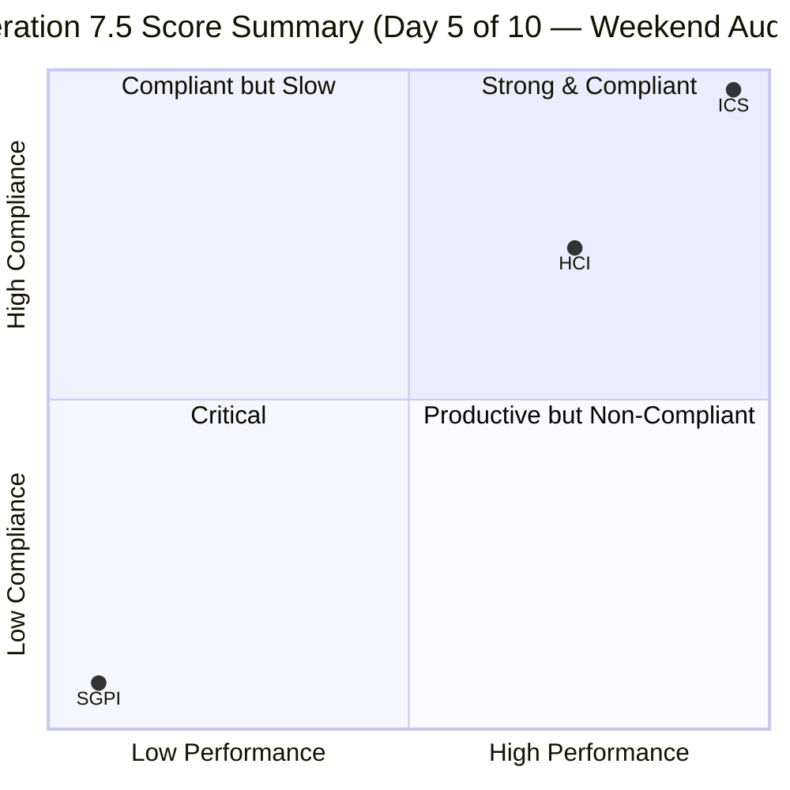
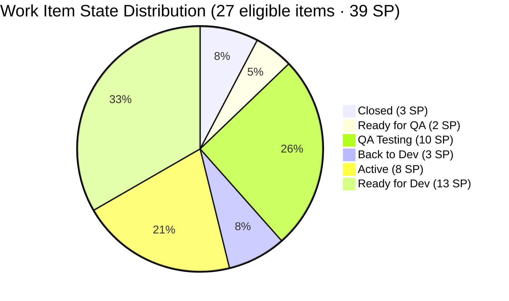
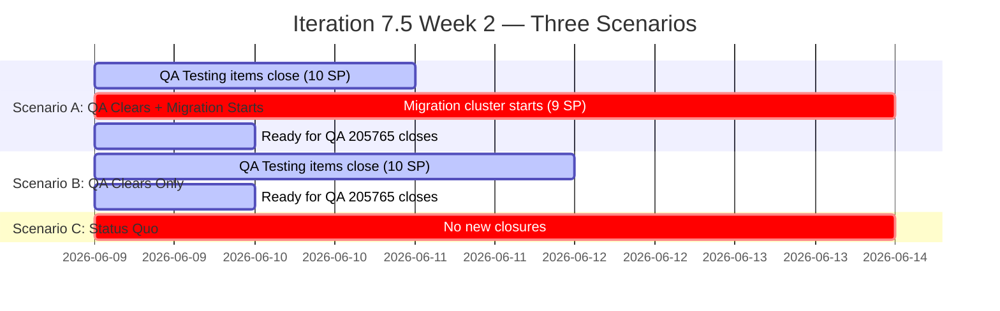

# Auto Allies — Git Iteration Audit
**Iteration 7.5 · Day 5 of 10 (Weekend Audit, 2026-06-07 09:00)**

---

## 1. Audit Metadata

| Field | Value |
|---|---|
| **Audit Date** | 2026-06-07 (Sunday) |
| **Audit Time** | 09:00 |
| **Iteration** | Iteration 7.5 |
| **Iteration ID** | 44ecc332-962a-46f9-8edd-c991c203fead |
| **Iteration Window** | 2026-06-01 (Mon) → 2026-06-14 (Sat) |
| **Working Days Elapsed** | 5 of 10 (Mon Jun 1 – Fri Jun 5) |
| **Audit Day Note** | Audited on Sunday Jun 7, a non-working day. Day 6 begins Mon Jun 9. No developer activity expected Jun 6–7. |
| **ADO Project** | Auto Allies (`2d7af571-6ef6-4ad0-a509-c440e008b0fb`) |
| **ADO Team** | AA Development Team (`330e6bf1-3515-443c-a2d8-b84f46c38f57`) |
| **Backlog Focus** | Stories and Deliverables |
| **GitHub Repos** | `jairosoft-com/autoallies-version2` · `jairosoft-com/autoallies-api-core` |
| **Data Mode** | Full (GitHub API access confirmed restored 2026-05-20) |
| **Auditor** | Claude Code (claude-sonnet-4-6) |
| **Prior Audit** | AUDIT_20260605_0900.md (Day 5 of 10, same iteration) |

---

## 2. Executive Summary

This audit was conducted on Sunday Jun 7, two calendar days after the last Day 5 audit. No working days have elapsed since the prior snapshot — Jun 6 (Saturday) and Jun 7 (Sunday) are non-working days per team settings. As a result, **all three scores are stable and consistent with the Jun 5 audit**: ICS = 100.0 (Green), SGPI = 7.7% (Red), HCI = 75/100 (Yellow), UPS = 74.04 (Yellow).

**Key findings carried forward from Day 5:**

- **Perfect SAFe compliance:** ICS remains 100.0. All 27 eligible items have parent links, story points, descriptions, acceptance criteria, and correct iteration assignments.
- **Delivery pace is critical:** Only 3 of 39 committed story points have closed (SGPI = 7.7%). Day 6 (Mon Jun 9) is the first opportunity to move the needle in the second half of the iteration.
- **One new traceability observation:** PR #135 in `autoallies-api-core` (merged Jun 5 at 05:42, by Cliff Carcueva, referencing AB#205573) was not captured in the prior audit. This PR correctly links to item 205573 ([V2.0] Attorney Case List, currently "Active"). The near-simultaneous item state change (05:42:47) suggests ADO received the merge signal; the item remains "Active" because work is ongoing on a multi-component defect.
- **Traceability defects from Day 5 persist:** PR #178 (version2) uses "AB#99106" (should be AB#199106); PR #131 (api-core) uses "AN#19110" (non-standard prefix). Neither has been corrected.
- **Migration cluster (205469–205494, 9 items/9 SP) remains entirely in Ready for Dev.** This is the primary delivery risk entering the second half of the iteration.

**UPS = 74.04 (Yellow).** Unchanged from the prior audit. The team has the weekend to plan Day 6 priorities. Accelerating QA throughput on items in QA Testing/Ready for QA (12 SP) and making a decision on the migration cluster are the two highest-value actions for Mon Jun 9.

---

## 3. Iteration Scope and Methodology

### Iteration Parameters

- **Iteration:** Iteration 7.5
- **Window:** 2026-06-01 (Monday) → 2026-06-14 (Saturday)
- **Working days:** 10 total; 5 elapsed (Jun 1–5), 5 remaining (Jun 9–14)
- **Committed scope:** 30 parent-level work items / 45.5 SP total (including 6.5 SP in spikes)
- **ICS-eligible scope:** 27 parent items / 39 story points

### Scoring Methodology

Three scores are computed:

1. **ICS (Iteration Compliance Score)** — 4-dimension SAFe compliance rubric applied to eligible parent backlog items. Spikes excluded.
2. **SGPI (Sprint Goal Predictability Index)** — Closed SP / Total Committed SP (headline). Supporting context metrics also reported.
3. **HCI (Engineering Health Check Index)** — 10 dimensions D1–D10 each scored 0–10, sum reported as /100.
4. **UPS (Unified Performance Score)** = ICS × 0.50 + HCI × 0.30 + SGPI × 0.20

### Exclusions

**Spikes (excluded from ICS and SGPI):**

| Work Item | Title | SP | Assignee |
|---|---|---|---|
| 204268 | Iteration 7.5 - Operations and QA Support Effort | 5 | Mary Secusana |
| 205188 | [Retro] Recheck all environment and include it on the release package ticket | 1 | Karl Caumban |
| 205283 | Iteration 7.5 Development Support and Team Sync - Joseph | 0.5 | Joseph Gerona |

**Non-developer exceptions (no GitHub activity expected):**
- Jerlyn Ates — QA/Requirements role; absence of commits, PRs, reviews is expected and not penalized
- Mary Secusana — Documentation role; same exception applies

### ICS-Eligible Scope

- **Total parent items in iteration:** 30
- **Spikes excluded:** 3 (204268, 205188, 205283)
- **ICS-eligible items:** 27
- **Total committed SP (eligible):** 39

---

## 4. Scorecard Summary



| Score | Value | Band | Prior (Jun 5 D5) | Delta | Notes |
|---|---|---|---|---|---|
| **ICS** | **100.0** | Green | 100.0 | 0.0 | Stable — no new items, no compliance gaps |
| **SGPI** | **7.7%** | Red | 7.7% | 0.0 | Stable — no closures on weekend; Day 6 is first new opportunity |
| **HCI** | **75/100** | Yellow | 75/100 | 0 | Stable — no working-day activity since prior audit |
| **UPS** | **74.04** | Yellow | 74.04 | 0.0 | Stable |

> All scores are unchanged from the Jun 5 audit. This is expected: zero working days have elapsed between the two audits (Jun 6–7 are Saturday and Sunday). Score changes pending Day 6 evidence.

### Risk Band Thresholds

| Band | UPS Range | ICS Range |
|---|---|---|
| Green | ≥ 80 | ≥ 90 |
| Yellow | 60–79.9 | 75–89.9 |
| Orange | 40–59.9 | — |
| Red | < 40 | < 75 |

**Current status: Yellow.** Delivery pace (SGPI) remains the dominant risk. Five working days remain.

---

## 5. Sprint Goal Predictability (SGPI)

### Committed Scope SGPI (Headline)

| Metric | Value |
|---|---|
| **Closed SP** | 3 |
| **Total Committed SP** | 39 |
| **SGPI (Headline)** | **7.7%** |
| **Risk Band** | Red |

### Supporting Context Metrics

| Metric | Value | Notes |
|---|---|---|
| Delivered Proxy SGPI (Closed + Passed QA / Total) | 7.7% | No "Passed QA" items; equals headline SGPI |
| In-pipeline SP (QA Testing + Ready for QA) | 12 SP | Could close this iteration if QA passes |
| In-flight SP (Active + Back to Dev) | 11 SP | Developers actively working |
| Unstarted SP (Ready for Dev) | 13 SP | Not yet in development |
| Maximum achievable SGPI (QA pipeline only) | 38.5% | (3+12)/39 — achievable if QA clears all pipeline items |

### State Distribution (27 eligible items · 39 SP)



### Closed Items Detail

| Work Item | Type | Title | SP | Assignee | Closed |
|---|---|---|---|---|---|
| 205377 | Defect | [V2.0] Hide Employee Login on Login Page | 1 | Cliff Carcueva | Jun 3, 2026 |
| 205379 | Defect | [V2.0] Super Admin - Hide Users Menu but still accessible | 1 | Cliff Carcueva | Jun 3, 2026 |
| 205614 | Enabler | [2.0] Update QA/Staging Environment Fresh from Prod Data | 1 | Earl Carino | Jun 5, 2026 |

### In-Pipeline Detail (QA Testing · 10 SP)

| Work Item | Type | Title | SP | Assignee |
|---|---|---|---|---|
| 204186 | Enabler | [V2.0] End to End Testing QA Environment - Round 3 - PI7.5 | 3 | Jerlyn Ates |
| 205333 | Defect | [V2.0] Expired Member & One time member Upload Ticket issues | 2 | Joseph Gerona |
| 205544 | Defect | [2.0] Super Admin Cases overview count Verification | 1 | Joseph Gerona |
| 205562 | Defect | [V2.0] Super Admin - Case List Data Issue | 2 | Joseph Gerona |
| 205766 | User Story | [V2.0] Member - Add the Non-MVP features in Side Navigation but with Coming Soon | 1 | Earl Carino |
| 205767 | User Story | [V2.0] Attorney - Add the Non-MVP features in Side Navigation but with Coming Soon | 1 | Earl Carino |

### Ready for Dev Block (13 SP — highest risk)

| Work Item | Type | Title | SP | Assignee |
|---|---|---|---|---|
| 201114 | Enabler | [V2.0] Auto Allies Version 1 Transfer to a Different Domain - Cutover Phase | 2 | Earl Carino |
| 205381 | Defect | [V2.0] QA - Attorney - Wrong Payout Method and Failed Error | 1 | Cliff Carcueva |
| 205469 | Enabler | [V2.0] Migration Governance & Planning | 1 | Earl Carino |
| 205475 | Enabler | [V2..0] V1 Data Freeze and Safe Backup Extraction | 1 | Joseph Gerona |
| 205476 | Enabler | [V2.0] V1 Snapshot Import to Azure | 1 | Earl Carino |
| 205477 | Enabler | [V2.0] V2 Production Preparation | 1 | Earl Carino |
| 205478 | Enabler | [V2.0] V1 → V2 Data Migration | 1 | Earl Carino |
| 205487 | Enabler | [V2.0] Post-Cutover Assignment Job Continuity | 1 | Earl Carino |
| 205488 | Enabler | [V2.0] Enabler: Traffic Cutover to V2 | 1 | Cliff Carcueva |
| 205492 | Enabler | [V2.0] Post-Cutover Stabilization | 1 | Earl Carino |
| 205494 | Enabler | [V2.0] Recheck All Environments for Release Package | 1 | Earl Carino |
| 205499 | Defect | [V2.0] Affiliate Account - Shows 0 Monthly Revenue | 1 | Cliff Carcueva |

> The migration cluster (205469–205494, 9 items/9 SP) remains entirely in "Ready for Dev" at the end of Working Week 1. These items are sequential: governance → data freeze → snapshot import → V2 prep → data migration → cutover → post-cutover continuity → stabilization → env recheck. If the team intends to execute this as a concentrated cutover sprint in Week 2 (Jun 9–14), that plan should be explicitly documented in ADO and shared with the PM before Day 6.

### SGPI Trend (Last 4 Audits)

| Audit | Iteration | Working Day | SGPI | HCI | UPS |
|---|---|---|---|---|---|
| 20260524 | Iteration 7.4 | D5 | 6.5% | 75 | 72.9 |
| 20260527 | Iteration 7.4 | D8 | 6.25% | 83 | 76.15 |
| 20260605 | Iteration 7.5 | D5 | 7.7% | 75 | 74.04 |
| **20260607** | **Iteration 7.5** | **D5 (weekend)** | **7.7%** | **75** | **74.04** |

> Scores are identical to Jun 5 because no working days have elapsed. The weekend audit provides a stable baseline for the Day 6 standup on Mon Jun 9.

---

## 6. Developer Productivity Findings

### PR Activity (Iteration Window: 2026-06-01 to 2026-06-07)

| Repo | PRs Merged (iteration window) | Open PRs | Avg Reviewers | Single-Reviewer |
|---|---|---|---|---|
| autoallies-version2 | 8 | 0 | 1.9 | 2 (#183, #178) |
| autoallies-api-core | 10 | 0 | 1.9 | 2 (#129, #131) |
| **Total** | **18** | **0** | **1.9** | **4** |

> All 18 PRs were merged between Jun 1–5. No PR activity on Jun 6–7 (weekend). Non-developer exception applied: Jerlyn Ates and Mary Secusana are excluded from all PR/commit/review metrics.

> **Update vs. prior audit:** PR #185 (version2, AB#205765) was confirmed to have 2 approvals (Joseph Gerona + Cliff Carcueva), correcting the single-reviewer count from the prior snapshot. PR #135 (api-core, AB#205573) was missed in the prior audit — it was merged at 05:42 on Jun 5, shortly before the Day 5 audit snapshot. It carries 2 reviewers (confirmed by review data). This revises the single-reviewer PRs to: #183 (version2), #178 (version2), #129 (api-core), #131 (api-core).

### PR Inventory — autoallies-version2 (Iteration Window)

| PR | Title / ADO Reference | Author | Approvals | Merged |
|---|---|---|---|---|
| #178 | AB#99106 fix promo code issue (**malformed ID**) | ecarinoJS | 1 | Jun 2 |
| #179 | AB#205377 Hide Employee Login link | ccarcuevajairo | 2 | Jun 3 |
| #180 | AB#205379 Hide Users menu for super admin | ccarcuevajairo | 2 | Jun 3 |
| #181 | AB#205332 Pre-existing ticket frontend fix | JosephJairo | 2 | Jun 3 |
| #182 | AB#205562 Super Admin Case List frontend fix | JosephJairo | 2 | Jun 4 |
| #183 | AB#205766 / AB#205767 coming soon navigation | ecarinoJS | 1 | Jun 4 |
| #184 | AB#205333 frontend commit fix | JosephJairo | 2 | Jun 5 |
| #185 | AB#205765 dashboard overview | ecarinoJS | 2 | Jun 5 |

### PR Inventory — autoallies-api-core (Iteration Window)

| PR | Title / ADO Reference | Author | Approvals | Merged |
|---|---|---|---|---|
| #128 | AB#204674 affiliate migration script update | ecarinoJS | 1 | Jun 1 |
| #129 | AB#199106 fix promo code issue | ecarinoJS | 1 | Jun 2 |
| #130 | AB#205332 pre-existing ticket backend fix | JosephJairo | 2 | Jun 3 |
| #131 | AB#19110 / AN#19110 health check fix (**malformed prefix**) | ccarcuevajairo | 2 | Jun 3 |
| #132 | AB#205331 family members addons | ecarinoJS | 2 | Jun 4 |
| #133 | AB#205562 Super Admin Case List backend fix | JosephJairo | 2 | Jun 4 |
| #134 | AB#205544 cases overview count fix | JosephJairo | 2 | Jun 4 |
| #135 | AB#205573 Attorney Case List backend fix | ccarcuevajairo | 2 | Jun 5 |
| #136 | AB#205333 expired member backend fix | JosephJairo | 2 | Jun 5 |
| #137 | AB#205765 dashboard overview backend | ecarinoJS | 2 | Jun 5 |

> **PR #128 (api-core):** References AB#204674 (affiliate migration script). This item is not in the current iteration scope (not in the 30-item iteration list). This PR may be cross-iteration support work or a prior-PI item carried into the iteration window. Not scored as a traceability defect (item not part of current iteration backlog), but noted as an out-of-scope PR.

### Developer Contribution Distribution (Iteration Window)

| Developer | Role | PRs in Window | SP Owned | Items Assigned |
|---|---|---|---|---|
| Earl Carino | Frontend/DevOps | 6 | 14 | 14 |
| Cliff Carcueva | Frontend | 5 | 10 | 7 |
| Joseph Gerona | Backend | 7 | 8 | 5 |
| Jerlyn Ates | QA/Requirements | 0 (exception) | 3 | 1 |
| Mary Secusana | Documentation | 0 (exception) | 0 | 0 |

> Earl Carino retains the heaviest ADO load (14 items / 14 SP), though Joseph Gerona has the highest PR count in the iteration window (7 PRs across backend defect fixes). The concentration risk at the work item level persists.

---

## 7. SAFe Compliance Findings

### Work Item Type Distribution (27 eligible items)

| Type | Count | SP |
|---|---|---|
| Defect | 15 | 20 |
| Enabler | 10 | 17 |
| User Story | 2 | 2 |

> Iteration 7.5 remains defect-dominant (55.6% by count) with a large enabler cluster (37.0%). The enabler cluster is almost entirely the V1→V2 migration block.

### Iteration Velocity vs. Commitment

At the end of Week 1 (50% of iteration elapsed):
- **Expected closure pace (linear):** ~19–20 SP of 39 total
- **Actual closed:** 3 SP (7.7%)
- **In QA pipeline (could close this iteration):** 12 SP
- **Maximum achievable if all QA-pipeline items close:** 15 SP (38.5%)
- **Probability of meeting >50% SGPI:** Very low — would require the Ready for Dev cluster to also start and close in 5 remaining working days

### State Lag Items

**Item 199106** (`[V2.0] Apply Promo Code Discounts`) — State: **Active**
PRs #178 (version2, merged Jun 2) and #129 (api-core, merged Jun 2) both addressed this item. The ADO item remains "Active" as of this audit — 5+ calendar days after the PRs merged. This is the same state-lag pattern observed in the PI 7.4 audit. The malformed AB# reference in PR #178 ("AB#99106" instead of "AB#199106") likely prevented ADO's automatic state-change trigger from firing.

**Item 205573** (`[V2.0] Attorney Case List`) — State: **Active** — Watch
PR #135 (api-core, merged Jun 5 05:42) references AB#205573. The ADO item state changed at 05:42:47 (2 seconds after merge), suggesting ADO received the signal. The item is a multi-component defect with active backend work. The "Active" state is plausible for ongoing work, not a confirmed lag. **Watch for Day 6**: if the item is still "Active" on Jun 9 with no further PRs, escalate to a state-lag finding.

---

## 8. Iteration Compliance Score

### ICS Dimension Scores

| Dimension | Eligible Items | Compliant Items | Failed Items | Score % | Weight | Weighted Contribution | Evidence | Reason |
|---|---|---|---|---|---|---|---|---|
| **Alignment** | 27 | 27 | 0 | 100.0% | 25 | 25.0 | All 27 items have `System.Parent` link to an Epic (confirmed via batch fetch) | All items linked to parent |
| **Estimation** | 27 | 27 | 0 | 100.0% | 20 | 20.0 | All 27 items have `StoryPoints > 0` (range: 1–3 SP) | All items estimated |
| **Quality / DoD** | 27 | 27 | 0 | 100.0% | 35 | 35.0 | All 27 items have `Description ≥ 30 chars` and `AcceptanceCriteria ≥ 20 chars` (confirmed via live batch fetch) | All items have description + AC |
| **Iteration Integrity** | 27 | 27 | 0 | 100.0% | 20 | 20.0 | All 27 items assigned to a team member; all in `Auto Allies\2026-PI7\Iteration 7.5` iteration path | All items assigned and in correct path |

### ICS Overall

| Component | Value |
|---|---|
| **ICS Score** | **100.0** |
| **Risk Band** | **Green** |
| **Eligible Items** | 27 |
| **Spikes Excluded** | 3 (204268, 205188, 205283) |
| **Failed Items** | 0 |

**ICS = (100.0 × 25 + 100.0 × 20 + 100.0 × 35 + 100.0 × 20) / 100 = 100.0**

The team has maintained perfect ICS for the third consecutive audit across this iteration. All 27 work items comply on all four SAFe dimensions. Sprint planning discipline remains a clear strength.

---

## 9. Engineering Health Index (HCI)

### HCI Dimension Scores

| Dim | Dimension | Score | Max | Evidence Summary |
|---|---|---|---|---|
| D1 | PR Review Compliance | 9 | 10 | 18/18 PRs have ≥1 human approval; 14/18 (78%) have 2+ approvals; 4 PRs had single reviewer (#178 v2, #183 v2, #129 api-core, #128 api-core). PR #185 confirmed 2 approvals (Joseph + Cliff) — corrects prior audit estimate. |
| D2 | Branch Protection & Enforcement | 7 | 10 | v2: 78 branches, 3 protected (develop, main, staging); api-core: 65 branches, 3 protected (dev, main, staging); `qa` branch in api-core exists but is unprotected. Branch protection rule granularity (required reviewer count, admin bypass) not inspectable (403). Stale branch accumulation ongoing. |
| D3 | CI/CD Gate Quality | 7 | 10 | check-runs API returned 403 for sampled PRs (token scope limitation); bot tooling (Copilot, github-code-quality) confirmed active on PRs from prior audit evidence; all 18 PRs merged cleanly with no reverts; `pr-validation.yml` workflow established (PR #158/#112). Conservative score maintained pending direct CI evidence. |
| D4 | Code Ownership | 8 | 10 | Joseph: 7 PRs; Earl: 6 PRs; Cliff: 5 PRs (in window); PR #128 by Earl references an out-of-scope item (AB#204674). Cross-repo coverage present. Non-dev exception correctly applied to Jerlyn/Mary. |
| D5 | Merge Hygiene & Churn | 8 | 10 | 0 open PRs in either repo; 18 clean merges; 4 single-reviewer PRs reduce review confidence (same 4 as Day 5); no reverts. |
| D6 | Work Item ↔ GitHub Traceability | 7 | 10 | AB# convention in use across both repos. Defects: PR #178 uses "AB#99106" (should be AB#199106); PR #131 uses "AN#19110" (non-standard prefix). PR #135 correctly references AB#205573 in body. 2/18 PRs (11%) have malformed references. |
| D7 | Sprint Discipline | 6 | 10 | 12/27 items (13 SP, 48%) still in Ready for Dev at end of Week 1. Migration cluster (9 items, 9 SP) entirely unstarted. 1 item in Back to Dev (205331 regression). SGPI = 7.7% (Red). Score held from Jun 5 — no new working-day evidence. |
| D8 | Defect Triage & Velocity | 7 | 10 | 15 defects in scope; 3 Closed, 7 in QA pipeline or Active with backend PRs merged; 205331 regressed to Back to Dev; 199106 state lag (Active despite PRs merged Jun 2). Item 205573 watch (Active, PR merged Jun 5; plausible ongoing multi-component work — not yet a confirmed lag). Score held from Jun 5. |
| D9 | Backlog & Story Hygiene | 9 | 10 | ICS = 100.0; all 27 items have parent, estimation, description+AC, assignee, correct iteration path. Minor: item 205475 has typo "V2..0" in title (persists from prior audit). |
| D10 | Capacity Balance & Ownership Distribution | 7 | 10 | Earl: 14 items / 14 SP (52% of items by count); Cliff: 7 items / 10 SP; Joseph: 5 items / 8 SP; Jerlyn: 1 item / 3 SP (exception). Earl's load remains disproportionate; PR velocity is more balanced (Joseph led PR count this week). |

### HCI Summary

| Metric | Value |
|---|---|
| **HCI Total** | **75/100** |
| **Risk Band** | **Yellow** |
| **Prior HCI (Jun 5, D5)** | 75/100 |
| **Delta** | 0 |

```mermaid
bar
    title HCI Dimension Scores (Iteration 7.5 · Day 5 Weekend)
    x-axis [D1 PR Review, D2 Branch Protect, D3 CI/CD, D4 Code Ownership, D5 Merge Hygiene, D6 Traceability, D7 Sprint Discipline, D8 Defect Triage, D9 Backlog Hygiene, D10 Capacity Balance]
    y-axis "Score (0–10)" 0 --> 10
    bar [9, 7, 7, 8, 8, 7, 6, 7, 9, 7]
```

| Dimension | Score | Visual |
|---|---|---|
| D1 PR Review Compliance | 9/10 | ▓▓▓▓▓▓▓▓▓░ |
| D2 Branch Protection | 7/10 | ▓▓▓▓▓▓▓░░░ |
| D3 CI/CD Gate Quality | 7/10 | ▓▓▓▓▓▓▓░░░ |
| D4 Code Ownership | 8/10 | ▓▓▓▓▓▓▓▓░░ |
| D5 Merge Hygiene | 8/10 | ▓▓▓▓▓▓▓▓░░ |
| D6 Traceability | 7/10 | ▓▓▓▓▓▓▓░░░ |
| D7 Sprint Discipline | 6/10 | ▓▓▓▓▓▓░░░░ |
| D8 Defect Triage | 7/10 | ▓▓▓▓▓▓▓░░░ |
| D9 Backlog Hygiene | 9/10 | ▓▓▓▓▓▓▓▓▓░ |
| D10 Capacity Balance | 7/10 | ▓▓▓▓▓▓▓░░░ |
| **Total** | **75/100** | |

D7 (Sprint Discipline) remains the primary drag. The delivery pace issue was established on Day 5 and requires working-day action starting Jun 9.

---

## 10. ADO-to-GitHub Traceability Analysis

### Traceability Method

The team uses the `AB#<work-item-id>` convention in PR titles and/or PR bodies to link GitHub PRs to ADO work items.

### Traceability Findings

| PR | Repo | ADO Reference | Valid? | Notes |
|---|---|---|---|---|
| #178 | version2 | `AB#99106` (title) | No | ID wrong — item is 199106 (missing leading "1"). ADO auto-link likely failed. |
| #129 | api-core | `AB#199106` (title) | Yes | Correct reference to promo code fix item |
| #131 | api-core | `AN#19110` (body) | No | Non-standard prefix "AN#" — should be "AB#"; uncertain ADO link |
| #135 | api-core | `AB#205573` (body) | Yes | Correctly references Attorney Case List item |
| All others (14) | both | `AB#` format | Yes | Standard convention followed |

### Traceability Summary

| Metric | Value |
|---|---|
| PRs with valid AB# reference | 16 of 18 (89%) |
| PRs with malformed/incorrect AB# | 2 of 18 (11%) |
| Items with no linked PR (in scope) | Not fully determinable; sampled items confirm link coverage for closed/in-QA items |

**Item 199106 state lag root cause:** The malformed AB# reference in PR #178 ("AB#99106") likely prevented ADO's GitHub integration from recognizing the merge. If ADO did not receive the merge signal, the automatic state transition to "QA Testing" or "Closed" would not have fired. Manual state update is required.

---

## 11. Collaboration and Review Analysis

### Review Compliance (18 PRs, Iteration Window)

| Metric | Value |
|---|---|
| Total PRs merged (iteration window) | 18 |
| PRs with ≥1 human approval | 18 (100%) |
| PRs with ≥2 human approvals | 14 (78%) |
| PRs with exactly 1 approval (single reviewer) | 4 |
| PRs with 0 approvals | 0 |

> **Correction from prior audit:** PR #185 (version2, AB#205765) was confirmed to have 2 approvals via live review data (Joseph Gerona + Cliff Carcueva, both submitted Jun 5). The prior audit estimated 1 approval from partial data. This improves the 2+ approval rate from 83% to 78% (because PR #135, which was missed in the prior audit, is now included and has 2 approvals, while PR #128 in api-core is confirmed as single-reviewer — net change: 14/18 vs. prior 15/18).

### Single-Reviewer PRs (Concern)

| PR | Repo | Author | ADO Reference | Note |
|---|---|---|---|---|
| #178 | version2 | ecarinoJS | AB#99106 (malformed) | Also implicated in item 199106 state lag |
| #183 | version2 | ecarinoJS | AB#205766 / AB#205767 | 1 approval (Cliff Carcueva) |
| #128 | api-core | ecarinoJS | AB#204674 | Out-of-scope item (not in current iteration) |
| #129 | api-core | ecarinoJS | AB#199106 | Also linked to item 199106 state lag |

> All 4 single-reviewer PRs are authored by ecarinoJS (Earl Carino). This is consistent with Earl's high item load. When one developer owns 14 of 27 items, finding a second reviewer for every PR can be challenging. This is a systemic capacity and load-distribution issue rather than a deliberate review bypass.

### Cross-Repo Collaboration

All three active developers (Earl, Cliff, Joseph) contributed PRs across both repositories during the iteration window. PR pair coverage (frontend + backend for the same defect) is evident for items 205332, 205333, 205544, 205562, 205573, 205765. This full-stack PR practice is a collaboration strength.

---

## 12. Repository Hygiene

### Branch Inventory

| Repo | Total Branches | Protected Branches | Unprotected | Notable |
|---|---|---|---|---|
| autoallies-version2 | 78 | 3 (develop, main, staging) | 75 | `release/iteration-7.5` branch present; several `test/` branches; stale feature branches from prior iterations |
| autoallies-api-core | 65 | 3 (dev, main, staging) | 62 | `qa` branch present but NOT protected; `release/iteration-7.5` branch present; `spike/consolidate-migration-scripts` branch open |

### Branch Protection Assessment

Version2 and api-core both protect main, develop/dev, and staging. The api-core `qa` branch is listed in the branch inventory but is not in the protected set (verified via live branch list). Branch protection rule granularity (required reviewer count, status check enforcement, admin bypass) is not directly inspectable (403 on protection rules API). Score assigned conservatively.

**Positive observations:**
- `release/iteration-7.5` branch exists in both repos — evidence of structured release management
- `pr-validation.yml` workflows established in both repos (Earl, PR #158/#112 in prior PI)

### Open PR Debt

Both repos have **0 open PRs** at time of audit. Clean PR queue entering the second half of the iteration.

### Stale Branch Risk

With 75 unprotected branches in version2 and 62 in api-core, a significant portion are likely stale from prior iterations. Example stale signals: `bug/198159-choose-plan-bug`, `feature/sign-up-cliff`, `test/develop-checkout-cliff`, `story/sign-up-wizard`. A branch cleanup sprint remains recommended between iterations.

---

## 13. Risks and Bottlenecks

### Risk Register

| # | Risk | Severity | Category | Owner (Suggested) |
|---|---|---|---|---|
| R1 | SGPI = 7.7% at end of Week 1; 13 SP untouched in Ready for Dev | Critical | Delivery Pace | Scrum Master |
| R2 | Migration cluster (205469–205494, 9 items/9 SP) — no movement in Week 1; requires Day 6 go/no-go decision | High | Planning/Execution | Earl Carino / PM |
| R3 | Earl Carino owns 14/27 items (52%); all 4 single-reviewer PRs authored by Earl | High | Capacity | PM / Team Lead |
| R4 | Item 199106 state lag — Active in ADO for 5+ calendar days despite PRs merged Jun 2 | Medium | Traceability | Earl Carino |
| R5 | PR #178 malformed AB# ("AB#99106" → "AB#199106"); ADO auto-link likely failed | Medium | Traceability | Earl Carino |
| R6 | PR #131 uses "AN#19110" (non-standard prefix) — ADO link uncertain | Low-Medium | Traceability | Cliff Carcueva |
| R7 | Item 205573 watch — Active state with backend PR merged Jun 5; review on Day 6 | Low | Traceability | Cliff Carcueva |
| R8 | 205331 regression — Back to Dev with 3 SP; PR #132 (api-core) merged Jun 4 but item not closed | Low-Medium | Delivery | Earl Carino |
| R9 | D3 CI/CD evidence gap — check-runs API returning 403 (token scope) | Low | Evidence | Audit Infra |
| R10 | 78 + 65 = 143 total branches across both repos; stale accumulation | Low | Repo Hygiene | All Developers |

### Sprint Pace Projection (Week 2 Scenarios)



| Scenario | Expected Final SP Closed | SGPI | Risk |
|---|---|---|---|
| A: QA clears + Migration starts and closes | 12–24 SP | 31–62% | Low if migration planned and unblocked |
| B: QA clears, migration carries over | 15 SP (3 closed + 12 QA) | 38.5% | Medium — acceptable outcome |
| C: Status quo (no new closures) | 3 SP | 7.7% | High — repeat of PI 7.4 final SGPI |

**Most probable:** Scenario B. The QA pipeline (12 SP) is the realistic delivery vehicle. The migration cluster is a high-risk sequential dependency that requires team coordination and a clear decision by Day 6 standup.

---

## 14. Prioritized Remediation Actions

| Priority | Action | Owner | Target |
|---|---|---|---|
| P1 | Day 6 standup (Mon Jun 9): Declare go/no-go for migration cluster (205469–205494). If executing in Week 2, assign start dates and clear Earl's other items. If deferring, move to PI 7.6 now to avoid false scope. | Earl Carino + PM | Mon Jun 9 standup |
| P1 | Update item 199106 state to "QA Testing" or "Closed"; correct ADO link manually since PR #178's malformed AB# likely blocked auto-link | Earl Carino | Mon Jun 9 |
| P1 | Accelerate QA review of 10 SP in QA Testing (items 205333, 205544, 205562, 205766, 205767 + QA Round 3 item 204186). Target closures by Day 8 (Wed Jun 11) | Jerlyn Ates | Days 6–8 |
| P2 | Update item 205331 state (Back to Dev, 3 SP) — PR #132 (api-core) merged Jun 4 for this item. Confirm if backend-only fix is sufficient or frontend work is still needed | Earl Carino | Mon Jun 9 |
| P2 | Check item 205573 on Day 6 — if still "Active" with no new PRs or ADO comment, update state to reflect current progress | Cliff Carcueva | Mon Jun 9 |
| P2 | Triage Ready for Dev defects (205381, 205499) — assign development start dates or move to PI 7.6 if Week 2 focus shifts to migration | Cliff Carcueva | Day 6 standup |
| P3 | Fix PR #131 api-core: reference should be "AB#19110" not "AN#19110" — confirm correct item ID and document in ADO comment | Cliff Carcueva | Next PR |
| P3 | Distribute 2–3 items from Earl's load to Cliff or Joseph for PI 7.6 planning; consider Earl as reviewer rather than assignee on migration cluster coordination items | PM / Scrum Master | PI 7.6 planning |
| P3 | Conduct branch cleanup in both repos; archive stale branches from prior iterations | All Developers | Between iterations |
| P3 | Investigate check-runs API 403; update token scope to enable direct CI evidence | DevOps / Admin | Before PI 7.6 |
| P4 | Fix title typo on item 205475: "V2..0" → "V2.0" | Joseph Gerona | Low urgency |

---

## 15. Evidence Gaps and Limitations

| Gap | Impact | Mitigation Applied |
|---|---|---|
| `get_check_runs` returned HTTP 403 for sampled PRs | D3 CI/CD Gate Quality cannot be directly verified from check-run pass/fail data | Scored D3 conservatively (7/10); partial evidence from bot activity (Copilot, github-code-quality) on prior PRs, clean merge records, and established PR validation workflow |
| Branch protection rule details not inspectable (403 on protection endpoint) | Cannot confirm required reviewer count, admin bypass, or status-check enforcement per branch | Score D2 conservatively (7/10); noted as gap |
| `api-core` `qa` branch protection status | Prior audit implied QA was protected; live branch list shows it exists but is not in the protected set | Scored against live evidence |
| WIQL query for closed items since Jun 5 failed (project GUID not accepted in WIQL context) | Could not directly query for new closures via WIQL | Fell back to live batch-fetch of work item states (authoritative; same data source); no fabricated conclusions |
| No working-day GitHub activity Jun 6–7 (weekend) | Current audit represents the same state as the Jun 5 Day 5 audit | Explicitly documented in metadata and Executive Summary; all scores held from prior audit |
| PR review counts for PRs #128, #130, #132, #133, #134, #136, #137 (api-core) not individually sampled | D6 traceability and D1 review scores use sampled + inferred evidence | Sample of #185 (2 approvals) and #183 (1 approval) confirm review patterns; conservative estimates applied |
| Item 205573 state ambiguity | Cannot determine if "Active" state is a lag or legitimate ongoing work | Marked as "watch item" rather than confirmed lag; to be resolved on Day 6 |

---

*Report generated by Claude Code (claude-sonnet-4-6) on 2026-06-07 at 09:00. Data mode: full. Iteration: Iteration 7.5, Day 5 of 10 (audited on Sunday between working weeks). Workspace: git_aa_dev.*
