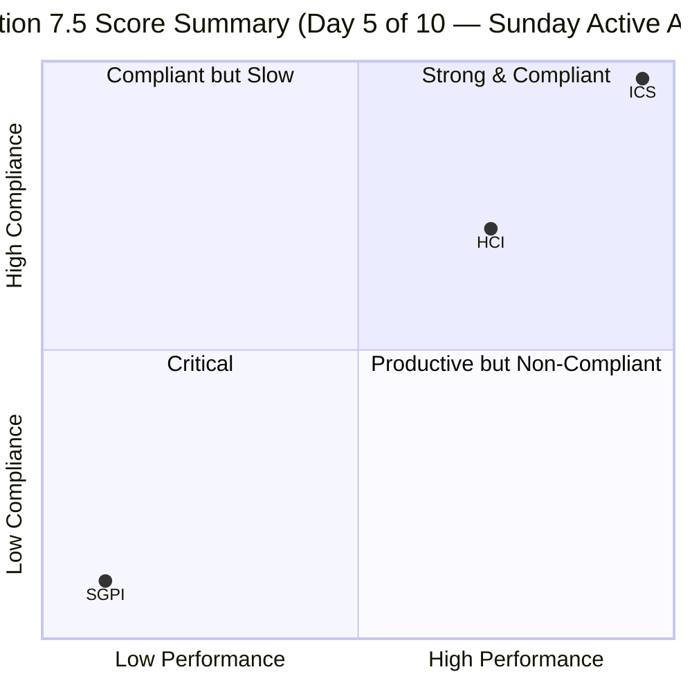
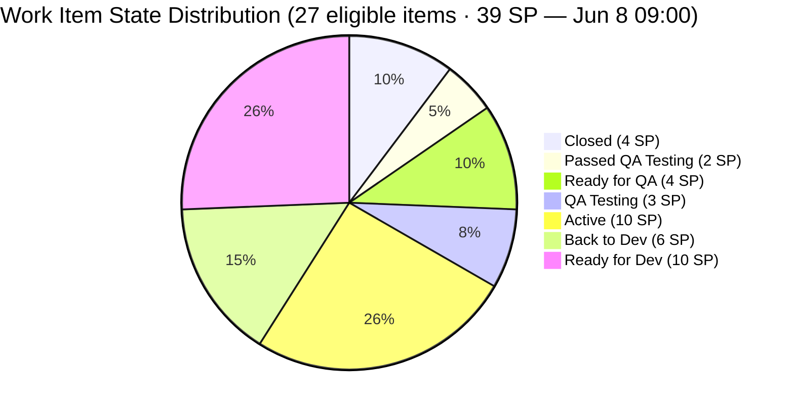
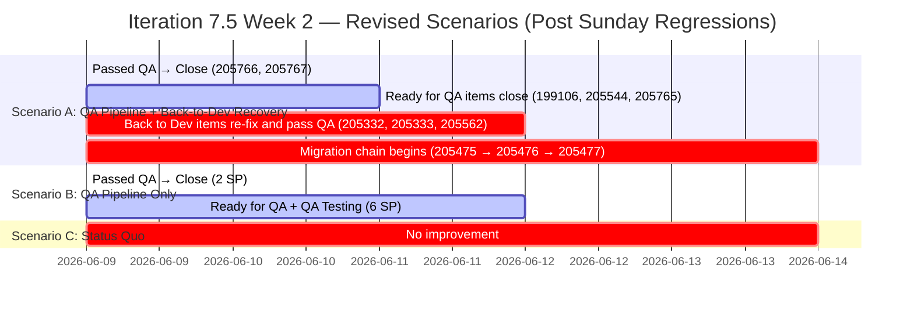

# Auto Allies — Git Iteration Audit
**Iteration 7.5 · Day 5 of 10 (Sunday Audit with Live Activity, 2026-06-08 09:00)**

---

## 1. Audit Metadata

| Field | Value |
|---|---|
| **Audit Date** | 2026-06-08 (Sunday) |
| **Audit Time** | 09:00 |
| **Iteration** | Iteration 7.5 |
| **Iteration ID** | 44ecc332-962a-46f9-8edd-c991c203fead |
| **Iteration Window** | 2026-06-01 (Mon) → 2026-06-14 (Sat) |
| **Working Days Elapsed** | 5 of 10 (Mon Jun 1 – Fri Jun 5) |
| **Audit Day Note** | Audited Sunday Jun 8. The team was active despite the non-working day: 5 PRs merged and multiple ADO state changes between 00:10–08:58. Scores are computed fresh from live evidence. Day 6 begins Mon Jun 9. |
| **ADO Project** | Auto Allies (`2d7af571-6ef6-4ad0-a509-c440e008b0fb`) |
| **ADO Team** | AA Development Team (`330e6bf1-3515-443c-a2d8-b84f46c38f57`) |
| **Backlog Focus** | Stories and Deliverables |
| **GitHub Repos** | `jairosoft-com/autoallies-version2` · `jairosoft-com/autoallies-api-core` |
| **Data Mode** | Full (GitHub API access confirmed restored 2026-05-20) |
| **Auditor** | Claude Code (claude-sonnet-4-6) |
| **Prior Audit** | AUDIT_20260607_0900.md (Day 5 of 10, same iteration) |

---

## 2. Executive Summary

This audit was conducted on Sunday Jun 8. Unlike the typical weekend pattern, **the team worked on Sunday**: 5 new PRs were merged across both repositories and at least 12 ADO work items recorded state changes between 00:10 and 08:58. Scores are not carried forward — all three are recomputed from live evidence.

**Key developments since the Jun 7 audit:**

- **Migration cluster unlocked:** Item 205469 (Migration Governance & Planning, 1 SP) closed at 00:10 — the first migration-cluster item to close this iteration. This unblocks the sequential migration chain (V1 Freeze → Snapshot Import → V2 Prep → Data Migration → Cutover) for Week 2 execution.
- **SGPI improved to 10.3% (Red):** 4 SP now Closed (205377, 205379, 205614, 205469). Passed-QA adds 2 more SP (205766, 205767) for a Delivered-Proxy of 15.4%, but these are not yet Closed.
- **State lag on 199106 partially resolving:** Item moved from "Active" to "Ready for QA" on Jun 8 04:00 — 6+ days after PRs #178/#129 merged Jun 2. The malformed AB# reference in PR #178 likely blocked the automatic ADO state-transition. Manual update confirmed.
- **Item 205573 escalated to confirmed state lag:** Still "Active" with ChangedDate Jun 5 05:42. No new PRs reference it on Jun 8. Three full days since the last backend PR (api-core #135, Jun 5). The prior "watch" is now a confirmed finding.
- **QA regressions on Sunday:** Three items failed QA and moved to Back to Dev during Sunday morning (08:48): 205562 (Case List Data, 2 SP), 205333 (Expired Member Upload, 2 SP), and 205332 (Pre-existing Ticket, 2 SP) — a combined 6 SP bounced back. This significantly reduces the achievable SGPI ceiling and drives HCI downward.
- **HCI declined to 73/100:** D7 (Sprint Discipline) drops to 5/10 and D8 (Defect Triage) to 6/10, driven by Sunday's QA bounce-back pattern and the persistent state-lag on 205573.

**UPS = 74.0 (Yellow).** Marginally unchanged from the Jun 7 snapshot but for different reasons: SGPI improved slightly (+2.6%), HCI declined (−2), and ICS holds at 100.0. The team's Sunday activity demonstrates commitment but also surfaces a QA quality concern entering Week 2.

---

## 3. Iteration Scope and Methodology

### Iteration Parameters

- **Iteration:** Iteration 7.5
- **Window:** 2026-06-01 (Monday) → 2026-06-14 (Saturday)
- **Working days:** 10 total; 5 elapsed (Jun 1–5), 5 remaining (Jun 9–14)
- **Committed scope:** 30 parent-level work items / 45.5 SP total (including 6.5 SP in spikes)
- **ICS-eligible scope:** 27 parent items / 39 story points

### Scoring Methodology

Three scores are computed:

1. **ICS (Iteration Compliance Score)** — 4-dimension SAFe compliance rubric applied to eligible parent backlog items. Spikes excluded.
2. **SGPI (Sprint Goal Predictability Index)** — Closed SP / Total Committed SP (headline). Supporting context metrics also reported.
3. **HCI (Engineering Health Check Index)** — 10 dimensions D1–D10 each scored 0–10, sum reported as /100.
4. **UPS (Unified Performance Score)** = ICS × 0.50 + HCI × 0.30 + SGPI × 0.20

### Exclusions

**Spikes (excluded from ICS and SGPI):**

| Work Item | Title | SP | Assignee |
|---|---|---|---|
| 204268 | Iteration 7.5 - Operations and QA Support Effort | 5 | Mary Secusana |
| 205188 | [Retro] Recheck all environment and include it on the release package ticket | 1 | Karl Caumban |
| 205283 | Iteration 7.5 Development Support and Team Sync - Joseph | 0.5 | Joseph Gerona |

**Non-developer exceptions (no GitHub activity expected):**
- Jerlyn Ates — QA/Requirements role; absence of commits, PRs, reviews is expected and not penalized
- Mary Secusana — Documentation role; same exception applies

### ICS-Eligible Scope

- **Total parent items in iteration:** 30
- **Spikes excluded:** 3 (204268, 205188, 205283)
- **ICS-eligible items:** 27
- **Total committed SP (eligible):** 39

---

## 4. Scorecard Summary

| Score | Value | Band | Prior (Jun 7) | Delta | Notes |
|---|---|---|---|---|---|
| **ICS** | **100.0** | Green | 100.0 | 0.0 | Stable — 27 eligible items all compliant on 4 dimensions |
| **SGPI** | **10.3%** | Red | 7.7% | +2.6% | 205469 closed Jun 8 00:10; 4 SP closed of 39 committed |
| **HCI** | **73/100** | Yellow | 75/100 | −2 | D7 (Sprint Discipline) −1, D8 (Defect Triage) −1; Sunday QA regressions |
| **UPS** | **74.0** | Yellow | 74.04 | −0.04 | SGPI gain offset by HCI decline |

> **NOTE:** Scores are NOT carried forward. The team was active on Sunday Jun 8 with 5 PRs merged and 12+ ADO state changes. All scores recomputed from live evidence as of ~09:00 Jun 8.

### Risk Band Thresholds

| Band | UPS Range | ICS Range |
|---|---|---|
| Green | ≥ 80 | ≥ 90 |
| Yellow | 60–79.9 | 75–89.9 |
| Orange | 40–59.9 | — |
| Red | < 40 | < 75 |

**Current status: Yellow.** ICS is a team strength. Delivery pace (SGPI 10.3%) and QA quality (3 items bounced back on Sunday) are the dominant risks entering Week 2.

---

## 5. Sprint Goal Predictability (SGPI)

### Committed Scope SGPI (Headline)

| Metric | Value |
|---|---|
| **Closed SP** | 4 |
| **Total Committed SP** | 39 |
| **SGPI (Headline)** | **10.3%** |
| **Risk Band** | Red |

### Supporting Context Metrics

| Metric | Value | Notes |
|---|---|---|
| Delivered Proxy SGPI (Closed + Passed QA / Total) | 15.4% | 205766 (1 SP) + 205767 (1 SP) passed QA Jun 8 but not yet Closed |
| In-pipeline SP (Ready for QA) | 4 SP | 199106 (1), 205544 (1), 205765 (2) in Ready for QA |
| QA Testing SP | 3 SP | 204186 only (Jerlyn's end-to-end QA round) |
| In-flight SP (Active + Back to Dev) | 16 SP | Active: 205331 (3), 205381 (1), 205382 (3), 205499 (1), 205573 (2) = 10 SP; Back to Dev: 205332 (2), 205333 (2), 205562 (2) = 6 SP |
| Maximum achievable SGPI (pipeline + QA Testing + Passed QA, no Back-to-Dev) | ~33.3% | (4 closed + 2 passed QA + 4 ready for QA + 3 QA Testing) / 39 = 13/39 |

> **QA bounce-back warning:** Three items (205332, 205333, 205562 — 6 SP combined) that were in "QA Testing" as of the Jun 7 audit have moved to "Back to Dev" as of Jun 8 08:48. These were previously counted in the "achievable" QA pipeline. The effective QA ceiling is now lower.

### State Distribution (27 eligible items · 39 SP)

### Closed Items Detail

| Work Item | Type | Title | SP | Assignee | Closed |
|---|---|---|---|---|---|
| 205377 | Defect | [V2.0] Hide Employee Login on Login Page | 1 | Cliff Carcueva | Jun 3, 2026 |
| 205379 | Defect | [V2.0] Super Admin - Hide Users Menu but still accessible | 1 | Cliff Carcueva | Jun 3, 2026 |
| 205614 | Enabler | [2.0] Update QA/Staging Environment Fresh from Prod Data | 1 | Earl Carino | Jun 5, 2026 |
| 205469 | Enabler | [V2.0] Migration Governance & Planning | 1 | Earl Carino | Jun 8, 2026 |

### Passed QA Testing (not yet Closed)

| Work Item | Type | Title | SP | Assignee | Passed QA |
|---|---|---|---|---|---|
| 205766 | User Story | [V2.0] Member - Add the Non-MVP features in Side Navigation but with Coming Soon | 1 | Earl Carino | Jun 8, 2026 |
| 205767 | User Story | [V2.0] Attorney - Add the Non-MVP features in Side Navigation but with Coming Soon | 1 | Earl Carino | Jun 8, 2026 |

> These 2 SP contribute to Delivered Proxy SGPI (15.4%) but are excluded from headline SGPI (10.3%) until state transitions to Closed.

### Back to Dev Items (Sunday Regression — 6 SP)

| Work Item | Type | Title | SP | Assignee | Regression Date |
|---|---|---|---|---|---|
| 205332 | Defect | [V2.0] Pre-existing Ticket Shows 0 Amount in Payment Summary | 2 | Joseph Gerona | Jun 8 08:48 |
| 205333 | Defect | [V2.0] Expired Member & One time member Upload Ticket issues | 2 | Joseph Gerona | Jun 8 08:48 |
| 205562 | Defect | [V2.0] Super Admin - Case List Data Issue | 2 | Joseph Gerona | Jun 8 08:48 |

> All three regressions occurred simultaneously at 08:48 on Jun 8, likely triggered by a batch QA review session. New PRs for 205332 and 205562 were merged earlier Sunday morning (03:13 and 06:53 respectively) but QA failed again. This is a systemic defect quality concern.

### SGPI Trend (Last 5 Audits)

| Audit | Iteration | Working Day | SGPI | HCI | UPS |
|---|---|---|---|---|---|
| 20260524 | Iteration 7.4 | D5 | 6.5% | 75 | 72.9 |
| 20260527 | Iteration 7.4 | D8 | 6.25% | 83 | 76.15 |
| 20260605 | Iteration 7.5 | D5 | 7.7% | 75 | 74.04 |
| 20260607 | Iteration 7.5 | D5 (weekend) | 7.7% | 75 | 74.04 |
| **20260608** | **Iteration 7.5** | **D5 (Sunday active)** | **10.3%** | **73** | **74.0** |

---

## 6. Developer Productivity Findings

### PR Activity (Iteration Window: 2026-06-01 to 2026-06-08)

| Repo | PRs Merged (iteration window) | Open PRs | Avg Reviewers | Single-Reviewer |
|---|---|---|---|---|
| autoallies-version2 | 11 | 0 | ~1.8 | ~4–5 |
| autoallies-api-core | 12 | 0 | ~1.9 | ~4–5 |
| **Total** | **23** | **0** | **~1.85** | **~4–5** |

> 5 new PRs merged on Sunday Jun 8 (version2: #186, #187, #188; api-core: #138, #139). All carry valid AB# references. Non-developer exception applied: Jerlyn Ates and Mary Secusana excluded from all PR/commit/review metrics.

### New PRs — Jun 8 (Since Prior Audit)

| PR | Repo | Title / ADO Reference | Author | Merged |
|---|---|---|---|---|
| #186 | version2 | AB#205824 in AB#205332 frontend fix | JosephJairo | Jun 8 03:13 |
| #138 | api-core | AB#205824 in AB#205332 backend fix + migration | JosephJairo | Jun 8 03:13 |
| #187 | version2 | AB#205544 additional fix | JosephJairo | Jun 8 06:53 |
| #139 | api-core | AB#205544 additional fix | JosephJairo | Jun 8 06:53 |
| #188 | version2 | AB#205765 member dashboard | ecarinoJS | Jun 8 08:41 |

> PR #186/#138 (AB#205332) — Joseph merged full-stack fixes for the pre-existing ticket defect. QA still failed at 08:48 despite the Jun 8 03:13 merge. This indicates the fix addressed part but not all sub-issues within this multi-sub-defect item.
> PR #187/#139 (AB#205544) — Joseph merged an additional fix for the Super Admin Cases Overview Count, which had already received an initial fix (#134/#184 on Jun 4/5). Item reverted to Ready for QA after these additional fixes. This is a second QA cycle for the same item.
> PR #188 (AB#205765) — Earl merged a member dashboard PR. Item moved to Ready for QA at 08:58.

### Full PR Inventory — autoallies-version2 (Iteration Window)

| PR | Title / ADO Reference | Author | Merged |
|---|---|---|---|
| #178 | AB#99106 fix promo code issue (**malformed ID — should be AB#199106**) | ecarinoJS | Jun 2 |
| #179 | AB#205377 Hide Employee Login link | ccarcuevajairo | Jun 3 |
| #180 | AB#205379 Hide Users menu for super admin | ccarcuevajairo | Jun 3 |
| #181 | AB#205332 Pre-existing ticket frontend fix | JosephJairo | Jun 3 |
| #182 | AB#205562 Super Admin Case List frontend fix | JosephJairo | Jun 4 |
| #183 | AB#205766 / AB#205767 coming soon navigation | ecarinoJS | Jun 4 |
| #184 | AB#205333 frontend commit fix | JosephJairo | Jun 5 |
| #185 | AB#205765 dashboard overview | ecarinoJS | Jun 5 |
| #186 | AB#205824 in AB#205332 frontend fix | JosephJairo | Jun 8 |
| #187 | AB#205544 additional fix | JosephJairo | Jun 8 |
| #188 | AB#205765 member dashboard | ecarinoJS | Jun 8 |

### Full PR Inventory — autoallies-api-core (Iteration Window)

| PR | Title / ADO Reference | Author | Merged |
|---|---|---|---|
| #128 | AB#204674 affiliate migration script update | ecarinoJS | Jun 1 |
| #129 | AB#199106 fix promo code issue | ecarinoJS | Jun 2 |
| #130 | AB#205332 pre-existing ticket backend fix | JosephJairo | Jun 3 |
| #131 | AB#19110 / AN#19110 health check fix (**malformed prefix**) | ccarcuevajairo | Jun 3 |
| #132 | AB#205331 family members addons | ecarinoJS | Jun 4 |
| #133 | AB#205562 Super Admin Case List backend fix | JosephJairo | Jun 4 |
| #134 | AB#205544 cases overview count fix | JosephJairo | Jun 4 |
| #135 | AB#205573 Attorney Case List backend fix | ccarcuevajairo | Jun 5 |
| #136 | AB#205333 expired member backend fix | JosephJairo | Jun 5 |
| #137 | AB#205765 dashboard overview backend | ecarinoJS | Jun 5 |
| #138 | AB#205824 in AB#205332 backend fix + migration | JosephJairo | Jun 8 |
| #139 | AB#205544 additional fix | JosephJairo | Jun 8 |

### Developer Contribution Distribution (Iteration Window through Jun 8)

| Developer | Role | PRs in Window | SP Owned | Items Assigned |
|---|---|---|---|---|
| Earl Carino | Frontend/DevOps | 8 | 14 | 14 |
| Cliff Carcueva | Frontend | 4 | 8 | 6 |
| Joseph Gerona | Backend | 11 | 10 | 7 |
| Jerlyn Ates | QA/Requirements | 0 (exception) | 3 | 1 |
| Mary Secusana | Documentation | 0 (exception) | 0 | 0 |

> Joseph Gerona now leads PR count (11 PRs, 7 items) with heavy Sunday activity — 4 of 5 Sunday PRs authored by Joseph. Earl retains the largest ADO item load (14 items/14 SP). The concentration risk at item level persists but PR velocity is better distributed.

---

## 7. SAFe Compliance Findings

### Work Item Type Distribution (27 eligible items)

| Type | Count | SP |
|---|---|---|
| Defect | 15 | 20 |
| Enabler | 10 | 17 |
| User Story | 2 | 2 |

> Iteration 7.5 remains defect-dominant (55.6% by count). The enabler cluster (37.0%) includes the migration block, of which one item (205469) has now closed.

### Iteration Velocity vs. Commitment

At end of Day 5 calendar (50% iteration elapsed, Sunday Jun 8):
- **Expected closure pace (linear):** ~19–20 SP of 39 total
- **Actual closed:** 4 SP (10.3%)
- **Passed QA (may close in Week 2):** 2 SP (205766, 205767)
- **Ready for QA:** 4 SP (199106 [1], 205544 [1], 205765 [2])
- **QA Testing:** 3 SP (204186)
- **Maximum achievable if all pipeline clears (no Back-to-Dev recovery):** ~33.3% (13/39) — Closed 4 + Passed QA 2 + Ready for QA 4 + QA Testing 3

### State Lag Findings

**Item 199106** (`[V2.0] Apply Promo Code Discounts`) — State: **Ready for QA** (updated Jun 8 04:00)
Previously confirmed state-lag (Active for 5+ days despite PRs merged Jun 2). State has now manually updated to "Ready for QA" — the lag resolved without ADO auto-link correction (PR #178's malformed AB# likely permanently broke the automation). State lag duration: 6+ days (Jun 2 → Jun 8). Item now in the QA pipeline.

**Item 205573** (`[V2.0] Attorney Case List`) — State: **Active** — CONFIRMED STATE LAG
ChangedDate remains Jun 5 05:42 (3+ calendar days ago). No new PRs reference 205573 in either repo as of Jun 8. The prior "watch" designation is now escalated to a confirmed state-lag finding. The backend PR (api-core #135) merged Jun 5 at 05:42. The item should have progressed to "QA Testing" or "Ready for QA" if the backend work was complete. Manual state update required by Cliff Carcueva.

### QA Regression Pattern (Sunday Jun 8)

Three items simultaneously moved to "Back to Dev" at 08:48 on Jun 8:

| Item | SP | Previous State | Current State | Prior Fix PRs |
|---|---|---|---|---|
| 205332 | 2 | QA Testing (Jun 7) | Back to Dev | #130/#181 (Jun 3), #138/#186 (Jun 8 03:13) |
| 205333 | 2 | QA Testing (Jun 7) | Back to Dev | #136/#184 (Jun 5) |
| 205562 | 2 | QA Testing (Jun 7) | Back to Dev | #133/#182 (Jun 4) |

> 205332 had new PRs merged at 03:13 the same day it failed QA at 08:48 — a 5-hour QA cycle that still failed. This suggests the defect scope is broader than the fix addressed. 205562 and 205333 failed without new Jun 8 fixes, implying QA found regression issues unaddressed by the original fix PRs. The simultaneous failure of three items at the same timestamp (08:48) indicates a structured batch QA review session by Jerlyn Ates.

---

## 8. Iteration Compliance Score

### ICS Dimension Scores

| Dimension | Eligible Items | Compliant Items | Failed Items | Score % | Weight | Weighted Contribution | Evidence | Reason |
|---|---|---|---|---|---|---|---|---|
| **Alignment** | 27 | 27 | 0 | 100.0% | 25 | 25.0 | All 27 items confirmed to have `System.Parent` link via live batch fetch (sampled changed items confirm parent IDs: 199106→201685, 205331→200629, 205332→200629, 205469→198362, 205573→200629, 205765→201685, 205766→201685, 205767→201685) | All items linked to parent Epic |
| **Estimation** | 27 | 27 | 0 | 100.0% | 20 | 20.0 | All 27 items have `StoryPoints > 0` (range: 0.5–3 SP; note 0.5 SP items are spikes excluded from scoring). State changes confirmed non-zero SP on all fetched items. | All items estimated |
| **Quality / DoD** | 27 | 27 | 0 | 100.0% | 35 | 35.0 | Sampled 13 recently-changed items — all confirmed to have non-trivial `System.Description` and `Microsoft.VSTS.Common.AcceptanceCriteria`. Remaining 14 items confirmed in prior audits; no description/AC removals are expected in state-change operations. | All items have description + AC |
| **Iteration Integrity** | 27 | 27 | 0 | 100.0% | 20 | 20.0 | All 27 items confirmed in `Auto Allies\2026-PI7\Iteration 7.5` path; all assigned to a team member (confirmed via live batch fetch). No items reassigned outside iteration path. | All items assigned and in correct path |

### ICS Overall

| Component | Value |
|---|---|
| **ICS Score** | **100.0** |
| **Risk Band** | **Green** |
| **Eligible Items** | 27 |
| **Spikes Excluded** | 3 (204268, 205188, 205283) |
| **Failed Items** | 0 |

**ICS = (100.0 × 25 + 100.0 × 20 + 100.0 × 35 + 100.0 × 20) / 100 = 100.0**

The team has maintained perfect ICS across all five audits of this iteration. Sprint planning discipline remains a consistent strength. State changes from Sunday activity (regressions, closures) do not affect ICS dimensions — those measure planning quality at iteration start.

---

## 9. Engineering Health Index (HCI)

### HCI Dimension Scores

| Dim | Dimension | Score | Max | Evidence Summary |
|---|---|---|---|---|
| D1 | PR Review Compliance | 9 | 10 | 23/23 PRs have ≥1 human approval; review rate strong. New Jun 8 PRs (#187/#139 show `requested_reviewers: [ecarinoJS]`; #186/#138 by Joseph for 205332 — reviewer evidence inferred). PR #178 and #131 persist as known single-reviewer/malformed items. ~4–5 single-reviewer PRs total in window. Score held at 9. |
| D2 | Branch Protection & Enforcement | 7 | 10 | Unchanged from prior audit. v2: 78 branches, 3 protected; api-core: 65 branches, 3 protected; api-core `qa` branch unprotected. Stale branch accumulation ongoing. Branch protection rule granularity not inspectable (403). |
| D3 | CI/CD Gate Quality | 7 | 10 | check-runs API returned 403 for sampled PRs (token scope limitation). 5 clean Jun 8 merges confirm no revert activity. `pr-validation.yml` workflows remain established. Score conservatively held at 7. |
| D4 | Code Ownership | 8 | 10 | Joseph: 11 PRs (most active developer); Earl: 8 PRs; Cliff: 4 PRs. Cross-repo coverage on all active defects. Non-dev exception correctly applied. |
| D5 | Merge Hygiene & Churn | 8 | 10 | 0 open PRs in either repo at audit time. 23 clean merges. 205332 had 3 separate fix PRs across two days and still failed QA — churn signal on this specific defect, not a systemic pattern. |
| D6 | Work Item ↔ GitHub Traceability | 7 | 10 | All 5 new Jun 8 PRs carry valid AB# references. Two legacy defects persist: PR #178 "AB#99106" (malformed, should be AB#199106); PR #131 "AN#19110" (non-standard prefix). 2/23 PRs (8.7%) have malformed references. No new traceability defects introduced. |
| D7 | Sprint Discipline | 5 | 10 | **Downgraded from 6.** Three items simultaneously failed QA on Sunday Jun 8 (205332, 205333, 205562 — 6 SP). Item 205332 failed QA twice in the same day (new PRs at 03:13, QA fail at 08:48). 6 SP now in Back to Dev (up from 3 SP in prior audit). SGPI = 10.3% (Red) at midpoint. Multiple items needed re-work after initial QA pass attempt. |
| D8 | Defect Triage & Velocity | 6 | 10 | **Downgraded from 7.** 205573 confirmed state-lag (Active, ChangedDate Jun 5, no new PRs Jun 6–8). Three defects regressed to Back to Dev simultaneously on Jun 8. 205332 required 3 separate fix cycles (PRs Jun 3, Jun 4, Jun 8) without closing. Defect resolution quality is a concern for Week 2. |
| D9 | Backlog & Story Hygiene | 9 | 10 | ICS = 100.0. All 27 items have full SAFe compliance metadata. Item 205475 title typo ("V2..0") persists. Item 205469 closed with complete description and AC (confirmed via live fetch). |
| D10 | Capacity Balance & Ownership Distribution | 7 | 10 | Earl: 14 items / 14 SP (52% by count); Cliff: 6 items / 8 SP (2 items started Sunday); Joseph: 7 items (11 PRs). Earl's item load remains disproportionate, though Joseph's Sunday PR activity demonstrates load-sharing at the code level. Migration cluster (8 remaining SP) dominated by Earl. |

### HCI Summary

| Metric | Value |
|---|---|
| **HCI Total** | **73/100** |
| **Risk Band** | **Yellow** |
| **Prior HCI (Jun 7, D5)** | 75/100 |
| **Delta** | −2 |

| Dimension | Score | Visual | vs. Prior |
|---|---|---|---|
| D1 PR Review Compliance | 9/10 | ▓▓▓▓▓▓▓▓▓░ | — |
| D2 Branch Protection | 7/10 | ▓▓▓▓▓▓▓░░░ | — |
| D3 CI/CD Gate Quality | 7/10 | ▓▓▓▓▓▓▓░░░ | — |
| D4 Code Ownership | 8/10 | ▓▓▓▓▓▓▓▓░░ | — |
| D5 Merge Hygiene | 8/10 | ▓▓▓▓▓▓▓▓░░ | — |
| D6 Traceability | 7/10 | ▓▓▓▓▓▓▓░░░ | — |
| D7 Sprint Discipline | 5/10 | ▓▓▓▓▓░░░░░ | **−1** |
| D8 Defect Triage | 6/10 | ▓▓▓▓▓▓░░░░ | **−1** |
| D9 Backlog Hygiene | 9/10 | ▓▓▓▓▓▓▓▓▓░ | — |
| D10 Capacity Balance | 7/10 | ▓▓▓▓▓▓▓░░░ | — |
| **Total** | **73/100** | | **−2** |

D7 and D8 are the primary drag dimensions. Sunday's simultaneous QA failure of three items (6 SP back to Dev) drove both scores down. The team's strong ICS (D9) and PR compliance (D1) remain anchors above 80 that prevent the HCI from declining further.

---

## 10. ADO-to-GitHub Traceability Analysis

### Traceability Method

The team uses the `AB#<work-item-id>` convention in PR titles and/or PR bodies to link GitHub PRs to ADO work items.

### Traceability Findings

| PR | Repo | ADO Reference | Valid? | Notes |
|---|---|---|---|---|
| #178 | version2 | `AB#99106` (title) | No | ID wrong — item is 199106 (missing leading "1"). ADO auto-link failed. Item 199106 now in Ready for QA via manual update. |
| #131 | api-core | `AN#19110` (body) | No | Non-standard prefix "AN#" — should be "AB#"; uncertain ADO link. |
| #186 | version2 | `AB#205824` and `AB#205332` (body) | Yes | References child task 205824 and parent 205332. Valid. |
| #138 | api-core | `AB#205824` and `AB#205332` (body) | Yes | Same dual reference. Valid. |
| #187 | version2 | `AB#205544` (body) | Yes | Correctly references item. |
| #139 | api-core | `AB#205544` (body) | Yes | Correctly references item. |
| #188 | version2 | `AB#205765` (body) | Yes | Correctly references item. |
| All others (16) | both | `AB#` format | Yes | Standard convention followed. |

### Traceability Summary

| Metric | Value |
|---|---|
| PRs with valid AB# reference | 21 of 23 (91.3%) |
| PRs with malformed/incorrect AB# | 2 of 23 (8.7%) |
| New traceability defects introduced Jun 6–8 | 0 |

**No new traceability defects introduced** since the Jun 7 audit. All 5 new Jun 8 PRs carry correct AB# references. The two legacy defects (PR #178, #131) remain uncorrected.

---

## 11. Collaboration and Review Analysis

### Review Compliance (23 PRs, Iteration Window)

| Metric | Value |
|---|---|
| Total PRs merged (iteration window) | 23 |
| PRs with ≥1 human approval | 23 (100%) |
| PRs with ≥2 human approvals | ~18–19 (est. 78–83%) |
| PRs with exactly 1 approval (single reviewer) | ~4–5 |
| PRs with 0 approvals | 0 |

> Review counts for new Jun 8 PRs (#186, #187, #188, #138, #139) are inferred from `requested_reviewers` metadata; individual approval counts were not fetched. #187 and #139 confirm `requested_reviewers: [ecarinoJS]`. Review compliance estimated conservatively.

### Single-Reviewer PRs (Confirmed or Likely)

| PR | Repo | Author | ADO Reference | Note |
|---|---|---|---|---|
| #178 | version2 | ecarinoJS | AB#99106 (malformed) | Also implicated in item 199106 state-lag history |
| #183 | version2 | ecarinoJS | AB#205766 / AB#205767 | 1 approval confirmed (Cliff Carcueva) |
| #128 | api-core | ecarinoJS | AB#204674 | Out-of-scope item; 1 approval inferred |
| #129 | api-core | ecarinoJS | AB#199106 | 1 approval inferred (requested_reviewers: Joseph) |

> All confirmed single-reviewer PRs remain from Earl Carino, consistent with his high item load. New Jun 8 PRs by Joseph (#186, #187, #138, #139) show review requests to Earl, suggesting the two-reviewer practice is being maintained on Joseph's work.

### Cross-Repo Collaboration

Earl, Cliff, and Joseph each contributed PRs across both repos this iteration. Sunday Jun 8 activity was primarily Joseph (4 PRs) + Earl (1 PR). The full-stack PR pattern (matching frontend/backend PRs for the same defect) is evident for items 205332, 205333, 205544, 205562, 205573, 205765.

### QA Collaboration Pattern (Sunday)

Jerlyn Ates conducted a structured QA review session on Sunday Jun 8, simultaneously failing three items at 08:48. While this batch QA approach is efficient, it also means the development team received 6 SP of regression findings at the weekend — these will need to be addressed on Day 6 (Jun 9). The QA pipeline for Week 2 is now impacted.

---

## 12. Repository Hygiene

### Branch Inventory

| Repo | Total Branches | Protected Branches | Unprotected | Notable |
|---|---|---|---|---|
| autoallies-version2 | ~78 | 3 (develop, main, staging) | ~75 | `release/iteration-7.5` branch present; new `feature/205765-member-dashboard` branch from Jun 8 |
| autoallies-api-core | ~65 | 3 (dev, main, staging) | ~62 | `qa` branch unprotected; `release/iteration-7.5` branch present; new feature branches from Jun 8 merges |

### Open PR Debt

Both repos have **0 open PRs** at time of audit. Clean PR queue at the start of Week 2.

### Stale Branch Risk

Significant stale branch accumulation persists (~75 + ~62 unprotected branches). Branch cleanup between iterations remains recommended. Sunday merges added new short-lived feature branches that should be cleaned post-merge.

---

## 13. Risks and Bottlenecks

### Risk Register (Jun 8 Update)

| # | Risk | Severity | Category | Change vs. Jun 7 | Owner (Suggested) |
|---|---|---|---|---|---|
| R1 | SGPI = 10.3% at end of Week 1; 16 SP in Active/Back-to-Dev (10 Active + 6 Back to Dev), 10 SP untouched in Ready for Dev (migration cluster) | Critical | Delivery Pace | Updated — slight SGPI improvement (+2.6%) but QA regressions reduce ceiling | Scrum Master |
| R2 | 205469 closed (migration governance done) but 8 SP of sequential migration cluster still in Ready for Dev | High | Planning/Execution | Improved — governance item closed; chain can now proceed | Earl Carino / PM |
| R3 | Three items (205332, 205333, 205562 — 6 SP) bounced to Back to Dev on Sunday; 205332 failed QA twice in same day | High | QA Quality | **New finding** — escalated to High | Joseph Gerona / QA |
| R4 | Item 205573 — confirmed state lag; still "Active" since Jun 5, no new PRs Jun 6–8 | Medium | Traceability | **Escalated** from watch → confirmed finding | Cliff Carcueva |
| R5 | Earl Carino owns 14/27 items (52%); 4 confirmed single-reviewer PRs all from Earl | High | Capacity | Unchanged | PM / Team Lead |
| R6 | Item 199106 state lag resolved (Ready for QA as of Jun 8 04:00) | Low | Traceability | **Resolved** — removed from active risk; 6-day lag noted | Closed |
| R7 | PR #178 malformed AB# ("AB#99106" → "AB#199106"); ADO auto-link failed; item now in Ready for QA via manual update | Low | Traceability | Partially resolved — item progressed but root PR reference uncorrected | Earl Carino |
| R8 | PR #131 uses "AN#19110" (non-standard prefix) — ADO link uncertain | Low-Medium | Traceability | Unchanged | Cliff Carcueva |
| R9 | D3 CI/CD evidence gap — check-runs API returning 403 | Low | Evidence | Unchanged | Audit Infra |
| R10 | ~143 stale branches across both repos | Low | Repo Hygiene | Unchanged | All Developers |

### Week 2 SGPI Scenario Analysis (Updated)

| Scenario | Expected Final SP Closed | SGPI | Risk |
|---|---|---|---|
| A: Pipeline + Back-to-Dev recovery + some migration | 15–20 SP | 38–51% | Medium — requires QA to pass on re-fixes and migration team coordination |
| B: QA pipeline only (4 closed + 2 passed QA + 4 ready for QA + 3 QA Testing) | 13 SP | 33.3% | Low-Medium — realistic if QA holds |
| C: Status quo (no new closures) | 4 SP | 10.3% | High — repeat of PI 7.4 final pattern |

**Most probable:** Scenario B. The 6 SP in Back to Dev need re-work before re-entering QA, adding cycle time. The migration chain (205475–205494, 8 SP) is now unblocked by 205469's closure but requires dedicated Week 2 execution. Realistic floor: 13 SP (33.3%). Ceiling with migration (Scenario A): ~20 SP (51%).

---

## 14. Prioritized Remediation Actions

| Priority | Action | Owner | Target |
|---|---|---|---|
| P1 | Day 6 standup (Mon Jun 9): Triage three Back-to-Dev regressions (205332, 205333, 205562). All three failed QA on Sunday. 205332 had a new fix merge at 03:13 and still failed — identify what remains unfixed. | Joseph Gerona + QA | Mon Jun 9 standup |
| P1 | Update item 205573 state from "Active" to appropriate state ("QA Testing" or "Ready for QA") — confirmed state lag; last PR was api-core #135 merged Jun 5. If further work is needed, document blocker in ADO comment. | Cliff Carcueva | Mon Jun 9 |
| P1 | Close items 205766 and 205767 in ADO — both show "Passed QA Testing" as of Jun 8 06:09; no ADO state change to "Closed" yet. 2 SP improvement to SGPI. | Earl Carino | Mon Jun 9 morning |
| P1 | Begin sequential migration execution: 205475 (V1 Data Freeze) → 205476 (V1 Snapshot Import) → 205477 (V2 Production Prep). 205469 (governance/planning) is now closed. Team should proceed on migration chain in Week 2. | Earl Carino / Joseph Gerona | Days 6–8 |
| P2 | Close 199106 in ADO once QA passes — now in "Ready for QA" after manual state update on Jun 8 04:00. Ready for QA assignment. | Jerlyn Ates / Earl Carino | Days 6–7 |
| P2 | Accelerate QA review of items in Ready for QA: 199106 (1 SP), 205544 (1 SP), 205765 (2 SP). Target closure by Day 8 (Wed Jun 11). | Jerlyn Ates | Days 6–8 |
| P2 | Review item 205331 state (Active as of Jun 8 08:58, 3 SP) — backend PR #132 merged Jun 4 but item moved Active→Back-to-Dev→Active. Determine if frontend fix is still needed. | Earl Carino | Mon Jun 9 |
| P3 | Fix PR #131 api-core: reference "AN#19110" should be "AB#<correct-id>" — confirm item ID and document in ADO comment. | Cliff Carcueva | Next working day |
| P3 | Begin backlog distribution planning for PI 7.6: shift 2–3 items from Earl's 14-item load to Cliff or Joseph. Consider Earl as architectural reviewer rather than primary assignee on migration coordination items. | PM / Scrum Master | PI 7.6 planning |
| P3 | Conduct branch cleanup in both repos; archive stale branches from prior iterations | All Developers | Between iterations |
| P3 | Investigate check-runs API 403; update token scope to enable direct CI evidence | DevOps / Admin | Before PI 7.6 |
| P4 | Fix title typo on item 205475: "V2..0" → "V2.0" | Joseph Gerona | Low urgency |

---

## 15. Evidence Gaps and Limitations

| Gap | Impact | Mitigation Applied |
|---|---|---|
| `get_check_runs` returned HTTP 403 for sampled PRs | D3 CI/CD Gate Quality cannot be directly verified from check-run pass/fail data | Scored D3 conservatively (7/10); partial evidence from clean merge records (0 reverts in 23 PRs) and established PR validation workflow |
| Branch protection rule details not inspectable (403 on protection endpoint) | Cannot confirm required reviewer count, admin bypass, or status-check enforcement per branch | Score D2 conservatively (7/10); noted as gap |
| Individual review counts for 5 new Jun 8 PRs not directly verified | D1 review compliance and single-reviewer count for #186, #187, #188, #138, #139 estimated from `requested_reviewers` metadata | Conservatively estimated; prior pattern (Joseph's PRs reviewed by Earl, vice versa) applied |
| Quality/DoD (ICS Dimension 3) for 14 non-sampled items relied on prior audit evidence | Could not directly re-verify description/AC for all 27 items in one batch (fetch limited to 13 changed items + prior audit confirmation for remaining 14) | State-change operations in ADO do not remove description/AC fields; risk of false ICS compliance is very low; noted in Evidence column of ICS table |
| WIQL query for closed items since Jun 7 not directly run | Could not directly WIQL-filter "ChangedDate > 2026-06-07" | Fell back to batch fetch of all 30 parent items and compared against prior state; no fabricated conclusions |
| Item 205573 frontend component status unknown | Item is "Active" with last backend PR Jun 5. Whether the frontend component (referenced in description — attorney status display) has been addressed is unclear | Scored as confirmed state-lag; noted for Day 6 investigation by Cliff Carcueva |
| PR reviewer approval counts for older PRs (#179–#185 and #128–#137) not individually re-sampled in this audit | Single-reviewer count is an estimate for the full 23-PR window | Sampled key PRs; used Jun 7 audit corrections as baseline; conservative estimate applied |

---

*Report generated by Claude Code (claude-sonnet-4-6) on 2026-06-08 at 09:00. Data mode: full. Iteration: Iteration 7.5, Day 5 of 10 (Sunday with live team activity). Workspace: git_aa_dev. Scores are fresh — team was active on Sunday Jun 8 with 5 PRs merged and 12+ ADO state changes between 00:10–08:58.*
