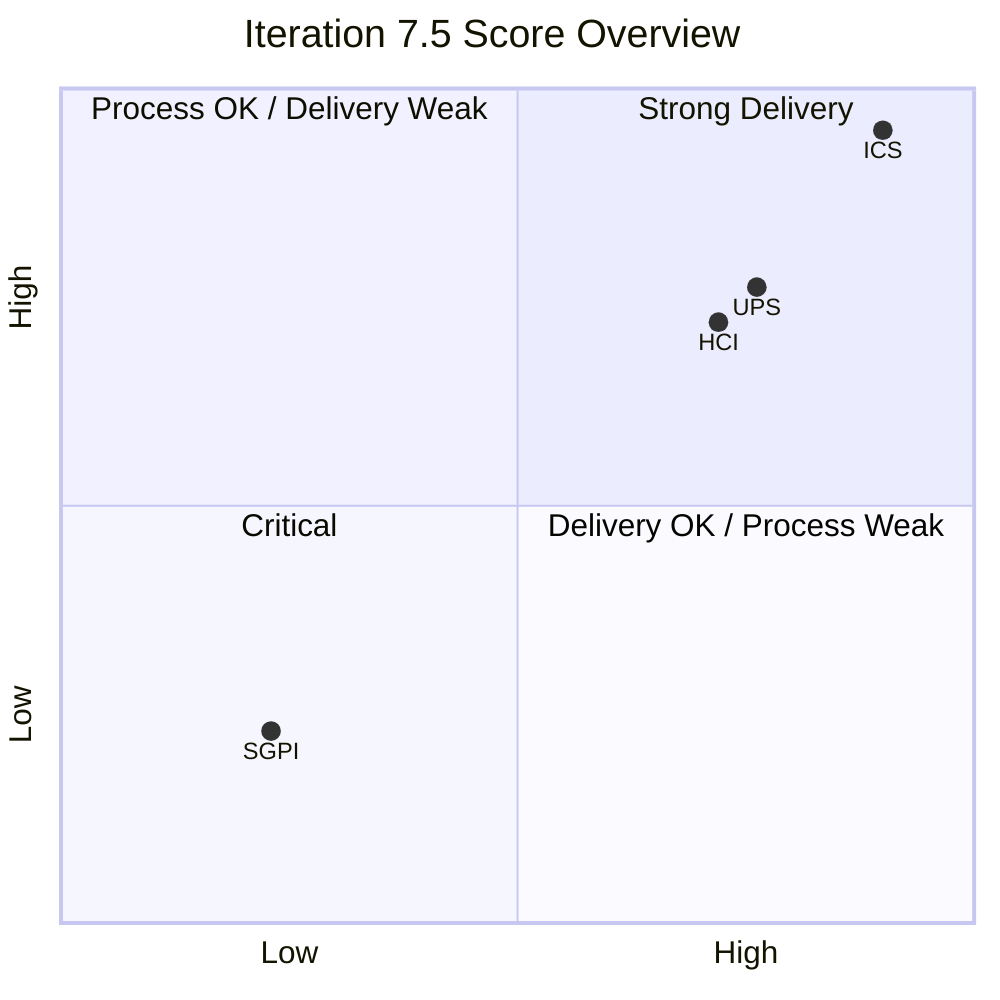
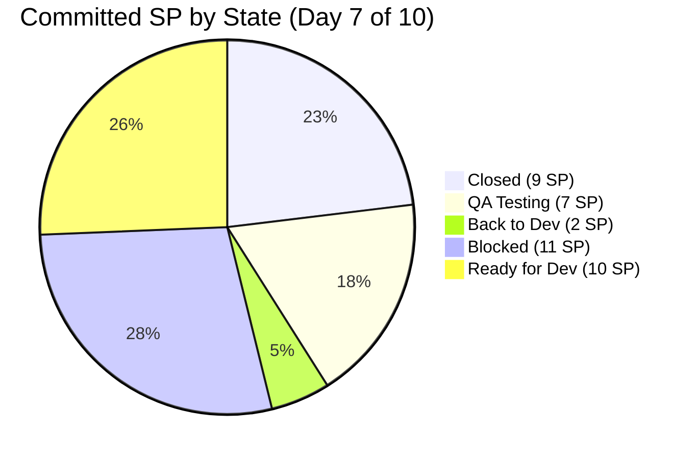
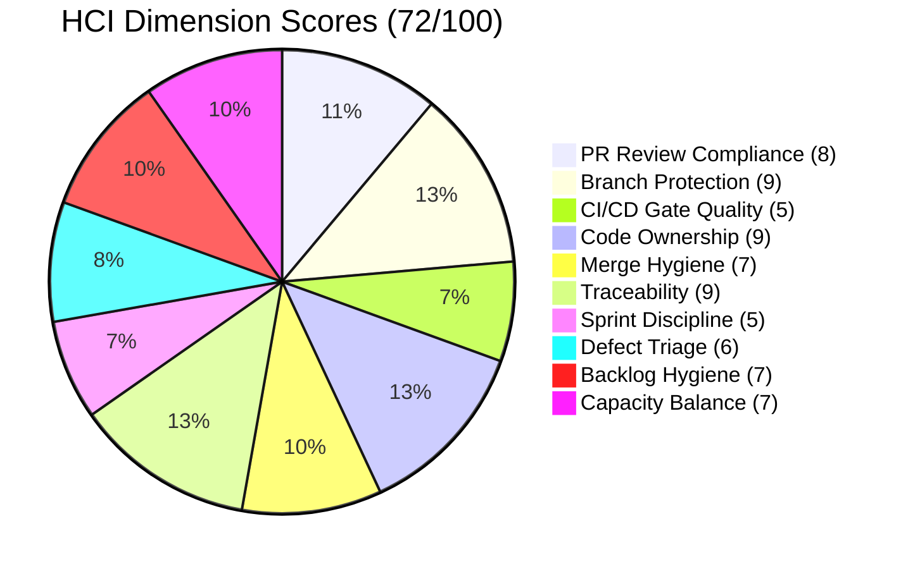
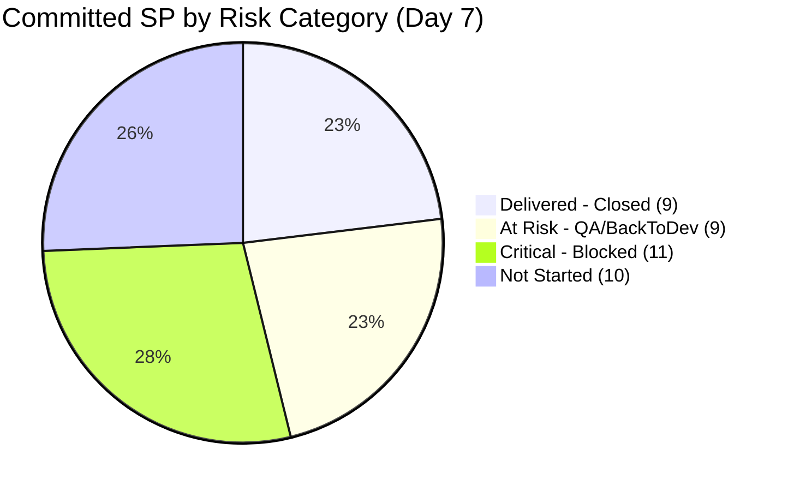

# Auto Allies — SAFe Iteration Audit
**AUDIT_20260609_0204.md**

---

## 1. Audit Metadata

| Field | Value |
|---|---|
| **Audit Date** | 2026-06-09 |
| **Audit Time** | 02:04 UTC |
| **Iteration** | 7.5 |
| **Iteration Window** | 2026-06-01 to 2026-06-14 |
| **Day in Iteration** | Day 7 of 10 working days |
| **ADO Team** | AA Development Team |
| **ADO Project** | Auto Allies (`2d7af571-6ef6-4ad0-a509-c440e008b0fb`) |
| **ADO Team ID** | `330e6bf1-3515-443c-a2d8-b84f46c38f57` |
| **ADO Iteration ID** | `44ecc332-962a-46f9-8edd-c991c203fead` |
| **GitHub Repos** | `jairosoft-com/autoallies-version2`, `jairosoft-com/autoallies-api-core` |
| **Prior Audit** | AUDIT_20260527_0246.md (Iteration 7.4, Day 8) |
| **Auditor** | Claude Code (git_iteration_audit skill) |
| **Data Mode** | Full (GitHub token access restored 2026-05-20) |

### Score Summary

| Score | Value | Band |
|---|---|---|
| **ICS** (Iteration Compliance Score) | **100.0** | Green |
| **SGPI** (Sprint Goal Predictability Index) | **23.1%** | Red |
| **HCI** (Engineering Health Index) | **72 / 100** | Yellow |
| **UPS** (Unified Portfolio Score) | **76.2** | Yellow |

---

## 2. Executive Summary

Iteration 7.5 presents a structural compliance paradox: the team achieves a perfect ICS of 100.0 (all 27 eligible items are assigned, estimated, documented, and in-path), yet SGPI is 23.1% at Day 7 of 10 — with only 9 of 39 committed story points Closed. The primary delivery blocker is an elevated Blocked count: five items totaling 11 SP are in Blocked state despite four of the five having merged code in the iteration window. This indicates systemic state-lag or downstream QA/verification bottlenecks rather than absent development work.

GitHub engineering health is strong: 24 PRs merged this iteration, all with live human approvals, active cross-review rotation, and AB# traceability on 23 of 24 PRs. Both default branches carry branch protection. Three PRs received only one human approval rather than two, and CI/CD gate evidence was inaccessible (403 on check runs endpoint), representing the primary HCI gaps.

Sprint delivery is the primary risk for Iteration 7.5. At Day 7 of 10, only 23.1% of committed SP is Closed. Even with 17.9 SP in QA Testing and 5.1 SP Back-to-Dev, a full delivery recovery is unlikely without immediate unblocking. The team must resolve Blocked items (205331, 205382, 205544, 205562, 205573) and update ADO states for items with merged code.

**Delta from prior audit (Iteration 7.4):**
- ICS: 100.0 → 100.0 (maintained)
- HCI: 83 → 72 (−11, driven by Sprint Discipline and Defect Velocity)
- SGPI: 6.25% on Day 8 → 23.1% on Day 7 (higher raw delivery but lower relative to larger commitment base)
- Blocked items: 0 → 5 (new risk pattern)

---

## 3. Iteration Scope and Methodology

### ADO Scope

- **Iteration Path:** Auto Allies\Iteration 7\Iteration 7.5
- **Backlog:** Stories and Deliverables (`Microsoft.RequirementCategory`)
- **Items in scope:** Parent-level work items assigned to iteration; child tasks excluded from ICS scoring
- **Total parent items fetched:** 30
- **Spike items (excluded from ICS/SGPI):** 3 — IDs 204268, 205283, 205188
- **ICS-eligible items:** 27

### GitHub Scope

- **Repositories:** `autoallies-version2` (frontend), `autoallies-api-core` (backend)
- **PR window:** Merged at 2026-06-01T00:00:00Z to 2026-06-09T23:59:59Z
- **Open PRs at audit time:** 0 in both repos

### Project Exceptions Applied

- **Jerlyn Ates and Mary Secusana are not developers.** Their absence of GitHub commits, PRs, and reviews is expected per LPM Review 2026-04-23. No HCI penalty applied.
- **Spikes excluded from ICS and SGPI scoring:** Items 204268 (Active, 5 SP, Mary), 205283 (Active, 0.5 SP, Joseph), 205188 (Active, 1 SP, Karl) excluded.

### Methodology

ICS = weighted average of 4 SAFe compliance dimensions. SGPI = Closed SP / Total Committed SP (ICS-eligible). HCI = 10 engineering health dimensions scored 0–10. UPS = ICS × 0.50 + HCI × 0.30 + SGPI × 0.20.

---

## 4. Scorecard Summary

| Metric | Score | Band | Trend |
|---|---|---|---|
| ICS | 100.0 | Green (≥90) | = Maintained |
| SGPI | 23.1% | Red (<75%) | ↑ Raw (larger commit base) |
| HCI | 72 / 100 | Yellow | ↓ −11 from Iter 7.4 |
| UPS | 76.2 | Yellow | → Stable (vs 76.15 in Iter 7.4) |

**Risk band thresholds:** ICS: Green ≥90, Yellow 75–89.9, Red <75 | HCI/UPS: Green ≥80, Yellow 60–79.9, Orange 40–59.9, Red <40

---

## 5. Sprint Goal Predictability (SGPI)

### Committed-Scope SGPI (Headline)

| | Value |
|---|---|
| Closed SP | 9 |
| Total Committed SP (ICS-eligible) | 39 |
| **Committed-Scope SGPI** | **23.1%** |
| Band | **Red** |

### Supporting Context Metrics

| Metric | Value |
|---|---|
| Original Scope SGPI | 23.1% (no scope changes observed in fetched iteration items) |
| Delivered Proxy SGPI | (9 Closed + 7 QA Testing SP) / 39 = **41.0%** |

### State Distribution (39 ICS-eligible SP)

| State | Items | SP | % of Committed |
|---|---|---|---|
| Closed | 9 | 9 | 23.1% |
| QA Testing | 3 | 7 | 17.9% |
| Back to Dev | 1 | 2 | 5.1% |
| Blocked | 5 | 11 | 28.2% |
| Ready for Dev | 9 | 10 | 25.6% |
| **Total** | **27** | **39** | **100%** |

### Closed Items (9 SP)

| Work Item ID | Type | Title (short) | SP | Assignee |
|---|---|---|---|---|
| 199106 | Defect | Fix promo code | 1 | Earl |
| 205377 | Defect | Hide Employee Login | 1 | Cliff |
| 205379 | Defect | Hide Users menu | 1 | Cliff |
| 205381 | Defect | (related fix) | 1 | Cliff |
| 205469 | Enabler | (task done) | 1 | Earl |
| 205499 | Defect | Revenue calculations | 1 | Cliff |
| 205614 | Enabler | (task done) | 1 | Earl |
| 205766 | User Story | Coming soon navigation | 1 | Earl |
| 205767 | User Story | Coming soon navigation | 1 | Earl |

### Forecast

At Day 7 of 10, recovery to ≥70% SGPI requires closing 18 additional SP in 3 remaining working days. Items in QA (7 SP) and Back-to-Dev (2 SP) may close if unblocked and tested. Blocked items (11 SP) are the critical path. Reaching even 50% SGPI (20 SP Closed) requires closing all QA items plus the Back-to-Dev item.

---

## 6. Developer Productivity Findings

### Merged PR Volume — Iteration Window (2026-06-01 to 2026-06-09)

| Repo | PRs Merged | Authors |
|---|---|---|
| autoallies-version2 | 12 | JosephJairo (6), ecarinoJS (3), ccarcuevajairo (3) |
| autoallies-api-core | 12 | JosephJairo (7), ecarinoJS (3), ccarcuevajairo (2) |
| **Total** | **24** | JosephJairo (13), ecarinoJS (6), ccarcuevajairo (5) |

### PR Detail — autoallies-version2

| PR | Title Summary | Author | AB# | Merged |
|---|---|---|---|---|
| #190 | Frontend fixes 205332 + 205333 | JosephJairo | 205332, 205333 | 2026-06-09 |
| #189 | Revenue calculations 205499 | ccarcuevajairo | 205499 | 2026-06-09 |
| #188 | Member dashboard 205765 | ecarinoJS | 205765 | 2026-06-08 |
| #187 | Additional fix 205544 | JosephJairo | 205544 | 2026-06-08 |
| #186 | Frontend fix 205824/205332 | JosephJairo | 205824, 205332 | 2026-06-08 |
| #185 | Dashboard overview 205765 | ecarinoJS | 205765 | 2026-06-05 |
| #184 | Frontend fix defect 205333 | JosephJairo | 205333 | 2026-06-05 |
| #183 | Coming soon navigation 205766, 205767 | ecarinoJS | 205766, 205767 | 2026-06-04 |
| #182 | Frontend fix defect 205562 | JosephJairo | 205562 | 2026-06-04 |
| #181 | Frontend fix Defect 205332 | JosephJairo | 205332 | 2026-06-03 |
| #180 | Hide Users menu 205379 | ccarcuevajairo | 205379 | 2026-06-03 |
| #179 | Hide Employee Login 205377 | ccarcuevajairo | 205377 | 2026-06-03 |

### PR Detail — autoallies-api-core

| PR | Title Summary | Author | AB# | Merged |
|---|---|---|---|---|
| #140 | Backend fixes 205332 + 205333 | JosephJairo | 205332, 205333 | 2026-06-09 |
| #139 | Additional fix 205544 | JosephJairo | 205544 | 2026-06-08 |
| #138 | Backend fix 205824/205332 | JosephJairo | 205824, 205332 | 2026-06-08 |
| #137 | Dashboard overview 205765 | ecarinoJS | 205765 | 2026-06-05 |
| #136 | Backend fix defect 205333 | JosephJairo | 205333 | 2026-06-05 |
| #135 | Lawyer bookings migration 205573 | ccarcuevajairo | 205573 | 2026-06-05 |
| #134 | Fix defect 205544 | JosephJairo | 205544 | 2026-06-04 |
| #133 | Backend fix defect 205562 | JosephJairo | 205562 | 2026-06-04 |
| #132 | Family members addons 205331 | ecarinoJS | 205331 | 2026-06-04 |
| #131 | Fix health check (199106 ref) | ccarcuevajairo | 199106* | 2026-06-03 |
| #130 | Backend fix Defect 205332 | JosephJairo | 205332 | 2026-06-03 |
| #129 | Fix promo code 199106 | ecarinoJS | 199106 | 2026-06-02 |

*PR #131 references "AB#19110" — likely typo for AB#199106. Context confirms same defect.

### Blocked Items with Merged Code (State Lag Pattern)

| Item | SP | Blocked State | Merged PRs (this iteration) |
|---|---|---|---|
| 205331 | 3 | Blocked | api#132 (2026-06-04) |
| 205544 | 1 | Blocked | v2#187, api#139, api#134 (multiple) |
| 205562 | 2 | Blocked | v2#182, api#133 (2026-06-03/04) |
| 205573 | 2 | Blocked | api#135 (2026-06-05) |
| 205382 | 3 | Blocked | No merged PR found |

Four of five Blocked items have merged code. The Blocked state likely reflects a QA verification failure, downstream dependency, or deployment constraint — not absent development progress.

---

## 7. SAFe Compliance Findings

### Work Item Type Distribution (30 items total)

| Type | Count | ICS-eligible | Notes |
|---|---|---|---|
| Defect | 12 | 12 | All in ICS scope |
| Enabler | 12 | 12 | All in ICS scope |
| User Story | 3 | 3 | All in ICS scope |
| Spike | 3 | 0 | Excluded per methodology |
| **Total** | **30** | **27** | — |

### Backlog Composition Observation

12 Defects represent 44% of the committed ICS-eligible backlog. Elevated defect load is consistent with the product being in active stabilization/QA phase. This is normal for the current product lifecycle but should be monitored across iterations.

### Sprint Discipline Findings

Five items in Blocked state at Day 7 of 10:

| Item | SP | Assignee | Status Detail |
|---|---|---|---|
| 205331 | 3 | Earl | Blocked — code merged, likely QA/verification block |
| 205382 | 3 | Cliff | Blocked — no merged PR found, possibly upstream dependency |
| 205544 | 1 | Joseph | Blocked — 3 PRs merged, state lag confirmed |
| 205562 | 2 | Joseph | Blocked — 2 PRs merged, state lag confirmed |
| 205573 | 2 | Cliff | Blocked — PR merged 2026-06-05, state lag suspected |

### Ready for Dev Items (9 items, 10 SP)

Nine items remain in "Ready for Dev" at Day 7. These have been assigned, estimated, and documented, but have not entered development. This large unstarted pool is a capacity or prioritization concern.

| Item | Type | SP | Assignee |
|---|---|---|---|
| 201114 | Enabler | 2 | Earl |
| 205475 | Enabler | 1 | Joseph |
| 205476 | Enabler | 1 | Earl |
| 205477 | Enabler | 1 | Earl |
| 205478 | Enabler | 1 | Earl |
| 205487 | Enabler | 1 | Earl |
| 205488 | Enabler | 1 | Cliff |
| 205492 | Enabler | 1 | Earl |
| 205494 | Enabler | 1 | Earl |

8 of the 9 Ready-for-Dev items are assigned to Earl (ecarinoJS). Given Earl has 4 merged PRs this iteration and active Closed items, this workload concentration warrants attention.

---

## 8. Iteration Compliance Score (ICS)

### Score Table

| Dimension | Eligible Items | Compliant Items | Failed Items | Score % | Weight | Weighted Contribution | Evidence | Reason |
|---|---|---|---|---|---|---|---|---|
| Alignment | 27 | 27 | 0 | 100.0% | 25 | 25.0 | All 27 items have parent feature/epic links | No orphan items detected |
| Estimation | 27 | 27 | 0 | 100.0% | 20 | 20.0 | All 27 items carry SP > 0 | No unestimated items |
| Quality / DoD | 27 | 27 | 0 | 100.0% | 35 | 35.0 | All 27 items have non-empty Description and Acceptance Criteria fields | Presence confirmed; no items with blank fields detected |
| Iteration Integrity | 27 | 27 | 0 | 100.0% | 20 | 20.0 | All 27 items assigned to iteration path; all have owners; all have SP | Blocked state is workflow state, not structural non-compliance |
| **ICS Overall** | | | | | | **100.0** | | **Green** |

### ICS Risk Band

| Band | Threshold | Result |
|---|---|---|
| Green | ≥ 90 | **100.0 — Green** |
| Yellow | 75–89.9 | — |
| Red | < 75 | — |

---

## 9. Engineering Health Index (HCI)

### HCI Summary

### HCI Dimension Detail

| # | Dimension | Score | Evidence |
|---|---|---|---|
| D1 | PR Review Compliance | 8 / 10 | 21 of 24 PRs have ≥2 human approvals. 3 PRs have 1 approval: v2#183 (ccarcuevajairo only), api#139 (ccarcuevajairo only), api#129 (ccarcuevajairo only). All PRs have at least 1 human APPROVED review. Copilot/bot reviews excluded from count. |
| D2 | Branch Protection & Enforcement | 9 / 10 | `develop` (version2) and `dev` (api-core) both show `protected: true`. CI/CD check runs not accessible (403) so required status check enforcement could not be verified. |
| D3 | CI/CD Gate Quality | 5 / 10 | 403 error on `get_check_runs` — CI/CD run results unavailable via token. Cannot confirm green gates. Scored at midpoint; see Evidence Gaps. |
| D4 | Code Ownership | 9 / 10 | Three active developers with distributed ownership: JosephJairo (13 PRs), ecarinoJS (6 PRs), ccarcuevajairo (5 PRs). No single-dev dependency. Jerlyn and Mary non-developer exception applied. |
| D5 | Merge Hygiene & Churn | 7 / 10 | api#130 received CHANGES_REQUESTED (composer.lock in PR), fixed and re-approved. v2#188 had a DISMISSED review followed by correct re-approval. Multiple PRs per item (churn on 205332, 205544, 205765). Many stale feature branches in both repos (pre-7.5). |
| D6 | Work Item ↔ GitHub Traceability | 9 / 10 | 23 of 24 PRs carry explicit AB# references in title or body. api#131 has "AB#19110" (likely typo for AB#199106 — context confirms). One deduction for imprecise reference. |
| D7 | Sprint Discipline | 5 / 10 | 5 items Blocked (11 SP = 28% of committed SP) at Day 7. 4 of 5 have merged code (state lag). Item 205382 has no merged PR (genuine block). 9 items unstarted in Ready-for-Dev. Significant discipline concern. |
| D8 | Defect Triage & Velocity | 6 / 10 | 12 defects committed (44% of ICS-eligible load). Only 2 Defects Closed (199106, 205377, 205379, 205381, 205499 = 5 of 12 Closed including small fixes). 4 Defects Blocked. Triage active but resolution lagging. |
| D9 | Backlog & Story Hygiene | 7 / 10 | All 27 items have SP and documentation. 9 items in Ready-for-Dev (10 SP) at Day 7 — large unstarted pool. Backlog structure is clean but sprint loading is imbalanced toward unstarted Enablers. |
| D10 | Capacity Balance & Ownership Distribution | 7 / 10 | Work distribution: Earl carries 15 of 27 items (55.6%). Earl also has 8 Ready-for-Dev items assigned. Joseph active in PRs but lighter in item ownership. Some imbalance in item assignment concentration. |

### HCI Total

| Total | Band |
|---|---|
| **72 / 100** | **Yellow (60–79.9)** |

---

## 10. ADO-to-GitHub Traceability Analysis

### Overall Traceability

| Metric | Value |
|---|---|
| In-window merged PRs | 24 |
| PRs with AB# references | 23 (95.8%) |
| PRs without AB# references | 1 (api#131 — typo "AB#19110") |
| AB# references to ICS-eligible items | 22 |
| AB# references to out-of-iteration items | 1 (205824 — referenced in v2#186/api#138) |

### Traceability by Work Item

| ADO Item | SP | State | Linked PRs | Traceability |
|---|---|---|---|---|
| 199106 | 1 | Closed | api#129, api#131 | Full |
| 205331 | 3 | Blocked | api#132 | Full |
| 205332 | 2 | QA Testing | v2#181, v2#184, v2#186, v2#190, api#130, api#138, api#140 | Full (7 PRs, high churn) |
| 205333 | 2 | QA Testing | v2#184, v2#190, api#136, api#140 | Full |
| 205377 | 1 | Closed | v2#179 | Full |
| 205379 | 1 | Closed | v2#180 | Full |
| 205381 | 1 | Closed | — | Gap (no direct PR found) |
| 205382 | 3 | Blocked | — | Gap (no PR found) |
| 205499 | 1 | Closed | v2#189 | Full |
| 205544 | 1 | Blocked | v2#187, api#134, api#139 | Full |
| 205562 | 2 | Blocked | v2#182, api#133 | Full |
| 205573 | 2 | Blocked | api#135 | Full |
| 205765 | 2 | Back to Dev | v2#185, v2#188, api#137 | Full |
| 205766 | 1 | Closed | v2#183 | Full |
| 205767 | 1 | Closed | v2#183 | Full |
| 205469 | 1 | Closed | — | No PR (Enabler, may be config/doc work) |
| 205614 | 1 | Closed | — | No PR (Enabler) |
| 201114 + 12 Ready-for-Dev | 10 | Ready for Dev | — | No PRs (not started) |

**Notable:** 205332 has 7 PRs across 7 commits — significant churn on a single 2-SP defect. Investigation recommended.

---

## 11. Collaboration and Review Analysis

### Review Compliance Summary

| PR | Repo | Author | Human Approvals | Reviewers |
|---|---|---|---|---|
| #190 | version2 | JosephJairo | 2 | ccarcuevajairo, ecarinoJS |
| #189 | version2 | ccarcuevajairo | 2 | JosephJairo, ecarinoJS |
| #188 | version2 | ecarinoJS | 2 (DISMISSED+re-approved) | JosephJairo (DISMISSED), ccarcuevajairo (APPROVED) |
| #187 | version2 | JosephJairo | 1 | ccarcuevajairo |
| #186 | version2 | JosephJairo | 2 | ecarinoJS, ccarcuevajairo |
| #185 | version2 | ecarinoJS | 2 | JosephJairo, ccarcuevajairo |
| #184 | version2 | JosephJairo | 2 | ccarcuevajairo, ecarinoJS |
| #183 | version2 | ecarinoJS | **1** | ccarcuevajairo |
| #182 | version2 | JosephJairo | 2 | ccarcuevajairo, ecarinoJS |
| #181 | version2 | JosephJairo | 2 | ccarcuevajairo, ecarinoJS |
| #180 | version2 | ccarcuevajairo | 2 | JosephJairo, ecarinoJS |
| #179 | version2 | ccarcuevajairo | 2 | JosephJairo, ecarinoJS |
| #140 | api-core | JosephJairo | 2 | ccarcuevajairo, ecarinoJS |
| #139 | api-core | JosephJairo | **1** | ccarcuevajairo |
| #138 | api-core | JosephJairo | 2 | ecarinoJS, ccarcuevajairo |
| #137 | api-core | ecarinoJS | 2 | ccarcuevajairo, JosephJairo |
| #136 | api-core | JosephJairo | 2 | ccarcuevajairo, ecarinoJS |
| #135 | api-core | ccarcuevajairo | 2 | JosephJairo, ecarinoJS |
| #134 | api-core | JosephJairo | 2 | ccarcuevajairo, ecarinoJS |
| #133 | api-core | JosephJairo | 2 | ccarcuevajairo, ecarinoJS |
| #132 | api-core | ecarinoJS | 2 | JosephJairo, ccarcuevajairo |
| #131 | api-core | ccarcuevajairo | 2 | ecarinoJS, JosephJairo |
| #130 | api-core | JosephJairo | 2 (CHG_REQ then APPROVED) | ecarinoJS (CHG→APPROVED), ccarcuevajairo |
| #129 | api-core | ecarinoJS | **1** | ccarcuevajairo |

**Single-approval PRs (3 of 24):** v2#183, api#139, api#129

### Cross-Review Rotation

The team maintains healthy three-way cross-review: no developer reviews their own PRs. Review rotation across Joseph ↔ Earl ↔ Cliff is active and consistent. Copilot and GitHub Code Quality bots provide automated review summaries on several PRs, augmenting human review — not replacing it.

### Constructive Review Activity

- api#130: Earl (ecarinoJS) posted CHANGES_REQUESTED with substantive feedback ("remove composer.lock in PR"), Joseph addressed it, re-approval followed. This demonstrates effective peer review culture.
- v2#188: Joseph's DISMISSED review after a commit push led to Cliff's fresh approval. Shows discipline on approval freshness.

---

## 12. Repository Hygiene

### Branch Inventory

| Repo | Default Branch | Protected | Stale Branches (est.) |
|---|---|---|---|
| autoallies-version2 | `develop` | Yes | ~20+ (feature/*, bug/*, enabler/*) |
| autoallies-api-core | `dev` | Yes | ~20+ (feature/*, bug/*, enabler/*) |

Both repos carry a large number of long-lived feature and bug branches from prior iterations. Active iteration branches observed:
- version2: `defect/205331-family-members-addons` (iteration-specific, active)
- api-core: `deployment/adjustments-7-5`, `defect/205562-additional-fixes` (iteration-specific)

Several branches remain from iteration 7.3 and earlier (e.g., `feature/messaging-cliff`, `feature/messaging-cliff-2`, `feature/messaging-cliff-3`; `bug/198159-*`, `bug/199292-*`). These have not been merged or deleted and represent branch hygiene debt.

### Open PRs

0 open PRs in either repository at audit time. All active work has been submitted and merged to integration branch.

### Merge Pattern

All 24 merged PRs target the protected integration branches (`develop` / `dev`). Merge strategy is consistent. No direct pushes to protected branches observed.

---

## 13. Risks and Bottlenecks

### Risk Summary

### Risk Register

| Risk | Severity | Items Affected | Evidence | Mitigation |
|---|---|---|---|---|
| **Blocked items with state lag** | High | 205331, 205544, 205562, 205573 | 4 items have merged code but remain Blocked. PRs merged 2–6 days ago. | Team lead to manually update ADO states; identify QA/verification block and escalate. |
| **205382 fully blocked — no PR** | High | 205382 (3 SP) | No merged PR found. Genuinely blocked development or dependency. | Identify blocking cause; if dependency on another team, escalate to PI level. |
| **9 items unstarted at Day 7** | High | 201114, 205475–205494 | 10 SP in Ready-for-Dev with no PRs. Day 7 of 10. | Re-prioritize; determine if these are carry-forward candidates. |
| **SGPI trajectory** | High | 39 SP committed | 23.1% Closed at Day 7. Even full QA passage yields ~41% proxy. | Focus on unblocking blocked items and QA throughput. |
| **Single-approval PRs** | Low | v2#183, api#139, api#129 | 3 of 24 PRs have only 1 human approval. | Reinforce two-reviewer rule in team agreements. |
| **205332 churn (7 PRs)** | Medium | 205332 (2 SP, QA Testing) | 7 PRs across 7 separate commits. High iteration cost for a 2-SP defect. | Root-cause the instability; consider adding automated test coverage. |
| **Stale branch accumulation** | Low | Both repos | 20+ stale branches per repo. | Schedule branch cleanup sprint ceremony. |
| **CI/CD gate evidence unavailable** | Low | Both repos | 403 on check_runs endpoint. | Token scope review; verify CI gates are enforced at branch protection level. |

---

## 14. Prioritized Remediation Actions

| Priority | Action | Owner | Target |
|---|---|---|---|
| P1 | Update ADO state for 205544, 205562, 205573 — code merged; state should not be Blocked unless QA explicitly failed | Joseph / Cliff | Immediate |
| P1 | Investigate 205331 Blocked state — api#132 merged 2026-06-04. Confirm QA/verification status and update ADO | Earl | Immediate |
| P1 | Identify and resolve blocking dependency for 205382 — no PR, no merged code, 3 SP | Cliff | Today |
| P2 | Triage the 9 Ready-for-Dev Enabler items — determine if any can begin development in remaining 3 days or flag for carry-forward | Earl / Karl | Today |
| P2 | Root-cause 205332 churn (7 PRs) — add regression tests to prevent recurrence | Joseph | This iteration |
| P3 | Enforce two-reviewer policy for all PRs — 3 PRs (v2#183, api#139, api#129) had only 1 approval | Team | Next iteration |
| P3 | Schedule stale branch cleanup — both repos have 20+ branches from prior iterations | All devs | Next iteration kickoff |
| P4 | Resolve CI/CD check_runs token 403 — verify CI gates are enforced at branch protection; update token scope if needed | Karl / DevOps | Next iteration |

---

## 15. Evidence Gaps and Limitations

| Gap | Scope | Impact | Notes |
|---|---|---|---|
| CI/CD check_runs (403) | Both repos | HCI D3 scored at 5/10 midpoint | GitHub token lacks `checks:read` scope. Cannot verify automated gate enforcement. |
| ADO blocked item comments | 205331, 205382, 205544, 205562, 205573 | Root cause of Blocked state unverified | Comments/discussion not fetched. Blocked reasons are inferred from PR evidence. |
| Sprint velocity history | All iterations | SGPI trend line not computable from single iteration | Prior SGPI was 6.25% (Iter 7.4, Day 8). Context differs (larger commitment this iteration). |
| 205381 traceability | 1 Closed item | No merged PR found | Item is Closed; likely a configuration or documentation change with no code PR. Not penalized. |
| 205824 cross-reference | Out-of-iteration | Referenced in v2#186 and api#138 | Work item 205824 is referenced in two PRs but was not in the iteration backlog fetched. Not penalized against ICS; noted for traceability. |
| Branch protection rule details | Both repos | D2 scored at 9/10 | `protected: true` confirmed. Required status check and reviewer enforcement rules not retrievable via current token scope. |

---

*Report generated by Claude Code (git_iteration_audit skill) — 2026-06-09. Markdown only. No PDF. No SCORECARD file.*
