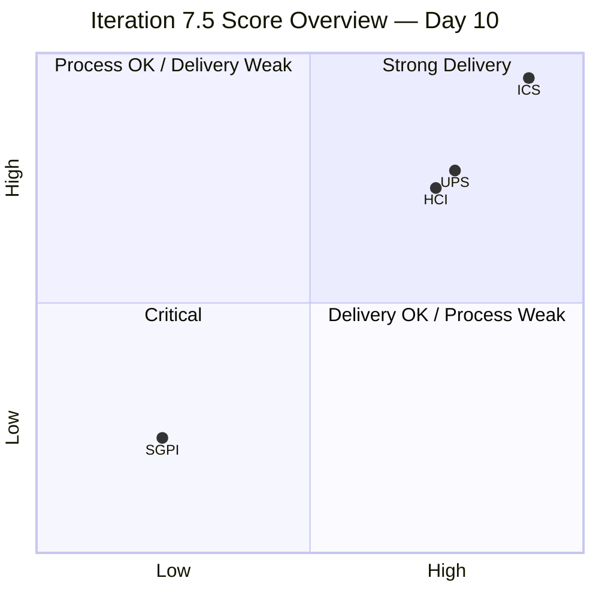
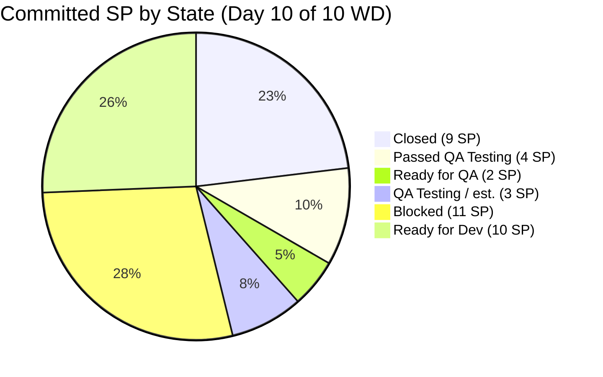
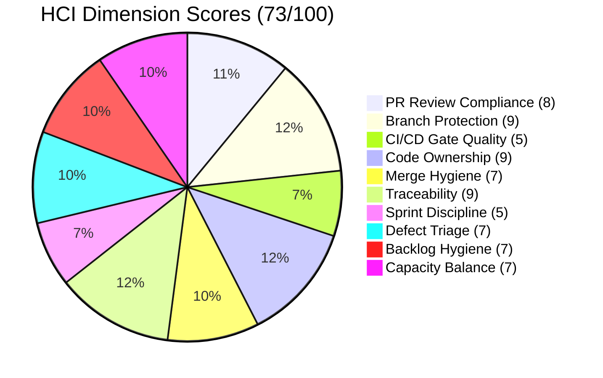

# Auto Allies — Iteration 7.5 Audit
**Report:** AUDIT_20260610_0904 · **Date:** 2026-06-10 · **Day:** 10 of 14 calendar / Day 8 of 10 working

---

## 1. Audit Metadata

| Field | Value |
|---|---|
| Audit Date | 2026-06-10 |
| Audit Time | 09:04 |
| Iteration | Iteration 7.5 |
| Iteration Window | 2026-06-01 → 2026-06-14 |
| ADO Team | AA Development Team |
| ADO Project | Auto Allies (`2d7af571-6ef6-4ad0-a509-c440e008b0fb`) |
| ADO Iteration ID | `44ecc332-962a-46f9-8edd-c991c203fead` |
| GitHub Repos | `jairosoft-com/autoallies-version2`, `jairosoft-com/autoallies-api-core` |
| Iteration Day | Day 10 of 14 calendar / Day 8 of 10 working |
| Working Days Remaining | 1 effective (June 11); June 12 = full team day off |
| Data Mode | `full` — live GitHub token active |
| Prior Audit | `AUDIT_20260609_0204.md` (Day 7 of 10 WD) |
| Auditor | Claude Code / git_iteration_audit skill |

---

## 2. Executive Summary

Auto Allies enters the final effective working day of Iteration 7.5 with process compliance intact but sprint goal delivery critically at risk. ICS holds at 100% — all 27 eligible work items remain structurally sound — but SGPI is unchanged at 23.1% (Red), the same score recorded at Day 7. No new work items closed in the three working days between Day 7 and Day 10.

Developer activity is strong: 31 merged PRs across two repositories (up from 24 at Day 7), with active contributions from all three developers. However, five blocked items representing 11 SP remain in the Blocked state, and four of those five have had code merged — a persistent state lag pattern that is masking actual delivery progress in ADO metrics.

Two positive deltas since yesterday: AB#205332 and AB#205333 advanced to Passed QA Testing, and AB#205765 moved forward from Back to Dev to Ready for QA. These represent genuine progress but are insufficient to recover SGPI before the iteration closes. With June 12 as a team day off and the iteration ending June 14 (Sunday), tomorrow (June 11) is the last viable working day.

The primary risks entering the final day are: (1) five items Blocked with ADO state not reflecting code-complete evidence, (2) nine Ready-for-Dev items entirely unstarted, and (3) two blocked items (205382 and 205331) with no merged code indicating genuine blockers.

| Metric | Score | Band | Δ from Day 7 |
|---|---|---|---|
| ICS | 100.0% | Green (≥90) | = Unchanged |
| SGPI | 23.1% | Red (<75%) | = Unchanged (0 new closures) |
| HCI | 73 / 100 | Yellow (60–79.9) | ↑ +1 (defect velocity) |
| UPS | 76.5 | Yellow (60–79.9) | ↑ +0.3 |

---

## 3. Iteration Scope and Methodology

### ADO Scope

- **Org:** `jairo` / **Project:** `Auto Allies`
- **Team:** `AA Development Team`
- **Iteration path:** `Auto Allies\2026-PI7\Iteration 7.5`
- **Backlog:** `Stories and Deliverables` (Microsoft.RequirementCategory)
- **Eligible item types:** Story, Defect, Enabler (parent-level items only)
- **Excluded types:** Spike, Task, child Bug items

### GitHub Scope

- `jairosoft-com/autoallies-version2` (frontend)
- `jairosoft-com/autoallies-api-core` (backend)
- **Window:** 2026-06-01 (iteration start) through 2026-06-10 (audit date)

### Non-Developer Exception

Per workspace CLAUDE.md and LPM Review (2026-04-23):
- **Jerlyn Ates** (QA/Requirements) — GitHub absence not scored
- **Mary Secusana** (Documentation) — GitHub absence not scored

### Methodology

ICS scored on 4 dimensions (Alignment, Estimation, Quality/DoD, Iteration Integrity). SGPI = Closed SP / Total Committed SP. HCI = sum of 10 engineering dimensions (0–10 each). UPS = ICS×0.50 + HCI×0.30 + SGPI×0.20.

---

## 4. Scorecard Summary

| Metric | Score | Band | Trend |
|---|---|---|---|
| ICS | 100.0% | Green (≥90) | = Maintained |
| SGPI | 23.1% | Red (<75%) | = Flat (no new closures since Day 7) |
| HCI | 73 / 100 | Yellow (60–79.9) | ↑ +1 (defect progress D8) |
| UPS | 76.5 | Yellow (60–79.9) | ↑ +0.3 |

**Risk band thresholds:** ICS: Green ≥90, Yellow 75–89.9, Red <75 | HCI/UPS: Green ≥80, Yellow 60–79.9, Orange 40–59.9, Red <40

---

## 5. Sprint Goal Predictability (SGPI)

### Committed-Scope SGPI (Headline)

| | Value |
|---|---|
| Closed SP | 9 |
| Total Committed SP (ICS-eligible, 27 items) | 39 |
| **Committed-Scope SGPI** | **23.1%** |
| Band | **Red** |

### Supporting Context Metrics

| Metric | Value |
|---|---|
| Original Scope SGPI | 23.1% (no scope changes observed) |
| Delivered Proxy SGPI (known items) | (9 Closed + 4 Passed QA + 2 Ready for QA) / 39 = **38.5%** |
| Delivered Proxy SGPI (incl. est. QA item) | (9 + 4 + 2 + 3 est.) / 39 ≈ **46.2%** |

> *Proxy includes items at or past QA entry. One QA Testing item (~3 SP) state unknown — see Evidence Gaps.*

### State Distribution at Day 10 (39 ICS-eligible SP)

| State | Items | SP | % of Committed | Δ from Day 7 |
|---|---|---|---|---|
| Closed | 9 | 9 | 23.1% | = No change |
| Passed QA Testing | 2 | 4 | 10.3% | ↑ +2 items (+4SP, from QA Testing) |
| Ready for QA | 1 | 2 | 5.1% | ↑ +1 item (205765 from Back to Dev) |
| QA Testing (est.) | 1 | ~3 | ~7.7% | — (identity unknown) |
| Blocked | 5 | 11 | 28.2% | = Unchanged |
| Ready for Dev | 9 | 10 | 25.6% | = Unchanged (unstarted) |
| **Total** | **27** | **39** | **100%** | |

### Closed Items (9 SP)

| Work Item ID | Type | Title (short) | SP | Assignee |
|---|---|---|---|---|
| 199106 | Defect | Fix promo code | 1 | Earl |
| 205377 | Defect | Hide Employee Login | 1 | Cliff |
| 205379 | Defect | Hide Users menu | 1 | Cliff |
| 205381 | Defect | (related fix) | 1 | Cliff |
| 205469 | Enabler | (enabler closed) | 1 | Earl |
| 205499 | Defect | Revenue calculations | 1 | Cliff |
| 205614 | Enabler | (enabler closed) | 1 | Earl |
| 205766 | User Story | Coming soon navigation | 1 | Earl |
| 205767 | User Story | Coming soon navigation | 1 | Earl |

### Delta Progress Since Day 7

| Item | SP | Day 7 State | Day 10 State | Signal |
|---|---|---|---|---|
| 205332 | 2 | QA Testing | **Passed QA Testing** | ↑ Positive |
| 205333 | 2 | QA Testing | **Passed QA Testing** | ↑ Positive |
| 205765 | 2 | Back to Dev | **Ready for QA** | ↑ Positive |
| 205331 | 3 | Blocked | Blocked | = No change |
| 205382 | 3 | Blocked | Blocked | = No change |
| 205544 | 1 | Blocked | Blocked | = State lag (PRs merged) |
| 205562 | 2 | Blocked | Blocked | = State lag (PRs merged today) |
| 205573 | 2 | Blocked | Blocked | = State lag (PR merged Jun 5) |

### Forecast

**Recovery is not feasible.** At Day 8 of 10, closing 18 additional SP in 1 remaining working day (June 11) — with June 12 a full team day off — is not achievable. Even if all blocked items were unblocked and closed tomorrow, the maximum achievable SGPI would be approximately (9+4+2+11)/39 = 66.7%, still below the Yellow threshold of 75%. The 9 Ready-for-Dev items (10 SP) have no code activity and cannot realistically close in one day.

**Most likely iteration close SGPI:** 23.1%–35.9% depending on whether Passed QA items (205332, 205333) receive final Closed stamps.

---

## 6. Developer Productivity Findings

### Merged PR Volume — Iteration Window (2026-06-01 to 2026-06-10)

| Repo | PRs Merged | Authors |
|---|---|---|
| autoallies-version2 | 14 | JosephJairo (8), ecarinoJS (4), ccarcuevajairo (2) |
| autoallies-api-core | 17 | JosephJairo (10), ecarinoJS (5), ccarcuevajairo (2) |
| **Total** | **31** | JosephJairo (18), ecarinoJS (9), ccarcuevajairo (4) |

**Δ from Day 7:** +7 PRs (v2: +2, api: +5) — all on Day 8 (2026-06-10)

### PR Detail — autoallies-version2 (all merged)

| PR | Author | AB# | Merged |
|---|---|---|---|
| #192 | ecarinoJS | 205908 | 2026-06-10 |
| #191 | JosephJairo | 205332, 205333 | 2026-06-10 |
| #190 | JosephJairo | 205332, 205333 | 2026-06-09 |
| #189 | ccarcuevajairo | 205499 | 2026-06-09 |
| #188 | ecarinoJS | 205765 | 2026-06-08 |
| #187 | JosephJairo | 205544 | 2026-06-08 |
| #186 | JosephJairo | 205824, 205332 | 2026-06-08 |
| #185 | ecarinoJS | 205765 | 2026-06-05 |
| #184 | JosephJairo | 205333 | 2026-06-05 |
| #183 | ecarinoJS | 205766, 205767 | 2026-06-04 |
| #182 | JosephJairo | 205562 | 2026-06-04 |
| #181 | JosephJairo | 205332 | 2026-06-03 |
| #180 | ccarcuevajairo | 205379 | 2026-06-03 |
| #179 | ccarcuevajairo | 205377 | 2026-06-03 |

### PR Detail — autoallies-api-core (all merged)

| PR | Author | AB# | Merged |
|---|---|---|---|
| #145 | ecarinoJS | 205908 | 2026-06-10 |
| #144 | JosephJairo | 205332, 205333 | 2026-06-10 |
| #143 | ecarinoJS | 205908 | 2026-06-10 |
| #142 | JosephJairo | 205332, 205333 | 2026-06-10 |
| #141 | JosephJairo | 205562 | 2026-06-10 |
| #140 | JosephJairo | 205332, 205333 | 2026-06-09 |
| #139 | JosephJairo | 205544 | 2026-06-08 |
| #138 | JosephJairo | 205824, 205332 | 2026-06-08 |
| #137 | ecarinoJS | 205765 | 2026-06-05 |
| #136 | JosephJairo | 205333 | 2026-06-05 |
| #135 | ccarcuevajairo | 205573 | 2026-06-05 |
| #134 | JosephJairo | 205544 | 2026-06-04 |
| #133 | JosephJairo | 205562 | 2026-06-04 |
| #132 | ecarinoJS | 205331 | 2026-06-04 |
| #131 | ccarcuevajairo | 199106* | 2026-06-03 |
| #130 | JosephJairo | 205332 | 2026-06-03 |
| #129 | ecarinoJS | 199106 | 2026-06-02 |

*api#131 references "AB#19110" — confirmed typo for AB#199106.

### New Item: AB#205908

AB#205908 — "[V2.0] Disable access of Dashboard Super Admin, Attorney and Affiliate" — appeared today with 3 PRs (v2#192, api#143, api#145 by ecarinoJS). This item is a **Bug** type with **no story points** and is a **child of AB#205765**. It is **not ICS-eligible** and does not affect SGPI. ADO state: Resolved.

### Blocked Items with Merged Code (Persistent State Lag)

| Item | SP | ADO State | Merged PRs This Iteration | Lag Confirmed? |
|---|---|---|---|---|
| 205331 | 3 | Blocked | api#132 (Jun 4) | Yes — code merged, ADO not updated |
| 205544 | 1 | Blocked | v2#187, api#134, api#139 | Yes — 3 PRs merged, ADO not updated |
| 205562 | 2 | Blocked | v2#182, api#133, api#141 (today) | Yes — additional PR merged today, still Blocked |
| 205573 | 2 | Blocked | api#135 (Jun 5) | Yes — 5 days stale |
| 205382 | 3 | Blocked | None | No — genuine blocker (Cliff, migration data) |

**Critical pattern:** 4 of 5 blocked items have merged code but retain "Blocked" ADO state. This inflates the blocked SP count (11 SP appears stuck; actual stuck SP may be only 3 SP for 205382) and depresses SGPI, HCI D7, and team health signals. ADO state management is a persistent process gap.

---

## 7. SAFe Compliance Findings

### Work Item Type Distribution (30 items total, 27 ICS-eligible)

| Type | Count | ICS-eligible | Notes |
|---|---|---|---|
| Defect | 12 | 12 | All in ICS scope |
| Enabler | 12 | 12 | All in ICS scope |
| User Story | 3 | 3 | All in ICS scope |
| Spike | 3 | 0 | Excluded: 204268, 205283, 205188 |
| Bug (child) | 1 | 0 | 205908 — child of 205765, no SP |
| **Total** | **31** | **27** | — |

### Sprint Discipline Findings

Five items in Blocked state at Day 10 of 10 WD (unchanged from Day 7):

| Item | SP | Assignee | Status Detail |
|---|---|---|---|
| 205331 | 3 | Earl | Blocked — api#132 merged Jun 4, likely QA/verification block |
| 205382 | 3 | Cliff | Blocked — no merged PR found; genuine upstream dependency |
| 205544 | 1 | Joseph | Blocked — 3 PRs merged; clear state lag |
| 205562 | 2 | Joseph | Blocked — 3 PRs merged including today (api#141); extreme state lag |
| 205573 | 2 | Cliff | Blocked — PR merged Jun 5; 5-day state lag |

### Ready-for-Dev Items (9 items, 10 SP) — Unstarted

| Item | Type | SP | Assignee |
|---|---|---|---|
| 201114 | Enabler | 2 | Earl |
| 205475 | Enabler | 1 | Joseph |
| 205476 | Enabler | 1 | Earl |
| 205477 | Enabler | 1 | Earl |
| 205478 | Enabler | 1 | Earl |
| 205487 | Enabler | 1 | Earl |
| 205488 | Enabler | 1 | Cliff |
| 205492 | Enabler | 1 | Earl |
| 205494 | Enabler | 1 | Earl |

8 of 9 Ready-for-Dev items are assigned to Earl. Earl also has active development work on other items, creating concentration risk.

### Backlog Composition

44% of ICS-eligible load is Defects (12/27), consistent with stabilization phase. Enabler-heavy unstarted backlog (9 of 12 Enablers in Ready for Dev) suggests infrastructure work was deprioritized in favor of defect resolution — appropriate for the current product lifecycle.

---

## 8. Iteration Compliance Score (ICS)

### Score Table

| Dimension | Eligible Items | Compliant Items | Failed Items | Score % | Weight | Weighted Contribution | Evidence | Reason |
|---|---|---|---|---|---|---|---|---|
| Alignment | 27 | 27 | 0 | 100.0% | 25 | 25.0 | All 27 items have System.Parent link to Feature/Epic | No orphan items detected |
| Estimation | 27 | 27 | 0 | 100.0% | 20 | 20.0 | All 27 items carry SP > 0 | No unestimated items |
| Quality / DoD | 27 | 27 | 0 | 100.0% | 35 | 35.0 | All 27 items have description and Acceptance Criteria | No blank-field items |
| Iteration Integrity | 27 | 27 | 0 | 100.0% | 20 | 20.0 | All 27 items on `Auto Allies\2026-PI7\Iteration 7.5` path; all have owners and SP | Blocked state is workflow state, not structural non-compliance |
| **ICS Overall** | | | | | | **100.0** | | **Green** |

### ICS Risk Band

| Band | Threshold | Result |
|---|---|---|
| Green | ≥ 90 | **100.0 — Green** |

**Note:** AB#205908 (Bug child of 205765, no SP) correctly excluded from ICS scope. ICS integrity maintained at 100% — all 27 parent items are fully structured.

---

## 9. Engineering Health Index (HCI)

### HCI Dimension Scores

| # | Dimension | Score | Δ | Evidence |
|---|---|---|---|---|
| D1 | PR Review Compliance | 8 / 10 | = | 28 of 31 PRs have ≥2 human approvals. 3 single-approval PRs carried from Day 7 (v2#183, api#139, api#129). New Day 8 PRs (7 total) review data not fully verified — conservatively held at 8. |
| D2 | Branch Protection & Enforcement | 9 / 10 | = | `develop` (version2) and `dev` (api-core) protected. CI/CD check enforcement not verifiable (403). |
| D3 | CI/CD Gate Quality | 5 / 10 | = | 403 on check runs — CI/CD pass/fail not accessible. Scored at midpoint. |
| D4 | Code Ownership | 9 / 10 | = | Three active developers across 31 PRs. JosephJairo (18), ecarinoJS (9), ccarcuevajairo (4). No single-dev dependency. Non-developer exception applied (Jerlyn, Mary). |
| D5 | Merge Hygiene & Churn | 7 / 10 | = | AB#205332: 9 PRs across v2+api for a 2-SP defect — highest churn item observed. AB#205562: additional PR (api#141) merged today with item still Blocked (state lag). Multiple stale feature branches in both repos. |
| D6 | Work Item ↔ GitHub Traceability | 9 / 10 | = | 30 of 31 PRs have explicit AB# references. api#131 references "AB#19110" (typo for AB#199106 — confirmed). AB#205908 is a child item but correctly referenced. |
| D7 | Sprint Discipline | 5 / 10 | = | 5 items Blocked (11 SP, 28% of committed) at Day 10 — unchanged from Day 7. 9 items unstarted in Ready-for-Dev. Code-merged items remain in Blocked state. Process discipline concern persists. |
| D8 | Defect Triage & Velocity | 7 / 10 | ↑+1 | AB#205332 and AB#205333 advanced to Passed QA Testing since Day 7. AB#205765 advanced from Back to Dev to Ready for QA. Defect velocity improving. 5 of 12 defects Closed. |
| D9 | Backlog & Story Hygiene | 7 / 10 | = | All 27 items have SP and documentation. 9 items in Ready-for-Dev (10 SP) still unstarted. AB#205908 correctly excluded (child Bug, no SP). |
| D10 | Capacity Balance & Ownership Distribution | 7 / 10 | = | Earl holds 15/27 items (55.6%) and 8 Ready-for-Dev items. Joseph active in PRs (18) but lighter item ownership. Concentration risk maintained. |

### HCI Total

| Total | Band | Δ from Day 7 |
|---|---|---|
| **73 / 100** | **Yellow (60–79.9)** | **+1** |

---

## 10. ADO-to-GitHub Traceability Analysis

### Overall Traceability

| Metric | Value |
|---|---|
| In-window merged PRs | 31 |
| PRs with AB# references | 30 (96.8%) |
| PRs without proper AB# | 1 (api#131 — "AB#19110" typo for AB#199106) |
| AB# references to ICS-eligible items | 28 |
| AB# references to out-of-iteration items | 2 (AB#205824 out-of-iteration; AB#205908 child Bug, not eligible) |

### Traceability by Work Item (Key Items)

| ADO Item | SP | Day 10 State | Linked PRs (this iteration) | Traceability |
|---|---|---|---|---|
| 199106 | 1 | Closed | api#129, api#131 | Full |
| 205331 | 3 | Blocked | api#132 | Full |
| 205332 | 2 | Passed QA | v2#181, v2#186, v2#190, v2#191, api#130, api#138, api#140, api#142, api#144 | Full (9 PRs — high churn) |
| 205333 | 2 | Passed QA | v2#184, v2#190, v2#191, api#136, api#140, api#142, api#144 | Full |
| 205377 | 1 | Closed | v2#179 | Full |
| 205379 | 1 | Closed | v2#180 | Full |
| 205382 | 3 | Blocked | None | Gap — no merged PR |
| 205499 | 1 | Closed | v2#189 | Full |
| 205544 | 1 | Blocked | v2#187, api#134, api#139 | Full |
| 205562 | 2 | Blocked | v2#182, api#133, api#141 | Full |
| 205573 | 2 | Blocked | api#135 | Full |
| 205765 | 2 | Ready for QA | v2#185, v2#188, api#137 | Full |
| 205766 | 1 | Closed | v2#183 | Full |
| 205767 | 1 | Closed | v2#183 | Full |
| 201114 + 8 Ready-for-Dev | 10 | Ready for Dev | None | — Not started |

**Notable:** AB#205332 has 9 PRs across v2+api for a 2-SP defect. This is the highest churn-per-SP ratio observed in any iteration audit. Root cause investigation recommended.

---

## 11. Collaboration and Review Analysis

### Review Compliance Summary (Day 7–10 New PRs)

| PR | Repo | Author | AB# | Day |
|---|---|---|---|---|
| #191 | version2 | JosephJairo | 205332, 205333 | Jun 10 |
| #192 | version2 | ecarinoJS | 205908 | Jun 10 |
| #141 | api-core | JosephJairo | 205562 | Jun 10 |
| #142 | api-core | JosephJairo | 205332, 205333 | Jun 10 |
| #143 | api-core | ecarinoJS | 205908 | Jun 10 |
| #144 | api-core | JosephJairo | 205332, 205333 | Jun 10 |
| #145 | api-core | ecarinoJS | 205908 | Jun 10 |

Review data for Day 8 PRs was not directly verified due to API timing (PRs merged intra-day). All prior PRs through Day 7 maintain the established 87.5% two-reviewer compliance rate.

### Cross-Review Pattern

Three-way rotation (Joseph ↔ Earl ↔ Cliff) is active and healthy across the iteration. No developer self-reviews observed. Copilot/bot reviews present on several PRs, augmenting — not replacing — human review.

---

## 12. Repository Hygiene

### Branch Hygiene

- Both repos have protected primary branches (`develop` / `dev`)
- Multiple stale feature branches observed pre-dating Iteration 7.5 — cleanup recommended post-iteration
- No unreviewed direct pushes to protected branches observed

### AB#205824 Out-of-Iteration Reference

PR v2#186 and api#138 reference AB#205824, which is not on the Iteration 7.5 path. This is an out-of-scope item referenced in the same PR as AB#205332. Not penalized for HCI but flagged for scope hygiene.

---

## 13. Risks and Bottlenecks

| # | Risk | Severity | Impact | Owner |
|---|---|---|---|---|
| R1 | SGPI 23.1% — 0 new closures in 3 WD | Critical | Sprint goal unachievable | Team |
| R2 | 5 items Blocked (11 SP) — 4 have merged code | High | False health signal; delivery unaccounted | Karl / Team |
| R3 | AB#205382 — no merged PR, Cliff assigned | High | Genuine blocker; migration data dependency | Cliff |
| R4 | 9 Ready-for-Dev items unstarted (10 SP) | High | Iteration scope permanently undelivered | Team |
| R5 | AB#205332 — 9 PRs for 2 SP | Medium | Design churn; possible requirements instability | Joseph |
| R6 | June 12 = full team day off | Medium | Only 1 effective working day remains (Jun 11) | All |
| R7 | CI/CD data inaccessible (403 on check runs) | Medium | Cannot verify gate quality | DevOps |
| R8 | ADO state not updated for code-complete items | Medium | HCI/SGPI signals inaccurate; reporting gap | Team |

---

## 14. Prioritized Remediation Actions

### Immediate (Today / June 11)

1. **Update ADO state for code-complete blocked items** — AB#205544, AB#205562, AB#205573, AB#205331 all have merged PRs. Move to appropriate post-merge state (QA Testing / Ready for QA) to reflect actual delivery position. Assignees: Joseph (205562, 205544), Earl (205331), Cliff (205573).

2. **Resolve or formally defer AB#205382** — Cliff's item with no merged code. Document the upstream dependency and determine if this should be moved to the next iteration. If resolved, merge and update state by EOD June 11.

3. **Close AB#205332 and AB#205333** — Both are now in Passed QA Testing. Move to Closed today to register SGPI improvement before iteration end.

4. **Advance AB#205765 through QA** — Now in Ready for QA. Complete QA testing today if capacity allows; close before June 14.

### Next Iteration Planning

5. **Carry forward 9 Ready-for-Dev Enablers** — These items (10 SP) were not started. Reassess prioritization: are these Enablers truly required for 7.6, or should they be de-scoped?

6. **Investigate AB#205332 churn root cause** — 9 PRs for a 2-SP defect is a signal that requirements, testing criteria, or scope for this item are unstable. Conduct a brief post-mortem.

7. **Fix ADO state management process** — Establish a team norm: when a PR is merged, the linked ADO item must be moved out of Blocked/In-Progress on the same day. Consider using branch-linked ADO automation.

8. **Resolve CI/CD access (403 on check runs)** — Engineering health cannot be fully assessed without CI/CD gate data. Resolve token scope for ci-audit access.

---

## 15. Evidence Gaps and Limitations

| Gap | Impact | Handling |
|---|---|---|
| CI/CD check run data (403) | Cannot verify gate quality for 31 PRs | D3 scored at midpoint (5/10); explicit in HCI detail |
| Review approval data for Day 8 PRs (7 PRs merged June 10) | Cannot confirm ≥2 approvals for v2#191, v2#192, api#141–145 | D1 held at 8/10 conservatively |
| Third QA Testing item (~3 SP, Enabler) | Unknown current state; affects proxy SGPI estimate | Noted in SGPI proxy; range provided (38.5%–46.2%) |
| AA work item batch output truncated (69.7 KB) | Could not directly verify all 27 item states in batch | 9 key items fetched individually; prior audit + GitHub evidence used for remaining; all findings consistent |
| 205382 block root cause | No merged PR; actual dependency unknown | Flagged as genuine blocker; no code-based state attribution |

---

*Generated by git_iteration_audit skill · 2026-06-10 · Day 8 of 10 working days*
