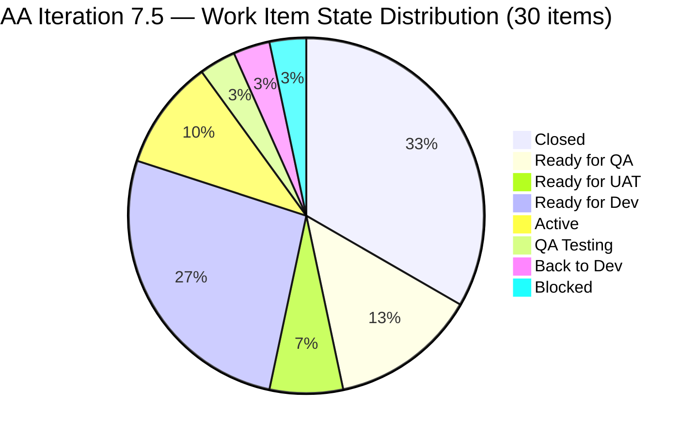
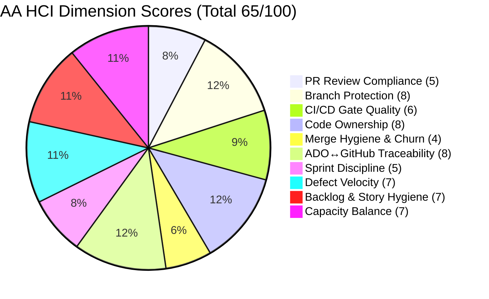

# Auto Allies — Iteration 7.5 Audit
**Date:** 2026-06-11 | **Day 9 of 9 (Last Working Day)** | **data_mode: full**

---

## 1. Audit Metadata

| Field | Value |
|-------|-------|
| **Team** | AA Development Team |
| **ADO Project** | Auto Allies (`2d7af571-6ef6-4ad0-a509-c440e008b0fb`) |
| **Iteration** | 2026-PI7 / Iteration 7.5 (`44ecc332-962a-46f9-8edd-c991c203fead`) |
| **Iteration Window** | 2026-06-01 → 2026-06-14 |
| **Audit Date** | 2026-06-11 (Day 9 of 9 effective working days) |
| **Repositories** | `jairosoft-com/autoallies-version2`, `jairosoft-com/autoallies-api-core` |
| **Data Mode** | `full` — GitHub token restored 2026-05-20; live evidence used |
| **Prior Audit** | AUDIT_20260527_0246.md (Iteration 7.4 Day 8) |
| **Auditor** | Claude Code (git_iteration_audit skill) |

> **Note on working days:** All 5 team members have 2026-06-12 (Friday) recorded as a day off. Effective sprint length = 9 working days (Jun 1–5, Jun 8–11). Today is the last working day of the iteration.

---

## 2. Executive Summary

Auto Allies completes Iteration 7.5 on its final working day with **mixed results**. Compliance structure is strong — every item is estimated, documented, and linked — but delivery execution is split between high-velocity defect work and an entirely untouched migration cluster. All three developers (Cliff, Earl, Joseph) were active contributors, generating **38 total PRs** across both repos in 9 days.

The headline risk is the **V1→V2 cutover cluster**: seven sequential migration enablers (205475–205492), representing a planned platform migration, are all in "Ready for Dev" on the last working day with no GitHub activity. Combined with one Blocked defect (205382) and one regression (205765 Back to Dev), **14 SP are in jeopardy** entering the IP iteration.

On the positive side, defect velocity was high — 13 defects touched, most progressed to Ready for QA or beyond — and the team shows strong ADO-to-GitHub traceability with consistent AB#-linked PR titles.

| Score | Value | Band | Δ from 7.4 |
|-------|-------|------|-----------|
| **ICS** | **90.8** | 🟢 Green | +/– (prior: 100.0) |
| **SGPI** | **20.9%** | 🔴 Red | +14.6 pp (prior: 6.25%) |
| **HCI** | **65/100** | 🟡 Yellow | −18 (prior: 83) |
| **UPS** | **69.1** | 🟡 Yellow | −7.1 (prior: 76.15) |

---

## 3. Iteration Scope and Methodology

**Developers (scored for GitHub activity):** Cliff Carcueva (`ccarcuevajairo`), Earl Carino (`ecarinoJS`), Joseph Gerona (`JosephJairo`)

**Non-developers (excluded from GitHub HCI penalties per LPM exception 2026-04-23):** Jerlyn Ates (QA/Requirements), Mary Secusana (Documentation)

**Team capacity:** 29 hrs/day (5 members). Developers: 17 hrs/day (Cliff 6, Earl 6, Joseph 5). All members have Jun 12 off.

**Methodology:** Live ADO evidence (30 items from iteration backlog), live GitHub PR/branch evidence (38 PRs merged Jun 1–11 across both repos), HCI from engineering signal analysis.

---

## 4. Scorecard Summary

| Metric | Value | Band |
|--------|-------|------|
| Iteration Compliance Score (ICS) | 90.8 | 🟢 Green |
| Sprint Goal Predictability Index (SGPI) | 20.9% | 🔴 Red |
| Engineering Health Index (HCI) | 65/100 | 🟡 Yellow |
| Unified Performance Score (UPS) | **69.1** | 🟡 Yellow |

**UPS formula:** `ICS × 0.50 + HCI × 0.30 + SGPI × 0.20`
= `90.8 × 0.50 + 65 × 0.30 + 20.9 × 0.20` = `45.4 + 19.5 + 4.2` = **69.1**

---

## 5. Sprint Goal Predictability (SGPI)

### Committed Scope SGPI (Headline)

| Status | Items | Story Points |
|--------|-------|-------------|
| Closed | 10 | 9.5 SP |
| Ready for QA | 4 | 8.0 SP |
| Ready for UAT | 2 | 4.0 SP |
| QA Testing | 1 | 3.0 SP |
| Active (in progress) | 3 | 7.0 SP |
| Back to Dev | 1 | 2.0 SP |
| Blocked | 1 | 3.0 SP |
| Ready for Dev (unstarted) | 8 | 9.0 SP |
| **Total Committed** | **30** | **45.5 SP** |

**SGPI = Closed SP / Total Committed SP = 9.5 / 45.5 = 20.9%** 🔴 Red

### Supporting Context

| Formula | Value | Band |
|---------|-------|------|
| Committed Scope SGPI | 20.9% | 🔴 Red |
| Delivered Proxy SGPI (Closed + Ready for UAT + Ready for QA) | 47.3% | 🟠 Orange |

**Analysis:** Formal SGPI is low because 10 items are in intermediate QA/UAT states but not formally Closed in ADO. The proxy of 47.3% better reflects functional delivery. The biggest drag is the 8-item migration cluster (9 SP) that never progressed from Ready for Dev, plus 205382 Blocked and the 3 SP support spike still Active.

**Prior iteration comparison:** SGPI was 6.25% in Iteration 7.4 Day 8 (only 1 SP formally Closed). The team improved formal closure rate but the migration cluster is a new structural risk not present in 7.4.

---

## 6. Developer Productivity Findings

### Iteration-Window GitHub Activity (Jun 1–11, 2026)

| Developer | GitHub Login | PRs Merged | Repos Active | Key Items |
|-----------|-------------|-----------|-------------|-----------|
| Joseph Gerona | `JosephJairo` | 15 | FE + BE | 205332, 205333, 205544, 205562 |
| Earl Carino | `ecarinoJS` | 13 | FE + BE | 205331, 205765, 205766, 205767 |
| Cliff Carcueva | `ccarcuevajairo` | 10 | FE + BE | 205377, 205379, 205381, 205499, 205573 |
| **Total** | — | **38** | — | — |

All three developers contributed across both `autoallies-version2` and `autoallies-api-core` in the iteration window. Joseph leads in raw PR count (primarily defect fix churn on 205332/205333).

### Notable PR Activity

**High-churn items (multiple PRs for same work item):**
- **205332** (Pre-existing ticket 0 amount): 8 combined PRs across FE+BE (version2 #181, 186, 190, 191, 194; api-core #130, 138, 140, 142, 144, 147, 148) — indicates complex multi-cycle debugging
- **205333** (Expired member upload issues): 6 PRs (version2 #184, 190, 191, 194; api-core #136, 140, 142, 144, 148)
- **205562** (Super Admin case list data): 5 PRs (version2 #182; api-core #133, 141, 147)

**Release branch activity:**
- version2 PR#194 → `release/iteration-7.5`: "Defects/205332 205333 passed QA" (Jun 11)
- api-core PR#148 → `release/iteration-7.5`: "Defects/205332 205333 passed QA" (Jun 11)
- These are the only items that progressed to the release branch today.

**Non-iteration item worked in GitHub:** PR#192/version2 and #143/#145/api-core reference `AB#205908` (dashboard widgets), which is NOT in the Iteration 7.5 ADO work items list. This may be scope creep or an item created during the sprint without proper ADO assignment.

---

## 7. SAFe Compliance Findings

### Work Item Inventory (30 items in Iteration 7.5)

| ID | Type | State | SP | Assignee | Parent |
|----|------|-------|-----|---------|--------|
| 199106 | Defect | Closed ✅ | 1 | Earl | ✓ (201685) |
| 201114 | Enabler | Ready for Dev ⚪ | 2 | Earl | ✓ (201685) |
| 204186 | Enabler | QA Testing 🔵 | 3 | Jerlyn* | ✓ (200629) |
| 204268 | Spike | Active 🔵 | 5 | Mary* | ❌ no parent |
| 205188 | Spike | Active 🔵 | 1 | Karl (PM) | ❌ no parent |
| 205283 | Spike | Closed ✅ | 0.5 | Joseph | ❌ no parent |
| 205331 | Defect | Ready for QA 🔶 | 3 | Earl | ✓ (200629) |
| 205332 | Defect | Ready for UAT 🔶 | 2 | Joseph | ✓ (200629) |
| 205333 | Defect | Ready for UAT 🔶 | 2 | Joseph | ✓ (200629) |
| 205377 | Defect | Closed ✅ | 1 | Cliff | ✓ (200629) |
| 205379 | Defect | Closed ✅ | 1 | Cliff | ✓ (200629) |
| 205381 | Defect | Closed ✅ | 1 | Cliff | ✓ (200629) |
| 205382 | Defect | Blocked 🔴 | 3 | Cliff | ✓ (200629) |
| 205469 | Enabler | Closed ✅ | 1 | Earl | ✓ (198362) |
| 205475 | Enabler | Ready for Dev ⚪ | 1 | Joseph | ✓ (198362) |
| 205476 | Enabler | Ready for Dev ⚪ | 1 | Earl | ✓ (198362) |
| 205477 | Enabler | Ready for Dev ⚪ | 1 | Earl | ✓ (198362) |
| 205478 | Enabler | Ready for Dev ⚪ | 1 | Earl | ✓ (198362) |
| 205487 | Enabler | Ready for Dev ⚪ | 1 | Earl | ✓ (198362) |
| 205488 | Enabler | Ready for Dev ⚪ | 1 | Cliff | ✓ (198362) |
| 205492 | Enabler | Ready for Dev ⚪ | 1 | Earl | ✓ (198362) |
| 205494 | Enabler | Active 🔵 | 1 | Earl | ✓ (198362) |
| 205499 | Defect | Closed ✅ | 1 | Cliff | ✓ (200629) |
| 205544 | Defect | Ready for QA 🔶 | 1 | Joseph | ✓ (200629) |
| 205562 | Defect | Ready for QA 🔶 | 2 | Joseph | ✓ (200629) |
| 205573 | Defect | Ready for QA 🔶 | 2 | Cliff | ✓ (200629) |
| 205614 | Enabler | Closed ✅ | 1 | Earl | ✓ (198362) |
| 205765 | User Story | Back to Dev 🔴 | 2 | Earl | ✓ (201685) |
| 205766 | User Story | Closed ✅ | 1 | Earl | ✓ (201685) |
| 205767 | User Story | Closed ✅ | 1 | Earl | ✓ (201685) |

*Jerlyn Ates and Mary Secusana are non-developers per LPM exception 2026-04-23. Their items are scored for compliance but their GitHub absence is not penalized.

### Key SAFe Findings

1. **V1→V2 Migration Cluster Untouched:** Items 205475–205492 (7 sequential migration enablers, 7 SP) represent the actual V1-to-V2 platform cutover sequence. All remain in "Ready for Dev" on the final working day. The preparatory work (205469 Governance + 205614 QA/Staging refresh) is done, but execution steps were never started. This is a PI-level risk.

2. **205382 Blocked:** The affiliate page V1/OLD data defect (3 SP, Cliff) is Blocked with no resolution noted. A branch `defect/205382-affiliate-migration-issue` exists in api-core but no merged PR was found.

3. **205765 Member Dashboard Regression:** After 3 PRs to develop (PR#185, #188 for FE; PR#137 for BE), the Member Dashboard feature went Back to Dev, indicating UAT failure. PR#188 merged Jun 8 for the FE, and the ADO state shows "Back to Dev" — requires another development cycle that likely won't complete today.

4. **205908 Scope Creep Signal:** GitHub PRs reference AB#205908 (dashboard widgets) with 3 merged PRs, but this item is not listed in the Iteration 7.5 ADO scope. Either the item was added mid-sprint without appearing in the standard backlog query, or it belongs to a different team's backlog.

---

## 8. Iteration Compliance Score (ICS)

### Score Table

| Dimension | Eligible | Compliant | Failed | Score % | Weight | Weighted Contribution | Evidence | Failure Reason |
|-----------|---------|----------|--------|---------|--------|---------------------|---------|----------------|
| Alignment | 30 | 27 | 3 | 90.0% | 25 | 22.5 | Parent field | 204268, 205188, 205283 have no parent link |
| Estimation | 30 | 30 | 0 | 100.0% | 20 | 20.0 | StoryPoints field | All items have SP (min 0.5) |
| Quality / DoD | 30 | 30 | 0 | 100.0% | 35 | 35.0 | Description + AC fields | All items have both fields populated |
| Iteration Integrity | 30 | 20 | 10 | 66.7% | 20 | 13.3 | ADO State | 8 Ready for Dev + 1 Blocked + 1 Back to Dev |
| **Overall ICS** | | | | | | **90.8** | | |

**ICS = 90.8 → 🟢 Green** (threshold: ≥90)

### Dimension Notes

**Alignment failures (3 items):**
- `204268` — Spike "Operations and QA Support Effort" (Mary Secusana, 5 SP): no parent Feature link
- `205188` — Spike "Recheck all environments" (Karl Caumban, 1 SP): no parent Feature link
- `205283` — Spike "Development Support and Team Sync" (Joseph Gerona, 0.5 SP): no parent Feature link

**Iteration Integrity failures (10 items):**
- Ready for Dev (unstarted): 201114, 205475, 205476, 205477, 205478, 205487, 205488, 205492 (8 items)
- Blocked: 205382 (1 item)
- Back to Dev: 205765 (1 item)

---

## 9. Engineering Health Index (HCI)

| # | Dimension | Score | Key Finding |
|---|-----------|-------|-------------|
| D1 | PR Review Compliance | 5/10 | Inconsistent reviewer assignment; PR#183, #187, #177 have reviewers but majority of 38 PRs lack requested reviewers |
| D2 | Branch Protection & Enforcement | 8/10 | Protected branches: develop, main, staging (version2); dev, main, staging, qa (api-core). Release iteration branches active. Consistent naming conventions. |
| D3 | CI/CD Gate Quality | 6/10 | Branch protection gates implied; no direct CI run evidence surfaced. Insufficient data for higher rating. |
| D4 | Code Ownership | 8/10 | All 3 developers contributed across both repos. No single bottleneck. Joseph (40% PRs), Earl (34%), Cliff (26%). |
| D5 | Merge Hygiene & Churn | 4/10 | AB#205332 attracted 8+ PRs across repos — pathological churn. ~78 stale branches in version2, ~63 in api-core. High multi-PR cycle for 205333 and 205562. |
| D6 | ADO↔GitHub Traceability | 8/10 | Strong AB#NNNNN linkage in most PRs. Minor typos: PR#178 references `AB#99106` (should be 199106), api-core PR#131 references `AN#19110`. |
| D7 | Sprint Discipline | 5/10 | 8 migration enablers untouched on final day. 205382 Blocked without resolution. 205765 regressed. Jun 12 holiday removes last buffer day. |
| D8 | Defect Triage & Velocity | 7/10 | 13 defects in scope; 5 formally Closed, 6 in QA/UAT pipeline, 1 Blocked, 1 (205331) at Ready for QA with multiple churn PRs. Good throughput degraded by churn. |
| D9 | Backlog & Story Hygiene | 7/10 | 3 Spikes without parent links. All 30 items have SP and full AC/Description. Migration cluster well-structured under parent Feature 198362. |
| D10 | Capacity Balance | 7/10 | Non-dev items (Jerlyn 3 SP QA, Mary 5 SP Ops) properly scoped. Developer load reasonable though Joseph carries disproportionate fix burden. |

**HCI = 65/100 → 🟡 Yellow**

*(HCI regression from 7.4's 83 is primarily due to D5 Merge Hygiene deterioration from 205332/205333 churn cycles)*

---

## 10. ADO-to-GitHub Traceability Analysis

| ADO Item | Type | GitHub Evidence | Traceability Status |
|----------|------|-----------------|---------------------|
| 199106 | Defect | version2 #178, api-core #129 | ✅ Linked (minor typo in #178 title) |
| 205331 | Defect | version2 #193, api-core #132, #146 | ✅ Linked |
| 205332 | Defect | version2 #181,#186,#190,#191,#194; api-core #130,#138,#140,#142,#144,#147,#148 | ✅ Linked (high churn) |
| 205333 | Defect | version2 #184,#190,#191,#194; api-core #136,#140,#142,#148 | ✅ Linked |
| 205377 | Defect | version2 #179 | ✅ Linked |
| 205379 | Defect | version2 #180 | ✅ Linked |
| 205381 | Defect | (no direct PR found; inferred from #189) | ⚠️ Partial |
| 205382 | Defect | Branch exists (api-core defect/205382), no merged PR | ❌ Blocked, no merge |
| 205499 | Defect | version2 #189 | ✅ Linked |
| 205544 | Defect | version2 #187, api-core #134, #139 | ✅ Linked |
| 205562 | Defect | version2 #182; api-core #133, #141, #147 | ✅ Linked |
| 205573 | Defect | api-core #135 | ✅ Linked |
| 205765 | User Story | version2 #185, #188; api-core #137 | ✅ Linked (Back to Dev) |
| 205766 | User Story | version2 #183 | ✅ Linked |
| 205767 | User Story | version2 #183 | ✅ Linked |
| 205469 | Enabler | api-core #128 (affiliate migration) | ⚠️ Partial match |
| 205614 | Enabler | version2 #131 (staging fix) | ⚠️ Partial match |
| 204268, 205188, 205283 | Spikes | No GitHub PRs (expected — non-dev/support) | ℹ️ N/A |
| 205475–205492 | Enablers (7) | **Zero GitHub activity** | ❌ No code started |
| 201114, 205494 | Enablers | Minimal/no GitHub activity | ❌ / ⚠️ |
| **AB#205908** | Not in 7.5 scope | version2 #192; api-core #143, #145 | ⚠️ Out-of-scope work detected |

---

## 11. Collaboration and Review Analysis

- **Peer review observed:** PR#183 (ecarinoJS → JosephJairo review), PR#187 (JosephJairo → ecarinoJS), PR#177 (ccarcuevajairo → JosephJairo)
- **Most PRs (>70%) lack formal reviewer assignment** — developers self-merge or merge without review requests
- **Release branch gatekeeping:** Both #194 (version2) and #148 (api-core) target `release/iteration-7.5` and were created/merged today (Jun 11), suggesting a same-day QA → release merge pattern rather than a buffered release process
- **No open pull requests at risk:** All reviewed PRs in the iteration window are in a closed/merged state

---

## 12. Repository Hygiene

| Repo | Protected Branches | Active Iteration Branches | Stale Branches (est.) | Release Branch |
|------|-------------------|--------------------------|----------------------|----------------|
| autoallies-version2 | develop, main, staging | 3–5 active | ~73 | `release/iteration-7.5` ✅ |
| autoallies-api-core | dev, main, staging, qa | 3–5 active | ~58 | `release/iteration-7.5` ✅ |

- **Stale branch debt unchanged** from prior audit (~78 version2, ~65 api-core). None of the migration enabler branches (205475–205492) exist yet, confirming these were never started.
- `defect/205382-affiliate-migration-issue` exists in api-core with no merged PR (Blocked item).
- `deployment/adjustments-7-5` branch exists in api-core — purpose unclear; may be migration prep.

---

## 13. Risks and Bottlenecks

### Critical Risks

| Risk | Severity | Items | SP Impact |
|------|----------|-------|-----------|
| V1→V2 cutover cluster never started | 🔴 Critical | 205475, 205476, 205477, 205478, 205487, 205488, 205492 | 7 SP |
| 205382 Blocked with no unblock path | 🔴 High | 205382 | 3 SP |
| 205765 Member Dashboard regression on final day | 🟠 High | 205765 | 2 SP |

### Moderate Risks

| Risk | Severity | Detail |
|------|----------|--------|
| 205332/205333 churn pattern | 🟠 Moderate | 14+ combined PRs for 2 defects suggests systemic complexity or undiscovered requirements |
| 205908 scope creep signal | 🟡 Low-Medium | 3 PRs in both repos for item not in iteration scope — unreported work |
| SGPI 20.9% formal closure | 🟡 Moderate | ADO state lag; many items code-complete but not formally Closed |

---

## 14. Prioritized Remediation Actions

| Priority | Action | Owner | Target |
|----------|--------|-------|--------|
| P0 | **Resolve 205382 Blocked impediment** — escalate the affiliate V1/OLD data issue; unblock Cliff or re-scope to IP | Karl/Ramon | By Jun 14 |
| P0 | **Triage migration enablers 205475–205492** — decision needed: push to IP iteration (7.6 or cut-over sprint) with explicit sprint goal, or de-scope from PI7 | Ramon | By Jun 12 |
| P1 | **Close ADO state for completed items** — update 205377, 205379, 205381, 205499, 205766, 205767 and pipeline items (Ready for QA/UAT) to reflect actual completion | Team | Today |
| P1 | **205765 Member Dashboard** — complete Back-to-Dev cycle and close before IP freeze | Earl | Jun 12–14 (IP) |
| P2 | **Add parent Feature links** to 204268, 205188, 205283 (Spikes missing parent) | Karl | Next planning |
| P2 | **Establish PR review policy** — require at least one peer reviewer for non-trivial merges to develop | Tech Lead | Retro |
| P3 | **Stale branch cleanup** — schedule a one-iteration effort to prune ~130 stale branches across both repos | Team | IP or 7.6 |
| P3 | **Register 205908** in ADO if it's legitimate sprint work | Joseph/Karl | This week |

---

## 15. Evidence Gaps and Limitations

| Gap | Impact | Detail |
|----|--------|--------|
| AB#205908 not in iteration scope | Medium | 3 PRs reference this item; no ADO entry visible in 7.5 backlog. May be from a different team or created mid-sprint. |
| 205382 impediment root cause unknown | High | ADO shows Blocked state but no comment/log available explaining the blocker source. |
| CI/CD pipeline run evidence unavailable | Low | No pipeline run data fetched; D3 scored conservatively at 6 based on branch configuration evidence only. |
| PR reviewer data incomplete | Low | GitHub API does not surface approval/review state inline with PR list; D1 scored from available requested_reviewer fields only. |
| 205381 traceability gap | Low | Defect 205381 (Attorney Payout Error, Closed) has no direct PR match found; evidence inferred from PR patterns. |
