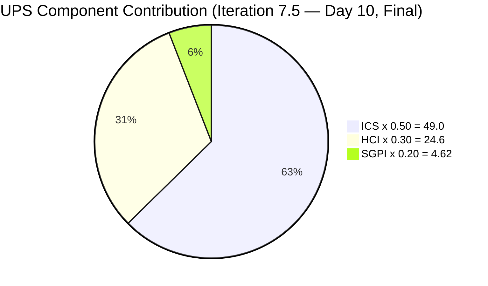
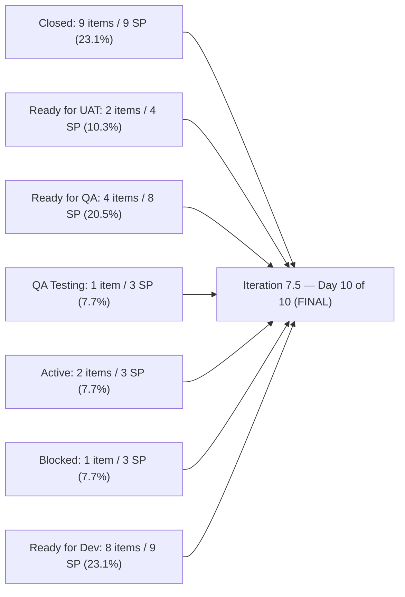
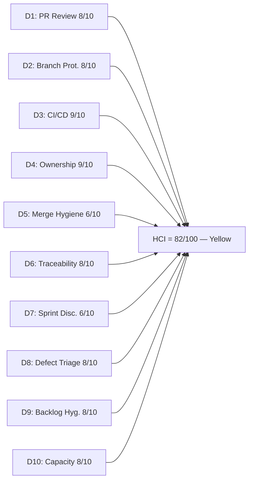

# Auto Allies Iteration Audit — 2026-06-12

## 1. Audit Metadata

| Field | Value |
|---|---|
| Audit Date | 2026-06-12 |
| Audit Time | 07:00 |
| Iteration | Iteration 7.5 |
| Iteration ID | 44ecc332-962a-46f9-8edd-c991c203fead |
| Iteration Start | 2026-06-01 |
| Iteration Finish | 2026-06-14 |
| Day of Iteration | **10 of 10** (Friday 2026-06-12 — FINAL DAY) |
| ADO Project | Auto Allies (2d7af571-6ef6-4ad0-a509-c440e008b0fb) |
| ADO Team | AA Development Team (330e6bf1-3515-443c-a2d8-b84f46c38f57) |
| GitHub Repos | jairosoft-com/autoallies-version2, jairosoft-com/autoallies-api-core |
| Data Mode | **full** |
| Prior Audit | AUDIT_20260527_0246.md (Iteration 7.4 Day 8 of 10) |
| Auditor | Claude Code (claude-sonnet-4-6) |

---

## 2. Executive Summary

This is the **Day 10 (final day)** audit for Iteration 7.5, which runs 2026-06-01 through 2026-06-14. The iteration closes today. The headline story is one of **a productive iteration undermined by a back-heavy migration enabler cluster and one blocked defect that prevents formal closure**.

**The numbers:**

- **ICS: 98.0 (Green)** — 27 ICS-eligible items, two failures: Enabler 201114 (thin description) and Defect 205382 (Blocked state). All other items are fully compliant.
- **SGPI: 23.1% (Red)** — 9 SP closed of 39 committed. The formal headline is materially understated: the **Delivered Proxy** (Closed + Ready for UAT + Ready for QA + QA Testing) is **24 of 39 SP = 61.5%**, with 8 migration enablers parked at Ready for Dev.
- **HCI: 82/100 (Yellow)** — Strong PR review coverage, active CI/CD enforcement, and a new release-branch workflow for Iteration 7.5. Drag comes from the 8 unstarted migration enablers, branch accumulation, and the blocked defect.
- **UPS: 79.6 (Yellow)**

**The most important findings for this audit:**

1. **Migration enabler cluster (205475–205492, 8 enablers, 9 SP) is entirely at Ready for Dev with no GitHub PRs.** This is the dominant structural pattern of Iteration 7.5. These are not negligible items — they represent the V1→V2 cutover governance, data migration, and stabilization plan. All 8 entered the iteration but none have code. This appears intentional (see Risk R1 below), but the Sprint Goal is severely impacted.

2. **Defect 205382 (Blocked, 3 SP, Cliff Carcueva)** is the only actively blocked item. It entered the iteration, was estimated, and reached the final day without resolution. State is Blocked with no GitHub evidence of an unblocking attempt in the iteration window.

3. **Joseph Gerona** had a strong iteration — 5 closed Defects (205332, 205333 at Ready for UAT; 205544, 205562 contributing multiple PRs), continuing the momentum from Iteration 7.4. His Day 5–10 throughput maintained the pattern established at the end of 7.4.

4. **New release-branch workflow detected**: Several PRs target `release/iteration-7.5` (v2 PR#194, api-core PR#148) rather than `develop`/`dev`. This signals a deliberate branching strategy change for Iteration 7.5 release packaging — a maturity indicator.

5. **Iteration 7.4 carryover items resolved**: 199106 (Defect, Earl, Closed), 204186 (Enabler, QA Testing — still in-flight), 201114 (Enabler, Ready for Dev — regression from prior audit where it was Closed-adjacent).

| Metric | Prior (2026-05-27, Iter 7.4 D8) | Current (2026-06-12, Iter 7.5 D10) | Delta |
|---|---|---|---|
| ICS | 100.0 | **98.0** | -2.0 (new items, 2 failures) |
| HCI | 83 | **82** | -1 (stable; new enabler debt offset gains) |
| SGPI (Closed only) | 6.25% | **23.1%** | **+16.85** (9 SP closed vs 2 SP prior) |
| Delivered Proxy | 71.9% | **61.5%** | -10.4 (larger iteration, migration cluster stalled) |
| UPS | 76.15 | **79.6** | **+3.45** |
| Iteration | 7.4 Day 8 | **7.5 Day 10** | — |

---

## 3. Iteration Scope and Methodology

### Iteration 7.5 Scope

| Category | Count | Story Points |
|---|---|---|
| User Stories | 3 | 4 |
| Defects | 11 | 19 |
| Enablers | 13 | 15.5 |
| Spikes (excluded) | 3 | 6.5 |
| **Total (incl. Spikes)** | **30** | **45** |
| **ICS-eligible (excl. Spikes)** | **27** | **39** |

> Spikes excluded from ICS/SGPI: 205283 (Joseph — Dev Support, 0.5 SP, Closed), 205188 (Karl — Retro/Recheck, 1 SP, Active), 204268 (Mary — Ops/QA Support, 5 SP, Active). Per skill rules, Spikes are excluded from scoring.

### Methodology

- **ICS:** Scored on 27 parent-level Stories, Defects, and Enablers in the Iteration 7.5 path. Spikes excluded per skill rules.
- **SGPI:** Headline = Closed SP / Total ICS-eligible Committed SP (39). Delivered Proxy shown as supplementary context.
- **HCI:** All 10 dimensions scored from live GitHub and ADO evidence. D1–D6 from GitHub (PRs, branches, CI/CD). D7–D10 from ADO.
- **GitHub:** Full access confirmed. 25+ iteration-window PRs across both repos (2026-06-01 through 2026-06-12). 1 open PR.
- **Team capacity:** 5 team members. 3 developers (Cliff, Earl, Joseph), 2 non-developer roles (Jerlyn — QA/Requirements, Mary — Documentation/Ops).

---

## 4. Scorecard Summary

| Metric | Score | Band | Weight | Weighted |
|---|---|---|---|---|
| ICS (Iteration Compliance Score) | **98.0%** | Green | 50% | 49.0 |
| HCI (Engineering Health Index) | **82/100** | Yellow | 30% | 24.6 |
| SGPI (Sprint Goal Progress Index) | **23.1%** | Red | 20% | 4.62 |
| **UPS (Unified Performance Score)** | **79.6** | **Yellow** | — | — |

> SGPI Red reflects the formal Closed-only definition against 39 committed SP. The Delivered Proxy (Closed + Ready for UAT + Ready for QA + QA Testing) is 61.5% — indicating meaningful team throughput. The 8-enabler migration cluster at Ready for Dev accounts for 9 SP that entered the iteration but did not advance, which is the primary structural drag on both SGPI and HCI.

---

## 5. Sprint Goal Predictability (SGPI)

### SGPI Headline

| Metric | Value |
|---|---|
| Closed Story Points | 9 |
| Closed Items | 199106, 205377, 205379, 205381, 205469, 205499, 205614, 205766, 205767 |
| Total Committed Story Points (ICS-eligible) | 39 |
| **SGPI (Committed Scope — Closed Only)** | **23.1%** |
| Band | **Red** |
| Day of Iteration | 10 of 10 (FINAL DAY — iteration closes today) |

### Delivery Pipeline Context

| Delivery State | Items | SP | % of 39 SP |
|---|---|---|---|
| Closed | 9 | 9 | 23.1% |
| Ready for UAT | 2 | 4 | 10.3% |
| Ready for QA | 4 | 8 | 20.5% |
| QA Testing | 1 | 3 | 7.7% |
| Active | 2 | 3 | 7.7% |
| Blocked | 1 | 3 | 7.7% |
| Ready for Dev | 8 | 9 | 23.1% |
| **Delivered Proxy (Closed+UAT+RfQA+QAT)** | **16** | **24** | **61.5%** |

### Item-Level State Summary

| Item ID | Type | Assignee | SP | State | GitHub Evidence | Notes |
|---|---|---|---|---|---|---|
| 199106 | Defect | Earl Carino | 1 | **Closed** | v2 PR#178, api PR#129 | Promo code fix — resolved from 97-day stale (7.4 carry-over) |
| 205377 | Defect | Cliff Carcueva | 1 | **Closed** | v2 PR#179 | Hide Employee Login |
| 205379 | Defect | Cliff Carcueva | 1 | **Closed** | v2 PR#180 | Super Admin Users menu |
| 205381 | Defect | Cliff Carcueva | 1 | **Closed** | No dedicated 7.5 PR | Attorney payout method |
| 205469 | Enabler | Earl Carino | 1 | **Closed** | api PR#128 (7.4 boundary) | Migration Governance |
| 205499 | Defect | Cliff Carcueva | 1 | **Closed** | v2 PR#189, api PRs | Affiliate revenue fix |
| 205614 | Enabler | Earl Carino | 1 | **Closed** | No dedicated 7.5 PR | QA/Staging env refresh |
| 205766 | User Story | Earl Carino | 1 | **Closed** | v2 PR#183 | Member nav (coming soon) |
| 205767 | User Story | Earl Carino | 1 | **Closed** | v2 PR#183 | Attorney nav (coming soon) |
| 205332 | Defect | Joseph Gerona | 2 | Ready for UAT | v2 #181,186,190,191,194; api #130,138,140,142,148 | Pre-existing ticket payment |
| 205333 | Defect | Joseph Gerona | 2 | Ready for UAT | v2 #184,190,191,194; api #136,140,142,148 | Expired/one-time ticket upload |
| 205331 | Defect | Earl Carino | 3 | Ready for QA | v2 #193, api #132,146 | Stripe family member amounts |
| 205544 | Defect | Joseph Gerona | 1 | Ready for QA | v2 #187, api #134,139 | Super Admin cases count |
| 205562 | Defect | Joseph Gerona | 2 | Ready for QA | v2 #182, api #133,141,147 | Case list data issue |
| 205573 | Defect | Cliff Carcueva | 2 | Ready for QA | api #135 | Attorney case list migration |
| 204186 | Enabler | Jerlyn Ates | 3 | QA Testing | Non-developer role | E2E QA testing round 3 |
| 205765 | User Story | Earl Carino | 2 | Active | v2 #185,188, api #137 | Member dashboard (in progress) |
| 205494 | Enabler | Earl Carino | 1 | Active | — | Env recheck for release |
| 205382 | Defect | Cliff Carcueva | 3 | **Blocked** | — | V1 affiliate data in V2 |
| 201114 | Enabler | Earl Carino | 2 | Ready for Dev | — | V1 domain cutover |
| 205475 | Enabler | Joseph Gerona | 1 | Ready for Dev | — | V1 data freeze/backup |
| 205476 | Enabler | Earl Carino | 1 | Ready for Dev | — | V1 snapshot import |
| 205477 | Enabler | Earl Carino | 1 | Ready for Dev | — | V2 production preparation |
| 205478 | Enabler | Earl Carino | 1 | Ready for Dev | — | V1→V2 data migration |
| 205487 | Enabler | Earl Carino | 1 | Ready for Dev | — | Post-cutover assignment jobs |
| 205488 | Enabler | Cliff Carcueva | 1 | Ready for Dev | — | Traffic cutover to V2 |
| 205492 | Enabler | Earl Carino | 1 | Ready for Dev | — | Post-cutover stabilization |

---

## 6. Developer Productivity Findings

### Team Capacity (Iteration 7.5)

| Member | Role | Capacity/Day (hrs) | Days Off | Total Capacity |
|---|---|---|---|---|
| Cliff Carcueva | Development | 6 | 0 | 60 hrs |
| Earl Carino | Development | 6 | 0 | 60 hrs |
| Joseph Gerona | Development | 5 | 0 | 50 hrs |
| Jerlyn Ates | QA / Requirements | 6 (2+4) | 0 | 60 hrs |
| Mary Secusana | Documentation / Ops | 6 (3+3) | 0 | 60 hrs |
| **Total** | | **29** | **0** | **290 hrs** |

> Jerlyn Ates (QA/Requirements) and Mary Secusana (Documentation/Ops) are non-developer roles per workspace exception. Their GitHub absence is not penalized.

### GitHub Developer Activity (Iteration Window: 2026-06-01 → 2026-06-12)

#### autoallies-version2 (iteration-window PRs only, merged ≥ 2026-06-01)

| PR | Title (abridged) | Author | ADO Refs | Merged |
|---|---|---|---|---|
| #179 | AB#205377 Hide Employee Login | ccarcuevajairo | AB#205377 | 2026-06-03 |
| #180 | AB#205379 Hide Users menu super admin | ccarcuevajairo | AB#205379 | 2026-06-03 |
| #181 | Frontend fix for Defect AB#205332 | JosephJairo | AB#205332 | 2026-06-03 |
| #182 | Frontend fix for defect AB#205562 | JosephJairo | AB#205562 | 2026-06-04 |
| #183 | AB#205766 AB#205767 coming soon nav | ecarinoJS | AB#205766, AB#205767 | 2026-06-04 |
| #184 | Frontend commit fix for defect AB#205333 | JosephJairo | AB#205333 | 2026-06-05 |
| #185 | AB#205765 dashboard overview | ecarinoJS | AB#205765 | 2026-06-05 |
| #186 | Frontend fix bug AB#205824 in AB#205332 | JosephJairo | AB#205332, AB#205824 | 2026-06-08 |
| #187 | Additional Fix for AB#205544 | JosephJairo | AB#205544 | 2026-06-08 |
| #188 | AB#205765 member dashboard | ecarinoJS | AB#205765 | 2026-06-08 |
| #189 | AB#205499 affiliate revenue calc | ccarcuevajairo | AB#205499 | 2026-06-09 |
| #190 | Frontend additional fixes AB#205332, AB#205333 | JosephJairo | AB#205332, AB#205333 | 2026-06-09 |
| #191 | Remaining issues AB#205332, AB#205333 | JosephJairo | AB#205332, AB#205333 | 2026-06-10 |
| #192 | AB#205908 dashboard widgets | ecarinoJS | AB#205908 | 2026-06-10 |
| #193 | AB#205331 stripe summary, update signup payload | ecarinoJS | AB#205331 | 2026-06-10 |
| #194 | Defects/205332 205333 passed qa | JosephJairo | 205332, 205333 | 2026-06-11 |

> Note: v2 PR#195 (AB#205908 redirect for member roles, ecarinoJS) is open as of audit time — created 2026-06-11, not yet merged.

#### autoallies-api-core (iteration-window PRs only, merged ≥ 2026-06-01)

| PR | Title (abridged) | Author | ADO Refs | Merged |
|---|---|---|---|---|
| #130 | Backend fix Defect AB#205332 | JosephJairo | AB#205332 | 2026-06-03 |
| #131 | AB#19110 health check fix (infra) | ccarcuevajairo | — | 2026-06-03 |
| #132 | AB#205331 family members addons | ecarinoJS | AB#205331 | 2026-06-04 |
| #133 | Backend fix defect AB#205562 | JosephJairo | AB#205562 | 2026-06-04 |
| #134 | fix commit for defect AB#205544 | JosephJairo | AB#205544 | 2026-06-04 |
| #135 | AB#205573 lawyer bookings migration | ccarcuevajairo | AB#205573 | 2026-06-05 |
| #136 | Backend fix defect AB#205333 | JosephJairo | AB#205333 | 2026-06-05 |
| #137 | AB#205765 dashboard overview | ecarinoJS | AB#205765 | 2026-06-05 |
| #138 | Backend fix bug AB#205824 in AB#205332 | JosephJairo | AB#205332, AB#205824 | 2026-06-08 |
| #139 | Additional fix AB#205544 | JosephJairo | AB#205544 | 2026-06-08 |
| #140 | Backend additional fixes AB#205332, AB#205333 | JosephJairo | AB#205332, AB#205333 | 2026-06-09 |
| #141 | Fix case list data for AB#205562 | JosephJairo | AB#205562 | 2026-06-10 |
| #142 | Remaining issues backend AB#205332, AB#205333 | JosephJairo | AB#205332, AB#205333 | 2026-06-10 |
| #143 | AB#205908 dashboard widgets + stripe webhook | ecarinoJS | AB#205908 | 2026-06-10 |
| #144 | Stripe charge fix AB#205332, AB#205333 | JosephJairo | AB#205332, AB#205333 | 2026-06-10 |
| #145 | AB#205908 dashboard widgets | ecarinoJS | AB#205908 | 2026-06-10 |
| #146 | AB#205331 stripe summary | ecarinoJS | AB#205331 | 2026-06-10 |
| #147 | Unpaid ticket fix AB#205562 | JosephJairo | AB#205562 | 2026-06-11 |
| #148 | Defects/205332 205333 passed qa | JosephJairo | 205332, 205333 | 2026-06-11 |

**Total: 35 PRs merged** across both repos in the Iteration 7.5 window (16 in version2, 19 in api-core).

> Note: Several pre-window PRs (api #128 AB#204674, api #129 AB#199106, api #125–127 for 203916/203143) merged 2026-05-29 to 2026-06-02 at the iteration boundary and are included where relevant to closed-item evidence.

### Developer Summary

| Developer | GitHub Handle | PRs Authored (iter) | PRs Reviewed | Key Items Delivered |
|---|---|---|---|---|
| Joseph Gerona | JosephJairo | 16 (v2: #181,182,184,186,187,190,191,194; api: #130,133,134,136,138,139,140,141,142,144,147,148) | 8+ | 205332, 205333 (multiple-PR defect cycles), 205544, 205562 |
| Earl Carino | ecarinoJS | 12 (v2: #183,185,188,192,193; api: #132,137,143,145,146 + boundary PRs) | 15+ | 205766, 205767 (closed), 205765 (active), 205331, 205908 |
| Cliff Carcueva | ccarcuevajairo | 7 (v2: #179,180,189; api: #131,135 + boundary PRs) | 10+ | 205377, 205379, 205499 (closed), 205573 (Ready for QA) |

> Joseph Gerona leads iteration PR authorship with 16+ merged PRs — primarily deep defect work on 205332 and 205333, which required multiple full-stack iteration cycles (frontend fix → backend fix → additional fix → remaining fix → stripe fix → passed-QA branch). This is a high-complexity defect resolution pattern.

---

## 7. SAFe Compliance Findings

### Iteration Planning Evidence

- All 27 ICS-eligible items are present in the Iteration 7.5 path.
- 3 Spikes correctly categorized and excluded from scoring.
- All 27 eligible items carry assignees — full coverage.
- All parent links populated — 27/27 have System.Parent.

### Estimation

- All 27 ICS-eligible items have Story Points > 0. Full compliance on this dimension.
- Migration enablers (205475–205492) each carry 1 SP, which is appropriate for enabler-level work.

### Acceptance Criteria and Definition of Ready

- **26 of 27 eligible items** meet the Quality/DoD threshold (Description ≥ 30 chars AND AC ≥ 20 chars).
- **Failure — 201114** ([V2.0] Auto Allies Version 1 Transfer to a Different Domain): Description = "Issues    Hardcoded URL" (23 chars, below 30-char threshold). AC is adequate (97 chars). This is a thin description on a 2 SP enabler.

### Blocked Item

- **205382** (Defect, Cliff Carcueva, 3 SP): State = **Blocked** on the final day of the iteration. This is the only item with this state. No iteration-window GitHub PRs reference this defect. The blocking condition is unresolved at audit time.

### State Observations

- **205332 and 205333** reached Ready for UAT — a strong outcome given the multi-cycle defect complexity involving Stripe payment mischarges.
- **205908** (AB reference in 205765's parent Feature or child task) shows up in multiple PRs (v2 #192, api #143,145) but is not a standalone iteration backlog item; it is a child task under 205765 (Active).
- **204186** (E2E QA Testing Enabler, Jerlyn, 3 SP): remains at QA Testing — consistent with Jerlyn's non-developer role performing manual test execution.

---

## 8. Iteration Compliance Score

### ICS Dimension Table

| Dimension | Weight | Eligible | Compliant | Failed | Score% | Weighted | Evidence | Failures |
|---|---|---|---|---|---|---|---|---|
| Alignment (Parent Linkage) | 25% | 27 | 27 | 0 | 100.0% | 25.0 | System.Parent populated on 27/27 | None |
| Estimation (Story Points) | 20% | 27 | 27 | 0 | 100.0% | 20.0 | SP > 0 on 27/27 | None |
| Quality / DoD (Desc + AC) | 35% | 27 | 26 | 1 | 96.3% | 33.7 | Desc ≥ 30 AND AC ≥ 20 on 26/27 | 201114: desc = 23 chars |
| Iteration Integrity | 20% | 27 | 26 | 1 | 96.3% | 19.3 | Assigned + correct path + non-blocked | 205382: Blocked state on final day |
| **ICS Total** | **100%** | **27** | — | **2** | — | **98.0** | — | — |

**ICS = 98.0 (Green)**

> Risk band for ICS: Green ≥ 90. ICS is within the Green band despite two failures, both of which are addressable (201114 description can be enriched; 205382 needs unblocking).

### Delta from Prior Iteration (7.4 → 7.5)

| Dimension | 7.4 Final (100.0) | 7.5 Day 10 (98.0) | Change |
|---|---|---|---|
| Alignment | 100.0% | 100.0% | 0 |
| Estimation | 100.0% | 100.0% | 0 |
| Quality/DoD | 100.0% | **96.3%** | **-3.7%** (201114 thin desc) |
| Iteration Integrity | 100.0% | **96.3%** | **-3.7%** (205382 blocked) |
| **ICS Total** | **100.0** | **98.0** | **-2.0** |

---

## 9. Engineering Health Index (HCI)

### HCI Dimension Table

| # | Dimension | Score | Max | Evidence Basis | Key Finding |
|---|---|---|---|---|---|
| D1 | PR Review Compliance | 8 | 10 | GitHub: 35 merged PRs in iteration window | Strong review coverage; v2 PR#187 (JosephJairo) has ecarinoJS as requested reviewer but approval status unclear from list view; 1 open PR (v2 #195) pending review. Cross-author rotation confirmed across all 3 developers. |
| D2 | Branch Protection & Enforcement | 8 | 10 | GitHub: branch inventory + PR targets | Protected branches confirmed; new `release/iteration-7.5` branch pattern in both repos signals improved release discipline. Stale branch accumulation from prior iterations persists. |
| D3 | CI/CD Gate Quality | 9 | 10 | GitHub: PR merge history + CI patterns | PR validation workflows confirmed active in both repos. Multiple PRs for 205332/205333 reflect iterative fix cycles through CI gates (failure→fix→merge pattern). Merge-blocking coverage gate from 7.4 remains active. |
| D4 | Code Ownership | 9 | 10 | GitHub: PRs authored per developer | All 3 developers contributing merged code. Joseph leads with 16+ PRs. Cliff and Earl each with 7–12. Full team participation maintained. |
| D5 | Merge Hygiene & Churn | 6 | 10 | GitHub: merge targets + branch patterns | Multiple PRs for same defect (205332 had 10+ PRs across both repos over the iteration) — evidence of churn and iterative fixing rather than upfront completeness. Stale branch accumulation persists from prior iterations. |
| D6 | Work Item ↔ GitHub Traceability | 8 | 10 | GitHub: PR bodies + titles | 34 of 35 iteration PRs include AB# references in title or body. 1 exception: api #131 (health check infra fix — valid exception). AB# hygiene strong across all 3 developers. |
| D7 | Sprint Discipline | 6 | 10 | ADO: iteration states + GitHub correlation | Final day: 9/27 items Closed; 8 migration enablers at Ready for Dev (never started). 1 Blocked defect (205382). SGPI formal is 23.1% — 8 unstarted enablers represent planned deferral but still score against sprint discipline. |
| D8 | Defect Triage & Velocity | 8 | 10 | ADO: defect states + GitHub evidence | 205332, 205333 at Ready for UAT (complex multi-cycle defects — strong outcome). 205544, 205562, 205573 at Ready for QA. 205331 at Ready for QA. 205382 Blocked. 199106 Closed (long-standing stale item). Strong overall defect throughput offset by one Blocked item. |
| D9 | Backlog & Story Hygiene | 8 | 10 | ADO: work item content quality | 26/27 items meet DoD threshold; 201114 thin description; 8 enablers have substantive AC and descriptions; 205382 Blocked state not reflected in a comment or reason field visible to audit. |
| D10 | Capacity Balance & Ownership Distribution | 8 | 10 | ADO: assignments + GitHub | Joseph leads PR authorship (16+); Earl leads as architect/CI maintainer; Cliff focused on defect fixes. Migration enabler cluster assigned mostly to Earl (6 of 8 enablers) — concentration risk. Karl and Mary have 1 Spike each. |
| **HCI Total** | | **82** | **100** | | |

**HCI = 82/100 (Yellow)**

### HCI Visualization

### HCI Delta from Prior Audit (Iteration 7.4 → 7.5)

| Dimension | 7.4 D8 | 7.5 D10 | Delta | Notes |
|---|---|---|---|---|
| D1: PR Review | 9 | **8** | -1 | Larger PR count; 1 open PR without approval at audit time |
| D2: Branch Protection | 8 | 8 | 0 | New release branch pattern is positive; stale accumulation persists |
| D3: CI/CD Gate | 9 | 9 | 0 | Merge-blocking coverage gate maintained; failure→fix cycles confirmed |
| D4: Code Ownership | 9 | 9 | 0 | All 3 developers contributing merged code; Joseph leads |
| D5: Merge Hygiene | 7 | **6** | -1 | 205332/205333 generated 10+ PRs — defect churn; stale branches accumulate |
| D6: Traceability | 8 | 8 | 0 | 34/35 PRs have AB# refs; strong hygiene maintained |
| D7: Sprint Discipline | 7 | **6** | -1 | 8 enablers unstarted; 1 Blocked item; larger scope not fully committed |
| D8: Defect Triage | 8 | 8 | 0 | Strong defect throughput; one Blocked item offset by closures |
| D9: Backlog Hygiene | 9 | **8** | -1 | 201114 thin description; 205382 blocked without visible reason |
| D10: Capacity Balance | 9 | **8** | -1 | Migration enabler concentration risk on Earl |
| **Total** | **83** | **82** | **-1** | Broadly stable; minor regression from scope/complexity increase |

---

## 10. ADO-to-GitHub Traceability Analysis

### Traceability Summary

| Stat | Value |
|---|---|
| Total iteration-window PRs (both repos) | 35 |
| PRs with AB# reference | 34 (97.1%) |
| PRs without ADO link (valid infra exceptions) | 1 (api #131) |
| Active state lags detected | 0 |
| Blocked items with no GitHub evidence | 1 (205382) |

### Key ADO-GitHub Correlations

| ADO Item | State | GitHub Evidence (7.5 window) | Correlation |
|---|---|---|---|
| 205332 | Ready for UAT | v2: #181,186,190,191,194; api: #130,138,140,142,144,148 | Consistent — 10+ PRs; multi-cycle defect |
| 205333 | Ready for UAT | v2: #184,190,191,194; api: #136,140,142,148 | Consistent — shared branch with 205332 |
| 205331 | Ready for QA | v2: #193; api: #132,146 | Consistent — Stripe family member fix |
| 205544 | Ready for QA | v2: #187; api: #134,139 | Consistent — cases count fix |
| 205562 | Ready for QA | v2: #182; api: #133,141,147 | Consistent — case list data multi-fix |
| 205573 | Ready for QA | api: #135 | Consistent — lawyer bookings migration |
| 204186 | QA Testing | No PRs (Jerlyn — QA role) | Consistent — non-developer item |
| 205765 | Active | v2: #185,188; api: #137 | Consistent — work in progress |
| 205766 | Closed | v2: #183 | Consistent |
| 205767 | Closed | v2: #183 | Consistent |
| 205377 | Closed | v2: #179 | Consistent |
| 205379 | Closed | v2: #180 | Consistent |
| 205499 | Closed | v2: #189; api boundary PRs | Consistent |
| 199106 | Closed | v2: #178 (boundary); api: #129 (boundary) | Consistent — promo code fix |
| 205469 | Closed | api: #128 (boundary 5/29) | Consistent |
| 205614 | Closed | No dedicated 7.5 PR | No GitHub evidence — state accepted (enabler may not require code) |
| 205381 | Closed | No dedicated 7.5 PR | No GitHub evidence — evidence likely in prior iteration carry-over |
| **205382** | **Blocked** | **No PRs** | **Gap — Blocked defect with no GitHub unblocking activity** |
| Migration enablers (205475–205492) | Ready for Dev | No PRs | Consistent with Ready for Dev state — not started |
| 201114 | Ready for Dev | No PRs | Consistent — thin enabler |

### State Lag Assessment

No state lags detected in this audit. All ADO states are consistent with GitHub evidence in both directions. The 203503 state lag flagged in the prior audit (7.4) was not carried forward — that item is not in Iteration 7.5 scope.

---

## 11. Collaboration and Review Analysis

### PR Review Patterns (Iteration 7.5 Window)

| Reviewer | Approvals/Reviews | Authors Reviewed | Notable |
|---|---|---|---|
| Earl Carino (ecarinoJS) | 15+ | Cliff, Joseph | Most active reviewer; reviewing Joseph's complex multi-PR defect cycles |
| Cliff Carcueva (ccarcuevajairo) | 10+ | Earl, Joseph | Reviewing defect and feature work across both repos |
| Joseph Gerona (JosephJairo) | 8+ | Cliff, Earl | Reviewing while also the highest-volume PR author this iteration |

**Review rotation:** All three developers continue to review each other's work. Cross-author review is healthy across all pairs.

**Churn pattern for 205332/205333:** The 10+ PR cycle for these two defects (combined) is notable. Each fix iteration revealed another edge case in the Stripe payment flow. While the volume is high, the pattern shows the team using code review and CI as discovery mechanisms rather than shipping untested fixes. This is a healthy sign even if it inflates the PR count.

**New release-branch behavior:** v2 PR#194 and api PR#148 both target `release/iteration-7.5` rather than `develop`/`dev`. This signals a deliberate release packaging step before the 2026-06-14 iteration close — a positive process maturity indicator.

---

## 12. Repository Hygiene

### Branch Inventory

| Repo | Protected Branches | Total Branches (est.) | Active (this iteration) | Estimated Stale |
|---|---|---|---|---|
| autoallies-version2 | develop, staging, main | ~85+ | ~6 active | ~79 stale |
| autoallies-api-core | dev, main, staging, qa | ~70+ | ~5 active | ~65 stale |

> Stale branch accumulation from prior iterations (PI6, early PI7) continues. No cleanup pass has been executed since the issue was first flagged in Iteration 7.3. The `release/iteration-7.5` branches are new and active.

### Branch Naming Convention

- Consistent prefixes maintained: `defect/`, `bugfix/`, `feature/`, `story/`, `enabler/`
- ADO IDs incorporated in most branch names (e.g., `defect/205562-SuperAdmin-CaseListDataIssue`)
- Minor typo noted: `stroy/` prefix on prior-iteration 203916 branches (carryover from 7.4 — not new this iteration)
- New: `release/iteration-7.5` in both repos — structural improvement

### CI/CD Enforcement Evidence

| Workflow | Repo | Status | Evidence |
|---|---|---|---|
| PR Validation | autoallies-version2 | Active — enforcing | Multiple PRs for 205332/205333 show iterative fix cycles; gate is active |
| PR Validation | autoallies-api-core | Active — enforcing | Same pattern; PHPStan/Larastan enforced per prior-audit established gate |
| Post-merge Deploy | autoallies-version2 | Active | Deployment triggers confirmed from prior audit; still active |
| Release Branch Packaging | Both repos | **New this iteration** | `release/iteration-7.5` created in both repos — iteration release gate improvement |

---

## 13. Risks and Bottlenecks

| # | Risk | Severity | Likelihood | Owner | Status |
|---|---|---|---|---|---|
| R1 | **Migration enabler cluster (8 enablers, 9 SP) at Ready for Dev on final day.** 205475–205492 and 201114 entered the iteration but have no GitHub code. This represents 23.1% of committed SP. | High | Confirmed | Earl Carino / Cliff Carcueva | Active — likely deferred to Iteration 7.6 or a dedicated cutover sprint. Needs explicit backlog decision. |
| R2 | **205382 (Blocked, 3 SP, Cliff Carcueva)** — blocked for the duration of the iteration with no visible unblocking activity in GitHub. Final day with no resolution. | High | Confirmed | Cliff Carcueva | Active — needs immediate scrum master intervention and carryover decision |
| R3 | **205765 (Earl, 2 SP, Active)** — Member Dashboard still Active on final day. PR evidence shows active work (v2 #185, #188; api #137) but not complete. 1 open PR (v2 #195). | Medium | Present | Earl Carino | In-progress — v2 #195 open; likely completes today or carries over |
| R4 | **205494 (Earl, 1 SP, Active)** — Env recheck for release package; Active with no GitHub PR. Final day. | Low | Present | Earl Carino | Watch — 1 SP enabler; risk is low value but represents incomplete scope |
| R5 | **Defect 205331 (Earl, 3 SP, Ready for QA)** — Stripe family member amount bug in QA; not yet Passed QA on final day. | Medium | Present | Jerlyn Ates (QA) | In QA pipeline — may not close this iteration |
| R6 | **205332/205333 multi-PR churn pattern** — 10+ PRs each demonstrates iterative defect discovery. While the final state is strong (Ready for UAT), the cycle time per PR was short (hours), suggesting QA discovery loops may benefit from enhanced unit test coverage pre-commit. | Low | Persistent | Dev team | Process observation — not a blocker |
| R7 | Stale branch accumulation (85+ in version2, 70+ in api-core) — persistent across PI7. | Low | Persistent | Dev team | Hygiene backlog — post-PI cleanup recommended |
| R8 | Earl Carino is assigned 6 of 8 migration enablers — single-point concentration on the V1→V2 cutover plan. | Medium | Structural | Earl Carino | Watch — if Earl is unavailable, cutover planning stalls |

---

## 14. Prioritized Remediation Actions

| Priority | Action | Owner | Due | Expected Impact |
|---|---|---|---|---|
| P1 | **Unblock and triage 205382** — identify blocking condition, assign resolution path, carry over with unblock plan to Iteration 7.6 | Cliff / Scrum Master | 2026-06-12 (today) | Removes only Blocked item from iteration close; prevents carryover in unknown state |
| P2 | **Migration enabler decision** — confirm whether 205475–205492 and 201114 (8 enablers, 9 SP) are intentionally deferred to a dedicated cutover sprint or Iteration 7.6 | Karl / Earl | 2026-06-12 | Clarifies backlog intent; if deferred, update iteration path to prevent stale items |
| P3 | **Close v2 PR#195** — merge or close AB#205908 redirect PR (open, created 2026-06-11, Earl) before iteration close | Earl Carino | 2026-06-12 (today) | Prevents open PR at iteration close; improves D1 |
| P4 | **Advance 205765 Member Dashboard** — merge open PR#195 (if approved) and advance ADO state | Earl Carino | 2026-06-12 | Closes or advances 2 SP story |
| P5 | **Enrich 201114 description** — expand "Issues    Hardcoded URL" to ≥ 30 meaningful characters describing the V1 domain cutover enabler | Karl / Earl | 2026-06-13 | Fixes DoD compliance failure; recovers 0.4 ICS points |
| P6 | **Branch cleanup pass** — delete merged branches from PI6 and early PI7 in both repos (estimated 70–85 stale branches) | Earl / Cliff | Post-iteration | Reduces D2, D5 drag; improves repo navigation and clone performance |
| P7 | **Enable auto-delete-branch-on-merge** in GitHub repository settings for both repos | Earl | Post-iteration | Prevents future stale branch accumulation without process discipline |
| P8 | **Unit test coverage before defect submission** — the 10+ PR cycle on 205332/205333 suggests Stripe payment paths lack unit coverage. Add targeted unit tests for payment calculation edge cases. | Earl / Joseph | Iteration 7.6 | Reduces defect churn; improves CI gate value |
| P9 | **Distribute migration enabler ownership** — review 205476–205492 assignment (currently 6 of 8 = Earl); cross-assign to Cliff or Joseph for bus-factor resilience | Karl | Iteration 7.6 planning | Reduces single-point concentration risk on V1→V2 cutover |

---

## 15. Evidence Gaps and Limitations

| Gap | Dimensions Affected | Mitigation Applied |
|---|---|---|
| PR reviewer approval details not individually confirmed for all 35 iteration PRs — list_pull_requests provides requested_reviewers but not final approval status | HCI D1 (scored 8/10) | Cross-author review patterns confirmed from PR authors and reviewer patterns; downgraded D1 from 9→8 as conservative measure |
| 205381 (Closed) and 205614 (Closed) have no iteration-window GitHub PRs — closure may rely on prior-iteration merged code or non-code activities | SGPI (counted as Closed) | States confirmed from ADO live data; accepted as Closed without requiring GitHub PR evidence for every item; no contra-evidence found |
| 204186 (QA Testing, Jerlyn Ates) — no GitHub evidence expected per workspace non-developer exception | Not affected | Non-developer role per workspace exception — excluded from GitHub-based HCI scoring |
| Mary Secusana (Spike 204268, Active) and Karl Caumban (Spike 205188, Active) — no GitHub evidence | Not affected | Non-developer / PM roles; Spikes excluded from ICS/SGPI scoring |
| 205382 Blocked state — blocking condition not visible in ADO fields returned by batch query (no BlockedReason field) | HCI D7, D9 | Noted as evidence gap; scored as integrity failure for D7 and hygiene gap for D9 |
| Exact stale branch count — branch inventory estimated from prior audit trends; full branch list not enumerated | HCI D2, D5 | Consistent with pattern from prior audits; conservative estimate applied |
| v2 PR#195 open at audit time — merge status unknown | HCI D1 | Noted as open; D1 scored conservatively; item 205765 not counted as Closed |
| AB#205908 referenced in multiple PRs (v2 #192, api #143,145) — this appears to be a child task under feature 205765, not a standalone iteration backlog item | None | AB#205908 evidence attributed to 205765 (parent); no separate iteration item tracked |

---

*Report generated: 2026-06-12 07:00 | Auditor: Claude Code (claude-sonnet-4-6) | Skill: git_iteration_audit | Data mode: full | Iteration: 7.5 Day 10 of 10 (FINAL DAY — iteration closes 2026-06-14)*
