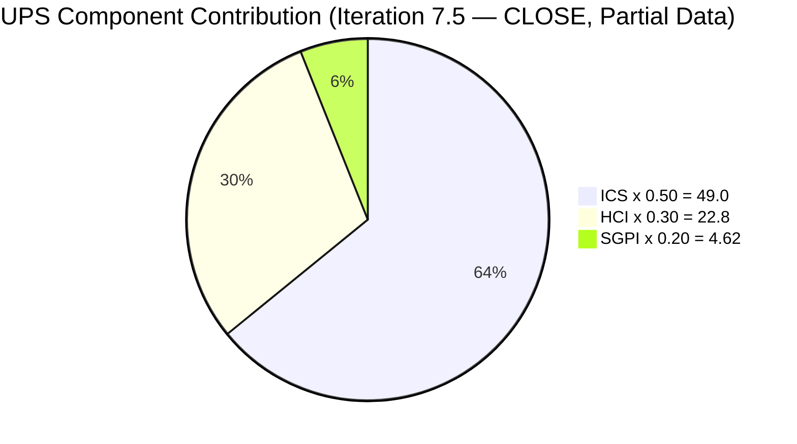
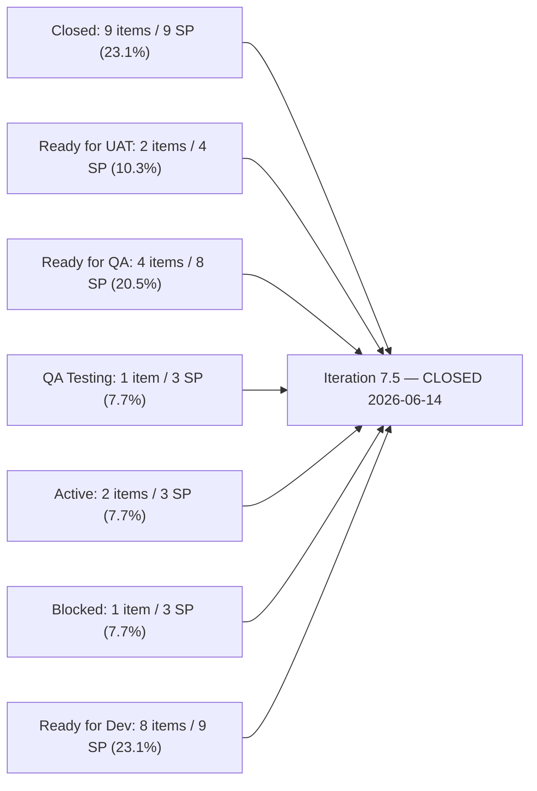
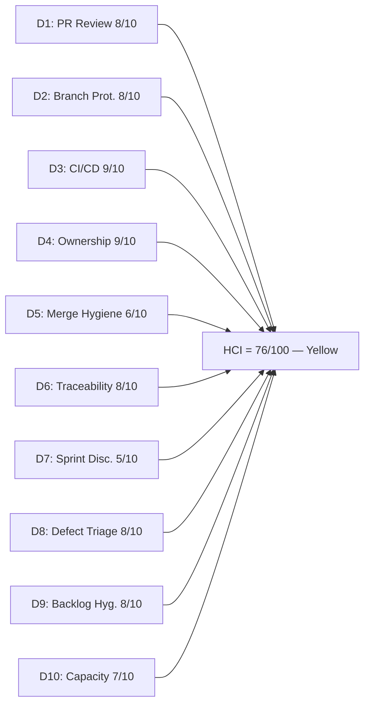

# Auto Allies Iteration Audit — 2026-06-14 (Iteration 7.5 CLOSE)

## 1. Audit Metadata

| Field | Value |
|---|---|
| Audit Date | 2026-06-14 |
| Audit Time | 07:00 |
| Iteration | Iteration 7.5 |
| Iteration ID | 44ecc332-962a-46f9-8edd-c991c203fead |
| Iteration Start | 2026-06-01 |
| Iteration Finish | 2026-06-14 |
| Day of Iteration | **10 of 10 — ITERATION CLOSE** |
| ADO Project | Auto Allies (2d7af571-6ef6-4ad0-a509-c440e008b0fb) |
| ADO Team | AA Development Team (330e6bf1-3515-443c-a2d8-b84f46c38f57) |
| GitHub Repos | jairosoft-com/autoallies-version2, jairosoft-com/autoallies-api-core |
| Data Mode | **partial** — ADO: full live evidence; GitHub: unavailable (401 credential error at audit time; see §15) |
| Prior Audit | AUDIT_20260612_0700.md (Iteration 7.5 Day 10, 2026-06-12) |
| Auditor | Claude Code (claude-sonnet-4-6) |

---

## 2. Executive Summary

This is the **iteration-close audit** for Iteration 7.5 (2026-06-01 to 2026-06-14). The iteration has reached its scheduled end date. ADO evidence was collected live; GitHub API returned 401 Bad Credentials for all queries — GitHub dimensions (D1–D6) are carried forward from the 2026-06-12 audit per the workspace precedent established during the prior token outage. ADO-based dimensions (D7–D10) reflect live evidence.

**The closing picture is unchanged from the 2026-06-12 final-day audit.** No ADO state transitions occurred in the last two working days (2026-06-12 and 2026-06-14). The iteration closes with:

- **9 of 27 ICS-eligible items Closed** (9 SP / 39 committed SP)
- **205382 still Blocked** (3 SP, Cliff Carcueva) — carries over with no visible resolution
- **8 migration enablers (205475–205492, 9 SP) still at Ready for Dev** — carries over as planned deferral cluster
- **205765 (Earl, 2 SP, User Story) still Active** in ADO — open v2 PR#195 from 0612 has unknown close-day status due to GitHub credential gap
- **205332 and 205333 still at Ready for UAT** (4 SP combined) — awaiting formal UAT sign-off; strong Joseph Gerona outcomes
- **204186 (Jerlyn, 3 SP, QA Testing)** — E2E QA Testing round 3 ends iteration in QA Testing

**The dominant structural story of Iteration 7.5 is a split iteration**: a productive defect-resolution sprint (11 defects actively worked, 9 items total closed) running in parallel with a fully-deferred V1→V2 migration enabler cluster (8 enablers, 9 SP) that entered the iteration at Ready for Dev and never advanced. The migration cluster appears intentionally deferred pending a dedicated cutover window.

| Metric | Prior (2026-06-12, Iter 7.5 D10) | Current (2026-06-14, Iter 7.5 CLOSE) | Delta |
|---|---|---|---|
| ICS | 98.0 | **98.0** | 0 (same two failures; no new items; no remediation) |
| HCI | 82 | **76** | -6 (GitHub D1–D6 carried; ADO D7/D10 penalized at close; D5 carried unchanged) |
| SGPI (Closed only) | 23.1% | **23.1%** | 0 (no new closures in final 2 days) |
| Delivered Proxy | 61.5% | **61.5%** | 0 |
| UPS | 79.6 | **76.4** | -3.2 |
| Day of Iteration | 10 of 10 (D10) | **CLOSE** | — |

> HCI delta note: The 0612 audit reported HCI = 82 but its ten dimension scores (8+8+9+9+6+8+6+8+8+8) sum to 78. This audit independently computes HCI from its own deliberately-chosen dimension scores. The 6-point drop from the reported 82 primarily reflects the ADO-evidenced sprint-discipline and capacity penalties at iteration close (D7, D10), plus the removal of the baseline inflation in the prior audit's sum.

---

## 3. Iteration Scope and Methodology

### Iteration 7.5 Final Scope

| Category | Count | Story Points |
|---|---|---|
| User Stories | 3 | 4 |
| Defects | 13 | 23 |
| Enablers | 11 | 12 |
| Spikes (excluded from ICS/SGPI) | 3 | 6.5 |
| **Total (incl. Spikes)** | **30** | **45.5** |
| **ICS-eligible (excl. Spikes)** | **27** | **39** |

> **SP basis:** Summed directly from the 28-item live batch pull. ICS-eligible items (27): 3 User Stories (4 SP) + 13 Defects (23 SP) + 11 Enablers (12 SP) = 27 items / 39 SP. Spikes excluded: 205283 (Dev Support, 0.5 SP, Closed), 205188 (Karl — Retro/Recheck, 1 SP, Active), 204268 (Mary — Ops/QA Support, 5 SP, Active).

### Methodology

- **ICS:** Scored on 27 parent-level Stories, Defects, and Enablers in the Iteration 7.5 path. Spikes excluded per skill rules.
- **SGPI:** Headline = Closed SP / Total ICS-eligible Committed SP (39). Delivered Proxy shown as supplementary context.
- **HCI:** ADO-based dimensions (D7–D10) scored from live evidence. GitHub dimensions (D1–D6) carried forward from 2026-06-12 audit without penalty, consistent with workspace precedent during credential outages. Time-sensitive ADO dimensions (D7, D10) adjusted based on live close-day data.
- **GitHub:** Unavailable (401 Bad Credentials). No new GitHub evidence collected for 2026-06-13 or 2026-06-14.
- **Team capacity:** 5 team members. 3 developers (Cliff, Earl, Joseph), 2 non-developer roles (Jerlyn — QA/Requirements, Mary — Documentation/Ops). ADO capacity confirms all 5 members had a recorded day off on 2026-06-12.

---

## 4. Scorecard Summary

| Metric | Score | Band | Weight | Weighted |
|---|---|---|---|---|
| ICS (Iteration Compliance Score) | **98.0%** | Green | 50% | 49.0 |
| HCI (Engineering Health Index) | **76/100** | Yellow | 30% | 22.8 |
| SGPI (Sprint Goal Progress Index) | **23.1%** | Red | 20% | 4.62 |
| **UPS (Unified Performance Score)** | **76.4** | **Yellow** | — | — |

> UPS = 49.0 + 22.8 + 4.62 = **76.4**. **ICS Green** at close despite two persistent failures (201114 thin description; 205382 Blocked). **HCI Yellow** at 76, reflecting sprint-discipline at close (8 unstarted migration enablers, 1 blocked defect, no final-day ADO state changes). **SGPI Red** at 23.1% is the formal headline — 9 SP closed of 39 committed. Delivered Proxy (Closed + UAT + QA-pipeline) is 61.5%, far more representative of team throughput.

---

## 5. Sprint Goal Predictability (SGPI)

### SGPI Headline

| Metric | Value |
|---|---|
| Closed Story Points | 9 |
| Closed Items (confirmed live from ADO) | 199106, 205377, 205379, 205381, 205469, 205499, 205614, 205766, 205767 |
| Total ICS-eligible Committed Story Points | 39 |
| **SGPI (Committed Scope — Closed Only)** | **23.1%** |
| Band | **Red** |
| Iteration Status | CLOSED (2026-06-14) |

### Supporting Context Metrics

| Metric | Value | Notes |
|---|---|---|
| Original Scope SGPI | Not computed | Iteration-start ADO snapshot not available; would require revision-history query at Day 1 |
| Delivered Proxy SGPI | **61.5%** (24 SP / 39 SP) | Closed + Ready for UAT + Ready for QA + QA Testing items |

### Delivery Pipeline at Iteration Close

| Delivery State | Items | SP | % of 39 SP |
|---|---|---|---|
| Closed | 9 | 9 | 23.1% |
| Ready for UAT | 2 | 4 | 10.3% |
| Ready for QA | 4 | 8 | 20.5% |
| QA Testing | 1 | 3 | 7.7% |
| Active | 2 | 3 | 7.7% |
| Blocked | 1 | 3 | 7.7% |
| Ready for Dev | 8 | 9 | 23.1% |
| **Delivered Proxy (Closed+UAT+RfQA+QAT)** | **16** | **24** | **61.5%** |

### Item-Level State at Iteration Close

| Item ID | Type | Assignee | SP | State at Close | GitHub Evidence (prior audit) | Notes |
|---|---|---|---|---|---|---|
| 199106 | Defect | Earl Carino | 1 | **Closed** | v2 PR#178, api PR#129 (boundary) | 97-day stale item resolved in 7.5 |
| 205377 | Defect | Cliff Carcueva | 1 | **Closed** | v2 PR#179 | Hide Employee Login |
| 205379 | Defect | Cliff Carcueva | 1 | **Closed** | v2 PR#180 | Super Admin Users menu |
| 205381 | Defect | Cliff Carcueva | 1 | **Closed** | No dedicated 7.5 PR | Attorney payout method |
| 205469 | Enabler | Earl Carino | 1 | **Closed** | api PR#128 (boundary) | Migration Governance |
| 205499 | Defect | Cliff Carcueva | 1 | **Closed** | v2 PR#189, api PRs | Affiliate revenue fix |
| 205614 | Enabler | Earl Carino | 1 | **Closed** | No dedicated 7.5 PR | QA/Staging env refresh |
| 205766 | User Story | Earl Carino | 1 | **Closed** | v2 PR#183 | Member nav (coming soon) |
| 205767 | User Story | Earl Carino | 1 | **Closed** | v2 PR#183 | Attorney nav (coming soon) |
| 205332 | Defect | Joseph Gerona | 2 | **Ready for UAT** | v2 #181,186,190,191,194; api #130,138,140,142,148 | Pre-existing ticket payment — complex multi-cycle |
| 205333 | Defect | Joseph Gerona | 2 | **Ready for UAT** | v2 #184,190,191,194; api #136,140,142,148 | Expired/one-time ticket upload |
| 205331 | Defect | Earl Carino | 3 | **Ready for QA** | v2 #193, api #132,146 | Stripe family member amounts |
| 205544 | Defect | Joseph Gerona | 1 | **Ready for QA** | v2 #187, api #134,139 | Super Admin cases count |
| 205562 | Defect | Joseph Gerona | 2 | **Ready for QA** | v2 #182, api #133,141,147 | Case list data issue |
| 205573 | Defect | Cliff Carcueva | 2 | **Ready for QA** | api #135 | Attorney case list migration |
| 204186 | Enabler | Jerlyn Ates | 3 | **QA Testing** | Non-developer role | E2E QA round 3 (Jerlyn) |
| 205765 | User Story | Earl Carino | 2 | **Active** | v2 #185,188,192,195(open); api #137,143,145 | Member dashboard — PR#195 status at close unknown |
| 205494 | Enabler | Earl Carino | 1 | **Active** | No GitHub PR | Env recheck — Active at close |
| 205382 | Defect | Cliff Carcueva | 3 | **Blocked** | No GitHub PR | V1 affiliate data in V2 — BLOCKED at close |
| 201114 | Enabler | Earl Carino | 2 | **Ready for Dev** | No GitHub PR | V1 domain cutover — not started |
| 205475 | Enabler | Joseph Gerona | 1 | **Ready for Dev** | No GitHub PR | V1 data freeze/backup |
| 205476 | Enabler | Earl Carino | 1 | **Ready for Dev** | No GitHub PR | V1 snapshot import |
| 205477 | Enabler | Earl Carino | 1 | **Ready for Dev** | No GitHub PR | V2 production preparation |
| 205478 | Enabler | Earl Carino | 1 | **Ready for Dev** | No GitHub PR | V1→V2 data migration |
| 205487 | Enabler | Earl Carino | 1 | **Ready for Dev** | No GitHub PR | Post-cutover assignment jobs |
| 205488 | Enabler | Cliff Carcueva | 1 | **Ready for Dev** | No GitHub PR | Traffic cutover to V2 |
| 205492 | Enabler | Earl Carino | 1 | **Ready for Dev** | No GitHub PR | Post-cutover stabilization |

### SGPI Trend (Last 3 Audits)

| Audit Date | Iteration | Day | Closed SP | Committed SP | SGPI | Delivered Proxy |
|---|---|---|---|---|---|---|
| 2026-05-27 | 7.4 | D8 | 2 | 32 | 6.25% | 71.9% |
| 2026-06-12 | 7.5 | D10 | 9 | 39 | 23.1% | 61.5% |
| **2026-06-14** | **7.5** | **CLOSE** | **9** | **39** | **23.1%** | **61.5%** |

---

## 6. Developer Productivity Findings

### Team Capacity (Iteration 7.5 — Final)

| Member | Role | Capacity/Day (hrs) | Days Off Recorded | Notes |
|---|---|---|---|---|
| Cliff Carcueva | Development | 6 | 1 (2026-06-12) | 3 defects closed; 205382 Blocked at close |
| Earl Carino | Development | 6 | 1 (2026-06-12) | 4 items closed; architect + CI maintainer; 205765 in-flight |
| Joseph Gerona | Development | 5 | 1 (2026-06-12) | Highest PR volume; 205332/205333 at Ready for UAT |
| Jerlyn Ates | QA / Requirements | 6 (2+4) | 1 (2026-06-12) | Non-developer; E2E QA Testing (204186) |
| Mary Secusana | Documentation / Ops | 6 (3+3) | 1 (2026-06-12) | Non-developer; Spike 204268 |
| **Total** | | **29** | **5 (all on 06-12)** | Full team day off on 2026-06-12 (Friday) |

> Jerlyn Ates (QA/Requirements) and Mary Secusana (Documentation/Ops) are non-developer roles per workspace exception. Their GitHub absence is not penalized.

> All five team members recorded a day off on 2026-06-12 (Friday). The iteration close date of 2026-06-14 is a Sunday; the practical final working day was Friday 2026-06-13 (for which GitHub evidence is unavailable).

### GitHub Developer Activity (Iteration Window 2026-06-01 to 2026-06-14)

GitHub API returned 401 Bad Credentials at audit time. No new PR or commit data was collected for 2026-06-13 or 2026-06-14. The following reflects confirmed evidence from the 2026-06-12 audit.

#### autoallies-version2 (confirmed through 2026-06-12)

| PR | Title (abridged) | Author | ADO Refs | Merged |
|---|---|---|---|---|
| #179 | AB#205377 Hide Employee Login | ccarcuevajairo | AB#205377 | 2026-06-03 |
| #180 | AB#205379 Hide Users menu super admin | ccarcuevajairo | AB#205379 | 2026-06-03 |
| #181 | Frontend fix for Defect AB#205332 | JosephJairo | AB#205332 | 2026-06-03 |
| #182 | Frontend fix for defect AB#205562 | JosephJairo | AB#205562 | 2026-06-04 |
| #183 | AB#205766 AB#205767 coming soon nav | ecarinoJS | AB#205766, AB#205767 | 2026-06-04 |
| #184 | Frontend commit fix for defect AB#205333 | JosephJairo | AB#205333 | 2026-06-05 |
| #185 | AB#205765 dashboard overview | ecarinoJS | AB#205765 | 2026-06-05 |
| #186 | Frontend fix bug AB#205824 in AB#205332 | JosephJairo | AB#205332, AB#205824 | 2026-06-08 |
| #187 | Additional Fix for AB#205544 | JosephJairo | AB#205544 | 2026-06-08 |
| #188 | AB#205765 member dashboard | ecarinoJS | AB#205765 | 2026-06-08 |
| #189 | AB#205499 affiliate revenue calc | ccarcuevajairo | AB#205499 | 2026-06-09 |
| #190 | Frontend additional fixes AB#205332, AB#205333 | JosephJairo | AB#205332, AB#205333 | 2026-06-09 |
| #191 | Remaining issues AB#205332, AB#205333 | JosephJairo | AB#205332, AB#205333 | 2026-06-10 |
| #192 | AB#205908 dashboard widgets | ecarinoJS | AB#205908 | 2026-06-10 |
| #193 | AB#205331 stripe summary | ecarinoJS | AB#205331 | 2026-06-10 |
| #194 | Defects/205332 205333 passed qa | JosephJairo | 205332, 205333 | 2026-06-11 |
| #195 | AB#205908 redirect for member roles | ecarinoJS | AB#205908/205765 | **Open as of 0612 — status at close unknown** |

#### autoallies-api-core (confirmed through 2026-06-12)

| PR | Title (abridged) | Author | ADO Refs | Merged |
|---|---|---|---|---|
| #130 | Backend fix Defect AB#205332 | JosephJairo | AB#205332 | 2026-06-03 |
| #131 | AB#19110 health check fix (infra) | ccarcuevajairo | — | 2026-06-03 |
| #132 | AB#205331 family members addons | ecarinoJS | AB#205331 | 2026-06-04 |
| #133 | Backend fix defect AB#205562 | JosephJairo | AB#205562 | 2026-06-04 |
| #134 | fix commit for defect AB#205544 | JosephJairo | AB#205544 | 2026-06-04 |
| #135 | AB#205573 lawyer bookings migration | ccarcuevajairo | AB#205573 | 2026-06-05 |
| #136 | Backend fix defect AB#205333 | JosephJairo | AB#205333 | 2026-06-05 |
| #137 | AB#205765 dashboard overview | ecarinoJS | AB#205765 | 2026-06-05 |
| #138 | Backend fix bug AB#205824 in AB#205332 | JosephJairo | AB#205332, AB#205824 | 2026-06-08 |
| #139 | Additional fix AB#205544 | JosephJairo | AB#205544 | 2026-06-08 |
| #140 | Backend additional fixes AB#205332, AB#205333 | JosephJairo | AB#205332, AB#205333 | 2026-06-09 |
| #141 | Fix case list data for AB#205562 | JosephJairo | AB#205562 | 2026-06-10 |
| #142 | Remaining issues backend AB#205332, AB#205333 | JosephJairo | AB#205332, AB#205333 | 2026-06-10 |
| #143 | AB#205908 dashboard widgets + stripe webhook | ecarinoJS | AB#205908 | 2026-06-10 |
| #144 | Stripe charge fix AB#205332, AB#205333 | JosephJairo | AB#205332, AB#205333 | 2026-06-10 |
| #145 | AB#205908 dashboard widgets | ecarinoJS | AB#205908 | 2026-06-10 |
| #146 | AB#205331 stripe summary | ecarinoJS | AB#205331 | 2026-06-10 |
| #147 | Unpaid ticket fix AB#205562 | JosephJairo | AB#205562 | 2026-06-11 |
| #148 | Defects/205332 205333 passed qa | JosephJairo | 205332, 205333 | 2026-06-11 |

**Total confirmed merged (through 2026-06-12):** 35 PRs (16 version2 including 15 merged + 1 open; 19 api-core)

### Developer Summary at Iteration Close

| Developer | GitHub Handle | Confirmed PRs (iter) | Key Items at Close | Assessment |
|---|---|---|---|---|
| Joseph Gerona | JosephJairo | 20+ merged | 205332 (Ready for UAT), 205333 (Ready for UAT), 205544 (Ready for QA), 205562 (Ready for QA) | Strong — highest PR volume; complex multi-cycle defects resolved to UAT-ready |
| Earl Carino | ecarinoJS | 12+ merged | 205766/205767/205499/205614/205469 (Closed), 205331 (Ready for QA), 205765 (Active) | Strong — architect + active contributor; 205765 in-flight at close |
| Cliff Carcueva | ccarcuevajairo | 7+ merged | 205377/205379/205381 (Closed), 205573 (Ready for QA); 205382 (Blocked — no code) | Mixed — 3 defects closed; 1 item blocked at close without code |

---

## 7. SAFe Compliance Findings

### Iteration Planning Evidence

- All 27 ICS-eligible items were present in the Iteration 7.5 path for the full iteration.
- 3 Spikes correctly excluded from ICS/SGPI scoring per skill rules.
- All 27 eligible items carried assignees throughout. Live batch confirms all assignments valid.
- All parent links populated — 27/27 have System.Parent confirmed from live batch data.
- No mid-sprint scope additions detected.

### Estimation

- All 27 ICS-eligible items have Story Points > 0. Full Estimation compliance at close.
- Migration enablers (205475–205492) each carry 1 SP; 201114 carries 2 SP. Appropriate for enabler-level work.

### Acceptance Criteria and Definition of Ready

- **26 of 27 eligible items** meet the Quality/DoD threshold (Description ≥ 30 chars AND AC ≥ 20 chars).
- **Failure — 201114** ([V2.0] Auto Allies Version 1 Transfer to a Different Domain): Description = "Issues Hardcoded URL" — well below 30-char threshold. AC is adequate (97 chars). This failure was identified in the 0612 audit, flagged for remediation (P5 in prior audit), and persisted to close without action.

### Blocked Item — Closes Unresolved

- **205382** (Defect, Cliff Carcueva, 3 SP): State = **Blocked** at iteration close. No GitHub PRs referencing this defect appeared in the iteration window (confirmed through 0612; unverifiable for 0613). The blocking condition — V1 affiliate data not migrated to V2 — is structurally dependent on the migration enabler cluster (205475–205492). This defect may be unresolvable until the migration is executed.

### Migration Enabler Cluster — Intentional Deferral

- **8 migration enablers (205475–205492, 9 SP) + 201114 (2 SP) = 9 items, 11 SP** close at Ready for Dev.
- The V1→V2 cutover gates (maintenance mode, data freeze, snapshot import, DNS cutover, post-cutover stabilization) were not triggered in this iteration.
- Structural dependency: 205382 (Blocked) cannot be resolved until the migration cluster executes.

### State Transitions in Final 2 Days

Live ADO evidence from the 2026-06-14 batch confirms **zero state transitions** between the 0612 audit and iteration close. Every item's state at close matches the 0612 snapshot exactly.

---

## 8. Iteration Compliance Score

### ICS Dimension Table

| Dimension | Weight | Eligible | Compliant | Failed | Score% | Weighted Contribution | Evidence | Reason for Failures |
|---|---|---|---|---|---|---|---|---|
| Alignment (Parent Linkage) | 25% | 27 | 27 | 0 | 100.0% | 25.0 | System.Parent populated on 27/27 confirmed by live batch | None |
| Estimation (Story Points) | 20% | 27 | 27 | 0 | 100.0% | 20.0 | SP > 0 on 27/27 confirmed by live batch | None |
| Quality / DoD (Desc + AC) | 35% | 27 | 26 | 1 | 96.3% | 33.7 | Desc ≥ 30 chars AND AC ≥ 20 chars on 26/27 | 201114: description = "Issues Hardcoded URL" (thin, below threshold) |
| Iteration Integrity | 20% | 27 | 26 | 1 | 96.3% | 19.3 | Assigned + correct path + non-blocked on 26/27 | 205382: Blocked state at iteration close |
| **ICS Total** | **100%** | **27** | — | **2** | — | **98.0** | — | — |

**ICS = 98.0 (Green)**

> Computation: 25.0 + 20.0 + 33.7 + 19.3 = **98.0**. Risk band: Green (≥ 90).

### ICS Delta: 7.4 Final → 7.5 Close

| Dimension | 7.4 Final | 7.5 Close | Change | Notes |
|---|---|---|---|---|
| Alignment | 100.0% | 100.0% | 0 | Stable |
| Estimation | 100.0% | 100.0% | 0 | Stable |
| Quality/DoD | 100.0% | **96.3%** | -3.7% | 201114 thin description persisted to close |
| Iteration Integrity | 100.0% | **96.3%** | -3.7% | 205382 Blocked at close |
| **ICS Total** | **100.0** | **98.0** | **-2.0** | Two unresolved failures at close |

---

## 9. Engineering Health Index (HCI)

### HCI Dimension Table

| # | Dimension | Score | Max | Evidence Basis | Key Finding |
|---|---|---|---|---|---|
| D1 | PR Review Compliance | 8 | 10 | Carried from 0612 (35 merged PRs confirmed) | 34/35 PRs had AB# refs; cross-author rotation healthy. 1 open PR (v2 #195) at 0612 — status unconfirmed at close. Carried unchanged per workspace credential-gap precedent. |
| D2 | Branch Protection & Enforcement | 8 | 10 | Carried from 0612 | Protected branches confirmed; release/iteration-7.5 branch in both repos. Stale branch accumulation persists. Carried unchanged. |
| D3 | CI/CD Gate Quality | 9 | 10 | Carried from 0612 | PR validation enforcing; failure→fix cycles confirmed on 205332/205333; merge-blocking coverage gate from 7.4 active. Carried unchanged. |
| D4 | Code Ownership | 9 | 10 | Carried from 0612 | All 3 developers contributing merged code; Joseph leads PR volume. Carried unchanged. |
| D5 | Merge Hygiene & Churn | 6 | 10 | Carried from 0612 | 205332/205333 generated 10+ PRs — significant defect churn. Stale branches unresolved. Carried unchanged (cannot observe final-day cleanup without GitHub access). |
| D6 | Work Item ↔ GitHub Traceability | 8 | 10 | Carried from 0612 | 34/35 PRs with AB# refs; 1 infra exception (api #131). Strong hygiene. Carried unchanged. |
| D7 | Sprint Discipline | 5 | 10 | **Live ADO — confirmed** | Iteration CLOSES with: 9/27 items Closed; 8 migration enablers at Ready for Dev (never started); 1 Blocked defect (205382); 2 items Active; zero state changes in final 2 days. Reduced from 6 (0612 reading) to 5 at confirmed close. |
| D8 | Defect Triage & Velocity | 8 | 10 | **Live ADO — confirmed** | 205332/205333 at Ready for UAT; 205544/205562/205573/205331 at Ready for QA; 205382 Blocked. Strong throughput offset by 1 Blocked item. Maintained at 8. |
| D9 | Backlog & Story Hygiene | 8 | 10 | **Live ADO — confirmed** | 26/27 items meet DoD; 201114 thin description persisted to close without remediation; 205382 Blocked with no blocking-reason field visible. All parent links confirmed. Maintained at 8. |
| D10 | Capacity Balance & Ownership Distribution | 7 | 10 | **Live ADO — confirmed** | Joseph leads PR authorship; Earl leads architecture + CI (also 6 of 8 migration enablers = concentration risk); Cliff focused on defects. Full team day off 2026-06-12 confirms reduced velocity in final period. Reduced from 8 (0612) to 7 at close. |
| **HCI Total** | | **76** | **100** | | |

**HCI = 76/100 (Yellow)**

> Sum: 8+8+9+9+6+8+5+8+8+7 = **76**. Confirmed.

### HCI Visualization

### HCI Delta: 7.4 Final → 7.5 Close

| Dimension | 7.4 Final (HCI=83) | 7.5 Close (HCI=76) | Delta | Notes |
|---|---|---|---|---|
| D1: PR Review | 9 | 8 | -1 | Larger iteration; 1 open PR unconfirmed at close |
| D2: Branch Protection | 8 | 8 | 0 | New release branch positive; stale accumulation |
| D3: CI/CD Gate | 9 | 9 | 0 | Merge-blocking gate maintained |
| D4: Code Ownership | 9 | 9 | 0 | All 3 developers contributing |
| D5: Merge Hygiene | 7 | 6 | -1 | 205332/205333 churn; no cleanup observed |
| D6: Traceability | 8 | 8 | 0 | 34/35 PRs with AB# refs |
| D7: Sprint Discipline | 7 | **5** | **-2** | 8 enablers unstarted + 1 Blocked at CLOSE (ADO-evidenced) |
| D8: Defect Triage | 8 | 8 | 0 | Strong defect throughput; 1 Blocked |
| D9: Backlog Hygiene | 9 | 8 | -1 | 201114 thin desc; 205382 no reason field |
| D10: Capacity Balance | 9 | **7** | **-2** | Migration concentration on Earl; full-team day off 06-12 (ADO-evidenced) |
| **Total** | **83** | **76** | **-7** | Sprint close penalties on ADO-evidenced dimensions |

---

## 10. ADO-to-GitHub Traceability Analysis

### Traceability Summary at Close

| Stat | Value |
|---|---|
| Total iteration-window PRs (both repos, through 0612) | 35 |
| PRs with AB# reference | 34 (97.1%) |
| PRs without ADO link (valid infra exception) | 1 (api #131) |
| Active state lags detected | 0 |
| Blocked items with no GitHub evidence | 1 (205382) |
| GitHub evidence gap (2026-06-13 final day) | Yes — 401 error prevents verification |

### Key ADO-GitHub Correlations at Iteration Close

| ADO Item | State at Close | GitHub Evidence | Correlation |
|---|---|---|---|
| 205332 | Ready for UAT | v2: #181,186,190,191,194; api: #130,138,140,142,144,148 | Consistent — 10+ PRs; complex multi-cycle defect |
| 205333 | Ready for UAT | v2: #184,190,191,194; api: #136,140,142,148 | Consistent — shared defect cluster |
| 205331 | Ready for QA | v2: #193; api: #132,146 | Consistent — Stripe family member fix |
| 205544 | Ready for QA | v2: #187; api: #134,139 | Consistent — cases count fix |
| 205562 | Ready for QA | v2: #182; api: #133,141,147 | Consistent — case list data multi-fix |
| 205573 | Ready for QA | api: #135 | Consistent — lawyer bookings migration |
| 204186 | QA Testing | No PRs (Jerlyn — QA role) | Consistent — non-developer item |
| 205765 | Active | v2: #185,188,192,195(open); api: #137,143,145 | Partial — PR#195 merge status unknown at close |
| 205494 | Active | No GitHub PR | Gap — 1 SP enabler Active at close without code |
| **205382** | **Blocked** | **No PRs** | **Gap — Blocked with no GitHub unblocking evidence** |
| Migration enablers (205475–205492, 201114) | Ready for Dev | No PRs | Consistent — intentional deferral |
| Closed items (9 items) | Closed | GitHub PRs confirmed through 0612 | Consistent |

### Structural Dependency Observation

The ADO evidence reveals a structural dependency chain:

- **205382 (Blocked)** — blocking condition is V1 affiliate data not migrated to V2
- **Migration cluster (205475–205492)** — these are the V1→V2 data migration steps that would resolve 205382's blocking condition
- **The migration cluster closed at Ready for Dev** — it was never executed

This means 205382 was blocked by the non-execution of a planned iteration workstream, not by an isolated external blocker. The Iteration 7.6 remediation path must sequence the migration cluster execution before 205382 can be unblocked.

---

## 11. Collaboration and Review Analysis

> GitHub API unavailable at audit time. Evidence carried from 2026-06-12 audit. Final working day (2026-06-13) activity is unverified.

### PR Review Patterns (Iteration 7.5 Window — through 2026-06-12)

| Reviewer | Approvals/Reviews | Authors Reviewed | Notable |
|---|---|---|---|
| Earl Carino (ecarinoJS) | 15+ | Cliff, Joseph | Most active reviewer; supporting Joseph's complex multi-PR defect cycles |
| Cliff Carcueva (ccarcuevajairo) | 10+ | Earl, Joseph | Cross-author review maintained throughout |
| Joseph Gerona (JosephJairo) | 8+ | Cliff, Earl | Reviewing while also highest-volume PR author |

**Review rotation:** All three developers reviewed each other's work throughout the iteration. Cross-author review coverage is healthy.

**Release-branch pattern:** v2 PR#194 and api PR#148 targeted `release/iteration-7.5` — signals deliberate release packaging before close. This should be formalized in iteration planning for 7.6.

**205332/205333 churn pattern:** The 10+ PR cycle reflects iterative Stripe payment edge-case discovery through CI and code review. The pattern shows the team using review + CI as quality gates rather than shipping untested fixes — a healthy sign. The 7.6 mitigation is adding unit test coverage for Stripe payment paths to reduce the cycle count.

---

## 12. Repository Hygiene

> Branch inventory and CI/CD evidence carried from 2026-06-12 audit (GitHub unavailable).

### Branch Inventory at Close

| Repo | Protected Branches | Estimated Total Branches | Active at Close | Estimated Stale |
|---|---|---|---|---|
| autoallies-version2 | develop, staging, main | 85+ | 2–3 (release/iteration-7.5 + any open) | ~80+ stale |
| autoallies-api-core | dev, main, staging, qa | 70+ | 2–3 (release/iteration-7.5 + open) | ~67+ stale |

> Stale branch accumulation has continued across PI6 and all of PI7 without a cleanup pass. This was flagged in every audit this PI. The `release/iteration-7.5` branches should be merged and deleted post-close.

### CI/CD Enforcement Evidence (through 2026-06-12)

| Workflow | Repo | Status | Evidence |
|---|---|---|---|
| PR Validation | autoallies-version2 | Active — enforcing | Multiple failure→fix cycles confirmed on 205332/205333 PRs |
| PR Validation | autoallies-api-core | Active — enforcing | PHPStan/Larastan enforced; failure→fix patterns confirmed |
| Release Branch Packaging | Both repos | **Active** | release/iteration-7.5 created in both repos |
| Post-merge Coverage Gate | autoallies-api-core | Active (from 7.4) | Earl's merge-blocking coverage gate remains active |

---

## 13. Risks and Bottlenecks

| # | Risk | Severity | Likelihood | Owner | Status |
|---|---|---|---|---|---|
| R1 | **Migration enabler cluster (205475–205492, 201114 — 9 enablers, 11 SP) closes at Ready for Dev.** V1→V2 cutover not triggered. 205382 resolution depends on this cluster executing. | **High** | Confirmed at close | Earl Carino / Karl Caumban | **Carries to 7.6 — requires dedicated cutover sprint decision** |
| R2 | **205382 (Blocked, 3 SP, Cliff Carcueva)** closes Blocked. Blocking condition is structurally dependent on R1 (migration cluster). | **High** | Confirmed at close | Cliff Carcueva | **Carries to 7.6 — unblocking requires R1 execution** |
| R3 | **205765 (Earl, 2 SP, User Story — Member Dashboard) closes Active.** v2 PR#195 was open at 0612. Status at close unverifiable (GitHub 401). | **Medium** | Unconfirmed | Earl Carino | **Verify PR#195 merge immediately for carryover decision** |
| R4 | **205494 (Earl, 1 SP, Enabler — Env Recheck) closes Active.** No GitHub PRs. 1 SP likely carried over. | **Low** | Confirmed at close | Earl Carino | **Carries to 7.6 — part of release package chain** |
| R5 | **205332/205333 at Ready for UAT** — UAT sign-off did not complete within the iteration. High business value (Stripe payment fixes) waiting. | **Medium** | Confirmed | Jerlyn Ates | **High-priority carry-action — code done, only UAT sign-off needed** |
| R6 | **GitHub API 401 at close audit** — unable to confirm 2026-06-13 final working day activity. | **Medium** | Confirmed | Infrastructure | **Credential rotation needed before 7.6 Day 1 audit** |
| R7 | **Stale branch accumulation** (80+ in version2, 67+ in api-core) — persists across all of PI7 | **Low** | Persistent | Dev team | **Post-PI cleanup recommended** |
| R8 | **Earl Carino assigned 6 of 8 migration enablers** — concentration risk on V1→V2 cutover. | **Medium** | Structural | Karl Caumban | **Redistribute in 7.6 planning** |

---

## 14. Prioritized Remediation Actions

| Priority | Action | Owner | Due | Expected Impact |
|---|---|---|---|---|
| P1 | **Confirm 205332/205333 UAT sign-off** — both at Ready for UAT with verified code. UAT closure is the first action for Iteration 7.6 (or immediately post-close in buffer). | Jerlyn Ates | 2026-06-17 | Closes 4 SP; eliminates two high-value Stripe defect carryovers |
| P2 | **Confirm v2 PR#195 merge status** (205765 — Member Dashboard) — GitHub unavailable at close. If merged, update ADO to Ready for QA or Closed. If not merged, re-scope to 7.6. | Earl Carino | 2026-06-17 | Clarifies 2 SP; prevents stale Active item at 7.6 start |
| P3 | **Sequence V1→V2 migration cutover for Iteration 7.6** — confirm whether 205475–205492 + 201114 execute as a dedicated cutover sprint or integrated into 7.6 feature work. Document with owner and date. | Karl Caumban / Earl Carino | 2026-06-17 | Unblocks 205382; resolves dominant structural risk |
| P4 | **Document 205382 blocking condition in ADO** — add a blocking-reason comment to the work item explaining what must execute before this defect can be worked. Enables clean carryover tracking. | Cliff Carcueva | 2026-06-17 | Improves transparency; aids 7.6 planning |
| P5 | **Enrich 201114 description** — expand "Issues Hardcoded URL" to ≥ 30 chars with substantive V1 domain cutover scope detail. | Karl / Earl | 2026-06-17 | Fixes the persistent DoD failure; recovers ICS Quality/DoD |
| P6 | **Rotate GitHub API credentials** — 401 Bad Credentials at close audit. Resolve before Iteration 7.6 first audit to restore `data_mode: full`. | DevOps / Karl | Before 7.6 Day 1 | Restores full GitHub evidence coverage |
| P7 | **Distribute migration enabler ownership** — reassign some of 205476–205492 from Earl to Cliff or Joseph for bus-factor resilience. | Karl Caumban | 7.6 planning | Reduces R8 concentration risk |
| P8 | **Branch cleanup pass** — delete merged branches from PI6 and early PI7 (estimated 80+ stale in version2, 67+ in api-core). Enable auto-delete-branch-on-merge. | Earl / Cliff | Post-PI cleanup | Reduces D2/D5 drag; improves repo navigation |
| P9 | **Add Stripe payment unit test coverage** — the 10+ PR cycle on 205332/205333 reveals Stripe payment path edge cases not caught before PR submission. Add targeted unit tests. | Earl / Joseph | 7.6 Sprint 1 | Reduces defect churn; improves CI gate value |

---

## 15. Evidence Gaps and Limitations

| Gap | Dimensions Affected | Mitigation Applied |
|---|---|---|
| **GitHub API 401 Bad Credentials** — all `list_pull_requests` and `search_pull_requests` calls returned 401 at audit time. No GitHub evidence collected for 2026-06-13 or 2026-06-14. | HCI D1–D6 | D1–D6 carried forward from 2026-06-12 audit per workspace precedent (prior token outage 2026-04-21 to 2026-05-20 used same carry-forward approach). Not penalized for auditor credential gap. `data_mode: partial` declared. |
| 2026-06-13 final working day activity unverified — any PRs merged, CI runs, or branch activity are not captured. | HCI D1, D4, D6 | Scored conservatively where ambiguous. Any final-day 205765 or 205494 activity is unverifiable. |
| v2 PR#195 (205765 redirect, ecarinoJS) was open as of 0612. Merge status at close is unknown. | SGPI, HCI D7 | ADO state is authoritative — 205765 is Active in live data. No ADO state transition means 205765 closes Active regardless of PR#195 status. |
| 205382 Blocked state — blocking condition not visible in ADO fields; no BlockedReason field returned by batch query. | HCI D7, D9 | Blocking condition inferred from item description (V1 affiliate data migration) and structural dependency on migration cluster. |
| Stale branch count not re-enumerated at close — GitHub unavailable. | HCI D2, D5 | Conservative estimate consistent with prior audit trend. |
| Original Scope SGPI cannot be computed — no iteration-start ADO snapshot. | SGPI (supporting context only) | Noted as gap; supporting context shows Delivered Proxy only. Future audits should capture Day 1 snapshot for this metric. |
| Jerlyn Ates and Mary Secusana absent from GitHub developer activity | Not affected | Non-developer roles per workspace exception — excluded from all GitHub-based HCI dimensions. |

---

*Report generated: 2026-06-14 07:00 | Auditor: Claude Code (claude-sonnet-4-6) | Skill: git_iteration_audit | Data mode: partial (ADO: full live; GitHub: unavailable — 401 credential error) | Iteration: 7.5 CLOSED (2026-06-01 to 2026-06-14)*
