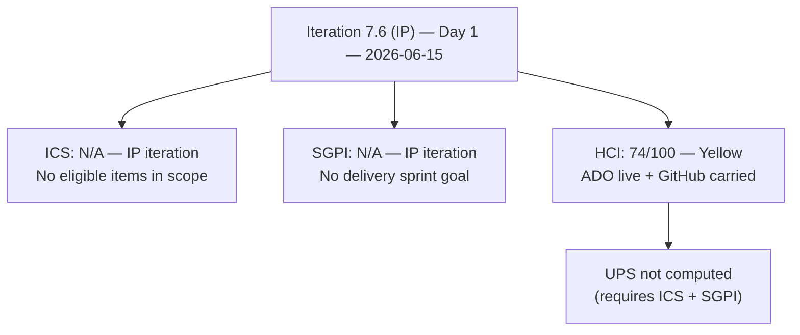
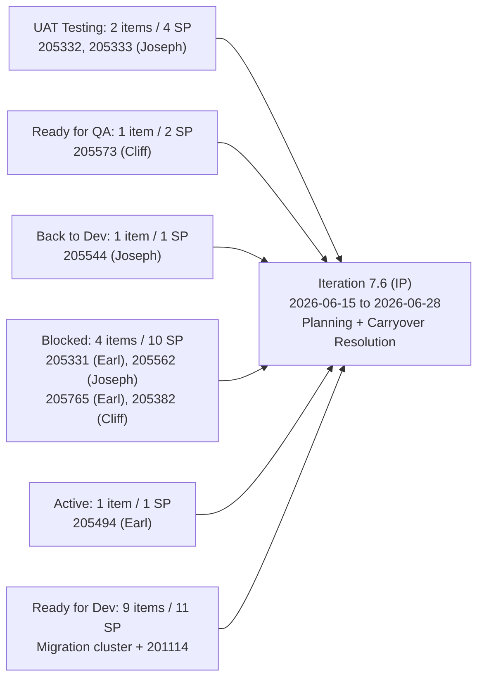
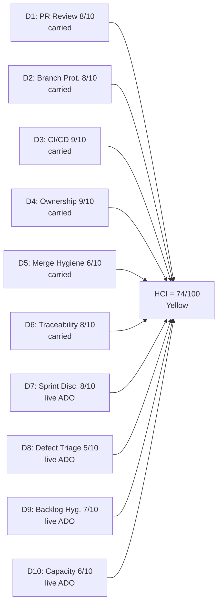

# Auto Allies Iteration Audit — 2026-06-15 (Iteration 7.6 IP — Day 1)

## 1. Audit Metadata

| Field | Value |
|---|---|
| Audit Date | 2026-06-15 |
| Audit Time | 07:00 |
| Iteration | **Iteration 7.6 (IP)** — Innovation and Planning |
| Iteration ID | 4161effc-4731-4264-ab04-90f51acbc69f |
| Iteration Start | 2026-06-15 |
| Iteration Finish | 2026-06-28 |
| Day of Iteration | **Day 1 of 10** |
| ADO Project | Auto Allies (2d7af571-6ef6-4ad0-a509-c440e008b0fb) |
| ADO Team | AA Development Team (330e6bf1-3515-443c-a2d8-b84f46c38f57) |
| GitHub Repos | jairosoft-com/autoallies-version2, jairosoft-com/autoallies-api-core |
| Data Mode | **partial** — ADO: full live evidence; GitHub: unavailable (401 Bad Credentials; same credential gap as 2026-06-14 close audit) |
| Prior Audit | AUDIT_20260614_0700.md (Iteration 7.5 CLOSE, ICS=98.0, HCI=76, SGPI=23.1%) |
| Auditor | Claude Code (claude-sonnet-4-6) |

---

## 2. Executive Summary

This is the **Day 1 audit** for Iteration 7.6 (IP) — the Innovation and Planning iteration for PI7, running 2026-06-15 to 2026-06-28. IP iterations in SAFe are reserved for team retrospectives, PI planning, inspect and adapt activities, Agile training, and carryover resolution. They are **not sprint-delivery iterations**.

**Structural note:** Because this is an IP iteration, ICS and SGPI are **not applicable** — there are no committed user stories, defects, or enablers with sprint delivery intent. The only ADO items currently scoped to 7.6 (IP) are two Spikes (planning/assessment activities). ICS and SGPI scoring requires at least one eligible non-Spike item.

**HCI score is computed at 74/100 (Yellow).** GitHub D1–D6 dimensions are carried from the 2026-06-12 audit (last full-data audit with confirmed 35 merged PRs) per workspace credential-gap precedent. ADO-based dimensions (D7–D10) are scored from live Day 1 evidence, including a materially significant post-iteration-close state-change observation: **three additional items moved to Blocked** on Day 1 (205331, 205562, 205765) and **one regressed from Ready for QA to Back to Dev** (205544). These items remain in the 7.5 iteration path and have not yet been assigned to 7.6 (IP).

**Primary story entering IP:** The team enters the Innovation and Planning iteration with several high-priority carryovers from Iteration 7.5 that have worsened since the close audit:

- 205332 and 205333 advanced to **UAT Testing** (positive — Jerlyn actively engaged on Day 1)
- 205331 regressed to **Blocked** (was Ready for QA at 7.5 close) — Earl Carino's Stripe family member amounts defect
- 205562 regressed to **Blocked** (was Ready for QA at 7.5 close) — Joseph Gerona's case list data issue
- 205765 regressed to **Blocked** (was Active at 7.5 close) — Earl Carino's Member Dashboard user story
- 205544 regressed to **Back to Dev** (was Ready for QA at 7.5 close) — Joseph Gerona's cases count
- 205382 remains **Blocked** (unchanged from 7.5 close) — Cliff Carcueva's affiliate migration dependency

The V1→V2 migration enabler cluster (201114, 205475–205492) remains entirely at **Ready for Dev** in the 7.5 path. The IP iteration is the appropriate window to sequence and plan this cluster for Iteration 7.7.

| Metric | Prior (2026-06-14, Iter 7.5 CLOSE) | Current (2026-06-15, Iter 7.6 IP Day 1) | Delta |
|---|---|---|---|
| ICS | 98.0 (Green) | **N/A** (IP iteration) | — |
| SGPI | 23.1% (Red) | **N/A** (IP iteration) | — |
| HCI | 76 (Yellow) | **74 (Yellow)** | -2 |
| UPS | 76.4 | **N/A** | — |
| Blocked Items | 1 (205382) | **4** (205382, 205331, 205562, 205765) | +3 |
| Back to Dev | 0 | **1** (205544) | +1 |

---

## 3. Iteration Scope and Methodology

### Iteration 7.6 (IP) Scope

| Category | Count | Story Points | Notes |
|---|---|---|---|
| Spikes (in 7.6 IP path) | 2 | 1.0 | 202786 (Self Assessment), 202787 (CSAT Survey) |
| ICS-eligible items | **0** | **0** | No User Stories, Defects, or Enablers in 7.6 (IP) |
| **Total in 7.6 (IP) path** | **2** | **1.0** | Both assigned to Karl Caumban (Project Manager) |

### Carryover Items (Still in 7.5 Path as of Day 1)

| Item | Type | State on Day 1 | Prior State (7.5 Close) | SP | Assignee | Delta |
|---|---|---|---|---|---|---|
| 205332 | Defect | **UAT Testing** | Ready for UAT | 2 | Joseph Gerona | Progressed |
| 205333 | Defect | **UAT Testing** | Ready for UAT | 2 | Joseph Gerona | Progressed |
| 205573 | Defect | Ready for QA | Ready for QA | 2 | Cliff Carcueva | Unchanged |
| 205331 | Defect | **Blocked** | Ready for QA | 3 | Earl Carino | **Regressed** |
| 205562 | Defect | **Blocked** | Ready for QA | 2 | Joseph Gerona | **Regressed** |
| 205765 | User Story | **Blocked** | Active | 2 | Earl Carino | **Regressed** |
| 205544 | Defect | **Back to Dev** | Ready for QA | 1 | Joseph Gerona | **Regressed** |
| 205382 | Defect | Blocked | Blocked | 3 | Cliff Carcueva | Unchanged |
| 205494 | Enabler | Active | Active | 1 | Earl Carino | Unchanged |
| 201114 | Enabler | Ready for Dev | Ready for Dev | 2 | Earl Carino | Unchanged |
| 205475 | Enabler | Ready for Dev | Ready for Dev | 1 | Joseph Gerona | Unchanged |
| 205476–205492 | Enablers (7) | Ready for Dev | Ready for Dev | 7 | Earl/Cliff | Unchanged |

### Methodology

- **ICS:** Not scored. Zero ICS-eligible items (User Stories, Defects, Enablers) are assigned to the Iteration 7.6 (IP) path. IP iterations are planning/reflection windows, not sprint delivery windows.
- **SGPI:** Not scored. IP iterations do not have a committed story-point delivery goal.
- **HCI:** Scored. ADO-based dimensions (D7–D10) use live Day 1 evidence. GitHub dimensions (D1–D6) carried from the 2026-06-12 audit (last confirmed full-evidence session, 35 merged PRs) per workspace credential-gap precedent. GitHub returned 401 Bad Credentials for all API calls.
- **UPS:** Not computed. UPS = ICS × 0.50 + HCI × 0.30 + SGPI × 0.20. With ICS and SGPI both N/A, UPS cannot be meaningfully computed.

---

## 4. Scorecard Summary

| Metric | Score | Band | Notes |
|---|---|---|---|
| ICS (Iteration Compliance Score) | **N/A** | — | IP iteration — 0 eligible items |
| SGPI (Sprint Goal Progress Index) | **N/A** | — | IP iteration — no delivery goal |
| HCI (Engineering Health Index) | **74/100** | **Yellow** | D1–D6 carried from 0612; D7–D10 live ADO |
| UPS (Unified Performance Score) | **N/A** | — | Cannot compute without ICS + SGPI |

> HCI delta from 7.5 close (76) to 7.6 IP Day 1 (74): -2 points. Primary driver is D8 (Defect Triage) drop reflecting 3 new Blocked items and 1 Back-to-Dev regression entering the IP window.

---

## 5. Sprint Goal Predictability (SGPI)

### SGPI — Not Applicable (IP Iteration)

Iteration 7.6 (IP) is an **Innovation and Planning iteration**. IP iterations in SAFe are not sprint delivery windows. There is no committed story-point scope, no sprint goal, and therefore no SGPI computation.

### Carryover Delivery Pipeline from Iteration 7.5

Although SGPI is not scored, the carryover state is tracked for 7.6 planning context:

| Carryover State | Items | SP | Notes |
|---|---|---|---|
| UAT Testing | 2 | 4 | 205332, 205333 — progressed to UAT since 7.5 close |
| Ready for QA | 1 | 2 | 205573 — unchanged |
| Back to Dev | 1 | 1 | 205544 — regressed from Ready for QA |
| Blocked | 4 | 10 | 205331 (new), 205562 (new), 205765 (new), 205382 (persistent) |
| Active | 1 | 1 | 205494 — env recheck, unchanged |
| Ready for Dev | 9 | 11 | Migration cluster (205475–205492) + 201114 — deferred cluster |
| **Total carryover** | **18** | **29** | All still in 7.5 iteration path as of Day 1 |

### SGPI Trend

| Audit Date | Iteration | Type | SGPI | Delivered Proxy | Notes |
|---|---|---|---|---|---|
| 2026-05-27 | 7.4 | Close | 6.25% | 71.9% | |
| 2026-06-12 | 7.5 | D10 | 23.1% | 61.5% | |
| 2026-06-14 | 7.5 | Close | 23.1% | 61.5% | No change in final 2 days |
| **2026-06-15** | **7.6 (IP)** | **Day 1** | **N/A** | **N/A** | **IP iteration — no delivery goal** |

---

## 6. Developer Productivity Findings

### Team Capacity — Iteration 7.6 (IP)

All team member capacities are recorded as 0 hours/day in ADO for this iteration. This is expected on Day 1 of an IP iteration — capacity planning is one of the IP activities.

| Member | Role | Iteration 7.6 Capacity | Days Off | Notes |
|---|---|---|---|---|
| Cliff Carcueva | Development | 0 hrs/day (not yet set) | None recorded | 205382 (Blocked), 205573 (Ready for QA) carryovers |
| Earl Carino | Development | 0 hrs/day (not yet set) | None recorded | 205331 (Blocked), 205765 (Blocked), 205494 (Active) carryovers |
| Joseph Gerona | Development | 0 hrs/day (not yet set) | None recorded | 205332, 205333 (UAT Testing), 205544 (Back to Dev), 205562 (Blocked) carryovers |
| Jerlyn Ates | QA / Requirements | 0 hrs/day (not yet set) | None recorded | Non-developer per workspace exception; UAT testing 205332, 205333 |
| Mary Secusana | Documentation | 0 hrs/day (not yet set) | None recorded | Non-developer per workspace exception |

> Capacity planning is a required IP activity. Team should enter capacity for Iteration 7.6 in ADO before the end of the first day.

### GitHub Developer Activity (Day 1, 2026-06-15)

GitHub API returned 401 Bad Credentials for all queries on 2026-06-15. No new PR or commit data was collected. Activity from the final days of Iteration 7.5 (2026-06-14 to 2026-06-15) is unverified via GitHub.

**Last confirmed GitHub evidence:** 2026-06-12 — 35 merged PRs total (16 in autoallies-version2 including 1 open PR#195; 19 in autoallies-api-core). All developer evidence carried forward.

### Post-Close State Transitions (Day 1 Observations)

Since the 2026-06-14 close audit, the following ADO state changes have been confirmed via live batch on 2026-06-15:

| Item | Prior State (0614 Close) | Day 1 State | Type | Assignee | Assessment |
|---|---|---|---|---|---|
| 205332 | Ready for UAT | **UAT Testing** | Defect | Joseph Gerona | Positive — UAT in progress |
| 205333 | Ready for UAT | **UAT Testing** | Defect | Joseph Gerona | Positive — UAT in progress |
| 205544 | Ready for QA | **Back to Dev** | Defect | Joseph Gerona | Negative — QA failure, rework required |
| 205562 | Ready for QA | **Blocked** | Defect | Joseph Gerona | Negative — new block post-close |
| 205331 | Ready for QA | **Blocked** | Defect | Earl Carino | Negative — new block post-close |
| 205765 | Active | **Blocked** | User Story | Earl Carino | Negative — new block Day 1 |

> The concentration of new blocks on Earl Carino (2 items: 205331, 205765) and Joseph Gerona (2 items: 205562 + 205544 Back to Dev) entering the IP window is a material risk for 7.7 planning. The IP window must triage and resolve or formally carry these items with documented blocking conditions.

---

## 7. SAFe Compliance Findings

### IP Iteration SAFe Compliance

| Activity | Status | Notes |
|---|---|---|
| Retrospective | Not yet confirmed | IP Day 1 — planned activity |
| PI Planning Prep | In progress | Karl Caumban (PM) — 2 Spikes in 7.6 (IP) path (self-assessment, CSAT) |
| Inspect and Adapt | Not yet confirmed | PI end review expected during IP |
| Carryover Triage | Partially in progress | 205332/205333 progressed to UAT Testing; 3 new blocks require triage |
| Capacity Planning | Not set | All capacities = 0 in ADO (expected Day 1 — action required) |
| 7.7 Iteration Planning | Not yet started | Must be completed before IP close (2026-06-28) |

### IP Spikes in Scope

| Item | Title | SP | State | Assignee | AC Present | Notes |
|---|---|---|---|---|---|---|
| 202786 | AutoAllies End PI7 — Team and Technical Agility: Self Assessment | 0.5 | Ready | Karl Caumban | Yes (NPS target 30-40) | Appropriate IP activity |
| 202787 | AutoAllies — Customer CSAT Survey | 0.5 | New | Karl Caumban | **No** | Description present but AC field empty |

> 202787 lacks Acceptance Criteria. While Spikes are excluded from ICS scoring, the absence of AC is a hygiene gap for this IP planning artifact.

### Carryover Risk Entering IP

The IP window is the appropriate time to:
1. Resolve or formally triage the 4 newly-Blocked items (205331, 205562, 205765, 205382)
2. Complete UAT on 205332 and 205333 (currently in UAT Testing — high-value Stripe payment defects)
3. Decide whether the migration enabler cluster (205475–205492, 201114) executes in Iteration 7.7 or is deferred further
4. Resolve 205544 Back to Dev rework (1 SP — low cost, high priority for QA pipeline)
5. Document blocking conditions in ADO for all 4 blocked items

---

## 8. Iteration Compliance Score (ICS)

### ICS — Not Applicable (IP Iteration)

ICS scores iteration compliance for committed User Stories, Defects, and Enablers in the active sprint path. Spikes are excluded per skill rules. With 0 eligible items in Iteration 7.6 (IP), ICS cannot be computed.

| Dimension | Weight | Eligible Items | Compliant Items | Failed Items | Score % | Weighted Contribution | Evidence | Reason |
|---|---|---|---|---|---|---|---|---|
| Alignment (Parent Linkage) | 25% | 0 | — | — | N/A | N/A | No eligible items in 7.6 (IP) | IP iteration |
| Estimation (Story Points) | 20% | 0 | — | — | N/A | N/A | No eligible items in 7.6 (IP) | IP iteration |
| Quality / DoD (Desc + AC) | 35% | 0 | — | — | N/A | N/A | No eligible items in 7.6 (IP) | IP iteration |
| Iteration Integrity | 20% | 0 | — | — | N/A | N/A | No eligible items in 7.6 (IP) | IP iteration |
| **ICS Total** | **100%** | **0** | — | — | **N/A** | **N/A** | — | — |

> ICS will resume scoring in Iteration 7.7 once sprint delivery items are assigned to that path during PI planning.

### ICS Trend (Last 3 Scored Iterations)

| Iteration | ICS | Band | Key Failures |
|---|---|---|---|
| 7.4 | 100.0 | Green | None |
| 7.5 | 98.0 | Green | 201114 (thin description), 205382 (Blocked) |
| 7.6 (IP) | **N/A** | — | IP iteration — not scored |

---

## 9. Engineering Health Index (HCI)

### HCI Dimension Table

| # | Dimension | Score | Max | Evidence Basis | Key Finding |
|---|---|---|---|---|---|
| D1 | PR Review Compliance | 8 | 10 | Carried from 0612 (35 merged PRs confirmed) | 34/35 PRs had AB# refs; cross-author review rotation healthy (Earl, Cliff, Joseph all reviewed each other). Carried per credential-gap precedent. |
| D2 | Branch Protection & Enforcement | 8 | 10 | Carried from 0612 | Protected branches confirmed in both repos; release/iteration-7.5 branch existed in both. Stale branch accumulation (80+ in v2, 67+ in api-core) persists. Carried unchanged. |
| D3 | CI/CD Gate Quality | 9 | 10 | Carried from 0612 | PR validation actively enforcing; failure→fix cycles confirmed on 205332/205333 in 7.5; merge-blocking coverage gate active in api-core. Carried unchanged. |
| D4 | Code Ownership | 9 | 10 | Carried from 0612 | All 3 developers contributed merged code in 7.5; Joseph led PR volume; Earl led architecture + CI. Non-developer roles (Jerlyn, Mary) correctly excluded. Carried unchanged. |
| D5 | Merge Hygiene & Churn | 6 | 10 | Carried from 0612 | 205332/205333 generated 10+ PRs — significant defect churn in 7.5. Stale branch accumulation unresolved. IP window is the right time to clean up release/iteration-7.5 branches. Carried unchanged. |
| D6 | Work Item ↔ GitHub Traceability | 8 | 10 | Carried from 0612 | 34/35 iteration-7.5 PRs with AB# refs; 1 infra exception (api #131, health check). Strong hygiene. Carried unchanged. |
| D7 | Sprint Discipline | 8 | 10 | **Live ADO — Day 1** | IP iteration is appropriate for planning activities. Only 2 Spikes in scope (Karl's self-assessment and CSAT survey) — structurally correct for IP Day 1. No delivery items expected in 7.6 (IP) path. +2 from 7.5 close (5/10) reflecting IP context appropriateness. |
| D8 | Defect Triage & Velocity | 5 | 10 | **Live ADO — Day 1** | **4 items now Blocked** (205382 persistent; 205331, 205562, 205765 new since close). **205544 Back to Dev** (QA failure). Only 1 item advancing positively (205332, 205333 → UAT Testing). Worsened from 8 (7.5 close) to 5 reflecting surge in blocking conditions entering IP. |
| D9 | Backlog & Story Hygiene | 7 | 10 | **Live ADO — Day 1** | Carryover items remain in 7.5 path without reassignment or closure (expected on Day 1). 202787 (IP Spike) lacks AC field. 201114 thin description persists unresolved (was P5 from prior audit). 4 Blocked items lack documented blocking conditions in visible ADO fields. Maintained near 7.5 close level but slight pressure from new block documentation gap. |
| D10 | Capacity Balance & Ownership Distribution | 6 | 10 | **Live ADO — Day 1** | All 5 team capacities = 0 hrs/day (not yet planned for 7.6 — expected Day 1). Migration enabler concentration on Earl (6 of 9 enablers) unresolved. 2 new blocks on Earl + 2 on Joseph entering IP. Capacity planning is a required IP action. -1 from 7.5 close reflecting unresolved capacity concentration and Day 1 gap. |
| **HCI Total** | | **74** | **100** | | |

**HCI = 74/100 (Yellow)**

> Sum: 8+8+9+9+6+8+8+5+7+6 = **74**. Confirmed.

### HCI Visualization

### HCI Trend

| Audit Date | Iteration | HCI | D7 | D8 | D9 | D10 | Notes |
|---|---|---|---|---|---|---|---|
| 2026-06-12 | 7.5 D10 | 82 (reported) / 78 (computed) | 6 | 8 | 8 | 8 | Final working day |
| 2026-06-14 | 7.5 Close | **76** | 5 | 8 | 8 | 7 | Iteration close |
| **2026-06-15** | **7.6 IP Day 1** | **74** | **8** | **5** | **7** | **6** | IP Day 1; 4 items Blocked |

---

## 10. ADO-to-GitHub Traceability Analysis

### Traceability Context

GitHub API is unavailable (401 Bad Credentials). Traceability data reflects the last confirmed full-evidence session (2026-06-12 — Iteration 7.5).

### Iteration 7.5 Traceability (Last Confirmed)

| Stat | Value |
|---|---|
| Total iteration-7.5 PRs (both repos, through 0612) | 35 |
| PRs with AB# reference | 34 (97.1%) |
| PRs without ADO link | 1 (api #131 — health check infra, valid exception) |
| Blocked items with no GitHub evidence | 1 (205382, persistent from 7.5) |
| New Blocked items with no confirmed GitHub evidence | 3 (205331, 205562, 205765 — blocked in IP window) |

### New Block Traceability Gaps (Day 1)

| Item | Type | Assignee | Last GitHub Evidence | Blocking Condition | Status |
|---|---|---|---|---|---|
| 205331 | Defect | Earl Carino | v2 #193, api #132, #146 (7.5 window) | Unknown — blocked post-QA | Requires documentation |
| 205562 | Defect | Joseph Gerona | v2 #182, api #133, #141, #147 (7.5 window) | Unknown — blocked post-QA | Requires documentation |
| 205765 | User Story | Earl Carino | v2 #185, #188, #192, #195 (open as of 0612) | Unknown — blocked entering IP | Requires investigation; PR#195 status still unknown |
| 205382 | Defect | Cliff Carcueva | None in 7.5 | V1 affiliate data not migrated | Documented in prior audits; migration cluster dependency |

> All 4 blocked items should have blocking conditions documented in ADO before the end of the IP window to support 7.7 planning.

---

## 11. Collaboration and Review Analysis

> GitHub API unavailable. Evidence carried from 2026-06-12 audit (Iteration 7.5).

### PR Review Patterns (Iteration 7.5 — Last Confirmed)

| Reviewer | Approvals / Reviews | Authors Reviewed | Assessment |
|---|---|---|---|
| Earl Carino (ecarinoJS) | 15+ | Cliff, Joseph | Most active reviewer; architectural gate on Joseph's complex defect PRs |
| Cliff Carcueva (ccarcuevajairo) | 10+ | Earl, Joseph | Healthy cross-author coverage |
| Joseph Gerona (JosephJairo) | 8+ | Cliff, Earl | Active reviewer despite being highest-volume author |

**Cross-author review:** All 3 developers reviewed each other's work throughout Iteration 7.5. Coverage is strong; no single-author merge patterns detected.

**IP collaboration expectation:** During the IP window, the collaboration focus shifts from PR reviews to retrospective facilitation, PI planning sessions, and backlog grooming. GitHub PR activity is expected to be minimal until 7.7 sprint work begins.

### UAT Collaboration (Active Day 1)

- 205332 and 205333 advanced to **UAT Testing** on Day 1 of IP — Jerlyn Ates (QA/Requirements) is actively engaged in the carryover resolution process. This is a positive signal for the IP window.

---

## 12. Repository Hygiene

> Branch inventory and CI/CD evidence carried from 2026-06-12 audit (GitHub API unavailable).

### Branch Inventory (Last Confirmed — 2026-06-12)

| Repo | Protected Branches | Estimated Total | Active at 7.5 Close | Estimated Stale | IP Action |
|---|---|---|---|---|---|
| autoallies-version2 | develop, staging, main | 85+ | release/iteration-7.5, v2 PR#195 (if open) | ~80+ | Delete release/iteration-7.5 after merge verification |
| autoallies-api-core | dev, main, staging, qa | 70+ | release/iteration-7.5 | ~67+ | Delete release/iteration-7.5 after verification |

> The IP iteration is the ideal window for the stale branch cleanup pass that has been deferred through all of PI7. Estimated 150+ stale branches across both repos.

### CI/CD Status (Carried from 2026-06-12)

| Workflow | Repo | Status | Last Evidence |
|---|---|---|---|
| PR Validation | autoallies-version2 | Active — enforcing | 7.5 PRs (failure→fix cycles confirmed) |
| PR Validation | autoallies-api-core | Active — enforcing | PHPStan/Larastan enforced; merge-blocking |
| Release Branch | Both repos | Created for 7.5 | release/iteration-7.5 — pending post-IP cleanup |
| Coverage Gate | autoallies-api-core | Active | Earl's merge-blocking gate (from 7.4) |

---

## 13. Risks and Bottlenecks

| # | Risk | Severity | Owner | Status |
|---|---|---|---|---|
| R1 | **4 items now Blocked entering IP** (205382 persistent; 205331, 205562, 205765 new since 7.5 close). Combined 10 SP blocked. IP window must triage and document blocking conditions or risk entering 7.7 with unresolvable items. | **High** | Earl Carino, Joseph Gerona, Cliff Carcueva | **Active — triage required during IP** |
| R2 | **205544 Back to Dev** — regressed from Ready for QA. QA failure details unknown (GitHub/comments unavailable). 1 SP rework required. | **Medium** | Joseph Gerona | **Active — rework in progress or needed** |
| R3 | **Migration enabler cluster (205475–205492, 201114 — 9 enablers, 11 SP) still at Ready for Dev.** PI7 ends after 7.6 (IP). This cluster must be assigned to 7.7 during PI planning or formally deferred to PI8 — no further informal deferral. 205382 remains structurally blocked until this executes. | **High** | Earl Carino / Karl Caumban | **Critical IP planning decision — must resolve before 2026-06-28** |
| R4 | **205332/205333 in UAT Testing** — Stripe payment defects (4 SP combined). Positive progress but UAT must close before 7.7 sprint work begins. If UAT identifies failures, items return to dev queue during IP. | **Medium** | Jerlyn Ates / Joseph Gerona | **Active — expected to resolve within IP window** |
| R5 | **GitHub API 401 Bad Credentials** — persists from 7.5 close audit. Full GitHub evidence now unavailable for 2+ audit cycles. D1–D6 increasingly stale (last full evidence 2026-06-12). | **Medium** | DevOps / Karl Caumban | **Unresolved since 7.5 close — critical to fix before 7.7 Day 1** |
| R6 | **v2 PR#195 (205765 Member Dashboard — ecarinoJS) status still unknown.** Was open as of 2026-06-12. 205765 is now Blocked — PR#195 merge status may be relevant to understanding the block. | **Medium** | Earl Carino | **Requires confirmation via GitHub access restore** |
| R7 | **Earl Carino — concentration risk.** Assigned to 6 of 9 migration enablers + 2 new Blocked items (205331, 205765) + 205494 Active. If Earl is unavailable during IP or 7.7, migration cluster and Member Dashboard are at risk. | **Medium** | Karl Caumban | **Redistribute in 7.7 planning** |
| R8 | **Capacity planning not set for 7.6 (IP).** All 5 members at 0 hrs/day. Expected on Day 1 but must be completed before IP planning ceremonies. | **Low** | Karl Caumban | **Expected resolution — Day 1 action item** |
| R9 | **Stale branch accumulation** (150+ branches across both repos) deferred through all of PI7 with no cleanup pass. IP is the last chance before PI8. | **Low** | Dev team | **IP cleanup opportunity — highly recommended** |

---

## 14. Prioritized Remediation Actions

| Priority | Action | Owner | Due | Expected Impact |
|---|---|---|---|---|
| P1 | **Complete UAT on 205332 and 205333** — both in UAT Testing. Jerlyn Ates to confirm pass/fail and advance to Closed or route back to dev if issues found. These are high-value Stripe payment fixes with 4 SP combined. | Jerlyn Ates | 2026-06-17 | Closes 4 SP; resolves 2 high-value carryovers from Iteration 7.5 |
| P2 | **Document blocking conditions for all 4 Blocked items** — add ADO comment or blocking-reason field for 205331, 205562, 205765, 205382. Each must state: what is blocked, why, and what must happen to unblock. | Earl Carino (205331, 205765), Joseph Gerona (205562), Cliff Carcueva (205382) | 2026-06-17 | Enables accurate 7.7 planning; improves D9 (Backlog Hygiene) |
| P3 | **Confirm PR#195 (205765 Member Dashboard) merge status** — restore GitHub API access to verify whether PR#195 merged. If merged, update ADO to reflect. If open, triage whether the block is GitHub-related or functional. | Earl Carino / Karl Caumban | 2026-06-17 | Clarifies 2 SP carryover; resolves unknown block condition |
| P4 | **Decide migration enabler cluster sequencing for 7.7** — formally commit to whether 205475–205492 + 201114 execute as a dedicated cutover sprint in 7.7 or are moved to PI8. Document the decision in ADO and assign an execution owner. | Karl Caumban / Earl Carino | 2026-06-21 | Unblocks 205382 (3 SP); resolves dominant structural risk from PI7 |
| P5 | **Resolve 205544 Back to Dev** — Joseph Gerona to triage QA failure and fix. 1 SP item that can likely be resolved within the IP window. | Joseph Gerona | 2026-06-19 | Clears 1 SP rework; returns item to QA pipeline |
| P6 | **Restore GitHub API credentials** — 401 Bad Credentials now affects 2+ consecutive audit cycles (7.5 close + 7.6 IP Day 1). D1–D6 HCI evidence increasingly stale. Resolve before 7.7 Day 1 audit. | DevOps / Karl Caumban | Before 7.7 Day 1 | Restores full evidence; enables `data_mode: full`; prevents further HCI blind spots |
| P7 | **Complete capacity planning in ADO for Iteration 7.6 (IP)** — set hours/day for all 5 team members. Even during IP, capacity should reflect available working days. | Karl Caumban | 2026-06-15 (today) | Closes D10 gap; establishes baseline for 7.7 planning |
| P8 | **Add AC to 202787 (CSAT Survey Spike)** — currently missing Acceptance Criteria field. Even for Spikes, AC improves clarity on completion conditions. | Karl Caumban | 2026-06-17 | Closes hygiene gap on IP planning artifact |
| P9 | **Enrich 201114 description** — "Issues Hardcoded URL" has been flagged since 7.5 mid-audit. Replace with full V1 domain cutover scope description (≥ 30 chars). | Karl / Earl | 2026-06-17 | Resolves persistent ICS Quality/DoD failure; ensures 7.7 readiness |
| P10 | **Branch cleanup pass** — delete merged stale branches from PI6 and PI7 (estimated 150+ total). Enable auto-delete on merge. IP is the last natural opportunity before PI8 sprint work begins. | Earl Carino / Cliff Carcueva | 2026-06-26 | Improves D2/D5; reduces repo navigation overhead |
| P11 | **Redistribute migration enabler assignments** — reassign some of 205476–205492 from Earl to Cliff or Joseph before 7.7 planning locks assignments. Earl has 6 of 9 enablers plus 2 new blocks. | Karl Caumban | 7.7 planning | Reduces concentration risk on Earl; improves D10 |

---

## 15. Evidence Gaps and Limitations

| Gap | Dimensions Affected | Mitigation Applied |
|---|---|---|
| **GitHub API 401 Bad Credentials** — all `list_pull_requests` and `search_pull_requests` calls returned 401 on 2026-06-15. Credential issue persists since 7.5 close audit (2026-06-14). | HCI D1–D6 | D1–D6 carried from 2026-06-12 (last confirmed full-evidence session, 35 merged PRs). `data_mode: partial` declared. Per workspace precedent established during prior token outage (2026-04-21 to 2026-05-20). |
| **IP iteration GitHub activity expectations** — no GitHub PR activity is expected on Day 1 of an IP iteration. Even if API were available, there would be nothing material to observe. | HCI D1, D4 | Not penalized. IP context appropriately noted. |
| **Blocking conditions for new Blocked items (205331, 205562, 205765)** — ADO batch fields do not surface a structured blocking-reason field. Blocks confirmed by state change; conditions unknown. | HCI D8, D9 | Scored conservatively in D8. Blocking conditions inferred from item descriptions where available. P2 remediation action flagged. |
| **205544 Back to Dev — QA failure details unknown** — ADO state confirms regression; details of the QA failure are in comments not surfaced by batch query. | HCI D8 | Scored at impact level (negative for D8). P5 remediation flagged. |
| **v2 PR#195 (205765 redirect, ecarinoJS) merge status** — was open as of 2026-06-12; 205765 is now Blocked. Cannot confirm without GitHub access. | HCI D1, D6 | ADO state (Blocked) is authoritative. Root cause of block may involve PR#195. Flagged as R6 risk. |
| **Carryover items remain in 7.5 iteration path** — none of the 18 carryover items have been reassigned to 7.6 (IP) as of Day 1. This is operationally appropriate for Day 1 but limits ICS/SGPI scoring for the IP window. | ICS, SGPI | ICS and SGPI scored as N/A per IP iteration methodology. Will resume in 7.7. |
| **Stale branch count** — not re-enumerated; GitHub unavailable. | HCI D2, D5 | Conservative estimate from 7.5 trend retained. |
| **Jerlyn Ates and Mary Secusana absent from GitHub developer activity** | Not affected | Non-developer roles per workspace exception — excluded from all GitHub-based HCI dimensions. |

---

*Report generated: 2026-06-15 07:00 | Auditor: Claude Code (claude-sonnet-4-6) | Skill: git_iteration_audit | Data mode: partial (ADO: full live; GitHub: unavailable — 401 Bad Credentials) | Iteration: 7.6 (IP) — Day 1 (2026-06-15 to 2026-06-28)*
