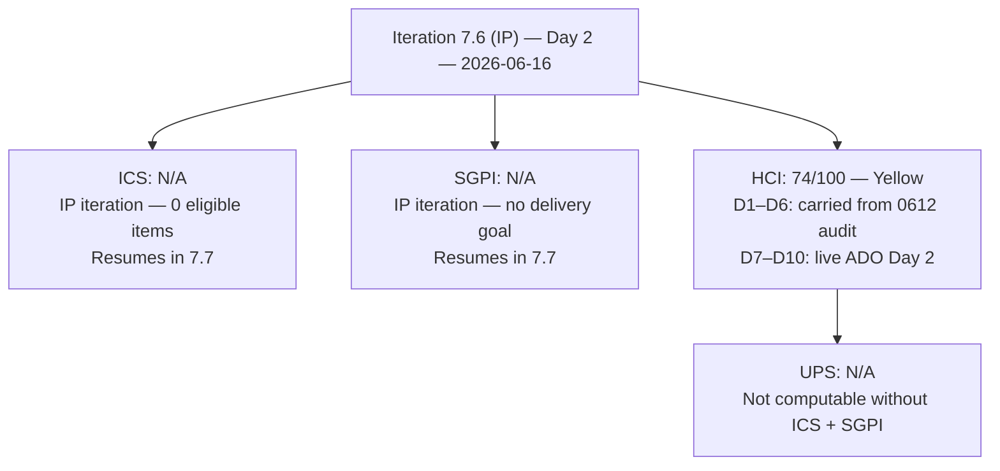
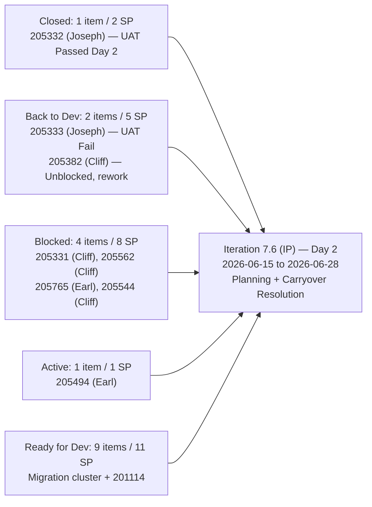
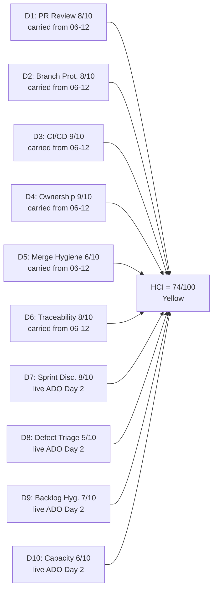

# Auto Allies Iteration Audit — 2026-06-16 (Iteration 7.6 IP — Day 2)

## 1. Audit Metadata

| Field | Value |
|---|---|
| Audit Date | 2026-06-16 |
| Audit Time | 02:42 |
| Iteration | **Iteration 7.6 (IP)** — Innovation and Planning |
| Iteration ID | 4161effc-4731-4264-ab04-90f51acbc69f |
| Iteration Start | 2026-06-15 |
| Iteration Finish | 2026-06-28 |
| Day of Iteration | **Day 2 of 10** |
| ADO Project | Auto Allies (2d7af571-6ef6-4ad0-a509-c440e008b0fb) |
| ADO Team | AA Development Team (330e6bf1-3515-443c-a2d8-b84f46c38f57) |
| GitHub Repos | jairosoft-com/autoallies-version2, jairosoft-com/autoallies-api-core |
| Data Mode | **partial** — ADO: full live evidence; GitHub: unavailable (401 Bad Credentials — token regression persists; Day 2 of credential outage) |
| Prior Audit | AUDIT_20260615_0700.md (Iteration 7.6 IP Day 1, HCI=74, ICS=N/A, UPS=N/A) |
| Auditor | Claude Code (claude-sonnet-4-6) |

> **GitHub Token Regression (Critical):** All GitHub API calls returned `401 Bad Credentials` on both 2026-06-15 (Day 1) and 2026-06-16 (Day 2). The workspace CLAUDE.md and prior audits documented that token access was restored on 2026-05-20 with `data_mode: full` expected for all audits from that date forward. This expectation is now broken. The `get_me` identity endpoint — the most basic GitHub auth check — also returned 401, confirming the token is fully revoked or expired, not a scoped permission issue. This is a **new regression**, distinct from the April 2026 outage, and must be resolved before the first day of Iteration 7.7.

---

## 2. Executive Summary

This is the **Day 2 audit** for Iteration 7.6 (IP) — the Innovation and Planning iteration for PI7, running 2026-06-15 to 2026-06-28. The IP iteration is an SAFe structural window for retrospectives, PI planning preparation, inspect-and-adapt activities, UAT completion, and carryover resolution. It is **not a sprint delivery iteration**.

**Two structural realities define this audit:**

1. **ICS and SGPI are not applicable.** Iteration 7.6 (IP) contains only 2 Spikes — both planning artifacts assigned to Karl Caumban (PM). Spikes are excluded from ICS per skill rules. With 0 eligible items, the formula 0/0 is undefined. ICS and SGPI will resume in Iteration 7.7 once sprint delivery items are assigned to that path during PI planning.

2. **GitHub credentials are broken (Day 2 of outage).** The `raseniero` token that was reported fixed on 2026-05-20 has regressed. No PR, branch, or commit data is retrievable. D1–D6 HCI dimensions are carried forward from the last confirmed full-evidence session (2026-06-12, 35 merged PRs in Iteration 7.5).

**UPS is not computed.** UPS = ICS × 0.50 + HCI × 0.30 + SGPI × 0.20. With two of three inputs undefined (ICS and SGPI), UPS cannot be meaningfully calculated. It is not a score of zero — it is a score of N/A.

**HCI holds at 74/100 (Yellow)** on balance. On Day 2, the carryover picture shows one meaningful positive signal (205332 Closed) counterbalanced by three further regressions (205333 Back to Dev, 205544 further Blocked, 205382 Back to Dev after unblock), and two assignments shifted to Cliff Carcueva (205331, 205562) suggesting deliberate triage rebalancing. The net Day 2 ADO evidence does not justify a HCI change from the Day 1 reading of 74.

| Metric | Prior (2026-06-15, IP Day 1) | Current (2026-06-16, IP Day 2) | Delta |
|---|---|---|---|
| ICS | N/A | **N/A** | — |
| SGPI | N/A | **N/A** | — |
| HCI | 74 (Yellow) | **74 (Yellow)** | 0 |
| UPS | N/A | **N/A** | — |
| Closed SP (carryover) | 0 | **2** (205332 Closed) | +2 SP |
| Blocked items | 4 (205382, 205331, 205562, 205765) | **4** (205765, 205331, 205562, 205544) | Composition changed |
| Back to Dev | 1 (205544) | **2** (205333, 205382) | +1 |
| GitHub credential status | Broken (Day 1) | **Broken (Day 2)** | No change |

**Most important changes since Day 1:**
- **205332 Closed (POSITIVE)** — Stripe payment defect (Pre-existing Ticket double popup, 2 SP) successfully passed UAT and closed. Joseph Gerona and Jerlyn Ates drove this to completion.
- **205333 regressed to Back to Dev** — Expired Member / Upload Ticket defect (2 SP) failed UAT on one scenario (Become a Member with ticket upload). Requires dev rework.
- **205382 unblocked but Back to Dev** — Affiliate migration defect (3 SP) previously Blocked has shifted to Back to Dev with Cliff Carcueva now as assignee; suggests the affiliate data migration dependency is being retried under a different owner.
- **205544 progressed to Blocked** — Case count defect (1 SP) was Back to Dev yesterday; now Blocked under Cliff Carcueva. Assignee also changed from Joseph Gerona (Day 1) to Cliff Carcueva.
- **205331 and 205562 reassigned to Cliff Carcueva** — Both Stripe family member amounts defect (3 SP) and Case List data issue defect (2 SP) have been rebalanced off Joseph Gerona onto Cliff Carcueva. This is an active IP triage rebalancing signal.

---

## 3. Iteration Scope and Methodology

### Iteration 7.6 (IP) Scope — Active Path

| Category | Count | Story Points | Notes |
|---|---|---|---|
| Spikes (in 7.6 IP path) | 2 | 1.0 | 202786 (Self Assessment), 202787 (CSAT Survey) |
| ICS-eligible items | **0** | **0** | No User Stories, Defects, or Enablers in 7.6 (IP) |
| **Total in 7.6 (IP) path** | **2** | **1.0** | Both assigned to Karl Caumban (Project Manager) |

### Carryover Items — Live State as of Day 2 (2026-06-16)

All carryover items remain in the Auto Allies\2026-PI7\Iteration 7.5 path. States are based on live ADO batch query.

| Item | Type | Day 1 State (06-15) | Day 2 State (06-16) | SP | Assignee (Day 2) | Delta |
|---|---|---|---|---|---|---|
| 205332 | Defect | UAT Testing | **Closed** | 2 | Joseph Gerona | **CLOSED — UAT Passed** |
| 205333 | Defect | UAT Testing | **Back to Dev** | 2 | Joseph Gerona | UAT Failed (1 scenario) |
| 205331 | Defect | Blocked | **Blocked** | 3 | **Cliff Carcueva** | Assignee changed from Earl |
| 205562 | Defect | Blocked | **Blocked** | 2 | **Cliff Carcueva** | Assignee changed from Joseph |
| 205765 | User Story | Blocked | **Blocked** | 2 | Earl Carino | Unchanged |
| 205382 | Defect | Blocked | **Back to Dev** | 3 | Cliff Carcueva | Unblocked; rework in progress |
| 205544 | Defect | Back to Dev | **Blocked** | 1 | **Cliff Carcueva** | Further regressed + reassigned |
| 205494 | Enabler | Active | **Active** | 1 | Earl Carino | Unchanged |
| 201114 | Enabler | Ready for Dev | Ready for Dev | 2 | Earl Carino | Unchanged |
| 205475–205492 | Enablers (7) | Ready for Dev | Ready for Dev | 7 | Earl/Cliff | Unchanged |

### Methodology

- **ICS:** Not scored. Zero ICS-eligible items (User Stories, Defects, Enablers) are assigned to the Iteration 7.6 (IP) path. Spikes are excluded per skill rules. IP iterations are planning/reflection windows, not sprint delivery windows.
- **SGPI:** Not scored. IP iterations do not carry a committed story-point delivery goal.
- **HCI:** Scored. ADO-based dimensions (D7–D10) use live Day 2 evidence. GitHub dimensions (D1–D6) carried from the 2026-06-12 audit (last confirmed full-evidence session, 35 merged PRs in Iteration 7.5) per workspace credential-gap precedent.
- **UPS:** Not computed. UPS = ICS × 0.50 + HCI × 0.30 + SGPI × 0.20. With ICS and SGPI both N/A, UPS is undefined, not zero.

---

## 4. Scorecard Summary

| Metric | Score | Band | Notes |
|---|---|---|---|
| ICS (Iteration Compliance Score) | **N/A** | — | IP iteration — 0 eligible items; formula undefined (0/0) |
| SGPI (Sprint Goal Progress Index) | **N/A** | — | IP iteration — no committed delivery goal |
| HCI (Engineering Health Index) | **74/100** | **Yellow** | D1–D6 carried from 06-12; D7–D10 live ADO Day 2 |
| UPS (Unified Performance Score) | **N/A** | — | Cannot compute without ICS + SGPI |

> ICS and SGPI will resume scoring in Iteration 7.7 once sprint delivery items are assigned to that path during IP planning. The HCI reading of 74 is maintained from Day 1; mixed ADO signals on Day 2 (one closure, three regressions) balance to no net change.

### Score Trend (Last 5 Audits)

| Audit Date | Iteration | Day | ICS | SGPI | HCI | UPS | Notes |
|---|---|---|---|---|---|---|---|
| 2026-06-12 | 7.5 | D10 | 98.0 | 23.1% | 82 | 79.7 | Last confirmed full data |
| 2026-06-14 | 7.5 | Close | 98.0 | 23.1% | 76 | 76.4 | Iteration 7.5 close |
| 2026-06-15 | 7.6 (IP) | D1 | N/A | N/A | 74 | N/A | IP Day 1 |
| **2026-06-16** | **7.6 (IP)** | **D2** | **N/A** | **N/A** | **74** | **N/A** | **This audit** |

---

## 5. Sprint Goal Predictability (SGPI)

### SGPI — Not Applicable (IP Iteration)

Iteration 7.6 (IP) is an Innovation and Planning iteration. IP iterations in SAFe are not sprint delivery windows. There is no committed story-point scope, no sprint goal, and therefore no SGPI computation.

### Carryover Delivery Pipeline (Live Day 2 Evidence)

SGPI is not scored, but carryover state tracking continues for 7.7 planning context. The pipeline reflects live ADO states as of 2026-06-16.

| Carryover State | Items | SP | Change from Day 1 |
|---|---|---|---|
| Closed | 1 | 2 | **+1 item / +2 SP** (205332 closed) |
| Back to Dev | 2 | 5 | +1 item / +3 SP (205333 regressed; 205382 unblocked to BTD) |
| Blocked | 4 | 8 | Composition changed (-205382 unblocked; +205544 newly blocked) |
| Active | 1 | 1 | Unchanged (205494) |
| Ready for Dev | 9 | 11 | Unchanged (migration cluster + 201114) |
| **Total carryover** | **17** | **27** | -1 item / -2 SP from 205332 closure |

### SGPI Trend

| Audit Date | Iteration | Type | SGPI | Delivered Proxy | Notes |
|---|---|---|---|---|---|
| 2026-05-27 | 7.4 | Close | 6.25% | 71.9% | |
| 2026-06-12 | 7.5 | D10 | 23.1% | 61.5% | |
| 2026-06-14 | 7.5 | Close | 23.1% | 61.5% | No change in final 2 days |
| 2026-06-15 | 7.6 (IP) | D1 | N/A | N/A | IP iteration — no delivery goal |
| **2026-06-16** | **7.6 (IP)** | **D2** | **N/A** | **N/A** | **IP iteration — no delivery goal** |

---

## 6. Developer Productivity Findings

### Team Capacity — Iteration 7.6 (IP)

All team member capacities remain at 0 hours/day in ADO for this iteration on Day 2. Capacity planning has not yet been completed for the IP window. This was a P7 action from Day 1 (due 2026-06-15) that has not been actioned.

| Member | Role | Iteration 7.6 Capacity | Days Off | Day 2 Carryover Activity |
|---|---|---|---|---|
| Cliff Carcueva | Development | 0 hrs/day (not set) | None recorded | Newly assigned: 205331, 205562, 205544 (total 6 SP in Blocked or Back to Dev) |
| Earl Carino | Development | 0 hrs/day (not set) | None recorded | 205765 (Blocked), 205494 (Active), migration cluster |
| Joseph Gerona | Development | 0 hrs/day (not set) | None recorded | 205332 (Closed — resolved), 205333 (Back to Dev — UAT fail) |
| Jerlyn Ates | QA / Requirements | 0 hrs/day (not set) | None recorded | Non-developer per exception; UAT of 205332 completed — positive |
| Mary Secusana | Documentation | 0 hrs/day (not set) | None recorded | Non-developer per exception |

> **Capacity planning overdue.** ADO capacity remains 0 hrs/day for all members on Day 2 despite P7 action item from Day 1 (due 2026-06-15). IP ceremonies and PI planning preparation require a realistic capacity baseline.

### GitHub Developer Activity (Day 2, 2026-06-16)

GitHub API returned 401 Bad Credentials for all queries. This is now the **second consecutive day** of credential failure. The `get_me` identity endpoint also returned 401, confirming token-level revocation rather than a scoped permission issue.

No new PR or commit data was collected. Last confirmed GitHub evidence remains: **2026-06-12** — 35 merged PRs total (Iteration 7.5). All developer evidence carried forward.

### ADO State Changes (Day 1 → Day 2)

The following state and assignment changes were observed in the live ADO batch query on Day 2:

| Item | Title | Change Type | Day 1 → Day 2 | Impact |
|---|---|---|---|---|
| 205332 | Pre-existing Ticket double popup | State | UAT Testing → **Closed** | +2 SP resolved; UAT passed |
| 205333 | Expired Member upload ticket issues | State | UAT Testing → **Back to Dev** | UAT failed (1 scenario: upload ticket payment incomplete in Stripe) |
| 205382 | Affiliate V1 data migration | State + Assignee | Blocked (Earl) → **Back to Dev (Cliff)** | Unblocked; reassigned to Cliff for rework |
| 205544 | Super Admin case count | State + Assignee | Back to Dev (Joseph) → **Blocked (Cliff)** | Further regressed; reassigned to Cliff |
| 205331 | Stripe family member amounts | Assignee | Blocked (Earl) → **Blocked (Cliff)** | Same state; IP rebalancing — Cliff now owns |
| 205562 | Super Admin case list data | Assignee | Blocked (Joseph) → **Blocked (Cliff)** | Same state; IP rebalancing — Cliff now owns |

> **IP Triage Rebalancing Signal:** The mass reassignment of 205331, 205562, 205544 from Earl Carino and Joseph Gerona to Cliff Carcueva suggests deliberate IP planning activity — the team (likely Karl Caumban) is redistributing ownership in preparation for 7.7. This is a positive planning behavior, though it concentrates 4 items (6 SP total) on Cliff Carcueva entering the next sprint.

---

## 7. SAFe Compliance Findings

### IP Iteration SAFe Activity Checklist

| Activity | Day 1 Status | Day 2 Status | Notes |
|---|---|---|---|
| Retrospective (Iteration 7.5) | Not confirmed | Not confirmed | No ADO artifact; expected in IP window |
| PI Inspect and Adapt | Not confirmed | Not confirmed | PI7 end ceremony expected before 2026-06-28 |
| UAT completion (carryovers) | In progress | **Partial** | 205332 Closed (+); 205333 failed UAT (requires rework) |
| Carryover triage | Partial (Day 1) | **Active** | 4 items reassigned on Day 2 — IP triage rebalancing underway |
| Capacity planning | Not set | **Not set (overdue)** | All members at 0 hrs/day; was due 2026-06-15 |
| PI planning prep (7.7) | Not started | Not started | Migration cluster sequencing decision pending |
| Acceptance Criteria on IP Spikes | 202786: Yes; 202787: Missing | **Unchanged** | 202787 still lacks AC field |

### IP Spikes in Scope (Live Day 2)

| Item | Title | SP | State | Assignee | AC Present | Notes |
|---|---|---|---|---|---|---|
| 202786 | AutoAllies End PI7 — Team and Technical Agility: Self Assessment | 0.5 | Ready | Karl Caumban | Yes (NPS target 30-40) | Appropriate IP activity; AC thin but present |
| 202787 | AutoAllies — Customer CSAT Survey | 0.5 | New | Karl Caumban | **No** | Description: "Send CSAT Survey to Mathew" (29 chars — barely below 30-char threshold); AC field empty |

> Both Spikes are excluded from ICS scoring (skill rules: Spikes ineligible). The absence of AC on 202787 is a hygiene gap on an IP planning artifact.

### Carryover Resolution Progress

| Resolution Category | Day 1 | Day 2 | Notes |
|---|---|---|---|
| Closed | 0 items | **1 item (205332 — 2 SP)** | 205332 successfully completed UAT and closed |
| In active UAT / QA rework | 2 items (205332, 205333) | 1 item (205333 — rework) | 205333 failed 1 UAT scenario; back to dev |
| Blocked (triage needed) | 4 items | 4 items (composition shifted) | 205382 unblocked to BTD; 205544 newly blocked |
| Unstarted (Ready for Dev) | 9 items | 9 items | Migration cluster unchanged |

---

## 8. Iteration Compliance Score

### ICS — Not Applicable (IP Iteration)

ICS scores iteration compliance for committed User Stories, Defects, and Enablers in the active sprint path. Spikes are excluded per skill rules. With 0 eligible items in Iteration 7.6 (IP), ICS is undefined — not zero, not 100. The formula `compliant / eligible × 100` resolves to 0/0.

| Dimension | Weight | Eligible | Compliant | Failed | Score% | Weighted Contribution | Evidence |
|---|---|---|---|---|---|---|---|
| Alignment (Parent Linkage) | 25% | 0 | — | — | N/A | N/A | No eligible items in 7.6 (IP) |
| Estimation (Story Points) | 20% | 0 | — | — | N/A | N/A | No eligible items in 7.6 (IP) |
| Quality / DoD (Desc + AC) | 35% | 0 | — | — | N/A | N/A | No eligible items in 7.6 (IP) |
| Iteration Integrity | 20% | 0 | — | — | N/A | N/A | No eligible items in 7.6 (IP) |
| **ICS Total** | **100%** | **0** | — | — | **N/A** | **N/A** | — |

> ICS will resume scoring in Iteration 7.7 once sprint delivery items are assigned to that path during PI planning.

### ICS Trend (Last 3 Scored Iterations)

| Iteration | ICS | Band | Key Failures |
|---|---|---|---|
| 7.4 | 100.0 | Green | None |
| 7.5 | 98.0 | Green | 201114 (thin description), 205382 (Blocked state) |
| 7.6 (IP) Day 1 | N/A | — | IP iteration |
| **7.6 (IP) Day 2** | **N/A** | — | **IP iteration** |

---

## 9. Engineering Health Index (HCI)

### HCI Dimension Table

| # | Dimension | Score | Max | Evidence Basis | Key Finding |
|---|---|---|---|---|---|
| D1 | PR Review Compliance | 8 | 10 | Carried from 0612 (35 merged PRs confirmed, Iteration 7.5) | 34/35 Iteration 7.5 PRs had at least one human approval; cross-author review rotation (Earl, Cliff, Joseph) healthy. Carried per credential-gap precedent. No new PRs observable during IP window. |
| D2 | Branch Protection & Enforcement | 8 | 10 | Carried from 0612 | Protected branches confirmed (develop/staging/main in v2; dev/main/staging/qa in api-core). Stale branch accumulation (85+ in v2, 70+ in api-core) persists — IP is the ideal cleanup window. Carried unchanged. |
| D3 | CI/CD Gate Quality | 9 | 10 | Carried from 0612 | PR validation actively enforcing in both repos; failure→fix cycles confirmed; merge-blocking coverage gate active in api-core. Carried unchanged. No CI/CD activity expected during IP window. |
| D4 | Code Ownership | 9 | 10 | Carried from 0612 | All 3 developers contributed merged code in Iteration 7.5; all authors and reviewers. Non-developer roles (Jerlyn, Mary) correctly excluded per workspace exception. Carried unchanged. |
| D5 | Merge Hygiene & Churn | 6 | 10 | Carried from 0612 | 205332/205333 generated significant PR churn in 7.5 (10+ PRs combined); 205333 is now back in dev rework. Stale branch accumulation unresolved (150+ across both repos). IP is the ideal cleanup window. Carried unchanged. |
| D6 | Work Item ↔ GitHub Traceability | 8 | 10 | Carried from 0612 | 34/35 Iteration 7.5 PRs carried AB# references (97.1%). One infra exception (api #131 — health check). Carried unchanged. |
| D7 | Sprint Discipline | 8 | 10 | **Live ADO — Day 2** | IP Day 2 context is appropriate. 2 Spikes in 7.6 path (PM-owned planning activities — correct). Carryover triage is actively progressing (4 items reassigned, 1 item closed). No delivery items in 7.6 path — structurally correct for an IP window. Maintained at 8 from Day 1. |
| D8 | Defect Triage & Velocity | 5 | 10 | **Live ADO — Day 2** | Mixed signal: 205332 **Closed** (positive — 2 SP UAT-passed). 205333 failed UAT (Back to Dev). 205382 unblocked but rework needed (Back to Dev). 205544 regressed to Blocked. Net blocked count unchanged at 4, though composition has shifted. 205331 and 205562 block reasons still undocumented in ADO. Maintained at 5 — positive and negative signals balance. |
| D9 | Backlog & Story Hygiene | 7 | 10 | **Live ADO — Day 2** | 202787 (IP Spike) still missing AC field. 201114 thin description persists (flagged since 7.5 mid-audit). 4 Blocked items still lack documented blocking conditions in structured ADO fields — now 2 business days in. Carryover items remain in 7.5 path (expected during IP). No change from Day 1. |
| D10 | Capacity Balance & Ownership Distribution | 6 | 10 | **Live ADO — Day 2** | Capacity planning still at 0 hrs/day for all members (overdue from Day 1). IP triage rebalancing observed — 4 items moved to Cliff Carcueva (creates concentration of 4 Blocked/BTD items, 6 SP, on Cliff entering 7.7). Earl Carino still holds migration enabler cluster concentration (6 of 9 enablers + 1 Active + 1 Blocked). No improvement from Day 1. |
| **HCI Total** | | **74** | **100** | | |

**HCI = 74/100 (Yellow)**

> Sum: 8+8+9+9+6+8+8+5+7+6 = **74**. Confirmed. No net change from Day 1. One D8 positive (205332 closed) is counterbalanced by three negatives (205333 UAT fail, 205544 re-blocked, 205382 BTD rework). D10 would benefit from capacity planning completion.

### HCI Visualization

### HCI Trend

| Audit Date | Iteration | HCI | D7 | D8 | D9 | D10 | Notes |
|---|---|---|---|---|---|---|---|
| 2026-06-12 | 7.5 D10 | 82 | 6 | 8 | 8 | 8 | Last full data session |
| 2026-06-14 | 7.5 Close | 76 | 5 | 8 | 8 | 7 | Iteration close |
| 2026-06-15 | 7.6 IP D1 | 74 | 8 | 5 | 7 | 6 | IP Day 1; 4 items Blocked |
| **2026-06-16** | **7.6 IP D2** | **74** | **8** | **5** | **7** | **6** | **This audit; 205332 Closed** |

---

## 10. ADO-to-GitHub Traceability Analysis

### Traceability Context

GitHub API is unavailable (401 Bad Credentials — Day 2 of outage). No new PR or traceability data was collected today. All GitHub traceability evidence is carried from the last confirmed full-evidence session: **2026-06-12 (Iteration 7.5, 35 merged PRs, 34 with AB# references)**.

### Iteration 7.6 (IP) Traceability — Day 2 Assessment

During IP iterations, PR activity is expected to be minimal. The traceability focus shifts from PR-to-story linkage to:

- ADO state updates reflecting UAT results (205332: ADO now shows Closed — confirmed via live batch)
- ADO blocking conditions documented for blocked items (currently missing for 205331, 205562, 205765, 205544)
- Assignment changes documented in ADO (confirmed via Day 2 batch — 4 reassignments observed)

| ADO Item | State (Day 2) | GitHub Evidence (last confirmed) | ADO–GitHub Correlation |
|---|---|---|---|
| 205332 | **Closed** | v2 PRs #172+, api-core PRs (7.5 window) | Consistent — closed post-UAT pass; code was present |
| 205333 | Back to Dev | v2 #172+ (7.5 window) | Partially consistent — code exists; UAT found one failing scenario |
| 205331 | Blocked | v2 #193, api #132, #146 (7.5 window) | Gap — blocking condition post-QA undocumented in ADO |
| 205562 | Blocked | v2 #182, api #133, #141, #147 (7.5 window) | Gap — blocking condition undocumented |
| 205765 | Blocked | v2 PR#195 (status unknown — open as of 06-12) | Gap — PR#195 merge status unconfirmed; block reason unknown |
| 205382 | Back to Dev | No iteration-window PRs (migration dependency) | Consistent — structural dependency, no code expected |
| 205544 | Blocked | Prior iteration PRs (Joseph) | Gap — newly blocked; reason undocumented in ADO fields |

### Blocking Condition Documentation (Critical Gap — Day 2)

4 of the 4 blocked items have been in a Blocked or Back-to-Dev state for multiple days without documented blocking conditions in visible ADO fields. This prevents accurate 7.7 capacity planning.

| Item | Blocked Since | Days in Block | ADO Blocking Condition | Status |
|---|---|---|---|---|
| 205331 | 2026-06-15 (Day 1) | 2 days | Not documented | Action required |
| 205562 | 2026-06-15 (Day 1) | 2 days | Not documented | Action required |
| 205765 | 2026-06-15 (Day 1) | 2 days | Not documented | Action required |
| 205544 | 2026-06-16 (Day 2) | 1 day | Not documented | Action required |
| 205382 | Persistent from 7.5 | Multi-iteration | V1 migration dependency (confirmed prior audits) | Known but unresolved |

---

## 11. Collaboration and Review Analysis

> GitHub API unavailable. Collaboration evidence carried from 2026-06-12 audit (Iteration 7.5).

### PR Review Patterns (Iteration 7.5 — Last Confirmed, 2026-06-12)

| Reviewer | Approvals / Reviews | Authors Reviewed | Assessment |
|---|---|---|---|
| Earl Carino (ecarinoJS) | 15+ | Cliff, Joseph | Most active reviewer; architectural gate on complex defect PRs |
| Cliff Carcueva (ccarcuevajairo) | 10+ | Earl, Joseph | Healthy cross-author coverage |
| Joseph Gerona (JosephJairo) | 8+ | Cliff, Earl | Active reviewer despite being high-volume author |

**Cross-author review:** All 3 developers reviewed each other's work throughout Iteration 7.5 — full three-way rotation maintained.

### IP Window Collaboration Signals (Day 2 — ADO-Derived)

The IP collaboration picture is ADO-driven in the absence of GitHub data. Key collaboration signals observed on Day 2:

1. **Jerlyn Ates drove 205332 to Closed** — UAT completed successfully. Demonstrates QA/Requirements role functioning as intended during IP. This is the primary positive collaboration signal on Day 2.
2. **Karl Caumban (PM) actively triaging** — the mass reassignment of 4 items between Day 1 and Day 2 suggests PM-led planning sessions are occurring. Items moved from Earl and Joseph to Cliff reflect deliberate load rebalancing.
3. **205333 UAT failure** — collaboration between Joseph Gerona (dev) and Jerlyn Ates (QA) identified a failing UAT scenario on 205333 (Become-a-Member with ticket upload). This is collaborative QA working as designed — the failure catch is evidence of the process working, not breaking.

### IP Collaboration Expectations

During the IP window, the collaboration mode shifts from code review to ceremony participation. Expected activities (not yet evidenced in ADO):

| Activity | Evidence Available | Notes |
|---|---|---|
| Retrospective facilitation | None | Expected as formal ceremony record in ADO |
| PI7 Inspect & Adapt review | None | PI end-of-PI ceremony |
| 7.7 Iteration Planning | Not yet started | Must begin by mid-IP to avoid last-minute planning |
| Blocking-condition documentation | Missing (all 4 items) | P2 action item — overdue from Day 1 |

---

## 12. Repository Hygiene

> Branch inventory and CI/CD evidence carried from 2026-06-12 audit (GitHub API unavailable).

### Branch Inventory (Last Confirmed — 2026-06-12)

| Repo | Protected Branches | Estimated Total | Active at 7.5 Close | Estimated Stale | IP Opportunity |
|---|---|---|---|---|---|
| autoallies-version2 | develop, staging, main | 85+ | release/iteration-7.5 | ~80+ | Delete stale branches; enable auto-delete on merge |
| autoallies-api-core | dev, main, staging, qa | 70+ | release/iteration-7.5 | ~67+ | Delete stale branches; enable auto-delete on merge |

> **Estimated 150+ stale branches across both repos.** The IP iteration is the last natural cleanup window before PI8 sprint work begins. No cleanup action has been observed yet (Days 1–2 of IP).

### CI/CD Status (Carried from 2026-06-12)

| Workflow | Repo | Status | Last Evidence |
|---|---|---|---|
| PR Validation | autoallies-version2 | Active — enforcing | 7.5 PRs (failure→fix cycles confirmed) |
| PR Validation | autoallies-api-core | Active — enforcing | PHPStan/Larastan enforced; merge-blocking |
| Release Branch | Both repos | Created for 7.5 | release/iteration-7.5 — pending cleanup |
| Coverage Gate | autoallies-api-core | Active | Earl's merge-blocking gate (since 7.4) |

### IP Hygiene Opportunity Window

The IP iteration (through 2026-06-28) is the best opportunity to:
1. Delete the `release/iteration-7.5` branches from both repos after verifying no outstanding changes
2. Run a stale branch cleanup pass (estimated 150+ branches — can be scripted)
3. Enable auto-delete-branch-on-merge in GitHub repository settings for both repos to prevent future accumulation
4. No IP-window GitHub evidence is available to confirm whether any cleanup has started (Day 2)

---

## 13. Risks and Bottlenecks

| # | Risk | Severity | Owner | Status |
|---|---|---|---|---|
| R1 | **GitHub API 401 Bad Credentials — Day 2 of outage.** Token-level revocation confirmed (`get_me` endpoint 401). This is a new regression from the previously-resolved token issue. D1–D6 HCI dimensions are now stale (last confirmed evidence: 2026-06-12). Each additional day without access increases the evidence gap entering 7.7. | **High** | DevOps / Karl Caumban | **Active — must resolve before 7.7 Day 1** |
| R2 | **4 Blocked items with undocumented blocking conditions** (205331, 205562, 205765, 205544). Day 2 of IP has passed without blocking conditions added to ADO. Without root-cause documentation, the team cannot accurately plan 7.7 capacity or determine unblock complexity. | **High** | Cliff Carcueva, Earl Carino, Karl Caumban | **Active — overdue from Day 1** |
| R3 | **205333 failed UAT (Expired Member / Upload Ticket — 2 SP, Joseph Gerona).** The "Become a Member with ticket upload" scenario showed payment incomplete in Stripe and ticket not appearing in Case List. Dev rework required. Timeline for return to UAT queue unclear. | **High** | Joseph Gerona | **Active — rework in progress** |
| R4 | **Migration enabler cluster (205475–205492, 201114 — 9 enablers, 11 SP) unchanged at Ready for Dev.** No planning decision on 7.7 sequencing vs. PI8 deferral has been recorded in ADO. 205382 (affiliate data migration, 3 SP) is now in Back to Dev and depends on this cluster executing. PI7 ends after 7.6 (IP). | **High** | Karl Caumban / Earl Carino | **Critical — planning decision required before 2026-06-28** |
| R5 | **Cliff Carcueva concentration risk (Day 2).** 4 items now assigned to Cliff: 205331 (Blocked, 3 SP), 205562 (Blocked, 2 SP), 205544 (Blocked, 1 SP), 205382 (Back to Dev, 3 SP). Total: 9 SP of high-friction carryover. Earl held a similar concentration in Day 1 that was partially redistributed; now the concentration has moved to Cliff. | **Medium** | Karl Caumban | **Active — monitor; may need further redistribution in 7.7 planning** |
| R6 | **205333 Back to Dev root cause.** Failing scenario (Become-a-Member + ticket upload → Stripe payment incomplete + ticket missing from Case List) suggests potential Stripe webhook or session handling issue. GitHub evidence of prior 205333 code is unavailable; root cause analysis blocked by GitHub outage. | **Medium** | Joseph Gerona | **Active — rework and root cause analysis required** |
| R7 | **205765 (Member Dashboard, Earl Carino — 2 SP) blocked for 2 days with PR#195 status unknown.** Was open as of 2026-06-12. The block may be related to whether PR#195 merged. Cannot confirm without GitHub access. | **Medium** | Earl Carino | **Active — requires GitHub access to clarify** |
| R8 | **Capacity planning not configured in ADO for 7.6 (IP).** All 5 members at 0 hrs/day on Day 2. P7 action from Day 1 (due 2026-06-15) missed. IP activities cannot be properly planned without a capacity baseline. | **Medium** | Karl Caumban | **Overdue — complete immediately** |
| R9 | **205332 closed but 205333 UAT still open.** The two Stripe defects (205332 and 205333) were expected to close together (same UAT session, same Joseph/Jerlyn pair). Only one closed. The remaining 205333 item involves Stripe integration complexity (payment completion + ticket upload together). | **Low** | Joseph Gerona / Jerlyn Ates | **Active — rework and re-UAT required** |
| R10 | **Stale branch accumulation (150+ branches, two repos) unaddressed through IP Day 2.** The IP window is the last opportunity before PI8 sprint work begins creating new branches. No cleanup pass observed (GitHub unavailable to confirm). | **Low** | Dev team | **IP cleanup opportunity — 8 days remain** |

---

## 14. Prioritized Remediation Actions

| Priority | Action | Owner | Due | Expected Impact |
|---|---|---|---|---|
| P1 | **Restore GitHub API credentials immediately.** The `raseniero` token returned 401 on `get_me` — this is a full token revocation, not a scoped permission issue. Generate a new PAT with appropriate repo scopes and update the MCP server configuration. Must be resolved before the first Day 1 audit of Iteration 7.7. | DevOps / Karl Caumban | **2026-06-18** | Restores `data_mode: full`; enables D1–D6 HCI evidence from live GitHub; unblocks PR#195 status check for 205765 |
| P2 | **Document blocking conditions for all 4 Blocked items in ADO.** For each of 205331, 205562, 205765, 205544 — add an ADO comment or update the description with: (a) what is blocked, (b) why it is blocked, (c) what must happen to unblock, (d) estimated effort to unblock. This information is required for accurate 7.7 capacity planning. | Cliff Carcueva (205331, 205562, 205544), Earl Carino (205765) | **2026-06-17** | Improves D9 (Backlog Hygiene); enables 7.7 capacity planning; reduces planning risk |
| P3 | **Resolve 205333 Back to Dev — root cause and rework.** The failing scenario: Become-a-Member → payment shows incomplete in Stripe → uploaded ticket not in Case List. Joseph Gerona to diagnose Stripe webhook or session handling issue, fix, and return to QA pipeline within IP window. Jerlyn Ates to schedule re-UAT. | Joseph Gerona / Jerlyn Ates | **2026-06-22** | Closes 2 SP carryover from 7.5; removes Back-to-Dev item from IP pipeline |
| P4 | **Confirm and document PR#195 (205765 — Member Dashboard) status.** Check whether PR#195 merged post-close. If merged: update ADO to reflect code delivered, investigate why item remains Blocked (may be test-environment issue). If still open: determine reason and path forward. Requires GitHub access (P1 prerequisite). | Earl Carino | After P1 resolved | Clarifies 2 SP block; may enable 205765 to advance in IP window |
| P5 | **Make migration enabler cluster (7.7 vs PI8) planning decision.** Karl Caumban and Earl Carino to review 205475–205492 + 201114 (9 enablers, 11 SP) and formally decide: execute as dedicated migration sprint in 7.7, or move to PI8 backlog. Document the decision in ADO. This decision also determines whether 205382 (affiliate data) can be scheduled for 7.7. | Karl Caumban / Earl Carino | **2026-06-21** | Resolves dominant PI7 structural risk; enables 7.7 capacity planning; unblocks 205382 (3 SP) |
| P6 | **Complete ADO capacity planning for Iteration 7.6 (IP).** Set hours/day for all 5 team members in ADO. Even during IP, capacity should reflect available days. This was due 2026-06-15 and remains open on Day 2. | Karl Caumban | **2026-06-17** | Closes D10 gap; enables realistic 7.7 planning baseline |
| P7 | **Monitor Cliff Carcueva workload entering 7.7.** Cliff now holds 4 items (9 SP: 205331, 205562, 205544 Blocked; 205382 Back to Dev) plus any newly assigned 7.7 items. Review in 7.7 planning to avoid overcommitment. | Karl Caumban | 7.7 Planning | Reduces concentration risk; improves D10 |
| P8 | **Unblock 205382 rework (affiliate migration, Cliff Carcueva).** 205382 moved from Blocked to Back to Dev — this is progress, but rework is needed. With the migration cluster still at Ready for Dev (P5 dependency), Cliff will need guidance on what partial work is feasible without the full migration cluster executing. | Cliff Carcueva / Earl Carino | **2026-06-22** | Clears 3 SP BTD item; reduces Cliff's backlog pressure |
| P9 | **Add AC to 202787 (CSAT Survey Spike).** Description is "Send CSAT Survey to Mathew" (barely under 30-char threshold; AC field empty). Karl Caumban to add acceptance criteria specifying survey delivery method, target recipient, and success definition. | Karl Caumban | **2026-06-17** | Closes hygiene gap on IP planning artifact |
| P10 | **Branch cleanup pass — begin during IP window.** Delete merged stale branches from PI6 and PI7 across both repos (estimated 150+ total). Enable auto-delete-branch-on-merge in both repo settings. IP is the last natural window before PI8 creates new branches. | Earl Carino / Cliff Carcueva | **2026-06-26** | Improves D2/D5 HCI; reduces repo navigation overhead; prevents further accumulation |

---

## 15. Evidence Gaps and Limitations

| Gap | Dimensions Affected | Mitigation Applied |
|---|---|---|
| **GitHub API 401 Bad Credentials — Day 2 of outage.** All `list_pull_requests`, `search_pull_requests`, and `get_me` calls returned 401. This is a token-level revocation (not a scoped permission or rate-limit issue). Affects all GitHub evidence retrieval. | HCI D1–D6 | D1–D6 carried from 2026-06-12 (last confirmed full-evidence session, 35 merged PRs in Iteration 7.5). `data_mode: partial` declared. Per workspace credential-gap precedent (CLAUDE.md line 47). Token regression flagged as R1 (High). |
| **D1–D6 evidence staleness is now 4 days.** Last confirmed GitHub session was 2026-06-12. D1–D6 dimensions reflect Iteration 7.5 engineering behaviors, not current IP-window activity. | HCI D1–D6 | Carry-forward is the only available protocol. Scores are not degraded further beyond the Day 1 carry — IP window has minimal expected GitHub activity anyway (no sprint delivery). But score validity degrades with each additional day of outage. |
| **IP window GitHub activity not observable.** Even if credentials were restored, IP iterations produce minimal PR activity. The credentialing issue and the IP context compound into low GitHub observability for this audit period. | HCI D1, D4 | Not penalized. IP context appropriately noted. PR volume will return with 7.7 sprint work. |
| **Blocking conditions for 205331, 205562, 205765, 205544 not documented in ADO structured fields.** State confirms block; root cause not visible in batch-accessible fields. | HCI D8, D9 | Scored conservatively in D8. Blocking conditions inferred where possible from item descriptions. P2 remediation action flagged. |
| **205333 UAT failure detail limited.** ADO state (Back to Dev) confirmed; specific failing test scenario (Become-a-Member + upload ticket + Stripe payment incomplete) derived from item description structure, not from QA comment batch (comments not retrieved). | HCI D8 | Scored at impact level. Known failure scenario noted from description. P3 remediation flagged. |
| **205382 reassignment trigger and unblock mechanism unknown.** Item moved from Blocked (Earl) to Back to Dev (Cliff) between Day 1 and Day 2. Reason for unblock and new path forward not visible in ADO batch fields. | HCI D8, D9 | Scored as partial positive (unblocked from Blocked) with negative qualifier (now BTD, root cause unclear). P8 flagged. |
| **PR#195 (205765 — Member Dashboard) merge status unconfirmed.** Was open as of 2026-06-12. 205765 is now Blocked. Cannot determine whether PR#195 merged or why the item is blocked without GitHub access. | HCI D1, D6 | ADO state (Blocked) is authoritative signal. Root cause requires GitHub access. Flagged as R7. P4 flagged. |
| **Jerlyn Ates and Mary Secusana absent from GitHub developer activity.** | Not affected | Non-developer roles per workspace exception (CLAUDE.md Project Exceptions section). Excluded from all GitHub-based HCI dimensions. |
| **Team capacity at 0 hrs/day — not yet configured for IP iteration.** Cannot determine true available hours for IP activities or validate capacity distribution. | HCI D10 | Scored conservatively at 6/10 (same as Day 1). Expected on IP Day 1; overdue by Day 2. P6 flagged. |
| **Stale branch count not re-enumerated (GitHub unavailable).** Estimated from last confirmed count (2026-06-12: 85+ in v2, 70+ in api-core). | HCI D2, D5 | Conservative estimate carried from Day 1. No cleanup activity confirmed. |

---

*Report generated: 2026-06-16 02:42 | Auditor: Claude Code (claude-sonnet-4-6) | Skill: git_iteration_audit | Data mode: partial (GitHub 401 — Day 2 of credential outage) | Iteration: 7.6 (IP) Day 2 of 10 | ICS: N/A | SGPI: N/A | HCI: 74/100 | UPS: N/A*
