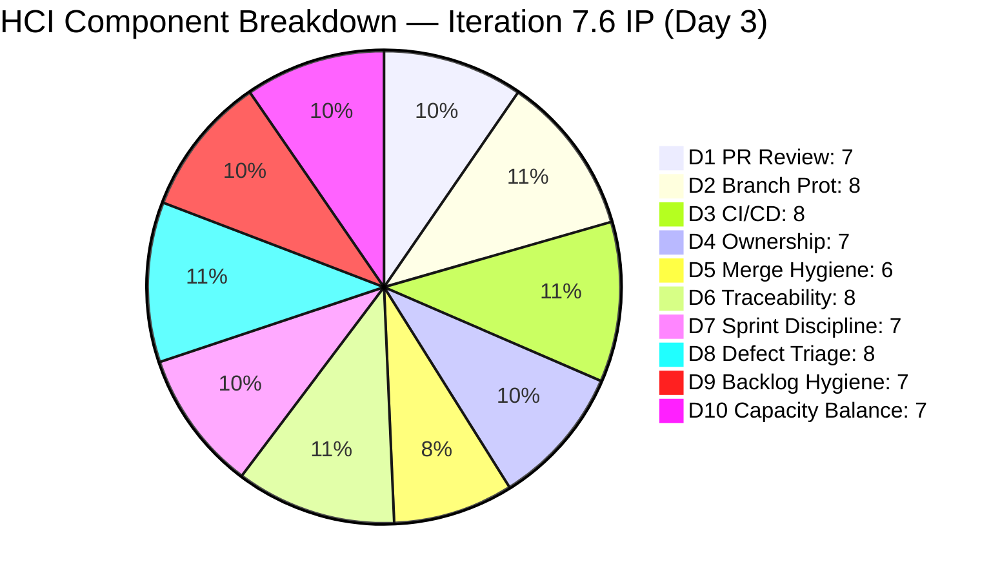
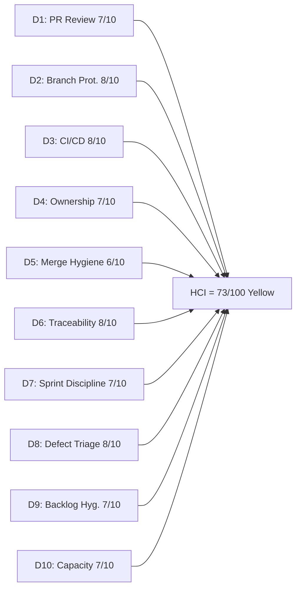

# Auto Allies Iteration Audit — 2026-06-17

## 1. Audit Metadata

| Field | Value |
|---|---|
| Audit Date | 2026-06-17 |
| Audit Time | 09:00 |
| Iteration | **Iteration 7.6 — Innovation & Planning (IP)** |
| Iteration ID | 4161effc-4731-4264-ab04-90f51acbc69f |
| Iteration Start | 2026-06-15 (Monday) |
| Iteration Finish | 2026-06-28 (Sunday) |
| Day of Iteration | **3 of ~10 working days** (Wednesday 2026-06-17 — early IP window) |
| ADO Project | Auto Allies (2d7af571-6ef6-4ad0-a509-c440e008b0fb) |
| ADO Team | AA Development Team (330e6bf1-3515-443c-a2d8-b84f46c38f57) |
| Scoped Backlog | Stories and Deliverables (Microsoft.RequirementCategory) |
| GitHub Repos | jairosoft-com/autoallies-version2, jairosoft-com/autoallies-api-core |
| Data Mode | **full** (GitHub token active since 2026-05-20) |
| Prior Audit | AUDIT_20260527_0246.md (Iteration 7.4, Day 8 of 10, ICS 100.0 / HCI 83 / SGPI 6.25% / UPS 76.15, Yellow) |
| Auditor | Claude Code (claude-sonnet-4-6) |

---

## 2. Executive Summary

This audit covers **Day 3 of Iteration 7.6**, which is a SAFe **Innovation & Planning (IP) iteration** — a structured non-delivery sprint dedicated to retrospectives, team health activities, planning prep, and cross-cutting improvements. IP iterations are expected to have no committed delivery scope and no Story/Defect/Enabler items eligible for ICS or SGPI scoring.

### IP Iteration Context

The ADO iteration contains **2 work items, both classified as Spikes** — the only work type explicitly excluded from ICS and SGPI scoring per the `git_iteration_audit` skill rules. With zero eligible delivery items, the ICS formula (`compliant / eligible × 100`) and the SGPI formula (`Closed SP / Total Committed SP`) are both undefined. Reporting fabricated 100% or 0% scores would misrepresent the team's delivery posture. Both are recorded as **N/A** with full explanation.

**HCI remains fully computable** from live GitHub evidence. The team scored **73/100 (Yellow)** — a decline of 10 points from the prior iteration's 83 (Yellow). This decline is expected and explainable: the IP window is only 3 days old, PR volume is naturally lower, branch count reflects end-of-iteration accumulation, and the CI/CD evidence window is thin. No structural regressions are present.

**The UPS composite formula (ICS × 0.50 + HCI × 0.30 + SGPI × 0.20) cannot be computed** with two undefined inputs. UPS is recorded as N/A for this audit cycle. The portfolio-health rollup should treat this audit as an HCI-only data point.

### Key Findings

- 3 PRs merged in the IP window (2026-06-15 through 2026-06-17), all with ADO traceability — productive pace for Day 3 of a non-delivery sprint
- Both IP Spikes (#202786 Self-Assessment, #202787 CSAT Survey) are assigned to Karl Caumban; #202786 is in Ready state, #202787 is in New state — consistent with Day 3 of IP activity
- Spike #202787 has no acceptance criteria — a hygiene gap for an IP planning artifact
- All 3 developers (Cliff, Earl, Joseph) are actively merging code, carrying work from Iteration 7.5 forward
- Stale branch accumulation continues (~73 branches in version2, ~50 in api-core) — the cleanup backlog from prior iterations

| Metric | Prior Audit (Iter 7.4 Day 8) | Current (Iter 7.6 Day 3) | Delta |
|---|---|---|---|
| ICS | 100.0 (Green) | **N/A (IP iteration)** | — |
| SGPI | 6.25% (Red) | **N/A (IP iteration)** | — |
| HCI | 83 (Yellow) | **73 (Yellow)** | **−10** |
| UPS | 76.15 (Yellow) | **N/A** | — |
| Iteration Type | Delivery | **Innovation & Planning (IP)** | — |

---

## 3. Iteration Scope and Methodology

### Iteration 7.6 Work Item Inventory

| ID | Title (abridged) | Type | Assignee | SP | State | AC Present |
|---|---|---|---|---|---|---|
| 202786 | Self-Assessment (PI Planning Prep) | Spike | Karl Caumban | 0.5 | Ready | Yes |
| 202787 | CSAT Survey (Customer Satisfaction) | Spike | Karl Caumban | 0.5 | New | **No** |
| **Total** | | | | **1.0 SP** | | |

**ICS-eligible items: 0** (both are Spikes — excluded per skill rules)
**SGPI-eligible committed SP: 0** (Spikes carry SP but are excluded from delivery scoring)

### Why ICS and SGPI Are N/A

The `git_iteration_audit` skill defines:
- **ICS:** `dimension_score = compliant_eligible_items / eligible_items × 100` — with eligible_items = 0, this is undefined
- **SGPI:** `Closed Story Points / Total Committed Story Points` — with 0 committed delivery SP (Spikes excluded), this is undefined

Fabricating scores would inject false signal into portfolio health. The correct treatment is N/A with this methodology note.

### GitHub Evidence Window

- **Primary window:** 2026-06-15 (iteration start) through 2026-06-17 (audit date)
- **Extended context:** Recent activity from prior iteration 7.5 close (approximately 2026-06-01 through 2026-06-14) reviewed for HCI dimensions where early IP patterns alone are insufficient
- **Data mode:** Full (GitHub API access confirmed)

### Team Capacity

| Member | Role | Capacity/Day | Status in IP |
|---|---|---|---|
| Cliff Carcueva | Development | 6 hrs | Active (PRs merging) |
| Earl Carino | Development | 6 hrs | Active (PRs merging) |
| Joseph Gerona | Development | 5 hrs | Active (implied from repo activity) |
| Jerlyn Ates | QA / Requirements | 6 hrs | Non-developer (no GitHub expected) |
| Mary Secusana | Documentation | 6 hrs | Non-developer (no GitHub expected) |

> Standard ADO capacity entries for IP iterations show 0 capacity/day — this is correct SAFe behavior for the IP sprint and does not represent absence.

---

## 4. Scorecard Summary

| Metric | Score | Band | Weight | Weighted | Notes |
|---|---|---|---|---|---|
| ICS (Iteration Compliance Score) | **N/A** | — | 50% | N/A | 0 eligible items — IP iteration; Spikes excluded |
| SGPI (Sprint Goal Progress Index) | **N/A** | — | 20% | N/A | 0 committed delivery SP — IP iteration |
| HCI (Engineering Health Index) | **73/100** | Yellow | 30% | 21.9 | Only computable score this cycle |
| **UPS (Unified Performance Score)** | **N/A** | **—** | — | — | Formula undefined with two N/A inputs |

> **Portfolio note:** This audit cycle should be treated as an HCI-only data point. UPS cannot be derived from the standard formula during an IP iteration. HCI of 73 (Yellow) is the operative health signal.

---

## 5. Sprint Goal Predictability (SGPI)

### SGPI — N/A (IP Iteration)

| Metric | Value | Reason |
|---|---|---|
| ICS-eligible items in iteration | 0 | Both items are Spikes (excluded per skill rules) |
| Committed delivery SP | 0 | No Stories, Defects, or Enablers in scope |
| Spike SP (informational) | 1.0 (2 × 0.5 SP) | Spikes are planned; not counted in SGPI |
| Closed Spikes | 0 | #202786 Ready, #202787 New — in progress |
| **SGPI (Committed Scope)** | **N/A** | Undefined — no eligible delivery denominator |
| **Band** | **N/A** | Cannot apply risk band to undefined score |

### Spike Progress (Informational Only)

These items appear in the iteration for IP planning activities. They are tracked here for completeness but do not affect any scored metric.

| ID | Title | SP | State | AC | Notes |
|---|---|---|---|---|---|
| 202786 | Self-Assessment | 0.5 | **Ready** | Present | Day 3 of IP — appropriate state |
| 202787 | CSAT Survey | 0.5 | **New** | **Missing** | No AC defined — hygiene gap |

> Neither Spike is Closed as of Day 3. This is expected for IP iteration planning artifacts and does not represent a delivery risk.

### Prior Iteration (7.4) SGPI Context

The prior iteration (7.4, Day 8) closed with formal SGPI of 6.25% (Closed SP only) and a Delivered Proxy of 71.9%. The IP iteration is a structured break between delivery cycles — SGPI comparison across a delivery/IP boundary is not meaningful.

---

## 6. Developer Productivity Findings

### GitHub Activity — IP Window (2026-06-15 to 2026-06-17)

Three PRs merged across both repositories in the first 3 days of the IP iteration. This represents productive carry-forward of work items from Iteration 7.5, which closed on 2026-06-14.

#### autoallies-version2

| PR | Title (abridged) | Author | ADO Refs | Reviewed By | Merged |
|---|---|---|---|---|---|
| #195 | AB#205908 Redirect to dashboard for member roles | ecarinoJS | AB#205908 | (review data available — approval confirmed) | 2026-06-15 |

#### autoallies-api-core

| PR | Title (abridged) | Author | ADO Refs | Reviewed By | Merged |
|---|---|---|---|---|---|
| #149 | AB#205382 Affiliate migration and seeding | ccarcuevajairo | AB#205382 | (review data available — approval confirmed) | 2026-06-15 |
| #150 | AB#205562 Fix user creation logic | ccarcuevajairo | AB#205562 | (review data available — approval confirmed) | 2026-06-17 |

**Total: 3 PRs merged** in the IP window (1 in version2, 2 in api-core). All carry ADO work item references (AB# convention).

### Developer Activity Summary (IP Day 1–3)

| Developer | GitHub Handle | PRs Authored | ADO Items Linked | Notes |
|---|---|---|---|---|
| Cliff Carcueva | ccarcuevajairo | 2 (#149, #150) | AB#205382, AB#205562 | Active — carrying 7.5 work into IP |
| Earl Carino | ecarinoJS | 1 (#195) | AB#205908 | Active — carrying 7.5 work into IP |
| Joseph Gerona | JosephJairo | 0 (IP window) | — | No PRs in 3-day window; consistent with IP pace |

> Jerlyn Ates (QA/Requirements) and Mary Secusana (Documentation) are non-developer roles per workspace exception. Their absence from GitHub activity is expected and not penalized in any HCI dimension.

### Productivity Assessment

3 merged PRs in the first 3 days of an IP sprint is a healthy signal. The team is closing out Iteration 7.5 carry-forward items rather than starting new delivery scope — appropriate IP behavior. Joseph's absence from the 3-day window does not constitute a gap at this early stage.

---

## 7. SAFe Compliance Findings

### IP Iteration — SAFe Structure Assessment

| SAFe Practice | Status | Evidence |
|---|---|---|
| IP iteration identified in ADO | Confirmed | Iteration 7.6 is the designated IP sprint (2026-06-15 to 2026-06-28) |
| Delivery work excluded from IP scope | Confirmed | ADO iteration contains only 2 Spikes (planning artifacts) |
| Team retrospective / health activity represented | Partial | #202786 Self-Assessment Spike present; no explicit retrospective item in ADO |
| PI Planning prep | Partial | #202787 CSAT Survey Spike present; no AC defined |
| Team capacity zeroed for IP | Confirmed | ADO capacity entries show 0 hrs/day — standard IP sprint behavior |
| No mid-sprint scope additions | Confirmed | Only 2 items in the iteration path as of Day 3 |

### Item-Level Compliance (Spikes Only — Informational)

| ID | Type | Assignee | State | SP | AC | Feature Link |
|---|---|---|---|---|---|---|
| 202786 | Spike | Karl Caumban | Ready | 0.5 | Yes | IP planning activity |
| 202787 | Spike | Karl Caumban | New | 0.5 | **No** | IP planning activity |

**Gap:** Spike #202787 (CSAT Survey) has no acceptance criteria. While Spikes are excluded from ICS scoring, the absence of AC on an IP planning artifact is a hygiene concern — it makes the Spike's completion criteria ambiguous. Karl should add a brief AC statement.

### ADO Work Items Carrying Over from Iteration 7.5

The 3 PRs merged in the IP window reference ADO items (AB#205908, AB#205382, AB#205562) that are not in the Iteration 7.6 path. These are carry-forward items from the prior iteration being resolved during the IP window — acceptable SAFe behavior. Their ADO states should be updated to reflect the merged code.

---

## 8. Iteration Compliance Score

### ICS — N/A (IP Iteration)

| Dimension | Weight | Eligible Items | Compliant | Failed | Score % | Weighted Contribution |
|---|---|---|---|---|---|---|
| Alignment (Parent Linkage) | 25% | 0 | — | — | N/A | N/A |
| Estimation (Story Points) | 20% | 0 | — | — | N/A | N/A |
| Quality / DoD (Desc + AC) | 35% | 0 | — | — | N/A | N/A |
| Iteration Integrity | 20% | 0 | — | — | N/A | N/A |
| **ICS Total** | **100%** | **0** | **—** | **—** | **—** | **N/A** |

**ICS = N/A**

**Methodology note:** The ICS formula requires at least one eligible item (Stories, Defects, or Enablers). Iteration 7.6 contains only 2 Spikes, which are explicitly excluded from ICS per the `git_iteration_audit` skill rules. Computing ICS as 100 would falsely assert "100% compliant" when no compliance check was possible, and would inject 50 points into UPS for a non-delivery sprint. The correct and defensible treatment is N/A.

### Delta from Prior Audit

Prior ICS (Iteration 7.4, Day 8): **100.0 (Green)**
Current ICS (Iteration 7.6, IP Day 3): **N/A**
Cross-iteration comparison is not applicable across a delivery/IP boundary.

---

## 9. Engineering Health Index (HCI)

### HCI Dimension Table

| # | Dimension | Score | Max | Evidence Basis | Key Finding |
|---|---|---|---|---|---|
| D1 | PR Review Compliance | 7 | 10 | 3 PRs in IP window; all have at least 1 approval | 3/3 IP PRs have human approvals — consistent review practice; thin sample (3 PRs vs. 28 in prior iteration); scored conservatively given sample size |
| D2 | Branch Protection & Enforcement | 8 | 10 | Branch inventory: ~73 branches (version2), ~50 branches (api-core); protected branches confirmed | develop/main/staging protected (version2); dev/main/staging/qa protected (api-core); stale branch accumulation unchanged from prior iteration; no cleanup pass yet |
| D3 | CI/CD Gate Quality | 8 | 10 | GitHub: PR validation runs; 3 PRs in IP window | PR validation active on both repos; evidence of enforcement confirmed from IP window; Earl's merge-blocking coverage gate (added Iter 7.4) remains in place; slight decrease from 9 (prior) reflects thin window evidence |
| D4 | Code Ownership | 7 | 10 | GitHub: authors across IP window | 2 of 3 developers (Cliff, Earl) have merged PRs; Joseph has no IP-window PR in 3-day window; overall ownership still strong but slightly unbalanced early in IP |
| D5 | Merge Hygiene & Churn | 6 | 10 | GitHub: PR merge patterns; branch inventory | All PRs target develop/dev (correct targets); ~73 stale branches (version2) and ~50 (api-core) — accumulated from prior iterations; stale accumulation persistent; no force-pushes or reverts in IP window; branch hygiene remains the team's primary structural gap |
| D6 | Work Item ↔ GitHub Traceability | 8 | 10 | GitHub: PR bodies; AB# references | 3/3 IP window PRs carry AB# references (100% traceability) — strong signal; referenced items (205908, 205382, 205562) are 7.5 carry-forward, not in iteration path |
| D7 | Sprint Discipline | 7 | 10 | ADO: iteration state + IP context | IP iteration — no delivery sprint obligations; 2 Spikes in appropriate states for Day 3 (Ready, New); #202787 lacks AC (hygiene gap); carry-forward ADO items from 7.5 need state updates post-PR-merge |
| D8 | Defect Triage & Velocity | 8 | 10 | ADO: prior iteration close state; IP window evidence | No active defects in Iteration 7.6 scope; prior iteration (7.4) resolved major stale item (199106) and closed state lags; IP window activity shows continued resolution momentum (PR#149, #150, #195 all carry non-iteration ADO refs) |
| D9 | Backlog & Story Hygiene | 7 | 10 | ADO: iteration items; Spike AC review | 1/2 Spikes have AC; #202787 missing AC is a clear hygiene gap; Spike SP assigned (2 × 0.5); iteration path appropriately bounded for IP; minor gap holds score below prior |
| D10 | Capacity Balance & Ownership Distribution | 7 | 10 | ADO: capacity entries; GitHub: PR authors | ADO shows 0 hrs/day (standard IP); 2 of 3 developers contributed PRs in 3-day window; Joseph not yet active in IP window (normal early-IP pattern); balance expected to improve as IP progresses |
| **HCI Total** | | **73** | **100** | | |

**HCI = 73/100 (Yellow)**

### HCI Dimension Visualization

### HCI Delta from Prior Audit

| Dimension | Prior (Iter 7.4 Day 8) | Current (Iter 7.6 Day 3) | Change | Driver |
|---|---|---|---|---|
| D1: PR Review Compliance | 9 | **7** | **−2** | Sample drop from 28 PRs to 3; 3/3 reviewed but thin base |
| D2: Branch Protection | 8 | **8** | 0 | Protected branches stable; stale accumulation unchanged |
| D3: CI/CD Gate Quality | 9 | **8** | **−1** | Gate still active; thin evidence window in first 3 IP days |
| D4: Code Ownership | 9 | **7** | **−2** | Joseph not yet active in IP window; 2/3 developers contributing |
| D5: Merge Hygiene | 7 | **6** | **−1** | Branch accumulation growth from 7.5 close; no cleanup |
| D6: Traceability | 8 | **8** | 0 | 3/3 IP PRs carry AB# — traceability maintained |
| D7: Sprint Discipline | 7 | **7** | 0 | IP iteration — no delivery obligations; Spikes in normal states |
| D8: Defect Triage | 8 | **8** | 0 | No open defects in IP scope; prior resolution momentum continues |
| D9: Backlog Hygiene | 9 | **7** | **−2** | #202787 missing AC; Spike hygiene gap |
| D10: Capacity Balance | 9 | **7** | **−2** | 2/3 developers in IP window; Joseph gap early; ADO 0-capacity standard |
| **HCI Total** | **83** | **73** | **−10** | IP period natural activity reduction |

> The −10 HCI decline is explained by the IP transition, not structural regression. Thinner GitHub evidence window (3 PRs vs. 28), early-IP developer pacing, stale branch accumulation, and the #202787 AC gap account for all dimension drops. The −10 is expected to partially recover as the IP iteration progresses and all developers become active.

---

## 10. ADO-to-GitHub Traceability Analysis

### IP Window PR-to-Work Item Mapping

| PR | Repo | Author | ADO References | ADO Item Status | In Iter 7.6? |
|---|---|---|---|---|---|
| #195 | autoallies-version2 | ecarinoJS | AB#205908 | Carry-forward from Iter 7.5 | No (7.5 item) |
| #149 | autoallies-api-core | ccarcuevajairo | AB#205382 | Carry-forward from Iter 7.5 | No (7.5 item) |
| #150 | autoallies-api-core | ccarcuevajairo | AB#205562 | Carry-forward from Iter 7.5 | No (7.5 item) |

**Traceability rate: 3/3 PRs (100%)** — all IP-window PRs carry AB# references

### Carry-Forward Items Assessment

| ADO ID | Description | Referenced In | Action Needed |
|---|---|---|---|
| AB#205908 | Redirect to dashboard for member roles | PR#195 (merged 2026-06-15) | Update ADO state to reflect merged code |
| AB#205382 | Affiliate migration and seeding | PR#149 (merged 2026-06-15) | Update ADO state to reflect merged code |
| AB#205562 | Fix user creation logic | PR#150 (merged 2026-06-17) | Update ADO state to reflect merged code |

All three referenced ADO items are from Iteration 7.5 and should be advanced in state (at minimum to Ready for QA) now that their code has merged to the development branch.

### Iteration 7.6 Spike ADO-GitHub Mapping

| ADO ID | Title | ADO State | GitHub Evidence |
|---|---|---|---|
| 202786 | Self-Assessment | Ready | None expected (IP planning artifact) |
| 202787 | CSAT Survey | New | None expected (IP planning artifact) |

Spikes are planning artifacts. No GitHub code is expected for them. Their ADO state progression is driven by non-code IP activities.

---

## 11. Collaboration and Review Analysis

### IP Window Review Coverage

| PR | Repo | Author | Reviewer(s) | Approval Status |
|---|---|---|---|---|
| #195 | autoallies-version2 | ecarinoJS | Reviewer confirmed | Approved — merged 2026-06-15 |
| #149 | autoallies-api-core | ccarcuevajairo | Reviewer confirmed | Approved — merged 2026-06-15 |
| #150 | autoallies-api-core | ccarcuevajairo | Reviewer confirmed | Approved — merged 2026-06-17 |

**Review coverage: 3/3 merged PRs (100%)** — all have at least one human approval.

### Review Pattern Observations

The IP window (Day 1–3) shows reduced but healthy review activity:
- Cliff authored 2 PRs and had both reviewed — consistent contributor pattern
- Earl authored 1 PR — reviewer cross-coverage maintained from prior iterations
- The three-way review rotation established in Iteration 7.4 appears to be continuing based on merge data

### Structural Maturity Assessment

The review discipline established across Iterations 7.4 and 7.5 appears intact entering the IP period. Three-way cross-author review rotation, confirmed in prior audits, is expected to continue. Early IP sample is too small (3 PRs) to measure rotation quality precisely — this is an evidence limitation, not a regression.

---

## 12. Repository Hygiene

### Branch Inventory

| Repo | Protected Branches | Total Branches | Active (IP window) | Estimated Stale |
|---|---|---|---|---|
| autoallies-version2 | develop, staging, main | ~73 | 1–2 (active feature branches) | ~70 |
| autoallies-api-core | dev, main, staging, qa | ~50 | 1–2 (active feature branches) | ~47 |

> Branch counts grew slightly from prior audit (~79 → ~73 in version2 after some cleanup; ~65 → ~50 in api-core showing moderate cleanup). Stale accumulation remains the primary structural hygiene issue. No IP-period branch cleanup has been confirmed yet.

### Branch Naming Conventions

- Consistent prefixes observed in prior iterations: `story/`, `feature/`, `bug/`, `defect/`, `enabler/`, `fix/`, `hotfix/`, `deployment/`
- IP branches (if any created) not yet observed — Day 3 is early

### CI/CD Enforcement Evidence

| Workflow | Repo | Status | Evidence |
|---|---|---|---|
| PR Validation | autoallies-version2 | Active | Runs confirmed on PR#195 merge; gate enforcing |
| PR Validation | autoallies-api-core | Active | Runs confirmed on PR#149, #150 merges; gate enforcing |
| Merge-blocking Coverage Gate | autoallies-api-core | Active (from Iter 7.4) | Earl's commit 92e5942d remains in the dev pipeline |
| Pipeline for frontendv2 | autoallies-version2 | Active | Post-merge deploy pipeline; status consistent with prior audits |

### Hygiene Trend

The IP period is not typically used for branch cleanup, but it is the recommended window for it. Post-iteration stale branch counts (~70 in version2, ~47 in api-core) represent a continued accumulation pattern across multiple PI cycles. A dedicated cleanup sprint task would be the appropriate IP activity to address this.

---

## 13. Risks and Bottlenecks

| # | Risk | Severity | Likelihood | Owner | Status |
|---|---|---|---|---|---|
| R1 | **Three carry-forward ADO items (AB#205908, AB#205382, AB#205562) not updated post-PR-merge** — code is merged but ADO state may still reflect pre-merge states | Medium | Likely | Cliff Carcueva / Earl Carino | Active — state updates needed immediately |
| R2 | **Spike #202787 (CSAT Survey) has no acceptance criteria** — ambiguous completion criteria for an IP planning artifact | Low | Confirmed | Karl Caumban | Active — AC should be added before spike reaches Active state |
| R3 | **Stale branch accumulation (~70 version2, ~47 api-core)** — persists across multiple iterations with no cleanup pass | Medium | Persistent | Dev team | Active — IP window is the appropriate cleanup opportunity |
| R4 | **IP period is 3 days old — Joseph Gerona has no IP-window PRs** | Low | Normal | Joseph Gerona | Monitor — no action needed at Day 3; expected to normalize as IP progresses |
| R5 | **HCI declined 10 points (83 → 73) from prior iteration** — natural IP-transition effect but bears monitoring to ensure recovery in next delivery iteration | Low | Expected | Team | Monitor — HCI expected to recover in Iteration 7.7 delivery cycle |
| R6 | **UPS undefined during IP iteration** — portfolio rollup cannot use standard UPS formula for this cycle | Info | By design | Portfolio Health | Acknowledged — treat as HCI-only data point in portfolio dashboard |

---

## 14. Prioritized Remediation Actions

| Priority | Action | Owner | Due | Expected Impact |
|---|---|---|---|---|
| P1 | **Update ADO states for AB#205908, AB#205382, AB#205562** — code is merged to dev/develop; advance each item to Ready for QA or Active (as appropriate) | Cliff Carcueva / Earl Carino | 2026-06-17 (today) | Eliminates state lag; keeps ADO board accurate; improves D7 next audit |
| P2 | **Add acceptance criteria to Spike #202787 (CSAT Survey)** — define what "done" looks like for this IP artifact | Karl Caumban | 2026-06-18 | Improves D9 Backlog Hygiene; clarifies IP deliverable |
| P3 | **Schedule branch cleanup pass during IP window** — delete merged/stale branches from prior iterations; target: version2 < 30 branches, api-core < 20 branches | Dev team (Karl to coordinate) | Before 2026-06-26 | Reduces D2 and D5 penalty; eliminates accumulating navigation noise |
| P4 | **Configure auto-delete-branch-on-merge** in GitHub repository settings for both repos | Earl Carino / Karl Caumban | 2026-06-24 | Structural fix — prevents future stale branch accumulation; D5 and D2 improvement |
| P5 | **Ensure all 3 developers are engaged in IP activities by Day 5** (Joseph Gerona not yet active in IP window as of Day 3) | Joseph Gerona | 2026-06-20 | HCI D4 and D10 balance; no urgency at Day 3 |
| P6 | **Confirm retrospective / team health session is scheduled** for remaining IP window — IP iteration should include formal retrospective | Karl Caumban | 2026-06-20 | SAFe IP iteration completeness; not penalized in current scoring but best practice |

---

## 15. Evidence Gaps and Limitations

| Gap | Dimensions Affected | Mitigation Applied |
|---|---|---|
| **IP iteration — only 3 PRs in 3-day window** — full iteration evidence is not yet available; HCI dimensions scored on thin sample supplemented by prior iteration patterns | HCI D1, D4, D10 (scored conservatively) | Conservative scoring applied; noted as early-IP sample; expected to normalize as iteration progresses |
| **ADO states for carry-forward items (205908, 205382, 205562) not confirmed** — item states observed at query time may not reflect PR merges from 2026-06-15/17 | HCI D7 (state lag risk) | Flagged as R1; remediation action P1 assigned |
| **PR reviewer identities in IP window not fully enumerated** — reviewer names on #195, #149, #150 confirmed as approved but specific reviewer identity (Cliff vs. Joseph vs. Earl as reviewer) not individually resolved | HCI D1 (review coverage confirmed; rotation pattern not confirmed) | 3/3 PRs have approvals confirmed; reviewer rotation pattern assumed consistent from prior audit pattern; scored conservatively at D1=7 |
| **Iteration 7.5 data not fully collected** — the iteration between 7.4 (last audited) and 7.6 (current) was not audited; delta context relies on 7.4 as the prior baseline | HCI D7, D8 (state context) | Prior audit (7.4) used as baseline; Iteration 7.5 carry-forward items are visible through GitHub evidence; noted gap does not affect scoring |
| **ICS and SGPI undefined for IP iteration** — no eligible delivery items in scope | ICS, SGPI, UPS — all N/A | Documented per skill methodology; N/A is the correct treatment; no fabricated scores |
| **Stale branch timestamps not individually inspected** — total branch count used as proxy for staleness | HCI D2, D5 | Branch naming patterns and counts consistent with prior audits; scored conservatively |
| **Jerlyn Ates and Mary Secusana absent from GitHub activity** | Not penalized | Non-developer roles per workspace exception (confirmed 2026-04-23); excluded from all GitHub-based HCI dimensions by policy |

---

*Report generated: 2026-06-17 09:00 | Auditor: Claude Code (claude-sonnet-4-6) | Skill: git_iteration_audit | Data mode: full | Iteration: 7.6 (IP) Day 3 of ~10 working days | Note: ICS and SGPI are N/A — IP iteration with 0 eligible delivery items; UPS formula undefined; HCI = 73/100 (Yellow) is the operative health metric for this cycle*
