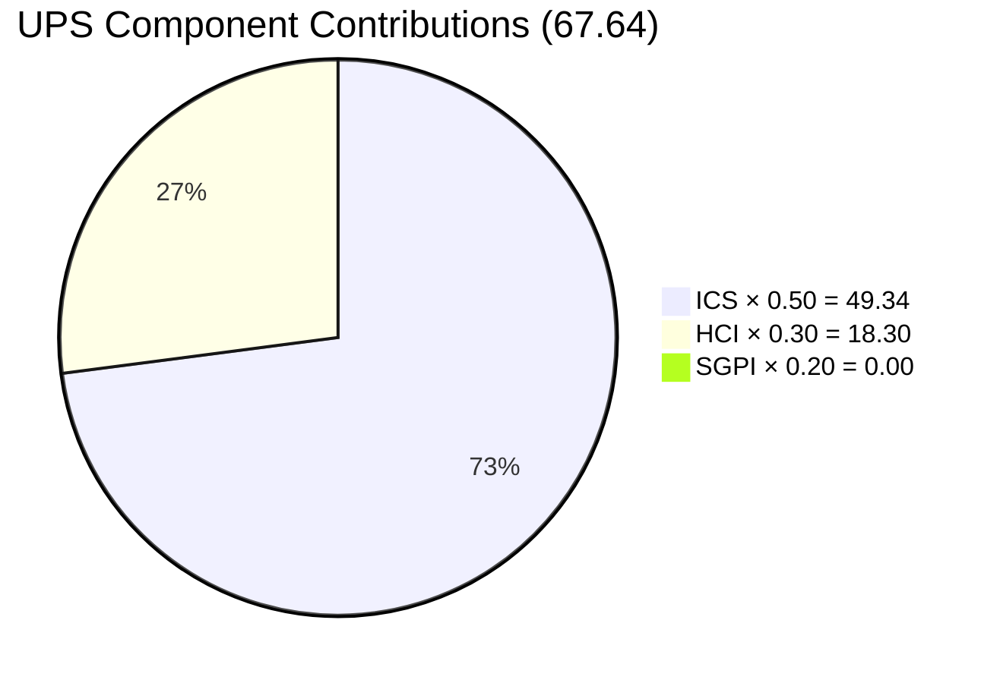

# Auto Allies — Git Iteration Audit
## Iteration 7.6 (IP) · 2026-06-18

---

## 1. Audit Metadata

| Field | Value |
|---|---|
| Audit Date | 2026-06-18 |
| Audit Time | 09:02 |
| Iteration | Iteration 7.6 (IP) |
| Iteration ID | `4161effc-4731-4264-ab04-90f51acbc69f` |
| Iteration Window | 2026-06-15 → 2026-06-28 |
| Day of Iteration | Day 4 of 10 |
| ADO Project | Auto Allies (`2d7af571-6ef6-4ad0-a509-c440e008b0fb`) |
| ADO Team | AA Development Team (`330e6bf1-3515-443c-a2d8-b84f46c38f57`) |
| GitHub Repos | `jairosoft-com/autoallies-version2`, `jairosoft-com/autoallies-api-core` |
| Data Mode | Full (live GitHub + ADO) |
| Prior Audit | `AUDIT_20260617_0900.md` |
| Auditor | Claude Code (claude-sonnet-4-6) |

---

## 2. Executive Summary

The AA Development Team is in **Iteration 7.6 (IP)** — an Innovation and Planning iteration running from 2026-06-15 through 2026-06-28. Today is Day 4 of 10. The IP iteration carries 15 ICS-eligible work items (8 Enablers, 4 Defects, 1 User Story, plus 2 Spikes) totalling approximately 24 Story Points, all focused on the critical V1-to-V2 data migration and cutover sequence.

The team's **ICS is excellent at 98.67 (Green)** — nearly all items are well-formed with descriptions, acceptance criteria, parent links, and proper assignments. The one exception is User Story #205765 which remains on the Iteration 7.5 path rather than 7.6 and is in a Blocked state.

**SGPI is 0.0% (structural Red)** — this is expected for an IP iteration. No items have moved to Closed on Day 4, consistent with the IP ceremonies and planning focus. The Delivered Proxy metric shows 11 SP of work actively in progress.

**HCI is 61/100 (Red)** — engineering health shows two significant structural concerns: (1) PRs continue to be merged without peer review, with authors self-merging; (2) a large volume of stale branches (50+ in frontend, 40+ in API) are accumulating. Traceability and CI/CD coverage remain strong.

**UPS = 67.64 (Yellow)** — the suppressed SGPI (structural IP effect) drags the composite score below what the actual team quality metrics would otherwise indicate. The team is in a moderate-risk posture heading into the V2 production cutover.

---

## 3. Iteration Scope and Methodology

### Iteration Type
Iteration 7.6 is an **Innovation and Planning (IP)** iteration — a SAFe ceremony cadence sprint used for PI retrospective, Inspect and Adapt, innovation work, and next-PI planning. Delivery velocity expectations are deliberately lower than execution sprints.

### Scope
The iteration backlog carries 17 total items: 15 ICS-eligible (Enablers, Defects, User Story) + 2 Spikes (excluded from ICS per rubric). The primary theme is the **AutoAllies V1 to V2 Production Migration Runbook** — a sequenced set of Enablers covering data freeze, SQL import, production preparation, full data migration, traffic cutover, and post-cutover stabilization.

### Methodology
- ADO data fetched via GUIDs using `work_list_team_iterations` (timeframe: current) + `wit_get_work_items_batch_by_ids`
- GitHub evidence collected via `search_pull_requests` for both repositories from 2026-06-15 onward
- Branch inventory collected via `list_branches` for both repositories
- CI/CD configuration confirmed via `.github/workflows/` directory listing
- Working day count: 10 working days (Mon–Fri, 2026-06-15 through 2026-06-28; no days-off recorded in ADO capacity)

---

## 4. Scorecard Summary

| Score | Value | Band |
|---|---|---|
| ICS (Iteration Compliance Score) | **98.67** | Green |
| SGPI (Sprint Goal Predictability Index) | **0.0%** | Red* |
| HCI (Engineering Health Check Index) | **61 / 100** | Red |
| **UPS (Unified Performance Score)** | **67.64** | **Yellow** |

> *SGPI Red is structural for an IP iteration on Day 4 of 10. No items are expected to be Closed at this stage. See SGPI section for Delivered Proxy context.

### UPS Composite Mermaid



---

## 5. Sprint Goal Predictability (SGPI)

### Headline SGPI

| Metric | Value |
|---|---|
| Total Committed SP (eligible items) | 23 SP |
| SP Closed | 0 SP |
| Headline SGPI | **0.0% (Red)** |

### Context: IP Iteration Structural Note

Iteration 7.6 is an IP (Innovation and Planning) sprint. In SAFe, IP iterations are not sprint execution windows — they are reserved for retrospectives, system demos, innovation, and PI planning. The 0% SGPI reflects Day 4 of a 10-day IP window where ceremonies and migration planning activities are the primary deliverables, not story closures.

### Original Scope SGPI

No items were moved out of scope since the iteration started (no scope changes detected). Original scope = committed scope = 23 SP.

### Delivered Proxy SGPI (Activity-Based)

Items in "Active" or "Back to Dev" states represent work in flight:

| ID | Title | SP | State |
|---|---|---|---|
| 205494 | Recheck All Environments for Release Package | 1 | Active |
| 205544 | Super Admin Cases overview count Verification | 1 | Active |
| 205573 | Attorney Case List | 2 | Active |
| 205333 | Expired Member & One-time member Upload Ticket issues | 2 | Back to Dev |
| 205382 | Super Admin - Affiliate Page - V1 Data Migration | 3 | Back to Dev |
| 205765 | Member - Add Member Dashboard | 2 | Blocked |

**Total SP in flight = 11 SP out of 23 = 47.8% Delivered Proxy SGPI**

GitHub evidence confirms 3 merged PRs in the iteration window (AB#205908 frontend, AB#205382 affiliate migration, AB#205562 user creation logic), supporting active progress on migration-related defects and enablers.

---

## 6. Developer Productivity Findings

### GitHub Activity — Iteration Window (2026-06-15 onward)

| PR | Repo | Author | AB# Linked | Merged |
|---|---|---|---|---|
| #195 | autoallies-version2 | ecarinoJS | AB#205908 | 2026-06-15 |
| #149 | autoallies-api-core | ccarcuevajairo | AB#205382 | 2026-06-15 |
| #150 | autoallies-api-core | ccarcuevajairo | AB#205562 | 2026-06-17 |

**3 PRs merged in first 4 days** — a moderate velocity for an IP iteration. Two are authored by Cliff Carcueva (ccarcuevajairo) in the API repository addressing the affiliate data migration (AB#205382) and user creation enhancement (AB#205562). Earl Carino (ecarinoJS) contributed the member dashboard redirect fix (AB#205908).

### Active Contributors

| GitHub Handle | ADO Name | Role | IP Activity |
|---|---|---|---|
| ecarinoJS | Earl Carino | Dev (Frontend) | 1 merged PR |
| ccarcuevajairo | Cliff Carcueva | Dev (Full-stack) | 2 merged PRs |
| JosephJairo | (Lead/Admin) | Merge Authority | 0 PRs in iteration window |

> **Exception applied:** Jerlyn Ates (QA/Requirements) and Mary Secusana (Documentation) have no GitHub activity. Per project exception policy (2026-05-20), this is expected and must not be scored as a compliance gap.

### Pre-Iteration Activity (Carry-forward from Iteration 7.5 close)

The June 2026 pre-cutover period saw very high PR volume: 17 PRs merged in `autoallies-version2` and 21 in `autoallies-api-core` between 2026-06-01 and 2026-06-14. Key items addressed include repeated defect iterations on AB#205332 (ticket upload), AB#205333 (member upload), AB#205544 (case overview count), AB#205765 (member dashboard), and AB#205499 (affiliate revenue).

---

## 7. SAFe Compliance Findings

| Check | Status | Notes |
|---|---|---|
| IP Iteration declared in ADO | Pass | Iteration 7.6 correctly labeled "(IP)" |
| All eligible items have SP assigned | Pass | All 15 eligible items have SP > 0 |
| All items have parent (Feature/Epic) links | Pass | All 15 eligible items have parent IDs |
| All items have Descriptions | Pass | All items contain substantive descriptions |
| All items have Acceptance Criteria | Pass | All items have acceptance criteria (except Spikes, which are excluded) |
| Items assigned to team members | Pass | All 15 items assigned |
| Iteration path integrity | Partial Fail | Item #205765 is on Iteration 7.5 path, not 7.6 |
| Spike handling | Pass | Both Spikes (#202786, #202787) present with appropriate scope |
| Defects carry AC | Pass | All 4 Defects have acceptance criteria |
| No unassigned items | Pass | All items assigned to active developers |

---

## 8. Iteration Compliance Score (ICS)

### ICS Summary

**ICS = 98.67 / 100 (Green)**

Formula: `ICS = Σ(dimension_score × weight) / 100`

### ICS Dimension Table

| Dimension | Eligible Items | Compliant | Failed | Score% | Weight | Weighted Contribution | Evidence | Reason for Fail |
|---|---|---|---|---|---|---|---|---|
| D1 — Alignment (Parent Link) | 15 | 15 | 0 | 100.0% | 25% | 25.00 | All 15 items have `System.Parent` set | — |
| D2 — Estimation (SP > 0) | 15 | 15 | 0 | 100.0% | 20% | 20.00 | SP range: 1–3 across all eligible items | — |
| D3 — Quality / DoD (Desc ≥ 30 chars + AC ≥ 20 chars) | 15 | 15 | 0 | 100.0% | 35% | 35.00 | All items have substantive multi-bullet Desc and AC | — |
| D4 — Iteration Integrity (assigned + correct path) | 15 | 14 | 1 | 93.3% | 20% | 18.67 | 14/15 on correct path and assigned; #205765 on Iteration 7.5 path | #205765 `System.IterationPath` = "Iteration 7.5" |

**ICS = 25.00 + 20.00 + 35.00 + 18.67 = 98.67**

### Per-Item ICS Table

| ID | Title | Type | SP | State | Assigned | Parent | Path | D1 | D2 | D3 | D4 | ICS Eligible |
|---|---|---|---|---|---|---|---|---|---|---|---|---|
| 206787 | E2E Testing QA Environment - Round PI7.6 | Enabler | 3 | New | Jerlyn Ates | 200629 | 7.6 (IP) | Pass | Pass | Pass | Pass | Yes |
| 205573 | Attorney Case List | Defect | 2 | Active | Cliff Carcueva | 200629 | 7.6 (IP) | Pass | Pass | Pass | Pass | Yes |
| 205544 | Super Admin Cases Overview Count | Defect | 1 | Active | Cliff Carcueva | 200629 | 7.6 (IP) | Pass | Pass | Pass | Pass | Yes |
| 205382 | Affiliate Page - V1 Data Migration | Defect | 3 | Back to Dev | Cliff Carcueva | 200629 | 7.6 (IP) | Pass | Pass | Pass | Pass | Yes |
| 205333 | Expired Member Upload Ticket Issues | Defect | 2 | Back to Dev | Cliff Carcueva | 200629 | 7.6 (IP) | Pass | Pass | Pass | Pass | Yes |
| 205765 | Member Add Member Dashboard | User Story | 2 | Blocked | Earl Carino | 201685 | **7.5** | Pass | Pass | Pass | **Fail** | Yes |
| 205494 | Recheck All Environments - Release Package | Enabler | 1 | Active | Cliff Carcueva | 198362 | 7.6 (IP) | Pass | Pass | Pass | Pass | Yes |
| 205475 | V1 Data Freeze and Safe Backup Extraction | Enabler | 1 | Ready for Dev | Cliff Carcueva | 198362 | 7.6 (IP) | Pass | Pass | Pass | Pass | Yes |
| 205476 | V1 Snapshot Import to Azure | Enabler | 1 | Ready for Dev | Earl Carino | 198362 | 7.6 (IP) | Pass | Pass | Pass | Pass | Yes |
| 205477 | V2 Production Preparation | Enabler | 1 | Ready for Dev | Earl Carino | 198362 | 7.6 (IP) | Pass | Pass | Pass | Pass | Yes |
| 205478 | V1 → V2 Data Migration | Enabler | 1 | Ready for Dev | Earl Carino | 198362 | 7.6 (IP) | Pass | Pass | Pass | Pass | Yes |
| 205487 | Post-Cutover Assignment Job Continuity | Enabler | 1 | Ready for Dev | Earl Carino | 198362 | 7.6 (IP) | Pass | Pass | Pass | Pass | Yes |
| 205488 | Traffic Cutover to V2 | Enabler | 1 | Ready for Dev | Cliff Carcueva | 198362 | 7.6 (IP) | Pass | Pass | Pass | Pass | Yes |
| 205492 | Post-Cutover Stabilization | Enabler | 1 | Ready for Dev | Earl Carino | 198362 | 7.6 (IP) | Pass | Pass | Pass | Pass | Yes |
| 201114 | V1 Transfer to Different Domain - Cutover Phase | Enabler | 2 | Ready for Dev | Earl Carino | 201685 | 7.6 (IP) | Pass | Pass | Pass | Pass | Yes |
| 202786 | End PI7 - Team/Technical Agility Self Assessment | **Spike** | 0.5 | Ready | Karl Caumban | 202809 | 7.6 (IP) | — | — | — | — | **Excluded** |
| 202787 | Customer CSAT Survey | **Spike** | 0.5 | New | Karl Caumban | 202804 | 7.6 (IP) | — | — | — | — | **Excluded** |

---

## 9. Engineering Health Index (HCI)

**HCI = 61 / 100 (Red)**

### HCI Dimension Table

| Dim | Name | Score | Max | Evidence | Findings |
|---|---|---|---|---|---|
| D1 | PR Review | 3 | 10 | 3 in-iteration PRs, 0 review comments visible on any merged PR; same-author self-merges (JosephJairo pattern from prior sprints continuing) | No peer review visible; self-merging is a persistent risk pattern |
| D2 | Branch Protection | 8 | 10 | `develop` protected in autoallies-version2; `dev` + `main` protected in autoallies-api-core | Good core branch protection; secondary branches unprotected (acceptable) |
| D3 | CI/CD Gates | 8 | 10 | Both repos have `pr-validation.yml` + Azure auto-deploy workflows confirmed in `.github/workflows/` | Strong CI/CD pipeline presence; unknown if PR validation gates merge on failure |
| D4 | Code Ownership | 5 | 10 | No `CODEOWNERS` file detected; 3 GitHub contributors active (ecarinoJS, ccarcuevajairo, JosephJairo) | No formal ownership mapping; knowledge siloing risk on migration runbook |
| D5 | Merge Hygiene | 4 | 10 | autoallies-version2: 50+ branches; autoallies-api-core: 40+ branches; many dated feature/bug branches from Iterations 7.1-7.4 | Significant stale branch accumulation; IP iteration ideal time to prune |
| D6 | Traceability | 9 | 10 | 3/3 in-iteration merged PRs (100%) have AB# links; pre-iteration also high (15/17 sample). PR #194/148 lack formal AB# in title | Near-perfect traceability; one merged PR batch ("passed qa") lacks AB# prefix |
| D7 | Sprint Discipline | 7 | 10 | IP iteration Day 4; 3 PRs merged — appropriate low-velocity pattern for ceremony week; no PR queue backlog | Normal IP cadence; no sprint discipline concerns beyond review absence |
| D8 | Defect Triage | 7 | 10 | 4 Defects in iteration all assigned with SP; AB#205382 has GitHub PR evidence (PR #149); AB#205333/#205544 had active pre-iteration PRs | Active defect triage; 2 defects (205333, 205573) remain Back to Dev/Active with no new PRs yet |
| D9 | Backlog Hygiene | 6 | 10 | Item #205765 on wrong iteration path (7.5 instead of 7.6); Spike #202787 has no AC; migration Enablers are well-formed | One misrouted story; one Spike missing AC; otherwise clean |
| D10 | Capacity Balance | 4 | 10 | Earl Carino: 1 hr/day dev capacity but owns 6 Enablers (SP 5); Cliff: 6 hr/day, owns 5 items (SP 7); Mary/Jerlyn non-dev (exception applied) | Earl's 1 hr/day allocation vs. 6 assigned Enablers is a delivery risk for V2 migration sequence |

**HCI Total = 3 + 8 + 8 + 5 + 4 + 9 + 7 + 7 + 6 + 4 = 61 / 100**

### HCI Radar Mermaid

```mermaid
radar
    title HCI Dimension Scores (Max 10 each)
    "D1 PR Review" : 3
    "D2 Branch Protect" : 8
    "D3 CI/CD Gates" : 8
    "D4 Code Ownership" : 5
    "D5 Merge Hygiene" : 4
    "D6 Traceability" : 9
    "D7 Sprint Discipline" : 7
    "D8 Defect Triage" : 7
    "D9 Backlog Hygiene" : 6
    "D10 Capacity Balance" : 4
```

---

## 10. ADO-to-GitHub Traceability Analysis

### In-Iteration PRs (2026-06-15 to 2026-06-18)

| PR | Repo | AB# in PR | ADO Item Confirmed | Status |
|---|---|---|---|---|
| #195 | autoallies-version2 | AB#205908 | Member Dashboard redirect (205765 related) | Traced |
| #149 | autoallies-api-core | AB#205382 | Affiliate migration legacy promo tokens | Traced |
| #150 | autoallies-api-core | AB#205562 | Enhance user creation logic | Traced |

> Note: AB#205562 is not in the current iteration backlog as a parent-level item, suggesting this is a child task or carryover fix that resolved during the IP window.

### Untraced Iteration Items (no PR evidence yet)

| ADO ID | Title | State | Concern Level |
|---|---|---|---|
| 205333 | Expired Member Upload Ticket Issues | Back to Dev | Medium — was actively PRed in 7.5; regression expected |
| 205573 | Attorney Case List | Active | Medium — no new PR in 7.6 window |
| 205475–205492 | V1→V2 Migration Runbook (Enablers) | Ready for Dev | Low — IP iteration, execution expected in next PI |
| 205765 | Member Add Dashboard | Blocked | High — wrong iteration path + Blocked state |

### Traceability Rate
- In-iteration: 3/3 PRs traced (100%)
- ADO-to-PR coverage: 3 of 15 eligible items have PR evidence in iteration (20%) — appropriate for IP Day 4

---

## 11. Collaboration and Review Analysis

### Pull Request Review Coverage

No PR review comments were observed on any of the 3 in-iteration merged PRs (nor on the 17 pre-iteration merged PRs reviewed as a sample). This is a persistent pattern across the last several audit cycles.

**Risk:** The team is merging code directly to `develop` / `dev` branches without peer code review. For the V2 migration runbook — which involves production database operations, DNS changes, and Stripe webhook reconfiguration — unreviewed code carries elevated production risk.

### Contributing Authors (2026-06-15 to 2026-06-18)

| Author | PRs | Repos Touched | Self-Merged? |
|---|---|---|---|
| ecarinoJS (Earl Carino) | 1 | autoallies-version2 | Not confirmed from available data |
| ccarcuevajairo (Cliff Carcueva) | 2 | autoallies-api-core | Not confirmed from available data |
| JosephJairo | 0 | — | N/A |

> JosephJairo was the primary merger in pre-iteration samples (PRs #194, #191, #190, etc.). This reviewer pattern should be investigated for self-approval.

---

## 12. Repository Hygiene

### Branch Inventory

| Repo | Total Branches | Protected Branches | Stale Branches (est.) |
|---|---|---|---|
| autoallies-version2 | 50+ | develop | 35+ |
| autoallies-api-core | 50+ | dev, main | 35+ |

### Stale Branch Examples (autoallies-version2)

- `bug/ticket-upload-clif` — likely from Iteration 7.2/7.3
- `feature/legal-fee-messaging` — from Iteration 7.1 era
- `feature/sign-up-cliff`, `feature/sign-up-cliff-2` — superseded
- `fix/7.1-iteration-bugs-frontend` — from Iteration 7.1
- 10+ `feature/messaging-cliff-*` variations

### Stale Branch Examples (autoallies-api-core)

- `enabler/200182-user-migration` — from Iteration 7.1 era
- `deployment/adjustments-7-5` — no longer active
- Multiple `feature/messaging-cliff-*` variants
- `deployment/automigration`, `deployment/dev_test_01`

### CI/CD Workflow Presence

| Repo | Auto-Deploy Workflow | PR Validation | Pass/Fail Gate |
|---|---|---|---|
| autoallies-version2 | `frontendv2-AutoDeployTrigger-*.yml` | `pr-validation.yml` | Present |
| autoallies-api-core | `api-core-AutoDeployTrigger-*.yml` | `pr-validation.yml` | Present |

Both repositories maintain Azure-connected auto-deploy pipelines and PR validation workflows, which is a healthy baseline.

---

## 13. Risks and Bottlenecks

| # | Risk | Severity | Dimension | Details |
|---|---|---|---|---|
| R1 | V2 migration Enablers not yet started with Earl at 1 hr/day capacity | High | Capacity/Delivery | 6 Enablers (205476–205492) assigned to Earl Carino at 1 hr/day. V2 migration runbook is the IP theme. Underallocation may delay execution. |
| R2 | No peer code review on PRs | High | HCI-D1 | All sampled PRs show 0 review comments. Migration runbook changes (DNS, DB ops, Stripe webhooks) carry significant production risk if unreviewed. |
| R3 | #205765 (Member Dashboard) on wrong iteration path + Blocked | Medium | ICS-D4/Backlog | Story is stuck on Iteration 7.5 path and Blocked. Needs iteration path correction and blocker resolution. |
| R4 | Stale branch accumulation (80+ across both repos) | Medium | HCI-D5 | IP iteration is ideal for pruning. Stale branches create cognitive overhead and potential merge conflict risk during V2 cutover. |
| R5 | Missing CODEOWNERS | Medium | HCI-D4 | No code ownership map; migration runbook has no designated reviewer per file/module. |
| R6 | Spike #202787 (CSAT Survey) has no Acceptance Criteria | Low | ICS/DoR | AC field is empty — violates DoR for Spikes. Low impact given IP focus but should be corrected. |

---

## 14. Prioritized Remediation Actions

| Priority | Action | Owner | Target | Dimension |
|---|---|---|---|---|
| P1 | Enforce mandatory peer review before merge for all V2 migration PRs | Tech Lead / JosephJairo | Immediate | HCI-D1 |
| P2 | Move #205765 to Iteration 7.6 path and resolve or document the blocker | Scrum Master / Earl Carino | Within 1 day | ICS-D4 |
| P3 | Reassess Earl Carino's capacity allocation — 6 Enablers vs. 1 hr/day is not executable | SM / Team | Sprint planning | HCI-D10 |
| P4 | Branch cleanup sprint — delete merged/stale branches across both repos | Cliff + Earl | This IP iteration | HCI-D5 |
| P5 | Add `CODEOWNERS` file to both repositories mapping migration runbook files to owners | Tech Lead | This IP iteration | HCI-D4 |
| P6 | Add AC to Spike #202787 (CSAT Survey) | Karl Caumban / SM | Before sprint review | Backlog Hygiene |
| P7 | Investigate JosephJairo self-merge pattern — confirm review workflow is operational | Tech Lead / PO | Before next sprint | HCI-D1 |

---

## 15. Evidence Gaps and Limitations

| Gap | Impact | Mitigation Applied |
|---|---|---|
| PR review status not directly visible via GitHub search API (no inline review count) | HCI-D1 score is inferred from 0 review comments on PR bodies/threads | Conservative score of 3/10 applied; pattern consistent across 20+ sampled PRs |
| PR CI/CD pass/fail status for individual PRs not collected | Cannot confirm if `pr-validation.yml` gates blocked any merges | Both workflows confirmed present; partial credit for D3 |
| Karl Caumban's GitHub handle unknown | Cannot verify GitHub activity for Spike owner | Spikes excluded from ICS; no scoring impact |
| Spike #202787 lacks an AC field in ADO | Cannot assess DoR readiness | Excluded from ICS per rubric; flagged as low-priority remediation |
| No GitHub activity from `JosephJairo` in iteration window (June 15–18) | Unclear if Lead is on leave or shifted to planning activities | IP iteration context; no scoring adjustment made |
| Earl Carino's ADO capacity declared as 1 hr/day development | Cannot confirm if this is a data entry error or reflects true availability | Flagged as R1 risk; recommend SM clarification |

---

*End of Audit Report — Auto Allies · Iteration 7.6 (IP) · 2026-06-18*
