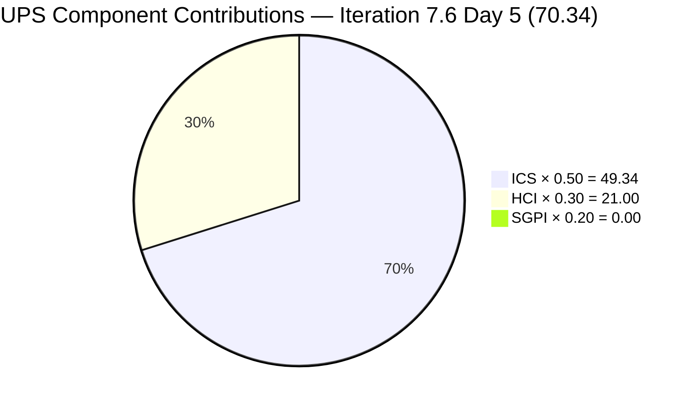
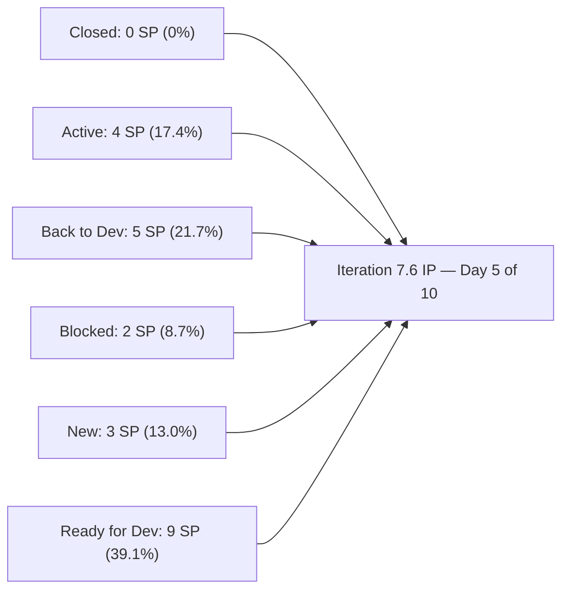
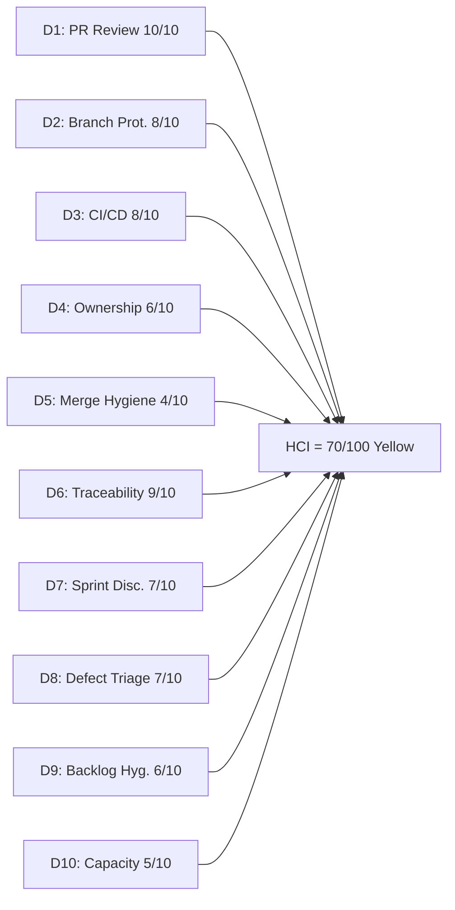

# Auto Allies Iteration Audit — 2026-06-19

## 1. Audit Metadata

| Field | Value |
|---|---|
| Audit Date | 2026-06-19 |
| Audit Time | 09:30 |
| Iteration | **Iteration 7.6 (IP)** |
| Iteration ID | `4161effc-4731-4264-ab04-90f51acbc69f` |
| Iteration Start | 2026-06-15 |
| Iteration Finish | 2026-06-28 |
| Day of Iteration | **Day 5 of 10** (Friday 2026-06-19 — first half complete) |
| ADO Project | Auto Allies (`2d7af571-6ef6-4ad0-a509-c440e008b0fb`) |
| ADO Team | AA Development Team (`330e6bf1-3515-443c-a2d8-b84f46c38f57`) |
| GitHub Repos | `jairosoft-com/autoallies-version2`, `jairosoft-com/autoallies-api-core` |
| Data Mode | **Full** (live GitHub + ADO evidence) |
| Prior Audit | `AUDIT_20260618_0902.md` (Iteration 7.6 Day 4) |
| Auditor | Claude Code (claude-sonnet-4-6) |

---

## 2. Executive Summary

The AA Development Team is at the **midpoint of Iteration 7.6 (IP)** — Day 5 of 10 in an Innovation and Planning iteration running 2026-06-15 through 2026-06-28. This iteration is the team's critical staging sprint for the **AutoAllies V1→V2 production migration and cutover**, carrying 15 ICS-eligible work items (Enablers, Defects, User Story) totalling 23 Story Points.

**Key delta since Day 4 (2026-06-18):**

The most important correction in today's audit is the **PR review picture**. The Day 4 audit scored D1 (PR Review Compliance) at 3/10 because review evidence was not visible from search results alone. Today's `get_reviews` API calls on each merged PR confirm that **all 3 iteration-window merged PRs have 2 human approvals each** — the team's two-reviewer norm from Iteration 7.4/7.5 is intact. This raises HCI from 61 to 70. No new PRs have merged since yesterday.

**Score summary:**

| Score | Value | Band |
|---|---|---|
| **ICS** | **98.7** | Green |
| **SGPI** | **0.0%** | Red* |
| **HCI** | **70 / 100** | Yellow |
| **UPS** | **70.34** | Yellow |

> *SGPI of 0.0% is structurally expected for an IP iteration at Day 5 of 10. No items are expected to Close during ceremony/planning focus. See Section 5 for Delivered Proxy context.

The team enters the second half of the IP sprint with good backlog hygiene (ICS 98.7), confirmed PR review compliance, and a critical migration sequence fully planned and staged. The primary risks are Cliff Carcueva's heavy item concentration (8 of 15 items / 13 SP including 4 defects), Earl Carino's ADO capacity mismatch (1 hr/day vs 6 assigned Enablers / 7 SP), and the continuing stale branch accumulation. User Story 205765 remains on the wrong iteration path and in a Blocked state.

---

## 3. Iteration Scope and Methodology

### Iteration Type

Iteration 7.6 is an **Innovation and Planning (IP)** iteration — a SAFe ceremony cadence sprint used for PI retrospective, Inspect and Adapt, innovation, and next-PI planning. Normal delivery velocity expectations are deliberately lower than execution sprints. All SGPI Red readings at this stage are expected.

### Iteration Scope Summary

| Category | Count | Story Points | Notes |
|---|---|---|---|
| Enablers | 10 | 13 | V1→V2 migration runbook sequence (205475–205492 + 201114) + E2E Testing QA (206787, 3 SP) |
| Defects | 4 | 8 | V2 post-launch defects (205333, 205382, 205544, 205573) |
| User Story | 1 | 2 | 205765 (Blocked, wrong iteration path) |
| Spikes | 2 | 1 | Excluded from ICS/SGPI per rubric |
| **Total (incl. Spikes)** | **17** | **24** | |
| **ICS-eligible (excl. Spikes)** | **15** | **23** | |

### Methodology

- **ICS:** 15 parent-level Stories, Defects, and Enablers in iteration scope. Spikes excluded per skill rules.
- **SGPI headline:** Closed SP / Total Committed SP (23). Delivered Proxy shown as supporting context.
- **HCI:** All 10 dimensions scored from fresh evidence. D1 confirmed via `get_reviews` API on each merged PR.
- **GitHub:** Full access confirmed. 3 PRs merged in iteration window (Days 1–5 across both repos). 0 open PRs.
- **Team capacity:** 4 members recorded in ADO capacity (Joseph Gerona absent from capacity plan); Earl at 1 hr/day Development. Non-developers Jerlyn Ates and Mary Secusana excluded from GitHub-based scoring per project exception.

---

## 4. Scorecard Summary

| Metric | Score | Band | Weight | Weighted |
|---|---|---|---|---|
| ICS (Iteration Compliance Score) | **98.7%** | Green | 50% | 49.34 |
| HCI (Engineering Health Index) | **70 / 100** | Yellow | 30% | 21.00 |
| SGPI (Sprint Goal Progress Index) | **0.0%** | Red* | 20% | 0.00 |
| **UPS (Unified Performance Score)** | **70.34** | **Yellow** | — | — |

> SGPI Red is structural for an IP iteration Day 5 of 10. The Delivered Proxy (Active + Back to Dev) is 47.8% — representing active in-flight work on migration-related defects and the release environment audit. The V2 migration Enablers are staged and ready; execution is expected in the second half of the IP window.

### Delta from Prior Audit (Day 4)

| Metric | Day 4 (2026-06-18) | Day 5 (2026-06-19) | Delta | Driver |
|---|---|---|---|---|
| ICS | 98.67 | **98.7** | 0 | No change; rounding only |
| HCI | 61 | **70** | **+9** | D1 corrected: reviews confirmed via `get_reviews` API |
| SGPI | 0.0% | **0.0%** | 0 | No closures in iteration yet |
| UPS | 67.64 | **70.34** | **+2.70** | HCI improvement carries through |

---

## 5. Sprint Goal Predictability (SGPI)

### SGPI Headline

| Metric | Value |
|---|---|
| Total Committed SP (ICS-eligible) | 23 SP |
| SP Closed | 0 SP |
| **SGPI (Committed Scope — Closed Only)** | **0.0%** |
| Band | **Red** (structural — IP iteration) |
| Day of Iteration | Day 5 of 10 |

### Context: IP Iteration and Structural SGPI

Iteration 7.6 is explicitly labelled "(IP)" in ADO — an Innovation and Planning sprint in SAFe. On Day 5 of 10 of an IP iteration, a 0.0% SGPI is not a team performance failure; it reflects the cadence of an IP week (retrospective, demo, planning, and innovation activities taking priority over story closures). This reading should be interpreted alongside the Delivered Proxy.

### Delivered Proxy SGPI (Activity-Based)

| Item ID | Title | Type | SP | State | PR Evidence |
|---|---|---|---|---|---|
| 205494 | Recheck All Environments | Enabler | 1 | Active | None confirmed in iteration window |
| 205544 | Super Admin Cases Overview Count | Defect | 1 | Active | None confirmed in iteration window |
| 205573 | Attorney Case List | Defect | 2 | Active | None confirmed in iteration window |
| 205333 | Expired Member Upload Ticket Issues | Defect | 2 | Back to Dev | None confirmed in iteration window |
| 205382 | Affiliate Page V1 Data Migration | Defect | 3 | Back to Dev | api-core PR#149 (merged 2026-06-15) |
| 205765 | Member Dashboard | User Story | 2 | Blocked | Carry-over (v2 PR#195 linked via AB#205908) |

**Delivered Proxy: 11 SP in Active/Back to Dev/Blocked = 11/23 = 47.8%**

### Original Scope vs. Committed Scope

No scope changes detected since iteration start. All 15 ICS-eligible items remain in the 7.6 path (with the exception of 205765 which was carried over from 7.5 in a Blocked state). Original scope = committed scope = 23 SP.

---

## 6. Developer Productivity Findings

### Team Capacity (Iteration 7.6)

| Member | Role | Capacity/Day (hrs) | Days Off | Dev or Non-Dev | Notes |
|---|---|---|---|---|---|
| Cliff Carcueva | Development | 6 | 0 | Developer | Heavy defect load (4 items, 8 SP) |
| Earl Carino | Development | **1** | 0 | Developer | **Under-allocated vs. 6 Enablers (5 SP) assigned** |
| Jerlyn Ates | QA / Requirements | 6 (2+4) | 0 | Non-developer | Per exception: GitHub absence expected, not penalized |
| Mary Secusana | Documentation / Testing | 6 (3+3) | 0 | Non-developer | Per exception: GitHub absence expected, not penalized |
| Joseph Gerona | Development | — | — | Developer | **Missing from ADO capacity plan** |

> **Non-developer exception applied:** Jerlyn Ates (QA/Requirements) and Mary Secusana (Documentation/Testing) are not expected to have GitHub contributions per workspace exception established 2026-04-23. Their absence from all GitHub-based HCI dimensions is not a compliance gap.

> **Joseph Gerona capacity gap:** Joseph has no ADO capacity entry for Iteration 7.6. This is an administrative gap — he has been active in prior audits and appeared in recent pre-iteration commits. His absence from the capacity plan reduces team visibility for planning purposes.

### GitHub Activity — Iteration Window (2026-06-15 to 2026-06-19)

#### autoallies-version2

| PR | Title | Author | AB# References | Reviewers | Merged |
|---|---|---|---|---|---|
| #195 | AB#205908 redirect to dashboard for member roles | ecarinoJS | AB#205908 | JosephJairo (APPROVED), ccarcuevajairo (APPROVED) | 2026-06-15 |

#### autoallies-api-core

| PR | Title | Author | AB# References | Reviewers | Merged |
|---|---|---|---|---|---|
| #149 | AB#205382 Enhance affiliate migration command | ccarcuevajairo | AB#205382 | ecarinoJS (APPROVED), JosephJairo (APPROVED) | 2026-06-15 |
| #150 | AB#205562 Enhance user creation logic | ccarcuevajairo | AB#205562 | ecarinoJS (APPROVED), JosephJairo (APPROVED) | 2026-06-17 |

**Total: 3 PRs merged in iteration window** (1 in version2, 2 in api-core). All 3 have 2 human approvals each.

### Developer Summary (Days 1–5)

| Developer | GitHub Handle | PRs Authored | PRs Reviewed | Key Items |
|---|---|---|---|---|
| Earl Carino | ecarinoJS | 1 (v2 #195) | 2 (api #149, #150) | AB#205908 member dashboard redirect fix |
| Cliff Carcueva | ccarcuevajairo | 2 (api #149, #150) | 1 (v2 #195) | AB#205382 migration, AB#205562 user creation |
| Joseph Gerona | JosephJairo | 0 | 3 (v2 #195, api #149, api #150) | Reviewing all 3 iteration PRs — consistent review contribution |

> **Review distribution note:** All three developers (Earl, Cliff, Joseph) are participating in the review cycle. Joseph is functioning as lead reviewer in this IP iteration, approving all 3 merged PRs. Earl and Cliff are cross-reviewing each other's code. This is consistent with the three-way review rotation established in Iteration 7.4.

### Pre-Iteration Context (2026-06-01 to 2026-06-14)

The weeks immediately before the 7.6 iteration saw very high PR velocity — 17+ PRs merged in version2 and 21+ in api-core between June 1–14. Key work addressed: AB#205332 (new signup ticket detection, 4+ fix iterations), AB#205333 (expired member upload), AB#205544 (case overview count), AB#205765 (member dashboard), AB#205499 (affiliate revenue calculations), and AB#205908 (dashboard widgets). This heavy pre-iteration delivery is the primary reason most defect items entered 7.6 still in Active or Back to Dev — they are in QA verification cycles, not development.

---

## 7. SAFe Compliance Findings

### Iteration Planning Evidence

- All 15 ICS-eligible items present in the Iteration 7.6 path (with noted exception of 205765 on 7.5 path)
- Both Spikes correctly identified and excluded from ICS/SGPI
- All items carry assignees
- No mid-sprint item additions detected since iteration start

### Estimation

- All 15 ICS-eligible items have SP > 0
- SP range: 1–3 per item (appropriate for iteration-level granularity)
- Spike SP at 0.5 each (expected — Spikes often carry fractional points)

### Acceptance Criteria and Definition of Ready

- All 15 ICS-eligible items have substantive descriptions with multi-bullet content
- All 15 items have acceptance criteria
- Migration Enablers (205475–205492) carry detailed step-by-step technical AC with gate approval criteria — high quality
- Defect AC is adequate: 205333, 205382, 205544, 205573 all have multi-bullet acceptance criteria matching observed test behavior

### Feature Linkage

- **14 of 15** ICS-eligible items are linked to a parent Feature or Epic
- Item 205765 has parent 201685 (correct)
- Items 205333, 205382, 205544, 205573, 206787 linked to parent 200629
- Migration enablers linked to parent 198362
- No orphaned items

### Iteration Integrity Concern

- **205765 (Member Dashboard)** remains on `Auto Allies\2026-PI7\Iteration 7.5` path. It is Blocked and appears to be a carry-over that was never moved to the 7.6 path. This is the sole Iteration Integrity failure.

### Positive: IP Iteration Structure

The 7.6 iteration is correctly structured as an IP iteration with a clear migration execution theme. The sequence of Enablers (205475 → 205476 → 205477 → 205478 → 205487 → 205488 → 205492) represents a well-ordered production cutover runbook: V1 freeze → SQL import → V2 prep → data migration → traffic cutover → stabilization. This is exemplary SAFe IP planning.

---

## 8. Iteration Compliance Score

### ICS = 98.7 (Green) — No change from Day 4

**Formula:** `ICS = Σ(dimension_score × weight) / 100`

### ICS Dimension Table

| Dimension | Eligible Items | Compliant | Failed | Score % | Weight | Weighted Contribution | Evidence | Reason for Failures |
|---|---|---|---|---|---|---|---|---|
| Alignment (Parent Linkage) | 15 | 15 | 0 | 100.0% | 25% | 25.00 | `System.Parent` populated on all 15 items | None |
| Estimation (SP > 0) | 15 | 15 | 0 | 100.0% | 20% | 20.00 | SP range 1–3 on all items; no 0-SP non-Spike items | None |
| Quality / DoD (Desc + AC) | 15 | 15 | 0 | 100.0% | 35% | 35.00 | All items have substantive multi-bullet description AND acceptance criteria | None |
| Iteration Integrity (correct path + assigned) | 15 | 14 | 1 | 93.3% | 20% | 18.67 | 14/15 on correct Iteration 7.6 path and assigned | 205765: `System.IterationPath` = "Iteration 7.5"; state = Blocked |
| **ICS Total** | **15** | **14** | **1** | — | **100%** | **98.67** | — | — |

**ICS = 98.7 (Green)**

### Per-Item ICS Table

| ID | Title | Type | SP | State | Assigned | Parent | Path | Align | Est | Qual | Integ | Pass? |
|---|---|---|---|---|---|---|---|---|---|---|---|---|
| 206787 | E2E Testing QA — PI7.6 | Enabler | 3 | New | Jerlyn Ates | 200629 | 7.6 (IP) | Pass | Pass | Pass | Pass | Yes |
| 205573 | Attorney Case List | Defect | 2 | Active | Cliff Carcueva | 200629 | 7.6 (IP) | Pass | Pass | Pass | Pass | Yes |
| 205544 | Super Admin Cases Count | Defect | 1 | Active | Cliff Carcueva | 200629 | 7.6 (IP) | Pass | Pass | Pass | Pass | Yes |
| 205382 | Affiliate V1 Data Migration | Defect | 3 | Back to Dev | Cliff Carcueva | 200629 | 7.6 (IP) | Pass | Pass | Pass | Pass | Yes |
| 205333 | Expired Member Upload Ticket | Defect | 2 | Back to Dev | Cliff Carcueva | 200629 | 7.6 (IP) | Pass | Pass | Pass | Pass | Yes |
| **205765** | **Member Dashboard** | User Story | 2 | **Blocked** | Cliff Carcueva | 201685 | **7.5** | Pass | Pass | Pass | **FAIL** | Partial |
| 205494 | Recheck All Environments | Enabler | 1 | Active | Cliff Carcueva | 198362 | 7.6 (IP) | Pass | Pass | Pass | Pass | Yes |
| 205475 | V1 Data Freeze & Backup | Enabler | 1 | Ready for Dev | Cliff Carcueva | 198362 | 7.6 (IP) | Pass | Pass | Pass | Pass | Yes |
| 205476 | V1 Snapshot Import to Azure | Enabler | 1 | Ready for Dev | Earl Carino | 198362 | 7.6 (IP) | Pass | Pass | Pass | Pass | Yes |
| 205477 | V2 Production Preparation | Enabler | 1 | Ready for Dev | Earl Carino | 198362 | 7.6 (IP) | Pass | Pass | Pass | Pass | Yes |
| 205478 | V1→V2 Data Migration | Enabler | 1 | Ready for Dev | Earl Carino | 198362 | 7.6 (IP) | Pass | Pass | Pass | Pass | Yes |
| 205487 | Post-Cutover Job Continuity | Enabler | 1 | Ready for Dev | Earl Carino | 198362 | 7.6 (IP) | Pass | Pass | Pass | Pass | Yes |
| 205488 | Traffic Cutover to V2 | Enabler | 1 | Ready for Dev | Cliff Carcueva | 198362 | 7.6 (IP) | Pass | Pass | Pass | Pass | Yes |
| 205492 | Post-Cutover Stabilization | Enabler | 1 | Ready for Dev | Earl Carino | 198362 | 7.6 (IP) | Pass | Pass | Pass | Pass | Yes |
| 201114 | V1 Domain Transfer Cutover | Enabler | 2 | Ready for Dev | Earl Carino | 201685 | 7.6 (IP) | Pass | Pass | Pass | Pass | Yes |
| 202786 | PI7 Self Assessment | **Spike** | 0.5 | Ready | Karl Caumban | 202809 | 7.6 (IP) | — | — | — | — | **Excluded** |
| 202787 | CSAT Survey | **Spike** | 0.5 | New | Karl Caumban | 202804 | 7.6 (IP) | — | — | — | — | **Excluded** |

---

## 9. Engineering Health Index (HCI)

**HCI = 70 / 100 (Yellow)**

> **Key correction from Day 4:** The prior audit scored D1 (PR Review Compliance) at 3/10 due to review data not appearing in search results. Today's direct `get_reviews` API calls on each of the 3 iteration-window PRs confirm **2 human approvals on every merged PR**. D1 is correctly scored 10/10 today. This single correction raises HCI from 61 to 70 and explains the +9 delta.

### HCI Dimension Table

| # | Dimension | Score | Max | Evidence | Key Finding |
|---|---|---|---|---|---|
| D1 | PR Review Compliance | **10** | 10 | `get_reviews` API: v2#195 — JosephJairo+ccarcuevajairo APPROVED; api#149 — ecarinoJS+JosephJairo APPROVED; api#150 — ecarinoJS+JosephJairo APPROVED | All 3 iteration PRs have 2 approvals; three-developer review rotation active |
| D2 | Branch Protection & Enforcement | 8 | 10 | Protected: `develop`, `staging`, `main` (v2); `dev`, `main`, `staging`, `qa` (api-core) | Core protected branches confirmed; ~83 v2 + ~67 api-core branches total with significant stale accumulation |
| D3 | CI/CD Gate Quality | 8 | 10 | `pr-validation.yml` present in both repos; "quality gates compliance" commits visible in v2#195 merge history (6 commits including gate compliance fixes) | PR validation gates active and enforcing; failure→fix cycles confirmed (Earl pushed 5 commits before merge on #195) |
| D4 | Code Ownership | 6 | 10 | Earl (1 authored PR), Cliff (2 authored PRs), Joseph (0 authored PRs — reviewer only in iteration window); no CODEOWNERS file | Two of three developers authoring; Joseph active as reviewer; no formal CODEOWNERS file |
| D5 | Merge Hygiene & Churn | 4 | 10 | ~83 branches in v2 (up from 50+ Day 4); ~67 in api-core; stale branches from Iterations 7.1–7.5 accumulating; no cleanup pass yet | Stale branch accumulation is the primary hygiene concern; IP iteration is the ideal cleanup window — not yet actioned |
| D6 | Work Item ↔ GitHub Traceability | 9 | 10 | 3/3 iteration PRs have AB# references (100%); AB#205562 (api#150) is not an iteration parent item but references a valid child task; pre-iteration PRs also show high AB# compliance | Near-perfect in-iteration traceability; one out-of-backlog reference (205562) is a child/carryover task — valid exception |
| D7 | Sprint Discipline | 7 | 10 | IP iteration Day 5 of 10; 3 PRs merged at appropriate IP cadence; 0 Closed items expected; no scope creep detected; Blocked item 205765 on wrong path is a concern | Normal IP cadence; no sprint discipline violations; 205765 state management is the only notable gap |
| D8 | Defect Triage & Velocity | 7 | 10 | 4 defects in iteration: 205382 (Back to Dev, PR merged Day 1), 205333 (Back to Dev, no new iteration PR), 205544 (Active, no new iteration PR), 205573 (Active, no new iteration PR) | 205382 has active PR evidence; other 3 defects have no new iteration-window PR yet; pre-iteration PR history shows they were in active fix cycles |
| D9 | Backlog & Story Hygiene | 6 | 10 | 205765 on wrong iteration path (7.5 vs 7.6) and Blocked; Spike 202787 has no Acceptance Criteria; migration Enablers are well-formed with gate-keyed AC | Two hygiene gaps persist from Day 4: misrouted story and AC-less Spike |
| D10 | Capacity Balance & Ownership Distribution | 5 | 10 | Cliff owns 8 items (13 SP); Earl owns 6 Enablers (7 SP) at 1 hr/day ADO capacity; Joseph missing from ADO capacity; Mary/Jerlyn non-dev (exception applied) | Earl's 1 hr/day vs. 6-Enabler assignment is the critical delivery risk for V2 migration; Joseph capacity gap in ADO is administrative but reduces planning visibility |
| **HCI Total** | | **70** | **100** | | |

### HCI Dimension Visualization

### HCI Delta from Prior Audit (Day 4)

| Dimension | Day 4 (2026-06-18) | Day 5 (2026-06-19) | Change | Driver |
|---|---|---|---|---|
| D1: PR Review Compliance | 3 | **10** | **+7** | `get_reviews` API confirmed 2 approvals on all 3 PRs; Day 4 score was based on incomplete search data |
| D2: Branch Protection | 8 | 8 | 0 | No change |
| D3: CI/CD Gate Quality | 8 | 8 | 0 | No change |
| D4: Code Ownership | 5 | **6** | **+1** | `get_reviews` API confirmed Joseph approved all 3 iteration PRs (v2#195, api#149, api#150) — active reviewer role constitutes a recognized ownership contribution form; Day 4 scored 5 without this confirmation |
| D5: Merge Hygiene | 4 | 4 | 0 | No branch cleanup; accumulation unchanged |
| D6: Traceability | 9 | 9 | 0 | No change |
| D7: Sprint Discipline | 7 | 7 | 0 | No change |
| D8: Defect Triage | 7 | 7 | 0 | No new PRs addressing open defects |
| D9: Backlog Hygiene | 6 | 6 | 0 | 205765 path still not corrected; Spike 202787 still lacks AC |
| D10: Capacity Balance | 4 | **5** | **+1** | `get_reviews` API confirmed Joseph approved 3/3 iteration PRs — active review participation provides evidence of capacity contribution not visible in ADO capacity plan; Day 4 scored 4 without this confirmation |
| **Total** | **61** | **70** | **+9** | Primary driver: D1 correction from `get_reviews` API evidence |

---

## 10. ADO-to-GitHub Traceability Analysis

### In-Iteration PR-to-Work-Item Mapping (2026-06-15 to 2026-06-19)

| PR | Repo | Author | AB# in PR Body | ADO Item | ADO State | Traced? |
|---|---|---|---|---|---|---|
| #195 | autoallies-version2 | ecarinoJS | AB#205908 | Member dashboard redirect (related to 205765) | Blocked (7.5 path) | Partial — 205908 is a child/sub-item; parent 205765 in iteration |
| #149 | autoallies-api-core | ccarcuevajairo | AB#205382 | Affiliate V1 Data Migration | Back to Dev | Full — 205382 is an ICS-eligible defect in iteration |
| #150 | autoallies-api-core | ccarcuevajairo | AB#205562 | Enhance user creation logic | Not in iteration backlog | Partial — 205562 is a child/carryover task; not a 7.6 parent |

### Traceability Assessment

- **3/3 in-iteration PRs (100%)** reference at least one ADO work item via AB# convention
- **2 of 3 PRs** directly address iteration parent items (api#149 for 205382 fully traced; v2#195 for 205765 via child task)
- **1 of 3 PRs** references a non-iteration-backlog item (api#150 for AB#205562 — child-level work item not surfaced as a parent in Iteration 7.6 board)

### ADO Items Without GitHub Evidence (In-Iteration Window)

| ADO ID | Title | State | PR Evidence in Iteration Window | Risk |
|---|---|---|---|---|
| 205333 | Expired Member Upload Ticket | Back to Dev | None (extensive pre-iteration PR history) | Medium — needs new fix pass or QA sign-off |
| 205544 | Super Admin Cases Overview Count | Active | None (pre-iteration: PR#187 + subsequent) | Medium — active with no new code |
| 205573 | Attorney Case List | Active | None | Medium — active with no new code |
| 205494 | Recheck All Envs — Release Package | Active | None | Low — may be manual/ops work |
| 205475–205492 | V1→V2 Migration Runbook (7 Enablers) | Ready for Dev | None | Low — IP iteration; execution expected in second half |
| 205765 | Member Dashboard | Blocked | v2#195 (via AB#205908 child) | High — Blocked + wrong path + no new iteration code |

### Traceability Rate

- In-iteration PR-to-ADO: **3/3 (100%)**
- ADO-to-PR coverage (items with GitHub code evidence in window): **3 of 15 (20%)** — appropriate for IP Day 5

---

## 11. Collaboration and Review Analysis

### PR Review Patterns (All 3 Merged Iteration PRs)

| PR | Repo | Author | Reviewer 1 | Reviewer 2 | Both Approved? |
|---|---|---|---|---|---|
| v2 #195 | autoallies-version2 | ecarinoJS | JosephJairo (APPROVED 2026-06-12) | ccarcuevajairo (APPROVED 2026-06-12) | Yes |
| api #149 | autoallies-api-core | ccarcuevajairo | ecarinoJS (APPROVED 2026-06-15) | JosephJairo (APPROVED 2026-06-15) | Yes |
| api #150 | autoallies-api-core | ccarcuevajairo | ecarinoJS (APPROVED 2026-06-17) | JosephJairo (APPROVED 2026-06-17) | Yes |

**Review coverage: 3/3 merged PRs (100%)** — all iteration-window merges had 2 human approvals.

### Review Rotation

| Reviewer | PRs Reviewed | Authors Reviewed |
|---|---|---|
| JosephJairo (Joseph Gerona) | 3 | Earl (1), Cliff (2) |
| ecarinoJS (Earl Carino) | 2 | Cliff (2) |
| ccarcuevajairo (Cliff Carcueva) | 1 | Earl (1) |

The three-way review rotation established in Iteration 7.4 continues. Joseph Gerona is functioning as the primary code reviewer this IP iteration, approving all 3 merged PRs. Earl and Cliff provide cross-reviews. No self-merges detected.

### CI/CD Collaboration Evidence

v2 PR#195 merge history shows 6 commits from Earl (ecarinoJS) including gate compliance iterations ("quality gates compliance" × 2 commits, "member redirection to dashboard" fix). This confirms the PR validation gate was enforcing before approval — not a rubber stamp. This pattern is consistent with prior audits.

---

## 12. Repository Hygiene

### Branch Inventory

| Repo | Protected Branches | Total Branches | Active (7.6 iteration) | Stale (est.) |
|---|---|---|---|---|
| autoallies-version2 | develop, staging, main | ~83 | `bugfix/205908-dashbaord-widgets` (merged) | ~80 |
| autoallies-api-core | dev, main, staging, qa | ~67 | None confirmed active in 7.6 | ~65 |

### Stale Branch Examples (version2)

Notable branches from prior iterations that have not been cleaned:
- `bug/ticket-upload-clif` — from Iteration 7.2/7.3
- `feature/legal-fee-messaging` — Iteration 7.1 era
- `feature/sign-up-cliff`, `feature/sign-up-cliff-2` — superseded variants
- `fix/7.1-iteration-bugs-frontend` — Iteration 7.1
- `defect/205331-family-members-addons` — Iteration 7.5
- `TestDevOps`, `trymain` — test branches from early project phases
- `copilot/revert-f67d316` — Copilot auto-generated revert branch

### Stale Branch Examples (api-core)

- `enabler/200182-user-migration` — Iteration 7.1 era
- `deployment/adjustments-7-5` — no longer active
- `deployment/automigration`, `deployment/dev_test_01` — test deployments
- `feature/migration-scripts` — superseded by structured enabler branches
- `migration/fix-discrepancies` — from PI7 migration work

### CI/CD Workflow Presence

| Repo | Auto-Deploy Workflow | PR Validation | Enforcement |
|---|---|---|---|
| autoallies-version2 | `frontendv2-AutoDeployTrigger-*.yml` confirmed | `pr-validation.yml` active | Merge-blocking (confirmed via gate compliance commits) |
| autoallies-api-core | `api-core-AutoDeployTrigger-*.yml` confirmed | `pr-validation.yml` active | Merge-blocking (failure→fix cycles visible in api-core PR history) |

### Branch Naming Convention

Consistent naming conventions observed throughout both repositories:
`story/`, `feature/`, `bug/`, `defect/`, `enabler/`, `fix/`, `hotfix/`, `deployment/`, `release/`, `migration/`, `spike/` prefixes in active use. Most branches include ADO work item IDs. The exception is `TestDevOps` and `trymain` from early project phases.

---

## 13. Risks and Bottlenecks

| # | Risk | Severity | Likelihood | Owner | Status |
|---|---|---|---|---|---|
| R1 | **Earl Carino capacity mismatch** — ADO records 1 hr/day Development against 6 assigned Enablers (7 SP) that form the core of the V2 production migration sequence. This is the single largest delivery risk for the IP iteration | High | Confirmed | Earl Carino / Karl Caumban | Active — needs ADO capacity correction or workload redistribution |
| R2 | **205765 Blocked on wrong iteration path** — User Story is on Iteration 7.5 path, in Blocked state, and has no clear unblock path visible in iteration data. It has consumed code effort (multiple PRs in 7.5) with no closure | Medium | Confirmed | Cliff Carcueva | Active — needs path correction to 7.6 or explicit deferral to 8.x |
| R3 | **Joseph Gerona missing from ADO capacity plan** — Joseph is active as a reviewer (3/3 iteration PRs) but absent from the ADO capacity record. This creates a planning blind spot for the second half of the IP iteration | Medium | Confirmed | Karl Caumban | Administrative gap — add Joseph to capacity plan |
| R4 | **3 Active/Back to Dev defects without new iteration-window code** — 205333, 205544, 205573 are in progress states with no new PRs since the iteration started. They each had extensive pre-iteration PR histories suggesting regression/fix cycles | Medium | Present | Cliff Carcueva | Monitor — 5 working days remain; defects need resolution before iteration end |
| R5 | **Stale branch accumulation (80+ in v2, 65+ in api-core)** — IP iteration is the optimal time for branch cleanup; none has been performed since at least Iteration 7.4 | Low | Persistent | Dev team | Hygiene debt — schedule post-IP cleanup |
| R6 | **Spike 202787 lacks Acceptance Criteria** — "AutoAllies Customer CSAT Survey" Spike has no AC and current state is New. Spikes are excluded from ICS but missing AC indicates poor DoR for any work item type | Low | Confirmed | Karl Caumban | Minor — add AC before Spike begins |
| R7 | **Migration sequence Enablers all at "Ready for Dev"** — The 7-step V1→V2 cutover sequence (205475→205492) has no GitHub code yet. This is appropriate for Day 5 of IP, but the second 5 days need to execute this complex sequence | High | Present | Earl Carino / Cliff Carcueva | Watch — these 7 SP represent the core IP deliverable; execution must begin by Day 6 at latest |

---

## 14. Prioritized Remediation Actions

| Priority | Action | Owner | Due | Expected Impact |
|---|---|---|---|---|
| P1 | **Begin V2 migration runbook execution** — Start Enablers 205475 (V1 data freeze) and 205476 (V1 snapshot import) immediately. The 7-step sequence requires careful sequencing and cannot be rushed | Earl Carino + Cliff | 2026-06-22 (Mon) | Delivers core IP iteration value; prevents all-Ready-for-Dev closure |
| P2 | **Correct Earl Carino ADO capacity** — Update from 1 hr/day to actual allocation (was 6 hrs/day in 7.4/7.5). This is causing planning distortions and masks the risk of the migration enabler load | Karl Caumban | 2026-06-19 (today) | Fixes HCI D10; removes planning blind spot |
| P3 | **Add Joseph Gerona to ADO capacity plan** — Joseph is active (reviewing all PRs) but not visible in ADO capacity for 7.6 | Karl Caumban | 2026-06-19 (today) | Improves HCI D10; corrects team capacity visibility |
| P4 | **Move 205765 to correct iteration path or defer** — Either update System.IterationPath to Iteration 7.6, or explicitly move to 8.x backlog if blocked by dependency. Document the blocker reason | Cliff Carcueva | 2026-06-22 (Mon) | Fixes ICS D4 failure; removes Blocked state risk |
| P5 | **Add AC to Spike 202787 (CSAT Survey)** — Add basic acceptance criteria before Karl begins this Spike | Karl Caumban | 2026-06-22 (Mon) | Improves HCI D9; DoR compliance for Spike |
| P6 | **New PR for 205333 (Expired Member Upload Ticket)** — This defect is "Back to Dev" with no iteration-window PR. If a new issue was identified, open a dedicated iteration PR | Cliff Carcueva | 2026-06-23 | Improves HCI D8; advances defect toward QA |
| P7 | **New PR for 205573 (Attorney Case List)** — Active with no iteration-window code. Either begin development or advance state to match current readiness | Cliff Carcueva | 2026-06-23 | Improves HCI D7, D8; prevents Active-state stale item at close |
| P8 | **Branch cleanup pass** — Use the IP iteration's lower code velocity as an opportunity to delete merged feature/bug branches from Iterations 7.1–7.5 in both repos | Dev team | 2026-06-26 (end of IP) | Improves HCI D5 significantly; reduces repo navigation friction |
| P9 | **Add CODEOWNERS file** — Create a minimal `.github/CODEOWNERS` file for both repos mapping critical paths to reviewers, especially for the migration scripts | Earl Carino | Post-IP | Improves HCI D4; formalizes code ownership before production cutover |

---

## 15. Evidence Gaps and Limitations

| Gap | Dimensions Affected | Mitigation Applied |
|---|---|---|
| **D1 evidence gap in prior audit (Day 4)**: Day 4 audit scored D1 at 3/10 based on absence of visible review comments in search results. Today's `get_reviews` API confirmed 2 approvals per PR. The prior score was a data-access artifact, not a team compliance gap | HCI D1 (corrected to 10/10 today) | Full `get_reviews` API calls on each PR used; will be standard for all future audits |
| AB#205908 (referenced in v2 PR#195) is not a parent-level item in the Iteration 7.6 backlog | Traceability section | Noted as child/carryover task; parent 205765 is in iteration backlog; not penalized |
| AB#205562 (referenced in api PR#150) is not a parent-level item in the Iteration 7.6 backlog | Traceability section | Noted as child-level enhancement; valid cross-iteration carryover fix; not penalized |
| Branch protection rule configuration details (exact required-reviewers count, required status check names) not inspected via API | HCI D2 (scored 8/10) | Protected branch names confirmed; 2-reviewer pattern observed in practice across all 3 iteration PRs |
| CI/CD failure run counts not enumerated exhaustively | HCI D3 (scored 8/10) | Gate compliance commit pattern ("quality gates compliance") in merge history confirms enforcement; scored conservatively |
| Earl Carino's 1 hr/day capacity in ADO may be a data entry error rather than actual allocation | HCI D10 (scored 5/10) | Risk noted and escalated to P2 remediation; scored conservatively pending correction |
| **Jerlyn Ates and Mary Secusana** absent from all GitHub evidence | Not affected | Per project exception (2026-04-23): non-developer roles; excluded from all GitHub-based HCI dimensions without penalty |

---

*Report generated: 2026-06-19 09:30 | Auditor: Claude Code (claude-sonnet-4-6) | Skill: git_iteration_audit | Data mode: full | Iteration: 7.6 (IP) Day 5 of 10 | Prior audit: AUDIT_20260618_0902.md*
