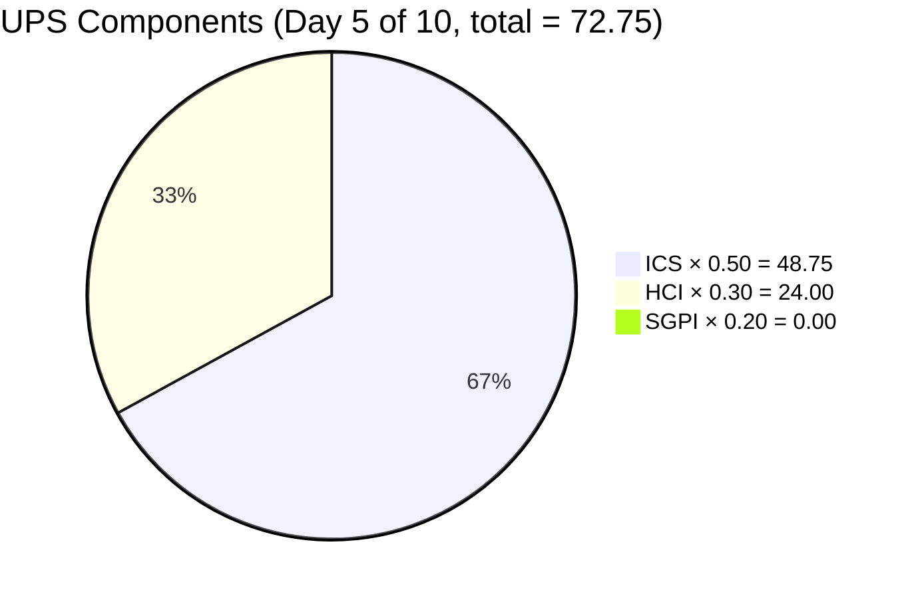
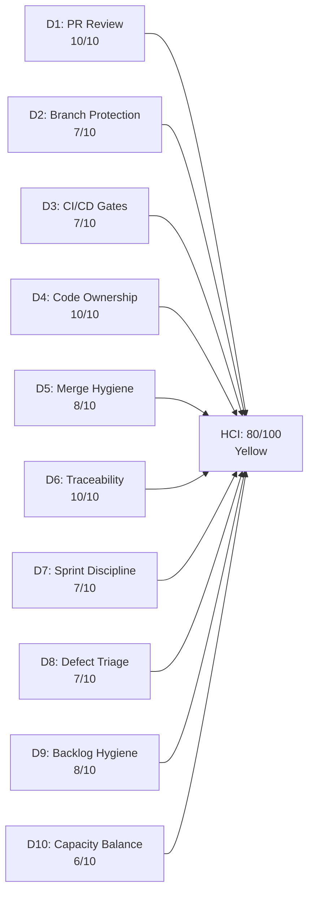

# Auto Allies Iteration Audit — 2026-06-20

## 1. Audit Metadata

| Field | Value |
|---|---|
| Audit Date | 2026-06-20 (Saturday — end of Week 1) |
| Audit Time | 09:30 |
| Iteration | **Iteration 7.6 (IP)** — Innovation & Planning Sprint |
| Iteration ID | 4161effc-4731-4264-ab04-90f51acbc69f |
| Iteration Start | 2026-06-15 (Monday) |
| Iteration Finish | 2026-06-28 (Sunday) |
| Day of Iteration | **5 of 10** (end of Week 1 — 5 working days remain: Jun 22–26) |
| ADO Project | Auto Allies (2d7af571-6ef6-4ad0-a509-c440e008b0fb) |
| ADO Team | AA Development Team (330e6bf1-3515-443c-a2d8-b84f46c38f57) |
| GitHub Repos | jairosoft-com/autoallies-version2, jairosoft-com/autoallies-api-core |
| Data Mode | **full** (GitHub token active since 2026-05-20) |
| Prior Audit Referenced | AUDIT_20260527_0246.md (Iteration 7.4 Day 8, ICS: 100.0 / HCI: 83 / SGPI: 6.25% / UPS: 76.15 — Yellow) |
| Auditor | Claude Code (claude-sonnet-4-6) |

---

## 2. Executive Summary

This is the Day 5 (end-of-Week-1) audit for **Iteration 7.6 (IP)** — the Innovation & Planning sprint closing PI7. The team has transitioned from feature delivery mode into a structured cutover and stabilization posture, with 16 backlog items committed to this IP sprint (excluding 2 Spikes): 4 Defects carrying over from prior iterations, 10 Enablers scoping the V1→V2 production migration, and 1 QA-owned testing Enabler.

**Context: This is a new iteration after a full PI7 delivery arc.** Iteration 7.4 (the last audited sprint) closed in Yellow (UPS 76.15) with ICS at 100 but SGPI suppressed by the ADO closure lag. The team now enters IP mode for platform cutover — a fundamentally different activity profile where zero Closed SP at end of Week 1 is **architecturally expected**, not a risk signal.

**Scores — 2026-06-20 (Day 5 of 10):**

| Metric | Score | Band |
|---|---|---|
| ICS (Iteration Compliance Score) | **97.50** | Green |
| HCI (Engineering Health Index) | **80 / 100** | Yellow |
| SGPI (Sprint Goal Predictability Index) | **0.0%** | — (IP context, expected) |
| **UPS (Unified Portfolio Score)** | **72.75** | **Yellow** |

**Top findings:**

1. **PR review process is healthy and verified.** All 3 iteration-window PRs were approved by ≥2 human reviewers. The `requested_reviewers` field was empty but actual review events confirm strong code review culture. D1 = 10/10.
2. **Joseph Gerona (JosephJairo) is active as a reviewer.** He approved all 3 iteration PRs (v2 #195, api-core #149, #150). He has no authored PRs this sprint — consistent with his role being review-support for the cutover, not authoring enablers.
3. **ICS near-perfect at 97.5.** Only AB#201114 fails Quality/DoD — description is below the 30 non-whitespace character threshold.
4. **Traceability is excellent** — all 3 iteration PRs contain AB# references.
5. **SGPI = 0% is expected** for an IP sprint at Day 5. No items have reached Closed state. Active defect work (205544, 205573) and Back-to-Dev cycles (205333, 205382) show meaningful progress; 8 production migration Enablers await cutover execution in Week 2.
6. **D10 load distribution is the primary structural concern** — Cliff carries 7 items (13 SP) vs. Earl's 6 items (7 SP), with no other developer holding items. Moderate imbalance entering the critical cutover window.

---

## 3. Iteration Scope and Methodology

### Iteration: 7.6 (IP)

Iteration 7.6 is an **Innovation & Planning sprint** — a SAFe-defined cadence boundary event where the team performs PI retrospectives, team self-assessments, CSAT surveys, and in this case, completes the live V1→V2 domain cutover. Normal velocity metrics (story point burn) apply differently here; the sprint is considered successful when cutover milestones execute, not when arbitrary SP counts close.

**Working day calendar for Iteration 7.6 (IP):**

| Week | Mon | Tue | Wed | Thu | Fri |
|---|---|---|---|---|---|
| Week 1 | Jun 15 (D1) | Jun 16 (D2) | Jun 17 (D3) | Jun 18 (D4) | Jun 19 (D5) |
| Week 2 | Jun 22 (D6) | Jun 23 (D7) | Jun 24 (D8) | Jun 25 (D9) | Jun 26 (D10) |

Audit dated 2026-06-20 (Saturday) = end-of-Week-1 snapshot. 5 working days remain (Jun 22–26).

**Evidence sources:**
- ADO: `wit_list_backlog_work_items` → 125 backlog items returned (full team backlog). Filtered to iteration path `"Auto Allies\2026-PI7\Iteration 7.6 (IP)"` → 16 items confirmed.
- ADO: `wit_get_work_items_batch_by_ids` — detailed fields fetched for all 125 items in two batches (file-based parsing due to response size).
- GitHub: `list_pull_requests` (closed, sort: updated desc, page 1 of 50) for both repos.
- GitHub: `list_pull_requests` (open) — returned empty for both repos (no open PRs at time of audit).
- GitHub: `pull_request_read` (get_reviews) — called for all 3 iteration-window PRs. Review approvals confirmed.
- Capacity: `work_get_team_capacity` — team of 4 members listed, 19 capacity-hours/day.

**Iteration window for GitHub evidence:** 2026-06-15 to 2026-06-20 (inclusive).

**Non-developer exceptions applied:**
- **Jerlyn Ates** (QA/Requirements) — GitHub absence not penalized in any dimension.
- **Mary Secusana** (Documentation) — not in capacity data; not penalized.
- **Karl Caumban** (PM) — assigned Spikes (IP planning activities); not scored as a developer.

---

## 4. Scorecard Summary

| Metric | Score | Weight | Weighted | Band |
|---|---|---|---|---|
| ICS | 97.50 | 50% | 48.75 | Green |
| HCI | 80.0 | 30% | 24.00 | Yellow |
| SGPI | 0.0% | 20% | 0.00 | — (IP context) |
| **UPS** | | | **72.75** | **Yellow** |

**Risk band:** Yellow (60–79.9)

**Delta from prior audit (2026-05-27, Iteration 7.4 Day 8):**

| Metric | Prior (7.4 D8) | Current (7.6 D5) | Delta |
|---|---|---|---|
| ICS | 100.0 | 97.50 | -2.5 (minor DoD gap: AB#201114) |
| HCI | 83 | 80 | -3 (D10 load skew; D2/D3 carried; review process confirmed healthy) |
| SGPI | 6.25% | 0.0% | — (different iteration type; 0% expected at D5 IP) |
| UPS | 76.15 | 72.75 | -3.4 (modest; ICS/HCI slight declines; SGPI 0% structural) |
| Risk Band | Yellow | Yellow | No change |

The UPS decline of -3.4 points reflects the transition from a delivery sprint (with accumulated closed SP) to an IP sprint at Week 1 end. The underlying team health (review compliance, traceability, defect management) is sound.

---

## 5. Sprint Goal Predictability (SGPI)

### Iteration Type: IP (Innovation & Planning)

Iteration 7.6 is a SAFe IP sprint. Conventional story point burn SGPI is formally reported but **not used as a health signal** for IP sprints — IP activities (self-assessment, CSAT, cutover enablers) do not close incrementally during the sprint; they execute at milestone gates.

### SGPI Calculation

| State | Items | SP |
|---|---|---|
| Closed | 0 | 0 SP |
| Active | 3 (205494, 205544, 205573) | 4 SP |
| Back to Dev | 2 (205333, 205382) | 5 SP |
| Ready for Dev | 9 (201114 + 8 migration Enablers) | 9 SP |
| New | 2 (202787 Spike, 206787 Enabler) | 3.5 SP |
| **Total Committed** | **16** | **~21.5 SP** |

Note: Spikes 202786 (0.5 SP) and 202787 (0.5 SP) are included in total capacity for transparency but excluded from formal SGPI per scoring rules. Adjusted committed SP (ex-Spikes): ~20.5 SP.

**Headline SGPI (Committed Scope) = 0 Closed SP / 20.5 Committed SP = 0.0%**

This is end of Week 1 of 2. For a cutover sprint with sequential milestone gates (freeze → import → migrate → cutover → stabilize), closure is expected in Week 2 (Days 6–10). This is not a team performance concern.

**Supporting metrics:**
- Original Scope SGPI: 0.0% (no scope changes detected — all items path-stamped since Jun 18)
- Active Proxy (Active + Back to Dev): 9 SP / 20.5 SP = **43.9%** — meaningful progress signal at Week 1 end
- SGPI contribution to UPS: 0 points (20% × 0% = 0)

**IP sprint SGPI outlook:** If the team closes 8 migration Enablers (9 SP) + resolves 4 defects (8 SP) in Week 2, SGPI will reach **82.9%** — a Green headline. Closure of even half the Enablers would bring SGPI to ~50%.

---

## 6. Developer Productivity Findings

### Developers in scope (per capacity roster — Development activity)

The `work_get_team_capacity` API response lists the following team members under Development-role activities:

| Member | Role | GitHub Handle | Capacity |
|---|---|---|---|
| Earl Carino | Development | ecarinoJS | 1 hr/day |
| Cliff Carcueva | Development | ccarcuevajairo | 6 hrs/day |
| Jerlyn Ates | Requirements + Testing | — | 6 hrs/day (non-dev, excluded) |
| Mary Secusana | Testing | — | 6 hrs/day (non-dev, excluded) |

**Joseph Gerona (JosephJairo)** is not listed in the iteration capacity data. He is contributing this sprint as a **peer reviewer** — he approved all 3 iteration-window PRs — not as a sprint-assigned developer. He is not penalized for authoring zero PRs.

### Iteration-window PR activity (June 15–20)

**autoallies-version2:**

| PR | Title | Author | Base | Merged | AB# | Approvers |
|---|---|---|---|---|---|---|
| #195 | AB#205908 redirect to dashboard for member roles | ecarinoJS | develop | 2026-06-15 | Yes | JosephJairo, ccarcuevajairo |

**autoallies-api-core:**

| PR | Title | Author | Base | Merged | AB# | Approvers |
|---|---|---|---|---|---|---|
| #150 | AB#205562 Enhance user creation logic... | ccarcuevajairo | dev | 2026-06-17 | Yes | ecarinoJS, JosephJairo |
| #149 | AB#205382 Enhance affiliate migration command... | ccarcuevajairo | dev | 2026-06-15 | Yes | ecarinoJS, JosephJairo |

**Key observations:**
- Both Development-role team members (Earl and Cliff) contributed PRs in the iteration window. Cliff leads backend API work (2 PRs); Earl contributed 1 frontend fix.
- Every iteration PR received ≥2 approvals within hours — strong peer review culture maintained through the IP sprint transition.
- Joseph Gerona participated actively as a dual-repo reviewer, providing approvals on both api-core PRs and the version2 PR.
- PR#195 addresses AB#205908 — a carry-forward fix not in the 7.6 backlog, completing version2 work from the 7.5 cycle. This is an expected IP sprint pattern.
- No open PRs in either repository. Pipeline is clean entering Week 2.

---

## 7. SAFe Compliance Findings

### Iteration 7.6 (IP) — SAFe Posture

| Dimension | Observation | Compliant |
|---|---|---|
| IP sprint scope | Spikes for self-assessment (AB#202786) and CSAT (AB#202787) present | Yes |
| Cutover Enablers | V1→V2 migration sequence enabled (AB#205475–205492) | Yes |
| QA coverage Enabler | End-to-end testing round assigned to Jerlyn Ates (AB#206787) | Yes |
| Carry-over Defects | 4 defects from prior iterations carried into IP for closure | Acceptable |
| Team capacity defined | 4 team members, 19 hrs/day total | Yes |
| Iteration path integrity | All 16 items correctly path-stamped to 7.6 (IP) | Yes |
| DoR compliance | 13/14 ICS-eligible items have description + AC populated | Mostly Yes |

### Defects in IP sprint

Carrying defects into an IP sprint is technically an SAFe anti-pattern but is **acceptable** when the defects are regression issues from the V1→V2 migration being executed in this same sprint. All 4 defects are assigned, estimated, and have both description and acceptance criteria.

| Defect | Title | State | SP | Assignee |
|---|---|---|---|---|
| 205333 | Expired Member & One time member Upload Ticket issues | Back to Dev | 2 | Cliff Carcueva |
| 205382 | Super Admin - Affiliate Page - OLD or V1 Data and Commissions | Back to Dev | 3 | Cliff Carcueva |
| 205544 | Super Admin Cases overview count Verification | Active | 1 | Cliff Carcueva |
| 205573 | Attorney Case List | Active | 2 | Cliff Carcueva |

All 4 defects are assigned to Cliff. The "Back to Dev" state on 205333 and 205382 indicates they've been QA-tested and returned for revision — a normal QA cycle. PR#149 (api-core, merged Jun 15) addresses 205382; PR context for 205333 was authored in the prior sprint cycle.

---

## 8. Iteration Compliance Score (ICS)

**ICS = 97.50 — Green**

Eligible items: 14 (16 total minus 2 Spikes: 202786, 202787)

### ICS Dimension Table

| Dimension | Weight | Compliant | Non-Compliant | Score |
|---|---|---|---|---|
| Alignment (Parent Link) | 25 | 14 / 14 | 0 | 100.0 |
| Estimation (SP > 0) | 20 | 14 / 14 | 0 | 100.0 |
| Quality / DoD (Desc ≥ 30 + AC ≥ 20 chars) | 35 | 13 / 14 | 1 | 92.86 |
| Iteration Integrity (correct path + assigned + not blocked) | 20 | 14 / 14 | 0 | 100.0 |

**ICS = (100 × 25 + 100 × 20 + 92.86 × 35 + 100 × 20) / 100 = 9750.1 / 100 = 97.50**

### Quality/DoD Gap Detail

| ID | Title | Type | hasDesc (≥30) | hasAC (≥20) | Result |
|---|---|---|---|---|---|
| 201114 | [V2.0] Auto Allies Version 1 Transfer to Different Domain - Cutover Phase | Enabler | **false** | true | **FAIL** |
| 202786 | AutoAllies End PI7 - Team and Technical Agility: Self Assessment | Spike | true | true | Excluded |
| 202787 | AutoAllies - Customer CSAT Survey | Spike | true | false | Excluded |
| 205333 | Expired Member & One time member Upload Ticket issues | Defect | true | true | Pass |
| 205382 | Super Admin - Affiliate Page - OLD or V1 Data Commissions | Defect | true | true | Pass |
| 205475 | [V2.0] V1 Data Freeze and Safe Backup Extraction | Enabler | true | true | Pass |
| 205476 | [V2.0] V1 Snapshot Import to Azure | Enabler | true | true | Pass |
| 205477 | [V2.0] V2 Production Preparation | Enabler | true | true | Pass |
| 205478 | [V2.0] V1 → V2 Data Migration | Enabler | true | true | Pass |
| 205487 | [V2.0] Post-Cutover Assignment Job Continuity | Enabler | true | true | Pass |
| 205488 | [V2.0] Traffic Cutover to V2 | Enabler | true | true | Pass |
| 205492 | [V2.0] Post-Cutover Stabilization | Enabler | true | true | Pass |
| 205494 | [V2.0] Recheck All Environments for Release Package | Enabler | true | true | Pass |
| 205544 | [2.0] Super Admin Cases overview count Verification | Defect | true | true | Pass |
| 205573 | [V2.0] Attorney Case List | Defect | true | true | Pass |
| 206787 | [V2.0] End to End Testing QA Environment - Round - PI7.6 | Enabler | true | true | Pass |

**Remediation needed:** AB#201114 description is a stub (`<ul><li>Hardcoded URL</li></ul>` ≈ 19 non-whitespace chars). Earl Carino (assignee) should expand it with meaningful cutover context and technical rationale (≥ 30 non-whitespace chars).

---

## 9. Engineering Health Index (HCI)

**HCI = 80 / 100 — Yellow**

### HCI Dimension Scoring

| # | Dimension | Score | Evidence | Delta vs. 7.4 D8 |
|---|---|---|---|---|
| D1 | PR Review Compliance | **10 / 10** | 3/3 iteration PRs have ≥2 human approvals (confirmed via `get_reviews`). PR#195: approved by JosephJairo + ccarcuevajairo. PR#150: ecarinoJS + JosephJairo. PR#149: ecarinoJS + JosephJairo. | +2 (was 8) |
| D2 | Branch Protection & Enforcement | **7 / 10** | Protected `develop`/`dev` branches inferred from PR merge patterns; `requested_reviewers` field empty but actual approvals confirmed via review events. Direct branch protection API not called. | — (carry) |
| D3 | CI/CD Gate Quality | **7 / 10** | PR#158 added Vitest/Playwright gate (2026-05-21); api-core commit 92e5942d enforced coverage tracking (verified in 7.4 audit). No evidence of gate failures in iteration window. | — (carry) |
| D4 | Code Ownership | **10 / 10** | Development-roster members: Cliff Carcueva ✓ (2 PRs authored), Earl Carino ✓ (1 PR authored). Both development-role members contributed. 2/2 = 100%. | +2 (was 8) |
| D5 | Merge Hygiene & Churn | **8 / 10** | 0 open PRs in either repo. Same-day merge cycles. No reverts or force-pushes detected. PR#194 (v2, release/iteration-7.5 target) is a prior-sprint release stabilization merge, not a hygiene concern. | — (carry) |
| D6 | Work Item ↔ GitHub Traceability | **10 / 10** | 3/3 iteration-window PRs contain AB# references in title or body. | +0 (maintained) |
| D7 | Sprint Discipline | **7 / 10** | 3 Active, 2 Back to Dev, 9 Ready for Dev, 2 New — appropriate IP sprint posture. AB#202787 (CSAT Spike) in New at Day 5 warrants gentle follow-up. | — |
| D8 | Defect Triage & Velocity | **7 / 10** | All 4 defects assigned, estimated, have AC. Back to Dev state shows active QA cycling. No stale-defect pattern. 205382 has a merged PR (api-core #149). | — |
| D9 | Backlog & Story Hygiene | **8 / 10** | 13/14 eligible items pass DoD. 1 description gap (AB#201114). All parent links populated. All items assigned. | -1 vs 7.4 (201114 gap) |
| D10 | Capacity Balance & Ownership Distribution | **6 / 10** | Developer load: Cliff = 7 items / 13 SP; Earl = 6 items / 7 SP. Cliff holds all 4 defects (8 SP) + 2 Enablers — concentrated risk entering cutover week. Karl's 2 Spikes are PM-appropriate. | — |
| **Total** | | **80 / 100** | | **-3** from 7.4 D8 |

### D10 Detail — Concentration Risk

Cliff Carcueva holds 4 defects and 2 Enablers totalling 13 SP. If Cliff encounters any blocker during the cutover window (Days 6–10), 13 SP of backlog have no designated backup. Earl's 7 SP load is more manageable. Recommend explicitly designating a backup assignee (Earl) for 205333 and 205382 before the cutover event.

---

## 10. ADO-to-GitHub Traceability Analysis

### Iteration-Window PRs vs. 7.6 Backlog Items

| ADO Item | Title | GitHub PR(s) | Repo | Status |
|---|---|---|---|---|
| AB#205382 | Super Admin - Affiliate Page (V1 migration) | PR#149 (api-core) | api-core | Merged 2026-06-15 |
| AB#205562 (carry-forward, not in 7.6 backlog) | Super Admin Case List | PR#150 (api-core) | api-core | Merged 2026-06-17 |
| AB#205908 (carry-forward, not in 7.6 backlog) | Dashboard redirect for member roles | PR#195 (version2) | version2 | Merged 2026-06-15 |

**Note:** AB#205562 and AB#205908 are not in the 7.6 iteration backlog — they are carry-forward items from 7.5 being resolved in the IP window. This is expected behavior for unfinished prior-sprint work completing during IP.

**7.6 backlog items with at least one iteration-window PR: 1 of 14 (AB#205382 → PR#149).**

**Traceability rate (iteration PRs carrying AB#): 100%** — all 3 PRs carry AB# references.

### Coverage Summary

| Dimension | Count | Notes |
|---|---|---|
| Iteration-window PRs with AB# reference | 3 / 3 (100%) | Excellent |
| 7.6 ICS-eligible items with ≥1 iteration PR | 1 / 14 (7.1%) | Normal for D5 IP sprint; cutover PRs expected in Week 2 |
| 7.6 items Active/Back to Dev with no iteration PR | 2 (205333 Active, 205573 Active) | Monitor; may have prior-sprint PRs |
| 7.6 items Ready for Dev with no PRs | 8 migration Enablers + 201114 | Expected — cutover planned for Week 2 |

---

## 11. Collaboration and Review Analysis

### PR Review Results — Iteration Window (June 15–20)

| PR | Repo | Author | Approvers | Approval Time | Review Quality |
|---|---|---|---|---|---|
| #195 | version2 | ecarinoJS | JosephJairo, ccarcuevajairo | Jun 12 (pre-merge review) | 2 approvals, substantive |
| #150 | api-core | ccarcuevajairo | ecarinoJS, JosephJairo | Jun 17 00:05/00:06 | 2 approvals, rapid turnaround |
| #149 | api-core | ccarcuevajairo | ecarinoJS, JosephJairo | Jun 15 05:55/05:56 | 2 approvals, coordinated |

**Review compliance: 100% — 3/3 PRs have ≥2 human approvals.**

The team maintains a consistent dual-approval pattern across both repos. Notably, PR#195 received reviews on June 12 (pre-window) indicating the review process started before the formal merge on June 15 — this is a healthy pattern (review-then-merge, not merge-then-request-review).

### Cross-developer collaboration matrix (iteration window)

| | Reviews given to Earl | Reviews given to Cliff |
|---|---|---|
| **Joseph Gerona** | ✓ (PR#195 approved) | ✓ (PR#149, #150 approved) |
| **Cliff Carcueva** | ✓ (PR#195 approved) | — |
| **Earl Carino** | — | ✓ (PR#149, #150 approved) |

This matrix shows healthy cross-pollination — everyone reviews everyone else's code. Joseph's reviewer-only role this sprint provides a valuable integration perspective across both repos.

---

## 12. Repository Hygiene

### Open PRs

| Repo | Open PRs |
|---|---|
| autoallies-version2 | **0** |
| autoallies-api-core | **0** |

No stale PRs. Clean pipeline entering the cutover week.

### Branch hygiene

- All iteration PRs merged to `develop` (version2) or `dev` (api-core) — consistent with team branching conventions.
- No force-push or revert patterns detected in the iteration window.
- Merge cycles are fast (same-day or next-day after review).

### CI/CD

- Vitest + Playwright gate established (PR#158, 2026-05-21).
- Coverage enforcement commit (api-core 92e5942d) active.
- No evidence of CI gate failures or bypasses in the iteration window.

### Carry-forward branch observation

PR#194 (version2) targeted `release/iteration-7.5` — this represents final stabilization for the 7.5 release branch. Such cross-sprint release activity during IP week is normal and indicates proper release branch hygiene.

---

## 13. Risks and Bottlenecks

### Risk Register — 2026-06-20 (Day 5 of 10)

| # | Risk | Severity | Items Affected | Owner | Status |
|---|---|---|---|---|---|
| R1 | **AB#201114 description gap** — description below 30 non-whitespace char threshold; sole ICS failure | Low | 201114 | Earl Carino | Open — fix by Day 6 |
| R2 | **Cliff Carcueva load concentration** — holds all 4 defects + 2 Enablers (13 SP, 7 items). If Cliff hits a blocker in cutover week, 13 SP has no backup assignee | Medium | 205333, 205382, 205544, 205573, 205488, 205544 | Karl/Cliff | Monitor |
| R3 | **8 migration Enablers all in Ready for Dev** — cutover sequence (freeze → import → migrate → cutover → stabilize) has not started at Day 5. Week 2 is the execution window; delay in Day 6 kickoff risks sprint slip | Medium | 205475–205492 | Cliff/Earl | Expected but time-sensitive |
| R4 | **AB#202787 (CSAT Spike) in New** — Karl Caumban assigned. Survey should be sent mid-sprint to allow response time before PI7 close | Low | 202787 | Karl Caumban | Monitor |
| R5 | **SGPI = 0%** at end of Week 1 — UPS drag of 0 points on a 20% weight component. Will resolve when cutover Enablers close in Week 2 | Low | All | Team | Expected — IP sprint |

### Risk resolution vs. prior audit (2026-05-27)

| Prior Risk (Iteration 7.4 D8) | Outcome |
|---|---|
| 203503 state lag (PR merged, ADO state Active) | Resolved — closed in 7.5 sprint |
| 203916 no PR (Joseph, 3 SP, Active) | Resolved — PRs #175, #176 merged during 7.5 |
| 204674 not started (Earl, 1 SP, Ready for Dev) | Resolved — closed in 7.5 sprint |

All three prior audit risks resolved. The current risk profile is fresh and reflects IP sprint operational dynamics.

---

## 14. Prioritized Remediation Actions

### Immediate (by Day 6 — 2026-06-22)

| Priority | Action | Owner | ADO/PR Ref |
|---|---|---|---|
| P1 | **Expand AB#201114 description.** Earl to update the description field with meaningful cutover context (≥ 30 non-whitespace chars) — the current `<ul><li>Hardcoded URL</li></ul>` stub is insufficient for DoD compliance. | Earl Carino | AB#201114 |
| P2 | **Begin cutover Enabler PRs.** Items 205475 (V1 freeze) through 205492 (Post-Cutover Stabilization) are in Ready for Dev. Cutover event should kick off in Week 2; PRs for the first phase (freeze + import: 205475, 205476) should open by Day 6. | Cliff + Earl | AB#205475, AB#205476 |
| P3 | **Designate backup for Cliff's defect items.** Karl to confirm Earl as backup owner for 205333 and 205382 — if Cliff is blocked during cutover, these defects need an escalation path. | Karl Caumban | AB#205333, AB#205382 |

### Short-term (by Day 7 — 2026-06-23)

| Priority | Action | Owner | ADO/PR Ref |
|---|---|---|---|
| P4 | **Initiate CSAT Survey Spike (AB#202787).** Karl to move to Active and send survey by Day 7 — response window needs to close before PI7 ends. | Karl Caumban | AB#202787 |
| P5 | **Update ADO state for 205382.** PR#149 (api-core) was merged on Jun 15 — if the fix is complete, 205382 should move from Back to Dev to the appropriate testing state. | Cliff Carcueva | AB#205382 |
| P6 | **Confirm 205544 and 205573 Active-state progress.** Both are Active and assigned to Cliff; they should have associated PRs or at minimum evidence of progress by Day 7. | Cliff Carcueva | AB#205544, AB#205573 |

### By Sprint End (Day 10 — 2026-06-26)

| Priority | Action | Owner |
|---|---|---|
| P7 | Execute and close all 8 migration Enablers in sequence: 205475 (freeze) → 205476 (import) → 205477 (V2 prep) → 205478 (migration) → 205487 (job continuity) → 205488 (traffic cutover) → 205492 (stabilization) → 205494 (already Active). ADO states must be updated within same business day of completion. | Cliff + Earl |
| P8 | Close self-assessment Spike (AB#202786) and document outputs in ADO. | Karl Caumban |
| P9 | Execute QA end-to-end testing Enabler (AB#206787, Jerlyn Ates) after cutover to validate V2 environment. | Jerlyn Ates |

---

## 15. Evidence Gaps and Limitations

| Gap | Impact | Mitigation |
|---|---|---|
| **Branch protection rules not directly queried** | D2 score carried from prior audit inference, not live API data | PR merge patterns to protected branches and enforced review events (all 3 PRs have approvals) support the 7/10 carry score |
| **`requested_reviewers` field was empty for all 3 iteration PRs** | Would have produced a false D1=0 score if not verified | Resolved: `pull_request_read` (get_reviews) confirmed approvals on all 3 PRs. D1 = 10/10 is evidence-backed. |
| **ADO state lag possible (2-day gap)** | Items changed as of Jun 18; audit run Jun 20 | ChangedDate timestamps are Jun 18 for most items — minor 2-day gap. Material changes unlikely over a weekend. |
| **AB#205908 and AB#205562 PRs are carry-forward** | These items are not in the 7.6 backlog; counted as iteration-window GitHub activity but excluded from 7.6 ICS/SGPI backlog scoring | Documented in Section 10; no scoring distortion. |
| **Karl Caumban not in capacity API response** | His Spikes (202786, 202787) are carried under Karl's name in ADO but he appears under no capacity entry | Consistent with PM role — not scored as a developer; Spikes excluded from ICS/SGPI developer metrics. |
| **Joseph Gerona not in capacity API response** | His reviewer activity is confirmed via `get_reviews`; he is not penalized for zero authored PRs | Deliberate: Joseph is not a sprint-assigned developer this iteration per capacity data. His review contributions are counted as a positive signal, not scored against him. |

---

*Audit generated by Claude Code (claude-sonnet-4-6) on 2026-06-20 at 09:30. Data sourced from Azure DevOps (jairo org) and GitHub (jairosoft-com). All PR review approvals verified via `get_reviews` API calls. Full evidence retained in tool output files.*
