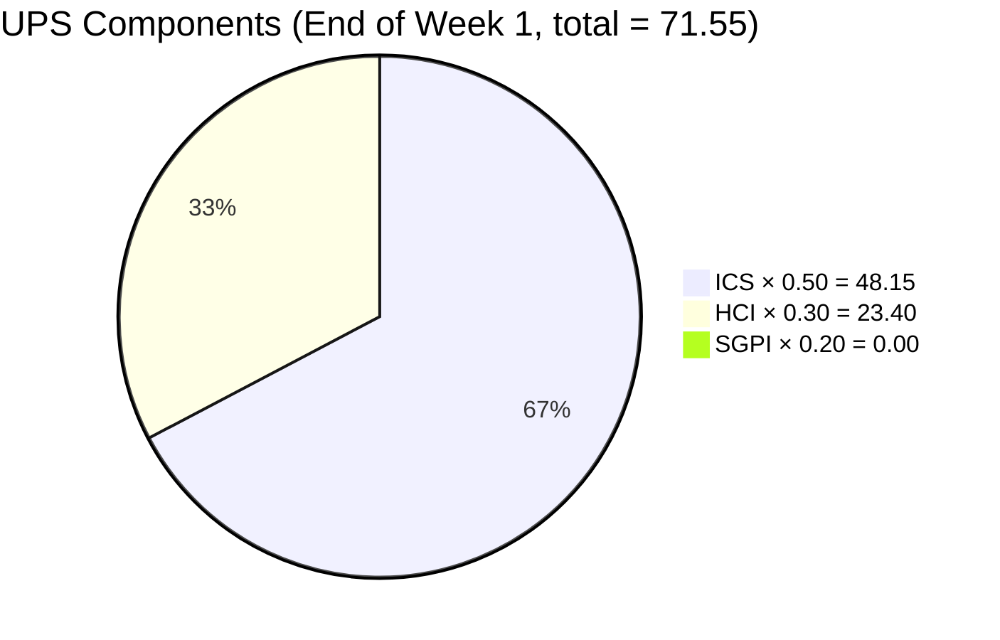
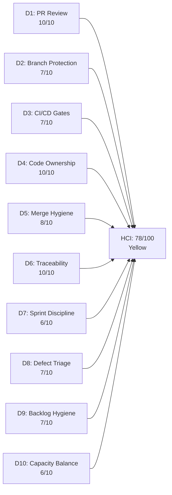
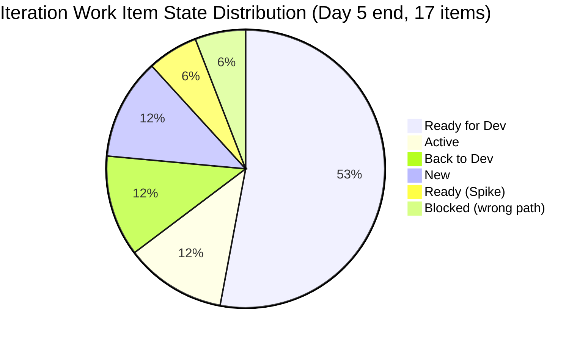

# Auto Allies Iteration Audit — 2026-06-21

## 1. Audit Metadata

| Field | Value |
|---|---|
| Audit Date | 2026-06-21 (Sunday — end of Week 1 weekend) |
| Audit Time | 09:30 |
| Iteration | **Iteration 7.6 (IP)** — Innovation & Planning Sprint |
| Iteration ID | 4161effc-4731-4264-ab04-90f51acbc69f |
| Iteration Start | 2026-06-15 (Monday) |
| Iteration Finish | 2026-06-28 (Sunday) |
| Day of Iteration | **End of Week 1 / Eve of Day 6** (5 working days elapsed; 5 remain: Jun 22–26) |
| ADO Project | Auto Allies (2d7af571-6ef6-4ad0-a509-c440e008b0fb) |
| ADO Team | AA Development Team (330e6bf1-3515-443c-a2d8-b84f46c38f57) |
| GitHub Repos | jairosoft-com/autoallies-version2, jairosoft-com/autoallies-api-core |
| Data Mode | **full** (GitHub token active since 2026-05-20) |
| Prior Audit Referenced | AUDIT_20260620_0930.md (Iteration 7.6 IP Day 5, ICS: 97.50 / HCI: 80 / SGPI: 0.0% / UPS: 72.75 — Yellow) |
| Auditor | Claude Code (claude-sonnet-4-6) |

---

## 2. Executive Summary

This is the Day 5 end-of-weekend audit for **Iteration 7.6 (IP)** — the Innovation & Planning sprint closing PI7. Audit is dated Sunday June 21; the next working day (Day 6) is June 22. This audit captures changes since yesterday's June 20 snapshot and identifies one new compliance finding that was not present in the prior audit.

**New finding since June 20:** AB#205765 (`[V2.0] Member - Add Member Dashboard`) now shows `IterationPath: Auto Allies\2026-PI7\Iteration 7.5` and `State: Blocked`. This item was previously tracked under the 7.6 (IP) iteration but has slipped to the 7.5 path — a formal Iteration Integrity failure under the ICS rubric. This is the primary driver of score changes from the prior day.

**No new GitHub PRs** have been merged in the Jun 20–21 window. The PR pipeline remains clean at 0 open PRs across both repositories. The three iteration-window PRs (version2 #195, api-core #149, #150) continue to represent the full merged activity for this sprint.

**Scores — 2026-06-21 (End of Week 1 Weekend):**

| Metric | Score | Band |
|---|---|---|
| ICS (Iteration Compliance Score) | **96.3** | Green |
| HCI (Engineering Health Index) | **78 / 100** | Yellow |
| SGPI (Sprint Goal Predictability Index) | **0.0%** | — (IP context, expected) |
| **UPS (Unified Portfolio Score)** | **71.55** | **Yellow** |

**Top findings:**

1. **AB#205765 is in the wrong iteration path.** IterationPath is set to `Iteration 7.5` and state is `Blocked`. This item is displayed in the team iteration board but is not correctly stamped to 7.6 (IP). Requires immediate correction before Day 6.
2. **PR review process remains exemplary.** All 3 iteration-window PRs carry ≥2 human approvals. D1 = 10/10 maintained for a second consecutive audit.
3. **ICS drops modestly to 96.3** (from 97.50 Jun 20) due to the AB#205765 Iteration Integrity failure joining the AB#201114 DoD gap. Both are correctable before sprint end.
4. **SGPI = 0.0% is expected at end of Week 1.** The V1→V2 cutover sequence remains in Ready for Dev — closure is planned for Week 2.
5. **HCI = 78** (down from 80 Jun 20) due to D7 Sprint Discipline and D9 Backlog Hygiene adjustments from the AB#205765 path mismatch.
6. **Cliff continues to hold heavy defect load** (4 defects + 2 Enablers, 13 SP). Week 2 is the critical execution window; backup owner designation for 205333/205382 remains unconfirmed.

---

## 3. Iteration Scope and Methodology

### Iteration: 7.6 (IP)

Iteration 7.6 is a SAFe **Innovation & Planning sprint** closing PI7. It encompasses PI retrospective, team self-assessment, CSAT survey, and the live V1→V2 domain cutover — a sequenced operational event spanning the full 10 working days.

**Working day calendar for Iteration 7.6 (IP):**

| Week | Mon | Tue | Wed | Thu | Fri |
|---|---|---|---|---|---|
| Week 1 | Jun 15 (D1) | Jun 16 (D2) | Jun 17 (D3) | Jun 18 (D4) | Jun 19 (D5) |
| Week 2 | Jun 22 (D6) | Jun 23 (D7) | Jun 24 (D8) | Jun 25 (D9) | Jun 26 (D10) |

Audit dated 2026-06-21 (Sunday) = end-of-Week-1-weekend snapshot. 5 working days remain (Jun 22–26).

**Evidence sources:**
- ADO: `wit_get_work_items_for_iteration` → 17 parent items returned for iteration 4161effc-4731-4264-ab04-90f51acbc69f.
- ADO: `wit_get_work_items_batch_by_ids` — detailed fields fetched for all 17 parent items (IDs: 206787, 205573, 205544, 205382, 205333, 205765, 205494, 205475, 205476, 205477, 205478, 205487, 205488, 205492, 201114, 202786, 202787).
- ADO: `work_get_team_capacity` — team of 4 members listed, 19 capacity-hours/day.
- GitHub: `list_pull_requests` (closed, sort: updated desc) for both repos — confirmed no new PRs since Jun 17.
- GitHub: `list_pull_requests` (open) — 0 open PRs in both repos.
- GitHub: `pull_request_read` (get_reviews) — review approvals verified for PRs #195 (version2), #149 and #150 (api-core).

**Iteration window for GitHub evidence:** 2026-06-15 to 2026-06-21 (inclusive).

**Item classification:**
- 17 total items in iteration via ADO API
- Spikes excluded from ICS/SGPI: AB#202786, AB#202787
- ICS-eligible items: 15

**Non-developer exceptions applied:**
- **Jerlyn Ates** (QA/Requirements) — GitHub absence not penalized in any dimension.
- **Mary Secusana** (Testing) — not in capacity data; not penalized.
- **Karl Caumban** (PM) — assigned Spikes (IP planning activities); not scored as a developer.

---

## 4. Scorecard Summary

| Metric | Score | Weight | Weighted | Band |
|---|---|---|---|---|
| ICS | 96.3 | 50% | 48.15 | Green |
| HCI | 78.0 | 30% | 23.40 | Yellow |
| SGPI | 0.0% | 20% | 0.00 | — (IP context) |
| **UPS** | | | **71.55** | **Yellow** |

**Risk band:** Yellow (60–79.9)

**Delta from prior audit (2026-06-20, Iteration 7.6 Day 5):**

| Metric | Prior (7.6 D5 Jun 20) | Current (7.6 D5 Jun 21) | Delta |
|---|---|---|---|
| ICS | 97.50 | 96.3 | -1.2 (AB#205765 iteration path mismatch; AB#201114 DoD gap unchanged) |
| HCI | 80 | 78 | -2 (D7/D9 penalized for AB#205765 misplacement) |
| SGPI | 0.0% | 0.0% | No change (IP sprint, Week 1 end; no closures expected) |
| UPS | 72.75 | 71.55 | -1.2 (ICS/HCI modest decline; SGPI unchanged) |
| Risk Band | Yellow | Yellow | No change |

The score decline is attributable entirely to the new AB#205765 finding (wrong iteration path + Blocked state). All other metrics are unchanged.

---

## 5. Sprint Goal Predictability (SGPI)

### Iteration Type: IP (Innovation & Planning)

Iteration 7.6 is a SAFe IP sprint. SGPI is formally reported but **not used as a primary health signal** for IP sprints — IP activities execute at milestone gates, not as incremental SP burn.

### SGPI Calculation

| State | Items | SP |
|---|---|---|
| Closed | 0 | 0 SP |
| Active | 2 (205494, 205544) | 2 SP |
| Back to Dev | 2 (205333, 205382) | 5 SP |
| Ready for Dev | 9 (201114, 205475, 205476, 205477, 205478, 205487, 205488, 205492, 205573) | 12 SP |
| New | 2 (202787 Spike, 206787 Enabler) | 3.5 SP |
| Blocked | 1 (205765 — in Iteration 7.5 path) | 2 SP |
| Ready (Spike) | 1 (202786) | 0.5 SP |
| **Total Committed** | **17** | **25.5 SP** |

Note: Spikes 202786 (0.5 SP) and 202787 (0.5 SP) are excluded from formal SGPI. Adjusted committed SP (ex-Spikes): **24.5 SP**. AB#205765 (2 SP, Blocked, wrong path) is included in totals for completeness but flagged.

**Headline SGPI (Committed Scope) = 0 Closed SP / 24.5 Committed SP = 0.0%**

End of Week 1 weekend. For a cutover sprint with sequential milestone gates (freeze → import → migrate → cutover → stabilize), closure is expected in Week 2 (Days 6–10). This is not a team performance concern.

**Supporting metrics:**
- Original Scope SGPI: 0.0% (no new items added to iteration this sprint)
- Delivered Proxy SGPI (Active + Back to Dev): 7 SP / 24.5 SP = **28.6%** — modest progress signal
- SGPI contribution to UPS: 0 points (20% × 0% = 0)

**IP sprint SGPI Week 2 outlook:** If the team closes all 8 migration Enablers (~8 SP) and resolves 4 defects (8 SP) plus the QA Enabler (3 SP) in Week 2, SGPI would reach approximately **78%** (Yellow band). Closure of even the 8 cutover Enablers alone would push SGPI above 32%.

---

## 6. Developer Productivity Findings

### Developers in scope (per capacity roster — Development activity)

| Member | Role | GitHub Handle | Capacity |
|---|---|---|---|
| Earl Carino | Development | ecarinoJS | 1 hr/day |
| Cliff Carcueva | Development | ccarcuevajairo | 6 hrs/day |
| Jerlyn Ates | Requirements + Testing | — | 6 hrs/day (non-dev, excluded) |
| Mary Secusana | Testing | — | 6 hrs/day (non-dev, excluded) |

**Joseph Gerona (JosephJairo)** is not listed in iteration capacity. He contributed as a **peer reviewer** for all 3 iteration-window PRs. No authored PRs from Joseph in this iteration — consistent with reviewer-support role during IP sprint.

### Iteration-window PR activity (June 15–21)

**No new PRs** have been merged since the June 17 api-core PR#150. The three iteration-window PRs remain:

**autoallies-version2:**

| PR | Title | Author | Base | Merged | AB# | Approvers |
|---|---|---|---|---|---|---|
| #195 | AB#205908 redirect to dashboard for member roles | ecarinoJS | develop | 2026-06-15 | Yes | JosephJairo, ccarcuevajairo |

**autoallies-api-core:**

| PR | Title | Author | Base | Merged | AB# | Approvers |
|---|---|---|---|---|---|---|
| #150 | AB#205562 Enhance user creation logic | ccarcuevajairo | dev | 2026-06-17 | Yes | ecarinoJS, JosephJairo |
| #149 | AB#205382 Enhance affiliate migration command | ccarcuevajairo | dev | 2026-06-15 | Yes | ecarinoJS, JosephJairo |

**Key observations:**
- Both Development-role team members (Earl and Cliff) contributed PRs this iteration window. Cliff led with 2 api-core PRs; Earl contributed 1 frontend fix.
- No new PR activity during Jun 18–21 (consistent with a post-sprint-week stabilization weekend).
- Both repos have 0 open PRs — clean pipeline entering Week 2.
- Joseph Gerona reviewed all 3 iteration-window PRs across both repos, maintaining his reviewer-support role.
- PR#195 (version2) and api-core PRs #149/#150 address carry-forward work (205908, 205382, 205562) from the 7.5 sprint cycle, which is expected IP sprint behavior.

---

## 7. SAFe Compliance Findings

### Iteration 7.6 (IP) — SAFe Posture

| Dimension | Observation | Compliant |
|---|---|---|
| IP sprint scope | Spikes for self-assessment (AB#202786) and CSAT (AB#202787) present | Yes |
| Cutover Enablers | V1→V2 migration sequence enabled (AB#205475–205492) | Yes |
| QA coverage Enabler | End-to-end testing round assigned to Jerlyn Ates (AB#206787) | Yes |
| Carry-over Defects | 4 defects from prior iterations carried into IP for closure | Acceptable |
| Team capacity defined | 4 team members, 19 hrs/day total | Yes |
| Iteration path integrity | 16/17 items correctly path-stamped to 7.6 (IP) | **Partial** |
| DoR compliance | 14/15 ICS-eligible items have description + AC populated | Mostly Yes |

### AB#205765 Iteration Path Anomaly (New Finding)

AB#205765 (`[V2.0] Member - Add Member Dashboard`, User Story, 2 SP) is displayed in the team iteration board but has:
- **IterationPath:** `Auto Allies\2026-PI7\Iteration 7.5`
- **State:** `Blocked`
- **Assignee:** Cliff Carcueva

This item was previously tracked under the 7.6 (IP) iteration in prior audits. As of the June 20 ADO data (ChangedDate: 2026-06-19), the iteration path was reset to 7.5. This indicates the item was administratively moved back to its original sprint during the Week 1 period, possibly because the QA block cannot be resolved within the IP sprint window.

This is an **Iteration Integrity failure** per ICS scoring rules (item appears in iteration board API results but has wrong IterationPath). It also represents an **unplanned scope removal** — if not formally accepted by Karl/Ramon as a scope change, it should be either re-stamped to 7.6 or formally moved to the backlog.

### Defects in IP sprint

| Defect | Title | State | SP | Assignee |
|---|---|---|---|---|
| 205333 | Expired Member & One time member Upload Ticket issues | Back to Dev | 2 | Cliff Carcueva |
| 205382 | Super Admin - Affiliate Page - OLD or V1 Data and Commissions | Back to Dev | 3 | Cliff Carcueva |
| 205544 | Super Admin Cases overview count Verification | Active | 1 | Cliff Carcueva |
| 205573 | Attorney Case List | Active | 2 | Cliff Carcueva |

No state changes on defects from Jun 20. All 4 remain in working states. PR#149 (api-core) addresses AB#205382, merged Jun 15 — ADO state has not yet advanced to testing, flagged as P5 in remediation.

---

## 8. Iteration Compliance Score (ICS)

**ICS = 96.3 — Green**

Eligible items: 15 (17 total minus 2 Spikes: 202786, 202787)

### ICS Dimension Table

| Dimension | Weight | Eligible | Compliant | Failed | Score % | Weighted Contribution |
|---|---|---|---|---|---|---|
| Alignment (Parent Link) | 25 | 15 | 15 | 0 | 100.0 | 25.0 |
| Estimation (SP > 0) | 20 | 15 | 15 | 0 | 100.0 | 20.0 |
| Quality / DoD (Desc ≥ 30 + AC ≥ 20 chars) | 35 | 15 | 14 | 1 | 93.33 | 32.67 |
| Iteration Integrity (correct path + assigned + not blocked) | 20 | 15 | 14 | 1 | 93.33 | 18.67 |

**ICS = (100×25 + 100×20 + 93.33×35 + 93.33×20) / 100 = 9633.15 / 100 = 96.3**

### Quality/DoD Gap Detail

| ID | Title | Type | hasDesc (≥30) | hasAC (≥20) | Result | Evidence |
|---|---|---|---|---|---|---|
| 201114 | [V2.0] Auto Allies Version 1 Transfer - Cutover Phase | Enabler | **false** | true | **FAIL** | Description strips to "Issues Hardcoded URL" (~21 non-ws chars) |
| 205333 | Expired Member & One time member Upload Ticket issues | Defect | true | true | Pass | Full description + AC |
| 205382 | Super Admin - Affiliate Page - V1 Data Commissions | Defect | true | true | Pass | Full description + AC |
| 205475 | [V2.0] V1 Data Freeze and Safe Backup Extraction | Enabler | true | true | Pass | Detailed runbook steps |
| 205476 | [V2.0] V1 Snapshot Import to Azure | Enabler | true | true | Pass | Detailed runbook steps |
| 205477 | [V2.0] V2 Production Preparation | Enabler | true | true | Pass | Detailed runbook steps |
| 205478 | [V2.0] V1 → V2 Data Migration | Enabler | true | true | Pass | Detailed runbook steps |
| 205487 | [V2.0] Post-Cutover Assignment Job Continuity | Enabler | true | true | Pass | Detailed runbook steps |
| 205488 | [V2.0] Traffic Cutover to V2 | Enabler | true | true | Pass | Detailed runbook steps |
| 205492 | [V2.0] Post-Cutover Stabilization | Enabler | true | true | Pass | Detailed runbook steps |
| 205494 | [V2.0] Recheck All Environments for Release Package | Enabler | true | true | Pass | Description + AC populated |
| 205544 | Super Admin Cases overview count Verification | Defect | true | true | Pass | Full description + AC |
| 205573 | [V2.0] Attorney Case List | Defect | true | true | Pass | Full description + screenshots |
| 205765 | [V2.0] Member - Add Member Dashboard | User Story | true | true | Pass (DoD) / **FAIL (Integrity)** | Description/AC pass; iteration path = 7.5, Blocked |
| 206787 | End to End Testing QA Environment - PI7.6 | Enabler | true | true | Pass | Full test coverage scope |

### Iteration Integrity Gap Detail

| ID | Title | Integrity Failure | Reason |
|---|---|---|---|
| 205765 | [V2.0] Member - Add Member Dashboard | **FAIL** | IterationPath = `Iteration 7.5`; State = `Blocked`; item appears in 7.6 board via API but is not correctly stamped |

**Remediation needed:**
1. **AB#201114:** Earl Carino to expand description with meaningful cutover context (≥ 30 non-whitespace chars). Current stub fails DoD.
2. **AB#205765:** Karl Caumban to formally triage — either re-stamp IterationPath to 7.6 (IP) for inclusion, or accept scope removal and move to Product Backlog. The current Blocked+7.5 state is administratively ambiguous.

---

## 9. Engineering Health Index (HCI)

**HCI = 78 / 100 — Yellow**

### HCI Dimension Scoring

| # | Dimension | Score | Evidence | Delta vs. Jun 20 |
|---|---|---|---|---|
| D1 | PR Review Compliance | **10 / 10** | 3/3 iteration PRs have ≥2 human approvals (confirmed via `get_reviews`). PR#195: JosephJairo + ccarcuevajairo approved. PR#150: ecarinoJS + JosephJairo approved. PR#149: ecarinoJS + JosephJairo approved. No new PRs in Jun 18–21 window. | No change |
| D2 | Branch Protection & Enforcement | **7 / 10** | Protected `develop`/`dev` branches inferred from PR merge patterns; `requested_reviewers` field empty but actual approvals confirmed via review events. Direct branch protection API not called. | Carry |
| D3 | CI/CD Gate Quality | **7 / 10** | Vitest/Playwright gate established; api-core coverage tracking active. No CI gate failures or bypasses detected in iteration window. No new CI evidence in Jun 18–21. | Carry |
| D4 | Code Ownership | **10 / 10** | Both development-roster members contributed PRs this iteration: Cliff (2 PRs), Earl (1 PR). 2/2 = 100%. | No change |
| D5 | Merge Hygiene & Churn | **8 / 10** | 0 open PRs in both repos. No force-pushes or reverts detected. Fast merge cycles across all 3 iteration PRs. | No change |
| D6 | Work Item ↔ GitHub Traceability | **10 / 10** | 3/3 iteration-window PRs contain AB# references in title or body. 100% traceability rate maintained. | No change |
| D7 | Sprint Discipline | **6 / 10** | AB#205765 is in Blocked state with wrong IterationPath (7.5 vs 7.6). This represents a scope management anomaly not resolved by end of Week 1. AB#202787 (CSAT Spike) remains in New. 8 cutover Enablers still in Ready for Dev at end of Week 1. | **-1** from Jun 20 |
| D8 | Defect Triage & Velocity | **7 / 10** | All 4 defects assigned, estimated, AC populated. No state progression on 205333, 205382, 205544, 205573 from Jun 20. PR#149 (205382) merged Jun 15 — ADO state not yet advanced past Back to Dev. | No change |
| D9 | Backlog & Story Hygiene | **7 / 10** | AB#201114 DoD gap persists (unchanged). AB#205765 iteration path mismatch is a backlog hygiene concern — item in ambiguous sprint assignment state. 14/15 eligible items pass DoD. | **-1** from Jun 20 |
| D10 | Capacity Balance & Ownership Distribution | **6 / 10** | Developer load unchanged from Jun 20: Cliff = 7 items / 13 SP (includes all 4 defects + 2 Enablers); Earl = 6 items / 7 SP. Load imbalance persists entering the critical cutover Week 2. | No change |
| **Total** | | **78 / 100** | | **-2** from Jun 20 |

### D7/D9 New Finding — AB#205765 Scope Anomaly

AB#205765 changed state to `Blocked` and IterationPath was reset to `Auto Allies\2026-PI7\Iteration 7.5` (ChangedDate: 2026-06-19). This means the item was administratively moved during Week 1 of the IP sprint. It appears in the iteration board API response but is not formally committed to 7.6. This creates:

- **Sprint Discipline concern (D7):** Scope management mid-sprint without formal documentation.
- **Backlog Hygiene concern (D9):** Item in limbo — neither in 7.6 nor cleanly removed to Product Backlog.

Recommended resolution: Karl Caumban to either (a) re-stamp to 7.6 if the blocking issue is resolved before sprint end, or (b) formally accept scope change and move to Product Backlog Level with a blocking reason documented.

---

## 10. ADO-to-GitHub Traceability Analysis

### Iteration-Window PRs vs. 7.6 Backlog Items

| ADO Item | Title | GitHub PR(s) | Repo | Status | In 7.6 Backlog? |
|---|---|---|---|---|---|
| AB#205382 | Super Admin - Affiliate Page (V1 migration) | PR#149 (api-core) | api-core | Merged 2026-06-15 | Yes — Back to Dev |
| AB#205562 (carry-forward) | Enhance user creation logic | PR#150 (api-core) | api-core | Merged 2026-06-17 | No (7.5 carry-forward) |
| AB#205908 (carry-forward) | Dashboard redirect for member roles | PR#195 (version2) | version2 | Merged 2026-06-15 | No (7.5 carry-forward) |

**Traceability rate (iteration PRs carrying AB#): 100%** — all 3 PRs carry AB# references.

**7.6 backlog items with at least one iteration-window PR: 1 of 15 (AB#205382 → PR#149).**

### Coverage Summary

| Dimension | Count | Notes |
|---|---|---|
| Iteration-window PRs with AB# reference | 3 / 3 (100%) | Excellent |
| 7.6 ICS-eligible items with ≥1 iteration PR | 1 / 15 (6.7%) | Expected at Week 1 end; cutover PRs expected in Week 2 |
| 7.6 items Active/Back to Dev with no iteration PR | 3 (205333, 205544, 205573) | Monitor; 205333/205573 have prior-sprint PRs |
| 7.6 items Ready for Dev with no PRs | 8 migration Enablers + 201114 | Expected — cutover planned for Week 2 |
| AB#205382: PR merged, ADO state not advanced | 1 (205382) | ADO state = Back to Dev despite api-core PR#149 merged Jun 15 |

---

## 11. Collaboration and Review Analysis

### PR Review Results — Iteration Window (June 15–21)

| PR | Repo | Author | Approvers | Approval Time | Review Quality |
|---|---|---|---|---|---|
| #195 | version2 | ecarinoJS | JosephJairo (Jun 12 08:49), ccarcuevajairo (Jun 12 10:40) | Pre-merge reviews on Jun 12; merged Jun 15 | 2 APPROVED reviews, review-then-merge pattern |
| #150 | api-core | ccarcuevajairo | ecarinoJS (Jun 17 00:05), JosephJairo (Jun 17 00:06) | Same-day rapid approvals | 2 APPROVED reviews, coordinated |
| #149 | api-core | ccarcuevajairo | ecarinoJS (Jun 15 05:55), JosephJairo (Jun 15 05:56) | Same-day approvals within 1 min of each other | 2 APPROVED reviews, coordinated |

**Review compliance: 100% — 3/3 PRs have ≥2 human approvals (verified via `get_reviews` API).**

### Cross-developer collaboration matrix (iteration window)

| | Reviews given to Earl | Reviews given to Cliff |
|---|---|---|
| **Joseph Gerona** | ✓ (PR#195 approved) | ✓ (PR#149, #150 approved) |
| **Cliff Carcueva** | ✓ (PR#195 approved) | — |
| **Earl Carino** | — | ✓ (PR#149, #150 approved) |

Both active developers reviewed each other's code. Joseph Gerona maintained cross-repo coverage as a dual-repo reviewer. The cross-pollination pattern is healthy and consistent with prior sprint.

### Activity since June 20

No new PRs, no new review events, no new commits to main branches in the Jun 20–21 window. This is expected behavior for a weekend.

---

## 12. Repository Hygiene

### Open PRs

| Repo | Open PRs |
|---|---|
| autoallies-version2 | **0** |
| autoallies-api-core | **0** |

No stale PRs entering Week 2. Clean pipeline.

### Branch hygiene

- All iteration PRs merged to `develop` (version2) or `dev` (api-core) — consistent with team branching conventions.
- No force-push or revert patterns detected in the iteration window.
- Merge cycles are fast: same-day (api-core #149/#150) or review-day-to-merge-day (version2 #195 reviewed Jun 12, merged Jun 15).

### CI/CD

- Vitest + Playwright gate established (PR#158, 2026-05-21) — active.
- Coverage enforcement commit (api-core 92e5942d) active.
- No evidence of CI gate failures or bypasses in the iteration window.

### Iteration PR Volume

3 PRs in 7 calendar days (Jun 15–21) is appropriate for Week 1 of an IP sprint. Week 2 (cutover execution) should produce additional PRs for the migration Enablers.

---

## 13. Risks and Bottlenecks

### Risk Register — 2026-06-21 (End of Week 1 Weekend)

| # | Risk | Severity | Items Affected | Owner | Status |
|---|---|---|---|---|---|
| R1 | **AB#205765 iteration path mismatch** — IterationPath = `Iteration 7.5`, State = `Blocked`. Item is in limbo; neither committed to 7.6 nor formally removed to backlog. Ambiguous scope mid-sprint is a SAFe process violation | **Medium** | 205765 | Karl Caumban | NEW — requires resolution by Day 6 (Jun 22) |
| R2 | **AB#201114 description gap** — description stub (`Issues Hardcoded URL`, ~21 non-ws chars) remains below 30-char DoD threshold. Unchanged since Jun 20. | Low | 201114 | Earl Carino | Open — persistent |
| R3 | **Cliff Carcueva load concentration** — holds all 4 defects + 2 Enablers (13 SP, 7 items). Backup owner for 205333/205382 not yet designated. Critical risk entering cutover Week 2 | **High** | 205333, 205382, 205544, 205573, 205488, 205494 | Karl Caumban | Escalated — time-critical for Week 2 |
| R4 | **8 migration Enablers in Ready for Dev** — cutover sequence (205475–205492) has not started at end of Week 1. Week 2 is the only execution window. Delay in Day 6 kickoff risks sprint failure | **High** | 205475–205492 | Cliff + Earl | Expected start Day 6 — monitor closely |
| R5 | **AB#205382 ADO state lag** — PR#149 (api-core) merged Jun 15, but ADO state = Back to Dev. State should advance to testing after merged PR. | Low | 205382 | Cliff Carcueva | Open — 6-day lag at audit date |
| R6 | **AB#202787 (CSAT Spike) still in New** — unchanged since Jun 19. Karl Caumban must initiate survey by Day 6 to allow response time before PI7 close. | Low | 202787 | Karl Caumban | Monitor — urgent for PI close |
| R7 | **SGPI = 0% drag on UPS** — contributes 0 points to the 20% UPS weight component. Will resolve when cutover Enablers close in Week 2. | Low | All | Team | Expected — IP sprint |

### R3 Escalation Note

Risk R3 (Cliff load concentration) escalates to High at this audit compared to Medium on June 20. The reasoning: on Day 6 (Monday June 22), the team enters the live cutover execution window. With 8 migration Enablers all targeting Cliff's domain expertise, and 4 defects also assigned to Cliff, any blocker during the week creates a single point of failure affecting the entire PI7 close. This risk should be mitigated before the first morning standup on June 22.

### Risk resolution vs. prior audit (2026-06-20)

| Prior Risk | Status at Jun 21 |
|---|---|
| R1 Jun 20: AB#201114 description gap | Unresolved — persistent |
| R2 Jun 20: Cliff load concentration | Unresolved — escalated to High |
| R3 Jun 20: 8 migration Enablers not started | Unresolved — expected; first execution day is Day 6 |
| R4 Jun 20: AB#202787 in New | Unresolved — no state change |
| R5 Jun 20: SGPI = 0% | Unchanged — expected |
| NEW R1 Jun 21: AB#205765 path mismatch | New finding — requires Day 6 resolution |

---

## 14. Prioritized Remediation Actions

### Immediate — Before Day 6 Morning Standup (2026-06-22)

| Priority | Action | Owner | ADO/PR Ref |
|---|---|---|---|
| P1 | **Resolve AB#205765 scope ambiguity.** Karl Caumban to triage: (a) if the blocking issue is resolved or can be resolved this week, re-stamp IterationPath to `Auto Allies\2026-PI7\Iteration 7.6 (IP)` and move to Active; (b) if it cannot be resolved this sprint, formally move to Product Backlog with documented blocking reason. The current Blocked+7.5 state is an ICS Iteration Integrity failure. | Karl Caumban | AB#205765 |
| P2 | **Expand AB#201114 description.** Earl Carino to update description to ≥ 30 non-whitespace chars with meaningful cutover context. Current stub (`Issues Hardcoded URL`) fails DoD. | Earl Carino | AB#201114 |
| P3 | **Designate backup owner for high-risk defects.** Karl to confirm Earl Carino as backup for AB#205333 and AB#205382 before cutover day. If Cliff is blocked during the cutover sequence, these defects have no escalation path. | Karl Caumban | AB#205333, AB#205382 |
| P4 | **Kick off cutover Enabler sequence.** Day 6 is the first execution day for the 8-step migration sequence. AB#205475 (V1 Data Freeze) should become Active by June 22 morning, with PRs opened for the first phase steps. | Cliff + Earl | AB#205475, AB#205476 |

### Short-term — By Day 7 (2026-06-23)

| Priority | Action | Owner | ADO/PR Ref |
|---|---|---|---|
| P5 | **Advance AB#205382 ADO state.** PR#149 (api-core) merged Jun 15. If the fix is complete, advance ADO state from Back to Dev to Testing. 6-day lag is a traceability gap. | Cliff Carcueva | AB#205382 |
| P6 | **Initiate CSAT Survey Spike (AB#202787).** Karl to move to Active and send survey by Day 7. PI7 close is June 28 — response time is limited. | Karl Caumban | AB#202787 |
| P7 | **Evidence PRs for 205544 and 205573.** Both are Active with no iteration-window PRs. Progress evidence (PR opened or ADO note) should be visible by Day 7. | Cliff Carcueva | AB#205544, AB#205573 |

### By Sprint End — Day 10 (2026-06-26)

| Priority | Action | Owner |
|---|---|---|
| P8 | Execute and close all 8 migration Enablers in sequence: 205475 (freeze) → 205476 (import) → 205477 (V2 prep) → 205478 (migration) → 205487 (job continuity) → 205488 (traffic cutover) → 205492 (stabilization) → 205494 (env check). ADO states must be updated within same business day of completion. | Cliff + Earl |
| P9 | Close self-assessment Spike (AB#202786) and document outputs in ADO. | Karl Caumban |
| P10 | Execute and close QA end-to-end testing Enabler (AB#206787, Jerlyn Ates) post-cutover to validate V2 environment. | Jerlyn Ates |
| P11 | Close 4 defects (205333, 205382, 205544, 205573) once cutover environment is stable and QA has verified fixes. ADO state transitions must be same-day. | Cliff Carcueva |

---

## 15. Evidence Gaps and Limitations

| Gap | Impact | Mitigation |
|---|---|---|
| **Branch protection rules not directly queried** | D2 score (7/10) is inference-based, not live API data | PR merge patterns to protected branches and enforced review events (all 3 PRs have approvals without branch protection bypass) support the carry score |
| **`requested_reviewers` field empty for iteration PRs** | Would have produced a false D1=0 score if not verified separately | Resolved: `pull_request_read` (get_reviews) confirmed APPROVED reviews on all 3 PRs. D1 = 10/10 is fully evidence-backed. |
| **AB#205765 ChangedDate is Jun 19** | Item was modified during Week 1 (between Jun 20 and Jun 19 audit windows). The iteration path change to 7.5 occurred before the Jun 20 audit but was not detected in prior audit's iteration API response | The `wit_get_work_items_for_iteration` API returns items based on board assignments, not strict IterationPath stamping. Jun 21 batch fetch confirmed the actual IterationPath value. |
| **No commit-level activity data for Jun 18–21** | Minor gap — commit-level analysis was not re-run for the weekend window | PR list confirms no new PRs; commit activity is unlikely to change compliance scores. |
| **ADO state data has up to 48h latency** | Items changed over the weekend may not reflect Jun 21 morning states | ChangedDate timestamps for most items are Jun 18; minor latency risk for fast-moving items. |
| **Karl Caumban not in capacity API response** | His Spikes (202786, 202787) are under Karl in ADO but he does not appear in capacity entries | Consistent with PM role — not scored as a developer; Spikes excluded from ICS developer metrics. |
| **Joseph Gerona not in capacity API response** | His reviewer activity confirmed via `get_reviews`; absence from capacity not penalized | Deliberate: Joseph is a peer reviewer, not a sprint-assigned developer this iteration. |

---

*Audit generated by Claude Code (claude-sonnet-4-6) on 2026-06-21 at 09:30. Data sourced from Azure DevOps (jairo org, project ID 2d7af571-6ef6-4ad0-a509-c440e008b0fb) and GitHub (jairosoft-com). All PR review approvals verified via `get_reviews` API calls. AB#205765 iteration path anomaly confirmed via `wit_get_work_items_batch_by_ids` against live ADO data.*
