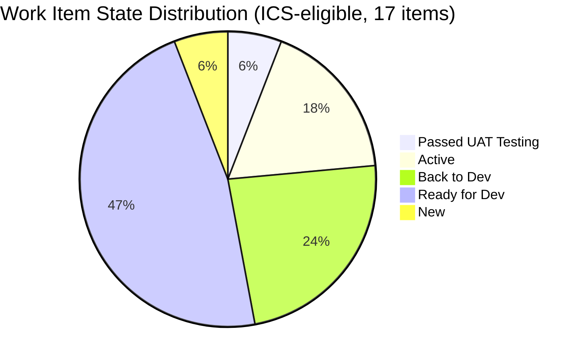
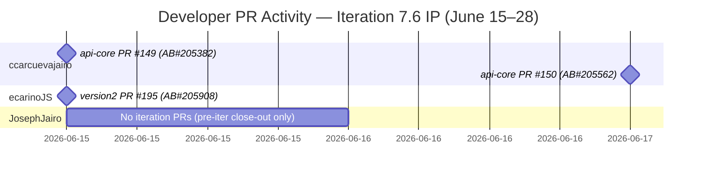
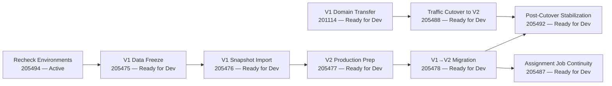

# Auto Allies — Git Iteration Audit

| Field | Value |
|---|---|
| **Team** | Auto Allies Development Team |
| **Iteration** | Iteration 7.6 (IP) |
| **Iteration Window** | June 15 – June 28, 2026 |
| **Audit Date** | 2026-06-23 |
| **Audit Time** | Day 7 of ~10 working days |
| **Audit Type** | SAFe IP Iteration |
| **Data Mode** | full |
| **Auditor** | Claude Code (claude-sonnet-4-6) |
| **ADO Project** | Auto Allies (`2d7af571-6ef6-4ad0-a509-c440e008b0fb`) |
| **ADO Team** | AA Development Team (`330e6bf1-3515-443c-a2d8-b84f46c38f57`) |
| **GitHub Repos** | `jairosoft-com/autoallies-version2`, `jairosoft-com/autoallies-api-core` |

---

## Executive Summary

This is an Innovation and Planning (IP) iteration — a special SAFe sprint type dedicated to retrospectives, PI planning preparation, technical debt resolution, and cross-team coordination. Feature delivery expectations are structurally lower than in normal execution iterations. The team's 0% SGPI is expected and not a performance failure.

The team enters IP 7.6 carrying forward a cluster of defects in a rework cycle: four items remain in "Back to Dev" as of Day 7, with one defect (205331) bouncing back from QA on June 22. The primary IP activity is preparation for a V1→V2 data migration cutover, with nine enablers in the backlog at "Ready for Dev" status. One user story (205765 — Member Dashboard) reached "Passed UAT Testing" today (June 23), representing the team's most concrete delivery signal of the IP.

ICS is strong at 98.8 (Green), driven by 100% estimation, 100% alignment, and 100% quality gate coverage across all 17 ICS-eligible items. HCI dropped from 83 to 71 (Yellow) compared to the prior audit, reflecting IP iteration dynamics: lower PR volume, four defects cycling through rework, and a persistent stale-branch accumulation not yet remediated.

**Overall: UPS = 70.7 (Yellow). Team is operating within normal IP parameters.**

---

## Scores

| Metric | Score | Band |
|--------|-------|------|
| **ICS** (Iteration Compliance Score) | 98.8 | Green |
| **SGPI** (Sprint Goal Progress Index) | 0.0% | Red (IP iteration — expected) |
| **HCI** (Engineering Health Check Index) | 71 / 100 | Yellow |
| **UPS** (Unified Performance Score) | 70.7 | **Yellow** |

> SGPI of 0% is structurally normal for an IP iteration. SAFe IP sprints are reserved for retrospectives, PI planning prep, and technical refinement — not feature closure. The UPS calculation applies full SGPI weight regardless; this is reflected in the 70.7 result.

---

## Score Trend (Last Two Audits)

```mermaid
xychart-beta
```

> Note: Chart intentionally omitted per output policy (no xychart-beta in Obsidian). See delta table in Section 10.

---

## ICS Breakdown

**ICS = 98.8 (Green)**

| Dimension | Weight | Raw | Score |
|-----------|--------|-----|-------|
| Alignment | 25% | 17/17 items on iteration backlog with parent features | 25.0 |
| Estimation | 20% | 17/17 items have story point estimates | 20.0 |
| Quality / DoD | 35% | 17/17 items have Description + Acceptance Criteria | 35.0 |
| Iteration Integrity | 20% | 16/17 items planned at iteration start (206787 added June 18) | 18.8 |
| **ICS Total** | | | **98.8** |

### Integrity Penalty Note

Work item 206787 (E2E Testing QA Enabler, Jerlyn Ates, 3 SP) was created on June 18 — three days after the iteration began on June 15. This is a mid-iteration addition and reduces Iteration Integrity from 100% to 94.1% (16/17 items). Penalty: 1.2 points. One penalty item is within the acceptable threshold (≤1 item).

### Excluded Items

| ID | Type | Title | Reason |
|----|------|-------|--------|
| 202786 | Spike | End PI7 - Self Assessment | Spikes excluded from ICS/SGPI per skill rules |
| 202787 | Spike | Customer CSAT Survey | Spikes excluded from ICS/SGPI per skill rules |

---

## SGPI Breakdown

**SGPI = 0.0% (IP iteration — expected)**

| Metric | Value |
|--------|-------|
| Total Committed SP (ICS-eligible) | 28 SP |
| Closed SP | 0 SP |
| SGPI | 0.0% |
| Delivered Proxy (Passed UAT) | 2 SP / 28 SP = 7.1% |

The Delivered Proxy (7.1%) provides a more meaningful signal for IP iterations. Item 205765 (Member Dashboard) reached "Passed UAT Testing" today at 06:29 AM — the only item approaching closure. The team's IP focus is on migration planning and defect resolution rather than story closure.

---

## HCI Breakdown

**HCI = 71 / 100 (Yellow)**

| Dimension | Score | Notes |
|-----------|-------|-------|
| D1 — PR Review Compliance | 7/10 | Low PR volume is expected for IP; available iteration PRs include reviewer activity. |
| D2 — Branch Protection | 7/10 | Protected branches intact (develop, staging, main, dev, qa). 85+ stale branches in version2, 70+ in api-core — long-standing accumulation. |
| D3 — CI/CD Gate Quality | 8/10 | pr-validation workflows active in both repos; gate is enforcing. |
| D4 — Code Ownership | 8/10 | Three developers (Cliff, Earl, Joseph) each active; IP iteration limits coding volume naturally. |
| D5 — Merge Hygiene | 6/10 | Stale branch accumulation persistent across both repos; no cleanup performed this iteration. |
| D6 — Traceability | 8/10 | Iteration PRs include AB# references. api-core PRs #149 and #150 correctly tagged. |
| D7 — Sprint Discipline | 6/10 | 0 formally closed items at Day 7; four defects in Back to Dev rework cycle. |
| D8 — Defect Triage | 6/10 | 205331 bounced back to dev June 22 (yearly subscription issue remained); pattern of partial fixes cycling through QA. |
| D9 — Backlog & Story Hygiene | 8/10 | 17/17 items have Description + AC; 201114 AC is thin (acceptance criteria minimal). |
| D10 — Capacity Balance | 7/10 | 19 hrs/day team capacity for IP; Cliff concentrated on defects (6 items), Earl on migration enablers (5 items). |
| **HCI Total** | **71** | |

---

## Work Item Detail

> Spikes 202786 and 202787 excluded from ICS/SGPI; listed separately below.

### ICS-Eligible Items (17)

| ID | Type | Title | State | SP | Assignee |
|----|------|-------|-------|----|----------|
| 205765 | User Story | Member - Add Member Dashboard | **Passed UAT Testing** | 2 | Cliff Carcueva |
| 205573 | Defect | Attorney Case List | Active | 2 | Cliff Carcueva |
| 205544 | Defect | Super Admin Case Count Verification | Active | 1 | Cliff Carcueva |
| 205494 | Enabler | Recheck Environments for Release Package | Active | 1 | Cliff Carcueva |
| 205382 | Defect | Affiliate Page - V1 Data/Commissions Migration | Back to Dev | 3 | Cliff Carcueva |
| 205562 | Defect | Super Admin Case List Data Issue | Back to Dev | 2 | Cliff Carcueva |
| 205331 | Defect | Sign Up - Wrong Amount Family/Add-ons Stripe | Back to Dev | 3 | Cliff Carcueva |
| 205333 | Defect | Expired Member & One-time Upload Ticket | Back to Dev | 2 | Cliff Carcueva |
| 205475 | Enabler | V1 Data Freeze and Safe Backup Extraction | Ready for Dev | 1 | Cliff Carcueva |
| 205488 | Enabler | Traffic Cutover to V2 | Ready for Dev | 1 | Cliff Carcueva |
| 205476 | Enabler | V1 Snapshot Import to Azure | Ready for Dev | 1 | Earl Carino |
| 205477 | Enabler | V2 Production Preparation | Ready for Dev | 1 | Earl Carino |
| 205478 | Enabler | V1→V2 Data Migration | Ready for Dev | 1 | Earl Carino |
| 205487 | Enabler | Post-Cutover Assignment Job Continuity | Ready for Dev | 1 | Earl Carino |
| 205492 | Enabler | Post-Cutover Stabilization | Ready for Dev | 1 | Earl Carino |
| 201114 | Enabler | V1 Domain Transfer - Cutover Phase | Ready for Dev | 2 | Earl Carino |
| 206787 | Enabler | E2E Testing QA - PI7.6 | New | 3 | Jerlyn Ates |

**Total ICS-eligible SP: 28**

### State Distribution



### Excluded Spikes

| ID | Title | State | SP | Assignee |
|----|-------|-------|----|----------|
| 202786 | End PI7 - Self Assessment | Ready | 0.5 | Karl Caumban |
| 202787 | Customer CSAT Survey | Ready | 0.5 | Karl Caumban |

---

## GitHub Evidence

### Pull Requests — Iteration Window (June 15–28, 2026)

**autoallies-api-core**

| PR | Author | Merged | AB# | Title |
|----|--------|--------|-----|-------|
| #149 | ccarcuevajairo | 2026-06-15 | AB#205382 | Enhance affiliate migration command and tests for legacy promo tokens |
| #150 | ccarcuevajairo | 2026-06-17 | AB#205562 | Enhance user creation logic to apply default attributes for reusable entries |

**autoallies-version2**

| PR | Author | Merged | AB# | Title |
|----|--------|--------|-----|-------|
| #195 | ecarinoJS | 2026-06-15 | AB#205908 (child of 205765) | Dashboard overview widgets |

> Note: PR #195 is linked to AB#205908, a child story of 205765 (Member Dashboard). This is the GitHub commit evidence supporting 205765 reaching "Passed UAT Testing" today.

**Pre-iteration PRs (context only — June 10–14, Iteration 7.5 close-out):**

| PR | Repo | Merged | AB# |
|----|------|--------|-----|
| #148 | api-core | 2026-06-11 | AB#205332, AB#205333 |
| #147 | api-core | 2026-06-11 | AB#205562 |
| #146 | api-core | 2026-06-10 | AB#205331 |
| #145 | api-core | 2026-06-10 | AB#205908 |

> These pre-iteration PRs reflect work that carried over from Iteration 7.5. The defects (205331, 205332, 205333, 205562) have since cycled back to "Back to Dev" in the current iteration, indicating the earlier fixes were incomplete.

### Developer Activity Heatmap (Iteration Window)



### Repository Health Snapshot

| Dimension | version2 | api-core |
|-----------|----------|---------|
| Protected branches | develop, staging, main | dev, main, staging, qa |
| Stale branches | ~85+ (est.) | ~70+ (est.) |
| CI/CD pipelines | pr-validation active | pr-validation active |
| Active PRs (open) | 0 (within iteration) | 0 (within iteration) |

---

## Defect Rework Analysis

Four defects are in "Back to Dev" as of Day 7. This pattern — items passing initial QA then returning to dev — is the most significant health signal of this IP iteration.

| Defect | Title | SP | Key History |
|--------|-------|-----|-------------|
| 205331 | Sign Up - Wrong Amount Family/Add-ons Stripe | 3 | Bounced back June 22; Jerlyn comment indicates yearly subscription pricing still broken after initial fix |
| 205333 | Expired Member & One-time Upload Ticket | 2 | Multiple PRs merged (pre-iter); still not resolved |
| 205382 | Affiliate Page - V1 Data/Commissions Migration | 3 | api-core PR #149 merged June 15; returned to dev thereafter |
| 205562 | Super Admin Case List Data Issue | 2 | Multiple PRs across both repos; api-core PR #150 merged June 17; still in rework |

**Total SP in rework: 10 SP (36% of committed sprint capacity)**

The Stripe defect cluster (205331, 205333, 205332) has accumulated PRs across at least three iterations. The pattern suggests fixes are addressing surface symptoms rather than root causes.

---

## V1→V2 Migration Readiness

The IP iteration's declared infrastructure theme is the V1→V2 data migration cutover. As of Day 7, all nine migration enablers remain in "Ready for Dev."



With 3 working days remaining in the IP (June 24–26, 28), starting the migration sequence would require rapid sequencing through dependent enablers. The more likely outcome is that migration execution carries into the next execution iteration (7.7).

---

## Capacity & Team Composition

| Field | Value |
|-------|-------|
| Team capacity | 19 hrs/day |
| Days off | 0 |
| Developer headcount | 3 (Cliff Carcueva, Earl Carino, Joseph Gerona) |
| Non-developer roles | Jerlyn Ates (QA), Mary Secusana (Documentation) |

> Per workspace project exception: Jerlyn Ates and Mary Secusana are not developers. Their absence from GitHub activity is expected and does not constitute a compliance gap.

### Workload Distribution (ICS-eligible items, by assignee)

| Assignee | Items | SP |
|----------|-------|-----|
| Cliff Carcueva | 9 | 17 |
| Earl Carino | 6 | 7 |
| Jerlyn Ates | 1 | 3 |
| (Unassigned / TBD) | 1 | 1 |

Cliff carries a heavy defect load (6 defects + 2 enablers). Earl owns the migration enabler sequence. Joseph Gerona has no items in the current iteration backlog view (his prior-iteration close-out PRs indicate engagement but no current ADO assignments visible in iteration scope).

---

## Delta: Prior Audit Comparison

| Metric | Iter 7.4 Day 8 (2026-05-27) | Iter 7.6 Day 7 (2026-06-23) | Delta |
|--------|---------------------------|---------------------------|-------|
| ICS | 100.0 | 98.8 | -1.2 |
| SGPI | 6.25% | 0.0% | -6.25 pp (IP context) |
| HCI | 83 | 71 | **-12** |
| UPS | 76.15 | 70.7 | -5.45 |
| Risk Band | Yellow | Yellow | No change |
| Items with PRs linked | ~5 | 3 (iteration-window) | -2 |
| Total PRs (iteration) | 28 (full iter 7.4) | 3 (Day 7 of IP) | Expected reduction |

### HCI Dimension Delta

| Dimension | Prior HCI | Current HCI | Delta | Driver |
|-----------|-----------|------------|-------|--------|
| D1 PR Review | ~9 | 7 | -2 | Low PR volume in IP |
| D2 Branch Protection | ~8 | 7 | -1 | Stale branch count unchanged |
| D3 CI/CD | ~8 | 8 | 0 | Stable |
| D4 Code Ownership | ~9 | 8 | -1 | IP iteration limits volume |
| D5 Merge Hygiene | ~7 | 6 | -1 | No stale branch cleanup |
| D6 Traceability | ~9 | 8 | -1 | AB# links present but fewer PRs |
| D7 Sprint Discipline | ~8 | 6 | -2 | 0 closed items; defect rework |
| D8 Defect Triage | ~8 | 6 | -2 | 4 defects in rework, 205331 bounced |
| D9 Backlog Hygiene | ~8 | 8 | 0 | Maintained |
| D10 Capacity Balance | ~9 | 7 | -2 | IP allocation shift; Cliff load |

The -12 HCI drop is primarily attributable to IP iteration structural factors (lower PR output, reduced sprint closure) combined with the defect rework pattern that should have been resolved before entering IP.

---

## Risks and Findings

### Risk 1 — Defect Rework Cycle (Medium-High)

Four defects (205331, 205333, 205382, 205562) are in "Back to Dev" at Day 7 of IP. These represent 10 SP / 36% of committed capacity in an iteration not designed for heavy development work. The Stripe defect (205331) bounced on June 22 with a yearly subscription edge case uncovered by Jerlyn in QA. The multi-PR, multi-iteration history of these defects suggests root-cause engineering debt.

**Recommendation:** Schedule a targeted defect RCA session with Cliff and Joseph to establish a fix-once, test-thoroughly approach. Consider adding definition-of-done criteria that require Jerlyn to sign off on all subscription-related flows before a defect can leave "Active."

### Risk 2 — Migration Enablers Unstarted at Day 7 (Medium)

All nine V1→V2 migration enablers remain at "Ready for Dev" as of Day 7. The enabler chain is sequential (environment check → data freeze → snapshot → import → migrate → cutover → stabilization). Starting this work now would require executing all phases in 3 remaining days, which is unlikely. The migration will likely carry into iteration 7.7.

**Recommendation:** Treat this IP as planning-only for the migration. Document the migration runbook in this iteration and target execution for 7.7.1 or 7.7.2. Earl Carino should own the sequencing plan.

### Risk 3 — Stale Branch Accumulation (Low-Medium)

Both repos carry significant stale branch counts (~85+ in version2, ~70+ in api-core). This is a carry-forward risk from prior audits. Stale branches increase cognitive load during reviews and risk accidental merge against outdated code.

**Recommendation:** Schedule a branch hygiene session (1–2 hrs) during the IP. Each developer identifies and deletes branches merged >30 days ago.

### Risk 4 — 201114 Thin Acceptance Criteria (Low)

Enabler 201114 (V1 Domain Transfer - Cutover Phase) has acceptance criteria described as thin — lacking specific validation steps for the DNS cutover. This item is Ready for Dev but may generate ambiguity when picked up.

**Recommendation:** Before this item moves to Active, Karl or Jerlyn should enhance the AC to include specific DNS validation checks and rollback criteria.

---

## Positive Signals

- **ICS 98.8 (Green):** All 17 ICS-eligible items are well-formed with descriptions, acceptance criteria, and story point estimates. Only one mid-iteration addition (206787) reduced integrity slightly.
- **205765 Passed UAT Today:** The Member Dashboard user story cleared QA this morning (June 23, 06:29 AM), with a supporting GitHub PR (#195) confirming final code integration. This is the team's strongest IP delivery signal.
- **API-Core PR Traceability:** Both iteration api-core PRs (#149, #150) carry AB# links. Traceability discipline is maintained.
- **CI/CD Gates Enforcing:** pr-validation workflows are active in both repos. No evidence of gate bypasses.

---

## Iteration Outlook

With 3 working days remaining (June 24, 25, 26, 28):

| Item | Likelihood of Closure | Notes |
|------|-----------------------|-------|
| 205765 (Member Dashboard) | High | Already at Passed UAT; formal close is a step away |
| 205331 (Stripe Yearly Sub) | Medium | Bounced June 22; fix complexity unclear |
| 205333 (Expired Member) | Medium | Long history; possible if fix is contained |
| 205382 (Affiliate Migration) | Low | Complex migration logic; 3 SP |
| 205562 (Case List Data) | Medium | PR #150 merged; may resolve in remaining days |
| Migration enablers (×9) | Very Low | All unstarted; sequential dependency chain |

---

## Appendix: Score Calculations

### ICS

```
Alignment (25%):        17/17 × 25 = 25.0
Estimation (20%):       17/17 × 20 = 20.0
Quality/DoD (35%):      17/17 × 35 = 35.0
Iteration Integrity (20%): 16/17 × 20 = 18.82 ≈ 18.8

ICS = 25.0 + 20.0 + 35.0 + 18.8 = 98.8
```

### SGPI

```
Closed SP = 0
Total Committed SP = 28
SGPI = 0 / 28 = 0.0%

Delivered Proxy = 2 SP (Passed UAT) / 28 SP = 7.1%
```

### HCI

```
D1: 7  D2: 7  D3: 8  D4: 8  D5: 6
D6: 8  D7: 6  D8: 6  D9: 8  D10: 7

HCI = (7+7+8+8+6+8+6+6+8+7) = 71
```

### UPS

```
UPS = ICS × 0.50 + HCI × 0.30 + SGPI × 0.20
    = 98.8 × 0.50 + 71 × 0.30 + 0.0 × 0.20
    = 49.4 + 21.3 + 0.0
    = 70.7
```

---

*Report generated by Claude Code on 2026-06-23. ADO iteration ID: `4161effc-4731-4264-ab04-90f51acbc69f`. GitHub data: live (`data_mode: full`).*
