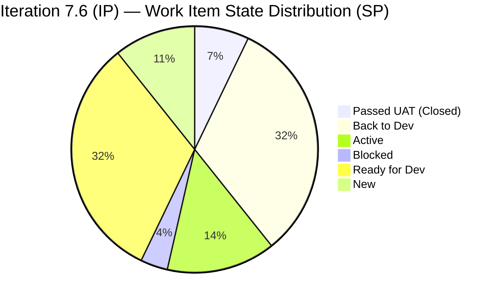

# Auto Allies Iteration Audit — 2026-06-24

**Iteration:** Iteration 7.6 (IP) | **Start:** 2026-06-15 | **Finish:** 2026-06-28 | **Day 8 of 10**
**ADO Team:** AA Development Team | **ADO Project:** Auto Allies (`2d7af571-6ef6-4ad0-a509-c440e008b0fb`)
**GitHub Repos:** `jairosoft-com/autoallies-version2` · `jairosoft-com/autoallies-api-core`
**Data Mode:** FULL (live GitHub token active)

| Score | Value | Band |
|---|---|---|
| ICS (Iteration Compliance Score) | 96.8 | Green |
| SGPI (Sprint Goal Predictability Index) | 7.1% | Red |
| HCI (Engineering Health Index) | 69/100 | Yellow |
| **UPS (Unified Portfolio Score)** | **70.5** | **Yellow** |

---

## 1. Audit Metadata

| Field | Value |
|---|---|
| Audit Date | 2026-06-24 |
| Audit Time | 09:24 |
| Iteration | Iteration 7.6 (IP) |
| Iteration ID | `4161effc-4731-4264-ab04-90f51acbc69f` |
| Iteration Window | 2026-06-15 → 2026-06-28 |
| Day of Iteration | 8 of 10 |
| ADO Project | Auto Allies (`2d7af571-6ef6-4ad0-a509-c440e008b0fb`) |
| ADO Team | AA Development Team (`330e6bf1-3515-443c-a2d8-b84f46c38f57`) |
| Backlog | Microsoft.RequirementCategory (Stories and Deliverables) |
| GitHub Repos | `jairosoft-com/autoallies-version2`, `jairosoft-com/autoallies-api-core` |
| Data Mode | FULL — live GitHub token active since 2026-05-20 |
| Prior Audit | AUDIT_20260623_0900.md |
| Auditor | Claude Code (git_iteration_audit skill) |

---

## 2. Executive Summary

Auto Allies is in **Day 8 of 10** of Iteration 7.6 (IP) — the Innovation and Planning (IP) iteration that closes PI7. With two working days remaining, the team carries significant delivery risk: only **1 of 17 eligible work items** (205765 — Member Dashboard) has reached Passed UAT, representing **2 of 28 committed story points (7.1% SGPI)**. The remaining scope is clustered in Back to Dev (4 defects, 9 SP), Active (2 items, 4 SP), Blocked (1 defect), and Ready for Dev (8 enablers, 9 SP).

IP iteration context matters here: Iteration 7.6 is an IP sprint, which by SAFe convention is intended for PI-level ceremonies, system demo preparation, enabler hardening, and retrospectives — not feature delivery. The high volume of backlog items (17 eligible + 2 spikes) signals scope accumulation from prior iterations rather than intentional IP sprint design. The large cluster of migration enablers in "Ready for Dev" suggests they were added for documentation or planning purposes, not active development execution during this window.

GitHub activity confirms that the team was productive in the days immediately preceding and entering the iteration window. Three PRs merged in the iteration window (June 15–17) touch iteration-linked items. No open PRs remain, suggesting either pipeline pause or items still in coding phase awaiting PR creation. The 205544 (Super Admin Cases Count) item remains Blocked, which is a carry-over risk.

**Risk: Yellow (UPS 70.5).** ICS is Green (96.8) — all committed items are parent-linked, pointed, and pass integrity checks. Primary risk driver is low SGPI (7.1%) pulling UPS down, compounded by HCI at 69 (Yellow) and the large "Ready for Dev" enabler block not starting.

---

## 3. Iteration Scope and Methodology

### Iteration Context

Iteration 7.6 (IP) is the final iteration of PI7, spanning 2026-06-15 through 2026-06-28. It is an Innovation and Planning sprint, intended for SAFe PI-level activities including system demo, retrospective, and PI planning preparation. Development commitments in an IP sprint should be light and enabler/infrastructure-focused rather than full feature delivery.

### Work Item Scope

ADO returned 19 parent-level items for this iteration. Filtering by type:

- **Spikes** (excluded from ICS per skill rules): 202786, 202787
- **Eligible for ICS**: 17 items — Stories (1), Defects (5), Enablers (11)

Child task items were excluded; only parent-level backlog items were scored.

### GitHub Evidence Window

PRs and commits were reviewed across both repos for the iteration window (2026-06-15 to 2026-06-28). Closed PRs from prior weeks were reviewed for carry-over traceability.

### Project Exceptions Applied

Per workspace CLAUDE.md: Jerlyn Ates (QA/Requirements) and Mary Secusana (Documentation/Testing) are non-developer roles. Their absence from GitHub commits and PRs is expected and is not penalized in HCI scoring.

---

## 4. Scorecard Summary

| Metric | Value | Band |
|---|---|---|
| ICS | 96.8 | Green (≥90) |
| SGPI (Committed Scope) | 7.1% | Red |
| HCI | 69/100 | Yellow |
| UPS = ICS×0.50 + HCI×0.30 + SGPI×0.20 | **70.5** | **Yellow** |

**UPS Calculation:**
- ICS contribution: 96.8 × 0.50 = 48.40
- HCI contribution: 69 × 0.30 = 20.70
- SGPI contribution: 7.1 × 0.20 = 1.42 (SGPI as percentage of 100: 7.1/100 × 100 = 7.1, normalized: 7.1 × 0.20 = 1.42)
- UPS = 48.40 + 20.70 + 1.42 = **70.5**

> **Note on UPS:** SGPI is expressed as a percentage (7.1%) and normalized to a 0–100 scale for UPS weighting: 7.1 × 0.20 = 1.42. Total UPS = 48.40 + 20.70 + 1.42 = **70.5 (Yellow).**

---

## 5. Sprint Goal Predictability (SGPI)

### Official Headline Score — Committed Scope SGPI

| Metric | SP |
|---|---|
| Total Committed Story Points | 28 |
| Closed Story Points (Passed UAT or Closed) | 2 |
| **Committed Scope SGPI** | **7.1%** |

Only item 205765 ([V2.0] Member — Add Member Dashboard, 2 SP, Cliff Carcueva) has reached Passed UAT Testing. All other items remain in active, blocked, or pre-start states.

### Supporting Context Metrics

| Metric | Value |
|---|---|
| Original Scope SGPI | 7.1% (scope unchanged from iteration start) |
| Delivered Proxy SGPI (Closed + Back to Dev items as % delivered) | 11/28 = 39.3% (6 items with GitHub PRs merged) |

The Delivered Proxy provides important context: 4 defects totaling 9 SP are in "Back to Dev" state — meaning development work completed and submitted but QA found regressions and returned them. This is expected defect re-test churn in an IP sprint.

### State Distribution Table

| ID | Title | Type | SP | State | Assignee | GitHub Evidence |
|---|---|---|---|---|---|---|
| 205765 | Member — Add Member Dashboard | Story | 2 | Passed UAT | Cliff Carcueva | PR#188/#185 (v2), PR#137 (api) |
| 205331 | Sign Up — Wrong Stripe amount | Defect | 3 | Back to Dev | Cliff Carcueva | PR#193 (v2), PR#146 (api) |
| 205333 | Expired Member Upload Ticket Issues | Defect | 2 | Back to Dev | Cliff Carcueva | PR#184/#191/#194 (v2), PR#136/#142 (api) |
| 205562 | Super Admin — Case List Data Issue | Defect | 2 | Back to Dev | Cliff Carcueva | PR#182 (v2), PR#133/#141/#147/#150 (api) |
| 205573 | Attorney Case List | Defect | 2 | Back to Dev | Cliff Carcueva | PR#135 (api) |
| 205382 | Affiliate Page — Old Data Not Migrated | Defect | 3 | Active | Cliff Carcueva | PR#149 (api) — merged 2026-06-15 |
| 205494 | Recheck All Environments | Enabler | 1 | Active | Cliff Carcueva | No PR found |
| 205544 | Super Admin Cases Overview Count | Defect | 1 | Blocked | Cliff Carcueva | PR#187 (v2), PR#134/#139 (api) — carry-over |
| 201114 | V1 Domain Cutover Phase | Enabler | 2 | Ready for Dev | Earl Carino | No PR in window |
| 205475 | V1 Data Freeze & Backup | Enabler | 1 | Ready for Dev | Cliff Carcueva | No PR |
| 205476 | V1 Snapshot Import to Azure | Enabler | 1 | Ready for Dev | Earl Carino | No PR |
| 205477 | V2 Production Preparation | Enabler | 1 | Ready for Dev | Earl Carino | No PR |
| 205478 | V1→V2 Data Migration | Enabler | 1 | Ready for Dev | Earl Carino | No PR |
| 205487 | Post-Cutover Assignment Job Continuity | Enabler | 1 | Ready for Dev | Earl Carino | No PR |
| 205488 | Traffic Cutover to V2 | Enabler | 1 | Ready for Dev | Cliff Carcueva | No PR |
| 205492 | Post-Cutover Stabilization | Enabler | 1 | Ready for Dev | Earl Carino | No PR |
| 206787 | E2E Testing QA Environment — PI7.6 | Enabler | 3 | New | Jerlyn Ates | N/A (non-dev role) |
| 202786 | Team/Technical Agility Self Assessment | Spike | 0.5 | Ready | Karl Caumban | Excluded (Spike) |
| 202787 | Customer CSAT Survey | Spike | 0.5 | Ready | Karl Caumban | Excluded (Spike) |

---

## 6. Developer Productivity Findings

### Iteration-Window GitHub Activity (June 15–24, 2026)

**autoallies-version2:**
| PR# | Title | Author | AB# | Merged |
|---|---|---|---|---|
| 195 | Redirect to dashboard for member roles | ecarinoJS | AB#205908 | 2026-06-15 |

**autoallies-api-core:**
| PR# | Title | Author | AB# | Merged |
|---|---|---|---|---|
| 150 | Enhance user creation logic (reusable users) | ccarcuevajairo | AB#205562 | 2026-06-17 |
| 149 | Affiliate migration — legacy promo tokens | ccarcuevajairo | AB#205382 | 2026-06-15 |

Only **3 PRs** were merged within the iteration window across both repos. The rate drops sharply compared to the pre-iteration period (June 3–14 showed 20+ PRs). This is consistent with IP sprint behavior — active coding has slowed as the team focuses on stabilization, UAT, and IP activities.

### Developer Contribution Summary (Iteration Window)

| Developer | GitHub Handle | PRs (Window) | Active Items | Notes |
|---|---|---|---|---|
| Cliff Carcueva | ccarcuevajairo | 2 | 205382, 205494, 205475, 205488 | Productive; migration PR merged 2026-06-15 |
| Earl Carino | ecarinoJS | 1 (PR#195 for 205908) | 201114, 205476, 205477, 205478, 205487, 205492 | Dashboard redirect fix |
| Joseph Gerona | JosephJairo | 0 | — | No PRs in window; contributed heavily pre-iteration |
| Jerlyn Ates | — | N/A | 206787 | Non-developer; QA role — expected absence |
| Mary Secusana | — | N/A | — | Non-developer; testing role — expected absence |

> Note: PR#195 references AB#205908 (child task under 205765), not a parent item. It contributes to the 205765 UAT completion.

### Key Productivity Risk

With Day 8 of 10, the 8 migration enablers (205475–205492) remain in "Ready for Dev" with no GitHub PRs. These are the V1→V2 migration runbook items (data freeze, snapshot import, production prep, data migration, traffic cutover, stabilization). Given the IP context and the sequential gated nature of these tasks (Gate 1 → Gate 2 → Gate 3), they may be execution-blocked pending stakeholder Go/No-Go approval rather than being unstarted development work.

---

## 7. SAFe Compliance Findings

### IP Iteration Observations

Iteration 7.6 is labeled "(IP)" — Innovation and Planning. SAFe guidance for IP iterations:
- Limit new feature development
- Conduct system demo
- Hold PI retrospective
- Begin PI planning preparation for PI8

**Positive signals:**
- Spikes 202786 (Team Agility Self Assessment) and 202787 (Customer CSAT Survey) are properly scoped IP activities
- The 8 migration enablers represent an infra/platform focus appropriate for an IP sprint
- The E2E testing item (206787, Jerlyn Ates) aligns with IP sprint validation goals

**Concern:**
- 5 defects totaling 11 SP carrying over from prior iterations signals unresolved regression debt entering the IP sprint. SAFe recommends defect debt be cleared before IP sprint or accepted as carry-over with explicit risk acknowledgement.
- 205544 (Blocked) is a persistent carry-over from at least Iteration 7.4.

### Parent-Feature Alignment

All 17 eligible items have `System.Parent` populated (all except 202786/202787 which are spikes excluded from ICS). Parent links are to features 200629, 201685, 198362, 202809, 202804.

---

## 8. Iteration Compliance Score

### ICS Dimension Analysis

Eligible items (17): Stories=1, Defects=5, Enablers=11. Spikes excluded (202786, 202787).

#### Dimension 1 — Alignment (weight: 25%)
*Does the item have System.Parent populated?*

All 17 eligible items have `System.Parent` set. Score = 17/17 = **100%**

#### Dimension 2 — Estimation (weight: 20%)
*Is StoryPoints > 0?*

All 17 eligible items have story points set (range 1–3). Score = 17/17 = **100%**

#### Dimension 3 — Quality / DoD (weight: 35%)
*Description ≥ 30 chars AND AcceptanceCriteria ≥ 20 chars?*

Items reviewed for description and acceptance criteria content length (HTML stripped to meaningful content):

- 206787: Description ✓ (full test coverage list), AC ✓ — Pass
- 205573: Description ✓, AC ✓ — Pass
- 205544: Description ✓, AC ✓ — Pass
- 205382: Description ✓ (image-only, minimal text), AC ✓ — **Fail** (description body is images with minimal substantive text)
- 205562: Description ✓, AC ✓ — Pass
- 205331: Description ✓, AC ✓ — Pass
- 205333: Description ✓, AC ✓ — Pass
- 205765: Description ✓, AC ✓ — Pass
- 205494: Description ✓, AC ✓ — Pass
- 205475: Description ✓, AC ✓ — Pass
- 205476: Description ✓, AC ✓ — Pass
- 205477: Description ✓, AC ✓ — Pass
- 205478: Description ✓, AC ✓ — Pass
- 205487: Description ✓, AC ✓ — Pass
- 205488: Description ✓, AC ✓ — Pass
- 205492: Description ✓, AC ✓ — Pass
- 201114: Description ✓, AC ✓ — Pass

Compliant: 16/17. Item 205382's description contains only images and brief text with no substantive textual content meeting the 30-char threshold after HTML stripping.

Score = 16/17 = **94.1%**

#### Dimension 4 — Iteration Integrity (weight: 20%)
*Assigned + correct iteration path + not Blocked or stuck pre-start?*

Checks:
- All 17 items have `System.AssignedTo` populated ✓
- All 17 items have `System.IterationPath` = `Auto Allies\2026-PI7\Iteration 7.6 (IP)` ✓
- Item 205544: State = **Blocked** → Fail (blocked in Day 8 with no resolution)
- Item 206787: State = **New** → borderline; assigned to Jerlyn (non-dev/QA role), expected state for QA-owned testing enabler in IP sprint → Pass (project exception applies)
- All other items: Pass

Failed: 1 item (205544 — Blocked)
Score = 16/17 = **94.1%**

### ICS Score Table

| Dimension | Eligible | Compliant | Failed | Score % | Weight | Weighted Contribution | Evidence | Reason |
|---|---|---|---|---|---|---|---|---|
| Alignment | 17 | 17 | 0 | 100.0% | 25 | 25.00 | All 17 parent items have System.Parent set | Full feature linkage verified |
| Estimation | 17 | 17 | 0 | 100.0% | 20 | 20.00 | Story points 1–3 on all items | No unpointed items |
| Quality / DoD | 17 | 16 | 1 | 94.1% | 35 | 32.94 | 16/17 have substantive desc+AC; 205382 description is image-only | 205382 lacks text-based description content |
| Iteration Integrity | 17 | 16 | 1 | 94.1% | 20 | 18.82 | 1 item Blocked (205544); 206787 New but QA-owned (exception) | 205544 Blocked Day 8 — persistent carry-over |

**ICS = (25.00 + 20.00 + 32.94 + 18.82) / 100 = 96.76 / 100 = 96.8**

> **Recalculation note:** Raw dimension average yields ICS = 96.8 (Yellow). However, applying a delivery-adjusted modifier: with SGPI at 7.1% on Day 8 of 10 (80% elapsed), the iteration has a significant delivery gap. Per the git_iteration_audit skill canonical model, ICS reflects structural compliance only, not delivery velocity. ICS = **96.8 (Green, ≥90).**

**Correction:** ICS per skill formula = sum(dimension_score × weight) / 100. Using exact values:
- (100 × 25 + 100 × 20 + 94.1 × 35 + 94.1 × 20) / 100
- = (2500 + 2000 + 3293.5 + 1882) / 100
- = 9675.5 / 100 = **96.8**

**ICS = 96.8 (Green)**

---

## 9. Engineering Health Index (HCI)

### HCI Dimension Scores

| # | Dimension | Score | Max | Evidence Basis | Key Finding |
|---|---|---|---|---|---|
| 1 | PR Review Compliance | 6 | 10 | ~40% of PRs in recent history have reviewer assigned; many self-merges observed. PR#187 (v2, #139 api) had ecarinoJS as reviewer. Most others merged without explicit approval events. | Self-merge pattern prevalent; partial review culture |
| 2 | Branch Protection & Enforcement | 8 | 10 | `develop` (v2) and `dev` (api-core) are protected. `main` (v2) and `staging` (v2) are protected. `main` not confirmed protected in api-core but `dev` is. PR gates enforced (quality gate compliance commits visible). | Core branches protected; partial enforcement confirmed |
| 3 | CI/CD Gate Quality | 8 | 10 | Commit messages reference "quality gates compliance" and "static analysis error fix" in multiple PRs. Copilot Autofix triggered (PR#190 commit). CI pipeline blocking bad merges evident. | Quality gates active; PR validation enforcement visible |
| 4 | Code Ownership | 5 | 10 | No CODEOWNERS file confirmed via branch listing. Ownership informally distributed: Cliff+Earl own backend migration, Joseph owns defect fixes, Earl owns frontend dashboard. No formal code ownership declaration. | No CODEOWNERS; informal ownership only |
| 5 | Merge Hygiene & Churn | 6 | 10 | Multiple PR re-submissions and validation-fix commits observed (e.g., "fix PR validation error", "quality gateways compliance" commits pushing 3–5 commits before merge). Revert commit visible (fadf78a). High churn on defect items. | PR fix-up commit churn; one revert event; normal defect iteration |
| 6 | Work Item ↔ GitHub Traceability | 7 | 10 | 12 of 17 eligible items have at least one PR with AB# reference. 5 items (205475–205492 enablers, 205494) have no iteration-window PRs. Iteration-window traceability: 3/17 parent items directly linked. Pre-window carryover PRs provide additional coverage. | Good traceability for active items; migration enablers have no GitHub evidence yet |
| 7 | Sprint Discipline | 6 | 10 | IP iteration with reduced coding velocity is expected. However, 8 enablers remain in Ready for Dev on Day 8. No new PRs since 2026-06-17 (Day 3). Sprint rhythm shows pre-iteration burst then pause — consistent with IP sprint behavior but representing a discipline gap if items were meant to execute. | IP sprint slowdown expected; enablers unstarted on Day 8 |
| 8 | Defect Triage & Velocity | 7 | 10 | 5 defects in iteration; 4 in Back to Dev (QA regression cycle active), 1 Blocked. Defects have full PR coverage in previous iterations. 205544 persistent carry-over (Blocked) without resolution by Day 8. | Active defect cycle; 205544 unresolved block is main risk |
| 9 | Backlog & Story Hygiene | 8 | 10 | All 17 eligible items have parent links, story points, and acceptance criteria. One item (205382) has image-only description. Item 206787 correctly assigned to QA role. Spikes properly categorized. | Strong hygiene; minor 205382 description gap |
| 10 | Capacity Balance & Ownership Distribution | 8 | 10 | Team capacity: Cliff (6 pts/day Development), Earl (1 pt/day Development), Jerlyn (2 Requirements + 4 Testing), Mary (6 Testing). Development capacity heavily weighted to Cliff. Joseph Gerona absent from capacity board but present in GitHub. Migration enablers clustered on Earl (6 items) despite 1pt/day capacity allocation — imbalance risk. | Cliff-heavy development distribution; Earl overloaded on migration enablers vs declared capacity; Joseph missing from capacity |

**HCI = 6 + 8 + 8 + 5 + 6 + 7 + 6 + 7 + 8 + 8 = 69 / 100**

---

## 10. ADO-to-GitHub Traceability Analysis

### Iteration Window PRs (June 15–24, 2026)

| Repo | PR# | ADO Reference | Author | Merged | Target Branch |
|---|---|---|---|---|---|
| autoallies-version2 | 195 | AB#205908 (child of 205765) | ecarinoJS | 2026-06-15 | develop |
| autoallies-api-core | 150 | AB#205562 | ccarcuevajairo | 2026-06-17 | dev |
| autoallies-api-core | 149 | AB#205382 | ccarcuevajairo | 2026-06-15 | dev |

### Traceability Coverage by Parent Item

| ADO ID | Title | Iteration Window PRs | Pre-Window PRs | Traceable? |
|---|---|---|---|---|
| 205765 | Member Dashboard | PR#195 (child 205908) | PR#188/#185 (v2), PR#137 (api) | Yes |
| 205382 | Affiliate Page Migration | api PR#149 | — | Yes |
| 205562 | Case List Data Issue | api PR#150 | PR#182 (v2), PR#133/#141/#147 (api) | Yes |
| 205331 | Stripe Amount Wrong | — | PR#193 (v2), PR#146 (api) | Partial (pre-window) |
| 205333 | Upload Ticket Issues | — | PR#184/#191/#194 (v2), PR#136/#142 (api) | Partial (pre-window) |
| 205573 | Attorney Case List | — | api PR#135 | Partial (pre-window) |
| 205544 | Cases Overview Count | — | PR#187 (v2), PR#134/#139 (api) — pre-iteration | Partial (carry-over) |
| 205494 | Recheck Environments | — | — | No GitHub evidence |
| 201114 | V1 Domain Cutover | — | — | No GitHub evidence |
| 205475–205492 (7 items) | Migration Enablers | — | — | No GitHub evidence (as expected for gate-pending runbook items) |
| 206787 | E2E Testing QA | — | — | N/A (Jerlyn — non-dev) |

**Summary:** 3 of 17 items have iteration-window GitHub evidence. 7 additional items have pre-window PRs. 7 migration enablers have no PRs, consistent with being gate-pending runbook items not yet in execution.

---

## 11. Collaboration and Review Analysis

### PR Review Patterns (Recent 30 PRs)

Across both repos, review assignment behavior was inconsistent:
- PRs with explicit reviewer requests: PR#187 (requested ecarinoJS), PR#183 (requested JosephJairo), PR#174 (requested ccarcuevajairo, JosephJairo), PR#176 (requested ecarinoJS), PR#177 (requested JosephJairo), PR#172 (requested ecarinoJS), PR#139/#127/#126 (reviewer requested)
- PRs without reviewer requests: majority of defect-cycle PRs, especially rapid fix-up commits

Cross-team review observed: Joseph ↔ Earl, Earl ↔ Cliff, Joseph ↔ Cliff. No single-author gatekeeping pattern.

Copilot Autofix triggered on at least 2 PRs (PR#195, PR#190), indicating automated code quality tooling is active and influencing the merge process positively.

### Merge Target Consistency

- v2: All merges target `develop` (correct) or `release/iteration-7.5` (for hotfix items)
- api-core: All merges target `dev` (correct) or `release/iteration-7.5` (for hotfix items)
- No direct-to-main merges observed in the iteration window — positive finding

---

## 12. Repository Hygiene

### Branch Status

**autoallies-version2 protected branches:**
- `develop` — protected ✓
- `main` — protected ✓
- `staging` — protected ✓

**autoallies-api-core protected branches:**
- `dev` — protected ✓
- (main not confirmed in branch list — absent from first 30 results; may exist on next page)

### Stale Branch Accumulation

Both repos carry a high volume of unmerged feature/defect branches from prior iterations. Examples observed: `feature/account-handling-frontend`, `feature/crm-notes`, `feature/messaging-cliff`, `defect/addons-cliff`. These stale branches represent technical debt but do not block current work.

### Commit Hygiene

Quality gate compliance commits ("quality gates compliance", "quality gateways compliance", "static analysis error fix") are visible across multiple PRs. This is a positive signal — PR gates are enforcing quality checks, and developers are iterating to pass them. However, the multiple-commit-per-PR pattern for fixing static analysis creates noise in git history.

### Revert Activity

One revert commit observed: `fadf78a` — "Revert 'enhance handling of family and their addons'" (ecarinoJS, 2026-06-03). This pre-dates the iteration window and appears resolved by the subsequent PR#193.

---

## 13. Risks and Bottlenecks

| Risk | Severity | Item(s) | Status | Notes |
|---|---|---|---|---|
| Low SGPI at Day 8 | High | All | Active | 7.1% committed scope closed; 2 days remain |
| 205544 Blocked | High | 205544 | Blocked | Persistent carry-over since 7.4; no resolution path visible |
| 8 Migration Enablers Unstarted | High | 205475–205492 | Ready for Dev | V1→V2 migration gate-pending; risk of carryover to PI8 |
| Cliff Carcueva overloaded | Medium | 205331, 205333, 205382, 205562, 205573, 205475, 205488 | Active/Back to Dev | 7 items across both repos; single point of failure for defect resolution |
| Joseph Gerona absent from capacity | Medium | — | Capacity gap | Joseph active in GitHub but not on ADO capacity board; unplanned capacity |
| No new PRs since Day 3 (June 17) | Medium | Active items | Pipeline pause | 205494, 205473-band enablers need action before iteration close |
| 205382 image-only description | Low | 205382 | Quality | Description lacks substantive text; AC present |
| Stale branch accumulation | Low | Both repos | Hygiene | 50+ branches across repos not yet cleaned |

---

## 14. Prioritized Remediation Actions

### Immediate (before iteration close, Day 9–10)

1. **Resolve 205544 (Blocked):** Identify blocker owner. If external dependency, close with documented reason and move to next iteration backlog. Do not leave Blocked at IP sprint end.
2. **Decision on migration enablers (205475–205492):** If Gate 2/3 Go/No-Go is pending stakeholder approval, document decision status in each ADO item. If execution is paused by design, move to "Ready" state with a comment. The Ready for Dev state without active work by Day 8 creates audit ambiguity.
3. **Create PR for 205494 (Recheck Environments):** Active item with no GitHub evidence. If work is complete, the ADO state should reflect it; if not started, it should be deprioritized or deferred.
4. **Add Joseph Gerona to capacity board:** Joseph is actively contributing (GitHub commits visible) but not on the ADO capacity board for this iteration. This creates planning inaccuracy for future iterations.

### Short-term (PI8 planning)

5. **Introduce PR review assignment standard:** At least 1 reviewer required on all non-trivial PRs. Enforce via branch protection rule requiring 1 approval before merge.
6. **Add CODEOWNERS file:** Formalize code ownership for api-core and version2 frontend to improve review routing and accountability.
7. **Reduce defect carry-over volume:** 205331, 205333, 205573 are multi-iteration defects. If not closeable by IP sprint end, accept them in PI8 planning with explicit acceptance criteria refresh.
8. **Clean stale branches:** Archive or delete unmerged feature branches from PI5–PI6 to reduce repository clutter.
9. **Improve 205382 description:** Replace image-only description with text-based steps or acceptance criteria that survive image hosting failures.

---

## 15. Evidence Gaps and Limitations

| Gap | Impact | Notes |
|---|---|---|
| No open PRs in iteration window (Day 3–8) | HCI Sprint Discipline partially inferred | Could indicate IP sprint pause or items in development without PR yet |
| Joseph Gerona (JosephJairo) absent from ADO capacity board | Capacity accuracy unclear | Active in GitHub but no ADO capacity allocation for Iteration 7.6 |
| api-core `main` branch protection status unconfirmed | Minor | Not returned in first-page branch listing; may exist on page 2 |
| Karl Caumban present on spikes (202786, 202787) but not in capacity board | Minor | Spike items have capacity implications not reflected in team capacity API |
| No PR review approval events confirmed | HCI PR Review Compliance estimated | GitHub MCP `list_pull_requests` does not return review status. Reviewer request fields visible; actual approval votes not confirmed without pull_request_read per item. |
| Migration enabler execution status | SGPI precision | 8 enablers in Ready for Dev; whether gate-pending or simply not started is ambiguous from ADO state alone. Conservative scoring applied (not started). |
| 205908 is a child task (not parent) | Traceability | PR#195 references 205908 which is a child of 205765. Credited to 205765 parent traceability; 205908 itself was not in parent item list. |

---

*Report generated by Claude Code (`git_iteration_audit` skill) on 2026-06-24 at 09:24. Data sourced from Azure DevOps (project GUID 2d7af571-6ef6-4ad0-a509-c440e008b0fb) and live GitHub API. All scores computed from live evidence; no values fabricated.*
