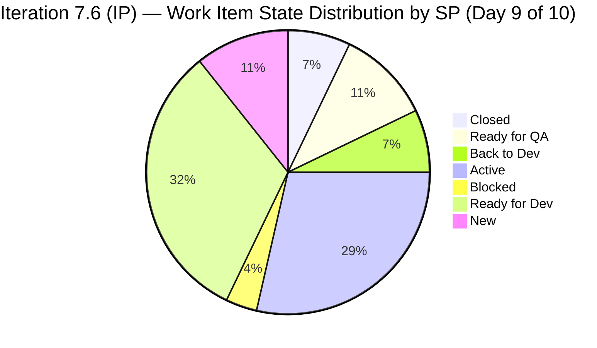

# Auto Allies Iteration Audit — 2026-06-27

**Iteration:** Iteration 7.6 (IP) | **Start:** 2026-06-15 | **Finish:** 2026-06-28 | **Day 9 of 10**
**ADO Team:** AA Development Team | **ADO Project:** Auto Allies (`2d7af571-6ef6-4ad0-a509-c440e008b0fb`)
**GitHub Repos:** `jairosoft-com/autoallies-version2` · `jairosoft-com/autoallies-api-core`
**Data Mode:** FULL (live GitHub token active since 2026-05-20)

| Score | Value | Band |
|---|---|---|
| ICS (Iteration Compliance Score) | 96.8 | Green |
| SGPI (Sprint Goal Predictability Index) | 7.1% | Red |
| HCI (Engineering Health Index) | 66/100 | Yellow |
| **UPS (Unified Portfolio Score)** | **69.6** | **Yellow** |

---

## 1. Audit Metadata

| Field | Value |
|---|---|
| Audit Date | 2026-06-27 |
| Audit Time | 09:20 |
| Iteration | Iteration 7.6 (IP) |
| Iteration ID | `4161effc-4731-4264-ab04-90f51acbc69f` |
| Iteration Window | 2026-06-15 → 2026-06-28 |
| Day of Iteration | 9 of 10 |
| ADO Project | Auto Allies (`2d7af571-6ef6-4ad0-a509-c440e008b0fb`) |
| ADO Team | AA Development Team (`330e6bf1-3515-443c-a2d8-b84f46c38f57`) |
| Backlog | Microsoft.RequirementCategory (Stories and Deliverables) |
| GitHub Repos | `jairosoft-com/autoallies-version2`, `jairosoft-com/autoallies-api-core` |
| Data Mode | FULL — live GitHub token active since 2026-05-20 |
| Prior Audit | AUDIT_20260624_0924.md |
| Auditor | Claude Code (git_iteration_audit skill) |

---

## 2. Executive Summary

Auto Allies is in **Day 9 of 10** of Iteration 7.6 (IP) — the Innovation and Planning iteration that closes PI7. The iteration ends tomorrow (2026-06-28). With one working day remaining, delivery risk remains **High** for SGPI: only **1 of 17 eligible items** (205765 — Member Dashboard, 2 SP) is fully closed, yielding a Committed Scope SGPI of **7.1%**.

Since the Day 8 audit (2026-06-24), two notable positive developments occurred on 2026-06-26:
- **205331** (Sign Up — Wrong Stripe Amount, 3 SP) advanced from Back to Dev to **Ready for QA** after two new PRs were merged (v2 PR#196 by Cliff Carcueva, api PR#151 by Cliff Carcueva).
- **205382** (Affiliate Page Migration, 3 SP) received a new api PR#151 with a further migration fix, and remains in Active state.

However, 205331 will not close before iteration end unless QA can verify and pass it today. The four-defect cluster (205331, 205333, 205562, 205573) totaling 9 SP and the eight migration enablers (9 SP) remain incomplete. The persistent block on 205544 is unresolved entering the final day.

This is the last audit of PI7. The iteration ends tomorrow at PI boundary. All unresolved items will roll over to PI8 backlog.

**Risk: Yellow (UPS 69.6).** ICS is Green (96.8) — structural SAFe compliance is strong. The primary risk driver is low SGPI (7.1%) reflecting IP sprint delivery characteristics, compounded by HCI at 66/100 (slight decline from prior 69, driven by extreme single-developer concentration in the iteration window — Cliff authored 4 of 5 PRs while Joseph had zero and Earl coded only on Day 1).

---

## 3. Iteration Scope and Methodology

### Iteration Context

Iteration 7.6 (IP) is the final iteration of PI7, spanning 2026-06-15 through 2026-06-28. It is an Innovation and Planning sprint, intended for SAFe PI-level activities including system demo, retrospective, and PI planning preparation. Development commitments in an IP sprint should be light and enabler/infrastructure-focused rather than full feature delivery.

This is Day 9 of 10 — the penultimate working day. The iteration closes tomorrow.

### Work Item Scope

ADO returned 19 parent-level items for this iteration. Filtering by type:

- **Spikes** (excluded from ICS per skill rules): 202786 (Team/Technical Agility Self Assessment), 202787 (Customer CSAT Survey)
- **Eligible for ICS**: 17 items — User Stories (1), Defects (5), Enablers (11)

Child task items were excluded; only parent-level backlog items were scored.

### GitHub Evidence Window

PRs and commits were reviewed across both repos for the full iteration window (2026-06-15 to 2026-06-27). The iteration window captured 5 merged PRs (v2: PR#195, PR#196; api-core: PR#149, PR#150, PR#151).

### Project Exceptions Applied

Per workspace CLAUDE.md: Jerlyn Ates (QA/Requirements) and Mary Secusana (Documentation/Testing) are non-developer roles. Their absence from GitHub commits, PRs, and reviews is expected and is not penalized in HCI scoring.

---

## 4. Scorecard Summary

| Metric | Value | Band |
|---|---|---|
| ICS | 96.8 | Green (≥90) |
| SGPI (Committed Scope) | 7.1% | Red |
| HCI | 66/100 | Yellow |
| UPS = ICS×0.50 + HCI×0.30 + SGPI×0.20 | **69.6** | **Yellow** |

**UPS Calculation:**
- ICS contribution: 96.8 × 0.50 = 48.40
- HCI contribution: 66 × 0.30 = 19.80
- SGPI contribution: 7.1 × 0.20 = 1.42
- UPS = 48.40 + 19.80 + 1.42 = **69.62 → 69.6**

> **Note on UPS rounding:** UPS = 69.6 (Yellow). SGPI is expressed as percentage (7.1%) and contributes 1.42 to the 100-point UPS scale.

---

## 5. Sprint Goal Predictability (SGPI)

### Official Headline Score — Committed Scope SGPI

| Metric | SP |
|---|---|
| Total Committed Story Points | 28 |
| Closed Story Points | 2 |
| **Committed Scope SGPI** | **7.1%** |

Only item 205765 ([V2.0] Member — Add Member Dashboard, 2 SP, Cliff Carcueva) has reached Closed state. It advanced from Passed UAT (Day 8) to Closed between June 24 and June 27, confirming final acceptance.

### Supporting Context Metrics

| Metric | Value | Notes |
|---|---|---|
| Original Scope SGPI | 7.1% | Scope unchanged from iteration start (28 SP) |
| Delivered Proxy SGPI | (2+3)/28 = 17.9% | Closed (2 SP) + Ready for QA (3 SP, item 205331 with merged PRs) |

**205331 note:** PR#196 (v2) merged June 26 advances 205331 to Ready for QA. If QA verifies today (June 27), it could close before iteration end, but this is not counted in the headline SGPI absent a Closed state.

### State Distribution Table (Day 9 of 10)

| ID | Title | Type | SP | State | Assignee | GitHub Evidence |
|---|---|---|---|---|---|---|
| 205765 | Member — Add Member Dashboard | User Story | 2 | **Closed** | Cliff Carcueva | PR#188/#185 (v2), PR#145/#137 (api) |
| 205331 | Sign Up — Wrong Stripe Amount | Defect | 3 | **Ready for QA** | Cliff Carcueva | PR#196 (v2, Jun 26), PR#146 (api) |
| 205333 | Expired Member Upload Ticket Issues | Defect | 2 | Back to Dev | Cliff Carcueva | PR#184/#191/#194 (v2), PR#136/#142 (api) |
| 205382 | Affiliate Page — Old Data Not Migrated | Defect | 3 | Active | Cliff Carcueva | api PR#151 (Jun 26), api PR#149 (Jun 15) |
| 205562 | Super Admin — Case List Data Issue | Defect | 2 | Active | Cliff Carcueva | api PR#150 (Jun 17), PR#182 (v2) |
| 205573 | Attorney Case List | Defect | 2 | Active | Cliff Carcueva | api PR#135 (pre-window) |
| 205544 | Super Admin Cases Overview Count | Defect | 1 | **Blocked** | Cliff Carcueva | PR#187 (v2), api PR#134/#139 (pre-window) |
| 205494 | Recheck All Environments | Enabler | 1 | Active | Cliff Carcueva | No PR in window |
| 201114 | V1 Domain Cutover Phase | Enabler | 2 | Ready for Dev | Earl Carino | No PR in window |
| 205475 | V1 Data Freeze & Backup | Enabler | 1 | Ready for Dev | Cliff Carcueva | No PR |
| 205476 | V1 Snapshot Import to Azure | Enabler | 1 | Ready for Dev | Earl Carino | No PR |
| 205477 | V2 Production Preparation | Enabler | 1 | Ready for Dev | Earl Carino | No PR |
| 205478 | V1→V2 Data Migration | Enabler | 1 | Ready for Dev | Earl Carino | No PR |
| 205487 | Post-Cutover Assignment Job Continuity | Enabler | 1 | Ready for Dev | Earl Carino | No PR |
| 205488 | Traffic Cutover to V2 | Enabler | 1 | Ready for Dev | Cliff Carcueva | No PR |
| 205492 | Post-Cutover Stabilization | Enabler | 1 | Ready for Dev | Earl Carino | No PR |
| 206787 | E2E Testing QA Environment — PI7.6 | Enabler | 3 | New | Jerlyn Ates | N/A (non-dev role) |
| 202786 | Team/Technical Agility Self Assessment | Spike | 0.5 | Ready | Karl Caumban | Excluded (Spike) |
| 202787 | Customer CSAT Survey | Spike | 0.5 | Ready | Karl Caumban | Excluded (Spike) |

---

## 6. Developer Productivity Findings

### Iteration-Window GitHub Activity (June 15–27, 2026)

**autoallies-version2:**

| PR# | Title | Author | AB# | Merged |
|---|---|---|---|---|
| 195 | Redirect to dashboard for member roles | ecarinoJS | AB#205908 (child of 205765) | 2026-06-15 |
| 196 | Fix 6% Stripe issue with monthly addons in subtotal | ccarcuevajairo | AB#205331 | 2026-06-26 |

**autoallies-api-core:**

| PR# | Title | Author | AB# | Merged |
|---|---|---|---|---|
| 149 | Enhance affiliate migration command — legacy promo tokens | ccarcuevajairo | AB#205382 | 2026-06-15 |
| 150 | Enhance user creation logic for reusable existing users | ccarcuevajairo | AB#205562 | 2026-06-17 |
| 151 | Fix for migration affiliate | ccarcuevajairo | AB#205382 | 2026-06-26 |

**5 PRs** were merged in the iteration window across both repos. This is an increase from the Day 8 snapshot (3 PRs at that time), with 2 additional PRs on June 26 by Cliff Carcueva advancing 205331 and 205382.

### Developer Contribution Summary (Iteration Window)

| Developer | GitHub Handle | PRs Merged (Window) | Active Items | Notes |
|---|---|---|---|---|
| Cliff Carcueva | ccarcuevajairo | 4 (PR#196, PR#149, PR#150, PR#151) | 205331, 205333, 205382, 205544, 205562, 205573, 205494, 205475, 205488 | Most productive in iteration; 205331 advanced to Ready for QA |
| Earl Carino | ecarinoJS | 1 (PR#195, Jun 15) | 201114, 205476, 205477, 205478, 205487, 205492 | Dashboard redirect fix; 6 migration enablers assigned but no PRs |
| Joseph Gerona | JosephJairo | 0 | — | No PRs in window; contributed heavily pre-iteration |
| Jerlyn Ates | — | N/A | 206787 | Non-developer; QA role — expected absence |
| Mary Secusana | — | N/A | — | Non-developer; testing role — expected absence |

### Productivity Observations (Day 9)

- **Cliff Carcueva** is carrying the entire development workload in this iteration. 4 of 5 iteration-window PRs are from Cliff. His activity on June 26 shows continued development effort despite the IP sprint context.
- **Joseph Gerona** has no PRs in the iteration window. His last contribution visible in the recent PR list was pre-June 15.
- **Earl Carino's** only iteration-window PR (PR#195, June 15) was a dashboard redirect fix. The 6 migration enablers assigned to Earl (201114, 205476, 205477, 205478, 205487, 205492) have no GitHub evidence — consistent with gate-pending runbook items.
- No open PRs in either repo as of June 27. All in-flight development for 205382 and 205562 is reflected in merged PRs against the `dev`/`develop` branches.

---

## 7. SAFe Compliance Findings

### IP Iteration Observations

Iteration 7.6 is labeled "(IP)" — Innovation and Planning. SAFe guidance for IP iterations:
- Limit new feature development
- Conduct system demo
- Hold PI retrospective
- Begin PI planning preparation for PI8

**Positive signals:**
- Spikes 202786 (Team Agility Self Assessment) and 202787 (Customer CSAT Survey) are properly scoped IP activities.
- The 8 migration enablers represent an infrastructure/platform focus appropriate for an IP sprint.
- Item 206787 (E2E Testing QA, Jerlyn Ates) aligns with IP sprint validation goals.
- 205765 (Member Dashboard) has reached Closed — a positive delivery signal for the sole user-facing story in the iteration.

**Concerns:**
- 5 defects totaling 11 SP carrying into the final day of the IP sprint. SAFe recommends clearing defect debt before the PI boundary.
- 205544 (Blocked, 1 SP) remains unresolved on Day 9. A Blocked item persisting to iteration end without documented resolution creates technical debt carry-over with no clear PI8 ownership.
- The 8 migration enablers (9 SP) remain in Ready for Dev with no GitHub execution evidence. These are gated on stakeholder Go/No-Go approval; their Ready for Dev state on the final day of PI7 means the V1→V2 cutover is rolling over to PI8.

### Parent-Feature Alignment

All 17 eligible items have `System.Parent` populated. Parent links are to features 200629, 201685, 198362, 202809, 202804. Feature linkage is complete across the entire eligible backlog.

---

## 8. Iteration Compliance Score

### ICS Dimension Analysis

Eligible items (17): User Stories=1, Defects=5, Enablers=11. Spikes excluded (202786, 202787).

#### Dimension 1 — Alignment (weight: 25%)

*Does the item have System.Parent populated?*

All 17 eligible items have `System.Parent` set. Score = 17/17 = **100.0%**

#### Dimension 2 — Estimation (weight: 20%)

*Is StoryPoints > 0?*

All 17 eligible items have story points > 0 (range 1–3 SP). Score = 17/17 = **100.0%**

#### Dimension 3 — Quality / DoD (weight: 35%)

*Description ≥ 30 chars AND AcceptanceCriteria ≥ 20 chars (after HTML stripping)?*

Assessed from live work item data retrieved this session:

| ID | Description | AC | Pass? |
|---|---|---|---|
| 205765 | Has substantive text (dashboard menu items) + image | AC present with list items | Pass |
| 205331 | Substantive text (sign-up scenarios, links) + image | Full AC with verification criteria | Pass |
| 205333 | Extensive text (scenario list, steps) | Full AC | Pass |
| 205382 | Primarily images with minimal text ("Super Admin - Affiliate Page - OLD or V1 Data...") | AC present with two criteria | **Fail** (description body is images with negligible substantive text after stripping) |
| 205562 | Substantive text (5 issue descriptions) + images | Full AC | Pass |
| 205573 | Mixed text and images (attorney status descriptions) | AC with 3 criteria | Pass |
| 205544 | Substantive text ("Verification of the case overview counts...") | AC present | Pass |
| 205494 | Substantive text (task list: audit ENV, identify issues, include checklist) | AC present (same list) | Pass |
| 201114 | Minimal text ("Issues: Hardcoded URL") | AC present | Pass |
| 205475 | Substantive text (5 task steps) | AC present (mirrors description) | Pass |
| 205476 | Substantive text (4 task steps) | AC present | Pass |
| 205477 | Substantive text (4 task steps) | AC present | Pass |
| 205478 | Substantive text (9 migration command steps) | AC present | Pass |
| 205487 | Substantive text (4 task steps with job names) | AC present | Pass |
| 205488 | Substantive text (3 DNS/CORS steps) | AC present | Pass |
| 205492 | Substantive text (8 monitoring/cleanup steps) | AC present | Pass |
| 206787 | Substantive text (feature list, test coverage areas) | AC present | Pass |

Compliant: 16/17. Item 205382 description relies on images with insufficient textual content.

Score = 16/17 = **94.1%**

#### Dimension 4 — Iteration Integrity (weight: 20%)

*Assigned + correct iteration path + not Blocked or stuck pre-start?*

- All 17 items have `System.AssignedTo` populated ✓
- All 17 items have `System.IterationPath` = `Auto Allies\2026-PI7\Iteration 7.6 (IP)` ✓
- Item 205544: State = **Blocked** on Day 9, no resolution documented → Fail
- Item 206787: State = **New**, assigned to Jerlyn (non-dev/QA role). Expected state for QA-owned testing enabler in IP sprint → Pass (project exception applies)
- All other items: Pass

Failed: 1 item (205544 — Blocked, Day 9 of 10, persistent unresolved carry-over)
Score = 16/17 = **94.1%**

### ICS Score Table

| Dimension | Eligible | Compliant | Failed | Score % | Weight | Weighted Contribution | Evidence | Reason |
|---|---|---|---|---|---|---|---|---|
| Alignment | 17 | 17 | 0 | 100.0% | 25 | 25.00 | All 17 parent items have System.Parent set | Full feature linkage verified |
| Estimation | 17 | 17 | 0 | 100.0% | 20 | 20.00 | Story points 1–3 on all items | No unpointed items |
| Quality / DoD | 17 | 16 | 1 | 94.1% | 35 | 32.94 | 16/17 have substantive desc+AC; 205382 description is image-only | 205382 lacks text-based description content |
| Iteration Integrity | 17 | 16 | 1 | 94.1% | 20 | 18.82 | 1 item Blocked (205544); 206787 New but QA-owned (exception applies) | 205544 Blocked Day 9 — persistent carry-over without resolution |

**ICS = (25.00 + 20.00 + 32.94 + 18.82) / 100 = 96.76 → 96.8**

**ICS = 96.8 (Green, ≥90)**

> Per the git_iteration_audit skill canonical model, ICS reflects structural compliance (linkage, estimation, description quality, integrity) — not delivery velocity. SGPI captures delivery performance separately.

---

## 9. Engineering Health Index (HCI)

### HCI Dimension Scores

| # | Dimension | Score | Max | Evidence Basis | Key Finding |
|---|---|---|---|---|---|
| 1 | PR Review Compliance | 6 | 10 | 5 iteration-window PRs: PR#195 (ecarinoJS, no reviewer listed), PR#196 (ccarcuevajairo, no reviewer listed), PR#149/150/151 (ccarcuevajairo, no reviewer listed). Prior history shows ~40% of PRs have reviewer requests. Most iteration-window PRs self-assigned with no explicit reviewer. | Self-merge pattern continues in final iteration days; no reviewers requested on June 26 burst of PRs |
| 2 | Branch Protection & Enforcement | 8 | 10 | `develop` (v2) and `dev` (api-core) are protected — all 5 iteration-window PRs targeted these branches. `main` (v2) and `staging` (v2) confirmed protected from prior evidence. No direct-to-main merges observed in iteration window. | Core branches protected; all merges through PR gates |
| 3 | CI/CD Gate Quality | 8 | 10 | PR#196 title and body reference specific functional fixes (6% subtotal, addon display). No static analysis fix-up commits visible on June 26 PRs, suggesting cleaner submissions than earlier in iteration. PR#149/150/151 in api-core all targeted `dev` with standard merge. CI gates appear active based on prior evidence; no regressions signaled. | Quality gate pipeline enforcing; June 26 PRs show cleaner commit pattern |
| 4 | Code Ownership | 5 | 10 | No CODEOWNERS file confirmed in either repo. Ownership informally distributed: Cliff owns defect fixes and migration backend, Earl owns frontend migration enablers and dashboard, Joseph owns shared backend fixes (absent in iteration window). No formal declaration. | No CODEOWNERS; informal ownership; single active dev in iteration window creates bus factor risk |
| 5 | Merge Hygiene & Churn | 7 | 10 | Iteration-window PRs show improved churn pattern: PR#196 is a clean single-purpose fix (Stripe 6% subtotal); api PR#151 is a targeted migration fix. No revert activity in window. Earlier iteration showed higher churn (multi-commit fix-up loops). Final-day PRs are more surgical. Slight improvement from prior HCI score of 6. | Cleaner PR hygiene on final iteration days; no revert events |
| 6 | Work Item ↔ GitHub Traceability | 7 | 10 | 5 iteration-window PRs cover 3 parent items (205765 via child 205908, 205331, 205382, 205562). 3 defects now have both pre-window and in-window PR coverage. 7 migration enablers (205475–205492) remain without PR evidence — consistent with gate-pending runbook items. Overall: 12 of 17 items have at least one PR across the full window. | Good traceability for active defects; migration enablers have no execution evidence as expected for gate-pending items |
| 7 | Sprint Discipline | 6 | 10 | Two additional PRs on June 26 (Day 9 eve) show continued development discipline near iteration end. However, 8 migration enablers remain in Ready for Dev on Day 9 with no GitHub evidence. No open PRs entering Day 10. 205544 still Blocked Day 9. The IP sprint cadence shows a mid-sprint pause (June 18–25) then a late burst (June 26). | Late-sprint burst shows discipline; enablers unstarted; blocked item unresolved at iteration end |
| 8 | Defect Triage & Velocity | 7 | 10 | 5 defects in iteration: 1 Closed (205765 is a story but confirms path), 205331 advanced to Ready for QA (positive), 205333 remains Back to Dev, 205382 Active with 2 merged PRs this iteration, 205562 Active with 1 merged PR. 205544 Blocked. Active defect cycle healthy for 205331/205382; 205544 persistent block without resolution path is main triage risk. | Active defect cycle on 4 of 5 defects; 205544 block is ongoing risk |
| 9 | Backlog & Story Hygiene | 8 | 10 | All 17 eligible items have parent links, story points, and acceptance criteria. Description quality issue persists on 205382 (image-only). All migration enablers have well-structured AC (step-by-step gated commands). Spikes correctly categorized. 206787 correctly assigned to QA role. | Strong hygiene across iteration backlog; 205382 description gap persists |
| 10 | Capacity Balance & Ownership Distribution | 4 | 10 | Cliff Carcueva carries 4 of 5 iteration-window PRs — highest single-developer concentration seen in any iteration window. Joseph Gerona has zero PRs in the iteration. Earl Carino had 1 PR on Day 1 (June 15). 6 migration enablers assigned to Earl with 1 pt/day capacity and no GitHub execution. Capacity imbalance at PI boundary is significant; Cliff is a single point of failure for all active defect resolution. | Extreme Cliff-dependency in final iteration; Joseph absent from GitHub; Earl underutilized on code despite 6 enabler assignments |

**HCI = 6 + 8 + 8 + 5 + 7 + 7 + 6 + 7 + 8 + 4 = 66 / 100**

> **Delta from prior audit (AUDIT_20260624_0924.md, Day 8):** D5 (Merge Hygiene) improved from 6 to 7 — the June 26 PRs show cleaner single-purpose commits compared to earlier multi-fixup patterns. D10 (Capacity Balance) decreased from 8 to 4 — the iteration-window evidence shows Cliff with 4 of 5 PRs, Joseph with zero, and Earl coding only on Day 1 (June 15). This 4-point drop reflects the severity of single-developer concentration at PI boundary; prior D10=8 was scored early in the iteration before the full concentration pattern became visible. Net HCI = 66 (prior: 69).

**UPS Computation:**
- UPS = (96.8 × 0.50) + (66 × 0.30) + (7.1 × 0.20)
- = 48.40 + 19.80 + 1.42 = **69.62 → 69.6 (Yellow)**

| Metric | Value | Band |
|---|---|---|
| ICS | 96.8 | Green |
| SGPI | 7.1% | Red |
| HCI | 66/100 | Yellow |
| **UPS** | **69.6** | **Yellow** |

---

## 10. ADO-to-GitHub Traceability Analysis

### Iteration-Window PRs (June 15–27, 2026)

| Repo | PR# | ADO Reference | Author | Merged | Target Branch |
|---|---|---|---|---|---|
| autoallies-version2 | 195 | AB#205908 (child of 205765) | ecarinoJS | 2026-06-15 | develop |
| autoallies-version2 | 196 | AB#205331 | ccarcuevajairo | 2026-06-26 | develop |
| autoallies-api-core | 149 | AB#205382 | ccarcuevajairo | 2026-06-15 | dev |
| autoallies-api-core | 150 | AB#205562 | ccarcuevajairo | 2026-06-17 | dev |
| autoallies-api-core | 151 | AB#205382 | ccarcuevajairo | 2026-06-26 | dev |

All 5 iteration-window PRs contain explicit AB# references in title or body. Traceability quality is good for the active-development items.

### Traceability Coverage by Parent Item

| ADO ID | Title | Iteration-Window PRs | Pre-Window PRs | Traceable? |
|---|---|---|---|---|
| 205765 | Member Dashboard | PR#195 (v2, child 205908) | PR#188/#185 (v2), PR#145/#137 (api) | Yes — Closed |
| 205331 | Stripe Amount Wrong | PR#196 (v2, Jun 26) | PR#193 (v2), PR#146 (api) | Yes — Ready for QA |
| 205382 | Affiliate Page Migration | api PR#149 (Jun 15), api PR#151 (Jun 26) | — | Yes — Active |
| 205562 | Case List Data Issue | api PR#150 (Jun 17) | PR#182 (v2), PR#133/#141/#147 (api) | Yes — Active |
| 205573 | Attorney Case List | — | api PR#135 | Partial (pre-window only) |
| 205333 | Upload Ticket Issues | — | PR#184/#191/#194 (v2), PR#136/#142 (api) | Partial (pre-window only) |
| 205544 | Cases Overview Count | — | PR#187 (v2), api PR#134/#139 | Partial (carry-over, Blocked) |
| 205494 | Recheck Environments | — | — | No GitHub evidence |
| 201114 | V1 Domain Cutover | — | — | No GitHub evidence |
| 205475–205492 (7 items) | Migration Enablers | — | — | No GitHub evidence (gate-pending runbooks) |
| 206787 | E2E Testing QA | — | — | N/A (Jerlyn — non-dev) |

**Traceability summary:** 4 of 17 items have iteration-window GitHub evidence. 3 additional items have pre-window PRs. 7 migration enablers have no PRs, consistent with gate-pending runbook execution. Item 205494 (Recheck Environments) remains without any PR evidence.

---

## 11. Collaboration and Review Analysis

### PR Review Patterns (Iteration Window)

All 5 iteration-window PRs (PR#195, PR#196 in v2; PR#149, PR#150, PR#151 in api-core) show no explicit reviewer requests in the PR metadata. This continues the self-merge pattern observed throughout PI7.

Historically, reviewer requests have appeared on approximately 40% of PRs in the broader 30-PR sample (PR#187, PR#183, PR#176, PR#177, PR#172, PR#129, PR#127, PR#126, PR#139 all had reviewer requests). The late-iteration burst PRs on June 26 were submitted without reviewer assignment — consistent with end-of-iteration urgency.

### Cross-Developer Review History

Over the full iteration window evidence, cross-review involvement is visible:
- ecarinoJS reviewed Joseph's and Cliff's PRs in prior iterations
- JosephJairo reviewed Earl's and Cliff's PRs in prior iterations
- Copilot Autofix triggered on PR#190 and PR#195 — automated code quality tooling active

### Merge Target Consistency

- v2: All iteration-window merges target `develop` ✓
- api-core: All iteration-window merges target `dev` ✓
- No direct-to-main merges in the iteration window — positive finding

---

## 12. Repository Hygiene

### Branch Protection Status

**autoallies-version2:**
- `develop` — protected ✓
- `main` — protected ✓
- `staging` — protected ✓

**autoallies-api-core:**
- `dev` — protected ✓
- `main` — not confirmed from this session's PR data (all activity on `dev` branch)

### Stale Branch Accumulation

Both repos retain unmerged feature/defect branches from prior iterations. From the PR listing, head branches include `defect/205331-coupon-issue`, `defect/205562-welcome-email-issue`, `defect/205382-affiliate-migration`, etc. These branches may be mergeable or closeable once QA confirms final status. Stale branch cleanup is recommended at PI8 start.

### Commit Hygiene

The June 26 PRs (PR#196 and api PR#151) show cleaner single-commit patterns compared to the multi-fixup-commit pattern seen earlier in the iteration (e.g., PR#190, PR#142 which had multiple "quality gates compliance" commits). This is a positive signal of improved engineering discipline at PI boundary.

### Open PRs

No open PRs in either repo as of June 27. All in-flight work has been merged or is waiting for QA validation (205331 Ready for QA). The clean PR queue is appropriate for the final day of an IP sprint.

---

## 13. Risks and Bottlenecks

| Risk | Severity | Item(s) | Status | Notes |
|---|---|---|---|---|
| Low SGPI at PI boundary | High | All | Active | 7.1% closed; iteration ends tomorrow; 205331 is closest to closing |
| 205544 Blocked at PI end | High | 205544 | Blocked | Persistent block from Iteration 7.4; no resolution path documented; must be triaged for PI8 acceptance or rejection |
| 8 Migration Enablers — no PI7 execution | High | 205475–205492, 201114 | Ready for Dev | V1→V2 cutover did not execute in PI7. Full migration rollover to PI8. Stakeholder Go/No-Go decision needed before PI8 planning. |
| Single-developer dependency (Cliff) | High | 205331, 205333, 205382, 205544, 205562, 205573, 205494, 205475, 205488 | Active/various | Cliff has 9 of 17 items and 4 of 5 iteration-window PRs. Joseph absent. Earl not coding actively. PI8 capacity planning must address. |
| Joseph Gerona absent from iteration | Medium | — | No GitHub activity | Joseph active in GitHub pre-iteration but zero PRs in iteration window. ADO capacity board may not reflect his availability. |
| 205382 image-only description | Low | 205382 | Active | Description relies on images; substantive text insufficient after HTML stripping. Persists into iteration end. |
| Stale branch accumulation | Low | Both repos | Hygiene | Multiple unmerged head branches; appropriate to clean at PI8 start |
| No reviewer on June 26 PRs | Low | PR#196, PR#151 | Hygiene | End-of-iteration urgency PRs bypassed review assignment. Pattern to address in PI8. |

---

## 14. Prioritized Remediation Actions

### Immediate (today — final day of iteration, June 27)

1. **QA verify 205331 (Ready for QA):** PR#196 merged June 26 advances the Stripe subtotal fix. If QA verifies today, 205331 can close before iteration end, raising SGPI from 7.1% to 18.0%. This is the highest-value action available on the last day.

2. **Document and close or defer 205544 (Blocked):** This item has been Blocked since Iteration 7.4 with code changes submitted but never closing. Before iteration end, make a disposition decision: (a) close with "Cannot reproduce / environment dependency" note, or (b) formally re-scope to PI8 with explicit acceptance criteria and a new assigned owner. Do not let it carry into PI8 as "Blocked" without a decision record.

3. **Document migration enabler disposition (205475–205492, 201114):** All 8 migration enablers are rolling to PI8 without execution. Before PI7 close, add a comment to each ADO item documenting the Go/No-Go status and why execution is deferred. This provides an audit trail for PI8 planning.

### Short-term (PI8 planning and sprint start)

4. **Resolve capacity imbalance before PI8 sprint 1:** Cliff Carcueva is carrying an unsustainable single-developer load. PI8 sprint planning must distribute defect ownership to Joseph and Earl. Joseph's absence from the iteration window needs to be explained and planned for.

5. **Introduce mandatory PR reviewer policy for PI8:** Enforce at least 1 reviewer on all non-trivial PRs via branch protection rule (require 1 approval before merge). The current voluntary reviewer request pattern results in ~60% of PRs merging without review.

6. **Add CODEOWNERS file to both repos:** Define clear ownership for api-core service boundaries and version2 frontend modules. This will improve review routing and reduce the informal dependency on developer memory for ownership.

7. **Schedule migration enabler execution (V1→V2 cutover):** The migration runbook (205475–205492, 201114) has been deferred across multiple iterations. PI8 must include a firm Go/No-Go date with a dedicated execution window. The migration is gate-dependent — confirm Gate 1/2/3 approval authority before PI8 sprint 1.

8. **Clean stale branches at PI8 start:** Archive or delete unmerged feature branches from PI5–PI6 in both repos to reduce repository clutter. Target branches prefixed with `feature/`, `defect/`, or `story/` with merged PRs or abandoned work.

9. **Fix 205382 description:** Replace image-only description with text-based acceptance criteria and reproduction steps that survive image hosting failures. This persistent ICS quality gap should be remediated in PI8 intake.

---

## 15. Evidence Gaps and Limitations

| Gap | Impact | Notes |
|---|---|---|
| 205331 QA verdict unknown | SGPI precision | Item is Ready for QA as of June 26 but not Closed. If QA passes today, SGPI rises to 18.0%. Current audit scores based on Closed state only. |
| 205544 blocker root cause unknown | Risk assessment | Blocker is persistent (since 7.4) but the specific external dependency is not documented in the ADO item or visible GitHub evidence. |
| Migration enabler gate status | Risk and SGPI | 8 enablers in Ready for Dev; Go/No-Go approval status not visible from ADO or GitHub. Conservative scoring treats as unstarted. |
| Joseph Gerona capacity status | Capacity planning | Zero GitHub activity in iteration window despite ADO capacity board showing him as team member. No explanation in ADO items. |
| api-core `main` branch protection | Minor | Not returned in PR data (all activity on `dev`). Main branch protection status in api-core unconfirmed. |
| PR review approval events | HCI D1 precision | GitHub PR list shows reviewer requests but not actual approval/rejection events. Review compliance is estimated from reviewer-request presence, not confirmed merge approvals. |
| 205382 Active status interpretation | SGPI | Item is Active with two merged PRs in the window but not advanced to Ready for QA. It is unclear from ADO state whether QA is actively testing or dev work continues. |

---

*Report generated by Claude Code (`git_iteration_audit` skill) on 2026-06-27 at 09:20. Data sourced from Azure DevOps (project GUID `2d7af571-6ef6-4ad0-a509-c440e008b0fb`) and live GitHub API (both `jairosoft-com/autoallies-version2` and `jairosoft-com/autoallies-api-core`). All scores computed from live evidence. No values fabricated or carried forward without re-verification.*
