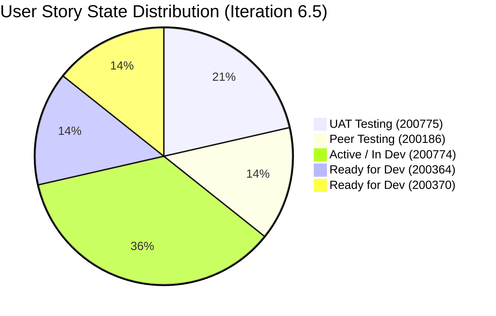
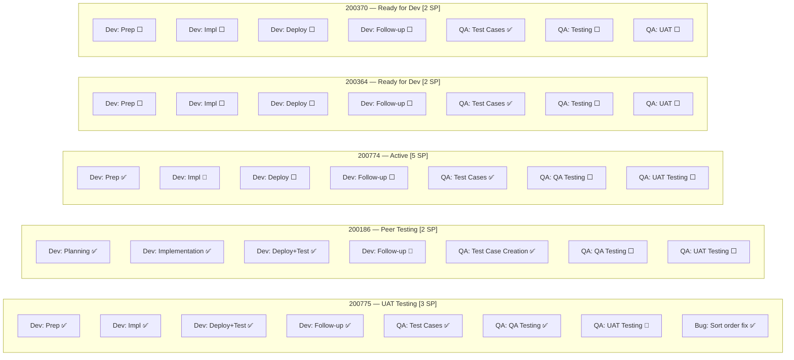
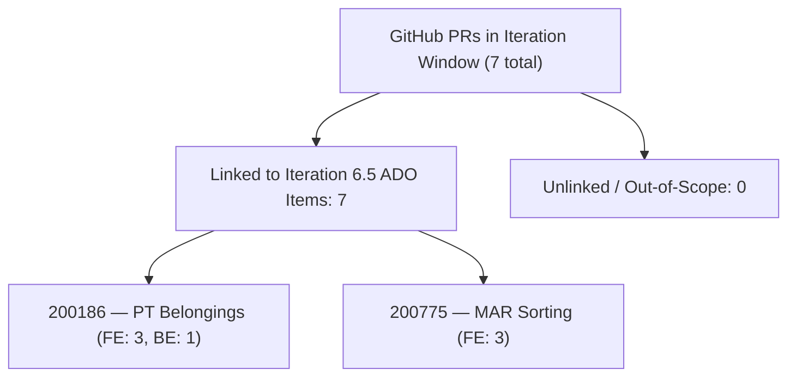
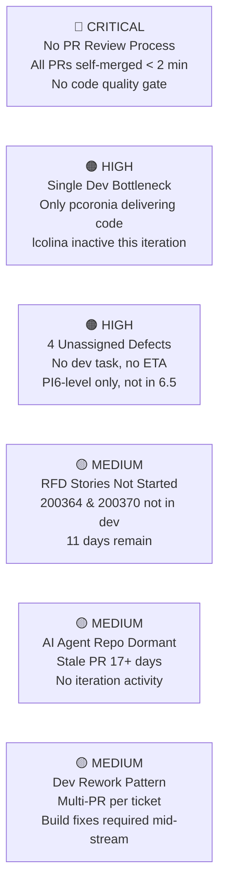

# Colina Health Team — Developer Productivity Audit

**AUDIT_20260311_2329.md**

---

## 1. Audit Metadata

| Field | Value |
|---|---|
| **Audit Date** | 2026-03-11 |
| **Audit Time** | 23:29 UTC+8 |
| **Auditor Role** | EngProd Engineer |
| **ADO Org** | `jairo` |
| **ADO Project** | Jairosoft Portfolio |
| **ADO Team** | Colina Health Product Team |
| **ADO Team Board** | [Stories and Deliverables Board](https://dev.azure.com/jairo/Jairosoft%20Portfolio/_boards/board/t/Colina%20Health%20Product%20Team/Stories%20and%20Deliverables) |
| **ADO Backlog** | Microsoft.RequirementCategory (Stories and Deliverables) |
| **Current Iteration** | Iteration 6.5 |
| **Iteration Start** | 2026-03-09 |
| **Iteration End** | 2026-03-22 |
| **Audit Window** | 2026-03-09 to 2026-03-22 (Day 3 of 14 at time of audit) |
| **GitHub Repos Audited** | `colinahealth-fe`, `colinahealth-be`, `colina-health-ai-agent-code-fixing` |
| **Prior Audit Reports** | None (this is the inaugural audit) |

> **Scope Note:** No prior audit reports exist in the `./audit/` folder. Trend and pattern comparisons are not available this cycle. Baselines established here will serve as the reference for all future audits.

> **Repos strictly scoped to:** `jairosoft-com/colinahealth-fe`, `jairosoft-com/colinahealth-be`, `jairosoft-com/colina-health-ai-agent-code-fixing`. No other repositories were analyzed.

---

## 2. Executive Summary

Iteration 6.5 is in its third day (of 14). Early delivery evidence is promising for high-priority work, but structural risks are already visible that need immediate attention.

**Strengths observed so far:**

- Ticket #200775 ([MAR/Scheduled] Sort medications by administration time) has reached UAT Testing with complete GitHub traceability — FE and BE PRs, all linked by ticket ID.
- Ticket #200186 (PT Belongings Tab) has reached Peer Testing with delivery evidence across both FE (3 PRs) and BE (1 PR).
- ADO ticket IDs are consistently used in branch names and PR titles — a strong traceability practice.
- Paul Coronia (pcoronia) is delivering at a high velocity on both FE and BE.

**Risks requiring action:**

- **No PR review activity detected.** All 7 PRs merged in the iteration window were authored and merged by pcoronia, with merge times under 2 minutes, indicating zero human review.
- **Two user stories (#200364, #200370) are still "Ready for Dev"** with no GitHub activity — development has not begun with 3 of 14 days elapsed.
- **Four new defects are unassigned** (all at PI6 level, not Iteration 6.5). No dev task has been assigned for remediation.
- **colina-health-ai-agent-code-fixing** has no iteration activity. One stale open PR (#9 — CONTRIBUTING.md) has been open since Feb 23 with no merge action.
- **Luke Colina (colinaluke-jairo)** has no GitHub activity in the iteration window despite having been active in previous sprints.
- **No evidence of branch protection or required reviewers** in any of the three repos.

---

## 3. Iteration Scope and Methodology

### 3.1 Iteration Window

The current active iteration was resolved from the Colina Health Product Team ADO settings:

```
Iteration Name : Iteration 6.5
Path           : Jairosoft Portfolio\2026-PI6\Iteration 6.5
Start Date     : 2026-03-09
Finish Date    : 2026-03-22
Duration       : 14 calendar days
Audit Point    : Day 3 (2026-03-11)
```

### 3.2 Data Sources

| Source | What Was Collected |
|---|---|
| ADO — Team Iterations API | Confirmed active iteration, start/finish dates |
| ADO — Iteration Work Items API | All parent and child work items assigned to Iteration 6.5 |
| ADO — Work Items Batch API | State, assignee, type, story points for all items |
| GitHub — colinahealth-fe | All PRs; commits on main branch |
| GitHub — colinahealth-be | All PRs; commits on main branch |
| GitHub — colina-health-ai-agent-code-fixing | All PRs; commits on main branch |

GitHub data was filtered to the iteration date window (2026-03-09 to 2026-03-22).

### 3.3 Methodology

1. Parent work items (User Stories, Spikes, Designs, Defects) were identified as the planning unit.
2. Child tasks were examined for state distribution to assess in-flight progress.
3. GitHub PRs were filtered by `created_at`, `merged_at`, or `closed_at` falling within the iteration window.
4. Traceability was assessed by matching ticket IDs found in PR titles, branch names, and commit messages to ADO work item IDs.
5. Review behavior was assessed by examining PR creation time vs. merge time.
6. Work items were classified as: `linked iteration work`, `unlinked work`, `out-of-iteration work`, or `maintenance/context only`.

---

## 4. Planned Work — ADO Backlog Analysis

### 4.1 User Stories

| ADO ID | Title | State | Assignee | SP | Tag |
|---|---|---|---|---|---|
| 200775 | [MAR/Sched] Sort medications by administration time | UAT Testing | Paul Coronia | 3 | Prio; Scheduled Medications |
| 200186 | PT Belongings Tab — Access & Manage Belongings | Peer Testing | Paul Coronia | 2 | PT Belongings |
| 200774 | [MAR/Sched] Generate scheduled meds for 7-day window | Active | Paul Coronia | 5 | Prio; Scheduled Medications |
| 200364 | PT Belongings Tab — Add Belonging Forms | Ready for Dev | Paul Coronia | 2 | PT Belongings |
| 200370 | PT Belongings Tab — Edit Belonging Forms | Ready for Dev | Paul Coronia | 2 | PT Belongings |
| **Total** | | | | **14 SP** | |

### 4.2 Other Work Items

| ADO ID | Type | Title | State | Assignee | SP |
|---|---|---|---|---|---|
| 196431 | Design | Colina Vault Overview | **Closed** | Jaszmeine Villanueva | 5 |
| 200372 | Spike | Exploratory Testing / E2E / Requirements | Active | Luzmibel Paculanang | 2.5 |
| 200490 | Spike | QA Interns Exploratory Testing | Active | Muriel Angelo Yaco | — |
| 200826 | Defect | [MAR Sched] Failed to load medication schedule | New | *(unassigned)* | — |
| 200828 | Defect | [Latest Report] Sidebar loads on Back to MAR View | New | *(unassigned)* | — |
| 200885 | Defect | [Dashboard] Cards not showing on tablet/iPad | New | *(unassigned)* | — |
| 200920 | Defect | [Forms] Internal Server Error when sorting by Name | New | *(unassigned)* | — |

> **Note:** The 4 defects are assigned to iteration path `Jairosoft Portfolio\2026-PI6` (PI level), not `\2026-PI6\Iteration 6.5`. They appear on the board but lack iteration-level assignment and have no developer task assigned.

### 4.3 Story State Distribution



### 4.4 Task Completion Heatmap by Parent Story



> ✅ Closed | 🔄 Active | ⬜ New

**Notable pattern:** QA test case creation tasks (200364-T364e, 200370-T370e) are already Closed even though the parent story is still "Ready for Dev." This indicates the QA team is proactively preparing test cases before development begins — a positive practice.

---

## 5. Developer Productivity Findings

### 5.1 Developer Summary

| Developer | GitHub Handle | Role | PRs (In Window) | Commits to Main | ADO Tasks |
|---|---|---|---|---|---|
| Paul Coronia | pcoronia | Full-Stack Dev | **7 (FE: 6, BE: 1)** | 2 | 20+ Dev tasks |
| Luzmibel Paculanang | — | QA | 0 | 0 | Active QA tasks |
| Jaszmeine Villanueva | — | Designer | 0 | 0 | Design (Closed) |
| Muriel Angelo Yaco | — | QA Intern | 0 | 0 | Spike task |
| Luke Colina | colinaluke-jairo | Developer | 0 | 0 | None assigned |
| Vicsante Aseniero | sante8jairo | Infra/AI Agent | 0 | 0 | None in scope |

### 5.2 Paul Coronia (pcoronia) — Delivery Evidence

Paul is the sole developer delivering feature code in this iteration. His output is high, spanning both FE and BE across two active user stories.

**FE Delivery (colinahealth-fe):**

| PR | Ticket | Description | Merged | Target Branch |
|---|---|---|---|---|
| #49 | 200186 | Add PatientBelonging component | 2026-03-10 08:13 | develop |
| #50 | 200186 | Segregate loading of profile image | 2026-03-10 08:31 | develop |
| #51 | 200186 | Build Fix: Comment out PDF modal rendering | 2026-03-10 08:37 | develop |
| #52 | 200775 | Update workflowDateFilter to start of day (Honolulu TZ) | 2026-03-11 08:12 | develop |
| #53 | 200775 | Update sorting to use `scheduledTime` field | 2026-03-12 01:44 | develop |
| #54 | 200775 | Update sorting to use `scheduledTime` (→ main) | 2026-03-12 05:54 | **main** |

**BE Delivery (colinahealth-be):**

| PR | Ticket | Description | Merged | Target Branch |
|---|---|---|---|---|
| #23 | 200186 | Add PatientBelongings module, entities, controller, service | 2026-03-10 08:13 | develop |

**Observations:**

- Paul delivered on three separate stories on Day 1–3 of the iteration.
- The pattern of 3 consecutive FE PRs for #200186 on the same day within 24 minutes (08:13 → 08:37) suggests incremental commits rather than a single well-bundled change — a minor efficiency concern.
- PR #54 for 200775 merged to `main` directly (not via a `passed/qa/` branch convention used previously). This is an inconsistency in the gitflow pattern.

### 5.3 Luke Colina (colinaluke-jairo) — No Iteration Activity

Luke was active in the pre-iteration period (multiple FE and BE PRs in Feb 2026), but has **no GitHub commits or PRs** in the Iteration 6.5 window. No ADO tasks are currently assigned to him in this iteration. This represents an unassigned capacity risk with 11 days remaining.

**Source:** ADO (no tasks assigned), GitHub (no commits/PRs since 2026-03-05)

### 5.4 Vicsante Aseniero (sante8jairo) — AI Agent Repo Stale

The AI agent orchestrator repo (`colina-health-ai-agent-code-fixing`) has no iteration-window activity. One PR (#9, CONTRIBUTING.md, AB#199269) has been open since 2026-02-23 with no merge — 17 days stale at time of audit.

**Source:** GitHub (last main branch commit: 2026-02-07; open PR: 2026-02-23)

---

## 6. ADO-to-GitHub Traceability Analysis

### 6.1 Traceability Matrix

| ADO ID | Story Title | GitHub FE PRs | GitHub BE PRs | Classification |
|---|---|---|---|---|
| 200775 | Sort Scheduled Meds by Admin Time | #52, #53, #54 | *(pre-iteration BE work)* | ✅ linked iteration work |
| 200186 | PT Belongings — Access & Manage | #49, #50, #51 | #23 | ✅ linked iteration work |
| 200774 | Generate Meds 7-Day Window | None yet | None yet | ⏳ in-dev, no GitHub PR yet |
| 200364 | PT Belongings — Add Forms | None | None | ⬜ Ready for Dev, no GitHub |
| 200370 | PT Belongings — Edit Forms | None | None | ⬜ Ready for Dev, no GitHub |
| 196431 | Colina Vault Overview (Design) | N/A | N/A | ✅ design deliverable, closed |
| 200826 | [MAR Sched] Load error | None | None | 🔴 defect, no dev assigned |
| 200828 | [Latest Report] Sidebar bug | None | None | 🔴 defect, no dev assigned |
| 200885 | [Dashboard] Tablet card display | None | None | 🔴 defect, no dev assigned |
| 200920 | [Forms] Sort Internal Server Error | None | None | 🔴 defect, no dev assigned |

### 6.2 Traceability Quality

Ticket IDs appear consistently in:

- **Branch names:** `feature/200186-patient-belongings-page`, `passed/qa/200775-scheduled-medication-sorting`
- **PR titles:** `[Ticket: 200775]`, `[Ticket: 200186]`
- **Commit messages:** Included PR reference and ticket ID

This is a strong traceability practice. All in-iteration GitHub delivery is traceable to an ADO work item.

### 6.3 Unlinked / Out-of-Iteration Work

No GitHub activity in the iteration window was found to be unlinked from an ADO work item. The AI Agent repo's stale open PR (#9, AB#199269) references a legitimate ADO ticket but is out-of-iteration — it belongs to a ticket not listed in the Iteration 6.5 backlog.



---

## 7. Collaboration and Review Analysis

### 7.1 PR Review Behavior — Critical Finding

All 7 PRs merged in the iteration window show zero evidence of peer review:

| PR | Created | Merged | Time-to-Merge | Reviewer Activity |
|---|---|---|---|---|
| FE #54 | 2026-03-12 05:53 | 2026-03-12 05:54 | **13 seconds** | None detected |
| FE #53 | 2026-03-12 ~01:43 | 2026-03-12 01:44 | ~1 min | None detected |
| FE #52 | 2026-03-11 ~08:11 | 2026-03-11 08:12 | ~1 min | None detected |
| FE #51 | 2026-03-10 ~08:36 | 2026-03-10 08:37 | ~1 min | None detected |
| FE #50 | 2026-03-10 ~08:30 | 2026-03-10 08:31 | ~1 min | None detected |
| FE #49 | 2026-03-10 ~08:13 | 2026-03-10 08:13 | **< 1 min** | None detected |
| BE #23 | 2026-03-10 08:12 | 2026-03-10 08:13 | **68 seconds** | None detected |

**Assessment:** PRs are being self-merged with no review time. This is a systemic gap — not isolated. Without branch protection rules requiring at least one approver, there is no quality gate before code lands in `develop` or `main`.

**Source:** GitHub (PR metadata — `created_at` vs `merged_at`)

### 7.2 Branch Convention Consistency

The team uses a Gitflow-adjacent convention with the following observed branch prefixes:

| Prefix | Purpose | Example |
|---|---|---|
| `feature/` | Development work | `feature/200186-patient-belongings-page` |
| `passed/qa/` | Promoted to main after QA pass | `passed/qa/200775-scheduled-medication-sorting` |
| `defect/` | Defect fixes (observed pre-iteration) | `defect/198376-...` |

**Issue:** FE PR #54 merged directly to `main` from a `passed/qa/` branch — which aligns with the convention. However FE PR #53 merged to `develop` from a `feature/` branch without ever going through a `passed/qa/` stage gate. The two PRs (#53 and #54) for the same ticket represent an inconsistency — direct-to-develop squash followed by a separate promote-to-main. This is functional but adds confusion.

### 7.3 AI Agent Repo — Stale Open PR

PR #9 in `colina-health-ai-agent-code-fixing` (CONTRIBUTING.md documentation, AB#199269) has been open since 2026-02-23 — 17 days without merge or close action. No reviewer activity was observed. This PR is at risk of drift and should be merged or closed.

---

## 8. Rework Signals

| Signal | Evidence | Severity |
|---|---|---|
| Multiple PRs per ticket | 200186: 3 FE PRs (build fix included); 200775: 3 FE PRs for sorting logic | Medium |
| Rapid successive FE PRs | PRs #49→#51 for same story within 24 minutes (build fix required) | Medium |
| BE pre-iteration rework | Ticket 198414 had 7 BE PRs in prior weeks (sorting logic iterated many times) | High (prior iteration carryover signal) |
| Stale open PR | AI Agent PR #9 open 17+ days | Low |
| Self-merged PRs | All iteration PRs merged without review | High (process gap, not rework per se) |
| Defects vs active stories | 4 new defects in same feature area (MAR, Dashboard, Forms) while iteration continues | Medium |

The 198414 pre-iteration history (7 BE PRs for one sorting feature) is a learning signal: complex domain logic (timezone-aware scheduling, sort order) generates high iteration churn. Ticket 200774 (generate 7-day window) is a similar domain problem and should be watched for rework patterns.

---

## 9. Risks and Bottlenecks

### Risk Register



| # | Risk | Evidence Source | Impact | Likelihood |
|---|---|---|---|---|
| R1 | No mandatory PR review — code merges without human approval | GitHub | High | Confirmed |
| R2 | Paul Coronia is sole active developer; Luke Colina has no assignments | ADO, GitHub | High | Active |
| R3 | 4 new defects (MAR, Dashboard, Forms) have no dev owner or task | ADO | Medium | Active |
| R4 | 200364 and 200370 (4 SP combined) not yet in development with Day 3 complete | ADO, GitHub | Medium | Active |
| R5 | AI Agent repo has no iteration activity; stale open PR | GitHub | Low | Active |
| R6 | Repeated PR pattern per ticket suggests incomplete PRs or unstaged work | GitHub | Medium | Observed |

---

## 10. Prioritized Remediation Actions

### Immediate (This Week)

**Action 1 — Enforce PR Reviews** `[GitHub]`
Enable branch protection on `develop` and `main` in both `colinahealth-fe` and `colinahealth-be`. Require at least 1 approver (suggest Luke Colina as reviewer since he has context). No PR should be self-merged. This is the highest-priority action — it closes a code quality gap that is currently invisible.

**Action 2 — Assign Luke Colina to Active Dev Work** `[ADO]`
Luke has capacity and context (he delivered FE and BE PRs pre-iteration). Assign him dev tasks under 200364 (Add Belonging Forms) or 200370 (Edit Belonging Forms) immediately to parallelize delivery and reduce pcoronia's single-point risk.

**Action 3 — Assign Dev Tasks to 4 Open Defects** `[ADO]`
Defects 200826, 200828, 200885, and 200920 have no assigned developer. Move them to Iteration 6.5 level and create child dev tasks. The MAR scheduled error (200826) is particularly aligned with the active MAR work in this iteration and may share root cause with 200774.

### This Iteration

**Action 4 — Merge or Close AI Agent PR #9** `[GitHub]`
PR #9 in `colina-health-ai-agent-code-fixing` has been open 17+ days. If the CONTRIBUTING.md documentation is ready, merge it. If it's blocked, close it and re-open when ready. Stale PRs create maintenance overhead and confuse the team on repo state.

**Action 5 — Monitor 200774 for Rework** `[Cross-system]`
The 7-day scheduled medication generation story (200774) is in the same timezone-sensitive domain that caused 7 BE iterations for ticket 198414. Proactively schedule a mid-iteration check-in (March 15) to assess whether implementation is on track and whether sort/scheduling logic is creating similar churn.

**Action 6 — Enforce `passed/qa/` Branch Convention** `[GitHub]`
FE PR #53 bypassed the `passed/qa/` branch stage and merged directly from `feature/` to `develop`. Add a PR template or README convention reminder to ensure `develop` ← `feature/` → peer test → `passed/qa/` → `main` flow is consistently followed. This matters especially when no reviewer is enforcing the convention.

### Process Improvement (Next PI Planning)

**Action 7 — Establish Baseline Velocity Metrics** `[ADO + GitHub]`
This is the first audit. Establish the following baselines from this iteration: total SP committed, SP delivered, PR throughput per developer, PR-to-merge cycle time. These will enable regression detection in future audits.

**Action 8 — Introduce QA Story Assignment Model** `[ADO]`
All QA tasks (exploratory testing, test case creation, UAT) are assigned to Luzmibel Paculanang and the QA intern. There is no cross-assignment or backup. If Bel is unavailable, QA work stops. Consider distributing story-level QA task ownership across at least two QA resources.

---

## 11. Appendix — Work Item Classification Table

| ADO ID | Type | State | Classification |
|---|---|---|---|
| 200775 | User Story | UAT Testing | `linked iteration work` |
| 200186 | User Story | Peer Testing | `linked iteration work` |
| 200774 | User Story | Active | `linked iteration work` |
| 200364 | User Story | Ready for Dev | `linked iteration work` (not yet started in GitHub) |
| 200370 | User Story | Ready for Dev | `linked iteration work` (not yet started in GitHub) |
| 196431 | Design | Closed | `linked iteration work` |
| 200372 | Spike | Active | `linked iteration work` |
| 200490 | Spike | Active | `linked iteration work` |
| 200826 | Defect | New | `linked iteration work` (unresolved, at PI6 level) |
| 200828 | Defect | New | `linked iteration work` (unresolved, at PI6 level) |
| 200885 | Defect | New | `linked iteration work` (unresolved, at PI6 level) |
| 200920 | Defect | New | `linked iteration work` (unresolved, at PI6 level) |

| GitHub PR | Repo | Ticket Ref | Classification |
|---|---|---|---|
| FE #49 | colinahealth-fe | 200186 | `linked iteration work` |
| FE #50 | colinahealth-fe | 200186 | `linked iteration work` |
| FE #51 | colinahealth-fe | 200186 | `linked iteration work` |
| FE #52 | colinahealth-fe | 200775 | `linked iteration work` |
| FE #53 | colinahealth-fe | 200775 | `linked iteration work` |
| FE #54 | colinahealth-fe | 200775 | `linked iteration work` |
| BE #23 | colinahealth-be | 200186 | `linked iteration work` |
| AI-Agent #9 | colina-health-ai-agent-code-fixing | AB#199269 (open, stale) | `out-of-iteration work` |

---

## 12. Baseline Register (For Future Audit Comparison)

Since this is the first audit, the following baselines are recorded for regression tracking in future iterations:

| Metric | Iteration 6.5 Baseline |
|---|---|
| Total planned SP (User Stories) | 14 SP |
| Active developers (GitHub commits) | 1 (pcoronia) |
| PRs opened in iteration window | 7 |
| PRs with evidence of peer review | 0 |
| Avg PR merge time | < 2 minutes |
| ADO-to-GitHub traceability rate | 100% (of delivered PRs) |
| Open defects at iteration start | 4 |
| Stale open PRs across repos | 1 (AI Agent #9) |
| Stories not yet in dev at Day 3 | 2 (200364, 200370) |
| Repo hygiene: branch protection | Not confirmed active |
| Repo hygiene: PR templates | Observed in BE #14 (CONTRIBUTING.md) |

---

*Report generated: 2026-03-11 | Auditor: EngProd Agent | Scope: Colina Health Product Team, Iteration 6.5 only*
