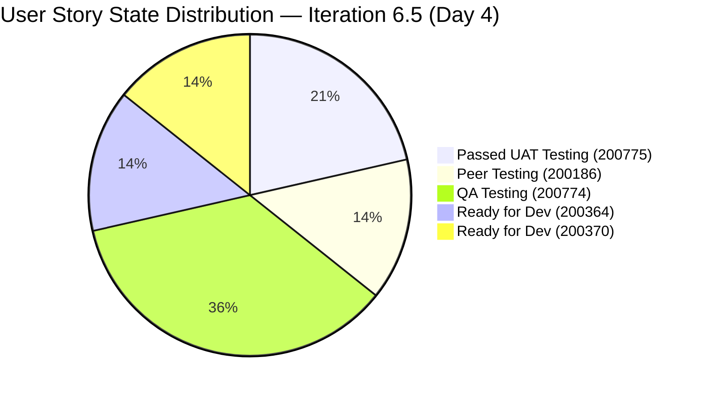
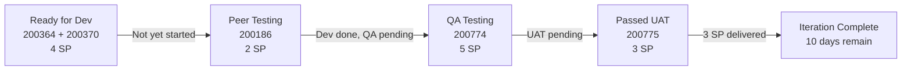
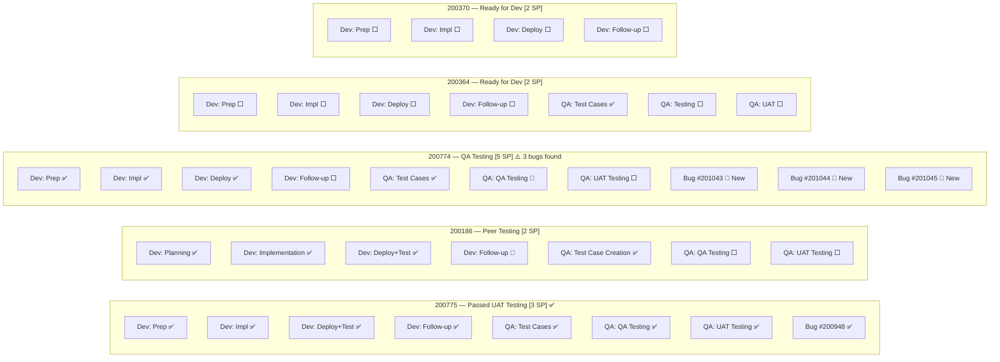
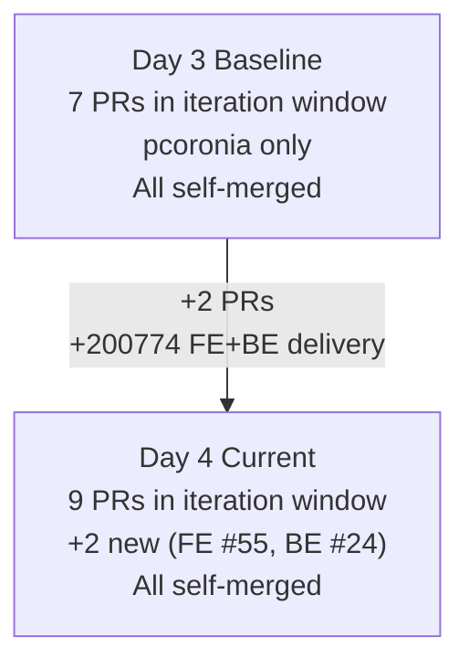
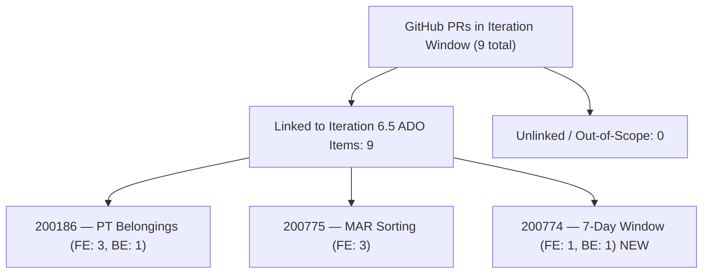
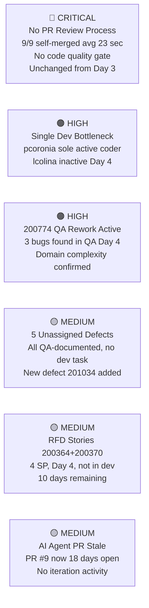
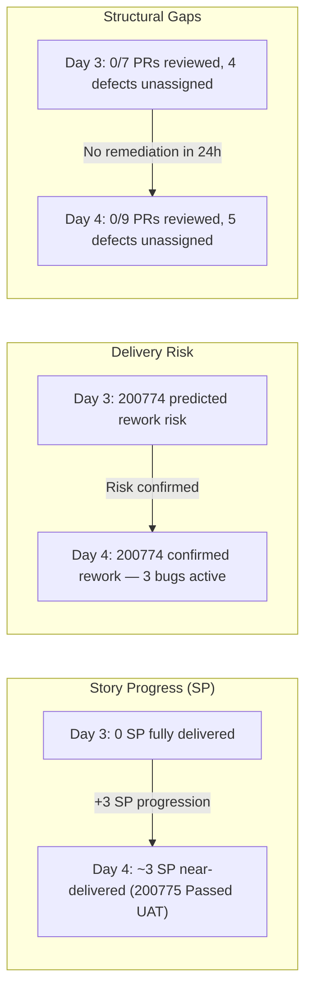

# Colina Health Team — Developer Productivity Audit
**AUDIT_20260312_1536.md**

---

## 1. Audit Metadata

| Field | Value |
|---|---|
| **Audit Date** | 2026-03-12 |
| **Audit Time** | 15:36 UTC+8 |
| **Auditor Role** | EngProd Engineer |
| **ADO Org** | `jairo` |
| **ADO Project** | Jairosoft Portfolio |
| **ADO Team** | Colina Health Product Team |
| **ADO Team Board** | [Stories and Deliverables Board](https://dev.azure.com/jairo/Jairosoft%20Portfolio/_boards/board/t/Colina%20Health%20Product%20Team/Stories%20and%20Deliverables) |
| **ADO Backlog** | Microsoft.RequirementCategory (Stories and Deliverables) |
| **Current Iteration** | Iteration 6.5 |
| **Iteration Start** | 2026-03-09 |
| **Iteration End** | 2026-03-22 |
| **Audit Window** | 2026-03-09 to 2026-03-22 (Day 4 of 14 at time of audit) |
| **GitHub Repos Audited** | `colinahealth-fe`, `colinahealth-be`, `colina-health-ai-agent-code-fixing` |
| **Prior Audit Reports** | AUDIT_20260311_2329.md (Day 3 of same iteration — baseline) |

> **Scope Note:** This is the second audit of Iteration 6.5, conducted one day after the inaugural baseline (AUDIT_20260311_2329.md). Trend and pattern comparisons are available for the first time. All findings are delta-analyzed against Day 3 where applicable.

> **Repos strictly scoped to:** `jairosoft-com/colinahealth-fe`, `jairosoft-com/colinahealth-be`, `jairosoft-com/colina-health-ai-agent-code-fixing`. No other repositories were analyzed.

---

## 2. Executive Summary

Day 4 shows meaningful positive momentum alongside the first confirmed rework prediction from the Day 3 audit.

**Positive developments since Day 3:**
- Ticket #200775 ([MAR/Sched] Sort medications by administration time) has advanced to **"Passed UAT Testing"** — the first story to pass the full QA pipeline in this iteration. All 8 child tasks are Closed. This is a completed story.
- Ticket #200774 ([MAR/Sched] Generate 7-day rolling window) progressed from "Active" to **"QA Testing"** with 2 new PRs delivered (FE #55, BE #24) on the morning of March 12. Dev tasks are complete.
- Total PRs in iteration window has grown from 7 to **9**, maintaining Paul Coronia's high delivery cadence.

**Risks confirmed or escalated:**
- **Rework prediction from Day 3 confirmed:** The Day 3 audit warned that #200774 (timezone-sensitive scheduling) was at risk for QA-phase churn, citing the 7-BE-PR rework history on ticket 198414. As predicted, QA testing on #200774 immediately surfaced **3 new Bugs** (201043, 201044, 201045) — all assigned to Paul, none yet resolved. This validates the rework risk model.
- **A 5th defect was added to the iteration**: #201034 ([MAR: PRN][Workflow] Deleted PRN medications still display in Workflow list). All 5 open defects remain in "New" state with no developer task assigned.
- **Tickets #200364 and #200370 (Add/Edit Belonging Forms, 4 SP combined) remain "Ready for Dev"** with zero GitHub activity now on Day 4. With 10 days remaining, time pressure is beginning to build.
- **Luke Colina (colinaluke-jairo)** remains unassigned and inactive — Day 4 of the iteration with no tasks and no GitHub commits.
- **AI Agent PR #9** has now been open for 18 days with no action.
- **No PR review process exists** — 9/9 iteration PRs have been self-merged, with no code review detected.

---

## 3. Iteration Scope and Methodology

### 3.1 Iteration Window

```
Iteration Name : Iteration 6.5
Path           : Jairosoft Portfolio\2026-PI6\Iteration 6.5
Start Date     : 2026-03-09
Finish Date    : 2026-03-22
Duration       : 14 calendar days
Audit Point    : Day 4 (2026-03-12)
Days Remaining : 10
```

### 3.2 Data Sources

| Source | What Was Collected |
|---|---|
| ADO — Team Iterations API | Confirmed active iteration, start/finish dates |
| ADO — Iteration Work Items API | All parent and child work items assigned to Iteration 6.5 |
| ADO — Work Items Batch API | State, assignee, type for all parent + child items |
| GitHub — colinahealth-fe | All PRs (filtered to iteration window: 2026-03-09 to present) |
| GitHub — colinahealth-be | All PRs (filtered to iteration window) |
| GitHub — colina-health-ai-agent-code-fixing | All PRs and open PR status |
| Prior Audit | AUDIT_20260311_2329.md (Day 3 baseline for delta analysis) |

### 3.3 Methodology

Same as Day 3 baseline. Delta analysis added: each finding is compared to the Day 3 state to surface trends (improving, stable, worsening) over the 24-hour window.

---

## 4. Planned Work — ADO Backlog Analysis

### 4.1 User Story State (with Day 3 Delta)

| ADO ID | Title | Day 3 State | Day 4 State | Delta | SP |
|---|---|---|---|---|---|
| 200775 | [MAR/Sched] Sort Generated Meds by Admin Time | UAT Testing | **Passed UAT Testing** | ✅ +1 stage | 3 |
| 200186 | PT Belongings Tab — Access & Manage | Peer Testing | Peer Testing | ➡️ no change | 2 |
| 200774 | [MAR/Sched] Generate Meds 7-Day Rolling Window | Active | **QA Testing** | ⬆️ +2 stages | 5 |
| 200364 | PT Belongings Tab — Add Belonging Forms | Ready for Dev | Ready for Dev | ➡️ no change | 2 |
| 200370 | PT Belongings Tab — Edit Belonging Forms | Ready for Dev | Ready for Dev | ➡️ no change | 2 |
| **Total** | | | | | **14 SP** |

### 4.2 Other Work Items (with Day 3 Delta)

| ADO ID | Type | Title | Day 3 State | Day 4 State | Delta |
|---|---|---|---|---|---|
| 196431 | Design | Colina Vault Overview | Closed | Closed | ➡️ |
| 200372 | Spike | Exploratory Testing / E2E / Requirements | Active | Active | ➡️ |
| 200490 | Spike | QA Interns Exploratory Testing | Active | Active | ➡️ |
| 200826 | Defect | [MAR Sched] Failed to load medication schedule | New | New | ⚠️ no dev task |
| 200828 | Defect | [Latest Report] Sidebar loads on Back to MAR | New | New | ⚠️ no dev task |
| 200885 | Defect | [Dashboard] Cards not showing on tablet/iPad | New | New | ⚠️ no dev task |
| 200920 | Defect | [Forms] Internal Server Error when sorting | New | New | ⚠️ no dev task |
| **201034** | **Defect** | **[MAR: PRN] Deleted PRN meds still in Workflow** | *(not on board)* | **New** | 🔴 **NEW defect** |

> **Note on defect child tasks:** All 5 defects have a "QA - Defect Creation and Replication" task assigned to Luzmibel Paculanang, all Closed. This confirms QA has documented and replicated all defects. However, none have a Dev task assigned — the fix pipeline is blocked.

### 4.3 Story State Distribution (Day 4)



### 4.4 Iteration Progress — Story Pipeline Flow



### 4.5 Task Completion Heatmap by Parent Story (Day 4)



> ✅ Closed | 🔄 Active | ⬜ New | 🔴 New Bug

---

## 5. Developer Productivity Findings

### 5.1 Developer Summary (Day 4)

| Developer | GitHub Handle | Role | PRs This Iteration | ADO Status |
|---|---|---|---|---|
| Paul Coronia | pcoronia | Full-Stack Dev | **9 (FE: 7, BE: 2)** | 20+ Dev tasks |
| Luzmibel Paculanang | — | QA Lead | 0 | Active QA tasks; defect documentation active |
| Muriel Angelo Yaco | — | QA Intern | 0 | Spike task Active |
| Jaszmeine Villanueva | — | Designer | 0 | Design task Closed |
| Luke Coronia | colinaluke-jairo | Developer | 0 | 0 tasks assigned |
| Vicsante Aseniero | sante8jairo | Infra/AI Agent | 0 | AI Agent stale PR |

### 5.2 Paul Coronia (pcoronia) — Delivery Evidence (Full Iteration Window to Day 4)

**FE Delivery (colinahealth-fe):**

| PR | Ticket | Description | Merged | Target Branch |
|---|---|---|---|---|
| #49 | 200186 | Add PatientBelonging component | 2026-03-10 08:13 | develop |
| #50 | 200186 | Segregate loading of profile image | 2026-03-10 08:31 | develop |
| #51 | 200186 | Build Fix: Comment out PDF modal rendering | 2026-03-10 08:37 | develop |
| #52 | 200775 | Update workflowDateFilter to start of day (Honolulu TZ) | 2026-03-11 08:12 | develop |
| #53 | 200775 | Update sorting to use `scheduledTime` field | 2026-03-12 01:44 | develop |
| #54 | 200775 | Update sorting (→ main via passed/qa branch) | 2026-03-12 05:54 | **main** |
| **#55** | **200774** | **Refactor date handling using Luxon / Pacific Honolulu TZ** | **2026-03-12 07:30** | **develop** |

**BE Delivery (colinahealth-be):**

| PR | Ticket | Description | Merged | Target Branch |
|---|---|---|---|---|
| #23 | 200186 | Add PatientBelongings module, entities, controller, service | 2026-03-10 08:13 | develop |
| **#24** | **200774** | **Generate 7 day medication logs without an end date** | **2026-03-12 07:30** | **develop** |

**Day 4 velocity observations:**
- Paul delivered 2 more PRs (FE #55, BE #24) on the morning of Day 4, both for #200774, enabling it to move from "Active" to "QA Testing."
- FE #55 and BE #24 were merged within 53 seconds of each other (07:30:28 and 07:30:31), indicating coordinated full-stack submission.
- The self-merge pattern continues: FE #55 merged 10 seconds after opening (07:30:18 → 07:30:28).

### 5.3 Luke Colina (colinaluke-jairo) — No Iteration Activity (Day 4 Unchanged)

Still no GitHub commits or PRs in the Iteration 6.5 window. No ADO tasks assigned. This is now Day 4 of 14 — unassigned capacity persists.

**Source:** ADO (no tasks assigned), GitHub (no commits/PRs since 2026-03-05)

### 5.4 Luzmibel Paculanang — QA Documentation Active

While Bel has no GitHub activity (expected for QA role), she has been consistently closing "QA - Defect Creation and Replication" tasks across all 5 open defects (200826, 200828, 200885, 200920, 201034) and the QA testing task for 200774 is now Active. Her work is progressing at pace with dev delivery.

**Source:** ADO (child task states)

### 5.5 Vicsante Aseniero (sante8jairo) — AI Agent Repo Still Dormant

PR #9 (CONTRIBUTING.md, AB#199269) has been open for **18 days** (since 2026-02-23) with no new activity. No iteration activity in `colina-health-ai-agent-code-fixing`.

**Source:** GitHub (PR #9 last updated: 2026-02-25)

### 5.6 PR Throughput Trend (vs Day 3 Baseline)



---

## 6. ADO-to-GitHub Traceability Analysis

### 6.1 Traceability Matrix (Day 4)

| ADO ID | Story Title | GitHub FE PRs | GitHub BE PRs | Classification |
|---|---|---|---|---|
| 200775 | Sort Scheduled Meds by Admin Time | #52, #53, #54 | *(pre-iteration BE)* | ✅ `linked iteration work` |
| 200186 | PT Belongings — Access & Manage | #49, #50, #51 | #23 | ✅ `linked iteration work` |
| 200774 | Generate Meds 7-Day Window | **#55 (NEW)** | **#24 (NEW)** | ✅ `linked iteration work` |
| 200364 | PT Belongings — Add Forms | None | None | ⬜ `Ready for Dev, no GitHub` |
| 200370 | PT Belongings — Edit Forms | None | None | ⬜ `Ready for Dev, no GitHub` |
| 200826–920 | 4 pre-existing Defects | None | None | 🔴 `defect, no dev assigned` |
| 201034 | NEW: PRN deleted meds in Workflow | None | None | 🔴 `new defect, no dev assigned` |
| AI #9 | AB#199269 CONTRIBUTING.md (stale open) | N/A | N/A | `out-of-iteration work` |

### 6.2 Traceability Quality

**Consistent and strong.** Both new PRs (FE #55, BE #24) follow the same ticket-ID-in-title convention:
- Branch name: `feature/200774-rolling-7-day-log-generation`
- PR title: `[Ticket: 200774] [Frontend/Backend] ...`

ADO-to-GitHub traceability rate for delivered PRs remains **100%** for in-iteration work.

### 6.3 Traceability Flow Diagram (Day 4)



---

## 7. Collaboration and Review Analysis

### 7.1 PR Review Behavior — Critical Finding (Unchanged from Day 3)

All 9 PRs merged in the iteration window show zero evidence of peer review. The two new Day 4 PRs follow the same pattern:

| PR | Opened | Merged | Time-to-Merge | Review Activity |
|---|---|---|---|---|
| **FE #55** | 2026-03-12 07:30:18 | 2026-03-12 07:30:28 | **10 seconds** | None detected |
| **BE #24** | 2026-03-12 07:29:38 | 2026-03-12 07:30:31 | **53 seconds** | None detected |
| FE #54 | 2026-03-12 05:53:59 | 2026-03-12 05:54:12 | 13 seconds | None detected |
| FE #53 | 2026-03-12 01:44:12 | 2026-03-12 01:44:20 | 8 seconds | None detected |
| FE #52 | 2026-03-11 08:12:26 | 2026-03-11 08:12:36 | 10 seconds | None detected |
| FE #51 | 2026-03-10 08:37:03 | 2026-03-10 08:37:13 | 10 seconds | None detected |
| FE #50 | 2026-03-10 08:31:28 | 2026-03-10 08:31:46 | 18 seconds | None detected |
| FE #49 | 2026-03-10 08:13:34 | 2026-03-10 08:13:48 | 14 seconds | None detected |
| BE #23 | 2026-03-10 08:12:42 | 2026-03-10 08:13:50 | 68 seconds | None detected |

**Average time-to-merge (all 9 PRs): ~23 seconds.**

The no-review pattern is systemic and has not changed since Day 3. No branch protection enforcement has been implemented in the 24-hour window between audits.

**Source:** GitHub (PR metadata — `created_at` vs `merged_at`)

### 7.2 QA Parallelism — Positive Signal

One positive collaboration pattern has emerged: Bel (QA) is keeping pace with Paul's delivery by immediately creating defect documentation tasks after QA testing surfaces bugs. The Day 4 snapshot shows:
- Paul completes implementation → Bel closes QA test case creation task → Bel opens QA Testing task → bugs surfaced and created under the parent story, assigned back to Paul.

This lightweight Dev↔QA loop is functioning within the ADO task structure, even without branch protection or code review tooling.

### 7.3 AI Agent Repo — Stale Open PR (Day 18)

PR #9 in `colina-health-ai-agent-code-fixing` (CONTRIBUTING.md, AB#199269) is now **18 days** old. No new commits, no reviewer activity, no response to the stale state. Risk of drift increases with each passing day.

---

## 8. Rework Signals

### 8.1 Day 3 Rework Prediction — Confirmed on Day 4

The Day 3 audit explicitly predicted:
> *"The 7-day scheduled medication generation story (#200774) is a similar domain problem [to 198414] and should be watched for rework patterns."*

**Day 4 outcome:** QA testing on #200774 surfaced 3 new Bugs in the first day of QA:

| Bug ID | Title | Assignee | State |
|---|---|---|---|
| 201043 | Wrong end date reflected in Medication table after saving new medication order | Paul Coronia | New |
| 201044 | Medication occurrences not generated up to the selected end date | Paul Coronia | New |
| 201045 | Medications without end date do not generate occurrences for full 7-day window | Paul Coronia | New |

All three are scoped to end-date calculation and 7-day window generation — the core domain complexity of the ticket. This is a domain-level rework signal, not a process anomaly. The timezone-aware, rolling-window scheduling domain has now generated QA-phase bugs across two consecutive iteration tickets (198414 in prior iterations, 200774 now).

**Implication:** The "Dev - Testing and Follow-up fixes" child task (200935) for #200774 is still in "New" state. Paul will need to work these bugs back before #200774 can proceed to UAT. At 5 SP and with complex domain logic, this story carries the highest iteration completion risk.

### 8.2 Rework Signal Summary

| Signal | Evidence | Day 3 Status | Day 4 Status |
|---|---|---|---|
| QA-phase domain bugs on 200774 | 3 new bugs (201043, 201044, 201045) | Predicted | ✅ Confirmed |
| Multiple PRs per ticket | 200186: 3 FE; 200775: 3 FE; 200774: 1 FE + 1 BE (Day 4) | Medium | Medium |
| Self-merged PRs | 9/9 iteration PRs, avg <23 sec | High | High (unchanged) |
| Stale open PR (AI Agent) | PR #9 open 18 days | Low | Low (unchanged) |
| 4+1 defects, no dev owner | 5 defects, all QA-documented, zero dev tasks | Medium | Medium (5th added) |

---

## 9. Risks and Bottlenecks

### 9.1 Risk Register (Day 4 Update)



| # | Risk | Source | Day 3 Assessment | Day 4 Assessment | Trend |
|---|---|---|---|---|---|
| R1 | No PR review — all PRs self-merged in <30 sec | GitHub | Critical | Critical | ➡️ Unchanged |
| R2 | Paul sole active developer; Luke has no assignments | ADO + GitHub | High | High | ➡️ Unchanged |
| R3 | 200774 QA rework: 3 domain-level bugs surfaced | ADO | Predicted | ✅ Confirmed, Active | ⬆️ Escalated |
| R4 | 5 defects documented by QA, no dev task or owner | ADO | Medium (4 defects) | Medium (5 defects +1) | ⬆️ Growing |
| R5 | 200364 + 200370 (4 SP) not yet in dev, Day 4/14 | ADO + GitHub | Medium | Medium | ⬆️ Pressure building |
| R6 | AI Agent PR stale, Day 18 | GitHub | Low | Low (Day 18) | ⬆️ Aging |

### 9.2 Capacity Risk Projection

With 10 days remaining:
- Paul is managing: 200774 (QA rework), 200186 (Peer Testing follow-up), 200364 (not started), 200370 (not started), and 3 new bugs under 200774.
- If 200774 bug fixes consume 1–2 days and 200364/200370 each require 2+ days of dev, the remaining capacity window is tight.
- Luke Colina has unassigned availability and demonstrated FE/BE competence in the pre-iteration period. Continued non-assignment is an unmitigated capacity risk.

---

## 10. Prioritized Remediation Actions

### Immediate (Today / Day 4)

**Action 1 — Assign Dev Tasks to All 5 Open Defects** `[ADO]` *(Carried from Day 3)*
All 5 defects (200826, 200828, 200885, 200920, 201034) have been QA-documented and replicated. The dev pipeline is blocked — no developer has been assigned to fix any of them. Assign Luke Colina to at least 2 of these defects to put his capacity to use and unblock QA from waiting on fixes.

**Action 2 — Activate Luke Colina on 200364 or a Defect Fix** `[ADO]`
Luke has been inactive for 4 days of a 14-day iteration. Assign him to dev tasks under #200364 (Add Belonging Forms) or one of the open defects. His FE/BE track record is proven. Every unassigned day at this stage is a delivery risk.

**Action 3 — Triage 200774 Bug Backlog with Paul** `[ADO + Cross-system]`
Bugs 201043, 201044, and 201045 are new and unacknowledged (all "New"). Paul needs to assess whether these bugs are blockers for UAT or can be fixed alongside follow-up work. Schedule a 15-minute triage today to confirm the fix plan and update the "Dev - Testing and Follow-up fixes" child task (200935) from "New" to "Active."

### This Iteration

**Action 4 — Enforce PR Reviews on `develop` and `main`** `[GitHub]` *(Carried from Day 3)*
Nine iteration PRs have been merged without any human review. Enable branch protection on `develop` and `main` in `colinahealth-fe` and `colinahealth-be`. Require at least 1 approver. This is the highest-impact single change the team can make to code quality and risk management. Not implementing it 24 hours after the Day 3 audit identified it as CRITICAL is itself a risk signal.

**Action 5 — Merge or Close AI Agent PR #9** `[GitHub]` *(Carried from Day 3)*
PR #9 (CONTRIBUTING.md) is now 18 days stale. No action has been taken. If the documentation is ready, merge it. If it's not, close it and reopen when ready. 18-day open PRs create overhead and noise in the repo.

**Action 6 — Monitor 200774 for UAT Readiness by March 16** `[Cross-system]`
Given the 3 bugs surfaced in QA, a hard milestone check is recommended: if Paul has not resolved the 3 bugs and the story is not in UAT Testing by March 16 (Day 8, midpoint of iteration), escalate to Karl/Ramon for sprint re-scoping or carryover planning.

### Process Improvement (Ongoing)

**Action 7 — Address Single-Developer Concentration Risk** `[ADO]`
100% of iteration GitHub delivery is concentrated in one developer. Even one day of unplanned absence by Paul would halt all feature delivery. Activating Luke Colina is not just a capacity optimization — it is a delivery resilience requirement.

**Action 8 — Track Defect-to-Dev Assignment as a Sprint Health KPI** `[ADO]`
The pattern of defects being QA-documented but having no dev task assigned is now confirmed across 5 defects spanning 2+ sprint days. Introduce a daily standup check: "Do all active defects have a developer assigned?" This is a simple, low-overhead health indicator.

---

## 11. Trends and Learnings (Day 3 → Day 4 Comparative Analysis)

This section is available for the first time, enabled by the Day 3 baseline.

### 11.1 What Improved

| Signal | Day 3 | Day 4 |
|---|---|---|
| Stories in Passed UAT or better | 0 | 1 (#200775 ✅) |
| Stories in QA Testing | 1 (#200775) | 1 (#200774) |
| Stories in Active/In Dev | 1 (#200774) | 0 |
| PR throughput (cumulative) | 7 | 9 |
| 200774 progress | Active → 0 PRs delivered in iteration | QA Testing → 2 new PRs |
| QA documentation of defects | Partial (some tasks not seen) | All 5 defects fully QA-documented by Bel |

### 11.2 What Did Not Change

| Signal | Day 3 | Day 4 |
|---|---|---|
| PR review rate | 0% | 0% |
| Self-merge time | < 2 min average | ~23 sec average |
| Luke Colina task assignment | None | None |
| Branch protection enforcement | Not confirmed | Not confirmed |
| Stories not started (200364, 200370) | 2 | 2 |
| AI Agent PR stale | 17 days | 18 days |
| Defects with no dev task | 4 | 5 (+1) |

### 11.3 What Worsened

| Signal | Day 3 | Day 4 |
|---|---|---|
| Open defects | 4 | 5 (+ 201034) |
| QA-phase bugs under 200774 | Predicted | 3 confirmed bugs active |
| Capacity concentration | 1 dev | 1 dev (unchanged, Day 4 now) |
| AI Agent PR staleness | 17 days | 18 days |

### 11.4 First-Iteration Trend Visualization



---

## 12. Appendix — Work Item Classification Table (Day 4)

| ADO ID | Type | State | Classification |
|---|---|---|---|
| 200775 | User Story | Passed UAT Testing | `linked iteration work` — effectively complete |
| 200186 | User Story | Peer Testing | `linked iteration work` — in QA pipeline |
| 200774 | User Story | QA Testing | `linked iteration work` — QA rework active |
| 200364 | User Story | Ready for Dev | `linked iteration work` — not yet started |
| 200370 | User Story | Ready for Dev | `linked iteration work` — not yet started |
| 196431 | Design | Closed | `linked iteration work` — complete |
| 200372 | Spike | Active | `linked iteration work` |
| 200490 | Spike | Active | `linked iteration work` |
| 200826–920 | 4 Defects | New | `linked iteration work` — unresolved, no dev task |
| 201034 | Defect | New | `linked iteration work` — NEW, no dev task |

| GitHub PR | Repo | Ticket | Classification |
|---|---|---|---|
| FE #49–51 | colinahealth-fe | 200186 | `linked iteration work` |
| FE #52–54 | colinahealth-fe | 200775 | `linked iteration work` |
| FE #55 | colinahealth-fe | 200774 | `linked iteration work` — NEW Day 4 |
| BE #23 | colinahealth-be | 200186 | `linked iteration work` |
| BE #24 | colinahealth-be | 200774 | `linked iteration work` — NEW Day 4 |
| AI-Agent #9 | colina-health-ai-agent-code-fixing | AB#199269 | `out-of-iteration work` (stale, open 18 days) |

---

## 13. Metrics Tracker (Iteration 6.5 — Rolling)

| Metric | Day 3 Baseline | Day 4 Current | Trend |
|---|---|---|---|
| Total planned SP (User Stories) | 14 SP | 14 SP | ➡️ |
| SP in Passed UAT or better | 0 | ~3 (200775) | ⬆️ |
| Active developers (GitHub commits) | 1 (pcoronia) | 1 (pcoronia) | ➡️ |
| PRs merged in iteration window | 7 | 9 | ⬆️ |
| PRs with peer review evidence | 0 | 0 | ➡️ |
| Avg PR merge time | < 2 min | ~23 sec | ⬇️ (faster self-merge) |
| ADO-to-GitHub traceability rate | 100% | 100% | ➡️ |
| Open defects | 4 | 5 | ⬇️ |
| QA-documented defects (Bel tasks closed) | Partial | 5/5 | ⬆️ |
| Dev-assigned defects | 0 | 0 | ➡️ |
| Stories not yet in dev | 2 (200364, 200370) | 2 (200364, 200370) | ➡️ |
| Stale open PRs across repos | 1 (AI Agent #9, Day 17) | 1 (AI Agent #9, Day 18) | ⬇️ |
| QA-phase bugs found under active story | 0 | 3 (under 200774) | ⬇️ |
| Repo hygiene: branch protection | Not confirmed active | Not confirmed active | ➡️ |

---

*Report generated: 2026-03-12 15:36 UTC+8 | Auditor: EngProd Agent | Scope: Colina Health Product Team, Iteration 6.5 only*
*Compared against: AUDIT_20260311_2329.md (Day 3 baseline, inaugural audit)*
