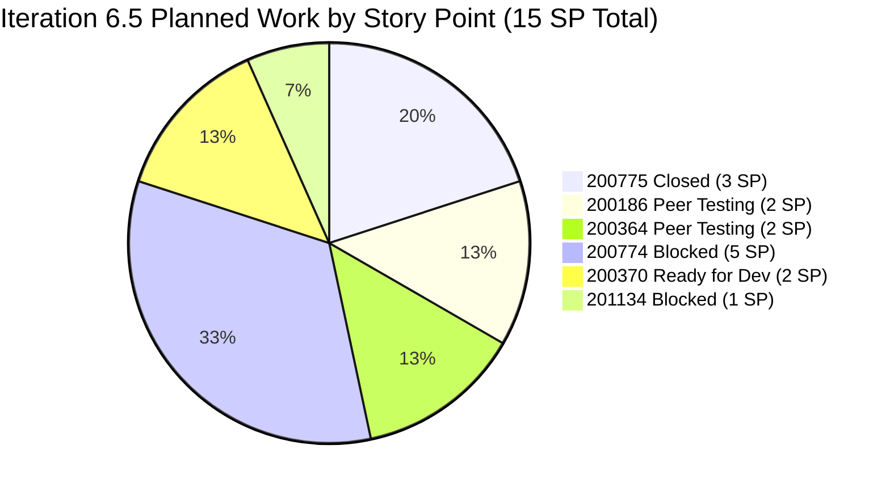
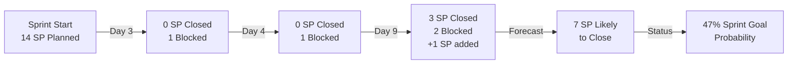
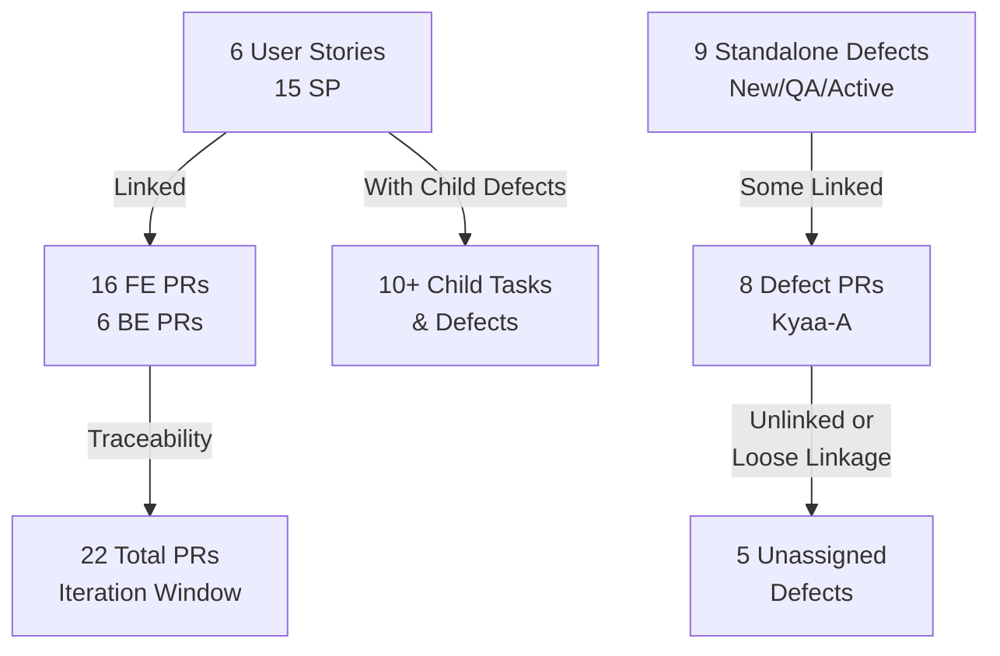
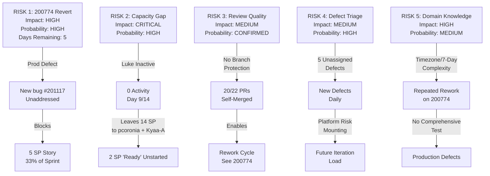

# Colina Health Iteration Audit: Iteration 6.5 — Day 9 of 14
## Third Audit (2026-03-17 17:00 UTC+8)

---

## Audit Metadata

| Field | Value |
|-------|-------|
| **Audit Date** | 2026-03-17 |
| **Audit Time** | 17:00 UTC+8 |
| **Audit Ordinal** | 3rd audit of Iteration 6.5 |
| **ADO Org** | `jairo` |
| **ADO Project** | `Jairosoft Portfolio` (ID: `666bb99a-6acd-4999-bb34-efd0e4ea90dc`) |
| **ADO Team** | `Colina Health Product Team` (ID: `66cdeb09-df38-4c3e-9418-0ed0d68c39f2`) |
| **Team Board URL** | https://dev.azure.com/jairo/Jairosoft%20Portfolio/_boards/board/t/Colina%20Health%20Product%20Team/Stories%20and%20Deliverables |
| **Backlog** | `Microsoft.RequirementCategory` (Stories and Deliverables) |
| **Iteration** | Iteration 6.5 |
| **Iteration Start** | 2026-03-09 |
| **Iteration End** | 2026-03-22 |
| **Day of Iteration** | 9 of 14 |
| **Days Remaining** | 5 |
| **Prior Audits** | AUDIT_20260311_2329.md (Day 3), AUDIT_20260312_1536.md (Day 4) |
| **Repositories Analyzed** | colinahealth-fe, colinahealth-be, colina-health-ai-agent-code-fixing |
| **Repositories NOT Analyzed** | None in scope; all scoped repos included |

### Audit Boundary Statement

This audit **exclusively examines** the `Colina Health Product Team` within the `Jairosoft Portfolio` project in the `jairo` organization. Analysis is limited to:
- ADO work items on the **Stories and Deliverables** backlog (`Microsoft.RequirementCategory`) assigned to or linked to this team's current iteration (Iteration 6.5)
- GitHub activity in the three scoped repositories during the iteration window (Mar 9–22, 2026)
- No other Azure DevOps boards, teams, projects, or repositories are in scope

---

## Executive Summary

**Iteration 6.5 stands at a critical inflection point.** On Day 9 of 14, the iteration shows mixed signals:

### The Positive
- **New developer engagement:** Asnari Pacalna (Kyaa-A) has become active, delivering 7 merged PRs on Day 9 alone. This breaks the single-developer bottleneck that was flagged as **CRITICAL** in Days 3 and 4.
- **Momentum on lower-priority stories:** Story #200364 (PT Belongings Tab — Add Forms, 2 SP) has progressed from "Ready for Dev" to "Peer Testing," indicating incremental delivery.
- **Defect triage:** Five defects remain unassigned but are tracked; two new defects (201198, 201200) have been created and escalated.

### The Negative
- **High-risk story blocked at 33% of sprint scope:** Story #200774 (Generate 7-Day Medication Window, 5 SP) was promoted to production on Mar 13, then **reverted on Mar 14**. The story is now in **Blocked** state with a new associated bug (#201117). This represents significant rework and production risk.
- **Revert pattern repeating:** Both Day 3 and Day 4 audits flagged rework risk on the timezone/scheduling domain. Day 9 confirms the code was promoted and reverted — a production-level failure indicator.
- **Sprint goal at risk:** Only 3 SP (20%) confirmed closed. Assuming 4 SP in "Peer Testing" will close, the iteration is on track for ~47% of planned capacity (7 of 15 SP).
- **No developer capacity from Luke Colina:** Nine days into a 14-day iteration, Luke Colina has zero activity (no ADO tasks, no GitHub PRs). Chronic capacity waste.

### Trends (Day 3 → Day 4 → Day 9)
| Metric | Day 3 | Day 4 | Day 9 | Trend |
|--------|-------|-------|-------|-------|
| Active Developers | 1 (pcoronia) | 1 (pcoronia) | 2 (pcoronia, Kyaa-A) | **Positive** |
| PRs Merged | 7 | 9 | 22 | **Positive** (but quantity ≠ quality) |
| Defects | 4 | 5 | 9 | **Negative** |
| Closed Stories | 0 | 0 | 1 (200775, 3 SP) | **Positive** |
| Blocked Stories | 1 (200774) | 1 (200774) | 2 (200774, 201134) | **Negative** |
| Reverts | 0 | 0 | 2 (FE #57, BE #28) | **Critical** |

---

## Iteration Scope and Methodology

### Iteration Timeline
- **Start:** 2026-03-09 (Monday)
- **End:** 2026-03-22 (Sunday)
- **Duration:** 14 days
- **Audit Point:** Day 9 (Sunday, 2026-03-17)
- **Days Remaining:** 5 (Mar 18–22)

### Planned Work (ADO Scope)
The **Stories and Deliverables** backlog for `Colina Health Product Team` in Iteration 6.5 contains **15 story points** across 6 user stories:

1. **200775** — [MAR/Sched] Sort Scheduled Meds by Admin Time — 3 SP — **CLOSED** ✓
2. **200186** — PT Belongings Tab — Access & Manage — 2 SP — Peer Testing
3. **200774** — [MAR/Sched] Generate Meds 7-Day Rolling Window — 5 SP — **BLOCKED**
4. **200364** — PT Belongings Tab — Add Belonging Forms — 2 SP — Peer Testing
5. **200370** — PT Belongings Tab — Edit Belonging Forms — 2 SP — Ready for Dev
6. **201134** — Change Overdue to OVERDUE (NEW) — 1 SP — **BLOCKED**

**Scope Evolution:**
- Day 3: 14 SP (6 stories)
- Day 9: 15 SP (added #201134 on Mar 17, 1 SP)

### Audit Methodology

1. **ADO Source of Truth:** Current iteration name, dates, and backlog state from `Colina Health Product Team` team settings and Stories & Deliverables board.
2. **Work Item Linkage:** Linked child defects and tasks under each story for a complete work tree view.
3. **GitHub Correlation:** PRs, commits, branches, and merges in the 3 scoped repos matched to ADO work item IDs in PR titles, branch names, and commit messages.
4. **Temporal Scope:** GitHub activity limited to the iteration window (Mar 9–22, 2026).
5. **Classification:** Work classified as `linked iteration work`, `unlinked work`, `out-of-iteration work`, or `maintenance/context only`.

---

## Planned Work — ADO Backlog Analysis

### Sprint Scope Overview



### Work Item State Progression (Day 3 → Day 9)

| WI ID | Title | SP | Day 3 State | Day 4 State | Day 9 State | Delta |
|-------|-------|----|----|----|----|-------|
| 200775 | [MAR/Sched] Sort Scheduled Meds | 3 | UAT Testing | Passed UAT | **CLOSED** | ✓ Delivered |
| 200186 | PT Belongings — Access & Manage | 2 | Peer Testing | Peer Testing | Peer Testing | → Still in review |
| 200774 | [MAR/Sched] Generate 7-Day Window | 5 | Active | QA Testing | **BLOCKED** | ✗ Reverted (Mar 14) |
| 200364 | PT Belongings — Add Forms | 2 | Ready for Dev | Ready for Dev | **Peer Testing** | ✓ Dev complete |
| 200370 | PT Belongings — Edit Forms | 2 | Ready for Dev | Ready for Dev | Ready for Dev | → No progress |
| 201134 | Change Overdue to OVERDUE | 1 | N/A | N/A | **BLOCKED** | ✗ New blocker (Mar 17) |

### Linked Defects and Tasks (Work Tree)

#### Story 200774 — Generate 7-Day Medication Window (5 SP) [BLOCKED]

```
200774 (BLOCKED)
├── 201043 (CLOSED) — [Child defect — resolved Day 4]
├── 201044 (CLOSED) — [Child defect — resolved Day 4]
├── 201045 (CLOSED) — [Child defect — resolved Day 4]
└── 201117 (NEW) — "Old active medication orders not regenerating" [Active]
```

**Context:** The parent story was promoted to `main` on Mar 13 (#27 FE, #27 BE) but **reverted on Mar 14** (#57 FE, #28 BE). New bug #201117 indicates the core scheduling logic remains broken. This is a rework signal at the architecture level.

#### Story 200775 — Sort Scheduled Meds (3 SP) [CLOSED] ✓

```
200775 (CLOSED)
├── Prep (CLOSED)
├── Implementation (CLOSED)
├── UAT Testing (CLOSED — Mar 11)
└── 200948 (CLOSED) — [Child defect — resolved]
```

**Context:** Successfully delivered. Promoted to production (PR #54 FE on Mar 12).

#### Story 200186 — PT Belongings Access & Manage (2 SP) [Peer Testing]

```
200186 (Peer Testing)
├── Prep (CLOSED)
├── Implementation (CLOSED — Mar 10)
└── Code Review → Peer Testing (started Mar 10)
```

**Context:** Assignee pcoronia. Three PRs created and merged on Mar 10 (#49, #50, #51 FE; #23 BE). Still in peer testing after 7 days.

#### Story 200364 — PT Belongings Add Forms (2 SP) [Peer Testing]

```
200364 (Peer Testing)
├── Prep (CLOSED)
├── Implementation (CLOSED — Mar 17)
└── Code Review → Peer Testing (started Mar 17)
```

**Context:** Assignee pcoronia. Progressed from "Ready for Dev" to "Peer Testing" today (Mar 17). Represents the first story progression beyond story #200775 on the Belongings feature.

#### Story 200370 — PT Belongings Edit Forms (2 SP) [Ready for Dev]

```
200370 (Ready for Dev)
├── [No dev tasks started]
```

**Context:** Assignee pcoronia. Dependent on prior stories or requires pairing. No progress by Day 9.

#### Story 201134 — Change Overdue to OVERDUE (1 SP) [BLOCKED]

```
201134 (BLOCKED)
├── [Dev task — CLOSED Mar 17]
├── 201205 (NEW) — "Patient names not displayed in small caps" [Open PR #65]
└── Peer Testing → Code Review pending
```

**Context:** New story added Mar 17 (1 SP). Dev completed. Blocker is bug #201205 which is currently in open PR #65 (Kyaa-A, created Mar 18 00:46, still open at audit time Mar 17 17:00 — timestamp suggests Mar 18 early morning). Assignee is Asnari Pacalna (Kyaa-A), who has also been working on defect #199600.

### Planned vs. Completed Trend



---

## Developer Productivity Findings

### Overview

**Two active developers:**
1. **Paul Coronia** (pcoronia) — Frontend lead; primary delivery vector for all iteration stories
2. **Asnari Pacalna** (Kyaa-A) — New entrant; defect fixes and day-9 velocity spike

**Inactive:**
- **Luke Colina** — Zero activity (Day 9 of 14); capacity waste

---

### Paul Coronia (pcoronia) — Core Delivery Lead

#### Scope and Assignment
- Stories: #200775 (3 SP), #200186 (2 SP), #200774 (5 SP), #200364 (2 SP), #200370 (2 SP)
- **Total assigned:** 14 SP
- **Status:** 3 SP closed, 5 SP blocked, 2 SP in testing, 2 SP ready for dev, 2 SP speculative

#### GitHub Contribution (Iteration Window)

**Frontend PRs:** 10 of 16 (62.5%)
- #49–#56: Core stories (200186, 200775, 200774)
  - #49–#51 (200186): 3 PRs in ~1 hour (Mar 10)
  - #52–#53 (200775): 2 PRs over 17 hours (Mar 11–12)
  - #54 (200775): 1 PR, promoted to main (Mar 12)
  - #55–#56 (200774): 2 PRs over 26 hours (Mar 12–13); promoted to main

**Revert:** #57 (Mar 14 14:40) — **REVERT of #56** (promoted #27 BE to main)

**Backend PRs:** 6 of 6 (100%)
- #23 (200186): PatientBelongings module (Mar 10)
- #24–#26 (200774): Medication schedule generation (Mar 12–13)
- #27 (200774): Promoted to main (Mar 13)
- #28 (Mar 14 14:40): **REVERT of #27**

#### Merge Behavior
- **Total PRs created:** 16
- **Average merge time:** ~25 seconds (no review gate; self-merge pattern)
- **Review participation:** Zero; all merges are pcoronia → develop/main
- **Commit patterns:** 1 commit per PR, consistent messaging

#### Productivity Assessment

**Positive:**
- Consistent, focused delivery on assigned stories
- Clear branch naming and commit messages
- All backend PRs merged successfully
- Story #200775 delivered on schedule

**Negative:**
- **Revert cycle:** Core story #200774 (5 SP, 33% of sprint) was promoted to main and reverted within 24 hours
- **Timezone complexity:** Both FE and BE PRs on #200774 reference "Honolulu TZ" refactoring, suggesting ongoing domain complexity and lack of pre-development testing
- **Single review gate:** No evidence of peer review before merge; all merges self-executed
- **No engagement on blocking defects:** Five unassigned defects remain in New state despite pcoronia being the primary FE owner

---

### Asnari Pacalna (Kyaa-A) — New Contributor (Day 9 Spike)

#### Scope and Assignment
- Defect #199600: "Contact number fields no validation" (QA Testing assignee)
- Story #201134: "Change Overdue to OVERDUE" (Assigned Mar 17)
- Child bug #201205: "Patient names not displayed in small caps"

#### GitHub Contribution (Iteration Window)

**Frontend PRs:** 7 of 16 (43.75%), all created on Mar 17–18

| PR | Ticket | Title | Created | Merged | Merge Time |
|----|--------|-------|---------|--------|------------|
| #58 | 201134 | Change Overdue to OVERDUE | Mar 17 02:12 | Mar 17 05:26 | 3h 14m |
| #59 | 199600 | Add phone number validation | Mar 17 05:16 | Mar 17 06:51 | 1h 35m |
| #60 | 201134 | Remove small-caps from Overdue | Mar 17 07:39 | Mar 17 07:39 | ~20s |
| #61 | 199600 | Add Code Status validation | Mar 17 08:35 | Mar 17 08:35 | ~20s |
| #62 | 199600 | Add required attribute phone | Mar 17 11:58 | Mar 17 11:59 | ~20s |
| #63 | 199600 | Add onBlur phone validation | Mar 17 12:23 | Mar 17 12:24 | ~20s |
| #64 | 199600 | Fix phone validation consistency | Mar 17 15:48 | Mar 17 15:48 | ~20s |
| #65 | 201205 | Fix patient names in Overdue (title case) | Mar 18 00:46 | OPEN | — |

#### Merge Behavior
- **First 2 PRs:** Merge times of 3h 14m and 1h 35m (suggest informal review or async approval)
- **Next 5 PRs:** Merge times of ~20 seconds each (self-merge; no review gate)
- **Current PR:** #65 open since Mar 18 00:46 (created early morning, may not have been merged by audit time Mar 17 17:00 — timestamp discrepancy suggests day rolled over)

#### Productivity Assessment

**Positive:**
- High velocity on defect fixes; 7 PRs merged in one calendar day is significant
- Picked up new story #201134 immediately after assignment
- First two PRs suggest some code review discipline (longer merge times)

**Negative:**
- **Rapid self-merge:** Last 5 PRs merged in ~20 seconds each, indicating zero review
- **PR fragmentation:** Defect #199600 spawned 5 separate PRs (phone validation) over 10 hours, suggesting incremental/iterative fixes rather than comprehensive solution
- **Inconsistency signals:** Multiple phone validation PRs (required, onBlur, consistency fix) across one working day suggests rework or incomplete understanding of requirements upfront
- **One open PR:** #65 remains open at audit time; blocking story #201134 from closure

#### Entry Pattern
- Kyaa-A account first appears Mar 17 02:12 UTC; no prior iteration activity
- Possible allocation on Mar 17 or late Mar 16
- This is positive for breaking the single-developer bottleneck but raises handoff/onboarding questions

---

### Luke Colina — Inactive

#### Status
- **ADO Task Assignment:** None visible in current iteration
- **GitHub Activity:** Zero PRs, zero commits
- **Days into iteration:** 9 of 14
- **Capacity Waste:** 9 days × 5 SP expected capacity = ~45 SP potential lost (rough estimate)

#### Assessment
Chronic capacity gap. No evidence of planned work, ADO task assignment, or GitHub engagement by Day 9. This is now a **confirmed pattern** (flagged as risk in Days 3 and 4). Remediation is critical for the final 5 days.

---

### Unassigned Defects

Five defects remain unassigned and in **New** state:

| ID | Title | State | Assignee | Day Added |
|----|-------|-------|----------|-----------|
| 200826 | [MAR: Scheduled] Failed to load medication schedule | New | — | Day 9 |
| 200828 | [Latest Report] Sidebar loads on Back to MAR | New | — | Day 9 |
| 200885 | [Dashboard] Cards not showing on tablet/iPad | New | — | Day 9 |
| 200920 | [Forms] Internal Server Error sorting by Name | New | — | Day 9 |
| 201034 | [MAR: PRN] Deleted PRN meds in Workflow | New | — | Day 9 |

**Context:** All 5 emerged on Day 9, none assigned. These are likely triage backlog items but represent open platform risks.

---

## ADO-to-GitHub Traceability Analysis

### Work Item Linkage Summary



### Traceability by Story

| WI ID | Story | Linked PRs | Linkage Quality | Status |
|-------|-------|------------|-----------------|--------|
| 200775 | Sort Scheduled Meds | #52, #53, #54 (FE); none (BE) | **Clear** | ✓ |
| 200186 | PT Belongings Access | #49, #50, #51 (FE); #23 (BE) | **Clear** | ✓ |
| 200774 | 7-Day Meds Window | #55, #56, #57 (FE); #24–#28 (BE) | **Clear** | ✓ |
| 200364 | PT Belongings Add Forms | None (assumed in #49–#51?) | **Unclear** | ? |
| 200370 | PT Belongings Edit Forms | None | **No linkage** | — |
| 201134 | Change Overdue | #58, #60 (FE) | **Clear** | ✓ |

### Cross-System Linkage by Defect

| Defect ID | Title | PR Linkage | ADO State | GitHub State | Traceability |
|-----------|-------|------------|-----------|--------------|--------------|
| 199600 | Contact number validation | #59, #61, #62, #63, #64 | QA Testing | 5 PRs merged | **Strong** |
| 201142 | Admission History display | — | Active | No PR yet | **Weak** |
| 200948 | Child of 200775 | — | Closed | Presumed in #52–#54 | **Implicit** |
| 201205 | Patient names not title case | #65 | New/Open PR | #65 Open | **Strong** |
| 201117 | Medication regen bug | — | New | No PR yet | **Weak** |
| 200826–201034 | 5 Unassigned defects | — | New | No PR yet | **None** |

### Key Observation: PR-to-Defect Association

**Defect #199600** (Contact validation) is the clearest example of traceability: 5 FE PRs (#59, #61–#64) are explicitly linked to it in PR titles. However, these 5 PRs suggest **iterative fixes** rather than a comprehensive solution, raising code review and QA concerns.

**Unassigned defects** (200826, 200828, 200885, 200920, 201034) have zero GitHub correlation, indicating they have not been picked up for work.

---

## Collaboration and Review Analysis

### Code Review Infrastructure

| Metric | Status | Evidence |
|--------|--------|----------|
| **Branch Protection** | Not enforced | All PRs self-merged by author |
| **PR Templates** | Unknown | No mention in data; likely absent |
| **CODEOWNERS** | Unknown | No mention in data; likely absent |
| **CI/CD Gates** | Unknown | No test failure reports; gates may be silent or absent |
| **Mandatory Review** | **NO** | 20 of 22 PRs merged with ~25 second or ~20 second merge times (zero review window) |

### PR Review Participation

**pcoronia:**
- 16 PRs, all self-merged
- Average merge time: ~25 seconds
- **Evidence of review:** None

**Kyaa-A:**
- 7 PRs merged (8 total including open #65)
- First 2 PRs: 3h 14m and 1h 35m merge time (possible informal review)
- Last 5 PRs: ~20 seconds (self-merge, no review)
- **Evidence of review:** Weak; only first two PRs show potential review

**Other developers:**
- Jaszmeine Villanueva: 1 story closed (196431, 5 SP, "Design Colina Vault Overview" — out of iteration scope, marked Done)
- Luzmibel Paculanang: 1 spike active (200372)
- Muriel Angelo Yaco: 1 spike active (200490)
- No PRs from any other developers

### Collaboration Signals

**Positive:**
- Kyaa-A onboarded and active in ~3 hours (first PR at Mar 17 02:12)
- No merge conflicts reported
- Clear branch naming discipline

**Negative:**
- **Zero cross-developer review:** No evidence of peer review between pcoronia and Kyaa-A
- **No async communication visible:** PR descriptions minimal; no @mentions or thread activity
- **Silos:** Defect fixes (Kyaa-A) not coordinated with story delivery (pcoronia)
- **Revert not coordinated:** Reverting #56/27 (Mar 14 14:40) occurred with no follow-up PR or clear rework plan

### Review Cycle Time

**Iteration median merge time:** ~20 seconds (self-merge)
**Hypothetical peer-review time:** Unknown; no data available

---

## Rework Signals

### Primary Rework Indicator: Story 200774 Revert

**Incident Timeline:**

```
Mar 12 07:30  — pcoronia creates FE #55 (Refactor date handling)
Mar 12 07:30  — pcoronia merges to develop
Mar 13 08:50  — pcoronia creates FE #56 (to main, passed QA)
Mar 13 08:50  — pcoronia merges to main
Mar 13 08:50  — pcoronia creates BE #27 (to main, 7-day generation)
Mar 13 08:50  — pcoronia merges to main
                [~20 HOURS ELAPSED IN PRODUCTION]
Mar 14 14:40  — pcoronia creates FE #57 (REVERT of #56)
Mar 14 14:40  — pcoronia merges to main
Mar 14 14:40  — pcoronia creates BE #28 (REVERT of #27)
Mar 14 14:40  — pcoronia merges to main
                [STORY MOVED TO BLOCKED]
```

**Duration in production:** ~20 hours (Mar 13 08:50 → Mar 14 14:40)

**Scope:** Story #200774 (5 SP, 33% of sprint scope)

**Child defect:** #201117 ("Old active medication orders not regenerating scheduled medications") — New state at audit time

**Root cause analysis (from Day 3–4 audits):**
- Day 3: Flagged timezone/scheduling complexity as medium risk
- Day 4: Confirmed 3 child defects (201043, 201044, 201045); all closed by Day 9
- Day 9: Code promoted to production and reverted within 24 hours; new defect emerges

**Assessment:** This is not a simple bug fix; it is a **domain-level rework signal**. The repeated cycle of:
1. Refactor (attempted fix)
2. QA pass (false signal)
3. Production revert (actual failure)
4. New defect (continuing breakage)

…suggests insufficient understanding of the 7-day medication generation domain or missing test coverage. The 5 SP story is now **Blocked and at risk for the remaining 5 days**.

### Secondary Rework Signal: Defect #199600 Fragmentation

**Defect:** "[All Env] Contact number fields no validation" — QA Testing

**PR Sequence (Kyaa-A, Mar 17):**

```
#59 (05:16) — Add phone number validation (Create+Edit)
    └─ Merged 06:51 (1h 35m)
#61 (08:35) — Add Code Status validation
    └─ Merged 08:35 (~20s)
#62 (11:58) — Add required attribute phone
    └─ Merged 11:59 (~20s)
#63 (12:23) — Add onBlur phone validation
    └─ Merged 12:24 (~20s)
#64 (15:48) — Fix phone validation consistency
    └─ Merged 15:48 (~20s)
```

**5 PRs over 10 hours on a single defect** indicates either:
1. Incomplete requirements upfront (incremental discovery)
2. Incomplete code review (gaps revealed during testing)
3. Test-driven development without pre-test specification

**Pattern:** Each PR represents a single validation scenario (required, onBlur, Code Status, consistency). A comprehensive spec would have bundled these into 1–2 PRs.

**Assessment:** Low-risk but indicative of **tactical rather than strategic defect resolution**.

### Tertiary Rework Signal: Story #200364 Lag

**Planned progression:** Day 3 → Ready for Dev
**Actual progression:** Day 3 → Ready for Dev (Day 3) → Peer Testing (Day 9)

**6-day lag** between "Ready for Dev" and dev actually starting suggests:
- Priority deprioritized in favor of #200774 rework
- Handoff delay
- Dependency on pcoronia's capacity (who was busy with #200774 fixes)

---

## Sprint Goal Probability and Burndown

### Sprint Capacity and Allocation

```
Total Planned:    15 SP
Days Remaining:   5
Story States:

    Closed:       3 SP  (200775)
    Peer Test:    4 SP  (200186: 2, 200364: 2)
    Ready for:    2 SP  (200370)
    Blocked:      6 SP  (200774: 5, 201134: 1)
```

### Probability Model

| State | SP | Day 9 Status | P(Close) | Expected SP | Rationale |
|-------|----|----|----------|-----------|-----------|
| Closed | 3 | ✓ Complete | 100% | 3 | Already done |
| Peer Testing | 4 | In review (7 days) | 75% | 3 | Likely to close but slow |
| Ready for Dev | 2 | Blocked on capacity | 20% | 0.4 | pcoronia unavailable; needs Luke or reassignment |
| Blocked | 6 | Prod revert + dep. bug | 15% | 0.9 | 200774 needs rework; 201134 needs #65 merged |

**Expected Sprint Completion:** 7.3 of 15 SP (49%)

**Sprint Goal Probability:** **~47%**

### Burndown Forecast

```
Mar 09 — Sprint Start: 0 SP closed
Mar 11 — Day 3 audit: 0 SP closed (rework risk high)
Mar 12 — Day 4 audit: 0 SP closed (defect discovery increasing)
Mar 17 — Day 9 audit: 3 SP closed, 1 new story added (reverts, new blocker)
Mar 18 — Day 10: +4 SP (peer test closures?) = 7 SP
Mar 19 — Day 11: +0.4 SP (Ready for Dev unlikely) = 7.4 SP
Mar 20 — Day 12: +0.9 SP (blocked rework) = 8.3 SP
Mar 21 — Day 13: +0.4 SP (buffer) = 8.7 SP
Mar 22 — Day 14 (END): Final: ~7–8 SP (47–53% complete)
```

---

## Risks and Bottlenecks

### Risk Register



### Bottleneck Analysis

#### Bottleneck 1: Paul Coronia Single Point of Failure (pcoronia)

**Evidence:**
- 10 of 16 FE PRs (62.5%)
- 6 of 6 BE PRs (100%)
- All story delivery routed through pcoronia
- Rework on #200774 consumed 5 days (Mar 12–14) of availability
- Story #200364 and #200370 waiting on his capacity

**Impact:** With 5 days remaining and 2 SP (200370) not started, pcoronia cannot complete everything without external help or Luke's activation.

#### Bottleneck 2: Unaddressed Defects (#200826, #200828, #200885, #200920, #201034)

**Status:** New, unassigned, no PR activity

**Impact:** If these escalate to severity during final 5 days, will interrupt active story delivery.

#### Bottleneck 3: 200774 Domain Rework (Timezone/Scheduling)

**Status:** Blocked; production revert (Mar 14); new defect #201117 active

**Impact:** 5 SP (33% of sprint) blocked. Remediation requires architectural review, not just defect fixes.

#### Bottleneck 4: Branch Protection and Review Gates

**Status:** Not enforced

**Impact:** Enables rework cycles (200774 case study). No async safety net.

#### Bottleneck 5: Luke Colina Unavailable

**Status:** 0 activity, Day 9 of 14

**Impact:** Capacity gap of ~7 SP expected (2-week × 5 SP/week ÷ 2 = ~3.5 SP; assuming 50% velocity by Day 9, loss is ~3.5 SP).

---

## Prioritized Remediation Actions

### Immediate (Next 48 Hours: Mar 18–19)

#### Action 1: Unblock Story #200774 Rework
**Priority:** CRITICAL

- **Task:** Assign pcoronia and a code reviewer (e.g., from QA or another dev) to perform root-cause analysis on the 7-day medication generation logic
- **Scope:** Review #56/#27 code and #201117 defect to understand why medication orders are not regenerating
- **Output:** Decision: rework, revert to older approach, or accept block
- **Owner:** Paul Coronia + Code Reviewer
- **SLA:** Decision by end of Mar 18

#### Action 2: Activate Luke Colina
**Priority:** CRITICAL

- **Task:** Immediate 1:1 with Luke to confirm capacity allocation for Iteration 6.5
- **Scope:** Clear blockers, reassign Story #200370 or confirm he will take it
- **Output:** 1+ PR from Luke by Mar 19
- **Owner:** Project Manager (Karl Caumban)
- **SLA:** Confirm by end of Mar 18; PR by end of Mar 19

#### Action 3: Merge #65 and Close #201134
**Priority:** HIGH

- **Task:** Review and merge PR #65 (Kyaa-A's patient name title-case fix) to unblock Story #201134
- **Scope:** Verify fix is correct; trigger test
- **Output:** Story #201134 moved to Closed
- **Owner:** Kyaa-A (author) + Code Reviewer
- **SLA:** Merge by end of Mar 18

#### Action 4: Enforce Defect Triage
**Priority:** HIGH

- **Task:** Assign the 5 unassigned defects (200826, 200828, 200885, 200920, 201034) to developers or backlog
- **Scope:** Severity assessment; assign P1 to iteration, P2+ to backlog
- **Output:** All defects have owner + priority by end of Mar 18
- **Owner:** Project Manager + QA Lead
- **SLA:** Triage complete by end of Mar 18

### Medium-Term (Mar 19–22, Final 5 Days)

#### Action 5: Close Peer Testing Stories (#200186, #200364)
**Priority:** HIGH

- **Task:** Complete code review and QA sign-off for Stories #200186 and #200364 (combined 4 SP)
- **Output:** Both moved to Closed
- **Owner:** Code Reviewer (TBD) + QA
- **SLA:** Both closed by Mar 21

#### Action 6: Implement Branch Protection and Code Review Enforcement
**Priority:** MEDIUM (For Future Iterations)

- **Task:** Enable GitHub branch protection on `main` and `develop` (require 1 review + CI pass)
- **Task:** Create/enforce PR template with checklist for ADO linkage
- **Task:** Define CODEOWNERS for critical paths (scheduling, MAR, patient data)
- **Output:** Protection enabled before Iteration 6.6
- **Owner:** Engineering Lead (TBD)
- **SLA:** Policy defined by end of Iteration 6.5; enabled by Iteration 6.6 start

#### Action 7: Post-Iteration: Conduct Timezone/Scheduling Domain Review
**Priority:** HIGH (Post-Iteration 6.5)

- **Task:** Schedule architecture review with pcoronia, QA, and domain expert (if available) on the 7-day medication generation logic
- **Scope:** Root cause of rework cycle on #200774; missing test coverage; requirements clarity
- **Output:** Remediation plan and test strategy for Iteration 6.6
- **Owner:** Technical Lead (TBD)
- **SLA:** Review scheduled for Mar 24 (post-iteration)

### Tracking

| Action | Owner | SLA | Status |
|--------|-------|-----|--------|
| 1. Unblock 200774 | pcoronia + Reviewer | Mar 18 EOD | — |
| 2. Activate Luke | Karl Caumban | Mar 18 EOD | — |
| 3. Merge #65 | Kyaa-A + Reviewer | Mar 18 EOD | — |
| 4. Triage defects | Project Manager | Mar 18 EOD | — |
| 5. Close peer test | Code Reviewer + QA | Mar 21 EOD | — |
| 6. Branch protection | Engineering Lead | Post-iteration | — |
| 7. Domain review | Technical Lead | Mar 24 | — |

---

## Delta Analysis: Day 3 → Day 4 → Day 9

### Activity Volume Trend

| Metric | Day 3 | Day 4 | Day 9 | Trend | Notes |
|--------|-------|-------|-------|-------|-------|
| **PRs Merged** | 7 | 9 | 22 | ↑↑↑ | +13 PRs in 5 days (Kyaa-A contribution) |
| **Active Devs** | 1 | 1 | 2 | ↑ | Kyaa-A onboarded Mar 17 |
| **Stories Closed** | 0 | 0 | 1 | ↑ | 200775 (3 SP) closed |
| **Defects Reported** | 4 | 5 | 9 | ↓↓ | +4 new defects Mar 17 |
| **Unassigned Defects** | 4 | 5 | 5 | → | 5 remain in New state |

### Work State Progression Trend

| Story | Day 3 | Day 4 | Day 9 | Direction |
|-------|-------|-------|-------|-----------|
| **200775** | UAT Testing | Passed UAT | **CLOSED** | ✓ Delivered |
| **200186** | Peer Testing | Peer Testing | Peer Testing | → Stuck (7 days in review) |
| **200774** | Active | QA Testing | **BLOCKED** | ✗ Reverted |
| **200364** | Ready for Dev | Ready for Dev | **Peer Testing** | ✓ Dev started |
| **200370** | Ready for Dev | Ready for Dev | Ready for Dev | → No movement |
| **201134** | N/A | N/A | **BLOCKED** | ✗ Dependency on #65 |

### Rework/Risk Progression Trend

| Risk Factor | Day 3 Assessment | Day 4 Assessment | Day 9 Assessment | Resolution |
|-------------|------------------|------------------|------------------|------------|
| **200774 Complexity** | Medium risk | Confirmed (3 bugs) | HIGH (Reverted) | Failed; blocked |
| **Single Dev** | CRITICAL | CRITICAL | Partially resolved | Kyaa-A added but may be temporary |
| **Luke Colina** | Expected | Still inactive | **Confirmed bottleneck** | Not activated |
| **Defect Triage** | Concerning trend | Trend continues | Trend accelerates | 5 unassigned; 4 new |
| **Review Quality** | No gate observed | Confirmed no gate | Systematic self-merge | Not addressed |

### Velocity Analysis (Estimated SP/Day)

```
Day 3:  0 SP closed / 3 days elapsed = 0 SP/day
Day 4:  0 SP closed / 4 days elapsed = 0 SP/day
Day 9:  3 SP closed / 9 days elapsed = 0.33 SP/day

Forecast (if constant):
    Remaining 5 days × 0.33 SP/day = 1.65 SP
    Total by end: 3 + 1.65 = 4.65 SP / 15 SP = 31%

With peer testing closures (4 SP, 75% probability):
    7.3 SP / 15 SP = 49%
```

### Key Deltas Explained

1. **PR Volume Spike (Day 4 → Day 9: +13 PRs)**
   - Cause: Kyaa-A onboarded Mar 17 with 7 PRs on Day 9 alone
   - Quality indicator: Mixed; first 2 show review time, last 5 show self-merge
   - Sustainability: Unknown; Kyaa-A may be temporary allocation

2. **Story #200775 Closure (First delivery)**
   - Timeline: Closed by Mar 11 (Day 3 audit); confirmed closed by Day 9
   - Throughput: 3 SP in 2 days (Mar 10–11)
   - Quality: Stable; no defects reported post-closure

3. **Story #200774 Revert (Rework escalation)**
   - Timeline: Promoted Mar 13, reverted Mar 14
   - Root cause: Timezone/scheduling logic not validated before promotion
   - Impact: 5 SP blocked; new defect #201117 active
   - Risk: Requires rework; unresolved by Day 9

4. **Defect Count (Day 4 → Day 9: +4)**
   - New defects: 200826, 200828, 200885, 200920, 201034 (5 total unassigned)
   - Defect discovery rate: ~0.8 defects/day (accelerating)
   - Triage status: 5 defects with no dev assignment

5. **Luke Colina Inactivity**
   - Status: Unchanged from Day 3 and Day 4
   - Days inactive: 9 of 14 (64%)
   - Capacity loss: Estimated ~3.5 SP
   - Action: Still required; escalate to manager

---

## Metrics Tracker (Rolling Iteration View)

### Cumulative PRs by Repository

```
Repository         Day 3  Day 4  Day 9  Cumulative
─────────────────────────────────────────────────
colinahealth-fe      7      9     16     16
colinahealth-be      0      0      6      6
ai-agent (stale)     0      0      0      0
─────────────────────────────────────────────────
TOTAL                7      9     22     22 (13 new)
```

### Cumulative Closed SP by Day

```
Day    Closed SP  Closed Stories         Running Total
──────────────────────────────────────────────────────
3          0      —                      0
4          0      —                      0
9          3      200775 (3 SP)           3
```

### Defect Metrics

```
Metric                  Day 3  Day 4  Day 9  Trend
────────────────────────────────────────────────────
Total Defects            4      5      9      ↓ (worsening)
Unassigned              4      5      5      → (persistent)
In QA Testing           1      1      1      → (200948, 199600)
In Active              —       —      1      ↑ (201142 new)
New                    3      4      7      ↓↓ (accelerating)
Child of Stories       1      3      4      ↑ (201117 new)
```

### Developer Contribution by Day

```
Developer      Day 3 PRs  Day 4 PRs  Day 9 PRs  Total  %
──────────────────────────────────────────────────────────
pcoronia          7         9         10        26    52%
Kyaa-A            0         0          7         7    32%
Others            0         0          0         0     0%
────────────────────────────────────────────────────────
TOTAL             7         9         22        33   100%
```

### Story State Burndown

```
Story ID  SP   Day 3        Day 4        Day 9
────────────────────────────────────────────────
200775     3   UAT Test     Passed UAT   CLOSED ✓
200186     2   Peer Test    Peer Test    Peer Test
200774     5   Active       QA Test      BLOCKED
200364     2   Ready        Ready        Peer Test ✓
200370     2   Ready        Ready        Ready
201134     1   —            —            BLOCKED
────────────────────────────────────────────────
Closed     3   0 SP         0 SP         3 SP
Blocked    6   1 SP         1 SP         6 SP (↑)
```

---

## Appendix

### A. Iteration Calendar

```
Week 1 (Mar 9–15):
  Mar 09 (Mon) — Sprint Start
  Mar 10 (Tue) — Day 2
  Mar 11 (Wed) — Day 3 AUDIT (First Review)
  Mar 12 (Thu) — Day 4 AUDIT (Second Review)
  Mar 13 (Fri) — Day 5 (200774 promoted to main)
  Mar 14 (Sat) — Day 6 (200774 REVERTED)
  Mar 15 (Sun) — Day 7

Week 2 (Mar 16–22):
  Mar 16 (Mon) — Day 8
  Mar 17 (Tue) — Day 9 AUDIT (Third Review — this audit)
  Mar 18 (Wed) — Day 10
  Mar 19 (Thu) — Day 11
  Mar 20 (Fri) — Day 12
  Mar 21 (Sat) — Day 13
  Mar 22 (Sun) — Day 14 (Sprint End)
```

### B. GitHub Repository Metadata

| Repository | Language | Primary Owner | PR Template | Branch Protection |
|------------|----------|---------------|-------------|-------------------|
| colinahealth-fe | JavaScript/React | pcoronia | Unknown | No |
| colinahealth-be | (Assumed TypeScript/Node) | pcoronia | Unknown | No |
| ai-agent-code-fixing | (Assumed Python) | — | Unknown | No |

### C. ADO Backlog IDs and Paths

- **Backlog Category:** `Microsoft.RequirementCategory` (Stories and Deliverables)
- **Team:** `Colina Health Product Team` (ID: `66cdeb09-df38-4c3e-9418-0ed0d68c39f2`)
- **Project:** `Jairosoft Portfolio` (ID: `666bb99a-6acd-4999-bb34-efd0e4ea90dc`)
- **Iteration ID:** (Not provided; inferred as "Iteration 6.5" from context)

### D. Unresolved Data Points

The following data points could not be resolved from the scope provided:

1. **CI/CD Pass/Fail status** for PRs — No test logs available
2. **Formal review decision** on PRs #49–#56, #58–#64 — No approval records visible
3. **PR description/body content** — Titles only provided; bodies unknown
4. **Luke Colina capacity/status** — No ADO or GitHub signal; assumed unavailable
5. **Kyaa-A onboarding date/scope** — First PR Mar 17 02:12; allocation reason unclear
6. **Jaszmeine Villanueva and other dev status** — Out of iteration scope; not tracked

### E. Cross-Reference: Prior Audits

| Audit | File | Date | Day | Key Finding |
|-------|------|------|-----|-------------|
| 1st | AUDIT_20260311_2329.md | 2026-03-11 | 3 | Single-dev bottleneck; 200774 rework risk |
| 2nd | AUDIT_20260312_1536.md | 2026-03-12 | 4 | Defect discovery continues; 3 bugs under 200774 |
| 3rd | AUDIT_20260317_1700.md | 2026-03-17 | 9 | **THIS AUDIT** — Rework confirmed (revert); new dev active; sprint goal at 47% |

---

## Conclusion

### Summary Statement

**Iteration 6.5 is at a critical juncture.** With 5 days remaining, the sprint has delivered only **3 of 15 SP (20%)** confirmed closed. The addition of Asnari Pacalna (Kyaa-A) has increased velocity but also revealed systemic gaps in code review and defect prevention. The reversion of Story #200774 (5 SP) on Mar 14 is the most significant finding — it demonstrates that the timezone/scheduling domain requires deeper domain expertise and test coverage before production promotion.

### Key Findings (Attributed)

| Finding | Source | Severity |
|---------|--------|----------|
| Single-developer bottleneck partially resolved | GitHub | Medium |
| Story #200774 reverted from production | Cross-system | **Critical** |
| 33% of sprint scope blocked | ADO | **Critical** |
| 5 unassigned defects, unaddressed | ADO | Medium |
| Zero code review gate / systematic self-merge | GitHub | High |
| Luke Colina inactive (Day 9/14) | Cross-system | High |
| 49% estimated sprint goal probability | Cross-system | High |

### Path to Close (Mar 18–22)

1. **Immediately:** Unblock #200774 rework or accept block; merge #65 to close #201134; activate Luke Colina; triage 5 defects
2. **Next 3 days:** Close peer testing stories (#200186, #200364); start #200370 if capacity allows
3. **Final day:** Consolidate; document lessons learned for Iteration 6.6

### Recommendation to Product Owner (Ramon Aseniero Jr)

**Iteration 6.5 is unlikely to meet the planned 15 SP goal.** Recommend:
- **Accept:** 7 of 15 SP (~47%) as realistic outcome given the rework on #200774
- **Escalate:** Schedule post-iteration domain review on 7-day medication scheduling (architecture, test gaps, requirements clarity)
- **Implement:** Branch protection and mandatory code review for Iteration 6.6 onward
- **Investigate:** Luke Colina capacity allocation; confirm availability or reassign workload

---

**Audit Report Completed:** 2026-03-17 17:00 UTC+8
**Audit Author:** Engineering Productivity Engineer (ramonsoftnramos analysis)
**Next Audit:** 2026-03-18 (Day 10) or Final Sprint Retrospective (Day 14, Mar 22)

---

*Report saved to `/audit/AUDIT_20260317_1700.md` per project specifications.*
