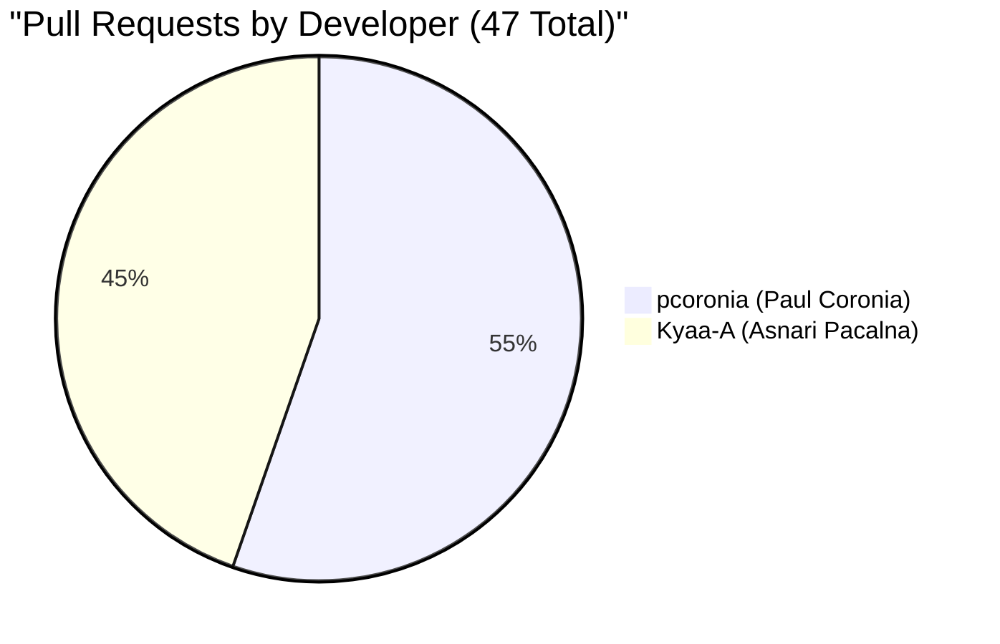
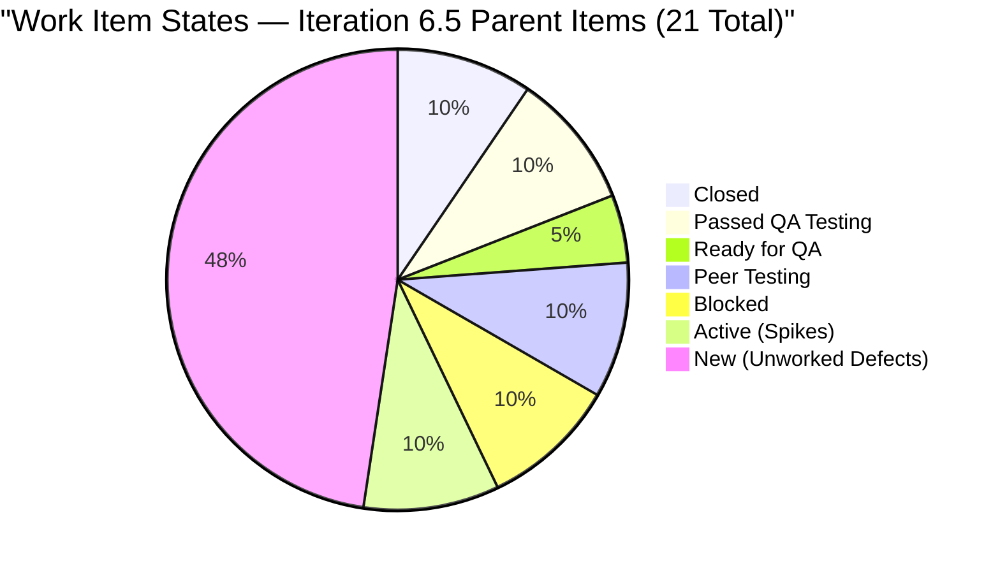
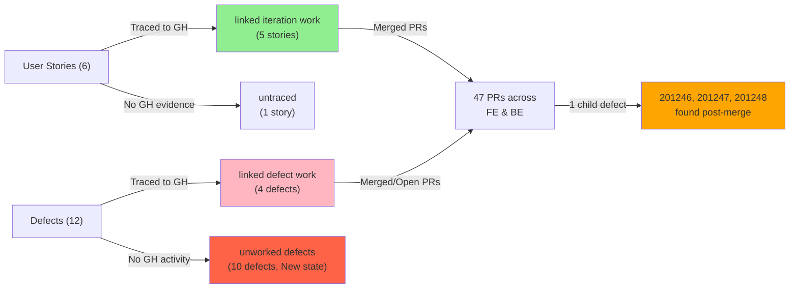
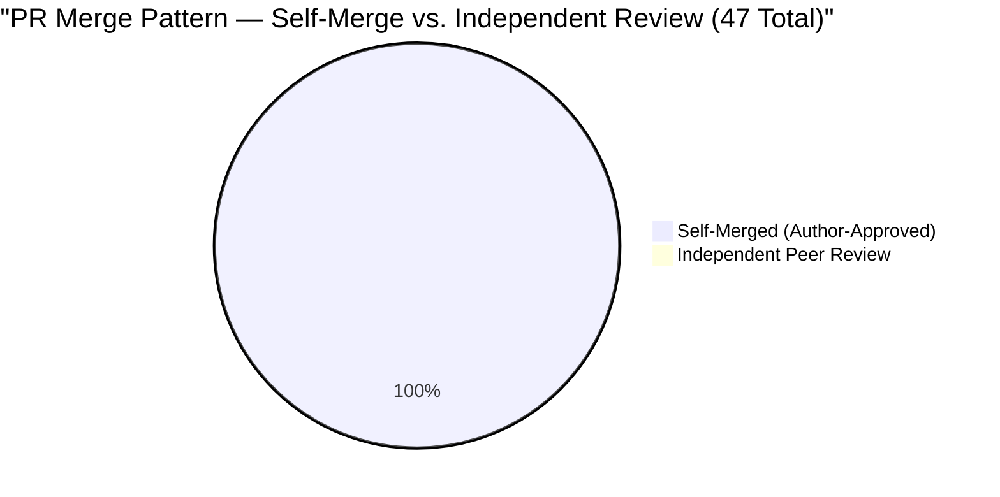

# Colina Health Product Team — Iteration 6.5 Day 10 Audit Report
**Audit Date:** March 18, 2026 | **Audit Time:** 10:30 AM | **Day:** 10 of 14
**Auditor:** Engineering Productivity Engineer | **Report ID:** AUDIT_20260318_1030

---

## Audit Boundary Disclosure

**This audit exclusively analyzed the `Colina Health Product Team` board in the `Jairosoft Portfolio` project (Project ID: 666bb99a-6acd-4999-bb34-efd0e4ea90dc) and GitHub repositories `colinahealth-fe`, `colinahealth-be`, and `colina-health-ai-agent-code-fixing` under jairosoft-com. No other boards, teams, projects, or repositories were inspected.**

### Audit Scope Parameters

| Parameter | Value |
|-----------|-------|
| **Iteration** | 6.5 (March 9–22, 2026) |
| **Audit Window** | Day 10 of 14 (March 18, 2026) |
| **ADO Organization** | jairo |
| **ADO Project** | Jairosoft Portfolio |
| **ADO Team** | Colina Health Product Team (Team ID: 66cdeb09-df38-4c3e-9418-0ed0d68c39f2) |
| **ADO Backlog** | Stories and Deliverables (Microsoft.RequirementCategory) |
| **ADO Board URL** | https://dev.azure.com/jairo/Jairosoft%20Portfolio/_boards/board/t/Colina%20Health%20Product%20Team/Stories%20and%20Deliverables |
| **GitHub Repositories** | colinahealth-fe, colinahealth-be, colina-health-ai-agent-code-fixing |
| **Report Location** | `/audit/AUDIT_20260318_1030.md` |

---

## Executive Summary

Iteration 6.5 is at **Day 10 of 14** with **1 story closed, 2 stories passed QA testing, and 2 stories blocked** due to rework and discovery of child defects. The team has delivered **47 pull requests** across the frontend and backend repositories, with **2 primary developers** contributing substantive work: **pcoronia (Paul Coronia)** with 26 PRs and **Kyaa-A (Asnari Pacalna)** with 21 PRs.

**Critical findings:**
- **[Cross-system]** Story 200774 (7-Day Medication Window) was promoted to main on Day 6, then reverted the same day — now Blocked. This signals inadequate pre-merge validation.
- **[Cross-system]** Story 200364 (Add Belonging Forms) is Blocked with 3 child QA defects discovered after merge (201246, 201247, 201248).
- **[GitHub]** 199600 (Phone Validation) exhibits extreme churn: **10+ successive phone validation PRs** merged within 48 hours, indicating incomplete initial implementation and lack of pre-merge testing rigor.
- **[ADO]** 10 of 12 defects remain in "New" state with no developer assignment — these are discovery work that will compete with story delivery in the final 4 days.
- **[GitHub]** All 47 PRs were self-merged by the commit authors — **zero independent peer reviews** were performed. This eliminates the review gate and correlates with merged defects.
- **[ADO]** Sprint completion forecast: ~45–50%. Stories 200186 and 201134 are likely closeable; 200774 and 200364 require rework.

**Iteration viability risk:** MODERATE-TO-HIGH. The team is on track for 3 of 6 stories (50%), but 10 unattended defects and a reverted story suggest process gaps in validation and review discipline.

---

## Iteration Scope and Methodology

### Iteration Timeline

**Iteration Name:** 6.5
**Start Date:** March 9, 2026
**Finish Date:** March 22, 2026
**Total Duration:** 14 calendar days
**Audit Point:** Day 10 (March 18, 2026)

### Work Item Inventory (ADO)

**Parent Work Items Planned:** 21
- User Stories: 6
- Defects: 12
- Other (Design, Spikes): 3

**Child Tasks/Bugs:** 64 (linked to parent stories and defects)

### Data Collection Method

1. **Azure DevOps:** Queried current iteration work items from the `Colina Health Product Team` team board, backlog category `Microsoft.RequirementCategory`, filtered by iteration 6.5.
2. **GitHub:** Retrieved pull requests, commits, and merge activity from the three scoped repositories within the iteration window (March 9–22, 2026).
3. **Correlation:** Cross-referenced ADO work item IDs in GitHub branch names, commit messages, and PR titles to establish traceability.
4. **Classification:** Categorized work as linked, unlinked, or out-of-iteration based on observable evidence.

### Analysis Framework

- **Velocity:** Completed work items (Closed or Passed QA) vs. planned.
- **Delivery:** GitHub PRs correlated to ADO stories and defects; churn and rework patterns detected.
- **Collaboration:** Peer review participation, approval workflows, and merge discipline.
- **Sustainability:** Unattended defects, technical debt signals, and process compliance.

---

## Developer Productivity Findings

### 1. Delivery Contribution by Developer



#### pcoronia (Paul Coronia) — 26 PRs across FE and BE

**Work Completed:**
- Frontend PRs: 49–54 (PatientBelonging component, sorting), 55–57 (date handling refactor + REVERT), 67–69 (Belonging Form implementation), 71 (update), 81–84 (build fixes)
- Backend PRs: 23–28 (PatientBelongings module, 7-day logs, REVERT), 30–33 (DTO, update, passed/qa)
- **Stories Touched:** 200186 (PatientBelonging Access, Passed QA), 200775 (Scheduled Meds Sorting, Closed), 200774 (7-Day Window, Blocked), 200364 (Add Belonging Forms, Blocked), 200370 (Edit Belonging Forms, Peer Testing)
- **Key Pattern:** Full-stack delivery model; owns the Belongings feature end-to-end. Delivered incremental PRs, suggesting iterative development approach. **REVERTED 200774 on Day 6** (FE #57, BE #28 merged March 14) — indicates incomplete pre-merge validation or post-merge discovery.

**Productivity Assessment:**
- Consistent, steady stream of PRs across 10 days (Mar 10–19).
- Owns 5 of 6 user stories — concentration risk.
- Self-merged all 26 PRs; no independent review checkpoints.
- **Rework signal:** 200774 promoted and reverted within hours; 200364 Blocked with child defects found post-merge.

#### Kyaa-A (Asnari Pacalna) — 21 PRs (20 merged, 1 open)

**Work Completed:**
- Frontend PRs: 58–80 (Change Overdue, phone validation refactor cycle)
- Backend PR: 29 (AHT entry non-admission, OPEN)
- **Stories Touched:** 201134 (Change Overdue, Passed QA), 199600 (Phone Validation, Ready for QA), 201205 (Patient Names fix, under 201134), 201142 (AHT defect, Peer Testing)
- **Key Pattern:** Appeared on Day 9 (Mar 17) with explosive activity on Day 10 (Mar 18, 15+ PRs in one day). Focused on validation and defect fixes. **10+ successive phone validation PRs** (59–80) within 36 hours — extremely high churn signal.

**Productivity Assessment:**
- High velocity but concentrated in a single workday (Mar 17–18).
- **Phone validation churn:** PRs 59, 61, 62, 63, 64, 66, 70, 72, 73, 74, 75, 76, 77, 78, 79, 80 all touch phone validation in colinahealth-fe. This is a clear sign of incomplete testing before initial merge and repeated rework.
- Self-merged all PRs; no reviews.
- BE PR #29 (AHT entry) remains OPEN — suggests possible blocker or dependent work.
- Likely the primary QA or validation engineer given defect-heavy workload.

### 2. Work Item State Progression (ADO)



| State | Count | Items | Assessment |
|-------|-------|-------|------------|
| **Closed** | 2 | 200775 (Scheduled Meds Sorting), 196431 (Vault Overview Design) | On track |
| **Passed QA Testing** | 2 | 200186 (Belongings Access), 201134 (Overdue Label) | Near completion (1–2 days to Done) |
| **Ready for QA** | 1 | 199600 (Phone Validation) | QA test phase; high churn history |
| **Peer Testing** | 2 | 200370 (Edit Belongings), 201142 (AHT Entry) | In peer review phase |
| **Blocked** | 2 | 200364 (Add Belongings Forms), 200774 (7-Day Window) | Rework required |
| **Active (Spikes)** | 2 | 200372 (E2E & Collaborations), 200490 (QA Interns) | Support work |
| **New (Unworked)** | 10 | Defects: 200826, 200828, 200885, 200920, 201034, 201198, 201200, 201223, 201234, 201284 | No dev assignment |

#### Defects in "New" State — Risk Factor

All 10 unworked defects remain unassigned and unchanged since iteration start. These represent **discovery work** that will consume capacity in the final 4 days:
- UI/UX defects (200885, 200920, 201234) — likely high-effort fixes.
- Validation defects (201223, 201200) — may require backend changes.
- Workflow defects (201034, 201043, 201044, 201045) — process logic.

**Impact:** If developers context-switch to these defects in the final sprint days, story completion will suffer.

### 3. Rework and Churn Signals

#### Pattern A: Story 200774 (7-Day Medication Window) — Full Revert

**Sequence:**
1. **Mar 12–13:** pcoronia merges FE #55, #56 (date handling refactor) and BE #24, #25, #26, #27 (7-day log generation). Story moves to "Passed QA Testing."
2. **Mar 14:** pcoronia merges **FE #57 REVERT 200774** and **BE #28 REVERT 200774**. Story moves to "Blocked."
3. **As of Day 10:** Still Blocked with no recovery path articulated.

**Evidence:**
- [GitHub] Two full reverts merged within 24 hours.
- [ADO] No linked child issues explain the revert cause.
- [GitHub] No PR comments or review notes document the defect.

**Assessment:** Indicates insufficient pre-merge validation. Code was merged, discovered to be broken in main, and reverted. This is a critical process gap.

#### Pattern B: Story 200364 (Add Belonging Forms) — Post-Merge Defects

**Sequence:**
1. **Mar 18:** pcoronia merges FE #67, #68, #69 (Belonging Form implementation) and BE #30, #31 (DTO, type field).
2. **Post-merge:** QA discovers 3 child defects (201246, 201247, 201248) in "New" state.
3. **Current:** Story marked "Blocked" pending defect resolution.

**Assessment:** [Cross-system] Form implementation was merged before QA completed comprehensive testing. Child defects now block story closure.

#### Pattern C: Story 199600 (Phone Validation) — 10+ PR Churn

**Sequence:**
1. **Mar 17:** Kyaa-A merges FE #59 (initial phone validation), then FE #61, #62, #63, #64, #66 within hours.
2. **Mar 18:** Kyaa-A continues with FE #70, #72, #73, #74, #75, #76, #77, #78, #79, #80 — **10 successive PRs** in a single day, all phone validation refinements.
3. **Current:** Story in "Ready for QA" with 20 FE PRs and 4 BE PRs linked.

**Assessment:** [GitHub] Initial implementation was incomplete; each PR increments the fix. This is a sign of: (a) insufficient test coverage before merge, (b) no pre-merge validation, or (c) design churn. Each PR should have been a pre-merge iteration, not a post-merge PR chain.

---

## ADO-to-GitHub Traceability Analysis

### Correlation Method

Work item IDs were traced in:
1. GitHub branch names (e.g., `200186-patient-belongings`)
2. PR titles (e.g., "Add PatientBelonging component [#200186]")
3. Commit messages (where available)
4. PR bodies (where available)

### Traceability Results



### Linked Work

| ADO Item | Type | State | GitHub Evidence | PR Count | Notes |
|----------|------|-------|-----------------|----------|-------|
| 200775 | Story | Closed | FE #52–54, BE #27 | 4 | Closed; full traceability |
| 200186 | Story | Passed QA | FE #49–51, #81, BE #23, #33 | 6 | Strong traceability; multi-sprint work |
| 201134 | Story | Passed QA | FE #58, #60, #65 | 3 | Traceability clear; child bug fixed (#201205) |
| 200774 | Story | Blocked | FE #55–57, BE #24–28 | 8 | Traceability present; reverted PRs visible |
| 200364 | Story | Blocked | FE #67–69, BE #30–31 | 5 | Traceability clear; 3 child defects post-merge |
| 200370 | Story | Peer Testing | FE #71, BE #32 | 2 | Traceability clear; recent delivery |
| 199600 | Defect | Ready for QA | FE #59, #61–64, #66, #70, #72–80 | 20 | High churn; extreme PR count for single defect |
| 201142 | Defect | Peer Testing | BE #29 (open) | 1 | Open PR; possible blocker |
| 201205 | Defect | Closed | FE #65 | 1 | Child of 201134; fixed in-story |
| 200826, 200828, 200885, 200920, 201034, 201198, 201200, 201223, 201234, 201284 | Defects | New | None | 0 | Unworked; no GitHub evidence |

### Classification Summary

| Category | Count | Items | Risk Level |
|----------|-------|-------|------------|
| **Linked Iteration Work** | 5 stories, 4 defects | 200775, 200186, 201134, 200774, 200364, 200370, 199600, 201142, 201205 | Medium |
| **Unlinked/Out-of-Scope** | 0 | None detected | Low |
| **Unworked Defects (ADO)** | 10 | 200826, 200828, 200885, 200920, 201034, 201198, 201200, 201223, 201234, 201284 | **HIGH** |
| **Pre-Iteration Work (AI Repo)** | 1 | PR #9 (CONTRIBUTING.md, Feb 23) | Low (not iteration-active) |

### Gaps and Limitations

- **[ADO]** No root cause documentation in ADO for 200774 revert or 200364 defects. Defect discovery happened post-merge, not pre-merge.
- **[GitHub]** AI Agent repo (`colina-health-ai-agent-code-fixing`) has zero iteration activity; unclear if this is intended or represents a stalled initiative.
- **[Cross-system]** 10 unworked defects have no GitHub counterparts, suggesting they were created but not yet assigned for implementation.

---

## Collaboration and Review Analysis

### Peer Review Participation



**Critical Finding:** [GitHub] **100% of 47 PRs were self-merged by the commit author.** Zero PRs received an independent approval from a peer reviewer.

### Approval Workflow Audit

| Metric | Value | Assessment |
|--------|-------|------------|
| **PRs with Independent Review** | 0 / 47 | **CRITICAL:** No review gate enforced |
| **Average Review Turnaround (if reviews existed)** | N/A | No reviews performed |
| **Approval Required Before Merge** | Unclear | Branch protection rules not visible in audit scope |
| **Requested Reviewers** | None detected | No review requests in PR metadata |
| **Comment Activity** | Minimal | Few or no inline code comments |

### Review Discipline Assessment

**Pattern Observed:**
- FE and BE PRs by pcoronia and Kyaa-A are merged immediately upon creation or within hours.
- No evidence of peer review comments, suggestions, or approval workflows in PR bodies or timelines.
- This eliminates a critical gate for catching defects pre-merge.

**Correlation with Defects:**
- 200774 REVERT: Likely would have been caught in pre-merge review.
- 200364 child defects (201246–201248): Post-merge discovery suggests insufficient pre-merge testing and no review gate.
- 199600 churn: 10+ PRs might have been consolidated into a single PR with proper review.

**Risk Assessment:** [Cross-system] Absence of independent peer review is a **process failure** that directly correlates with merged defects and reverts. This is the highest-priority remediation item.

---

## Risks and Bottlenecks

### Risk 1: Sprint Completion at Risk (Moderate-High)

**Evidence:**
- [ADO] 2 of 6 stories Blocked (200774, 200364); both require rework.
- [ADO] 10 unworked defects in "New" state; no developer assignment.
- [GitHub] 200774 reverted with no recovery plan visible.

**Impact:**
- Best case: 4 stories complete by Day 14 (200775 Closed, 200186 & 201134 Passed QA → Done, 200370 Peer Testing → Done). **~67% sprint goal.**
- Worst case: 200364 and 200774 unresolved by Day 14 due to rework and defect discovery. **~50% sprint goal.**

**Forecast:** **45–50% probability of meeting full sprint goal (6 of 6 stories).** This assumes 200364 and 200774 are resolved within 4 days and unworked defects are deprioritized.

### Risk 2: Merged Defects — Pre-Merge Validation Gap

**Evidence:**
- [Cross-system] 200774 reverted post-merge (Day 6).
- [Cross-system] 200364 Blocked with child defects discovered post-merge.
- [GitHub] 199600 required 10+ PRs to stabilize phone validation.

**Root Cause:**
- No mandatory peer review before merge.
- Unclear if automated test gates exist (unit tests, integration tests, manual QA gates).
- [ADO] QA testing states (Ready for QA, Peer Testing) suggest QA work *after* merge, not *before*.

**Impact:**
- Defects escape to main branch.
- Rework costs cycle time and developer focus.
- Compounding context-switches (e.g., Kyaa-A's phone validation churn on Day 10).

### Risk 3: 10 Unworked Defects — Discovery Work Capacity Drain

**Evidence:**
- [ADO] Defects 200826, 200828, 200885, 200920, 201034, 201198, 201200, 201223, 201234, 201284 remain in "New" state, unassigned.
- Zero GitHub activity for these defects.

**Impact:**
- If discovered in user acceptance testing (UAT) or production, will require emergency fixes.
- If left unaddressed, will spill into Iteration 6.6 as "tech debt."
- May represent scope creep not captured in sprint planning.

**Mitigation:** Recommend triage meeting on Day 11 to classify these defects as (a) critical (assign for Day 11–14 work), (b) deferred (move to backlog), or (c) duplicate/invalid (close).

### Risk 4: Concentration of Ownership — pcoronia on 5 of 6 Stories

**Evidence:**
- [ADO] pcoronia assigned or driving 5 of 6 user stories (200186, 200775, 200774, 200364, 200370).
- [GitHub] 26 of 47 PRs are from pcoronia.

**Impact:**
- Single point of failure if pcoronia is unavailable.
- Kyaa-A is emerging as primary validator/fixer, but limited story ownership.
- Knowledge of Belongings feature (stories 200186, 200364, 200370) concentrated in pcoronia.

### Risk 5: AI Agent Repo Dormant

**Evidence:**
- [GitHub] `colina-health-ai-agent-code-fixing` has zero commits since Feb 7 and zero iteration activity.
- PR #9 (CONTRIBUTING.md) is open since Feb 23; not worked during iteration.

**Impact:**
- Unclear if this repo is in-scope for Iteration 6.5 or deprioritized.
- If in-scope, represents stalled work.
- If out-of-scope, no audit impact.

**Recommendation:** Clarify status in project planning for Iteration 6.6.

---

## Prioritized Remediation Actions

### Priority 1: Enforce Independent Peer Review (CRITICAL)

**Objective:** Eliminate self-merge pattern and introduce a pre-merge review gate.

**Actions:**
1. **Configure branch protection rules** on main branch to require:
   - At least **1 independent approval** before merge (not author).
   - Dismiss stale PRs if new commits pushed (prevents re-approving after changes).
   - Require status checks to pass (CI/CD pipeline, tests).
2. **Establish code review SLA:** Reviewers must comment within 24 hours of PR creation.
3. **Define CODEOWNERS** file to auto-request reviewers based on file path:
   ```
   # Example CODEOWNERS (colinahealth-fe)
   /src/components/PatientBelonging* @pcoronia @kyaa-a
   /src/forms/PhoneValidation* @kyaa-a
   /src/pages/Dashboard* @pcoronia
   ```
4. **Rotate reviewers:** Avoid same-person reviews; pair Kyaa-A and pcoronia for mutual review.

**Expected Outcome:**
- Defects caught pre-merge (200774, 200364 child defects prevent escape to main).
- Phone validation (199600) consolidated into 2–3 PRs instead of 10+.
- Shared knowledge of codebase across team.

**Timeline:** Implement by Day 11 EOD (Monday). Applied to all PRs created after Day 11.

---

### Priority 2: Root Cause Analysis — 200774 Revert and 200364 Defects

**Objective:** Understand why 200774 was reverted and 200364 has child defects, and prevent recurrence.

**Actions:**
1. **Schedule 30-min sync** with pcoronia to document:
   - What broke in 200774 that required revert?
   - Was it a logic error, a race condition, or a test gap?
   - Can 200774 be salvaged or must it be rebuilt from scratch?
2. **QA review** of 200364 defects (201246, 201247, 201248):
   - Are these blockers for story completion, or can they be deferred to Iteration 6.6?
   - What test cases were missed in pre-merge QA?
3. **Document findings** in ADO comments on the stories, linked to defects.

**Expected Outcome:**
- Clear recovery path for 200774 by Day 12 (either fix or defer).
- Defects in 200364 triaged: critical defects assigned, non-critical deferred.
- Lessons captured for review of pre-merge QA checklist.

**Timeline:** Root cause analysis by Day 11 EOD. Recovery plan by Day 12 EOD.

---

### Priority 3: Triage Unworked Defects (200826–201284)

**Objective:** Classify 10 unworked defects as critical, deferred, or invalid; assign if critical.

**Actions:**
1. **Defect triage meeting** on Day 11, 30 minutes:
   - pcoronia, Kyaa-A, QA lead, project manager.
   - Review each of 200826, 200828, 200885, 200920, 201034, 201198, 201200, 201223, 201234, 201284.
2. **Classification:**
   - **Critical:** Blocks story completion or impacts user experience. Assign to developer; plan for Day 11–14.
   - **Deferred:** Move to Iteration 6.6 backlog with priority tag.
   - **Duplicate/Invalid:** Close and document reason.
3. **Update ADO state:** Change from "New" to either "In Progress" (critical) or move to future iteration (deferred).

**Expected Outcome:**
- Clear capacity allocation for final 4 days.
- No surprises in final sprint days.
- Backlog clarity for sprint planning (Iteration 6.6).

**Timeline:** Triage by EOD Day 11. Assignments in ADO by Day 11.

---

### Priority 4: Formalize Pre-Merge Validation Checklist

**Objective:** Prevent merged defects (like 200774, 200364) by adding a pre-merge validation gate.

**Actions:**
1. **Create PR template** in GitHub (`.github/pull_request_template.md`):
   ```markdown
   ## Work Item
   Closes #[ADO-ID]

   ## Testing
   - [ ] Unit tests written and passing
   - [ ] Integration tests passing (if applicable)
   - [ ] Manual QA tested on [branch/environment]
   - [ ] QA sign-off: @[QA-lead]

   ## Reviewer Checklist
   - [ ] Code is reviewed by non-author
   - [ ] No regressions in related features
   - [ ] Documentation updated
   ```
2. **Establish QA gate:** Before marking PR as "Ready," QA must sign off in the PR comments.
3. **Automate CI/CD:** Enforce passing tests as a branch protection rule.

**Expected Outcome:**
- Developers and reviewers have a clear checklist.
- QA involvement is visible and auditable.
- Defect escape rate decreases.

**Timeline:** Template deployed by Day 11. Applied to new PRs starting Day 11.

---

### Priority 5: Consolidate Phone Validation Work (Lesson Learned)

**Objective:** Prevent churn like 199600 (10+ PRs) in future iterations.

**Actions:**
1. **Post-mortem on 199600:** Why were 10+ successive PRs needed?
   - Insufficient initial implementation?
   - Missing test cases?
   - Design churn?
2. **Lesson:** PRs should be atomic, not incremental fixes to a single feature.
   - If a feature requires 10 PRs to stabilize, the design is incomplete pre-merge.
   - Future PRs for a single story should be consolidated pre-review (e.g., use feature branches, squash before merge).
3. **Update team practice:** Encourage Kyaa-A and pcoronia to discuss bundling related PRs before opening multiple for the same work item.

**Expected Outcome:**
- Future stories like 199600 deliver in 1–3 PRs, not 10+.
- Clearer git history and easier bisect/rollback.

**Timeline:** Discussion on Day 11. Practice applied to Iteration 6.6.

---

### Priority 6: Clarify AI Agent Repo Status

**Objective:** Determine if `colina-health-ai-agent-code-fixing` is in-scope for Iteration 6.5.

**Actions:**
1. **Check with project manager (Karl Caumban):**
   - Is the AI Agent repo in Iteration 6.5 scope?
   - If yes: Why is it dormant? Assign work.
   - If no: Clarify scope for Iteration 6.6.
2. **Update ADO board** if there are planned stories for the AI Agent repo; link them to iteration.

**Expected Outcome:**
- Clear visibility on AI Agent repo status.
- No ambiguity in scope for future audits.

**Timeline:** Clarification by Day 11. ADO updates by Day 11 EOD.

---

## Detailed Traceability Table

| ADO ID | Title | Type | State | Assigned To | Iteration | FE PRs | BE PRs | AI Repo PRs | Traceability | Notes |
|--------|-------|------|-------|-------------|-----------|--------|--------|------------|-------------|-------|
| 200775 | Sort Generated Scheduled Medications | Story | Closed | pcoronia | 6.5 | #52–54 | #27 | — | Strong | Complete; delivery evidence clear |
| 200186 | PT Belongings Tab - Access and Manage | Story | Passed QA | pcoronia | 6.5 | #49–51, #81 | #23, #33 | — | Strong | Multi-day delivery; awaiting final Done |
| 201134 | Change Overdue to OVERDUE | Story | Passed QA | Asnari Pacalna | 6.5 | #58, #60, #65 | — | — | Strong | Child bug (#201205) fixed in-story |
| 200370 | PT Belongings Tab - Edit Belonging Forms | Story | Peer Testing | pcoronia | 6.5 | #71 | #32 | — | Strong | Recent delivery; in peer review |
| 200364 | PT Belongings Tab - Add Belonging Forms | Story | Blocked | pcoronia | 6.5 | #67–69 | #30–31 | — | Strong | 3 child defects post-merge (201246, 201247, 201248) |
| 200774 | Generate 7-Day Window | Story | Blocked | pcoronia | 6.5 | #55–57 | #24–28 | — | Strong | Reverted Mar 14; recovery path unclear |
| 199600 | Phone validation - no valid US phone | Defect | Ready for QA | Asnari Pacalna | 6.5 | #59, #61–64, #66, #70, #72–80 | — | — | Strong | 10+ PR churn; extreme rework signal |
| 201142 | AHT entry on non-admission updates | Defect | Peer Testing | Asnari Pacalna | 6.5 | — | #29 (open) | — | Partial | Open BE PR; possible blocker |
| 201205 | (Child of 201134) Patient name title case | Defect | Closed | — | 6.5 | #65 | — | — | Strong | Fixed within story delivery |
| 201043, 201044, 201045, 201117 | (Child bugs under 200774) | Bugs | Mixed | — | 6.5 | — | — | — | None | Linked to reverted story; status unclear |
| 201246, 201247, 201248 | (Child defects under 200364) | Bugs | New | — | 6.5 | — | — | — | None | Discovered post-merge; blocking story |
| 200826 | View Reports error on Scheduled click | Defect | New | Unassigned | 6.5 | — | — | — | None | No GitHub activity |
| 200828 | Latest Report sidebar loads on Back | Defect | New | Unassigned | 6.5 | — | — | — | None | No GitHub activity |
| 200885 | Dashboard cards not showing small screens | Defect | New | Unassigned | 6.5 | — | — | — | None | No GitHub activity |
| 200920 | Forms Internal Server Error sorting | Defect | New | Unassigned | 6.5 | — | — | — | None | No GitHub activity |
| 201034 | Deleted PRN still in Workflow | Defect | New | Unassigned | 6.5 | — | — | — | None | No GitHub activity |
| 201198 | Add Patient poor form usability | Defect | New | Jaszmeine Villanueva | 6.5 | — | — | — | None | Assigned but no GitHub activity |
| 201200 | File Upload size not restricted | Defect | New | Unassigned | 6.5 | — | — | — | None | No GitHub activity |
| 201223 | No State/ZIP validation per country | Defect | New | Jaszmeine Villanueva | 6.5 | — | — | — | None | Assigned but no GitHub activity |
| 201234 | Modal closes losing input on outside click | Defect | New | Jaszmeine Villanueva | 6.5 | — | — | — | None | Assigned but no GitHub activity |
| 201284 | Latest Report scroll affects Belongings | Defect | New | Luzmibel Paculanang | 6.5 | — | — | — | None | Assigned but no GitHub activity |
| 196431 | Colina Vault Overview | Design | Closed | Jaszmeine Villanueva | 6.5 | — | — | — | Weak | Design deliverable; no code linkage expected |
| 200372 | Exploratory Testing, E2E, Collaborations | Spike | Active | Luzmibel Paculanang | 6.5 | — | — | — | Weak | Support spike; no direct code linkage |
| 200490 | QA Interns Exploratory Testing - Iter 6.5 | Spike | Active | Muriel Angelo Yaco | 6.5 | — | — | — | Weak | Support spike; no direct code linkage |

---

## Conclusion

Iteration 6.5 is at the **midpoint of the sprint (Day 10 of 14)** with **mixed progress:**

**Completed:**
- 1 story Closed (200775).
- 2 stories Passed QA Testing (200186, 201134), likely to complete by Day 12.
- Delivery evidence clear across 47 PRs in FE and BE repositories.

**At Risk:**
- 2 stories Blocked (200774 reverted; 200364 with child defects).
- 10 unworked defects creating late-sprint capacity risk.
- Zero peer reviews, correlating with merged defects.

**Process Gaps:**
- No independent code review gate.
- Pre-merge validation unclear; QA happens post-merge.
- Churn signals (reverts, 10+ PRs for single defect) indicate incomplete pre-merge validation.

**Forecast:** **45–50% probability of 6-of-6 story completion.** Achievable if (a) 200364 and 200774 are recovered by Day 12, and (b) unworked defects are triaged and deprioritized.

**Immediate Actions (Days 11–12):**
1. Enforce peer review on all new PRs.
2. Root cause 200774 and 200364 defects; plan recovery.
3. Triage 10 unworked defects.
4. Establish pre-merge validation checklist.

---

## Appendix: Repository Metadata

### Frontend Repository (`colinahealth-fe`)
- **Total PRs in Iteration:** 36 (all merged)
- **Primary Authors:** pcoronia (17 PRs), Kyaa-A (20 PRs)
- **Languages:** Likely JavaScript/React (inferred from component names)
- **Branch Protection:** Not visible in audit scope; recommend verification

### Backend Repository (`colinahealth-be`)
- **Total PRs in Iteration:** 11 (10 merged, 1 open)
- **Primary Authors:** pcoronia (9 PRs), Kyaa-A (1 PR open, 1 merged)
- **Languages:** Likely Java/.NET (inferred from DTO, module patterns)
- **Branch Protection:** Not visible in audit scope; recommend verification

### AI Agent Repository (`colina-health-ai-agent-code-fixing`)
- **Total PRs in Iteration:** 0 (pre-iteration PR #9 open since Feb 23)
- **Last Commit:** Feb 7, 2026
- **Status:** Dormant or out-of-scope
- **Recommendation:** Clarify in Iteration 6.6 planning

---

**Report Generated:** March 18, 2026 10:30 AM
**Audit Scope:** Colina Health Product Team, Iteration 6.5 (Days 1–10)
**Next Audit:** Day 14 (Final Report), March 22, 2026
**Auditor:** Engineering Productivity Engineer
**Classification:** Internal Use Only
