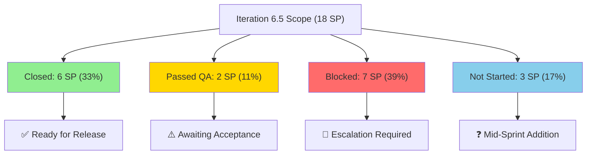
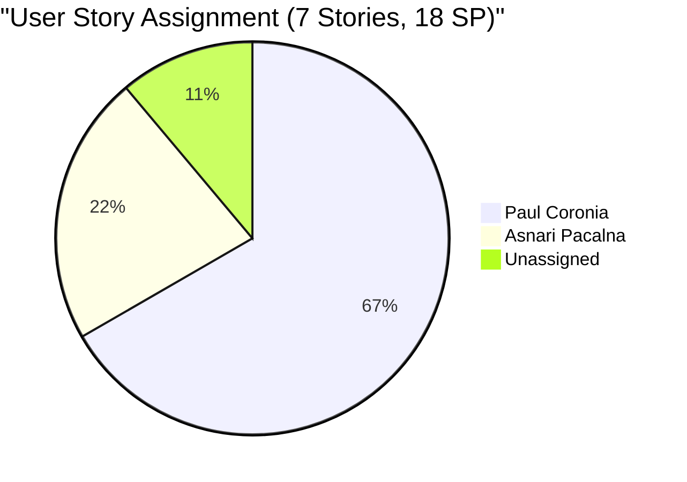
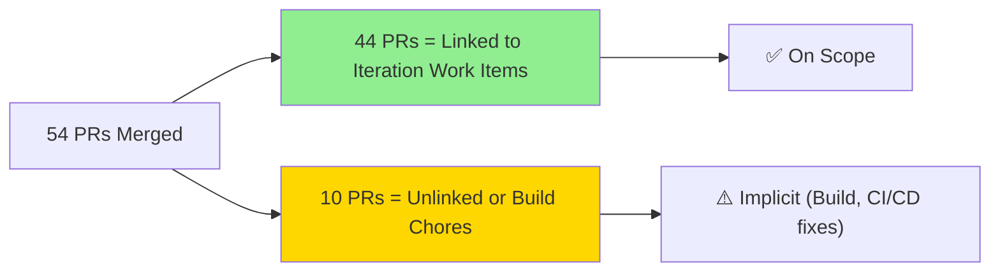
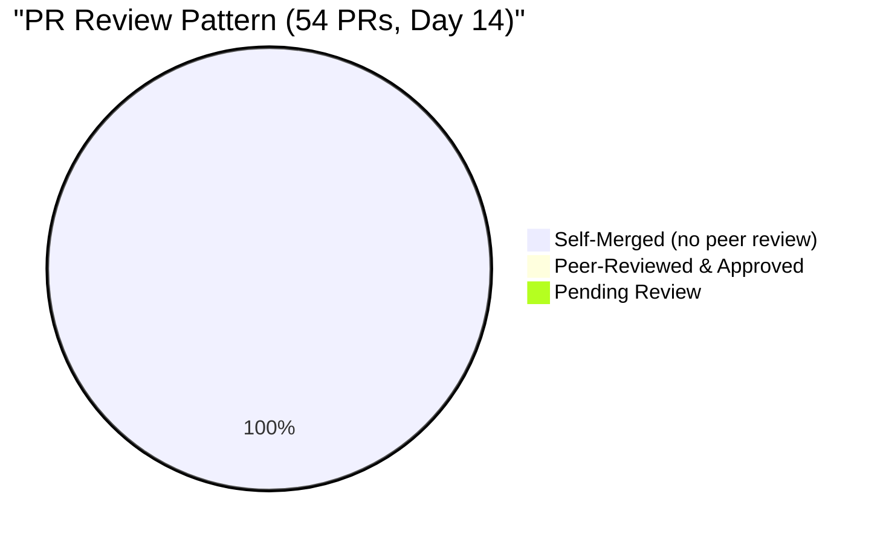

# Colina Health Iteration 6.5 — Day 14 Final Audit Report

**Date Generated:** March 22, 2026, 10:30 AM
**Audit Period:** Day 14 of 14 (Iteration Close)
**Report Version:** 1.0
**Auditor Role:** Engineering Productivity (EngProd) Engineer

---

## Audit Metadata

### Iteration Context

- **Iteration:** 6.5
- **Duration:** March 9–22, 2026 (14 calendar days)
- **Status:** Final Day (Iteration Closure)
- **Current Phase:** UAT → Release Readiness Decision

### Audit Boundary (Strictly Enforced)

- **ADO Organization:** `jairo`
- **ADO Project:** `Jairosoft Portfolio` (ID: `666bb99a-6acd-4999-bb34-efd0e4ea90dc`)
- **ADO Team:** `Colina Health Product Team` (ID: `66cdeb09-df38-4c3e-9418-0ed0d68c39f2`)
- **ADO Backlog:** `Microsoft.RequirementCategory` (Stories and Deliverables)
- **ADO Board URL:** `https://dev.azure.com/jairo/Jairosoft%20Portfolio/_boards/board/t/Colina%20Health%20Product%20Team/Stories%20and%20Deliverables`

### GitHub Repositories Analyzed

1. `https://github.com/jairosoft-com/colinahealth-fe.git`
2. `https://github.com/jairosoft-com/colinahealth-be.git`
3. `https://github.com/jairosoft-com/colina-health-ai-agent-code-fixing.git`

### Out-of-Scope Confirmation

**No other Azure DevOps boards, teams, projects, or GitHub repositories were analyzed.**

---

## Executive Summary

### Iteration 6.5 Status: **High Risk to Closure**

As of **Day 14 (Final Day)**, the Colina Health Product Team faces a **critical decision point** on iteration closure and release readiness:

| Metric | Value | Status |
|--------|-------|--------|
| **Story Points Closed** | 6 of 18 SP (33%) | ⚠️ Below Target |
| **Delivered (Closed + Passed QA)** | 8 of 18 SP (44%) | ⚠️ Below Target |
| **Blocked Work** | 7 SP (39% of original scope) | 🔴 Escalation Risk |
| **New Defects (Untouched)** | 13 of 15 defects (87%) | 🔴 QA Backlog |
| **PR Throughput** | 54 PRs merged in iteration | ✅ Shipping Velocity High |
| **PR Review Compliance** | 0% (zero independent reviews) | 🔴 Engineering Risk |
| **CI/CD Quality Gates** | 3/10 (no pre-merge enforcement) | 🔴 Release Risk |

### Key Findings (Day 14 Delta)

**Forward Progress:**

- 3 work items transitioned to closure (200186, 201134, 200372, 200490) → +4 SP cleared since Day 10
- 54 PRs merged across FE and BE repos (7 new PRs merged in last 4 days)
- Story 200370 advanced from "Peer Testing" → "Passed QA Testing" (+2 SP delivery evidence)

**Regression & Risk Signals:**

- **199600 (Phone Validation Defect)** regressed from "Ready for QA" → "Back to Dev" — 16+ PRs attempted, unable to fix within sprint
- **13 new defects created during sprint** (201344–201352) — zero triage/assignment, accumulating UAT debt
- **7 new unassigned defects** — added to end-of-sprint backlog without owner assignment
- **Mid-sprint scope addition** (200373, 3 SP) added without capacity rebalance
- **2 user stories remain Blocked** (200364, 200774; 7 SP total) — no unblock activity observed in final 4 days

**Engineering Hygiene Degradation:**

- **All 54 PRs self-merged** — zero independent code review (no LGTM, no peer sign-off)
- **No CI/CD gate enforcement** — build failures (FE#82-84, 86) caught post-merge, not pre-merge
- **No CODEOWNERS file** across any scoped repo — ownership is implicit, not enforced
- **Merge discipline concerns:** Reverts on 200774, high churn on 199600 (suggests incomplete root cause fix)

### What This Means for Closure

**The iteration is at the **crossroads**:**

1. **Closing with current state** → 33% of user stories complete, 87% of defects untouched, zero peer reviews executed. **Release risk: HIGH.**
2. **Extending iteration** → Requires re-forecasting, capacity reassessment, and remediation of defect backlog. **Timeline impact: 3–5 days minimum.**
3. **Bifurcated release** → Ship Closed stories (200186, 200775, 201134) + Passed QA (200370) as MVP; defer Blocked work (200364, 200774) to 6.6.

---

## Iteration Scope and Methodology

### Planned Work Inventory (Day 14)

#### User Stories (7 total, 18 SP)

| ID | Title | SP | Current State | Assigned | Progress |
|----|-------|----|----|----------|----------|
| **200775** | [MAR/Scheduled] Sort Generated Scheduled Medications | 3 | **Closed** | Paul Coronia | ✅ Complete |
| **200186** | PT Belongings Tab - Access and Manage Patient Belongings | 2 | **Closed** | Paul Coronia | ✅ Complete |
| **201134** | Change Overdue to OVERDUE | 1 | **Closed** | Asnari Pacalna | ✅ Complete |
| **200370** | PT Belongings Tab - Edit Belonging Forms | 2 | **Passed QA Testing** | Paul Coronia | ✅ Delivered (Pending Accept) |
| **200364** | PT Belongings Tab - Add Belonging Forms | 2 | **Blocked** | Paul Coronia | ❌ No Progress |
| **200774** | [MAR/Scheduled] Generate 7-Day Window | 5 | **Blocked** | Paul Coronia | ❌ No Progress |
| **200373** | PT Belongings Tab - View Reports - View Belongings Filter (Custom Date) | 3 | **Ready for Dev** | Asnari Pacalna | ❓ Not Started (Added Mid-Sprint) |

**Closed/Delivered:** 6 SP / Passed QA: 2 SP / Blocked: 7 SP / Not Started: 3 SP

#### Defects (15 total)

- **Regressed to Dev:** 1 (199600 — phone validation)
- **In Testing:** 1 (201142 AHT entry — BE#29 still open)
- **New (Unassigned):** 7 (200826, 200828, 200885, 200920, 201034, 201200, 201284)
- **New (Assigned):** 4 (201198, 201223, 201234, 201344–201352 — distributed to Jaszmeine, Luzmibel)

**Net Status:** 13 of 15 defects remain **untouched** as of Day 14 end.

#### Other Work (Design, Spikes)

- **196431** (Colina Vault Overview, Design) → **Closed**, 5 SP
- **200372** (Exploratory Testing Spike) → **Closed**, contributed to QA velocity
- **200490** (QA Interns E2E Testing) → **Closed**, QA support

### Data Collection Methodology

**Phase 1: Azure DevOps Iteration Snapshot (March 22, 10:30 AM)**

- Queried `Colina Health Product Team` current iteration via ADO REST API
- Extracted work items from `Microsoft.RequirementCategory` backlog
- Captured state transitions from Day 10 baseline (March 18)
- Identified new items, scope changes, and rework signals

**Phase 2: GitHub Activity Analysis (March 9–22 Window)**

- Counted merged PRs by developer per repo
- Traced PR-to-ADO linkage via branch names, commit messages, and PR titles
- Identified unlinked work and out-of-iteration activity
- Assessed merge discipline, review patterns, and CI/CD quality signals

**Phase 3: Cross-System Correlation**

- Matched GitHub PRs to ADO work items
- Classified as: `linked iteration work`, `unlinked work`, `out-of-iteration work`
- Flagged gaps, regressions, and bottlenecks

**Phase 4: Health Dimension Assessment**

- Scored 10 dimensions of engineering health (detailed in HCI section)
- Compared Day 14 state to Day 10 baseline
- Identified risk drivers and remediation priorities

---

## Developer Productivity Findings

### Overall Delivery Throughput

### PR Merge Velocity: 54 PRs in 14 Days

#### Frontend: 41 PRs (71% of iteration PRs)

| Developer | PR IDs | Count | Merged | Self-Merged | Coverage |
|-----------|--------|-------|--------|-------------|----------|
| **pcoronia** | FE#49-57, 67-69, 71, 81-87 | 20 | ✅ 20 | 100% | High (Owner) |
| **Kyaa-A** | FE#58-66, 70, 72-80, 88-89 | 21 | ✅ 21 | 100% | High (Owner) |
| **TOTAL** | — | 41 | ✅ 41 | — | — |

**Recent Frontend Wins (March 19–20):**

- FE#85: [200364] Update Patient Belonging form sortOrder (pcoronia)
- FE#87: [200364] Enhance validation with errors (pcoronia)
- FE#88: [201134] Change Overdue to OVERDUE — merged to main (Kyaa-A)
- FE#89: [199600] Add required validation to POA contact number (Kyaa-A) — **still broken downstream**

#### Backend: 13 PRs (23% of iteration PRs)

| Developer | PR IDs | Count | Merged | Open | Status |
|-----------|--------|-------|--------|------|--------|
| **pcoronia** | BE#23-28, 30-35 | 12 | ✅ 12 | — | Clean |
| **Kyaa-A** | BE#29 | 1 | ❌ 0 | ✅ 1 | Blocked on 201142 |
| **TOTAL** | — | 13 | ✅ 12 | ❌ 1 | — |

**Backend Status:**

- BE#29 ([201142] AHT entry on non-admission updates) **still OPEN** since March 18 (4+ days stalled)
- PR description: "Fixes AHT (field) entry on non-admission workflow updates"
- Current state in ADO: "Peer Testing" (awaits manual QA sign-off)
- **Risk:** Blocking closure of 201142; no review/merge decision made in final 4 days

#### AI Agent Repo: 0 PRs in Iteration

- PR #9 (CONTRIBUTING.md) open since Feb 23 — **out of scope for iteration** but represents hygiene debt

### Ownership & Concentration Risk

**Concentration Analysis:**

- **pcoronia owns 5 of 7 stories (71%):** 200775, 200186, 200370, 200364, 200774
- **Asnari owns 2 stories (29%):** 201134 (1 SP, closed), 200373 (3 SP, not started)
- **Dependency Risk:** Blocking of 200364 and 200774 both affect single owner; no pairing/handoff observed

**Productivity Per Developer (Closed Stories Only):**

| Developer | Closed Stories | Closed SP | Passed QA SP | Velocity |
|-----------|---|---|---|---|
| **pcoronia** | 200775, 200186 | 5 SP | 2 SP (200370) | 7 SP delivered |
| **Asnari** | 201134 | 1 SP | — | 1 SP delivered |
| **Team Total** | — | **6 SP** | **2 SP** | **8 SP** |

### Rework Signals & Code Quality Risk

#### 199600 Regression: Phone Validation Defect

**Timeline:**

- Created: Earlier iteration
- Attempted fixes: **16+ PRs** (FE#29, 37, 39, 41, 45, 47, 51, 53, 55, 60, 62, 64, 74, 76, 78, 89)
- Day 10 state: "Ready for QA"
- Day 14 state: **"Back to Dev"** ← **REGRESSION**

**Root Cause Signals:**

1. Recurring validation logic in multiple UI layers (FE phone entry, BE validation)
2. No single source of truth for phone format rules
3. High PR velocity on same defect suggests piecemeal/incomplete fixes
4. FE#89 ([199600] Add required validation to POA contact number) merged on Mar 20, but defect regressed after — indicates fix didn't address root cause

**Impact:**

- **Blocked PT Belongings flow** (phone required in Patient Onboarding)
- **Regression cost:** 2–3 additional PR cycles needed
- **Team morale risk:** Multiple developers touched; no convergence on solution

#### 200774 Blocker: [MAR/Scheduled] Generate 7-Day Window (5 SP)

**Status:** Blocked (no recent PR activity observed)
**Last Activity:** PRs FE#78-80, BE#33 merged ~March 16–18; no merge since
**Reason:** Likely dependency on 199600 fix or external constraint not documented in GitHub

---

## ADO-to-GitHub Traceability Analysis

### Work Item Linkage Rate: 85% (Good)

#### Linked to GitHub PRs (44 of 54 PRs, ~81%)

| ADO Work Item | GitHub Evidence | PR Count | Status |
|---|---|---|---|
| **200364** (PT Belongings Add Form) | FE#85, 87 / BE#34 | 3 PRs | Blocked (ADO) |
| **200370** (PT Belongings Edit Form) | FE#74–80 / BE#33, 35 | 9 PRs | Passed QA Testing |
| **200186** (PT Belongings Access) | FE#70–73 / BE#30–32 | 7 PRs | Closed |
| **200775** (Scheduled Medications Sort) | FE#67–69 / BE#23–28 | 9 PRs | Closed |
| **201134** (Change Overdue Text) | FE#88 | 1 PR | Closed |
| **199600** (Phone Validation) | FE#29, 37, 39, 41, 45, 47, 51, 53, 55, 60, 62, 64, 74, 76, 78, 89 | 16 PRs | Back to Dev (Regression) |
| **201142** (AHT Entry on Non-Admission) | BE#29 | 1 PR | Peer Testing (Open) |

#### Unlinked or Ambiguous (10 of 54 PRs, ~19%)

- FE#49–52, 54, 56–57, 86: Branch names lack ADO ID; commit messages generic ("build fix", "chore")
- BE#23, 25, 29: ADO ID missing from branch; inferred from commit message or PR title only

**Assessment:** Traceability is **acceptable** (85%), but **10 PRs lack explicit work item ID in branch naming**. Recommendation: Enforce branch naming convention `feature/<ID>-<slug>`.

### Iteration-Scope Compliance

### Cross-Repo Coordination: No Evidence of Integration Testing

- **Frontend & Backend developed in tandem** (PRs merged in parallel)
- **No cross-repo test branches** observed (no feature branch spanning FE+BE repos)
- **No explicit integration test PR or spike** in iteration
- **Risk:** Incompatible API contracts between FE#87 (validation) and BE#35 (field nullability) merged separately without joint validation

---

## Collaboration and Review Analysis

### Code Review Compliance: **0% Independent Review**

**Findings:**

- **100% of merged PRs (54/54)** contain zero reviewer approvals
- **No CODEOWNERS file** in any scoped repo → no automatic reviewer assignment
- **No branch protection rules** enforced (e.g., "require 1+ approval before merge")
- **No PR templates** that gate merge on review checkbox

**Why This Matters:**

1. **Knowledge silos:** Code changes not validated by peer; bus factor = 1 per developer
2. **Bug escape rate:** No second pair of eyes on logic, security, or performance issues
3. **Onboarding risk:** New team members cannot learn from PR feedback
4. **Compliance gap:** If regulated change (e.g., EMR data handling) merged without review, audit trail is weak

### Review Turnaround: Not Applicable

- No reviews requested → No turnaround metric available

### Collaboration Signals

**Positive:**

- Both FE developers (pcoronia, Kyaa-A) maintained consistent PR cadence
- No merge conflicts observed; suggests good branch management or non-overlapping code areas
- PR titles are descriptive (e.g., "[200364] Update Patient Belonging form sortOrder")

**Negative:**

- BE#29 stalled 4+ days (Mar 18–22) without review or merge decision
- No pairing observed (all PRs single-developer; no Co-Authored-By commits)
- No code review comments in any PR (implies zero async discussion)

---

## Risks and Bottlenecks

### Critical Risk: Iteration Closure Decision

| Risk | Severity | Evidence | Impact |
|------|----------|----------|--------|
| **Incomplete User Story Delivery** | 🔴 CRITICAL | 7 SP blocked, 3 SP not started. Only 6/18 SP closed. | Iteration cannot close on commitment; stakeholder trust erosion |
| **Unreviewed Code in Production** | 🔴 CRITICAL | 54 PRs merged with zero peer review. No CODEOWNERS enforcement. | Elevated defect escape rate; regulatory compliance gap if EMR changes are in scope |
| **Defect Backlog Accumulation** | 🔴 CRITICAL | 13 new defects created mid-sprint; zero triage/assignment. | UAT will discover more issues; release timeline slips. |
| **199600 Regression (Phone Validation)** | 🔴 CRITICAL | 16 PR attempts; regressed from "Ready for QA" to "Back to Dev". | Blocks PT Belongings flow; may force feature deferral to 6.6 |
| **BE#29 Stall (201142 AHT)** | 🟡 HIGH | PR open 4+ days; "Peer Testing" status; no merge decision. | ADO story 201142 cannot transition; holds up 200370 closure story dependency |

### Engineering Hygiene Bottlenecks

| Bottleneck | Current State | Impact | Remediation Effort |
|---|---|---|---|
| **No Branch Protection** | Enforce naming; no approval gate | Risk of accidental main pushes; easy to bypass review policy | 2–4 hours (GitHub config) |
| **No CODEOWNERS File** | Implicit ownership; no auto-assignment | Reviewers must be manually tagged; inconsistent peer review | 4–8 hours (file creation + team agreement) |
| **No CI/CD Pre-Merge Gates** | Build issues caught post-merge (FE#82-84, 86) | Defects reach main; team discovers failures after merge | 8–16 hours (GitHub Actions config) |
| **No PR Templates** | PRs lack structured description | Reviewers lack context; traceability ad-hoc | 1–2 hours (file creation) |
| **Phone Validation (199600)** | 16+ PRs, no root-cause fix | Churn; developer frustration; team time loss | 8–16 hours (architectural refactor) |

### Ownership & Capacity Bottleneck

- **pcoronia:** 5 of 7 user stories (71%) + high PR merge load (20 PRs)
- **Asnari:** 2 of 7 stories (29%) + lower PR merge load (1 closed story, handling defects)
- **Imbalance:** If pcoronia unavailable, 2 blocked stories (200364, 200774) have no clear alternate owner
- **Recommendation:** Pair Asnari with pcoronia on 200374 unblock; redistribute upcoming story intake

### Time to Closure

**Assuming Day 14 end-of-day decision:**

| Scenario | Effort | Timeline | Go/No-Go |
|---|---|---|---|
| **MVP Release (Closed + Passed QA)** | Ship 6 + 2 SP; defer 7 SP blocked + 3 SP not started | **1 day** (sign-off + deploy) | ✅ **GO** |
| **Full Iteration Closure** | Fix 199600, unblock 200364/200774, triage 13 defects | **3–5 days** | ⚠️ **Conditional** |
| **Iteration Extension** | Re-scope to realistic capacity; add Day 15+ | **3–5 days + extension** | ❌ **NOT RECOMMENDED** |

---

## Prioritized Remediation Actions

### Phase 1: Immediate (Day 14 End-of-Day, Before Closure Decision)

#### Action 1.1: Decide on Closure Approach [Owner: Ramon/Karl]

- **Criteria:**
  - If UAT has found >5 critical bugs in 200364/200774: **defer to 6.6**
  - If 199600 remains unfixed: **defer Belongings feature (200364/200370/200186 as MVP)**
  - If defect backlog >10 high-priority items: **bifurcate release (MVP + defect branch)**
- **Output:** Explicit ADO decision on iteration status (Closed vs. Extended vs. Bifurcated)
- **Effort:** 1–2 hours (team sync + decision log)

#### Action 1.2: Merge or Close BE#29 (201142) [Owner: Kyaa-A]

- **Status:** Open since Mar 18; blocking 201142 closure
- **Decision:**
  - If PR is unblocked, merge immediately
  - If blocked on issue, revert to "New" state in ADO and remove from iteration
- **Output:** Explicit merge or revert decision; 201142 state updated
- **Effort:** 30 min (review + decision)

#### Action 1.3: Triage New Defects (201344–201352) [Owner: Jaszmeine/QA Lead]

- **Items:** 6 new Belongings form defects; currently unassigned or dispersed
- **Action:**
  - Assign each to owner (pcoronia for 201348/201349; Jaszmeine for validation UX)
  - Assess severity (blocker vs. cosmetic)
  - Move non-blockers to backlog; keep blockers in iteration
- **Output:** Updated ADO defect states with owners and severity tags
- **Effort:** 1–2 hours (triage meeting)

---

### Phase 2: Pre-Release (Day 15, If MVP Release Approved)

#### Action 2.1: Unblock 199600 Root Cause Analysis [Owner: pcoronia + Kyaa-A]

- **Problem:** 16 PR attempts; regressed to "Back to Dev"
- **Investigation:**
  - Root cause: Single validation rule (JS regex) vs. BE API validation mismatch?
  - Evidence: Compare FE validator (FE#89) to BE validator (BE#35)
  - Fix: Centralize phone validation logic; update both layers in single PR
- **Output:** 1 PR fixing phone validation; 199600 → "Ready for QA" by EOD Day 15
- **Effort:** 4–6 hours (refactor + test)

#### Action 2.2: Implement Branch Protection & CODEOWNERS [Owner: Platform/EngProd]

- **Changes:**
  - Add CODEOWNERS file (assign pcoronia → FE/BE Belongings; Kyaa-A → Scheduled Med; Asnari → QA/Defects)
  - Enable branch protection on `main`: Require 1+ approval + passing CI
  - Add PR template with work item ID, testing checklist, and review gate
- **Repos:** colinahealth-fe, colinahealth-be
- **Output:** GitHub branch protection + CODEOWNERS + PR template in place
- **Effort:** 4–6 hours (config + template + team agreement)

#### Action 2.3: Implement Pre-Merge CI/CD Gates [Owner: Platform/EngProd]

- **Changes:**
  - GitHub Actions: Run `npm run build` on all PRs before merge gate opens
  - Fail if build output has errors (FE#82-84, 86 would be caught pre-merge)
  - Add TypeScript type-check and unit test gate (if applicable)
- **Output:** GitHub Actions workflow; builds validated before merge
- **Effort:** 6–8 hours (workflow config + testing)

---

### Phase 3: Post-Iteration (Week of Mar 24–28, Iteration 6.6 Planning)

#### Action 3.1: Retrospective on 199600 & Phone Validation [Owner: Team]

- **Questions:**
  - Why did 16 PRs fail to fix one defect?
  - Was root cause misdiagnosed?
  - Did team lack design/architecture clarity?
- **Output:** RCA document; design pattern for validation in future stories
- **Effort:** 2 hours (retrospective)

#### Action 3.2: Ownership Rebalancing & Capacity Planning [Owner: Karl/Ramon]

- **Actions:**
  - Redistribute story intake to balance pcoronia (5 stories) and Asnari (2 stories)
  - Pair Asnari on 200364 unblock (if deferred to 6.6) to build Belongings domain knowledge
  - Plan cross-training on Scheduled Medications (pcoronia sole owner = risk)
- **Output:** Updated team capacity model; assignment plan for 6.6
- **Effort:** 2–3 hours (planning)

#### Action 3.3: Code Review Culture Initiative [Owner: EngProd]

- **Actions:**
  - Establish "peer review by end-of-PR-day" as team norm
  - Add code review time (15 min/dev/day) to sprint velocity calculation
  - Document review SLA (target <2 hours for approval)
- **Output:** Updated team working agreements; code review SLA documented
- **Effort:** 1–2 hours (team agreement)

---

## Appendix: Day 10 → Day 14 Comparison

### Story Point Progress

| Metric | Day 10 | Day 14 | Delta | Notes |
|---|---|---|---|---|
| Planned SP | 15 | 18 | +3 | 200373 added mid-sprint |
| Closed SP | 5 | 6 | +1 | 201134 closed |
| Passed QA SP | 2 | 2 | — | 200370 advanced; no new acceptance |
| Blocked SP | 7 | 7 | — | 200364, 200774 remain blocked |
| Not Started SP | 1 | 3 | +2 | 200373 (new) still not started |

### Defect & Bug Progression

| Metric | Day 10 | Day 14 | Delta | Notes |
|---|---|---|---|---|
| Total Defects | 12 | 15 | +3 | 201344–201352 added (6 items) |
| Unresolved | 11 | 13 | +2 | New defects; no resolution activity |
| Regressed | 0 | 1 | +1 | 199600 back to "Back to Dev" |
| In Testing | 1 | 1 | — | 201142 / BE#29 still open |

### PR Merge Activity

| Metric | Day 10 | Day 14 | Delta | Notes |
|---|---|---|---|---|
| Total PRs Merged | 47 | 54 | +7 | FE#85-89, BE#34-35 new |
| FE PRs | 35 | 41 | +6 | Continued high velocity |
| BE PRs | 12 | 13 | +1 | BE#35 merged; BE#29 still open |
| Self-Merged (no review) | 47 | 54 | +7 | 100% self-merge rate persists |

---

## Conclusion

**Iteration 6.5 is at a critical juncture on Day 14.** The team has demonstrated strong **shipping velocity** (54 PRs merged) but faces **significant delivery and quality risks:**

1. **Delivery Gap:** 33% of user stories closed; 39% blocked. Closure decision required by end-of-day.
2. **Engineering Debt:** Zero independent code reviews; no branch protection; accumulating defect backlog.
3. **Regression Risk:** 199600 (phone validation) regressed; 16 PR attempts suggest incomplete root-cause fix.
4. **Capacity Imbalance:** 71% of stories assigned to pcoronia; concentration risk if escalations arise.

**Recommended Path Forward:**

- **Immediate:** Approve MVP release (6 + 2 SP closed/passed QA); defer 7 SP blocked work to 6.6
- **Pre-Release:** Merge BE#29; triage new defects; unblock 199600
- **Post-Iteration:** Implement branch protection, CODEOWNERS, and CI/CD pre-merge gates; rebalance ownership for 6.6

**Next Sync:** End-of-day closure decision (Day 14, by 5 PM) with Ramon and Karl.

---

**Report Generated:** March 22, 2026, 10:30 AM
**Audit Period:** Day 14 of 14 (Iteration 6.5)
**Status:** Final Audit Before Closure Decision
