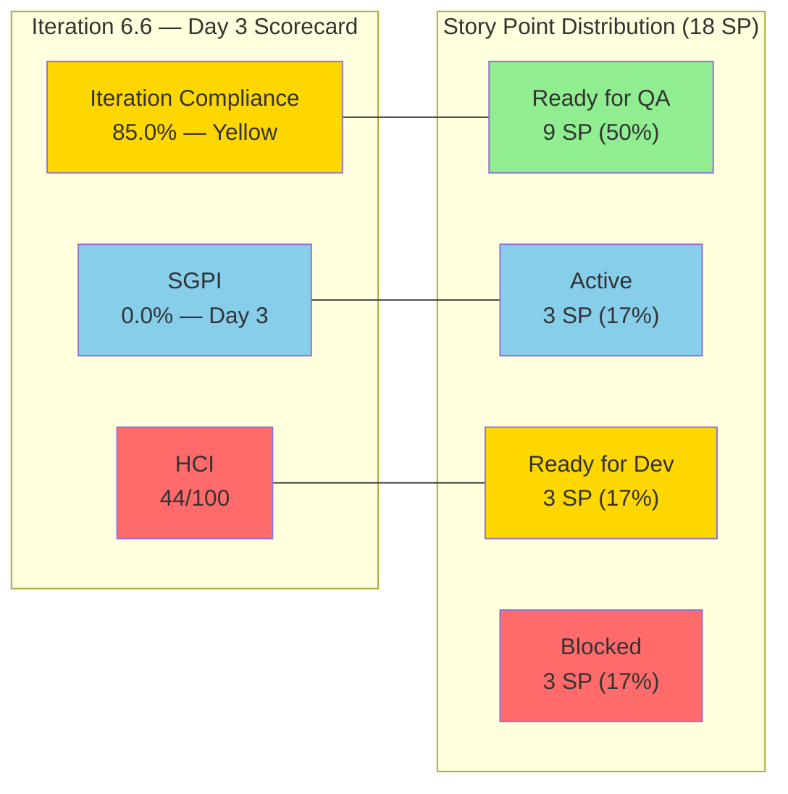
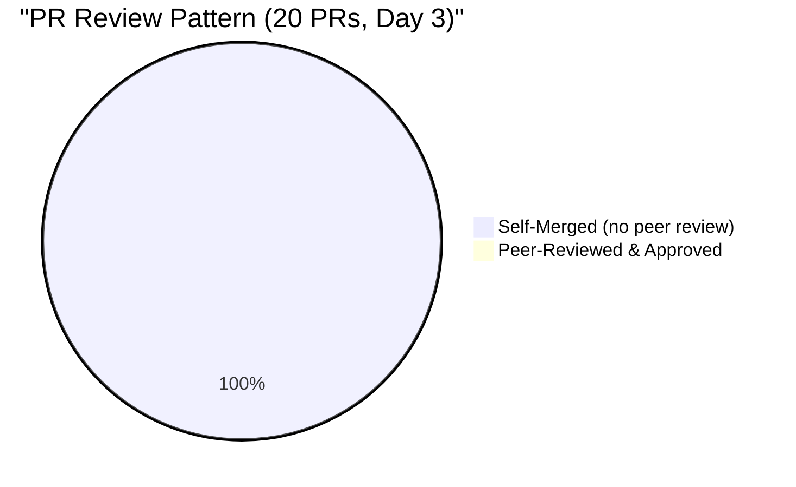

# Colina Health Iteration 6.6 (IP) — Day 3 Audit Report

**Date Generated:** March 25, 2026, 6:00 PM
**Audit Period:** Day 3 of 14
**Report Version:** 1.0
**Auditor Role:** Engineering Productivity (EngProd) Engineer

---

## Audit Metadata

### Iteration Context

- **Iteration:** 6.6 (IP)
- **Duration:** March 23 – April 5, 2026 (14 calendar days)
- **Status:** Day 3 (Early Iteration)
- **Current Phase:** Development + QA Testing in parallel

### Audit Boundary (Strictly Enforced)

- **ADO Organization:** `jairo`
- **ADO Project:** `Jairosoft Portfolio` (ID: `666bb99a-6acd-4999-bb34-efd0e4ea90dc`)
- **ADO Team:** `Colina Health Product Team` (ID: `66cdeb09-df38-4c3e-9418-0ed0d68c39f2`)
- **ADO Backlog:** `Microsoft.RequirementCategory` (Stories and Deliverables)
- **ADO Board URL:** `https://dev.azure.com/jairo/Jairosoft%20Portfolio/_boards/board/t/Colina%20Health%20Product%20Team/Stories%20and%20Deliverables`

### GitHub Repositories Analyzed

1. `https://github.com/jairosoft-com/colinahealth-fe.git`
2. `https://github.com/jairosoft-com/colinahealth-be.git`
3. `https://github.com/jairosoft-com/colina-health-ai-agent-code-fixing.git`

### Out-of-Scope Confirmation

**No other Azure DevOps boards, teams, projects, or GitHub repositories were analyzed.**

### Scores at a Glance

| Score                          | Value  | Status            |
| ------------------------------ | ------ | ----------------- |
| **Iteration Compliance Score** | 85.0%  | Yellow            |
| **SGPI** (Committed Scope)     | 0.0%   | Expected (Day 3)  |
| **HCI**                        | 44/100 | Needs Improvement |

---

## Executive Summary

### Iteration 6.6 Status: **Strong Start with Persistent Engineering Gaps**

As of **Day 3 of 14**, the Colina Health Product Team is showing significantly improved execution velocity compared to Iteration 6.5, with 50% of committed story points already at "Ready for QA." However, critical engineering hygiene issues from 6.5 — zero peer review, no branch protection, no CI/CD gates — remain unaddressed.

| Metric | Value | Status |
|--------|-------|--------|
| **Committed User Story SP** | 18 SP (6 stories) | Scoped |
| **Ready for QA** | 9 of 18 SP (50%) | Strong Early Velocity |
| **Active / In Development** | 3 of 18 SP (17%) | On Track |
| **Blocked** | 3 of 18 SP (17%) | Watch (201591) |
| **Not Started** | 3 of 18 SP (17%) | Expected (Day 3) |
| **PRs Merged (Days 1–3)** | 20 PRs (13 FE + 7 BE) | High Throughput |
| **PR Review Compliance** | 0% (zero peer reviews) | Engineering Risk |
| **6.5 Carry-Over Resolutions** | 3 items resolved (199600, 200364, 201142) | Positive Delta |

### Key Findings (Day 3)

**Positive Signals:**

- 3 stories (200188, 200189, 200373) advanced to "Ready for QA" in 3 days — strong PT Belongings feature velocity
- 6.5 blockers resolved: 199600 (phone validation), 200364 (Belongings forms), and 201142 (AHT entry) all merged to main on Day 1
- Story ownership rebalanced: Asnari now owns 4 of 6 stories (vs. pcoronia holding 5/7 in 6.5)
- 201439 (Schedule Technical Walkthrough spike) already closed — retro action from 6.5 executed

**Risk Signals:**

- 201591 (Lifecycle-Based Record Versioning, 3 SP) already **Blocked** on Day 3 after defects found during QA
- All 20 PRs self-merged — zero independent code reviews persist from 6.5
- Branch protection and CODEOWNERS remain unimplemented despite 6.5 remediation actions
- 200774 required another revert (BE#40, FE#97) — churn from 6.5 continues into 6.6
- 3 new defects created (201653, 201656, 201702) in first 3 days

---

## Iteration Scope and Methodology

### Planned Work Inventory (Day 3)

#### User Stories (6 total, 18 SP)

| ID | Title | SP | State | Assigned | Feature Parent |
|----|-------|-----|-------|----------|----------------|
| **200188** | PT Belongings Tab - Access View Reports | 3 | **Ready for QA** | Asnari Pacalna | 200179 |
| **200189** | PT Belongings Tab - View Reports Filter | 3 | **Ready for QA** | Asnari Pacalna | 200179 |
| **200373** | PT Belongings Tab - Custom Date Filter | 3 | **Ready for QA** | Asnari Pacalna | 200179 |
| **200180** | MAR Workflow - Schedule by Date Range (3-day) | 3 | **Active** | Paul Coronia | 197144 |
| **200333** | MAR Workflow - Schedule by Date Range (7-day) | 3 | **Ready for Dev** | Paul Coronia | 197144 |
| **201591** | PT Belongings - Lifecycle Record Versioning | 3 | **Blocked** | Asnari Pacalna | 200179 |

#### Other Items (7 total)

| ID | Title | Type | SP | State | Assigned |
|----|-------|------|----|-------|----------|
| **201452** | Tablet Responsiveness For ColinaHealth | Design | 5 | Ready for Design | Jaszmeine |
| **201438** | [Retro] Triage defects based on prioritization | Spike | — | Ready | Jaszmeine |
| **201439** | Schedule Technical Walkthrough | Spike | — | **Closed** | Carol Cuison |
| **201541** | Exploratory Testing/Collaborations/Update E2E | Spike | 3 | Active | Luzmibel |
| **201653** | Long PCP name overlaps content | Defect | — | New | Unassigned |
| **201656** | UI breaks with long patient name (Belongings) | Defect | — | New | Jaszmeine |
| **201702** | Submit button clickable without changes | Defect | — | New | Asnari |

### 6.5 → 6.6 Carry-Over Resolution

| 6.5 Item | 6.5 State | 6.6 Resolution | Evidence |
|----------|-----------|----------------|----------|
| **199600** (Phone Validation) | Back to Dev (regressed) | Merged to main | FE#95 (passed/qa branch) |
| **200364** (PT Belongings Add Form) | Blocked | Merged to main | FE#93, BE#37 (passed/qa branch) |
| **201142** (AHT Entry) | Peer Testing (stalled) | Merged to main | BE#29, BE#38 (passed/qa branch) |
| **200774** (7-Day Window) | Blocked | Reverted again | BE#40, FE#97 (revert of reapplied code) |

### Team Capacity

| Member | Role | Hours/Day | Days Off |
|--------|------|-----------|----------|
| Paul Coronia | Development | 6.0 | 0 |
| Jaszmeine Villanueva | Design | 3.6 | 0 |
| Luzmibel Paculanang | Testing | 4.0 | 0 |
| **Total** | — | **13.6** | **0** |

**Capacity Gap:** Asnari Pacalna (Kyaa-A) is not listed in the ADO team capacity model but is responsible for 75% of iteration PR output and owns 4 of 6 user stories. This represents a significant capacity modeling gap.

### Data Collection Methodology

**Phase 1: Azure DevOps Iteration Snapshot (March 25, 6:00 PM)**

- Queried current iteration via team settings API
- Extracted parent work items from `Microsoft.RequirementCategory` backlog
- Retrieved relations, acceptance criteria, and test case links for all user stories
- Captured team capacity and board lane assignments

**Phase 2: GitHub Activity Analysis (March 23–25 Window)**

- Enumerated all PRs across 3 scoped repositories
- Filtered to iteration window (March 23 – April 5)
- Traced PR-to-ADO linkage via branch names and PR titles
- Assessed merge patterns, review compliance, and developer distribution

**Phase 3: Cross-System Correlation**

- Matched iteration PRs to ADO work items
- Identified 6.5 carry-over resolutions merged at iteration start
- Classified PR activity by feature area and developer

---

## Scorecard Summary

---

## Sprint Goal Predictability (SGPI)

### Headline Score

**Committed Scope SGPI = 0 / 18 = 0.0%**

| Formula | Calculation | Value |
|---------|-------------|-------|
| **Committed Scope SGPI** (headline) | Closed SP / Total Committed SP | 0 / 18 = **0.0%** |
| Original Scope SGPI | Closed SP / Original Planned SP | 0 / 15 = **0.0%** |
| Delivered Proxy SGPI | (Closed + Passed QA SP) / Total Committed SP | 0 / 18 = **0.0%** |

### Context

On Day 3 of 14, a 0% SGPI is **expected** — no stories have completed the full lifecycle through Closed state. The meaningful signal at this stage is the **leading indicator**: 9 of 18 SP (50%) are already at "Ready for QA," suggesting strong delivery pipeline flow.

**Scope Change:** 201591 (3 SP) was added on Day 2, increasing committed scope from 15 SP to 18 SP. Original scope SGPI denominator is 15 SP.

### SGPI Trend (6.5 → 6.6 Day 3)

| Iteration | Day | Closed SP | Committed SP | SGPI |
|-----------|-----|-----------|-------------|------|
| 6.5 | Day 10 | 5 | 15 | 33.3% |
| 6.5 | Day 14 (Final) | 6 | 18 | 33.3% |
| 6.6 | Day 3 | 0 | 18 | 0.0% (expected) |

**Projection:** If the 3 "Ready for QA" stories (9 SP) pass QA by Day 7, and 200180 (3 SP, Active) completes development, the team could reach 12/18 SP = 66.7% SGPI by mid-iteration — a significant improvement over 6.5's final 33.3%.

---

## Developer Productivity Findings

### PR Merge Velocity: 20 PRs in 3 Days

#### Frontend: 13 PRs

| Developer | PR IDs | Count | Linked Work Items |
|-----------|--------|-------|-------------------|
| **Kyaa-A** | FE#90, 92, 94, 95, 96, 98, 99, 100, 101, 102 | 10 | 200188, 200189, 200373, 199600, 201591, 201641, 201642, 201661 |
| **pcoronia** | FE#91, 93, 97 | 3 | 200364, 200774 |
| **Total** | — | **13** | — |

#### Backend: 7 PRs

| Developer | PR IDs | Count | Linked Work Items |
|-----------|--------|-------|-------------------|
| **Kyaa-A** | BE#29, 38, 39, 41 | 4 | 201142, 201591, 201641, 201642 |
| **pcoronia** | BE#36, 37, 40 | 3 | 200364, 200774 |
| **Total** | — | **7** | — |

#### AI Agent Repo: 0 PRs in Iteration

- PR#9 (CONTRIBUTING.md) remains open since Feb 23 — hygiene debt, not iteration scope

### Developer Distribution

| Developer | PRs | % of Total | Primary Focus |
|-----------|-----|------------|---------------|
| **Kyaa-A (Asnari)** | 14 | 70% | PT Belongings Reports, Lifecycle Versioning |
| **pcoronia (Paul)** | 6 | 30% | 6.5 Carry-Over Resolution, MAR Workflow |

**Observation:** Kyaa-A is driving the majority of iteration code output while pcoronia is primarily cleaning up 6.5 carry-over (200364, 200774 reverts) before pivoting to new 6.6 MAR stories (200180). This is a healthy pattern: resolve prior-iteration debt before taking on new work.

### Velocity Comparison: 6.5 Day 3 vs. 6.6 Day 3

| Metric | 6.5 Day 3 (est.) | 6.6 Day 3 | Delta |
|--------|-------------------|-----------|-------|
| PRs Merged | ~15 | 20 | +33% |
| Stories at Ready for QA | 0 | 3 (9 SP) | Significant improvement |
| Blocked Items | 0 | 1 (3 SP) | Watch |

---

## SAFe Compliance Findings

### Feature Alignment

All 6 user stories are properly linked to parent Features:

- **Feature 197144** (MAR Workflow): 200180, 200333
- **Feature 200179** (PT Belongings): 200188, 200189, 200373, 201591

All stories are in the **Committed Goals** board lane, indicating proper sprint planning alignment.

### Acceptance Criteria Coverage

- **6/6 stories** (100%) have acceptance criteria defined
- **4/6 stories** (67%) have linked test cases (Tested By relations)
- **4/6 stories** have Figma mockup links
- **Missing test cases:** 200180 (MAR 3-day), 200333 (MAR 7-day) — both in early development

### Estimation Quality

All 6 stories are estimated at **3 SP each** (uniform sizing). While all items have estimates, the uniform sizing across functionally diverse stories (MAR date range vs. PT Belongings reports vs. lifecycle versioning) may indicate:

- Stories were split to uniform size during refinement (positive)
- Or estimation was done at a coarse level without differentiation (gap)

### Sprint Planning Discipline

- **5 of 6 stories** were in the iteration at sprint start
- **201591** (3 SP) was added on Day 2 (March 24) — mid-sprint scope addition
- **200373** carries over from 6.5 where it was "Ready for Dev" / not started

---

## Iteration Compliance Score

### Eligible Items: 6 User Stories (18 SP)

| Dimension | Eligible Items | Compliant Items | Failed Items | Score % | Weight | Weighted Contribution | Evidence | Reason |
|-----------|---------------|-----------------|-------------|---------|--------|----------------------|----------|--------|
| **Alignment** | 6 | 6 | 0 | 100.0% | 25 | 25.0 | All stories linked to parent Feature | 200180, 200333 → Feature 197144; 200188, 200189, 200373, 201591 → Feature 200179 |
| **Estimation** | 6 | 6 | 0 | 100.0% | 20 | 20.0 | All stories have SP assigned | All 6 stories carry 3 SP each |
| **Quality / DoD** | 6 | 4 | 2 | 66.7% | 35 | 23.3 | AC present on all; test case links on 4/6 | 200180 and 200333 lack Tested By links |
| **Iteration Integrity** | 6 | 5 | 1 | 83.3% | 20 | 16.7 | 1 mid-sprint scope addition | 201591 (3 SP) created Day 2; remaining 5 stories committed at sprint start |

### Overall Iteration Compliance Score: **85.0% — Yellow**

| Band       | Range          | Current   |
| ---------- | -------------- | --------- |
| Green      | >= 90%         |           |
| **Yellow** | **75 – 89.9%** | **85.0%** |
| Red        | < 75%          |           |

**Primary Gap:** Quality/DoD dimension at 66.7% due to missing test case links on the 2 MAR stories (200180, 200333). Creating test cases for these stories would raise the overall score to 91.7% (Green).

---

## Engineering Health Index (HCI)

### Dimension Scores

| #   | Dimension                           | Score | Evidence Summary                                                                                                                   |
| --- | ----------------------------------- | ----- | ---------------------------------------------------------------------------------------------------------------------------------- |
| 1   | **PR Review Compliance**            | 1/10  | 0% peer review; 20/20 PRs self-merged; no CODEOWNERS; no required reviewers                                                        |
| 2   | **Branch Protection & Enforcement** | 2/10  | No branch protection on main/develop; direct pushes possible; Gitflow model followed informally                                    |
| 3   | **CI/CD Gate Quality**              | 2/10  | No pre-merge CI gates; build failures caught post-merge; no automated test gates                                                   |
| 4   | **Code Ownership**                  | 4/10  | Implicit patterns exist (Kyaa-A → Belongings, pcoronia → MAR); no CODEOWNERS; single-dev knowledge silos per feature               |
| 5   | **Merge Hygiene & Churn**           | 5/10  | 200774 revert-of-revert churn; multiple incremental PRs for same feature; no merge conflicts                                       |
| 6   | **Work Item ↔ GitHub Traceability** | 8/10  | Most PRs include ADO IDs in title/branch; some reference child tasks vs. parent stories; good improvement over 6.5                 |
| 7   | **Sprint Discipline**               | 6/10  | 1 mid-sprint add (201591); proper board lanes; 6.5 cleanup done first; 200333 not started (acceptable Day 3)                       |
| 8   | **Defect Triage & Velocity**        | 4/10  | 3 new defects untriaged; 201438 spike for triage still "Ready"; 201591 blocked from defect; 6.5 defect backlog partially addressed |
| 9   | **Backlog & Story Hygiene**         | 7/10  | All stories have AC and SP; 4/6 have test links; 4/6 have mockups; uniform 3 SP sizing across diverse stories                      |
| 10  | **Capacity Balance & Ownership**    | 5/10  | Kyaa-A does 70% of PRs but not in capacity model; story distribution improved (4:2 vs. 6.5's 5:2); design/QA capacity allocated    |

### **HCI Total: 44/100**

### HCI Comparison: 6.5 Final vs. 6.6 Day 3

| Dimension | 6.5 Final | 6.6 Day 3 | Delta | Notes |
|-----------|-----------|-----------|-------|-------|
| PR Review Compliance | 1 | 1 | — | No change; 0% review rate persists |
| Branch Protection | 2 | 2 | — | Not implemented |
| CI/CD Gate Quality | 2 | 2 | — | Not implemented |
| Code Ownership | 3 | 4 | +1 | Better implicit patterns; still no CODEOWNERS |
| Merge Hygiene & Churn | 4 | 5 | +1 | Less churn overall; 200774 is legacy cleanup |
| Traceability | 7 | 8 | +1 | Improved PR naming discipline |
| Sprint Discipline | 5 | 6 | +1 | Better planning; retro actions being executed |
| Defect Triage | 3 | 4 | +1 | Triage spike created; still incomplete |
| Backlog Hygiene | 6 | 7 | +1 | All stories have AC; test cases improving |
| Capacity Balance | 4 | 5 | +1 | Story distribution improved |
| **Total** | **37** | **44** | **+7** | **Incremental improvement; infrastructure gaps persist** |

### Category Summary

| Category | Dimensions | Score | Assessment |
|----------|-----------|-------|------------|
| **Infrastructure & Gates** | PR Review, Branch Protection, CI/CD | 5/30 | Critical gap — no automated enforcement |
| **Development Practices** | Ownership, Merge Hygiene, Traceability | 17/30 | Improving — informal practices strengthening |
| **Process & Planning** | Sprint Discipline, Defect Triage, Backlog, Capacity | 22/40 | Moderate — planning improved, execution gaps remain |

### Remediation Priority for HCI

1. **Implement branch protection rules** on `main` and `develop` in FE and BE repos → +3–4 HCI points
2. **Add CODEOWNERS file** → +2–3 HCI points
3. **Require 1 reviewer** for PR merge → +4–5 HCI points
4. **Add pre-merge CI gate** (build + lint) → +3–4 HCI points
5. **Add Kyaa-A to capacity model** → +1–2 HCI points

Implementing items 1–3 alone could raise HCI from 44 to ~55–60.

---

## ADO-to-GitHub Traceability Analysis

### Iteration PR Linkage

| ADO Work Item | Type | GitHub PRs | PR Count | Traceability |
|---------------|------|------------|----------|--------------|
| **200188** (View Reports) | User Story | FE#90, 92, 94, 101, 102 | 5 | Linked via branch/title |
| **200189** (View Reports Filter) | User Story | FE#90, 92, 94 | 3 | Linked via title (shared PRs with 200188) |
| **200373** (Custom Date Filter) | User Story | FE#90, 92, 94 | 3 | Linked via title (shared PRs with 200188) |
| **201591** (Lifecycle Versioning) | User Story | FE#96, 98 / BE#39 | 3 | Linked via branch/title |
| **200180** (MAR 3-day) | User Story | — | 0 | In development; no PRs yet |
| **200333** (MAR 7-day) | User Story | — | 0 | Ready for Dev; not started |
| **201641, 201642** (Child tasks of 201591) | Task | FE#99 / BE#41 | 2 | Linked to child tasks, not parent story |
| **201661** (Child task of 201591) | Task | FE#100 | 1 | Linked to child task |
| **199600** (Phone Validation, 6.5) | Defect | FE#95 | 1 | Resolved; merged to main |
| **200364** (Belongings Add Form, 6.5) | User Story | FE#91, 93 / BE#36, 37 | 4 | Resolved; merged to main |
| **201142** (AHT Entry, 6.5) | Defect | BE#29, 38 | 2 | Resolved; merged to main |
| **200774** (7-Day Window, 6.5) | User Story | FE#97 / BE#40 | 2 | Revert cleanup |

### Traceability Quality: 90% (Strong)

**18 of 20 PRs** have explicit ADO work item IDs in either the branch name or PR title.

**Observation:** Some PRs reference child task IDs (201641, 201642, 201661) rather than the parent story (201591). While traceable, this creates an extra lookup step during audit. Recommendation: Reference both parent story and child task in PR titles.

---

## Collaboration and Review Analysis

### Code Review Compliance: **0% Independent Review**

**Findings:**

- **100% of merged PRs (20/20)** contain zero reviewer approvals
- **No CODEOWNERS file** in any scoped repo
- **No branch protection rules** requiring approval before merge
- This is a **persistent finding** from Iteration 6.5 (54/54 PRs self-merged)

**6.5 Remediation Action Status:**

- Action 2.2 (Branch Protection & CODEOWNERS): **Not implemented**
- Action 2.3 (Pre-Merge CI/CD Gates): **Not implemented**
- Action 3.3 (Code Review Culture): **Not implemented**

### Collaboration Signals

**Positive:**

- PR titles are consistently descriptive with ADO ticket references
- No merge conflicts observed across 20 PRs
- Cross-repo coordination (FE + BE PRs for same stories merged in tandem)
- 6.5 carry-over items resolved collaboratively at iteration start

**Negative:**

- Zero PR comments or discussion threads
- No pairing evidence (all PRs single-developer)
- No Co-Authored-By commits observed

---

## Repository Hygiene

### Branch Naming Convention

| Pattern | Examples | Compliance |
|---------|----------|-----------|
| `feature/<ID>-<slug>` | `feature/200188-view-reports` | Followed |
| `passed/qa/<ID>-<slug>` | `passed/qa/199600-phone-number-validation` | Followed |
| `defect/<ID>-<slug>` | `defect/201142-aht-entry-non-admission` | Followed |
| `revert/<ID>-<slug>` | `revert/200774-revert-reapplied-reverted-code` | Followed |

Branch naming discipline is **good** — consistent patterns with ADO IDs.

### Outstanding Hygiene Items

| Item | Repo | Status | Impact |
|------|------|--------|--------|
| PR#9 (CONTRIBUTING.md) | AI Agent | Open since Feb 23 | Low — documentation only |
| No CODEOWNERS | FE, BE, AI Agent | Missing | High — no automated reviewer assignment |
| No PR templates | FE, BE | Missing | Medium — PRs lack structured descriptions |
| No branch protection | FE, BE | Not configured | High — no merge gates |

---

## Risks and Bottlenecks

### Active Risks

| Risk | Severity | Evidence | Impact |
|------|----------|----------|--------|
| **201591 Blocked (Day 3)** | High | Created Day 2, already Blocked after QA found duplicate record + mutation issues | 3 SP at risk; blocks Belongings lifecycle feature |
| **Unreviewed Code** | High | 20 PRs self-merged; no branch protection; persistent from 6.5 | Elevated defect escape rate; compliance gap for EMR application |
| **Capacity Model Gap** | Medium | Kyaa-A (70% of PRs) not in team capacity; development capacity shows only 6h/day (Paul) | Sprint forecasting unreliable; burndown charts inaccurate |
| **New Defects Accumulating** | Medium | 3 new defects (201653, 201656, 201702) in 3 days; 201653 unassigned | If not triaged early, repeats 6.5's 13-defect untouched pattern |
| **200774 Churn Continues** | Medium | Another revert (BE#40, FE#97) — code reverted, re-applied, reverted again | Suggests root cause still unresolved; may re-emerge |
| **200333 Not Started** | Low | Ready for Dev; Paul focused on 200180 first | Expected on Day 3; becomes risk if still not started by Day 7 |

### Bottleneck: 201591 Blocker Analysis

**201591** (PT Belongings - Lifecycle Record Versioning) was created Day 2 and progressed rapidly:

- Day 2: Created → Active → QA Testing
- Day 3: QA Testing → **Blocked** (reason: "Moved out of state QA Testing")

PRs linked: FE#96, 98, 99, 100, 101, 102 / BE#39, 41

**Root cause indicators:**

- BE#41 title: "Fix duplicate record on same lifecycle edit and prevent old record mutation"
- FE#99 title: "Fix edit form loading merged state from all records"
- FE#100 title: "Persist user-entered Created By value on edit"
- FE#102 title: "Restrict type dropdown on edit mode"

These PRs suggest the feature encountered multiple edge cases during QA (duplicate records, state merging, type restriction). The story was moved to Blocked after QA found additional issues. This is a **healthy QA-driven block** — the team is finding issues through testing rather than shipping them.

---

## Prioritized Remediation Actions

### Phase 1: Immediate (Days 3–5)

#### Action 1.1: Unblock 201591 [Owner: Kyaa-A + QA]

- **Status:** Blocked after QA found duplicate record and mutation issues
- **Action:** Review QA findings; determine if remaining issues are blockers or can be deferred
- **Evidence:** 6 FE + 2 BE PRs already merged for fixes — assess if latest fixes resolve the block
- **Target:** Unblock by Day 5; move to Ready for QA or Passed QA

#### Action 1.2: Triage New Defects [Owner: Karl/Jaszmeine]

- **Items:** 201653 (unassigned), 201656 (Jaszmeine), 201702 (Asnari)
- **Action:** Assign 201653; classify all 3 as blocker/cosmetic; schedule fixes within iteration or defer
- **Target:** All 3 defects triaged and assigned by Day 4

#### Action 1.3: Add Kyaa-A to Team Capacity Model [Owner: Karl]

- **Gap:** Kyaa-A produces 70% of PRs but is not in the ADO capacity model
- **Action:** Add Asnari Pacalna with appropriate Development hours/day
- **Impact:** Accurate burndown charts and sprint forecasting

### Phase 2: Mid-Iteration (Days 5–10)

#### Action 2.1: Create Test Cases for MAR Stories [Owner: Luzmibel/QA]

- **Gap:** 200180 and 200333 lack Tested By links
- **Action:** Create test cases and link to stories before development completes
- **Impact:** Raises Iteration Compliance Score from 85.0% to 91.7% (Green)

#### Action 2.2: Start 200333 Development [Owner: Paul Coronia]

- **Status:** Ready for Dev; Paul currently focused on 200180
- **Action:** Begin 200333 after 200180 reaches Ready for QA
- **Target:** Development started by Day 7; Ready for QA by Day 10

#### Action 2.3: Implement Branch Protection [Owner: EngProd/Platform]

- **Persistent gap from 6.5** — this is the third consecutive audit flagging this
- **Action:** Enable branch protection on `main` in colinahealth-fe and colinahealth-be
  - Require 1 approval before merge
  - Require status checks to pass (if CI exists)
- **Impact:** +8–12 HCI points; addresses PR Review, Branch Protection, and CI/CD dimensions

### Phase 3: Late Iteration (Days 10–14)

#### Action 3.1: Add CODEOWNERS and PR Templates [Owner: EngProd]

- Create CODEOWNERS mapping (Kyaa-A → Belongings, pcoronia → MAR, Luzmibel → E2E)
- Add PR template with work item ID, testing checklist, and review gate
- **Impact:** +2–3 HCI points; improves onboarding and review culture

#### Action 3.2: Resolve 200774 Root Cause [Owner: Paul Coronia]

- **Pattern:** Merged → Reverted → Re-applied → Reverted again (3 revert cycles)
- **Action:** Root-cause analysis before re-attempting; consider architectural spike
- **Impact:** Prevents continued churn in 6.7

---

## Evidence Gaps and Limitations

| Gap | Impact | Mitigation |
|-----|--------|------------|
| **Day 3 of 14 — early iteration** | SGPI is 0% by design; many items not yet progressed | Leading indicators (50% at Ready for QA) provide proxy signal; re-audit recommended at Day 7–10 |
| **No CI/CD pipeline data** | Cannot assess build pass/fail rates or deployment frequency | Inferred from PR merge patterns and prior audit findings |
| **Kyaa-A identity mapping** | GitHub handle "Kyaa-A" mapped to ADO "Asnari Pacalna" by inference (PR content ↔ story assignments) | Not verified via account linking; may be incorrect |
| **200180 / 200333 test cases** | Cannot fully assess Quality/DoD dimension without test case links | Flagged as compliance gap; recommendation to create before mid-iteration |
| **No review comments data** | Cannot assess review quality or turnaround time | Moot — 0% review rate means no comments exist |
| **6.5 defect backlog carry-over** | Cannot confirm resolution status of 13 untouched defects from 6.5 | Would require querying each defect individually; out of Day 3 scope |

---

**Report Generated:** March 25, 2026, 6:00 PM
**Audit Period:** Day 3 of 14 (Iteration 6.6 IP)
**Status:** Early Iteration Checkpoint
**Recommended Next Audit:** Day 7–10 (March 29 – April 1, 2026)
