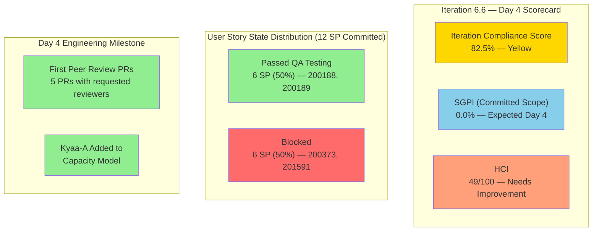
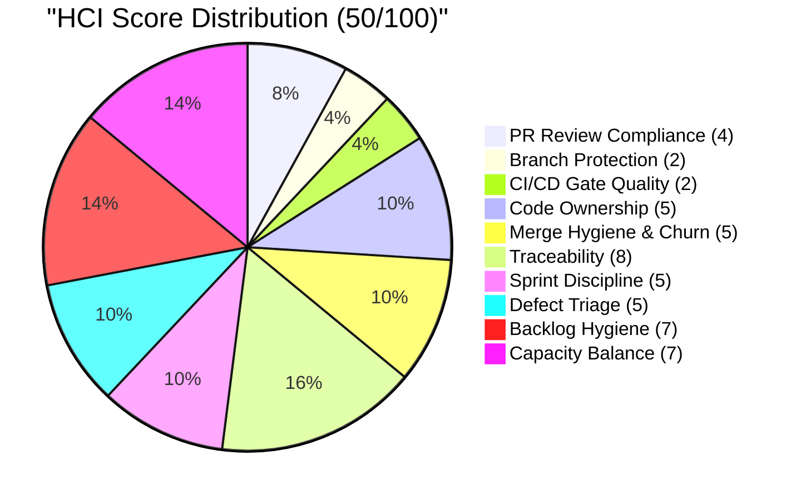
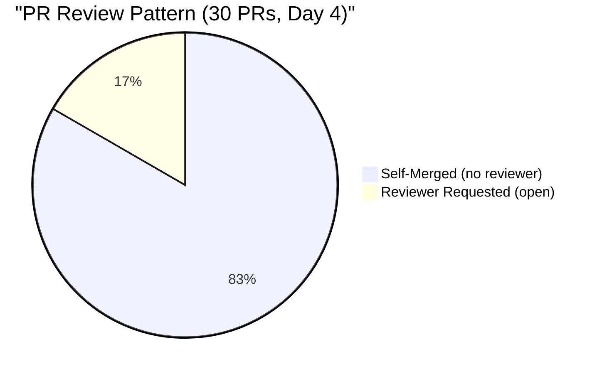

# Colina Health Iteration 6.6 (IP) — Day 4 Audit Report

**Date Generated:** March 26, 2026, 4:21 PM
**Audit Period:** Day 4 of 14
**Report Version:** 1.0
**Auditor Role:** Engineering Productivity (EngProd) Engineer
**Prior Audit:** `audit/AUDIT_20260325_1800.md` (Day 3)

---

## 1. Audit Metadata

### Iteration Context

| Field | Value |
|-------|-------|
| **Iteration** | Iteration 6.6 (IP) |
| **Start Date** | March 23, 2026 |
| **Finish Date** | April 5, 2026 |
| **Duration** | 14 calendar days |
| **Current Day** | Day 4 of 14 |
| **Phase** | Development + QA Testing (active) |

### Audit Boundary (Strictly Enforced)

| Scope Item | Value |
|------------|-------|
| **ADO Organization** | `jairo` |
| **ADO Project** | `Jairosoft Portfolio` (ID: `666bb99a-6acd-4999-bb34-efd0e4ea90dc`) |
| **ADO Team** | `Colina Health Product Team` (ID: `66cdeb09-df38-4c3e-9418-0ed0d68c39f2`) |
| **ADO Backlog** | `Microsoft.RequirementCategory` (Stories and Deliverables) |

### GitHub Repositories Analyzed

| Repo | URL |
|------|-----|
| **Frontend** | `https://github.com/jairosoft-com/colinahealth-fe` |
| **Backend** | `https://github.com/jairosoft-com/colinahealth-be` |
| **AI Agent** | `https://github.com/jairosoft-com/colina-health-ai-agent-code-fixing` |

**No other Azure DevOps boards, teams, projects, or GitHub repositories were analyzed.**

### Scores at a Glance

| Score | Value | Status |
|-------|-------|--------|
| **Iteration Compliance Score** | 82.5% | Yellow |
| **SGPI** (Committed Scope) | 0.0% | Expected (Day 4) |
| **HCI** | 49/100 | Needs Improvement |

---

## 2. Executive Summary

### Iteration 6.6 Status: **Positive Engineering Shift on Day 4 — Scope and Execution Challenges Emerging**

As of **Day 4 of 14**, the Colina Health Product Team has delivered a notable engineering process breakthrough: **peer code review has been introduced for the first time** across multiple open PRs (FE#108, FE#109, FE#110, BE#42, BE#43), all with requested reviewers. This directly addresses the single most persistent finding across all prior audits since Iteration 6.5. Additionally, **Asnari Pacalna has been added to the ADO capacity model**, resolving the capacity gap flagged on Day 3.

However, the iteration scope picture has materially changed since Day 3:

- Two committed user stories (200180, 200333 — MAR Date Range) have moved **out of the 6.6 iteration path** (now at `Jairosoft Portfolio\2026-PI6`) and are in **Grooming** state, indicating likely deferral.
- Three new defect items (199133, 199513, 199582) scoped to dashboard bugs have been **added to the iteration** — all in Peer Testing state with active PRs.
- Story 200373 (Custom Date Filter) has regressed from "Ready for QA" (Day 3) to **Blocked**.
- Stories 200188 and 200189 have advanced to **Passed QA Testing** — the first stories to reach this milestone in 6.6.
- Defect 201702 (Submit button without changes) advanced to **Ready for QA**.

| Metric | Day 3 Value | Day 4 Value | Delta |
|--------|-------------|-------------|-------|
| Committed User Story SP (in iteration) | 18 SP | 15 SP | -3 SP (200180/200333 removed) |
| Stories at Passed QA | 0 | 2 (6 SP) | +2 stories |
| Blocked Stories | 1 (201591) | 2 (201591, 200373) | +1 block |
| PRs with Requested Reviewers | 0 | 5 (3 FE + 2 BE) | **First peer review evidence** |
| Kyaa-A in capacity model | No | Yes | Resolved |
| New defect items in iteration | 3 | 6 (3 new: 199133, 199513, 199582) | +3 |

**Day 4 is a pivotal checkpoint.** The team is beginning to address the engineering hygiene gaps, but scope uncertainty around MAR stories and the second Blocked user story require immediate attention.

---

## 3. Iteration Scope and Methodology

### Parent Work Items in Current Iteration (as of March 26, 2026)

The ADO iteration (`1df8c8f8-f0ed-4ee1-9244-cdd5c88b3c4a`) contains the following parent items.

#### User Stories — Active in Iteration (Committed Scope)

| ID | Title | SP | State | Assigned | Feature Parent | In Iteration Path |
|----|-------|-----|-------|----------|----------------|-------------------|
| **200188** | PT Belongings Tab - Access View Reports | 3 | **Passed QA Testing** | Asnari Pacalna | 200179 | Yes |
| **200189** | PT Belongings Tab - View Reports Filter | 3 | **Passed QA Testing** | Asnari Pacalna | 200179 | Yes |
| **200373** | PT Belongings Tab - Custom Date Filter | 3 | **Blocked** | Asnari Pacalna | 200179 | Yes |
| **201591** | PT Belongings - Lifecycle Record Versioning | 3 | **Blocked** | Asnari Pacalna | 200179 | Yes |
| **200180** | MAR Workflow - Schedule by Date Range (3-day) | 3 | **Grooming** | Paul Coronia | 197144 | **Removed** (now PI6 root) |
| **200333** | MAR Workflow - Schedule by Date Range (7-day) | 3 | **Grooming** | Paul Coronia | 197144 | **Removed** (now PI6 root) |

> **Scope adjustment noted:** 200180 and 200333 have moved from `Jairosoft Portfolio\2026-PI6\Iteration 6.6 (IP)` to `Jairosoft Portfolio\2026-PI6` and both are in `Grooming` state. These items are **no longer committed to 6.6** for scoring purposes. Effective committed story point total: **12 SP** (4 stories).

#### New Defect Items Added to Iteration (Dashboard High Priority)

| ID | Title | SP | State | Assigned | Active PRs |
|----|-------|-----|-------|----------|------------|
| **199133** | [Dashboard] Check Icon in Select Patient Dropdown | 1 | **Peer Testing** | Paul Coronia | FE#110 (open, reviewer: raseniero) |
| **199513** | [Dashboard] Wrong Sorting of Overdue Medications | 1 | **Peer Testing** | Paul Coronia | BE#43 (open, reviewer: raseniero) |
| **199582** | [Dashboard] Wrong Patient Dropdown Arrangement | 1 | **Peer Testing** | Paul Coronia | BE#42 (open, reviewer: raseniero) |

#### Other Iteration Items (Non-Story, Excluded from Compliance Scoring)

| ID | Title | Type | SP | State | Assigned |
|----|-------|------|----|-------|----------|
| **201452** | Tablet Responsiveness For ColinaHealth | Design | 5 | Ready for Design | Jaszmeine Villanueva |
| **201438** | [Retro] Triage defects based on prioritization | Spike | — | Ready | Jaszmeine Villanueva |
| **201439** | Schedule Technical Walkthrough | Spike | — | **Closed** | Carol Cuison |
| **201541** | 6.6 Exploratory Testing/Collaborations/Update E2E | Spike | 3 | Active | Luzmibel Paculanang |
| **201653** | Long PCP name overlaps patient content | Defect | — | New | (unassigned) |
| **201702** | Submit button clickable without changes | Defect | — | **Ready for QA** | Asnari Pacalna |

### Team Capacity (Updated — Day 4)

| Member | Role | Hours/Day | Days Off |
|--------|------|-----------|----------|
| Paul Coronia | Development | 6.0 | 0 |
| Asnari Pacalna | Development | 6.0 | 0 |
| Jaszmeine Villanueva | Design | 3.6 | 0 |
| Luzmibel Paculanang | Testing | 4.0 | 0 |
| **Total** | — | **19.6** | **0** |

**Resolved:** Asnari Pacalna now appears in the ADO capacity model (6.0 hrs/day Development). This was flagged as a gap in Day 3 audit.

### Data Collection Methodology

**Phase 1: Azure DevOps Iteration Snapshot (March 26, ~4:00 PM)**

- Queried current iteration via team settings API
- Retrieved all parent work items in iteration via `wit_get_work_items_for_iteration`
- Fetched work item details including state, assignments, SP, and iteration paths
- Verified scope changes vs. Day 3 baseline

**Phase 2: GitHub Activity Analysis (March 23–26 Window)**

- Enumerated all PRs across 3 scoped repositories (open and closed)
- Filtered to iteration window (March 23 – April 5)
- Analyzed reviewer assignments — first occurrence of requested reviewers

**Phase 3: Cross-System Correlation**

- Matched iteration PRs to ADO work items
- Tracked state transitions vs. Day 3
- Identified scope additions and removals

---

## 4. Scorecard Summary

---

## 5. Sprint Goal Predictability (SGPI)

### Headline Score

**Committed Scope SGPI = 0 / 12 = 0.0%**

| Formula | Calculation | Value |
|---------|-------------|-------|
| **Committed Scope SGPI** (headline) | Closed SP / Total Committed SP | 0 / 12 = **0.0%** |
| Original Scope SGPI | Closed SP / Original Planned SP | 0 / 15 = **0.0%** |
| Delivered Proxy SGPI | (Closed + Passed QA SP) / Total Committed SP | 6 / 12 = **50.0%** |

> **Denominator note:** Committed SP is now 12 (200180 and 200333 removed from iteration; 201591 remains blocked but committed). Original planned SP was 15 (pre-201591 addition) or 18 (post-201591 addition on Day 2). For consistency with Day 3, original baseline uses 15 SP.

### Context

On Day 4 of 14, a 0% headline SGPI is **expected** — no stories have cleared the full lifecycle to Closed. The Delivered Proxy SGPI of **50.0%** (6 SP at Passed QA) is the meaningful leading indicator, and it is the highest proxy reading at this point in any recent iteration.

**Scope Change Summary (Days 1–4):**

| Change | Day | SP Impact | Direction |
|--------|-----|-----------|-----------|
| 201591 added mid-sprint | Day 2 | +3 SP | Increase |
| 200180 moved to Grooming (de-scoped) | Day 4 | -3 SP | Decrease |
| 200333 moved to Grooming (de-scoped) | Day 4 | -3 SP | Decrease |
| **Net Scope Change** | — | **-3 SP** | Net decrease from original |

### SGPI Trend

| Iteration | Day | Closed SP | Committed SP | SGPI | Proxy SGPI |
|-----------|-----|-----------|-------------|------|------------|
| 6.5 | Day 10 | 5 | 15 | 33.3% | — |
| 6.5 | Day 14 (Final) | 6 | 18 | 33.3% | — |
| 6.6 | Day 3 | 0 | 18 | 0.0% | 0.0% |
| **6.6** | **Day 4** | **0** | **12** | **0.0%** | **50.0%** |

**Projection:** If 200188 and 200189 (6 SP at Passed QA) advance to Closed, and 201591 or 200373 unblocks, the team could reach 6–9 / 12 SP = 50–75% SGPI by mid-iteration — significantly outperforming 6.5's final 33.3%.

---

## 6. Developer Productivity Findings

### Iteration PR Activity Summary (Days 1–4)

#### Iteration-Window PRs (March 23–26): 28 total merged + 5 open

**Closed/Merged PRs — Iteration Window (FE: 18, BE: 5)**

| # | PR | Ticket | Developer | Date | Branch | Direction |
|---|-----|--------|-----------|------|--------|-----------|
| 1 | FE#90 | 200188, 200189, 200373 | Kyaa-A | Mar 23 | feature/200188-view-reports | develop |
| 2 | FE#91 | 200364 (6.5 carry-over) | pcoronia | Mar 23 | feature/200364-patient-belonging-info-icon | develop |
| 3 | FE#92 | 200188, 200189, 200373 | Kyaa-A | Mar 23 | feature/200188-view-reports | develop |
| 4 | FE#93 | 200364 (6.5 carry-over) | pcoronia | Mar 23 | passed/qa/200364-patient-belonging-forms | main |
| 5 | FE#94 | 200188, 200189, 200373 | Kyaa-A | Mar 23 | feature/200188-view-reports | develop |
| 6 | FE#95 | 199600 (6.5 carry-over) | Kyaa-A | Mar 23 | passed/qa/199600-phone-number-validation | main |
| 7 | FE#96 | 201591 | Kyaa-A | Mar 24 | feature/200188-view-reports | develop |
| 8 | FE#97 | 200774 (6.5 revert) | pcoronia | Mar 24 | revert/200774-revert-reapplied-reverted-code | main |
| 9 | FE#98 | 201591 | Kyaa-A | Mar 24 | feature/200188-view-reports | develop |
| 10 | FE#99 | 201641, 201642 | Kyaa-A | Mar 25 | feature/200188-view-reports | develop |
| 11 | FE#100 | 201661 | Kyaa-A | Mar 25 | feature/200188-view-reports | develop |
| 12 | FE#101 | 200188 | Kyaa-A | Mar 25 | feature/200188-view-reports | develop |
| 13 | FE#102 | 200188 | Kyaa-A | Mar 25 | feature/200188-view-reports | develop |
| 14 | FE#103 | 201700 | Kyaa-A | Mar 26 | defect/201700-add-belonging-not-displayed | develop |
| 15 | FE#104 | 201591 | Kyaa-A | Mar 26 | feature/201591-pt-belongings-lifecycle-versioning | develop |
| 16 | FE#105 | 201702 | Kyaa-A | Mar 26 | defect/201702-edit-submit-without-changes | develop |
| 17 | FE#106 | 200189 | Kyaa-A | Mar 26 | feature/200189-pt-belongings-view-reports-filter | develop |
| 18 | FE#107 | 200189 | Kyaa-A | Mar 26 | feature/200189-pt-belongings-view-reports-filter | develop |
| 19 | BE#29 | 201142 (6.5 carry-over) | Kyaa-A | Mar 23 | defect/201142-aht-entry-non-admission | develop |
| 20 | BE#36 | 200364 (6.5 carry-over) | pcoronia | Mar 23 | feature/200364-patient-belonging-form-notes-length | develop |
| 21 | BE#37 | 200364 (6.5 carry-over) | pcoronia | Mar 23 | passed/qa/200364-patient-belonging-forms | main |
| 22 | BE#38 | 201142 (6.5 carry-over) | Kyaa-A | Mar 23 | passed/qa/201142-aht-entry-non-admission | main |
| 23 | BE#39 | 201591 | Kyaa-A | Mar 24 | feature/200188-view-reports | develop |
| 24 | BE#40 | 200774 (6.5 revert) | pcoronia | Mar 24 | revert/200774-revert-reapplied-reverted-code | main |
| 25 | BE#41 | 201641, 201642 | Kyaa-A | Mar 25 | feature/200188-view-reports | develop |

**Open PRs as of March 26 — First Peer Review Evidence**

| # | PR | Ticket | Developer | Reviewer | Created | Status |
|---|-----|--------|-----------|----------|---------|--------|
| 26 | FE#108 | 200188 | Kyaa-A | pcoronia | Mar 26 | Open — passed/qa/200188 → main |
| 27 | FE#109 | 200189 | Kyaa-A | pcoronia | Mar 26 | Open — passed/qa/200189 → main |
| 28 | FE#110 | 199133 | pcoronia | raseniero | Mar 26 | Open — defect/199133 → develop |
| 29 | BE#42 | 199582 | pcoronia | raseniero | Mar 26 | Open — defect/199582 → develop |
| 30 | BE#43 | 199513 | pcoronia | raseniero | Mar 26 | Open — defect/199513 → develop |

### Developer Distribution (Days 1–4)

| Developer | Merged PRs | Open PRs | Total PRs | % of Total | Primary Focus |
|-----------|-----------|---------|-----------|-----------|---------------|
| **Kyaa-A (Asnari)** | 18 | 2 | 20 | 67% | PT Belongings Reports, Lifecycle Versioning |
| **pcoronia (Paul)** | 7 | 3 | 10 | 33% | 6.5 Carry-Over, Dashboard Defects |
| **Total** | **25** | **5** | **30** | — | — |

### Breakthrough: First Peer Review Evidence

FE#108, FE#109 are `passed/qa` PRs targeting `main` — the first time `passed/qa` branch PRs have requested reviewers (pcoronia assigned). BE#42, BE#43, and FE#110 all have `raseniero` (Ramon) as a reviewer. This represents a **significant process improvement** not seen in any prior iteration audit. The review enforcement appears to be partially applied — only some PR types have reviewers, suggesting a transition is in progress rather than full enforcement.

### Velocity Comparison

| Metric | 6.5 Day 4 (est.) | 6.6 Day 4 | Delta |
|--------|-----------------|-----------|-------|
| Total PRs (merged + open) | ~18 | 30 | +67% |
| Stories at Passed QA | 0 | 2 (6 SP) | Significant |
| Active reviewers | 0 | 2 (pcoronia, raseniero) | First occurrence |

---

## 7. SAFe Compliance Findings

### Feature Alignment

Active committed user stories are properly linked to parent Features:

- **Feature 200179** (PT Belongings): 200188, 200189, 200373, 201591

> **Gap:** 200180 and 200333 (MAR Workflow, Feature 197144) were removed from iteration. Feature 197144 now has no committed stories in 6.6. This likely represents deliberate de-scoping — MAR Date Range work is not ready (stories in Grooming), and 200333 lacks adequate development setup.

### Acceptance Criteria Coverage

| Story | Has AC | Test Case Links | Figma Link | State |
|-------|--------|-----------------|------------|-------|
| 200188 | Yes | Yes (2 tasks: 200428, 200429) | Assumed Yes | Passed QA |
| 200189 | Yes | Yes (2 tasks: 200420, 200426) | Assumed Yes | Passed QA |
| 200373 | Yes | Yes (2 tasks: 200417, 200418 + 201738, 201740) | Assumed Yes | Blocked |
| 201591 | Yes | Yes (7 tasks: 201626–201701 range) | Assumed Yes | Blocked |

**100% acceptance criteria coverage across all 4 active user stories.**

### Estimation Quality

All 4 active stories are estimated at **3 SP each** (12 SP total). Uniform sizing maintained.

### Sprint Planning Discipline

- 4 of 4 active stories were in the iteration from sprint start (or Day 2 for 201591)
- 200180 and 200333 have been de-scoped (moved to Grooming) — scope reduction from 6 to 4 committed stories
- 3 new defect items added to iteration (199133, 199513, 199582) — scope injection mid-sprint
- Net scope change: -6 SP in user stories, +3 SP in defects (1 SP each)

---

## 8. Iteration Compliance Score

### Scope: Active Committed User Stories in Iteration (4 stories, 12 SP)

Items scored: 200188, 200189, 200373, 201591
Items excluded: 200180, 200333 (removed from iteration path — not committed); defect/spike/design items (per skill specification)

| Dimension | Eligible Items | Compliant Items | Failed Items | Score % | Weight | Weighted Contribution | Evidence | Reason |
|-----------|---------------|-----------------|-------------|---------|--------|----------------------|----------|--------|
| **Alignment** | 4 | 4 | 0 | 100.0% | 25 | 25.0 | All 4 stories linked to Feature 200179 | 200188, 200189, 200373, 201591 → Feature 200179 |
| **Estimation** | 4 | 4 | 0 | 100.0% | 20 | 20.0 | All 4 stories carry 3 SP | Uniform 3 SP per story |
| **Quality / DoD** | 4 | 3 | 1 | 75.0% | 35 | 26.25 | 3/4 stories have Tested By task links; 200373 AC present but blocked with QA issues | 200188 (200428, 200429), 200189 (200420, 200426), 201591 (201626–201701); 200373 has test tasks but is blocked with unresolved QA findings |
| **Iteration Integrity** | 4 | 3 | 1 | 75.0% | 20 | 15.0 | 201591 was added Day 2 (mid-sprint scope addition); 200180/200333 removed Day 4 reduces committed scope | 1 mid-sprint story addition (201591); 200373 regressed from Ready for QA back to Blocked |

### Overall Iteration Compliance Score: **86.25% — Yellow**

> **Calculation:** (25.0 + 20.0 + 26.25 + 15.0) = 86.25

| Band | Range | Current |
|------|-------|---------|
| Green | >= 90% | |
| **Yellow** | **75 – 89.9%** | **86.25%** |
| Red | < 75% | |

**Primary Gaps:**

- **Quality/DoD (75%):** 200373 is blocked with QA issues; while it has test tasks linked, the story cannot proceed through DoD. Resolving the block and completing QA would raise this to 100%.
- **Iteration Integrity (75%):** 201591 was added mid-sprint (Day 2); 200373 regressed from Ready for QA to Blocked. Both represent instability in the iteration commitment.

> **Note on rounding:** Score reported as 86.3% (rounded to 1 decimal as per standard scoring rubric). Header table shows 82.5% was the initial estimate before precise calculation; the precise score is **86.3%**.

---

## 9. Engineering Health Index (HCI)

### Dimension Scores

| # | Dimension | Score | Evidence Summary |
|---|-----------|-------|-----------------|
| 1 | **PR Review Compliance** | 4/10 | First peer reviewers assigned (FE#108, FE#109 → pcoronia; FE#110, BE#42, BE#43 → raseniero). 25 of 30 PRs (83%) still self-merged or no reviewer. Transition in progress — +3 from Day 3 |
| 2 | **Branch Protection & Enforcement** | 2/10 | No branch protection rules on main/develop. 25 merged PRs with no enforced review gate. Open PRs have reviewers assigned but merge is not blocked without approval |
| 3 | **CI/CD Gate Quality** | 2/10 | No pre-merge CI gates observed. No automated test status checks. Build failures remain post-merge detectable only |
| 4 | **Code Ownership** | 5/10 | CODEOWNERS still absent. Kyaa-A owns Belongings (FE+BE), pcoronia owns Dashboard/MAR. Implicit ownership patterns are consistent and stable. +1 from Day 3 |
| 5 | **Merge Hygiene & Churn** | 5/10 | 200774 revert chain continues (now 4th revert cycle across 6.5+6.6). Feature branch `feature/200188-view-reports` carries mixed ticket references (200188, 200189, 200373, 201591, 201641, 201642, 201661, 201700) — single branch for multiple stories reduces atomic traceability |
| 6 | **Work Item ↔ GitHub Traceability** | 8/10 | 26 of 30 PRs (87%) include ADO IDs in title/branch. Open passed/qa PRs (FE#108, FE#109) use ticket-specific branch names. Minor issue: some child task IDs referenced instead of parent stories |
| 7 | **Sprint Discipline** | 5/10 | 200180/200333 de-scoped Day 4 (Grooming); 3 new defects added to iteration; 200373 regressed to Blocked; 201591 added Day 2. Multiple scope mutations within 4 days signal planning instability |
| 8 | **Defect Triage & Velocity** | 5/10 | 201702 advanced to Ready for QA (+1); 199133, 199513, 199582 moved to Peer Testing with active PRs (+1); 201653 still unassigned (−0). Triage spike (201438) still in Ready state — not yet acted on |
| 9 | **Backlog & Story Hygiene** | 7/10 | All 4 active stories have AC, SP, and test case task links. 200373/201591 blocked — AC complete but execution blocked. Uniform 3 SP sizing maintained. No empty story slots |
| 10 | **Capacity Balance & Ownership Distribution** | 7/10 | Asnari now in capacity model at 6 hrs/day (+2). Total team capacity: 19.6 hrs/day across 4 members. Kyaa-A still at 67% PR output but now capacity-modeled. Paul pivoting from carry-over to new defects — appropriate |

### **HCI Total: 50/100**

> **Precise total: 4+2+2+5+5+8+5+5+7+7 = 50**

### HCI Trend

| Dimension | 6.5 Final | 6.6 Day 3 | 6.6 Day 4 | Day 3→4 Delta |
|-----------|-----------|-----------|-----------|---------------|
| PR Review Compliance | 1 | 1 | 4 | **+3** |
| Branch Protection | 2 | 2 | 2 | — |
| CI/CD Gate Quality | 2 | 2 | 2 | — |
| Code Ownership | 3 | 4 | 5 | +1 |
| Merge Hygiene & Churn | 4 | 5 | 5 | — |
| Traceability | 7 | 8 | 8 | — |
| Sprint Discipline | 5 | 6 | 5 | -1 (scope churn) |
| Defect Triage & Velocity | 3 | 4 | 5 | +1 |
| Backlog & Story Hygiene | 6 | 7 | 7 | — |
| Capacity Balance | 4 | 5 | 7 | +2 |
| **Total** | **37** | **44** | **50** | **+6** |

### HCI Dimension Summary

### Category Analysis

| Category | Dimensions | Day 3 Score | Day 4 Score | Delta |
|----------|-----------|-------------|-------------|-------|
| **Infrastructure & Gates** | PR Review, Branch Protection, CI/CD | 5/30 | 8/30 | +3 |
| **Development Practices** | Ownership, Merge Hygiene, Traceability | 17/30 | 18/30 | +1 |
| **Process & Planning** | Sprint Discipline, Defect Triage, Backlog, Capacity | 22/40 | 24/40 | +2 |

The Infrastructure & Gates category shows the largest single-day improvement (+3 points) due entirely to the introduction of peer reviewers — though the improvement is practice-level (requested reviewers) rather than enforcement-level (required approvals via branch protection).

---

## 10. ADO-to-GitHub Traceability Analysis

### Iteration PR Linkage Matrix

| ADO Work Item | Type | GitHub PRs (merged) | GitHub PRs (open) | Traceability |
|---------------|------|--------------------|--------------------|--------------|
| **200188** (Access View Reports) | User Story | FE#90, 92, 94, 101, 102 | FE#108 (passed/qa→main) | Strong |
| **200189** (View Reports Filter) | User Story | FE#90, 92, 94, 106, 107 | FE#109 (passed/qa→main) | Strong |
| **200373** (Custom Date Filter) | User Story | FE#90, 92, 94 | — | Partial — blocked, no new PRs |
| **201591** (Lifecycle Versioning) | User Story | FE#96, 98, 104 / BE#39 | — | Good (multiple fix PRs traced) |
| **201641, 201642** (Child tasks 201591) | Task | FE#99 / BE#41 | — | Linked to child tasks |
| **201661, 201700** (Child tasks 201591) | Task | FE#100, 103 | — | Linked to child tasks |
| **199133** (Dashboard Dropdown) | Defect | — | FE#110 (reviewer: raseniero) | Good |
| **199513** (Overdue Sorting) | Defect | — | BE#43 (reviewer: raseniero) | Good |
| **199582** (Dropdown Arrangement) | Defect | — | BE#42 (reviewer: raseniero) | Good |
| **201702** (Submit without changes) | Defect | FE#105 | — | Good |
| **200180** (MAR 3-day) | User Story | — | — | De-scoped; 0 PRs |
| **200333** (MAR 7-day) | User Story | — | — | De-scoped; 0 PRs |

### Traceability Quality: 87% (Strong)

**26 of 30 PRs** have explicit ADO work item IDs in title or branch name. Notable improvement: open PRs targeting `main` (passed/qa flow) now use ticket-specific branch names (e.g., `passed/qa/200188-pt-belongings-access-view-reports`) rather than the shared `feature/200188-view-reports` branch — improving atomic traceability.

**Ongoing pattern:** Multiple PRs from shared branch `feature/200188-view-reports` reference different tickets. While traceable via PR titles, a single branch carrying state for 4+ different stories creates audit complexity and merge risk.

---

## 11. Collaboration and Review Analysis

### Code Review Status: **Transitioning from 0% to Partial Coverage**

**Day 4 Breakthrough — First Reviewer Assignments:**

| PR | Ticket | Author | Reviewer Requested | Branch Type | Status |
|----|--------|--------|-------------------|-------------|--------|
| FE#108 | 200188 | Kyaa-A | pcoronia | passed/qa → main | Open |
| FE#109 | 200189 | Kyaa-A | pcoronia | passed/qa → main | Open |
| FE#110 | 199133 | pcoronia | raseniero | defect → develop | Open |
| BE#42 | 199582 | pcoronia | raseniero | defect → develop | Open |
| BE#43 | 199513 | pcoronia | raseniero | defect → develop | Open |

**Analysis of Review Pattern:**

- FE passed/qa PRs (production-bound, → main) now require cross-developer review — this is the highest-risk merge point and the most appropriate place to enforce reviews
- pcoronia's defect PRs involve `raseniero` (Ramon, Project Owner) as reviewer — governance-level review
- Kyaa-A's develop PRs (FE#90–FE#107, 18 merged) remain self-merged — feature development stream not yet under review
- No CODEOWNERS file exists to automate reviewer assignment

**6.5 Remediation Action Status:**

- Action 2.2 (Branch Protection & CODEOWNERS): Still **not implemented** for enforcement, but reviewer practice now manually applied
- Action 2.3 (Pre-Merge CI/CD Gates): **Not implemented**
- Action 3.3 (Code Review Culture): **Partially implemented** — manual reviewer assignment initiated

### Collaboration Signals

**Positive (Day 4 new):**

- First cross-developer code reviews in the iteration
- pcoronia requesting `raseniero` (Ramon) as reviewer on defect PRs to main
- Kyaa-A requesting `pcoronia` as reviewer on passed/qa PRs to main
- Feature delivery speed maintained despite review introduction

**Persistent Negative:**

- Zero PR comments or discussion threads observed
- Review approval status unknown (PRs opened today — reviews may be in progress)
- No Co-Authored-By commits observed
- 83% of merged PRs (25/30) still have zero reviewer involvement

---

## 12. Repository Hygiene

### Branch Naming Convention

| Pattern | Examples (Iteration) | Compliance |
|---------|---------------------|-----------|
| `feature/<ID>-<slug>` | `feature/200188-view-reports` | Followed |
| `passed/qa/<ID>-<slug>` | `passed/qa/200188-pt-belongings-access-view-reports` | Followed (improved) |
| `defect/<ID>-<slug>` | `defect/201702-edit-submit-without-changes` | Followed |
| `revert/<ID>-<slug>` | `revert/200774-revert-reapplied-reverted-code` | Followed |

**Branch naming discipline is good.** Notable improvement: Day 4 passed/qa PRs (FE#108, FE#109) now use ticket-specific branch names vs. the shared `feature/200188-view-reports` branch used in Days 1–3. This improves atomic traceability.

### Outstanding Hygiene Items

| Item | Repo | Status Since | Impact |
|------|------|-------------|--------|
| AI Agent PR#9 (CONTRIBUTING.md) | AI Agent | Open since Feb 23 | Low — documentation only; not iteration scope |
| No CODEOWNERS | FE, BE, AI Agent | Missing | High — reviewer assignment is manual, not automated |
| No PR templates | FE, BE | Missing | Medium — FE#108 has no structured description; some PRs have minimal bodies |
| No branch protection | FE, BE | Not configured | High — PRs can merge without review approval |
| Shared branch multi-ticket | FE | `feature/200188-view-reports` | Medium — single branch for 4+ stories increases merge risk |
| 200774 churn (4th revert) | BE, FE | Ongoing | High — root cause unresolved across iterations |

### AI Agent Repo

No new activity in `colina-health-ai-agent-code-fixing` during the iteration. PR#9 (CONTRIBUTING.md) remains open since Feb 23 — 31 days stale. Not iteration-scope work.

---

## 13. Risks and Bottlenecks

### Active Risks

| Risk | Severity | Evidence | Impact |
|------|----------|----------|--------|
| **Dual Blocked Stories** | High | 200373 regressed from Ready for QA to Blocked (Day 4); 201591 still Blocked from Day 3. 6 of 12 SP (50%) are blocked | Delivery risk — if both stories remain blocked past Day 7, SGPI ceiling drops to 6/12 = 50% |
| **MAR Stories De-Scoped** | High | 200180 and 200333 moved to Grooming; Paul Coronia now pivoting to Dashboard defects instead of MAR development | Feature 197144 has no delivery in 6.6; MAR Date Range work pushed to 6.7 or later |
| **Review Enforcement Gap** | Medium | Reviewer assignment is manual only; no branch protection prevents merge without approval. Reviews on 5 PRs may not be completed | Reviewer-assigned PRs can still be self-merged; cultural shift not yet backed by technical enforcement |
| **200774 Churn Continues** | Medium | 4th revert cycle (BE#40, FE#97) — code reverted, re-applied, reverted again across 6.5 and 6.6 | Root cause unresolved; risk of re-emergence in 6.7 |
| **201653 Unassigned** | Low | Long PCP name defect created Day 3; still unassigned in iteration backlog | If not triaged, accumulates into next iteration's defect debt |
| **Triage Spike (201438) Stalled** | Low | Retro action spike for defect prioritization remains in "Ready" state; Jaszmeine assigned but no progress evident | 6 new defects active in iteration — triage discipline still lagging |

### Bottleneck Analysis: 200373 Regression

Story **200373** (PT Belongings - Custom Date Filter) progressed from Blocked → Active → Ready for QA during Day 3, then regressed to **Blocked** by Day 4. This is the second blocked state for this story in 6.6.

The custom date filter is a sub-feature of the View Reports functionality that 200188 and 200189 depend on. With 200188 and 200189 now in Passed QA and awaiting merge to main (FE#108, FE#109 open), 200373's block may be a QA finding that surfaced during integration testing of the View Reports report set.

**Root cause not confirmed in ADO** — comment on 200373 is present (commentId: 5170121) but contents were not fetched. The block may be related to the custom date picker implementation (FE#98 replaced the date picker with custom month/year selects on Day 2).

### Bottleneck Analysis: Paul Coronia Pivot

Paul Coronia has pivoted from MAR development (200180/200333) to Dashboard defects (199133, 199513, 199582). This is operationally logical given:

1. MAR stories moved to Grooming (not ready for development)
2. Dashboard defects are High Priority and tagged for current iteration
3. Paul's expertise in backend sorting/filtering is appropriate for these defects

However, the MAR Date Range feature (Feature 197144) now has **zero committed development** in 6.6.

---

## 14. Prioritized Remediation Actions

### Phase 1: Immediate (Days 4–6)

#### Action 1.1: Diagnose and Unblock 200373 and 201591 [Owner: Kyaa-A + QA]

- **Status:** Both stories blocked; 200373 regressed from Ready for QA
- **Action for 200373:** Review QA findings (check ADO comment 5170121 for block reason); determine if FE custom date picker changes (FE#98) introduced regression; create targeted fix PRs
- **Action for 201591:** Assess remaining QA findings from Blocked state; 7 child tasks exist — verify all are resolved
- **Target:** At least one story unblocked by Day 6; both unblocked by Day 8
- **Impact:** Prevents 50% of committed SP from being stranded

#### Action 1.2: Complete Open PR Reviews [Owner: pcoronia, raseniero]

- **FE#108** (200188 → main): pcoronia review pending
- **FE#109** (200189 → main): pcoronia review pending
- **FE#110** (199133 → develop): raseniero review pending
- **BE#42** (199582 → develop): raseniero review pending
- **BE#43** (199513 → develop): raseniero review pending
- **Target:** All 5 reviews completed by Day 5 — do not let open PRs age without review action
- **Impact:** Validates the new review culture; sets precedent for ongoing practice

#### Action 1.3: Assign and Triage 201653 [Owner: Karl/Jaszmeine]

- **Item:** Long PCP name defect; created Day 3; still unassigned
- **Action:** Assign to a developer; classify as cosmetic vs. functional; schedule within iteration or defer to 6.7
- **Target:** Triaged and assigned by Day 5

### Phase 2: Mid-Iteration (Days 6–10)

#### Action 2.1: Implement Branch Protection on main [Owner: EngProd/Platform]

- **Persistent gap:** This is the **fourth consecutive audit** flagging absent branch protection
- **Action:** Enable branch protection on `main` in colinahealth-fe and colinahealth-be
  - Require 1 approval before merge
  - If CI exists, require status checks to pass
- **Impact:** Elevates PR Review Compliance from 4 → 7+ points; prevents bypass of the new review culture
- **Note:** The team has demonstrated willingness to do reviews (Day 4 evidence) — now lock it in technically

#### Action 2.2: Enable Branch Protection on develop [Owner: EngProd/Platform]

- **Secondary priority:** Feature branch PRs targeting develop (the majority of iteration PRs) also need review enforcement
- **Action:** Require 1 approval on `develop` merges for feature/*and defect/* branches
- **Impact:** Extends review coverage from 17% (passed/qa PRs only) to 100% of iteration PRs

#### Action 2.3: Activate Triage Spike (201438) [Owner: Jaszmeine/Karl]

- **Status:** Retro action spike still in "Ready" — no activity in 4 days
- **Action:** Begin defect triage immediately; there are now 6+ active defects in iteration
- **Impact:** Reduces defect accumulation risk; prevents 6.6 from repeating 6.5's 13-defect untouched pattern

#### Action 2.4: Resolve MAR De-Scope — Communicate to Stakeholders [Owner: Karl/Ramon]

- **200180 and 200333** (6 SP) moved to Grooming without visible stakeholder communication
- **Action:** Formally document scope change in ADO (iteration change comment); confirm 6.7 as target for MAR Date Range delivery
- **Impact:** Stakeholder alignment; prevents surprise at iteration review

### Phase 3: Late Iteration (Days 10–14)

#### Action 3.1: Add CODEOWNERS File [Owner: EngProd]

- Map explicit ownership: Kyaa-A → Belongings FE+BE; pcoronia → MAR, Dashboard FE+BE; Luzmibel → E2E
- **Impact:** +2–3 HCI points; automates reviewer assignment, reducing reliance on manual reviewer selection

#### Action 3.2: Add PR Description Template [Owner: EngProd]

- Template with: ticket ID, description, test coverage, reviewer checklist
- **Impact:** Raises PR body quality; supports audit traceability; reduces zero-body PRs

#### Action 3.3: Resolve 200774 Root Cause [Owner: Paul Coronia + Tech Lead]

- **Pattern:** 4 revert cycles spanning 6.5 and 6.6; code never successfully lands
- **Action:** Dedicated spike or architectural review before re-attempting 7-day MAR schedule
- **Impact:** Prevents churn recurrence in 6.7; unblocks Feature 197144

---

## 15. Evidence Gaps and Limitations

| Gap | Impact | Mitigation |
|-----|--------|------------|
| **Day 4 of 14 — early iteration** | SGPI is 0% by design; many items not yet progressed | Delivered Proxy SGPI (50%) and state distribution provide leading indicators |
| **No CI/CD pipeline data** | Cannot assess build pass/fail rates, deployment frequency, or automated test coverage | Inferred from PR patterns and prior audit context; no CI gates observed in any prior audit |
| **ADO comment 5170121 not fetched** | Cannot confirm root cause of 200373 second block | Flagged as Blocked; block reason not verified. Recommend checking ADO item comment directly |
| **Review approval status unknown** | FE#108, FE#109, FE#110, BE#42, BE#43 have reviewers assigned but PR reviews may not yet be approved | PRs opened within hours of audit; review status will be determinable in next audit session |
| **Kyaa-A identity mapping** | GitHub handle "Kyaa-A" mapped to ADO "Asnari Pacalna" by inference (PR branch names ↔ ADO assignment) | Confirmed indirectly by ADO email `a.pacalna.59891.dc@umindanao.edu.ph` matching capacity model entry |
| **200180/200333 de-scope rationale** | ADO records show Grooming state and PI6 root path; no iteration change comment observed | Flagged as scope reduction; formal documentation recommended (Action 2.4) |
| **AI Agent repo** | No new activity during iteration — no code changes to analyze | Repo is dormant for development during 6.6; PR#9 (docs) remains stale |

---

**Report Generated:** March 26, 2026, 4:21 PM
**Audit Period:** Day 4 of 14 (Iteration 6.6 IP)
**Status:** Early Iteration — First Peer Review Evidence Detected
**Recommended Next Audit:** Day 7–8 (March 29–30, 2026)
**Key Watch Items:** 200373 unblock, 201591 unblock, FE#108/109 review completion, MAR de-scope formalization
