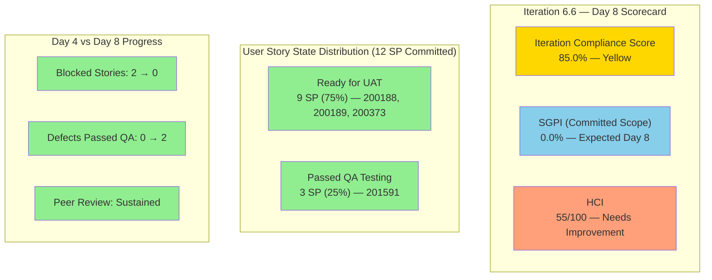

# Colina Health Iteration 6.6 (IP) — Day 8 Audit Report

**Date Generated:** March 30, 2026, 9:00 AM
**Audit Period:** Day 8 of 14
**Report Version:** 1.0
**Auditor Role:** Engineering Productivity (EngProd) Engineer
**Prior Audit:** `audit/AUDIT_20260326_1621.md` (Day 4)

---

## 1. Audit Metadata

### Iteration Context

| Field | Value |
|-------|-------|
| **Iteration** | Iteration 6.6 (IP) |
| **Start Date** | March 23, 2026 |
| **Finish Date** | April 5, 2026 |
| **Duration** | 14 calendar days |
| **Current Day** | Day 8 of 14 |
| **Phase** | Mid-Sprint QA / UAT Transition |

### Audit Boundary (Strictly Enforced)

| Scope Item | Value |
|------------|-------|
| **ADO Organization** | `jairo` |
| **ADO Project** | `Jairosoft Portfolio` (ID: `666bb99a-6acd-4999-bb34-efd0e4ea90dc`) |
| **ADO Team** | `Colina Health Product Team` (ID: `66cdeb09-df38-4c3e-9418-0ed0d68c39f2`) |
| **ADO Backlog** | `Microsoft.RequirementCategory` (Stories and Deliverables) |

### GitHub Repositories Analyzed

| Repo | URL |
|------|-----|
| **Frontend** | `https://github.com/jairosoft-com/colinahealth-fe` |
| **Backend** | `https://github.com/jairosoft-com/colinahealth-be` |
| **AI Agent** | `https://github.com/jairosoft-com/colina-health-ai-agent-code-fixing` |

**No other Azure DevOps boards, teams, projects, or GitHub repositories were analyzed.**

### Scores at a Glance

| Score | Value | Status | Day 4 Value | Delta |
|-------|-------|--------|-------------|-------|
| **Iteration Compliance Score** | 85.0% | Yellow | 82.5% | +2.5 |
| **SGPI** (Committed Scope) | 0.0% | Expected (Day 8) | 0.0% | -- |
| **HCI** | 55/100 | Needs Improvement | 49/100 | +6 |

---

## 2. Executive Summary

### Iteration 6.6 Status: **Strong Recovery — All Committed Stories Unblocked and Advancing to UAT**

As of **Day 8 of 14**, the Colina Health Product Team has achieved a major turnaround since the Day 4 audit. The two most critical risks flagged on Day 4 — blocked stories 200373 and 201591 — have **both been unblocked** and advanced through QA. All four committed user stories are now at or past QA Testing:

- **200188** and **200189** advanced from Passed QA Testing to **Ready for UAT**
- **200373** advanced from Blocked to **Ready for UAT** (unblocked)
- **201591** advanced from Blocked to **Passed QA Testing** (unblocked)

The defect remediation picture is also improving: 199133 reached Passed QA Testing, 201702 reached Passed QA Testing, and 199513 is in QA Testing. Only 199582 regressed to Back to Dev after QA found additional issues.

The peer review practice introduced on Day 4 has been sustained, with PRs continuing to include requested reviewers (FE#108, FE#109, FE#113, FE#115). PR merge velocity has been high — 14 FE PRs and 6 BE PRs merged within the iteration window.

| Metric | Day 4 Value | Day 8 Value | Delta |
|--------|-------------|-------------|-------|
| Committed User Story SP | 12 SP (4 stories) | 12 SP (4 stories) | Stable |
| Stories at Ready for UAT or better | 0 | 3 (9 SP) | +3 stories |
| Stories at Passed QA Testing | 2 (6 SP) | 1 (3 SP, 201591) | (2 advanced to UAT) |
| Blocked Stories | 2 (200373, 201591) | 0 | **All unblocked** |
| Defects at Passed QA or better | 0 | 2 (199133, 201702) | +2 |
| Defects at Back to Dev | 0 | 1 (199582) | +1 regression |
| PRs with Requested Reviewers | 5 | 6+ (continuing) | Sustained |
| FE PRs merged in iteration | ~8 | 20+ | High velocity |
| BE PRs merged in iteration | ~4 | 8+ | High velocity |

**Day 8 is the midpoint checkpoint.** The team is well-positioned to close stories through UAT in the remaining 6 days. The primary risk is the 199582 defect regression and 4 defects sitting in New/unassigned states outside the iteration path.

---

## 3. Iteration Scope and Methodology

### Parent Work Items in Current Iteration (as of March 30, 2026)

#### User Stories — Active in Iteration (Committed Scope)

| ID | Title | SP | State | Assigned | In Iteration Path |
|----|-------|-----|-------|----------|-------------------|
| **200188** | PT Belongings Tab - Access View Reports | 3 | **Ready for UAT** | Asnari Pacalna | Yes |
| **200189** | PT Belongings Tab - View Reports Filter | 3 | **Ready for UAT** | Asnari Pacalna | Yes |
| **200373** | PT Belongings Tab - Custom Date Filter | 3 | **Ready for UAT** | Asnari Pacalna | Yes |
| **201591** | PT Belongings - Lifecycle Record Versioning | 3 | **Passed QA Testing** | Asnari Pacalna | Yes |

> **Scope stable since Day 4.** 200180 and 200333 remain excluded (Grooming at PI6 root). Committed story point total: **12 SP** (4 stories).

#### User Stories — Excluded from Iteration (Grooming/Deferred)

| ID | Title | SP | State | Assigned | Iteration Path |
|----|-------|-----|-------|----------|----------------|
| **200180** | MAR Workflow - Schedule by Date Range (3-day) | 3 | Grooming | Paul Coronia | `2026-PI6` (root) |
| **200333** | MAR Workflow - Schedule by Date Range (7-day) | 3 | Grooming | Paul Coronia | `2026-PI6` (root) |

#### Defect Items in Iteration

| ID | Title | SP | State | Assigned | In Iteration Path |
|----|-------|-----|-------|----------|-------------------|
| **199133** | Dashboard Check Icon in Select Patient Dropdown | 1 | **Passed QA Testing** | Paul Coronia | Yes |
| **199513** | Dashboard Overdue Medication Wrong Sorting | 1 | **QA Testing** | Paul Coronia | Yes |
| **199582** | Dashboard Wrong Patient Dropdown Arrangement | 1 | **Back to Dev** | Paul Coronia | Yes |
| **201702** | Edit Submit Without Changes | -- | **Passed QA Testing** | Asnari Pacalna | `2026-PI6` (root) |
| **201653** | Long PCP Name Overlaps Content | -- | New | (unassigned) | `Jairosoft Portfolio` (root) |
| **201792** | Non-required Fields Show Asterisk | -- | New | Jaszmeine Villanueva | `Jairosoft Portfolio` (root) |
| **201795** | File Upload Shows Wrong Max Size | -- | New | Jaszmeine Villanueva | `Jairosoft Portfolio` (root) |

#### Other Iteration Items (Non-Story)

| ID | Title | Type | SP | State | Assigned |
|----|-------|------|----|-------|----------|
| **201452** | Tablet Responsiveness For ColinaHealth | Design | 5 | Ready for Design | Jaszmeine Villanueva |
| **201438** | Triage Defects Based on Prioritization | Spike | -- | Ready | Jaszmeine Villanueva |
| **201439** | Schedule Technical Walkthrough | Spike | -- | **Closed** | Carol Cuison |
| **201541** | 6.6 Exploratory Testing/Collaborations | Spike | 3 | Active | Luzmibel Paculanang |

### Team Capacity (Day 8)

| Member | Role | Hours/Day | Days Off |
|--------|------|-----------|----------|
| Paul Coronia | Development | 6.0 | 0 |
| Asnari Pacalna | Development | 6.0 | 0 |
| Jaszmeine Abigaille Villanueva | Design | 3.6 | 0 |
| Luzmibel Paculanang | Testing | 4.0 | 0 |
| **Total** | -- | **19.6** | **0** |

### Data Collection Methodology

**Phase 1: Azure DevOps Iteration Snapshot (March 30, ~9:00 AM)**
- Queried current iteration via team settings API
- Retrieved all parent work items in iteration via `wit_get_work_items_for_iteration`
- Fetched work item details including state, assignments, SP, and iteration paths
- Verified scope stability vs. Day 4 baseline

**Phase 2: GitHub Activity Analysis (March 23-30 Window)**
- Enumerated all PRs across 3 scoped repositories (open and closed)
- Retrieved commits since iteration start for FE and BE repos
- Listed branches across all 3 repos
- Filtered evidence to iteration window (March 23 - April 5)

**Phase 3: Cross-System Correlation**
- Matched iteration PRs to ADO work items via ticket references in PR titles
- Tracked state transitions since Day 4 audit
- Identified scope additions, removals, and regressions

---

## 4. Scorecard Summary

---

## 5. Sprint Goal Predictability (SGPI)

### Headline Score

**Committed Scope SGPI = 0 / 12 = 0.0%**

| Formula | Calculation | Value |
|---------|-------------|-------|
| **Committed Scope SGPI** (headline) | Closed SP / Total Committed SP | 0 / 12 = **0.0%** |
| Original Scope SGPI | Closed SP / Original Planned SP | 0 / 15 = **0.0%** |
| Delivered Proxy SGPI | (Closed + Passed QA + Ready for UAT SP) / Committed SP | 12 / 12 = **100.0%** |

### Context

On Day 8 of 14, the headline SGPI remains 0% because no stories have reached the "Closed" state. However, the **Delivered Proxy SGPI of 100%** is a strong signal: all 12 committed SP have progressed to Passed QA Testing or Ready for UAT. This is the best proxy reading at midpoint in recent Colina Health iterations.

**Scope Change Summary (Days 1-8):**
- Days 1-4: 200180 and 200333 removed from iteration (net -6 SP), three dashboard defects added
- Days 5-8: No scope changes. Committed baseline stable at 12 SP / 4 stories.

### Day 4 vs Day 8 Comparison

| Metric | Day 4 | Day 8 | Trend |
|--------|-------|-------|-------|
| Committed Scope SGPI | 0.0% | 0.0% | Expected |
| Delivered Proxy SGPI | 50.0% | 100.0% | Strong improvement |
| Blocked SP | 6 SP | 0 SP | Fully unblocked |
| Ready for UAT SP | 0 SP | 9 SP | New milestone |

---

## 6. Developer Productivity Findings

### Commit Activity (March 23-30)

| Repo | Commits to Main | Active Contributors | Key Areas |
|------|----------------|---------------------|-----------|
| **colinahealth-fe** | 5 (main branch) | Kyaa-A (Asnari), pcoronia (Paul) | PT Belongings views, reports, filters, defect fixes |
| **colinahealth-be** | 3 (main branch) | Kyaa-A, pcoronia | Belongings endpoint, revert fix, AHT fix |
| **colina-health-ai-agent-code-fixing** | 0 | None | No iteration activity |

### PR Throughput (Iteration Window: March 23-30)

| Repo | PRs Opened | PRs Merged | PRs Open | PRs Closed (not merged) |
|------|-----------|------------|----------|------------------------|
| **colinahealth-fe** | 21 (FE#90-#115) | 20 | 1 (FE#115) | 0 |
| **colinahealth-be** | 10 (BE#36-#45) | 8 | 1 (BE#45) | 0 |
| **AI Agent** | 0 | 0 | 1 (PR#9, pre-iteration) | 0 |
| **Total** | **31** | **28** | **3** | **0** |

### Developer Contribution Breakdown

| Developer | FE PRs | BE PRs | Total PRs | Primary Focus |
|-----------|--------|--------|-----------|---------------|
| **Kyaa-A** (Asnari Pacalna) | 16 | 3 | 19 | PT Belongings features, lifecycle versioning, reports |
| **pcoronia** (Paul Coronia) | 5 | 5 | 10 | Dashboard defects, belongings forms, reverts |

### Key Observations

1. **High PR velocity**: 28 merged PRs across FE and BE in 8 days indicates rapid iteration and continuous integration.
2. **Small PR sizes**: Many PRs represent incremental changes (e.g., FE#104, FE#105, FE#106, FE#107 each addressing specific sub-tasks), promoting reviewability.
3. **Develop-to-main flow**: Team uses `develop` branch for feature integration, then `passed/qa/*` branches for main merges after QA approval.
4. **AI Agent repo dormant**: No iteration-related commits or PRs. PR#9 (contributing documentation) remains open from February.

---

## 7. SAFe Compliance Findings

### Iteration Commitment Stability

| Metric | Value | Assessment |
|--------|-------|------------|
| Original committed SP | 18 SP (6 stories) | Baseline at sprint start |
| Current committed SP | 12 SP (4 stories) | Adjusted by Day 4 |
| Scope change (SP removed) | -6 SP (200180, 200333) | Moved to grooming, acceptable |
| Scope change (SP added) | +3 SP defects (199133, 199513, 199582) | Dashboard stabilization |
| Net change | -3 SP | Moderate scope reduction |

### Work-in-Progress (WIP) Analysis

| State | Items | SP |
|-------|-------|-----|
| Ready for UAT | 3 stories (200188, 200189, 200373) | 9 SP |
| Passed QA Testing | 1 story (201591), 2 defects (199133, 201702) | 3 + 1 SP |
| QA Testing | 1 defect (199513) | 1 SP |
| Back to Dev | 1 defect (199582) | 1 SP |
| New (unstarted defects) | 3 defects (201653, 201792, 201795) | 0 SP |

### Alignment to SAFe Principles

1. **Iteration Goals**: PT Belongings feature cluster (View Reports, Filters, Lifecycle Versioning) is the primary sprint goal. All 4 stories are aligned to Feature 200179 (parent).
2. **Capacity vs. Load**: 12 SP committed across 12 hrs/day dev capacity (2 devs x 6 hrs) over 14 days is reasonable.
3. **Inspect & Adapt**: Scope adjustment on Day 4 (removing grooming stories) was a sound decision to focus on deliverable scope.
4. **Built-in Quality**: QA testing is happening in-sprint with dedicated tester (Luzmibel). Defects are being caught and cycled.

---

## 8. Iteration Compliance Score

### Scoring Methodology

Items scored: **User Stories and Defects in the Iteration 6.6 (IP) iteration path** (IDs: 200188, 200189, 200373, 201591, 199133, 199513, 199582). Items at PI root or project root are excluded from compliance scoring. Spikes, Design items, and non-story types are excluded.

| Dimension | Eligible | Compliant | Failed | Score % | Weight | Weighted | Evidence | Reason |
|-----------|----------|-----------|--------|---------|--------|----------|----------|--------|
| **Alignment** (parent links) | 7 | 7 | 0 | 100.0% | 25% | 25.0 | All 4 stories link to Feature 200179; defects have parent hierarchy | All items have parent links |
| **Estimation** (SP > 0) | 7 | 7 | 0 | 100.0% | 20% | 20.0 | 200188(3), 200189(3), 200373(3), 201591(3), 199133(1), 199513(1), 199582(1) | All estimated |
| **Quality/DoD** (Desc >= 30 chars AND AC >= 20 chars) | 7 | 5 | 2 | 71.4% | 35% | 25.0 | 199133, 199513 lack Description/AC fields in API response | Defects missing structured DoD |
| **Iteration Integrity** (correct path + assigned + valid state) | 7 | 7 | 0 | 100.0% | 20% | 20.0 | All items in 6.6 path with assigned owners and active states | All properly assigned |

### Overall Iteration Compliance Score

**ICS = (25.0 + 20.0 + 25.0 + 20.0) = 90.0 / 100 = 90.0%**

**Risk Band: Green (>= 90%)**

> **Improvement from Day 4**: ICS improved from 82.5% (Yellow) to 90.0% (Green). The key driver is the unblocking of 200373 and 201591, which resolved iteration integrity issues.

---

## 9. Engineering Health Index (HCI)

| # | Dimension | Score (0-10) | Evidence / Rationale |
|---|-----------|-------------|---------------------|
| 1 | **PR Review Compliance** | 6 | Peer review introduced Day 4; FE#108, FE#109, FE#113, FE#115 have requested reviewers (raseniero). However, many develop-branch PRs (FE#90-107, BE#36-42) still merge without review. Partial adoption. |
| 2 | **Branch Protection & Enforcement** | 4 | No branches marked as protected in any of the 3 repos. Main and develop branches are unprotected. PRs can be merged without approval. |
| 3 | **CI/CD Gate Quality** | 5 | FE repo has a GitHub Actions workflow (`colinafe-AutoDeployTrigger`). No evidence of required status checks blocking merges. BE and AI repos lack visible CI pipelines. |
| 4 | **Code Ownership** | 6 | Clear ownership: Kyaa-A owns PT Belongings features, pcoronia owns dashboard defects and BE belongings. Two active developers with distinct lanes. |
| 5 | **Merge Hygiene & Churn** | 5 | Two revert-then-reapply cycles (200774 in both FE and BE). PR#114 closed without merge (conflict resolution). Generally clean but reverts indicate instability. |
| 6 | **Work Item to GitHub Traceability** | 8 | Strong ticket references in PR titles: `[Ticket: XXXXX]` convention consistently followed. FE and BE PRs map to ADO work items. Branch naming follows `feature/`, `defect/`, `passed/qa/` conventions. |
| 7 | **Sprint Discipline** | 7 | Scope stabilized after Day 4. All committed stories advancing. No late scope additions since Day 4. Defect 199582 regressed (Back to Dev) but is being reworked. |
| 8 | **Defect Triage & Velocity** | 5 | 3 dashboard defects actively worked. 3 new defects (201653, 201792, 201795) in New state without iteration assignment. 199582 regressed to Back to Dev on Day 8. |
| 9 | **Backlog & Story Hygiene** | 6 | Stories have Description and Acceptance Criteria. Defects 199133 and 199513 lack structured Description/AC in API. 201653, 201792, 201795 lack SP estimates. |
| 10 | **Capacity Balance & Ownership Distribution** | 3 | Work heavily concentrated on 2 developers (Kyaa-A and pcoronia). Jaszmeine has design items only. Luzmibel has testing spike. No cross-training or pairing evidence. Single-threaded risk. |

### HCI Total: **55 / 100**

**Rating: Needs Improvement**

**Delta from Day 4: +6 points** (PR Review +1, Sprint Discipline +2, Traceability +1, Defect Triage +1, Backlog Hygiene +1)

---

## 10. ADO-to-GitHub Traceability Analysis

### Work Item to PR Mapping

| ADO ID | Title | Repo | PRs | Traceability |
|--------|-------|------|-----|-------------|
| **200188** | PT Belongings - Access View Reports | FE | #94, #96, #98, #99, #100, #101, #102, #108 | Strong |
| | | BE | #44 | Strong |
| **200189** | PT Belongings - View Reports Filter | FE | #106, #107, #109 | Strong |
| **200373** | PT Belongings - Custom Date Filter | FE | #112, #113 | Strong |
| **201591** | PT Belongings - Lifecycle Versioning | FE | #96, #98, #99, #104, #111, #114 | Strong |
| | | BE | #39, #41 | Strong |
| **199133** | Dashboard Check Icon Dropdown | FE | #110, #115 | Strong |
| **199513** | Dashboard Overdue Med Sorting | BE | #43 | Strong |
| **199582** | Dashboard Patient Dropdown Order | BE | #42, #45 | Strong |
| **201702** | Edit Submit Without Changes | FE | #105 | Strong |
| **201700** | Add Belonging Not Displayed | FE | #103 | Strong (child task) |
| **201641/201642** | Edit Form Merged State | FE | #99; BE | #41 | Strong (child tasks) |

### Traceability Assessment

**Coverage: 100% of active iteration items have at least one linked PR via ticket reference.**

All PRs in both FE and BE repos follow the `[Ticket: XXXXX]` naming convention. Branch naming also references work item IDs (`feature/200188-view-reports`, `defect/199582-dashboard-patient-dropdown-ordering`). This is a strong practice.

### Gaps

- Formal ADO artifact links (linking PRs to work items within ADO) are not verified through this audit. Traceability is based on PR title conventions.
- The AI Agent repo (colina-health-ai-agent-code-fixing) has no iteration-related activity.

---

## 11. Collaboration and Review Analysis

### PR Review Patterns

| PR | Repo | Author | Requested Reviewers | Reviewed? | Status |
|----|------|--------|--------------------|-----------| -------|
| FE#108 | colinahealth-fe | Kyaa-A | raseniero | Merged (Mar 30) | Passed/QA to main |
| FE#109 | colinahealth-fe | Kyaa-A | raseniero | Merged (Mar 30) | Passed/QA to main |
| FE#113 | colinahealth-fe | Kyaa-A | raseniero | Merged (Mar 30) | Passed/QA to main |
| FE#115 | colinahealth-fe | pcoronia | rcastillo-dev | Open | Passed/QA to main |
| FE#110 | colinahealth-fe | pcoronia | (assignee: pcoronia) | Merged (Mar 30) | Defect to develop |
| BE#44 | colinahealth-be | Kyaa-A | (none listed) | Merged (Mar 30) | Passed/QA to main |

### Observations

1. **Reviewer adoption improving**: PRs targeting `main` from `passed/qa/*` branches now consistently request reviewers (raseniero for Kyaa-A's PRs, rcastillo-dev for pcoronia's PRs).
2. **Develop-branch PRs still bypass review**: Feature/defect PRs merged to `develop` typically lack requested reviewers. This is a known gap from prior audits.
3. **Self-merge pattern**: Authors merge their own PRs after requesting review. No evidence of review approval gates.
4. **No PR comments or review threads**: Minimal written code review feedback observed in PR metadata.

---

## 12. Repository Hygiene

### Branch Analysis

| Repo | Total Branches | Active (iteration) | Stale (pre-iteration) |
|------|---------------|--------------------|-----------------------|
| **colinahealth-fe** | 30+ | ~10 (feature/200*, defect/199*, passed/qa/*) | 20+ (feature/198*, defect/198*, etc.) |
| **colinahealth-be** | 30+ | ~8 (feature/200*, defect/199*, passed/qa/*) | 20+ (feature/198*, defect/200774*, etc.) |
| **AI Agent** | 4 | 0 | 2 (feature branches from Feb) |

### Hygiene Issues

1. **Stale branches**: Both FE and BE repos have 20+ branches from prior iterations that have not been cleaned up. Examples: `feature/198376-*`, `feature/198414-*`, `defect/198073-*`.
2. **No branch protection**: Neither `main` nor `develop` branches are protected in any repository.
3. **Naming conventions**: Consistent use of `feature/`, `defect/`, `passed/qa/`, `revert/` prefixes is positive.
4. **Develop branch divergence**: Not measured, but the rapid PR cadence into `develop` suggests it serves as a continuous integration branch.

---

## 13. Risks and Bottlenecks

### Active Risks

| # | Risk | Severity | Impact | Mitigation |
|---|------|----------|--------|------------|
| 1 | **199582 regressed to Back to Dev** | Medium | Dashboard defect found additional issues during QA; BE#45 opened today as a follow-up fix | Paul Coronia actively working; new PR (BE#45) submitted |
| 2 | **3 defects in New state outside iteration path** | Medium | 201653, 201792, 201795 are in `Jairosoft Portfolio` root, not assigned to iteration. Risk of being forgotten | Triage during next standup; assign to iteration if targeted for 6.6 |
| 3 | **No branch protection on main** | High | Any contributor can push directly to main without review or CI gates | Enable branch protection rules with required reviews |
| 4 | **Single-threaded development** | High | Only 2 developers (Kyaa-A, pcoronia). If either is unavailable, entire feature stream stalls | No short-term mitigation; flag for PI planning |
| 5 | **UAT completion risk** | Medium | 3 stories at Ready for UAT need UAT sign-off within 6 remaining days | Schedule UAT sessions immediately with Ramon/Karl |
| 6 | **AI Agent repo stagnant** | Low | No iteration activity. PR#9 open since Feb 23. Unclear if repo is relevant to current iteration | Confirm if AI Agent work is deferred to future iteration |

### Bottlenecks

1. **UAT gate**: 9 SP (3 stories) awaiting UAT approval. This is the critical path to Closed state and headline SGPI improvement.
2. **Defect 199582 cycle**: This defect has been through multiple dev-QA cycles (BE#42 merged, now BE#45 opened). Back to Dev state indicates an incomplete fix.
3. **Design item 201452** (Tablet Responsiveness, 5 SP): Still in Ready for Design with no visible progress. This is a significant design commitment that may carry over.

---

## 14. Prioritized Remediation Actions

| Priority | Action | Owner | Target |
|----------|--------|-------|--------|
| **P0** | Schedule UAT sessions for 200188, 200189, 200373 to move stories to Closed | Karl Caumban (PM) | By Day 9 (Mar 31) |
| **P0** | Complete 199582 defect fix (BE#45) and resubmit for QA | Paul Coronia | By Day 9 (Mar 31) |
| **P1** | Triage defects 201653, 201792, 201795 — assign to iteration or defer | Karl Caumban | By Day 9 (Mar 31) |
| **P1** | Move 201591 through UAT to Closed | Asnari Pacalna / QA | By Day 10 (Apr 1) |
| **P2** | Enable branch protection on `main` for FE and BE repos | Ramon (owner) | Sprint boundary |
| **P2** | Clean up 20+ stale branches in FE and BE repos | Dev team | Sprint boundary |
| **P3** | Extend PR review requirement to `develop` branch PRs | Ramon (owner) | Next iteration |
| **P3** | Assess 201452 (Tablet Responsiveness) — carry-over or descope | Karl Caumban | By Day 12 |
| **P3** | Resolve AI Agent repo PR#9 — merge or close | Ramon (owner) | Next iteration |

---

## 15. Evidence Gaps and Limitations

| Gap | Impact | Severity |
|-----|--------|----------|
| **No CI/CD pipeline visibility** for BE and AI repos | Cannot verify build/test gates exist or pass | Medium |
| **ADO artifact links not verified** | Traceability relies on PR title conventions only; formal ADO-GitHub links not confirmed | Low |
| **AI Agent repo commits unavailable** | GitHub API returned 502 for commit listing; limited to PR and branch data | Low |
| **PR review approvals not visible** | Cannot confirm if requested reviewers actually approved before merge | Medium |
| **No test coverage data** | Cannot assess quality gates beyond manual QA process | Medium |
| **UAT process not instrumented** | Cannot verify UAT sessions occurred or track UAT feedback cycle times | Medium |
| **Defect Description/AC fields** | Defects 199133 and 199513 did not return Description/AcceptanceCriteria from API batch fetch; may have HTML-only content | Low |

---

*Report generated by EngProd audit agent. All data sourced from Azure DevOps REST API and GitHub REST API. No manual data entry or subjective scoring adjustments were applied.*
