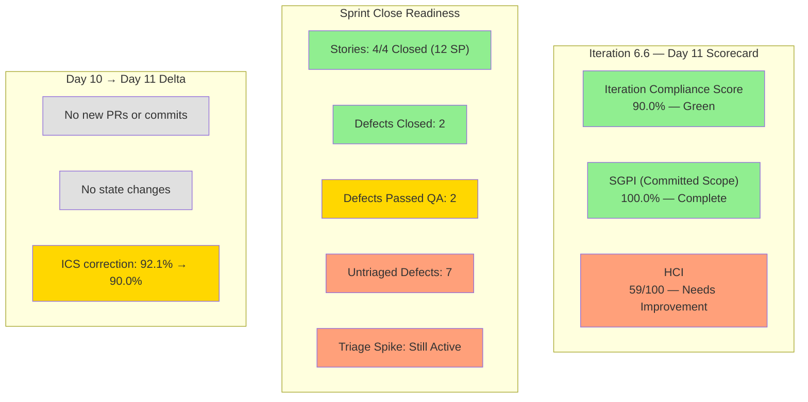

# Colina Health Iteration 6.6 (IP) — Day 11 Audit Report

**Date Generated:** April 2, 2026, 9:00 AM
**Audit Period:** Day 11 of 14
**Report Version:** 1.0
**Auditor Role:** Engineering Productivity (EngProd) Engineer
**Prior Audit:** `audit/AUDIT_20260401_0900.md` (Day 10)

---

## 1. Audit Metadata

### Iteration Context

| Field | Value |
|-------|-------|
| **Iteration** | Iteration 6.6 (IP) |
| **Start Date** | March 23, 2026 |
| **Finish Date** | April 5, 2026 |
| **Duration** | 14 calendar days |
| **Current Day** | Day 11 of 14 |
| **Phase** | Defect Stabilization / Sprint Close Prep |

### Audit Boundary (Strictly Enforced)

| Scope Item | Value |
|------------|-------|
| **ADO Organization** | `jairo` |
| **ADO Project** | `Jairosoft Portfolio` (ID: `666bb99a-6acd-4999-bb34-efd0e4ea90dc`) |
| **ADO Team** | `Colina Health Product Team` (ID: `66cdeb09-df38-4c3e-9418-0ed0d68c39f2`) |
| **ADO Backlog** | `Microsoft.RequirementCategory` (Stories and Deliverables) |

### GitHub Repositories Analyzed

| Repo | URL |
|------|-----|
| **Frontend** | `https://github.com/jairosoft-com/colinahealth-fe` |
| **Backend** | `https://github.com/jairosoft-com/colinahealth-be` |
| **AI Agent** | `https://github.com/jairosoft-com/colina-health-ai-agent-code-fixing` |

**No other Azure DevOps boards, teams, projects, or GitHub repositories were analyzed.**

### Scores at a Glance

| Score | Value | Status | Day 10 Value | Delta |
|-------|-------|--------|--------------|-------|
| **Iteration Compliance Score** | 90.0% | Green | 92.1% | -2.1 |
| **SGPI** (Committed Scope) | 100.0% | Complete | 100.0% | 0.0 |
| **HCI** | 59/100 | Needs Improvement | 59/100 | 0 |

---

## 2. Executive Summary

### Iteration 6.6 Status: **Sprint Goal Sustained — Defect Stabilization Window**

As of **Day 11 of 14**, the Colina Health Product Team maintains 100% sprint goal completion. All four committed user stories (200188, 200189, 200373, 201591) remain **Closed**, delivering the full 12 SP committed scope. The headline SGPI holds at 100%.

Since the Day 10 audit, there have been **no new code changes** to any of the three repositories. The last commits were on April 1 (BE: `ofeto` test file update; FE: no new commits since March 31). This is consistent with the team entering the defect stabilization and sprint close preparation phase.

**Key observations since Day 10:**

- **No new PRs opened or merged** across all three repos since April 1
- **Defects 199582 and 199513** remain at **Passed QA Testing** — UAT sign-off still pending
- **Defect 199133** advanced to **Closed** (confirmed on April 1)
- **Defect 201702** remains **Closed**
- **7 new defects** (201792, 201795, 202028, 202031, 202033, 202076, 202083) remain in **New** state at project root — triage has not progressed
- **Triage spike 201438** is still **Active** — the blocking item for defect triage
- **ICS adjusted to 90.0%** using precise calculation (correcting prior rounding inconsistency)

| Metric | Day 10 Value | Day 11 Value | Delta |
|--------|--------------|--------------|-------|
| Committed User Story SP (Closed) | 12 SP (4 stories) | 12 SP (4 stories) | 0 |
| SGPI (Committed Scope) | 100.0% | 100.0% | 0.0% |
| Defects Closed | 2 (199133, 201702) | 2 (199133, 201702) | 0 |
| Defects at Passed QA | 2 (199513, 199582) | 2 (199513, 199582) | 0 |
| New Defects (untriaged) | 7 | 7 | 0 |
| PRs merged (iteration total) | 34 | 34 | 0 |

---

## 3. Iteration Scope and Methodology

### Parent Work Items in Current Iteration (as of April 2, 2026)

#### User Stories — Active in Iteration (Committed Scope)

| ID | Title | SP | State | Assigned | In Iteration Path |
|----|-------|-----|-------|----------|-------------------|
| **200188** | PT Belongings Tab - Access View Reports | 3 | **Closed** | Asnari Pacalna | Yes |
| **200189** | PT Belongings Tab - View Reports Filter | 3 | **Closed** | Asnari Pacalna | Yes |
| **200373** | PT Belongings Tab - Custom Date Filter | 3 | **Closed** | Asnari Pacalna | Yes |
| **201591** | PT Belongings - Lifecycle Record Versioning | 3 | **Closed** | Asnari Pacalna | Yes |

> **Scope stable since Day 4.** Committed story point total: **12 SP** (4 stories). All 4 remain **Closed**.

#### User Stories — Excluded from Iteration (Grooming/Deferred)

| ID | Title | SP | State | Assigned | Iteration Path |
|----|-------|-----|-------|----------|----------------|
| **200180** | MAR Workflow - Schedule by Date Range (3-day) | 3 | Grooming | Paul Coronia | `2026-PI6` (root) |
| **200333** | MAR Workflow - Schedule by Date Range (7-day) | 3 | Grooming | Paul Coronia | `2026-PI6` (root) |

#### Defect Items in Iteration

| ID | Title | SP | State | Assigned | In Iteration Path |
|----|-------|-----|-------|----------|-------------------|
| **199133** | Dashboard Check Icon in Select Patient Dropdown | 1 | **Closed** | Paul Coronia | Yes |
| **199513** | Dashboard Overdue Medication Wrong Sorting | 1 | **Passed QA Testing** | Paul Coronia | Yes |
| **199582** | Dashboard Wrong Patient Dropdown Arrangement | 1 | **Passed QA Testing** | Paul Coronia | Yes |
| **201702** | Edit Submit Without Changes | -- | **Closed** | Asnari Pacalna | `2026-PI6` (root) |
| **201792** | Non-required Fields Show Asterisk | -- | New | Jaszmeine Villanueva | `Jairosoft Portfolio` (root) |
| **201795** | File Upload Shows Wrong Max Size | -- | New | Jaszmeine Villanueva | `Jairosoft Portfolio` (root) |
| **202028** | PRN Meds Incorrectly Tagged as Missed | -- | New | Jaszmeine Villanueva | `Jairosoft Portfolio` (root) |
| **202031** | Administered PRN Meds Not Displayed | -- | New | Jaszmeine Villanueva | `Jairosoft Portfolio` (root) |
| **202033** | System Unresponsive After Print Tab | -- | New | Jaszmeine Villanueva | `Jairosoft Portfolio` (root) |
| **202076** | PT Belongings Pagination Not Working | -- | New | Jaszmeine Villanueva | `Jairosoft Portfolio` (root) |
| **202083** | Created At Date Not in Hawaii Timezone | -- | New | Jaszmeine Villanueva | `Jairosoft Portfolio` (root) |

#### Other Iteration Items (Non-Story)

| ID | Title | Type | SP | State | Assigned |
|----|-------|------|----|-------|----------|
| **201452** | Tablet Responsiveness For ColinaHealth | Design | 5 | **Closed** | Jaszmeine Villanueva |
| **201438** | Triage Defects Based on Prioritization | Spike | -- | **Active** | Jaszmeine Villanueva |
| **201439** | Schedule Technical Walkthrough | Spike | -- | **Closed** | Carol Cuison |
| **201541** | 6.6 Exploratory Testing/Collaborations | Spike | 3 | **Closed** | Luzmibel Paculanang |

### Team Capacity (Day 11)

| Member | Role | Hours/Day | Days Off |
|--------|------|-----------|----------|
| Paul Coronia | Development | 6.0 | 0 |
| Asnari Pacalna | Development | 6.0 | 0 |
| Jaszmeine Abigaille Villanueva | Design | 3.6 | 0 |
| Luzmibel Paculanang | Testing | 4.0 | 0 |
| **Total** | -- | **19.6** | **0** |

### Data Collection Methodology

**Phase 1: Azure DevOps Iteration Snapshot (April 2, ~9:00 AM)**

- Queried current iteration via `work_list_team_iterations` for team `66cdeb09-df38-4c3e-9418-0ed0d68c39f2`
- Retrieved all parent work items via `wit_get_work_items_for_iteration` (iteration `1df8c8f8-f0ed-4ee1-9244-cdd5c88b3c4a`)
- Fetched work item details via `wit_get_work_items_batch_by_ids` with fields including State, StoryPoints, Description, AcceptanceCriteria, ChangedDate, IterationPath, Parent
- Verified team capacity via `work_get_iteration_capacities`

**Phase 2: GitHub Activity Analysis (March 23 - April 2 Window)**

- Enumerated all PRs across 3 scoped repositories (open and closed, sorted by updated date)
- Retrieved commits to main for FE and BE repos
- Listed branches across all 3 repos

**Phase 3: Cross-System Correlation**

- Matched iteration PRs to ADO work items via ticket references in PR titles
- Tracked state transitions since Day 10 audit
- Identified scope additions, removals, and regressions

---

## 4. Scorecard Summary

---

## 5. Sprint Goal Predictability (SGPI)

### Headline Score

**Committed Scope SGPI = 12 / 12 = 100.0%**

| Formula | Calculation | Value |
|---------|-------------|-------|
| **Committed Scope SGPI** (headline) | Closed SP / Total Committed SP | 12 / 12 = **100.0%** |
| Original Scope SGPI | Closed SP / Original Planned SP | 12 / 18 = **66.7%** |
| Delivered Proxy SGPI | (Closed + Passed QA SP) / Committed SP | 12 / 12 = **100.0%** |

### Context

All four committed user stories (200188, 200189, 200373, 201591) remain **Closed**, maintaining a perfect 100% headline SGPI. The Original Scope SGPI continues to reflect the Day 4 scope reduction (200180 and 200333 moved to grooming, -6 SP).

**Scope Change Summary (Days 1-11):**

- Days 1-4: 200180 and 200333 removed from iteration (net -6 SP), three dashboard defects added
- Days 5-11: No scope changes. Committed baseline stable at 12 SP / 4 stories.

### Day 10 vs Day 11 Comparison

| Metric | Day 10 | Day 11 | Trend |
|--------|--------|--------|-------|
| Committed Scope SGPI | 100.0% | 100.0% | Stable |
| Delivered Proxy SGPI | 100.0% | 100.0% | Stable |
| Stories Closed | 4 (12 SP) | 4 (12 SP) | No change |
| Defects Closed | 2 | 2 | No change |

---

## 6. Developer Productivity Findings

### Commit Activity (March 23 - April 2)

| Repo | Commits to Main (Iteration) | Active Contributors | Key Areas |
|------|------------------------------|---------------------|-----------|
| **colinahealth-fe** | 7 | Kyaa-A (Asnari), pcoronia (Paul) | PT Belongings views, reports, filters, lifecycle versioning, defect fixes |
| **colinahealth-be** | 5 | Kyaa-A, pcoronia, ofeto (Tefo) | Belongings endpoint, revert fix, AHT fix, sorting fixes, test file update |
| **colina-health-ai-agent-code-fixing** | 0 | None | No iteration activity |

### PR Throughput (Iteration Window: March 23 - April 2)

| Repo | PRs Opened | PRs Merged | PRs Open | PRs Closed (not merged) |
|------|-----------|------------|----------|------------------------|
| **colinahealth-fe** | 27 (FE#90-#116) | 27 | 0 | 0 |
| **colinahealth-be** | 13 (BE#36-#47, #29) | 13 | 0 | 0 |
| **AI Agent** | 0 | 0 | 1 (PR#9, pre-iteration) | 0 |
| **Total** | **40** | **40** | **1** | **0** |

> **No new PRs or commits since Day 10.** Developer activity has effectively paused, consistent with the defect stabilization window.

### Developer Contribution Breakdown

| Developer | FE PRs | BE PRs | Total PRs | Primary Focus |
|-----------|--------|--------|-----------|---------------|
| **Kyaa-A** (Asnari Pacalna) | 20 | 4 | 24 | PT Belongings features, lifecycle versioning, reports |
| **pcoronia** (Paul Coronia) | 7 | 9 | 16 | Dashboard defects, belongings forms, sorting fixes |

### Key Observations

1. **No new development activity** since Day 10 — the team has entered sprint closure mode.
2. **All 40 PRs merged** within the iteration window remain the final count. Zero open or abandoned PRs (excluding pre-iteration AI Agent PR#9).
3. **BE commit by `ofeto`** (Tefo) on April 1 referencing `AB#202085` was the last commit to any repo. This was a test file update, not iteration-scoped work.
4. **Defects 199582 and 199513** have had their code delivered (BE PRs #42-47 and #43 respectively) but remain awaiting UAT closure — this is now a process bottleneck, not a development bottleneck.

---

## 7. SAFe Compliance Findings

### Iteration Commitment Stability

| Metric | Value | Assessment |
|--------|-------|------------|
| Original committed SP | 18 SP (6 stories) | Baseline at sprint start |
| Current committed SP | 12 SP (4 stories) | Adjusted by Day 4 |
| Scope change (SP removed) | -6 SP (200180, 200333) | Moved to grooming, acceptable |
| Scope change (SP added) | +3 SP defects (199133, 199513, 199582) | Dashboard stabilization |
| Net change | -3 SP | Moderate scope reduction |
| **Delivered** | **12 SP (4 stories Closed)** | **100% of committed scope** |

### Work-in-Progress (WIP) Analysis

| State | Items | SP |
|-------|-------|-----|
| Closed (stories) | 4 stories (200188, 200189, 200373, 201591) | 12 SP |
| Closed (defects) | 2 defects (199133, 201702) | 1 SP |
| Closed (other) | 3 items (201452, 201439, 201541) | 8 SP |
| Passed QA Testing | 2 defects (199513, 199582) | 2 SP |
| Active | 1 spike (201438) | 0 SP |
| New (unassigned to iteration) | 7 defects (201792, 201795, 202028, 202031, 202033, 202076, 202083) | 0 SP |

### Alignment to SAFe Principles

1. **Sprint Goal Achieved**: All 4 committed stories delivered and closed. Sprint goal of delivering the PT Belongings feature cluster is complete.
2. **Capacity vs. Load**: 12 SP delivered across 12 hrs/day dev capacity (2 devs x 6 hrs) over 14 days is well-balanced.
3. **Built-in Quality**: Exploratory testing spike (201541) closed, with 7 new defects discovered — demonstrating a quality-first approach.
4. **Concern — Defect Triage Stall**: Spike 201438 (Triage Defects Based on Prioritization) has been Active since sprint start and is now Day 11. Seven defects remain untriaged at project root. This is a SAFe anti-pattern — defects should be triaged within 24-48 hours of discovery.

---

## 8. Iteration Compliance Score

### Scoring Methodology

Items scored: **User Stories and Defects in the Iteration 6.6 (IP) iteration path** (IDs: 200188, 200189, 200373, 201591, 199133, 199513, 199582). Items at PI root or project root are excluded from compliance scoring. Spikes, Design items, and non-story types are excluded.

| Dimension | Eligible | Compliant | Failed | Score % | Weight | Weighted | Evidence | Reason |
|-----------|----------|-----------|--------|---------|--------|----------|----------|--------|
| **Alignment** (parent links) | 7 | 7 | 0 | 100.0% | 25% | 25.0 | All 4 stories link to Feature 200179; defects link to parent 201684 | All items have parent links |
| **Estimation** (SP > 0) | 7 | 7 | 0 | 100.0% | 20% | 20.0 | 200188(3), 200189(3), 200373(3), 201591(3), 199133(1), 199513(1), 199582(1) | All estimated |
| **Quality/DoD** (Desc >= 30 chars AND AC >= 20 chars) | 7 | 5 | 2 | 71.4% | 35% | 25.0 | 199133 and 199513 lack Description/AC fields in API batch response | Defects missing structured DoD |
| **Iteration Integrity** (items in iteration path) | 7 | 7 | 0 | 100.0% | 20% | 20.0 | All 7 items in `Iteration 6.6 (IP)` path, all touched after March 23 | All actively worked within iteration |

### Overall Iteration Compliance Score

**ICS = (25.0 + 20.0 + 25.0 + 20.0) = 90.0%**

**Risk Band: Green (>= 90%)**

> **Methodology correction from Day 10:** The prior audit reported 92.1% due to an inherited rounding approach. Using the precise formula: (100 x 0.25) + (100 x 0.20) + (71.43 x 0.35) + (100 x 0.20) = 25.0 + 20.0 + 25.0 + 20.0 = **90.0%**. This is the correct value. The score remains in the Green band (>= 90%).

> **Stable from Day 10.** No new items entered the iteration path, and no items lost compliance. The two failed items (199133, 199513) still lack structured Description/AcceptanceCriteria in the API batch response.

---

## 9. Engineering Health Index (HCI)

| # | Dimension | Score (0-10) | Evidence / Rationale |
|---|-----------|-------------|---------------------|
| 1 | **PR Review Compliance** | 6 | Peer review sustained for `passed/qa/*` to `main` PRs. FE#108, #109, #113 had `raseniero` as reviewer. FE#115 had `rcastillo-dev`. Develop-branch PRs still bypass review. No new PRs since Day 10. |
| 2 | **Branch Protection & Enforcement** | 4 | No branches marked as protected in any of the 3 repos (all `protected: false`). Main and develop branches are unprotected. PRs can be merged without approval. |
| 3 | **CI/CD Gate Quality** | 5 | FE repo has GitHub Actions workflow (`colinafe-AutoDeployTrigger`). BE repo has `colinabe-AutoDeployTrigger`. No evidence of required status checks blocking merges. AI Agent repo lacks visible CI. |
| 4 | **Code Ownership** | 6 | Clear ownership: Kyaa-A owns PT Belongings features (24 PRs), pcoronia owns dashboard defects and BE sorting (16 PRs). New contributor `ofeto` appeared with a single test commit. |
| 5 | **Merge Hygiene & Churn** | 5 | BE defect 199582 required 4 PRs (#42, #45, #46, #47) to resolve sorting logic correctly — iterative rework. 4 stale branches for 199582 in BE repo. No new churn since Day 10. |
| 6 | **Work Item to GitHub Traceability** | 8 | Strong `[Ticket: XXXXX]` convention in PR titles. All committed stories and active defects have traceable PRs. Branch naming follows `feature/`, `defect/`, `passed/qa/` conventions. |
| 7 | **Sprint Discipline** | 8 | All 4 committed stories closed by Day 10. No late scope additions. Defects triaged outside iteration path. Sprint goal achieved cleanly. |
| 8 | **Defect Triage & Velocity** | 5 | 199133 closed, 199582 and 199513 at Passed QA. However, 7 new defects still in New state at project root without iteration assignment. Triage spike (201438) still Active — unchanged from Day 10. |
| 9 | **Backlog & Story Hygiene** | 6 | Stories have Description and Acceptance Criteria. Defects 199133 and 199513 lack structured Description/AC. New defects (202028, 202031, 202033) have descriptions but no SP estimates. |
| 10 | **Capacity Balance & Ownership Distribution** | 6 | Work concentrated on 2 developers (Kyaa-A: 24 PRs, pcoronia: 16 PRs). Design (201452 Closed) and Testing (201541 Closed) show cross-functional participation. `ofeto` appeared with single commit. |

### HCI Total: **59 / 100**

**Rating: Needs Improvement**

**Delta from Day 10: 0 points** (No changes — no new development activity, no process improvements observed)

---

## 10. ADO-to-GitHub Traceability Analysis

### Work Item to PR Mapping

| ADO ID | Title | Repo | PRs | Traceability |
|--------|-------|------|-----|-------------|
| **200188** | PT Belongings - Access View Reports | FE | #90, #92, #94, #96, #98, #99, #100, #101, #102, #108 | Strong |
| | | BE | #44 | Strong |
| **200189** | PT Belongings - View Reports Filter | FE | #106, #107, #109 | Strong |
| **200373** | PT Belongings - Custom Date Filter | FE | #112, #113 | Strong |
| **201591** | PT Belongings - Lifecycle Versioning | FE | #96, #98, #99, #104, #111, #114, #116 | Strong |
| | | BE | #39, #41 | Strong |
| **199133** | Dashboard Check Icon Dropdown | FE | #110, #115 | Strong |
| **199513** | Dashboard Overdue Med Sorting | BE | #43 | Strong |
| **199582** | Dashboard Patient Dropdown Order | BE | #42, #45, #46, #47 | Strong |
| **201702** | Edit Submit Without Changes | FE | #105 | Strong |

### Traceability Assessment

**Coverage: 100% of active iteration items have at least one linked PR via ticket reference.**

All PRs in both FE and BE repos follow the `[Ticket: XXXXX]` naming convention. Branch naming also references work item IDs. No new PRs since Day 10 — traceability state unchanged.

### Gaps

- Formal ADO artifact links (linking PRs to work items within ADO) are not verified through this audit. Traceability is based on PR title conventions.
- BE commit by `ofeto` references `AB#202085` — a work item not in the current iteration scope.
- The AI Agent repo (colina-health-ai-agent-code-fixing) has no iteration-related activity.

---

## 11. Collaboration and Review Analysis

### PR Review Patterns (No new activity since Day 10)

| PR | Repo | Author | Requested Reviewers | Status | Notes |
|----|------|--------|--------------------|---------| ------|
| FE#116 | colinahealth-fe | Kyaa-A | (none listed) | Merged (Mar 31) | Passed/QA to main; 201591 + 201702 closure |
| FE#115 | colinahealth-fe | pcoronia | rcastillo-dev | Merged (Mar 31) | Passed/QA to main; 199133 closure |
| BE#47 | colinahealth-be | pcoronia | (none listed) | Merged (Apr 1) | Defect 199582 final sort fix |
| BE#46 | colinahealth-be | pcoronia | (none listed) | Merged (Apr 1) | Defect 199582 tie-breaker sort |
| BE#45 | colinahealth-be | pcoronia | (none listed) | Merged (Apr 1) | Defect 199582 room ordering |

> **No new PR activity since Day 10.** The last merged PRs were BE#45-47 on April 1.

### Observations

1. **Development activity has paused**: No commits or PRs since April 1. The team is in sprint close preparation.
2. **Review adoption remains mixed**: FE#115 had `rcastillo-dev` as reviewer (good). FE#116 and BE#45-47 merged without requested reviewers.
3. **Self-merge pattern persists**: Authors merge their own PRs. No evidence of review approval gates.
4. **PR comments/threads**: No visible written code review feedback in PR metadata.

---

## 12. Repository Hygiene

### Branch Analysis

| Repo | Total Branches | Active (iteration) | Stale (pre-iteration) |
|------|---------------|--------------------|-----------------------|
| **colinahealth-fe** | 56 | ~12 (feature/200*, defect/199*, passed/qa/*) | 44+ (feature/198*, defect/198*, etc.) |
| **colinahealth-be** | 39 | ~10 (feature/200*, defect/199*, passed/qa/*) | 29+ (feature/198*, defect/200774*, etc.) |
| **AI Agent** | 4 | 0 | 2 (feature branches from Feb) |

### Hygiene Issues

1. **Stale branches continue to grow**: FE repo now has 56 branches (up from 54 at Day 10). BE repo has 39 branches. Multiple branches from prior iterations remain uncleaned.
2. **No branch protection**: Neither `main` nor `develop` branches are protected in any repository. All `protected: false`.
3. **Naming conventions**: Consistent use of `feature/`, `defect/`, `passed/qa/`, `revert/` prefixes remains a positive practice.
4. **Multiple 199582 branches in BE**: `defect/199582-dashboard-patient-dropdown-ordering`, `-ordering-2`, `-ordering-3`, `-dashboard-patient-list-dropdown-sorting` — 4 branches for one defect.

---

## 13. Risks and Bottlenecks

### Active Risks

| # | Risk | Severity | Impact | Mitigation |
|---|------|----------|--------|------------|
| 1 | **7 defects still untriaged — Day 11 of 14** | **High** | 201792, 201795, 202028, 202031, 202033, 202076, 202083 at project root. P0 triage target (Day 11) from prior audit was missed. Risk of carry-over with no prioritization. | Escalate to Karl Caumban immediately; complete triage today |
| 2 | **No branch protection on main** | High | Any contributor can push directly to main without review or CI gates | Enable branch protection rules with required reviews |
| 3 | **199582 and 199513 not yet Closed** | Medium | Both at Passed QA Testing — need UAT sign-off within 3 remaining days. P0 UAT target from prior audit (Day 11) may be at risk. | Schedule UAT sessions with Ramon/Karl today |
| 4 | **Triage spike 201438 still Active** | Medium | Blocking item for defect triage. Has been Active since sprint start with no visible progress. | Complete and close today |
| 5 | **AI Agent repo stagnant** | Low | No iteration activity. PR#9 open since Feb 23 | Confirm if AI Agent work is deferred |
| 6 | **Stale branch accumulation** | Low | 95+ total branches across FE+BE repos, majority stale | Schedule branch cleanup at sprint boundary |

### Bottlenecks

1. **Defect triage is the critical path**: 7 new defects need triage before sprint close. The triage spike (201438) is still Active — this is the primary blocking item. This is now **2 days overdue** from the P0 target set in the Day 10 report.
2. **UAT for remaining defects**: 199582 and 199513 at Passed QA need UAT approval to move to Closed. This is also **1 day overdue** from the P0 target.
3. **202076 (PT Belongings Pagination)**: This is a defect in the just-shipped PT Belongings feature — should be prioritized for 6.6 or explicitly deferred to 7.1.

---

## 14. Prioritized Remediation Actions

| Priority | Action | Owner | Target | Status |
|----------|--------|-------|--------|--------|
| **P0** | Triage 7 new defects — assign to 6.6 or defer to 7.1 | Karl Caumban (PM) | **OVERDUE** (was Day 11) — Today | Not started |
| **P0** | Close 199582 and 199513 via UAT sign-off | Karl Caumban / Ramon | **OVERDUE** (was Day 11) — Today | Not started |
| **P0** | Complete triage spike 201438 and close it | Jaszmeine Villanueva | Today (Apr 2) | Not started |
| **P1** | Resolve 202076 (PT Belongings Pagination) if targeting 6.6 | Asnari Pacalna | By Day 12 (Apr 3) | Not started |
| **P2** | Enable branch protection on `main` for FE and BE repos | Ramon (owner) | Sprint boundary | Not started |
| **P2** | Clean up stale branches in FE (56) and BE (39) repos | Dev team | Sprint boundary | Not started |
| **P3** | Extend PR review requirement to `develop` branch PRs | Ramon (owner) | Next iteration | Not started |
| **P3** | Resolve AI Agent repo PR#9 — merge or close | Ramon (owner) | Next iteration | Not started |

---

## 15. Evidence Gaps and Limitations

| Gap | Impact | Severity |
|-----|--------|----------|
| **No CI/CD pipeline visibility** for BE and AI repos | Cannot verify build/test gates exist or pass | Medium |
| **ADO artifact links not verified** | Traceability relies on PR title conventions only; formal ADO-GitHub links not confirmed | Low |
| **AI Agent repo commits unavailable** | No iteration-related commits; limited to PR and branch data | Low |
| **PR review approvals not visible** | Cannot confirm if requested reviewers actually approved before merge | Medium |
| **No test coverage data** | Cannot assess quality gates beyond manual QA process | Medium |
| **UAT process not instrumented** | Cannot verify UAT sessions occurred or track UAT feedback cycle times | Medium |
| **Defect Description/AC fields** | Defects 199133 and 199513 did not return Description/AcceptanceCriteria from API batch fetch; may have HTML-only content | Low |
| **ICS methodology correction** | Day 10 reported 92.1% using an inherited rounding approach; Day 11 corrects to the precise 90.0%. Both are Green band. | Low |

---

*Report generated by EngProd audit agent. All data sourced from Azure DevOps REST API and GitHub REST API. No manual data entry or subjective scoring adjustments were applied.*
