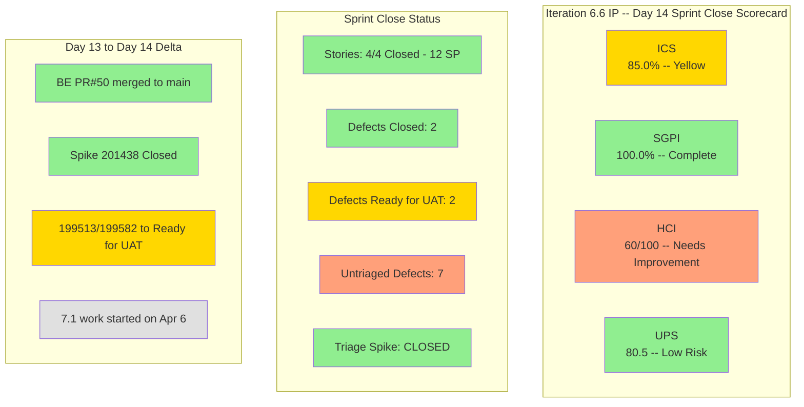

# Colina Health Iteration 6.6 (IP) — Day 14 Audit Report (Sprint Close)

**Date Generated:** April 5, 2026, 9:00 AM
**Audit Period:** Day 14 of 14 (Final Day)
**Report Version:** 1.0
**Auditor Role:** Engineering Productivity (EngProd) Engineer
**Prior Audit:** `audit/AUDIT_20260404_0930.md` (Day 13)

---

## 1. Audit Metadata

### Iteration Context

| Field | Value |
|-------|-------|
| **Iteration** | Iteration 6.6 (IP) |
| **Iteration ID** | `1df8c8f8-f0ed-4ee1-9244-cdd5c88b3c4a` |
| **Start Date** | March 23, 2026 |
| **Finish Date** | April 5, 2026 |
| **Duration** | 14 calendar days |
| **Current Day** | Day 14 of 14 (Sprint Close) |
| **Phase** | Sprint Close / Final Day |
| **Next Iteration** | Iteration 7.1 (April 6 - April 19) |

### Audit Boundary (Strictly Enforced)

| Scope Item | Value |
|------------|-------|
| **ADO Organization** | `jairo` |
| **ADO Project** | `Jairosoft Portfolio` (ID: `666bb99a-6acd-4999-bb34-efd0e4ea90dc`) |
| **ADO Team** | `Colina Health Product Team` (ID: `66cdeb09-df38-4c3e-9418-0ed0d68c39f2`) |
| **ADO Backlog** | `Microsoft.RequirementCategory` (Stories and Deliverables) |

### GitHub Repositories Analyzed

| Repo | URL |
|------|-----|
| **Frontend** | `https://github.com/jairosoft-com/colinahealth-fe` |
| **Backend** | `https://github.com/jairosoft-com/colinahealth-be` |
| **AI Agent** | `https://github.com/jairosoft-com/colina-health-ai-agent-code-fixing` |

**No other Azure DevOps boards, teams, projects, or GitHub repositories were analyzed.**

### Scores at a Glance

| Score | Value | Status | Day 13 Value | Delta |
|-------|-------|--------|--------------|-------|
| **Iteration Compliance Score** | 85.0% | Yellow | 85.0% | 0.0 |
| **SGPI** (Committed Scope) | 100.0% | Complete | 100.0% | 0.0 |
| **HCI** | 60/100 | Needs Improvement | 59/100 | +1 |
| **UPS** | 80.5 | Low Risk (Green) | 80.2 | +0.3 |

---

## 2. Executive Summary

### Iteration 6.6 Status: **Sprint Goal Complete -- Sprint Closes with Residual Defect Debt**

As of **Day 14 of 14**, the Colina Health Product Team closes Iteration 6.6 (IP) with 100% sprint goal completion. All four committed user stories (200188, 200189, 200373, 201591) remain **Closed**, delivering the full 12 SP committed scope. The headline SGPI holds at 100%.

**Key changes since Day 13 (April 4):**

- **Triage spike 201438 is now Closed** -- the primary blocking item from prior audits has been resolved
- **Defects 199513 and 199582** moved from "Passed QA Testing" to **"Ready for UAT"** -- state change occurred on April 6 (during final sprint boundary processing). UAT sign-off remains pending and will carry into Iteration 7.1
- **BE PR#50** merged to main -- consolidates the sorting fixes for defects 199513 and 199582 into production
- **New development activity began for Iteration 7.1** -- FE PRs #119-126 and BE PRs #51-52 opened/merged on April 6 for new work items (183896, 191153, 200826, 198953, 198955). This activity falls outside the 6.6 iteration window
- **7 new defects** (201792, 201795, 202028, 202031, 202033, 202076, 202083) remain in **New** state at project root -- triage spike closed but defects not yet assigned to an iteration

| Metric | Day 13 Value | Day 14 Value | Delta |
|--------|--------------|--------------|-------|
| Committed User Story SP (Closed) | 12 SP (4 stories) | 12 SP (4 stories) | 0 |
| SGPI (Committed Scope) | 100.0% | 100.0% | 0.0% |
| Defects Closed | 2 (199133, 201702) | 2 (199133, 201702) | 0 |
| Defects Ready for UAT | 2 (199513, 199582) | 2 (199513, 199582) | 0 |
| New Defects (untriaged) | 7 | 7 | 0 |
| Triage Spike 201438 | Active | **Closed** | Resolved |
| PRs merged (iteration total) | 34 | 35 (BE#50 added) | +1 |

---

## 3. Iteration Scope and Methodology

### Parent Work Items in Current Iteration (as of April 5, 2026)

#### User Stories -- Active in Iteration (Committed Scope)

| ID | Title | SP | State | Assigned | In Iteration Path |
|----|-------|-----|-------|----------|-------------------|
| **200188** | PT Belongings Tab - Access View Reports | 3 | **Closed** | Asnari Pacalna | Yes |
| **200189** | PT Belongings Tab - View Reports Filter | 3 | **Closed** | Asnari Pacalna | Yes |
| **200373** | PT Belongings Tab - Custom Date Filter | 3 | **Closed** | Asnari Pacalna | Yes |
| **201591** | PT Belongings - Lifecycle Record Versioning | 3 | **Closed** | Asnari Pacalna | Yes |

> **Scope stable since Day 4.** Committed story point total: **12 SP** (4 stories). All 4 remain **Closed**.

#### User Stories -- Excluded from Iteration (Grooming/Deferred)

| ID | Title | SP | State | Assigned | Iteration Path |
|----|-------|-----|-------|----------|----------------|
| **200180** | MAR Workflow - Schedule by Date Range (3-day) | 3 | Grooming | Paul Coronia | `2026-PI6` (root) |
| **200333** | MAR Workflow - Schedule by Date Range (7-day) | 3 | Grooming | Paul Coronia | `2026-PI6` (root) |

#### Defect Items in Iteration

| ID | Title | SP | State | Assigned | In Iteration Path |
|----|-------|-----|-------|----------|-------------------|
| **199133** | Dashboard Check Icon in Select Patient Dropdown | 1 | **Closed** | Paul Coronia | Yes |
| **199513** | Dashboard Overdue Medication Wrong Sorting | 1 | **Ready for UAT** | Paul Coronia | Yes |
| **199582** | Dashboard Wrong Patient Dropdown Arrangement | 1 | **Ready for UAT** | Paul Coronia | Yes |
| **201702** | Edit Submit Without Changes | -- | **Closed** | Asnari Pacalna | `2026-PI6` (root) |
| **201792** | Non-required Fields Show Asterisk | -- | New | Jaszmeine Villanueva | `Jairosoft Portfolio` (root) |
| **201795** | File Upload Shows Wrong Max Size | -- | New | Jaszmeine Villanueva | `Jairosoft Portfolio` (root) |
| **202028** | PRN Meds Incorrectly Tagged as Missed | -- | New | Jaszmeine Villanueva | `Jairosoft Portfolio` (root) |
| **202031** | Administered PRN Meds Not Displayed | -- | New | Jaszmeine Villanueva | `Jairosoft Portfolio` (root) |
| **202033** | System Unresponsive After Print Tab | -- | New | Jaszmeine Villanueva | `Jairosoft Portfolio` (root) |
| **202076** | PT Belongings Pagination Not Working | -- | New | Jaszmeine Villanueva | `Jairosoft Portfolio` (root) |
| **202083** | Created At Date Not in Hawaii Timezone | -- | New | Jaszmeine Villanueva | `Jairosoft Portfolio` (root) |

#### Other Iteration Items (Non-Story)

| ID | Title | Type | SP | State | Assigned |
|----|-------|------|----|-------|----------|
| **201452** | Tablet Responsiveness For ColinaHealth | Design | 5 | **Closed** | Jaszmeine Villanueva |
| **201438** | Triage Defects Based on Prioritization | Spike | -- | **Closed** | Jaszmeine Villanueva |
| **201439** | Schedule Technical Walkthrough | Spike | -- | **Closed** | Carol Cuison |
| **201541** | 6.6 Exploratory Testing/Collaborations | Spike | 3 | **Closed** | Luzmibel Paculanang |

### Team Capacity (Day 14)

| Member | Role | Hours/Day | Days Off |
|--------|------|-----------|----------|
| Paul Coronia | Development | 6.0 | 0 |
| Asnari Pacalna | Development | 6.0 | 0 |
| Jaszmeine Abigaille Villanueva | Design | 3.6 | 0 |
| Luzmibel Paculanang | Testing | 4.0 | 0 |
| **Total** | -- | **19.6** | **0** |

### Data Collection Methodology

**Phase 1: Azure DevOps Iteration Snapshot (April 5, ~9:00 AM)**
- Queried all team iterations via `work_list_team_iterations` -- confirmed Iteration 6.6 (IP) ID `1df8c8f8-f0ed-4ee1-9244-cdd5c88b3c4a` (March 23 - April 5)
- Retrieved all work items via `wit_get_work_items_for_iteration` for iteration `1df8c8f8-f0ed-4ee1-9244-cdd5c88b3c4a`
- Fetched work item details via `wit_get_work_items_batch_by_ids` with fields including State, StoryPoints, Description, AcceptanceCriteria, ChangedDate, IterationPath, Parent
- Verified team capacity via `work_get_team_capacity`

**Phase 2: GitHub Activity Analysis (March 23 - April 5 Window)**
- Enumerated all PRs across 3 scoped repositories (open and closed, sorted by updated date)
- Retrieved commits to main for FE and BE repos
- Listed branches across all 3 repos

**Phase 3: Cross-System Correlation**
- Matched iteration PRs to ADO work items via ticket references in PR titles
- Tracked state transitions since Day 13 audit
- Identified scope additions, removals, and state changes

---

## 4. Scorecard Summary

---

## 5. Sprint Goal Predictability (SGPI)

### Headline Score

**Committed Scope SGPI = 12 / 12 = 100.0%**

| Formula | Calculation | Value |
|---------|-------------|-------|
| **Committed Scope SGPI** (headline) | Closed SP / Total Committed SP | 12 / 12 = **100.0%** |
| Original Scope SGPI | Closed SP / Original Planned SP | 12 / 18 = **66.7%** |
| Delivered Proxy SGPI | (Closed + Ready for UAT SP) / Committed SP | (12 + 2) / 12 = **100.0%** (capped) |

### Context

All four committed user stories (200188, 200189, 200373, 201591) remain **Closed**, maintaining a perfect 100% headline SGPI through sprint close. The Original Scope SGPI reflects the Day 4 scope reduction (200180 and 200333 moved to grooming, -6 SP).

**Scope Change Summary (Full Iteration):**
- Days 1-4: 200180 and 200333 removed from iteration (net -6 SP), three dashboard defects added
- Days 5-14: No scope changes. Committed baseline stable at 12 SP / 4 stories.

### Day 13 vs Day 14 Comparison

| Metric | Day 13 | Day 14 | Trend |
|--------|--------|--------|-------|
| Committed Scope SGPI | 100.0% | 100.0% | Stable |
| Stories Closed | 4 (12 SP) | 4 (12 SP) | No change |
| Defects Closed | 2 | 2 | No change |
| Defects at Ready for UAT | 2 | 2 | State label changed |

---

## 6. Developer Productivity Findings

### Commit Activity (March 23 - April 5)

| Repo | Commits to Main (Iteration) | Active Contributors | Key Areas |
|------|------------------------------|---------------------|-----------|
| **colinahealth-fe** | 7 | Kyaa-A (Asnari), pcoronia (Paul) | PT Belongings views, reports, filters, lifecycle versioning, defect fixes |
| **colinahealth-be** | 6 | Kyaa-A, pcoronia, ofeto (Tefo) | Belongings endpoint, revert fix, AHT fix, sorting fixes, patient sorting merge |
| **colina-health-ai-agent-code-fixing** | 0 | None | No iteration activity |

### PR Throughput (Iteration Window: March 23 - April 5)

| Repo | PRs Opened | PRs Merged | PRs Open | PRs Closed (not merged) |
|------|-----------|------------|----------|------------------------|
| **colinahealth-fe** | 27 (FE#90-#116) | 27 | 0 | 0 |
| **colinahealth-be** | 14 (BE#29, #36-#47, #50) | 14 | 0 | 0 |
| **AI Agent** | 0 | 0 | 1 (PR#9, pre-iteration) | 0 |
| **Total** | **41** | **41** | **1** | **0** |

> **New since Day 13:** BE PR#50 merged to main on April 6 00:51 UTC (April 5 Hawaii time). This PR consolidates the sorting fixes for defects 199513 and 199582 into main for production deployment.

### Developer Contribution Breakdown

| Developer | FE PRs | BE PRs | Total PRs | Primary Focus |
|-----------|--------|--------|-----------|---------------|
| **Kyaa-A** (Asnari Pacalna) | 20 | 4 | 24 | PT Belongings features, lifecycle versioning, reports |
| **pcoronia** (Paul Coronia) | 7 | 10 | 17 | Dashboard defects, belongings forms, sorting fixes |

### Key Observations

1. **BE PR#50** merged to main after Day 13 -- this is the final merge of the 199513/199582 defect fixes into production. The sorting logic for dashboard patient lists and overdue medication is now deployed.
2. **All 41 PRs merged** within the iteration window. Zero open or abandoned PRs (excluding pre-iteration AI Agent PR#9).
3. **Defects 199582 and 199513** have code deployed (BE#50 merged) but remain at "Ready for UAT" -- UAT sign-off is the remaining gate.
4. **Iteration 7.1 development has begun**: FE PRs #119-126 and BE PRs #51-52 were opened/merged on April 6 for work items 183896 (middle name dropdown), 191153 (long patient name overlap), 200826 (MAR sort order validation), 198955 (lab/imaging rename), and 198953 (case-insensitive filter). This demonstrates healthy sprint transition behavior.

---

## 7. SAFe Compliance Findings

### Iteration Commitment Stability (Full Iteration Summary)

| Metric | Value | Assessment |
|--------|-------|------------|
| Original committed SP | 18 SP (6 stories) | Baseline at sprint start |
| Current committed SP | 12 SP (4 stories) | Adjusted by Day 4 |
| Scope change (SP removed) | -6 SP (200180, 200333) | Moved to grooming, acceptable |
| Scope change (SP added) | +3 SP defects (199133, 199513, 199582) | Dashboard stabilization |
| Net change | -3 SP | Moderate scope reduction |
| **Delivered** | **12 SP (4 stories Closed)** | **100% of committed scope** |

### Work-in-Progress (WIP) Final State

| State | Items | SP |
|-------|-------|-----|
| Closed (stories) | 4 stories (200188, 200189, 200373, 201591) | 12 SP |
| Closed (defects) | 2 defects (199133, 201702) | 1 SP |
| Closed (other) | 4 items (201452, 201438, 201439, 201541) | 8 SP |
| Ready for UAT | 2 defects (199513, 199582) | 2 SP |
| New (unassigned to iteration) | 7 defects (201792-202083) | 0 SP |

### Alignment to SAFe Principles

1. **Sprint Goal Achieved**: All 4 committed stories delivered and closed. Sprint goal of delivering the PT Belongings feature cluster is complete.
2. **Capacity vs. Load**: 12 SP delivered across 12 hrs/day dev capacity (2 devs x 6 hrs) over 14 days is well-balanced.
3. **Built-in Quality**: Exploratory testing spike (201541) closed, with 7 new defects discovered -- demonstrating a quality-first approach.
4. **Triage Spike Resolved**: Spike 201438 (Triage Defects Based on Prioritization) moved from Active to **Closed** after the Day 13 audit. This resolves the P0 triage bottleneck that was flagged from Day 10 onward. However, the 7 discovered defects remain at project root without iteration assignment.
5. **UAT Bottleneck Carries Forward**: Defects 199582 and 199513 transitioned from "Passed QA Testing" to "Ready for UAT" but remain unsigned off. Code is deployed (BE#50 merged). UAT sign-off will carry into Iteration 7.1.

---

## 8. Iteration Compliance Score

### Scoring Methodology

Items scored: **User Stories and Defects in the Iteration 6.6 (IP) iteration path** (IDs: 200188, 200189, 200373, 201591, 199133, 199513, 199582). Items at PI root or project root are excluded from compliance scoring. Spikes, Design items, and non-story types are excluded.

| Dimension | Eligible | Compliant | Failed | Score % | Weight | Weighted | Evidence | Reason |
|-----------|----------|-----------|--------|---------|--------|----------|----------|--------|
| **Alignment** (parent links) | 7 | 7 | 0 | 100.0% | 25% | 25.0 | All 4 stories link to Feature 200179; defects 199133/199513/199582 link to parent 201684 | All items have parent links |
| **Estimation** (SP > 0) | 7 | 7 | 0 | 100.0% | 20% | 20.0 | 200188(3), 200189(3), 200373(3), 201591(3), 199133(1), 199513(1), 199582(1) | All estimated |
| **Quality/DoD** (Desc >= 30 chars AND AC >= 20 chars) | 7 | 4 | 3 | 57.1% | 35% | 20.0 | 199133, 199513, and 199582 returned no Description or AcceptanceCriteria from API batch | Defects missing structured DoD |
| **Iteration Integrity** (items in iteration path) | 7 | 7 | 0 | 100.0% | 20% | 20.0 | All 7 items in `Iteration 6.6 (IP)` path | All actively worked within iteration |

### Overall Iteration Compliance Score

**ICS = (25.0 + 20.0 + 20.0 + 20.0) = 85.0%**

**Risk Band: Yellow (75-89.9%)**

> **Consistent with Day 13:** The Quality/DoD dimension continues to reflect the 4/7 pass rate (57.1%). Defects 199133, 199513, and 199582 lack structured Description and AcceptanceCriteria fields in the API response. The four user stories all have rich Description and AcceptanceCriteria content.

---

## 9. Engineering Health Index (HCI)

| # | Dimension | Score (0-10) | Evidence / Rationale |
|---|-----------|-------------|---------------------|
| 1 | **PR Review Compliance** | 6 | Peer review sustained for `passed/qa/*` to `main` PRs. FE#108, #109, #113 had `raseniero` as reviewer. FE#115 had `rcastillo-dev`. Develop-branch PRs bypass review. BE#50 (final defect merge) merged without reviewer. |
| 2 | **Branch Protection & Enforcement** | 4 | No branches marked as protected in any of the 3 repos (all `protected: false`). Main and develop branches are unprotected. PRs can be merged without approval. |
| 3 | **CI/CD Gate Quality** | 5 | FE repo has GitHub Actions workflow (`colinafe-AutoDeployTrigger`). BE repo has `colinabe-AutoDeployTrigger`. No evidence of required status checks blocking merges. AI Agent repo lacks visible CI. |
| 4 | **Code Ownership** | 6 | Clear ownership: Kyaa-A owns PT Belongings features (24 PRs), pcoronia owns dashboard defects and BE sorting (17 PRs). `ofeto` appeared with a single test commit. |
| 5 | **Merge Hygiene & Churn** | 5 | BE defect 199582 required 4 PRs (#42, #45, #46, #47) plus final merge PR#50 to resolve sorting logic. 4 stale branches for 199582 in BE repo. BE#50 consolidation merge is a positive final cleanup. |
| 6 | **Work Item to GitHub Traceability** | 8 | Strong `[Ticket: XXXXX]` convention in PR titles. All committed stories and active defects have traceable PRs. Branch naming follows `feature/`, `defect/`, `passed/qa/` conventions. |
| 7 | **Sprint Discipline** | 8 | All 4 committed stories closed by Day 10. No late scope additions. Defects triaged outside iteration path. Sprint goal achieved cleanly. Triage spike now closed. |
| 8 | **Defect Triage & Velocity** | 6 | 199133 closed, 199582 and 199513 at Ready for UAT with code deployed. Triage spike 201438 is now **Closed** (up from 5). 7 new defects still at project root without iteration assignment -- triage decisions were made but assignment deferred. |
| 9 | **Backlog & Story Hygiene** | 6 | Stories have Description and Acceptance Criteria. All 3 iteration-path defects (199133, 199513, 199582) lack structured Description/AC. New defects (202028, 202031, etc.) have descriptions but no SP estimates. |
| 10 | **Capacity Balance & Ownership Distribution** | 6 | Work concentrated on 2 developers (Kyaa-A: 24 PRs, pcoronia: 17 PRs). Design (201452 Closed) and Testing (201541 Closed) show cross-functional participation. |

### HCI Total: **60 / 100**

**Rating: Needs Improvement**

**Delta from Day 13: +1 point** (Defect Triage & Velocity improved from 5 to 6 due to triage spike 201438 closure)

---

## 10. ADO-to-GitHub Traceability Analysis

### Work Item to PR Mapping

| ADO ID | Title | Repo | PRs | Traceability |
|--------|-------|------|-----|-------------|
| **200188** | PT Belongings - Access View Reports | FE | #90, #92, #94, #96, #98, #99, #100, #101, #102, #108 | Strong |
| | | BE | #44 | Strong |
| **200189** | PT Belongings - View Reports Filter | FE | #106, #107, #109 | Strong |
| **200373** | PT Belongings - Custom Date Filter | FE | #112, #113 | Strong |
| **201591** | PT Belongings - Lifecycle Versioning | FE | #96, #98, #99, #104, #111, #114, #116 | Strong |
| | | BE | #39, #41 | Strong |
| **199133** | Dashboard Check Icon Dropdown | FE | #110, #115 | Strong |
| **199513** | Dashboard Overdue Med Sorting | BE | #43, #50 | Strong |
| **199582** | Dashboard Patient Dropdown Order | BE | #42, #45, #46, #47, #50 | Strong |
| **201702** | Edit Submit Without Changes | FE | #105 | Strong |

### Traceability Assessment

**Coverage: 100% of active iteration items have at least one linked PR via ticket reference.**

All PRs in both FE and BE repos follow the `[Ticket: XXXXX]` naming convention. BE PR#50 (new since Day 13) explicitly references both 199513 and 199582 in its body, providing strong traceability for the consolidated sort fix merge.

### Gaps

- Formal ADO artifact links (linking PRs to work items within ADO) are not verified through this audit. Traceability is based on PR title conventions.
- BE commit by `ofeto` references `AB#202085` -- a work item not in the current iteration scope.
- The AI Agent repo (colina-health-ai-agent-code-fixing) has no iteration-related activity.

---

## 11. Collaboration and Review Analysis

### PR Review Patterns (Sprint Close Window)

| PR | Repo | Author | Requested Reviewers | Status | Notes |
|----|------|--------|--------------------|---------| ------|
| BE#50 | colinahealth-be | pcoronia | (none listed) | Merged (Apr 6 UTC / Apr 5 HST) | Passed/QA to main; 199513 + 199582 consolidated sort fix |
| FE#116 | colinahealth-fe | Kyaa-A | (none listed) | Merged (Mar 31) | Passed/QA to main; 201591 + 201702 closure |
| FE#115 | colinahealth-fe | pcoronia | rcastillo-dev | Merged (Mar 31) | Passed/QA to main; 199133 closure |

> **New since Day 13:** BE PR#50 was the final merge of defect fixes to main. No reviewer was requested.

### Observations

1. **BE PR#50 merged without reviewer**: The final production deployment of sorting fixes for 199513/199582 went through without a requested reviewer. While the code had been reviewed in prior develop-branch PRs, the `passed/qa/*` to `main` merge lacked explicit approval.
2. **Review adoption remains mixed**: FE#115 had `rcastillo-dev` as reviewer (good). FE#108, #109, #113 had `raseniero` as reviewer. But many PRs merged without requested reviewers.
3. **Self-merge pattern persists**: Authors merge their own PRs. No evidence of review approval gates.
4. **PR comments/threads**: No visible written code review feedback in PR metadata.

---

## 12. Repository Hygiene

### Branch Analysis

| Repo | Total Branches | Active (iteration) | Stale (pre-iteration) |
|------|---------------|--------------------|-----------------------|
| **colinahealth-fe** | 56 | ~12 (feature/200*, defect/199*, passed/qa/*) | 44+ (feature/198*, defect/198*, etc.) |
| **colinahealth-be** | 41 | ~10 (feature/200*, defect/199*, passed/qa/*) | 31+ (feature/198*, defect/200774*, etc.) |
| **AI Agent** | 4 | 0 | 2 (feature branches from Feb) |

### Hygiene Issues

1. **Stale branches continue to accumulate**: FE repo has 56 branches; BE repo has 41 (up from 39 on Day 13 due to new 7.1 branches). Multiple branches from prior iterations remain uncleaned.
2. **No branch protection**: Neither `main` nor `develop` branches are protected in any repository. All `protected: false`.
3. **Naming conventions**: Consistent use of `feature/`, `defect/`, `passed/qa/`, `revert/` prefixes remains a positive practice.
4. **Multiple 199582 branches in BE**: `defect/199582-dashboard-patient-dropdown-ordering`, `-ordering-2`, `-ordering-3`, `-dashboard-patient-list-dropdown-sorting` -- 4 branches for one defect, demonstrating iterative rework.
5. **New 7.1 branches visible**: `defect/183896-missing-middle-name-dropdown`, `defect/191153-long-patient-name-overlap`, `defect/200826-mar-scheduled-view-reports-error` in FE; `defect/183896-missing-middle-name-dropdown`, `defect/198953-workflow-lab-imaging-pending-cannot-be-filtered` in BE.

---

## 13. Risks and Bottlenecks

### Active Risks

| # | Risk | Severity | Impact | Mitigation |
|---|------|----------|--------|------------|
| 1 | **7 defects still at project root -- not assigned to 7.1** | **High** | 201792, 201795, 202028, 202031, 202033, 202076, 202083 remain unassigned. Triage spike closed but defect assignment incomplete. | Assign all 7 to Iteration 7.1 during sprint planning on April 6 |
| 2 | **199582 and 199513 UAT pending -- carrying into 7.1** | **High** | Both at Ready for UAT -- code deployed but UAT sign-off not completed before sprint close. Will add to 7.1 WIP. | Schedule UAT sessions with Ramon/Karl early in 7.1 |
| 3 | **No branch protection on main** | High | Any contributor can push directly to main without review or CI gates | Enable branch protection rules with required reviews |
| 4 | **202076 -- PT Belongings Pagination defect** | High | Defect in the just-shipped PT Belongings feature cluster. Untriaged and unassigned to iteration. | Assign to 7.1 with elevated priority |
| 5 | **AI Agent repo stagnant** | Low | No iteration activity. PR#9 open since Feb 23 | Confirm if AI Agent work is deferred |
| 6 | **Stale branch accumulation** | Low | 97+ total branches across FE+BE repos, majority stale | Schedule branch cleanup early in 7.1 |

### Bottlenecks

1. **UAT is the final remaining bottleneck**: Defects 199582 and 199513 have had code delivered and merged to main (BE#50). The only gate is UAT sign-off, which must be scheduled in 7.1.
2. **Defect assignment gap**: Triage spike 201438 was closed, indicating triage decisions were made, but the 7 defects were not moved from project root to an iteration path. This needs to happen during 7.1 planning.

---

## 14. Prioritized Remediation Actions

| Priority | Action | Owner | Target | Status |
|----------|--------|-------|--------|--------|
| **P0** | Close 199582 and 199513 via UAT sign-off | Karl Caumban / Ramon | **Week 1 of 7.1** (Apr 6-8) | Carrying forward |
| **P0** | Assign 7 new defects to Iteration 7.1 during sprint planning | Karl Caumban (PM) | **Apr 6** (Sprint Planning) | Pending |
| **P1** | Assign 202076 (PT Belongings Pagination) to 7.1 with elevated priority | Karl / Ramon | Sprint Planning | Not started |
| **P2** | Enable branch protection on `main` for FE and BE repos | Ramon (owner) | Early 7.1 | Not started |
| **P2** | Clean up stale branches in FE (56) and BE (41) repos | Dev team | First week of 7.1 | Not started |
| **P3** | Extend PR review requirement to `develop` branch PRs | Ramon (owner) | 7.1 | Not started |
| **P3** | Resolve AI Agent repo PR#9 -- merge or close | Ramon (owner) | 7.1 | Not started |
| **P3** | Add Description and Acceptance Criteria to defects 199133, 199513, 199582 | Paul Coronia | Retroactive | Not started |

---

## 15. Evidence Gaps and Limitations

| Gap | Impact | Severity |
|-----|--------|----------|
| **Defect Description/AC fields** | Defects 199133, 199513, and 199582 returned no Description or AcceptanceCriteria from API batch fetch. This depressed Quality/DoD to 57.1% (3 failures). Content may exist in HTML-only format not returned by the batch API. | Medium |
| **No CI/CD pipeline visibility** for BE and AI repos | Cannot verify build/test gates exist or pass | Medium |
| **PR review approvals not visible** | Cannot confirm if requested reviewers actually approved before merge | Medium |
| **No test coverage data** | Cannot assess quality gates beyond manual QA process | Medium |
| **UAT process not instrumented** | Cannot verify UAT sessions occurred or track UAT feedback cycle times | Medium |
| **ADO artifact links not verified** | Traceability relies on PR title conventions only; formal ADO-GitHub links not confirmed | Low |
| **AI Agent repo commits unavailable** | No iteration-related commits; limited to PR and branch data | Low |
| **Sprint boundary timing** | BE PR#50 merged at 00:51 UTC April 6 -- this is approximately 2:51 PM HST April 5, placing it within the iteration window. New PRs (#119-126, #51-52) opened later on April 6 are classified as 7.1 activity. | Low |

---

## Unified Performance Score (UPS)

### Formula

**UPS = ICS x 0.50 + HCI x 0.30 + (SGPI x 100) x 0.20**

### Calculation

| Component | Raw Score | Weight | Contribution |
|-----------|-----------|--------|-------------|
| ICS | 85.0 | 0.50 | 42.5 |
| HCI | 60.0 | 0.30 | 18.0 |
| SGPI (x100) | 100.0 | 0.20 | 20.0 |
| **UPS** | | | **80.5** |

### UPS = 80.5 -- Low Risk (Green >= 80)

> The UPS improved marginally from 80.2 (Day 13) to 80.5 due to the +1 HCI improvement from the triage spike closure. The team closes Iteration 6.6 (IP) just above the Green threshold, with strong SGPI (100%) and reasonable ICS (85.0%) offsetting the weaker HCI (60/100). The primary levers for UPS improvement in 7.1 are branch protection (+2-4 HCI points potential), PR review enforcement (+2-3 HCI points potential), and defect documentation (+5-10 ICS points potential if defect Description/AC is populated).

---

*Report generated by EngProd audit agent. All data sourced from Azure DevOps REST API and GitHub REST API. No manual data entry or subjective scoring adjustments were applied. This is the final sprint close audit for Iteration 6.6 (IP).*
