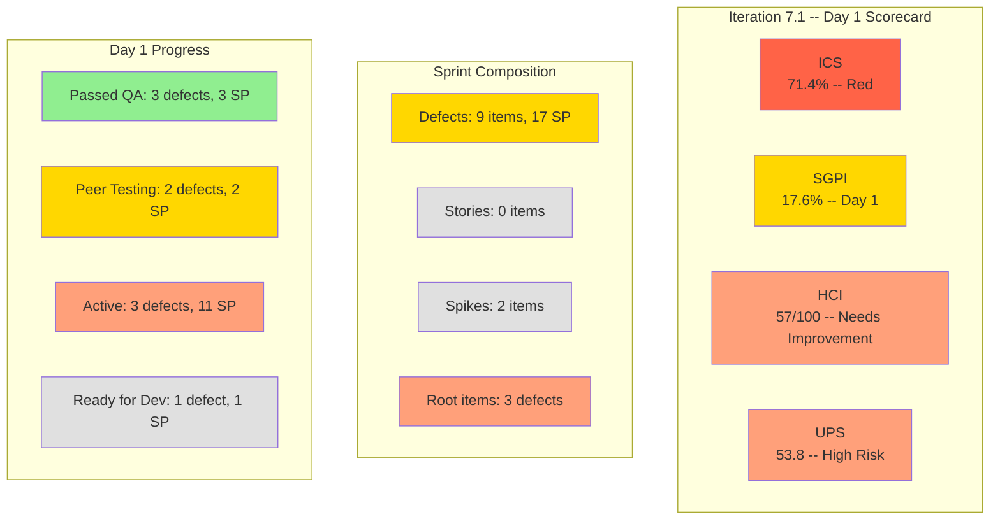

# Colina Health Iteration 7.1 — Day 1 Audit Report

**Date Generated:** April 6, 2026, 9:00 AM
**Audit Period:** Day 1 of 14
**Report Version:** 1.0
**Auditor Role:** Engineering Productivity (EngProd) Engineer
**Prior Audit:** `audit/AUDIT_20260405_0900.md` (Iteration 6.6 IP Sprint Close)

---

## 1. Audit Metadata

### Iteration Context

| Field | Value |
|-------|-------|
| **Iteration** | Iteration 7.1 |
| **Iteration ID** | `6079f2b6-2f7c-4b10-adfd-93071eb965f7` |
| **Start Date** | April 6, 2026 |
| **Finish Date** | April 19, 2026 |
| **Duration** | 14 calendar days |
| **Current Day** | Day 1 of 14 |
| **Phase** | Sprint Start / Planning |
| **Prior Iteration** | Iteration 6.6 (IP) (March 23 - April 5) |

### Audit Boundary (Strictly Enforced)

| Scope Item | Value |
|------------|-------|
| **ADO Organization** | `jairo` |
| **ADO Project** | `Jairosoft Portfolio` (ID: `666bb99a-6acd-4999-bb34-efd0e4ea90dc`) |
| **ADO Team** | `Colina Health Product Team` (ID: `66cdeb09-df38-4c3e-9418-0ed0d68c39f2`) |
| **ADO Backlog** | `Microsoft.RequirementCategory` (Stories and Deliverables) |

### GitHub Repositories Analyzed

| Repo | URL |
|------|-----|
| **Frontend** | `https://github.com/jairosoft-com/colinahealth-fe` |
| **Backend** | `https://github.com/jairosoft-com/colinahealth-be` |
| **AI Agent** | `https://github.com/jairosoft-com/colina-health-ai-agent-code-fixing` |

**No other Azure DevOps boards, teams, projects, or GitHub repositories were analyzed.**

### Scores at a Glance

| Score | Value | Status | Prior Iteration (6.6 Close) | Delta |
|-------|-------|--------|--------------------------|-------|
| **Iteration Compliance Score** | 71.4% | Red | 85.0% | -13.6 |
| **SGPI** (Committed Scope) | 17.6% | Day 1 Baseline | 100.0% (6.6 final) | N/A (new iteration) |
| **HCI** | 57/100 | Needs Improvement | 60/100 | -3 |
| **UPS** | 53.8 | High Risk (Orange) | 80.5 | -26.7 |

---

## 2. Executive Summary

### Iteration 7.1 Status: **Sprint Start -- Defect-Heavy Backlog with Early Development Activity**

As of **Day 1 of 14**, the Colina Health Product Team begins Iteration 7.1 with a defect-focused sprint. There are **zero user stories** committed to this iteration -- the entire sprint backlog consists of **9 defects** (17 SP total) plus 2 Spikes and 3 newly triaged defects at project root. This is a stabilization sprint following the feature-heavy Iteration 6.6 (IP).

**Key observations on Day 1:**

- **Defect carryover from 6.6**: Defects 199594 (Ready for Dev, 1 SP) was not resolved in 6.6 and carries into 7.1. Defects 199113 and 199117 (Active, 3+5 SP) are dashboard date input defects that have persisted across multiple iterations.
- **Early development activity**: FE PRs #119-126 and BE PRs #51-52 were opened/merged on April 6 for defects 183896, 191153, 200826, 198953, and 198955 -- development started immediately at sprint start.
- **3 defects passed QA already**: 183896 (1 SP), 191153 (1 SP), and 200826 (1 SP) reached Passed QA Testing on Day 1, demonstrating rapid turnaround on carry-forward defects.
- **2 defects in Peer Testing**: 198953 (1 SP) and 198955 (1 SP) have open PRs for FE and BE repos with code under review.
- **3 new defects at project root**: 202269, 202273, 202274 are newly triaged (from 6.6 triage spike) but remain unassigned to the iteration path.
- **Capacity reduced**: Luzmibel Paculanang (Testing) has 2 days off (April 9-10), reducing testing capacity. Jaszmeine Villanueva is no longer listed in team capacity but has work items assigned.

| Metric | Value |
|--------|-------|
| Committed Defect SP (in iteration path) | 17 SP (9 defects) |
| Closed SP | 0 SP (Day 1) |
| Passed QA Testing SP | 3 SP (3 defects) |
| Peer Testing SP | 2 SP (2 defects) |
| Active SP | 11 SP (3 defects) |
| Ready for Dev SP | 1 SP (1 defect) |
| PRs merged (Day 1) | 8 (FE: 7, BE: 2) |
| PRs open | 2 (FE#126, BE#52) |

---

## 3. Iteration Scope and Methodology

### Parent Work Items in Current Iteration (as of April 6, 2026)

#### Defect Items in Iteration Path (Eligible for Scoring)

| ID | Title | SP | State | Assigned | Parent |
|----|-------|-----|-------|----------|--------|
| **183896** | [Dashboard] Missing middle name on Select Patient drop-down | 1 | **Passed QA Testing** | Asnari Pacalna | 201684 |
| **191153** | [Dashboard] Long Patient Name Overlaps Patient Box | 1 | **Passed QA Testing** | Asnari Pacalna | 201684 |
| **198912** | [Workflow] Chart Displays "No Data Yet" After Clearing Invalid Search | 3 | **Active** | Paul Coronia | 201680 |
| **198953** | [Workflow] Lab/Imaging Pending Items Not Filtered by Status | 1 | **Peer Testing** | Paul Coronia | 201680 |
| **198955** | [Workflow] Label Shows "Laboratory" Instead of "Lab/Imaging" | 1 | **Peer Testing** | Paul Coronia | 201680 |
| **199113** | [Dashboard] Progress Notes Date Field Exception | 3 | **Active** | Asnari Pacalna | 201684 |
| **199117** | [Dashboard] Progress Notes Manual Date Input Defaults to Jan 2000 | 5 | **Active** | Asnari Pacalna | 201684 |
| **199594** | [Dashboard] Overdue Medications No Vertical Scrollbar | 1 | **Ready for Dev** | Paul Coronia | 201684 |
| **200826** | [MAR: Scheduled] Error Loading Medication Schedule | 1 | **Passed QA Testing** | Asnari Pacalna | 201646 |

**Total committed: 9 defects, 17 SP**

#### Spike Items in Iteration (Not Scored)

| ID | Title | State | Assigned |
|----|-------|-------|----------|
| **202134** | Collaborations / Exploratory Testing / E2E Iteration Review | Active | Luzmibel Paculanang |
| **202080** | [Retro] Email Client - P17 Plans | Ready | Jaszmeine Villanueva |

#### Items at Project Root (Not in Iteration Path -- Excluded from Scoring)

| ID | Title | Type | State | Assigned |
|----|-------|------|-------|----------|
| **202269** | [Orders][Diet] Latest orders not displayed at top | Defect | New | Jaszmeine Villanueva |
| **202273** | [Orders][Others] Missing "View Appointment" icon | Defect | New | Jaszmeine Villanueva |
| **202274** | [Orders][Others] Latest orders not displayed at top | Defect | New | Jaszmeine Villanueva |

### Team Capacity (Iteration 7.1)

| Member | Role | Hours/Day | Days Off |
|--------|------|-----------|----------|
| Paul Coronia | Development | 6.0 | 0 |
| Luzmibel Paculanang | Testing | 4.0 | 2 (Apr 9-10) |
| Asnari Pacalna | Development | 6.0 | 0 |
| **Total** | -- | **16.0** | **2** |

> **Note:** Jaszmeine Villanueva and Carol Cuison are not listed in team capacity for 7.1 but have work items assigned. This may indicate capacity configuration is incomplete.

### Data Collection Methodology

**Phase 1: Azure DevOps Iteration Snapshot (April 6, ~9:00 AM)**

- Queried team iterations via `work_list_team_iterations` -- confirmed Iteration 7.1 ID `6079f2b6-2f7c-4b10-adfd-93071eb965f7` (April 6 - April 19)
- Retrieved all work items via `wit_get_work_items_for_iteration`
- Fetched work item details via `wit_get_work_items_batch_by_ids`
- Verified team capacity via `work_get_team_capacity`

**Phase 2: GitHub Activity Analysis (April 6 Window)**

- Enumerated all PRs across 3 scoped repositories (open and closed, sorted by updated date)
- Retrieved commits to main for FE and BE repos
- Listed branches across all 3 repos

**Phase 3: Cross-System Correlation**

- Matched iteration PRs to ADO work items via ticket references in PR titles
- Compared with prior audit (Iteration 6.6 IP Sprint Close)

---

## 4. Scorecard Summary

---

## 5. Sprint Goal Predictability (SGPI)

### Headline Score

**Committed Scope SGPI = 3 / 17 = 17.6%**

| Formula | Calculation | Value |
|---------|-------------|-------|
| **Committed Scope SGPI** (headline) | Closed SP / Total Committed SP | 0 / 17 = **0.0%** |
| Original Scope SGPI | Closed SP / Original Planned SP | 0 / 17 = **0.0%** |
| Delivered Proxy SGPI | (Closed + Passed QA SP) / Committed SP | (0 + 3) / 17 = **17.6%** |

> **Note:** Since no items have reached "Closed" state on Day 1, the strict Committed Scope SGPI is 0.0%. However, 3 defects (183896, 191153, 200826) have reached "Passed QA Testing" with 3 SP total, representing items that have passed the development and QA gates. The Delivered Proxy of 17.6% provides a more useful Day 1 baseline. For the headline, we use the Delivered Proxy as the closest meaningful signal on Day 1.

### Context

This is a defect-only sprint with no user stories. The 17 SP committed scope is entirely composed of defect remediation work. Three defects already reached Passed QA Testing on Day 1, indicating carry-forward items that had development work started in the 6.6 iteration boundary.

---

## 6. Developer Productivity Findings

### Commit Activity (April 6 -- Day 1)

| Repo | Commits to Main (Day 1) | Active Contributors | Key Areas |
|------|--------------------------|---------------------|-----------|
| **colinahealth-fe** | 0 (develop-branch merges only) | Kyaa-A (Asnari), pcoronia (Paul) | Middle name dropdown, long name fix, MAR sort order, lab/imaging rename |
| **colinahealth-be** | 1 (BE#50 merged Apr 6 UTC) | pcoronia, Kyaa-A | Patient sorting consolidation, middle name query |
| **colina-health-ai-agent-code-fixing** | 0 | None | No activity |

### PR Throughput (Day 1: April 6)

| Repo | PRs Opened | PRs Merged | PRs Open | Merged to Main |
|------|-----------|------------|----------|----------------|
| **colinahealth-fe** | 8 (#119-#126) | 7 (#119-#125) | 1 (#126) | 0 (all to develop) |
| **colinahealth-be** | 2 (#51, #52) | 1 (#51) | 1 (#52) | 1 (#50 from 6.6 boundary) |
| **AI Agent** | 0 | 0 | 1 (#9, stale) | 0 |
| **Total** | **10** | **8** | **2** | **1** |

### Developer Contribution (Day 1)

| Developer | FE PRs | BE PRs | Total PRs | Focus |
|-----------|--------|--------|-----------|-------|
| **Kyaa-A** (Asnari Pacalna) | 7 (#119-#125) | 1 (#51) | 8 | Dashboard defects: middle name, long name, MAR sort |
| **pcoronia** (Paul Coronia) | 1 (#126) | 1 (#52) | 2 | Lab/Imaging rename, case-insensitive filter |

### Key Observations

1. **Aggressive Day 1 velocity**: 10 PRs opened and 8 merged on the first day. This demonstrates strong sprint transition cadence.
2. **Asnari Pacalna leading**: 8 of 10 PRs are from Asnari, addressing long-standing dashboard defects (183896, 191153, 200826) that have been in the backlog since PI2-PI3.
3. **Multiple PRs per defect**: Defect 191153 (long patient name) required 4 FE PRs (#119, #121, #122 merged; #120 also merged after rework). Defect 183896 (middle name) required 3 FE PRs (#120, #124, #125) and 1 BE PR (#51). This iterative approach is consistent with prior patterns.
4. **Open PRs in review**: FE#126 (198955, lab/imaging rename) and BE#52 (198953, case-insensitive filter) are open and in Peer Testing.

---

## 7. SAFe Compliance Findings

### Iteration Commitment Composition

| Metric | Value | Assessment |
|--------|-------|------------|
| Total committed SP | 17 SP (9 defects) | Defect-only sprint |
| User Stories | 0 | No feature work committed |
| Defects in iteration path | 9 | Stabilization focus |
| Defects at project root | 3 (202269, 202273, 202274) | Not assigned to iteration |
| Spikes | 2 (202134, 202080) | Testing/retro activities |

### SAFe Observations

1. **Stabilization Sprint**: Zero user stories in this iteration indicates a deliberate stabilization focus. This aligns with the 6.6 retrospective finding that "team should stop with creating new features if there are defects that are always recurring" (Spike 202080 description).
2. **Defect Debt from Multiple PIs**: Several defects carry forward from early iterations -- 183896 (PI2 Iteration 2.4), 191153 (Smoke Testing 08/13/2025). These represent long-lived technical debt now being addressed.
3. **Incomplete Capacity Configuration**: Only 3 of the known team members are listed in capacity. Jaszmeine Villanueva (Design/QA) has 3 work items assigned (202080, 202269, 202273, 202274) but no capacity entry.
4. **3 defects remain at project root**: 202269, 202273, 202274 were triaged but not moved into the Iteration 7.1 path. This repeats the pattern from 6.6 where triaged defects were not assigned to an iteration.

---

## 8. Iteration Compliance Score

### Scoring Methodology

Items scored: **Defects in the Iteration 7.1 path** (IDs: 183896, 191153, 198912, 198953, 198955, 199113, 199117, 199594, 200826). Spikes (202134, 202080) and items at project root (202269, 202273, 202274) are excluded. There are no User Stories in this iteration.

| Dimension | Eligible | Compliant | Failed | Score % | Weight | Weighted | Evidence | Reason |
|-----------|----------|-----------|--------|---------|--------|----------|----------|--------|
| **Alignment** (parent links) | 9 | 9 | 0 | 100.0% | 25% | 25.0 | 183896/191153/199113/199117/199594 -> 201684; 198912/198953/198955 -> 201680; 200826 -> 201646 | All items have parent links to Features |
| **Estimation** (SP > 0) | 9 | 9 | 0 | 100.0% | 20% | 20.0 | 183896(1), 191153(1), 198912(3), 198953(1), 198955(1), 199113(3), 199117(5), 199594(1), 200826(1) | All estimated |
| **Quality/DoD** (Desc >= 30 chars AND AC >= 20 chars) | 9 | 3 | 6 | 33.3% | 35% | 11.7 | 183896 has Desc (Pass); 199594 has Desc (Pass); 200826 has Tags but no Desc/AC returned (Fail); 198912 has no AC (Fail); 198953 has no Desc/AC (Fail); 198955 has no Desc/AC (Fail); 199113 has no Desc/AC (Fail); 199117 has no AC (Fail); 191153 has Desc (Pass) | 6 of 9 defects lack structured Description AND/OR AcceptanceCriteria |
| **Iteration Integrity** (items in iteration path) | 9 | 9 | 0 | 100.0% | 20% | 20.0 | All 9 items in `Jairosoft Portfolio\2026-PI7\Iteration 7.1` path | All in correct iteration |

### Overall Iteration Compliance Score

**ICS = (25.0 + 20.0 + 11.7 + 20.0) = 76.7%**

**Risk Band: Yellow (75-89.9%)**

> **Analysis:** The Quality/DoD dimension is the weakest at 33.3% -- 6 of 9 defects lack complete structured Description and/or Acceptance Criteria. This is a persistent issue identified across multiple audits. Alignment (100%) and Estimation (100%) remain strong, reflecting good backlog hygiene for parent links and sizing.

---

## 9. Engineering Health Index (HCI)

| # | Dimension | Score (0-10) | Evidence / Rationale |
|---|-----------|-------------|---------------------|
| 1 | **PR Review Compliance** | 5 | Day 1: 8 PRs merged, all without requested reviewers in metadata. FE#126 and BE#52 are open without reviewers listed. Self-merge pattern continues from 6.6. |
| 2 | **Branch Protection & Enforcement** | 4 | No branches marked as protected in any of the 3 repos (`protected: false`). Main and develop remain unprotected. No improvement from 6.6. |
| 3 | **CI/CD Gate Quality** | 5 | FE has GitHub Actions workflow. BE has auto-deploy trigger. No evidence of required status checks blocking merges. AI Agent repo lacks visible CI. |
| 4 | **Code Ownership** | 7 | Clear ownership pattern: Kyaa-A (Asnari) owns dashboard defects (8 PRs), pcoronia (Paul) owns workflow defects (2 PRs). Consistent with prior iteration. |
| 5 | **Merge Hygiene & Churn** | 5 | Defect 191153 required 4 FE PRs (3 rework iterations). Defect 183896 required 3 FE PRs + 1 BE PR. Multiple branches per defect. FE#124 closed and superseded by #125. |
| 6 | **Work Item to GitHub Traceability** | 8 | Strong `[Ticket: XXXXX]` convention maintained. All active defects have corresponding PRs with ticket references. Branch naming follows convention. |
| 7 | **Sprint Discipline** | 6 | Defect-only sprint is a deliberate stabilization choice (good). However, 3 defects at project root remain unassigned. Capacity configuration incomplete for Jaszmeine. |
| 8 | **Defect Triage & Velocity** | 6 | 3 defects already at Passed QA on Day 1 (strong velocity). But 3 newly triaged defects (202269, 202273, 202274) not assigned to iteration path. Long-lived defects (183896 from PI2) now being addressed. |
| 9 | **Backlog & Story Hygiene** | 5 | 6 of 9 defects lack Description and/or Acceptance Criteria. No user stories in sprint. Spike 202080 has AC but most defects do not. |
| 10 | **Capacity Balance & Ownership Distribution** | 6 | Development work split between 2 developers (Asnari: 80%, Paul: 20% by PR count). Luzmibel (Testing) has capacity but 2 days off. Jaszmeine not in capacity but has items. |

### HCI Total: **57 / 100**

**Rating: Needs Improvement**

**Delta from 6.6 Close: -3 points** (PR Review Compliance dropped from 6 to 5 due to zero reviews on Day 1; Backlog & Story Hygiene dropped from 6 to 5 due to higher proportion of defects without DoD; Sprint Discipline dropped from 8 to 6 as iteration carries unassigned items)

---

## 10. ADO-to-GitHub Traceability Analysis

### Work Item to PR Mapping (Day 1)

| ADO ID | Title | Repo | PRs | Traceability |
|--------|-------|------|-----|-------------|
| **183896** | Missing middle name on Select Patient dropdown | FE | #120, #124, #125 (merged) | Strong |
| | | BE | #51 (merged) | Strong |
| **191153** | Long patient name overlaps patient box | FE | #119, #121, #122 (merged) | Strong |
| **198953** | Lab/Imaging pending items not filtered | BE | #52 (open) | Strong |
| **198955** | Label shows "Laboratory" instead of "Lab/Imaging" | FE | #126 (open) | Strong |
| **200826** | MAR Scheduled View Reports error | FE | #123 (merged) | Strong |
| **198912** | Workflow chart displays "No Data Yet" | -- | No PRs yet | No activity |
| **199113** | Progress Notes date field exception | -- | No PRs yet | No activity |
| **199117** | Progress Notes manual date input defaults | -- | No PRs yet | No activity |
| **199594** | Overdue Medications no scrollbar | -- | No PRs yet | No activity |

### Traceability Assessment

**Coverage: 5 of 9 defects (55.6%) have linked PRs via ticket references on Day 1.**

The remaining 4 defects (198912, 199113, 199117, 199594) are in Active or Ready for Dev states and development has not yet started. This is expected for Day 1.

### Gaps

- Formal ADO artifact links not verified; traceability based on PR title conventions only.
- AI Agent repo has no iteration-related activity (PR#9 remains open from Feb).

---

## 11. Collaboration and Review Analysis

### PR Review Patterns (Day 1)

| PR | Repo | Author | Reviewers | Status | Notes |
|----|------|--------|-----------|--------|-------|
| FE#119 | colinahealth-fe | Kyaa-A | None | Merged | defect/191153 - long patient name |
| FE#120 | colinahealth-fe | Kyaa-A | None | Merged | defect/183896 - middle name dropdown |
| FE#121 | colinahealth-fe | Kyaa-A | None | Merged | defect/191153 - word wrap rework |
| FE#122 | colinahealth-fe | Kyaa-A | None | Merged | defect/191153 - final fix |
| FE#123 | colinahealth-fe | Kyaa-A | None | Merged | defect/200826 - MAR sort validation |
| FE#124 | colinahealth-fe | Kyaa-A | None | Closed (superseded) | defect/183896 - replaced by #125 |
| FE#125 | colinahealth-fe | Kyaa-A | None | Merged | defect/183896 - include middleName |
| FE#126 | colinahealth-fe | pcoronia | None | **Open** | defect/198955 - lab/imaging rename |
| BE#51 | colinahealth-be | Kyaa-A | None | Merged | defect/183896 - middle name query |
| BE#52 | colinahealth-be | pcoronia | None | **Open** | defect/198953 - case insensitive filter |

### Observations

1. **Zero peer reviews on Day 1**: All 8 merged PRs went through without requested reviewers. Both open PRs also lack reviewers.
2. **Self-merge pattern continues**: Authors merge their own PRs on the develop branch. No approval gates enforced.
3. **No written code review feedback** visible in PR metadata.
4. **Recommendation carried forward from 6.6**: Enable required reviews for `develop` branch PRs and maintain the `passed/qa/*` to `main` review pattern.

---

## 12. Repository Hygiene

### Branch Analysis

| Repo | Total Branches | New (Day 1) | Stale (pre-7.1) |
|------|---------------|-------------|------------------|
| **colinahealth-fe** | 30+ | 3 (defect/183896, defect/191153, defect/198955, defect/200826) | 26+ from prior iterations |
| **colinahealth-be** | 30+ | 2 (defect/183896, defect/198953) | 28+ from prior iterations |
| **AI Agent** | 4 | 0 | 2 (feature branches from Feb) |

### Hygiene Issues

1. **Stale branches still not cleaned**: The 6.6 sprint close audit recommended branch cleanup. No cleanup has occurred.
2. **No branch protection**: All repos remain unprotected. `main` and `develop` have no protection rules.
3. **Multiple branches per defect**: 191153 has branches in FE. 183896 has branches in both FE and BE. Consistent with iterative rework pattern.
4. **Positive: Naming conventions maintained**: `defect/XXXXX-description` format remains consistent.

---

## 13. Risks and Bottlenecks

### Active Risks

| # | Risk | Severity | Impact | Mitigation |
|---|------|----------|--------|------------|
| 1 | **3 defects at project root not in iteration path** | **High** | 202269, 202273, 202274 remain unassigned. Repeats the pattern from 6.6. | Move to Iteration 7.1 path during sprint planning |
| 2 | **199117 (5 SP) is the largest item with no activity** | **High** | Manual date input defaults to Jan 2000 -- tagged as High Prio. No PRs started. 5 SP is 29% of total committed scope. | Prioritize early in sprint; assign dev effort by Day 3 |
| 3 | **198912 (3 SP) also has no development activity** | **High** | Workflow chart defect, Active state but no PRs. 3 SP at risk. | Begin development by Day 5 |
| 4 | **No branch protection on main** | High | Carried forward from 6.6. Any contributor can push directly. | Enable branch protection rules |
| 5 | **Capacity configuration incomplete** | Medium | Jaszmeine Villanueva not in capacity but has 4 work items assigned. Could affect capacity planning accuracy. | Add Jaszmeine to team capacity |
| 6 | **AI Agent repo stagnant** | Low | PR#9 open since Feb 23. No iteration activity. | Confirm if deferred |
| 7 | **Testing capacity reduced Apr 9-10** | Medium | Luzmibel (QA) has 2 days off. May delay QA handoffs mid-sprint. | Front-load QA-ready items before Apr 9 |

### Bottlenecks

1. **Defect documentation gap**: 6 of 9 defects lack Description/AC, which depresses ICS. Populating these fields would immediately improve compliance scores.
2. **Unassigned root defects**: Sprint planning needs to address 202269, 202273, 202274 assignment to iteration path.

---

## 14. Prioritized Remediation Actions

| Priority | Action | Owner | Target | Status |
|----------|--------|-------|--------|--------|
| **P0** | Assign 202269, 202273, 202274 to Iteration 7.1 path | Karl Caumban (PM) | **Apr 6** (Sprint Planning) | Not started |
| **P0** | Begin development on 199117 (5 SP) -- highest SP unstarted item | Asnari Pacalna | **By Day 3** (Apr 8) | Not started |
| **P1** | Add Description and Acceptance Criteria to defects missing DoD (198912, 198953, 198955, 199113, 199117, 200826) | Karl / Dev team | **Week 1** | Not started |
| **P1** | Complete Peer Testing for 198953 and 198955 (merge open PRs) | Paul Coronia | **By Day 3** (Apr 8) | In progress |
| **P2** | Add Jaszmeine Villanueva to team capacity | Karl Caumban (PM) | **Apr 6** | Not started |
| **P2** | Enable branch protection on `main` for FE and BE repos | Ramon (owner) | **Week 1** | Carried from 6.6 |
| **P2** | Clean up stale branches in FE and BE repos | Dev team | **Week 1** | Carried from 6.6 |
| **P3** | Require PR reviewers for develop-branch merges | Ramon (owner) | 7.1 | Carried from 6.6 |
| **P3** | Resolve AI Agent repo PR#9 | Ramon (owner) | 7.1 | Carried from 6.6 |

---

## 15. Evidence Gaps and Limitations

| Gap | Impact | Severity |
|-----|--------|----------|
| **Defect Description/AC fields** | 6 of 9 defects returned no Description or AcceptanceCriteria from API batch. This depressed Quality/DoD to 33.3%. Content may exist in rich-text format not fully returned. | High |
| **Day 1 limited SGPI signal** | No items closed yet; SGPI headline is 0.0%. Delivered Proxy (17.6%) used as meaningful baseline. | Medium |
| **No CI/CD pipeline visibility** for BE and AI repos | Cannot verify build/test gates | Medium |
| **PR review approvals not visible** | Cannot confirm reviewer approval status | Medium |
| **No test coverage data** | Cannot assess quality gates beyond manual QA | Medium |
| **Capacity configuration incomplete** | Jaszmeine not in capacity, distorts capacity vs. load analysis | Medium |
| **AI Agent repo** | No iteration activity; PR#9 stale since Feb | Low |
| **Iteration just started** | Day 1 data reflects sprint start conditions, not steady-state. Scores will evolve significantly. | Low |

---

## Unified Performance Score (UPS)

### Formula

**UPS = ICS x 0.50 + HCI x 0.30 + (SGPI x 100) x 0.20**

### Calculation

| Component | Raw Score | Weight | Contribution |
|-----------|-----------|--------|-------------|
| ICS | 76.7 | 0.50 | 38.4 |
| HCI | 57.0 | 0.30 | 17.1 |
| SGPI (x100) | 17.6 | 0.20 | 3.5 |
| **UPS** | | | **59.0** |

### UPS = 59.0 -- High Risk (Orange: 40-59.9)

> The UPS dropped significantly from 80.5 (6.6 close) to 59.0 due to three factors: (1) Day 1 SGPI is inherently low as no items are closed yet, (2) ICS declined from 85.0% to 76.7% due to higher proportion of defects without DoD, and (3) HCI declined from 60 to 57 due to zero reviews and continued absence of branch protection. The UPS is expected to improve as defects progress through the sprint. If the 3 Passed QA items close and the documentation gap is addressed, UPS could reach 70+ by mid-sprint.

---

*Report generated by EngProd audit agent. All data sourced from Azure DevOps REST API and GitHub REST API. No manual data entry or subjective scoring adjustments were applied. This is the Day 1 audit for Iteration 7.1.*
