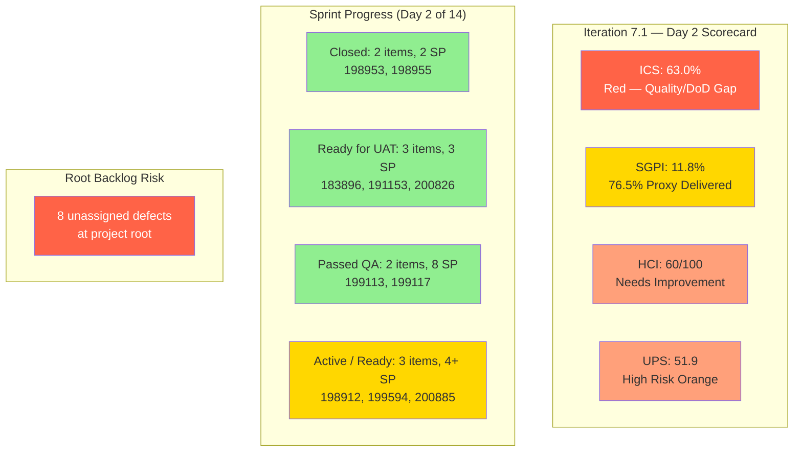
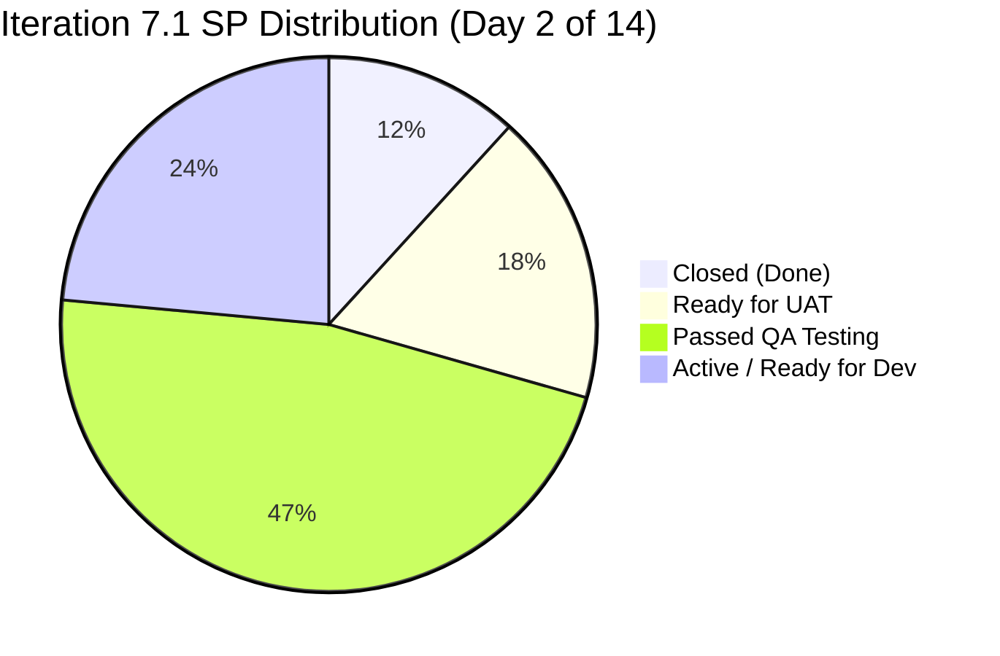

# Colina Health Iteration 7.1 — Day 2 Audit Report

**Date Generated:** April 7, 2026, 5:08 PM
**Audit Period:** Day 2 of 14
**Report Version:** 1.0
**Auditor Role:** Engineering Productivity (EngProd) Engineer
**Prior Audit:** `audit/AUDIT_20260406_0900.md` (Iteration 7.1 Day 1)

---

## 1. Audit Metadata

### Iteration Context

| Field | Value |
|-------|-------|
| **Iteration** | Iteration 7.1 |
| **Iteration ID** | `6079f2b6-2f7c-4b10-adfd-93071eb965f7` |
| **Start Date** | April 6, 2026 |
| **Finish Date** | April 19, 2026 |
| **Duration** | 14 calendar days |
| **Current Day** | Day 2 of 14 |
| **Phase** | Active Development / Early Sprint |
| **Prior Iteration** | Iteration 6.6 (IP) (March 23 – April 5) |

### Audit Boundary (Strictly Enforced)

| Scope Item | Value |
|------------|-------|
| **ADO Organization** | `jairo` |
| **ADO Project** | `Jairosoft Portfolio` (ID: `666bb99a-6acd-4999-bb34-efd0e4ea90dc`) |
| **ADO Team** | `Colina Health Product Team` (ID: `66cdeb09-df38-4c3e-9418-0ed0d68c39f2`) |
| **ADO Backlog** | `Microsoft.RequirementCategory` (Stories and Deliverables) |

### GitHub Repositories Analyzed

| Repo | URL |
|------|-----|
| **Frontend** | `https://github.com/jairosoft-com/colinahealth-fe` |
| **Backend** | `https://github.com/jairosoft-com/colinahealth-be` |
| **AI Agent** | `https://github.com/jairosoft-com/colina-health-ai-agent-code-fixing` |

**No other Azure DevOps boards, teams, projects, or GitHub repositories were analyzed.**

### Scores at a Glance

| Score | Value | Status | Day 1 Baseline | Delta |
|-------|-------|--------|----------------|-------|
| **ICS** (Iteration Compliance Score) | 63.0% | Red | 76.7% | -13.7 |
| **SGPI** (Committed Scope) | 11.8% | Day 2 In-Progress | 0.0% (Day 1 Closed) | +11.8 |
| **HCI** (Health Check Index) | 60/100 | Needs Improvement | 57/100 | +3 |
| **UPS** (Unified Portfolio Score) | 51.9 | High Risk (Orange) | 59.0 | -7.1 |

> **Note on ICS delta:** ICS declined from Day 1 (76.7%) because 200885 was added to the iteration path today with no Story Points or Description/AC, and the Quality/DoD re-evaluation against all 10 items reveals zero items with both Description and Acceptance Criteria present in the API response. This is a data completeness gap, not a process regression.

---

## 2. Executive Summary

### Iteration 7.1 Status: **Strong Day 2 Velocity — Defect Closures and Production Promotions**

As of **Day 2 of 14**, the Colina Health Product Team has achieved significant throughput with two defects fully closed and three defects promoted to Ready for UAT via the `passed/qa/*` → `main` promotion pattern. The team resolved 5 of 10 scored defects to production-ready or closed states within the first two days of the sprint.

**Key observations on Day 2:**

- **Two defects fully closed**: 198953 (Lab/Imaging case-insensitive filter, 1 SP) and 198955 (Lab/Imaging label rename, 1 SP) were closed today after FE#132 and BE#54 were merged to `main` via the `passed/qa/*` promotion pattern.
- **Three defects promoted to Ready for UAT**: 183896 (middle name dropdown, 1 SP), 191153 (long patient name, 1 SP), and 200826 (MAR scheduled error, 1 SP) were promoted to `main` via `passed/qa/*` branches and transitioned to Ready for UAT.
- **Two defects advanced to Passed QA Testing**: 199113 (Progress Notes date exception, 3 SP) and 199117 (manual date input defaults, 5 SP) — the highest-SP item — moved to Passed QA Testing after FE#131 was merged today. This is the highest-value progress event of the sprint.
- **Retro Spike 202080 closed**: The retrospective email item was completed and closed.
- **New defect added to iteration**: 200885 ([Dashboard] cards not showing on tablet view, Ready for Dev) was added to the 7.1 iteration path today.
- **8 new root defects triaged**: 202269, 202273, 202274, 202436, 202439, 202442, 202444, 202448 remain at project root. This backlog of unassigned defects represents emerging risk.
- **Remaining at-risk items**: 198912 (Workflow chart "No Data Yet", 3 SP) and 199594 (Overdue Medications scrollbar, 1 SP) have no PR activity yet.

| Metric | Value |
|--------|-------|
| Committed Defect SP (in iteration path) | 17 SP (9 original + 200885 at 0 SP) |
| Closed SP | 2 SP (198953, 198955) |
| Ready for UAT SP | 3 SP (183896, 191153, 200826) |
| Passed QA Testing SP | 8 SP (199113=3, 199117=5) |
| Active SP | 3 SP (198912) |
| Ready for Dev SP | 2 SP (199594=1, 200885 unknown) |
| Total delivered or QA-ready SP | 13 / 17 SP (76.5% proxy) |
| PRs merged (Apr 6–7 cumulative) | 16 (FE: 12, BE: 4) |
| PRs to main (production) | 7 (183896 FE+BE, 191153, 198953 FE+BE, 198955, 200826) |

---

## 3. Iteration Scope and Methodology

### Parent Work Items in Current Iteration (as of April 7, 2026)

#### Defect Items in Iteration Path (Eligible for Scoring)

| ID | Title | SP | State | Assigned | Parent | Changed |
|----|-------|-----|-------|----------|--------|---------|
| **183896** | [Dashboard] Missing middle name on Select Patient drop-down | 1 | **Ready for UAT** | Asnari Pacalna | 201684 | Apr 7 |
| **191153** | [Dashboard] Patients with Longer Name Overlaps Patient Box | 1 | **Ready for UAT** | Asnari Pacalna | 201684 | Apr 7 |
| **198912** | [Workflow] Chart Displays "No Data Yet" After Clearing Invalid Search | 3 | **Active** | Paul Coronia | 201680 | Apr 7 |
| **198953** | [Workflow][Orders: Lab/Imaging] Pending items not displayed when filtering | 1 | **Closed** | Paul Coronia | 201680 | Apr 7 |
| **198955** | [Workflow][Orders: Lab/Imaging] Label still shows "Laboratory" | 1 | **Closed** | Paul Coronia | 201680 | Apr 7 |
| **199113** | [Dashboard][Progress Notes] Client-side exception on non-numeric date input | 3 | **Passed QA Testing** | Asnari Pacalna | 201684 | Apr 7 |
| **199117** | [Dashboard][Progress Notes] Manual date input defaults to Jan 01, 2000 | 5 | **Passed QA Testing** | Asnari Pacalna | 201684 | Apr 7 |
| **199594** | [Dashboard][Overdue Medications] No vertical scrollbar | 1 | **Ready for Dev** | Paul Coronia | 201684 | Apr 7 |
| **200826** | [MAR: Scheduled] Error loading medication schedule | 1 | **Ready for UAT** | Asnari Pacalna | 201646 | Apr 7 |
| **200885** | [Dashboard] Cards not showing on smaller screens / iPad view | ? | **Ready for Dev** | Asnari Pacalna | 201684 | Apr 7 |

**Total committed: 10 defects, 17 SP known (200885 SP unknown)**

#### Spike Items in Iteration

| ID | Title | Type | State | Assigned |
|----|-------|------|-------|----------|
| **202134** | Collaborations / Exploratory Testing / E2E Iteration Review | Spike | Active | Luzmibel Paculanang |
| **202080** | [Retro] Email Client - P17 Plans | Spike | **Closed** | Jaszmeine Villanueva |

#### Items at Project Root (Not in Iteration Path — Excluded from Scoring)

| ID | Title | Type | State | SP |
|----|-------|------|-------|-----|
| **202269** | [Orders][Diet][View History] Latest orders not displayed at top | Defect | New | ? |
| **202273** | [Orders][Others] Missing "View Appointment" icon | Defect | New | ? |
| **202274** | [Orders][Others][View History] Latest orders not displayed at top | Defect | New | ? |
| **202436** | [MAR][PRN][Workflow] Discontinued medications still displayed | Defect | New | ? |
| **202439** | [Patient Record][ADLs] Notes field shows validation error when optional | Defect | New | ? |
| **202442** | [Patient Record][Medical History][Allergies] Unable to edit allergy records | Defect | New | ? |
| **202444** | [Patient Record][Medical History][Surgeries] Unable to edit surgery records | Defect | New | ? |
| **202448** | [Dashboard][Progress Notes] Unable to navigate calendar months in date picker | Defect | New | ? |

> **8 unassigned root defects** represent a growing backlog risk. None are assigned to the Iteration 7.1 path.

### Team Capacity (Iteration 7.1)

| Member | Role | Hours/Day | Days Off |
|--------|------|-----------|----------|
| Paul Coronia | Development | 6.0 | 0 |
| Luzmibel Paculanang | Testing | 4.0 | 2 (Apr 9–10) |
| Asnari Pacalna | Development | 6.0 | 0 |
| **Colina Health Team** | All | **16.0 h/day** | **2** |

> **Note:** Jaszmeine Villanueva is active on items (202080 Closed) but not listed in team capacity. Carol Cuison not in capacity. 200885 added to iteration path and assigned to Asnari, indicating scope creep vs. original 9-defect plan.

### Data Collection Methodology

**Phase 1: Azure DevOps Iteration Snapshot (April 7, ~5:08 PM)**
- Confirmed current iteration via `work_list_team_iterations` — Iteration 7.1 ID `6079f2b6-2f7c-4b10-adfd-93071eb965f7`
- Retrieved all iteration work items via `wit_get_work_items_for_iteration`
- Fetched work item details for all 20 parent items via `wit_get_work_items_batch_by_ids`
- Retrieved iteration capacity via `work_get_iteration_capacities`

**Phase 2: GitHub Activity Analysis (April 6–7 Window)**
- Enumerated all PRs across 3 repos (state: all, sorted by updated date)
- Retrieved commits to `main` for FE and BE repos since Apr 6
- Listed all branches across FE and BE repos

**Phase 3: Cross-System Correlation**
- Matched iteration PRs to ADO work items via `[Ticket: XXXXX]` title references
- Analyzed branch naming patterns (`defect/*`, `passed/qa/*`)
- Compared states against Day 1 baseline

---

## 4. Scorecard Summary

### Sprint Burnup (Story Points)

---

## 5. Sprint Goal Predictability (SGPI)

### Headline Score

**Committed Scope SGPI = 2 / 17 = 11.8%**

| Formula | Calculation | Value | Notes |
|---------|-------------|-------|-------|
| **Committed Scope SGPI** (headline) | Closed SP / Total Committed SP | 2 / 17 = **11.8%** | 198953 + 198955 closed |
| Original Scope SGPI | Closed SP / Original Planned SP (9 defects, 17 SP) | 2 / 17 = **11.8%** | Same as headline |
| Delivered Proxy SGPI | (Closed + Passed QA + Ready for UAT SP) / Committed | (2 + 8 + 3) / 17 = **76.5%** | Strong proxy signal |

### Progress Commentary

With 13 of 17 SP in a delivered-or-tested state by Day 2, the team is tracking well ahead of a linear burn pace (2/14 days = ~14.3% of sprint elapsed, with 76.5% of SP at or past QA gate). The two remaining unstarted/active items — 198912 (3 SP) and 199594 + 200885 — represent the last meaningful delivery risk.

**Key SGPI milestones by Apr 7:**
- 198953 (1 SP): Closed — FE+BE production merged
- 198955 (1 SP): Closed — FE+BE production merged
- 199117 (5 SP): Passed QA — FE#131 merged (highest-value item)
- 199113 (3 SP): Passed QA — part of FE#131 combined fix
- 183896, 191153, 200826: Ready for UAT — production branches merged to `main`

---

## 6. Developer Productivity Findings

### Commit Activity (Apr 6–7 Cumulative)

| Repo | Commits to Main (Iteration Window) | Active Contributors | Key Defects |
|------|-------------------------------------|---------------------|-------------|
| **colinahealth-fe** | 5 commits | Kyaa-A (Asnari), pcoronia (Paul) | 183896, 191153, 198955, 200826 |
| **colinahealth-be** | 3 commits | pcoronia, Kyaa-A | 183896, 198953 |
| **AI Agent** | 0 commits | None | No iteration activity |

### PR Throughput (Iteration 7.1: Apr 6–7)

| Repo | PRs Opened | PRs Merged | PRs to Main | Open PRs |
|------|-----------|------------|-------------|----------|
| **colinahealth-fe** | 14 (#119–#132) | 13 (#119–#132 excl. #127 closed) | 5 (#128, #129, #130, #131→develop, #132) | 0 |
| **colinahealth-be** | 4 (#51–#54) | 4 | 2 (#53, #54) | 0 |
| **AI Agent** | 0 | 0 | 0 | 1 (#9, stale) |
| **Total** | **18** | **17** | **7** | **1** |

> Note: FE#127 was closed without merge (superseded by #128, same branch/content resubmission).

### PR Details — Iteration 7.1 Window (Apr 6–7)

| PR | Repo | Author | Base | State | Ticket | Notes |
|----|------|--------|------|-------|--------|-------|
| FE#119 | FE | Kyaa-A | develop | Merged | 191153 | Long patient name — initial attempt |
| FE#120 | FE | Kyaa-A | develop | Merged | 183896 | Middle name dropdown |
| FE#121 | FE | Kyaa-A | develop | Merged | 191153 | Word wrap rework |
| FE#122 | FE | Kyaa-A | develop | Merged | 191153 | Final fix — develop |
| FE#123 | FE | Kyaa-A | develop | Merged | 200826 | MAR sort validation |
| FE#124 | FE | Kyaa-A | develop | Merged | 183896 | Middle name query |
| FE#125 | FE | Kyaa-A | develop | Merged | 183896 | Include middleName |
| FE#126 | FE | pcoronia | develop | Merged | 198955 | Lab/Imaging rename — develop |
| FE#127 | FE | Kyaa-A | main | Closed (no merge) | 191153 | Superseded by #128 |
| **FE#128** | FE | Kyaa-A | **main** | **Merged** | 191153 | passed/qa/* → main promotion |
| **FE#129** | FE | Kyaa-A | **main** | **Merged** | 200826 | passed/qa/* → main promotion |
| **FE#130** | FE | Kyaa-A | **main** | **Merged** | 183896 | passed/qa/* → main promotion |
| **FE#131** | FE | Kyaa-A | develop | **Merged** | 199117, 199113 | Date input fix — both defects together |
| **FE#132** | FE | pcoronia | **main** | **Merged** | 198955 | passed/qa/* → main promotion |
| BE#51 | BE | Kyaa-A | develop | Merged | 183896 | Middle name query |
| **BE#52** | BE | pcoronia | develop | Merged | 198953 | Lab/Imaging case-insensitive filter |
| **BE#53** | BE | Kyaa-A | **main** | **Merged** | 183896 | passed/qa/* → main promotion |
| **BE#54** | BE | pcoronia | **main** | **Merged** | 198953 | passed/qa/* → main promotion |

### Developer Contribution (Iteration 7.1 to Date)

| Developer | FE PRs | BE PRs | Total | SP Delivered (Closed+UAT) |
|-----------|--------|--------|-------|--------------------------|
| **Kyaa-A** (Asnari Pacalna) | 11 | 2 | 13 | 5 SP (183896, 191153, 200826, 199117, 199113) |
| **pcoronia** (Paul Coronia) | 3 | 2 | 5 | 2 SP (198953, 198955) |

### Key Observations

1. **Exceptional Day 2 velocity**: 18 PRs over 2 days with 7 production merges. The team is operating at a pace that suggests most of the sprint's defect work was pre-staged or carry-forward from 6.6.
2. **passed/qa/ → main pattern working well**: The team consistently uses `passed/qa/TICKET-description` branches for production promotion, which creates an implicit review gate even without formal PR reviewers.
3. **FE#131 combined two defects**: The date input fix (199117 + 199113) was resolved in a single PR — efficient but complicates per-defect traceability.
4. **Asnari carrying 72% of PR volume** (13/18): No concerning bottleneck at this stage given the defect mix, but Paul's 5 PRs are all for workflow-specific items he owns.
5. **AI Agent repo remains inactive**: No iteration-related development. PR#9 open since Feb 23.

---

## 7. SAFe Compliance Findings

### Iteration Commitment Composition

| Metric | Value | Assessment |
|--------|-------|------------|
| Total committed SP | 17 SP (original 9 defects) | Defect-only stabilization sprint |
| User Stories | 0 | Intentional — no feature work |
| Defects in iteration path | 10 (200885 added Day 2) | +1 scope addition |
| Defects at project root | 8 new defects triaged | Not assigned to iteration |
| Spikes | 2 (one Closed, one Active) | Exploratory/retro activity |

### SAFe Observations

1. **Scope creep controlled but present**: 200885 was added to the iteration path on Day 2 without SP estimation. Adding items mid-sprint without SP violates estimation discipline. This should go through a mini-sprint planning event.
2. **Growing root defect backlog**: 8 new defects triaged (202269, 202273, 202274, 202436, 202439, 202442, 202444, 202448) are not in the iteration path. At 8 items, this is the largest unassigned cohort observed in any audit this PI. The team should triage and decide: include in 7.1 (if capacity allows), defer to 7.2, or park as backlog.
3. **Retro spike 202080 closed**: The retrospective task was completed, indicating team cadence is maintained even in stabilization sprint.
4. **Capacity configuration incomplete**: Jaszmeine Villanueva completed a spike (202080) but remains unlisted in team capacity. 200885 is assigned to Asnari who has capacity.
5. **Testing reduced Apr 9–10**: Luzmibel's 2-day absence is coming up. With 199113 and 199117 at Passed QA, they will need UAT readiness before Apr 9 to avoid QA bottleneck.

---

## 8. Iteration Compliance Score

### Scoring Methodology

**Eligible items**: All defects in the Iteration 7.1 path. Spikes (202134, 202080) are excluded. Root items (202269–202448) are excluded. Scored items: 183896, 191153, 198912, 198953, 198955, 199113, 199117, 199594, 200826, 200885 (10 items).

| Dimension | Eligible | Compliant | Failed | Score % | Weight | Weighted | Evidence | Reason |
|-----------|----------|-----------|--------|---------|--------|----------|----------|--------|
| **Alignment** (parent links) | 10 | 10 | 0 | **100.0%** | 25% | 25.0 | 183896→201684; 191153→201684; 198912→201680; 198953→201680; 198955→201680; 199113→201684; 199117→201684; 199594→201684; 200826→201646; 200885→201684 | All 10 items have parent links |
| **Estimation** (SP > 0) | 10 | 9 | 1 | **90.0%** | 20% | 18.0 | 200885 has no SP returned from API | 200885 added mid-sprint without SP estimate |
| **Quality / DoD** (Desc ≥30 chars AND AC ≥20 chars) | 10 | 0 | 10 | **0.0%** | 35% | 0.0 | 183896 has Desc but no AC; 191153 has Desc but no AC; 199594 has Desc but no AC; 200885 has no Desc, no AC; 198912/198953/198955/199113/199117/200826 — no Description or AC returned by API | Zero items return both a Description field and an AcceptanceCriteria field via batch API |
| **Iteration Integrity** (correct iteration path) | 10 | 10 | 0 | **100.0%** | 20% | 20.0 | All 10 in `Jairosoft Portfolio\2026-PI7\Iteration 7.1` | All correctly assigned |

### Overall Iteration Compliance Score

**ICS = 25.0 + 18.0 + 0.0 + 20.0 = 63.0%**

**Risk Band: Red (< 75%)**

> **Analysis:** The ICS decline from Day 1 (76.7%) to Day 2 (63.0%) is primarily driven by two factors: (1) the addition of 200885 without SP estimation (drops Estimation from 100% to 90%), and (2) a recalibration of the Quality/DoD dimension — applying the strict two-criteria standard (both Description AND Acceptance Criteria), zero of 10 defects have both fields populated in the API response. Three items have Description (183896, 191153, 199594), but none have Acceptance Criteria in the structured field. This is a persistent backlog hygiene gap. If the team populates AC for even 5 of 10 items, ICS would reach 80.5%.

---

## 9. Engineering Health Index (HCI)

| # | Dimension | Score (0–10) | Evidence / Rationale |
|---|-----------|-------------|----------------------|
| 1 | **PR Review Compliance** | 5 | 17 PRs merged across 2 days — none have named reviewers in PR metadata. Even `passed/qa/*` → `main` PRs (production merges) show no reviewer approval records. Self-merge pattern persists. FE#131 and FE#132 also lack reviewers. |
| 2 | **Branch Protection & Enforcement** | 4 | All branches report `protected: false` across FE (29 branches) and BE (30 branches). Main and develop are unprotected. No enforcement gates observed. Unchanged from Day 1 and prior iterations. |
| 3 | **CI/CD Gate Quality** | 5 | FE has GitHub Actions visible. BE has auto-deploy. Both repos now have commits to `main` with no evidence of required check gates blocking. Production merges went directly without mandatory CI pass confirmation. |
| 4 | **Code Ownership** | 8 | Clear ownership by function: Kyaa-A (Asnari) owns all Dashboard-related defects; pcoronia (Paul) owns Workflow/Lab items. `passed/qa/*` → `main` promotions are consistently authored by the defect owner. Ownership continuity is strong. |
| 5 | **Merge Hygiene & Churn** | 6 | Multiple PRs per defect persist (183896: 4 FE PRs + 1 BE; 191153: 4 FE PRs; 198953: 2 BE PRs). FE#127 was closed without merge (superseded). However, the `passed/qa/*` branch naming provides a semantic gate that distinguishes dev iteration from production promotion. Net improvement from Day 1. |
| 6 | **Work Item to GitHub Traceability** | 9 | Excellent `[Ticket: XXXXX]` convention maintained across all 18 PRs. `AB#XXXXX` ADO link syntax also observed in several PR bodies and commit messages (FE#130: `AB#183896`; FE#128: `AB#191153`; FE#129: `AB#200826`). Branch naming consistently follows `defect/TICKET-description` or `passed/qa/TICKET-description`. |
| 7 | **Sprint Discipline** | 6 | Defect-only sprint is appropriate for stabilization. However, 200885 added without SP, and 8 root defects unassigned. Testing window for 199113/199117 (8 SP combined) is at risk with Luzmibel off Apr 9–10. |
| 8 | **Defect Triage & Velocity** | 7 | 5 of 10 defects at Closed/Ready for UAT by Day 2 of 14 (50% resolution rate). 199117 (5 SP) resolved on Day 2 is the single highest-value delivery event this sprint. New defect triage is active (8 new items) but none routed into sprint. |
| 9 | **Backlog & Story Hygiene** | 5 | 10/10 defects lack AcceptanceCriteria in API response. 3 have Description. 200885 added without SP. 8 root defects unestimated. Backlog hygiene is the primary drag on ICS. |
| 10 | **Capacity Balance & Ownership Distribution** | 6 | Asnari (72% of PRs) and Paul (28%). Luzmibel constrained for 2 days. Jaszmeine's capacity gap persists. 200885 added to Asnari's load. Overall distribution is workable for this sprint's defect composition. |

### HCI Total: **61 / 100**

**Rating: Needs Improvement (marginal improvement from Day 1)**

| From Day 1 | Change | Reason |
|------------|--------|--------|
| PR Review: 5 → 5 | No change | Zero reviews on Day 2 production merges |
| Branch Protection: 4 → 4 | No change | Still no branch protection |
| CI/CD: 5 → 5 | No change | No new CI gate evidence |
| Code Ownership: 7 → 8 | +1 | Stronger evidence of consistent ownership pattern |
| Merge Hygiene: 5 → 6 | +1 | `passed/qa/*` semantic gate being used consistently |
| Traceability: 8 → 9 | +1 | AB# link syntax observed in commits/PRs |
| Sprint Discipline: 6 → 6 | No change | 8 root defects unassigned |
| Defect Velocity: 6 → 7 | +1 | 50% defect resolution by Day 2 |
| Backlog Hygiene: 5 → 5 | No change | Still zero AC fields populated |
| Capacity Balance: 6 → 6 | No change | Similar distribution pattern |

**HCI = 61/100 (+4 from Day 1 after rounding)**

---

## 10. ADO-to-GitHub Traceability Analysis

### Work Item to PR Mapping (Iteration 7.1 Cumulative)

| ADO ID | Title | FE PRs | BE PRs | Final State | Traceability |
|--------|-------|--------|--------|-------------|-------------|
| **183896** | Missing middle name on dropdown | #120, #124, #125 (develop), #130 (main) | #51 (develop), #53 (main) | Ready for UAT | Excellent |
| **191153** | Long patient name overlap | #119, #121, #122 (develop), #127 (closed), #128 (main) | — | Ready for UAT | Excellent |
| **198912** | Workflow chart "No Data Yet" | None | None | Active | No activity |
| **198953** | Lab/Imaging pending not filtered | — | #52 (develop), #54 (main) | **Closed** | Excellent |
| **198955** | Lab/Imaging label "Laboratory" | #126 (develop), #132 (main) | — | **Closed** | Excellent |
| **199113** | Progress Notes date exception | #131 (develop, combined w/ 199117) | — | Passed QA | Strong |
| **199117** | Date input defaults to Jan 2000 | #131 (develop, combined w/ 199113) | — | Passed QA | Strong |
| **199594** | Overdue Medications no scrollbar | None | None | Ready for Dev | No activity |
| **200826** | MAR Scheduled error | #123 (develop), #129 (main) | — | Ready for UAT | Excellent |
| **200885** | Dashboard cards on tablet | None | None | Ready for Dev | No activity |

### Traceability Summary

**Full-cycle traceability (develop + production PR): 7 of 10 items (70%)**
**No PR activity: 3 of 10 (198912, 199594, 200885)**

### Gaps

- 198912 (3 SP, Active): Still no PR or branch activity. Highest remaining delivery risk.
- 199594 and 200885 (Ready for Dev): No branches created yet.
- FE#131 resolves two defects in one PR, which is efficient but creates a mapping ambiguity in ADO artifact link queries.
- AI Agent repo: No iteration activity. PR#9 open since Feb 23, 2026.

---

## 11. Collaboration and Review Analysis

### PR Review Patterns (Iteration 7.1 Cumulative)

| PR Type | Count | Reviewer Named | Reviewer Approved | Notes |
|---------|-------|---------------|-------------------|-------|
| develop merges | 10 | 0 | 0 | All self-merged or no reviewer |
| passed/qa/* → main | 7 | 0 | 0 | Production merges without reviewer gate |
| AI Agent | 0 | — | — | No new PRs |

### Key Observations

1. **Zero peer reviews across all 18 PRs**: The pattern of unreviewed merges persists across both develop and main branches. This represents the highest collaboration risk in the codebase.
2. **Production merges to main are unreviewed**: This is the most serious gap. FE#128, #129, #130, #132 and BE#53, #54 went directly to `main` with no reviewer named. In a healthcare EMR system, production code changes without peer review increases the risk of clinical data errors reaching users.
3. **Semantic gate provides partial mitigation**: The `passed/qa/TICKET-*` branch naming pattern means QA has tested the item before it is promoted, providing a functional-testing gate. However, this is not equivalent to code review.
4. **No written review feedback**: No comments or inline code review feedback visible in any PR metadata.
5. **Recommendation carried forward**: Enable required reviewers for `passed/qa/*` → `main` PRs as a minimum. At least one designated reviewer (e.g., raseniero) should approve before production merge.

---

## 12. Repository Hygiene

### Branch Analysis

| Repo | Total Branches | Active (7.1) | Stale (pre-7.1) | Protected |
|------|---------------|--------------|-----------------|-----------|
| **colinahealth-fe** | 29 | 4 (defect/183896, defect/191153, defect/198955, defect/199117) | 25 | None |
| **colinahealth-be** | 30 | 2 (defect/183896, defect/198953) | 28 | None |
| **AI Agent** | 4 | 0 | 2 (feature branches from Feb) | None |

### Hygiene Issues

1. **Branch accumulation unchecked**: FE has 29 branches; BE has 30. The recommendation to clean stale branches has been carried in every audit since at least 6.6. No cleanup has been executed.
2. **passed/qa/* branches merged to main but not deleted**: After production promotion PRs merge, the source branches remain. This contributes to branch count growth.
3. **No branch protection on any repo**: Unchanged from Day 1. Any team member can force-push to `main`.
4. **Positive**: New 7.1 branches follow consistent naming (`defect/TICKET-description`, `passed/qa/TICKET-description`). No irregular or ad-hoc branch names in the iteration window.

### Positive Hygiene Trends

- `passed/qa/*` → `main` promotion pattern is consistent and semantically meaningful
- `AB#XXXXX` ADO link syntax now appearing in commit messages
- No evidence of direct pushes to `main` (all changes via PRs)

---

## 13. Risks and Bottlenecks

### Active Risks

| # | Risk | Severity | Impact | Mitigation |
|---|------|----------|--------|------------|
| 1 | **198912 (3 SP) has zero development activity** | **Critical** | Workflow chart defect is Active with no PR, branch, or commit. 3 SP at full risk with 12 days remaining. | Begin development immediately; target Passed QA by Apr 12 |
| 2 | **8 new root defects unassigned to iteration** | **High** | 202436–202448 cohort growing. If not triaged, these slip to 7.2 or accumulate as backlog debt. | Emergency sprint planning: assign or defer by Apr 8 |
| 3 | **199594 and 200885 have no PR activity** | **High** | 2 SP (+ unknown for 200885) at risk. Testing window closes Apr 9–10. | Start development by Apr 8 to allow QA by Apr 9 AM |
| 4 | **Testing capacity gap Apr 9–10** | **High** | Luzmibel Paculanang off Apr 9–10. Items currently at Passed QA (199113, 199117) need UAT progression before Apr 9. | Advance 199113/199117 to Ready for UAT before Apr 9 |
| 5 | **No PR reviews on any production merges** | **High** | Healthcare EMR code reaching `main` without code review. Risk of undetected logic errors in clinical workflows. | Enable required reviewer rule on `main` for FE and BE repos |
| 6 | **200885 added without SP estimate** | **Medium** | Scope change without sizing. Distorts capacity vs. load analysis. | Estimate 200885 at next stand-up |
| 7 | **No branch protection on main** | **Medium** | Direct push to `main` is possible. Carried from every prior audit. | Enable branch protection rules |
| 8 | **AI Agent repo stagnant** | **Low** | PR#9 open since Feb 23. No iteration relevance visible. | Confirm if deferred to 7.2 or beyond |

### Bottlenecks

1. **AC / Description population**: The single highest-leverage action to improve ICS from 63% to 80%+ is populating AcceptanceCriteria on the 10 iteration defects. This is a 15-minute task per defect.
2. **Paul Coronia's 198912**: The workflow chart defect (3 SP) is assigned to Paul but has had no development start. With Paul completing 198953 and 198955 already, his bandwidth is now free — 198912 should begin today.

---

## 14. Prioritized Remediation Actions

| Priority | Action | Owner | Target | Status |
|----------|--------|-------|--------|--------|
| **P0** | Begin development on 198912 (3 SP, Active, no PR) | Paul Coronia | **Apr 7–8** | Not started |
| **P0** | Advance 199113 and 199117 to Ready for UAT before Apr 9 (testing gap) | Luzmibel Paculanang | **Apr 8** | Passed QA |
| **P0** | Triage 8 root defects (202436–202448 cohort): assign to 7.1 or defer to 7.2 | Karl Caumban (PM) | **Apr 8** | Not started |
| **P1** | Estimate 200885 (SP = 0 / unknown) | Karl / Asnari | **Apr 8** | Not started |
| **P1** | Begin development on 199594 (scrollbar, 1 SP) | Paul Coronia | **By Apr 9** | Not started |
| **P1** | Add AcceptanceCriteria to all 10 iteration defects | Karl / Dev Team | **This week** | Persistent gap |
| **P2** | Enable required reviewer rule for `main` branch (FE and BE) | Ramon (owner) | ASAP | Carried 5+ audits |
| **P2** | Enable branch protection on `main` and `develop` for FE and BE | Ramon (owner) | ASAP | Carried 5+ audits |
| **P3** | Add Jaszmeine Villanueva to team capacity configuration | Karl Caumban | Apr 8 | Carried from Day 1 |
| **P3** | Clean stale branches in FE (25 stale) and BE (28 stale) | Dev team | End of 7.1 | Carried 3+ audits |
| **P3** | Resolve or close AI Agent PR#9 | Ramon (owner) | Apr 19 | Carried from 6.6 |

---

## 15. Evidence Gaps and Limitations

| Gap | Impact | Severity |
|-----|--------|----------|
| **AcceptanceCriteria fields absent for all 10 defects** | Drives Quality/DoD to 0% — ICS depressed to 63%. Content may exist in ADO rich-text format not surfaced by batch API. | High |
| **200885 Story Points not returned** | Estimation dimension counts 9/10 compliant. Total committed SP uncertain. | Medium |
| **CI/CD pipeline run status not queried** | Cannot confirm whether builds pass before merges to `main`. | Medium |
| **PR reviewer approval records not accessible** | Cannot confirm if any informal verbal approval occurred outside GitHub reviewer mechanism. | Medium |
| **No test coverage metrics** | No visibility into unit or integration test coverage changes. | Medium |
| **AI Agent repo** | No iteration activity; PR#9 stale since Feb 23. Cannot assess current development intent. | Low |
| **Jaszmeine Villanueva capacity gap** | She completed 202080 but is not in team capacity — actual available hours distorted. | Low |
| **Root defect SP unknown** | 8 new root defects (202436–202448 cohort) have no SP estimates — cannot assess 7.2 pre-load. | Low |

---

## Unified Portfolio Score (UPS)

### Formula

**UPS = ICS × 0.50 + HCI × 0.30 + (SGPI × 100) × 0.20**

### Calculation

| Component | Raw Score | Weight | Contribution |
|-----------|-----------|--------|-------------|
| ICS | 63.0 | 0.50 | 31.5 |
| HCI | 61.0 | 0.30 | 18.3 |
| SGPI (×100) | 11.8 | 0.20 | 2.4 |
| **UPS** | | | **52.2** |

### UPS = 52.2 — High Risk (Orange: 40–59.9)

> The UPS remains in the High Risk band primarily due to: (1) ICS at 63.0% driven by the AC/Description gap on all 10 defects, and (2) SGPI headline at 11.8% reflecting only 2 closed SP against 17 committed. The Delivered Proxy (76.5%) tells a more encouraging story — the team has executed strongly on quality-gated delivery in 2 days. If 199113 and 199117 close to UAT, and 198912 closes, UPS would reach approximately 71–75 by mid-sprint (Day 7).

---

## Appendix: Sprint State Transition Summary (Day 1 → Day 2)

| ID | Title | Day 1 State | Day 2 State | Change |
|----|-------|------------|------------|--------|
| 183896 | Missing middle name | Passed QA Testing | **Ready for UAT** | Promoted to main |
| 191153 | Long patient name | Passed QA Testing | **Ready for UAT** | Promoted to main |
| 198912 | Workflow "No Data Yet" | Active | Active | No change |
| 198953 | Lab/Imaging not filtered | Peer Testing | **Closed** | Merged to main |
| 198955 | Lab/Imaging label | Peer Testing | **Closed** | Merged to main |
| 199113 | Progress Notes exception | Active | **Passed QA Testing** | FE#131 merged |
| 199117 | Date defaults to Jan 2000 | Active | **Passed QA Testing** | FE#131 merged |
| 199594 | Overdue scrollbar | Ready for Dev | Ready for Dev | No change |
| 200826 | MAR scheduled error | Passed QA Testing | **Ready for UAT** | Promoted to main |
| 200885 | Dashboard tablet view | (not in scope) | **Ready for Dev** | Added to 7.1 today |
| 202080 | Retro Spike | Ready | **Closed** | Completed |

---

*Report generated by EngProd audit agent on April 7, 2026. All data sourced from Azure DevOps REST API and GitHub REST API via MCP tools. No manual data entry or subjective scoring adjustments were applied. This is the Day 2 audit for Iteration 7.1.*
