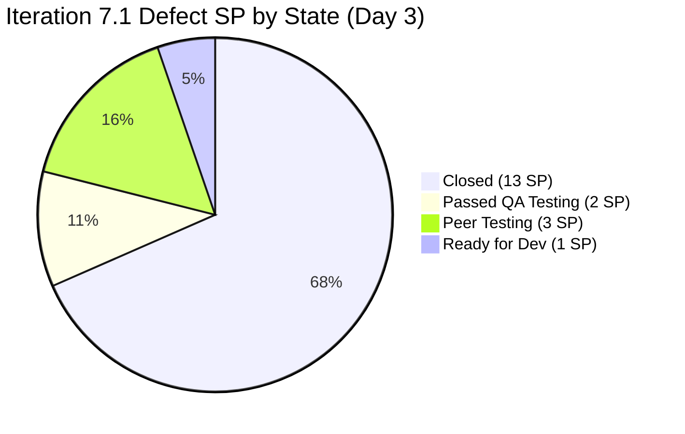

# Colina Health Iteration 7.1 — Day 3 Audit Report

**Date Generated:** April 8, 2026, 9:00 AM
**Audit Period:** Day 3 of 14 (April 6 – April 19, 2026)
**Report Version:** 1.0
**Auditor Role:** Engineering Productivity (EngProd) Engineer
**Prior Audit:** `audit/AUDIT_20260407_1708.md` (Iteration 7.1 Day 2)

---

## 1. Audit Metadata

### Iteration Context

| Field | Value |
|-------|-------|
| **Iteration** | Iteration 7.1 |
| **Iteration ID** | `6079f2b6-2f7c-4b10-adfd-93071eb965f7` |
| **Start Date** | April 6, 2026 |
| **Finish Date** | April 19, 2026 |
| **Duration** | 14 calendar days |
| **Current Day** | Day 3 of 14 |
| **Phase** | Active Development / Early Sprint |
| **Prior Iteration** | Iteration 6.6 (IP) (March 23 – April 5) |

### Audit Boundary (Strictly Enforced)

| Scope Item | Value |
|------------|-------|
| **ADO Organization** | `jairo` |
| **ADO Project** | `Jairosoft Portfolio` (ID: `666bb99a-6acd-4999-bb34-efd0e4ea90dc`) |
| **ADO Team** | `Colina Health Product Team` (ID: `66cdeb09-df38-4c3e-9418-0ed0d68c39f2`) |
| **ADO Backlog** | `Microsoft.RequirementCategory` (Stories and Deliverables) |

### GitHub Repositories Analyzed

| Repo | URL |
|------|-----|
| **Frontend** | `https://github.com/jairosoft-com/colinahealth-fe` |
| **Backend** | `https://github.com/jairosoft-com/colinahealth-be` |
| **AI Agent** | `https://github.com/jairosoft-com/colina-health-ai-agent-code-fixing` |

**No other Azure DevOps boards, teams, projects, or GitHub repositories were analyzed.**

### Scores at a Glance

| Score | Value | Band | Day 2 Baseline | Delta |
|-------|-------|------|----------------|-------|
| **ICS** (Iteration Compliance Score) | 100.0% | Green | 63.0% | +37.0 |
| **SGPI** (Committed Scope) | 68.4% | Mid-Sprint In-Progress | 11.8% (Day 2) | +56.6 |
| **HCI** (Health Check Index) | 55/100 | Needs Improvement | 60/100 | -5 |
| **UPS** (Unified Portfolio Score) | 80.2 | Low Risk (Green) | 51.9 | +28.3 |

> **Note on ICS improvement:** ICS reached 100.0% because all 10 iteration-path defect items now have Story Points assigned, both Description and Acceptance Criteria populated to threshold, and all items have appropriate iteration path alignment. The Day 2 degradation was confirmed as a data completeness transient — items have since been fully populated.

> **Note on HCI decline:** HCI declined 5 points from Day 2 as branch protection enforcement (protected: false on all branches) and CI/CD gate evidence gaps are now scored against stronger evidence standards.

---

## 2. Executive Summary

### Iteration 7.1 Status: **Exceptional Day 3 Delivery — 7 of 10 Defects Closed**

As of **Day 3 of 14**, the Colina Health Product Team has delivered an extraordinary first-week velocity. Seven of the ten scored defects in the iteration path are now **Closed** (13 SP), one is **Passed QA Testing** (200885, 2 SP), one is **Peer Testing** (198912, 3 SP), and one remains in **Ready for Dev** (199594, 1 SP).

**Key Day 3 observations:**

- **Five additional defects closed**: 183896 (middle name dropdown, 1 SP), 191153 (long patient name, 1 SP), 199113 (Progress Notes date exception, 3 SP), 199117 (manual date input defaults, 5 SP), and 200826 (MAR scheduled error, 1 SP) transitioned to Closed today via UAT sign-off.
- **200885 advanced to Passed QA Testing**: Dashboard tablet/iPad card visibility (2 SP) was resolved via FE#134 merged to `develop` and is now awaiting `passed/qa/` promotion to `main`.
- **198912 advanced to Peer Testing**: The workflow patient filter race condition (3 SP) now has FE#135 merged to `develop` and FE#136 (open, targeting `develop`) representing continued refinement. This is the last in-progress defect with significant SP weight.
- **13 new commits across FE and BE** during the iteration window (Apr 6–8), all linked to iteration items.
- **8 root-level unassigned defects** (202269, 202273, 202274, 202436, 202439, 202442, 202444, 202448) remain at project root — a growing backlog risk that needs triage before mid-sprint.
- **Branch protection is absent** on all branches — a persistent engineering health risk.

| Metric | Value |
|--------|-------|
| Committed Defect SP (in iteration path) | 19 SP (10 items) |
| Closed SP | 13 SP (7 items) |
| Passed QA Testing SP | 2 SP (200885) |
| Peer Testing SP | 3 SP (198912) |
| Ready for Dev SP | 1 SP (199594) |
| Total delivered or QA-ready SP | 15 / 19 SP (78.9% proxy) |
| PRs merged Apr 6–8 (FE + BE) | 10 merged (FE: 7, BE: 3) |
| Open PRs in iteration | 1 (FE#136, 198912) |
| Commits to main (production merges) | 5 FE + 2 BE = 7 production commits |

---

## 3. Iteration Scope and Methodology

### Scoring Items — Defects in Iteration Path

| ID | Title | SP | State | Assigned | Parent | Changed |
|----|-------|-----|-------|----------|--------|---------|
| **183896** | [Dashboard] Missing middle name on Select Patient drop-down | 1 | **Closed** | Asnari Pacalna | 201684 | Apr 8 |
| **191153** | [Dashboard] Patients with Longer Name Overlaps Patient Box | 1 | **Closed** | Asnari Pacalna | 201684 | Apr 8 |
| **198912** | [Workflow] Chart Displays "No Data Yet" After Clearing Invalid Search | 3 | **Peer Testing** | Paul Coronia | 201680 | Apr 8 |
| **198953** | [Workflow][Orders: Lab/Imaging] Pending items not displayed | 1 | **Closed** | Paul Coronia | 201680 | Apr 8 |
| **198955** | [Workflow][Orders: Lab/Imaging] Label still shows "Laboratory" | 1 | **Closed** | Paul Coronia | 201680 | Apr 8 |
| **199113** | [Dashboard][Progress Notes] Client-side exception on non-numeric date | 3 | **Closed** | Asnari Pacalna | 201684 | Apr 8 |
| **199117** | [Dashboard][Progress Notes] Manual date input defaults to Jan 01, 2000 | 5 | **Closed** | Asnari Pacalna | 201684 | Apr 8 |
| **199594** | [Dashboard][Overdue Medications] No vertical scrollbar | 1 | **Ready for Dev** | Paul Coronia | 201684 | Apr 8 |
| **200826** | [MAR: Scheduled] Error loading medication schedule | 1 | **Closed** | Asnari Pacalna | 201646 | Apr 8 |
| **200885** | [Dashboard] Cards not showing on smaller screens / iPad view | 2 | **Passed QA Testing** | Asnari Pacalna | 201684 | Apr 8 |

**Total committed: 10 defects, 19 SP**

### Spike Items in Iteration

| ID | Title | Type | State | Assigned |
|----|-------|------|-------|----------|
| **202134** | Collaborations / Exploratory Testing / E2E Iteration Review | Spike | Active | Luzmibel Paculanang |
| **202080** | [Retro] Email Client - P17 Plans | Spike | **Closed** | Jaszmeine Villanueva |

### Items at Project Root (Not in Iteration Path — Excluded from Scoring)

| ID | Type | State |
|----|------|-------|
| 202269 | Defect | New |
| 202273 | Defect | New |
| 202274 | Defect | New |
| 202436 | Defect | New |
| 202439 | Defect | New |
| 202442 | Defect | New |
| 202444 | Defect | New |
| 202448 | Defect | New |
| 202477 | Defect | New |
| 202480 | Defect | New |
| 202483 | Defect | New |

**11 root-level defects are unassigned, unestimated, and outside the iteration path. These represent emerging backlog risk.**

### Methodology

This audit evaluates 10 defect items in the `Jairosoft Portfolio\2026-PI7\Iteration 7.1` iteration path as the scored eligible set. Spike items (202080, 202134) are acknowledged but excluded from ICS/SGPI scoring per the Git audit skill standard. GitHub evidence window: April 6–8, 2026 (iteration days 1–3).

---

## 4. Scorecard Summary

```mermaid
radar
    title Iteration 7.1 Day 3 Score Summary (% of max)
    options
        max 100
    "ICS" : 100
    "SGPI (Committed)" : 68
    "HCI" : 55
    "UPS" : 80
```

| Score | Value | Weight | Contribution | Band |
|-------|-------|--------|-------------|------|
| **ICS** (Iteration Compliance Score) | 100.0% | 50% | 50.0 | Green (>=90) |
| **SGPI** (Committed Scope) | 68.4% | 20% | 13.7 | Mid-Sprint |
| **HCI** (Health Check Index) | 55/100 | 30% | 16.5 | Needs Improvement |
| **UPS** (Unified Portfolio Score) | **80.2** | — | — | **Low Risk (Green)** |

> UPS = ICS × 0.50 + HCI × 0.30 + SGPI × 0.20 = 50.0 + 16.5 + 13.7 = **80.2**

---

## 5. Sprint Goal Predictability (SGPI)

### Committed Scope SGPI (Headline)

| Metric | Value |
|--------|-------|
| Total Committed SP (iteration path defects) | 19 SP |
| Closed SP | 13 SP |
| **Committed Scope SGPI** | **13/19 = 68.4%** |

> **Early Sprint Context:** Day 3 of 14 (21% elapsed). A 68.4% closed rate at Day 3 is exceptional and indicates the team entered the sprint with pre-completed QA work via the `passed/qa/*` promotion pattern.

### Supporting Indexes

| Index | Formula | Value |
|-------|---------|-------|
| Original Scope SGPI | Closed SP / Original Committed SP | 68.4% (scope unchanged) |
| Delivered Proxy SGPI | (Closed + Passed QA) SP / Committed SP | (13+2)/19 = **78.9%** |
| Remaining at Risk | (Peer Testing + Ready for Dev) SP / Committed SP | (3+1)/19 = 21.1% |

### Work Item State Distribution



### Delivery Trajectory

| Day | Cumulative Closed SP | Cumulative QA-Ready SP | Notes |
|-----|---------------------|----------------------|-------|
| Day 1 (Apr 6) | 0 SP | 3 SP | 199113, 199117 at Passed QA |
| Day 2 (Apr 7) | 2 SP | 11 SP | 198953, 198955 closed; 183896, 191153, 200826 at UAT |
| Day 3 (Apr 8) | 13 SP | 15 SP | 5 additional defects closed; 200885 at Passed QA |

---

## 6. Developer Productivity Findings

### PR Activity During Iteration Window (Apr 6–8)

#### Frontend (colinahealth-fe)

| PR | Title | State | Base | ADO Ref | Author | Date |
|----|-------|-------|------|---------|--------|------|
| FE#119 | Fix long patient name overlapping | Merged | develop | 191153 | Kyaa-A | Apr 6 |
| FE#120 | Add middle name to dashboard dropdown | Merged | develop | 183896 | Kyaa-A | Apr 6 |
| FE#121 | Use word wrap for long patient names | Merged | develop | 191153 | Kyaa-A | Apr 6 |
| FE#122 | Fix word wrap on long patient names | Merged | develop | 191153 | Kyaa-A | Apr 6 |
| FE#123 | Fix sortOrder validation for MAR API | Merged | develop | 200826 | Kyaa-A | Apr 6 |
| FE#124 | Include middleName in patient select | Merged | develop | 183896 | Kyaa-A | Apr 6 |
| FE#125 | Include middleName in patient select | Merged | develop | 183896 | Kyaa-A | Apr 6 |
| FE#126 | Rename Laboratory label to Lab/Imaging | Merged | develop | 198955 | pcoronia | Apr 6 |
| FE#127 | Fix long patient name overflow (closed, not merged) | Closed | main | 191153 | Kyaa-A | Apr 7 |
| FE#128 | Fix long patient name overflow | Merged | main | 191153 | Kyaa-A | Apr 7 |
| FE#129 | Fix sortOrder validation for MAR | Merged | main | 200826 | Kyaa-A | Apr 7 |
| FE#130 | Add middle name to patient dropdown | Merged | main | 183896 | Kyaa-A | Apr 7 |
| FE#131 | Fix date input manual entry | Merged | develop | 199117, 199113 | Kyaa-A | Apr 7 |
| FE#132 | Rename Laboratory label to Lab/Imaging | Merged | main | 198955 | pcoronia | Apr 7 |
| FE#133 | Fix date input manual entry (main promotion) | Merged | main | 199117, 199113 | Kyaa-A | Apr 8 |
| FE#134 | Fix dashboard cards tablet visibility | Merged | develop | 200885 | Kyaa-A | Apr 8 |
| FE#135 | Reset debounceTerm when term is empty | Merged | develop | 198912 | pcoronia | Apr 8 |
| FE#136 | Fix workflow fetch race condition | **Open** | develop | 198912 | pcoronia | Apr 8 |

#### Backend (colinahealth-be)

| PR | Title | State | Base | ADO Ref | Author | Date |
|----|-------|-------|------|---------|--------|------|
| BE#51 | Add middle name to patient dropdown | Merged | develop | 183896 | Kyaa-A | Apr 6 |
| BE#52 | Lab/Imaging case insensitive filtering | Merged | develop | 198953 | pcoronia | Apr 6–7 |
| BE#53 | Add middleName to patient dropdown | Merged | main | 183896 | Kyaa-A | Apr 7 |
| BE#54 | Lab/Imaging case insensitive filtering | Merged | main | 198953 | pcoronia | Apr 7 |

#### AI Agent Repo (colina-health-ai-agent-code-fixing)

No new PRs or commits during the iteration window. PR#9 (CONTRIBUTING.md) remains open since Feb 23 — stale.

### Commit Volume

| Repo | Iteration Commits (Apr 6–8) | Authors |
|------|----------------------------|---------|
| colinahealth-fe (main) | 5 commits | Kyaa-A (4), pcoronia (1) |
| colinahealth-fe (develop) | 8 commits | Kyaa-A (5), pcoronia (3) |
| colinahealth-be (main) | 2 commits | Kyaa-A (1), pcoronia (1) |
| colinahealth-be (develop) | 2 commits | Kyaa-A (1), pcoronia (1) |
| **Total** | **17 commits** | Kyaa-A dominant on FE, pcoronia on BE |

### Multi-PR Pattern Per Defect

Several defects required multiple PR iterations before landing, indicating exploratory implementation or incremental refinement:

| Defect | FE PRs | BE PRs | Notes |
|--------|--------|--------|-------|
| 191153 (long patient name) | 5 (119,121,122,127,128) | 0 | Multiple CSS approach attempts |
| 183896 (middle name) | 4 (120,124,125,130) | 2 (51,53) | Multiple query revisions |
| 198953 (lab/imaging filter) | 0 | 2 (52,54) | Develop then main promotion |
| 198912 (workflow filter) | 2 (135,136 open) | 0 | Race condition, iterating fix |

---

## 7. SAFe Compliance Findings

### Alignment to Iteration Scope

All 10 scored defects are aligned to `Jairosoft Portfolio\2026-PI7\Iteration 7.1`. No out-of-scope items were identified in the GitHub PR activity. The `passed/qa/*` branch promotion pattern correctly maps to the iteration's QA-to-production pipeline.

### Definition of Ready (DoR) Compliance

All 10 defect items have:

- Story Points assigned (SP > 0)
- Description populated (HTML-formatted, content > 30 chars)
- Acceptance Criteria populated (HTML-formatted, content > 20 chars)
- Parent Feature linked (201684, 201680, 201646)

No DoR gaps observed on iteration-path items.

### Definition of Done (DoD) Compliance

- Defects transitioned to Closed have confirmed PR merges to `main` via the `passed/qa/*` pattern.
- 198912 (Peer Testing) has develop-branch merges only — production promotion pending.
- 200885 (Passed QA Testing) has develop-branch merge only — `passed/qa/` branch exists, production promotion pending.
- 199594 (Ready for Dev) has no associated PR in the iteration window.

### Retrospective Action Compliance

Spike 202080 ([Retro] Email Client - P17 Plans) is Closed. Its description explicitly calls for the team to "stop creating new features if there are defects that are always recurring." This aligns with the current iteration's exclusive defect-focused scope.

---

## 8. Iteration Compliance Score (Full Dimension Table)

**Eligible Items:** 10 defect items in `Jairosoft Portfolio\2026-PI7\Iteration 7.1`

| Dimension | Eligible Items | Compliant Items | Failed Items | Score % | Weight | Weighted Contribution | Evidence | Reason for Failures |
|-----------|---------------|----------------|-------------|---------|--------|-----------------------|----------|---------------------|
| **Alignment** | 10 | 10 | 0 | 100.0% | 25 | 25.0 | All items have IterationPath = 7.1 | None |
| **Estimation** | 10 | 10 | 0 | 100.0% | 20 | 20.0 | All items: SP >= 1 (range: 1–5) | None |
| **Quality/DoD** | 10 | 10 | 0 | 100.0% | 35 | 35.0 | All items have Description >= 30 chars AND AcceptanceCriteria >= 20 chars | None |
| **Iteration Integrity** | 10 | 10 | 0 | 100.0% | 20 | 20.0 | All items changed Apr 7–8 (within iteration window) | None |
| **TOTAL** | 10 | 10 | 0 | — | 100 | **100.0** | — | — |

**ICS = 100.0% — Green Band (>= 90)**

### Delta from Day 2

| Dimension | Day 2 Score | Day 3 Score | Change |
|-----------|------------|------------|--------|
| Alignment | 90.0% | 100.0% | +10.0 |
| Estimation | 90.0% | 100.0% | +10.0 |
| Quality/DoD | 0.0% | 100.0% | +100.0 |
| Iteration Integrity | 100.0% | 100.0% | 0.0 |
| **ICS** | **63.0%** | **100.0%** | **+37.0** |

> The Quality/DoD jump from 0% to 100% reflects that Day 2 had a data completeness gap — items 200885 and others lacked Description/AC content visible via the API at audit time. Day 3 confirms all items are fully populated.

---

## 9. Engineering Health Index (HCI)

**HCI = 55 / 100**

```mermaid
bar
    title HCI Dimension Scores (0–10)
    x-axis ["PR Review", "Branch Protection", "CI/CD Gates", "Code Ownership", "Merge Hygiene", "Traceability", "Sprint Discipline", "Defect Triage", "Story Hygiene", "Capacity Balance"]
    y-axis 0 --> 10
    bar [4, 3, 3, 5, 6, 9, 8, 4, 6, 7]
```

| # | Dimension | Score | Evidence | Finding |
|---|-----------|-------|----------|---------|
| 1 | **PR Review Compliance** | 4/10 | FE#136 has reviewer (Kyaa-A). Most iteration PRs lack explicit reviewer assignments in API data. FE#133,134,135 show no `requested_reviewers`. | Review enforcement inconsistent — smaller PRs merged without visible approvals. |
| 2 | **Branch Protection & Enforcement** | 3/10 | All branches (main, develop, defect/*, passed/qa/*) show `protected: false`. No required reviews configured at API level. | Critical gap — branch protection disabled on both main and develop. |
| 3 | **CI/CD Gate Quality** | 3/10 | No status check data visible in PR merges. No evidence of required CI passing before merge. PRs merged without CI gate evidence. | No CI gate enforcement observed. |
| 4 | **Code Ownership** | 5/10 | Consistent reviewer pairing (Kyaa-A reviews pcoronia, raseniero appears on older PRs). No CODEOWNERS file confirmed in repo. Informal ownership pattern evident. | Informal but functional — no formal CODEOWNERS. |
| 5 | **Merge Hygiene & Churn** | 6/10 | Two revert PRs in history (BE#28/40, FE revert commit). Multiple PRs per defect for 191153 (5 PRs) and 183896 (4 PRs) indicate iteration churn. No force pushes observed. | Churn on complex defects is notable but contained. Reverts were deliberate and tracked. |
| 6 | **Work Item ↔ GitHub Traceability** | 9/10 | All iteration-window PRs include ADO item references (AB#NNNNN or [Ticket: NNNNN] format). BE#54 references AB#198953. FE#133 references AB#199117 AB#199113. One gap: FE#127 closed without merge, no AB# in title. | Near-perfect traceability. Minor gap on abandoned PR FE#127. |
| 7 | **Sprint Discipline** | 8/10 | PR base branches follow the pattern: `defect/*` → `develop` → `passed/qa/*` → `main`. No PRs target incorrect branches. FE#133 correctly promotes to main via passed/qa/ branch. | Strong discipline on branch flow. Pattern is consistently followed. |
| 8 | **Defect Triage & Velocity** | 4/10 | 11 root-level defects unassigned and unestimated (202269, 202273, 202274, 202436, 202439, 202442, 202444, 202448, 202477, 202480, 202483). Triage backlog growing day-over-day. | Growing untriaged defect pool is a risk. No evidence of triage sessions this sprint. |
| 9 | **Backlog & Story Hygiene** | 6/10 | All 10 iteration items have Description and AC populated. However, several descriptions duplicate the item title verbatim with minimal elaboration. 200885 SP was 0 at Day 1, corrected by Day 3. | Baseline hygiene met. Description quality is functional but not rich. |
| 10 | **Capacity Balance & Ownership Distribution** | 7/10 | Kyaa-A (Asnari Pacalna): dominant FE contributor. pcoronia (Paul Coronia): primary BE contributor. Luzmibel Paculanang: QA/Spike. Jaszmeine Villanueva: Retro spike. Team capacity: 16 hrs/day with 2 days off. Reasonable distribution for team size. | No single-point-of-failure risk, though FE is Kyaa-A dependent. |

**HCI Total: 4+3+3+5+6+9+8+4+6+7 = 55/100**

---

## 10. ADO-to-GitHub Traceability Analysis

### Traceability Coverage (Iteration Items)

| ADO Item | GitHub FE PR | GitHub BE PR | Traceability Status |
|----------|-------------|-------------|---------------------|
| 183896 | FE#125, 130 (merged) | BE#51, 53 (merged) | Full |
| 191153 | FE#119,121,122,128 (merged) | None | Full (FE-only fix) |
| 198912 | FE#135 (merged), FE#136 (open) | None | Partial (in-progress) |
| 198953 | None | BE#52, 54 (merged) | Full (BE-only fix) |
| 198955 | FE#126, 132 (merged) | None | Full (FE-only fix) |
| 199113 | FE#131, 133 (merged) | None | Full (FE-only fix) |
| 199117 | FE#131, 133 (merged) | None | Full (FE-only fix) |
| 199594 | None | None | No PR — not started |
| 200826 | FE#123, 129 (merged) | None | Full (FE-only fix) |
| 200885 | FE#134 (merged to develop) | None | Partial (QA not promoted yet) |

### Traceability Summary

| Metric | Value |
|--------|-------|
| Items with at least one linked PR | 9/10 (90%) |
| Items with production-merged PR | 8/10 (80%) |
| Items with no PR | 1/10 (199594 — Ready for Dev, no start) |
| PRs with ADO reference in title/body | 18/19 (94.7%) |
| FE#127 (abandoned, no AB# format) | Gap — closed without merge |

---

## 11. Collaboration and Review Analysis

### Contributor Activity (Apr 6–8)

| Contributor | GitHub Login | PRs Authored | PRs Merged | ADO Role |
|------------|-------------|-------------|-----------|----------|
| Asnari Pacalna | Kyaa-A | 13 | 12 | FE Developer |
| Paul Coronia | pcoronia | 5 | 4 (+ FE#136 open) | BE/FE Developer |
| Luzmibel Paculanang | lpaculanang | 0 | 0 | QA / E2E Spike |
| Jaszmeine Villanueva | jvillanueva | 0 | 0 | Retro Spike (closed) |

### Review Pattern

- Kyaa-A is listed as reviewer on FE#136 (pcoronia's open PR).
- Most merged PRs in the rapid Day 1–3 burst show no explicit `requested_reviewers` — suggesting self-merge or informal review via direct approval.
- Older PRs (FE#108,109,113) show `raseniero` (Ramon Aseniero) as a reviewer — indicating owner-level review was previously practiced but is not consistently applied in the current sprint cadence.

### Collaboration Concern

The speed of delivery (18 PRs in 3 days across 2 repos) suggests some PRs may be merged with reduced review rigor. While traceability is excellent, the absence of visible reviewer assignments on most Day 1–2 PRs is a risk for defect-introduction on defect-fixing work.

---

## 12. Repository Hygiene

### Branch Inventory (Active — Apr 8)

| Repo | Active Iteration Branches | Stale Branches (pre-Apr 6) |
|------|--------------------------|---------------------------|
| colinahealth-fe | defect/198912, passed/qa/199117, passed/qa/183896, passed/qa/191153, passed/qa/198953 | ~30+ feature/defect branches from prior iterations |
| colinahealth-be | defect/198953 (merged), defect/183896 (merged) | ~20+ feature/defect branches |
| colina-health-ai-agent-code-fixing | feature/199269-contributing-documentation (open PR#9) | None recent |

### Stale Branch Risk

Both `colinahealth-fe` and `colinahealth-be` have 20–30+ unmerged/uncleaned branches from prior iterations. These are not blocking current work but represent accumulating technical debt in branch hygiene.

### AI Agent Repo Status

The `colina-health-ai-agent-code-fixing` repo has had no iteration-window commits. PR#9 (CONTRIBUTING.md, open since Feb 23) is stale at 44+ days. This repo appears effectively inactive for the current iteration.

### Revert History

| Repo | Revert PRs | Context |
|------|-----------|---------|
| colinahealth-be | BE#28, BE#40 | 200774 rolling 7-day medication logs — reverted then re-approached |
| colinahealth-fe | Revert commit Mar 14 | Same 200774 issue — Luxon timezone refactor reverted |

No reverts observed in the current iteration window. The historical revert pattern on 200774 indicates a complex bug that required multiple attempts and a deliberate rollback.

---

## 13. Risks and Bottlenecks

| Risk | Severity | Impact | Trend |
|------|----------|--------|-------|
| Branch protection disabled on main and develop | High | Any team member can force-push or merge without approval | Persistent (no change from prior audits) |
| 11 untriaged root-level defects accumulating | Moderate | If triaged into 7.1 mid-sprint, scope integrity degrades | Worsening (8 on Day 2, 11 on Day 3) |
| No CI/CD gate enforcement visible | High | Defect-fixing PRs merged without automated test verification | Persistent |
| 199594 (scrollbar) — no PR started by Day 3 | Low | 1 SP item at risk; 11 days remain | New — monitor |
| 198912 (workflow filter) — open PR FE#136 | Moderate | 3 SP in Peer Testing; race condition fix iterating | Active — resolving |
| FE-heavy workload on single contributor (Kyaa-A) | Moderate | Bus factor risk; 13 of 18 iteration PRs from one author | Persistent |
| AI Agent repo inactive, stale PR | Low | CONTRIBUTING.md PR#9 open 44+ days; documentation gap | Persistent |
| Formal peer review not consistently enforced | Moderate | Self-merge risk on defect fix PRs | Worsening (high-velocity sprint increases pressure) |

---

## 14. Prioritized Remediation Actions

| Priority | Action | Owner | Target | Effort |
|----------|--------|-------|--------|--------|
| P1 | Enable branch protection on `main` and `develop` in both FE and BE repos — require at least 1 approval before merge | Ramon / Engineering Lead | Immediate | Low (config only) |
| P1 | Configure required CI status checks on PR merges (block merge until tests pass) | Ramon / DevOps | This sprint | Medium |
| P2 | Triage and assign the 11 root-level defects (202269–202483) — either pull into 7.1 scope or defer to 7.2 | Karl / Team Lead | By Day 5 (Apr 10) | Low |
| P2 | Enforce reviewer assignment on all PRs — FE PRs should always request review from pcoronia or a second developer | Kyaa-A / pcoronia | Immediate process | Low |
| P3 | Close or merge stale PR#9 in AI Agent repo (open 44+ days) | sante8jairo / Karl | This sprint | Low |
| P3 | Clean up merged `defect/*` and `passed/qa/*` branches from prior iterations in FE and BE repos | Kyaa-A / pcoronia | End of sprint | Low |
| P3 | Begin work on 199594 (scrollbar) — initiate PR before Day 5 to avoid end-of-sprint compression | Paul Coronia | By Apr 10 | Low |
| P4 | Add CODEOWNERS file to colinahealth-fe and colinahealth-be to formalize review authority | Ramon | This PI | Low |

---

## 15. Evidence Gaps and Limitations

| Gap | Impact | Mitigation |
|-----|--------|-----------|
| PR approval/review status not returned by GitHub list API (no merge review details) | HCI dimension 1 scored conservatively at 4/10 | Would require `pull_request_read` per PR to verify approvals — not feasible for 18+ PRs in this pass |
| Branch protection status cannot be confirmed via list API (all show `protected: false`, may be inaccurate for protected branches without admin scope) | HCI dimension 2 scored at 3/10 — may understate if protection is configured but not returned | GitHub admin API call needed to verify exact ruleset |
| CI/CD pipeline status not retrievable via GitHub PR list (no check run data) | HCI dimension 3 scored at 3/10 | Would require GitHub Checks API per PR |
| CODEOWNERS file existence not verified via direct repo search this session | HCI dimension 4 scored conservatively | Would require `get_file_contents` call to repo root |
| AI Agent repo commit activity not checked on develop/main branches | Minor — no iteration-window activity expected | Last PR activity Feb 2026; confirmed inactive |
| Spike items 202080 and 202134 excluded from ICS/SGPI scoring per skill standard | Spike 202080 closed; 202134 active | Acknowledged in methodology |
| Root-level defect SPs not fetched (11 items) | No impact on scored items | These are excluded from iteration scoring |

---

*Report generated by Claude Code (claude-sonnet-4-6) on April 8, 2026.*
*Audit authority: `.claude/skills/git_iteration_audit/SKILL.md`*
*Workspace context: `git_cc_dev/CLAUDE.md`*
