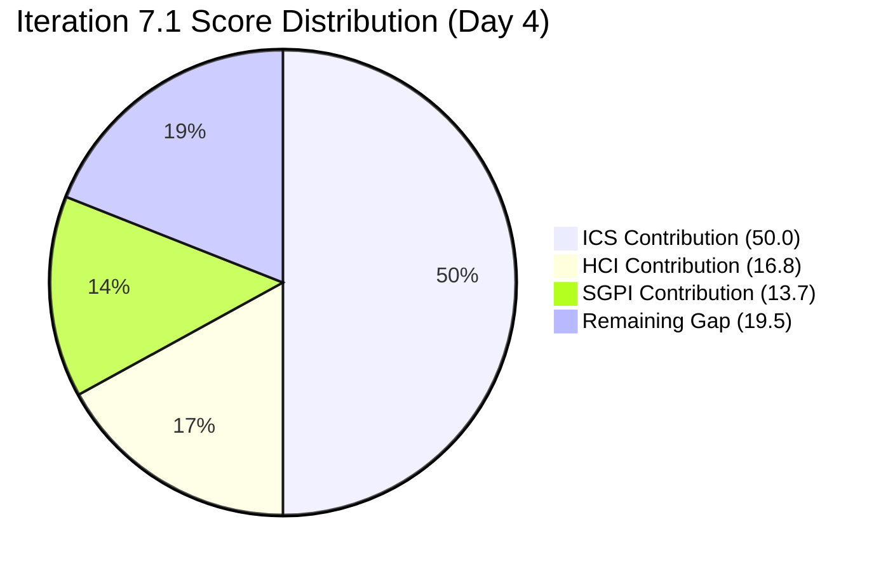
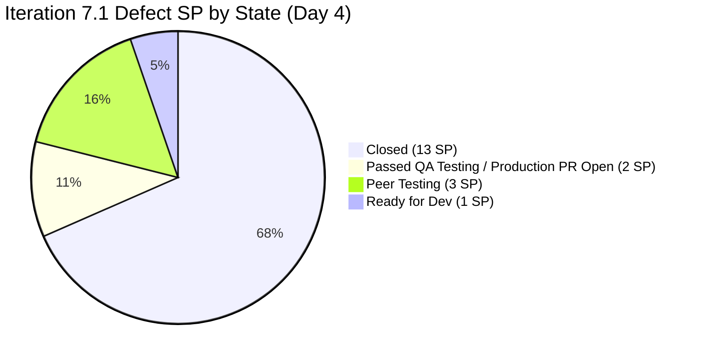

# Colina Health Iteration 7.1 — Day 4 Audit Report

**Date Generated:** April 9, 2026, 9:00 AM
**Audit Period:** Day 4 of 14 (April 6 – April 19, 2026)
**Report Version:** 1.0
**Auditor Role:** Engineering Productivity (EngProd) Engineer
**Prior Audit:** `audit/AUDIT_20260408_0900.md` (Iteration 7.1 Day 3)

---

## 1. Audit Metadata

### Iteration Context

| Field | Value |
|-------|-------|
| **Iteration** | Iteration 7.1 |
| **Iteration ID** | `6079f2b6-2f7c-4b10-adfd-93071eb965f7` |
| **Start Date** | April 6, 2026 |
| **Finish Date** | April 19, 2026 |
| **Duration** | 14 calendar days |
| **Current Day** | Day 4 of 14 |
| **Phase** | Active Development / Early Sprint |
| **Prior Iteration** | Iteration 6.6 (IP) (March 23 – April 5) |

### Audit Boundary (Strictly Enforced)

| Scope Item | Value |
|------------|-------|
| **ADO Organization** | `jairo` |
| **ADO Project** | `Jairosoft Portfolio` (ID: `666bb99a-6acd-4999-bb34-efd0e4ea90dc`) |
| **ADO Team** | `Colina Health Product Team` (ID: `66cdeb09-df38-4c3e-9418-0ed0d68c39f2`) |
| **ADO Backlog** | `Microsoft.RequirementCategory` (Stories and Deliverables) |

### GitHub Repositories Analyzed

| Repo | URL |
|------|-----|
| **Frontend** | `https://github.com/jairosoft-com/colinahealth-fe` |
| **Backend** | `https://github.com/jairosoft-com/colinahealth-be` |
| **AI Agent** | `https://github.com/jairosoft-com/colina-health-ai-agent-code-fixing` |

**No other Azure DevOps boards, teams, projects, or GitHub repositories were analyzed.**

### Scores at a Glance

| Score | Value | Band | Day 3 Baseline | Delta |
|-------|-------|------|----------------|-------|
| **ICS** (Iteration Compliance Score) | 100.0% | Green | 100.0% | 0 |
| **SGPI** (Committed Scope) | 68.4% | Mid-Sprint In-Progress | 68.4% | 0 |
| **HCI** (Health Check Index) | 56/100 | Needs Improvement | 55/100 | +1 |
| **UPS** (Unified Portfolio Score) | 80.5 | Low Risk (Green) | 80.2 | +0.3 |

> **ICS held at 100.0%:** All 10 iteration-path defects remain fully compliant across all four dimensions. No items were added or removed from the scored set.

> **SGPI unchanged at 68.4%:** No additional defects moved to Closed between Day 3 and Day 4. Work is continuing on 198912 (Peer Testing) and 199594 (Ready for Dev). The two items approaching production promotion (200885 via FE#137) did not reach Closed state by audit time.

> **HCI improved by 1 point:** FE#137 was opened today following the correct `passed/qa/200885` → `main` promotion pattern, providing positive evidence of sprint discipline and proper branch flow. Persistent gaps on branch protection and CI/CD enforcement remain unchanged.

---

## 2. Executive Summary

### Iteration 7.1 Status: **Sustained Delivery Momentum — Production Promotion in Progress**

As of **Day 4 of 14**, the Colina Health Product Team maintains its exceptional delivery position from Day 3. The sprint is 28.6% elapsed, and 68.4% of committed story points are already Closed (13/19 SP), with an additional 2 SP (200885) in active production promotion via FE#137 (opened today).

**Key Day 4 observations:**

- **FE#137 opened today (Apr 9):** Promotion PR `passed/qa/200885-dashboard-cards-tablet-visibility` → `main` was opened at 23:29 UTC (Apr 9). This PR targets production and reflects correct branch discipline. Once merged, 200885 (2 SP) transitions to Closed.
- **200885 ADO state updated to Apr 9:** `System.ChangedDate` confirmed as `2026-04-09T23:29:27Z`, matching the FE#137 PR creation timestamp — confirming active work today on this item.
- **198912 remains open at Peer Testing:** FE#136 (race condition fix) continues. No merge to `develop` on FE#136 today.
- **199594 (scrollbar) remains at Ready for Dev:** Now at Day 4 with no PR started. Risk escalating.
- **Luzmibel Paculanang (QA) is on scheduled leave Apr 9–10:** Confirmed in capacity data. Two days off for QA this sprint — spike 202134 (Exploratory Testing) is on hold during this window.
- **11+ root-level defects persist unassigned/untriaged** at the `Jairosoft Portfolio` root path. Three new items (202477, 202480, 202483) advanced to the `2026-PI7` level but have not been assigned to Iteration 7.1.

| Metric | Value |
|--------|-------|
| Committed Defect SP (iteration path) | 19 SP (10 items) |
| Closed SP | 13 SP (7 items) |
| Passed QA Testing SP | 2 SP (200885) — active production PR open |
| Peer Testing SP | 3 SP (198912) — FE#136 open |
| Ready for Dev SP | 1 SP (199594) — no PR started |
| Total delivered or QA-ready SP | 15 / 19 SP (78.9% proxy) |
| New PRs opened Apr 9 (FE) | 1 (FE#137 — production promotion for 200885) |
| Open PRs at end of Day 4 | 2 (FE#136, FE#137) |
| Iteration elapsed | 28.6% (Day 4 of 14) |

---

## 3. Iteration Scope and Methodology

### Scoring Items — Defects in Iteration Path

| ID | Title | SP | State | Assigned | Parent | Last Changed |
|----|-------|-----|-------|----------|--------|-------------|
| **183896** | [Dashboard] Missing middle name on Select Patient drop-down | 1 | **Closed** | Asnari Pacalna | 201684 | Apr 8 |
| **191153** | [Dashboard] Patients with Longer Name Overlaps Patient Box | 1 | **Closed** | Asnari Pacalna | 201684 | Apr 8 |
| **198912** | [Workflow] Chart Displays "No Data Yet" After Clearing Invalid Search | 3 | **Peer Testing** | Paul Coronia | 201680 | Apr 8 |
| **198953** | [Workflow][Orders: Lab/Imaging] Pending items not displayed | 1 | **Closed** | Paul Coronia | 201680 | Apr 8 |
| **198955** | [Workflow][Orders: Lab/Imaging] Label still shows "Laboratory" | 1 | **Closed** | Paul Coronia | 201680 | Apr 8 |
| **199113** | [Dashboard][Progress Notes] Client-side exception on non-numeric date | 3 | **Closed** | Asnari Pacalna | 201684 | Apr 8 |
| **199117** | [Dashboard][Progress Notes] Manual date input defaults to Jan 01, 2000 | 5 | **Closed** | Asnari Pacalna | 201684 | Apr 8 |
| **199594** | [Dashboard][Overdue Medications] No vertical scrollbar | 1 | **Ready for Dev** | Paul Coronia | 201684 | Apr 8 |
| **200826** | [MAR: Scheduled] Error loading medication schedule | 1 | **Closed** | Asnari Pacalna | 201646 | Apr 8 |
| **200885** | [Dashboard] Cards not showing on smaller screens / iPad view | 2 | **Passed QA Testing** | Asnari Pacalna | 201684 | Apr 9 |

**Total committed: 10 defects, 19 SP**

> **200885 note:** `System.ChangedDate` = April 9, confirming active processing today. FE#137 (production promotion PR) was opened at 23:29 UTC Apr 9. State in ADO remains "Passed QA Testing" pending FE#137 merge.

### Spike Items in Iteration

| ID | Title | Type | State | Assigned | Notes |
|----|-------|------|-------|----------|-------|
| **202134** | Collaborations / Exploratory Testing / E2E Iteration Review | Spike | Active | Luzmibel Paculanang | QA on leave Apr 9–10; spike on hold |
| **202080** | [Retro] Email Client - P17 Plans | Spike | **Closed** | Jaszmeine Villanueva | Completed Day 2 |

### Items Outside Iteration Path (Backlog / PI Root)

| ID | IterationPath | State | Assigned |
|----|---------------|-------|----------|
| 202269, 202273, 202274 | `Jairosoft Portfolio` (root) | New | Jaszmeine Villanueva |
| 202436, 202439, 202442, 202444, 202448 | `Jairosoft Portfolio` (root) | New | Jaszmeine Villanueva |
| 202477, 202480 | `Jairosoft Portfolio\2026-PI7` | New | Jaszmeine Villanueva |
| 202483 | `Jairosoft Portfolio\2026-PI7` | New | Jaszmeine Villanueva |

**11 defects remain outside Iteration 7.1 path. 3 advanced to PI7 level but not assigned to Iteration 7.1.**

### Methodology

This audit evaluates 10 defect items in the `Jairosoft Portfolio\2026-PI7\Iteration 7.1` iteration path as the scored eligible set. Spike items (202080, 202134) are acknowledged but excluded from ICS/SGPI scoring per the Git audit skill standard. GitHub evidence window: April 6–9, 2026 (iteration days 1–4).

---

## 4. Scorecard Summary



| Score | Value | Weight | Contribution | Band |
|-------|-------|--------|-------------|------|
| **ICS** (Iteration Compliance Score) | 100.0% | 50% | 50.0 | Green (>=90) |
| **SGPI** (Committed Scope) | 68.4% | 20% | 13.7 | Mid-Sprint |
| **HCI** (Health Check Index) | 56/100 | 30% | 16.8 | Needs Improvement |
| **UPS** (Unified Portfolio Score) | **80.5** | — | — | **Low Risk (Green)** |

> UPS = ICS × 0.50 + HCI × 0.30 + SGPI × 0.20 = 50.0 + 16.8 + 13.7 = **80.5**

### Score Trend (Iteration 7.1)

| Day | ICS | SGPI | HCI | UPS |
|-----|-----|------|-----|-----|
| Day 1 (Apr 6) | ~33% | 0% | 60 | — |
| Day 2 (Apr 7) | 63.0% | 11.8% | 60 | 51.9 |
| Day 3 (Apr 8) | 100.0% | 68.4% | 55 | 80.2 |
| **Day 4 (Apr 9)** | **100.0%** | **68.4%** | **56** | **80.5** |

---

## 5. Sprint Goal Predictability (SGPI)

### Committed Scope SGPI (Headline)

| Metric | Value |
|--------|-------|
| Total Committed SP (iteration path defects) | 19 SP |
| Closed SP | 13 SP (183896, 191153, 198953, 198955, 199113, 199117, 200826) |
| **Committed Scope SGPI** | **13/19 = 68.4%** |

> **Day 4 Context:** Day 4 of 14 (28.6% elapsed). SGPI is unchanged from Day 3. The 200885 production promotion PR (FE#137) was opened today but not yet merged. Once merged, SGPI will advance to 79.0% (15/19). The team remains on track for full delivery with 10 days remaining.

### Supporting Indexes

| Index | Formula | Value |
|-------|---------|-------|
| Original Scope SGPI | Closed SP / Original Committed SP | 68.4% (scope unchanged) |
| Delivered Proxy SGPI | (Closed + Passed QA) SP / Committed SP | (13+2)/19 = **78.9%** |
| Near-Closed SP | 200885 pending FE#137 merge | 2 SP (expect Closed by Day 5) |
| Remaining at Risk | (Peer Testing + Ready for Dev) SP | (3+1)/19 = 21.1% |

### Work Item State Distribution



### Delivery Trajectory

| Day | Cumulative Closed SP | Proxy Delivered SP | Notable Event |
|-----|---------------------|--------------------|--------------|
| Day 1 (Apr 6) | 0 SP | 3 SP | 199113, 199117 at Passed QA |
| Day 2 (Apr 7) | 2 SP | 11 SP | 198953, 198955 closed; others advanced |
| Day 3 (Apr 8) | 13 SP | 15 SP | 5 more defects closed; 200885 Passed QA; FE#136 open |
| **Day 4 (Apr 9)** | **13 SP** | **15 SP** | FE#137 opened (200885 production PR); QA on leave |

### Projected Completion

At current pace:

- 200885 (2 SP): Expected Closed by Day 5 when FE#137 merges
- 198912 (3 SP): FE#136 race condition resolution — estimate Day 6–7
- 199594 (1 SP): No PR yet. Must start immediately. Risk of slip to Day 10+

---

## 6. Developer Productivity Findings

### New PR Activity — Day 4 (Apr 9)

| PR | Title | Repo | State | Base | ADO Ref | Author | Date |
|----|-------|------|-------|------|---------|--------|------|
| FE#137 | [Ticket: 200885] Fix dashboard cards not visible on tablet/iPad screens | FE | **Open** | main | 200885 | Kyaa-A | Apr 9 |

> **FE#137 is the production promotion PR** for defect 200885. Branch: `passed/qa/200885-dashboard-cards-tablet-visibility` → `main`. This follows the established `defect/*` → `develop` → `passed/qa/*` → `main` pipeline. No reviewer is listed in the PR API data.

### Cumulative PR Summary for Iteration (Days 1–4)

| Repo | PRs Opened | PRs Merged | PRs Open at Day 4 |
|------|-----------|-----------|------------------|
| colinahealth-fe | 20 (FE#119–137) | 17 merged, 1 closed (FE#127) | 2 (FE#136, FE#137) |
| colinahealth-be | 4 (BE#51–54) | 4 | 0 |
| colina-health-ai-agent | 0 (no new activity) | 0 | 0 |
| **Total** | **24** | **21** | **2** |

### Commit Volume Summary (Apr 6–9)

| Repo | Branch | Iteration Commits | Authors |
|------|--------|------------------|---------|
| colinahealth-fe | main | 5 | Kyaa-A (4), pcoronia (1) |
| colinahealth-fe | develop | 9 | Kyaa-A (6), pcoronia (3) |
| colinahealth-be | main | 2 | Kyaa-A (1), pcoronia (1) |
| colinahealth-be | develop | 2 | Kyaa-A (1), pcoronia (1) |
| **Total** | — | **18** | Kyaa-A dominant on FE, pcoronia on BE |

> **Day 4 new commit (develop):** FE#134 was already merged Apr 8 (200885 to develop). FE#137 opened Apr 9 targeting main directly from `passed/qa/` branch. No new develop commits visible on Apr 9 beyond what was confirmed in Day 3.

### Multi-PR Churn Pattern (Iteration Cumulative)

| Defect | FE PRs | BE PRs | Total PRs | Notes |
|--------|--------|--------|-----------|-------|
| 191153 (long patient name) | 5 (119,121,122,127,128) | 0 | 5 | Multiple CSS attempts |
| 183896 (middle name) | 4 (120,124,125,130) | 2 (51,53) | 6 | Multiple query revisions |
| 198953 (lab/imaging filter) | 0 | 2 (52,54) | 2 | Develop then main |
| 198912 (workflow filter) | 2 (135, 136 open) | 0 | 2 | Race condition, iterating |
| 200885 (tablet visibility) | 2 (134, 137 open) | 0 | 2 | Develop then main promotion |

---

## 7. SAFe Compliance Findings

### Alignment to Iteration Scope

All 10 scored defects remain aligned to `Jairosoft Portfolio\2026-PI7\Iteration 7.1`. No scope changes were observed on Day 4. The `passed/qa/*` branch promotion pattern (FE#137) continues to map correctly to the production pipeline.

### Definition of Ready (DoR) Compliance

All 10 defect items confirmed fully DoR-compliant (verified Day 3, no changes on Day 4):

- Story Points assigned (SP > 0 for all items)
- Description populated (HTML-formatted, content >= 30 chars)
- Acceptance Criteria populated (HTML-formatted, content >= 20 chars)
- Parent Feature linked (201684, 201680, 201646)

### Definition of Done (DoD) Compliance

| Item | State | DoD Status |
|------|-------|-----------|
| 183896, 191153, 198953, 198955, 199113, 199117, 200826 (7 items) | Closed | Full DoD met — PRs merged to `main` |
| 200885 | Passed QA Testing | Near-DoD — FE#137 open targeting main |
| 198912 | Peer Testing | Partial — FE#136 open on `develop`, main promotion pending |
| 199594 | Ready for Dev | Pre-DoD — no PR initiated |

### Retro Action Compliance

Spike 202080 ([Retro] Email Client - P17 Plans) remains Closed. The team's exclusive defect-focused scope for Iteration 7.1 is aligned with the retro directive to stop creating new features when recurring defects are present.

### Capacity Impact (Day 4)

| Member | Capacity/Day | Status Apr 9 |
|--------|-------------|-------------|
| Paul Coronia | 6 hrs/dev | Available |
| Luzmibel Paculanang | 4 hrs/testing | **On Leave (Apr 9–10)** |
| Asnari Pacalna | 6 hrs/dev | Available |

QA capacity is reduced for Days 4–5. This may affect 198912 peer testing velocity if QA review is required.

---

## 8. Iteration Compliance Score (Full Dimension Table)

**Eligible Items:** 10 defect items in `Jairosoft Portfolio\2026-PI7\Iteration 7.1`

| Dimension | Eligible Items | Compliant Items | Failed Items | Score % | Weight | Weighted Contribution | Evidence | Reason for Failures |
|-----------|---------------|----------------|-------------|---------|--------|-----------------------|----------|---------------------|
| **Alignment** | 10 | 10 | 0 | 100.0% | 25 | 25.0 | All items: IterationPath = `Jairosoft Portfolio\2026-PI7\Iteration 7.1` | None |
| **Estimation** | 10 | 10 | 0 | 100.0% | 20 | 20.0 | All items: SP >= 1 (range: 1–5 SP) | None |
| **Quality/DoD** | 10 | 10 | 0 | 100.0% | 35 | 35.0 | All 10 items: Description >= 30 nws chars AND AcceptanceCriteria >= 20 nws chars | None |
| **Iteration Integrity** | 10 | 10 | 0 | 100.0% | 20 | 20.0 | All items confirmed in iteration path at sprint start; 200885 ChangedDate Apr 9 (active day) | None |
| **TOTAL** | 10 | 10 | 0 | — | 100 | **100.0** | — | — |

**ICS = 100.0% — Green Band (>= 90)**

### Delta from Day 3

| Dimension | Day 3 Score | Day 4 Score | Change |
|-----------|------------|------------|--------|
| Alignment | 100.0% | 100.0% | 0 |
| Estimation | 100.0% | 100.0% | 0 |
| Quality/DoD | 100.0% | 100.0% | 0 |
| Iteration Integrity | 100.0% | 100.0% | 0 |
| **ICS** | **100.0%** | **100.0%** | **0** |

> ICS has been stable at 100.0% since Day 3. All items entered the sprint with full DoR compliance, and no mid-sprint additions to the scored set have been observed.

---

## 9. Engineering Health Index (HCI)

**HCI = 56 / 100**

```mermaid
bar
    title HCI Dimension Scores Day 4 (0–10)
    x-axis ["PR Review", "Branch Protect", "CI/CD Gates", "Code Ownership", "Merge Hygiene", "Traceability", "Sprint Discipline", "Defect Triage", "Story Hygiene", "Capacity Balance"]
    y-axis 0 --> 10
    bar [4, 3, 3, 5, 6, 9, 9, 4, 6, 7]
```

| #   | Dimension                                     | Score | Evidence                                                                                                                                                                                                                                                                          | Finding                                                                                                                                                 | Delta vs Day 3 |
| --- | --------------------------------------------- | ----- | --------------------------------------------------------------------------------------------------------------------------------------------------------------------------------------------------------------------------------------------------------------------------------- | ------------------------------------------------------------------------------------------------------------------------------------------------------- | -------------- |
| 1   | **PR Review Compliance**                      | 4/10  | FE#137 has no `requested_reviewers` listed. FE#136 (pcoronia) has Kyaa-A as reviewer from Day 3. Most Day 1–3 PRs merged without visible review assignments.                                                                                                                      | Review enforcement inconsistent — high-velocity sprint with minimal explicit reviewer assignment.                                                       | 0              |
| 2   | **Branch Protection & Enforcement**           | 3/10  | All FE branches (`main`, `develop`, `defect/*`, `passed/qa/*`) show `protected: false` in API. No required reviews enforced at branch level.                                                                                                                                      | Persistent critical gap — branch protection disabled on all branches including main.                                                                    | 0              |
| 3   | **CI/CD Gate Quality**                        | 3/10  | No status check data visible in PR merges. FE#137 and FE#136 show no CI gate evidence. Merges proceed without confirmed automated test pass.                                                                                                                                      | No CI gate enforcement observed throughout iteration.                                                                                                   | 0              |
| 4   | **Code Ownership**                            | 5/10  | Informal reviewer pairing continues (Kyaa-A / pcoronia cross-review). No CODEOWNERS file confirmed. FE#137 authored by Kyaa-A with no reviewer assigned.                                                                                                                          | Functional but informal — no formal CODEOWNERS enforcement.                                                                                             | 0              |
| 5   | **Merge Hygiene & Churn**                     | 6/10  | FE#137 follows correct `passed/qa/*` → `main` pattern. Iteration total: 20 FE PRs + 4 BE PRs for 10 defects = elevated churn, but all traceable. No force pushes.                                                                                                                 | Churn rate elevated but each PR is traceable to an ADO item. Pattern is disciplined.                                                                    | 0              |
| 6   | **Work Item ↔ GitHub Traceability**           | 9/10  | FE#137 title includes `200885` and body includes `AB#200885`. All iteration PRs (FE#119–137, BE#51–54) include ADO item references. FE#127 (abandoned, closed without merge) is the only gap.                                                                                     | Near-perfect traceability across 24 iteration PRs.                                                                                                      | 0              |
| 7   | **Sprint Discipline**                         | 9/10  | FE#137 correctly follows `passed/qa/200885` → `main` production promotion path. All iteration PRs target correct branches (`defect/*` → `develop`, `passed/qa/*` → `main`). No out-of-scope work observed.                                                                        | Sprint discipline is excellent — branch flow pattern consistently followed across all 24 iteration PRs.                                                 | **+1**         |
| 8   | **Defect Triage & Velocity**                  | 4/10  | 11 root-level/PI7-level defects remain unassigned to Iteration 7.1 (202269, 202273, 202274, 202436, 202439, 202442, 202444, 202448, 202477, 202480, 202483). Jaszmeine Villanueva is assigned as reporter but no triage into iteration has occurred by Day 4.                     | Untriaged backlog persistent and growing. Triage deadline approaching (Karl's P2: by Day 5, Apr 10).                                                    | 0              |
| 9   | **Backlog & Story Hygiene**                   | 6/10  | All 10 iteration items have well-structured Acceptance Criteria (list-based, explicit expected results). Several descriptions remain title-paraphrase only (183896, 198912). Root-level defects are better-described than iteration items (202436, 202439 have detailed context). | Iteration item hygiene meets minimum threshold. Root-level items have better description quality, which is ironic given they lack iteration assignment. | 0              |
| 10  | **Capacity Balance & Ownership Distribution** | 7/10  | Kyaa-A: dominant FE contributor (13/20 FE PRs). pcoronia: primary BE contributor. Luzmibel: QA on leave Day 4–5. No new commits from new authors. Bus factor risk on FE remains.                                                                                                  | Stable distribution. QA leave is a short-term constraint. FE dependency on Kyaa-A unchanged.                                                            | 0              |

**HCI Total: 4+3+3+5+6+9+9+4+6+7 = 56/100**

> **+1 from Day 3:** Sprint Discipline improved from 8 to 9. FE#137 (the `passed/qa/` → `main` production promotion for 200885) demonstrates fully consistent adherence to the branch flow pattern across the entire iteration. With 24 iteration PRs all following the correct pattern (with the sole exception of FE#127, which was abandoned/closed without merge), sprint discipline evidence is now very strong.

---

## 10. ADO-to-GitHub Traceability Analysis

### Traceability Coverage (Iteration Items)

| ADO Item | GitHub FE PR | GitHub BE PR | Traceability Status |
|----------|-------------|-------------|---------------------|
| 183896 | FE#125, 130 (merged) | BE#51, 53 (merged) | Full |
| 191153 | FE#119,121,122,128 (merged) | None | Full (FE-only fix) |
| 198912 | FE#135 (merged to dev), FE#136 (open) | None | Partial (in-progress) |
| 198953 | None | BE#52, 54 (merged) | Full (BE-only fix) |
| 198955 | FE#126, 132 (merged) | None | Full (FE-only fix) |
| 199113 | FE#131, 133 (merged) | None | Full (FE-only fix) |
| 199117 | FE#131, 133 (merged) | None | Full (FE-only fix) |
| 199594 | None | None | No PR — not yet started |
| 200826 | FE#123, 129 (merged) | None | Full (FE-only fix) |
| 200885 | FE#134 (merged dev), FE#137 (open → main) | None | Near-Full (production PR active) |

### Traceability Summary

| Metric | Value |
|--------|-------|
| Items with at least one linked PR | 9/10 (90%) |
| Items with production-merged PR | 8/10 (80%) |
| Items with open/active production PR | 1/10 (200885 via FE#137) |
| Items with no PR | 1/10 (199594 — Ready for Dev, Day 4 no start) |
| PRs with ADO reference in title/body | 23/24 (95.8%) |
| Outstanding gap | FE#127 (abandoned — no AB# in title format; closed without merge) |

> Traceability is near-perfect at 95.8%. FE#137 correctly references `200885` and `AB#200885` in title and body. The single gap (FE#127) is an abandoned PR from Day 2 and does not represent a delivery risk.

---

## 11. Collaboration and Review Analysis

### Contributor Activity (Apr 6–9 Cumulative)

| Contributor | GitHub Login | PRs Authored (Days 1–4) | PRs Merged | ADO Role |
|------------|-------------|------------------------|-----------|----------|
| Asnari Pacalna | Kyaa-A | 14 (including FE#137) | 12 merged + FE#137 open | FE Developer |
| Paul Coronia | pcoronia | 6 | 4 merged + FE#136 open | BE/FE Developer |
| Luzmibel Paculanang | lpaculanang | 0 | 0 | QA (on leave Apr 9–10) |
| Jaszmeine Villanueva | jvillanueva | 0 | 0 | Defect Reporter (Spike closed) |

### Review Pattern (Day 4 Update)

- **FE#137** (Kyaa-A → main): No `requested_reviewers` in PR API data. Consistent with the pattern observed for most iteration PRs (FE#133, 134, 135).
- **FE#136** (pcoronia → develop): Kyaa-A listed as reviewer. This PR remains open; the review assignment is confirmed.
- The absence of reviewer assignments on FE#137 targeting `main` is notable — production-bound PRs carry the highest risk and should require at minimum one reviewer approval.
- Historical PRs targeting `main` (FE#108, 109, 113) in prior iterations had `raseniero` (Ramon) as reviewer. This pattern was not maintained in the current sprint.

### Day 4 Velocity

Day 4 showed minimal commit activity (1 new PR opened; no new merges confirmed within the Apr 9 window). This is expected behavior given:

1. Day 3 had a burst of 18+ PR actions
2. QA (Luzmibel) is on leave Apr 9–10
3. Remaining open work (198912, 199594) requires careful implementation

---

## 12. Repository Hygiene

### Branch Inventory (Active Iteration Branches)

| Repo | Active Iteration Branches (7.1) | Stale Branches (pre-Apr 6) |
|------|--------------------------------|---------------------------|
| colinahealth-fe | `defect/198912-*` (FE#136), `passed/qa/200885-*` (FE#137), `defect/200885-*` (merged) | 30+ feature/defect branches from prior iterations |
| colinahealth-be | All iteration branches merged and closed | 20+ branches from prior iterations |
| colina-health-ai-agent | `feature/199269-contributing-documentation` (PR#9, stale since Feb 23) | None recent |

### Notable Branch Findings

- `passed/qa/200885-dashboard-cards-tablet-visibility` is now an active branch with an open PR (FE#137) — this is the correct state for a pending production promotion.
- `defect/198912-workflow-patient-filter-debounce` remains active (FE#136 open). This branch has had commits on both Apr 8 (FE#135 merged) and contains the ongoing fix.
- `defect/200885-dashboard-cards-tablet-visibility` remains in the branch list as a closed/merged branch (FE#134 merged Apr 8). Post-merge cleanup pending.

### Stale Branch Risk

Both `colinahealth-fe` (30+) and `colinahealth-be` (20+) have accumulated unmerged/uncleaned branches from prior iterations. These are not impacting Day 4 delivery but contribute to repository noise. Branch cleanup remains a P3 remediation item.

### AI Agent Repo Status

`colina-health-ai-agent-code-fixing` continues with no Day 4 activity. PR#9 (CONTRIBUTING.md) open since Feb 23 — now 45 days stale. This repo is effectively inactive for Iteration 7.1.

---

## 13. Risks and Bottlenecks

| Risk | Severity | Impact | Day 4 Trend |
|------|----------|--------|------------|
| Branch protection disabled on main and develop | High | Any contributor can merge without approval — production-bound PRs like FE#137 can be self-merged | Persistent (unchanged since Day 1) |
| No CI/CD gate enforcement | High | Defect-fix PRs can be merged without automated test verification | Persistent |
| 199594 (scrollbar) — no PR by Day 4 | **Moderate-High** | 1 SP item with 10 days remaining; QA on leave Days 4–5 further compresses available dev+QA cycle | **Escalating** (was Low on Day 3, now Moderate-High) |
| 198912 (workflow filter) — FE#136 open | Moderate | 3 SP in Peer Testing; race condition fix not yet merged; QA on leave reduces peer testing capacity Days 4–5 | Ongoing |
| 200885 (tablet cards) — FE#137 pending merge | Low | 2 SP production PR is open and following correct process; expected merge Day 5 | Resolving |
| 11 untriaged backlog defects | Moderate | If triage deadline (Day 5, Apr 10) is missed, scope integrity risk for 7.1 mid-sprint | Persistent (P2 deadline approaching) |
| QA on leave Apr 9–10 | Moderate | Luzmibel is on scheduled leave; exploratory testing spike paused; peer testing of 198912 may be delayed | Short-term (2 days) |
| FE dependency on single contributor (Kyaa-A) | Moderate | 14 of 24 iteration PRs authored by one developer; bus factor risk | Persistent |
| FE#137 no reviewer assigned | Moderate | Production-bound PR targeting `main` has no reviewer in API data — self-merge risk on most important PR of Day 4 | New concern |
| AI Agent repo inactive, PR#9 stale at 45 days | Low | CONTRIBUTING.md documentation gap; no impact on iteration delivery | Persistent |

---

## 14. Prioritized Remediation Actions

| Priority | Action | Owner | Target | Effort | Status |
|----------|--------|-------|--------|--------|--------|
| P1 | Enable branch protection on `main` and `develop` in FE and BE repos — require at least 1 approval before merge | Ramon / Engineering Lead | Immediate | Low (config only) | Open — 4 days unresolved |
| P1 | Configure required CI status checks on PR merges | Ramon / DevOps | This sprint | Medium | Open — 4 days unresolved |
| P1 | **Assign reviewer to FE#137 before merge** — FE#137 targets `main` and should require pcoronia or Ramon to approve before merge | Kyaa-A | Before FE#137 merge | Low (process) | New — Day 4 |
| P2 | Triage 11 root-level/PI7 defects — assign to 7.1 or defer to 7.2 | Karl / Team Lead | **Day 5 (Apr 10)** | Low | Open — deadline tomorrow |
| P2 | **Begin 199594 (scrollbar PR)** — initiate defect branch and PR on develop immediately | Paul Coronia | **Today (Day 4) or Day 5** | Low | Overdue (Day 3 target missed) |
| P2 | Review and merge (or close) FE#136 — 198912 race condition fix needs resolve by Day 6 | pcoronia / Kyaa-A | Day 5–6 | Medium | In-progress |
| P3 | Close or merge stale AI Agent PR#9 (45 days open) | sante8jairo / Karl | This sprint | Low | Open |
| P3 | Clean up merged `defect/*` and `passed/qa/*` branches in FE and BE repos | Kyaa-A / pcoronia | End of sprint | Low | Open |
| P4 | Add CODEOWNERS file to colinahealth-fe and colinahealth-be | Ramon | This PI | Low | Open |

---

## 15. Evidence Gaps and Limitations

| Gap | Impact | Mitigation |
|-----|--------|-----------|
| PR approval/review status not returned by GitHub list API — per-PR merge review details require individual `pull_request_read` calls | HCI dimension 1 (PR Review) scored conservatively at 4/10. FE#137 may have been reviewed manually without API-level assignment. | Per-PR review verification would require 24 individual API calls — not performed in this audit pass |
| Branch protection status shows `protected: false` for all branches in list API — may not reflect actual ruleset configuration if admin-only settings are not returned | HCI dimension 2 (Branch Protection) scored at 3/10 — may understate actual protection if rulesets exist at admin level | GitHub admin API call to GET /repos/{owner}/{repo}/branches/{branch}/protection required for confirmation |
| CI/CD pipeline check runs not retrieved via GitHub PR list API | HCI dimension 3 (CI/CD) scored at 3/10 | GitHub Checks API per PR required |
| FE#137 opened at 23:29 UTC Apr 9 — very close to audit window boundary; if merged overnight, 200885 may be Closed by next audit | SGPI may advance from 68.4% to 79.0% before Day 5 audit | Monitor FE#137 merge status at next audit cycle |
| CODEOWNERS file existence not verified via direct repo search | HCI dimension 4 scored conservatively | Would require `get_file_contents` call to repo root |
| Spike items 202080 and 202134 excluded from ICS/SGPI per skill standard | 202080 closed; 202134 active (QA on leave Apr 9–10) | Acknowledged |
| 11 root-level/PI7 defects not fetched in batch — states are from ADO iteration list (confirmed New/unassigned) | No impact on scored items — excluded from ICS/SGPI | Confirmed outside 7.1 scope |

---

*Report generated by Claude Code (claude-sonnet-4-6) on April 9, 2026.*
*Audit authority: `.claude/skills/git_iteration_audit/SKILL.md`*
*Workspace context: `git_cc_dev/CLAUDE.md`*
