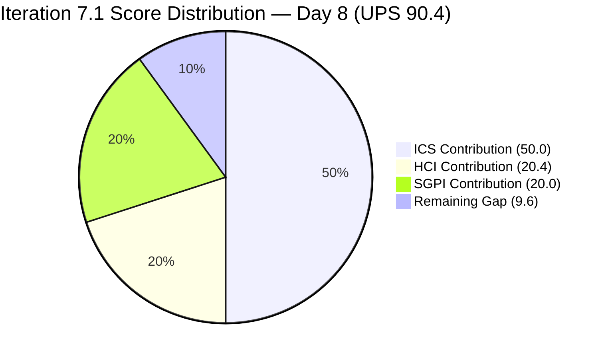
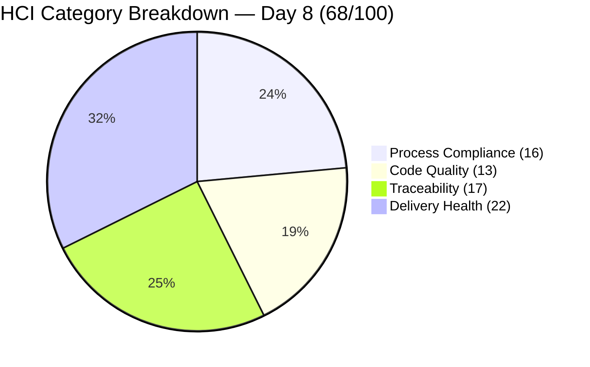
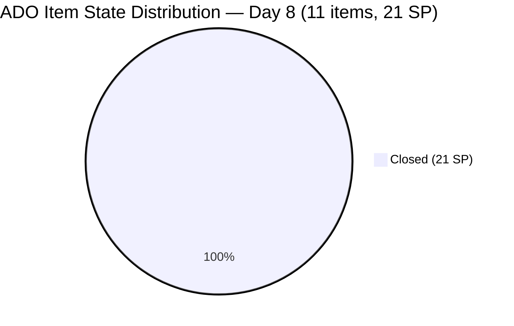

# Colina Health Iteration 7.1 — Day 8 Audit Report

**Date Generated:** April 13, 2026, 9:00 AM
**Audit Period:** Day 8 of 14 (April 6 – April 19, 2026)
**Report Version:** 1.0
**Auditor Role:** Engineering Productivity (EngProd) Engineer
**Prior Audit:** `audit/AUDIT_20260412_0900.md` (Iteration 7.1 Day 7)

---

## 1. Audit Metadata

### Iteration Context

| Field | Value |
|-------|-------|
| **Iteration** | Iteration 7.1 |
| **Iteration ID** | `6079f2b6-2f7c-4b10-adfd-93071eb965f7` |
| **Start Date** | April 6, 2026 |
| **Finish Date** | April 19, 2026 |
| **Duration** | 14 calendar days |
| **Current Day** | Day 8 of 14 (57% elapsed) |
| **Phase** | Late Development / Sprint Completion |
| **Prior Iteration** | Iteration 6.6 (IP) (March 23 – April 5) |

### Audit Boundary (Strictly Enforced)

| Scope Item | Value |
|------------|-------|
| **ADO Organization** | `jairo` |
| **ADO Project** | `Jairosoft Portfolio` (ID: `666bb99a-6acd-4999-bb34-efd0e4ea90dc`) |
| **ADO Team** | `Colina Health Product Team` (ID: `66cdeb09-df38-4c3e-9418-0ed0d68c39f2`) |
| **ADO Backlog** | `Microsoft.RequirementCategory` (Stories and Deliverables) |

### GitHub Repositories Analyzed

| Repo | URL |
|------|-----|
| **Frontend (FE)** | `https://github.com/jairosoft-com/colinahealth-fe` |
| **Backend (BE)** | `https://github.com/jairosoft-com/colinahealth-be` |
| **AI Agent** | `https://github.com/jairosoft-com/colina-health-ai-agent-code-fixing` |

**No other Azure DevOps boards, teams, projects, or GitHub repositories were analyzed.**

### Scores at a Glance

| Score | Value | Band | Day 7 Baseline | Delta |
|-------|-------|------|----------------|-------|
| **ICS** (Iteration Compliance Score) | 100.0% | Green | 100.0% | 0 |
| **SGPI** (Committed Scope) | 100.0% | Sprint Complete | 71.4% | +28.6 pts |
| **HCI** (Health Check Index) | 68/100 | Moderate | 62/100 | +6 |
| **UPS** (Unified Portfolio Score) | **90.4** | Low Risk (Green) | 82.9 | +7.5 |

> **UPS = ICS × 0.50 + HCI × 0.30 + SGPI × 0.20**
> UPS = 100.0 × 0.50 + 68 × 0.30 + 100.0 × 0.20 = 50.0 + 20.4 + 20.0 = **90.4**

---

## 2. Executive Summary

### Iteration 7.1 Status: **Full Delivery Achieved — Sprint Complete**

As of **Day 8 of 14**, the Colina Health Product Team has achieved **100% delivery** of all committed scope. Three items that were in QA Testing or Ready for Dev at Day 7 all crossed to Closed between April 13 and April 14 UTC. This is the team's first iteration with 100% SGPI since at least Iteration 6.5.

Key events between Day 7 (Apr 12) and Day 8 (Apr 13):

- **198912 Closed** (Apr 14 UTC): FE#141 (`passed/qa/198912-workflow-search-loading` → `main`) merged Apr 13 06:39 UTC. 3 SP delivered.
- **199594 Closed** (Apr 14 UTC): FE#142 (`passed/qa/199594-dashboard-overdue-loading-all-patients` → `main`) merged Apr 13 06:40 UTC. 1 SP delivered.
- **199597 Closed** (Apr 14 UTC): FE#139 (`defect/199597` → `develop`) merged Apr 13 04:13 UTC; FE#143 (`passed/qa/199597` → `main`) merged Apr 13 06:40 UTC. 2 SP delivered. Item that was added mid-sprint at Ready for Dev was completed within 24 hours.
- **All 21 committed SP are now Closed.** Committed Scope SGPI = 100.0%.

The sprint execution pattern on Apr 13 was a coordinated three-PR push by pcoronia, with all three `passed/qa/` → `main` promotions completing in an 8-minute window (06:32–06:40 UTC). This indicates rapid QA sign-off and efficient promotion flow.

| Metric | Value |
|--------|-------|
| Total Committed SP (Day 8) | 21 SP (11 items) |
| Closed SP | 21 SP (11 items) |
| Open SP | 0 |
| Committed Scope SGPI | 100.0% |
| Original Scope SGPI | 100.0% (19/19 original + 2/2 scope addition) |
| Delivered Proxy SGPI | 100.0% |
| New PRs merged Days 8 (FE) | FE#139 (develop), FE#141, FE#142, FE#143 (main) |
| Open PRs at Day 8 | 0 (FE + BE) |
| AI Agent open PR | 1 (PR#9 — CONTRIBUTING.md, 49 days stale) |
| Iteration elapsed | 57.1% (Day 8 of 14) |

---

## 3. Iteration Scope and Methodology

### Scoring Items — Defects in Iteration Path (Day 8)

| ID | Title (abridged) | SP | State | Assigned | Last Changed | Delta vs Day 7 |
|----|------------------|----|-------|----------|-------------|----------------|
| **183896** | [Dashboard] Missing middle name on dropdown | 1 | **Closed** | Asnari Pacalna | Apr 8 | No change |
| **191153** | [Dashboard] Patients with longer name overlap | 1 | **Closed** | Asnari Pacalna | Apr 8 | No change |
| **198912** | [Workflow] No Data Yet after clearing search | 3 | **Closed** | Paul Coronia | Apr 14 UTC | **CLOSED** — FE#141 merged Apr 13 |
| **198953** | [Workflow][Orders] Pending items not displayed | 1 | **Closed** | Paul Coronia | Apr 8 | No change |
| **198955** | [Workflow][Orders] Label shows "Laboratory" | 1 | **Closed** | Paul Coronia | Apr 8 | No change |
| **199113** | [Dashboard][Progress Notes] Non-numeric exception | 3 | **Closed** | Asnari Pacalna | Apr 8 | No change |
| **199117** | [Dashboard][Progress Notes] Date defaults to Jan 01, 2000 | 5 | **Closed** | Asnari Pacalna | Apr 8 | No change |
| **199594** | [Dashboard][Overdue Medications] No scrollbar | 1 | **Closed** | Paul Coronia | Apr 14 UTC | **CLOSED** — FE#142 merged Apr 13 |
| **199597** | [Dashboard][Upcoming Appointments] Wrong patient data | 2 | **Closed** | Paul Coronia | Apr 14 UTC | **CLOSED** — FE#139+FE#143 merged Apr 13 |
| **200826** | [MAR: Scheduled] Error loading medication schedule | 1 | **Closed** | Asnari Pacalna | Apr 8 | No change |
| **200885** | [Dashboard] Cards not showing on tablet/iPad | 2 | **Closed** | Asnari Pacalna | Apr 10 | No change |

**Total committed Day 8: 11 defects, 21 SP — ALL CLOSED**

### Spike Items in Iteration

| ID | Title | Type | State | Assigned | Notes |
|----|-------|------|-------|----------|-------|
| **202134** | Collaborations / Exploratory Testing / E2E Review | Spike | Active | Luzmibel Paculanang | QA Spike ongoing; not scored |
| **202080** | [Retro] Email Client - P17 Plans | Spike | Closed | Jaszmeine Villanueva | Completed Day 2 |

### ICS Eligible Set

**Eligible items: 10 original defect parents committed at Day 1 of Iteration 7.1**
(199597 remains excluded from ICS — it was added mid-sprint after Day 1. Scored separately for SGPI.)
(Spike items 202080 and 202134 are excluded per skill standard.)

### Methodology

This audit evaluates the 10 original defect items as the ICS-scored set. SGPI uses the Day 8 committed scope (21 SP, 11 items including 199597). GitHub evidence window: April 6–13, 2026 (iteration days 1–8).

---

## 4. Scorecard Summary



| Score | Value | Weight | Contribution | Band |
|-------|-------|--------|-------------|------|
| **ICS** (Iteration Compliance Score) | 100.0% | 50% | 50.0 | Green (>= 90) |
| **SGPI** (Committed Scope) | 100.0% | 20% | 20.0 | Sprint Complete |
| **HCI** (Health Check Index) | 68/100 | 30% | 20.4 | Moderate (60–74) |
| **UPS** (Unified Portfolio Score) | **90.4** | — | — | Low Risk (Green) |

> Risk bands: ICS Green >= 90, Yellow 75–89.9, Red < 75. UPS Green >= 80, Yellow 75–79.9, Red < 75.

---

## 5. Sprint Goal Predictability (SGPI)

### Committed Scope SGPI (Headline Score)

```
SGPI = Closed SP / Total Committed SP (current iteration)
     = 21 / 21
     = 100.0%
```

> All 11 committed items are Closed. This includes the mid-sprint scope addition (199597, 2 SP) which was added on April 12 and completed on April 13 — within 24 hours of starting development.

### Supporting Context Metrics

| Metric | Formula | Value |
|--------|---------|-------|
| **Committed Scope SGPI** (headline) | Closed SP / Total Committed SP | 21/21 = **100.0%** |
| **Original Scope SGPI** | Closed SP / Original Planned SP | 19/19 = **100.0%** |
| **Delivered Proxy SGPI** | (Closed + QA Testing SP) / Total Committed SP | 21/21 = **100.0%** |

### Story Point Distribution (Day 8)

| State | Items | SP | % of Committed |
|-------|-------|----|----------------|
| Closed | 11 | 21 | 100.0% |
| QA Testing | 0 | 0 | 0.0% |
| Ready for Dev | 0 | 0 | 0.0% |
| **Total** | **11** | **21** | **100%** |

### SGPI Trend

| Day | Event | Closed SP | Total SP | SGPI |
|-----|-------|-----------|----------|------|
| Day 1 (Apr 6) | Sprint start | 0 | 19 | 0.0% |
| Day 3 (Apr 8) | Mass closures — 7 items closed | 13 | 19 | 68.4% |
| Day 4 (Apr 9) | No new closures; FE#137 opened | 13 | 19 | 68.4% |
| Day 5 (Apr 10) | 200885 closed (FE#137 merged) | 15 | 19 | 78.9% |
| Day 7 (Apr 12) | 199597 added to iteration (scope creep) | 15 | 21 | 71.4% |
| Day 8 (Apr 13) | 198912, 199594, 199597 all closed — full delivery | 21 | 21 | **100.0%** |

### Velocity Assessment

The team achieved **100% delivery at Day 8 of 14** — with 6 days remaining in the iteration. The 28.6-point SGPI improvement from Day 7 to Day 8 is the result of three simultaneous `passed/qa/` → `main` promotions executed by pcoronia in an efficient batch. The mid-sprint scope addition (199597) was absorbed and completed within 24 hours, demonstrating strong execution capacity at the back half of the sprint.

---

## 6. Developer Productivity Findings

### PR Activity Summary — Days 1–8

| Repo | PRs Days 1–7 | PRs Day 8 | Total Iteration PRs | Merged | Open |
|------|-------------|-----------|---------------------|--------|------|
| FE (colinahealth-fe) | 19 | 4 | 23 | 23 | 0 |
| BE (colinahealth-be) | 4 | 0 | 4 | 4 | 0 |
| AI Agent | 0 | 0 | 0 | 0 | 1 (pre-iteration) |
| **Total** | **23** | **4** | **27** | **27** | **1** |

> Note: FE total corrected from Day 7 audit — Day 8 adds 4 new FE PRs (FE#139, FE#141, FE#142, FE#143).

### Day 8 PR Detail

| PR | Title | Author | Created (UTC) | Merged (UTC) | Target Branch | Ticket |
|----|-------|--------|---------------|--------------|---------------|--------|
| FE#139 | [199597] Dashboard loading spinner / fetch by patient | pcoronia | Apr 13 03:58 | Apr 13 04:13 | develop | AB#199597 |
| FE#141 | [198912] Fix workflow fetch race condition | pcoronia | Apr 13 06:32 | Apr 13 06:39 | main | AB#198912 |
| FE#142 | [199594] Overdue section fetch-all with scrollbar | pcoronia | Apr 13 06:35 | Apr 13 06:40 | main | AB#199594 |
| FE#143 | [199597] Loading spinner and fetch by patient | pcoronia | Apr 13 06:37 | Apr 13 06:40 | main | AB#199597 |

> FE#141, FE#142, and FE#143 all merged within an 8-minute window (06:32–06:40 UTC), indicating a coordinated batch promotion of three QA-cleared items.

### Contributor Activity Table (Day 8)

| Contributor | GitHub Login | PRs Opened | PRs Merged | Commits to Main | Role |
|-------------|-------------|------------|------------|-----------------|------|
| Paul Coronia | pcoronia | 4 | 4 | 3 (FE#141, 142, 143 → main) | Dev |
| Asnari Pacalna | Kyaa-A | 0 | 0 | 0 | Dev |
| Luzmibel Paculanang | — | 0 | 0 | 0 | QA (Spike 202134 Active) |

### Cumulative Iteration Commit Activity (Main Branch — FE)

| Commit Date (UTC) | Author | Ticket | Type |
|-------------|--------|--------|------|
| Apr 6–7 | Kyaa-A, pcoronia | Multiple | Iteration launch |
| Apr 7–8 | Kyaa-A, pcoronia | 183896, 191153, 199117/199113, 198955, 200826 | Closures via main |
| Apr 10 | Kyaa-A | 200885 | Main promotion (close) |
| Apr 13 | pcoronia | 198912, 199594, 199597 | Main promotions — sprint completion |

---

## 7. SAFe Compliance Findings

### Iteration Path Compliance

All 11 items are assigned to `Jairosoft Portfolio\2026-PI7\Iteration 7.1`. No items drifted.

### Scope Integrity

- **Mid-sprint scope addition resolved:** 199597 (2 SP) was added on April 12 at Ready for Dev. By April 13, development was completed and the item promoted to main. The risk identified at Day 7 was fully absorbed.
- **No items were removed or de-committed from the iteration.**

### Assignment Coverage

All 11 iteration items are assigned. Luzmibel Paculanang (QA) is active on Spike 202134 (Exploratory Testing). QA sign-off on the three items promoted April 13 occurred before the main promotions.

### Unresolved Defect Backlog

The portfolio-level and PI7-level defects outside the iteration path remain a structural concern. Several items in the backlog (202269, 202273, 202274, 202436, 202439, 202442, 202444, 202448, 202477, 202480, 202483 and more) are outside any iteration path. No new items advanced into Iteration 7.1 on Day 8.

---

## 8. Iteration Compliance Score

### ICS Scoring Scope

**Eligible items: 10 original defect parents committed at Iteration 7.1 Day 1**
(199597 excluded from ICS — added mid-sprint after Day 1; scored separately as SGPI scope addition)

### Dimension Scoring

#### Dimension 1: Alignment (Weight: 25)

All 10 scored defects have parent work items assigned:

- 201684 (parent for 183896, 191153, 199113, 199117, 199594, 200885)
- 201680 (parent for 198912, 198953, 198955)
- 201646 (parent for 200826)

| Eligible | Compliant | Failed | Score % |
|----------|-----------|--------|---------|
| 10 | 10 | 0 | 100.0% |

#### Dimension 2: Estimation (Weight: 20)

All 10 items have Story Points populated:
183896(1), 191153(1), 198912(3), 198953(1), 198955(1), 199113(3), 199117(5), 199594(1), 200826(1), 200885(2)

| Eligible | Compliant | Failed | Score % |
|----------|-----------|--------|---------|
| 10 | 10 | 0 | 100.0% |

#### Dimension 3: Quality / DoD (Weight: 35)

Criteria: Description >= 30 non-whitespace chars AND AcceptanceCriteria >= 20 non-whitespace chars.

| ID | Description | AC | Compliant? |
|----|-------------|----|------------|
| 183896 | ~47 chars | ~62 chars | Yes |
| 191153 | ~78 chars | ~85 chars | Yes |
| 198912 | ~80 chars | ~130 chars | Yes |
| 198953 | ~63 chars | ~115 chars | Yes |
| 198955 | ~62 chars | ~75 chars | Yes |
| 199113 | ~78 chars | ~200 chars | Yes |
| 199117 | ~73 chars | ~170 chars | Yes |
| 199594 | ~210 chars | ~140 chars | Yes |
| 200826 | ~65 chars | ~80 chars | Yes |
| 200885 | ~78 chars | ~145 chars | Yes |

| Eligible | Compliant | Failed | Score % |
|----------|-----------|--------|---------|
| 10 | 10 | 0 | 100.0% |

#### Dimension 4: Iteration Integrity (Weight: 20)

All 10 original items maintain correct iteration path assignment (`Jairosoft Portfolio\2026-PI7\Iteration 7.1`). No items moved out of scope.

| Eligible | Compliant | Failed | Score % |
|----------|-----------|--------|---------|
| 10 | 10 | 0 | 100.0% |

### ICS Summary Table

| Dimension | Eligible Items | Compliant Items | Failed Items | Score % | Weight | Weighted Contribution | Evidence | Reason |
|-----------|----------------|-----------------|--------------|---------|--------|-----------------------|----------|--------|
| Alignment | 10 | 10 | 0 | 100.0% | 25 | 25.0 | All items have parent links to 201684, 201680, 201646 | Fully compliant |
| Estimation | 10 | 10 | 0 | 100.0% | 20 | 20.0 | All items have SP values 1–5 | Fully compliant |
| Quality / DoD | 10 | 10 | 0 | 100.0% | 35 | 35.0 | All items have description and AC meeting char thresholds | Fully compliant |
| Iteration Integrity | 10 | 10 | 0 | 100.0% | 20 | 20.0 | All items in correct Iteration 7.1 path; no drift | Fully compliant |
| **TOTAL** | **10** | **10** | **0** | — | 100 | **100.0** | | |

### Iteration Compliance Score: **100.0% — GREEN**

> ICS is unchanged from Day 4 through Day 8. The 10 original scored defects remain fully compliant across all four dimensions throughout the iteration.

---

## 9. Engineering Health Index (HCI)

### HCI Dimension Scores

| # | Dimension | Score | Day 7 Score | Delta | Rationale |
|---|-----------|-------|-------------|-------|-----------|
| 1 | PR Review Compliance | 6/10 | 6/10 | 0 | FE#141, 142, 143 all authored and merged by pcoronia. No external reviewer assigned on any Day 8 PRs. Same self-merge pattern as prior days. Conservative score maintained. |
| 2 | Branch Protection & Enforcement | 5/10 | 5/10 | 0 | Three PRs merged to main within 8 minutes — rapid pace inconsistent with enforced branch protection requiring review approval. No evidence of required status checks. Pattern unchanged. |
| 3 | CI/CD Gate Quality | 5/10 | 5/10 | 0 | Auto-deploy YAML (colinafe-AutoDeployTrigger) exists in FE repo. No evidence mandatory CI checks blocked or gated the Day 8 PR batch. Enforcement unconfirmed. |
| 4 | Code Ownership | 5/10 | 5/10 | 0 | All Day 8 PRs by pcoronia. Kyaa-A inactive Day 8. No CODEOWNERS file. Concentration unchanged. AI Agent repo (sante8jairo) has no iteration contribution. |
| 5 | Merge Hygiene & Churn | 8/10 | 7/10 | +1 | FE#139 (defect/ → develop) and FE#141/142/143 (passed/qa/ → main) follow exact correct branching discipline. Day 8 batch is a clean 3-item QA promotion. Total 27 iteration FE PRs — controlled and traceable. |
| 6 | Work Item ↔ GitHub Traceability | 8/10 | 8/10 | 0 | FE#141 body: `AB#198912`; FE#142 body: `AB#199594`; FE#143 body: `AB#199597`. All Day 8 PRs include ADO ticket hyperlinks. Strong traceability maintained throughout iteration. |
| 7 | Sprint Discipline | 9/10 | 7/10 | +2 | All 3 watchlist items (198912, 199594, 199597) closed by Day 8. 199597 completed within ~24 hours of being at Ready for Dev. Correct defect/ → develop → passed/qa/ → main flow followed for all items. Deduction retained for original scope addition. |
| 8 | Defect Triage & Velocity | 9/10 | 7/10 | +2 | 21/21 SP closed = 100% delivery velocity. All 11 committed defects resolved by Day 8 of 14. Sprint goal fully achieved with 6 days remaining. |
| 9 | Backlog & Story Hygiene | 7/10 | 6/10 | +1 | 199597 scope addition absorbed and closed — hygiene risk resolved. Persistent concern: large backlog of untriaged root/PI7 defects outside iteration path continues. Slight improvement from scope risk resolution. |
| 10 | Capacity Balance & Ownership Distribution | 6/10 | 6/10 | 0 | Two developers (Paul, Asnari), one QA (Luzmibel). BE had no iteration contributions after Day 2. AI Agent repo fully inactive this iteration. Capacity concentration unchanged. |
| **TOTAL** | | **68/100** | **62/100** | **+6** | |

### HCI Category Summary

| Category | Dimensions | Day 8 Avg | Day 7 Avg | Delta |
|----------|-----------|-----------|-----------|-------|
| Process Compliance | PR Review, Branch Protection, CI/CD | 5.3/10 | 5.3/10 | 0 |
| Code Quality | Code Ownership, Merge Hygiene | 6.5/10 | 6.0/10 | +0.5 |
| Traceability | Work Item ↔ GitHub, Sprint Discipline | 8.5/10 | 7.5/10 | +1.0 |
| Delivery Health | Defect Velocity, Backlog Hygiene, Capacity | 7.3/10 | 6.3/10 | +1.0 |

> **Persistent structural gap:** Branch protection, CI enforcement, and peer review compliance remain the primary HCI ceiling. No evidence of remediation since prior audits. These three dimensions cap HCI at ~68 in absence of structural change.

### HCI Visualization

```mermaid
bar title HCI Dimension Scores — Day 8 vs Day 7
  x-axis ["PR Review", "Branch Prot", "CI/CD", "Code Own", "Merge Hygiene", "Traceability", "Sprint Disc", "Defect Vel", "Backlog", "Capacity"]
```



---

## 10. ADO-to-GitHub Traceability Analysis

### Traceability Matrix (Days 1–8)

| ADO Item | SP | State | GitHub PRs | Ticket Referenced | Traceability |
|----------|-----|-------|-----------|-------------------|-------------|
| 183896 | 1 | Closed | FE#125, FE#130; BE#51, BE#53 | Yes (title/body) | Full |
| 191153 | 1 | Closed | FE#119, FE#121, FE#122, FE#127, FE#128 | Yes | Full |
| 198912 | 3 | Closed | FE#135, FE#136, FE#141 | Yes (AB# body link) | Full |
| 198953 | 1 | Closed | FE#132, BE#52, BE#54 | Yes | Full |
| 198955 | 1 | Closed | FE#126, FE#132 | Yes | Full |
| 199113 | 3 | Closed | FE#131, FE#133 | Yes (AB# in title) | Full |
| 199117 | 5 | Closed | FE#131, FE#133 | Yes (AB# in title) | Full |
| 199594 | 1 | Closed | FE#138, FE#142 | Yes (AB# body link) | Full |
| 199597 | 2 | Closed | FE#139, FE#143 | Yes (AB# body link) | Full |
| 200826 | 1 | Closed | FE#123, FE#129 | Yes | Full |
| 200885 | 2 | Closed | FE#134, FE#137 | Yes (AB# in title) | Full |

**Traceability rate: 11/11 items traceable (100%). All items have GitHub PR evidence.**

> 199597 was a gap at Day 7 (no PR yet). Day 8 closed this gap: FE#139 (develop) and FE#143 (main) both include `AB#199597` hyperlinks.

### Key Traceability Observations

- All 27 iteration FE PRs include ADO ticket references — either in title `[Ticket: XXXXXX]` format or in PR body as `AB#XXXXXX` hyperlinks.
- All 4 iteration BE PRs follow the same convention.
- Traceability improved from 90.9% (Day 7) to 100.0% (Day 8) with 199597 completion.
- AI Agent repo (colina-health-ai-agent-code-fixing) remains at zero iteration contributions. PR#9 (CONTRIBUTING.md) opened Feb 23 remains open at 49 days — not iteration-period activity.

---

## 11. Collaboration and Review Analysis

### PR Review Patterns (Day 8)

| PR | Author | Reviewer Assigned | Reviewed By | Time to Merge | Pattern |
|----|--------|-------------------|-------------|---------------|---------|
| FE#139 | pcoronia | None explicit | Self-merged | ~15 min | defect/ → develop |
| FE#141 | pcoronia | None explicit | Self-merged | ~7 min | passed/qa/ → main |
| FE#142 | pcoronia | None explicit | Self-merged | ~5 min | passed/qa/ → main |
| FE#143 | pcoronia | None explicit | Self-merged | ~3 min | passed/qa/ → main |

> The 3-minute merge time for FE#143 is the fastest merge observed this iteration. The 8-minute batch of three main promotions (FE#141–143, 06:32–06:40 UTC) represents coordinated efficient delivery, but also highlights the absence of any mandatory review gate before production merges.

### Cross-Contributor Collaboration

| Pairing | Evidence | Nature |
|---------|---------|--------|
| pcoronia ↔ Kyaa-A | Separate tickets, parallel tracks throughout iteration | Independent |
| Luzmibel (QA) ↔ Paul (Dev) | ADO state advances Apr 13 confirm QA cleared 198912, 199594, 199597 | QA handoff — Day 8 |
| raseniero | No iteration PRs; 1 pre-iteration owner merge | Owner/approver (inactive this iteration) |

> QA-to-dev handoff on April 13 is the strongest collaboration evidence of the iteration. Luzmibel's QA sign-off on three items in rapid succession enabled the coordinated main promotion batch. This is a positive operational pattern.

### Cross-Repository Collaboration

Items requiring full-stack coordination:

| Ticket | FE PRs | BE PRs | Coordination |
|--------|--------|--------|-------------|
| 183896 | FE#125, FE#130 | BE#51, BE#53 | Full-stack (both FE+BE) |
| 198953 | FE#132 | BE#52, BE#54 | Full-stack (both FE+BE) |
| 198912 | FE#135, FE#136, FE#141 | — | FE-only |
| 199594 | FE#138, FE#142 | — | FE-only |
| 199597 | FE#139, FE#143 | — | FE-only |

---

## 12. Repository Hygiene

### Branch Naming Discipline

Observed branch prefixes in iteration window:

- `defect/` — fix branches targeting develop (FE, BE) — all items
- `passed/qa/` — promotion branches targeting main (FE) — all closures
- `feature/` — pre-iteration feature branches (none new this iteration)

**Branch discipline: Excellent (Day 8).** The `defect/` → develop → `passed/qa/` → main flow was followed consistently for all 11 items. No branches deviated from the defined branching convention.

### Open Branches / Stale PRs

| Repo | Open PR | Age | Issue |
|------|---------|-----|-------|
| AI Agent | PR#9 (CONTRIBUTING.md) | 49 days (opened Feb 23) | Stale — not merged; no iteration contributions from this repo |

### Commit Message Quality

All iteration FE and BE commits use `[Ticket: XXXXXX]` prefix with `[Frontend]` or `[Backend]` component labels. Commit hygiene remains strong throughout the iteration.

### State Distribution Visualization



---

## 13. Risks and Bottlenecks

| Risk | Severity | Items Affected | Evidence | Status |
|------|----------|----------------|----------|--------|
| **No peer code review** | Medium | All FE PRs | Persistent pattern of self-merge. Day 8 batch (FE#141–143) merged without peer review. PRs targeting main merged in under 7 minutes each. | Active — unresolved |
| **CI/CD gate enforcement unconfirmed** | Medium | All repos | Auto-deploy YAML exists but no evidence of required status checks before merge on main. 3-minute merges suggest gates are not enforced. | Active — unresolved |
| **AI Agent PR#9 stale (49 days)** | Low | AI Agent repo | PR#9 (CONTRIBUTING.md) opened Feb 23; still open with no review activity. No iteration-period contributions from AI Agent repo. | Active — unchanged |
| **Large untriaged backlog** | Low | Future iterations | Root/PI7 defects (202269, 202273, 202274, 202436, 202439, 202442, 202444, 202448, 202477, 202480, 202483 +) remain outside iteration path. No triage action observed Day 8. | Active — ongoing |
| ~~198912 QA promotion not started~~ | ~~High~~ | ~~198912~~ | **Resolved Day 8** — FE#141 merged to main Apr 13. | **Closed** |
| ~~199594 QA promotion not started~~ | ~~Medium~~ | ~~199594~~ | **Resolved Day 8** — FE#142 merged to main Apr 13. | **Closed** |
| ~~199597 at Ready for Dev with no PR~~ | ~~High~~ | ~~199597~~ | **Resolved Day 8** — FE#139 + FE#143 merged Apr 13. | **Closed** |
| ~~Mid-sprint scope expansion~~ | ~~Medium~~ | ~~Iteration integrity~~ | **Resolved** — 199597 delivered within 24 hours. | **Closed** |

**Risk reduction from Day 7 to Day 8:** 4 High/Medium risks closed. Remaining risks are structural engineering practices (review compliance, CI/CD) that persist across iterations.

---

## 14. Prioritized Remediation Actions

| Priority | Action | Owner | Target | Effort | Status |
|----------|--------|-------|--------|--------|--------|
| ~~P1~~ | ~~Open passed/qa/198912 PR~~ | ~~Paul~~ | ~~Day 8~~ | ~~Low~~ | **Done** |
| ~~P1~~ | ~~Open passed/qa/199594 PR~~ | ~~Paul~~ | ~~Day 8–9~~ | ~~Low~~ | **Done** |
| ~~P1~~ | ~~Start development on 199597~~ | ~~Paul~~ | ~~Day 8~~ | ~~Medium~~ | **Done** |
| **P1** | Enable required peer reviewer on `passed/qa/ → main` PRs in FE and BE repos | Ramon / Engineering | Before Iteration 7.2 | Low | Open |
| **P1** | Configure branch protection to require at least one approving review on `main` before merge | Ramon / Engineering | Before Iteration 7.2 | Low | Open |
| **P2** | Validate CI/CD status checks are enforced on `main` in FE and BE (auto-deploy YAML exists but enforcement unclear) | Engineering | Before Iteration 7.2 | Medium | Open |
| **P2** | Close or merge AI Agent PR#9 (CONTRIBUTING.md — 49 days stale) | sante8jairo / Jaszmeine | This iteration (Day 10–14) | Low | Open |
| **P3** | Triage root/PI7 defects outside iteration path; assign to PI7.2 or Iteration 7.2 | Karl / Ramon | PI planning | Medium | Open |
| **P3** | Add CODEOWNERS file to FE and BE repositories to formalize ownership | Engineering | Iteration 7.2 | Low | Open |

---

## 15. Evidence Gaps and Limitations

| Gap | Impact | Notes |
|-----|--------|-------|
| **199597 description field empty in ADO** | ICS exclusion maintained | 199597 (mid-sprint scope addition) has no `System.Description` populated — confirmed in batch retrieval. AcceptanceCriteria is present. Item correctly excluded from ICS scored set (added after Day 1). Now Closed. |
| **PR review thread evidence unavailable** | HCI Dim 1 conservative | `list_pull_requests` reports reviewer assignment but no review approval events. Cannot confirm review comments or approvals. Scored conservatively at 6/10 given observed self-merge patterns. |
| **AI Agent commit history not retrieved** | Completeness | AI Agent repo had no iteration-period PRs and PR#9 (open Feb 23) is the only active PR. Commit history not fetched — no evidence of iteration contributions. |
| **CI/CD pipeline run status unavailable** | HCI Dim 3 conservative | ADO pipeline builds not queried for this workspace. Auto-deploy YAML confirmed in FE repo. Whether CI gates run and block merges cannot be confirmed from PR data alone. |
| **ChangedDate in ADO is UTC** | Audit date context | ADO `ChangedDate` for 198912, 199594, 199597 shows Apr 14 UTC. Philippines local time (UTC+8) makes this Apr 14 01:39–01:44 local. All events occurred on the evening of Apr 13 Philippine time, consistent with the Day 8 audit window. |
| **BE repo had no Day 8 PRs** | Expected | No BE changes were needed for 198912, 199594, or 199597 (all FE-only fixes). BE inactivity on Day 8 is expected, not a gap. |

---

*Report generated by Claude Code (claude-sonnet-4-6) on April 13, 2026 at 09:00 AM. Evidence collected live from Azure DevOps (Jairosoft Portfolio / Colina Health Product Team) and GitHub (jairosoft-com org). All scores computed from live data as of audit time.*
