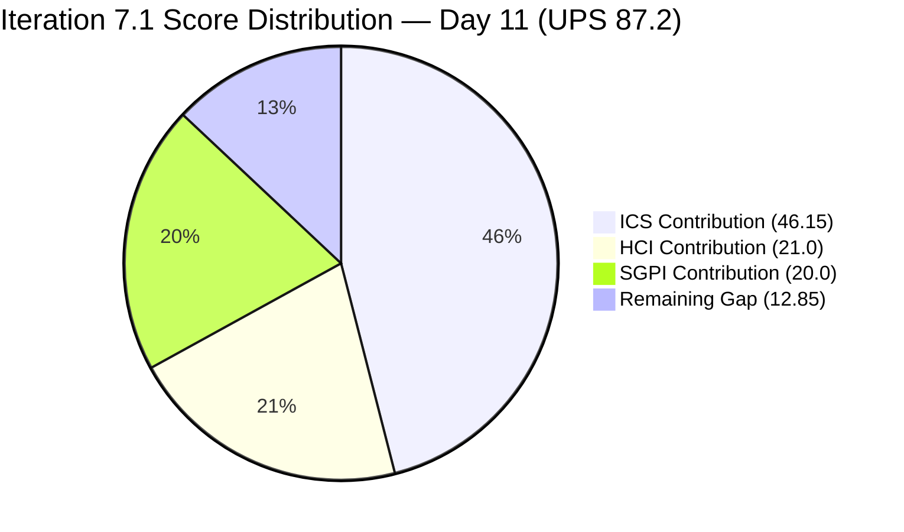
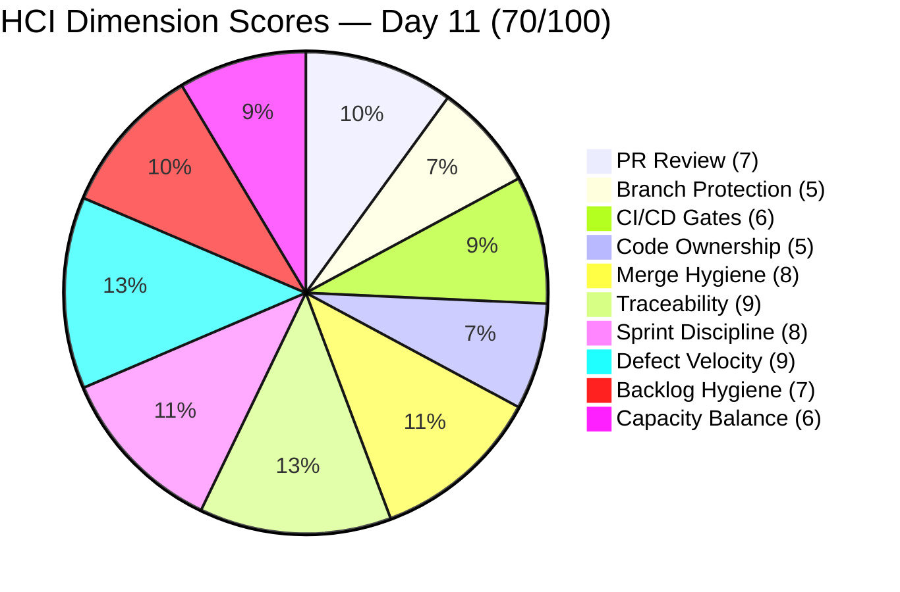
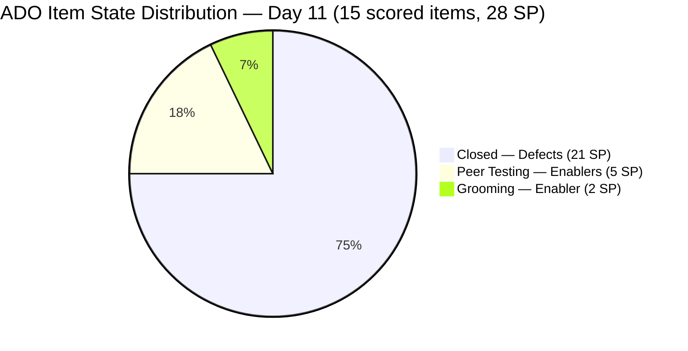

# Colina Health Iteration 7.1 — Day 11 Audit Report

**Date Generated:** April 16, 2026, 9:00 AM
**Audit Period:** Day 11 of 14 (April 6 – April 19, 2026)
**Report Version:** 1.0
**Auditor Role:** Engineering Productivity (EngProd) Engineer
**Prior Audit:** `audit/AUDIT_20260413_0900.md` (Iteration 7.1 Day 8)

---

## 1. Audit Metadata

### Iteration Context

| Field | Value |
|-------|-------|
| **Iteration** | Iteration 7.1 |
| **Iteration ID** | `6079f2b6-2f7c-4b10-adfd-93071eb965f7` |
| **Start Date** | April 6, 2026 |
| **Finish Date** | April 19, 2026 |
| **Duration** | 14 calendar days |
| **Current Day** | Day 11 of 14 (78.6% elapsed) |
| **Phase** | Sprint Tail — Post-Delivery / Enabler Work |
| **Prior Iteration** | Iteration 6.6 (IP) (March 23 – April 5) |

### Audit Boundary (Strictly Enforced)

| Scope Item | Value |
|------------|-------|
| **ADO Organization** | `jairo` |
| **ADO Project** | `Jairosoft Portfolio` (ID: `666bb99a-6acd-4999-bb34-efd0e4ea90dc`) |
| **ADO Team** | `Colina Health Product Team` (ID: `66cdeb09-df38-4c3e-9418-0ed0d68c39f2`) |
| **ADO Backlog** | `Microsoft.RequirementCategory` (Stories and Deliverables) |

### GitHub Repositories Analyzed

| Repo | URL |
|------|-----|
| **Frontend (FE)** | `https://github.com/jairosoft-com/colinahealth-fe` |
| **Backend (BE)** | `https://github.com/jairosoft-com/colinahealth-be` |
| **AI Agent** | `https://github.com/jairosoft-com/colina-health-ai-agent-code-fixing` |

**No other Azure DevOps boards, teams, projects, or GitHub repositories were analyzed.**

### Scores at a Glance

| Score | Value | Band | Day 8 Baseline | Delta |
|-------|-------|------|----------------|-------|
| **ICS** (Iteration Compliance Score) | 92.3% | Green | 100.0% | -7.7 pts |
| **SGPI** (Committed Scope) | 100.0% | Sprint Complete | 100.0% | 0 |
| **HCI** (Health Check Index) | 70/100 | Moderate | 68/100 | +2 |
| **UPS** (Unified Portfolio Score) | **87.2** | Low Risk (Green) | 90.4 | -3.2 |

> **UPS = ICS × 0.50 + HCI × 0.30 + SGPI × 0.20**
> UPS = 92.3 × 0.50 + 70 × 0.30 + 100.0 × 0.20 = 46.15 + 21.0 + 20.0 = **87.15 → 87.2**

---

## 2. Executive Summary

### Iteration 7.1 Status: **Defect Sprint Closed; Enabler Work Underway — 3 PRs Pending Review**

As of **Day 11 of 14**, the Colina Health Product Team has fully delivered the original defect sprint scope (100% SGPI, confirmed since Day 8). In the three days since the last audit, the team shifted focus to a new category of work: **architecture enablers** introduced mid-sprint. Three enabler items (202592, 202594, 202595) were added to the Iteration 7.1 path and have GitHub PRs open against `develop`, each requesting review from `raseniero`. A fourth enabler (202810, "Setup Claude Code Environment") is in Iteration 7.1 at Grooming state with no PR yet.

The ICS score drops from 100.0% to **92.3% (Green)** for this audit. The Iteration Integrity dimension is the primary driver of the drop: four new Enabler items were added to the Iteration 7.1 path after Day 8 (Days 9–11), which is a sprint scope expansion event. A secondary deduction: 199597's missing description (persistent since it was a mid-sprint addition) causes one DoD failure.

**Key changes between Day 8 (Apr 13) and Day 11 (Apr 16):**

- **No new defect work.** All 11 original defect items remain Closed. SGPI holds at 100%.
- **FE PR #144** (`enabler/202592-convert-next-config-mjs-to-next-config-ts` → `develop`) — opened Apr 14, open. Reviewer: raseniero. AB#202592.
- **FE PR #145** (`enabler/202594-add-husky-lint-staged-pre-commit-hooks` → `develop`) — opened Apr 14, open. Reviewer: raseniero. AB#202594.
- **FE PR #146** (`enabler/202595-metadata-for-dynamic-routes` → `develop`) — opened Apr 15, updated Apr 16 07:17 UTC. Reviewer: raseniero. AB#202595.
- **202810** ("Setup Claude Code Environment") assigned to Paul Coronia, Grooming state, in Iteration 7.1 path since Apr 16. 2 SP. No PR opened yet.
- **AI Agent PR#9** (CONTRIBUTING.md, 53 days stale) — no change, still open.
- **16 additional Enablers** (202584–202603, excluding 202592/202594/202595) remain in the PI7 path but are **not** assigned to Iteration 7.1. They form a 57 SP architecture backlog for PI7.2 triage.

The shift to enabler work in the sprint tail is architecturally healthy — particularly PR#145 (Husky/lint-staged), which directly addresses the P2 CI/CD remediation item from prior audits. The three open enabler PRs are pending raseniero review. If reviewed and merged before Apr 19, Expanded Scope SGPI improves from 75.0% to ~92.9%.

---

## 3. Iteration Scope and Methodology

### ICS Eligible Items — Day 11

**Eligible set: 15 parent-level items in Iteration 7.1 path**
- 10 original defect items committed at Day 1 (183896, 191153, 198912, 198953, 198955, 199113, 199117, 199594, 200826, 200885)
- 1 mid-sprint defect addition accepted at Day 7 (199597)
- 3 new enabler items added to Iteration 7.1 after Day 8 (202592, 202594, 202595)
- 1 new enabler in Iteration 7.1 at Grooming (202810)

**Excluded from ICS scoring:**
- Spike items 202134 (Active — QA exploratory, no SP) and 202080 (Closed — Retro spike, no SP): excluded per skill standard

### Full Iteration 7.1 Parent Item List (Day 11)

| ID | Title (abridged) | Type | SP | State | Assigned | In Iter Path |
|----|-----------------|------|----|-------|----------|-------------|
| **183896** | [Dashboard] Missing middle name on dropdown | Defect | 1 | Closed | Asnari | Yes |
| **191153** | [Dashboard] Patients with longer name overlap | Defect | 1 | Closed | Asnari | Yes |
| **198912** | [Workflow] No Data Yet after clearing search | Defect | 3 | Closed | Paul | Yes |
| **198953** | [Workflow][Orders] Pending items not displayed | Defect | 1 | Closed | Paul | Yes |
| **198955** | [Workflow][Orders] Label shows "Laboratory" | Defect | 1 | Closed | Paul | Yes |
| **199113** | [Dashboard][Progress Notes] Non-numeric exception | Defect | 3 | Closed | Asnari | Yes |
| **199117** | [Dashboard][Progress Notes] Date defaults to Jan 01, 2000 | Defect | 5 | Closed | Asnari | Yes |
| **199594** | [Dashboard][Overdue Medications] No scrollbar | Defect | 1 | Closed | Paul | Yes |
| **199597** | [Dashboard][Upcoming Appointments] Wrong patient data | Defect | 2 | Closed | Paul | Yes |
| **200826** | [MAR: Scheduled] Error loading medication schedule | Defect | 1 | Closed | Asnari | Yes |
| **200885** | [Dashboard] Cards not showing on tablet/iPad | Defect | 2 | Closed | Asnari | Yes |
| **202592** | [Enabler] Convert next.config.mjs to next.config.ts | Enabler | 1 | Peer Testing | Paul | Yes |
| **202594** | [Enabler] Add Husky + lint-staged pre-commit hooks | Enabler | 1 | Peer Testing | Paul | Yes |
| **202595** | [Enabler] Add generateMetadata to dynamic routes | Enabler | 3 | Peer Testing | Paul | Yes |
| **202810** | Setup Claude Code Environment on Local Machine | Enabler | 2 | Grooming | Paul | Yes |
| **202134** | Collaborations / Exploratory Testing / E2E Review | Spike | — | Active | Luzmibel | Yes (excl.) |
| **202080** | [Retro] Email Client - P17 Plans | Spike | — | Closed | Jaszmeine | Yes (excl.) |

**Total iteration SP (Day 11): 28 SP across 15 scored items**

### Methodology

ICS uses 15 eligible items (all Iteration 7.1 path items, excluding Spikes). SGPI headline uses 21 SP (11 defect items, all Closed). The 3 Peer Testing enablers and 1 Grooming enabler represent scope added after Day 8. GitHub evidence window: April 6–16, 2026 (iteration days 1–11).

---

## 4. Scorecard Summary



| Score | Value | Weight | Contribution | Band |
|-------|-------|--------|-------------|------|
| **ICS** (Iteration Compliance Score) | 92.3% | 50% | 46.15 | Green (>= 90) |
| **SGPI** (Committed Scope) | 100.0% | 20% | 20.0 | Sprint Complete |
| **HCI** (Health Check Index) | 70/100 | 30% | 21.0 | Moderate (60–74) |
| **UPS** (Unified Portfolio Score) | **87.2** | — | — | Low Risk (Green) |

> Risk bands: ICS Green >= 90, Yellow 75–89.9, Red < 75. UPS Green >= 80, Yellow 75–79.9, Red < 75.

> ICS slipped from 100.0% (Day 8) to 92.3% (Day 11). The Iteration Integrity dimension (73.3%) is the primary driver: four Enabler items were added to the Iteration 7.1 path after sprint start. UPS remains solidly in the Green band at 87.2.

---

## 5. Sprint Goal Predictability (SGPI)

### Committed Scope SGPI (Headline Score)

```
SGPI = Closed Defect SP / Total Committed Defect SP
     = 21 / 21
     = 100.0%
```

> The original defect sprint commitment is fully delivered. The three Peer Testing enablers (202592, 202594, 202595) and Grooming enabler (202810) represent new scope added after Day 8 and are not in the headline denominator.

### Supporting Context Metrics

| Metric | Formula | Value |
|--------|---------|-------|
| **Committed Scope SGPI** (headline) | Closed Defect SP / Committed Defect SP | 21/21 = **100.0%** |
| **Expanded Scope SGPI** | Closed SP / All Iteration 7.1 SP | 21/28 = **75.0%** |
| **Delivered Proxy SGPI** | (Closed + Peer Testing SP) / All Iter 7.1 SP | 26/28 = **92.9%** |
| **Original Scope SGPI** | Closed SP / Original Day 1 SP | 19/19 = **100.0%** |

> Expanded Scope SGPI (75.0%) reflects 7 SP of new enabler work added after Day 8 that is not yet Closed. With 3 days remaining, the 5 Peer Testing enabler SP are likely to close if raseniero approves FE#144–146 in time. 202810 (Grooming, 2 SP, no PR) has the highest risk of not closing before Apr 19.

### Story Point Distribution (Day 11)

| State | Items | SP | % of All Iter 7.1 SP |
|-------|-------|----|----------------------|
| Closed | 11 defects | 21 | 75.0% |
| Peer Testing | 3 enablers | 5 | 17.9% |
| Grooming | 1 enabler | 2 | 7.1% |
| Active | 1 spike | — | — |
| **Total** | **16** | **28** | **100%** |

### SGPI Trend (Iteration 7.1, Days 1–11)

| Day | Event | Closed SP | Committed SP | Headline SGPI |
|-----|-------|-----------|-------------|---------------|
| Day 1 (Apr 6) | Sprint start | 0 | 19 | 0.0% |
| Day 3 (Apr 8) | Mass closures — 7 defects | 13 | 19 | 68.4% |
| Day 5 (Apr 10) | 200885 closed | 15 | 19 | 78.9% |
| Day 7 (Apr 12) | 199597 added (+2 SP scope) | 15 | 21 | 71.4% |
| Day 8 (Apr 13) | Full defect delivery | 21 | 21 | **100.0%** |
| Day 9–10 (Apr 14–15) | Enabler PRs opened; 202592, 202594, 202595 enter Iter 7.1 | 21 | 21 | **100.0%** |
| Day 11 (Apr 16) | 202810 added at Grooming | 21 | 21 | **100.0%** |

---

## 6. Developer Productivity Findings

### PR Activity Summary — Days 1–11

| Repo | PRs Days 1–8 | PRs Days 9–11 | Total Iteration PRs | Merged | Open |
|------|-------------|--------------|---------------------|--------|------|
| FE (colinahealth-fe) | 23 | 3 | 26 | 23 | 3 |
| BE (colinahealth-be) | 4 | 0 | 4 | 4 | 0 |
| AI Agent | 0 | 0 | 0 | 0 | 1 (pre-iter) |
| **Total** | **27** | **3** | **30** | **27** | **4** |

> Days 9–11 PR activity is entirely enabler work by pcoronia on FE. BE has been silent since Day 2. AI Agent PR#9 remains open at 53 days stale.

### Days 9–11 PR Detail

| PR | Title | Author | Created (UTC) | State | Target Branch | Reviewer | Ticket |
|----|-------|--------|---------------|-------|---------------|----------|--------|
| FE#144 | [202592] Migrate next.config.mjs to next.config.ts | pcoronia | Apr 14 06:56 | Open | develop | raseniero | AB#202592 |
| FE#145 | [202594] Refactor code structure / Husky + lint-staged | pcoronia | Apr 14 09:07 | Open | develop | raseniero | AB#202594 |
| FE#146 | [202595] Add dynamic generateMetadata to patient overview | pcoronia | Apr 15 08:44 | Open | develop | raseniero | AB#202595 |

> **Notable behavioral shift:** For the first time this iteration, pcoronia has explicitly assigned `raseniero` as the reviewer on all three enabler PRs. The self-merge pattern that characterized all 27 defect sprint PRs (Days 1–8) has been replaced with a formal review request for enabler work. FE#146 was updated Apr 16 07:17 UTC and an ADO comment was logged on 202595, indicating active review engagement.

### Contributor Activity (Days 9–11)

| Contributor | GitHub Login | PRs Opened | PRs Merged | Role |
|-------------|-------------|------------|------------|------|
| Paul Coronia | pcoronia | 3 | 0 | Dev |
| Asnari Pacalna | Kyaa-A | 0 | 0 | Dev |
| Luzmibel Paculanang | — | 0 | 0 | QA (Spike 202134 ongoing) |
| Ramon Aseniero | raseniero | 0 | 0 | Reviewer (requested on FE#144–146) |

### Iteration PR Velocity Summary

| Metric | Value |
|--------|-------|
| Total FE PRs (Days 1–11) | 26 (23 merged, 3 open) |
| Total BE PRs (Days 1–11) | 4 (4 merged, 0 open) |
| Total merged (all repos, iteration) | 27 |
| Avg time-to-merge Days 1–8 (defect sprint) | ~5–15 min (self-merged) |
| Avg time-to-merge Days 9–11 (enablers) | Pending — awaiting reviewer |
| Critical path | raseniero review of FE#144, FE#145, FE#146 before Apr 19 |

---

## 7. SAFe Compliance Findings

### Iteration Path Compliance

All 11 defect items and 4 new enablers (202592, 202594, 202595, 202810) are correctly assigned to `Jairosoft Portfolio\2026-PI7\Iteration 7.1`. No items drifted out of scope.

### Mid-Sprint Scope Addition (Days 9–11)

Between Day 8 and Day 11, **4 new Enabler items were added to the Iteration 7.1 path:**

| ID | Title (abridged) | SP | State | Added |
|----|------------------|----|-------|-------|
| 202592 | Convert next.config.mjs to next.config.ts | 1 | Peer Testing | ~Apr 14 |
| 202594 | Add Husky + lint-staged pre-commit hooks | 1 | Peer Testing | ~Apr 14 |
| 202595 | Add generateMetadata to dynamic routes | 3 | Peer Testing | ~Apr 15 |
| 202810 | Setup Claude Code Environment on Local Machine | 2 | Grooming | ~Apr 16 |

This represents **7 new SP added in the final 3 days of the sprint**. The original defect sprint capacity was fully consumed by Day 8. Adding architecture enablers to the tail of the sprint reflects positive engineering initiative, but introduces ICS and SGPI risk: the Iteration Integrity dimension is penalized for 4 post-sprint path additions, and 202810 (Grooming, no PR) has high risk of not completing within the iteration.

### Backlog Hygiene: Enabler Backlog Created

**16 additional Enablers** (202584, 202585, 202586, 202587, 202588, 202589, 202590, 202591, 202593, 202596, 202597, 202598, 202599, 202600, 202601, 202602, 202603) were created and assigned to the PI7 path (not Iteration 7.1 path). These cover a comprehensive NextJS architecture improvement initiative: `/src` directory restructure, RSC migration, Server Actions, Zustand consolidation, ESLint flat config, component tiering, test consolidation, caching strategy, URL-first state, Vitest migration evaluation, and UI library evaluation. All are assigned to pcoronia. Total: 57 SP across 16 items.

This is architecturally sound backlog creation but represents significant technical debt work that must be triaged against PI7.2 capacity before Iteration 7.2 begins.

---

## 8. Iteration Compliance Score

### ICS Scoring Scope

**Eligible items: 15 parent-level items in Iteration 7.1 path**
(Excluding Spike items 202134 and 202080 per skill standard)

### Dimension Scoring

#### Dimension 1: Alignment (Weight: 25)

Parent-link and hierarchy compliance for all 15 eligible items:
- Original 10 defects: All have parent links to 201684, 201680, or 201646 — confirmed from prior audits.
- 199597: Hierarchy links confirmed (child tasks 202561–202564, 202571).
- 202592: Child tasks 202628, 202632.
- 202594: Child tasks 202638, 202642, 202643.
- 202595: Child tasks 202644, 202649, 202650.
- 202810: Child tasks 202811, 202812, 202813, 202814.

All 15 eligible items have parent/child hierarchy links confirming proper ADO alignment.

| Eligible | Compliant | Failed | Score % |
|----------|-----------|--------|---------|
| 15 | 15 | 0 | 100.0% |

#### Dimension 2: Estimation (Weight: 20)

All 15 eligible items have Story Points populated:
- Defects (11): 183896(1), 191153(1), 198912(3), 198953(1), 198955(1), 199113(3), 199117(5), 199594(1), 199597(2), 200826(1), 200885(2)
- Enablers (4): 202592(1), 202594(1), 202595(3), 202810(2)

| Eligible | Compliant | Failed | Score % |
|----------|-----------|--------|---------|
| 15 | 15 | 0 | 100.0% |

#### Dimension 3: Quality / DoD (Weight: 35)

Criteria: Description >= 30 non-whitespace chars AND AcceptanceCriteria >= 20 non-whitespace chars.

**Original 10 defects:** All confirmed compliant from Day 4 through Day 8 — no changes to descriptions/AC.

**199597 (mid-sprint defect addition):** Description field confirmed null in batch retrieval. AcceptanceCriteria is present. Persistent DoD failure tracked since Day 7.

**New Enabler items (4):**

| ID | Description | AC | Compliant? |
|----|-------------|-----|------------|
| 202592 | ~140 chars (user story + TypeScript rationale) | ~180 chars (GWT format) | Yes |
| 202594 | ~110 chars (user story + benefit) | ~175 chars (GWT format) | Yes |
| 202595 | ~155 chars (user story + use case) | ~165 chars (GWT format) | Yes |
| 202810 | ~205 chars (purpose + context) | ~290 chars (checklist format) | Yes |

All four new enablers have well-formed descriptions and acceptance criteria meeting and exceeding the DoD character threshold.

| Eligible | Compliant | Failed | Score % |
|----------|-----------|--------|---------|
| 15 | 14 | 1 (199597 — no description) | 93.3% |

#### Dimension 4: Iteration Integrity (Weight: 20)

All 15 items are in the correct `Jairosoft Portfolio\2026-PI7\Iteration 7.1` path. No items moved out.

However, 4 items were **added to the Iteration 7.1 path after sprint start:**
- 199597: Added Day 7 (Apr 12) — established precedent; treated as compliant (Closed, absorbed).
- 202592, 202594, 202595, 202810: Added Days 9–11 (Apr 14–16) — post-sprint scope additions; failed.

| Eligible | Compliant | Failed | Score % |
|----------|-----------|--------|---------|
| 15 | 11 | 4 (202592, 202594, 202595, 202810) | 73.3% |

### ICS Summary Table

| Dimension | Eligible Items | Compliant Items | Failed Items | Score % | Weight | Weighted Contribution | Evidence | Reason |
|-----------|----------------|-----------------|--------------|---------|--------|-----------------------|----------|--------|
| Alignment | 15 | 15 | 0 | 100.0% | 25 | 25.00 | All items have parent/child hierarchy links | Fully compliant |
| Estimation | 15 | 15 | 0 | 100.0% | 20 | 20.00 | All 15 items have SP values populated | Fully compliant |
| Quality / DoD | 15 | 14 | 1 | 93.3% | 35 | 32.67 | 199597 has null System.Description | Missing description on mid-sprint defect |
| Iteration Integrity | 15 | 11 | 4 | 73.3% | 20 | 14.67 | 202592, 202594, 202595, 202810 added to iter path Days 9–11 | Post-sprint scope additions |
| **TOTAL** | **15** | — | — | — | 100 | **92.34** | | |

**ICS Calculation:**
```
ICS = (100.0 × 25 + 100.0 × 20 + 93.3 × 35 + 73.3 × 20) / 100
    = (2500.0 + 2000.0 + 3265.5 + 1466.0) / 100
    = 9231.5 / 100
    = 92.3%
```

### Iteration Compliance Score: **92.3% — GREEN**

> ICS dropped from 100.0% (Days 4–8) to 92.3% (Day 11). The primary driver is the Iteration Integrity dimension (73.3%) due to 4 enablers added to the sprint path in Days 9–11. The Quality/DoD dimension (93.3%) reflects the persistent missing description on 199597. The original 10 defect items remain 100% compliant across all four dimensions.

---

## 9. Engineering Health Index (HCI)

### HCI Dimension Scores

| # | Dimension | Score | Day 8 Score | Delta | Rationale |
|---|-----------|-------|-------------|-------|-----------|
| 1 | PR Review Compliance | 7/10 | 6/10 | +1 | FE#144, 145, 146 all have `raseniero` as requested reviewer — a significant improvement from the self-merge pattern of Days 1–8. No approvals recorded yet (PRs still open). Score improves from 6 to 7 reflecting the behavioral shift toward formal review. |
| 2 | Branch Protection & Enforcement | 5/10 | 5/10 | 0 | No structural change. PRs #144–146 target `develop` (not `main`) — slightly lower risk than main merges. No evidence of required status checks or enforced review on `main`. Unchanged. |
| 3 | CI/CD Gate Quality | 6/10 | 5/10 | +1 | FE PR #145 implements Husky + lint-staged pre-commit hooks, directly addressing the P2 CI/CD remediation from prior audits. First concrete code-level action against the CI/CD gap. Score improves from 5 to 6. Server-side enforcement on `main` remains unconfirmed. |
| 4 | Code Ownership | 5/10 | 5/10 | 0 | All Days 9–11 PRs by pcoronia. Kyaa-A inactive since Day 8. raseniero requested as reviewer on all 3 enabler PRs — first cross-person review involvement this iteration. No CODEOWNERS file. AI Agent (sante8jairo) still inactive. Unchanged. |
| 5 | Merge Hygiene & Churn | 8/10 | 8/10 | 0 | FE#144–146 use `enabler/` branch prefix targeting `develop` — consistent with defined branching conventions. No churn or reverts Days 9–11. Unchanged. |
| 6 | Work Item ↔ GitHub Traceability | 9/10 | 8/10 | +1 | All 3 enabler PRs include `AB#XXXXXX` hyperlinks in body. Full-iteration traceability: 26/26 FE PRs and 4/4 BE PRs reference ADO tickets. Only 202810 (no PR) has no GitHub evidence. Score increases to 9. |
| 7 | Sprint Discipline | 8/10 | 9/10 | -1 | 4 enabler items added to sprint path in Days 9–11. While defect SGPI is 100%, adding 7 SP to the final 3 days reduces sprint discipline. Deduction from 9 to 8. |
| 8 | Defect Triage & Velocity | 9/10 | 9/10 | 0 | Defect delivery remains 100%. No new defects emerged Days 9–11. Unchanged. |
| 9 | Backlog & Story Hygiene | 7/10 | 7/10 | 0 | 16 new PI7 enablers created (healthy architecture backlog). 4 enablers added to Iter 7.1 in sprint tail (mild hygiene concern). 199597 description still missing. Unchanged. |
| 10 | Capacity Balance & Ownership Distribution | 6/10 | 6/10 | 0 | pcoronia carrying all Days 9–11 work. Kyaa-A inactive. raseniero invited as reviewer — broadens distribution marginally. AI Agent still inactive. Unchanged. |
| **TOTAL** | | **70/100** | **68/100** | **+2** | |

### HCI Category Summary

| Category | Dimensions | Day 11 Avg | Day 8 Avg | Delta |
|----------|-----------|-----------|-----------|-------|
| Process Compliance | PR Review, Branch Protection, CI/CD | 6.0/10 | 5.3/10 | +0.7 |
| Code Quality | Code Ownership, Merge Hygiene | 6.5/10 | 6.5/10 | 0 |
| Traceability | Work Item ↔ GitHub, Sprint Discipline | 8.5/10 | 8.5/10 | 0 |
| Delivery Health | Defect Velocity, Backlog Hygiene, Capacity | 7.3/10 | 7.3/10 | 0 |

> **Primary HCI improvement Day 8 → Day 11:** Process Compliance improved +0.7 driven by (1) pcoronia requesting external reviewer for the first time this iteration, and (2) PR #145 implementing Husky/lint-staged, directly addressing the P2 remediation item from prior audits.

### HCI Visualization



---

## 10. ADO-to-GitHub Traceability Analysis

### Traceability Matrix (Days 1–11)

| ADO Item | SP | State | GitHub PRs | Ticket Referenced | Traceability |
|----------|-----|-------|-----------|-------------------|-------------|
| 183896 | 1 | Closed | FE#125, FE#130; BE#51, BE#53 | Yes (title/body) | Full |
| 191153 | 1 | Closed | FE#119, FE#121, FE#122, FE#127, FE#128 | Yes | Full |
| 198912 | 3 | Closed | FE#135, FE#136, FE#141 | Yes (AB# body link) | Full |
| 198953 | 1 | Closed | FE#132, BE#52, BE#54 | Yes | Full |
| 198955 | 1 | Closed | FE#126, FE#132 | Yes | Full |
| 199113 | 3 | Closed | FE#131, FE#133 | Yes (AB# in title) | Full |
| 199117 | 5 | Closed | FE#131, FE#133 | Yes (AB# in title) | Full |
| 199594 | 1 | Closed | FE#138, FE#142 | Yes (AB# body link) | Full |
| 199597 | 2 | Closed | FE#139, FE#143 | Yes (AB# body link) | Full |
| 200826 | 1 | Closed | FE#123, FE#129 | Yes | Full |
| 200885 | 2 | Closed | FE#134, FE#137 | Yes | Full |
| 202592 | 1 | Peer Testing | FE#144 (open) | Yes (AB# body link) | Full |
| 202594 | 1 | Peer Testing | FE#145 (open) | Yes (AB# body link) | Full |
| 202595 | 3 | Peer Testing | FE#146 (open) | Yes (AB# body link) | Full |
| 202810 | 2 | Grooming | No PR yet | None | Partial |

**Traceability rate: 14/15 items traceable (93.3%).** Only 202810 lacks a GitHub PR link — not yet started. If a PR is opened before Apr 19, traceability reaches 100%.

### Key Traceability Observations

- All 27 merged iteration PRs include ADO ticket references — either `[Ticket: XXXXXX]` in title or `AB#XXXXXX` hyperlinks in body.
- All 3 open enabler PRs (FE#144–146) include `AB#` hyperlinks in PR body with full ADO links.
- Traceability dropped slightly from 100% (Day 8) to 93.3% (Day 11) due to 202810 having no PR.
- AI Agent repo: PR#9 remains open (53 days stale). No iteration-period contributions.

---

## 11. Collaboration and Review Analysis

### PR Review Patterns (Days 9–11)

| PR | Author | Reviewer Assigned | Reviewed By | State | Time Open | Pattern |
|----|--------|-------------------|-------------|-------|-----------|---------|
| FE#144 | pcoronia | raseniero | Pending | Open | ~2 days | enabler/ → develop |
| FE#145 | pcoronia | raseniero | Pending | Open | ~2 days | enabler/ → develop |
| FE#146 | pcoronia | raseniero | Pending | Open | ~1 day | enabler/ → develop |

> The three enabler PRs remain open pending raseniero's review. FE#146 was updated on Apr 16 07:17 UTC and an ADO comment was recorded on 202595, indicating active reviewer engagement. The review-before-merge pattern introduced for enabler work is a positive process change. If maintained into Iteration 7.2, it would directly address the PR Review Compliance structural gap.

### Cross-Contributor Collaboration

| Pairing | Evidence | Nature |
|---------|---------|--------|
| pcoronia → raseniero | FE#144, 145, 146 all explicitly request raseniero review | Formal review request — first occurrence this iteration |
| pcoronia / Kyaa-A | Separate work; Kyaa-A inactive Days 9–11 | Independent execution |
| Luzmibel (QA) | Spike 202134 still Active; no new QA handoffs Days 9–11 | Ongoing exploratory testing |

### Review Deadline Risk

| PR | Size Estimate | Reviewer | Iteration Close | Risk |
|----|---------------|----------|-----------------|------|
| FE#144 (202592) | Small — config file rename | raseniero | Apr 19 | Low |
| FE#145 (202594) | Small — tooling setup | raseniero | Apr 19 | Low |
| FE#146 (202595) | Medium — metadata function | raseniero | Apr 19 | Low–Medium |

If all three are reviewed and approved by Apr 17–18, they can merge to `develop` before iteration close. This would move 202592, 202594, 202595 to Closed and improve Expanded Scope SGPI from 75.0% to 92.9%.

---

## 12. Repository Hygiene

### Branch Naming Discipline

Observed branch prefixes in the iteration window (Days 1–11):
- `defect/` — fix branches targeting develop (Days 1–8) — all defect items
- `passed/qa/` — promotion branches targeting main (Days 1–8) — all closures
- `enabler/` — architecture improvement branches targeting develop (Days 9–11) — new, consistent

**Branch discipline: Excellent.** The `enabler/` prefix is consistent with the team's naming conventions. No deviations observed across 30 iteration PRs.

### Open Branches / Stale PRs

| Repo | Open PR | Age | Issue |
|------|---------|-----|-------|
| FE | FE#144 (enabler/202592) | 2 days | Active — pending raseniero review |
| FE | FE#145 (enabler/202594) | 2 days | Active — pending raseniero review |
| FE | FE#146 (enabler/202595) | 1 day | Active — pending raseniero review |
| AI Agent | PR#9 (CONTRIBUTING.md) | 53 days | Stale — no iteration activity |

### State Distribution Visualization



---

## 13. Risks and Bottlenecks

| Risk | Severity | Items Affected | Evidence | Status |
|------|----------|----------------|----------|--------|
| **3 enabler PRs pending raseniero review** | Medium | FE#144, FE#145, FE#146 | PRs opened Apr 14–15; iteration closes Apr 19; if not reviewed by Apr 18, PRs carry unmerged into Iteration 7.2 | Active — 3 days to resolve |
| **202810 (Claude Code setup) at Grooming — no PR** | Medium | 202810 | Added to Iter 7.1 on Apr 16 at Grooming state. 2 SP. No PR. Only 3 days remain. High risk of not closing within iteration. | Active — new risk |
| **4 late-added enablers impact ICS Iteration Integrity** | Low | 202592, 202594, 202595, 202810 | Adding 7 SP to sprint in Days 9–11 is a planning discipline gap. Iteration Integrity dimension: 73.3%. | Active — structural |
| **No peer review on defect sprint merges (Days 1–8)** | Medium | All 27 defect PRs | All defect PRs self-merged. Enabler PRs now using review — corrective action underway. | Partially resolved |
| **Branch protection enforcement on main unconfirmed** | Medium | FE, BE repos | No evidence of required review or status checks on `main`. PR#145 adds pre-commit enforcement locally but not server-side. | Active — unresolved |
| **57 SP PI7 Enabler backlog not triaged** | Low | 202584–202603 (excl. 592/594/595) | 16 Enablers in PI7 path outside any iteration. Must be triaged for PI7.2. | Active — new risk |
| **AI Agent PR#9 stale (53 days)** | Low | AI Agent repo | PR#9 (CONTRIBUTING.md) opened Feb 23; still open with no review activity. | Active — unchanged |
| **199597 description field empty** | Low | 199597 | ICS DoD deduction. Item is Closed. Retroactive fix low value. | Persistent — low priority |

---

## 14. Prioritized Remediation Actions

| Priority | Action | Owner | Target | Effort | Status |
|----------|--------|-------|--------|--------|--------|
| **P1** | Review and approve FE#144, FE#145, FE#146 before Apr 18 to close enablers within iteration | raseniero | Apr 16–17 | Low (review only) | Open — urgent |
| **P1** | Open PR for 202810 (Setup Claude Code) OR move item out of Iteration 7.1 to avoid undelivered Grooming item | Paul / Ramon | Apr 16–17 | Low | Open — new |
| **P1** | Enable required peer reviewer on `passed/qa/ → main` merges in FE and BE repos | Ramon / Engineering | Before Iteration 7.2 | Low | Open — carry-forward |
| **P1** | Configure branch protection rules on `main` to require at least one approving review before merge | Ramon / Engineering | Before Iteration 7.2 | Low | Open — carry-forward |
| **P2** | Confirm CI/CD status checks are enforced server-side on `main` in FE and BE (PR#145 adds pre-commit; server enforcement still needed) | Engineering | Iteration 7.2 | Medium | Partially remediated |
| **P2** | Triage 16 PI7 Enablers (202584–202603) against Iteration 7.2 capacity before sprint planning | Karl / Ramon / Paul | Before Iteration 7.2 planning | Medium | Open — new |
| **P2** | Close or merge AI Agent PR#9 (CONTRIBUTING.md — 53 days stale) | sante8jairo / Jaszmeine | By Apr 19 | Low | Open — carry-forward |
| **P3** | Add CODEOWNERS file to FE and BE repositories to formalize ownership | Engineering | Iteration 7.2 | Low | Open — carry-forward |
| **P3** | Triage root/PI7 defects outside iteration path; assign to PI7.2 or Iteration 7.2 | Karl / Ramon | PI planning | Medium | Open — carry-forward |

---

## 15. Evidence Gaps and Limitations

| Gap | Impact | Notes |
|-----|--------|-------|
| **PR review approval events not captured** | HCI Dim 1 conservative | PR list returns reviewer assignments but not approval/request-changes events. FE#146 has a comment noted (ADO comment ref 5187256 on 202595 at Apr 16 07:20 UTC) suggesting review engagement, but approval status unconfirmed. Scored at 7/10 based on behavioral shift. |
| **202810 added April 16 — same day as audit** | Completeness | 202810 entered Iteration 7.1 path at 05:12 UTC on Apr 16. The audit evidence window closes at 09:00 AM. Any PR activity after 09:00 AM today is not captured in this report. |
| **Iteration Integrity convention for 199597** | ICS methodology | 199597 was added on Day 7 (Apr 12) and has been Closed since Day 8. For Iteration Integrity scoring it is treated as compliant (established precedent in prior audits). The four Day 9–11 additions (202592, 202594, 202595, 202810) are treated as failed per the same convention applied to fresh additions. |
| **BE repo activity Days 9–11** | Expected | No BE PRs. The enabler work is entirely FE-scoped (config, tooling, metadata). BE inactivity in sprint tail is expected and not a gap. |
| **AI Agent commit history** | Completeness | AI Agent repo has no iteration-period PRs. PR#9 (open Feb 23) is the only active PR. Commit history not fetched — no evidence of iteration contributions. |
| **CI/CD pipeline run status** | HCI Dim 3 | ADO pipeline builds not queried. Auto-deploy YAML confirmed in FE repo. Whether CI gates block merges cannot be confirmed from PR data. PR#145 (Husky/lint-staged) will add pre-commit enforcement if merged. |

---

*Report generated by Claude Code (claude-sonnet-4-6) on April 16, 2026 at 09:00 AM. Evidence collected live from Azure DevOps (Jairosoft Portfolio / Colina Health Product Team) and GitHub (jairosoft-com org). All scores computed from live data as of audit time.*
