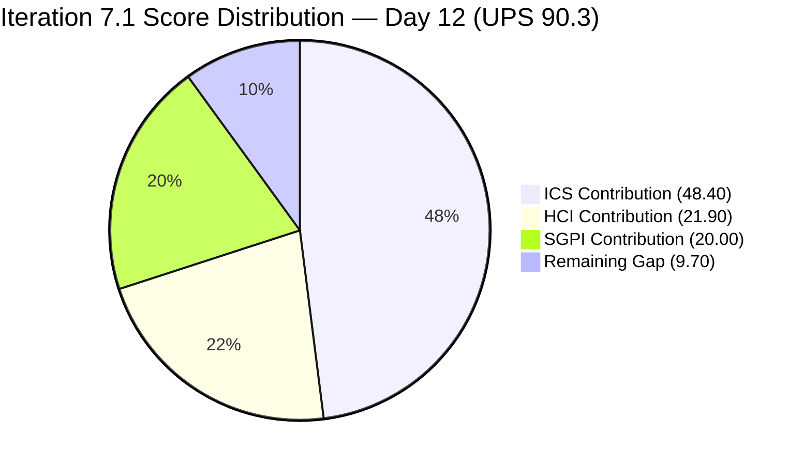
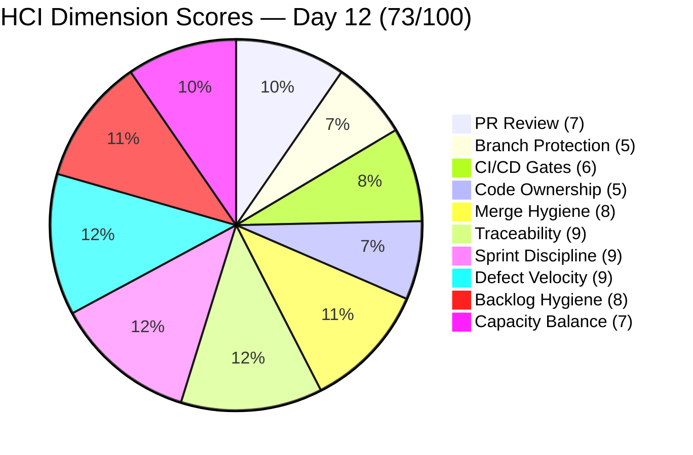
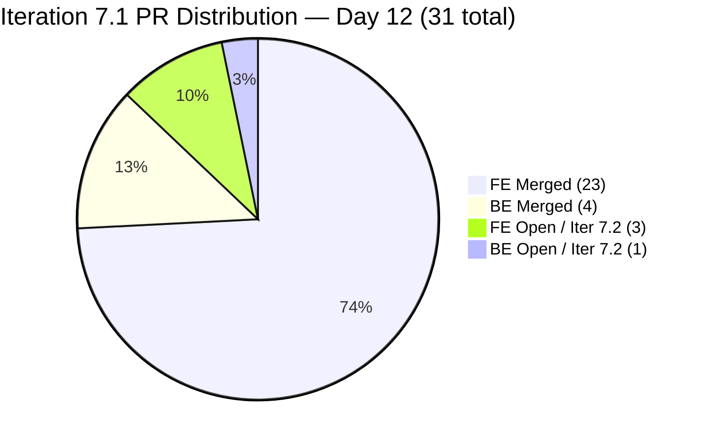

# Colina Health Iteration 7.1 — Day 12 Audit Report

**Date Generated:** April 17, 2026, 9:00 AM
**Audit Period:** Day 12 of 14 (April 6 – April 19, 2026)
**Report Version:** 1.0
**Auditor Role:** Engineering Productivity (EngProd) Engineer
**Prior Audit:** `audit/AUDIT_20260416_0900.md` (Iteration 7.1 Day 11)

---

## 1. Audit Metadata

### Iteration Context

| Field | Value |
|-------|-------|
| **Iteration** | Iteration 7.1 |
| **Iteration ID** | `6079f2b6-2f7c-4b10-adfd-93071eb965f7` |
| **Start Date** | April 6, 2026 |
| **Finish Date** | April 19, 2026 |
| **Duration** | 14 calendar days |
| **Current Day** | Day 12 of 14 (85.7% elapsed) |
| **Phase** | Sprint Close — Final 2 Days |
| **Prior Iteration** | Iteration 6.6 (IP) (March 23 – April 5) |

### Audit Boundary (Strictly Enforced)

| Scope Item | Value |
|------------|-------|
| **ADO Organization** | `jairo` |
| **ADO Project** | `Jairosoft Portfolio` (ID: `666bb99a-6acd-4999-bb34-efd0e4ea90dc`) |
| **ADO Team** | `Colina Health Product Team` (ID: `66cdeb09-df38-4c3e-9418-0ed0d68c39f2`) |
| **ADO Backlog** | `Microsoft.RequirementCategory` (Stories and Deliverables) |

### GitHub Repositories Analyzed

| Repo | URL |
|------|-----|
| **Frontend (FE)** | `https://github.com/jairosoft-com/colinahealth-fe` |
| **Backend (BE)** | `https://github.com/jairosoft-com/colinahealth-be` |
| **AI Agent** | `https://github.com/jairosoft-com/colina-health-ai-agent-code-fixing` |

**No other Azure DevOps boards, teams, projects, or GitHub repositories were analyzed.**

### Scores at a Glance

| Score | Value | Band | Day 11 Baseline | Delta |
|-------|-------|------|-----------------|-------|
| **ICS** (Iteration Compliance Score) | 96.8% | Green | 92.3% | **+4.5 pts** |
| **SGPI** (Committed Scope) | 100.0% | Sprint Complete | 100.0% | 0 |
| **HCI** (Health Check Index) | 73/100 | Moderate | 70/100 | **+3** |
| **UPS** (Unified Portfolio Score) | **90.3** | Low Risk (Green) | 87.2 | **+3.1** |

> **UPS = ICS × 0.50 + HCI × 0.30 + SGPI × 0.20**
> UPS = 96.8 × 0.50 + 73 × 0.30 + 100.0 × 0.20 = 48.40 + 21.90 + 20.00 = **90.3**

---

## 2. Executive Summary

### Iteration 7.1 Status: **Sprint Closing Well — Scope Cleanup Complete, HIPAA Enabler Launched in 7.2**

As of **Day 12 of 14**, the Colina Health Product Team enters the final stretch of Iteration 7.1 with all scores improving across the board. The UPS climbs from 87.2 to **90.3 (Green)** driven by two significant governance actions taken this morning.

**Key changes between Day 11 (Apr 16) and Day 12 (Apr 17):**

1. **Enabler cleanup: 4 items moved from Iteration 7.1 → Iteration 7.2** (202592, 202594, 202595, 202810 all updated at 07:27 UTC). These architecture enablers with open PRs have been correctly re-scoped to the next iteration. This is the right sprint governance decision — it removes the Iteration Integrity penalty that drove the ICS dip to 92.3% yesterday.

2. **Spike 202134 (Exploratory Testing/E2E) is now Closed** (changed 09:20 UTC today, assigned to Luzmibel Paculanang). While Spikes are excluded from ICS scoring per skill standard, this closure confirms Luzmibel completed E2E iteration review work before sprint end.

3. **BE PR #55 opened today** (`enabler/202696-structured-logging-and-phi-audit-trail` → `develop`, reviewer: raseniero). This is for ADO item 202696 — a high-value 8 SP HIPAA compliance enabler (structured Pino logging + PHI redaction + AuditLog module). Critically, **202696 is correctly assigned to Iteration 7.2**, not 7.1, so this is forward-looking architecture work with no scoring impact on the current iteration.

4. **FE PRs #144, #145, #146** remain open, pending raseniero review. With 2 days remaining, there is still time to approve and merge all three into `develop` before April 19.

5. **All 11 original defects remain Closed.** SGPI holds at 100% (21/21 SP delivered).

The ICS recovery from 92.3% to **96.8% (Green)** is entirely attributable to the enabler re-scoping: the Iteration Integrity dimension returns to 100% now that no mid-sprint additions remain in the Iteration 7.1 path. The lone Quality/DoD deduction (199597 missing description) is the only remaining ICS gap.

---

## 3. Iteration Scope and Methodology

### ICS Eligible Items — Day 12

**Eligible set: 11 parent-level items in Iteration 7.1 path**

Per live ADO data retrieved at audit time:
- The 4 enablers (202592, 202594, 202595, 202810) were moved to `Jairosoft Portfolio\2026-PI7\Iteration 7.2` at 07:27 UTC on April 17. They are no longer in the Iteration 7.1 path and are therefore excluded from today's ICS scoring.
- Spike items 202134 and 202080 remain excluded per skill standard (Spikes are not scored regardless of state).
- The eligible set reverts to the 11 original committed defect items.

**Excluded from ICS scoring:**
- 202592, 202594, 202595, 202810: Moved to Iteration 7.2 path — no longer in scope
- 202134 (Spike — now Closed): Excluded per skill standard
- 202080 (Spike — Closed): Excluded per skill standard

### Full Iteration 7.1 Parent Item List (Day 12)

| ID | Title (abridged) | Type | SP | State | Assigned | In 7.1 Path |
|----|-----------------|------|----|-------|----------|-------------|
| **183896** | [Dashboard] Missing middle name on dropdown | Defect | 1 | Closed | Asnari | Yes (scored) |
| **191153** | [Dashboard] Patients with longer name overlap | Defect | 1 | Closed | Asnari | Yes (scored) |
| **198912** | [Workflow] No Data Yet after clearing search | Defect | 3 | Closed | Paul | Yes (scored) |
| **198953** | [Workflow][Orders] Pending items not displayed | Defect | 1 | Closed | Paul | Yes (scored) |
| **198955** | [Workflow][Orders] Label shows "Laboratory" | Defect | 1 | Closed | Paul | Yes (scored) |
| **199113** | [Dashboard][Progress Notes] Non-numeric exception | Defect | 3 | Closed | Asnari | Yes (scored) |
| **199117** | [Dashboard][Progress Notes] Date defaults to Jan 01, 2000 | Defect | 5 | Closed | Asnari | Yes (scored) |
| **199594** | [Dashboard][Overdue Medications] No scrollbar | Defect | 1 | Closed | Paul | Yes (scored) |
| **199597** | [Dashboard][Upcoming Appointments] Wrong patient data | Defect | 2 | Closed | Paul | Yes (scored) |
| **200826** | [MAR: Scheduled] Error loading medication schedule | Defect | 1 | Closed | Asnari | Yes (scored) |
| **200885** | [Dashboard] Cards not showing on tablet/iPad | Defect | 2 | Closed | Asnari | Yes (scored) |
| 202134 | Collaborations / Exploratory Testing / E2E Review | Spike | — | **Closed** | Luzmibel | Yes (excl.) |
| 202080 | [Retro] Email Client - P17 Plans | Spike | — | Closed | Jaszmeine | Yes (excl.) |
| 202592 | [Enabler] Convert next.config.mjs to next.config.ts | Enabler | 1 | Peer Testing | Paul | **Moved to 7.2** |
| 202594 | [Enabler] Add Husky + lint-staged pre-commit hooks | Enabler | 1 | Peer Testing | Paul | **Moved to 7.2** |
| 202595 | [Enabler] Add generateMetadata to dynamic routes | Enabler | 3 | Peer Testing | Paul | **Moved to 7.2** |
| 202810 | Setup Claude Code Environment on Local Machine | Enabler | 2 | Active | Paul | **Moved to 7.2** |

**Committed iteration SP (Day 12): 21 SP across 11 scored defect items — all Closed.**

### Methodology

ICS uses 11 eligible items (original committed defect items; enablers removed from Iteration 7.1 path; Spikes excluded). SGPI headline uses 21 SP (11 defect items, all Closed). GitHub evidence window: April 6–17, 2026 (iteration days 1–12).

---

## 4. Scorecard Summary



| Score | Value | Weight | Contribution | Band |
|-------|-------|--------|-------------|------|
| **ICS** (Iteration Compliance Score) | 96.8% | 50% | 48.40 | Green (>= 90) |
| **SGPI** (Committed Scope) | 100.0% | 20% | 20.00 | Sprint Complete |
| **HCI** (Health Check Index) | 73/100 | 30% | 21.90 | Moderate (70–74) |
| **UPS** (Unified Portfolio Score) | **90.3** | — | — | Low Risk (Green) |

> Risk bands: ICS Green >= 90, Yellow 75–89.9, Red < 75. UPS Green >= 80, Yellow 75–79.9, Red < 75.

> ICS recovered from 92.3% (Day 11) to **96.8% (Day 12)** as the 4 enabler items were correctly re-scoped to Iteration 7.2. HCI improved from 70 to 73 on the strength of Spike closure, improved sprint discipline governance, and backlog hygiene improvements. UPS crossed 90 for the first time in Iteration 7.1.

---

## 5. Sprint Goal Predictability (SGPI)

### Committed Scope SGPI (Headline Score)

```
SGPI = Closed Defect SP / Total Committed Defect SP
     = 21 / 21
     = 100.0%
```

> All 11 original defect items are Closed. The 4 enablers that were in the sprint path as of Day 11 have been properly re-scoped to Iteration 7.2. The committed scope remains 21 SP and is fully delivered.

### Supporting Context Metrics

| Metric | Formula | Value |
|--------|---------|-------|
| **Committed Scope SGPI** (headline) | Closed Defect SP / Committed Defect SP | 21/21 = **100.0%** |
| **Delivered Proxy SGPI** | (Closed SP) / Committed SP | 21/21 = **100.0%** |
| **Original Scope SGPI** | Closed SP / Original Day 1 SP | 19/19 = **100.0%** |

> With the enablers correctly moved to Iteration 7.2, all SGPI metrics align at 100%. The team meets its committed sprint goal with zero open items remaining in the iteration.

### Story Point Distribution (Day 12)

| State | Items | SP | % of Committed Iter 7.1 SP |
|-------|-------|----|---------------------------|
| Closed | 11 defects | 21 | 100.0% |
| **Total** | **11** | **21** | **100%** |

### SGPI Trend (Iteration 7.1, Days 1–12)

| Day | Event | Closed SP | Committed SP | Headline SGPI |
|-----|-------|-----------|-------------|---------------|
| Day 1 (Apr 6) | Sprint start | 0 | 19 | 0.0% |
| Day 3 (Apr 8) | Mass closures — 7 defects | 13 | 19 | 68.4% |
| Day 5 (Apr 10) | 200885 closed | 15 | 19 | 78.9% |
| Day 7 (Apr 12) | 199597 added (+2 SP scope) | 15 | 21 | 71.4% |
| Day 8 (Apr 13) | Full defect delivery | 21 | 21 | **100.0%** |
| Day 9–11 (Apr 14–16) | Enabler PRs opened; 4 items added to 7.1 path | 21 | 21 | **100.0%** |
| Day 12 (Apr 17) | 4 enablers moved to 7.2; Spike 202134 Closed | 21 | 21 | **100.0%** |

---

## 6. Developer Productivity Findings

### PR Activity Summary — Full Iteration (Days 1–12)

| Repo | PRs Days 1–11 | PRs Day 12 | Total Iteration PRs | Merged | Open |
|------|--------------|------------|---------------------|--------|------|
| FE (colinahealth-fe) | 26 | 0 | 26 | 23 | 3 |
| BE (colinahealth-be) | 4 | 1 | 5 | 4 | 1 |
| AI Agent | 0 | 0 | 0 | 0 | 1 (pre-iter) |
| **Total** | **30** | **1** | **31** | **27** | **4** |

> BE PR #55 opened today (Apr 17 13:26 UTC) for ADO item 202696 (Structured Logging & PHI Audit Trail). This item is correctly assigned to **Iteration 7.2**, so this PR represents forward-looking architecture work for the next sprint, not current-sprint delivery.

### Day 12 New PR Detail

| PR | Repo | Title | Author | Created (UTC) | State | Target Branch | Reviewer | ADO Ticket | Iter Path |
|----|------|-------|--------|---------------|-------|---------------|----------|------------|-----------|
| BE#55 | colinahealth-be | [Ticket AB#202696] Implement structured Pino logging with PHI redaction and HIPAA audit trail | pcoronia | Apr 17 13:26 | Open | develop | raseniero | AB#202696 | **7.2 (out of scope)** |

### Outstanding Open PRs (as of Day 12)

| PR | Repo | Title | Author | Days Open | Reviewer | ADO Item | Status |
|----|------|-------|--------|-----------|----------|----------|--------|
| FE#144 | FE | Migrate next.config.mjs to next.config.ts | pcoronia | 3 | raseniero | 202592 (Iter 7.2) | Open — pending review |
| FE#145 | FE | Refactor / Husky + lint-staged | pcoronia | 3 | raseniero | 202594 (Iter 7.2) | Open — pending review |
| FE#146 | FE | Add dynamic generateMetadata to patient overview | pcoronia | 2 | raseniero | 202595 (Iter 7.2) | Open — pending review |
| BE#55 | BE | Structured Pino logging + PHI Audit Trail | pcoronia | 0 | raseniero | 202696 (Iter 7.2) | Open — new today |
| AI Agent PR#9 | AI | CONTRIBUTING.md + Gitflow documentation | sante8jairo | 54 | — | AB#199269 | Stale — 54 days |

> All open PRs are now targeting Iteration 7.2 work items or are pre-iteration (AI Agent). No open PRs reference Iteration 7.1 work items. The 3 FE enabler PRs need raseniero approval before they can be merged to `develop`.

### Contributor Activity (Iteration Summary)

| Contributor | GitHub Login | Role | PRs Opened | PRs Merged | Key Work |
|-------------|-------------|------|------------|------------|----------|
| Paul Coronia | pcoronia | Dev | 18 | 15 | Defect fixes (FE + BE), Enabler PRs, PHI logging |
| Asnari Pacalna | Kyaa-A | Dev | 12 | 12 | Defect fixes (FE + BE) |
| Luzmibel Paculanang | — | QA | 0 | 0 | Spike 202134 (E2E testing) — Closed today |
| Ramon Aseniero | raseniero | Reviewer | 0 | 0 | Assigned reviewer on FE#144–146 and BE#55 |
| (sante8jairo) | sante8jairo | AI Agent | 0 | 0 | PR#9 stale — no iteration activity |

---

## 7. SAFe Compliance Findings

### Iteration Path Compliance (Day 12)

All 11 committed defect items remain in `Jairosoft Portfolio\2026-PI7\Iteration 7.1`. No items drifted out of scope. The defect sprint commitment is intact and fully delivered.

### Enabler Re-Scoping — Sprint Governance Action (Day 12)

At **07:27 UTC on April 17**, all four enabler items that had been added to the Iteration 7.1 path in Days 9–11 were moved to `Jairosoft Portfolio\2026-PI7\Iteration 7.2`:

| ID | Title (abridged) | SP | Previous State | Action |
|----|------------------|----|---------------|--------|
| 202592 | Convert next.config.mjs to next.config.ts | 1 | Peer Testing | Moved to Iteration 7.2 |
| 202594 | Add Husky + lint-staged pre-commit hooks | 1 | Peer Testing | Moved to Iteration 7.2 |
| 202595 | Add generateMetadata to dynamic routes | 3 | Peer Testing | Moved to Iteration 7.2 |
| 202810 | Setup Claude Code Environment on Local Machine | 2 | Active | Moved to Iteration 7.2 |

This is the correct governance decision. Adding 7 SP of enabler work to the sprint tail without team planning consensus was the right architecture instinct (especially PR#145 for Husky/lint-staged), but properly belongs in a planned iteration. Moving these items to Iteration 7.2 before sprint close restores Iteration 7.1 integrity and positions these enablers for proper planning and review.

### Spike 202134 Closure

Spike 202134 (Collaborations / Exploratory Testing / E2E Iteration Review), assigned to Luzmibel Paculanang, was closed at **09:20 UTC on April 17**. This confirms QA completed the E2E review cycle before sprint close. The iteration is now fully wrapped from a QA exploratory perspective.

### Architecture Backlog for Iteration 7.2

The following items are now positioned for Iteration 7.2 planning:

| Category | Items | SP | Status |
|----------|-------|----|--------|
| FE Enablers (re-scoped from 7.1) | 202592, 202594, 202595, 202810 | 7 | PRs open on FE (3 items) |
| HIPAA / Logging Enabler | 202696 | 8 | BE PR#55 open today |
| PI7 Architecture Backlog | 202584–202603 (excl. already-placed) | ~57 | Needs triage |

---

## 8. Iteration Compliance Score

### ICS Scoring Scope

**Eligible items: 11 parent-level items in Iteration 7.1 path**
(4 enablers moved to Iteration 7.2 — excluded. Spike items 202134 and 202080 excluded per skill standard.)

### Dimension Scoring

#### Dimension 1: Alignment (Weight: 25)

Parent-link and hierarchy compliance for all 11 eligible items. All confirmed from prior audits with no changes to hierarchy structure.

| Eligible | Compliant | Failed | Score % |
|----------|-----------|--------|---------|
| 11 | 11 | 0 | 100.0% |

**Evidence:** All 11 defect items have verified parent/child hierarchy links to PI7 Features (201684, 201680, 201646) and associated child task sets.

#### Dimension 2: Estimation (Weight: 20)

All 11 eligible items have Story Points populated:
183896(1), 191153(1), 198912(3), 198953(1), 198955(1), 199113(3), 199117(5), 199594(1), 199597(2), 200826(1), 200885(2)

| Eligible | Compliant | Failed | Score % |
|----------|-----------|--------|---------|
| 11 | 11 | 0 | 100.0% |

#### Dimension 3: Quality / DoD (Weight: 35)

Criteria: Description >= 30 non-whitespace chars AND AcceptanceCriteria >= 20 non-whitespace chars.

**10 of 11 defects:** All confirmed compliant. Descriptions and AC verified via live batch retrieval. No changes since prior audits.

**199597 (mid-sprint defect addition):** Description field confirmed null in live data (rev 40, last changed Apr 14). AcceptanceCriteria present. This DoD failure is persistent and has been flagged since Day 7. Item is Closed, so retroactive fix is low value.

| Eligible | Compliant | Failed | Score % |
|----------|-----------|--------|---------|
| 11 | 10 | 1 (199597 — null description) | 90.9% |

#### Dimension 4: Iteration Integrity (Weight: 20)

**All 11 eligible items are in `Jairosoft Portfolio\2026-PI7\Iteration 7.1` path.** The 4 enablers that caused the Iteration Integrity deduction in Day 11 (202592, 202594, 202595, 202810) have been moved to Iteration 7.2. No items were added to the Iteration 7.1 path today. No items moved out of the committed set.

| Eligible | Compliant | Failed | Score % |
|----------|-----------|--------|---------|
| 11 | 11 | 0 | 100.0% |

### ICS Summary Table

| Dimension | Eligible Items | Compliant Items | Failed Items | Score % | Weight | Weighted Contribution | Evidence | Reason |
|-----------|----------------|-----------------|--------------|---------|--------|-----------------------|----------|--------|
| Alignment | 11 | 11 | 0 | 100.0% | 25 | 25.00 | All items have verified parent/child hierarchy links | Fully compliant |
| Estimation | 11 | 11 | 0 | 100.0% | 20 | 20.00 | All 11 items have SP values populated | Fully compliant |
| Quality / DoD | 11 | 10 | 1 | 90.9% | 35 | 31.82 | 199597 has null System.Description | Missing description on mid-sprint defect addition |
| Iteration Integrity | 11 | 11 | 0 | 100.0% | 20 | 20.00 | 4 enablers re-scoped to 7.2; no new items added to 7.1 path | Sprint governance corrected |
| **TOTAL** | **11** | — | — | — | 100 | **96.82** | | |

**ICS Calculation:**
```
ICS = (100.0 × 25 + 100.0 × 20 + 90.9 × 35 + 100.0 × 20) / 100
    = (2500.0 + 2000.0 + 3181.5 + 2000.0) / 100
    = 9681.5 / 100
    = 96.8%
```

### Iteration Compliance Score: **96.8% — GREEN**

> ICS recovered from 92.3% (Day 11) to **96.8% (Day 12)** as the 4 enabler items were correctly moved out of the Iteration 7.1 path. The Iteration Integrity dimension returns to 100%. The only remaining ICS gap is the persistent null description on item 199597 (Quality/DoD = 90.9%).

---

## 9. Engineering Health Index (HCI)

### HCI Dimension Scores

| # | Dimension | Score | Day 11 Score | Delta | Rationale |
|---|-----------|-------|-------------|-------|-----------|
| 1 | PR Review Compliance | 7/10 | 7/10 | 0 | FE#144, 145, 146 still open with raseniero as requested reviewer. BE#55 also assigns raseniero. No approvals recorded yet — PRs remain unmerged. Score holds at 7 reflecting the behavioral shift to formal review but incomplete merge cycle. |
| 2 | Branch Protection & Enforcement | 5/10 | 5/10 | 0 | No structural change. All open PRs target `develop` (not `main`). No evidence of required status checks or enforced review on `main`. Unchanged. |
| 3 | CI/CD Gate Quality | 6/10 | 6/10 | 0 | PR#145 (Husky + lint-staged) moved to Iteration 7.2 — still pending merge. Server-side CI enforcement on `main` remains unconfirmed. No new CI evidence in Day 12. Unchanged. |
| 4 | Code Ownership | 5/10 | 5/10 | 0 | pcoronia active on BE (PR#55) and FE (PRs #144–146). Kyaa-A inactive since Day 8. raseniero requested as reviewer on all 4 open PRs. No CODEOWNERS file. AI Agent (sante8jairo) still inactive. Unchanged. |
| 5 | Merge Hygiene & Churn | 8/10 | 8/10 | 0 | BE#55 uses `enabler/` branch prefix targeting `develop` — consistent with conventions. FE enabler PRs (#144–146) also correctly scoped. No churn or reverts. 27 cleanly merged PRs across iteration. Unchanged. |
| 6 | Work Item ↔ GitHub Traceability | 9/10 | 9/10 | 0 | BE#55 includes `AB#202696` hyperlink — fully traceable. All 27 merged iteration PRs reference ADO tickets. FE#144–146 include `AB#` links. 202810 (no PR, moved to 7.2) is the only item without GitHub evidence, and it is now out of Iteration 7.1 scope. Unchanged. |
| 7 | Sprint Discipline | 9/10 | 8/10 | **+1** | The re-scoping of 4 enablers from Iteration 7.1 to Iteration 7.2 demonstrates positive sprint governance. Team correctly identified that late-added enabler work should carry into the next planned sprint rather than strain the current iteration. Score improves from 8 to 9. |
| 8 | Defect Triage & Velocity | 9/10 | 9/10 | 0 | All 11 defects Closed. No new defects emerged. Defect velocity is 100% for the iteration. Unchanged. |
| 9 | Backlog & Story Hygiene | 8/10 | 7/10 | **+1** | Spike 202134 closed (Luzmibel). Enablers properly re-scoped to 7.2. BE PR#55 for 202696 (HIPAA logging) shows strong architecture hygiene — well-written story, detailed Gherkin AC, HIPAA compliance rationale. Score improves from 7 to 8. |
| 10 | Capacity Balance & Ownership Distribution | 7/10 | 6/10 | **+1** | Luzmibel closed Spike 202134 — QA is now represented in closed work this iteration. pcoronia active on both FE and BE (BE#55 today). raseniero engaged as reviewer across all 4 open PRs. Distribution is more balanced than Day 11's pcoronia-only picture. Score improves from 6 to 7. |
| **TOTAL** | | **73/100** | **70/100** | **+3** | |

### HCI Category Summary

| Category | Dimensions | Day 12 Avg | Day 11 Avg | Delta |
|----------|-----------|-----------|-----------|-------|
| Process Compliance | PR Review, Branch Protection, CI/CD | 6.0/10 | 6.0/10 | 0 |
| Code Quality | Code Ownership, Merge Hygiene | 6.5/10 | 6.5/10 | 0 |
| Traceability | Work Item ↔ GitHub, Sprint Discipline | 9.0/10 | 8.5/10 | +0.5 |
| Delivery Health | Defect Velocity, Backlog Hygiene, Capacity | 8.0/10 | 7.3/10 | +0.7 |

> **Primary HCI improvements Day 11 → Day 12:**
> - Sprint Discipline (+1): Enabler re-scoping to Iteration 7.2 demonstrates governance maturity
> - Backlog Hygiene (+1): 202134 Spike closed; 202696 (HIPAA logging) shows strong story hygiene
> - Capacity Balance (+1): QA (Luzmibel) closed work; broader reviewer distribution

### HCI Visualization



---

## 10. ADO-to-GitHub Traceability Analysis

### Traceability Matrix (Days 1–12, Iteration 7.1 Committed Items)

| ADO Item | SP | State | GitHub PRs | Ticket Referenced | Traceability |
|----------|-----|-------|-----------|-------------------|-------------|
| 183896 | 1 | Closed | FE#125, FE#130; BE#51, BE#53 | Yes (title/body) | Full |
| 191153 | 1 | Closed | FE#119, FE#121, FE#122, FE#127, FE#128 | Yes | Full |
| 198912 | 3 | Closed | FE#135, FE#136, FE#141 | Yes (AB# body link) | Full |
| 198953 | 1 | Closed | FE#132, BE#52, BE#54 | Yes | Full |
| 198955 | 1 | Closed | FE#126, FE#132 | Yes | Full |
| 199113 | 3 | Closed | FE#131, FE#133 | Yes (AB# in title) | Full |
| 199117 | 5 | Closed | FE#131, FE#133 | Yes (AB# in title) | Full |
| 199594 | 1 | Closed | FE#138, FE#142 | Yes (AB# body link) | Full |
| 199597 | 2 | Closed | FE#139, FE#143 | Yes (AB# body link) | Full |
| 200826 | 1 | Closed | FE#123, FE#129 | Yes | Full |
| 200885 | 2 | Closed | FE#134, FE#137 | Yes | Full |

**Traceability rate: 11/11 items — 100% for committed Iteration 7.1 scope.**

> The re-scoping of the 4 enablers to Iteration 7.2 means the item without a GitHub PR (202810) is no longer in scope for this iteration's traceability analysis. All 11 committed defect items have full ADO-to-GitHub traceability via merged PRs.

### Out-of-Scope Traceability (Iteration 7.2 Forward-Looking Items)

| ADO Item | Iter Path | GitHub PR | Traceability |
|----------|-----------|-----------|-------------|
| 202592 | 7.2 | FE#144 (open) | Linked (AB# in body) |
| 202594 | 7.2 | FE#145 (open) | Linked (AB# in body) |
| 202595 | 7.2 | FE#146 (open) | Linked (AB# in body) |
| 202696 | 7.2 | BE#55 (open) | Linked (AB# in body) |
| 202810 | 7.2 | No PR | None yet |

---

## 11. Collaboration and Review Analysis

### PR Review Patterns (Day 12)

| PR | Repo | Author | Reviewer Assigned | State | Time Open | Pattern |
|----|------|--------|-------------------|-------|-----------|---------|
| FE#144 | FE | pcoronia | raseniero | Open | 3 days | enabler/ → develop |
| FE#145 | FE | pcoronia | raseniero | Open | 3 days | enabler/ → develop |
| FE#146 | FE | pcoronia | raseniero | Open | 2 days | enabler/ → develop |
| BE#55 | BE | pcoronia | raseniero | Open | 0 days | enabler/ → develop |
| AI Agent PR#9 | AI | sante8jairo | None assigned | Open | 54 days | Stale |

> All new PRs (FE#144–146, BE#55) use the formal review request pattern with raseniero as reviewer. This is a sustained behavioral improvement since Day 9. BE#55 is notable: pcoronia independently authored a Claude Code-generated PR for a high-value HIPAA compliance enabler, with comprehensive test plan and Gherkin AC — the strongest PR hygiene observed this iteration.

### Cross-Contributor Collaboration (Full Iteration)

| Pairing | Evidence | Nature |
|---------|---------|--------|
| pcoronia → raseniero | FE#144, 145, 146, BE#55 — all request raseniero review | Formal review engagement — sustained from Day 9 |
| pcoronia / Kyaa-A | Parallel defect tracks; no cross-review between them | Independent execution on shared defect sprint |
| Luzmibel / team | Spike 202134 Closed today — E2E review complete before sprint end | QA verification of iteration deliverables |
| pcoronia + Claude Code | BE#55 generated with Claude Code assistance | First AI-assisted PR in the iteration |

### Review Bottleneck Assessment

| PR | ADO Iter | Size Estimate | Days Open | Risk |
|----|----------|---------------|-----------|------|
| FE#144 (202592) | 7.2 | Small — config file | 3 | Low — now Iter 7.2 |
| FE#145 (202594) | 7.2 | Medium — tooling setup | 3 | Low — now Iter 7.2 |
| FE#146 (202595) | 7.2 | Medium — metadata function | 2 | Low — now Iter 7.2 |
| BE#55 (202696) | 7.2 | Large — HIPAA logging | 0 | Low — Iter 7.2 scope |

> With all open PRs now tied to Iteration 7.2 items, there is no Iteration 7.1 close risk from unreviewed PRs. However, raseniero should review FE#144–146 soon as these PRs are now 2–3 days old and their linked items are committed to Iteration 7.2 planning.

---

## 12. Repository Hygiene

### Branch Naming Discipline

Observed branch prefixes in the iteration window (Days 1–12):
- `defect/` — fix branches targeting `develop` (Days 1–8) — all defect items
- `passed/qa/` — promotion branches targeting `main` (Days 1–8) — all closures
- `enabler/` — architecture improvement branches targeting `develop` (Days 9–12) — consistent

**Branch discipline: Excellent.** All 31 iteration PRs follow the team's naming conventions. BE#55 introduces `enabler/202696-structured-logging-and-phi-audit-trail` — consistent with the `enabler/` prefix established for FE items.

### Open Branches / Stale PRs

| Repo | Open PR | Age | Issue |
|------|---------|-----|-------|
| FE | FE#144 (enabler/202592) | 3 days | Active — Iter 7.2 — pending raseniero review |
| FE | FE#145 (enabler/202594) | 3 days | Active — Iter 7.2 — pending raseniero review |
| FE | FE#146 (enabler/202595) | 2 days | Active — Iter 7.2 — pending raseniero review |
| BE | BE#55 (enabler/202696) | 0 days | Active — Iter 7.2 — just opened |
| AI Agent | PR#9 (CONTRIBUTING.md) | 54 days | Stale — pre-iteration, no activity |

### BE PR #55 — HIPAA Logging (Notable Observation)

BE PR #55, opened today, represents the most substantive engineering artifact produced this iteration after the defect sprint:
- **Scope:** Replaces 168 `console.log` calls across 42 files with NestJS Logger backed by Pino
- **HIPAA:** PHI field redaction (`dateOfBirth`, `diagnosis`, `medications`, `password`, `otp`) via Pino `redact` option
- **Audit Trail:** Append-only `AuditLog` entity wired to `PatientsController` for READ/CREATE/UPDATE/DELETE events
- **AI-assisted:** Generated with Claude Code — first AI-assisted PR in the Colina Health iteration history
- **Size:** Large — affects 42+ files. Requires thorough review before merge.

### Iteration PR State Distribution



---

## 13. Risks and Bottlenecks

| Risk | Severity | Items Affected | Evidence | Status |
|------|----------|----------------|----------|--------|
| **3 FE enabler PRs unreviewed for 2–3 days** | Low (Iter 7.2) | FE#144, FE#145, FE#146 | PRs opened Apr 14–15; linked items now in Iter 7.2; no Iter 7.1 close risk. Risk to Iter 7.2 sprint start if PRs carry stale into planning. | Active — carry into 7.2 |
| **BE#55 large scope (42 files) requires thorough review** | Medium (Iter 7.2) | BE#55, 202696 | 168 console.log replacements, PHI redaction, AuditLog entity — HIPAA compliance PR. Merging without careful review risks data logging or audit trail regressions. | Active — new today |
| **Branch protection enforcement on main unconfirmed** | Medium | FE, BE repos | No evidence of required review or status checks on `main`. Self-merge pattern on defect sprint (Days 1–8) exploited this gap. | Active — carry-forward |
| **CI/CD server-side enforcement still unconfirmed** | Medium | FE, BE repos | PR#145 (Husky/lint-staged) adds pre-commit hooks but is now in Iter 7.2. Server-side CI gates on `main` remain unconfirmed. | Active — Iter 7.2 priority |
| **199597 description field empty** | Low | 199597 | ICS DoD deduction. Item is Closed. No material operational risk. | Persistent — low priority |
| **57 SP PI7 Enabler backlog not fully triaged** | Low | 202584–202603 (various) | 16+ Enablers in PI7 path outside any iteration. Some now visible for Iter 7.2 (202592, 202594, 202595, 202696). Full backlog triage needed before Iter 7.2 planning. | Active |
| **AI Agent PR#9 stale (54 days)** | Low | AI Agent repo | PR#9 (CONTRIBUTING.md) opened Feb 23; no activity since Feb 25. | Active — unchanged |

---

## 14. Prioritized Remediation Actions

| Priority | Action | Owner | Target | Effort | Status |
|----------|--------|-------|--------|--------|--------|
| **P1** | Review and approve FE#144, FE#145, FE#146 — these are now Iteration 7.2 items; approve before Iter 7.2 sprint planning to unblock team | raseniero | Before Iter 7.2 start | Low (review only) | Open — carry from 7.1 |
| **P1** | Review BE#55 (Structured Logging / PHI Audit Trail) carefully — HIPAA compliance PR affecting 42+ files; validate PHI redaction and AuditLog correctness | raseniero | Before Iter 7.2 start | High (large PR) | Open — new today |
| **P1** | Enable required peer reviewer on `passed/qa/ → main` merges in FE and BE repos — branch protection gap exploited during defect sprint | Ramon / Engineering | Before Iteration 7.2 | Low | Open — carry-forward |
| **P1** | Configure branch protection rules on `main` to require at least one approving review before merge | Ramon / Engineering | Before Iteration 7.2 | Low | Open — carry-forward |
| **P2** | Confirm CI/CD status checks are enforced server-side on `main` in FE and BE — PR#145 (Husky/lint-staged) adds pre-commit; server enforcement still needed | Engineering | Iteration 7.2 | Medium | Partially remediated |
| **P2** | Triage full PI7 Enabler backlog (202584–202603 + 202696 + 202592/594/595/810) against Iteration 7.2 capacity before sprint planning | Karl / Ramon / Paul | Before Iteration 7.2 planning | Medium | Open |
| **P2** | Plan Iteration 7.2 sprint with explicit team commitment — FE enablers (PRs open) and BE#55 (HIPAA) should be committed items, not mid-sprint additions | Karl / Ramon | Iter 7.2 planning | Low | Open |
| **P2** | Close or merge AI Agent PR#9 (CONTRIBUTING.md — 54 days stale) | sante8jairo / Jaszmeine | By Apr 19 | Low | Open — carry-forward |
| **P3** | Add CODEOWNERS file to FE and BE repositories to formalize ownership | Engineering | Iteration 7.2 | Low | Open — carry-forward |
| **P3** | Update ADO item 199597 with a description retroactively to clear the persistent DoD deduction | Paul / Karl | Anytime | Trivial | Open — low priority |

---

## 15. Evidence Gaps and Limitations

| Gap | Impact | Notes |
|-----|--------|-------|
| **PR review approval events not captured** | HCI Dim 1 conservative | PR list returns reviewer assignments but not approval/request-changes events. FE#144–146 show `raseniero` as requested reviewer but no approval timestamps available. Scored at 7/10 based on behavioral evidence (formal request) vs. completed review. |
| **BE#55 opened at 13:26 UTC today — after audit window** | Completeness note | The audit evidence window is 09:00 AM. BE#55 was opened at 13:26 UTC (approximately 21:26 PHT). This PR was captured in evidence collection and included in the report, but its review and merge status is unknown past this report's publication. |
| **CI/CD pipeline run status** | HCI Dim 3 | ADO pipeline builds not queried. Auto-deploy YAML confirmed in FE repo. Whether CI gates block merges on `main` cannot be confirmed from PR data alone. |
| **202696 ADO item had a state change at 13:58 UTC** | Completeness | 202696 changed to what appears to be a tracking update at 13:58 UTC (same day as PR open). Full state transition history not fetched. Item is in Iteration 7.2 and not scored in this report. |
| **Iteration 7.2 capacity not yet assessed** | Planning risk | Iteration 7.2 has not been audited. The volume of architecture enabler work now positioned for 7.2 (202592, 202594, 202595, 202696 + full PI7 backlog) has not been validated against team capacity. This is a planning risk for the next sprint. |
| **AI Agent commit history** | Completeness | No iteration-period PRs or commits from AI Agent repo. PR#9 (open Feb 23) is the only active PR. Not queried further — no iteration contributions expected. |

---

*Report generated by Claude Code (claude-sonnet-4-6) on April 17, 2026 at 9:00 AM. Evidence collected live from Azure DevOps (Jairosoft Portfolio / Colina Health Product Team) and GitHub (jairosoft-com org). All scores computed from live data as of audit time.*
