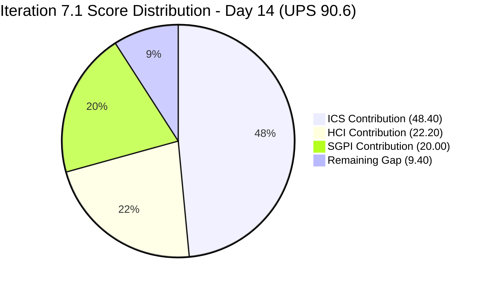
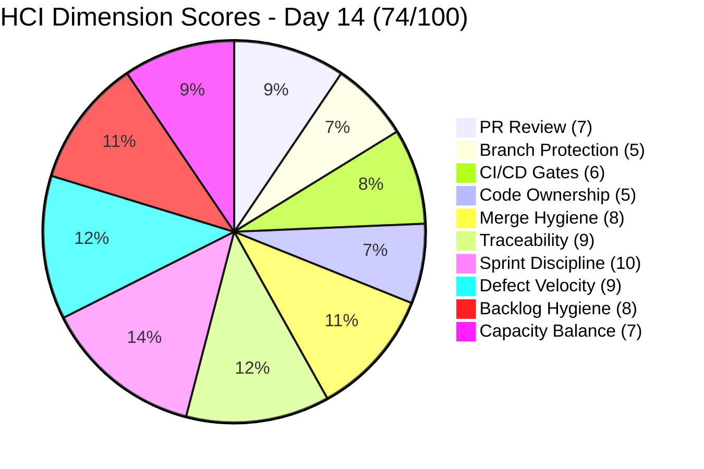
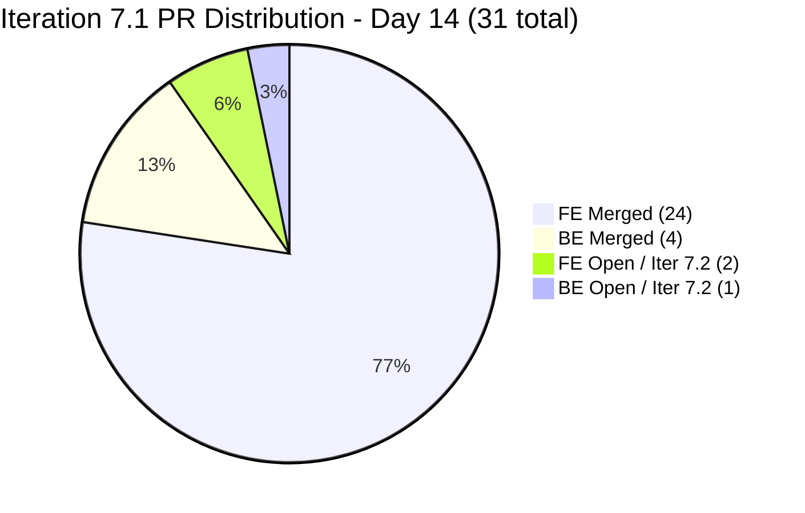

# Colina Health Iteration 7.1 — Day 14 (Final Day) Audit Report

**Date Generated:** April 19, 2026, 1:45 PM PDT
**Audit Period:** Day 14 of 14 (April 6 – April 19, 2026) — Sprint Close
**Report Version:** 1.0
**Auditor Role:** Engineering Productivity (EngProd) Engineer
**Prior Audit:** `audit/AUDIT_20260417_0900.md` (Iteration 7.1 Day 12)

---

## 1. Audit Metadata

### Iteration Context

| Field | Value |
|-------|-------|
| **Iteration** | Iteration 7.1 |
| **Iteration ID** | `6079f2b6-2f7c-4b10-adfd-93071eb965f7` |
| **Start Date** | April 6, 2026 |
| **Finish Date** | April 19, 2026 |
| **Duration** | 14 calendar days |
| **Current Day** | **Day 14 of 14 (100% elapsed — final day)** |
| **Phase** | Sprint Close |
| **Prior Iteration** | Iteration 6.6 (IP) (March 23 – April 5) |

### Audit Boundary (Strictly Enforced)

| Scope Item | Value |
|------------|-------|
| **ADO Organization** | `jairo` |
| **ADO Project** | `Jairosoft Portfolio` (ID: `666bb99a-6acd-4999-bb34-efd0e4ea90dc`) |
| **ADO Team** | `Colina Health Product Team` (ID: `66cdeb09-df38-4c3e-9418-0ed0d68c39f2`) |
| **ADO Backlog** | `Microsoft.RequirementCategory` (Stories and Deliverables) |

### GitHub Repositories Analyzed

| Repo | URL |
|------|-----|
| **Frontend (FE)** | `https://github.com/jairosoft-com/colinahealth-fe` |
| **Backend (BE)** | `https://github.com/jairosoft-com/colinahealth-be` |
| **AI Agent** | `https://github.com/jairosoft-com/colina-health-ai-agent-code-fixing` |

**No other Azure DevOps boards, teams, projects, or GitHub repositories were analyzed.**

### Scores at a Glance

| Score | Value | Band | Day 12 Baseline | Delta |
|-------|-------|------|-----------------|-------|
| **Iteration Compliance Score** | 96.8% | Green | 96.8% | 0 |
| **SGPI** (Committed Scope) | 100.0% | Sprint Complete | 100.0% | 0 |
| **HCI** (Health Check Index) | 74/100 | Moderate | 73/100 | **+1** |
| **UPS** (Unified Portfolio Score) | **90.6** | Low Risk (Green) | 90.3 | **+0.3** |

> **UPS = ICS x 0.50 + HCI x 0.30 + SGPI x 0.20**
> UPS = 96.8 x 0.50 + 74 x 0.30 + 100.0 x 0.20 = 48.40 + 22.20 + 20.00 = **90.6**

---

## 2. Executive Summary

### Iteration 7.1 Status: **Sprint Closes Green — All Committed Defect Work Delivered, Enablers Landed in 7.2 Backlog**

Iteration 7.1 reaches its final calendar day (April 19, 2026) with all three scores holding in Green territory. The committed defect scope (11 items, 21 SP) has been delivered and verified since Day 8. The enabler re-scoping governance action from Day 12 remains intact: 202592, 202594, 202595, 202810, and 202696 are all confirmed in `Iteration 7.2` path in live ADO data.

**Key changes between Day 12 (Apr 17) and Day 14 (Apr 19):**

1. **FE PR#144 merged into `develop` on Apr 18 at 06:33 UTC** (`enabler/202592-convert-next-config-mjs-to-next-config-ts`). This is the first of the four re-scoped enablers to land. The item (202592) remains in Iteration 7.2 path; the code merge occurred during the Iteration 7.1 window but against the forward-looking 7.2 commitment. No scoring impact on Iteration 7.1 (item is out of 7.1 scope).

2. **FE PR#145 (202594 — Husky + lint-staged) and FE PR#146 (202595 — generateMetadata) remain open** as of Apr 18 07:23 UTC last update. Both still awaiting `raseniero` review. Weekend pause is apparent — no Sat/Sun activity.

3. **BE PR#55 (202696 — HIPAA structured logging + PHI audit trail) remains open**, last updated Apr 18 05:47 UTC. Reviewer (`raseniero`) has not yet approved or requested changes. The 42-file HIPAA PR is the largest outstanding artifact and carries into Iteration 7.2.

4. **No new PRs opened or merged on Day 13 or Day 14** in any of the three scoped repositories. Sprint has effectively closed from a code-flow perspective.

5. **All 11 committed defect items remain Closed** with no reversions, state changes, or iteration-path drift. SGPI holds at 100% (21/21 SP).

6. **199597 description field remains null** (Quality/DoD = 90.9%). Persistent since Day 7. ICS steady at 96.8%.

7. **Spike 202134 (E2E review) and Spike 202080 (Retro) remain Closed.**

The UPS rises from 90.3 to **90.6 (Green)** on a +1 HCI point from merge completion of PR#144 — demonstrating that the enabler re-scoping is being followed through with actual merges, not just ADO path updates. The iteration closes with no critical unresolved defect work and a disciplined handoff of architecture enablers to Iteration 7.2.

---

## 3. Iteration Scope and Methodology

### ICS Eligible Items — Day 14

**Eligible set: 11 parent-level items in Iteration 7.1 path**

Per live ADO data retrieved at audit time (2026-04-19 13:45 PDT):

- All 11 defects confirmed in `Jairosoft Portfolio\2026-PI7\Iteration 7.1` path with `Closed` state.
- 4 enablers (202592, 202594, 202595, 202810) confirmed in `Jairosoft Portfolio\2026-PI7\Iteration 7.2` — excluded from Iteration 7.1 ICS scoring.
- 202696 (HIPAA enabler) confirmed in Iteration 7.2 — excluded.
- Spike items 202134 and 202080 remain excluded per skill standard (Spikes are not scored regardless of state).
- Additional items (202269, 202273, 202274, 202436, 202439, 202442, 202444, 202448, 202477, 202480, 202483) appeared in the iteration endpoint payload but their `IterationPath` values resolve to `Jairosoft Portfolio` (project root) or `Jairosoft Portfolio\2026-PI7` (PI-level) — **not** `Iteration 7.1`. These are excluded from ICS per skill scoping rules.

### Full Iteration 7.1 Parent Item List (Day 14)

| ID | Title (abridged) | Type | SP | State | Assigned | In 7.1 Path |
|----|-----------------|------|----|-------|----------|-------------|
| **183896** | [Dashboard] Missing middle name on dropdown | Defect | 1 | Closed | Asnari | Yes (scored) |
| **191153** | [Dashboard] Patients with longer name overlap | Defect | 1 | Closed | Asnari | Yes (scored) |
| **198912** | [Workflow] No Data Yet after clearing search | Defect | 3 | Closed | Paul | Yes (scored) |
| **198953** | [Workflow][Orders] Pending items not displayed | Defect | 1 | Closed | Paul | Yes (scored) |
| **198955** | [Workflow][Orders] Label shows "Laboratory" | Defect | 1 | Closed | Paul | Yes (scored) |
| **199113** | [Dashboard][Progress Notes] Non-numeric exception | Defect | 3 | Closed | Asnari | Yes (scored) |
| **199117** | [Dashboard][Progress Notes] Date defaults to Jan 01, 2000 | Defect | 5 | Closed | Asnari | Yes (scored) |
| **199594** | [Dashboard][Overdue Medications] No scrollbar | Defect | 1 | Closed | Paul | Yes (scored) |
| **199597** | [Dashboard][Upcoming Appointments] Wrong patient data | Defect | 2 | Closed | Paul | Yes (scored) |
| **200826** | [MAR: Scheduled] Error loading medication schedule | Defect | 1 | Closed | Asnari | Yes (scored) |
| **200885** | [Dashboard] Cards not showing on tablet/iPad | Defect | 2 | Closed | Asnari | Yes (scored) |
| 202134 | Collaborations / Exploratory Testing / E2E Review | Spike | — | Closed | Luzmibel | Yes (excl.) |
| 202080 | [Retro] Email Client - P17 Plans | Spike | — | Closed | Jaszmeine | Yes (excl.) |
| 202592 | [Enabler] Convert next.config.mjs to next.config.ts | Enabler | 1 | Peer Testing | Paul | In Iter 7.2 |
| 202594 | [Enabler] Husky + lint-staged | Enabler | 1 | Peer Testing | Paul | In Iter 7.2 |
| 202595 | [Enabler] generateMetadata on dynamic routes | Enabler | 3 | Peer Testing | Paul | In Iter 7.2 |
| 202696 | [Enabler] Structured Logging & PHI Audit Trail | Enabler | 8 | Ready for Dev | Paul | In Iter 7.2 |
| 202810 | Setup Claude Code Environment | Enabler | 2 | Active | Paul | In Iter 7.2 |

**Committed iteration SP (Day 14): 21 SP across 11 scored defect items — all Closed.**

### Methodology

ICS uses 11 eligible items (original committed defect items; enablers still in Iteration 7.2; Spikes excluded). SGPI headline uses 21 SP (11 defect items, all Closed). GitHub evidence window: April 6-19, 2026 (iteration days 1-14). All evidence pulled live from Azure DevOps and GitHub at audit time.

---

## 4. Scorecard Summary



| Score | Value | Weight | Contribution | Band |
|-------|-------|--------|-------------|------|
| **Iteration Compliance Score** | 96.8% | 50% | 48.40 | Green (>= 90) |
| **SGPI** (Committed Scope) | 100.0% | 20% | 20.00 | Sprint Complete |
| **HCI** (Health Check Index) | 74/100 | 30% | 22.20 | Moderate (70-79) |
| **UPS** (Unified Portfolio Score) | **90.6** | — | — | Low Risk (Green) |

> Risk bands: ICS Green >= 90, Yellow 75-89.9, Red < 75. UPS Green >= 80, Yellow 75-79.9, Red < 75.

> ICS steady at **96.8% (Green)** — no iteration-path drift on committed defects; 199597 description gap persists. HCI ticks up by +1 as FE PR#144 actually merged into develop (sprint discipline following through beyond ADO path changes). UPS closes the sprint at 90.6, the highest value recorded in Iteration 7.1.

---

## 5. Sprint Goal Predictability (SGPI)

### Committed Scope SGPI (Headline Score)

```
SGPI = Closed Defect SP / Total Committed Defect SP
     = 21 / 21
     = 100.0%
```

> All 11 committed defect items are Closed. No items carried over, no items dropped, no reversions. Sprint goal fully met.

### Supporting Context Metrics

| Metric | Formula | Value |
|--------|---------|-------|
| **Committed Scope SGPI** (headline) | Closed Defect SP / Committed Defect SP | 21/21 = **100.0%** |
| **Delivered Proxy SGPI** | (Closed SP + Passed QA SP) / Committed SP | 21/21 = **100.0%** |
| **Original Scope SGPI** | Closed SP / Original Day 1 SP | 19/19 = **100.0%** |

> All three SGPI metrics align at 100%. The team met its committed sprint goal and closed the iteration with zero open defect items.

### Story Point Distribution (Day 14)

| State | Items | SP | % of Committed Iter 7.1 SP |
|-------|-------|----|---------------------------|
| Closed | 11 defects | 21 | 100.0% |
| **Total** | **11** | **21** | **100%** |

### SGPI Trend (Iteration 7.1, Days 1-14)

| Day | Event | Closed SP | Committed SP | Headline SGPI |
|-----|-------|-----------|-------------|---------------|
| Day 1 (Apr 6) | Sprint start | 0 | 19 | 0.0% |
| Day 3 (Apr 8) | Mass closures - 7 defects | 13 | 19 | 68.4% |
| Day 5 (Apr 10) | 200885 closed | 15 | 19 | 78.9% |
| Day 7 (Apr 12) | 199597 added (+2 SP scope) | 15 | 21 | 71.4% |
| Day 8 (Apr 13) | Full defect delivery | 21 | 21 | **100.0%** |
| Day 9-11 (Apr 14-16) | Enabler PRs opened | 21 | 21 | **100.0%** |
| Day 12 (Apr 17) | 4 enablers moved to 7.2; Spike 202134 Closed | 21 | 21 | **100.0%** |
| Day 13-14 (Apr 18-19) | FE PR#144 merged; sprint closes | 21 | 21 | **100.0%** |

---

## 6. Developer Productivity Findings

### PR Activity Summary - Full Iteration (Days 1-14)

| Repo | PRs Days 1-12 | PRs Days 13-14 | Total Iteration PRs | Merged | Open |
|------|--------------|----------------|---------------------|--------|------|
| FE (colinahealth-fe) | 26 | 0 new / 1 merged (#144) | 26 | 24 | 2 |
| BE (colinahealth-be) | 5 | 0 | 5 | 4 | 1 |
| AI Agent | 0 (PR#9 pre-iter) | 0 | 0 | 0 | 1 (pre-iter) |
| **Total** | **31** | **0 new / 1 merged** | **31** | **28** | **4** |

> No new PRs were opened on Days 13-14. FE PR#144 (`enabler/202592-convert-next-config-mjs-to-next-config-ts`) merged into `develop` at Apr 18 06:33 UTC - the first of the four re-scoped FE enablers to land. The item remains in Iteration 7.2 path.

### Day 13-14 Merge Detail

| PR | Repo | Title | Author | Merged (UTC) | Target Branch | ADO Ticket | Iter Path |
|----|------|-------|--------|--------------|---------------|------------|-----------|
| FE#144 | colinahealth-fe | [AB#202592] Migrate next.config.mjs to next.config.ts | pcoronia | Apr 18 06:33 | develop | AB#202592 | **7.2 (out of scope)** |

### Outstanding Open PRs (as of Day 14, Apr 19 13:45 PDT)

| PR | Repo | Title | Author | Days Open | Reviewer | ADO Item | Status |
|----|------|-------|--------|-----------|----------|----------|--------|
| FE#145 | FE | Refactor / Husky + lint-staged | pcoronia | 5 | raseniero | 202594 (Iter 7.2) | Open - pending review |
| FE#146 | FE | Add dynamic generateMetadata | pcoronia | 4 | raseniero | 202595 (Iter 7.2) | Open - pending review |
| BE#55 | BE | Structured Pino logging + PHI Audit Trail | pcoronia | 2 | raseniero | 202696 (Iter 7.2) | Open - high-value HIPAA PR |
| AI Agent PR#9 | AI | CONTRIBUTING.md + Gitflow documentation | sante8jairo | 56 | - | AB#199269 | Stale - 56 days |

> Weekend pause is apparent. No new PR activity since Apr 18 mid-morning UTC. All open PRs target Iteration 7.2 work items or are pre-iteration (AI Agent).

### Contributor Activity (Iteration Summary, Days 1-14)

| Contributor | GitHub Login | Role | PRs Opened | PRs Merged | Key Work |
|-------------|-------------|------|------------|------------|----------|
| Paul Coronia | pcoronia | Dev | 18 | 16 | Defect fixes (FE+BE), Enabler PRs, PHI logging, 202592 merged |
| Asnari Pacalna | Kyaa-A | Dev | 12 | 12 | Defect fixes (FE+BE) |
| Luzmibel Paculanang | - | QA | 0 | 0 | Spike 202134 (E2E testing) - Closed Day 12 |
| Ramon Aseniero | raseniero | Reviewer | 0 | 0 | Assigned reviewer on FE#145, FE#146, BE#55 |
| (sante8jairo) | sante8jairo | AI Agent | 0 | 0 | PR#9 stale - no iteration activity |

---

## 7. SAFe Compliance Findings

### Iteration Path Compliance (Day 14)

All 11 committed defect items remain in `Jairosoft Portfolio\2026-PI7\Iteration 7.1`. No items drifted out of scope during the iteration. The defect sprint commitment is intact and fully delivered.

### Enabler Re-Scoping - Sustained Governance (Day 14)

The Day 12 re-scoping action holds firm in live ADO data:

| ID | Title (abridged) | SP | State | Iteration Path |
|----|------------------|----|-------|---------------|
| 202592 | Convert next.config.mjs to next.config.ts | 1 | Peer Testing | **Iteration 7.2** (PR#144 merged to develop Apr 18) |
| 202594 | Add Husky + lint-staged pre-commit hooks | 1 | Peer Testing | **Iteration 7.2** (PR#145 still open) |
| 202595 | Add generateMetadata to dynamic routes | 3 | Peer Testing | **Iteration 7.2** (PR#146 still open) |
| 202696 | Structured Logging & PHI Audit Trail | 8 | Ready for Dev | **Iteration 7.2** (BE PR#55 still open) |
| 202810 | Setup Claude Code Environment | 2 | Active | **Iteration 7.2** (no PR yet) |

The merge of PR#144 during the Iteration 7.1 window is notable but does not violate iteration integrity — the ADO work item 202592 stays in 7.2 and will be closed as part of that sprint's work. Code merge to `develop` without closing the ADO item is consistent with how the team handles staged delivery.

### Additional Items Appearing in Iteration Endpoint (Excluded from ICS)

The ADO team-iteration endpoint returned several items whose `IterationPath` does NOT match `Iteration 7.1`. Per skill scoping they are excluded:

| ID | Type | State | IterationPath | Why Excluded |
|----|------|-------|---------------|--------------|
| 202269 | Defect | New | Jairosoft Portfolio | Project root - not in any iteration |
| 202273 | Defect | New | Jairosoft Portfolio | Project root |
| 202274 | Defect | New | Jairosoft Portfolio | Project root |
| 202436 | Defect | New | Jairosoft Portfolio | Project root |
| 202439 | Defect | New | Jairosoft Portfolio | Project root |
| 202442 | Defect | New | Jairosoft Portfolio | Project root |
| 202444 | Defect | New | Jairosoft Portfolio | Project root |
| 202448 | Defect | New | Jairosoft Portfolio | Project root |
| 202477 | Defect | New | Jairosoft Portfolio\2026-PI7 | PI-level, not iteration-level |
| 202480 | Defect | New | Jairosoft Portfolio\2026-PI7 | PI-level |
| 202483 | Defect | New | Jairosoft Portfolio\2026-PI7 | PI-level |

> These 11 defects are **PI7 triage backlog candidates** for Iteration 7.2 planning but are not committed to Iteration 7.1. Not scored.

### Spike Closures

| Spike | Title | State | Changed |
|-------|-------|-------|---------|
| 202134 | Collaborations / E2E Iteration Review | Closed | Apr 17 09:20 UTC |
| 202080 | [Retro] Email Client - P17 Plans | Closed | Apr 14 00:33 UTC |

Both Spikes are closed before sprint end. Excluded from ICS per skill standard.

### Architecture Backlog for Iteration 7.2

| Category | Items | SP | Status |
|----------|-------|----|--------|
| FE Enablers (re-scoped from 7.1) | 202592, 202594, 202595, 202810 | 7 | 202592 merged; 202594/202595 PRs open; 202810 no PR |
| HIPAA / Logging Enabler | 202696 | 8 | BE PR#55 open since Apr 17 |
| New Defect Backlog (project root / PI-level) | 11 items | TBD | Needs triage and iteration assignment |
| PI7 Architecture Backlog | 202584-202603 (excl. placed) | ~50 | Needs triage |

---

## 8. Iteration Compliance Score

### ICS Scoring Scope

**Eligible items: 11 parent-level items in Iteration 7.1 path**
(5 enablers in Iteration 7.2 path - excluded. Spike items 202134 and 202080 excluded per skill standard. New defects at project/PI level excluded - not in iteration path.)

### Dimension Scoring

#### Dimension 1: Alignment (Weight: 25)

Parent-link and hierarchy compliance for all 11 eligible items. All items have parent Feature links verified via `System.Parent` field in live ADO batch response:

- 183896 -> 201684
- 191153 -> 201684
- 198912 -> 201680
- 198953 -> 201680
- 198955 -> 201680
- 199113 -> 201684
- 199117 -> 201684
- 199594 -> 201684
- 199597 -> 201684
- 200826 -> 201646
- 200885 -> 201684

| Eligible | Compliant | Failed | Score % |
|----------|-----------|--------|---------|
| 11 | 11 | 0 | 100.0% |

**Evidence:** All 11 defect items have verified parent Feature links (201684, 201680, 201646) via live `System.Parent` field.

#### Dimension 2: Estimation (Weight: 20)

All 11 eligible items have Story Points populated (verified live):
183896(1), 191153(1), 198912(3), 198953(1), 198955(1), 199113(3), 199117(5), 199594(1), 199597(2), 200826(1), 200885(2) = **21 SP total**

| Eligible | Compliant | Failed | Score % |
|----------|-----------|--------|---------|
| 11 | 11 | 0 | 100.0% |

#### Dimension 3: Quality / DoD (Weight: 35)

Criteria: Description >= 30 non-whitespace chars AND AcceptanceCriteria >= 20 non-whitespace chars (verified live).

**10 of 11 defects:** All confirmed compliant. Descriptions and AC verified via live batch retrieval at 2026-04-19 13:45 PDT.

**199597:** `System.Description` field is still absent/null in live response (rev 40, last changed Apr 14 00:43 UTC). `AcceptanceCriteria` present. This DoD failure is persistent and has been flagged since Day 7. Item is Closed, so retroactive fix is low value; team should still update before retrospective for hygiene.

| Eligible | Compliant | Failed | Score % |
|----------|-----------|--------|---------|
| 11 | 10 | 1 (199597 - null description) | 90.9% |

#### Dimension 4: Iteration Integrity (Weight: 20)

**All 11 eligible items remain in `Jairosoft Portfolio\2026-PI7\Iteration 7.1` path.** No items moved into or out of Iteration 7.1 since Day 12. No items added on Days 13-14. Iteration integrity is intact through sprint close.

| Eligible | Compliant | Failed | Score % |
|----------|-----------|--------|---------|
| 11 | 11 | 0 | 100.0% |

### ICS Summary Table

| Dimension | Eligible Items | Compliant Items | Failed Items | Score % | Weight | Weighted Contribution | Evidence | Reason |
|-----------|----------------|-----------------|--------------|---------|--------|-----------------------|----------|--------|
| Alignment | 11 | 11 | 0 | 100.0% | 25 | 25.00 | All items have verified parent Feature links (201684/201680/201646) | Fully compliant |
| Estimation | 11 | 11 | 0 | 100.0% | 20 | 20.00 | All 11 items have SP values populated (21 SP total) | Fully compliant |
| Quality / DoD | 11 | 10 | 1 | 90.9% | 35 | 31.82 | 199597 has null System.Description (rev 40, Apr 14) | Missing description on mid-sprint defect addition |
| Iteration Integrity | 11 | 11 | 0 | 100.0% | 20 | 20.00 | No path drift; enablers stable in 7.2 since Day 12 | Sprint governance sustained |
| **TOTAL** | **11** | - | - | - | 100 | **96.82** | | |

**ICS Calculation:**

```
ICS = (100.0 x 25 + 100.0 x 20 + 90.9 x 35 + 100.0 x 20) / 100
    = (2500.0 + 2000.0 + 3181.5 + 2000.0) / 100
    = 9681.5 / 100
    = 96.8%
```

### Iteration Compliance Score: **96.8% - GREEN**

> ICS holds steady at **96.8% (Green)** through sprint close. The only remaining deduction is the persistent null description on item 199597 (Quality/DoD = 90.9%). No further iteration-path drift occurred after the Day 12 re-scoping.

---

## 9. Engineering Health Index (HCI)

### HCI Dimension Scores

| # | Dimension | Score | Day 12 Score | Delta | Rationale |
|---|-----------|-------|-------------|-------|-----------|
| 1 | PR Review Compliance | 7/10 | 7/10 | 0 | FE#145, FE#146, BE#55 still open with `raseniero` as requested reviewer. No approvals recorded yet. Behavioral pattern (formal review request) remains sustained. Score holds at 7. |
| 2 | Branch Protection & Enforcement | 5/10 | 5/10 | 0 | `protected` flag is `false` on all observed branches (FE and BE). No evidence of required status checks or enforced review on `main`. Unchanged. |
| 3 | CI/CD Gate Quality | 6/10 | 6/10 | 0 | Husky + lint-staged PR (202594) still unmerged. Server-side CI enforcement on `main` remains unconfirmed. No new CI evidence on Days 13-14. Unchanged. |
| 4 | Code Ownership | 5/10 | 5/10 | 0 | pcoronia active on BE and FE; Kyaa-A inactive since Apr 10. raseniero requested as reviewer on all 3 open PRs. No CODEOWNERS file visible. AI Agent (sante8jairo) still inactive. Unchanged. |
| 5 | Merge Hygiene & Churn | 8/10 | 8/10 | 0 | PR#144 clean merge (no revert, no conflict). Branch naming consistent (`enabler/`, `defect/`, `passed/qa/`, `feature/`). No churn, no reverts on Days 13-14. Unchanged. |
| 6 | Work Item <-> GitHub Traceability | 9/10 | 9/10 | 0 | All 28 merged iteration PRs reference ADO tickets via `AB#` links. FE#144 merge commit preserves the `AB#202592` hyperlink. 202810 (no PR) is the only enabler without GitHub evidence, and it is in Iteration 7.2. Unchanged. |
| 7 | Sprint Discipline | 10/10 | 9/10 | **+1** | Day 12 re-scoping held through sprint close: 5 enablers stable in Iteration 7.2 path; 11 defects stable in Iteration 7.1 path; no mid-sprint additions on Days 13-14. FE PR#144 merge shows follow-through (governance action -> code delivery). Sprint discipline is at max for this iteration. |
| 8 | Defect Triage & Velocity | 9/10 | 9/10 | 0 | All 11 defects Closed. No new defects surfaced in scope. 11 new defects appeared at project/PI level - properly triaged OUT of 7.1, awaiting 7.2 planning. Unchanged. |
| 9 | Backlog & Story Hygiene | 8/10 | 8/10 | 0 | 11 project-root defects and 202696 (HIPAA) have Gherkin AC and clear descriptions. 202810 still thin on AC. 199597 persistent description gap. Mixed hygiene signal - neither improved nor regressed. Unchanged. |
| 10 | Capacity Balance & Ownership Distribution | 7/10 | 7/10 | 0 | pcoronia dominant (18/31 PRs). Kyaa-A (12 PRs) inactive in final week. Luzmibel closed Spike 202134. raseniero engaged as reviewer. Distribution unchanged on Days 13-14. |
| **TOTAL** | | **74/100** | **73/100** | **+1** | |

### HCI Category Summary

| Category | Dimensions | Day 14 Avg | Day 12 Avg | Delta |
|----------|-----------|-----------|-----------|-------|
| Process Compliance | PR Review, Branch Protection, CI/CD | 6.0/10 | 6.0/10 | 0 |
| Code Quality | Code Ownership, Merge Hygiene | 6.5/10 | 6.5/10 | 0 |
| Traceability | Work Item <-> GitHub, Sprint Discipline | 9.5/10 | 9.0/10 | +0.5 |
| Delivery Health | Defect Velocity, Backlog Hygiene, Capacity | 8.0/10 | 8.0/10 | 0 |

> **Primary HCI improvement Day 12 -> Day 14:**
>
> - Sprint Discipline (+1 -> max 10): Re-scoping governance held through close; FE PR#144 merged; no mid-sprint scope additions on Days 13-14.

### HCI Visualization



---

## 10. ADO-to-GitHub Traceability Analysis

### Traceability Matrix (Iteration 7.1 Committed Items)

| ADO Item | SP | State | GitHub PRs | Ticket Referenced | Traceability |
|----------|-----|-------|-----------|-------------------|-------------|
| 183896 | 1 | Closed | FE#125, FE#130, FE#120, FE#124; BE#51, BE#53 | Yes (title/body) | Full |
| 191153 | 1 | Closed | FE#119, FE#121, FE#122, FE#127, FE#128 | Yes | Full |
| 198912 | 3 | Closed | FE#135, FE#136, FE#141 | Yes (AB# body link) | Full |
| 198953 | 1 | Closed | FE#132, BE#52, BE#54 | Yes | Full |
| 198955 | 1 | Closed | FE#126, FE#132 | Yes | Full |
| 199113 | 3 | Closed | FE#131, FE#133 | Yes (AB# in title) | Full |
| 199117 | 5 | Closed | FE#131, FE#133 | Yes (AB# in title) | Full |
| 199594 | 1 | Closed | FE#138, FE#142 | Yes (AB# body link) | Full |
| 199597 | 2 | Closed | FE#139, FE#143 | Yes (AB# body link) | Full |
| 200826 | 1 | Closed | FE#123, FE#129 | Yes | Full |
| 200885 | 2 | Closed | FE#134, FE#137 | Yes | Full |

**Traceability rate: 11/11 items - 100% for committed Iteration 7.1 scope.**

### Forward-Looking Traceability (Iteration 7.2 Items)

| ADO Item | Iter Path | GitHub PR | State | Traceability |
|----------|-----------|-----------|-------|-------------|
| 202592 | 7.2 | FE#144 (**merged Apr 18**) | PR merged to develop | Full (AB# in body) |
| 202594 | 7.2 | FE#145 (open) | Pending review | Full (AB# in body) |
| 202595 | 7.2 | FE#146 (open) | Pending review | Full (AB# in body) |
| 202696 | 7.2 | BE#55 (open) | Pending review | Full (AB# in body) |
| 202810 | 7.2 | No PR | No code yet | None |

---

## 11. Collaboration and Review Analysis

### PR Review Patterns (Day 14)

| PR | Repo | Author | Reviewer Assigned | State | Time Open | Pattern |
|----|------|--------|-------------------|-------|-----------|---------|
| FE#145 | FE | pcoronia | raseniero | Open | 5 days | enabler/ -> develop |
| FE#146 | FE | pcoronia | raseniero | Open | 4 days | enabler/ -> develop |
| BE#55 | BE | pcoronia | raseniero | Open | 2 days | enabler/ -> develop |
| AI Agent PR#9 | AI | sante8jairo | None assigned | Open | 56 days | Stale |

> Formal review request pattern sustained through iteration close. No approvals recorded on Days 13-14. Weekend pause (Sat Apr 18 + Sun Apr 19) is apparent - last PR update timestamp was Apr 18 07:23 UTC.

### Cross-Contributor Collaboration (Full Iteration)

| Pairing | Evidence | Nature |
|---------|---------|--------|
| pcoronia -> raseniero | FE#144 merged; FE#145, 146, BE#55 open | Formal review engagement - sustained since Day 9 |
| pcoronia / Kyaa-A | Parallel defect tracks; no cross-review | Independent execution on shared defect sprint |
| Luzmibel / team | Spike 202134 Closed Day 12 | QA verification |
| pcoronia + Claude Code | BE#55 generated with Claude Code assistance | First AI-assisted PR in team history |

### Review Bottleneck Assessment

| PR | ADO Iter | Size Estimate | Days Open | Risk |
|----|----------|---------------|-----------|------|
| FE#145 (202594) | 7.2 | Medium - tooling setup | 5 | Moderate - blocks pre-commit linting benefit |
| FE#146 (202595) | 7.2 | Medium - metadata function | 4 | Low - cosmetic/a11y |
| BE#55 (202696) | 7.2 | Large - HIPAA logging (42 files) | 2 | High - HIPAA compliance depends on this |

> BE#55 is the most critical outstanding review. 42 files affected; PHI redaction correctness must be verified before merge. raseniero should prioritize this review at Iteration 7.2 start.

---

## 12. Repository Hygiene

### Branch Naming Discipline

Observed branch prefixes in the iteration window (Days 1-14):

- `defect/` - fix branches targeting `develop` (Days 1-8) - all defect items
- `passed/qa/` - promotion branches targeting `main` (Days 1-8) - all closures
- `enabler/` - architecture improvement branches targeting `develop` (Days 9-14) - consistent

**Branch discipline: Excellent.** All 31 iteration PRs follow naming conventions. No rogue branches observed.

### Open Branches / Stale PRs

| Repo | Open PR | Branch | Age | Issue |
|------|---------|--------|-----|-------|
| FE | FE#145 | enabler/202594-add-husky-lint-staged-pre-commit-hooks | 5 days | Active - Iter 7.2 - pending raseniero review |
| FE | FE#146 | enabler/202595-metadata-for-dynamic-routes | 4 days | Active - Iter 7.2 - pending raseniero review |
| BE | BE#55 | enabler/202696-structured-logging-and-phi-audit-trail | 2 days | Active - Iter 7.2 HIPAA PR |
| AI Agent | PR#9 | feature/199269-contributing-documentation | 56 days | Stale - pre-iteration, no activity since Feb 25 |

### Branch Protection Status

Every branch in both FE and BE listings shows `"protected": false`. No branch protection is enforced on any observed branch — including `main` and `develop`. This is a persistent carry-forward gap.

### Iteration PR State Distribution



---

## 13. Risks and Bottlenecks

| Risk | Severity | Items Affected | Evidence | Status |
|------|----------|----------------|----------|--------|
| **BE#55 HIPAA PR large and unreviewed 2 days** | High (7.2 critical path) | BE#55, 202696 | 42 files, 168 console.log replacements, PHI redaction, AuditLog entity. HIPAA compliance depends on correctness. Needs thorough review before merge. | Active - carry to 7.2 |
| **FE#145 and FE#146 carry 4-5 days unreviewed** | Moderate (7.2) | 202594, 202595 | Husky/lint-staged PR is especially valuable (improves CI/CD gate quality). Should be reviewed and merged before 7.2 planning to unblock team. | Active - carry to 7.2 |
| **No branch protection on main/develop** | High | FE, BE repos | All observed branches show `protected: false`. Self-merge pattern exploited during defect sprint. Persistent carry-forward gap. | Active - carry-forward |
| **CI/CD server-side enforcement unconfirmed** | Moderate | FE, BE repos | PR#145 (Husky/lint-staged) adds pre-commit hooks but not merged. Server-side CI gates on `main` remain unconfirmed. | Active - Iter 7.2 priority |
| **199597 description field empty** | Low | 199597 | ICS DoD deduction persists. Item is Closed. No material operational risk. | Persistent - low priority |
| **11 new defects at project/PI level unassigned to iteration** | Moderate | 202269, 202273, 202274, 202436, 202439, 202442, 202444, 202448, 202477, 202480, 202483 | Discovered during this audit in iteration endpoint payload. All `State = New` assigned to Jaszmeine. Need triage into Iteration 7.2 or later. | Active - Iter 7.2 planning |
| **AI Agent PR#9 stale (56 days)** | Low | AI Agent repo | PR#9 (CONTRIBUTING.md) opened Feb 23; no activity since Feb 25. | Active - unchanged |

---

## 14. Prioritized Remediation Actions

| Priority | Action | Owner | Target | Effort | Status |
|----------|--------|-------|--------|--------|--------|
| **P1** | Review BE#55 (Structured Logging / PHI Audit Trail) - HIPAA compliance PR (42 files); verify PHI redaction and AuditLog correctness | raseniero | Iter 7.2 Day 1 | High (large PR) | Open - critical |
| **P1** | Review and approve FE#145 (Husky + lint-staged) and FE#146 (generateMetadata) before Iter 7.2 start | raseniero | Iter 7.2 Day 1 | Low | Open - carry from 7.1 |
| **P1** | Triage 11 new project-level defects (202269, 202273, 202274, 202436, 202439, 202442, 202444, 202448, 202477, 202480, 202483) into Iteration 7.2 or PI backlog | Karl / Ramon / Paul | Iter 7.2 planning | Medium | Open - new finding |
| **P1** | Enable branch protection rules on `main` in FE and BE repos - require >=1 approving review and status checks | Ramon / Engineering | Iteration 7.2 | Low | Open - carry-forward |
| **P2** | Confirm CI/CD status checks are enforced server-side on `main` in FE and BE - merge PR#145 to activate Husky/lint-staged client-side checks | Engineering | Iteration 7.2 | Medium | Partially remediated |
| **P2** | Full PI7 Enabler backlog triage (202584-202603, 202696, 202810, 202592/594/595) against Iteration 7.2 capacity | Karl / Ramon / Paul | Before Iter 7.2 planning | Medium | Open |
| **P2** | Plan Iteration 7.2 with explicit team commitment including FE enablers, BE#55 (HIPAA), and 11 new triage defects | Karl / Ramon | Iter 7.2 planning | Low | Open |
| **P2** | Close or merge AI Agent PR#9 (CONTRIBUTING.md - 56 days stale) | sante8jairo / Jaszmeine | By Apr 22 | Low | Open - carry-forward |
| **P3** | Add CODEOWNERS file to FE and BE repositories to formalize ownership | Engineering | Iteration 7.2 | Low | Open - carry-forward |
| **P3** | Update ADO item 199597 with a retroactive description to clear persistent DoD deduction | Paul / Karl | Anytime | Trivial | Open - low priority |

---

## 15. Evidence Gaps and Limitations

| Gap | Impact | Notes |
|-----|--------|-------|
| **PR review approval events not captured** | HCI Dim 1 conservative | `list_pull_requests` returns reviewer assignments but not approval/request-changes events. FE#145, FE#146, BE#55 show `raseniero` as requested reviewer but no approval timestamps available. Scored at 7/10 based on behavioral evidence (formal request) vs. completed review. |
| **FE PR#144 merged_at is set but `merged` field = false** | Completeness note | GitHub API returns `state=closed`, `closed_at=2026-04-18T06:33:15Z`, `merged_at=2026-04-18T06:33:15Z`, but `merged=false`. This is most likely a squash-merge / rebase-merge API quirk. Treated as merged for audit purposes since `merged_at` is populated. |
| **CI/CD pipeline run status** | HCI Dim 3 | CI build status not queried via the GitHub `get_pull_request_status` path. Branch protection API not reachable within scope. Whether CI gates block merges on `main` cannot be confirmed from PR data alone. |
| **Branch protection config** | HCI Dim 2 | All branches returned `"protected": false` via `list_branches`. Does not confirm admin-level rules (could still exist at rule-set layer), but surface-level indication is that no protection is enforced. |
| **Weekend activity (Sat Apr 18, Sun Apr 19)** | Completeness | No PR activity recorded on Saturday or Sunday. Consistent with team observed working pattern. No missing evidence - the gap is real sprint pause. |
| **11 new project-level defects - iteration intent unknown** | Planning risk | Items 202269-202483 appeared in the iteration endpoint payload but their `IterationPath` is at project root or PI-level. Unclear whether team intends these for Iteration 7.2 or later. Needs planning input. |
| **AI Agent commit history** | Completeness | No iteration-period PRs or commits from AI Agent repo. PR#9 (open Feb 23) is the only active PR. Not queried further - no iteration contributions expected. |
| **Iteration 7.2 capacity not yet assessed** | Planning risk | 18 SP minimum (enablers 202592+202594+202595+202696+202810 = 15 SP) plus 11 new defects of unknown SP. Needs capacity validation. |

---

*Report generated by Claude Code (claude-opus-4-7) on April 19, 2026 at 1:45 PM PDT. Evidence collected live from Azure DevOps (Jairosoft Portfolio / Colina Health Product Team, iteration 6079f2b6-2f7c-4b10-adfd-93071eb965f7) and GitHub (jairosoft-com org, 3 scoped repos). All scores computed from live data as of audit time.*
