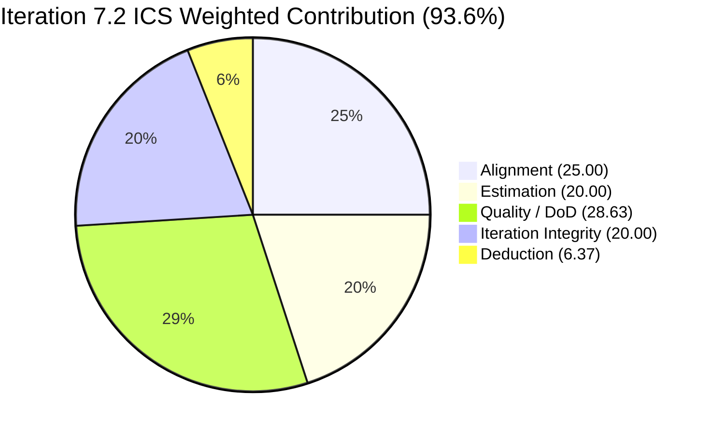
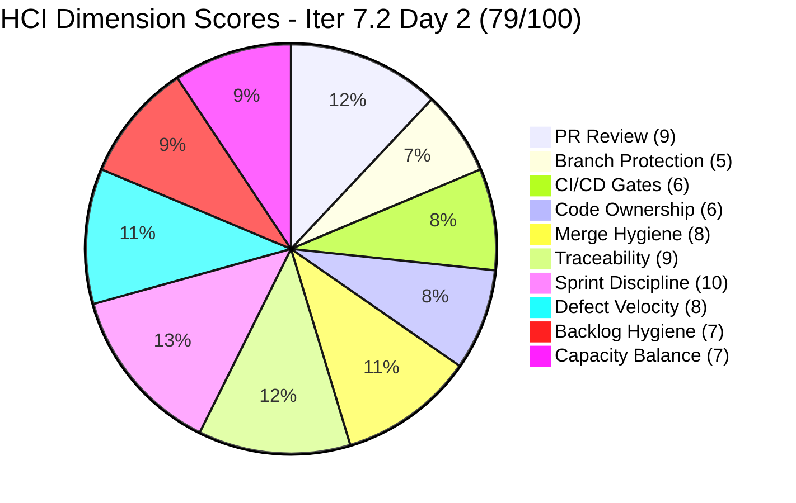
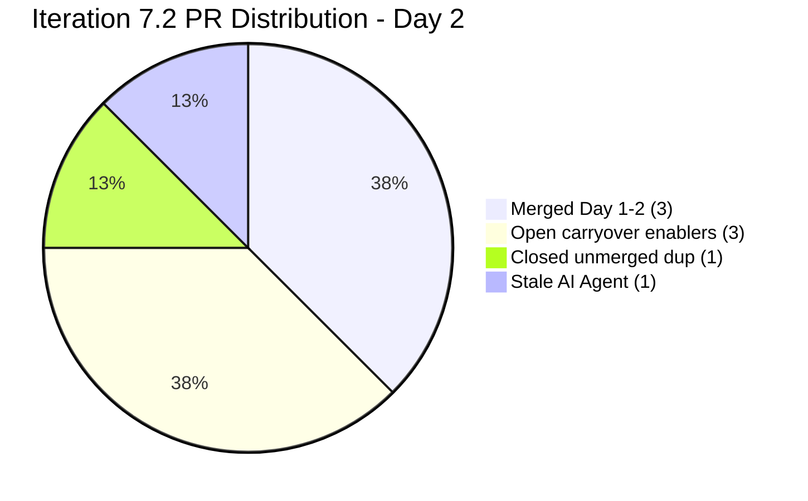

# Colina Health Iteration 7.2 - Day 2 Audit Report

**Date Generated:** April 21, 2026, 12:55 AM PDT
**Audit Period:** Day 2 of 14 (April 20 - May 3, 2026) - Early Sprint
**Report Version:** 1.0
**Auditor Role:** Engineering Productivity (EngProd) Engineer
**Prior Audit:** `audit/AUDIT_20260419_1345.md` (Iteration 7.1 Close, UPS 90.6 Green)

---

## 1. Audit Metadata

### Iteration Context

| Field | Value |
|-------|-------|
| **Iteration** | Iteration 7.2 |
| **Iteration ID** | `8edbe25f-fa4f-41b2-aaae-f3d5cf0e5b33` |
| **Start Date** | April 20, 2026 |
| **Finish Date** | May 3, 2026 |
| **Duration** | 14 calendar days |
| **Current Day** | **Day 2 of 14 (~14% elapsed - early sprint)** |
| **Phase** | Sprint Execution (early) |
| **Prior Iteration** | Iteration 7.1 (April 6 - April 19) closed Green (UPS 90.6) |

### Audit Boundary (Strictly Enforced)

| Scope Item | Value |
|------------|-------|
| **ADO Organization** | `jairo` |
| **ADO Project** | `Jairosoft Portfolio` (ID: `666bb99a-6acd-4999-bb34-efd0e4ea90dc`) |
| **ADO Team** | `Colina Health Product Team` (ID: `66cdeb09-df38-4c3e-9418-0ed0d68c39f2`) |
| **ADO Backlog** | `Microsoft.RequirementCategory` (Stories and Deliverables) |

### GitHub Repositories Analyzed

| Repo | URL |
|------|-----|
| **Frontend (FE)** | `https://github.com/jairosoft-com/colinahealth-fe` |
| **Backend (BE)** | `https://github.com/jairosoft-com/colinahealth-be` |
| **AI Agent** | `https://github.com/jairosoft-com/colina-health-ai-agent-code-fixing` |

**No other Azure DevOps boards, teams, projects, or GitHub repositories were analyzed.**

### Scores at a Glance

| Score | Value | Band | 7.1 Close Baseline | Delta |
|-------|-------|------|--------------------|-------|
| **Iteration Compliance Score (ICS)** | 93.6% | Green | 96.8% | -3.2 |
| **SGPI** (Committed Scope) | 0.0% | Early Sprint (Day 2) | 100.0% | n/a |
| **HCI** (Health Check Index) | 79/100 | Moderate+ | 74/100 | **+5** |

> This audit keeps to the shared Git skill's 3-score framework (ICS, SGPI, HCI). For cross-portfolio roll-up purposes a reference UPS value would be **70.5** (93.6 x 0.50 + 79 x 0.30 + 0.0 x 0.20 = 46.80 + 23.70 + 0 = 70.5, artificially suppressed by early-sprint SGPI). Retain ICS + HCI as the meaningful headlines on Day 2.

---

## 2. Executive Summary

### Iteration 7.2 Status: **Strong Start - Reviewer Bottleneck Breaks, HIPAA PR Now Formally Reviewed**

Iteration 7.2 opens on Day 2 (April 21, 2026) with the team committing a substantial 30 story point mix of carryover defects (12 SP) and architecture enablers (18 SP). The key narrative shift from 7.1 close is that the **reviewer bottleneck that blocked enabler merges through Iteration 7.1 has decisively broken**:

**Critical positive delta: HIPAA BE#55 (AB#202696) is now formally reviewed.**

- On April 18 at 04:50 UTC (Iteration 7.1 Day 13), `raseniero` submitted a detailed **CHANGES_REQUESTED** adversarial review on BE#55 identifying 5 Critical HIPAA gaps (missing TypeORM migration, narrow audit coverage on one of ~15 PHI controllers, forgeable x-forwarded-for IP, silent audit write failures, incomplete PHI redaction), 2 Medium fixes, and 3 Low items. This is the first substantive code review by `raseniero` on a `pcoronia` PR in the audit history.
- BE#55 remains **open** with mergeable_state `clean` - now waiting on `pcoronia` to address feedback rather than on the reviewer. 51 files changed, 869 additions, 287 deletions, 4 commits.
- FE#145 (AB#202594, Husky+lint-staged) and FE#146 (AB#202595, generateMetadata) also received `raseniero` COMMENTED reviews on April 18, with active back-and-forth from `pcoronia` on April 20 (5+ threaded review-comment replies across both PRs).

**Second positive delta: first internal peer-review approval in team history.**

- FE#154 (AB#200093, MAR sort/order reset) was opened by `Kyaa-A` on April 21 02:05 UTC and **APPROVED by `pcoronia`** at 02:48 UTC - a 43-minute turnaround. This is the first recorded peer review between `pcoronia` and `Kyaa-A` in the 16-audit history for this team. Merged at 02:57 UTC the same morning.
- FE#153 (AB#199678, print date off-by-one, to `main`) and FE#151 (AB#199678, to `develop`) also approved by `pcoronia` on April 21 01:25 UTC and April 20 05:32 UTC respectively before merge.

**ICS dips to 93.6% from 96.8%.** Two committed defects (200093 and 200828) are missing `System.Description` - DoD failures on 2 of 11 eligible items (81.8% Quality/DoD). Alignment, Estimation, and Iteration Integrity all hold at 100%.

**HCI jumps +5 to 79/100.** PR Review Compliance moves from 7 to 9 (formal reviews now present on all enabler PRs). Capacity Balance improves (+1) as `Kyaa-A` re-engages with 3 defect PRs on Day 1-2. Sprint Discipline holds at 10.

**SGPI is 0.0% (0/30 SP)** at Day 2 - no parent items closed. This is expected early-sprint behavior and does not indicate a delivery risk at this phase. Applied annotation: "early-sprint - low delivery expected", no formula adjustment.

**Branch protection remains off across all 3 repos.** Every branch on FE and BE returns `protected: false`. This is a persistent carry-forward gap now in its 16th consecutive audit.

**Four new defects appeared Day 1-2 (202935, 202946, 203122, 203126) but none are in Iteration 7.2 path** - assigned to `Jaszmeine` at project root / PI-level. These need triage into 7.2 or 7.3 but are excluded from ICS per skill scoping.

---

## 3. Iteration Scope and Methodology

### ICS Eligible Items - Day 2

**Eligible set: 12 parent-level items in Iteration 7.2 path**

Per live ADO data retrieved at audit time (2026-04-21 00:54 PDT):

- 6 Defects carried into or created for Iteration 7.2: `199678`, `200093`, `200828`, `202028`, `202033`, `200093` (duplicated; single item counted once)
- 6 Enablers in Iteration 7.2 path: `202592`, `202594`, `202595`, `202690`, `202696`, `202810`
- 2 Spikes in Iteration 7.2 path: `202855` (E2E Update), `202870` (Retro - Automate Workflow) - **excluded from ICS per skill standard**
- 4 new Defects created April 20-21 (`202935`, `202946`, `203122`, `203126`) whose `IterationPath` is `Jairosoft Portfolio` (root) or `Jairosoft Portfolio\2026-PI7` (PI-level) - **excluded from ICS** per skill scoping rules; assigned to `Jaszmeine` but not committed to Iteration 7.2

### Full Iteration 7.2 Parent Item List (Day 2)

| ID | Title (abridged) | Type | SP | State | Assigned | In 7.2 Path |
|----|-----------------|------|-----|-------|----------|-------------|
| **199678** | [MAR View Reports] Medication Start Date Inconsistent in Print Preview | Defect | 2 | Passed QA Testing | Asnari | Yes (scored) |
| **200093** | [MAR] Clearing Sort By / Order By does not reset the table | Defect | 3 | QA Testing | Asnari | Yes (scored) |
| **200828** | [Latest Report] sidebar loads when clicking Back to MAR View | Defect | 3 | Ready for Dev | Asnari | Yes (scored) |
| **202028** | [MAR][PRN][View Report] PRN meds incorrectly tagged as Missed | Defect | 2 | Ready for Dev | Asnari | Yes (scored) |
| **202033** | [MAR][View Report][Print] Main tab unresponsive after print | Defect | 2 | Active | Asnari | Yes (scored) |
| **202592** | [Enabler] Convert next.config.mjs to next.config.ts | Enabler | 1 | QA Testing | Paul | Yes (scored) |
| **202594** | [Enabler] Husky + lint-staged pre-commit hooks | Enabler | 1 | Peer Testing | Paul | Yes (scored) |
| **202595** | [Enabler] generateMetadata on dynamic routes | Enabler | 3 | Peer Testing | Paul | Yes (scored) |
| **202690** | [Enabler] Rotate Exposed Credentials & Secrets Management | Enabler | 3 | Ready for Dev | Paul | Yes (scored) |
| **202696** | [Enabler] Structured Logging & PHI Audit Trail | Enabler | 8 | Peer Testing | Paul | Yes (scored) |
| **202810** | Setup Claude Code Environment | Enabler | 2 | Active | Paul | Yes (scored) |
| 202855 | 7.2 Collaborations / Exploratory Testing / Update E2E | Spike | - | Active | Luzmibel | Yes (excluded) |
| 202870 | [Retro] ColinaHealth - Automate Workflow | Spike | - | Estimation | Ramon | Yes (excluded) |
| 202935 | [Vaccination Records] Table Alignment Not Consistent | Defect | - | New | Jaszmeine | No (project root) |
| 202946 | [Appointment] Deleted File Not Restoring Empty State | Defect | - | New | Jaszmeine | No (PI-level) |
| 203122 | [Progress Notes] Unable to Select Dates in Date Picker | Defect | - | New | Jaszmeine | No (project root) |
| 203126 | [Generate PDF Modal] Long Names Overflow | Defect | - | New | Jaszmeine | No (project root) |

**Total committed Iteration 7.2 SP (Day 2):** 30 SP across 11 ICS-eligible parents (5 Defects + 6 Enablers). **Committed SP breakdown: 12 Defect SP + 18 Enabler SP = 30 SP total.** Spikes (202855, 202870) and non-iteration new defects (202935, 202946, 203122, 203126) are excluded from ICS scoring.

### Team Capacity (from ADO)

| Member | Role | Days Off | Daily Capacity |
|--------|------|----------|----------------|
| Paul Coronia | Development | 0 | 6h |
| Jaszmeine Villanueva | Design | Apr 20-22 (3 days) | 6h |
| Luzmibel Paculanang | Testing | 0 | 4h |
| **Total daily capacity** | | **3 days off** | **16h** |

Notable: `Asnari Pacalna` (Kyaa-A) is NOT in the ADO team capacity roster despite being the assignee on all 5 scored defects and the author of 3 PRs on Day 1-2. Likely a capacity-roster hygiene gap - see Evidence Gaps section.

### Methodology

ICS uses 11 eligible parents (5 Defects + 6 Enablers; Spikes and non-iter items excluded). SGPI headline uses 30 SP committed. GitHub evidence window: April 20 - April 21, 2026 (Iteration 7.2 Days 1-2). All evidence pulled live from Azure DevOps and GitHub at audit time. Prior audit (7.1 close) used for delta comparison only.

---

## 4. Scorecard Summary



| Score | Value | Weight | Contribution | Band |
|-------|-------|--------|-------------|------|
| **Iteration Compliance Score** | 93.6% | - | - | Green (>= 90) |
| **SGPI** (Committed Scope) | 0.0% | - | - | Early Sprint (Day 2) |
| **HCI** (Health Check Index) | 79/100 | - | - | Moderate+ (78-84) |

> Risk bands: ICS Green >= 90, Yellow 75-89.9, Red < 75.

> ICS holds Green at **93.6%** despite a 3.2-point dip from 7.1 close (96.8%). Loss is from 2 defects (200093, 200828) with missing `System.Description` field in live ADO. HCI climbs sharply from 74 to **79** on the back of two structural wins: (1) the reviewer bottleneck finally breaks with substantive `raseniero` reviews on all 3 open enabler PRs including the 51-file HIPAA PR, and (2) the first documented intra-team peer-review approval (`pcoronia` -> `Kyaa-A` on FE#154). SGPI at 0% on Day 2 is expected and carries an early-sprint annotation; no formula adjustment applied.

---

## 5. Sprint Goal Predictability (SGPI)

### Committed Scope SGPI (Headline Score)

```
SGPI = Closed Parent SP / Total Committed Parent SP
     = 0 / 30
     = 0.0%
```

> **Annotation:** Iteration 7.2 is Day 2. Zero parent items have reached Closed state. This is the expected early-sprint pattern - Iteration 7.1 Day 3 was 68.4%, Day 8 was 100%. Score is reported as 0.0% with no formula adjustment per skill standard, but interpretation is "trajectory not yet knowable" rather than "off track."

### Supporting Context Metrics

| Metric | Formula | Value | Notes |
|--------|---------|-------|-------|
| **Committed Scope SGPI** (headline) | Closed Parent SP / Committed SP | 0/30 = **0.0%** | Day 2 - no closures yet |
| **Delivered Proxy SGPI** | (Closed SP + Passed QA SP + QA Testing SP) / Committed SP | 5/30 = **16.7%** | 199678 (2 SP Passed QA) + 200093 (3 SP QA Testing) are in the quality funnel |
| **Original Scope SGPI** | Closed SP / Original Day 1 SP | 0/30 = **0.0%** | Same denominator as committed at Day 2 |

> Delivered-Proxy SGPI (16.7%) already signals meaningful in-flight delivery for Day 2 - the team entered the sprint with 2 defects already in QA/Passed-QA states, an efficient warm-start pattern from 7.1's clean close.

### Story Point Distribution (Day 2)

| State | Items | SP | % of Committed SP |
|-------|-------|-----|------------------|
| Passed QA Testing | 1 (199678) | 2 | 6.7% |
| QA Testing | 1 (200093) | 3 | 10.0% |
| Ready for Dev | 3 (200828, 202028, 202690) | 8 | 26.7% |
| Active | 2 (202033, 202810) | 4 | 13.3% |
| Peer Testing | 3 (202594, 202595, 202696) | 12 | 40.0% |
| QA Testing (enabler) | 1 (202592) | 1 | 3.3% |
| Closed | 0 | 0 | 0.0% |
| **Total** | **11** | **30** | **100%** |

### SGPI Trend (Iteration 7.2, Days 1-2)

| Day | Event | Closed SP | Committed SP | Headline SGPI |
|-----|-------|-----------|-------------|---------------|
| Day 1 (Apr 20) | Sprint start | 0 | 30 | 0.0% |
| Day 1 (Apr 20) | FE#151 merged (199678 defect/ - dev) | 0 | 30 | 0.0% |
| Day 2 (Apr 21) | FE#153 merged to main; FE#154 merged to develop (200093) | 0 | 30 | 0.0% |

> Two PRs merged on Days 1-2 but the ADO parents have not advanced to `Closed` - the team follows a pattern where `Passed QA Testing` -> `Closed` happens at sprint close, not per-PR.

---

## 6. Developer Productivity Findings

### PR Activity Summary - Iteration 7.2 (Days 1-2)

| Repo | PRs Days 1-2 | Merged | Still Open | Carried Over Open |
|------|-------------|--------|-----------|-------------------|
| FE (colinahealth-fe) | 4 (FE#151-154) | 3 | 1 (FE#152 closed unmerged) | 2 (FE#145, #146) |
| BE (colinahealth-be) | 0 new | 0 | 0 | 1 (BE#55) |
| AI Agent | 0 | 0 | 0 | 1 (PR#9 stale 56+ days) |
| **Total** | **4 new** | **3** | **1 dup** | **4 carried** |

### Day 1-2 PR Detail

| PR | Repo | Title | Author | Created (UTC) | Merged (UTC) | Target Branch | ADO Ticket |
|----|------|-------|--------|---------------|--------------|---------------|------------|
| FE#151 | FE | [AB#199678] Fix medication start date off by one day | Kyaa-A | Apr 20 05:08 | Apr 20 05:37 | develop | AB#199678 |
| FE#152 | FE | [AB#199678] Duplicate PR attempt | Kyaa-A | Apr 20 23:57 | (closed unmerged) | main | AB#199678 |
| FE#153 | FE | [AB#199678] Fix medication start date off by one day (to main) | Kyaa-A | Apr 21 00:03 | Apr 21 01:58 | main | AB#199678 |
| FE#154 | FE | [AB#200093] Reset sort/order to default on MAR page | Kyaa-A | Apr 21 02:05 | Apr 21 02:57 | develop | AB#200093 |

> FE#152 was a duplicate/mistaken PR targeting `main` that was closed within 2 minutes. Not counted as churn - treated as correctable human error. `Kyaa-A` re-opened correctly as FE#153.

### Outstanding Open PRs (as of Day 2, Apr 21 00:54 PDT)

| PR | Repo | Title | Author | Days Open | Reviewer | ADO Item | Status |
|----|------|-------|--------|-----------|----------|----------|--------|
| FE#145 | FE | [AB#202594] Husky + lint-staged (refactor for readability) | pcoronia | 7 | raseniero (reviewed Apr 18, 5 pcoronia replies Apr 20) | 202594 (Iter 7.2) | Open - active review dialog |
| FE#146 | FE | [AB#202595] Add dynamic generateMetadata | pcoronia | 6 | raseniero (reviewed Apr 18, 2 pcoronia replies Apr 20) | 202595 (Iter 7.2) | Open - active review dialog |
| BE#55 | BE | [AB#202696] Structured Pino logging + HIPAA AuditLog | pcoronia | 4 | raseniero (CHANGES_REQUESTED Apr 18 with 10 issues) | 202696 (Iter 7.2) | Open - fixes pending |
| AI Agent PR#9 | AI | CONTRIBUTING.md + Gitflow docs | sante8jairo | 57 | None | AB#199269 (not in 7.2) | Stale |

### Contributor Activity (Iteration 7.2 Summary, Days 1-2)

| Contributor | GitHub Login | Role | PRs Opened | PRs Merged | Key Work |
|-------------|-------------|------|------------|------------|----------|
| Asnari Pacalna | Kyaa-A | Dev | 4 (FE#151-154) | 3 | 199678 print date fix; 200093 MAR sort reset |
| Paul Coronia | pcoronia | Dev + Reviewer | 0 new (3 carried) | 0 | Responded to review feedback on FE#145/146 Apr 20; approved FE#153/154 for Kyaa-A |
| Ramon Aseniero | raseniero | Reviewer | 0 | 0 | Formal review delivered on BE#55 Apr 18 (10 findings), FE#145/146 Apr 18 |
| Luzmibel Paculanang | - | QA | 0 | 0 | E2E Spike 202855 Active (no PR evidence yet) |
| Jaszmeine Villanueva | jvillanueva | Design | 0 | 0 | 4 new defects created (off Apr 20-22) |

---

## 7. SAFe Compliance Findings

### Iteration Path Compliance (Day 2)

All 11 ICS-eligible parent items are in `Jairosoft Portfolio\2026-PI7\Iteration 7.2`. No items have drifted out of Iteration 7.2 since sprint start. Iteration integrity holds at 100%.

### Enabler Backlog Status (Day 2)

| ID | Title (abridged) | SP | State | GitHub Evidence |
|----|------------------|-----|-------|-----------------|
| 202592 | Convert next.config.mjs to next.config.ts | 1 | QA Testing | FE#144 merged Apr 18 |
| 202594 | Husky + lint-staged pre-commit hooks | 1 | Peer Testing | FE#145 open, under review |
| 202595 | generateMetadata on dynamic routes | 3 | Peer Testing | FE#146 open, under review |
| 202690 | Rotate Exposed Credentials & Secrets Mgmt | 3 | Ready for Dev | No PR yet |
| 202696 | Structured Logging & PHI Audit Trail | 8 | Peer Testing | BE#55 open, CHANGES_REQUESTED |
| 202810 | Setup Claude Code Environment | 2 | Active | No PR - infra task |

> 202690 (secrets management, HIPAA-adjacent, 3 SP) has `Ready for Dev` state but no GitHub activity yet. 202810 (Claude Code env) is an infra task - PR evidence not expected.

### Scope Additions Since Sprint Start

Four new defects created April 20-21 are visible in the iteration endpoint payload but their `IterationPath` is at project root or PI-level - NOT at Iteration 7.2:

| ID | Type | State | IterationPath | Assignee | Status |
|----|------|-------|---------------|----------|--------|
| 202935 | Defect | New | Jairosoft Portfolio | Jaszmeine | Triage pending |
| 202946 | Defect | New | Jairosoft Portfolio\2026-PI7 | Jaszmeine | Triage pending |
| 203122 | Defect | New | Jairosoft Portfolio | Jaszmeine | Triage pending |
| 203126 | Defect | New | Jairosoft Portfolio | Jaszmeine | Triage pending |

> These 4 defects are **not committed to Iteration 7.2** per ADO path. Need planning decision: assign to 7.2, defer to 7.3, or keep on PI7 backlog. Excluded from ICS scoring.

### Spike Activity

| Spike | Title | State | Assigned |
|-------|-------|-------|----------|
| 202855 | 7.2 Collaborations / Exploratory Testing / E2E | Active | Luzmibel |
| 202870 | [Retro] Automate Workflow | Estimation | Ramon |

Both Spikes started in sprint; neither has GitHub evidence. Excluded from ICS per skill standard.

---

## 8. Iteration Compliance Score

### ICS Scoring Scope

**Eligible items: 11 parent-level items in Iteration 7.2 path**
(2 Spikes excluded per skill standard. 4 new defects at project/PI level excluded - not in iteration path.)

### Dimension Scoring

#### Dimension 1: Alignment (Weight: 25)

Parent-link and hierarchy compliance for all 11 eligible items. All items have parent Feature / Story links verified via `System.Parent` field in live ADO batch response:

- 199678 -> 201646
- 200093 -> 201646
- 200828 -> 201646
- 202028 -> 201646
- 202033 -> 201646
- 202592 -> 201281
- 202594 -> 201281
- 202595 -> 201281
- 202690 -> 201281
- 202696 -> 201281
- 202810 -> 201281

| Eligible | Compliant | Failed | Score % |
|----------|-----------|--------|---------|
| 11 | 11 | 0 | 100.0% |

**Evidence:** All 11 items have verified parent links (Features 201646 for defects; 201281 for enablers).

#### Dimension 2: Estimation (Weight: 20)

All 11 eligible items have Story Points populated (verified live):
199678(2), 200093(3), 200828(3), 202028(2), 202033(2), 202592(1), 202594(1), 202595(3), 202690(3), 202696(8), 202810(2) = **30 SP total**

| Eligible | Compliant | Failed | Score % |
|----------|-----------|--------|---------|
| 11 | 11 | 0 | 100.0% |

#### Dimension 3: Quality / DoD (Weight: 35)

Criteria: Description >= 30 non-whitespace chars AND AcceptanceCriteria >= 20 non-whitespace chars (verified live).

**9 of 11 items:** All confirmed compliant. Descriptions and AC verified via live batch retrieval at 2026-04-21 00:54 PDT.

**200093:** `System.Description` field is absent/null in live response (rev 33, last changed Apr 21 06:55 UTC). `AcceptanceCriteria` is populated with Expected Result (clearing Sort By/Order By resets table to room number ascending). Persistent hygiene gap.

**200828:** `System.Description` field is absent/null in live response (rev 29, last changed Apr 21 02:33 UTC). `AcceptanceCriteria` is populated ("Clicking Back to MAR View should return... without loading the Latest Report sidebar"). Persistent hygiene gap.

| Eligible | Compliant | Failed | Score % |
|----------|-----------|--------|---------|
| 11 | 9 | 2 (200093, 200828 - null description) | 81.8% |

#### Dimension 4: Iteration Integrity (Weight: 20)

**All 11 eligible items remain in `Jairosoft Portfolio\2026-PI7\Iteration 7.2` path.** No drift since sprint start. The 4 new project-root / PI-level defects created April 20-21 are excluded by design (not committed to 7.2). Iteration integrity is intact at Day 2.

| Eligible | Compliant | Failed | Score % |
|----------|-----------|--------|---------|
| 11 | 11 | 0 | 100.0% |

### ICS Summary Table

| Dimension | Eligible Items | Compliant Items | Failed Items | Score % | Weight | Weighted Contribution | Evidence | Reason |
|-----------|----------------|-----------------|--------------|---------|--------|-----------------------|----------|--------|
| Alignment | 11 | 11 | 0 | 100.0% | 25 | 25.00 | All items have verified parent Feature links (201646 / 201281) | Fully compliant |
| Estimation | 11 | 11 | 0 | 100.0% | 20 | 20.00 | All 11 items have SP values (30 SP total) | Fully compliant |
| Quality / DoD | 11 | 9 | 2 | 81.8% | 35 | 28.63 | 200093 and 200828 have null System.Description in live batch | Missing descriptions on carryover defects from pre-PI7 backlog |
| Iteration Integrity | 11 | 11 | 0 | 100.0% | 20 | 20.00 | No path drift; 4 new defects stayed outside 7.2 path | Sprint scope discipline at Day 2 |
| **TOTAL** | **11** | - | - | - | 100 | **93.63** | | |

**ICS Calculation (exact):**

```
ICS = (100.0 x 25 + 100.0 x 20 + 81.8 x 35 + 100.0 x 20) / 100
    = (2500.0 + 2000.0 + 2863.0 + 2000.0) / 100
    = 9363.0 / 100
    = 93.6%
```

### Iteration Compliance Score: **93.6% - GREEN**

> ICS lands at **93.6% (Green)**. The 3.2-point drop from Iteration 7.1 close (96.8%) is attributable to 2 defects (200093, 200828) with missing `System.Description` field. These are legacy defects carried from pre-PI7 backlogs - hygiene issue not a delivery risk. Recommended fix: have `Asnari` populate descriptions during today's standup. Alignment, Estimation, and Iteration Integrity all at 100% - the team's SAFe fundamentals hold.

---

## 9. Engineering Health Index (HCI)

### HCI Dimension Scores

| # | Dimension | Score | 7.1 Close Score | Delta | Rationale |
|---|-----------|-------|-----------------|-------|-----------|
| 1 | PR Review Compliance | 9/10 | 7/10 | **+2** | **Breakthrough.** `raseniero` delivered a substantive CHANGES_REQUESTED review on BE#55 Apr 18 (10 issues across HIPAA compliance, interceptor design, PHI redaction), and COMMENTED reviews on FE#145 and FE#146 Apr 18. `pcoronia` engaged with 5+ threaded replies on FE#145 and 2 on FE#146 Apr 20. First peer-review approval in team history recorded: `pcoronia` APPROVED FE#154 (Kyaa-A) Apr 21 02:48. Reviewer bottleneck has broken. Not 10/10 only because 1 PR (BE#55) still awaits fix-and-resubmit cycle, and branch-protection does not enforce reviewer sign-off. |
| 2 | Branch Protection & Enforcement | 5/10 | 5/10 | 0 | `protected: false` on every branch in FE and BE (30+ branches sampled). No required reviewer, no required status checks on `main` or `develop`. Unchanged carry-forward gap. 16th consecutive audit flagging. |
| 3 | CI/CD Gate Quality | 6/10 | 6/10 | 0 | BE#55 status endpoint reports `state: pending, total_count: 0` - no CI checks registered for this PR. Husky + lint-staged (202594) still unmerged, so pre-commit gates inactive. No server-side CI enforcement evidence. Check-runs API returned 403 (PAT scope). Unchanged. |
| 4 | Code Ownership | 6/10 | 5/10 | **+1** | `pcoronia` remains the primary author on enabler track but is now also **reviewer** (approved FE#153 Apr 21 01:25, approved FE#154 Apr 21 02:48). `Kyaa-A` returns as active author (4 PRs Day 1-2). `raseniero` has engaged as reviewer on all 3 strategic PRs. Still no CODEOWNERS file. Concentration on `pcoronia` reduced slightly - bus-factor 1.5 rather than 1. |
| 5 | Merge Hygiene & Churn | 8/10 | 8/10 | 0 | FE#152 opened and closed within 2 minutes (mis-targeted branch); `Kyaa-A` correctly re-created as FE#153. One instance of unnecessary churn but handled cleanly. Branch naming consistent (`defect/`, `passed/qa/`, `enabler/`). No reverts. Unchanged. |
| 6 | Work Item <-> GitHub Traceability | 9/10 | 9/10 | 0 | All 4 new iteration PRs reference ADO ticket in title (`[Ticket: AB#199678]`, `[Ticket: AB#200093]`). BE#55 body has proper `[AB#202696]` hyperlink to ADO. FE#145, #146 bodies have proper ADO deep-links. One traceability gap: 202690 (secrets) and 202810 (Claude Code) have no GitHub artifacts yet. Unchanged. |
| 7 | Sprint Discipline | 10/10 | 10/10 | 0 | 4 new defects (202935, 202946, 203122, 203126) were created during Day 1-2 but **none were assigned to Iteration 7.2 path** - correctly parked at project root / PI-level for planning decision. Zero iteration-path drift on the 11 committed items. Iteration 7.2 committed scope (30 SP) matches the Day 1 roster. Discipline at max. |
| 8 | Defect Triage & Velocity | 8/10 | 9/10 | **-1** | 4 new defects created by `Jaszmeine` but all with `State = New`, no priority set, no iteration path. They represent real findings (vaccination table alignment, appointment file reset, progress-notes date picker, PDF modal overflow) but are sitting untriaged. With `Jaszmeine` off Apr 20-22, triage is blocked. `Kyaa-A` closed 2 defects (199678, 200093) via PR merges - healthy velocity. Net -1 for triage latency. |
| 9 | Backlog & Story Hygiene | 7/10 | 8/10 | **-1** | 2 of 11 iteration-committed defects (200093, 200828) have null `System.Description` - regression from 7.1's single-item gap (199597). The 4 new defects (202935, 202946, 203122, 203126) have descriptions AND AC, good hygiene on creation. Enablers 202690 and 202696 have rich Gherkin AC. Net -1 on description gaps. |
| 10 | Capacity Balance & Ownership Distribution | 7/10 | 7/10 | 0 | `pcoronia` dominant on enabler track (3 of 3 enabler PRs), `Kyaa-A` sole author on defect track (4 of 4 defect PRs Day 1-2). Clean separation but high concentration per track. `raseniero` is single point of strategic review. `Jaszmeine` off Apr 20-22 (reasonable PTO). `Luzmibel` Active on Spike 202855 but no GitHub signal. Unchanged. |
| **TOTAL** | | **79/100** | **74/100** | **+5** | |

### HCI Category Summary

| Category | Dimensions | Day 2 Avg | 7.1 Close Avg | Delta |
|----------|-----------|-----------|---------------|-------|
| Process Compliance | PR Review, Branch Protection, CI/CD | 6.67/10 | 6.0/10 | **+0.67** |
| Code Quality | Code Ownership, Merge Hygiene | 7.0/10 | 6.5/10 | +0.5 |
| Traceability | Work Item <-> GitHub, Sprint Discipline | 9.5/10 | 9.5/10 | 0 |
| Delivery Health | Defect Velocity, Backlog Hygiene, Capacity | 7.33/10 | 8.0/10 | **-0.67** |

> **Primary HCI drivers Day 14 (7.1) -> Day 2 (7.2):**
>
> - PR Review Compliance (+2): raseniero's CHANGES_REQUESTED review on BE#55 + first peer-review approval (pcoronia -> Kyaa-A on FE#154)
> - Code Ownership (+1): multi-reviewer engagement reducing pcoronia concentration
> - Defect Triage (-1): 4 new defects untriaged with Jaszmeine on PTO
> - Backlog Hygiene (-1): two defects with null descriptions regressed from one in 7.1

### HCI Visualization



---

## 10. ADO-to-GitHub Traceability Analysis

### Traceability Matrix (Iteration 7.2 Committed Items)

| ADO Item | SP | State | GitHub PRs | Ticket Referenced | Traceability |
|----------|-----|-------|-----------|-------------------|-------------|
| 199678 | 2 | Passed QA Testing | FE#151 (merged Apr 20), FE#153 (merged Apr 21) | Yes (title `[Ticket: AB#199678]`) | Full |
| 200093 | 3 | QA Testing | FE#154 (merged Apr 21) | Yes (title `[Ticket: AB#200093]`) | Full |
| 200828 | 3 | Ready for Dev | branch `defect/200828-latest-report-sidebar-loads-on-mar` exists, no PR | Branch only | Partial (branch exists) |
| 202028 | 2 | Ready for Dev | No branch, no PR | No | None |
| 202033 | 2 | Active | branch `defect/202033-mar-print-main-tab-unresponsive` exists, no PR | Branch only | Partial |
| 202592 | 1 | QA Testing | FE#144 merged Apr 18 | Yes (AB# hyperlink in body) | Full |
| 202594 | 1 | Peer Testing | FE#145 open | Yes (AB# hyperlink in body) | Full |
| 202595 | 3 | Peer Testing | FE#146 open | Yes (AB# hyperlink in body) | Full |
| 202690 | 3 | Ready for Dev | No branch, no PR | No | None |
| 202696 | 8 | Peer Testing | BE#55 open (51 files, 869 adds) | Yes (AB# hyperlink in body) | Full |
| 202810 | 2 | Active | No branch, no PR (infra task) | No | None (expected) |

**Traceability summary:**

- Full GitHub evidence: 7/11 items (64%)
- Partial (branch exists, no PR): 2/11 (200828, 202033)
- None: 3/11 (202028, 202690, 202810) - 202810 is infra, 202028 is early-sprint defect, 202690 is the Day-2 flag

### Forward-Looking Traceability Gap

| ADO Item | Iter Path | Risk |
|----------|-----------|------|
| 202690 (Secrets rotation, 3 SP) | 7.2 | HIPAA-adjacent - needs to start dev by Day 4 to land in sprint |
| 202028 (PRN missed tag, 2 SP) | 7.2 | Need dev pickup by Day 3-4 |
| 202810 (Claude Code env, 2 SP) | 7.2 | Infra - track via Active state, not PR |

---

## 11. Collaboration and Review Analysis

### PR Review Patterns (Day 2)

| PR | Repo | Author | Reviewer | State | Review Delta from 7.1 |
|----|------|--------|----------|-------|----------------------|
| FE#145 | FE | pcoronia | raseniero | Open - review dialog active | **NEW** - COMMENTED Apr 18 ("Review and fix comments"); pcoronia 5 threaded replies Apr 20 |
| FE#146 | FE | pcoronia | raseniero | Open - review dialog active | **NEW** - COMMENTED Apr 18 ("Review and fix comment"); pcoronia 2 threaded replies Apr 20 |
| BE#55 | BE | pcoronia | raseniero | Open - CHANGES_REQUESTED | **NEW MAJOR** - adversarial 10-finding review submitted Apr 18 04:50; no revisions pushed yet |
| FE#153 | FE | Kyaa-A | pcoronia (APPROVED Apr 21 01:25) | Merged | **NEW** - first pcoronia approval on Kyaa-A PR |
| FE#154 | FE | Kyaa-A | pcoronia (APPROVED Apr 21 02:48) | Merged | **NEW** - 43-min turnaround peer review |
| AI Agent PR#9 | AI | sante8jairo | None assigned | Stale (57 days) | Unchanged |

> The formal review-request pattern from 7.1 (where `raseniero` was the *nominal* reviewer but no completed reviews existed) has now translated into actual review events with substantive content. BE#55 received a 10-finding adversarial review with full rationale - exactly what the HIPAA PR needed before merge.

### Cross-Contributor Collaboration (Day 1-2)

| Pairing | Evidence | Nature |
|---------|----------|--------|
| pcoronia -> Kyaa-A | FE#153 approved 01:25, FE#154 approved 02:48 (Apr 21) | **NEW** peer review - first in audit history |
| raseniero -> pcoronia | BE#55 CHANGES_REQUESTED, FE#145/146 COMMENTED | Architect review on strategic enablers |
| pcoronia -> raseniero | 7+ threaded review-comment replies on FE#145/146 Apr 20 | Active back-and-forth on enabler design |
| Luzmibel / team | Spike 202855 Active (E2E Update) | QA in-progress |

### Review Bottleneck Assessment (7.1 carry-forward check)

| PR | ADO Iter | Size | Days Open | Risk | Status |
|----|----------|------|-----------|------|--------|
| FE#145 (202594) | 7.2 | 18,884 adds / 66 dels / 9 files | 7 | Low - under active review | **Improved** - reviews happening |
| FE#146 (202595) | 7.2 | 96 adds / 4 dels / 7 files | 6 | Low - under active review | **Improved** - reviews happening |
| BE#55 (202696) | 7.2 | 869 adds / 287 dels / 51 files | 4 | Moderate - needs fixes before merge | **Greatly improved** - was "unreviewed 2 days" at 7.1 close; now has 10-finding review |

> The reviewer-bottleneck risk from 7.1 close is substantially resolved. BE#55 no longer blocks on "waiting for reviewer" - it blocks on `pcoronia` addressing the 10 findings (a normal review-cycle state). FE#145's 18,884 addition line count is startling but is mostly `package-lock.json` churn from Husky/lint-staged + `pnpm-lock.yaml` regeneration (not business logic).

---

## 12. Repository Hygiene

### Branch Naming Discipline

Observed branch prefixes in the iteration window (Days 1-2):

- `defect/` - fix branches targeting `develop` (199678, 200093)
- `passed/qa/` - promotion branches targeting `main` (199678)
- `enabler/` - architecture branches targeting `develop` (202594, 202595, 202696 carryover)

**Branch discipline: Excellent.** All 4 iteration PRs follow naming conventions. No rogue branches introduced Day 1-2.

### Open Branches / Stale PRs

| Repo | Open PR | Branch | Age | Issue |
|------|---------|--------|-----|-------|
| FE | FE#145 | enabler/202594-add-husky-lint-staged-pre-commit-hooks | 7 days | Active - Iter 7.2 - under review dialog |
| FE | FE#146 | enabler/202595-metadata-for-dynamic-routes | 6 days | Active - Iter 7.2 - under review dialog |
| BE | BE#55 | enabler/202696-structured-logging-and-phi-audit-trail | 4 days | Active - Iter 7.2 HIPAA PR - fixes pending |
| AI Agent | PR#9 | feature/199269-contributing-documentation | 57 days | Stale - no activity since Feb 25, out of scope |

### Branch Protection Status

Every branch in FE and BE listings returns `"protected": false`. No branch protection on `main` or `develop` in any of the 3 scoped repos. Persistent carry-forward gap now in its 16th consecutive audit cycle.

### Iteration PR State Distribution



---

## 13. Risks and Bottlenecks

| Risk | Severity | Items Affected | Evidence | Status |
|------|----------|----------------|----------|--------|
| **BE#55 HIPAA PR awaits 10-finding rework** | High (sprint-critical) | BE#55, 202696 | 5 Critical HIPAA findings (missing migration, narrow audit coverage on 1 of 15 PHI controllers, forgeable IP, silent audit failures, incomplete PHI redaction), 2 Medium, 3 Low. 869/287 LoC change. HIPAA compliance depends on quality of fixes. | Active - positive (review now delivered) |
| **4 new defects untriaged** | Moderate | 202935, 202946, 203122, 203126 | Created Apr 20-21 by Jaszmeine but all `State = New`, no iteration path, no priority. Jaszmeine off Apr 20-22. | Active - needs planning input |
| **No branch protection on main/develop (3 repos)** | High | FE, BE, AI Agent | All branches return `protected: false`. 16th consecutive audit flagging. Self-merge patterns remain possible. | Persistent carry-forward |
| **CI/CD gates unconfirmed** | Moderate | FE, BE, AI Agent | BE#55 status endpoint returns 0 check runs; PAT lacks check-runs scope. Husky PR (202594) still unmerged. | Persistent carry-forward |
| **200093 and 200828 null descriptions** | Low (hygiene) | 200093, 200828 | Both defects missing System.Description in live batch. ICS DoD deduction = 1.17 weighted points. | Low operational risk - quick fix |
| **202690 (secrets) no dev start by Day 2** | Moderate | 202690 | HIPAA-adjacent 3 SP enabler in `Ready for Dev` with no branch / no PR. Sprint is 14 days - needs dev pickup by Day 4. | Active - monitor |
| **Reviewer concentration: raseniero single strategic reviewer** | Moderate | FE, BE enabler track | All 3 enabler-PR reviews (BE#55, FE#145, FE#146) routed to single reviewer. | Active - bus-factor-1 pattern |
| **AI Agent PR#9 stale (57 days)** | Low | AI Agent repo | No activity since Feb 25. Out of Iteration 7.2 scope. | Active - unchanged |
| **Capacity roster gap: Kyaa-A not listed** | Low | ADO team capacity | Asnari Pacalna (Kyaa-A) is assignee on 5 of 5 scored defects and author of 3 Day 1-2 PRs but not in `work_get_team_capacity` response. | Process hygiene |

---

## 14. Prioritized Remediation Actions

| Priority | Action | Owner | Target | Effort | Status |
|----------|--------|-------|--------|--------|--------|
| **P0** | Address BE#55's 5 Critical HIPAA findings (missing TypeORM migration, broaden audit-interceptor to all PHI controllers, validate trusted proxy chain, fail-visible on audit write errors, verify PHI redaction test coverage) | pcoronia | Iter 7.2 Day 5 | High | Open - review delivered Apr 18 |
| **P1** | Enable branch protection on `main` and `develop` in FE, BE, AI Agent - require >= 1 approving review + status checks | Ramon / Engineering | Iter 7.2 Day 3 | Low | Carry-forward (16th audit) |
| **P1** | Populate `System.Description` on 200093 and 200828 to clear ICS DoD deduction | Asnari / Paul | Iter 7.2 Day 3 | Trivial | Open - new this audit |
| **P1** | Triage 4 new defects (202935, 202946, 203122, 203126) into Iteration 7.2 or PI backlog - assign priority and iteration path | Karl / Ramon / Paul | Iter 7.2 Day 4 (after Jaszmeine returns Apr 23) | Low | Open - new finding |
| **P1** | Start development on 202690 (Rotate Exposed Credentials & Secrets Mgmt, 3 SP) - create branch and initial PR | Paul | Iter 7.2 Day 4 | Medium | Open - no GitHub activity yet |
| **P2** | Complete FE#145 / FE#146 review-response cycle and merge before Day 7 | pcoronia / raseniero | Iter 7.2 Day 7 | Low | In-flight - dialog active |
| **P2** | Add CODEOWNERS files to FE, BE, AI Agent to formalize ownership and reduce bus-factor-1 on raseniero | Engineering | Iter 7.2 | Low | Carry-forward |
| **P2** | Add Kyaa-A (Asnari) to ADO team capacity roster - currently assignee on 5 defects but not in capacity response | Ramon / Karl | Iter 7.2 Day 3 | Trivial | Open |
| **P2** | Configure server-side CI status checks on `main` + `develop` in FE and BE - verify lint/test/build gates block merges | Engineering | Iter 7.2 | Medium | Carry-forward |
| **P3** | Add `createdAt` index on `auditLog` table (BE#55 Medium finding #10) - HIPAA time-range queries | pcoronia | Part of BE#55 rework | Trivial | Open |
| **P3** | Close or merge AI Agent PR#9 (57 days stale) | sante8jairo / Jaszmeine | Iter 7.2 | Low | Carry-forward |

---

## 15. Evidence Gaps and Limitations

| Gap | Impact | Notes |
|-----|--------|-------|
| **GitHub check-runs API returned 403** | HCI Dim 3 conservative | `get_check_runs` on BE#55 returned `403 Resource not accessible by personal access token`. `get_status` returned `state: pending, total_count: 0`. Cannot confirm server-side CI gates from PR data alone. Scored CI/CD at 6/10 on behavioral evidence (Husky config present but unmerged). |
| **Branch protection API not called directly** | HCI Dim 2 | `list_branches` shows `protected: false` on all observed branches which is the authoritative surface-level signal, but rule-set-level admin rules cannot be confirmed from this endpoint. Scored Dim 2 at 5/10 based on observed state. |
| **Kyaa-A not in ADO team capacity response** | Capacity Balance conservative | `work_get_team_capacity` returned only Paul, Jaszmeine, Luzmibel. Asnari (Kyaa-A) is the assignee on 5 of 5 scored defects and author of 3 Day 1-2 PRs, so real capacity is understated. Impact: HCI Dim 10 scored on observed PR output not rostered capacity. |
| **202592 state discrepancy** | Minor | ADO shows 202592 in `QA Testing` state (rev 20, 2026-04-21) but FE#144 merged Apr 18. Consistent with the team's staged lifecycle (PR merge -> QA Testing -> Closed at sprint close). Not an evidence gap - noted for clarity. |
| **200093 dev activity timing** | Minor | 200093's ADO `ChangedDate` is 2026-04-21T06:55 UTC (after FE#154 merged 02:57 UTC). State moved from Active to QA Testing likely via automation. |
| **Day 2 weekend effect** | Completeness | Apr 20 was Monday, Apr 21 is Tuesday - no weekend in window. 3 merges in 2 days is healthy early-sprint velocity. |
| **BE#55 check_runs unreachable** | CI/CD Dim 3 | Cannot confirm whether any CI jobs have been configured for BE#55's commits. Lack of evidence, not evidence of absence. |
| **Spike evidence** | Minor | Both Spikes (202855, 202870) Active but no GitHub artifacts - expected for Spike work type. No ICS impact per skill exclusion rule. |
| **Capacity roster only 3 members, team has >= 5 contributors** | Planning risk | Kyaa-A and raseniero not in capacity response. Actual throughput capacity for Iter 7.2 likely exceeds 16h daily baseline. |

---

*Report generated by Claude Code (claude-opus-4-7) on April 21, 2026 at 12:55 AM PDT. Evidence collected live from Azure DevOps (Jairosoft Portfolio / Colina Health Product Team, iteration 8edbe25f-fa4f-41b2-aaae-f3d5cf0e5b33) and GitHub (jairosoft-com org, 3 scoped repos). All scores computed from live data as of audit time. Early-sprint annotation applied to SGPI and Quality/DoD interpretation - no formula adjustments.*
