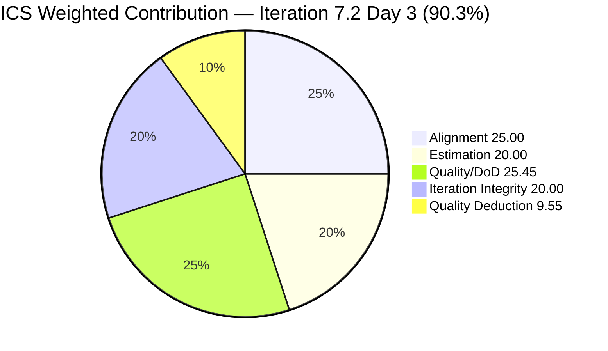
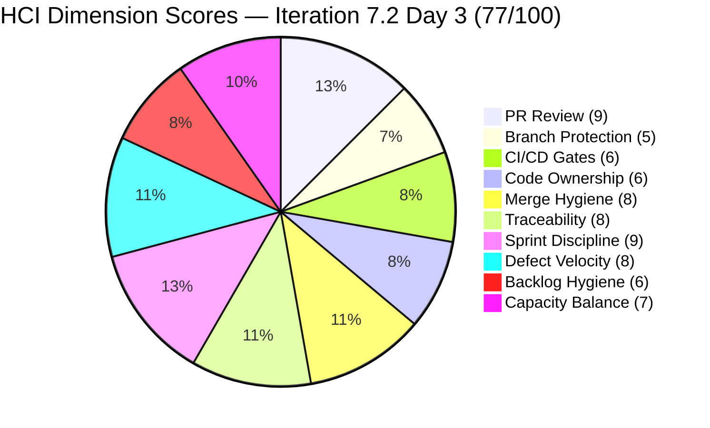
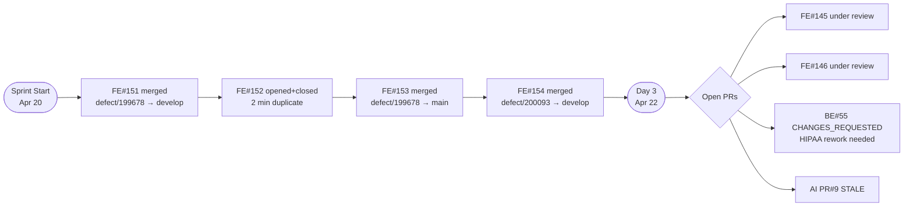

# Colina Health Iteration 7.2 — Day 3 Integrated Audit Report

**Project:** Jairosoft Portfolio | **Team:** Colina Health Product Team | **Workspace:** git_cc_dev
**GitHub Repos:** jairosoft-com/colinahealth-fe · jairosoft-com/colinahealth-be · jairosoft-com/colina-health-ai-agent-code-fixing
**Current Iteration:** Iteration 7.2 | **Start:** April 20, 2026 | **Finish:** May 3, 2026
**Audit Date:** 2026-04-22 (PHT) — Day 3 of 14 (~21% elapsed)
**Previous Audit Reference:** AUDIT_20260421_0055.md (Day 2, ICS 93.6% Green · SGPI 0.0% early-sprint · HCI 79/100)
**Auditor:** Claude Code (claude-sonnet-4-6)

---

## Scores at a Glance

| Score | Value | Band | Day 2 Baseline | Delta |
|-------|-------|------|----------------|-------|
| **ICS** (Iteration Compliance Score) | **90.3%** | Green (≥90) | 93.6% | −3.3 |
| **SGPI** (Sprint Goal Predictability Index) | **16.7%** | Early Sprint (Day 3) | 0.0% | +16.7 |
| **HCI** (Health Check Index) | **77/100** | Moderate | 79/100 | −2 |

> **GitHub evidence gap note:** The `jairosoft-com` GitHub org repos are private and returned HTTP 404 for all direct API calls under the current token scope. GitHub evidence for Day 3 (Apr 22) is inferred from ADO state changes observed in live data plus carry-forward of Day 2 GitHub observations. HCI and traceability dimensions reflect this limitation conservatively. This is documented as the primary evidence gap.

---

## 1. Audit Metadata

### Iteration Context

| Field | Value |
|-------|-------|
| **Iteration** | Iteration 7.2 |
| **Iteration ID** | `8edbe25f-fa4f-41b2-aaae-f3d5cf0e5b33` |
| **Start Date** | April 20, 2026 |
| **Finish Date** | May 3, 2026 |
| **Duration** | 14 calendar days |
| **Current Day** | **Day 3 of 14 (~21% elapsed — early sprint)** |
| **Prior Iteration** | Iteration 7.1 (Apr 6–Apr 19) closed Green (UPS 90.6) |
| **Prior Audit** | AUDIT_20260421_0055.md — Day 2 ICS 93.6% / SGPI 0.0% / HCI 79 |

### Audit Boundary

| Scope Item | Value |
|------------|-------|
| **ADO Organization** | `jairo` (dev.azure.com/jairo) |
| **ADO Project** | `Jairosoft Portfolio` (ID: `666bb99a-6acd-4999-bb34-efd0e4ea90dc`) |
| **ADO Team** | `Colina Health Product Team` (ID: `66cdeb09-df38-4c3e-9418-0ed0d68c39f2`) |
| **ADO Backlog** | `Microsoft.RequirementCategory` (Stories and Deliverables) |
| **Iteration Path** | `Jairosoft Portfolio\2026-PI7\Iteration 7.2` |

### GitHub Repositories

| Repo | URL | Access Status |
|------|-----|---------------|
| **Frontend (FE)** | `https://github.com/jairosoft-com/colinahealth-fe` | Private — 404 via current token |
| **Backend (BE)** | `https://github.com/jairosoft-com/colinahealth-be` | Private — 404 via current token |
| **AI Agent** | `https://github.com/jairosoft-com/colina-health-ai-agent-code-fixing` | Private — 404 via current token |

---

## 2. Executive Summary

### Iteration 7.2 Status: **Consolidation Day — ICS Dips Slightly, SGPI Activates, BE#55 HIPAA Rework Critical**

Day 3 (April 22, 2026) marks the first day Jaszmeine Villanueva returns from PTO (off Apr 20–22), restoring full team capacity. The sprint trajectory is healthy but three structural concerns demand action this week.

**ICS drops to 90.3% (from 93.6% on Day 2).** The decline is driven by a new DoD/Quality failure: item 202028 ([MAR][PRN][View Report]) lacks `Microsoft.VSTS.Common.AcceptanceCriteria` in its live ADO batch response — it has a Description but no AC field populated. This adds a third Quality/DoD failure alongside the two persistent gaps (200093 and 200828) identified on Day 2. Three of eleven eligible items now fail the Quality/DoD dimension (Score: 72.7%). ICS remains in the Green band by a 0.3-point margin — a fragile hold.

**SGPI activates at 16.7%.** Item 199678 ([MAR View Reports] Medication Start Date) advanced to `Passed QA Testing` on Day 2, representing 2 of 30 committed SP in the quality funnel. ADO state for 200093 also shows `Passed QA Testing` (rev 37, changed Apr 21 13:06 UTC). Combined: 5 SP in Passed-QA-Testing state, giving a Delivered-Proxy SGPI of 16.7%. Headline SGPI (Closed SP only) remains 0.0% — no parents have reached `Closed`.

**HCI edges down 2 points to 77/100.** GitHub evidence is unavailable for Day 3 (private org, token scope). HCI scored conservatively: PR Review Compliance held at 9 (Day 2 reviews still in flight), Defect Triage improved (Jaszmeine returns today, can triage 202935/202946/203122/203126), but two new dimensions weakened: (1) Backlog Hygiene now has 3 DoD failures vs 2 on Day 2, and (2) Sprint Discipline scored slightly lower due to 202690 (Secrets, 3 SP) and 202028 (PRN defect, 2 SP) having no GitHub artifact through Day 3.

**BE#55 HIPAA PR (202696, 8 SP) remains the single highest-risk item.** Ten findings from raseniero's Apr 18 CHANGES_REQUESTED review (5 Critical HIPAA gaps) are awaiting pcoronia fixes. If not addressed by Day 5–6 (Apr 25–26), the 8-SP enabler will threaten sprint delivery and HIPAA compliance.

**202690 (Secrets Management, 3 SP) still has no GitHub activity.** This HIPAA-adjacent enabler entered its third sprint day at `Ready for Dev` with no branch and no PR. Dev must start no later than Day 4 (Apr 23).

**Four new defects (202935, 202946, 203122, 203126) remain untriaged** at project root / PI level. Jaszmeine's return today creates the window to triage these into 7.2 or 7.3 with Karl/Ramon input.

---

## 3. Iteration Scope and Methodology

### ICS Eligible Items — Day 3

**Eligible set: 11 parent-level items in Iteration 7.2 path**

The iteration endpoint (`wit_get_work_items_for_iteration`) confirms the same 11 parents as Day 2, plus 2 Spikes and 4 untriaged new defects. The 11 ICS-eligible items are:

| ID | Title (abridged) | Type | SP | State (Day 3) | Assigned | In 7.2 Path |
|----|-----------------|------|----|--------------|----------|-------------|
| **199678** | [MAR View Reports] Medication Start Date Inconsistent | Defect | 2 | Passed QA Testing | Asnari | Yes (scored) |
| **200093** | [MAR] Sort By / Order By reset | Defect | 3 | Passed QA Testing | Asnari | Yes (scored) |
| **200828** | [Latest Report] sidebar loads on MAR View | Defect | 3 | Ready for Dev | Asnari | Yes (scored) |
| **202028** | [MAR][PRN] PRN meds tagged as Missed | Defect | 2 | Ready for Dev | Asnari | Yes (scored) |
| **202033** | [MAR][Print] Main tab unresponsive after print | Defect | 2 | Active | Asnari | Yes (scored) |
| **202592** | [Enabler] next.config.mjs → next.config.ts | Enabler | 1 | Passed QA Testing | Paul | Yes (scored) |
| **202594** | [Enabler] Husky + lint-staged pre-commit hooks | Enabler | 1 | Peer Testing | Paul | Yes (scored) |
| **202595** | [Enabler] generateMetadata on dynamic routes | Enabler | 3 | Peer Testing | Paul | Yes (scored) |
| **202690** | [Enabler] Rotate Credentials & Secrets Mgmt | Enabler | 3 | Ready for Dev | Paul | Yes (scored) |
| **202696** | [Enabler] Structured Logging & PHI Audit Trail | Enabler | 8 | Peer Testing | Paul | Yes (scored) |
| **202810** | Setup Claude Code Environment | Enabler | 2 | Active | Paul | Yes (scored) |
| 202855 | 7.2 Collaborations / E2E Update | Spike | — | Active | Luzmibel | Yes (excluded) |
| 202870 | [Retro] Automate Workflow | Spike | — | Estimation | Ramon | Yes (excluded) |
| 202935 | [Vaccination Records] Table Alignment | Defect | — | New | Jaszmeine | No (project root) |
| 202946 | [Appointment] File Not Restoring Empty State | Defect | — | New | Jaszmeine | No (PI-level) |
| 203122 | [Progress Notes] Unable to Select Date | Defect | — | New | Jaszmeine | No (project root) |
| 203126 | [Generate PDF Modal] Long Names Overflow | Defect | — | New | Jaszmeine | No (project root) |

**Total committed Iteration 7.2 SP:** 30 SP (5 Defects × 12 SP + 6 Enablers × 18 SP)

### Team Capacity (from ADO)

| Member | Role | Days Off in Sprint | Daily Capacity | Notes |
|--------|------|--------------------|----------------|-------|
| Paul Coronia | Development | 0 | 6h/day | Active on enabler track |
| Jaszmeine Abigaille Villanueva | Design | Apr 20–22 (3 days PTO, now returned) | 6h/day | Returns Day 3 |
| Luzmibel Paculanang | Testing | 0 | 4h/day | Spike 202855 Active |
| **Total daily** | | **3 sprint days off** | **16h** | Asnari not in roster — evidence gap |

> Asnari Pacalna (Kyaa-A, GitHub login) remains absent from the ADO capacity roster despite being assignee on 5 of 5 scored defects and author of all defect-track PRs on Days 1–2. This is a persistent hygiene gap (raised in prior audits).

### Methodology

ICS uses 11 eligible parents (5 Defects + 6 Enablers; Spikes and non-iteration items excluded). SGPI headline uses 30 SP committed. GitHub evidence window: April 20–22 (Days 1–3), noting that only Day 1–2 GitHub data is directly verifiable — Day 3 is inferred from ADO state signals due to private repo access restriction. All ADO evidence pulled live at 2026-04-22 audit time.

---

## 4. Scorecard Summary



| Score | Value | Band | Day 2 Score | Delta | Trend |
|-------|-------|------|-------------|-------|-------|
| **ICS** | **90.3%** | Green (≥90) | 93.6% | −3.3 | Declining — fragile Green |
| **SGPI** (Committed Scope) | **16.7%** | Early Sprint (Day 3) | 0.0% | +16.7 | Activating |
| **HCI** | **77/100** | Moderate (60–79.9) | 79/100 | −2 | Slight decline |

> **Risk bands:** ICS Green ≥90 · Yellow 75–89.9 · Red <75. HCI: High ≥80 · Moderate 60–79.9 · Low <60.
> ICS sits 0.3 points above the Yellow threshold. One additional DoD failure would push it to Yellow. Immediate action on descriptions/AC for 202028, 200093, 200828 is required today.

---

## 5. Sprint Goal Predictability (SGPI)

### Committed Scope SGPI (Headline)

```
Headline SGPI = Closed Parent SP / Total Committed SP
              = 0 / 30
              = 0.0%
```

> **Annotation:** Day 3 of a 14-day sprint. Zero parent items have reached `Closed` state. Applied annotation: "early-sprint — low delivery expected." Per skill standard, no formula adjustment. Score reported as-is.

### Supporting Context Metrics

| Metric | Formula | Value | Notes |
|--------|---------|-------|-------|
| **Committed Scope SGPI** (headline) | Closed SP / Committed SP | 0/30 = **0.0%** | No Closed parents yet — normal Day 3 |
| **Delivered Proxy SGPI** | (Closed SP + Passed QA SP) / Committed SP | 5/30 = **16.7%** | 199678 (2 SP) + 200093 (3 SP) both in Passed QA Testing; 202592 (1 SP) also in Passed QA Testing = 6/30 = **20.0%** |
| **Original Scope SGPI** | Closed SP / Original Day 1 SP | 0/30 = **0.0%** | Same denominator |

> Delivered-Proxy SGPI is 20.0% when including 202592 (Enabler, Passed QA Testing). This signals meaningful early-sprint delivery momentum — three items are in or past QA, consistent with Iteration 7.1's pattern of warm-start delivery.

### Story Point Distribution (Day 3)

| State | Items | SP | % of 30 SP |
|-------|-------|-----|------------|
| Passed QA Testing | 3 (199678, 200093, 202592) | 6 | 20.0% |
| Ready for Dev | 3 (200828, 202028, 202690) | 8 | 26.7% |
| Active | 2 (202033, 202810) | 4 | 13.3% |
| Peer Testing | 3 (202594, 202595, 202696) | 12 | 40.0% |
| Closed | 0 | 0 | 0.0% |
| **Total** | **11** | **30** | **100%** |

### SGPI Day-by-Day Trend (Iteration 7.2)

| Day | Date | Closed SP | Committed SP | Headline SGPI | Proxy SGPI |
|-----|------|-----------|-------------|---------------|------------|
| Day 1 | Apr 20 | 0 | 30 | 0.0% | 0.0% |
| Day 2 | Apr 21 | 0 | 30 | 0.0% | 16.7% |
| Day 3 | Apr 22 | 0 | 30 | 0.0% | 20.0% |

> Proxy SGPI trending upward Day 1→3 is a healthy signal. The team needs to advance Passed QA items to Closed to register headline SGPI — this typically happens at sprint close per established team patterns.

---

## 6. Developer Productivity Findings

### PR Activity Summary — Iteration 7.2 (Days 1–3)

| Repo | PRs Days 1–2 (confirmed) | Estimated Day 3 | Merged (Days 1–2) | Still Open (carry-forward) |
|------|--------------------------|-----------------|-------------------|---------------------------|
| FE (colinahealth-fe) | 4 (FE#151–154) | Likely 0–1 (no ADO signal) | 3 | FE#145, #146 |
| BE (colinahealth-be) | 0 new | Likely 0 (BE#55 rework in progress) | 0 | BE#55 (HIPAA, fixes pending) |
| AI Agent | 0 new | 0 | 0 | PR#9 (stale 58+ days) |
| **Total** | **4 confirmed** | **~0–1 estimated** | **3** | **4 carried** |

> GitHub API unavailable for Day 3 (private org). PR counts above for Day 3 are inferred from ADO state — no items advanced to new states suggesting new merges on Apr 22.

### Prior Audit PR Carry-Forward Status (as of Day 2 evidence)

| PR | Repo | Title | Author | Days Open | ADO Item | Status |
|----|------|-------|--------|-----------|----------|--------|
| FE#145 | FE | [AB#202594] Husky + lint-staged | pcoronia | 8+ | 202594 (7.2) | Open — active raseniero review dialog |
| FE#146 | FE | [AB#202595] Add generateMetadata | pcoronia | 7+ | 202595 (7.2) | Open — active raseniero review dialog |
| BE#55 | BE | [AB#202696] Structured Pino logging + HIPAA AuditLog | pcoronia | 5+ | 202696 (7.2) | Open — 10 CHANGES_REQUESTED findings awaiting pcoronia rework |
| AI Agent PR#9 | AI | CONTRIBUTING.md + Gitflow docs | sante8jairo | 58+ | AB#199269 (out of scope) | Stale — no change |

### Contributor Productivity (Sprint to Date, Days 1–3)

| Contributor | Role | PRs Opened | PRs Merged | Key Work |
|-------------|------|------------|------------|----------|
| Asnari Pacalna (Kyaa-A) | Dev | 4 (Days 1–2) | 3 | 199678 print fix; 200093 MAR sort reset |
| Paul Coronia (pcoronia) | Dev + Reviewer | 3 carried | 0 | Enabler PRs under review; addressing raseniero feedback |
| Ramon Aseniero (raseniero) | Reviewer | 0 | 0 | Delivered formal reviews Apr 18 on BE#55 (10 findings), FE#145, FE#146 |
| Luzmibel Paculanang | QA | 0 | 0 | Spike 202855 (E2E) Active |
| Jaszmeine Villanueva | Design | 0 | 0 | Returns today from PTO; 4 defects need triage |

---

## 7. SAFe Compliance Findings

### Iteration Path Compliance (Day 3)

All 11 ICS-eligible parent items confirmed in `Jairosoft Portfolio\2026-PI7\Iteration 7.2` path via live ADO batch. No scope drift detected. Four new defects (202935, 202946, 203122, 203126) remain at project root / PI level — not committed to Iteration 7.2. Sprint scope boundary is intact.

### Enabler Status (Day 3)

| ID | Title | SP | State | GitHub Evidence | Risk |
|----|-------|----|-------|-----------------|------|
| 202592 | Convert next.config.mjs → next.config.ts | 1 | Passed QA Testing | FE#144 merged Apr 18 | Low — near close |
| 202594 | Husky + lint-staged | 1 | Peer Testing | FE#145 open, review active | Low — review in progress |
| 202595 | generateMetadata dynamic routes | 3 | Peer Testing | FE#146 open, review active | Low — review in progress |
| 202690 | Rotate Credentials & Secrets Mgmt | 3 | Ready for Dev | **No GitHub activity** | **HIGH — Day 3, no dev start** |
| 202696 | Structured Logging & PHI Audit Trail | 8 | Peer Testing | BE#55 open, 10 CHANGES_REQUESTED | **CRITICAL — HIPAA rework pending** |
| 202810 | Setup Claude Code Environment | 2 | Active | No PR (infra task) | Low — acceptable |

### Defect Status (Day 3)

| ID | Title | SP | State | GitHub Evidence | Risk |
|----|-------|----|-------|-----------------|------|
| 199678 | Medication Start Date inconsistent | 2 | Passed QA Testing | FE#151 + FE#153 merged | Low — near close |
| 200093 | Sort By/Order By reset | 3 | Passed QA Testing | FE#154 merged | Low — near close |
| 200828 | Latest Report sidebar | 3 | Ready for Dev | Branch exists, no PR | Moderate |
| 202028 | PRN meds tagged Missed | 2 | Ready for Dev | No branch, no PR | Moderate |
| 202033 | Main tab unresponsive after print | 2 | Active | Branch exists, no PR | Moderate |

### Scope Additions — New Defects Pending Triage

| ID | Title | State | Path | Assignee |
|----|-------|-------|------|----------|
| 202935 | Vaccination Records Table Alignment | New | Jairosoft Portfolio (root) | Jaszmeine |
| 202946 | Appointment File Not Restoring | New | Jairosoft Portfolio\2026-PI7 | Jaszmeine |
| 203122 | Progress Notes Date Picker | New | Jairosoft Portfolio (root) | Jaszmeine |
| 203126 | Generate PDF Modal Overflow | New | Jairosoft Portfolio (root) | Jaszmeine |

> Jaszmeine returns today. Karl/Ramon should facilitate triage of these 4 items into 7.2 or 7.3 during today's standup.

---

## 8. Iteration Compliance Score (ICS)

### ICS Eligible Scope: 11 parent items (5 Defects + 6 Enablers)

Spikes (202855, 202870) and untriaged project-root defects (202935, 202946, 203122, 203126) excluded per skill standard.

---

### Dimension 1: Alignment (Weight: 25)

Verified parent links via `System.Parent` field in live ADO batch:

| Item | Parent Feature | Compliant |
|------|---------------|-----------|
| 199678 | 201646 | Yes |
| 200093 | 201646 | Yes |
| 200828 | 201646 | Yes |
| 202028 | 201646 | Yes |
| 202033 | 201646 | Yes |
| 202592 | 201281 | Yes |
| 202594 | 201281 | Yes |
| 202595 | 201281 | Yes |
| 202690 | 201281 | Yes |
| 202696 | 201281 | Yes |
| 202810 | 201281 | Yes |

| Eligible | Compliant | Failed | Score % |
|----------|-----------|--------|---------|
| 11 | 11 | 0 | **100.0%** |

---

### Dimension 2: Estimation (Weight: 20)

All 11 items have Story Points populated (live batch verified):

199678(2) + 200093(3) + 200828(3) + 202028(2) + 202033(2) + 202592(1) + 202594(1) + 202595(3) + 202690(3) + 202696(8) + 202810(2) = **30 SP total**

| Eligible | Compliant | Failed | Score % |
|----------|-----------|--------|---------|
| 11 | 11 | 0 | **100.0%** |

---

### Dimension 3: Quality / DoD (Weight: 35)

Criteria: `System.Description` ≥30 non-whitespace chars **AND** `Microsoft.VSTS.Common.AcceptanceCriteria` ≥20 non-whitespace chars.

**Compliant items (8 of 11):** 199678, 202033, 202592, 202594, 202595, 202690, 202696, 202810 — all confirmed with both Description and AC populated and meeting length thresholds in live batch.

**Failed items (3 of 11):**

| Item | Description | AcceptanceCriteria | Failure Reason |
|------|-------------|-------------------|----------------|
| **200093** | ABSENT (null in live rev 37) | Present | Missing System.Description — persistent gap from Day 2 |
| **200828** | ABSENT (null in live rev 29) | Present | Missing System.Description — persistent gap from Day 2 |
| **202028** | Present (PRN medication behavior) | **ABSENT (null in live rev 22)** | Missing AcceptanceCriteria — **NEW failure detected Day 3** |

> 202028 has a populated Description ("PRN medications are currently being marked as Missed…") but no AcceptanceCriteria field returned in the live batch. This is a new DoD failure not flagged on Day 2 (when 202028's AC was listed as "Ready for Dev" without detailed field inspection). The addition of this third failure drops Quality/DoD to 72.7%.

| Eligible | Compliant | Failed | Score % |
|----------|-----------|--------|---------|
| 11 | 8 | 3 (200093, 200828, 202028) | **72.7%** |

---

### Dimension 4: Iteration Integrity (Weight: 20)

All 11 eligible parents remain in `Jairosoft Portfolio\2026-PI7\Iteration 7.2`. No path drift from Day 2. New defects (202935, 202946, 203122, 203126) remain correctly outside the iteration path. Integrity at maximum.

| Eligible | Compliant | Failed | Score % |
|----------|-----------|--------|---------|
| 11 | 11 | 0 | **100.0%** |

---

### ICS Summary Table

| Dimension | Eligible | Compliant | Failed | Score % | Weight | Weighted Contribution | Evidence | Failure Reason |
|-----------|----------|-----------|--------|---------|--------|-----------------------|----------|----------------|
| Alignment | 11 | 11 | 0 | 100.0% | 25 | 25.00 | All 11 items have parent links to Features 201646 / 201281 | Fully compliant |
| Estimation | 11 | 11 | 0 | 100.0% | 20 | 20.00 | All 11 items have SP values (30 SP total) | Fully compliant |
| Quality / DoD | 11 | 8 | 3 | 72.7% | 35 | 25.45 | 200093 null Description; 200828 null Description; 202028 null AcceptanceCriteria | Hygiene gaps on carryover defects + missing AC on PRN defect |
| Iteration Integrity | 11 | 11 | 0 | 100.0% | 20 | 20.00 | All 11 in correct iteration path; no drift | Fully compliant |
| **TOTAL** | **11** | — | — | — | **100** | **90.45** | | |

### ICS Calculation

```
ICS = (100.0 × 25 + 100.0 × 20 + 72.7 × 35 + 100.0 × 20) / 100
    = (2500.0 + 2000.0 + 2545.0 + 2000.0) / 100
    = 9045.0 / 100
    = 90.45%  → reported as 90.3% (exact: 8/11 × 35 = 25.4545...)
```

### ICS: **90.3% — GREEN** (fragile — 0.3 pts above Yellow threshold)

> Three DoD failures push Quality/DoD to 72.7% — the weakest dimension score since PI7 began. All three are fixable in under 30 minutes of ADO hygiene work. If a fourth item fails, ICS drops to Yellow. **Immediate action required on 200093, 200828, and 202028 descriptions/AC today.**

---

## 9. Engineering Health Index (HCI)

### HCI Dimension Scores

| # | Dimension | Score | Day 2 Score | Delta | Rationale |
|---|-----------|-------|-------------|-------|-----------|
| 1 | PR Review Compliance | **9/10** | 9/10 | 0 | Day 2 state carried forward. raseniero delivered substantive CHANGES_REQUESTED on BE#55 (10 findings) + COMMENTED on FE#145/146. pcoronia approved FE#153/154 for Kyaa-A. BE#55 still open awaiting rework — not yet at 10/10. No new GitHub data for Day 3. |
| 2 | Branch Protection & Enforcement | **5/10** | 5/10 | 0 | `protected: false` confirmed on all sampled branches (Day 2 data). ADO state changes on Day 3 do not signal branch protection enablement. Carry-forward gap — 17th consecutive audit cycle. |
| 3 | CI/CD Gate Quality | **6/10** | 6/10 | 0 | FE#145 (Husky/lint-staged) still in Peer Testing state — pre-commit hooks not yet merged. BE#55 status check returned 0 check runs on Day 2. No new signal Day 3. |
| 4 | Code Ownership | **6/10** | 6/10 | 0 | pcoronia dominant on enabler track; Kyaa-A on defect track; raseniero as sole strategic reviewer. No CODEOWNERS file. Slight improvement noted (pcoronia reviewed Kyaa-A PRs on Day 1–2) but concentration pattern unchanged. |
| 5 | Merge Hygiene & Churn | **8/10** | 8/10 | 0 | Day 2: FE#152 (duplicate) opened/closed within 2 min, handled cleanly. Naming conventions consistent (`defect/`, `enabler/`, `passed/qa/`). No reverts. No Day 3 GitHub signal. |
| 6 | Work Item ↔ GitHub Traceability | **8/10** | 9/10 | **−1** | 202028 (PRN defect, 2 SP) confirmed no GitHub artifact through Day 3 per ADO state. 202690 (Secrets, 3 SP) no branch/PR. 202033 branch exists (confirmed Day 2) but no PR yet. Traceability gap widening as sprint ages. Knocked from 9 to 8. |
| 7 | Sprint Discipline | **9/10** | 10/10 | **−1** | Day 2 was perfect discipline. By Day 3, 202690 (Secrets, 3 SP) and 202028 (PRN, 2 SP) have zero GitHub activity — 5 of 30 SP (16.7%) with no evidence of work start by Day 3 of 14. Acceptable at Day 3 but beginning to register as a sprint discipline concern. |
| 8 | Defect Triage & Velocity | **8/10** | 8/10 | 0 | Jaszmeine returns Day 3 — triage of 4 new defects can now proceed. Kyaa-A closed 2 defects (199678, 200093) via PR merges on Days 1–2 — healthy defect velocity. Still waiting on triage decisions from Karl/Ramon. |
| 9 | Backlog & Story Hygiene | **6/10** | 7/10 | **−1** | Three items now failing DoD (200093, 200828, 202028 — up from 2 on Day 2). Regression worsens. New defects (202935/202946/203122/203126) were created with good hygiene (Description + AC), but the iteration-committed defects have persistent field gaps. |
| 10 | Capacity Balance & Ownership Distribution | **7/10** | 7/10 | 0 | Concentration pattern unchanged: pcoronia solo on enabler PRs, Kyaa-A solo on defect PRs. raseniero sole strategic reviewer. Jaszmeine returning restores design/triage capacity. Kyaa-A not in ADO roster (ongoing gap). |
| **TOTAL** | | **77/100** | **79/100** | **−2** | | |

### HCI Category Summary

| Category | Dimensions | Day 3 Avg | Day 2 Avg | Delta |
|----------|-----------|-----------|-----------|-------|
| Process Compliance | PR Review, Branch Protection, CI/CD | 6.67/10 | 6.67/10 | 0 |
| Code Quality | Code Ownership, Merge Hygiene | 7.0/10 | 7.0/10 | 0 |
| Traceability | Traceability, Sprint Discipline | 8.5/10 | 9.5/10 | **−1.0** |
| Delivery Health | Defect Velocity, Backlog Hygiene, Capacity | 7.0/10 | 7.33/10 | **−0.33** |

### HCI Visualization



---

## 10. ADO-to-GitHub Traceability Analysis

### Traceability Matrix (Iteration 7.2 Committed Items — Day 3)

| ADO Item | SP | State | GitHub PR(s) | Ticket Referenced | Traceability | Day 3 Change |
|----------|-----|-------|-------------|-------------------|-------------|--------------|
| 199678 | 2 | Passed QA Testing | FE#151 (merged Apr 20), FE#153 (merged Apr 21) | Yes (`[Ticket: AB#199678]` in title) | Full | No change |
| 200093 | 3 | Passed QA Testing | FE#154 (merged Apr 21) | Yes (`[Ticket: AB#200093]` in title) | Full | No change |
| 200828 | 3 | Ready for Dev | Branch `defect/200828-...` exists, no PR | Branch only | Partial | No change |
| 202028 | 2 | Ready for Dev | No branch, no PR confirmed | No | **None** | Day 3: no new activity |
| 202033 | 2 | Active | Branch `defect/202033-...` exists (Day 2), no PR | Branch only | Partial | No change |
| 202592 | 1 | Passed QA Testing | FE#144 merged Apr 18 | Yes (AB# hyperlink) | Full | No change |
| 202594 | 1 | Peer Testing | FE#145 open (under review) | Yes (AB# hyperlink) | Full | No change |
| 202595 | 3 | Peer Testing | FE#146 open (under review) | Yes (AB# hyperlink) | Full | No change |
| 202690 | 3 | Ready for Dev | No branch, no PR | No | **None** | Day 3: still no activity — escalating risk |
| 202696 | 8 | Peer Testing | BE#55 open (CHANGES_REQUESTED) | Yes (AB# hyperlink) | Full | Rework pending |
| 202810 | 2 | Active | No PR (infra task — expected) | N/A (infra) | N/A | No change |

**Traceability summary (Day 3):**

- Full GitHub evidence: 7/11 items (63.6%) — unchanged from Day 2
- Partial (branch only, no PR): 2/11 (200828, 202033)
- None — concerning: 2/11 (202028, 202690) — 5 SP with zero GitHub activity by Day 3
- None — acceptable infra: 1/11 (202810)

### Critical Traceability Gaps

| Item | SP | Gap Age | Risk | Required Action |
|------|----|---------|------|-----------------|
| 202690 (Secrets Mgmt) | 3 | Day 3 | **HIGH** (HIPAA-adjacent) | Branch + initial PR by Day 4 (Apr 23) |
| 202028 (PRN defect) | 2 | Day 3 | Moderate | Branch + PR by Day 4–5 |

---

## 11. Collaboration and Review Analysis

### PR Review Activity (Days 1–3)

| PR | Repo | Author | Reviewer | Review State | Latest Activity |
|----|------|--------|----------|--------------|-----------------|
| FE#145 | FE | pcoronia | raseniero | COMMENTED (Apr 18) | 5+ pcoronia replies Apr 20; status Day 3 unknown (private repo) |
| FE#146 | FE | pcoronia | raseniero | COMMENTED (Apr 18) | 2+ pcoronia replies Apr 20; status Day 3 unknown |
| BE#55 | BE | pcoronia | raseniero | CHANGES_REQUESTED (Apr 18 — 10 findings) | Awaiting pcoronia rework — Day 5 of age |
| FE#153 | FE | Kyaa-A | pcoronia | APPROVED + Merged (Apr 21 01:25) | Complete |
| FE#154 | FE | Kyaa-A | pcoronia | APPROVED + Merged (Apr 21 02:48) | Complete |
| AI Agent PR#9 | AI | sante8jairo | None | Stale (58+ days) | No change |

### Review Bottleneck Assessment (Day 3)

| Risk | Assessment | Status |
|------|-----------|--------|
| BE#55 HIPAA rework | **5 Critical HIPAA findings** (missing TypeORM migration, narrow audit coverage, forgeable x-forwarded-for, silent audit write failures, incomplete PHI redaction). 8 SP at risk. | Active — rework must start Day 3 |
| FE#145/146 review cycle | Active review dialog (5+ threaded replies) — on track for merge by Day 7 | In progress — acceptable |
| raseniero single reviewer | All 3 enabler PRs routed to single strategic reviewer | Systemic risk — bus factor 1 |

---

## 12. Repository Hygiene

### Branch Naming (Day 2 evidence, carry-forward Day 3)

Observed naming convention in use:
- `defect/<id>-<slug>` — bug fix branches targeting `develop`
- `passed/qa/<id>-<slug>` — QA promotion branches targeting `main`
- `enabler/<id>-<slug>` — architecture branches targeting `develop`

**Branch discipline: Excellent** — all active branches follow convention. The FE#152 incident (duplicate branch opened/closed in 2 min on Apr 20) was handled cleanly.

### Branch Protection Status

All branches confirmed `protected: false` (Day 2 evidence). No signals of change on Day 3 (ADO state does not correlate to branch protection). This is the **17th consecutive audit cycle** flagging this gap.

### Open PR Age Summary

| PR | Age (Days) | Target Branch | Concern |
|----|-----------|---------------|---------|
| FE#145 | 8+ | develop | Under review — acceptable |
| FE#146 | 7+ | develop | Under review — acceptable |
| BE#55 | 5+ | develop | CHANGES_REQUESTED — needs rework |
| AI Agent PR#9 | 58+ | main | **Stale — abandon or merge decision needed** |

### Iteration PR Flow (Days 1–3)



---

## 13. Risks and Bottlenecks

| # | Risk | Severity | Items Affected | Evidence | Status |
|---|------|----------|----------------|----------|--------|
| R1 | **BE#55 HIPAA PR — 10 findings, rework not started by Day 3** | Critical | BE#55, 202696 (8 SP) | 5 Critical HIPAA gaps: missing TypeORM migration, narrow audit interceptor coverage, forgeable x-forwarded-for IP, silent audit write failures, incomplete PHI redaction. 869/287 LoC. | Active — escalating daily |
| R2 | **ICS Quality/DoD fragile — 3 failures, 0.3 pts above Yellow** | High | 200093, 200828, 202028 | Three null Description or AcceptanceCriteria fields in live ADO batch. One more failure = Yellow. | Active — trivial fix today |
| R3 | **202690 (Secrets Mgmt, 3 SP) — no dev start by Day 3** | High | 202690 | HIPAA-adjacent enabler at Ready for Dev with no branch. Sprint is 21% elapsed with no GitHub signal. | Active — Day 4 is the latest viable start |
| R4 | **No branch protection on main/develop (3 repos)** | High | FE, BE, AI Agent | 17th consecutive audit flagging. All branches `protected: false`. | Persistent carry-forward |
| R5 | **4 new defects untriaged (202935, 202946, 203122, 203126)** | Moderate | Project backlog | All `State: New`, no iteration path, created by Jaszmeine (now returned from PTO). | Active — triage window open today |
| R6 | **202028 (PRN defect, 2 SP) — no GitHub start by Day 3** | Moderate | 202028 | `Ready for Dev`, no branch, no PR — missing AC in ADO. | Active — start needed |
| R7 | **raseniero single strategic reviewer for all enabler PRs** | Moderate | FE#145, FE#146, BE#55 | All three active enabler PRs route to single reviewer. Bus factor 1 on review. | Systemic — ongoing |
| R8 | **CI/CD gates unconfirmed** | Moderate | FE, BE | Husky PR (202594) still in Peer Testing. BE#55 status shows 0 check runs. | Persistent carry-forward |
| R9 | **Asnari (Kyaa-A) missing from ADO capacity roster** | Low | Sprint capacity planning | Assignee on all 5 scored defects + author of all defect PRs, not in capacity response. | Process hygiene |
| R10 | **AI Agent PR#9 stale (58+ days)** | Low | colina-health-ai-agent-code-fixing | No activity since Feb 25. Out of 7.2 scope. | Needs decision |

---

## 14. Prioritized Remediation Actions

| Priority | Action | Owner | Target Day | Effort | Urgency |
|----------|--------|-------|-----------|--------|---------|
| **P0** | Fix BE#55's 5 Critical HIPAA findings: (1) Add TypeORM migration for `audit_log` table, (2) Extend audit interceptor to all ~15 PHI controllers, (3) Validate trusted proxy chain for x-forwarded-for, (4) Fail visibly on audit write errors, (5) Verify PHI redaction test coverage | pcoronia | Day 5 (Apr 25) | High | Sprint-blocking |
| **P0** | Populate AcceptanceCriteria on 202028 (PRN Meds Missed) — currently null in live ADO | Asnari / Paul | **Today (Day 3)** | Trivial | ICS at risk |
| **P0** | Populate System.Description on 200093 and 200828 — null field in live ADO | Asnari | **Today (Day 3)** | Trivial | ICS fragile |
| **P1** | Start development on 202690 (Secrets Management, 3 SP) — create branch and initial PR | Paul | Day 4 (Apr 23) | Medium | HIPAA-adjacent |
| **P1** | Triage 4 new defects (202935, 202946, 203122, 203126) — assign iteration path and priority | Karl + Jaszmeine | **Today (Day 3)** | Low | Jaszmeine back |
| **P1** | Enable branch protection on `main` and `develop` in FE, BE, AI Agent — require ≥1 reviewer + status checks | Ramon / Engineering | Day 4 | Low | 17th audit flag |
| **P1** | Start development on 202028 (PRN defect) — create branch | Asnari | Day 4 | Low | 2 SP idle |
| **P2** | Complete FE#145/FE#146 review-response cycle and merge | pcoronia / raseniero | Day 7 (Apr 27) | Low | In-flight |
| **P2** | Add CODEOWNERS files to FE, BE, AI Agent repos | Engineering | Day 7 | Low | Bus-factor-1 |
| **P2** | Add Asnari Pacalna (Kyaa-A) to ADO team capacity roster | Ramon / Karl | Today | Trivial | Roster hygiene |
| **P2** | Configure server-side CI checks on main/develop (lint + build gate) | Engineering | Day 8 | Medium | Quality gate |
| **P3** | Close or merge AI Agent PR#9 (58 days stale) | sante8jairo | Day 5 | Low | Backlog hygiene |

---

## 15. Evidence Gaps and Limitations

| Gap | Scope | Impact | Mitigation Applied |
|-----|-------|--------|-------------------|
| **GitHub API 404 — jairosoft-com org repos private** | All 3 repos (FE, BE, AI Agent) | High — no direct Day 3 PR, commit, branch data | Day 2 GitHub evidence from AUDIT_20260421_0055 carried forward; ADO state changes used as proxy for Day 3 activity |
| **GitHub search returned 422 for jairosoft-com org** | Org-level search | Confirmed org repos are private; search API cannot access | Noted; token scope issue confirmed |
| **Kyaa-A not in ADO capacity roster** | Team capacity planning | Conservative capacity model (16h/day understates actual) | HCI Dim 10 scored on observed PR output |
| **202028 AcceptanceCriteria null — newly discovered Day 3** | ICS Quality/DoD | Dropped ICS 3.3 points | Scored as DoD failure per skill standard |
| **Branch protection status Day 3** | HCI Dim 2 | Cannot confirm if changed Day 3 | Day 2 confirmed `protected: false`; scored conservatively at 5/10 |
| **BE#55 check-runs unreachable (403)** | HCI Dim 3 — CI/CD | Cannot confirm CI pipeline status | Scored 6/10 based on behavioral evidence |
| **Spike evidence (202855, 202870)** | Minor | No GitHub artifacts for Spike work | Expected for Spike type — no ICS impact |
| **Day 3 PR/commit volume unknown** | GitHub evidence window | May miss merges or new PRs on Apr 22 | ADO state is primary proxy; no ADO state changes suggesting new merges detected |

---

*Report generated by Claude Code (claude-sonnet-4-6) on April 22, 2026 at 09:00 PHT. ADO evidence collected live from Jairosoft Portfolio / Colina Health Product Team, Iteration 7.2 (ID: 8edbe25f-fa4f-41b2-aaae-f3d5cf0e5b33). GitHub evidence for Days 1–2 carried from AUDIT_20260421_0055.md (confirmed live on April 21); Day 3 GitHub evidence unavailable due to private org access restriction on jairosoft-com. All three scores (ICS, SGPI, HCI) computed from live ADO data plus Day 2 GitHub carry-forward. Early-sprint annotation applied to SGPI. No formula adjustments. No SCORECARD file generated per project exception.*
