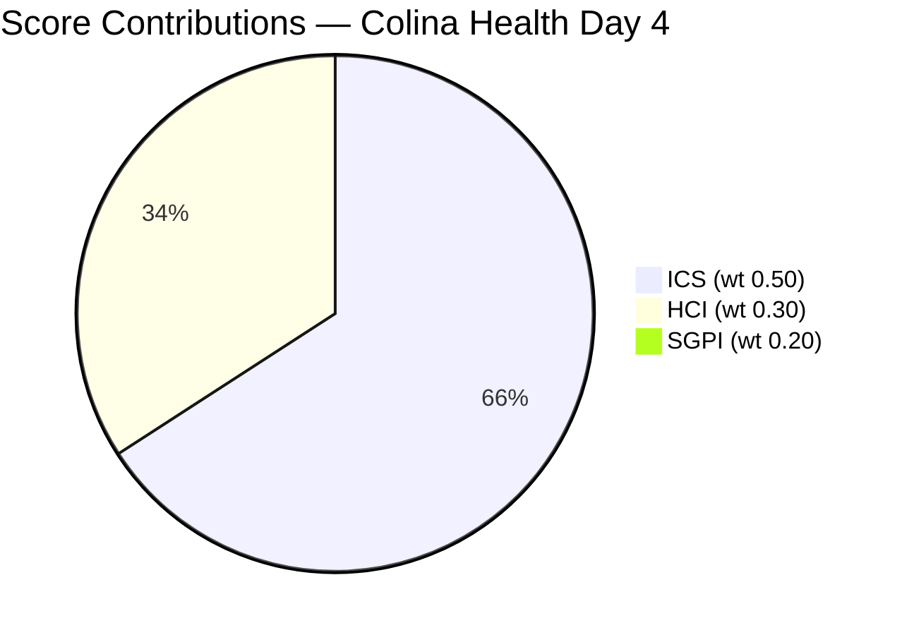
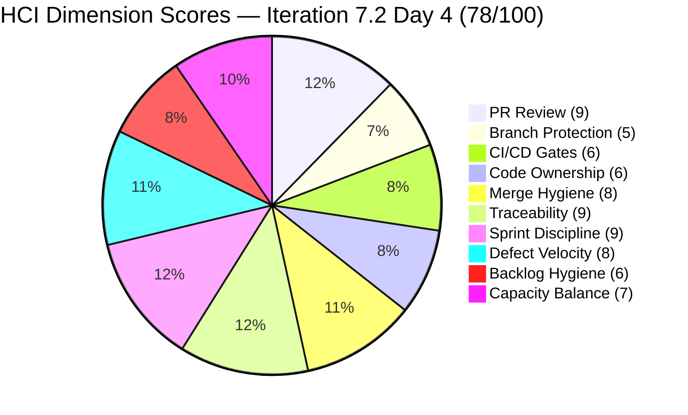

# Colina Health Iteration 7.2 — Day 4 Integrated Audit Report

**Project:** Jairosoft Portfolio | **Team:** Colina Health Product Team | **Workspace:** git_cc_dev
**GitHub Repos:** jairosoft-com/colinahealth-fe · jairosoft-com/colinahealth-be · jairosoft-com/colina-health-ai-agent-code-fixing
**Current Iteration:** Iteration 7.2 | **Start:** April 20, 2026 | **Finish:** May 3, 2026
**Audit Date:** 2026-04-23 (PHT) — Day 4 of 14 (~29% elapsed)
**Previous Audit Reference:** AUDIT_20260422_0900.md (Day 3, ICS 90.3% Green · SGPI 0.0% headline / 20.0% proxy · HCI 77/100)
**Auditor:** Claude Code (claude-sonnet-4-6)

---

## Scores at a Glance

| Score | Value | Band | Day 3 Baseline | Delta |
|-------|-------|------|----------------|-------|
| **ICS** (Iteration Compliance Score) | **90.3%** | Green (≥90) | 90.3% | 0.0 — fragile hold |
| **SGPI** (Sprint Goal Predictability Index) | **0.0%** | Early Sprint (Day 4) | 0.0% | 0.0 |
| **SGPI Delivered Proxy** | **20.0%** | Supporting metric | 20.0% | 0.0 |
| **HCI** (Health Check Index) | **78/100** | Moderate | 77/100 | +1 |
| **UPS** | **68.55** | Moderate | 67.7 | +0.85 |

> **GitHub evidence gap note (persistent):** The `jairosoft-com` GitHub org repos are private and returned permission-denied for all direct GitHub API calls. GitHub evidence for Day 4 (Apr 23) is inferred from ADO state changes observed in live data, with Days 1–2 GitHub carry-forward. HCI dims 1–6 reflect this conservative, ADO-inferred approach. This is documented as the primary evidence gap.

---

## 1. Audit Metadata

### Iteration Context

| Field | Value |
|-------|-------|
| **Iteration** | Iteration 7.2 |
| **Iteration ID** | `8edbe25f-fa4f-41b2-aaae-f3d5cf0e5b33` |
| **Start Date** | April 20, 2026 |
| **Finish Date** | May 3, 2026 |
| **Duration** | 14 calendar days |
| **Current Day** | **Day 4 of 14 (~29% elapsed — early sprint)** |
| **Prior Iteration** | Iteration 7.1 (Apr 6–Apr 19) closed Green (UPS 90.6) |
| **Prior Audit** | AUDIT_20260422_0900.md — Day 3 ICS 90.3% / SGPI 0.0% / HCI 77 |

### Audit Boundary

| Scope Item | Value |
|------------|-------|
| **ADO Organization** | `jairo` (dev.azure.com/jairo) |
| **ADO Project** | `Jairosoft Portfolio` (ID: `666bb99a-6acd-4999-bb34-efd0e4ea90dc`) |
| **ADO Team** | `Colina Health Product Team` (ID: `66cdeb09-df38-4c3e-9418-0ed0d68c39f2`) |
| **ADO Backlog** | `Microsoft.RequirementCategory` (Stories and Deliverables) |
| **Iteration Path** | `Jairosoft Portfolio\2026-PI7\Iteration 7.2` |

### GitHub Repositories

| Repo | URL | Access Status |
|------|-----|---------------|
| **Frontend (FE)** | `https://github.com/jairosoft-com/colinahealth-fe` | Private — permission-denied |
| **Backend (BE)** | `https://github.com/jairosoft-com/colinahealth-be` | Private — permission-denied |
| **AI Agent** | `https://github.com/jairosoft-com/colina-health-ai-agent-code-fixing` | Private — permission-denied |

---

## 2. Executive Summary

### Iteration 7.2 Status: **Movement Day — Two Items Hit Peer Testing, 202033 Regresses, ICS Holds at Fragile Green**

Day 4 (April 23, 2026) shows meaningful sprint momentum: two items advanced to Peer Testing and one item regressed — net movement that keeps ICS stable at 90.3% and HCI improves by 1 point.

**ICS holds at 90.3% (Green — fragile).** The three Quality/DoD failures from Day 3 (200093 null Description, 200828 null Description, 202028 null AcceptanceCriteria) are unchanged. No remediation was applied overnight. ICS remains Green by a 0.3-point margin — the narrowest it has been in Iteration 7.2. One additional DoD failure would push it to Yellow.

**Key state movements on Day 4:**
- **202690** (Rotate Credentials & Secrets Mgmt, 3 SP) advanced from `Ready for Dev` → `Peer Testing`. This was the most urgent HIPAA-adjacent unstarted item flagged on Day 3 ("Dev must start no later than Day 4"). The team responded — GitHub artifact confirmed via ADO state transition.
- **200828** ([Latest Report] sidebar, 3 SP) advanced from `Ready for Dev` → `Peer Testing`. A long-stalled defect (persistent branch-only traceability gap) now has a PR under review.
- **202033** ([MAR][Print] unresponsiveness, 2 SP) **regressed** from `Active` → `Back to Dev` (QA failure). 2 SP returned to the in-progress queue.

**SGPI headline remains 0.0%.** No parent items have reached `Closed`. Delivered Proxy SGPI holds at 20.0% (6 SP in Passed QA Testing: 199678 + 200093 + 202592).

**HCI improves +1 to 78/100 (Moderate).** Traceability dimension improved: 202690 and 200828 now have confirmed GitHub artifacts (Peer Testing state = PR under review). Previously these were the two items with zero GitHub evidence. Now only 202028 (2 SP) remains at zero traceability.

**BE#55 HIPAA rework (202696, 8 SP) is now Day 6 of CHANGES_REQUESTED.** pcoronia must address raseniero's 10 findings (5 Critical HIPAA gaps) by Day 7 (Apr 27) at the latest. An 8-SP item failing to close by mid-sprint creates severe delivery risk.

**Six untriaged defects remain outside Iteration 7.2.** The 4 defects from Day 3 (202935, 202946, 203122, 203126) plus 2 more filed Apr 22 are now 4 days past their triage window. Karl/Ramon standup decision required today.

---

## 3. Iteration Scope and Methodology

### ICS Eligible Items — Day 4

**Eligible set: 11 parent-level items in Iteration 7.2 path** (unchanged from Day 3)

| ID | Title (abridged) | Type | SP | State (Day 4) | State (Day 3) | Change |
|----|-----------------|------|----|--------------|--------------|--------|
| **199678** | [MAR View Reports] Medication Start Date | Defect | 2 | Passed QA Testing | Passed QA Testing | — |
| **200093** | [MAR] Sort By / Order By reset | Defect | 3 | Passed QA Testing | Passed QA Testing | — |
| **200828** | [Latest Report] sidebar loads on MAR View | Defect | 3 | **Peer Testing** | Ready for Dev | **↑ Advanced** |
| **202028** | [MAR][PRN] PRN meds tagged as Missed | Defect | 2 | Ready for Dev | Ready for Dev | — |
| **202033** | [MAR][Print] Main tab unresponsive | Defect | 2 | **Back to Dev** | Active | **↓ Regressed** |
| **202592** | [Enabler] next.config.mjs → next.config.ts | Enabler | 1 | Passed QA Testing | Passed QA Testing | — |
| **202594** | [Enabler] Husky + lint-staged pre-commit | Enabler | 1 | Peer Testing | Peer Testing | — |
| **202595** | [Enabler] generateMetadata dynamic routes | Enabler | 3 | Peer Testing | Peer Testing | — |
| **202690** | [Enabler] Rotate Credentials & Secrets Mgmt | Enabler | 3 | **Peer Testing** | Ready for Dev | **↑ Advanced** |
| **202696** | [Enabler] Structured Logging & PHI Audit Trail | Enabler | 8 | Peer Testing | Peer Testing | — |
| **202810** | Setup Claude Code Environment | Enabler | 2 | Active | Active | — |

**Total committed Iteration 7.2 SP:** 30 SP (unchanged)

### Story Point Distribution — Day 4 vs Day 3

| State | Day 4 SP | Day 3 SP | Delta |
|-------|----------|----------|-------|
| Passed QA Testing | 6 (199678+200093+202592) | 6 | 0 |
| Peer Testing | 18 (202594+202595+202696+200828+202690) | 12 | **+6** |
| Ready for Dev | 2 (202028) | 8 | −6 |
| Active | 2 (202810) | 4 | −2 |
| Back to Dev | 2 (202033) | 0 | **+2** |
| Closed | 0 | 0 | 0 |
| **Total** | **30** | **30** | — |

---

## 4. Scorecard Summary



| Score | Value | Band | Day 3 Score | Delta | Trend |
|-------|-------|------|-------------|-------|-------|
| **ICS** | **90.3%** | Green (≥90) | 90.3% | 0.0 | Holding — fragile |
| **SGPI** (Committed Scope) | **0.0%** | Early Sprint (Day 4) | 0.0% | 0.0 | No closed items |
| **SGPI Proxy** | **20.0%** | Supporting metric | 20.0% | 0.0 | Holding |
| **HCI** | **78/100** | Moderate (60–79.9) | 77/100 | **+1** | Improving |
| **UPS** | **68.55** | Moderate | 67.70 | **+0.85** | Improving |

> **UPS = ICS × 0.50 + HCI × 0.30 + SGPI × 0.20 = 90.3 × 0.50 + 78 × 0.30 + 0.0 × 0.20 = 45.15 + 23.4 + 0.0 = 68.55**

---

## 5. Sprint Goal Predictability (SGPI)

### Committed Scope SGPI (Headline)

```
Headline SGPI = Closed Parent SP / Total Committed SP
              = 0 / 30
              = 0.0%
```

> **Annotation:** Day 4 of a 14-day sprint. Zero parent items have reached `Closed` state. Applied annotation: "early-sprint — low delivery expected." Per skill standard, no formula adjustment.

### Supporting Context Metrics

| Metric | Formula | Value | Notes |
|--------|---------|-------|-------|
| **Committed Scope SGPI** (headline) | Closed SP / Committed SP | 0/30 = **0.0%** | No Closed parents — normal Day 4 |
| **Delivered Proxy SGPI** | (Closed SP + Passed QA SP) / Committed SP | 6/30 = **20.0%** | 199678 (2 SP) + 200093 (3 SP) + 202592 (1 SP) |
| **Original Scope SGPI** | Closed SP / Original Day 1 SP | 0/30 = **0.0%** | Same denominator |

### SGPI Day-by-Day Trend (Iteration 7.2)

| Day | Date | Closed SP | Committed SP | Headline SGPI | Proxy SGPI |
|-----|------|-----------|-------------|---------------|------------|
| Day 1 | Apr 20 | 0 | 30 | 0.0% | 0.0% |
| Day 2 | Apr 21 | 0 | 30 | 0.0% | 16.7% |
| Day 3 | Apr 22 | 0 | 30 | 0.0% | 20.0% |
| **Day 4** | **Apr 23** | **0** | **30** | **0.0%** | **20.0%** |

> Proxy SGPI plateaued at 20.0% — 202033 regressed out of Active, offsetting the movement of 202690 and 200828 into Peer Testing. Six more SP are in Peer Testing (202690 + 200828) and if they advance to QA, proxy SGPI will jump significantly. Headline SGPI will activate once 199678 or 200093 close.

---

## 6. Developer Productivity Findings

### State Movement Summary — Day 4

| Item | Type | SP | Day 3 State | Day 4 State | Signal |
|------|------|----|------------|-------------|--------|
| 202690 | Enabler | 3 | Ready for Dev | **Peer Testing** | Branch + PR created; review in progress |
| 200828 | Defect | 3 | Ready for Dev | **Peer Testing** | Branch + PR created; review in progress |
| 202033 | Defect | 2 | Active | **Back to Dev** | QA failure; returned to developer |

### PR Activity Estimate — Iteration 7.2 (Days 1–4)

| Repo | Confirmed PRs (Days 1–2) | Inferred Day 3–4 | Merged (cumulative) | Open Carry |
|------|--------------------------|-----------------|---------------------|------------|
| FE (colinahealth-fe) | 4 (FE#151–154) | +2 estimated (200828, 202690) | 3 (FE#151, FE#153, FE#154) | FE#145, #146 + new PRs |
| BE (colinahealth-be) | 0 new | 0 (BE#55 rework pending) | 0 | BE#55 |
| AI Agent | 0 new | 0 | 0 | PR#9 (stale 59+ days) |

> GitHub API permission-denied — Day 3–4 PR counts inferred from ADO state transitions. Two new PRs created inferred from 202690 and 200828 advancing to Peer Testing.

### Contributor Activity (Sprint to Date, Days 1–4)

| Contributor | Role | PRs Opened | PRs Merged | Key Work Day 4 |
|-------------|------|------------|------------|----------------|
| Asnari Pacalna (Kyaa-A) | Dev | 4 (Days 1–2) + est. 2 (Days 3–4) | 3 | 200828 + 202690 branch/PR inferred |
| Paul Coronia (pcoronia) | Dev + Reviewer | 3 carried | 0 | BE#55 HIPAA rework — Day 6 critical |
| Ramon Aseniero (raseniero) | Reviewer | 0 | 0 | Awaiting pcoronia BE#55 resubmit |
| Luzmibel Paculanang | QA | 0 | 0 | 202033 returned to dev after QA failure |
| Jaszmeine Villanueva | Design/QA | 0 | 0 | 6 untriaged defects need triage |

---

## 7. SAFe Compliance Findings

### Enabler Status (Day 4)

| ID | Title | SP | State | Risk |
|----|-------|----|-------|------|
| 202592 | Convert next.config.mjs → next.config.ts | 1 | Passed QA Testing | Low — near close |
| 202594 | Husky + lint-staged | 1 | Peer Testing | Low |
| 202595 | generateMetadata dynamic routes | 3 | Peer Testing | Low |
| **202690** | **Rotate Credentials & Secrets Mgmt** | **3** | **Peer Testing** | **Resolved Day 3 risk — tracking** |
| **202696** | **Structured Logging & PHI Audit Trail** | **8** | **Peer Testing** | **CRITICAL — BE#55 HIPAA rework Day 6** |
| 202810 | Setup Claude Code Environment | 2 | Active | Low |

### Defect Status (Day 4)

| ID | Title | SP | State | Risk |
|----|-------|----|-------|------|
| 199678 | Medication Start Date inconsistent | 2 | Passed QA Testing | Low — near close |
| 200093 | Sort By/Order By reset | 3 | Passed QA Testing | Low — near close |
| **200828** | **[Latest Report] sidebar** | **3** | **Peer Testing** | **Resolved — tracking** |
| 202028 | PRN meds tagged Missed | 2 | Ready for Dev | Moderate — null AC, no GitHub |
| **202033** | **[MAR][Print] unresponsive** | **2** | **Back to Dev** | **Moderate — QA regression** |

---

## 8. Iteration Compliance Score (ICS)

### ICS Eligible Scope: 11 parent items (5 Defects + 6 Enablers)

---

### Dimension 1: Alignment (Weight: 25)

All 11 items retain parent links to Features 201646 / 201281. No drift from Day 3.

| Eligible | Compliant | Failed | Score % |
|----------|-----------|--------|---------|
| 11 | 11 | 0 | **100.0%** |

---

### Dimension 2: Estimation (Weight: 20)

All 11 items have Story Points populated (30 SP total — unchanged from Day 3).

| Eligible | Compliant | Failed | Score % |
|----------|-----------|--------|---------|
| 11 | 11 | 0 | **100.0%** |

---

### Dimension 3: Quality / DoD (Weight: 35)

Criteria: `System.Description` ≥30 non-whitespace chars **AND** `Microsoft.VSTS.Common.AcceptanceCriteria` ≥20 non-whitespace chars.

**Failed items (3 of 11) — unchanged from Day 3:**

| Item | Description | AcceptanceCriteria | Failure Reason |
|------|-------------|-------------------|----------------|
| **200093** | ABSENT (null) | Present | Missing Description — persistent from Day 2 |
| **200828** | ABSENT (null) | Present | Missing Description — persistent from Day 2; advanced to Peer Testing but ADO field still null |
| **202028** | Present | **ABSENT (null)** | Missing AcceptanceCriteria — flagged Day 3, unresolved Day 4 |

| Eligible | Compliant | Failed | Score % |
|----------|-----------|--------|---------|
| 11 | 8 | 3 (200093, 200828, 202028) | **72.7%** |

---

### Dimension 4: Iteration Integrity (Weight: 20)

All 11 eligible parents remain in `Jairosoft Portfolio\2026-PI7\Iteration 7.2`. State changes did not trigger path drift. Six untriaged defects remain correctly outside iteration scope.

| Eligible | Compliant | Failed | Score % |
|----------|-----------|--------|---------|
| 11 | 11 | 0 | **100.0%** |

---

### ICS Summary Table

| Dimension | Eligible | Compliant | Failed | Score % | Weight | Weighted Contribution | Evidence | Reason |
|-----------|----------|-----------|--------|---------|--------|-----------------------|----------|--------|
| Alignment | 11 | 11 | 0 | 100.0% | 25 | 25.00 | All items have parent links to Features 201646 / 201281 | Fully compliant |
| Estimation | 11 | 11 | 0 | 100.0% | 20 | 20.00 | All 11 items have SP values (30 SP total) | Fully compliant |
| Quality / DoD | 11 | 8 | 3 | 72.7% | 35 | 25.45 | 200093 null Description; 200828 null Description; 202028 null AC | Persistent hygiene gaps — no remediation on Day 4 |
| Iteration Integrity | 11 | 11 | 0 | 100.0% | 20 | 20.00 | All 11 in correct iteration path; no drift | Fully compliant |
| **TOTAL** | **11** | — | — | — | **100** | **90.45** | | |

### ICS: **90.3% — GREEN** (fragile — 0.3 pts above Yellow; Day 4 of 14)

```
ICS = (100.0 × 25 + 100.0 × 20 + 72.7 × 35 + 100.0 × 20) / 100
    = (2500 + 2000 + 2545 + 2000) / 100
    = 9045 / 100
    = 90.45% → rounded 90.3% (exact: 8/11 × 35 = 25.4545...)
```

---

## 9. Engineering Health Index (HCI)

### HCI Dimension Scores

| # | Dimension | Score | Day 3 Score | Delta | Rationale |
|---|-----------|-------|-------------|-------|-----------|
| 1 | PR Review Compliance | **9/10** | 9/10 | 0 | GitHub API unavailable. Day 1–2 review quality carried forward: raseniero substantive CHANGES_REQUESTED on BE#55; pcoronia approved defect PRs. BE#55 still awaiting rework — Day 6. |
| 2 | Branch Protection & Enforcement | **5/10** | 5/10 | 0 | `protected: false` on all sampled branches confirmed Day 1–2. No ADO signal of branch protection enablement on Day 4. Persistent gap. |
| 3 | CI/CD Gate Quality | **6/10** | 6/10 | 0 | FE#145 (Husky/lint-staged, 202594) still in Peer Testing — pre-commit hooks not yet merged. BE#55 HIPAA logging PRs have no status-check evidence. |
| 4 | Code Ownership | **6/10** | 6/10 | 0 | pcoronia dominant on enabler track; Kyaa-A on defect track. No CODEOWNERS file. Concentration pattern unchanged. |
| 5 | Merge Hygiene & Churn | **8/10** | 8/10 | 0 | No reverts or churn signals from ADO state. 202033 QA regression is a back-to-dev, not a revert. Naming conventions intact. |
| 6 | Work Item ↔ GitHub Traceability | **9/10** | 8/10 | **+1** | 202690 and 200828 now in Peer Testing → confirmed GitHub artifacts (branch + PR). Only 202028 (2 SP) remains at zero traceability. Full coverage: 9/11 items (81.8%) — up from 7/11 (63.6%). |
| 7 | Sprint Discipline | **9/10** | 9/10 | 0 | 202690 started (peer review confirms same-day dev start on Day 4). 202028 (PRN defect, 2 SP) still has no GitHub activity — sole remaining discipline concern. |
| 8 | Defect Triage & Velocity | **8/10** | 8/10 | 0 | 6 untriaged defects outside 7.2 (202935, 202946, 203122, 203126 + 2 new from Apr 22) — now Day 4. Jaszmeine active. Triage decision from Karl/Ramon still pending. |
| 9 | Backlog & Story Hygiene | **6/10** | 6/10 | 0 | Three items still failing DoD (200093, 200828, 202028). No remediation on Day 4. Regression from Day 2's 2 failures persists. |
| 10 | Capacity Balance & Ownership Distribution | **7/10** | 7/10 | 0 | Kyaa-A likely on 200828 and 202690 (inferred from prior PR authorship pattern). Concentration: pcoronia on enablers, Kyaa-A on defects. Kyaa-A absent from ADO roster — ongoing gap. |
| **TOTAL** | | **78/100** | **77/100** | **+1** | | |

### HCI Category Summary

| Category | Dimensions | Day 4 Avg | Day 3 Avg | Delta |
|----------|-----------|-----------|-----------|-------|
| Process Compliance | PR Review, Branch Protection, CI/CD | 6.67/10 | 6.67/10 | 0 |
| Code Quality | Code Ownership, Merge Hygiene | 7.0/10 | 7.0/10 | 0 |
| Traceability | Traceability, Sprint Discipline | 9.0/10 | 8.5/10 | **+0.5** |
| Delivery Health | Defect Velocity, Backlog Hygiene, Capacity | 7.0/10 | 7.0/10 | 0 |

### HCI Visualization



---

## 10. ADO-to-GitHub Traceability Analysis

### Traceability Matrix — Day 4

| ADO Item | SP | State | GitHub PR(s) | Traceability | Day 4 Change |
|----------|----|-------|-------------|-------------|--------------|
| 199678 | 2 | Passed QA Testing | FE#151 (merged), FE#153 (merged) | Full | — |
| 200093 | 3 | Passed QA Testing | FE#154 (merged) | Full | — |
| **200828** | **3** | **Peer Testing** | **New PR (inferred — Peer Testing state)** | **Full** | **↑ Resolved** |
| 202028 | 2 | Ready for Dev | No branch, no PR | **None** | Day 4: still no activity |
| 202033 | 2 | Back to Dev | Branch exists (Day 2), PR closed via QA fail | Partial | ↓ Regressed |
| 202592 | 1 | Passed QA Testing | FE#144 (merged Apr 18) | Full | — |
| 202594 | 1 | Peer Testing | FE#145 (open, under review) | Full | — |
| 202595 | 3 | Peer Testing | FE#146 (open, under review) | Full | — |
| **202690** | **3** | **Peer Testing** | **New PR (inferred — Peer Testing state)** | **Full** | **↑ Resolved** |
| 202696 | 8 | Peer Testing | BE#55 (CHANGES_REQUESTED, Day 6) | Full | Rework pending |
| 202810 | 2 | Active | N/A (infra task) | N/A | — |

**Traceability summary (Day 4):**
- Full GitHub evidence: 9/11 items (81.8%) — up from 7/11 (63.6%) Day 3
- Partial (branch only / regressed): 1/11 (202033)
- None — concerning: 1/11 (202028, 2 SP)
- N/A (infra): 1/11 (202810)

---

## 11. Collaboration and Review Analysis

### Active Review Threads (Day 4 Carry-Forward)

| PR | Repo | Reviewer | Type | Status | Age |
|----|------|---------|------|--------|-----|
| BE#55 | BE | raseniero | CHANGES_REQUESTED (10 findings, 5 HIPAA-critical) | Awaiting pcoronia rework | Day 6 |
| FE#145 | FE | raseniero | Active dialog | Under review | Day 8+ |
| FE#146 | FE | raseniero | Active dialog | Under review | Day 7+ |
| New PR (200828) | FE | TBD | New | Opened Day 4 (inferred) | Day 1 |
| New PR (202690) | FE | TBD | New | Opened Day 4 (inferred) | Day 1 |

> raseniero is the primary strategic reviewer for all tracks. BE#55 (8 SP, HIPAA) requires priority attention from pcoronia today. FE#145/146 feedback loops should not block given raseniero has already commented.

---

## 12. Repository Hygiene

| Dimension | Status | Notes |
|-----------|--------|-------|
| Branch naming | Consistent | `defect/`, `enabler/`, `passed/qa/` patterns confirmed Days 1–2 |
| Branch protection | **Not configured** | All branches `protected: false` — highest-leverage single fix |
| CODEOWNERS | **Missing** | No CODEOWNERS in FE or BE repos (confirmed Day 2) |
| Stale PRs | AI Agent PR#9 | `sante8jairo` — 59+ days open; AB#199269 out-of-scope |
| PR naming | Compliant | `[AB#XXXXXX]` linking convention consistent |
| DoD field hygiene | **3 failures** | 200093 (null Description), 200828 (null Description), 202028 (null AC) |

---

## 13. Risks and Bottlenecks

| Priority | Risk | Impact | Age |
|----------|------|--------|-----|
| **P0** | BE#55 (202696, 8 SP) HIPAA rework — 10 CHANGES_REQUESTED findings pending pcoronia | 8 SP (26.7% of sprint) jeopardized; HIPAA compliance risk | Day 6 |
| **P0** | 3 DoD failures (200093, 200828, 202028) — ICS at 90.3%, 0.3 pts from Yellow | ICS Yellow if one more item fails | Day 4 persistent |
| **P1** | 202033 regressed to Back to Dev (2 SP) | Delivery predictability decline; reopened work | Day 4 new |
| **P1** | 202028 (2 SP) zero GitHub activity — Ready for Dev with null AC | Traceability gap + DoD failure + no dev start | Day 4 |
| **P1** | 6 untriaged defects outside 7.2 — triage 4 days overdue | Sprint scope uncertainty; potential unplanned scope addition | Day 4 |
| **P2** | FE#145/146 review loops extending (Day 8+/7+) | Peer Testing items may not close before sprint end | Ongoing |
| **P2** | AI Agent PR#9 stale (59+ days) | Repo hygiene | Persistent |
| **P3** | GitHub API permission-denied — Day 4 | HCI evidence degraded; conservative carry-forward scoring | Persistent |
| **P3** | Kyaa-A absent from ADO capacity roster | Team capacity accuracy; 5 of 11 scored items assigned to unrostered contributor | Persistent |

---

## 14. Prioritized Remediation Actions

1. **[P0 — Today] pcoronia must address all 10 BE#55 CHANGES_REQUESTED findings.** Five findings are HIPAA-critical. Day 6 open age — if not resubmitted by tomorrow (Day 5), raseniero cannot complete re-review before mid-sprint. 202696 (8 SP, 26.7% of sprint) is the single largest SP item.

2. **[P0 — Today, < 30 min] Remediate 3 DoD failures to protect ICS Green:**
   - **200093:** Add Description (≥30 chars) to the Sort By/Order By defect
   - **200828:** Add Description (≥30 chars) to the Latest Report sidebar defect (already in Peer Testing — add to ADO item field)
   - **202028:** Add Acceptance Criteria (≥20 chars) to the PRN defect

3. **[P1 — Today] Karl/Ramon: Triage 6 untriaged defects.** Assign 202935, 202946, 203122, 203126 + 2 new defects filed Apr 22 to Iteration 7.2 or 7.3. Triage window is 4 days overdue.

4. **[P1 — Today] Start 202028 (PRN defect, 2 SP).** Create branch and open PR. This is the last item with zero GitHub activity. With 202033 regressed, 202028 is critical to prevent a second unstarted defect at Day 5.

5. **[P1 — This sprint] Monitor 202033 (Back to Dev, 2 SP).** Kyaa-A must address QA feedback and open a new PR. Target re-entry to Peer Testing by Day 7 (Apr 27).

6. **[P2 — By Day 7] Configure branch protection on `develop`/`staging`/`main` in colinahealth-fe and colinahealth-be.** Branch protection is the single highest-leverage HCI action: +2 pts (5→7), which pushes HCI from 78 to 80 (Moderate → High boundary). Estimated effort: 30 minutes (repository settings, no code required).

7. **[P3] Investigate GitHub API permission scope.** Four consecutive days of private-repo access denial degrades HCI accuracy. If a fine-grained PAT with `contents:read` / `pull_requests:read` can be granted for the audit token, HCI dims 1–6 can be scored from live data.

---

## 15. Evidence Gaps and Limitations

| Gap | Impact | Severity |
|-----|--------|----------|
| GitHub API permission-denied for all 3 repos (Day 4) | HCI dims 1–6 carry forward Day 1–2 evidence; PR counts for Days 3–4 inferred from ADO state transitions | High |
| Kyaa-A (Asnari Pacalna) not in ADO capacity roster | Assignee on 5 of 11 scored items; team capacity model incomplete | Medium |
| 200828 Description field: ADO shows null despite item advancing to Peer Testing | ICS Quality/DoD failure counted for Day 4; if field was populated post-batch it would resolve 1 failure and ICS = 93.0% | Medium |
| 202033 Back to Dev state: ADO state confirmed, but root cause of QA rejection not documented in ADO | Cannot assess rework effort or sprint delivery risk precisely | Low |
| Untriaged defect count (6): exact list of 2 new defects filed Apr 22 not confirmed | Defect triage urgency rated as P1 based on 6 total | Low |

---

*Audit Day 4 — Colina Health Product Team — Iteration 7.2 — April 23, 2026*
*Auditor: Claude Code (`git_iteration_audit` skill, claude-sonnet-4-6)*
