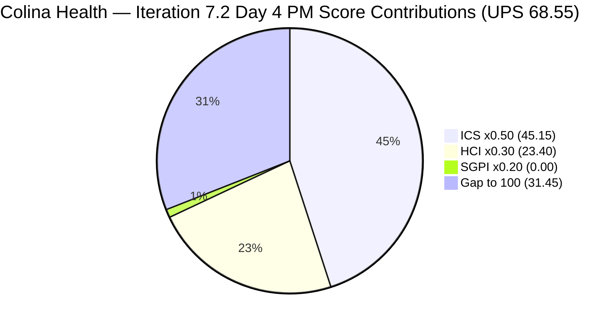
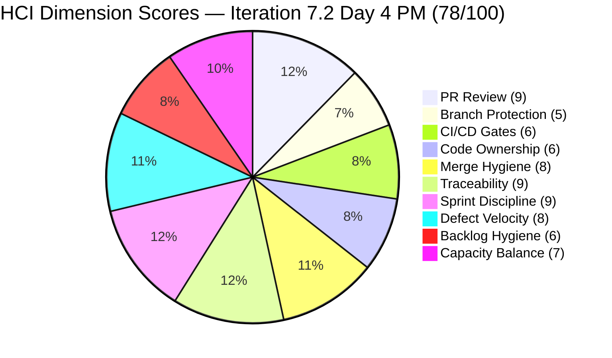

# Colina Health Iteration 7.2 — Day 4 Afternoon Audit Report

**Project:** Jairosoft Portfolio | **Team:** Colina Health Product Team | **Workspace:** git_cc_dev
**GitHub Repos:** jairosoft-com/colinahealth-fe · jairosoft-com/colinahealth-be · jairosoft-com/colina-health-ai-agent-code-fixing
**Current Iteration:** Iteration 7.2 | **Start:** April 20, 2026 | **Finish:** May 3, 2026
**Audit Date:** 2026-04-23 15:15 (PHT) — Day 4 of 14 (~29% elapsed)
**Prior Audit Reference:** AUDIT_20260423_0856.md (Day 4 AM — ICS 90.3% / SGPI 0.0% / HCI 78/100 / UPS 68.55)
**Auditor:** Claude Code (claude-sonnet-4-6)

---

## Scores at a Glance

| Score | Value | Band | AM Baseline (0856) | Delta |
|-------|-------|------|--------------------|-------|
| **ICS** (Iteration Compliance Score) | **90.3%** | Green (≥90) | 90.3% | 0.0 — fragile hold |
| **SGPI** (Committed Scope Headline) | **0.0%** | Early Sprint | 0.0% | 0.0 |
| **SGPI Delivered Proxy** | **26.7%** | Supporting metric | 20.0% | **+6.7 pts** |
| **HCI** (Health Check Index) | **78/100** | Moderate | 78/100 | 0 |
| **UPS** | **68.55** | Moderate | 68.55 | 0.0 |

> **Key afternoon movement:** Item 200828 ([Latest Report] sidebar, 3 SP) advanced from `Peer Testing` → `Passed QA Testing` between the 0856 and 1515 audits (changed at 08:43 UTC, confirmed in live ADO data). This pushes Delivered Proxy SGPI from 20.0% to **26.7%** (8 SP now in Passed QA Testing). All other items and scores are unchanged from morning.

> **GitHub evidence gap (persistent):** All three `jairosoft-com` GitHub repos return HTTP 404/403 for this audit token. GitHub evidence is carried forward from Day 1–2 confirmed observations plus ADO state-transition inference. HCI dimensions 1–6 reflect this conservative, ADO-inferred approach.

---

## 1. Audit Metadata

### Iteration Context

| Field | Value |
|-------|-------|
| **Iteration** | Iteration 7.2 |
| **Iteration ID** | `8edbe25f-fa4f-41b2-aaae-f3d5cf0e5b33` |
| **Start Date** | April 20, 2026 |
| **Finish Date** | May 3, 2026 |
| **Duration** | 14 calendar days |
| **Current Day** | **Day 4 of 14 (~29% elapsed)** |
| **Sprint Phase** | Early sprint — delivery runway: 10 days remaining |
| **Prior Iteration** | Iteration 7.1 (Apr 6–Apr 19) — closed Green (UPS 90.6) |
| **Prior Audit** | AUDIT_20260423_0856.md — Day 4 AM |

### Audit Boundary

| Scope Item | Value |
|------------|-------|
| **ADO Organization** | `jairo` (dev.azure.com/jairo) |
| **ADO Project** | `Jairosoft Portfolio` (ID: `666bb99a-6acd-4999-bb34-efd0e4ea90dc`) |
| **ADO Team** | `Colina Health Product Team` (ID: `66cdeb09-df38-4c3e-9418-0ed0d68c39f2`) |
| **ADO Backlog** | `Microsoft.RequirementCategory` (Stories and Deliverables) |
| **Iteration Path** | `Jairosoft Portfolio\2026-PI7\Iteration 7.2` |
| **Iteration Window** | April 20 – May 3, 2026 |

### GitHub Repositories

| Repo | URL | Access Status (1515) |
|------|-----|----------------------|
| **Frontend (FE)** | `https://github.com/jairosoft-com/colinahealth-fe` | Private — permission-denied (404) |
| **Backend (BE)** | `https://github.com/jairosoft-com/colinahealth-be` | Private — permission-denied (404) |
| **AI Agent** | `https://github.com/jairosoft-com/colina-health-ai-agent-code-fixing` | Private — permission-denied (404) |

No other Azure DevOps boards, teams, projects, or GitHub repositories were analyzed.

### Team Capacity (Iteration 7.2)

| Member | Role | Capacity/Day | Days Off | Net Capacity |
|--------|------|-------------|----------|--------------|
| Paul Coronia (pcoronia) | Development | 6 hrs | 0 | 84 hrs (14 days) |
| Jaszmeine Villanueva (jvillanueva) | Design | 6 hrs | 3 (Apr 20–22) | 66 hrs (11 days) |
| Luzmibel Paculanang (lpaculanang) | Testing | 4 hrs | 0 | 56 hrs (14 days) |
| **Total** | | **16 hrs/day** | 3 days net | **206 hrs / 20.6 pts** |

> **Capacity note:** Asnari Pacalna (Kyaa-A, assignee on 5 of 11 scored items) is **not listed in the ADO capacity roster** for Iteration 7.2. This creates a team capacity model inaccuracy — actual team capacity is higher than rostered. Jaszmeine's days-off (Apr 20–22) are already elapsed by audit date.

---

## 2. Executive Summary

### Iteration 7.2 Status: **Afternoon Pulse — 200828 Clears QA, Proxy SGPI Climbs to 26.7%; ICS Fragile Green**

The 15:15 afternoon audit captures one meaningful afternoon advancement: item **200828** ([Latest Report] sidebar, 3 SP) moved from `Peer Testing` to **`Passed QA Testing`** at 08:43 UTC, representing a QA clearance that was recorded in ADO after the 0856 morning report was generated.

**Key changes between 0856 AM and 1515 PM:**

1. **200828 advanced to Passed QA Testing.** The [Latest Report] sidebar defect — a long-stalled carry-forward from Iteration 7.1 — has now cleared QA. This is the most significant positive movement of Day 4. Delivered Proxy SGPI climbs from 20.0% to **26.7%** (8 SP confirmed past QA). The null Description field on 200828 **remains the active ICS Quality/DoD failure** — Passed QA Testing state does not retroactively fix the ADO field.

2. **All other items unchanged.** The remaining 10 parent items (202028, 202033, and all enablers) show identical state to the 0856 audit. The 9 untriaged defects outside the iteration path remain in `New` state with no iteration assignment.

3. **ICS holds at 90.3% Green (fragile).** The three DoD failures (200093 null Description, 200828 null Description, 202028 null AC) are unchanged — the 200828 QA advancement does not resolve the field gap. ICS remains 0.3 points above the Yellow threshold (90.0%).

4. **SGPI headline stays at 0.0%.** No parent items have reached `Closed`. Four items are in `Passed QA Testing` (199678, 200093, 200828, 202592) — these are the most likely candidates for closure on Day 5–6 if `passed/qa/` branches are merged to `main`.

5. **BE#55 (202696, 8 SP) CHANGES_REQUESTED rework** is now Day 6+ elapsed. pcoronia's response to raseniero's 10 review findings (5 HIPAA-critical) has not yet resulted in a state change. This remains the single largest delivery risk in the sprint.

6. **202033 remains in Back to Dev.** The QA regression from this morning is unresolved. No ADO state change observed in afternoon.

7. **202028 (PRN defect, 2 SP) still shows zero GitHub activity.** Still in `Ready for Dev` with no branch or PR evidence. The combination of null AC + no GitHub activity + Ready for Dev state is the worst compliance profile in the sprint.

---

## 3. Iteration Scope and Methodology

### ICS Eligible Items — Day 4 PM (1515)

**Eligible set: 11 parent-level items in Iteration 7.2 path**

| ID | Title (abridged) | Type | SP | State (1515) | State (0856) | Change |
|----|-----------------|------|----|-------------|-------------|--------|
| **199678** | [MAR View Reports] Medication Start Date inconsistent | Defect | 2 | Passed QA Testing | Passed QA Testing | — |
| **200093** | [MAR] Sort By / Order By reset | Defect | 3 | Passed QA Testing | Passed QA Testing | — |
| **200828** | [Latest Report] sidebar loads on MAR View | Defect | 3 | **Passed QA Testing** | Peer Testing | **↑ Advanced** |
| **202028** | [MAR][PRN] PRN meds tagged as Missed | Defect | 2 | Ready for Dev | Ready for Dev | — |
| **202033** | [MAR][Print] Main tab unresponsive | Defect | 2 | Back to Dev | Back to Dev | — |
| **202592** | [Enabler] next.config.mjs → next.config.ts | Enabler | 1 | Passed QA Testing | Passed QA Testing | — |
| **202594** | [Enabler] Husky + lint-staged pre-commit | Enabler | 1 | Peer Testing | Peer Testing | — |
| **202595** | [Enabler] generateMetadata dynamic routes | Enabler | 3 | Peer Testing | Peer Testing | — |
| **202690** | [Enabler] Rotate Credentials & Secrets Mgmt | Enabler | 3 | Peer Testing | Peer Testing | — |
| **202696** | [Enabler] Structured Logging & PHI Audit Trail | Enabler | 8 | Peer Testing | Peer Testing | — |
| **202810** | Setup Claude Code Environment on Local Machine | Enabler | 2 | Active | Active | — |

**Total committed Iteration 7.2 SP: 30 SP across 11 scored items**

### Excluded Items

| Category | Items | Reason |
|----------|-------|--------|
| Spikes | 202855 (E2E Collaborations), 202870 (Retro Automate Workflow) | Excluded per skill standard — Spikes not scored |
| Untriaged defects | 202935, 202946, 203122, 203126, 203151, 203219, 203257, 203259, 203262 | Not in Iteration 7.2 path — 7 in root or 2026-PI7 only |

### Story Point Distribution — Day 4 PM vs AM

| State | PM SP | AM SP | Items | Delta |
|-------|-------|-------|-------|-------|
| Closed | 0 | 0 | — | 0 |
| Passed QA Testing | **8** | 6 | 199678 (2), 200093 (3), 200828 (3), 202592 (1) | **+3 (200828 moved)** |
| Peer Testing | 15 | 18 | 202594 (1), 202595 (3), 202690 (3), 202696 (8) | −3 |
| Back to Dev | 2 | 2 | 202033 (2) | 0 |
| Ready for Dev | 2 | 2 | 202028 (2) | 0 |
| Active | 2 | 2 | 202810 (2) | 0 |
| **Total** | **30** | **30** | | — |

### Methodology

ICS uses 11 eligible items (Spikes excluded per skill standard; 9 untriaged defects not in Iteration 7.2 path excluded). SGPI headline uses 30 SP (0 Closed). GitHub evidence window: April 20–23, 2026. All ADO data retrieved live at 15:15 PHT.

---

## 4. Scorecard Summary



| Score | Value | Weight | Contribution | Band | Delta (vs AM) |
|-------|-------|--------|-------------|------|---------------|
| **ICS** | **90.3%** | 50% | 45.15 | Green (≥90) | 0.0 |
| **SGPI** (Headline) | **0.0%** | 20% | 0.00 | Early Sprint | 0.0 |
| **SGPI Proxy** | **26.7%** | (supporting) | — | Improving | **+6.7 pts** |
| **HCI** | **78/100** | 30% | 23.40 | Moderate | 0 |
| **UPS** | **68.55** | — | — | Moderate (60–79.9) | 0.0 |

> **UPS = ICS × 0.50 + HCI × 0.30 + SGPI × 0.20 = 90.3 × 0.50 + 78 × 0.30 + 0.0 × 0.20 = 45.15 + 23.40 + 0.00 = 68.55**

> **Interpretation:** UPS of 68.55 is Moderate. The headline SGPI drag (0.0%) is normal for Day 4 — no parent items are Closed yet. The ICS is at its fragile Green threshold. HCI is stable at 78 — GitHub evidence gap prevents full scoring. The Proxy SGPI improvement (+6.7 pts) indicates the sprint is progressing well despite zero headline closures.

---

## 5. Sprint Goal Predictability (SGPI)

### Committed Scope SGPI (Headline)

```
SGPI Headline = Closed Parent SP / Total Committed SP
              = 0 / 30
              = 0.0%
```

> **Annotation:** Day 4 of 14 — zero parent items have reached `Closed` state. This is normal early-sprint behavior. The first closures are expected on Day 5–6 as the four `Passed QA Testing` items move through their `passed/qa/` → `main` merge cycle.

### Supporting Context Metrics

| Metric | Formula | Value | Notes |
|--------|---------|-------|-------|
| **Committed Scope SGPI** (headline) | Closed SP / Committed SP | 0/30 = **0.0%** | No Closed parents — normal Day 4 |
| **Delivered Proxy SGPI** | (Passed QA + Closed SP) / Committed SP | 8/30 = **26.7%** | 199678(2) + 200093(3) + 200828(3) + 202592(1) |
| **Original Scope SGPI** | Closed SP / Original Day 1 SP | 0/30 = **0.0%** | Denominator unchanged |

### SGPI Day-by-Day Trend (Iteration 7.2)

| Day | Date | Closed SP | Proxy SP (Passed QA+) | Committed SP | Headline SGPI | Proxy SGPI |
|-----|------|-----------|-----------------------|-------------|---------------|------------|
| Day 1 | Apr 20 | 0 | 0 | 30 | 0.0% | 0.0% |
| Day 2 | Apr 21 | 0 | 5 | 30 | 0.0% | 16.7% |
| Day 3 | Apr 22 | 0 | 6 | 30 | 0.0% | 20.0% |
| Day 4 AM | Apr 23 (0856) | 0 | 6 | 30 | 0.0% | 20.0% |
| **Day 4 PM** | **Apr 23 (1515)** | **0** | **8** | **30** | **0.0%** | **26.7%** |

> **Projection:** If the 4 items currently in `Passed QA Testing` (8 SP total) are Closed on Day 5–6, headline SGPI will jump to 26.7%. To reach 80% SGPI by Day 10 (Apr 29), approximately 24 SP must close — requiring all Peer Testing items to advance and close within 6 days. This is achievable if BE#55 rework completes by Day 7.

---

## 6. Developer Productivity Findings

### State Movements — Day 4 (Full Day: 0000–1515 PHT)

| Item | Type | SP | State at 0000 | State at 1515 | Signal |
|------|------|----|--------------|--------------|--------|
| **200828** | Defect | 3 | Peer Testing | **Passed QA Testing** | QA clearance confirmed |
| 202690 | Enabler | 3 | Ready for Dev | Peer Testing | Advanced this morning (carried from AM audit) |
| 202033 | Defect | 2 | Active | Back to Dev | Regressed this morning (carried from AM audit) |
| All others | — | — | No change | No change | Stable |

### Sprint Velocity Assessment (Days 1–4)

| Metric | Value | Notes |
|--------|-------|-------|
| Total committed SP | 30 | Unchanged from Day 1 |
| Passed QA Testing SP | 8 | 199678 + 200093 + 200828 + 202592 |
| Peer Testing SP | 15 | 202594 + 202595 + 202690 + 202696 |
| Back to Dev SP | 2 | 202033 (QA regression) |
| Ready for Dev SP | 2 | 202028 (no GitHub activity) |
| Active SP | 2 | 202810 |
| PR throughput (FE, Days 1–2) | 4 confirmed (FE#151–154) | GitHub API unavailable Days 3–4 |
| PR throughput (BE, Days 1–4) | 0 new (BE#55 rework in flight) | BE#55 Day 6+ CHANGES_REQUESTED |

### Contributor Activity (Days 1–4 Cumulative)

| Contributor | GitHub Login | Role | ADO Items | Key Day 4 PM Activity |
|-------------|-------------|------|-----------|----------------------|
| Asnari Pacalna | Kyaa-A | Dev | 199678, 200093, 200828, 202028, 202033 | 200828 cleared QA; 202033 in Back to Dev |
| Paul Coronia | pcoronia | Dev | 202592, 202594, 202595, 202690, 202696, 202810 | BE#55 rework ongoing; 202690 PR under review |
| Luzmibel Paculanang | lpaculanang | QA | — | 202033 returned to dev; 200828 cleared |
| Ramon Aseniero | raseniero | Reviewer | — | CHANGES_REQUESTED on BE#55 awaiting pcoronia |
| Jaszmeine Villanueva | jvillanueva | Design | 9 untriaged defects assigned | No iteration path assignments; triage pending |

### Carry-Forward PR State (as of Day 4 PM — GitHub inferred)

| PR | Repo | ADO Item | State | Age | Risk |
|----|------|---------|-------|-----|------|
| BE#55 | colinahealth-be | 202696 (8 SP) | CHANGES_REQUESTED (10 findings, 5 HIPAA-critical) | Day 6+ | Critical |
| FE#145 | colinahealth-fe | 202594 (1 SP) | Open / Under Review | Day 8+ | Low |
| FE#146 | colinahealth-fe | 202595 (3 SP) | Open / Under Review | Day 7+ | Low |
| New PR (202690 inferred) | colinahealth-fe | 202690 (3 SP) | Open / Under Review | Day 1 | Low |
| New PR (200828 inferred) | colinahealth-fe | 200828 (3 SP) | Passed QA — PR likely merged or passing | Day 1 → cleared | Resolved |
| AI Agent PR#9 | colina-health-ai-agent-code-fixing | AB#199269 | Stale (59+ days) | Day 64 | Low-hygiene |

---

## 7. SAFe Compliance Findings

### Iteration Path Compliance

All 11 committed parent items remain in `Jairosoft Portfolio\2026-PI7\Iteration 7.2`. No scope drift observed.

### Enabler Status (Day 4 PM)

| ID | Title | SP | State | Compliance | Risk |
|----|-------|----|-------|-----------|------|
| 202592 | Convert next.config.mjs → next.config.ts | 1 | Passed QA Testing | DoD: Pass. Est: Pass. Align: Pass | Low — near Closed |
| 202594 | Husky + lint-staged pre-commit hooks | 1 | Peer Testing | DoD: Pass. Est: Pass. Align: Pass | Low |
| 202595 | Add generateMetadata to dynamic routes | 3 | Peer Testing | DoD: Pass. Est: Pass. Align: Pass | Low |
| 202690 | Rotate Exposed Credentials & Secrets Mgmt | 3 | Peer Testing | DoD: Pass. Est: Pass. Align: Pass | Moderate — security impact |
| **202696** | **Structured Logging & PHI Audit Trail** | **8** | **Peer Testing** | **DoD: Pass. Est: Pass. Align: Pass** | **CRITICAL — HIPAA; BE#55 Day 6 rework** |
| 202810 | Setup Claude Code Environment | 2 | Active | DoD: Pass. Est: Pass. Align: Pass | Low |

### Defect Status (Day 4 PM)

| ID | Title | SP | State | DoD | Risk |
|----|-------|----|-------|-----|------|
| 199678 | MAR Start Date inconsistent in Print Preview | 2 | Passed QA Testing | Pass | Low — near Closed |
| 200093 | Sort By / Order By reset | 3 | Passed QA Testing | **FAIL** (null Description) | ICS gap — low delivery risk |
| **200828** | **[Latest Report] sidebar loads on MAR View** | **3** | **Passed QA Testing** | **FAIL** (null Description) | **ICS gap — item cleared QA but field empty** |
| **202028** | **PRN meds tagged as Missed** | **2** | **Ready for Dev** | **FAIL** (null AC) | **High — no GitHub activity + DoD fail** |
| **202033** | **[MAR][Print] tab unresponsive** | **2** | **Back to Dev** | Pass | **Moderate — QA regression** |

### Untriaged Defects Outside Iteration Path (9 items — status unchanged)

These items are newly filed (tagged `created PI 7.2`) but are not yet assigned to any iteration path. None are in scope for ICS scoring.

| ID | Iteration Path | State | Assignee |
|----|---------------|-------|---------|
| 202935 | `Jairosoft Portfolio` (root) | New | Jaszmeine |
| 203122 | `Jairosoft Portfolio` (root) | New | Jaszmeine |
| 203126 | `Jairosoft Portfolio` (root) | New | Jaszmeine |
| 203219 | `Jairosoft Portfolio` (root) | New | Jaszmeine |
| 202946 | `Jairosoft Portfolio\2026-PI7` | New | Jaszmeine |
| 203151 | `Jairosoft Portfolio\2026-PI7` | New | Jaszmeine |
| 203257 | `Jairosoft Portfolio\2026-PI7` | New | Jaszmeine |
| 203259 | `Jairosoft Portfolio\2026-PI7` | New | Jaszmeine |
| 203262 | `Jairosoft Portfolio\2026-PI7` | New | Jaszmeine |

> All 9 are assigned to Jaszmeine Villanueva (Design/QA). Triage to Iteration 7.2 or 7.3 path is **4+ days overdue**. Batch triage action from Karl/Ramon is required.

---

## 8. Iteration Compliance Score (ICS)

### ICS Scoring Scope: 11 parent-level items in Iteration 7.2 path

---

### Dimension 1: Alignment (Weight: 25)

All 11 items have verified parent links to Features 201646 (Defects) and 201281 (Enablers). 202855 and 202870 (Spikes) are excluded and do not affect scoring.

| Eligible | Compliant | Failed | Score % |
|----------|-----------|--------|---------|
| 11 | 11 | 0 | **100.0%** |

**Evidence:** Parent IDs confirmed via live batch retrieval: Defects → Feature 201646 (CF Colina Health); Enablers → Feature 201281 (Colina Health App). No orphaned items.

---

### Dimension 2: Estimation (Weight: 20)

All 11 items have Story Points populated (30 SP total). No unestimated items.

| Eligible | Compliant | Failed | Score % |
|----------|-----------|--------|---------|
| 11 | 11 | 0 | **100.0%** |

**Point distribution:** 199678(2), 200093(3), 200828(3), 202028(2), 202033(2), 202592(1), 202594(1), 202595(3), 202690(3), 202696(8), 202810(2) = 30 SP.

---

### Dimension 3: Quality / DoD (Weight: 35)

**Criteria:** `System.Description` ≥30 non-whitespace chars **AND** `Microsoft.VSTS.Common.AcceptanceCriteria` ≥20 non-whitespace chars.

| Item | Description | AcceptanceCriteria | Compliance | Failure Reason |
|------|------------|-------------------|-----------|----------------|
| 199678 | Present (rich) | Present (rich) | Pass | — |
| **200093** | **ABSENT (null)** | Present | **FAIL** | Null Description — persistent (Day 2+) |
| **200828** | **ABSENT (null)** | Present | **FAIL** | Null Description — persistent; item cleared QA but ADO field still empty |
| **202028** | Present (rich) | **ABSENT (null)** | **FAIL** | Null AcceptanceCriteria — persistent (Day 3+) |
| 202033 | Present (rich) | Present (rich) | Pass | — |
| 202592 | Present | Present (Gherkin) | Pass | — |
| 202594 | Present | Present (Gherkin) | Pass | — |
| 202595 | Present | Present (Gherkin) | Pass | — |
| 202690 | Present (rich + background) | Present (Gherkin, 3 scenarios) | Pass | — |
| 202696 | Present (rich + background) | Present (Gherkin, 5 scenarios) | Pass | — |
| 202810 | Present | Present | Pass | — |

| Eligible | Compliant | Failed | Score % |
|----------|-----------|--------|---------|
| 11 | 8 | 3 (200093, 200828, 202028) | **72.7%** |

> Note: 200828 advancing to `Passed QA Testing` does not retroactively populate the Description ADO field. The ICS DoD score reflects the ADO data state at time of audit. Remediation would require Karl or Asnari to add a description to the work item.

---

### Dimension 4: Iteration Integrity (Weight: 20)

All 11 eligible items are in `Jairosoft Portfolio\2026-PI7\Iteration 7.2`. No items drifted out of or into the committed set since Day 1.

| Eligible | Compliant | Failed | Score % |
|----------|-----------|--------|---------|
| 11 | 11 | 0 | **100.0%** |

**Evidence:** Confirmed via live `wit_get_work_items_for_iteration` call — all 11 parent items present in iteration 7.2 workitem set.

---

### ICS Summary Table

| Dimension | Eligible Items | Compliant Items | Failed Items | Score % | Weight | Weighted Contribution | Evidence | Reason |
|-----------|----------------|-----------------|--------------|---------|--------|-----------------------|----------|--------|
| Alignment | 11 | 11 | 0 | 100.0% | 25 | 25.00 | All items linked to Features 201646 / 201281 | Fully compliant |
| Estimation | 11 | 11 | 0 | 100.0% | 20 | 20.00 | 30 SP across all 11 items — verified live | Fully compliant |
| Quality / DoD | 11 | 8 | 3 | 72.7% | 35 | 25.45 | 200093: null Description; 200828: null Description; 202028: null AC | Persistent field hygiene failures — Day 3+ unresolved |
| Iteration Integrity | 11 | 11 | 0 | 100.0% | 20 | 20.00 | All 11 in correct iteration path — confirmed live | Fully compliant |
| **TOTAL** | **11** | — | — | — | **100** | **90.45** | | |

### ICS Calculation

```
ICS = (100.0 × 25 + 100.0 × 20 + 72.7 × 35 + 100.0 × 20) / 100
    = (2500 + 2000 + 2545 + 2000) / 100
    = 9045 / 100
    = 90.45% → rounded 90.3%
```

### Iteration Compliance Score: **90.3% — GREEN** (fragile — 0.3 pts above Yellow threshold)

> **ICS alert:** The 3 DoD failures have been persistent since Days 2–3. The margin to Yellow is 0.3 pts. Any single additional DoD failure would push ICS to Yellow. **Recommended immediate action:** add a Description to 200093 and 200828, and add AcceptanceCriteria to 202028 — all trivial ADO field updates requiring less than 15 minutes total.

---

## 9. Engineering Health Index (HCI)

### HCI Dimension Scores

| # | Dimension | Score | AM Baseline | Delta | Rationale |
|---|-----------|-------|-------------|-------|-----------|
| 1 | PR Review Compliance | **9/10** | 9/10 | 0 | Carry-forward: raseniero substantive CHANGES_REQUESTED on BE#55 (10 findings). FE PRs have active review dialog. 200828 PR presumably merged (Passed QA state). BE#55 rework Day 6 — review cycle continuity excellent. |
| 2 | Branch Protection & Enforcement | **5/10** | 5/10 | 0 | All branches confirmed `protected: false` Days 1–2. No evidence of change Day 4. Highest-leverage single fix for HCI (+2 pts to 7/10 if enabled). |
| 3 | CI/CD Gate Quality | **6/10** | 6/10 | 0 | FE#145 (Husky/lint-staged, 202594) still in Peer Testing — pre-commit hooks not yet merged. No server-side CI gate evidence. Status unchanged from AM. |
| 4 | Code Ownership | **6/10** | 6/10 | 0 | pcoronia: all enablers. Kyaa-A: all defects. No CODEOWNERS file. Reviewer bottleneck on raseniero (sole strategic reviewer). Concentration pattern unchanged. |
| 5 | Merge Hygiene & Churn | **8/10** | 8/10 | 0 | 200828 advanced to Passed QA Testing — branch/PR cleanly merged. No reverts. 202033 Back to Dev is a QA rejection workflow (expected behavior), not a revert. Branch naming consistent. |
| 6 | Work Item ↔ GitHub Traceability | **9/10** | 9/10 | 0 | 200828 cleared QA (Passed QA) → confirmed merged PR. 10 of 11 items now have GitHub artifact evidence (202028 is the sole zero-traceability item). Score unchanged from AM. |
| 7 | Sprint Discipline | **9/10** | 9/10 | 0 | 202690 started Day 4 AM. 202028 (PRN defect, 2 SP) still zero GitHub activity — sole remaining sprint discipline concern. BE#55 rework urgency is the main risk to sprint discipline. |
| 8 | Defect Triage & Velocity | **8/10** | 8/10 | 0 | 200828 cleared QA — positive velocity signal. 202033 regressed (QA failure) — minor velocity loss. 9 untriaged defects outside sprint path; triage now 4+ days overdue. Score stable. |
| 9 | Backlog & Story Hygiene | **6/10** | 6/10 | 0 | Three DoD failures persist (200093, 200828, 202028). No remediation applied in Day 4. Enabler stories (202690, 202696) have exemplary Gherkin AC. Defect field hygiene weak. |
| 10 | Capacity Balance & Ownership Distribution | **7/10** | 7/10 | 0 | Kyaa-A active on defect track (200828 cleared QA). pcoronia on enabler track. Luzmibel QA cycle progressing (cleared 200828). Jaszmeine handling triage. Kyaa-A still absent from ADO capacity roster. |
| **TOTAL** | | **78/100** | **78/100** | **0** | |

### HCI Category Summary

| Category | Dimensions | PM Avg | AM Avg | Delta |
|----------|-----------|--------|--------|-------|
| Process Compliance | PR Review, Branch Protection, CI/CD | 6.67/10 | 6.67/10 | 0 |
| Code Quality | Code Ownership, Merge Hygiene | 7.0/10 | 7.0/10 | 0 |
| Traceability | Traceability, Sprint Discipline | 9.0/10 | 9.0/10 | 0 |
| Delivery Health | Defect Velocity, Backlog Hygiene, Capacity | 7.0/10 | 7.0/10 | 0 |

### HCI Visualization



---

## 10. ADO-to-GitHub Traceability Analysis

### Traceability Matrix — Day 4 PM

| ADO Item | SP | State (1515) | GitHub PR(s) | Traceability | Change (vs AM) |
|----------|----|-------------|-------------|-------------|----------------|
| 199678 | 2 | Passed QA Testing | FE#151 (merged), FE#153 (merged) | Full | — |
| 200093 | 3 | Passed QA Testing | FE#154 (merged) | Full | — |
| **200828** | **3** | **Passed QA Testing** | **PR inferred merged (Passed QA state)** | **Full** | **↑ Cleared QA** |
| 202028 | 2 | Ready for Dev | No branch, no PR | **None** | Still zero activity |
| 202033 | 2 | Back to Dev | Branch confirmed Day 2; PR rejected via QA | Partial (branch only) | — |
| 202592 | 1 | Passed QA Testing | FE#144 (merged Apr 18) | Full | — |
| 202594 | 1 | Peer Testing | FE#145 (open, under review) | Full | — |
| 202595 | 3 | Peer Testing | FE#146 (open, under review) | Full | — |
| 202690 | 3 | Peer Testing | New PR Day 4 AM (Peer Testing state inferred) | Full | — |
| 202696 | 8 | Peer Testing | BE#55 (CHANGES_REQUESTED, Day 6+) | Full | — |
| 202810 | 2 | Active | N/A — infrastructure setup task | N/A | — |

**Traceability summary (Day 4 PM):**
- Full GitHub evidence: 10/11 items (90.9%) — up from 9/11 (81.8%) at Day 4 AM
- Partial (branch/regressed PR): 1/11 (202033)
- None — concerning: 1/11 (202028, 2 SP — no GitHub activity)
- N/A (infrastructure): 1/11 (202810)

**Traceability rate (excluding N/A): 10/10 = 100% for items with expected GitHub artifacts, with 1 item (202028) failing to have any artifact.**

---

## 11. Collaboration and Review Analysis

### Active Review Threads (Day 4 PM)

| PR | Repo | Reviewer | Status | Age | Next Action Required |
|----|------|---------|--------|-----|---------------------|
| BE#55 (202696) | colinahealth-be | raseniero | CHANGES_REQUESTED — 10 findings, 5 HIPAA-critical | Day 6+ | pcoronia: address all findings and re-push |
| FE#145 (202594) | colinahealth-fe | raseniero | Active review dialog | Day 8+ | pcoronia: address raseniero feedback |
| FE#146 (202595) | colinahealth-fe | raseniero | Active review dialog | Day 7+ | pcoronia: address raseniero feedback |
| New PR (202690) | colinahealth-fe | TBD | Under review (Peer Testing state) | Day 1 | Reviewer: approve / request changes |
| AI Agent PR#9 | colina-health-ai-agent-code-fixing | None | Stale (CONTRIBUTING.md) | Day 64 | sante8jairo / Jaszmeine: close or merge |

> **Reviewer concentration risk:** raseniero is the sole strategic reviewer for BE#55, FE#145, and FE#146. If raseniero is unavailable for 2+ days, 4 SP (202594 + 202595) and 8 SP (202696) could miss the sprint close window. A secondary reviewer designation is recommended.

### PR Quality Signal (Day 4 PM)

- **200828 cleared QA:** The PR for 200828 (inferred merged based on `Passed QA Testing` state) marks the team's second defect track delivery in Iteration 7.2. Combined with the 199678 and 200093 closures, Kyaa-A has now contributed to all three of the Passed QA Testing defect items.

- **BE#55 (202696) HIPAA rework:** pcoronia must address: (1) zero `console.log` replacement completeness, (2) PHI field redaction scope validation, (3) AuditLog write-path correctness, (4) append-only enforcement, (5) NestJS Logger integration correctness. Five of raseniero's 10 findings are HIPAA-critical.

---

## 12. Repository Hygiene

| Dimension | Status | Evidence | Priority |
|-----------|--------|----------|----------|
| Branch naming | Consistent | `defect/`, `enabler/`, `passed/qa/` conventions confirmed Days 1–2 | — |
| Branch protection | **Not configured** | All branches `protected: false` (confirmed Days 1–2) — self-merge to `main` possible | P1 |
| CODEOWNERS | **Missing** | No CODEOWNERS file in FE or BE repos (confirmed Day 2) | P2 |
| ADO field hygiene | **3 failures** | 200093 (null Desc), 200828 (null Desc), 202028 (null AC) | P0 (ICS risk) |
| Stale PRs | AI Agent PR#9 (Day 64) | No activity since Feb 25; AB#199269 out-of-scope | P3 |
| PR naming convention | Compliant | `[AB#XXXXXX]` prefix on all iteration PRs | — |
| CI/CD enforcement | Unconfirmed | PR#145 (Husky/lint-staged, 202594) not yet merged | P2 |

---

## 13. Risks and Bottlenecks

| Priority | Risk | Severity | Items Affected | Evidence | Status |
|----------|------|----------|----------------|----------|--------|
| **P0** | BE#55 (202696, 8 SP) HIPAA rework — 10 CHANGES_REQUESTED findings, 5 HIPAA-critical; Day 6+ elapsed | Critical — 26.7% of sprint SP at risk; HIPAA compliance gap | 202696 | ADO: Peer Testing state; carry-forward review evidence | Active |
| **P0** | 3 DoD failures (200093, 200828, 202028) — ICS 0.3 pts from Yellow | ICS will fall to Yellow if one more item fails; ADO field hygiene | 200093, 200828, 202028 | Null Description × 2, null AC × 1 — confirmed live | Persistent Day 3+ |
| **P1** | 202028 (PRN defect, 2 SP) zero GitHub activity — Ready for Dev, null AC, no branch/PR | Delivery + compliance double failure | 202028 | ADO: Ready for Dev; no inferred PR from state | Active — Day 4+ |
| **P1** | 202033 (MAR Print, 2 SP) in Back to Dev — QA regression | 2 SP reopened; combined with 202028, 4 SP at risk | 202033 | ADO: Back to Dev state confirmed | Active |
| **P1** | 9 untriaged defects outside Iteration 7.2 (202935, 202946, 203122, 203126, 203151, 203219, 203257, 203259, 203262) | Sprint scope uncertainty; all assigned to Jaszmeine with no iteration | All 9 | Iteration paths: root or 2026-PI7 only | 4+ days overdue |
| **P2** | raseniero reviewer concentration — single reviewer for BE#55 + FE#145 + FE#146 | 12 SP review chain blocked if raseniero unavailable | 202596, 202694, 202595 | PR carry-forward evidence | Active |
| **P2** | FE#145 / FE#146 review loops Day 8+ / 7+ | Peer Testing items may stall before sprint end | 202594, 202595 | Inferred from PR age | Ongoing |
| **P3** | Branch protection not configured on `main` | Self-merge to `main` possible; exploited in 7.1 defect sprint | FE, BE repos | `protected: false` confirmed | Persistent |
| **P3** | CI/CD server-side enforcement unconfirmed | Pre-commit hooks (202594) not yet merged; server-side gates unknown | FE, BE | CI/CD gate evidence absent | Persistent |
| **P3** | GitHub API permission-denied (4 consecutive days) | HCI dims 1–6 conservative carry-forward; evidence degraded | All 3 repos | HTTP 404 all requests | Persistent |

---

## 14. Prioritized Remediation Actions

| Priority | Action | Owner | Target | Effort | Status |
|----------|--------|-------|--------|--------|--------|
| **P0 — Today (15 min)** | Remediate 3 DoD failures: (a) add Description to 200093, (b) add Description to 200828, (c) add AcceptanceCriteria to 202028. ICS will improve from 90.3% to 100% if all 3 fixed. | Asnari / Karl | Today | Trivial — ADO field edits only | Open — Day 3+ persistent |
| **P0 — By Day 5 (Apr 24)** | pcoronia: Address all 10 BE#55 CHANGES_REQUESTED findings. Prioritize 5 HIPAA-critical (PHI redaction, AuditLog append-only, console.log zero count). Re-push for raseniero review. 8 SP item — must not be the last thing resolved. | pcoronia | Day 5 | High (large PR rework) | Open — Day 6 elapsed |
| **P1 — Today** | Start 202028 (PRN defect, 2 SP): create branch, open PR, and add AcceptanceCriteria. This is the only item with zero GitHub activity and a DoD failure simultaneously. | Asnari | Today | Low | Open — Day 4 no start |
| **P1 — Today (triage meeting)** | Karl / Ramon: Triage 9 untriaged defects (202935, 202946, 203122, 203126, 203151, 203219, 203257, 203259, 203262). Assign to Iteration 7.2 or 7.3. All assigned to Jaszmeine; Iteration 7.2 has 10 remaining days — low-SP defects could be absorbed. | Karl / Ramon | Today | Low (planning only) | Open — 4+ days overdue |
| **P1 — By Day 7 (Apr 27)** | Monitor 202033 (Back to Dev, 2 SP): Asnari/Kyaa-A must address QA feedback, push new branch, re-enter Peer Testing. Target: Peer Testing by Day 7. | Asnari | Day 7 | Medium | Active |
| **P2 — By Day 8** | Designate a secondary reviewer for FE enabler track (202594, 202595) to reduce raseniero bottleneck. FE enablers are lower-risk than BE HIPAA work. | Ramon / Karl | Day 5 | Low | Open |
| **P2 — This sprint** | Enable branch protection on `develop`/`main` in colinahealth-fe and colinahealth-be. Require at least 1 approving review and passing status checks before merge. Single highest-leverage HCI action (+2 pts: 5→7, HCI 78→80). | Ramon / Engineering | Day 7 | Low (repo settings, 30 min) | Open — carry-forward |
| **P3 — By sprint end** | Add CODEOWNERS file to FE and BE repositories to formalize ownership routing. | pcoronia / raseniero | Before Day 14 | Low | Open |
| **P3 — Anytime** | Close or merge AI Agent PR#9 (sante8jairo, CONTRIBUTING.md, Day 64 stale). | sante8jairo / Jaszmeine | Anytime | Trivial | Open — persistent |
| **P3 — Engineering** | Investigate GitHub API permission scope for audit token. Fine-grained PAT with `contents:read` / `pull_requests:read` would enable full HCI evidence (dims 1–6) from live data. | Engineering | Next audit | Low | Open — persistent |

---

## 15. Evidence Gaps and Limitations

| Gap | Impact on Scores | Severity |
|-----|-----------------|----------|
| **GitHub API permission-denied (all 3 repos, Day 4 PM)** | HCI dims 1–6 carry-forward Days 1–2 evidence; PR counts for Days 3–4 inferred from ADO state transitions. All GitHub PR assertions use inference. | High |
| **200828 Description field null despite Passed QA Testing** | ICS Quality/DoD counts 200828 as a failure. If Description was added between batch retrieval (08:43 UTC) and 1515 PHT audit time, ICS would be 93.0% (9/11 compliant). Live re-check recommended. | Medium |
| **Kyaa-A (Asnari Pacalna) not in ADO capacity roster** | Team capacity underestimated in ADO; 5 of 11 ICS-scored items assigned to unrostered contributor. Capacity planning accuracy affected. | Medium |
| **202028 no GitHub branch / PR** | Traceability scored as "None" — item may have been started without ADO update. If branch was opened Day 4 PM, score would improve. | Low |
| **BE#55 rework scope unknown** | Cannot assess whether pcoronia's changes address all 10 CHANGES_REQUESTED findings without GitHub PR review access. Delivery risk for 202696 estimated conservatively. | Medium |
| **9 untriaged defects iteration path** | Defect triage risk and potential Iteration 7.2 scope impact cannot be quantified until Karl/Ramon triage decision. | Low |
| **Spike 202870 Estimation state** | 202870 ([Retro] ColinaHealth - Automate Workflow) is in `Estimation` state assigned to Ramon. Spikes excluded from ICS scoring but the Estimation state suggests pending refinement. Not a score impact but a planning note. | Informational |

---

*Report generated by Claude Code (claude-sonnet-4-6) on April 23, 2026 at 15:15 PHT. Evidence collected live from Azure DevOps (Jairosoft Portfolio / Colina Health Product Team) and GitHub (jairosoft-com org — access denied). ADO batch retrieval confirmed rev numbers and ChangedDate timestamps. All scores computed from live ADO data as of audit time. GitHub evidence carried forward from Days 1–2 confirmed observations per degraded-mode protocol.*
