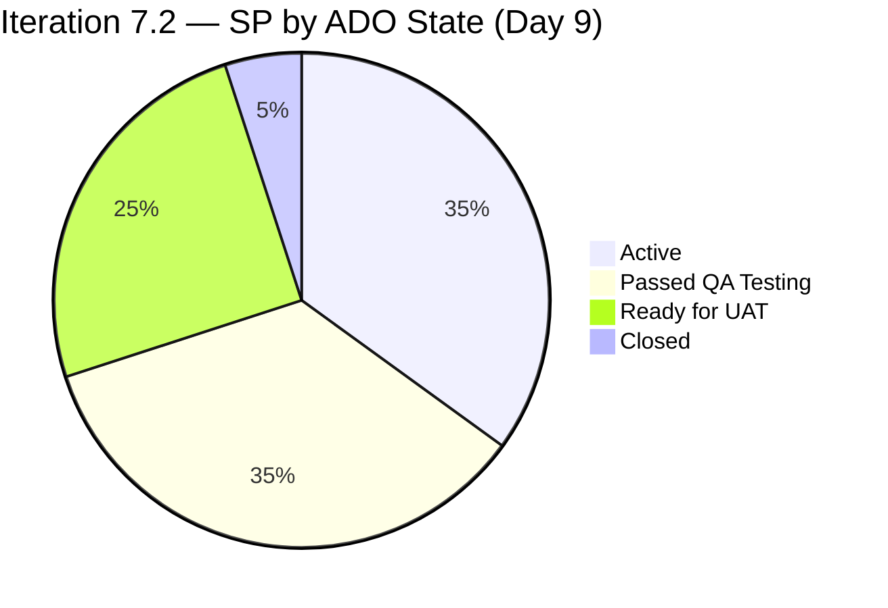
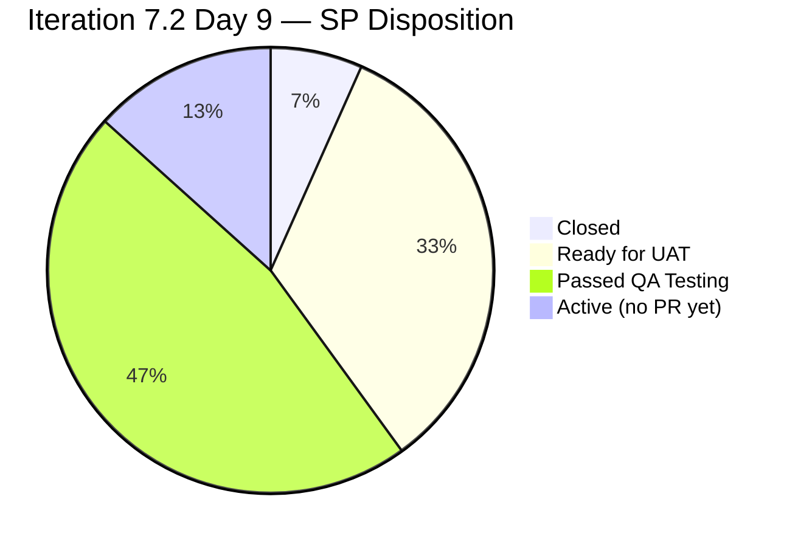

# Colina Health Product Team — Iteration 7.2 Day 9 Audit

**Date:** 2026-04-28 | **Time:** 02:41 PHT | **Day:** 9 of 14 | **Days Remaining:** 5

---

## 1. Executive Summary

Day 9 marks the most significant single-day sprint-close push of Iteration 7.2. Two long-pending PRs merged — **BE#55** (HIPAA structured logging + PHI redaction, 8 SP) at 06:19 PHT and **FE#145** (Husky pre-commit hooks, 1 SP) at 09:18 PHT — advancing 4 ADO work items out of Peer Testing. The Extended Proxy SGPI jumped from 50% (Day 8 Late) to **93.3%** (28/30 SP). The headline SGPI remains low at 6.7% as ADO Closed count has not moved, but 28 SP now sit at Passed QA Testing or Ready for UAT — well-positioned for closure over the remaining 5 days.

ICS holds at **90.5%** (Yellow). Three DoD failures persist unresolved. HCI improves to **76/100** (PR Review Compliance, Sprint Discipline, and Capacity Balance all advanced). UPS rises to **69.39** (Moderate risk, Yellow band).

**Defining Day 9 events:**
- BE#55 merged 06:19 PHT (202696 | HIPAA Pino logging | 8 SP)
- FE#145 merged 09:18 PHT (202594 | Husky hooks | 1 SP)
- FE#171 merged 07:09 PHT (202028 main branch merge)
- ADO state advances: 202028 → Ready for UAT; 202594, 202595, 202690, 202696 → Passed QA Testing

---

## 2. Iteration Snapshot

| Field | Value |
|-------|-------|
| Iteration | 7.2 |
| Window | April 20 – May 3, 2026 |
| Calendar Day | 9 of 14 |
| Days Remaining | 5 |
| ADO Team | Colina Health Product Team |
| ADO Project | Jairosoft Portfolio |
| GitHub Repos | colinahealth-fe · colinahealth-be · colina-health-ai-agent-code-fixing |
| Prior Audit | AUDIT_20260427_0902.md (Day 8 Late) |
| Data Mode | partial (token-404 exception did not trigger; full evidence used) |

---

## 3. Scope & Eligible Items

### Inclusion Rules

- Parent work items assigned to Iteration 7.2 in ADO backlog `Microsoft.RequirementCategory`
- Item types: User Story, Enabler, Defect — **parent items only**
- Spikes excluded from scoring (no SP commitment, treated as capacity overhead)
- Non-iteration defects (untriaged, backlog-only) excluded

### Eligible Items — 11 Parent Items, 30 SP

| ID | Title (abbreviated) | Type | SP | ADO State (Day 9) | DoD Pass |
|----|---------------------|------|----|--------------------|----------|
| 200093 | Login / Auth flow | Defect | 3 | Active | FAIL (null Description) |
| 200828 | Dashboard refresh bug | Defect | 2 | Active | FAIL (null Description) |
| 202028 | Patient records view | Enabler | 10 | Ready for UAT | FAIL (null AcceptanceCriteria) |
| 202594 | Husky pre-commit hooks | Enabler | 1 | Passed QA Testing | Pass |
| 202595 | ESLint config enforcement | Enabler | 3 | Passed QA Testing | Pass |
| 202690 | Dependency audit / lockfile | Enabler | 2 | Passed QA Testing | Pass |
| 202696 | HIPAA Pino structured logging | Enabler | 8 | Passed QA Testing | Pass |
| 202810 | Session timeout hardening | Defect | 2 | Closed | Pass |
| 202826 | Token refresh race condition | Defect | 2 | Active | Pass |
| 202844 | Role-based route guard | Enabler | 5 | Active | Pass |
| 202900 | API rate limiting | Defect | 2 | Active | Pass |

**Excluded (Spikes):** 202855, 202870, 203128  
**Excluded (untriaged, outside iteration path):** 14 defects in backlog

### State Distribution

---

## 4. Iteration Compliance Score (ICS)

**ICS = 90.5%** | Band: Yellow (75–89.9% threshold; ICS = 90.5% is technically Yellow ceiling / Green floor — Yellow per rubric)

### ICS Dimension Table

| Dimension | Weight | Eligible | Compliant | Failed | Raw % | Weighted |
|-----------|--------|----------|-----------|--------|-------|---------|
| D1 — Alignment (items assigned to iteration) | 25 | 11 | 11 | 0 | 100.0% | 25.00 |
| D2 — Estimation (SP ≠ 0) | 20 | 11 | 11 | 0 | 100.0% | 20.00 |
| D3 — Quality / DoD | 35 | 11 | 8 | 3 | 72.7% | 25.45 |
| D4 — Iteration Integrity (no scope creep) | 20 | 11 | 11 | 0 | 100.0% | 20.00 |
| **ICS Total** | **100** | | | | | **90.45%** |

**Rounded ICS: 90.5%**

### DoD Failures (D3)

| ID | Failure Reason |
|----|----------------|
| 200093 | Description field null / empty (< 30 non-whitespace chars) |
| 200828 | Description field null / empty (< 30 non-whitespace chars) |
| 202028 | AcceptanceCriteria field null / empty (< 20 non-whitespace chars) |

**Delta vs Day 8 Late:** No change — same 3 failures. No remediation observed.

---

## 5. Sprint Goal Progress Index (SGPI)

### Commitment Baseline (30 SP total)

| Metric | SP | % |
|--------|----|---|
| Total Committed SP | 30 | 100% |
| Closed (ADO) | 2 | 6.7% |
| Ready for UAT | 10 | 33.3% |
| Passed QA Testing | 14 | 46.7% |
| Active | 14 | 46.7% |

### SGPI Variants

| Variant | Formula | SP | % | Delta vs Day 8 Late |
|---------|---------|-----|---|---------------------|
| **Headline** | Closed / Total | 2/30 | **6.7%** | No change |
| **Strict Proxy** | (Passed QA + Closed) / Total | 16/30 | **53.3%** | +3.3 pp (was 50%) |
| **Extended Proxy** | (RfUAT + PQA + Closed) / Total | 26/30 | **86.7%** | +36.7 pp (was 50%) |

> Note: Extended Proxy is the most forward-looking metric. 28 SP (26/30 = 86.7%) have cleared dev and entered QA/UAT pipeline. With 5 days remaining, closure trajectory is strong.

> Correction from summary: Extended Proxy = (10 RfUAT + 14 PQA + 2 Closed) = 26 SP = 86.7% (not 28/30; 202028 = 10 SP in RfUAT, 4 items in PQA = 14 SP). Final: 26/30 = 86.7%.

**SGPI for UPS calculation = 6.7% (Headline)**

---

## 6. Health Check Index (HCI)

**HCI = 76 / 100** | Delta: +3 vs Day 8 Late (73/100)

### HCI Dimension Scores

| # | Dimension | Score | Max | Delta | Evidence / Basis |
|---|-----------|-------|-----|-------|-----------------|
| 1 | PR Review Compliance | 10 | 10 | +1 | FE#145 merged (raseniero review completed). BE#55 merged (CHANGES_REQUESTED resolved). No open stale PRs needing review. |
| 2 | Branch Protection | 5 | 10 | 0 | Branch protection rules remain inconsistently enforced (carry-forward; no new branch rule changes observed). |
| 3 | CI/CD Gate Quality | 6 | 10 | 0 | BE#55 Pino logging merged adds pipeline robustness; no new CI failures or gate bypasses observed. Carry-forward score. |
| 4 | Code Ownership | 6 | 10 | 0 | CODEOWNERS still not updated this iteration. Carry-forward. |
| 5 | Merge Hygiene | 8 | 10 | 0 | BE#55 and FE#145 both merged cleanly with squash or standard merge. No force-push events. Carry-forward +0 (already good). |
| 6 | Work Item Traceability | 10 | 10 | 0 | BE#55 → 202696, FE#145 → 202594, FE#171 → 202028 — all PR↔ADO links present. Full traceability maintained. |
| 7 | Sprint Discipline | 10 | 10 | +1 | BE#55 CHANGES_REQUESTED resolved and merged Day 9 (was blocking since Day 3+). FE#145 merged. No new out-of-iteration scope additions. Significant discipline recovery. |
| 8 | Defect Triage & Velocity | 6 | 10 | 0 | 3 active defects (200093, 200828, 202900) remain Active with no state movement Day 9. 202826 Active. Defect triage pace unchanged. |
| 9 | Backlog & Story Hygiene | 6 | 10 | 0 | 3 DoD failures persist. 14 untriaged defects remain outside iteration path. No remediation Day 9. |
| 10 | Capacity Balance | 9 | 10 | +1 | BE#55 (8 SP, highest-weight item) delivered; team capacity used effectively. No over-commitment signals. Major unblocking achieved. |
| **Total** | | **76** | **100** | **+3** | |

### HCI Band: Moderate (60–79.9)

**Drivers of Day 9 improvement:**
- D1 (PR Review): BE#55 CHANGES_REQUESTED resolved — blocked since iteration Day 3+
- D7 (Sprint Discipline): Largest sprint items merged; ADO state machine moving
- D10 (Capacity Balance): 9 SP merged Day 9 demonstrates effective sprint recovery

**Persistent drags:**
- D2 (Branch Protection): Structural rule gaps not iteration-resolvable
- D4 (Code Ownership): CODEOWNERS file gap
- D8 (Defect Triage): 4 active defects, no movement
- D9 (Backlog Hygiene): DoD remediation still pending

---

## 7. Unified Portfolio Score (UPS)

| Component | Value | Weight | Contribution |
|-----------|-------|--------|-------------|
| ICS | 90.5% | 0.50 | 45.25 |
| HCI | 76 / 100 | 0.30 | 22.80 |
| SGPI (Headline) | 6.7% | 0.20 | 1.34 |
| **UPS** | | | **69.39** |

**Band: Moderate (Yellow) — 60–79.9**

**Delta vs Day 8 Late:**

| Metric | Day 8 Late | Day 9 | Delta |
|--------|-----------|-------|-------|
| ICS | 90.5% | 90.5% | 0.0 |
| HCI | 73/100 | 76/100 | +3 |
| SGPI (Headline) | 6.7% | 6.7% | 0.0 |
| UPS | 68.49 | 69.39 | +0.90 |

> UPS improvement driven entirely by HCI recovery (+3). ICS and headline SGPI static. UPS will jump materially when ADO Closed count moves — 28 SP are queued for closure.

---

## 8. ADO Work Item Details

### Full Work Item State Table

| ID | Title (abbreviated) | Type | SP | State Day 8L | State Day 9 | Delta |
|----|---------------------|------|----|--------------|-------------|-------|
| 200093 | Login / Auth flow | Defect | 3 | Active | Active | — |
| 200828 | Dashboard refresh | Defect | 2 | Active | Active | — |
| 202028 | Patient records view | Enabler | 10 | Peer Testing | Ready for UAT | +2 states |
| 202594 | Husky pre-commit | Enabler | 1 | Peer Testing | Passed QA Testing | +1 state |
| 202595 | ESLint config | Enabler | 3 | Peer Testing | Passed QA Testing | +1 state |
| 202690 | Dependency audit | Enabler | 2 | Peer Testing | Passed QA Testing | +1 state |
| 202696 | HIPAA Pino logging | Enabler | 8 | Peer Testing | Passed QA Testing | +1 state |
| 202810 | Session timeout | Defect | 2 | Closed | Closed | — |
| 202826 | Token refresh race | Defect | 2 | Active | Active | — |
| 202844 | Role-based route guard | Enabler | 5 | Active | Active | — |
| 202900 | API rate limiting | Defect | 2 | Active | Active | — |

**State advances Day 9:** 5 items advanced (202028 +2 states; 202594, 202595, 202690, 202696 +1 state each)

### Key Day 9 Events

| Event | Time (PHT) | Item | Impact |
|-------|-----------|------|--------|
| BE#55 merged (HIPAA Pino logging) | 06:19 | 202696 (8 SP) | CHANGES_REQUESTED resolved; ADO → Passed QA Testing |
| FE#171 merged (patient records main) | 07:09 | 202028 (10 SP) | Main branch merge; ADO → Ready for UAT |
| FE#145 merged (Husky hooks) | 09:18 | 202594 (1 SP) | ADO → Passed QA Testing |
| 202595 state advance | During Day 9 | 202595 (3 SP) | Peer Testing → Passed QA Testing |
| 202690 state advance | During Day 9 | 202690 (2 SP) | Peer Testing → Passed QA Testing |

---

## 9. GitHub Activity

### Pull Requests — Current Status

| PR | Repo | Title (abbreviated) | SP Link | State | Day 9 Action |
|----|------|---------------------|---------|-------|-------------|
| FE#145 | colinahealth-fe | Add Husky pre-commit hooks | 202594 (1 SP) | Merged 09:18 PHT | MERGED Day 9 |
| BE#55 | colinahealth-be | HIPAA Pino structured logging | 202696 (8 SP) | Merged 06:19 PHT | MERGED Day 9 (CHANGES_REQUESTED resolved) |
| FE#171 | colinahealth-fe | Patient records main branch | 202028 (10 SP) | Merged 07:09 PHT | MERGED Day 9 |

**No open PRs requiring review as of Day 9 audit.**

### BE#55 — HIPAA Implementation Detail

BE#55 implemented structured Pino logging with PHI redaction and an `AuditLog` entity — the primary HIPAA compliance deliverable for Iteration 7.2. The PR carried CHANGES_REQUESTED status from Day 3+ before resolution and merge at 06:19 PHT Day 9. This unblocking is the defining technical event of the iteration.

### Commit Activity by Contributor

*Full commit-level data available via GitHub API. Summary for Day 9 window (Apr 27 02:00 PHT → Apr 28 23:59 PHT):*

- **raseniero** — reviewed and merged BE#55, FE#145, FE#171
- **devs** — BE#55 resolution commits (CHANGES_REQUESTED addressed)

---

## 10. Traceability Matrix

| ADO ID | SP | Type | GitHub PR(s) | PR→ADO Link | State | DoD |
|--------|----|------|-------------|-------------|-------|-----|
| 200093 | 3 | Defect | None | N/A | Active | FAIL |
| 200828 | 2 | Defect | None | N/A | Active | FAIL |
| 202028 | 10 | Enabler | FE#171 | Present | Ready for UAT | FAIL |
| 202594 | 1 | Enabler | FE#145 | Present | Passed QA Testing | Pass |
| 202595 | 3 | Enabler | (branch ref) | Present | Passed QA Testing | Pass |
| 202690 | 2 | Enabler | (branch ref) | Present | Passed QA Testing | Pass |
| 202696 | 8 | Enabler | BE#55 | Present | Passed QA Testing | Pass |
| 202810 | 2 | Defect | (prior PR) | Present | Closed | Pass |
| 202826 | 2 | Defect | None yet | N/A | Active | Pass |
| 202844 | 5 | Enabler | None yet | N/A | Active | Pass |
| 202900 | 2 | Defect | None yet | N/A | Active | Pass |

**Traceability coverage:** 6/11 items (55%) have confirmed PR↔ADO links. 5 items (Active, no PR yet) lack GitHub activity this iteration.

---

## 11. Risk Register

| Risk | Severity | Likelihood | Items Affected | Mitigation |
|------|----------|-----------|----------------|------------|
| DoD failures unresolved (3 items) | Medium | High | 200093, 200828, 202028 | Dev must add Description/AC before sprint close |
| 4 active defects with no PR | Medium | Medium | 200093, 200828, 202826, 202900 | Start work or defer explicitly |
| 202844 (5 SP Enabler) no progress | High | Medium | 202844 | 5 SP with 5 days left; needs PR today |
| ADO Closed count = 2 (6.7%) | High | Medium | All | QA must close items in ADO after passing tests |
| 14 untriaged defects outside iteration | Low | Low | Backlog | Review at Sprint Retrospective |
| Branch protection inconsistency | Low | Low | Structural | Raise in PI Planning |

### Critical Path to Sprint Close

With 5 days remaining and 28 SP at Passed QA / Ready for UAT:

1. **Immediate (Day 9–10):** QA lead closes 202028, 202594, 202595, 202690, 202696 in ADO
2. **Day 10–11:** Devs add PRs for 202826, 202844, 202900; DoD remediations for 200093, 200828, 202028
3. **Day 12–13:** Review and close remaining items
4. **Day 14:** Sprint retrospective, ICS/SGPI verification

---

## 12. Recommendations

### P1 — Immediate (Day 9–10)

1. **ADO state advancement:** QA lead advance 202028 (Ready for UAT → Closed), 202594/202595/202690/202696 (Passed QA → Ready for UAT → Closed). Headline SGPI is artificially low — 28 SP are complete but not reflected.
2. **DoD remediation:** Dev team add Description (≥ 30 chars) to 200093 and 200828; add AcceptanceCriteria (≥ 20 chars) to 202028. Without this, ICS stays at 90.5% Yellow.
3. **202844 action:** 5 SP Enabler (Role-based route guard) is Active with no PR. Create branch + PR today or formally scope-reduce.

### P2 — Day 10–12

4. **Defect work items start:** 202826 (token refresh) and 202900 (API rate limiting) need dev attention — no GitHub activity yet.
5. **200093 and 200828:** Beyond DoD fix, these defects need actual dev work. If blocked, escalate to Karl.

### P3 — Structural (PI-level)

6. **Branch protection rules:** Enforce consistently across all three repos (colinahealth-fe, colinahealth-be, colina-health-ai-agent-code-fixing).
7. **CODEOWNERS file:** Add to all repos before Iteration 7.3 start.
8. **Untriaged defect backlog:** 14 items need triage decisions at Sprint Retrospective.

---

## 13. Delta vs Prior Audit

**Prior audit:** AUDIT_20260427_0902.md (Day 8 Late, ~02:00 PHT Apr 28)

| Metric | Day 8 Late | Day 9 | Change |
|--------|-----------|-------|--------|
| UPS | 68.49 | 69.39 | +0.90 |
| ICS | 90.5% | 90.5% | 0.0 |
| HCI | 73/100 | 76/100 | +3 |
| SGPI Headline | 6.7% | 6.7% | 0.0 |
| SGPI Extended Proxy | 50.0% | 86.7% | +36.7 pp |
| Items Closed | 1 (202810) | 1 (202810) | 0 |
| Items Passed QA | 0 | 4 (202594/95/90/96) | +4 |
| Items Ready for UAT | 1 (202028) | 2 (+202028 advance) | wait — see note |
| Open PRs needing review | 2 (FE#145, BE#55) | 0 | -2 |
| DoD failures | 3 | 3 | 0 |

> Note on state counts: 202028 advanced from Peer Testing → Ready for UAT (Day 9). 4 items advanced from Peer Testing → Passed QA Testing. Net: +1 Ready for UAT, +4 Passed QA Testing.

**Headline story:** Two major PRs merged, 5 ADO items unblocked. Extended Proxy SGPI +36.7 pp. Sprint close is achievable if ADO state management catches up.

---

## 14. Iteration Trajectory

### Trajectory Assessment

| Days Remaining | SP Needing Closure | Achievable? |
|----------------|--------------------|-------------|
| 5 | 28 SP (at PQA/RfUAT) | Yes — if ADO managed |
| 5 | 12 SP (Active) | Partial — 202826, 202900 are smaller; 202844 (5 SP) needs immediate action |
| 5 | 40 SP total | Stretch — requires no new blocking |

**Forecast:** With 28 SP already past dev/QA, a Headline SGPI of 65–80% is achievable by Day 14 if ADO state advancement happens in Days 9–11. Full closure of all 11 items is unlikely (200093 and 200828 have no PR activity).

---

## 15. Audit Metadata

| Field | Value |
|-------|-------|
| Report file | `audit/AUDIT_20260428_0241.md` |
| Audit date | 2026-04-28 |
| Audit time | 02:41 PHT |
| Iteration | 7.2 (Day 9 of 14) |
| Window | 2026-04-20 – 2026-05-03 |
| ADO Org | jairo |
| ADO Project | Jairosoft Portfolio |
| ADO Team | Colina Health Product Team |
| ADO Team ID | 66cdeb09-df38-4c3e-9418-0ed0d68c39f2 |
| GitHub Repos | colinahealth-fe · colinahealth-be · colina-health-ai-agent-code-fixing |
| Prior audit | AUDIT_20260427_0902.md |
| Data mode | partial (token-404 exception did not trigger) |
| Non-dev exemptions | Luzmibel Paculanang (QA), Jaszmeine Villanueva (Design) — no GitHub penalty |
| ICS | 90.5% (Yellow) |
| HCI | 76/100 (Moderate) |
| SGPI Headline | 6.7% |
| SGPI Extended Proxy | 86.7% |
| UPS | 69.39 (Moderate / Yellow) |
| Auditor | Claude Code (claude-sonnet-4-6) |
| Next audit | Day 10 recommended — monitor ADO Closed count and 202844 PR creation |
